#### 1-函数参数
<br />

<br />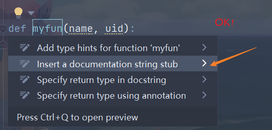<br />

<br>

#### 2-文件注释<br />

<br>

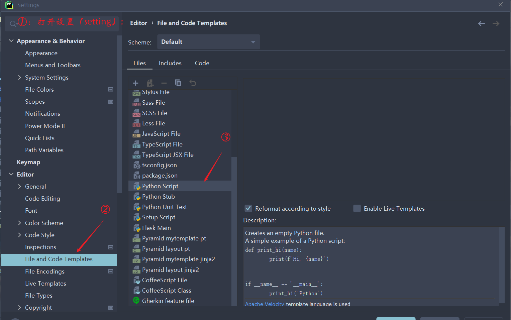


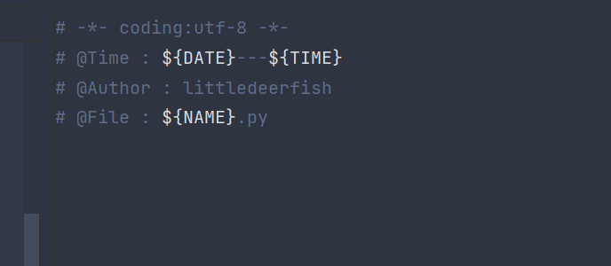

<br>

#### 3-批量替换


<br>

#### 4-提示忽略大小写

<br>

- 去掉这个勾
- 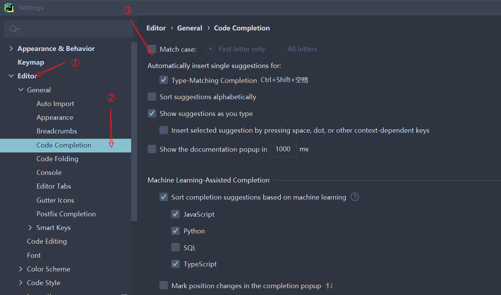

<br>

#### 5-修改默认函数文档格式

<br>

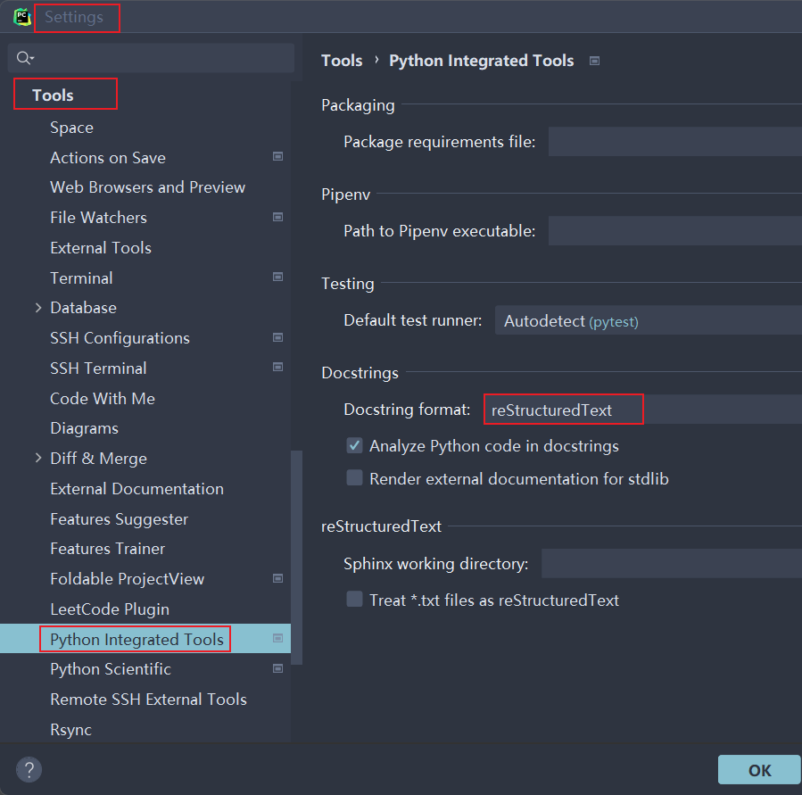<br />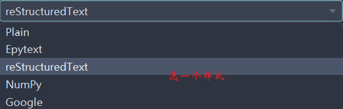

<br>

#### 6-多行选中编辑

<br>

`Edit`-->`Column Selection Mode`-->`勾选`，或者快捷键`Alt + Shift + Insert`。

<br>

#### 7-配置新建项目设置

<br>

`file`-->`New Projects Setup`-->`两个选项:`

   1. `Settings for New Projects...`：配置新建项目设置。
   2. `Run Configuration Templates ...`：设置运行配置模板。

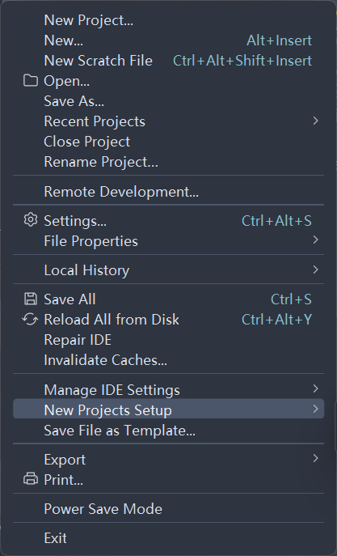<br />

<br>

#### 8-pycharm卡顿

<br>

##### a-示内存使用

<br>

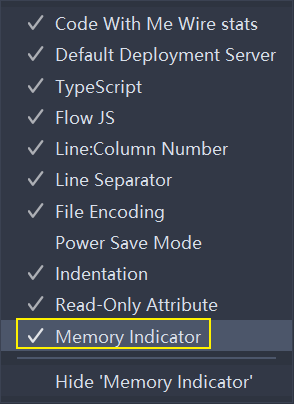<br />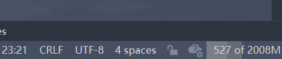

<br>

##### b-配置内存设置

<br>

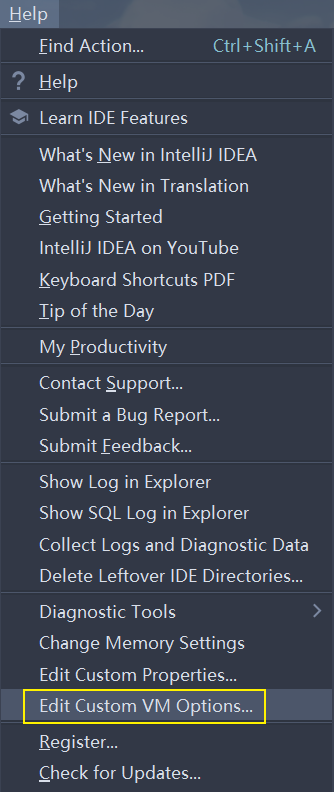<br />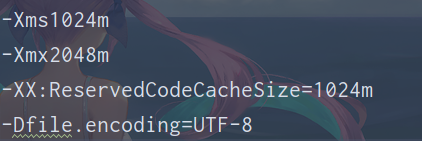

```xml
-Xms1024m
-Xmx2048m
-XX:ReservedCodeCacheSize=1024m
-Dfile.encoding=UTF-8
```
<br/>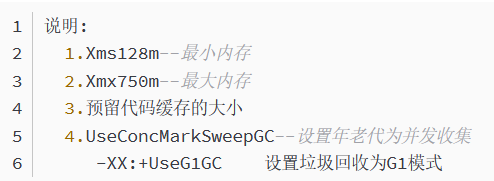

<br>

##### c-重启idea，清除缓存

<br>

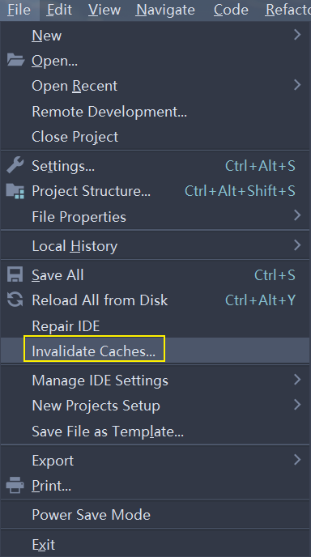<br />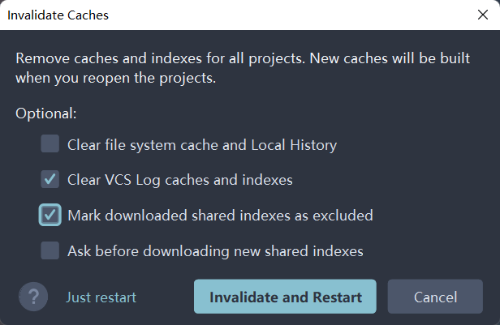

<br>

#### 9-行号、分隔符

<br>

`Settings`-->`Editor`-->`General`-->`Appearance`配置如下：<br />

<br>

#### 10-多行tab显示

<br>

`Settings`-->`Editor`-->`General`-->`Editor Tabs`配置如下：<br />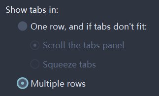

#### 11,模板
#### 12，插件

1.   力扣插件配置：

     1.   如图：<br>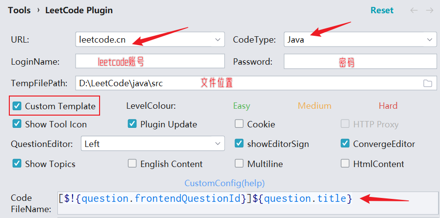

     2.   如下配置：

          ```java
          package leetcode.editor.cn;
          
          //${question.frontendQuestionId}: ${question.title}
          public class $!velocityTool.camelCaseName(${question.titleSlug}){
              public static void main(String[] args) {
          
                  Solution solution = new $!velocityTool.camelCaseName(${question.titleSlug})().new Solution();
          
              }
              ${question.code}
          }
          ```

2.   `power mode II`火花特效不知道为啥没了

3.   如下：<br>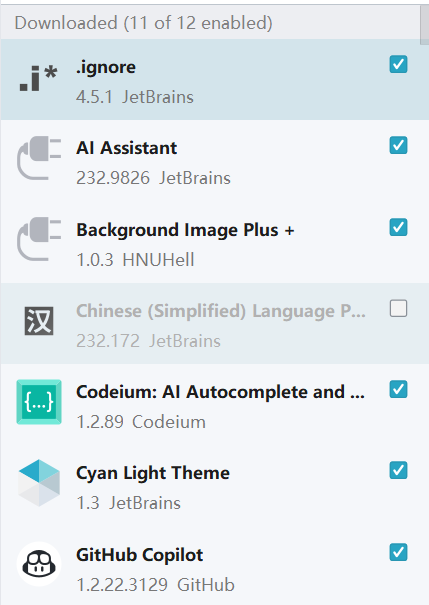

     <br>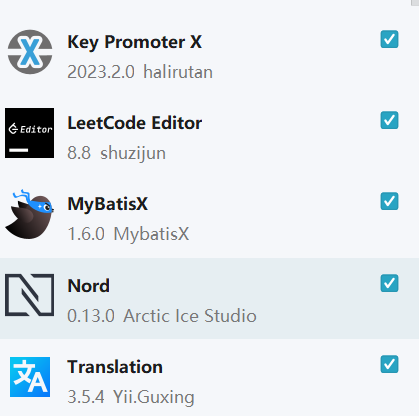

4.   `gitee`码云。

#### 13，自动导包

<br>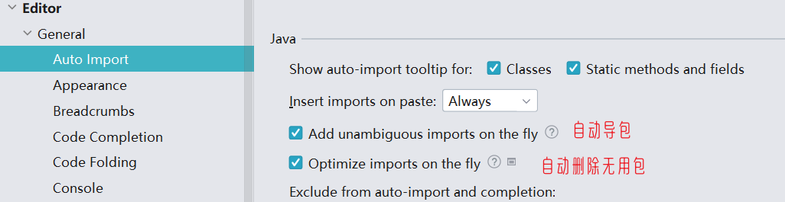


#### 14，待补<br />

<br>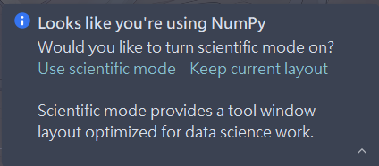


#### 15，安装步骤

1.   配置代码字体以及UI字体。

2.   配置字符编码:

3.   安装插件。

4.   配置主题，`cyan light`。

5.   配置模板代码片段：参考网上教程。

     1.   如下：<br>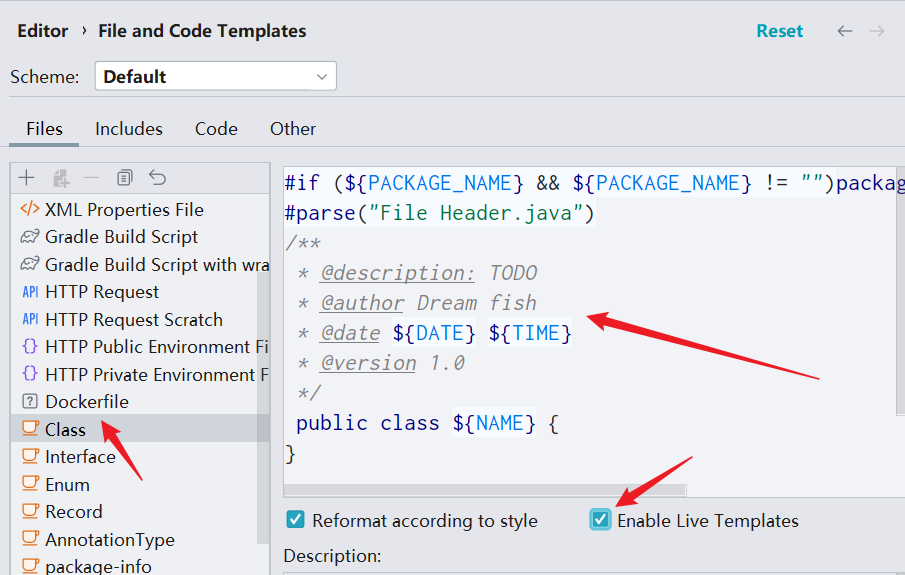

          ```tex
          /**
           * @description: TODO 
           * @author Dream fish
           * @date ${DATE} ${TIME}
           * @version 1.0
           */
          ```

          ```python
          # -*- coding: utf-8 -*-
          # @Author: Dream fish
          # @File: ${NAME}.py
          # @Time: ${DATE} ${TIME}
          
          if __name__ == '__main__':
              pass
          ```

     2.   如下：<br>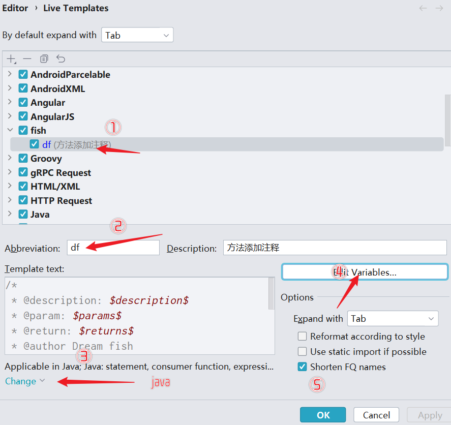

          <br>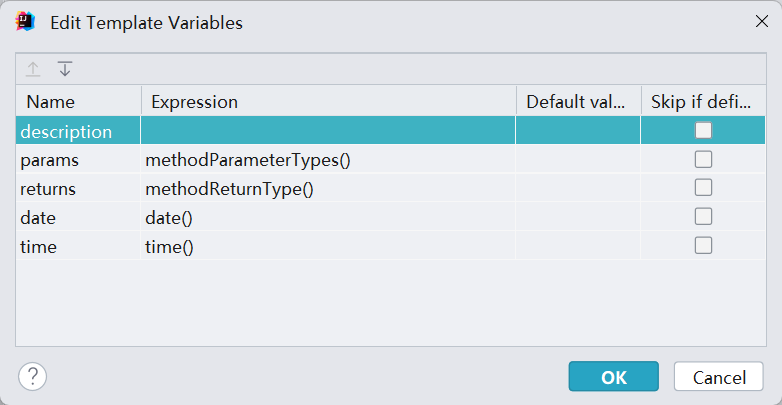

          ```tex
          /*
           * @description: $description$ 
           * @param: $params$ 
           * @return: $returns$ 
           * @author Dream fish
           * @date: $date$ $time$
           */ 
          ```

6.   悬浮显示文档：<br>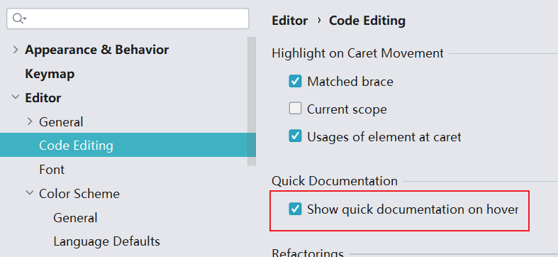

7.   配置项目初始化配置。
     1.   字符编码：<br>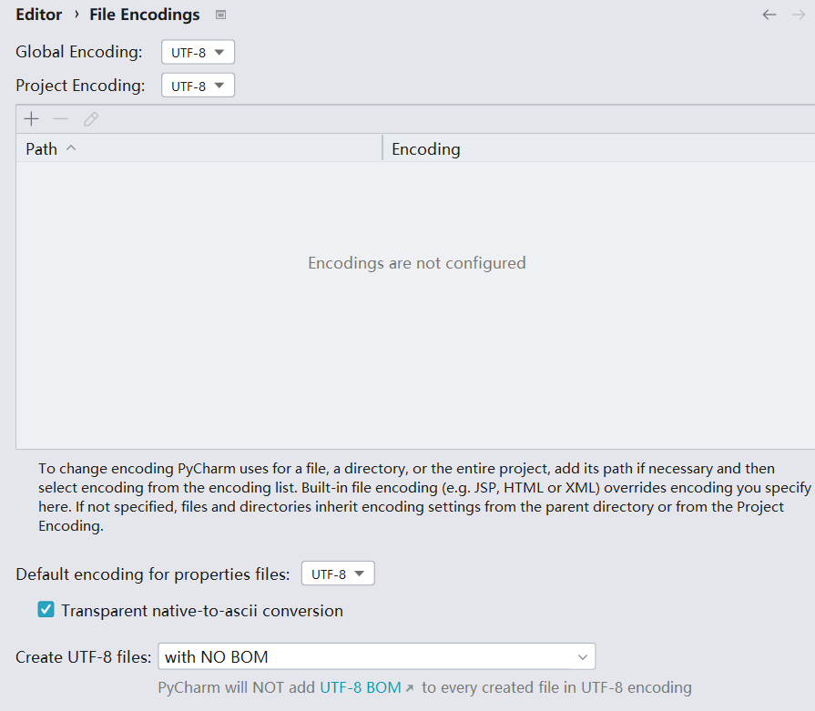
     2.   maven位置。
     3.   其它


#### 16,配置模板

1.   
