> > - python中尽量使用`and 、or`而非`& 、|`表示且、或。
> - `& 、|`在变量运算时，还被视作位运算，会对判断语句有影响。
> - Python中允许通过一些特殊的方法来为某种类型或数据结构自定义运算符（见面向对象）

```python
if __name__ == '__main__':
	x = 5
	y = 6
	j = x == 5 and y == 6   # True
	i = x == 5 & y == 6     # False
"""
会先result = 5 & y 位运算,然后判断 x == result == 6
"""
```

---

### 三元运算符

- 详细见：[语法糖](./7.语法糖.md)

<br>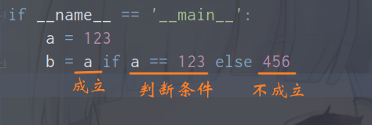

---

### divmod()函数

- 可同时获取商和余数，结果以元组形式返回。

  <br>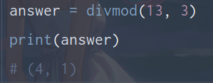

---


### 1-算数运算符
<br>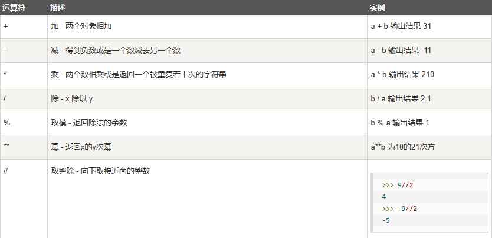


---

### 2-比较运算符
<br>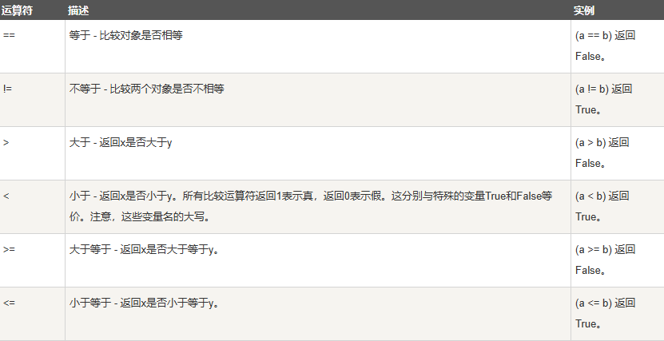

---

### 3-赋值运算符

- 注：`+=`  和  `-=`中间无空格。

<br>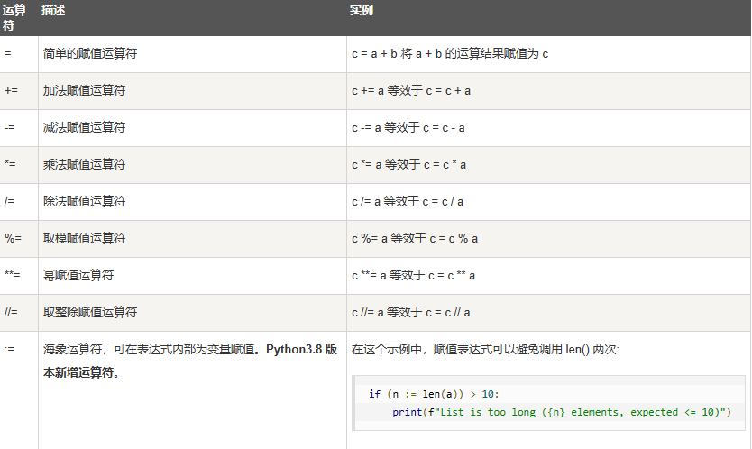

---

### 4-位运算

<br>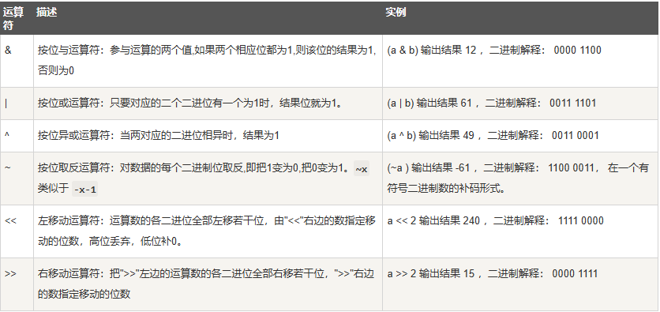

---

<br>

### 5-逻辑运算符

<br>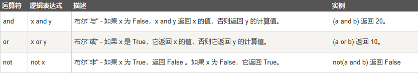

---


### 6-成员运算符
<br>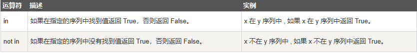

- 注：Python中，序列类型包括字符串、列表、元组、集合和字典，这些序列支持几种通用的操作，但比较特殊的是，集合和字典不支持索引、切片、相加和相乘操作。

---

<br>

### 7-身份运算符

- `is`用于判断两个变量引用对象是否为同一个,`==`用于判断引用变量值是否相等，默认调用`__eq__()`方法。
- `id()`用于获取对象的地址。

<br>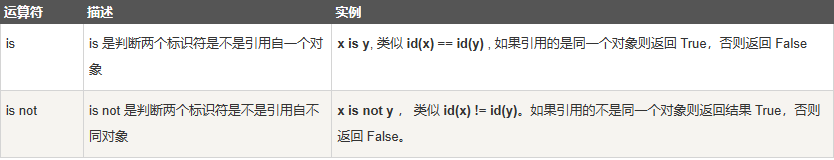

---

### 8-赋值类型
#### a-序列赋值

<br>

> - python中"="的右侧可以接受任意类型的序列，也可以是可迭代的对象，只要长度等于左侧序列即可。
>    1. `(a, b) = ('1', '2')   # 元组赋值，括号可省略`
>    2. `[a, b] = ['1', '2']   # 列表赋值`
>    3. `a, b, c, d = 'spam'   # 字符串序列赋值`

<br>

#### b-序列解包

<br>

> - 序列赋值时，带有*的变量名称会被赋值一个列表，该列表收集序列中剩下的没被赋值给其他名称的所有项，可用于**=**左右两侧变量数目不同的情况。
>    1. `a, *b = [1, 2, 3, 4]   # 扩展序列解包`
>    2. `first, *mid, last = [1, 2, 3, 4]  # 扩展序列解包`
>    3. 用了多个带星号的名称则会报错。
>    4. 若带星号的名称不能匹配到任何项，则返回一个空列表；匹配到单个项，但仍然返回一个列表。
>    5. 带星号的名称没有被编写到一个列表中会报错。
>    6. 序列解包还可以使用`_`通配符，以及`*`匹配任意个。感觉`序列赋值+序列解包`特别像match-case。

```python
a = ['a', 'b', 'c', 1, 2]
[s, *_, num] = a
print(f's:{s},num:{num}')
```
<br>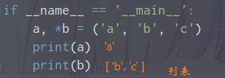

<br>

#### c-多目赋值

<br>

> - 多目标赋值即将最右侧的对象依次赋值给左侧所有的名称。
>    1. `a = b = c = 0 # 多目赋值`
>    2. 多目赋值存在可变和不可变变量两种情况，涉及到修改其中某个变量是否影响其他剩余变量。

<br>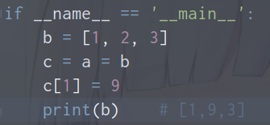

<br>

#### d-嵌套赋值

<br>

```python
if __name__ == '__main__':

	((a, b), c) = ['lo', 'ng']
	print(a)    # l
	print(b)    # o
	print(c)    # ng
```

<br>

### 9-海象运算符

<br>

#### a-简介

<br>

> -  Python 海象运算符是在 Python3.8 版本发布。海象表达式由一个`:`和一个`=`组成，即：`**:=**` 。我们一般称作海象运算符。
> - Python 的赋值表达式(Assignment Expresions)，有时也称为命名表达式（named expression）或海象运算符（walrus operator），它将表达式赋值给标识符，同时还返回表达式的值 。
> - 海象表达式的基本格式：`(variable_name := expression or value)`，除了会将expression或value的结果赋值variable_name，同时还会将该结果作为整个海象表达式的返回值。
> - 注意海象运算符的是否使用`()`问题：下面两种表达式是不同的不同，海象运算符用红色字标记。
>    1. `if(n := len(a)) > 2:`将`len(a)`赋值给`n`并作为整个海象运算符的返回值与`2`进行比较。
>    2. `if n := len(a) > 2:`将`len(a) > 2`结构赋值`n`并作为海象运算符返回值用作if判断。

```python
# 海象运算符：括号的灵活使用

a = ['a', 'b', 'c']

if x := len(a) > 2:
	pass

print(x)    # True

if (y := len(a)) > 2:
	pass

print(y)    # 3
```

<br>

#### b-使用情景

<br>

> 1. 在if判断语句中使用：略
> 2. while循环中使用：
>    1. 在一般while循环中实现索引更新。
>    2. 文件读取过程中，判断读取完否(读取到的数据是否为空)，并同时实现内容赋值输出。
> 3. 列表推、列表导式等中使用。
> 4. 返回值中使用。
> 5. 字符串格式化时使用，此时海象运算符一定要使用`()`包围，不然会与字符串格式化混淆。例如：
> 6. 其他一些使用：海象运算法可以灵活运用于一些情景，在实际需求中要学会灵活使用。

```python
# 普通while循环中使用

a = ['a', 'b', 'c']

index = -1
while (index := index+1) < len(a):
	print(a[index])
```
```python
# 用于减少重复

def my(x):
	pass  # 一些复杂计算
	return x 


list_a = [my(2), my(2) ** 2, my(2) ** 3]    # 调用三次

list_b = [y := my(2), y**2, y**3]   # 调用一次

```
```python
# 字符串格式化

a = f'{(x := 3)}' * x	# 要用()
print(a)   
```
```python
# 文件读取
with open('.\\utf8.txt', 'r', encoding='utf-8') as f:
	while line := f.readline():
		print(line, end='')

```
