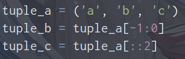

> - `str`转`list`：`list(str)`。
> - `list`转`str`：`''.join(list)`。
> - `list[str]`与`list[int]`相互转换：`map(str,list)`、`map(int,list)`。

- 字面量:在代码中，被写下来的的固定的值，称之为字面量。
- 通过`type()`查看数据或变量的类型。
- 主要数据类型：

<br>

---

<br>

### 1-type查看变量类型

<br /><br/>

* 此外还可与__name__联用。

---

### 2-is与None
#### a-is与==

<br>

> - `==`是比较两个对象的内容是否相等，即两个对象的‘值’是否相等，不管两者在内存中的引用地址是否一样。内部会调用`__eq__`方法。
> - `is`比较的是两个实例对象是不是完全相同，它们是不是同一个对象，占用的内存地址是否相同。即is比较两个条件：内容相同并且内存中地址相同。a is b 相当于 id (a)==id (b)。
> - is可以用于类型判断，例如：`type(a)  is str`，判断a的类型是否为字符串。

<br>

#### b-None值

<br>

> - 判断变量是否为None，一般选择使用is。当然也可以使用==，但还是不推荐。
> - None表示空，但它不等于空字符串、空列表，也不等同于False。
> - 运行if None和if False会得到相同的结果，但结果相同并不代表意义一样。从类型层面上，False是布尔类型，而None是class 'NoneType'；从意义层面上，None表示不存在，而False表示真假。
> - 在python中,`False、0、0.0、None、''、[]、{}、()、set()`都可视为假。
> - 对象存在不一定就是True。
>    1. 默认情况下，自定义的类实例总被认为是真的，除非该类定义了__bool__或者__len__方法。
>    2. 当使用bool(obj)来获得对象的布尔值的时候，优先使用__bool__方法的结果【没有则使用__len__】。
>    3. 判断对象长度，在调用内联函数len()时被调用。
>    4. 正常情况下bool型和整形其实可以相互赋值。
> - 判断变量是否为None：
>    1. `if x is None`：如果x是None。
>    2. `if not x is None`：本质上是`if not(x is None)`。
>    3. `if x is not None`：如果x不是None。
>    4. 有人认为`if not x`也是，我认为`not x`就是对x的真值进行否定判断，而非判断None。

<br>

<br>

```python
# 默认情况下，自定义的类实例总被认为是真的，除非该类定义了__bool__或者__len__方法
# 当使用bool(obj)来获得对象的布尔值的时候，优先使用__bool__方法的结果【没有则使用__len__】
# 判断对象长度，在调用内联函数len()时被调用

class Test:
    a: int

    def __bool__(self):
        return False    # 特殊,只能返回False、True

    def __len__(self):
        # return a.__len__()
        return 0		# 特殊，可以返回bool型


if __name__ == '__main__':
    a = Test()  # 优先考虑__bool__,其次考虑__len__
    print("True") if a is None else print("False")
```

---

<br>

### 3-数字(Number）

- 数字类型包括：int、float、bool、complex(负数)
- `numbers.Integral`表示数学中整数集合，包括int、bool。
- 关于浮点型：除了数学写法如`123.456`外，还支持科学计数法`1.23456e2`。

<br>

- python3中，bool类型是int的子类，True和False可以和数字相运算。
- 较大数字可以采用`_`进行连接，且数字可以添加下划线格式化`f'{a:_}'`、`'{:_}'.format(a)`：

<br /><br/>

- 关于虚数complex：

<br/>

---

<br>

### 4-字符串

#### a-简介

<br>

-  python字符串使用两个双引号"  "或者两个单引号'   ' 括起来的一个或多个字符。
- 其实还支持三引号定义，即"""   """。与多行注释写法一致，支持换行。
- 字符串截取：`变量[头下标:尾下标]`，尾下标为开区间。其中索引值以 **0** 为开始值，**-1** 为从末尾的开始位置。
- 字符串存在两种索引体系：
   - **正向**：正索引表示从开头开始，0表示第一个元素，1表示第二个元素，依此类推。
   - **反向**：负索引表示从末尾开始，-1 表示最后一个元素，-2 表示倒数第二个元素，依此类推。

<br>&nbsp;&nbsp;

- 字符串中包含引号情况：可以使用\来转义，或者采用单引号内书写双引号、双引号内书写单引号的方式实现字符串包含引号。

- 字符串前面添加字母`r/R`实现字符串不转义，例如`r"markdown\n\t\r"`。

  <br>

#### b.拼接与格式化

<br>

- 字符串无法通过加号(+)拼接数字(int 、float、complex等)。
- **字符串的格式化**：python中存在多种类型变量的占位。`"字符串 占位符 字符串" %(字面量、变量、表达式,...,...)`
   - %d 整数占位符。
   - %f 浮点数占位符。
   - %s 字符串占位符：也可用于数字类型占位，数字类型会自动转为字符串类型。
   - 数字精度控制：占位时使用辅助"m.n"形式控制宽度和精度。m控制数字宽度，小于数字自身时不生效。n控制小数点精度，会进行四舍五入。
```python
if __name__ == '__main__':
    a = "hello%s" % 1
    print(a)    # hello1
    b = "hello%s%s" % (1, 2)
    print(b)    # hello2

    # 精度控制
    c = "hello%.4f" % 12
    print(c)    # hello12.0000
```
<br>

- **快速格式化**：`**f"{表达式、变量}"**`实现格式化，但不支持精度控制。举例：`d = f"我有{1}元"`。
      - 精度控制：`{:.nf}`
      - 格式化时间：`{:%Y-%m-%d %H:%M}`
      - 似乎和formate格式化是一样的。
- **formate格式化用法**：
   - `"***{}***{}***".format(a,b)`：按顺序对应拼接变量。
   - `"***{0}***{1}***".format(a,b)`：通过索引指明拼接的变量的位置。
   - `"***{a}***{b}***".format(a="dreamfish",b=19)`：通过命名指明拼接的变量。
   - 常用的格式：
      - 精度控制：`{:.nf}`
      - 百分号显示：`{:.n%}`
      - 对齐：`{:>nd}`、`{:<nd}`、`{:^nd}`
```python
if __name__ == '__main__':
    # {:.nf}保留n位小数
    a = "数字:{:.2f}".format(0.23)
    print(a)

    # {:-+.nf}带符号保留小数
    b = "数字:{:-.2f}".format(-0.23)
    print(b)

    # {:.n%}显示n位小数的百分数
    c = "占比：{:.0%}".format(0.23)
    print(c)

    # {:>nd}右对齐，宽度为n。<、^分别为左、中对齐。
    d = "hello{:>10d}".format(12)
    print(d)
```

<br>

#### c-转义

<br>

> 1. 在字符串中使用\来表示转义，也就是说\后面的字符不再是它原来的意义。
> 2. 在字符串中表示'要写成\'，同理想表示\要写成\\。
> 3. \后面还可以跟一个八进制或者十六进制数来表示字符。
> 4. 不希望字符串中的\表示转义，我们可以通过在字符串的最前面加上字母r来加以说明

```python
if __name__ == '__main__':
    st1 = r"dream\tfish"
    st2 = "dream\tfish"
    print(st1)		# dream\tfish
    print(st2)		# dream	fish
```

<br>

#### d-字符串容器

<br>

- 字符串是字符的容器，一个字符串可以存放任意数量的字符。
- 字符串可以使用成员运算 符`in`或者`not in`判断一个字符串是否包含另外一个字符串。
- 字符串属于序列，可以使用`+`进行序列拼接。此外还可以进行序列截取。
- 字符串属于序列，可以`*`进行序列乘法。
- 字符串是序列，自然可以通过索引获取其内部字符。
- 字符串为序列，存在索引。可以使用for、while循环遍历，同时也可以借助`enumerate()`函数。
- 此外字符串还可以进行序列切片，例如`str[start:end:step]`。省略步长`step`是可同时省略左边`：`，但是省略`end`时，`：`不可省略。序列切片会返回一个新的序列。
- 字符串也不支持通过切片实现批量修改删除。
```python
if __name__ == '__main__':
	st = 'dreamfish'

	# 使用成员运算符
	print("dream" in st)

	# 使用序列乘法
	print(st * 2)

	# 通过索引获取
	print(st[3])

	# 字符串切片
	print(st[0::2])

	print(st[-1:0])

```

---

<br>

### 5-类型转换

<br>

- 关于`class int (x, base=10)`：x为字符串或者数字，base为进制数，默认为十进制【会舍去小数部分】。

<br>

---

### 6-列表（有序，可迭代）
<br />

#### a-简介

- 列表中可以存放、嵌套任意类型的数据

- 列表中存放的是元素的引用，也就是各元素的地址，因此是列表可变对象

- 列表是可变序列。所以各元素是有位置顺序的，可以通过索引取值，可以通过切片取子列表

- 定义空列表：`变量名 = []`、`变量名 = list()`

- 列表同字符串一样存在两种索引：
   - **正向**：正索引表示从开头开始，0表示第一个元素，1表示第二个元素，依此类推。
   
   - **反向**：负索引表示从末尾开始，-1 表示最后一个元素，-2 表示倒数第二个元素，依此类推。
   
     

<br>

#### b-操作

<br>

- 修改特定位置值：
```python
if __name__ == '__main__':
	list_a = ['a', 123, []]		# 定义列表
	list_a[0] = 'b'				# 修改首元素
	list_a[-2] = 111			# 修改末元素
```

- 添加元素：可以使用`append()`、`insert()`对列表添加元素。
```python
if __name__ == '__main__':
	list_a = ['a', 'b']

	# 通过append
	list_a.append('d')

	# 通过insert指定位置添加
	list_a.insert(0, 'y')

	print(list_a)
```

- 删除指定位置：`pop()`不提供参数，默认删除并返回末尾元素；提供参数时，删除并返回指定位置元素。`del`主要用于删除变量，当然后面可以直接跟列表名删除整个列表【列表不存在】。`clear()`用于清空列表【列表为空】。
```python
if __name__ == '__main__':
	list_a = ['a', 123, 'b']

	# pop[删除并返回]
	number = list_a.pop(-2)

	# del
	del list_a[-1]

	# clear[使列表为空]
	list_a.clear()	

	print(list_a)
```

- 查找：`index()`从列表找到第一个匹配元素，返回位置。
```python
if __name__ == '__main__':
	list_a = ['a', 123, 'b']

	print(list_a.index('a'))
```

- 判断存在：`in`表示如果在指定的序列中找到值返回 True，否则返回 False。与之对应的还有`not in`。
```python
if __name__ == '__main__':
	list_a = ['a', 123, 'b']

	if 123 in list_a:
		print(True)
```

- 遍历：`len()`可用于获取列表长度。因为·列表作为序列，有索引故可以使用while遍历。此外还可以使用[循环和判断](https://www.yuque.com/yxlumengyu/lf5ery/gggs9u)中的`enumerate() `函数进行遍历。
```python
if __name__ == '__main__':
	list_a = ['a', 123, 'b']

	# while
	index = 0
	while index < len(list_a):
		print(list_a[index])
		index += 1      # python无++

	# for
	for i in list_a:
		print(i)
```

- 拼接：`+`、`extand()`均可用于列表拼接。`+`用于拼接列表并赋予新变量。`entend()`用于在某列表后追加。
```python
if __name__ == '__main__':
	list_a = ['a']
	list_b = ['b']
	list_c = ['c']

	# +拼接并赋予新变量
	list_d = list_a+list_b+list_c
	print(list_d)

	# extend
	list_a.extend(list_b)
	print(list_a)
```

- 切片：切片是对序列型对象的一种高级索引方法。切片取出序列中一个范围对应的元素，这里的范围不是狭义上的连续片段。序列切片返回序列类型。`list[start:end:step]`。
```python
if __name__ == '__main__':
	list_a = ['a', 'b', 'c']

	# 省略步长
	list_b = list_a[0:2]

	# 省略end
	list_c = list_a[-1::-1]
	print(list_c)

```
```python
if __name__ == '__main__':
	a = ['a', 'b', 'c', 'd']

	# 通过切片批量修改
	a[0:2] = ['e', 'f']

	# 通过切片批量删除
	del a[2:]
```

- 复制：`=`、`copy()`、`copy.deepcopy()`均可复制。关于三种复制区别参考深浅copy。
```python
import copy

if __name__ == '__main__':
	list_a = ['a', 'b']

	# =
	list_b = list_a

	# copy
	list_c = list_a.copy()

	# copy.deepcopy
	list_d = copy.deepcopy(list_a)

	# 通过切片进行复制
	list_e = list_a[:]
```

- 比较：运用`>`、`<`对两个列表进行比较，实际上是将两列表中每个元素按顺序依次进行进行比较。
```python
if __name__ == '__main__':
	a = [1, 3, 2]
	b = [1, 2, 6]
	print(a > b)   # True

	c = [1]
	d = []
	print(c > d)    # True
```
<br>

#### c-方法

- 方法是一种特殊函数，定义在类中，通过类或者对应类对象方可以调用。
|  方法 |  描述 |
| --- | --- |
| `len(list)` | 获取列表元素个数 |
| `max(list)` | 返回列表元素最大值 |
| `min(list)` | 返回列表元素最小值 |
| `list()` | 创建空列表，或转换类型为列表 |
| `sum(iterable, start)` | 序列元素求和。start指定初始值，并将序列元素叠加到该值上。 |
| `list.append(element)` |  向列表末尾追加元素，element为 任何类型的元素   |
| `list.clear()` |  从列表中删除所有元素 |
| `list.copy()` |  返回指定列表的副本 |
| `list.count(value)` |  返回具有指定值的元素数量   |
| `list.extend(iterable)` |  将指定的列表元素（或任何可迭代的元素）添加到当前列表的末尾   |
| `list.index(element)` |  返回指定值首次出现的位置   |
| `list.insert(position, element)` |  在指定位置插入指定的值。  position指明位置，element提供要插入数据。 |
| `list.pop(pos)` |  删除并返回指定位置的元素。   默认值 -1，删除并返回最后的项目。   |
| `list.remove(element)` | 删除具有指定值的首个元素   |
| 补充：`reversed(sequence)` |  返回反向的迭代器对象   |
| `list.reverse()` |  反转元素的排序顺序 |
| `list.sort(reverse=True&#124;False, key=myFunc)` | <br />1. 默认情况下，sort() 方法对列表进行升序排序  。<br />2. 参数：<br />-  reverse：reverse=True 将对列表进行降序排序。默认是 reverse=False  <br />-  key：可选，指定排序标准的函数  <br /> |

```python
if __name__ == '__main__':
	a = [1, 3, 2, [3, 3]]
	print(a.count(2))   # 1

	b = [1, 2, 6]
	print(sum(b))   # 9

	c = reversed(b)
	print(type(c).__name__)  # list_reverseiterator
```

---

<br/>

### 7-元组（有序，可迭代）（只读列表）

#### a-创建

<br>

- 创建空元组：`变量名 = ()`或者`变量名 = tuple()`。
- 元组数据用一对括号`()`括起来。当元组中只含一个数据，该数据后要加`,`,否则括号会被当成运算符。

<br>

#### b-操作

- 元组作为序列，同样可以通过索引获取数据。

<br>

- 元组是序列，可以进行序列切片。元组不可变，不支持采用切片批量修改删除。

<br>

- 支持成员运算符`in`、`not in`。

<br>

- 序列可以使用`+`拼接，或者使用`*`进行复制。
```python
if __name__ == '__main__':
	tuple_a = ('a', 'b', 'c')
	# 序列乘法[注意序列不可变，返回新序列]
	tuple_b = tuple_a * 2
	# 序列拼接
	tuple_c = tuple_a+('d',)
```

- 比较：同列表一样，运用`>`、`<`对两个列表进行比较，实际上是将两列表中每个元素按顺序依次进行进行比较。
```python
if __name__ == '__main__':
	tuple_a = ('a', 'b', 'c')
	tuple_b = ('a', 'c')
	print(tuple_b > tuple_a)  # True
```

- 遍历：元组为序列，存在索引。可以使用for、while循环遍历，同时也可以借助`enumerate()`函数。
```python
if __name__ == '__main__':
	tuple_a = ('a', 'b', 'c')

	# while循环遍历
	index = 0
	while index < len(tuple_a):
		print(tuple_a[index])
		index += 1

	# for循环遍历
	for i in tuple_a:
		print(i)

	# 使用enumerate()函数遍历
	for i, j in enumerate(tuple_a):
		print(f'第{i+1}个元素为：{j}')

```
<br>

#### c-不可变

<br>

- 通过转列表的方式修改集合。[实际上元组已经不是原来的元组，id已经发生变化]
```python
if __name__ == '__main__':
    tuple_a = ('a', 'b', 'c')
    temp = list(tuple_a)    # 元组转列表
    temp.append('d')        # 修改列表
    tuple_a = tuple(temp)   # 列表转元组
```

- 关于元组不可变的一些情况：元组内嵌可变类型时可以修改可变类型的内容。这是因为修改可变类型其id不会改变。所以元组的可变类型元素就没有发生改变。

<br>

<br>

#### d-常用方法

<br>

|   方法 | 描述 |
| --- | --- |
| `count()` | 统计某个数据在元组中出现的次数 |
| `index()` | 查找否个数据，存在返回对应下标，否则报错 |
| `max()` | 返回元组中最大值 |
| `min()` | 返回元组中最小值 |
| `tuple()` | 将可迭代系列转为元组 |
| `len()` | 获取元组内元组个数 |

<br>

---

### 8-序列

<br>

#### a-简介

<br>

- 在Python中，序列类型包括字符串、列表、元组、集合和字典，这些序列支持以下几种通用的操作，但特殊的是，集合和字典不支持索引、切片、相加和相乘操作。

- 序列基本支持操作：
   1. `not in`、`in`成员运算符
   
- 集合和字典不支持：
   1. 索引【不存在索引，也就无法while循环遍历】
   
   2. 切片`别忘了反向切片`
   
   3. 切片实现批量修改、批量删除：仅list支持。
   
   4. `+`、`*`操作
   
   5. `count()`计数函数
   
      

<br/>
#### b-序列解包

<br>

> - `*`和`**`操作符有一个神秘的功能，就是用来从序列和字典中"解包"函数参数。`*`操作符用于将元组、列表和生成器等序列解包为多个元素。除此还有用于从字典中解包关键字参数的`**`操作符。
> -  可迭代对象前面放一个*能解包这个参数 ，就是将其中整个对象分解成多个元素。 这种技术适用于任何可迭代对象，包括生成器表达式。在生成器上使用*操作符会消耗生成器中的所有元素。
> - 对于字典来说：`*`解包key，且无序，3.6开始按插入顺序。`**`解包key-value，按键值对绑定。
> -   序列解包可以用来应对参数处理。例如:`zip(*zipped)`。
> - 剩余部分序列解包参考：[运算符-赋值类型-序列解包](./3.运算符.md)

```python
def my(a: int, b: int, c: int):
	return a + b + c


if __name__ == '__main__':
	tuple_a = (1, 2, 3)
	ans = my(*tuple_a)
	# 采用序列解包传参
	print(ans)
```
```python
def my(x, y, z):
	print(x, y, z)


if __name__ == '__main__':
	dict_a = {'x': 1, 'y': 2, 'z': 3}
	print(*dict_a)  # x y z
	my(**dict_a)
	# 参数必须与字典key一致,否则报错
```

<br>

#### c-自定义序列

<br>

> -  序列协议这里主要根据abc(抽象基类)的继承关系来理解。`collections.abc` 工具类中有`Sequence`【不可变序列】和`MutableSequence`【可变序列】 
> - `Sequence`继承`Reversible`(数据反转)和`Collection`。`Collection`继承`Sized`(获取长度)、`Iterable`(可迭代，可以用for遍历)、`Container`(可以用in来判断是否在序列里)。`Sequence`实现上面接口的方法后就构成了序列协议  。
> -  `MutableSequence`可变序列协议是在Sequence基础上实现`__getitem__`、`__setitem__`、`__delitem__`等方法  。

> -  只要实现了`__getitem__()`和 `__len__()`方法，就会被认为是序列。
> - 一些方法用途：
>    1. `__getitem__(self,key)`:返回键对应的值。也可支持切片。这个 key 可以是整型数值和切片对象，并且支持负数索引。如果 key 不是以上两种类型，就会抛 TypeError；如果索引越界，会抛 IndexError ；如果定义的是映射类型，当 key 参数不是其对象的键值时，则会抛 KeyError 。
>    2. `__setitem__(self,key,value)`：设置给定键的值
>    3. `__delitem__(self,key)`:删除给定键对应的元素。
>    4. `__len__()`:返回元素的数量
>    5. `__contain__()`：成员运算符`in`、`not in`的运算规则。
>    6. `__reserved__()`：数据反转
>    7. `__iter__()`：返回实现`__next__()`对象。可迭代
> - 一些其他的方法：
>    1. `__del__()`：析构方法，删除类对象时调用
>    2. `__str__()`：类似于java的toString，在输出时调用。

```python
class My(object):
	def __init__(self):
		self.a = 1
		self.b = 2
		self.c = 3

	def __getitem__(self, item):
		return self.__dict__.get(item)
		#  Python 类提供了 __dict__ 属性。
		# 类名直接调用 __dict__，会输出该由类中所有类属性组成的字典；
		# 使用类的实例对象调用 __dict__，会输出由类中所有实例属性组成的字典


if __name__ == '__main__':
	m = My()
	print(m['c'])	# 3
```
```python
class Group(object):
	"""
    自定义序列Group
    """
	def __init__(self):
		self.data = []

	def my_init(self, da: list):
		self.data = da

	def __len__(self):
		return len(self.data)

	def __getitem__(self, index):
		return self.data[index]

	def __contains__(self, item):
		if item in self.data:
			return True
		else:
			return False

	def __reversed__(self):
		self.data.reverse()  # 反转数据

	def __delitem__(self, index):
		self.data.pop(index)    # 删除数据

	def __setitem__(self, key, value):
		pass

	def __iter__(self):
		return iter(self.data)  # 返回一个迭代器

	def __del__(self):  # 析构函数,删除对象执行
		print('我释放了...')

	def __str__(self):  # 类似于toString
		return str(self.data)


if __name__ == '__main__':
	g = Group()
	data = ['fish', 'dream', 'little']
	g.my_init(data)     # 添加数据
	print(g[0:2])       # __getitem__协议,切片但返回list类型

	print('fish' not in g)  # __contains__协议,包含

	for i in g:     # __iter__协议,迭代
		print(i)

	reversed(g)     # __reversed__协议,反转

	print(g)        # __str__,输出

	print(len(g))   # __len__()协议
```
ps：实际上上述的切片任然存在问题，理论上切片应该返回一个Group类型而非list类型。因此对上述代码进行如下改进。
```python
import numbers

class Group(object):
	"""
    自定义序列Group
    """
	def __init__(self):
		self.data = []

	def my_init(self, da: list):
		self.data = da

	def __len__(self):
		return len(self.data)

	def __getitem__(self, item):
		cl = type(self)
		g = cl()    # 创建一个当前类对象
		if isinstance(item, numbers.Integral):  # 传入参数为单个数字
			g.my_init([self.data[item]])    # 获取单个数据,传入对象g进行封装
			return g
		elif isinstance(item, slice):   # 传入参数为切片对象slice
			g.my_init(self.data[item])  # 切片完获得列表，传入对象g封装
			return g

	def __contains__(self, item):
		if item in self.data:
			return True
		else:
			return False

	def __reversed__(self):
		self.data.reverse()  # 反转数据

	def __delitem__(self, index):
		self.data.pop(index)    # 删除数据

	def __setitem__(self, key, value):
		pass

	def __iter__(self):
		return iter(self.data)  # 返回一个迭代器

	def __del__(self):  # 析构函数,删除对象执行
		print('我释放了...')

	def __str__(self):  # 类似于toString
		return str(self.data)


if __name__ == '__main__':
	g = Group()
	data = ['fish', 'dream', 'little']
	g.my_init(data)     # 添加数据

	print(type(g[0]))  # 返回Group对象
	print(type(g[0:2]))  # 切片,返回Group对象
```

<br>

#### d-关于切片原理

<br>

> - `slice(start, end, step)`：从start到end，以step为步长切片。返回一个slice切片对象。
> - `list[start:end:step]`切片的本质实际上是`list[slice(start, end, step)]`。python会自动将`[]`内参数调用slice转为slice对象，并将slice对象传参给`__getitem__`、`__setitem__`、`__delitem__`。
> - 其实切片就相当于C语言中`for (i = start;i < end;i += step)`。


---

<br>

### 9-集合（无序，可迭代）

#### a-简介

<br>

- 创建空集合：`变量名 = set()`。
- 在python，集合采用一对`{}`将集合元素括起来。注意`变量名 = {}`会创建空的字典。
- 集合是一个无序的不重复元素序列。  不支持下标索引，所以也不支持切片。
- set中的元素是唯一的，即[哈希表](https://so.csdn.net/so/search?q=%E5%93%88%E5%B8%8C%E8%A1%A8&spm=1001.2101.3001.7020)（hashable）类型，因此集合中的元素必须是不可变类型。不能放入list，dict， set。
- 一个实现了__hash__方法的类是可以作为集合元素的，一个没有显式声明`__hash__`方法的类也可以作为集合元素，因为`__hash__`方法具有默认实现 。

<br>

#### b-操作

<br>

- 添加：通过`add()`方法添加，但只能添加不可变类型元素。

  <br>

- 集合合并：通过`|`运算符或者使用`union()`方法合并集合。两种方式均不会影响原集合。
```python
if __name__ == '__main__':
	set_a = {'a', 'b'}
	set_b = {'b', 'c'}
	set_c = set_b | set_a       # 使用|运算符
	set_d = set_b.union(set_a)  # 使用union

```

- 求差集：A，B是两个集合，把所有属于A且不属于B的元素构成的集合叫做差集(A-B)。通过`-`、`difference()`或者`difference_update()`实现。`difference_update()`会修改原集合，但`difference`则不会影响原集合。
```python
if __name__ == '__main__':
	set_a = {'a', 'b', 'c'}
	set_b = {'a', 'd', 'e'}
	set_c = set_a - set_b       # 使用-运算符
	set_d = set_a.difference(set_b)  # 使用difference
	set_a.difference_update(set_b)  # 使用difference
	# {'b', 'c'}
```

- 判断存在：使用成员运算符`in`、`not in`

<br>

- 通过集合去重：通过转为集合类型，会去重。此后再次转回对应的数据类型。
```python
if __name__ == '__main__':
	list_a = ['a', 'b', 'a']
	list_a = list(set(list_a))  # 先转集合去重，后转回对应类型
	print(list_a)
```

- 遍历：由于集合无序，不存在索引，无法通过while循环遍历。故而只能使用for循环遍历。
- 集合运算：集合可以使用`+ - & ^ `等进行运算。
   1. `a - b`：获取差集，即只存在于a集合
   2. `a | b`：获取并集，即a、b中所有元素
   3. `a & b`：获取交集，即a、b中均存在的元素
   4. `a ^ b`：只存在于a或只存在于b的元素。
```python
if __name__ == '__main__':
	a = {'a', 'b', 'c'}
	b = {'a', 'd', 'e'}

	print(a - b)    # 差集
	print(a | b)    # 并集
	print(a & b)    # 交集
	print(a ^ b)    # 只存在于a或只存在于b
```

- 子集判断：python集合可以通过`>=`、`<=`判断子超集关系。
```python
if __name__ == '__main__':
	set_a = {'a', 'b', 'c'}
	set_b = {'a', 'b'}
	set_c = {'a'}
	print(set_c <= set_b)
	# set_c.issubset(set_b)
	print(set_a >= set_b)
	# set_a.issuperset(set_b)

```
&nbsp;

#### c-方法

&nbsp;

| 方法 | 描述 |
| --- | --- |
| `len()` | 统计集合元素数量 |
| `set.add(element)` | 向集合添加单个元素 |
| `set.clear()` | 删除集合中所有元素 |
| `set.copy()` | 拷贝集合 |
| `set.difference(set)` | 返回集合差集 |
| `set.difference_update(set)` | 删除两个集合中均存在的元素 |
| `set.discard(value)` | 删除集合中指定元素，不存在不报错 |
| `set.intersection(set... etc)` | 返回多个集合交集 |
| `set.intersection_update(set... etc)` | 返回交集，会修改原集合 |
| `set.isdisjoint(set)` | 存在交集返回 True，否则返回 False |
| `set.issubset(set)` | 判断指定集合是否为参数集合的子集 |
| `set.issuperset(set)` | 判断参数集合是否为指定集合的子集 |
| `set.pop()` | 从集合中删除一个随机的元素，并将其返回 |
| `set.remove(item)` | 从集合中删除指定的元素，不存在则报错 |
| `set.union(set...)` | 返回所有集合的并集 |
| `set.update(set)` | 将另一个集合中的元素加入当前集合 |
| `set.symmetric_difference(set) ` | 返回一个集合包含两个集合中的所有项目，但不包含两个集合中都存在的项目 |
| `set.symmetric_difference_update(set)` | 删除两个集合中都存在的项目并插入其他项目来更新原始集合 |

ps：不同于list，set不存在索引，所以pop方法是随机删除并返回。<br />

---

### 10-字典（无序，可迭代，hash计算）

<br>

#### a-简介

<br>

- 字典是一个无序、可变和有索引的集合。在 Python 中，字典用花括号编写，拥有键和值。
- 定义空字典：`变量名 = {}`或者`变量名 = dict()`。
- 定义字典：`变量名 = {key: value, key: value, ..., key: value, }`

    `变量名 = dict(key=value, key=value, ..., key=value,)`

- 字典的key值必须不可变，只能用数字、str或者tuple。此外同一个key只能出现一次，如果对同一个key赋值多次，最后一次value值会被记住。
- python字典运用到了hash。
- 字典key不可重复，value可重复。可以通过转set的方式对value进行去重。
- 一个实现了`__hash__`方法的类是可以作为字典键的，一个没有显式声明`__hash__`方法的类也可以作为键，因为`__hash__`方法具有默认实现 。

<br>

#### b-操作

<br>

- 创建：字典存在多种创建方式。
```python
if __name__ == '__main__':
	dict_a = {'name': 'dreamfish', 'age': 18, }

	# key就是name、age,且为str类型
	dict_b = dict(name='dreamfish', age=19,)
	print(dict_b)

	# 所有value均初始化为9
	key = ['a', 'b']
	dict_c = dict.fromkeys(key, 9)
```

- 添加：通过`key=value`，key不存在则添加。
```python
if __name__ == '__main__':
	dict_a = {'name': 'dreamfish', 'age': 18,}
	dict_a['gender'] = '男'
```

- 修改：通过`key=value`，key存在则修改。
```python
if __name__ == '__main__':
	dict_a = {'name': 'dreamfish', 'age': 18,}
	dict_a['age'] = 19
```

- 删除：通过`pop(key)`删除并返回value或者`del`删除。当然`del`也可以用来删除整个字典。此外还有`dict.popitem()`删除并以元组形式返回最后插入的键值对。
```python
if __name__ == '__main__':
	dict_a = {'name': 'dreamfish', 'age': 18, 'gender': '男', }
	# 通过del删除
	del dict_a['age']
	# 通过pop删除并返回
	name = dict_a.pop('name')
	# 通过popitem
	k_v = dict_a.popitem()
```

- 判断存在：通过成员运算法`in`和`not in`来判断key在集合中是否存在。
```python
if __name__ == '__main__':
	dict_a = {'name': 'dreamfish', 'age': 18,}
	ans = 'age' in dict_a
```

- 访问：字典不存在索引，但是可以通过key来访问value。同样可以通过`get(key,default=None)`获取值，不存在则返回默认值。此外还有`setdefault(key,default=None)`存在相应key则返回value，否则添加键key并设值为default。
```python
if __name__ == '__main__':
	dict_a = {'name': 'dreamfish', 'age': 18,}
	# 通过key访问
	print(dict_a['name'])
	# 通过get获取
	age = dict_a.get('age', 0)
	# 通过setdefault
	dict_a.setdefault('gender', '男')
	age = dict_a.setdefault('age')

```

- 遍历：
   1. for循环遍历字典，其实是遍历key。再通过key可以获取value。
   2. 通过`item()`方法遍历。
   3. 通过`keys()`方法遍历，其实类似于for循环遍历。
```python
if __name__ == '__main__':
	dict_a = {'name': 'dreamfish', 'age': 18, }

	# 简单的for循环遍历
	for x in dict_a:
		print(x, ':', dict_a[x])

	# 通过keys遍历
	for k in dict_a.keys():
		print(f'{k}:{dict_a[k]}')

	# 通过items遍历
	for k, v in dict_a.items():
		print("{}:{}".format(k, v))
```
```python
if __name__ == '__main__':
	dict_a = {'dream': {'age': 19, 'gender': '男', }, }
	# 通过items遍历
	for i, j in dict_a.items():
		if type(j) is dict:		# 判断类型是不是字典
			for k, v in j.items():
				print(f'{k}:{v}')
	# 简单的for循环遍历
	 for i in dict_a:
        if type(dict_a[i]) is dict:
            for j in dict_a[i]:
                print(f'{j}:{dict_a[i][j]}')
	# 通过keys遍历-->略
```

- 字典合并：可以采用`|`、`update()`、`**`的方式合并两个字典。
```python
if __name__ == '__main__':
	dict_a = {'nane': 'fish', 'age': 19}
	dict_b = {'gender': '男'}

	# 使用|合并
	dict_c = dict_a | dict_b

	# 使用**序列解包
	dict_d = {**dict_a, **dict_b}

	# 使用update
	dict_a.update(dict_b)
```

<br>

#### c-常用方法

<br>

| 方法 | 描述 |
| --- | --- |
| `len(dict)` | 获取字典元素个数，即key的个数 |
| `str(dict)` | 将字典转为字符串 |
| `dict.clear()` | 删除字典中所有元素 |
| `dict.copy()` | 返回指定字典的副本 |
| `dict.fromkeys(keys, value)` | keys指定新字典键的可迭代对象，value所有键的值【默认值是 None】 |
| `dict.get(key, default=None)` | 通过key获取value，不存在则返回default的值 |
| `dict.items()` | 返回一个 view 对象。该对象包含字典的键值对，形式为列表中的元组。字典中值发生改变时，视图对象也会更新 |
| `dict.keys()` | 返回 view 对象。这个视图对象包含列表形式的字典键。<br />字典修改时view对象会更新。 |
| `dict.pop(key, default)` | 从字典中删除并返回指定的元素。不存在则返回default，如果未指定default，则报错。 |
| `dict.popitem()` | 删除并返回最后插入的一对键值对【以tuple的形式返回】 |
| `dict.setdefault(key, value)` | 获取key的value，如果键不存在，则插入该key，并设值为value。 |
| `dict.update(iterable)` | 把具有键值对的字典或可迭代对象的key-value更新到字典中 |
| `dict.values()` | 返回 view 对象。这个对象包含列表形式的字典值。字典修改时view对象会更新。 |

ps：`key()`、`values()`、`items()`获得的view对象，会随字典修改而更新。
```python
if __name__ == '__main__':
	dict_a = {'name': 'dreamfish', 'age': 18, }
	keys = dict_a.keys()
	print(type(keys))
	# <class 'dict_keys'>

	values = dict_a.values()
	print(type(values))
	# <class 'dict_values'>

	items = dict_a.items()
	print(type(items))
    # <class 'dict_items'>
```
<br>

---

<br>

### 11-数据容器

<br>

#### a-介绍

<br>

> - Python中，可包含其他对象的对象，称之为容器。容器是一种数据结构。常用的容器主要划分为两种：序列（如：列表、元祖、字符串等）和映射（如：字典）。序列中，每个元素都有下标，它们是有序的。映射中，每个元素都有名称（又称“ 键 ”），它们是无序的。除了序列和映射之外，还有一种容器--集合 。
> - 数据容器有很多功能：`min()`、`max()`、`len()`、`list()`、`str()`、`tuple()`、`set()`
> - 字典类型转list、set、tuple，都是对字典的key进行操作，不涉及value。转字符串除外。
> - Python 标准库 collections 模块实现了特定目标的容器，以提供Python标准内建容器 dict , list , set , 和 tuple 的替代选择。参考：
>    1. namedtuple：创建命名元组子类的工厂函数
>    2. deque：类似列表(list)的容器，实现了在两端快速添加(append)和弹出(pop)
>    3. ChainMap：类似字典(dict)的容器类，将多个映射集合到一个视图里面
>    4. Counter：字典的子类，提供了可哈希对象的计数功能
>    5. OrderedDict：字典的子类，保存了他们被添加的顺序
>    6. defaultdict：字典的子类，提供了一个工厂函数，为字典查询提供一个默认值
>    7. UserDict：封装了字典对象，简化了字典子类化
>    8. UserList：封装了列表对象，简化了列表子类化
>    9. UserString：封装了字符串对象，简化了字符串子类化

```python
import collections as col

if __name__ == '__main__':
	# 声明
	# 创建了一个元组的子类：Student。它的类名为Student，它的字段为 name、age、city。
	Student = col.namedtuple('Student', ['name', 'age', 'city'])

	# 实例化
	s = Student('dreamfish', 19, '天津')

	# 索引访问
	print(s[1])
	# 名称访问
	print(s.name)
```
```python
from collections import Counter

if __name__ == '__main__':

	# 对Iterable计数
	cou_a = Counter('abbccc')
	# Counter({'c': 3, 'b': 2, 'a': 1})

	# 对mapping计数
	cou_b = Counter({'a': 3, 'b': 2, })
	# Counter({'a': 3, 'b': 2})
	# 对关键字计数
	cou_c = Counter(a=1, b=2, c=3)
# Counter({'c': 3, 'b': 2, 'a': 1})
```

<br>

#### b-自定义排序

<br>

> 1. 容器有排序功能：
> - `容器.sort(reverse=True|False, key=myFunc)`：对容器自身进行排序，还可以让函数来决定排序标准。`False`将按升序排序，`True`将按降序排序，默认为`False`。  
> - `sorted(iterable, key=key, reverse=reverse)`：  对可迭代对象进行排序。 False 将按升序排序，`True`将按降序排序，默认为`False`。  
> 2. 关于排序key参数：key参数用于指定排序规则，参数的接收值为一个函数，该函数可以接收一个参数并返回一个值用来进行比较排序。要按多个关键字排序，可以让key参数的函数返回多个关键字组成的元组，例如：`key=lambda x:(x[1],x[2])`，此时先按x[1]排序，相同再按x[2]排序。
> 3. python2中，可以用关键字cmp传入排序函数，但python3，cmp关键字移除了，需要借助functools包来完成。
> 4. 通过`functools`模块里的`cmp_to_key`函数，可以简洁地将上述自定义比较函数转化成key 接收的格式。自定义函数需要：
>       - 接收两个参数 `p1, p2`。
>       - 并且只能返回`-1、0、1`三个数的其中一个。
>       - 其中`1`代表`p1 > p2`，`0`代表`p1 == p2`， `-1`代表`p1 < p2`。
> 5. <br />

```python
# 自定义关键字排序
if __name__ == '__main__':
	a = ['abc', 'a', 'ab']
	b = sorted(a, key=lambda x: len(x))

	a.sort(reverse=True, key=lambda x: len(x))
```
```python
# 自定义排序函数
from functools import cmp_to_key

if __name__ == '__main__':
	a = ['ab2', 'ac3', 'ad1', 'ae2']

	def my_cmp(x: str, y: str):
		return 1 if x[-1] > y[-1] else 0 if x[-1] == y[-1] else -1

	b = sorted(a, key=cmp_to_key(my_cmp))

	a.sort(reverse=True, key=cmp_to_key(my_cmp))
```

<br>

#### c-自定义类对象排序

<br>

> 1. 类对象排序本来只需要重写`__cmp__`方法，就可以。但是现在好像不行了。连`cmp()`都无了。
> 2. 现在就比较麻烦了，需要在类中实现的六种富类比较方法 ：
>       - `__lt__(self, other)`：小于
>       - `__le__(self, other)`：小于等于
>       - `__eq__(self, other)`：等于
>       - `__ne__(self, other)`：不等，默认基于`__eq__`生成。
>       - `__gt__(self, other)`：大于
>       - `__ge__(self, other)`：大于等于
> 3. 但是` functools `提供了一个高阶函数装饰器` @functools.total_ordering`，运用该装饰器后，只需实现`__eq__`和除`__ne__`外的任意一个富类比较方法， 就实现了其他的富比较方法。
> 4. 当然，实现类对象排序还可以采用`functools`模块里的`cmp_to_key`函数实现，这里不做多余赘述。
> 5. 此外，这里要介绍operator库：据说比lambda快。
>    1. `operator.attrgetter(attr|_*attrs_)`：返回从其操作数获取attr的可调用对象。如果请求多个属性，则返回属性元组。
>          1. 在`f=attrgetter('name') `后，调`f(b)`返回 `b.name`。
>          2. 在`f=attrgetter('name','date')`后，调`f(b)`返回`(b.name,b.date)`。
>    2. `operator.itemgetter(item|*items)`：返回一个可调用对象，该对象会使用操作数的`__getitem __()`方法从其操作数中获取项。指定多个项，则返回查找值元组。
>          1. 在`f =itemgetter(2) `后，调 `f(r)` 返回`r[2]`。
>          2. 在`g=itemgetter(2,5,3) `后，调`g(r)`返回`(r[2],r[5],r[3])`

```python
# 装饰器实现排序

from functools import total_ordering


@total_ordering
class Student(object):
	def __init__(self, name, age):
		self.name = name
		self.age = age

	def __eq__(self, other):
		return (self.age, self.name) == (other.age, other.name)

	def __gt__(self, other):
		return (self.age, self.name) > (other.age, other.name)

	def __repr__(self):
		return f'name:{self.name},age:{self.age}'


if __name__ == '__main__':
	list_s = [Student('fish', 19), Student('dream', 18), Student('dream', 19)]
	list_s.sort()
	print(list_s)

```
```python
# attrgetter实现排序

try:
	import operator		# 导入
except ImportError:
	cmp = lambda x: (x.name, x.age)		# 失败则自定义
else:
	cmp = operator.attrgetter('name', 'age')	# 获取name、age


class Student(object):
	def __init__(self, name, age):
		self.name = name
		self.age = age

	def __repr__(self):
		return f'name:{self.name},age:{self.age}'


if __name__ == '__main__':
	list_s = [Student('fish', 19), Student('dream', 18), Student('dream', 19)]
	list_s.sort(key=cmp, reverse=False)
	print(list_s)

```
```python
# itemgetter实现排序

from operator import itemgetter

if __name__ == '__main__':
	cmp = itemgetter(0, 2)  # 获取第0,2位置元素
	list_a = [
		[2, 2, 3],
		[1, 0, 6],
		[1, 9, 5],
		[1, 9, 3],
	]
	list_a.sort(key=cmp)
```

---

### 12-hash哈希

<br>

#### a-简介

<br>

> -  哈希表用于以许多常见的编程语言实现映射和设置数据结构。 Python 将哈希表用于字典和集合。 哈希表是键值对的无序集合，其中每个键都是唯一的。 哈希表提供了有效的查找，插入和删除操作的组合。
> -  如果两个散列值相同，两个输入值很可能是相同的，但也可能不同，这种情况称为散列碰撞。同一个Hash算法对指定内容的结果必须相同。
> -  关于Hash算法，常见的有SHA1、SHA256、MD5、TIGER等等，它们采用不同的一些算法来实现这个功能，不同的Hash算法得到的结果也不一定相同，但是同一个Hash算法对指定内容的结果必须相同。
> - `hash()`： Python 的内置函数 `hash()`可以返回对象的哈希值。哈希值又称散列值，它是一个固定大小的整数，用于标识对象的特定值。hash() 又称散列算法、哈希函数 。
> - `hash()`是不可逆的。 Python的不可变对象才有hash值，可变对象没有hash值，我们称它为 不可哈希。hash() 可以应用于数字、字符串和对象，不能直接应用于`list、set、dictionary`。  
> - set的元素、dict的 key 必须是可哈希的，它保证了在同一个解释器进程里相同字符串 hash 一致，在不同进程中 字符串的 hash 可能不一样。
> - `hash()`对对象使用时，所得的结果不仅和对象的内容有关，还和对象的 id()，也就是内存地址有关。

<br>

<br>

#### b-`__hash__`和`__eq__`
> - `__hash_()`：自定义类实现`__hash__`,类对象就可以使用`hash()`方法获取哈希值。自定义`__hash__`要返回一个整数 。
> - `__eq__()`：自定义类实现`__eq__`， 在用==操作符进行判断的时候，其实内部调用的是`__eq__`方法。
> -  自定义重载了`__eq__()`方法, 但没有重载`__hash__()`, 会将`__hash__`重置为None。二者基本上要都重写或者都不重写。
> -  如果判断两个对象相等[ a==b ]，那么他们的hash值也应该相等[ hash(a)==hash(b) ]。
> - 自己实现一个类且没有实现`__hash__`和`__eq__`方法，会默认继承object的这两个方法 。
> - 一个实现了`__hash__`方法的类是可以作为字典键的，一个没有显式声明`__hash__`方法的类也可以作为键，因为`__hash__`方法具有默认实现 。对于集合也是如此。那么我是不是可以认为他们是不可变类型？不是，不符合不可变类型特点。

```python
class Info(object):
	def __init__(self, name, age):
		self.name = name
		self.age = age

	def __eq__(self, other):
		return isinstance(other, self.__class__) and self.age == other.age and self.name == other.name
		# 注意判断是否为同一类型

	def __hash__(self):
		return hash((self.age, self.name))
		# 规则：a === b,那么 hash(a) == hash(b) 

	def __str__(self):
		return f'name:{self.name},age:{self.age}'


if __name__ == '__main__':
	info = Info('fish', 19)
	set_a = {info, }    
	dict_b = {info: 'nb'}
	# 可以作为set元素、dict的key
```

---

### 13-变量存储

<br>

#### a-变量引用

<br>

> 1. 变量和数据都是保存在内存中的。在 Python 中函数的参数传递以及返回值都是靠引用传递的。
> 2. 在 Python 中：
> - 变量和数据是分开存储的。
> - 数据(对象)保存在内存中的一个位置。
> - 变量中保存着数据在内存中的地址。
> - 变量中记录数据的地址，就叫做引用。
> - 使用 id() 函数可以查看变量中保存数据所在的内存地址。
> 3. Python中一切都是对象，赋值的作用就是在变量中存放的对象的引用，而对象的引用是指向这个对象。
> 4. 变量位于栈内存，对象位于堆内存。
> 5. 对象三要素：
> - **id**：用于唯一标识对象，通常对应对象在计算机内存中的地址。
> - **type**：类型可以限制对象的取值范围和可执行的操作。
> - **value**：表示对象存储的数据的信息。

<br><br>

#### b-可变与不可变

<br>

> 1.  可变类型与不可变类型：
> - **不可变数据(3个) **: Number (数字)、String (字符串)、Tuple (元组)。
> - **可变数据(3个) **: List(列表)、Dictionary (字典)、Set(集合)。
> 2. 对一个不可变类型的变量进行修改时，引用会修改。相当于重写创建了一个变量。
> 3. 对一个可变类型的变量进行修改时，引用不会发生变化。
> 4. 个人认为，可变与不可变是指对象。可变就是对象允许修改，不可变就是对象不允许修改，你只能创建一个新的。而变量只是对对象的引用而已。
> 5. `a = {'a', 'b', 'c'}`，`b = a`，`del a`，问b是多少？首先是将对象(数据)的引用存储在a中，然后又将引用赋值b，此时a、b指向同一个对象。此后删除a，但是b任然指向原对象。即b为`{'a', 'b', 'c'}`。

```python
if __name__ == '__main__':
	a = ['a', 'b', ]
	a_id = id(a)
	a[-1] = 'c'
	print(id(a) == a_id)  # True

	b = 'abc'
	b_id = id(b)
	b = 'efg'
	print(id(b) == b_id)  # False
```
<br>

#### c-对象缓存

<br>

> - 类型值的内置数据类型，数值型(int、float、bool)，字符串，等都会有自己的对象缓存池， 这样做的好处是，避免了频繁的申请内存，释放内存，这样会极大的降低应用程序的运行速度，还会造成大量的内存碎片。因此提供对象缓存机制是非常重要的。
> - 以int 整型为例，python 定义的数值缓存范围是`[-5 ~ 257]`，而并非所有的整数对象。
> - 在Pycharm或者保存为文件执行，结果是不一样的，这是因为解释器做了一部分优化。使用pycharm,即使整数超过256，使用is也是成立的。
> - 可变类型一般不会缓存，因为一直变没有意义。

<br><br /><br />

<br>

#### d-全局变量与局部变量

<br>

> - 参考[函数-全局变量与局部变量](./8.函数.md)

<br>

#### e-深浅copy

<br>

> - 关于拷贝，参考可变类型与不可变类型相关知识。
> - `b = a`： 赋值引用。a 和 b 都指向同一个对象 。其实就是起了个别名。
> - `b = a.copy()`: 浅拷贝。a 和 b 是一个独立的对象，但他们的子对象还是指向统一对象(引用)。copy模块中的copy()方法也属于浅拷贝。其实本质上调用`__copy__()`。
> - `b = copy.deepcopy(a)`: 深度拷贝,.a 和 b 完全拷贝了父对象及其子对象，两者是完全独立的。  需要引入copy模块。其实本质上调用`__deepcopy__()`。

```python
# 赋值引用
if __name__ == '__main__':
	a = ['a', 'b', ['c', 'd']]
	b = a
	print(b is a)  # True
```
```python
# 浅拷贝
if __name__ == '__main__':
	a = ['a', 'b', ['c', 'd']]
	b = a.copy()
	print(b is a)  # False
	print(b[-1] is a[-1])   # True
```
```python
# 深拷贝
import copy
if __name__ == '__main__':
	a = ['a', 'b', ['c', 'd']]
	b = copy.deepcopy(a)
	print(b is a)  # False
	print(b[-1] is a[-1])   # False
```
> 此外可以通过自定义`__copy__()`和`__deepcopy__()`方法来改变默认的拷贝行为。
> 1. `__copy()__`是一个无参数方法，它返回一个浅拷贝对象；
> 2. `__deepcopy()__`接受一个备忘字典参数`memo`,返回一个深拷贝对象。需要进行深拷贝的成员属性都应该传递给`copy.deepcopy()`。同时使用memo字典，以控制递归，避免出现死循环。
> 3. `memo`使用可以避免深拷贝的死循环出现，我们在对实例对象的属性进行copy前，先将当前对象以及复制体存入到`memo`中，防止属性中需要对当前对象进行复制,并将`memo`在对属性复制时作为参数传入。
> 4. 就下面例子而言，`s1.friend.friend=s1`。假如没有`memo`，那么对`s1`复制中要对`s1.driend`复制，对`s1.driend`复制又要对`s1.driend.friend`复制 ，进而推到对`s1.driend.friend.friend`复制......无限迭代。根本原因是复制体的`friend.friend`是新创建而非它本身，导致无限复制。所有我们使用`memo`，每次复制属性前，将当前原件和半成品复制件放入字典存储。当我们对`s1.driend.friend`复制发现就是`s1`，此时可以直接在`memo`获取`s1`的副本，从而结束递归复制，是复制体与其`friend.friend`一致。
> 5. 还得说一下，为什么对属性复制不用`deepcopy()`而是用`__deepcopy__()`。其实用哪个都一样，但是关键是`deepcopy()`需要导`deepcopy`库。

```python
from copy import deepcopy


class Student(object):

	def __init__(self, name, age, friend):
		self.name = name
		self.age = age
		self.friend = friend

	def __copy__(self):
		return Student(self.name, self.age, None)

	def __deepcopy__(self, memo={}):
		if self in memo:  # 说明已经拷贝
			return memo[self]  # 获取并返回副本
		s_cpoy = Student(self.name, self.age, None)  # 先创建半成品副本
		memo[self] = s_cpoy  # 把self-副本记录在字典中
		friend = self.friend.__deepcopy__(memo)  # 对属性递归拷贝
		s_cpoy.friend = friend  # 复制体赋值副本

		return memo[self]  # 返回副本

	def __repr__(self):
		return f'Student(name={self.name},age={self.age},friend={self.friend.name})'


s1 = Student('梦', 19, None)
s2 = Student('鱼', 16, s1)
s1.friend = s2

s3 = deepcopy(s1)
print(s2.friend.friend is s2)  # True
```
