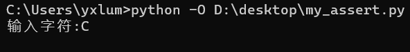

>  - python`for`循环中，若对遍历元素不感兴趣，可以使用`_`代替循环变量，但其实`_`仍是一个合法的python循环变量。例如`for _ in range(n)`，`_`与我们常用的`i、j`是一样的。


---

### 1-判断
#### a-基础
> - 当if、while、for只有一行执行语句，可以写作一行！`for i in range(9):print(i)  # 不推荐`
> - if、while、for的条件等无()包含，与java不同！

```python
if __name__ == '__main__':
	a = eval(input())
	if 2 < a < 6:
		print("True")
	if a != 2 and a != 5:
		print("True")
```
<br>

#### b-真与假

<br>

> - False：在python中`False、0、0.0、None、''、[]、{}、()、set()`都可视为假。关于对象类型真假参考[数据类型-②is与None](./4.数据类型.md)。
> - 一般对于对象类型可以使用`len() ==0 `判断，较优。


---

### 2-分支语句

<br>

> - 分支语句是控制程序运行的一类重要语句，它的作用是根据判断条件选择程序执行路径，使用方式如下:
> 
`if <条件>: `
> `<执行语句>`
> `elif <条件>：`
> `<pass>`
> ...
> `else:`
> `<执行语句>`


---

### 3-循环
#### a-简介

<br>

> - Python中的循环语句有2种，分别是while循环和for循环。其实python3.10新增了，后面会提到。
> - while循环结构：
> 
`while <条件>：`
> ` pass `
> - for循环结构：
> 
`for  临时变量 in 序列类型：`
> `pass`

```python
if __name__ == '__main__':
	a = 'hello,jythoner'
	for x in a:		# 遍历字符串中每个字符
		print(x)
```
> - 所谓序列，指的是一块可存放多个值的连续内存空间，这些值按一定顺序排列，可通过每个值所在位置的编号（称为索引）访问它们【可一个个依次取出】。在 Python 中，序列类型包括字符串、列表、元组、集合和字典。
> - 无论是 while 循环还是 for 循环，其后都可以紧跟着一个 else 代码块，它的作用是当循环条件为 False 跳出循环时，程序会最先执行 else 代码块中的代码【循环结束时优先执行，但是通过break结束循环时无效】。

```python
if __name__ == '__main__':
	a = 'dreamfish'
	for x in a:
		print(x, end='')
	else:
		print("完成！")
```

> - 同while循环不同，for循环无法定义条件循环，只能从被处理的数据集中，依次取出内容进行处理。但其实也可以通过break实现条件循环。
> - 变量作用域：在编程规范上，for循环定义的临时变量只能在循环内部使用，但是实际上在外部可以访问循环定义的临时变量，但不建议这么做。如果非要访问，建议提前在外部定义，然后在for循环内部使用。

```python
if __name__ == '__main__':
	# c=''建议
	a = 'hello'
	for x in a:
		c = "dreamfish"
		print(x)
	print(c)    # 可访问，但不推荐
	print(x)    # 可访问，但不推荐
```

<br>

#### b-range

<br>

> 1.  **range(start, stop[, step])**
> - start: 计数从start开始，默认是从0开始。例如：`range(5)`等价于`range(0,5)`。
> - stop: 计数到stop结束，但不包括stop。例如：`range(0,5)`是`[0, 1, 2, 3, 4]`没有5。
> - step：步长，默认为1。例如：`range(0,5)`等价于`range(0,5,1)`。
> 2. Python3中`range() `函数返回的是一个可迭代对象（类型是对象），而不是列表类型， 所以打印的时候不会打印列表。
> 3. Python2 `range()` 函数返回的是列表。
> 4. Python3` list()` 函数是对象迭代器，可以把`range()`返回的可迭代对象转为一个列表，返回的变量类型为列表。

```python
# python
if __name__ == '__main__':
	t = type(range(9))
	print(t.__name__)   # range
```

<br>

#### c-break、continue、pass

<br>

> - **continue 语句**可以跳过执行本次循环体中剩余的代码，转而执行下一次的循环。
> - **break 语句**可以立即终止当前循环的执行，跳出当前所在的循环结构。无论是 while 循环还是 for 循环，只要执行 break 语句，就会直接结束当前正在执行的循环体。
> - ** pass语句**这是一个空语句，这个语句是为了保持程序结构的完整性。pass 不做任何事情，一般用做占位语句。在编写一个程序时，执行语句部分思路还没有完成，这时你可以用pass语句来占位，也可以当做是一个标记，是要过后来完成的代码。

<br>

<br>

#### d-enumerate函数

<br>

> - enumerate() 函数用于将一个可遍历的数据对象(如列表、元组或字符串)组合为一个索引序列，同时列出数据和数据下标，一般用在for循环当中。
> - `enumerate(sequence, [start=0])`。sequence 为 一个序列、迭代器或其他支持迭代对象。start 是下标起始位置的值【其实就是为元素添加的索引的开始值】。其返回值是 enumerate(枚举) 对象。

```python
if __name__ == '__main__':
	for i, x in enumerate("dreamfish", start=1):	# 从1开始
		print(f"{i}:{x}")
"""
1:d
2:r
3:e
4:a
5:m
6:f
7:i
8:s
9:h
"""
```
```python
if __name__ == '__main__':
	a = enumerate("dreamfish", start=1)
	print(list(a))

'''不好显示，换了下行
[(1, 'd'), 
(2, 'r'), 
(3, 'e'), 
(4, 'a'), 
(5, 'm'), 
(6, 'f'), 
(7, 'i'), 
(8, 's'), 
(9, 'h')]
'''
```

---

### 4-枚举
#### a-介绍

<br>

> - python枚举类：
>    1. 与普通类不同，要继承`Enum`类。
>    2. 使用类获取属性的时候，输出的不是数值，而是枚举项。
>    3. 枚举类中不允许存在相同的`key`值。
>    4. 不允许在类外直接修改枚举项的值。
>    5. 枚举可以相同的值，但是值相同的各项Key都会当做别名。
>    6. 不想枚举存在相同值，可以使用`@unique`，注意需要从`enum`库导入。
>    7. 枚举类标签的值不重要时，可以使用`auto()`自动赋值，从1开始，要从`enum`库导入。

```python
# 别名
from enum import Enum

class Color(Enum):
    RED = 1
    GREEN = 2
    BLUE = 1

print(Color.BLUE)   # Color.RED
# 由于RED、BLUE的value相同,BLUE被当做RED别名
```

<br>

#### b-操作

<br>

> - 枚举类标签可以使用`==`等值比较，也可以用`is`身份比较，但是不能使用`>`、`<`进行比较。
> - 互为别名的标签使用`is`时，是True；二者是指向同一个引用的。
> - 可以使用`类名.标签名.value`获取枚举类标签的值，使用`类名.标签名.name`获取枚举标签的名字。
> - 枚举可以使用for循环遍历，但是对于别名标签，不会重复显示。要想别名标签也遍历，需要使用`枚举类.__members__.items()`。`__members__`是一个特殊属性。
> - 可以使用`枚举类名(值)`实现将枚举的值转换成枚举名称。数字value无法直接与枚举标签匹配，需要先将数字转为枚举对象。
> - 可以使用`list(枚举类)`实现迭代，但对枚举成员的迭代不会给出别名。

```python
# 遍历
from enum import Enum, auto


class Color(Enum):
	RED = auto()
	GREEN = auto()
	BLUE = auto()


# for循环遍历
for i in Color:
	print(i)
	
# __members__.items()
for k, v in Color.__members__.items():
	print(f'{k},{v},{v.value}')

```
```python
# value转枚举标签
from enum import Enum, unique


@unique
class Color(Enum):
    RED = 1
    GREEN = 2
    BLUE = 3


a = 3
print(Color(a))  # Color.BLUE
```

---

### 5-结构化模式匹配

<br>

> 1.  python3.10中`match-case`配合，由case 从上到下将目标与语句中的模式进行比较，直到确认匹配，执行相应的模式下的语句。
> 2. 如果除`_`外未确认完全匹配，最终用通配符`_`将用作匹配情况。如所有的都不匹配且没有提供通配符，则相当于空操作。 
> 3. `_`作为通配符，`case _:`其实也类似于其他语言中switch-case中的`default:`。
> 4. `*`表示0或多个，能匹配任意个元素。`**`也表示0或多个，能匹配任意个键值对。
> 5. 支持list、tuple、dict匹配、也支持类对象匹配。
> 6. 感觉match-case的匹配和[运算符-赋值类型-序列赋值、序列解包](./3.运算符.md)挺像的。

<br>

#### a-字面量模式

<br>

> - 使用Python自带的基本数据结构，如字符串、数字、布尔值和 None，用作匹配模式。
> - 匹配多个字面值，可以通过`|`连接，相当于or，但是不能使用用or。
> - 如果是对bool型进行匹配，会被数字类型[int、float等]、bool型匹配，取决于先后顺序。

```python
# 字面量

a = input('输入:')
match a:
	case '1' | '2' | '3':
        print('输入的是1 or 2 or 3')
	case 'hello':
		print('输入的是hello')
	case _:
		print('真随便...')
```

<br>

#### b-常量模式

<br>

> -  模式可以使用命名的常量，且必须使用`.`以防止被解释为捕获变量。
> - 可以采用枚举类实现常量，注意数字无法直接与枚举标签匹配，需要先将数字转为枚举对象。

```python
from enum import Enum, unique

@unique
class Color(Enum):
    RED = 1
    GREEN = 2


if __name__ == '__main__':
    a = Color(eval(input('1-3:')))
    match a:
        case Color.RED:
            print(Color.RED.name)
        case Color.GREEN:
            print(Color.GREEN.name)
        case _:
            print('...')
```
<br>

#### c-捕捉模式

<br>

> -  case中，出现了变量(或者说是标识符)，那么，这个变量就会尽可能去匹配match的内容，并被赋值。  
> - 支持进行`*`、`**`解包操作，获取到的任然是当前类型。

```python
a = [int(x) for x in input('>>> ').split(' ')]
match a:
    case [_, 0]:
        print(f'列表第二个元素:0')
    case [0, y]:
        print(f'列表元素为:0、{y}')
    case [*l]:
        print(l)
    case _:
        print('...')
```

<br>

#### d-约束项

<br>

> - 在`case`中可以编写`if`条件语句，实现判断的功能 。这种`if`语句称作约束项。
> - 当`case`模式匹配，但是`if`判断不成功时，会进入下一条`case`进行匹配。
> - 请注意`case`匹配先进行匹配，然后才开始if判断。这种先后顺序意味着，即使if判断未成功，但是只要匹配成功，`case`中的变量就会被赋值。

```python
a = [int(x) for x in input('>>> ').split(' ')]
match a:
    case [x, y] if x > y:
        print('第一个元素大')
    case _:
        print('...')
```

<br>

#### e-类匹配

<br>

> - 通过使用类名字后面跟一个类似构造函数的参数列表(类对象不行)，作为一种模式，匹配类中属性存在以及值是否满足。这种模式也可以将类的属性捕捉到变量中。 因为对于匹配来说，对应关系需要确定，所以需要使用关键字参数来标识。  
> - 位置参数匹配：
>    1.  以在某些为其属性提供了排序的内置类（例如:dataclass）中使用位置参数。此时仍然可使用关键字参数。
>    2. 你也可以通过在你的类中设置` __match_args__` 特殊属性来为模式中的属性定义一个专门的位置,然后就可以使用位置参数了。此时仍然可以使用关键字参数。
> - 提示：可以使用`@dataclass`装饰器修饰数据类dataclass，需要从`dataclasses`导入。

```python
# 普通类匹配

class My(object):
    def __init__(self, name, age):
        self.name = name
        self.age = age


m = My('fish', 19)
match m:
    case My(name=_, age=x):  # 不能用对象
        print(f'age:{x}')
    case My(name=x, age=y):  # 必须用关键字指明对应关系
        print(f'name：{x},age:{y}')
    case _:
        print('...')
```
```python
# @dataclass装饰器

from dataclasses import dataclass

@dataclass()
class My(object):
    name: str
    age: int


m = My('fish', 19)
match m:
    case My(age=x, name=_) if x < 18:  # 仍可用关键字参数
        print(f'age:{x}')
    case My(a, b):  # 使用位置参数
        print(f'name：{a},age:{b}')
    case _:
        print('...')
```
```python
#  __match_args__属性

class My(object):
    __match_args__ = ('name', 'age')

    def __init__(self, name, age: int):
        self.name = name
        self.age = age


m = My('fish', 19)
match m:
    case My(age=x, name=_) if x < 18:  # 仍可以使用关键字参数
        print(f'age:{x}')
    case My(a, b):  # 使用位置参数
        print(f'name：{a},age:{b}') 
    case _:
        print('...')
```

<br>

#### f-类型匹配、子模式as

<br>

> - case还可以进行类型匹配。通过`int()`、`float()`等实现，例如:`int(x)`匹配整形，并对x赋值。
> - 子模式可使用`as`关键字来进行捕获。有时候无法直接采用变量捕获，需要灵活使用as。

```python
# 类型匹配

a = [1, 'a', [1.2]]

match a:
	case [int(), str(), [float(x)]]:
		print(f'小数{x:.2f}')
	case list(y):
		print(y)
	case _:
		print('...')
```
```python
# as 捕获

if __name__ == '__main__':
    a = [9, 'a', []]

    match a:
        case [(1 | 2 | 3) as n, str(), list()]:  # 此处使用as捕获很合适
            print(f'a[0]={n}')
        case [_, st, []] as list_a:  # 此处使用as捕获很合适
            print(f'整个列表：{list_a},a[1]={st}')
        case _:
            print('...')
```

<br>

#### g-复杂模式和通配符

<br>

> - 列表匹配：
>    1. `[]`匹配空列表，但是`list()`、`[*_]`匹配任意列表。
>    2. `[_, _, *_]`匹配长度至少为2的列表。
>    3. `[int(),int(),int(x)]`:匹配长度为3，元素全为整型的list，且将最后元素赋值x。
> - 元组匹配：
>    1. `()`匹配空元组，但是`tuple()`、`(*_)`匹配任意长度元组。
>    2. `(_, _, *x)`匹配长度至少为2的元组。超过2部分赋值给x。
>    3. `[str(),str(),str(x)]`:匹配长度为3，元素全为str的list，且将最后元素赋值x。
> - 字典匹配：
>    1. 字典的key必须是字面量，不能使用占位符。
>    2. 字典的value可以使用占位符，也可以使用变量捕获。
>    3. `**x`捕获字典多个键值对，赋值给x。注意`**_`不被允许。
>    4. `{}`、`dict()`匹配任意长度字典。
> - 集合匹配：支持`set()`匹配集合类型。

```python
# 字典匹配

if __name__ == '__main__':
    a = {'e': 3, 'b': 6, 'c': 8, 'd': 9}

    match a:
        case {'a': _, 'b': x, **k}:
            print(x, k)
        case {}:  # 匹配所有字典
            print('...')
```

---

### 6-数据类(datacalss)

<br>

> - 定义一个dataclass是指一个带有默认值的可变的namedtuple，广义的定义就是有一个类，它的属性均可公开访问，可以带有默认值并能被修改，而且类中含有与这些属性相关的类方法，那么这个类就可以称为dataclass，再通俗点讲，dataclass就是一个含有数据及操作数据方法的容器。
> - dataclass的`repr`方法通常有固定格式，会打印出类型名以及属性名和它的值。

<br>

#### a-@dataclass

<br>

> 1. dataclasses 提供一个模块级的装饰器 dataclass 用来将类转化为数据类。该装饰器的原型定义如下  ：`@dataclasses.dataclass(*, init=True, repr=True, eq=True, order=False, unsafe_hash=False, frozen=False) `。
> 2.  提供的默认参数用来控制是否生成相应的魔术方法。为True时，将会自动生成 相应方法，为False时将不生成。
> 3. 参数含义：
> - `init`：控制是否生成`__init__`方法。
> - `repr`：控制生成`__repr__`方法。
> - `eq`：控制生成`__eq__`方法,不生成则默认为`object.__eq__`。
> - `order`：控制生成`__gt__、__ge__、__lt__、__le__`方法。
> - `Frozen`(冻结)：在初始化对象后无法修改其属性的对象。企图修改对象属性的行为都会引发FrozenInstanceError，常用来存储常数和一些设置。
> - `unsafe_hash`： 如果为True，则会在你的数据类中生成__hash__方法。  
> -  如果order为True，则eq必须为True，否则将引发ValueError异常。
> 4. dataclass可以提供默认值， 但是具有默认值的参数应该在没有默认值的参数之后。也就是说具有默认值的参数后面所有参数必须具有默认值，不然会报错。  

<br>

#### b-filed()

<br>

> - Field对象是用于描述定义的字段的，这些对象是内部定义好了的。然后由`field()`方法返回，用户不用直接实例化Field。
> - 使用filed需要从dataclasses导入field。
> - 参数：
>    1. `default`：用作该字段的默认值，必需的。
>    2. `default_factory`：如提供，必须是一个无参可调用对象，当该字段需要默认值时将被调用。还可以用于指定具有可变默认值的字段。 同时指定 default 和 default_factory 将产生错误。
>    3. `init`：如果为true(默认)，则该字段作为参数包含在生成的`__init__()`方法中。
>    4. `repr`：如果为true(默认)，则该字段包含在生成的`__repr__()`方法中。
>    5. `compare`：如果为true(默认)，则该字段包含在生成的相等性和比较方法中(`__eq__(),__gt__()`等)。
>    6. `hash`：这可以是布尔值或 None 。如果为true，则此字段包含在生成的 __hash__() 方法中。如果为 None(默认)，请使用 compare 的值，这通常是预期的行为。
>    7. `metadata`：这可以是映射或 None 。 None 被视为一个空的字典。这个值包含在 MappingProxyType() 中，使其成为只读，并暴露在 Field 对象上。数据类根本不使用它，它是作为第三方扩展机制提供的。多个第三方可以各自拥有自己的键值，以用作元数据中的命名空间。

```python
from dataclasses import dataclass, field

def get_name():
    return input('输入姓名:')


@dataclass(order=False, frozen=True, repr=True)
class Student(object):
    gender: str
    name: str = field(default_factory=get_name)	 # 绑定函数获取默认值
    age: int = field(default=19, repr=False, init=False)


if __name__ == '__main__':
    s = Student('男')
    print(s)    # Student(gender='男', name='fish')
```

<br>

#### c-继承

<br>

> - Dataclasses支持继承,父类中定义的属性将在子类中可用。
> - 继承后，子类的参数顺序：先父类参数，后子类参数。
> - `__post_init__`能够处理后期初始化操作。生成的`__init__`方法在返回之前调用`__post_init__`。
> - `modf()`：方法返回x的整数部分与小数部分，两部分的数值符号与x相同，整数部分以浮点型表示。

```python
# dataclass继承
import math
from dataclasses import dataclass

@dataclass()
class A(object):
	num: float

@dataclass()	
class B(A):

	def __post_init__(self):
		self.decimal, self.integer = math.modf(self.num)

	# 生成repr不包括decimal、integer，自己写	
	def __repr__(self):
		return f'B(num={self.num},decimal={self.decimal:.2f},integer={self.integer})'


if __name__ == '__main__':
	s = B(12.3)
	print(s)    # B(num=12.3,decimal=0.30,integer=12.0)
```

<br>

#### d-转字典、元组

<br>

> - `asdict(dataclass)`：转字典。
> - `astuple(dataclass)`:转元组。
> - 上述方法需要从dataclasses模块导入。

```python
from dataclasses import dataclass, asdict, astuple

@dataclass
class Student(object):
    __slots__ = ('name', 'age')
    name: str
    age: int

if __name__ == '__main__':
    s = Student('fish', 19)
    print(asdict(s))
    print(astuple(s))
    
```

---

### 7-`__slots__`(补充)

<br>

> 1.  Python是动态语言，对于普通的类，可以为类实例赋值任何属性，这些属性会存储在`__dict__`中。默认情况下，`__new__`方法会为每个实例创建一个字典`__dict__`来存储实例的属性。
> 2. `__slots__`允许我们声明并限定类成员，并拒绝类创建`__dict__`和`__weakref__`属性以节约内存空间。
> 3. `__slots__`是类的魔法属性，可接收一个iterable对象作为属性(list、tuple等)。定义后，该类实例只能创建`__slots__`中声明的属性，否则报错。
> 4. `__slots__`继承的两种表现：
>    1. 子类未声明`__slots__`时，不继承父类的`__slots__`，子类实例可以随意赋值属性。
>    2. 子类声明`__slots__`时，继承父类的`__slots__`，即此时子类的`__slots__`为：自身+父类的`__slots__`。
> 5. 注意：从Python3.7的数据类中删除对`__slots__`的直接支持。但`__slots__`仍然可以用于数据类，不过由于的工作方式，无法为数据类字段分配默认值，否则报错。

```python
# 魔法属性

class Student(object):
	__slots__ = ('name', 'age')  # 也可以用list

	def __init__(self, name, age):
		self.name = name
		self.age = age


if __name__ == '__main__':
	s = Student('fish', 19)
	# print(s.__dict__)      报错
	# s.gender = '男'        报错
```
```python
# 使用__slots__，无法为数据类字段分配默认值

from dataclasses import dataclass

@dataclass
class Student(object):
	__slots__ = ('name', 'age')
	name: str
	age: int
```

---

### 8-断言
#### a-简介

<br>

> 1. 断言的两种形式：
>    1. `assert expression`意为如果不expression，就报错。就等价于：
> 
`if __debug__: `
> `if not expression: `
> `raise AssertionError`
>    2. `assert expression, arguments`意为如果不expression，就报错arguments。等价于：
> 
`if __debug__: `
> `if not expression: `
> `raise AssertionError(arguments)`
> 2.  内置变量`__debug__`在正常情况下为`True`，但是在请求优化时为`False`(对应的命令行选项为`-O、 -OO`)。 如果在编译时请求优化，当前代码生成器不会为assert语句发出任何代码。  
> 3.  赋值给`__debug__`是非法的，该内置变量的值会在解释器启动时确定。 

```python
# @FileName  :my_assert.py

a = input('输入字符:')
assert a == 'A', '输入字符不是A'
```
<br><br />

<br>

#### b-使用

<br>

> 1. 不要使用assert进行用户权限判断，很危险。一旦采用`**-O**`请求优化时，assert失效，权限就会暴露。
> 2. 一些常见用法：
>    1. 用于python版本判断。
>    2. 用于函数参数检验。
>    3. 也可以在文件读取时，判断文件是否存在，以及是否有读取权限(参考第一条不推荐)。
> 3. 有时候可能看到以下写法`insert(1 > 1)`，不要以为assert是内置函数，其实它的合规写法是`insert 1 > 1`，`()`是运算符。

```python
# python版本判断

import sys
assert sys.version_info.major == 3, '只支持python3'

assert sys.version_info >= (3, 10, 3), '版本低于3.10.3'

print(sys.version_info)
# sys.version_info(major=3, minor=10, micro=8, releaselevel='final', serial=0)
# 表示当前python版本3.10.8
```
```python
# 参数类型判断

def my_fun(x: float | int, y: int = 5):
	assert isinstance(x, int | float), '参数类型不正确'
	return x + y


ans = my_fun(3)
```

---

<b

### 9-类型判断：

> 对函数、类、lambda变量的判断：待补！

