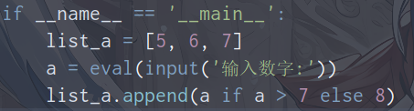
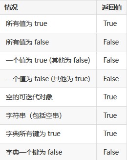
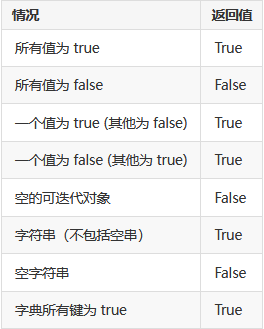

> 语法糖从字面上看应该是一种语法。可以理解为简单、简洁。其实我们也已经意识到，没有这些被称为"语法糖"的语法，我们也能实现相应的功能，而 "语法糖"使我们可以更加简洁、快速的实现这些功能。 只是Python解释器会把这些特定格式的语法翻译成原本那样复杂的代码逻辑而已，没有什么太高深的东西。
> 1. 三元运算符
> 2. 生成式：
> 3. 生成器：
> 4. 迭代器：
> 5. 装饰器：
> 6. with上下文管理器：[文件操作-上下文管理器](./10.文件IO.md)
> 7. else：python中else可以同if、while、try、if联用。
> 8. lambda表达式：
> 9. 补充说明：描述器


---

### 1-三元表达式

<br>

#### a-三元运算

<br>

> - 正常的三目运算符`判断条件？ 为真表达式 ：为假表达式[python不支持]`。
> - python支持三目运算：`为真表达式 if 判断条件 else 为假表达式`。
> - 此外python还支持：`numpy.where(判断条件，为真表达式，为假表达式)`，需导入numpy。

```python
# 三元运算符示例

import numpy as np

if __name__ == '__main__':
    a = 2
    x = np.where(a % 2 == 0, a, a+1)

	y = a if a % 2 == 0 else a+1
```
```python
# 三元运算符嵌套

if __name__ == '__main__':
	cmp_a = lambda x, y: 1 if x > y else -1 if x < y else 0
	# x, y: 1 if x > y else (-1 if x < y else 0)
	cmp_a(2, 9)
```
<br>

<br>

#### b-八大装x判断

<br>

> 待补


---

### 2-生成式、推导式

<br>

#### a-列表推导式

<br>

> - `变量名 = [表达式 for 迭代变量 in 可迭代对象]`。
> - `变量名 = [表达式 for 迭代变量 in 可迭代对象 if 条件]`。
> - 注意列表推导式是使用`[]`。
> - 其实上述列表推导式本质就是：见下面代码块

```python
# 本质
for 迭代变量 in 可迭代对象:
	if 条件:
		表达式
```
```python
# 用例
if __name__ == '__main__':
	list_a = [[1 for y in range(3)]for x in range(3)]
	# 嵌套列表生成式,创建3x3矩阵
```

<br>

#### b-集合推导式

<br>

> - `变量名 = {表达式 for 迭代变量 in 可迭代对象}`。
> - `变量名 = {表达式 for 迭代变量 in 可迭代对象 if 条件}`。
> - 注意集合推导式是使用`{}`。
> - 其实上述集合推导式本质就是：见下面代码块

```python
# 本质
for  迭代变量  in  可迭代对象:
	if  条件 :
		表达式
```
```python
# 用例
if __name__ == '__main__':
	a = [1, 2, 3, 4, 5, 6]
	set_a = {x for x in a if x % 2 == 0}
	# 获取a中所有偶数
```

<br>

#### c-字典推导式

<br>

> - `变量名 = {key: value for 迭代变量 in 可迭代对象}`。
> - `变量名 = {key: value for 迭代变量 in 可迭代对象 if 条件}`。
> - 注意字典推导式是使用`{}`。
> - 其实上述字典推导式本质就是：见下面代码块

```python
# 本质
for  迭代变量  in  可迭代对象:
	if  条件 :
		对应操作
```
```python
# 用例
if __name__ == '__main__':
	a = ['name', 'age', 'gender']
	dict_b = {x: '' for x in a}
	# 创建value为空字符串的字典
```

<br>

#### d-嵌套for循环

<br>

> - `变量名 = [ 表达式 for a in A if 条件1 for b in B if 条件2]`。
> - 其他类型嵌套循环推导式类似。
> - 上述模板的本质就是：见下面代码块

```python
# 本质
for  a  in  A :
	if  条件1 :
		for  b  in  B :
			if  条件2:
				表达式
```
```python
# 用例
list_a = [x * y for x in range(6) if x > 3 for y in range(6) if y > 4]
```

<br>**ps：高阶函数部分移至：[函数-⑧高阶函数](./8.函数.md)**

---

### 3-生成器(generator)

<br>

> - 通过列表生成式可以直接创建一个列表。但是，受到内存限制，导致列表容量有限。而且当仅需要访问前面几个元素，那后面绝大多数元素占用的空间就浪费了。
> -  列表元素可以按照某种算法推算出来，我们可以在循环的过程中不断推算出后续的元素，这样就不必创建完整的list，从而节省大量的空间。在Python中，这种**一边循环一边计算的机制，称为成器**。
> -  生成器通常由两种方式生成:
>    1. 生成器表达式（generator expression）
>    2. 生成器函数（generator function） 
> -  简单点理解生成器就是一个迭代器 。生成器也是可迭代对象。
> -  生成器只能被迭代一次，生成器被完全迭代后它会消耗殆尽，你必须重新定义该生成器来再次迭代它 。例如：`sum()`、`*`、`all()`
> -  `all()`函数用于判断给定的可迭代参数 iterable 中的所有元素是否都为 TRUE，如果是返回 True，否则返回 False。  

<br>

#### a-生成器表达式

<br>

> - `变量名 = (表达式 for 迭代变量 in 可迭代对象)`。
> - `变量名 = (表达式 for 迭代变量 in 可迭代对象 if 条件)`。
> - 生成器表达式其实就是生成式改用`()`。
> - 获取生成器元素：
>    1. `next(generator)`、`__next__()`：每次调用获取一个元素， 待最后一个元素获取后，再次获取则会抛出 StopIteration 异常  。其实`next(generator)`的本质就是`__next__()`。
>    2.  `for in`：生成器也是迭代器，可以用for循环在遇到 StopIteration 异常时自动结束循环  。
>    3. 其实，还可以通过`*`序列解包获取，但是失去了生成器原本的意义。

```python
if __name__ == '__main__':
	a_gen = (x*x for x in range(10) if x % 2 == 0)

	# 序列解包获取
	print(*a_gen)

	# 通过next、__next__
	print(next(a_gen))
	print(a_gen.__next__())

	# for循环遍历
	for x in a_gen:
		print(x)
```

<br>

#### b-生成器函数

<br>

> - 实现生成器使用的是关键字yiled，在Python中一个函数可以用yiled替代return返回值，这样的话这个函数就变成了一个生成器对象。
> - 在调用生成器运行的过程中，每次遇到 yield 时函数会暂停并保存当前所有的运行信息，返回 yield 的值, 并在下一次执行 `next(generator)`方法时从当前位置继续运行。
> -  调用一个生成器函数，返回的是一个迭代器对象，多次调用generator函数会创建多个相互独立的对象。故使用生成器函数需要创建一个generator对象，然后不断对该对象调用`next(generator)`。

```python
def my(n):
	"""
    获取0-n内偶数
    """
	count = 0
	while count < n:
		if count % 2 == 0:
			yield count	 # 相当于暂停 + return count
		count += 1


if __name__ == '__main__':
	f = my(20)  # 创建生成器对象

	# 通过next、__next__
	print(next(f))

	# 通过for循环
	for x in f:
		print(x)
```

<br>

#### c-send与next

<br>

> - python生成器主要有两种方法，一种是send，一种是next。在每一段代码中，第一次next调用，相当于启动了生成器，会从生成器函数中的第一行代码开始执行，直到第一次执行yield语句，生成器函数会跳出来。然后第二次next调用，进入生成器函数后，从yield语句的下一条语句开始执行，然后重新运行到yield语句。执行完后跳出生成器函数，再次调用next，以此类推 。
> -  `next()` 和 `send()` 在某种意义上是相似的。不同的是`send()`可以传递yield表达式的值，而`next()`不能传递具体的值，只能传递None。因此，我们可以看到 `next()` 和 `send(None)` 具有相同的效果。  
> -  第一次调用生成器时，只能使用`next()` 语句或 `send(None)`。而不能使用`send`发送 None以外的值，否则会出错，因为此时还没有`yield`语句来接收这个值。  

```python
def my():
	"""
    测试send
    """
	count = 0
	while True:
		n = yield count
		print('收到：%s' % n)
		count += 1


if __name__ == '__main__':
	f = my()  # 创建生成器对象

	# 第一次启动,也可以使用f.send(None)
	print(next(f))

	print(f.send(5))
```
ps：第一次启动`next(f)`，传参None。在运行到` n = yeild count`时，代码从右向左运行，先会执行`yeid count `暂停函数并返回0。遇到`send(5)`继续执行，并将传入的5赋值给n，继续执行后续代码直到再次回到`n = yeild count`，暂停函数并返回1。

<br>

#### d-实现单线程多并发

<br>

```python
def consumer(name):
    print("顾客%s准备吃包子啦..."% name)
    while True:
        baozi = yield  # 接收外面的信息
        print("顾客%s收到包子编号:%s"%(name,baozi))


c1 = consumer("C1")
c2 = consumer("C2")
c3 = consumer("C3")
c1.__next__()
c2.__next__()
c3.__next__()


for i in range(10):
    print("------------生成了第%s批包子----------"%i)
    c1.send(i)
    c2.send(i)
    c3.send(i)
```

<br>

#### e-close和throw

待补

---

### 4-可迭代对象(Iterable)

<br>

#### a-简介

<br>

> - 可迭代对象是能够一次返回其中一个成员的对象，通常使用for循环来完成此操作。简单来理解，任何可以循环遍历的对象都是可迭代对象。
> - 常见可迭代对象：str、list、tuple、set、dict、 文件对象等。
> - 可迭代对象都构建了 `__iter__()`方法，而不可迭代对象没有构建，我们可以通过此特点来判断某一对象是不是可迭代对象。  
> - 判断Iterable：
>    1. 是否可以使用for循环遍历。
>    2. 通过`isinstance(对象， Iterable)`判断是否为可迭代对象。需要通过`form collections import Iterable`导入。
>    3. 通过`dir(对象)`查看对象内所有的属性与方法  ，看是否存在`__iter__`。
>    4. 通过`hasattr(对象，'__iter__')`检查对象是否支持迭代协议。
> -  一个对象实现了`__getitem__()`方法可以通过`iter()`函数转成Iterator，即可以在for循环中使用，但它不是一个可迭代对象(sinstance方法检测)  

<br>

#### b-all()和any()

<br>

> - `all(iterable)`: 如果传入的可迭代对象的所有元素均为真值（或可迭代对象为空）则返回 True。
>
>   <br>
>
> - `any(iterable)`: 传入的可迭代对象的至少一个元素为真值则返回 True 。
>
>   <br>
>
> - 对于字典，如果至少有一个键为 true，any() 将返回 true。  
> - 对于空字符串，any()返回False，但all()返回true。


---

### 5-迭代器(Iterator)

<br>

> - 凡是可作用于`next()`函数的对象都是Iterator类型，它们表示一个惰性计算的序列。
> - 生成器都是迭代器，迭代器都是可迭代对象。但list、dict、str虽然是Iterable，却不是Iterator。
> - 迭代器同时定义了`__next__()`和`__iter__()`。
> - 使用`iter()`内建方法可以将Iterable对象转化为迭代器。
> - 迭代器、生成器的使用可以节省内存，在循环的过程中不断推算出。
> -  迭代器对象从第一个元素开始访问，直到所有的元素被访问完结束，迭代器只能往前不能后退，终止迭代则会抛出 StopIteration异常。
> - 文件对象是的迭代器。
> - 通过`isinstance(对象， Iterator)`判断是否为可迭代对象。需要通过`form collections import Iterator`导入。


---

### 6-自定义Iterable、Iterator

<br>

> - 有迭代能力的Iterable对象：一个类，实现了__iter__，那么就认为它有迭代能力，通常此函数必须返回一个实现了__next__的对象，如果自己实现了，你可以返回self，当然这个返回值不是必须的。
> -  迭代器同时实现了__iter__和__next__的对象，缺少任何一个都不算是Iterator。
> - `iter()`返回一个迭代对象，它主要映射到了类里面的`__iter__()`函数，此函数返回的是一个实现了`__next__()`的对象  。
> - ` __iter__()`方法作用于获取实现`__next__()`的对象。也有人说是获取迭代器，也没错，像例一没啥意义。`__iter__()`又称迭代器协议。
> - `__next__() `方法用于获取迭代器中的元素，一般会` raise StopIteration`抛异常。 
> - 如果for 循环遍历的是迭代器，那么先调自己的`__iter__()`，每次循环调用其`next()`方法。如果 for 循环的是可迭代对象，那么调用的是`__iter__()`，获得某个迭代器，然后每次循环调用该迭代器的`next()`。for语句也会自动处理这个StopIteration异常以结束循环 。
> - 如果没有实现iter()方法， 但是实现了`__getitem__`方法，Python会创建一个迭代器，尝试按顺序（从索引0开始，可以看到我们刚才是通过s[0]取值）获取元素。如果尝试失败，Python抛出TypeError异常，通常会提示`TypeError: '***' object is not iterable`。

```python
from collections.abc import Iterable


class B(object):
    def __next__(self):
        raise StopIteration


class A(object):
    def __iter__(self):
        return B()
        # 返回B对象，实现了__next__


if __name__ == '__main__':
    a = A()
    print(isinstance(a, Iterable))  # True
    print(isinstance(a.__iter__(), Iterable))   # True
    # a是可迭代对象，但b不是

```
```python
class B(object):
    def __init__(self, end):
        self.start = 0
        self.end = end

    def __iter__(self):
        print('b的__iter__...')
        return self  # 自己就实现了__next__

    def __next__(self):
        print('b的__next__...')
        if self.start < self.end:
            ans = self.start
            self.start += 1
            return ans
        else:  # 到迭代器结尾,抛异常
            raise StopIteration


class A(object):
    def __init__(self, n):
        self.end = n

    def __iter__(self):
        print('a的__iter__...')
        return B(self.end)
        # 返回B对象，实现了__next__


if __name__ == '__main__':
    # a是可迭代对象,先调A的__iter__,再调B的__next__
    for i in A(10):
        print(i)

    print('OK')

    # b是迭代器,先调自己的__iter__,再调自己的__next__
    for i in B(10):
        print(i)
```
```python
class B(object):
    def __init__(self, end):
        self.start = 0
        self.end = end

    def __iter__(self):
        return None  # 返回None,无法for循环

    def __next__(self):
        if self.start < self.end:
            ans = self.start
            self.start += 1
            return ans
        else:  # 到迭代器结尾,抛异常
            raise StopIteration


class A(object):
    def __init__(self, n):
        self.end = n

    def __iter__(self):
        return B(self.end)
        # 返回B对象，实现了__next__


if __name__ == '__main__':
    # b的__iter__返回None,只能通过A来for循环。B用于for会报错
    a = A(10)
    for i in a:
        print(i)
```
```python
class My(object):
    def __init__(self, data: list):
        self.data = data

    def __getitem__(self, item):
        return self.data.__getitem__(item)


if __name__ == '__main__':
    a = ['a', 'b', 'c']
    m = My(a)
    for i in m:
        print(i)
```

---

### 7-装饰器(Decorator)

<br>

> - 装饰器部分，采用先代码后分析的形式记录。在分析中说明、理解装饰器原理和运行流程。
> - 关于闭包的相关知识参考：[函数-闭包](./8.函数.md)
> - 其实变量与对象，就像躯壳和灵魂。对于一个python变量，我们要关注它的"灵魂"是怎么样的，这决定了它是什么样的人。而不是关注躯壳，要知道躯壳是会因为年龄等因素改变的。只有通过灵魂才能真正辨别一个人。也同样只有对象才能真正确定数据或逻辑，变量是会变的。

<br>

#### a-简介

<br>

> 1. 装饰器本质上是一个Python函数或类，它可以让其他函数或类在不做代码修改的前提下增加额外功能，装饰器的返回值也是一个函数或类对象。从装饰的实现方式上可分为装饰器函数和装饰器类 。
> 2. 装饰器的参数是另一个函数(被装饰的函数）。装饰器可能会处理被装饰的函数，然后把它返回，或者将其替换成另一个函数或可调用对象。
> 3. python装饰器是用于拓展原来函数功能，目的是在不改变原函数名(或类名)的情况下，给函数增加新的功能。或者可以抽离出大量与函数功能本身无关的雷同代码到装饰器中并继续重用。
> 4.  Python为装饰器专门提供了语法糖@符号，它放在函数开始定义的地方修饰函数，可以省略最后一步再次赋值的操作，具体见下面分析。
> 5. 装饰器用途：权限校验、用户认证、事务处理、日志记录、性能测试、缓存。
> 6. 一般用作泛用的修饰器都会提供可变形参+返回值。
> 7. 在具体学习装饰器之前，需要知道函数其实也是对象，函数名指向函数对象引用的变量。类似于其他变量，我们可以修改函数变量的引用，使其指向其他变量。(debug过程中注意运用)
> 8. 此外对于函数我们还需要知道`函数名`是对函数变量或对象进行操作，而`函数名(参数)`则是调用函数。(debug过程中注意运用)

```python
# 修改函数变量引用
def my_fun_a(a, b):
    print(a ** b)


def my_fun_b(a, b):
    print(a * b)


my_fun_a = my_fun_b	 # 修改引用

my_fun_a(2, 3)  # 6,调用的是my_fun_b

```

<br>

#### b-无参函数装饰器

<br>

```python
def log(fun):

    def inside(*args, **kwargs):
        print(f'{fun.__name__} is running!')
        # return fun(*args, **kwargs)

    return inside


@log
def my_fun(name, age):
    pass
    # return ...


my_fun()
```
> 1. `@log`是一个装饰器，将其放在`my_fun()`函数上用于修饰该函数。执行过程是装饰器把`my_fun`函数对象作为装饰器函数`log(fun)`并将返回值赋值给`my_fun`变量。也就是说`my_fun`函数变量实际上已经不是原来的函数,而变成了`log(fun)`函数的返回值，也就是`inside()`函数。以后每次调用`my_fun`实际上调用的都是`inside()`。
> 2. 参照闭包的一些相关知识，我们可以近似的认为装饰器生效时,内部`inside()`函数引用了外部原本的`my_fun`函数对象，二者形成了闭包。此后又对`my_fun`变量重行赋值，指向`inside()`函数对象。
> 3. 为了方便`@log`对多种函数的修饰，也就是说`inside()`函数对多种参数的匹配，可以采用可变参数等形式`*args， **kwags`。
> 4. 如果原函数`my_fun`存在返回值，那么它的替代函数`inside()`也需要存在返回值，具体实现可以用`inside()`接收的参数在`return`时调用原函数(修改前的被修饰函数`my_fun`)，并返回原函数的返回值。一般为了提高装饰器泛用性，都会提供这种方式的返回值。
> 5. 实际上整个过程相当于执行了这样一条语句：`my_fun = log(my_fun)`。语法糖`@`的作用其实就是省略传参和赋值的过程。

<br>

#### c-有参函数装饰器

<br>

```python
def log(user: str):
    def middle(fun):
        def inside(*args, **kwargs):
            print(f'{user} use {fun.__name__}!')
            return fun(*args, **kwargs)
            # 就算原函数无返回值，一般也会提供return
        return inside
    return middle


@log('Dreamfish')
def my_fun(a, b):
    return a + b


ans = my_fun(3, 5)
```
> 1. `@log()`是一个带参数装饰器，将其放在`my_fun(a,b)`函数上用于修饰该函数。执行过程与不带参装饰器执行过程略有不同。首先装饰器会直接调用`log(user)`函数，并传入装饰器中参数，从而接收到返回值`middle(fun)`函数。然后就是熟悉的过程了，先将`my_fun`函数对象作为参数传给`middle()`函数并将返回值赋值给`my_fun`变量。此时的`my_fun`函数变量实际上引用的已经不是原来的函数对象，而是变成了引用`middle(fun)`的返回值，也就是`insid()`函数。以后每次调用`my_fun`其是都是调用`inside()`。
> 2. 同样的，实际的替代函数`inside()`也是有返回值的，`inside()`将自己的参数用来调原函数(未修改前的被修饰函数`my_fun`)，并将其返回值作为自己的返回值。
> 3. 其实从上述过程不难看出，装饰器就是在执行某函数前后添加一些功能，其实还是会在代码中调用原本的被修饰函数。类似于AOP。
> 4. 经过上述分析过程，我们再来考虑一点，如果我想在调`my_fun`(原本的被修饰函数)之后执行一些后续处理，如何实现？我们知道`my_fun`变量最终引用`insid()`函数对象并且会在其中调用原来的被修饰函数，那么我们就需要在`inside()`做文章。我们可以将调用原来被修饰函数的返回值存储起来，然后执行后续操作，最后将保存的返回值返回。也就是`return fun(*args, **kwargs)`替换为：
> 
`ans = fun(*args, **kwargs)`
> `pass # 后续处理`
> `return ans`
> 5. 其实带参数装饰器相当于执行语句：`my_fun = log(user)(my_fun)`。

<br>

#### d-@wraps

<br>

> 1. Python装饰器实现的时候，被装饰后的函数其实已经是另外一个函数了,它的函数名、说明文档等函数属性会发生改变(有时候会产生一些)，Python的`functools`包中提供了一个叫`wraps`的装饰器来消除这样的副作用。写一个装饰器的时候，最好在实现之前使用`@wraps`，它能保留原有函数的名称和函数属性。
> 2. `@wraps()`需要把原有函数作为参数传进去，用于修饰替换函数。
> 3. 当然你可以不用`@wraps()`而转用`update_wrapper()`函数，功能是一样的。

```python
# 使用@wraps
from functools import wraps

def log(fun):

    @wraps(fun)
    def inside(*args, **kwargs):
        """
        替换函数
        """
        print(f'{fun.__name__ }is running!')
        return fun(*args, **kwargs)

    return inside


@log
def my_fun(a, b):
    """
    两数相加
    """
    return a + b


ans = my_fun(2, 3)
print(my_fun.__name__)  # my_fun，不使用@wraps，则输出inside
print(my_fun.__doc__)  # 两数相加，不使用@wraps，则输出替换函数
```
```python
# 使用update_wrapper
from functools import update_wrapper


def log(fun):

    def inside(*args, **kwargs):
        """
        替换函数
        """
        print(f'{fun.__name__ }is running!')
        return fun(*args, **kwargs)

    return update_wrapper(inside, fun)


@log
def my_fun(a, b):
    """
    两数相加
    """
    return a + b


ans = my_fun(2, 3)
print(my_fun.__name__)  # my_fun
print(my_fun.__doc__)  # 两数相加
```

<br>

#### e-类装饰器

<br>

> 1. `__call__()`的作用是使实例能够像函数一样被调用，同时不影响实例本身的生命周期（不影响一个实例的构造和析构）。但是`__call__()`可以用来改变实例的内部成员的值。其实也就是说通过`类实例(参数)`其实是调用`__call__(参数)`。(深入部分在类部分讲解)
> 2. 类装饰器的实现，必须实现`__call__`和`__init__`两个内置函数。
>    1. `__init__`：接收并保存被装饰函数或者装饰器参数。
>    2. `__call__`：实现具体装饰逻辑。
> 3. 类装饰器同样分为有参数和无参数两种：
>    1. 有参类装饰器：此时`__init__`用于接收存储被装饰函数。
>    2. 无参类装饰器：此时`__init__`用于接收存储装饰器参数。这种方式存在很严重问题，被修饰函数变量类型被修改了。
>    3. 可以类比参类装饰器，但是`__init__`不传其它参数，或者传可变参数实现无参类装饰。可以解决无参被装饰函数变量类型修改的问题。但是这种类装饰器在调用时要注意装饰器的`()`不可省略，不然报错。具体情况见后面分析。

```python
# 无参
class Logger(object):
    """lei"""
    def __init__(self, fun):
        self.fun = fun  # 存储被修饰函数

    def __call__(self, *args, **kwargs):
        print(f'{self.fun.__name__} is running!')
        ans = self.fun(*args, **kwargs)
        pass  # 后续处理
        return ans


@Logger
def my_fun(a, b):
    return a + b

my_fun(1, 2)
c = isinstance(my_fun, Logger)	# True
```
> 1. 对于无参类装饰器，`__init__`对被修饰函数进行缓存。
> 2. `@Logger`装饰器用于修饰`my_fun`，具体执行过程是将`my_fun`函数对象作为参数调用Logger类的构造方法并将返回的Logger类实例赋值给`my_fun`变量。也就是说此时的`my_fun`引用的其实是Logger类的实例对象。以后每次调用`my_fun(a,b)`其实都是在调用`Logger实例(a,b)`，也就是调用`__call__(self, *args, **kwargs)`。
> 3. 关于上面的代码，存在一个很严重的问题，通过这种逻辑的类装饰器修改了被修饰对象的
> 4. 我想使用`@wraps()`恢复函数属性，但是无法传参。于是又想通过`update_wrapper(self, self.fun)`，那么这行代码该放哪呢？我觉得是`__init__`方法，因为要在返回实例前更改属性。但是问题又来了，我无法用函数属性去更新类对象属性，不是同一个玩意...
> 5. 其实相当于执行了一条类似语句`my_fun = Logger(my_fun)`。

```python
# 有参
from functools import wraps
import types

class Logger(object):
    """lei"""
    def __init__(self, msg):
        self.msg = msg  # 存储装饰器参数

    def __call__(self, fun):

        @wraps(fun)
        def wrapper(*args, **kwargs):
            print(f'{self.msg} use {fun.__name__}!')
            ans = fun(*args, **kwargs)
            pass
            return ans
        return wrapper


@Logger('dreamfish')
def my_fun(a, b):
    return a + b


my_fun(1, 2)
c = isinstance(my_fun, types.FunctionType)  # True,sh
```
> 1. `@Logger()`装饰器用于修饰`my_fun`函数。具体执行过程：先是通过装饰器参数调用`Logger`类的构造器方法并返回对应类的实例对象。此后又将`my_fun`函数对象作为参数调用`实例(参数)`并将返回值赋值给`my_fun`变量，其实这时候调用的是`__call__()`方法。总之，`my_fun`变量最终引用的是`wapper()`函数对象。此后每次调用`my_fun(a, b)`其实都是在调用`wrapper()`函数。
> 2. 这里我们就可以用到`@wraps()`注解恢复函数的一些属性了。
> 3. 这里`__call__`的参数`fun`与`wrapper()`函数形成闭包，因此无需额外的成员变量对`fun`进行存储。
> 4. 其实就相当于执行了语句：`my_fun = Logger(msg)(my_fun)`。
> 5. 通过分析，我们还可以给出另一种无参类装饰器的实现方式：`__init__`方法不传参或者传入可变参数(实际上传入可变参数相当于一个通用装饰器)。

```python
# 无参类装饰器
class Logger(object):
    def __init__(self):
        pass
        # 也可传可变参数，就相当于一个通用装饰器

    def __call__(self, fun):

        @wraps(fun)
        def wrapper(*args, **kwargs):
            print(f'use {fun.__name__}!')
            ans = fun(*args, **kwargs)
            pass
            return ans
        return wrapper


@Logger()
def my_fun(a, b):
    return a + b


my_fun(1, 2)
```
> 1. 需要说明的是使用这种无参类装饰器一定要有`()`，也即`@Logger()`,而不能直接`@Logger`(不报错)。
> 2. 假设存在一个`@log`的装饰器修饰`my_fun`函数，下面几种调用方式存在很大差异：
>    1. `@log`：相当于`my = log(my_fun)`,直接调用`log(my_fun)`并将返回值赋值`my_fun`。
>    2. `@log()`：相当于`my = log()(my_fun)`，先调用`log()`返回一个对象(函数或者类对象)，再调`对象(my_fun)`返回值赋值`my_fun`。
>    3. `@log(args)`：相当于`my = log(args)(my_fun)`，先调用`log(args)`返回一个对象(函数或者类对象)，再调`对象(my_fun)`返回值赋值`my_fun`。

<br>

#### f-强调内容

<br>

> 大致理解装饰器后，仍需要强调一些东西：
>    1. 函数其实也是对象，函数名指向函数对象引用的变量。类似于其他变量，我们可以修改函数变量的引用，使其指向其他变量。（理解装饰器的关键）
>    2. 只有在第一次调用被装饰函数时，闭包函数才会被调用，装饰器才会真正生效。此后被修饰函数变量已经被修改。
>    3. 装饰器只增强一次原函数，因为闭包函数只会被调用一次。当第二次以上调用原函数时，实际上调用的直接就是增强后的函数(防止套娃)。
>    4. 为了满足装饰器对多种函数的修饰，也就是说内部函数对多种参数的匹配，可以采用可变参数等形式`*args， **kwags`。
>    5. 为了提高装饰器泛用性，替代函数一般会都会提供返回值(没有就返回None)。可以用替代函数接收的参数在`return`时调用原函数(未修改前的被修饰函数)，并返回原函数的返回值。
>    6. 定义装饰器一般都会使用`@wraps`，此外替换函数一般命名为`wrapper()`，我为了便于理解使用了`inside()`的命名。
>    7. 不清楚的执行过程可以交给debug。

```python
# 通用装饰器
from functools import wraps

# 类装饰器
class Logger(object):
    def __init__(self, *args):
        self.args = args

    def __call__(self, fun):
        @wraps(fun)
        def wrapper(*args, **kwargs):
            pass	# 前置操作
            ans = fun(*args, **kwargs)	# 参数解包
            pass	# 后续处理
            return ans
        return wrapper


# 函数装饰器
def log(*param):
    pass  # 对param判断处理

    def middle(fun):
        @wraps(fun)
        def wrapper(*args, **kwargs):
            pass    # 前置操作
            ans = fun(*args, **kwargs)  # 参数解包
            pass    # 后续处理
            return ans
        return wrapper

    return middle
```

<br>

#### g-多个装饰器执行顺序

<br>

> - 多个装饰器共同使用时：
>    1. **装饰时：从下到上**
>    2. **调用时：先从上向下，后从下到上**。
> - 多个个装饰器同时使用时，可以想象成洋葱，最下层的装饰器先包装一层，然后直到最上层装饰器，完成多层的包装。然后执行时，就像切洋葱，从最外层开始，只执行到被装饰函数运行时，就到了下一层，下一层又执行到函数运行时到下一层，一直到执行了被装饰函数后，就像切到了洋葱的中间，然后再往下，依次从最内层开始，依次执行到最外层。
> - 可以参考Java中SSM框架拦截器执行原理。

```python
# 多装饰器运用
from functools import wraps


def log(*param):
    pass  # 对param判断处理

    def middle(fun):
        @wraps(fun)
        def wrapper(*args, **kwargs):
            print('@log前置处理')
            ans = fun(*args, **kwargs)  # 参数解包
            print('@log后置处理')
            return ans
        return wrapper

    return middle


def other(*param):
    pass

    def middle(fun):
        @wraps(fun)
        def wrapper(*args, **kwargs):
            print('@other前置处理')
            ans = fun(*args, **kwargs)  # 参数解包
            print('@other后置处理')
            return ans
        return wrapper

    return middle


@other()
@log()
def my_fun(a, b):
    ans = a + b
    print(ans)


my_fun(10, 20)
# @other前置处理
# @log前置处理
# 30
# @log后置处理
# @other后置处理
```

<br>

#### h-类的装饰器

<br>

> 1. 装饰器除了能装饰函数外，还可以装饰类。给类加函数装饰器时，将类名作为装饰器函数的参数，并在装饰器函数内定义一个类如 WrapClass，该类称为包装类，包装类的构造函数中必须调用被装饰类来定义一个实例变量，装饰器函数将返回包装类如 WrapClass 。
> 2. 装饰器只在类第一次实例化的时候起了效果。关于装饰器类修饰类部分，笔记不做讲解。
> 3. 对函数使用装饰器，是将函数引用对象替换掉。那对类使用装饰器就是将类变量替换掉。但是很少这么干，因为不道德，导致代码难以阅读。我们一般只对类的初始化进行一些操作，例如：单例模式。

```python
# 单例模式
def only(msg):
    print(msg)

    def middle(cls):
        def wrapper(*args, **kwargs):
            if not wrapper.instance:
                wrapper.instance = cls(*args, **kwargs)
            return wrapper.instance
        wrapper.instance = None  # 这里是定义属性,不然wrapper会找不到属性
        return wrapper
    return middle


@only('单例模式启动')
class Person(object):

    def __init__(self):
        pass

    def __repr__(self):
        pass


p1 = Person()
p2 = Person()

print(p1 is p2)  # True
```
```python
# 完全替换类
def some(*params):
    pass

    def wrapper(aclass):
        pass

        class WrapClass(object):

            def __init__(self, *args, **kwargs):
                pass
                self.obj = aclass(*args, **kwargs)
                pass

            def __repr__(self):
                pass
                ans = self.obj.__repr__()
                pass
                return ans

        return WrapClass

    return wrapper


@some('偷天换日')
class Person(object):

    def __init__(self, name, age):
        self.name = name
        self.age = age
        pass

    def __repr__(self):
        pass
        return f'Person: {self.name}, {self.age}'


p = Person('dreamfish', 19)
```

<br>

#### I-闭包与装饰器比较

<br>

> 1. 装饰器一般执行三件事：
>    1. 接收一个函数作为参数。
>    2. 嵌套一个包装函数, 包装函数会接收原函数的相同参数，并执行原函数，且还会执行附加功能。
>    3. 返回嵌套函数。
> 2. 闭包一般执行的三件事：
>    1. 函数嵌套。
>    2. 内部函数引用外部变量。
>    3. 外部函数返回值一般为内部函数。
> 3. 装饰器是一个带有函数作为参数并返回一个新函数的闭包。

<br>

#### AOP

<br>

> 1.  装饰器经常用于有切面需求的场景，比如：插入日志、性能测试、事务处理、缓存、权限校验等场景，装饰器是解决这类问题的绝佳设计 。
> 2. AOP，就是面向切面编程，简单的说，就是动态地将代码切入到类的指定方法、指定位置上的编程思想就是面向切面的编程。
> 3. 通过装饰器可以很容易实现以下功能：
>    1. 方法调用前
>    2. 方法调用后
>    3. 方法调用前后(环绕)
>    4. 方法调用异常

<br>

#### 装饰器补充

<br>

> - python的日志模块：`logging`【待补】
> - python可以使用`wrapt`模块编写更通用的装饰器。【待补】
> - `functools.lru_cache`：它实现了备忘功能，这是一项优化技术，它把耗时的函数的结果保存起来，避免传入相同的参数时重复计算。【待补】
> - 下面提供了一些自定义装饰器：计时器、缓存器

```python
# 计时器
# @FileName  :time_counter.py

def get_use_time(fun):
	"""
    统计其他函数执行时间
    """
	def inside(*args, **kwargs):  # 1
		import time
		time_start = time.time()
		fun_copy = fun(*args, **kwargs)
		time_end = time.time()
		print(f'执行时间:{time_end - time_start:.6f}s')
		return fun_copy

	return inside
```
```python
# 缓存器
# @FileName  :my_cache.py

class Cache:
	def __init__(self, fun):
		self.cache = {}
		self.fun = fun

	def __call__(self, *args, **kwargs):
		print(f'参数为：{(param := str(args) + str(kwargs))}-->', end='')
		if param not in self.cache:
			self.cache[param] = self.fun(*args, **kwargs)
		return self.cache[param]
```
```python
# 测试代码
from my_cache import Cache
from time_counter import get_use_time


@get_use_time
@Cache
def my_fun(l, m, n):
	import time
	time.sleep(2)
	return l + m + n


if __name__ == '__main__':
	my_fun(1, n=2, m=3)
	my_fun(1, n=3, m=3)
	my_fun(1, n=2, m=3)
	my_fun(1, 2, 3)
"""
参数为：(1,){'n': 2, 'm': 3}-->执行时间:2.012443s
参数为：(1,){'n': 3, 'm': 3}-->执行时间:2.008887s 
参数为：(1,){'n': 2, 'm': 3}-->执行时间:0.000000s【命中缓存】
参数为：(1, 2, 3){}-->执行时间:2.010789s
"""
```

#### 偏函数
> 待补

### 8-描述器

> 待补
