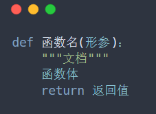
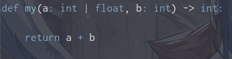
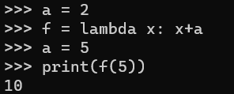
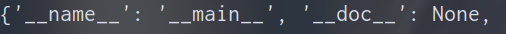

### ①定义
> - 函数代码块以 `def`关键词开头，后接函数标识符名称和圆括号 ()。函数:是组织好的，可重复使用的，用来实现特定功能的代码段。
>    1. 定义【形参、返回值均可省】：
>    
>    <br>
>    
>    2. 调用【先定义后使用】：`函数名(实参)`
>
> - 任何传入参数和自变量必须放在圆括号中间，圆括号之间可以用于定义参数。
> - 函数的第一行语句可以选择性地使用文档字符串—用于存放函数说明`"""  """`。
> - 函数内容以冒号 : 起始，并且缩进。
> -  函数定义不能为空，但是如果您出于某种原因写了无内容的函数定义，可用`pass`语句占位。  
> - return [表达式]结束函数，选择性地返回一个值给调用方，不带表达式的 return 相当于返回 None。
> - 关于参数类型限制以及返回值类型限制：
>    1. 参数类型限制：`参数名：参数类型`
>    2. 返回值限制：`def  函数名(参数) -> 返回值类型`
>    3. 参数类型支持多匹配，可以使用`|`或者`or`。
>    4. 参数类型也可以配合`assert`断言一起使用。
>    
>     <br>
>


---

### 2-参数传递

<br>

> 1.  函数基本的参数传递机制有两种：值传递和引用传递。  
> - 值传递：在方法调用时, 传递的是参数是按值的拷贝传递。
> -  引用传递：在方法调用时, 传递的参数是按引用进行传递, 其实传递的是引用的地址, 也就是变量所对应的内存空间的地址。 传递前和传递后都指向同一个引用, 也就是同一个内存空间。  
> 2. python目前流行的一种说法：Python不允许程序员选择采用传值还是传引用。Python参数传递采用的肯定是"传对象引用"的方式。实际上，这种方式相当于传值和传引用的一种综合。如果函数收到的是一个可变对象（dict、list、set）的引用，就能修改对象的原始值――相当于通过"传引用"来传递对象。如果函数收到的是一个不可变对象（number、str、tuple）的引用，就不能直接修改原始对象，相当于通过"传值"来传递对象。  
> 3. python有着自己的一套特殊的传参方式，这是由python动态语言的性质所决定的。
> 4. 下面进行一些实验：
>       - 在不对形参修改时，形参和实参的引用是一致的。
>       - 对于不可变类型参数，在不对形参修改时，形参和实参的引用是一致的。但是，由于是不可变类型，修改形参实际上是创建一个新的对象，并将形参重新引用该对象。而实参仍然引用原来对象，不会发生改变。
>       - 对于可变类型参数，在不对形参修改时，形参和实参的引用是一致的。修改形参时，由于是可变类型，直接对形参所引用的对象进行修改。而实参也是引用该对象，就跟着被修改了。

```python
# 实参和形参的引用是一致的

def my_fun(a, id_a):
	return id(a) == id_a

x = 4
print(my_fun(x, id(x)))  # True

y = ['a', 'b']
print(my_fun(y, id(y)))  # True
```
```python
# 不可变类型修改形参

def my_fun(a):
	print(f'形参[修改前]:{id(a)}')  # 1932184584528
	a = 5
	print(f'形参[修改后]:{id(a)}')  # 1932184584560

x = 4
print(f'实参:{id(x)}')  # 1932184584528
my_fun(x)
```

---

### 3-函数说明文档

<br>

> - 在函数下方使用`""" """`作为说明文档。
> - pycharm中文档格式设置见：[Pycharm教程](./2.Pycharm.md)
> - 通过`函数名.__doc__`可获取函数文档。通过`help(函数名)`可查看函数文档。

```python
def my(a: int, b: int) -> int:
    """
    函数注释
    :param a:整数
    :param b:整数
    :return:两数和
    """
    return a+b

print(my.__doc__)   # 获取函数文档
help(my)            # 查看函数文档
my(4, 5)            # 调用函数
```

---

### 4-参数

<br>

#### a-参数类型

<br>

> 1. 位置参数：也叫顺序参数，位置参数必须以正确的顺序传入函数，一一对应，调用时的数量必须和声明时的一样。
> 2. 关键字参数：使用形式参数的名字来确定输入的参数值`key=value`。通过此方式指定函数实参时，不再需要与形参的位置完全一致，只要将参数名写正确即可。
> 3. 缺省参数(默认参数)：定义函数时可以给参数设置默认值，当没有传递该参数时，则会使用默认参数。个人觉得缺省参数与位置参数，关键字参数参数没有明显对立关系。位置参数和关键字参数是两种传参方式，而缺省参数则是显示的一种定义方式。默认值参数也可以按照位置传参或者关键字传参。
> 4. 可变参数：
>    1. `*args`：参数以tuple的形式导入。其实相当于`*args, = 变量，变量，变量...`
>    2. `**kwargs`： 参数以dict的形式导入。
>    3. args和kwargs是习惯写法，可以用其他变量名称。
>    4. 可变参数实际上运用了解包压包的原理。
> 5. 注意事项：
>    1.  传参时，关键字参数后面必须都是关键字参数，因此位置参数要在关键字参数前面，并且关键字参数后面的默认参数也需要采用关键字参数的形式传参。
>    2.  无默认值参数必须在有默认值参数的前面(不包括`*args`及其后面的变量、`**kwargs`)。
>          1. `def my(a, b=2, c)`：报错
>          2. `def my(a, b=2, *args)`：正确
>          3. `def my(a, b=2, *args, c)`：正确，c必须用位置参数。
>    3. 其实很容易分析到`*args`后面必须使用关键字参数，或者使用默认参数。但是默认参数要传参仍然只能以关键字形式传参。
>    4. `*args`必须出现在`**kwargs`之前。`**kwargs`必须是位于最后的。
>          1. `def my(a,b=2,*args,**kwargs,c)`：错误
>    5.  建议设置默认值参数为不可变对象，如整数、浮点数、字符串等 。
> 6. 其实个人觉得就两种传参方式，一种直接传`变量|值`，还有一种就是`参数名=变量|值`。`*args`可以匹配任意个`变量|值`，而`**kwargs`可以匹配任意个`参数名=变量|值`。
> 7. 可以使用`函数名.__defaults__`查看函数的默认参数值。

```python
def my(name, age=10, *args, gender, classes='21', **kwargs):
    print(age)

# name可以位置传参，也可以关键自传参,采用关键字传参，则后面所有参数必须关键字传参
# age可以位置传参，可以不传参,也可以关键自传参,采用关键字传参，则后面所有参数必须关键字传参
# gender必须采用位置传参[*args]
# classes不传参,或者必须采用位置传参[*args]

# 个人觉得还是把默认参数放在*args后面好些,不然假设默认参数不传参，但是有可能*args的参数被传给默认参数。
```

<br>

#### b-强制位置参数

<br>

> - 函数的多个参数中间使用单独的星号`*`分隔，星号后面参数必须为关键字参数，星号本身不是参数。
> -  函数参数列表中的斜杠`/`表示在它之前的形参仅限位置形参。
> - `def my(a, b, /, c, d, *, e, f)`：a、b必须为位置参数，e、f必须为关键字参数。


---

<br>

### 6-匿名函数（lambda）

<br>

> - `lambda arg1, arg2, ..., argN]] : expression`
> - lambda多个参数使用`,`隔开。函数体比def定义函数简单很多。
> - 匿名函数的主体是一个表达式，而不是一个代码块。仅仅能在 lambda 表达式中封装有限的逻辑进去。 匿名函数不用也不能写return语句，表达式的结果就是其返回值。 匿名函数没有函数名字，不必担心函数名冲突 。
> -  我们把匿名函数对象赋给一个变量，只要直接调用该对象就可以使用匿名函数 。
> - lambda可以与`map()、filter()、reduce()、sorted()`一起使用。参考：⑨高阶函数【本节】。
> - 。
> - lambda 函数拥有自己的命名空间。
> - lambda也可以与字典配合使用，用于制作跳转表。
> - lambda 表达式中的自由变量，在运行时绑定值，而不是定义时就绑定，这跟函数的默认值参数定义是不同的。
>
>   <br>
>

```python
# 将lambda存储在字典中,制成跳转表
fun_dict = {'A': (lambda x: x+2), 'B': (lambda x: x+3)}
f = fun_dict[input(':')]
print(f(5))
```

---

### 7-多返回值

<br>

> - 一个函数可以有多个返回值，返回值之间用`,`隔开；同时我们也可按顺序用多个变量接收返回值。
> - 多返回值支持不同类型数据return。
> - 但其实多的返回值只是一个假象。当用一个变量接收多个返回值时就会发现，多个返回值实际上是以元组的形式返回的，其实还是只有一个返回值。只不过是拆开单个tuple返回值，并赋值给多个变量而已。

```python
def my_fun():
	return 1, 2


# 多变量接收
x, y = my_fun()

# 单个变量接收
a = my_fun()
print(type(a).__name__)  # tuple

```

---

### 8-全局变量与局部变量

<br>

> 代码不仅是写给机器执行的，更是写给程序员自己看的。因此为了避免局部变量和全局变量出现混淆，通常在定义全局变量时，增加 g_ 或者 gl_ 的前缀，或者字母全部大写。

> - 变量作用域：在python语言里，在函数内部定义的变量，仅在函数内有效。 在函数外面定义的变量对全局有效。 我们把这种变量的有效范围叫作变量的作用域。 
> - 在python中，当引用变量时，会按照**由内向外、由近及远**的找查变量的定义及赋值。
> - 变量分类：python全局变量和局部变量的区别在于**作用域**。
>    - 全局变量在整个py文件中声明，全局范围内可以使用；
>    - 局部变量是在某个函数内部声明的，只能在函数内部使用；
> - 在函数内部创建的变量在该函数内部可用，其对于所在函数内部的任何函数均可用，但是同样的在函数内部的函数中是无法修改其值的。修改的话需要参考闭包相关知识。

```python
# 局部变量对所在函数内部均可用
if __name__ == '__main__':

    def my():
        a = 5	
        def inside():	# 函数内可用a,但无法修改
            a = 7
        inside()
        print(a)
        
    my()    # 5
```
> - 在 Python 代码主体中创建的变量是全局变量，属于全局作用域。全局变量在任何范围（全局和局部）中可用。但在函数内无法修改其值。

```python
# 全局变量,全局可用，函数内无法修改
if __name__ == '__main__':
    a = 5

	def my():
    	print(a)
    	# 全局可用，函数内无法修改
	my()
```
> - 如果在函数内部和外部操作同名变量，Python会将它们视为两个单独的变量，一个在全局范围内可用（在函数外部），而一个在局部范围内可用（在函数内部）。其实就是由内到外原理，函数内会优先在函数内找该名称的变量。

```python
# 同名变量
if __name__ == '__main__':
    a = 7

    def my():
        a = 5
        print(a)   # 访问局部变量

    print(a)    # 访问全局变量
    my()
```
> global关键字：
>    1. 用于在函数内部创建一个全局变量。此时只有函数被调用全局变量才会创建。【不推荐、因为不可见】
>    2. 用于在函数内部修改一个全局变量。如果未使用global而在函数内执行全局变量赋值语句，实际上会在函数内创建一个局部变量【或者对同名局部变量赋值】。

```python
# global关键字使用
if __name__ == '__main__':
    def a():
        global a    # 函数调用时才创建
        a = 5

    a()  # 调函数，创建全局变量

    def b():
        global a    # 声明使用全局变量
        print(a)
    b()  # 调函数，访问全局变量

    def c():
        a = 3       # 实际创建了同名局部变量
        print(a)
    c()
```
> - 可通过`globals()`、`locals()`分别获取全局变量和局部变量，返回值为字典类型。<br>
> 

> - 运用分析：见下面，在my函数中并未对name列表本身内容进行修改，而是类似于一种访问。所以可以在函数内部对全局变量name列表中内容进行增删改。但是不能对name变量运用等号赋值，其在不使用global情况下会创建局部同名变量。
> - **可以认为python认为的函数内部修改全局变量，是指全局变量的id发生改变,也就是变量指向的地址发生改变。单纯的对可变类型添加内容，不修改id，其实是允许的。而闭包的自由变量同样是这样理解的。**

```python
# 关于可变类型全局变量的调用问题
if __name__ == '__main__':
    name = []
    print(id(name))  # 1993901205504

    def my():
        name.append("Dreamfish")
        print(id(name))  # 1993901205504

    my()
    print(name)  # ['Dreamfish']
```

---

### 9-高阶函数
#### a-简介

<br>

> - 以函数作为参数，或者返回一个函数的函数是高阶函数。
> - 在Python中，函数也是对象。Python允许我们引用这些函数对象，就像我们引用一个字符串、数字等一样。
> - 函数作为参数或返回值，实际上是一种计算逻辑的传递，而非数据的传递。

```python
# 函数做返回值

def my(n):
    return lambda x: x * n


ans = my(2)(3)
# 先调my(2)获取返回值函数,然后调返回值函数传参3
```
```python
# 函数做参数

def my(x, y, fun):
    return fun(x, y)


ans = my(2, 3, lambda a, b: a ** b)
```

<br>

#### b-高阶函数map、filter、zip、reduce

<br>

> 1. `zip(iterator, iterator, ...)`：将各个可迭代对象的对应位置元素打包成元组。将多个元组以zip对象形式返回。 元素最少的迭代器将决定新迭代器zip的长度 。 
> 2. `zip(* zipped)`:其实就是`*`序列解包，然后再次执行`zip()`达到还原的目的，结果仍是若干元组。
> 3. `map(function, iterables)`： 为 iterable 中的每个元素执行指定的函数。元素作为函数参数。 可以提供任意数量的可迭代对象，只需确保每个可迭代对象都有一个参数即可 。可以认为`map()`提供一种映射关系。
> 4. `filter(function, iterable)`：通过一个函数对iterable 中的元素进行过滤，返回一个迭代器。
> 5. `zip()`、`map()`、`filter()`在python3中均返回一个迭代器，只能在迭代器迭代一次，用完后元素虽然不会消失，但再次迭代会得到0个元素。
> 6. `functools.reduce(function, iterable[, initializer])`：需要从`functools`导入，参数`function`是一个两个参数的函数，`initializer`是初始值。 具体执行过程是先用传给 reduce中的函数function先对可迭代对象中的第 1、2 个元素进行操作，再用所得的结果再与第三个数据用function函数运算......最后得到一个结果 (有初始值时，初始值先参与函数运算)。
> 7. 计算累加继续使用`sum()`，不建议用`reduce()`。
> 8. `reduce()`好像不支持关键字传参。

ps：关于序列解包内容参考：[数据类型-序列](./4.数据类型.md)
```python
# zip

if __name__ == '__main__':
    a = [1, 2, 3]
    b = [4, 5, 6]
    c = [7, 8, 9]
    d = zip(a, b, c)

    print('first:', *d)		# 若干元组形式
    print('second:', list(d))   # 第二次空[迭代器]
```
```python
# map

if __name__ == '__main__':
	a = [1, 2, 3]
	b = [4, 5, 6]
	c = list(map(lambda x, y: x + y, a, b))
	# a,b对应元素相加，返回结果列表

	map_a = map(lambda x: x*x, a)
	print('first:', *map_a)		# 序列解包
	print('second:', list(map_a))	# 第二次空[迭代器]
```
```python
# filter

if __name__ == '__main__':
	ans = filter(lambda x: x % 2 == 0, range(1, 10))
	print('first:', *ans)   # 过滤出偶数
	print('second:', list(ans))  # 第二次空[迭代器]
```
```python
# reduce实现阶乘

from functools import reduce


def my_fun(n):	# 求阶乘,initializer参数也可以不传
    return reduce(lambda x, y: x + y, range(1, n+1), 1)


ans = my_fun(10)
```

---

### 10-函数对象属性

<br>

> 


---

### 11-闭包

<br>

#### a-简介

<br>

> 1. 首先，我们要知道Python程序是从上往下顺序执行的，而且碰到函数的定义代码块是不会立即执行的，只有等到该函数被调用时，才会执行其内部的代码块。
> 2. 在一个内部函数中，对外部作用域的变量进行引用， (并且一般外部函数的返回值为内部函数)，那么内部函数就被认为是闭包 (colsure)。
>    1. 函数嵌套。
>    2. 内部函数引用外部变量。
>    3. 外部函数返回值一般为内部函数。
> 3. 闭包可以保存外部函数内的变量，不会随着外部函数调用完而销毁，它有一个专业的术语叫做自由变量。注意它不是局部变量，局部变量在外部函数调用结束就会被销毁。
> 4. 同样的由于闭包引用了外部函数的变量，则外部函数的变量没有及时释放，就会消耗内存。
> 5. 关于`__closure__`属性讲解：[语法糖-装饰器](./7.语法糖.md)


#### b-nonlocal

<br>

> 1. 闭包无法修改外部函数的局部变量。 参考局部变量相关知识其实可以知道：当局部变量为可变类型是，不改变其内存地址，添加内容的话，是能够改变成功的。所以说是闭包无法改变外部函数局部变量指向的内存地址(id)。
> 2. 要想在内部函数修改外部函数的局部变量，需要将该局部变量定义为自由变量。请用关键字`nonlocal`声明变量不是本地变量。
> 3. `nonlocal`关键字的作用是标明 num 是一个闭包中的变量，nonlocal 关键字用于在嵌套函数内部使用变量，其中变量不应属于内部函数，它有一个专业的术语叫做自由变量。
> 4. 闭包中的引用的自由变量只和具体的闭包有关联，闭包的每个实例引用的自由变量互不干扰。一个闭包实例对其自由变量的修改会被传递到下一次该闭包实例的调用。参考下面计数器说明-e理解。

```python
# 计数器

def make_counter():
    num = 0

    def counter():  # 定义嵌套函数
        nonlocal num    # 声明为自由变量
        num += 1    # 引用外部变量
        return num

    return counter  # 返回内部函数


cou = make_counter()

for i in range(10):
    print(cou())
```
> 关于计数器代码说明：
>    1. 计数器通常会想到用类去实现，而非用函数实现，主要是因为类很容易保存数据，但是函数的变量在函数结束调用时就会被销毁。
>    2. 但是对于闭包函数而言，与内部函数关联的自由变量不会在外部函数结束时销毁，就可以用于保存数据。这也是很多时候选用闭包去替代一些简单类的原因。
>    3. 还是要强调，函数只有在调用时内部代码块才会被执行。上述代码执行`make_counter()`不会执行内部`counter()`中的代码块。
>    4. **个人理解：只要外部函数中的局部变量在内部函数中被使用(不一定要修改)，那它就和内部函数绑定，就是自由变量(因为内部函数引用了它，所以它不能销毁)。修不修改不是判断自由变量的依据。但是要在内函数中修改外函数中的局部变量(其实你已经确认要修改，那它应该算自由变量)，必须要使用**`nonlocal`**关键字声明。不然或默认在内部函数找(等号赋值会创建新变量)，或者进行运算会报错。**
>    5. 还有一件事：多次调用`make_counter()`产生的闭包实例，也就是`counter()`，他们所引用的`num`变量是互不干扰的，因为每次调`make_counter()`都会创建新的`num`。

<br>

#### c-属性__closure__

<br>

> 1. 和闭包相关的就是`__closure__`只读属性。`__closure__`属性定义的是一个包含cell对象的元组，其中元组中的每一个cell对象用来保存作用域中自由变量。
> 2. 函数对象的`__closure__`属性存着许多`cell`对象的元组，每个cell对象存储着一个自由变量的地址。当闭包被调用时，系统就会根据cell对象内存储地址找到对应的自由变量，完成整体的函数调用 。此外我们可以通过cell对象的`cell_contents`属性获取其存储的对应自由变量的真实值。
> 3. 此外自由变量的名称保存在函数对象的`__code__.co_freevars`里面，也是一个元组。它与只读属性`__closure__`中的`cell`对象是对应的。

```python
def make_counter():
    num = 0

    def counter():
        nonlocal num
        num += 1
        return num

    return counter


count = make_counter()
count()
print(count.__closure__[0].cell_contents)  # 1
print(count.__code__.co_freevars)  # ('num',)
```
<br>

#### d-踩坑

<br>

>  返回闭包时牢记的一点，返回函数不要引用任何循环变量，或者后续会发生变化的变量。  

```python
# 坑
def fun():
    list_a = []
    for i in range(3):
        def fu():   # 想三个函数分别返回0、1、2
            return i

        list_a.append(fu)
    return list_a


li = fun()
for f in li:
    print(f())  # 运行结果全是2
```
> 关于踩坑说明：
>    1. 原本想实现`fun()`中创建三个函数分别返回0、1、2，并将三个函数存储在`list_a`中，但是结果三个函数全返回2。
>    2. 根本原因是`i`造成的，在`fu()`中引用了`i`,变量`i`与函数`fu()`形成闭包，在循坏最后`i`变成了2，所以三个函数最终全返回2。
>    3. 解决措施：在`fu()`外面套一个`wrap(j)`函数，`fu()`与`j`形成闭包。而`i`作为`wrap(j)`的参数。每一次调用`wrap()`函数创建`fu()`,`wrap(j)`都是新的，互不干扰，也就说与`fu()`形成闭包的`j`是不同的。

```python
# 解决措施
def fun():
    list_a = []
    for i in range(3):
        def wrap(j):	# 包一个wrap
            def fu():   
                return j	# fu与j形成闭包
            return fu
        list_a.append(wrap(i))
    return list_a


li = fun()
for f in li:
    print(f())
```

---

### 12-深入理解函数
#### a.函数变量啥时候创建
#### b.函数对象的属性
#### c.泛型、类型控制

> typing.option 待补
