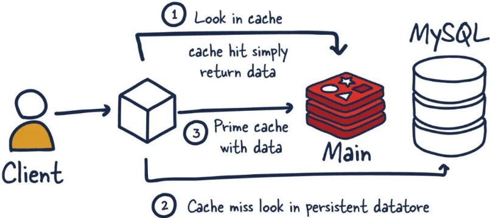
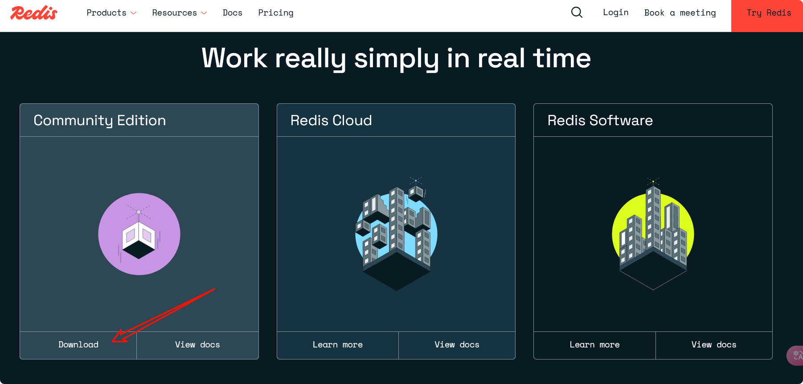

##### 入门概述

1. Redis 是什么？

   Remote Dictionary Server(远程字典服务)是完全开源的，使用ANSIC语言编写遵守BSD协议，是一个高性能的Key-Value数据库提供了丰富的数据结构，例如String、Hash、List、Set、SortedSet等等。数据是存在内存中的，同时Redis支持事务、持久化、LUA脚本、发布/订阅、缓存淘汰、流技术等多种功能特性提供了主从模式、Redis Sentinel和Redis Cluster集群架构方案

2. Redis 为啥出现？

   1. 内存存储 vs 磁盘存储：
      - 传统数据库（如 MySQL）的数据存储在磁盘上，而 Redis 将数据放在内存中。内存的读写速度比磁盘快几个数量级（纳秒 vs 毫秒），这使得 Redis 能实现极高的吞吐量和低延迟（微秒级响应）。
      - 适合需要快速响应的场景（如缓存、实时排行榜）。
   2. 数据结构多样化：
      - MySQL 以表格形式存储数据，适合结构化查询，但灵活性不足。
      - Redis 支持字符串（String）、列表（List）、哈希（Hash）、集合（Set）、有序集合（Sorted Set）等丰富的数据结构，天然适合实现缓存、计数器、消息队列、实时排行榜等功能。
   3. 高并发处理能力：
      - Redis 单线程模型避免了锁竞争，配合非阻塞 I/O 和多路复用技术，能轻松应对每秒数十万级的请求。
      - 对比 MySQL 在复杂查询或高并发写入时可能出现的性能瓶颈，Redis 更适合作为高速数据层。
   4. 扩展性与分布式：Redis 支持主从复制、哨兵（Sentinel）、集群（Cluster）模式，能横向扩展应对更大规模的数据和流量。

3. 学习新版本 Redis 技术的方式

   1. 官网:
   2. Redis 之父博客: 
   3. Redis 之父 Github : 

4. Redis 与 Mysql :

   Mysql从磁盘中查询数据，其性能发展遇到瓶颈，并且在实际使用中，Mysql查询业务查多数；此外 Mysql 查询方式也是基于索引查询的。由此 Redis (基于内存的 KV 键值对内存数据库)应运而生，其在内存中查询，且使用键值对的查询方式。

   Redis 的出现弥补了传统关系型数据库在高并发、低延迟场景的不足，而 MySQL 需要 Redis  作为高性能缓存和多样化数据结构的补充，二者结合形成分层存储架构，既能保证数据持久化和复杂查询，又能满足高并发和实时性需求。这种组合已成为现代互联网应用的标配。 

   > Redis 通常用于一些特定场景，需要与 Mysql 一起配合使用。两者并不是相互替换和竞争关系，而是共用和配合使用:
   >
   > - Redis 是 key-value 数据库( NoSQL 一种)，mysql是关系数据库
   > - Redis 数据操作主要在内存，而 mysql 主要存储在磁盘
   > - Redis 在某一些场景使用中要明显优于 mysql ，比如计数器、排行榜等

5. Redis之父安特雷兹 (Salvatore Sanfilippo)

6. Redis 的优势:

   1. 性能极高－Redis 能读的速度是110000次/秒，写的速度是81000次/秒。
   2. Redis 数据类型丰富，不仅仅支持简单的 key-value 类型的数据，同时还提供 list，set，zset，hash 等数据结构的存储。
   3. Redis 支持数据的持久化，可以将内存中的数据保持在磁盘中，重启的时候可以再次加载进行使用。
   4. Redis 支持数据的备份，即 master-slave 模式的数据备份。

 

##### 发展历程

##### 文档

1. 中文文档: [命令查询](http://doc.redisfans.com/)、[中文文档](https://www.redis.com.cn/documentation.html)
2. 源码阅读: [github](https://github.com/redis/redis)
3. 在线使用: ~~[try.redis.io](https://try.redis.io/)~~

> 中文官网[redis.net.cn](https://www.redis.net.cn/)，非官方网站，更新可能不及时，仅做学习使用。

##### 安装配置

1. 官网下载:[redis.io](https://redis.io/)

   

2. 

