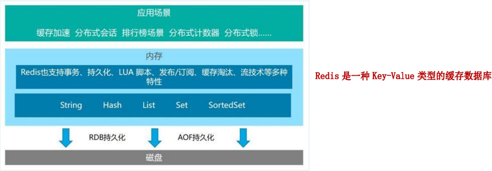
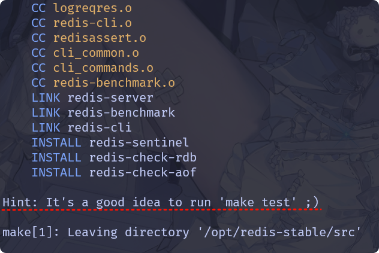

##### 入门概述

1. Redis 是什么？

   Remote Dictionary Server(远程字典服务)是完全开源的，使用ANSIC语言编写遵守BSD协议，是一个高性能的Key-Value数据库提供了丰富的数据结构，例如String、Hash、List、Set、SortedSet等等。数据是存在内存中的，同时Redis支持事务、持久化、LUA脚本、发布/订阅、缓存淘汰、流技术等多种功能特性提供了主从模式、Redis Sentinel和Redis Cluster集群架构方案

2. Redis 为啥出现？

   1. 内存存储 vs 磁盘存储：
      - 传统数据库（如 MySQL）的数据存储在磁盘上，而 Redis 将数据放在内存中。<font color=red>内存的读写速度比磁盘快几个数量级</font>（纳秒 vs 毫秒），这使得 Redis 能实现极高的吞吐量和低延迟（微秒级响应）。
      - 适合需要快速响应的场景（如缓存、实时排行榜）。
   2. 数据结构多样化：
      - MySQL 以表格形式存储数据，适合结构化查询，但灵活性不足。
      - Redis 支持字符串（String）、列表（List）、哈希（Hash）、集合（Set）、有序集合（Sorted Set）等丰富的数据结构，天然适合实现缓存、计数器、消息队列、实时排行榜等功能。
   3. 高并发处理能力：
      - Redis 单线程模型避免了锁竞争，配合非阻塞 I/O 和多路复用技术，能轻松应对每秒数十万级的请求。
      - 对比 MySQL 在复杂查询或高并发写入时可能出现的性能瓶颈，Redis 更适合作为高速数据层。
   4. 扩展性与分布式：Redis 支持主从复制、哨兵（Sentinel）、集群（Cluster）模式，能横向扩展应对更大规模的数据和流量。

3. 学习新版本 Redis 技术的方式

   1. 官网:
   2. Redis 之父博客: 
   3. Redis 之父 Github : 

4. Redis 与 Mysql :

   Mysql从磁盘中查询数据，其性能发展遇到瓶颈，并且在实际使用中，Mysql查询业务查多数；此外 Mysql 查询方式也是基于索引查询的。由此 Redis (基于内存的 KV 键值对内存数据库)应运而生，其在内存中查询，且使用键值对的查询方式。

   Redis 的出现弥补了传统关系型数据库在高并发、低延迟场景的不足，而 MySQL 需要 Redis  作为高性能缓存和多样化数据结构的补充，二者结合形成分层存储架构，既能保证数据持久化和复杂查询，又能满足高并发和实时性需求。这种组合已成为现代互联网应用的标配。<br>

   > Redis 通常用于一些特定场景，需要与 Mysql 一起配合使用。两者并不是相互替换和竞争关系，而是共用和配合使用:
   >
   > - Redis 是 key-value 数据库( NoSQL 一种)，mysql是关系数据库
   > - Redis 数据操作主要在内存，而 mysql 主要存储在磁盘
   > - Redis 在某一些场景使用中要明显优于 mysql ，比如计数器、排行榜等

5. Redis之父安特雷兹 (Salvatore Sanfilippo)

6. Redis 的优势:

   1. 性能极高－Redis 能读的速度是110000次/秒，写的速度是81000次/秒。
   2. Redis 数据类型丰富，不仅仅支持简单的 key-value 类型的数据，同时还提供 list，set，zset，hash 等数据结构的存储。
   3. Redis 支持数据的持久化，可以将内存中的数据保持在磁盘中，重启的时候可以再次加载进行使用。
   4. Redis 支持数据的备份，即 master-slave 模式的数据备份。

<br>

<br>


##### 发展历程

1. 发展历程简介：
   1. 初期版本阶段（2009 - 2011）：在 Redis 最初的版本中，开发人员主要关注将 Redis 构建为一个高效的键值存储系统，支持基本的字符串和列表操作功能。
   2. 版本 2.0 及更新版本的阶段（2011 - 2012）：Redis 2.0 带来了一些重要的特性，如虚拟内存和 Lua 脚本，这些特性让 Redis 变成一个更加强大的数据存储系统。此后，Redis 每个版本都会推出新特性。
   3. 高可用阶段（2012 - 2015）：Redis 2.4 中实现了主从复制，引入了用于分布式系统的标准工具包 Sentinel。2015年，Redis 的 Cluster 模式发布，让 Redis 可以像分布式数据库一样进行横向扩展。
   4. 发展阶段（2015 - 2018）：Redis 社区持续稳定地改进性能并增加新特性，如支持 Geo 搜索的 GEO 数据类型、对 Bitmaps 的支持，以及针对数据安全的增强功能。
   5. 数据分析阶段（2018 至今）：Redis 对数据分析的支持越来越强大，Redis Labs 发布了 RediSearch、RedisAI 和 RedisTimeSeries 等模块，让 Redis 用于数据科学和 AI 技术的开发变得更加容易。
   6. 云原生与模块化阶段（2018 - 2021）：随着云计算的普及，Redis 开始更加注重云原生环境的适配。Redis Labs 推出了 Redis Enterprise，支持多云和混合云部署，提供了自动扩展、持久化、备份和恢复等功能。此外，Redis 的模块化架构得到了进一步的发展，允许开发者通过加载模块来扩展 Redis 的功能，如 RediSearch、RedisGraph、RedisBloom 等模块的推出，极大地丰富了 Redis 的应用场景。
   7. 性能优化与安全增强阶段（2021 - 2023）：在这一阶段，Redis 继续专注于性能优化和安全增强。Redis 6.0 引入了多线程 I/O，显著提高了处理高并发请求的能力。同时，Redis 6.2 和后续版本进一步加强了安全性，支持了更细粒度的访问控制（ACL）和 TLS 加密通信，确保数据在传输和存储过程中的安全性。
   
   8. AI 与机器学习集成阶段（2023 至今）：随着人工智能和机器学习的快速发展，Redis 开始深度集成 AI 和机器学习功能。RedisAI 模块得到了进一步的优化，支持更多的深度学习框架和模型推理。Redis 还推出了 RedisML 模块，专门用于机器学习模型的存储和推理，使得 Redis 能够更好地服务于实时 AI 应用场景。
2. 版本命名规则：Redis从发布至今，已经有十余年的时光了，一直遵循着自己的命名规则：我们可以通过redis.io官网来下载自己感兴趣的[版本](https://download.redis.io/releases/)进行源码阅读：
   - 版本号第二位如果是奇数，则为非稳定版本 如2.7、2.9、3.1。
   - 版本号第二位如果是偶数，则为稳定版本 如2.6、2.8、3.0、3.2。
   - 当前奇数版本就是下一个稳定版本的开发版本，如2.9版本是3.0版本的开发版本。<br>


##### 文档

1. 中文文档: [命令查询](http://doc.redisfans.com/)、[中文文档](https://www.redis.com.cn/documentation.html)
2. 源码阅读: [github](https://github.com/redis/redis)
3. 在线使用: ~~[try.redis.io](https://try.redis.io/)~~

> 中文官网[redis.net.cn](https://www.redis.net.cn/)，非官方网站，更新可能不及时，仅做学习使用。


##### 安装配置

1. 官网下载:[redis.io](https://redis.io/)，一般不同发行版的软件仓库里都有，但是这里我们选择从源码安装。

   

2. 参考文档下载安装:

   1. 从 Redis 下载站点获取最新稳定版本的 Redis 源文件。
   2. 编译 Redis，首先解压 tar 包，切换到根目录，然后运行 make 。
   3. 若是需要构建 TLS 支持，您需要安装 OpenSSL 开发库(例如，Debian/Ubuntu 上的 libssl-dev)。
   4. 如果编译成功，您将在 src 目录下找到几个 Redis 二进制文件，包括：
      - redis-server：Redis 服务器本身
      - redis-cli 是与 Redis 通信的命令行界面实用工具。
   5. 在 `/usr/local/bin` 中安装这些二进制文件 。
   6. 安装完成后，您可以通过运行来启动 Redis,停止 Redis，请输入 `Ctrl-C` 。

   > <font color=red>注意在进行源码安装之前，需要先安装gcc</font>：gcc是linux下的一个编译程序，是C程序的编译工具。GCC(GNU Compiler Collection) 是 GNU(GNU's Not Unix) 计划提供的编译器家族，它能够支持 C, C++, Objective-C, Fortran, Java 和 Ada 等等程序设计语言前端，同时能够运行在 x86, x86-64, IA-64, PowerPC, SPARC和Alpha 等等几乎目前所有的硬件平台上。鉴于这些特征，以及 GCC 编译代码的高效性，使得 GCC 成为绝大多数自由软件开发编译的首选工具。虽然对于程序员们来说，编译器只是一个工具，除了开发和维护人员，很少有人关注编译器的发展，但是 GCC 的影响力是如此之大，它的性能提升甚至有望改善所有的自由软件的运行效率，同时它的内部结构的变化也体现出现代编译器发展的新特征。

   ```bash
   # 查看系统字长(推荐64位)
   getconf LONG_BIT
   
   # 查看gcc是否安装成功
   gcc -v
   
   # 下载最新源码
   wget https://download.redis.io/redis-stable.tar.gz
   
   # 解压并编译
   tar -xzvf redis-stable.tar.gz
   cd redis-stable
   make
   
   # TLS支持(先不管)
   # make BUILD_TLS=yes
   
   # 安装
   sudo make install
   ```

   <br>

   > - `uname -a` 是一个用于显示系统核心信息的命令，它会输出操作系统、内核版本、硬件架构等关键信息。
   > - `lscpu`显示 CPU 架构详细信息
   > - `cat /proc/cpuinfo`查看每个 CPU 核心的详细信息(型号、频率、缓存等)
   > - `lshw`列出完整的硬件配置(CPU、内存、主板、磁盘等)
   > - `free -h`查看内存和交换分区(Swap)使用情况
   > - `df -h`显示磁盘分区空间使用情况
   > - `lsblk`列出块设备(磁盘、分区)的树状结构
   > - `lsb_release -a`显示 Linux 发行版信息
   > - `hostnamectl`(systemd 系统专用)查看操作系统、内核版本和主机名：
   > - `ip a` 或 `ifconfig`查看网络接口和 IP 地址：
   > - `ss -tuln`显示当前监听的端口和连接状态：
   > - `inxi -F`一键获取完整的系统报告(需安装 inxi)：
   > - `neofetch`以美观的格式显示系统信息(需安装)：

3. 顺便介绍一下 docker 中安装 Redis:

   ```bash
   # 拉取镜像
   docker pull redis:7.4.2
   
   # 创建挂载点和redis配置文件
   mkdir -p /redis/conf
   mkdir -p /redis/data
   touch /opt/redis/conf/redis.conf
   
   # 创建容器并运行
   docker run \
   -v /redis/conf/redis.conf:/etc/redis/redis.conf  \
   -v /redis/data:/data \
   --restart=always \
   -dp 6379:6379 \
   --name redis \
   redis:7.4.2 \
   redis-server /etc/redis/redis.conf
   
   
   # 进入容器，连接redis
   docker exec -it redis bash
   redis-cli -a yx198973
   ```

   > - 在这里我们需要提供一个 redis.conf,其修改配置基本与下面一致，~~但是还需要额外修改`dir ./`为`dir /data`,方便数据卷挂载~~(默认的相对路径`./data`就是绝对路径`/data`)。
   > - <font color=red>需要注意: 配置文件中 `daemonize` 参数改回 `no` ,不然会与 docker 容器启动参数 `-d` 冲突导致容器无法启动。</font><br>

4. Redis 的默认安装路径为`/usr/local/bin`，我们不妨查看一下这个目录里的内容:

   - redis-benchmark:性能测试工具，服务启动后运行该命令，看看自己本子性能如何
   - redis-check-aof：修复有问题的AOF文件，rdb和aof后面讲
   - redis-check-dump：修复有问题的dump.rdb文件
   - redis-cli：客户端，操作入口
   - redis-sentinel：redis集群使用
   - redis-server：Redis服务器启动命令

   ```bash
   $ ls -al
   total 30556
   drwxr-xr-x  2 root root     4096 Feb 24 16:06 .
   drwxr-xr-x 12 root root     4096 Oct 26 22:06 ..
   -rwxr-xr-x  1 root root  6537712 Feb 24 16:06 redis-benchmark
   lrwxrwxrwx  1 root root       12 Feb 24 16:06 redis-check-aof -> redis-server
   lrwxrwxrwx  1 root root       12 Feb 24 16:06 redis-check-rdb -> redis-server
   -rwxr-xr-x  1 root root  7466416 Feb 24 16:06 redis-cli
   lrwxrwxrwx  1 root root       12 Feb 24 16:06 redis-sentinel -> redis-server
   -rwxr-xr-x  1 root root 17271464 Feb 24 16:06 redis-server
   ```

5. 修改配置文件: Redis 的配置文件是在安装源码中，我们一般会将保留作为备份，并复制一份新的作为 Redis 的配置文件。(需要说明: 我的源码下载位置为`/opt/redis-stable`,并且为了后续学习方便，我额外复制一份备份 `redis.conf.bak`)

   ```bash
   # 创建目录
   mkdir /redis
   
   # 复制配置文件
   cp /opt/redis-stable/redis.conf /redis/redis.conf
   cp /opt/redis-stable/redis.conf /redis/redis.conf.bak
   ```

6. 接下来我们需要对配置文件进行一定的修改:`vim /redis/redis.conf`

   1. `daemonize no`改为`daemonize yes`:将 Redis 以守护进程(后台服务)方式运行，退出终端后 Redis 不会关闭。
   2. `protected-mode yes`改为`protected-mode no`:关闭 Redis 的保护模式，允许外部网络直接连接 Redis。
   3. `bind 127.0.0.1`改为直接注释掉:(默认bind 127.0.0.1只能本机访问)或改成本机IP地址，否则影响远程IP连接
   4. 添加redis密码(requirepass字段后设置redis密码):设置 Redis 连接密码。

   ```bash
   daemonize yes
   protected-mode no
   # bind 127.0.0.1
   requirepass yx198973
   ```

7. 启动和关闭 Redis:

   ```bash
   # 启动
   redis-server
   
   # 以特定配置文件启动
   redis-server /redis/redis.conf
   
   # 查看 Redis 版本
   redis-server -v
   
   # 关闭
   shutdown # redis-cli 内部执行
   redis-cli -a <password> shutdown  # 单实例时远程关闭
   redis-cli -a <password> -p <port> shutdown  # 多实例时关闭某一端口的redis
   ```

   > 由于是后台启动，我们可以使用`ps -ef | grep redis | grep -v grep`查看进程。需要说明`grep -v grep` 中的 `-v`参数表示反向匹配，这一步会排除掉包含 `grep` 关键字的行。

   > 注意: 上面的关闭是指关闭 Redis 实例，与下面的 quit、exit (关闭连接)不同。

8. 连接 Redis 服务:通过参数 a 设置访问密码，参数 p 设置端口(省略则默认6379)。此外需要说明的是，当 Redis 没有设置密码的时候省略，但是若是有密码但是我们没有提供后续也可以使用`auth <password>`认证。

   ```bash
   # 连接
   redis-cli -a <password> -p <port>
   
   # 退出连接(或者CTRL-d)
   quit
   exit
   ```

   ```bash
   $ redis-cli -a yx198973 -p 6379
   Warning: Using a password with '-a' or '-u' option on the command line interface may not be safe.
   127.0.0.1:6379> ping
   PONG
   
   
   $ redis-cli -p 6379
   127.0.0.1:6379> ping
   (error) NOAUTH Authentication required.
   127.0.0.1:6379> auth yx198973
   OK
   127.0.0.1:6379> ping
   PONG
   ```

   > 如何处理`Warning: Using a password with '-a' or '-u' option on the command line interface may not be safe.`警告问题？warning 这串输出并不是普通输出，在shell的标准输出包含两种：1（标准输出）和2（标准错误）我们的命令，即包含1也包含2，2即是我们想要去除的提示。解决办法将标准错误去除即可，追加 `2>/dev/null`，将标准错误丢弃即可，就没有烦人的警告了。即运行`redis-cli -a yx198973 -p 6379 2>/dev/null`连接 Redis。

   > Redis 的 `PING` 命令是一个简单但实用的工具，主要用于以下场景：
   >
   > - 检测连接状态：检查与 Redis 服务器的连接是否正常。
   > - 测试延迟：测量客户端与服务器之间的往返时间（RTT）。
   > - 验证服务可用性：确认 Redis 服务是否正在运行。

9. 卸载 Redis:

   1. 关闭 redis-server 服务(关闭实例)，后续检查端口号判断是否正确关闭。
   2. 删除 `/usr/local/bin` 目录下与 Redis 相关文件: `rm -rf /usr/local/bin/redis-*`


##### 配置文件权限问题

1. 对于上述的配置文件目录包括后面的持久化存储文件所在目录，我们最好赋予 Redis 控制权限。 这样后续使用 `config rewrite` 命令存储配置或者自动快照时才不会因为权限不足而报错。

2. 实际上一般而言，使用 Redis 会创建一个 redis 的用户，提供 Redis 权限。我们只需要赋予 redis 用户权限即可。但是上述安装方式没有生成 redis 用户，我们可以手动创建。

   ```bash
   # 创建 redis 用户和组
   sudo groupadd redis
   sudo useradd -r -g redis -s /bin/false redis
   
   # 验证用户是否存在
   id redis
   ```

   > - `-s /bin/false` 将用户的登录 Shell 设置为 `/bin/false`，这一设置的目的是禁止该用户通过任何方式登录系统，从而增强系统安全性。`/sbin/nologin` 也会禁止登录，但会提示一条消息（如 `This account is currently not available`），适合需要友好提示的场景。`/bin/false` 则静默退出，不显示任何信息，适合需要完全禁止交互的场景。
   > - Linux 中的 `id` 命令用于显示用户和组的身份信息，包括用户 ID（UID）、主组 ID（GID）以及所属的所有组。它在用户管理、权限检查和脚本编写中非常实用。

3. 具体赋权操作:

   1. 查看 redis 执行用户:`ps -eo pid,user,comm | grep redis-server`
   2. 修改目录权限为上述用户:`sudo chown -R <user>:<group> <dir>`
   3. 提供读写权限给相关用户:`sudo chmod -R 755 <dir>`

   ```bash
   ps -eo pid,user,comm | grep 775
   #  775 fish     redis-server
   
   sudo chown -R fish:fish /redis
   
   sudo chmod -R 755 /redis
   ```

4. 在上述配置中，赋予用户控制权后，是否还需要赋予读写权限:修改所有权 chown 解决了谁能控制的问题，而修改权限 chmod 解决了能做什么的问题,两者缺一不可。

   - 所有权(Ownership)表示文件/目录的归属用户和组。
   - 权限(Permissions)定义用户、组和其他人对文件/目录的访问规则(读、写、执行)。

5. 在大多数 Linux 发行版中，创建用户时默认会生成一个与用户名同名的用户组，当然也可以查看自己所属用户组:

   ```bash
   # id 命令
   id fish
   # 输出示例：
   # uid=1000(fish) gid=1000(fish) groups=1000(fish),4(adm),24(cdrom)
   
   #  groups 命令
   groups fish
   # 输出示例：
   # fish : fish adm cdrom
   ```

6. 进程启动时，系统会动态分配一个唯一的 PID (范围通常为 1~32768),进程终止后，其 PID 会被释放，后续可能被其他进程复用。

   ```bash
   # 查看然 redis 进程 id
   ps -eo pid,comm | grep redis-server
   # 775 redis-server
   ```


##### wsl运行redis报错

在 wsl (archlinux) 中运行 redis 出现一下形式报错:

```bash
506:C 24 Feb 2025 18:57:41.270 # WARNING Memory overcommit must be enabled! Without it, a background save or replication may fail under low memory condition. Being disabled, it can also cause failures without low memory condition, see https://github.com/jemalloc/jemalloc/issues/1328. To fix this issue add 'vm.overcommit_memory = 1' to /etc/sysctl.conf and then reboot or run the command 'sysctl vm.overcommit_memory=1' for this to take effect.
```

参照报错提供的解决方式，我们创建`/etc/sysctl.conf`并在其中加入`vm.overcommit_memory = 1`后重新启动并未解决问题。但是运行`sudo sysctl -p`重新加载 `/etc/sysctl.conf` 中的配置后，问题得到解决。但是当我们再次重新 wsl 后，仍会报错，此时我们执行 `sudo sysctl -p` 问题再次得到解决。

显然，我们每次重新启动后执行 `sudo sysctl -p` 是很麻烦的，此时一个很简单的方式就是编写一个自启动服务，每次 wsl 启动时自定执行。但是我们这里提供另一种解决方式。

首先赋予当前角色执行 `sysctl -p` 无需密码的权限:执行`sudo EDITOR=vim visudo`并添加如下内容

```bash
<username> ALL=(ALL) NOPASSWD: /sbin/sysctl -p
```

编辑`~/.zshrc ` 添加

```bash
# 自动加载 sysctl 配置
sudo sysctl -p >/dev/null 2>&1
```

后续只需要重启 wsl 即可。
