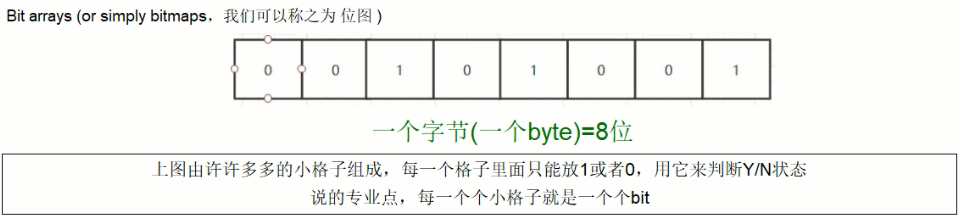
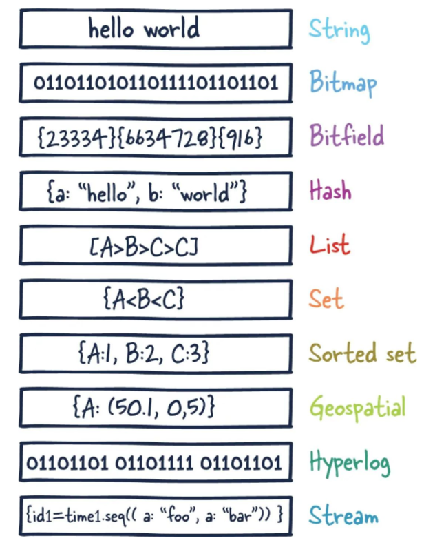

##### 概述

1. 官方文档关于数据类型的介绍:[data-types](https://redis.io/docs/latest/develop/data-types/)。
2. <font color=red>需要提前说明的是，所谓数据类型指的是 value 类型，key的类型一般都是字符串！</font>
3. 数据类型：
   - String: 字符串是redis最基本的类型，一个key对应一个value。string类型是二进制安全的，意思是redis的string可以包含任何数据，比如jpg图片或者序列化的对象 。string类型是Redis最基本的数据类型，一个redis中字符串value最多可以是 512 M。
   - List: redis列表是简单的字符串列表，按照插入顺序排序。你可以添加一个元素到列表的头部(左边)或者尾部(右边)它的底层实际是个双端链表，最多可以包含 $2^{32} - 1$ 个元素 (4294967295, 每个列表超过40亿个元素)。
   - Redis hash: 一个 string 类型的 field（字段） 和 value（值） 的映射表，hash 特别适合用于存储对象。Redis 中每个 hash 可以存储 $2^{32} - 1 $键值对（40多亿）
   - Set: Redis 的集合是 String 类型的无序集合。集合成员是唯一的，这就意味着集合中不能出现重复的数据，集合对象的编码可以是 intset 或者 hashtable。Redis 中Set集合是通过哈希表实现的，所以添加，删除，查找的复杂度都是 O(1)。集合中最大的成员数为 $2^{32} - 1$ (4294967295, 每个集合可存储40多亿个成员)。
   - zset(sorted set): Redis 的有序集合和 set 一样也是 string 类型元素的集合,且不允许重复的成员。不同的是每个元素都会关联一个 double 类型的分数，redis 正是通过分数来为集合中的成员进行从小到大的排序。zset 的成员是唯一的,但分数 (score) 却可以重复。 zset 集合是通过哈希表实现的，所以添加，删除，查找的复杂度都是 O(1)。 集合中最大的成员数为 $2^{32} - 1$。
   - Geospatial:Redis GEO 主要用于存储地理位置信息，并对存储的信息进行操作，包括添加地理位置的坐标、获取地理位置的坐标、计算两个位置之间的距离。根据用户给定的经纬度坐标来获取指定范围内的地理位置集合。
   - HyperLogLog 是用来做基数统计的算法，HyperLogLog 的优点是，在输入元素的数量或者体积非常非常大时，计算基数所需的空间总是固定且是很小的。在 Redis 里面，每个 HyperLogLog 键只需要花费 12 KB 内存，就可以计算接近 2^64 个不同元素的基 数。这和计算基数时，元素越多耗费内存就越多的集合形成鲜明对比。但是，因为 HyperLogLog 只会根据输入元素来计算基数，而不会储存输入元素本身，所以 HyperLogLog 不能像集合那样，返回输入的各个元素。
   - bitmap: 由0和1状态表现的二进制位的 bit 数组。<br>
   - bitfield:通过bitfield命令可以一次性操作多个比特位域(指的是连续的多个比特位)，它会执行一系列操作并返回一个响应数组，这个数组中的元素对应参数列表中的相应操作的执行结果。说白了就是通过bitfield命令我们可以一次性对多个比特位域进行操作。
   - Redis Stream 是 Redis 5.0 版本新增加的数据结构。Redis Stream 主要用于消息队列（MQ，Message Queue），Redis 本身是有一个 Redis 发布订阅 (pub/sub) 来实现消息队列的功能，但它有个缺点就是消息无法持久化，如果出现网络断开、Redis 宕机等，消息就会被丢弃。简单来说发布订阅 (pub/sub) 可以分发消息，但无法记录历史消息。而 Redis Stream 提供了消息的持久化和主备复制功能，可以让任何客户端访问任何时刻的数据，并且能记住每一个客户端的访问位置，还能保证消息不丢失。
4. 类型示意图:<br>
5. 命令查询文档:
   1. [官网(en)](https://redis.io/docs/latest/commands/)
   2. [中文(zh)](https://redis.com.cn/commands.html)


##### 键(key)

1. 为了方便案例的理解，我们假设在 0 号数据库和 3 号数据库执行以下操作，且后续示例都是在此基础之上互不影响:

   ```bash
   # 0 号数据库
   127.0.0.1:6379> set key1 abc
   OK
   127.0.0.1:6379> set key2 abc
   OK
   
   # 3 号数据库
   127.0.0.1:6379> select 3
   OK
   127.0.0.1:6379[3]> set key3 abc
   OK
   ```

2. 常用命令:  tab 键可以提示！！！

   - `key <pattern>` 查看当前数据库中符合匹配规则的 key :

     ```bash
     127.0.0.1:6379[3]> select 0
     OK
     127.0.0.1:6379> keys *
     1) "key2"
     2) "key1"
     127.0.0.1:6379> keys key[2-3]
     1) "key2"
     
     127.0.0.1:6379> select 3
     OK
     127.0.0.1:6379[3]> keys *
     1) "key3"
     127.0.0.1:6379[3]> keys key[2-3]
     1) "key3"
     ```

     > - `key *` 查看数据库的所有 key 。
     > - 生产环境使用 KEYS 命令需要非常小心,在大的数据库上执行命令会影响性能。

   - `exists <key>` 判断某些 key 是否存在。对于单个 key 而言，存在返回1，不存在返回0。也可以一次检查多个 key 是否存在，这种情况下，返回待检查 key 中存在的 key 的个数。

     ```bash
     127.0.0.1:6379[3]> select 0
     OK
     127.0.0.1:6379> exists key1
     (integer) 1
     127.0.0.1:6379> exists key3
     (integer) 0
     
     127.0.0.1:6379[3]> select 0
     OK
     127.0.0.1:6379> exists key1 key2 key3
     (integer) 2
     ```

     > - 如果相同的 key 在参数列表中出现了多次，它会被计算多次。

   - `type <key>` 以字符串的形式返回存储在 `key` 中的值的类型。可返回的类型是: `string`, `list`, `set`, `zset`,`hash` 和 `stream`

     ```bash
     127.0.0.1:6379> select 0
     OK
     127.0.0.1:6379> type key2
     string
     ```

   - `del <key>` 用于删除给定的一个或多个 `key` ,不存在的 `key` 会被忽略。返回被删除 `key` 的数量

     ```bash
     127.0.0.1:6379> select 3
     OK
     127.0.0.1:6379[3]> del key3
     (integer) 1
     127.0.0.1:6379[3]> keys *
     (empty array)
     
     
     127.0.0.1:6379[3]> select 0
     OK
     127.0.0.1:6379> del key1 key2
     (integer) 2
     127.0.0.1:6379> keys *
     (empty array)
     ```

   - `unlink key` 非阻塞删除，仅仅将 keys 从 keyspace 元数据中删除，真正的删除会在后续异步中操作。

     > 用于删除指定的 `key` 。就像 DEL 一样，如果 `key` 不存在，则将其忽略。但是，该命令会执行命令之外的线程中执行实际的内存回收，因此它不是阻塞，而 DEL 是阻塞的。

   - `expire <key> <seconds>`设置 key 的过期时间(单位 s )，设置的时间过期后，key 会被自动删除。

     ```bash
     127.0.0.1:6379> select 0
     OK
     127.0.0.1:6379> expire key1 3
     (integer) 1
     127.0.0.1:6379> ttl key1
     (integer) 2
     127.0.0.1:6379> ttl key1
     (integer) 1
     127.0.0.1:6379> ttl key1
     (integer) -2
     ```

     > - 设置超时成功返回 1 ，key 不存在则返回 0 。
     > - 已存在的旧 key 使用 RENAME 改名，那么新 key 会继承所有旧 key 的属性。例如 key使用 RENAME 改名后，过期时间被转移到新 key 上。

   - `ttl key` 以秒为单位返回 key 的剩余过期时间，key 不存在返回 -2 (已过期)，key 存在但是没有关联超时时间返回 -1 (即永不过期)。 

     ```bash
     127.0.0.1:6379[3]> select 0
     OK
     127.0.0.1:6379> ttl key2
     (integer) -1
     127.0.0.1:6379> ttl key6
     (integer) -2
     ```

   - `select <dbindex>` 切换数据库【0-15】，默认数据库为0。

     ```bash
     127.0.0.1:6379> select 0
     OK
     127.0.0.1:6379> keys *
     1) "key2"
     2) "key1"
     
     
     127.0.0.1:6379> select 3
     OK
     127.0.0.1:6379[3]> keys *
     1) "key3"
     ```

     > - Redis 可选择的数据库是一种逻辑命名空间格式m物理上所有的数据库还是持久化在一起的，在同一个RDB/AOF文件中。
     > - 不同的数据库中可以有同名的 key。
     > - 从实际应用角度出发，Redis databases 主要用来表示不同的 `key` 属于同一个应用，而不是一个 Redis 实例对应多个不同的应用。

   - `move <key> <dbindex>` 将当前数据库的指定 key 移动到数据库 dbindex (【0-15】)中。

     ```bash
     127.0.0.1:6379[3]> select 0
     OK
     127.0.0.1:6379> move key1 3
     (integer) 1
     127.0.0.1:6379> select 3
     OK
     127.0.0.1:6379[3]> keys *
     1) "key3"
     2) "key1"
     ```

     > -  `key` 被移动返回 1 ，反之返回 0 。
     > - 如果 `key` 在目标数据库中已存在，或者 `key` 在源数据库中不存，则`key` 不会被移动。

   - `dbsize` 查看当前数据库中 key 的数量。

     ```bash
     127.0.0.1:6379[3]> select 0
     OK
     127.0.0.1:6379> dbsize
     (integer) 2
     
     
     127.0.0.1:6379> select 3
     OK
     127.0.0.1:6379[3]> dbsize
     (integer) 1
     ```

   - `flushdb`清空当前库。

     ```bash
     127.0.0.1:6379[3]> select 3
     OK
     127.0.0.1:6379[3]> flushdb
     OK
     127.0.0.1:6379[3]> keys *
     (empty array)
     ```

     > `FLUSHALL` 和`FLUSHDB`  增加了`ASYNC`  来使整个数据集或单个数据库异步释放。异步`FLUSHALL` 和`FLUSHDB` 命令仅仅删除它们被调用时已经存在的 key。命令调用之后，删除 key 的过程中新建的 key 不受影响。

   - `flushall`通杀全部库。

     ```bash
     127.0.0.1:6379[3]> select 3
     OK
     127.0.0.1:6379[3]> dbsize
     (integer) 1
     127.0.0.1:6379[3]> flushall
     OK
     127.0.0.1:6379[3]> dbsize
     (integer) 0
     127.0.0.1:6379[3]> select 0
     OK
     127.0.0.1:6379> dbsize
     (integer) 0
     ```

     > `FLUSHALL` 和`FLUSHDB`  增加了`ASYNC`  来使整个数据集或单个数据库异步释放。异步`FLUSHALL` 和`FLUSHDB` 命令仅仅删除它们被调用时已经存在的 key。命令调用之后，删除 key 的过程中新建的 key 不受影响。

3. Redis 数据库数量默认为 16 个，即【0-15】，且默认数据库为 0 号数据库。但是实际上我们可以在 redis.conf 配置数据库的数量:

   ```bash
   # Set the number of databases. The default database is DB 0, you can select
   # a different one on a per-connection basis using SELECT <dbid> where
   # dbid is a number between 0 and 'databases'-1
   databases 16
   ```

   > 使用 `redis-cli` 连接 Redis 时，可以使用参数 n 指定连接的数据库；例如 `redis-cli -n 3` 连接 3 号数据库。


##### 补充

1. 在 Redis 中命令是不区分大小写的，但是 key 区分大小写。

   ```bash
   127.0.0.1:6379> set Key1 aaa
   OK
   127.0.0.1:6379> get key1
   (nil)
   127.0.0.1:6379> get Key1
   "aaa"
   ```

2.  Redis 提供查询命令 `help @<type>` 可以查询指定 type 类型的命令用法( type 大小写无影响，底层应该是统一进行转换了)。

   ```bash
   127.0.0.1:6379> help @string
   
     APPEND key value
     summary: Appends a string to the value of a key. Creates the key if it doesn't exist.
     since: 2.0.0
   
     DECR key
     summary: Decrements the integer value of a key by one. Uses 0 as initial value if the key doesn't exist.
     since: 1.0.0
   
     DECRBY key decrement
     summary: Decrements a number from the integer value of a key. Uses 0 as initial value if the key doesn't exist.
     since: 1.0.0
   
     GET key
     summary: Returns the string value of a key.
     since: 1.0.0
   
     GETDEL key
     summary: Returns the string value of a key after deleting the key.
     since: 6.2.0
     ...
   ```


##### String

1. 单 key 单 value。

2. 官网关于字符串类型描述:Redis 字符串存储字节序列，包括文本、序列化对象和二进制数组。因此，字符串是与 Redis 键关联的最简单类型的值。它们通常用于缓存，但还支持额外的功能，让您可以实施计数器并执行位运算。Redis 键是字符串，当我们也将字符串类型用作值时，我们是在将一个字符串映射到另一个字符串。字符串数据类型适用于多种用例，如缓存 HTML 片段或页面。

3. 常用命令:

   - `SET` 命令用于将键 key 设定为指定的字符串值。如果 key 已经保存了一个值，那么这个操作会直接覆盖原来的值，并且忽略原始类型。当 set 命令执行成功之后，之前设置的过期时间都将失效。

     > `SET key value [NX | XX] [GET] [EX seconds | PX milliseconds |EXAT unix-time-seconds | PXAT unix-time-milliseconds | KEEPTTL]`
     >
     > - `EX seconds` 设置键 key 的过期时间，单位时秒
     > - `PX milliseconds` 设置键 key 的过期时间，单位时毫秒
     > - `NX` 只有键 key 不存在的时候才会设置 key 的值
     > - `XX`只有键 key 存在的时候才会设置key的值
     > - `EXAT`设置键将在指定的 Unix 时间戳过期，以秒为单位（一个正整数）
     > - `PXAT`设置键将在指定的 Unix 时间戳过期，单位为毫秒（一个正整数）
     > - `KEEPTTL` 获取 key 的过期时间
     > - `GET`返回 key 存储的值，如果 key 不存在返回空
     >
     > 注意: 由于 SET 命令加上选项已经可以完全取代 SETNX, SETEX, PSETEX, GETSET的功能，所以在将来的版本中，Redis 可能会不推荐使用并且最终抛弃这几个命令。

     ```bash
     # 重复 key 会被覆盖
     127.0.0.1:6379> set name dream
     OK
     127.0.0.1:6379> set name fish
     OK
     127.0.0.1:6379> get name
     "fish"
     
     # get
     127.0.0.1:6379> set name dream
     OK
     127.0.0.1:6379> set name fish get
     "dream"
     
     # 时间戳
     # java(秒级): System.out.println(Long.toString(System.currentTimeMillis()/1000L))
     # linux:	秒级 date +%s  毫秒级 date +%s%3N
     127.0.0.1:6379> set age 12 exat 1740461600
     OK
     127.0.0.1:6379> ttl age
     (integer) 127
     127.0.0.1:6379> ttl age
     (integer) 125
     
     # keepttl
     127.0.0.1:6379> set age 12 exat 1740462600
     OK
     127.0.0.1:6379> set age 13 keepttl
     OK
     127.0.0.1:6379> ttl age
     (integer) 961
     ```

     > 当 set 命令执行成功之后，之前设置的过期时间都将失效，此时若是想 set 后 key 任然延续之前的过期时间设置，则需要使用 `keepttl`参数。

   - `GET key`获取 key 的值。如果键不存在，则返回特殊值 nil 。如果存储在 key 中的值不是字符串，则返回错误，因为 GET 仅处理字符串值。

   - `MSET key value [key value ...]`命令用于给定键设值。MSET 用新值替换现有值，就像常规的 SET 。

     ```bash
     127.0.0.1:6379> mset name dream age 12
     OK
     127.0.0.1:6379> keys *
     1) "name"
     2) "age"
     ```

     > `MSET` 是原子的，所以所有给定的键一次设置,客户端无法看到一些键已更新而其他键未变。

   - `MGET key [key ...]` 返回所有指定键的值。对于每个不包含字符串值或不存在键，返回特殊值 `nil` 。因此，此操作永远不会失败。

   - `MSETNX key value [key value ...]`设置给定的键为其相应的值，即使只有一个键已存在，也不会执行任何操作。

     ```bash
     127.0.0.1:6379> set name fish
     OK
     127.0.0.1:6379> keys *
     1) "name"
     127.0.0.1:6379> msetnx name fish age 21
     (integer) 0
     127.0.0.1:6379> keys *
     1) "name"
     ```

     > `MSETNX` 是原子的，所以所有给定的键一次设置,要么都操作成功，要么都操作失败。

   - `GETRANGE key start end`返回存储在 key 处的字符串值的子字符串，由偏移量 start 和 end (两者均包含)确定

     ```bash
     127.0.0.1:6379> set name dream_fish
     OK
     127.0.0.1:6379> getrange name 0 -2
     "dream_fis"
     ```

     > 其实就是类似于 python 的切片，同意样支持负索引。

   - `SETRANGE key offset value`覆盖键存储的字符串的一部分，从指定的偏移量开始，长度与值相同。

     ```bash
     127.0.0.1:6379> set name dream_fish
     OK
     127.0.0.1:6379> setrange name 0 Dream
     (integer) 10
     127.0.0.1:6379> get name
     "Dream_fish"
     127.0.0.1:6379> setrange name 10 _add
     (integer) 14
     127.0.0.1:6379> get name
     "Dream_fish_add"
     ```

     > 如果偏移量大于键当前字符串的长度，则字符串用零字节填充以使偏移量匹配。不存在的键被视为空字符串，因此此命令将确保它包含足够大的字符串，以便能够在偏移量处设置值。

   - 数值加减命令:<font color=red>一定要是数字字符串才行!!!</font>

     > - `INCR key` 增加存储在 key 处的数字的值。如果键不存在，则在执行操作之前将其设置为 0 。如果键包含错误类型的值或包含无法表示为整数的字符串，则返回错误。
     > - `INCRBY key increment`增加存储在 key 处的数字 increment 。如果键不存在，则在执行操作之前将其设置为 `0` 。如果键包含错误类型的值或包含无法表示为整数的字符串，则返回错误。
     > - `DECR key` 递减存储在 key 处的数字。如果键不存在，则在执行操作之前将其设置为 0 。如果键包含错误类型的值或包含无法表示为整数的字符串，则返回错误。
     > - `DECRBY key decrement`增加存储在 key 处的数字的值。如果键不存在，则在执行操作之前将其设置为 0 。如果键包含错误类型的值或包含无法表示为整数的字符串，则返回错误
     > - `INCRBYFLOAT key increment` 增加存储在 key 处的浮点数字符串的指定值 increment 。通过使用负的 increment 值，结果是将存储在键中的值递减（根据加法的明显性质）。如果键不存在，则在执行操作之前将其设置为 0 。
     > - <font color=red>INCRBYFLOAT、DECRBY、INCRBY 的 increment 都是支持负数的！</font>

     ```bash
     127.0.0.1:6379> dbsize
     (integer) 0
     127.0.0.1:6379> incr num
     (integer) 1
     127.0.0.1:6379> incrby num 7
     (integer) 8
     127.0.0.1:6379> incrby num -1
     (integer) 7
     127.0.0.1:6379> decr num
     (integer) 6
     127.0.0.1:6379> decrby num -3
     (integer) 9
     
     127.0.0.1:6379> incrbyfloat float 0.6
     "0.6"
     127.0.0.1:6379> incrbyfloat float -0.3
     "0.3"
     127.0.0.1:6379>
     
     ```

   - `STRLEN key`返回存储在 key 处的字符串值的长度。当 key 包含非字符串值时，返回错误。

   - `APPEND key value` 如果 key 已经存在且是字符串，则此命令将 value 附加到字符串末尾。如果 key 不存在，则创建并设置为空字符串,然后追加。

     ```bash
     127.0.0.1:6379> dbsize
     (integer) 0
     127.0.0.1:6379> append name dream
     (integer) 5
     127.0.0.1:6379> strlen name
     (integer) 5
     ```

   - `GETSET key value`其实就是`set key value get`,原子地将 `key` 设置为 `value` ，并返回存储在 `key` 中的旧值。当 `key` 存在但不是字符串值时返回错误。在成功执行 `SET` 操作后，与键关联的任何先前生存时间都会被丢弃。

   - 分布式锁:这里不重点研究，后续补充

     > - `SETNX key value` 将 key 设置为包含字符串 value ，如果 key 不存在,在这种情况下等于 SET 。当 key 已经持有值时，不执行任何操作。
     > - `SETEX key seconds value`将 key 设置为保存字符串 value ，并将 key 在给定秒数后超时。
     > - <font color=red>上述命令在2.6.12版本已被标记为过时！</font>

4. 应用场景:

   1. 视频或者商品的点赞。
   2. 微信公众号文章记录多少人喜欢。


##### list

1. 单 key 多 value。

2. 底层实际是个双向链表，对两端的操作性能很高，通过索引下标的操作中间的节点性能会较差。一个双端链表的结构，容量是2的32次方减1个元素，大概40多亿，主要功能有push/pop等，一般用在栈、队列、消息队列等场景。left、right都可以插入添加,如果键不存在，创建新的链表,如果键已存在，新增内容;<font color=red>如果值全移除，对应的键也就消失了</font>。<br>

3. 常用命令:

   - `LPUSH key element [element ...]`将所有指定的值插入到 key 中存储的列表的开头。如果 key 不存在，则在执行推送作之前将其创建为空列表。当 key 包含非列表的值时，将返回错误。

   - `RPUSH key element [element ...]`将所有指定的值插入存储在 key 的列表的尾部。如果 key 不存在，则在执行推送作之前将其创建为空列表。当 key 包含非列表的值时，将返回错误。

   - `LRANGE key start stop`返回存储在 key 处的列表的指定元素，偏移量 start 和 stop 是从零开始的索引,支持负索引。

     ```bash
     127.0.0.1:6379> rpush list 1 2 3
     (integer) 3
     127.0.0.1:6379> lrange list 0 -1
     1) "1"
     2) "2"
     3) "3"
     127.0.0.1:6379> lpush list -1 -2 -3
     (integer) 6
     127.0.0.1:6379> lrange list 0 -1
     1) "-3"
     2) "-2"
     3) "-1"
     4) "1"
     5) "2"
     6) "3"
     ```

   - `LPOP key [count]`删除并返回存储在 key 处的列表的第一个元素。默认情况下，该命令从列表的开头弹出一个元素。当提供可选的 `count` 参数时，回复将包含最多 count 个元素，具体取决于列表的长度。

   - `RPOP key [count]`删除并返回存储在 key 处的列表的最后一个元素。默认情况下，该命令从列表末尾弹出单个元素。当提供可选的 count 参数时，回复将包含最多 count 个元素，具体取决于列表的长度。

     ```bash
     127.0.0.1:6379> rpush list 1 2 3 4 5 6
     (integer) 6
     127.0.0.1:6379> lrange list 0 -1
     1) "1"
     2) "2"
     3) "3"
     4) "4"
     5) "5"
     6) "6"
     127.0.0.1:6379> lpop list 2
     1) "1"
     2) "2"
     127.0.0.1:6379> rpop list
     "6"
     127.0.0.1:6379> lrange list 0 -1
     1) "3"
     2) "4"
     3) "5"
     ```

   - `LINDEX key index`返回存储在key 处的列表中索引处的元素。索引从零开始，支持负索引。

     ```bash
     127.0.0.1:6379> rpush list 1 2 3 4 5 6
     (integer) 6
     127.0.0.1:6379> lindex list -1
     "6"
     ```

   - `LLEN key`返回存储在 key 处的列表的长度。如果 key 不存在，则将其解释为空列表并返回 0。当存储在 key 处的值不是列表时，将返回错误。

   - `LREM key count element`从 key 存储的列表中删除 count 个 等于 element 的元素。count > 0 时从头到尾顺序删除，count < 0 从尾到头顺序删除，count = 0 时删除所有等于 element 的元素。

     ```bash
     127.0.0.1:6379> rpush list 1 1 2 2 2 3 3 3
     (integer) 8
     127.0.0.1:6379> lrem list 2 1
     (integer) 2
     127.0.0.1:6379> lrem list -3 3
     (integer) 3
     127.0.0.1:6379> lrange list 0 -1
     1) "2"
     2) "2"
     3) "2"
     127.0.0.1:6379> lrem list 0 2
     (integer) 3
     127.0.0.1:6379> llen list
     (integer) 0
     ```

   - `LTRIM key start stop` 修剪现有列表，使其仅包含指定范围的指定元素,start 和 stop 都是从零开始的索引，start 和 end 也可以是负数。<font color=red>包含 start 和 stop!</font>

     ```bash
     127.0.0.1:6379> rpush list 1 2 3 4 5 6
     (integer) 6
     127.0.0.1:6379> ltrim list -3 -1
     OK
     127.0.0.1:6379> lrange list 0 -1
     1) "4"
     2) "5"
     3) "6"
     ```

   - `RPOPLPUSH source destination` 原子方式返回并删除存储在 source 尾部的元素，并将元素推送到存储在 destination 的列表的头部。6.2.0 开始，此命令被视为已弃用。

     ```bash
     127.0.0.1:6379> rpush list 1 2 3
     (integer) 3
     127.0.0.1:6379> rpush list2 4 5
     (integer) 2
     127.0.0.1:6379> rpoplpush list list2
     "3"
     127.0.0.1:6379> lrange list 0 -1
     1) "1"
     2) "2"
     127.0.0.1:6379> lrange list2 0 -1
     1) "3"
     2) "4"
     3) "5"
     ```

   - `LSET key index element`将 key 列表 index 位置的值设置为 value 。

     ```bash
     127.0.0.1:6379> rpush list 1 2 3
     (integer) 3
     127.0.0.1:6379> lset list -1 4
     OK
     127.0.0.1:6379> lrange list 0 -1
     1) "1"
     2) "2"
     3) "4"
     ```

   - `LINSERT key <BEFORE | AFTER> pivot element`在存储于 key 的列表中插入 element ，位置在参考值 pivot 之前或之后。

     ```bash
     127.0.0.1:6379> rpush list 1 2 2 3
     (integer) 4
     127.0.0.1:6379> linsert list before 2 5
     (integer) 5
     127.0.0.1:6379> lrange list 0 -1
     1) "1"
     2) "5"
     3) "2"
     4) "2"
     5) "3"
     ```

     > - 当 key 不存在时，它被视为一个空列表，不执行任何操作。当 key 存在但不包含列表值时，返回错误。
     > - 当存在多个满足 pivot 的元素时，选择最左边的元素作为 pivot 。

4. 应用场景:当公众号发布新文章时，将文章 ID 推送到订阅者对应的 List 中，然后订阅者可以从这个 List 中拉取最新的文章。


##### hash

1. 一个 key 对应 一个 value ，但是 value 是键值对。类似于 java 里的 `Map<String,Map<Object,Object>>`。

2. Redis hash 是记录类型，结构为字段-值对的集合。您可以使用散列来表示基本对象，以及存储计数器的分组等。

3. 常用命令:

   - `HSET key field value [field value ...]`设置存储在 key 中的哈希中指定字段的相应值。此命令将覆盖哈希中指定字段的值。如果 key 不存在，则创建一个新的键，该键包含一个哈希。

   - `HGET key field`返回存储在 key 处的哈希中与 field 关联的值。

     ```bash
     127.0.0.1:6379> hset user:001 name  dream age 19
     (integer) 2
     127.0.0.1:6379> hset user:001 age 20
     (integer) 0
     127.0.0.1:6379> hget user:001 age
     "20"
     ```

   - `HMSET key field value [field value ...]` 与 HSET 命令一致， 版本 4.0.0之后此命令被视为已弃用。

   - `HMGET key field [field ...]`返回存储在 key 中哈希中与指定的 fields 关联的值。对于哈希中不存在的每个 field ，将返回一个 nil 值。因为不存在的键被视为空哈希，对不存在的 key 执行 HMGET 将返回一个 nil 值的列表。

     ```bash
     127.0.0.1:6379> hset user:001 name  dream age 19
     (integer) 2
     127.0.0.1:6379> hmget user:001 name age gender
     1) "dream"
     2) "19"
     ```

   - `HGETALL key` 返回存储在 key 中的哈希的所有字段和值。在返回值中，每个字段名后跟其值，因此回复的长度是哈希大小的两倍。

   - `HDEL key field [field ...]`删除存储在 key 中的哈希指定的字段。如果此哈希中不存在指定的字段，则忽略。如果没有字段剩余，则删除该哈希。如果 key 不存在，则将其视为空哈希，此命令返回 0 。

   - ``HLEN key``返回存储在 key 中的哈希表所包含的字段(field)数。

   - `HEXISTS key field` 判断 key 中是否包含指定的 field 。

   - `HKEYS key`返回存储在 key 中的哈希的所有字段名称。

   - `HVALS key`返回存储在 key 中的哈希的所有值。

   - `HINCRBY key field increment` 将 key 中 对应 field 字段的值增加 increment 。key 不存在，则创建一个包含哈希的新键。如果 field 不存在，则在执行操作之前将值设置为 0 。

   - `HINCRBYFLOAT key field increment` 将 key 中 对应 field 字段(浮点数)的值增加 increment 。如果增量值是负数，则结果是将哈希字段值递减而不是递增。如果字段不存在，则在执行操作之前将其设置为 0 。

     ```bash
     127.0.0.1:6379> hset user:01 name dream age 20 score 96
     (integer) 3
     127.0.0.1:6379> hincrby user:01 age 2
     (integer) 22
     127.0.0.1:6379> hincrbyfloat user:01 score 0.5
     "96.5"
     127.0.0.1:6379> hgetall user:01
     1) "name"
     2) "dream"
     3) "age"
     4) "22"
     5) "score"
     6) "96.5"
     ```

     > 同样的，需要说明 HINCRBY 和 HINCRBYFLOAT 的 increment 都是可以为负值的。

   - `HSETNX key field value`将存储在 key 的哈希中 field 的值设置为 value ，仅当 field 尚未存在时。如果 key 不存在，则创建一个新的键，该键包含一个哈希。如果 field 已经存在，则此操作没有效果。

4. 应用场景:向购物车中新增商品时，将商品 id 作为 field，数量作为值。当需要购买多个时，通过 HINCRBY 增加。


##### set

1. 单 key 多 value，且 value 无重复。

2. Redis 集合是一个无序的唯一字符串（成员）集合。您可以使用 Redis 集合高效地：

   - 追踪独特项目:例如，追踪访问特定博客文章的所有唯一 IP 地址
   - 表示关系:例如，具有特定角色的所有用户的集合
   - 执行常见的集合运算，如交集、并集和差集

3. 常用命令:

   - `SADD key member [member ...]`将指定的成员添加到存储在 key 中的集合。如果指定的成员已经是该集合的成员，则忽略。如果 key 不存在，则在添加指定的成员之前创建一个新的集合。

   - `SMEMBERS key`返回存储在 key 中的集合的所有成员,其等效于单个集合使用 SINTER求交集。

     ```bash
     127.0.0.1:6379> sadd set 1 2 2 3
     (integer) 3
     127.0.0.1:6379> smembers set
     1) "1"
     2) "2"
     3) "3"
     127.0.0.1:6379> sinter set
     1) "1"
     2) "2"
     3) "3"
     ```

   - `SISMEMBER key member` 判断 集合 key 中是否存在元素 member 。

   - `SREM key member [member ...]`删除存储在 key 中的指定成员。不是该集合成员的指定成员将被忽略。如果 key 不存在，则将其视为空集，此命令返回 0 。

   - `SCARD key` 获取集合中元素的个数。

   - `SRANDMEMBER key [count]`从存储在 key 的集合值中返回 count 个随机元素，提供的 count 参数为正，则返回一个包含不同元素的数组，使用负数 count 调用，行为会改变，并且允许命令返回相同元素多次。<font color=red>集合中的元素不会被删除!</font>

     ```bash
     127.0.0.1:6379> sadd set 1 2 2 3
     (integer) 3
     127.0.0.1:6379> srandmember set 4
     1) "1"
     2) "2"
     3) "3"
     127.0.0.1:6379> srandmember set -4
     1) "2"
     2) "2"
     3) "3"
     4) "2"
     ```

   - `SPOP key [count]` 从集合中随机弹出 count 个元素，<font color=red>弹出元素会从集合中删除</font>。

   - `SMOVE source destination member`将 member 从 source 集合移动到 destination 集合。此操作是原子的。在任何给定时刻，其他客户端将看到该元素是 source 或 destination 的成员。

     ```bash
     127.0.0.1:6379> sadd set one two three
     (integer) 3
     127.0.0.1:6379> smove set set_new two
     (integer) 1
     127.0.0.1:6379> smembers set
     1) "one"
     2) "three"
     127.0.0.1:6379> smembers set_new
     1) "two"
     ```

     > 如果源集合不存在或不包含指定的元素，则不执行任何操作并返回 0 。否则，将元素从源集合中移除并添加到目标集合中。<font color=red>当指定的元素已在目标集合中存在时，它仅从源集合中移除</font>。

   - <font color=red>集合运算操作</font>:

     - `SDIFF key [key ...]`计算集合的差集(A-B,即属于 A 但是不属于 B 的元素构成的集合)

       ```bash
       127.0.0.1:6379> sadd a a1 a2 a3
       (integer) 3
       127.0.0.1:6379> sadd b a1 a2 b3
       (integer) 3
       127.0.0.1:6379> sdiff a b
       1) "a3"
       ```

     - `SUNION key [key ...]`计算集合的并集(属于 A 或者属于 B 的元素构成的集合)

       ```bash
       127.0.0.1:6379> sadd a a1 a2 a3
       (integer) 3
       127.0.0.1:6379> sadd b a1 a2 b3
       (integer) 3
       127.0.0.1:6379> sunion a b
       1) "a1"
       2) "a2"
       3) "a3"
       4) "b3"
       ```

     - `SINTER key [key ...]` 计算集合的交集(属于 A 同时 也属于 B 的元素构成的集合)

       ```bash
       127.0.0.1:6379> sadd a a1 a2 a3
       (integer) 3
       127.0.0.1:6379> sadd b a1 a2 b3
       (integer) 3
       127.0.0.1:6379> sinter a b
       1) "a1"
       2) "a2"
       ```

     - `SINTERCARD numkeys key [key ...] [LIMIT limit]`返回交集产生集合的基数

       ```bash
       127.0.0.1:6379> sadd a a1 a2 a3
       (integer) 3
       127.0.0.1:6379> sadd b a1 a2 a3 b4
       (integer) 4
       127.0.0.1:6379> sintercard 2 a b
       (integer) 3
       127.0.0.1:6379> sintercard 2 a b limit 2
       (integer) 2
       127.0.0.1:6379> sintercard 2 a b limit 1
       (integer) 1
       ```

       > - numkeys 是一个关键参数，它的作用是告诉 Redis：后面有多少个集合键 key 需要计算交集。
       > - 结合 `LIMIT` 可避免计算超大交集的开销,例如仅需知道交集是否超过 1000 个元素

4. 应用场景:

   1. 抽奖:sadd 添加用户 id 参与抽奖，scard 获取参加人数，srandmember 随机抽奖。

   2. qq推荐共同好友，使用集合运算。

   3. 朋友圈点赞:

      | 操作                                   | 实现                                   |
      | -------------------------------------- | -------------------------------------- |
      | 新增点赞                               | sadd pub:msgID 点赞用户ID1 点赞用户ID2 |
      | 取消点赞                               | srem pub:msgID 点赞用户ID              |
      | 展现所有点赞过的用户                   | SMEMBERS pub:msgID                     |
      | 点赞用户数统计，就是常见的点赞红色数字 | scard pub:msgID                        |
      | 判断某个朋友是否对楼主点赞过           | SISMEMBER pub:msgID 用户ID             |


##### zset

1. 单 key 多 value。zset 在 set 的基础上，每个 val 值前加一个 score 分数值。

   > - set :  k1 v1 v2 v3
   > - zset:  k1 score1 v1 score2 v2

2. Redis 有序集合是一组 按关联分数排序的唯一字 符串。当多个字符串具有相同的分数时，字符串将按字典顺序排序。有序集合的一些用例包括：排行榜、速率限制器。

3. 常用命令:

   - `ZADD`将指定分数的所有指定成员添加到存储在 key 中的有序集合中。如果指定的成员已经是有序集合的成员，则更新分数并将元素重新插入到正确的位置，以确保正确的排序。

     > `ZADD key [NX | XX] [GT | LT] [CH] [INCR] score member [score member...]`
     >
     > - `XX`仅更新已存在的元素,不要添加新元素。
     > - `NX`仅添加新元素,不要更新已存在的元素。
     > - `LT`仅当新分数低于当前分数时才更新现有元素,此标志不会阻止添加新元素。
     > - `GT`仅当新分数大于当前分数时才更新现有元素,此标志不会阻止添加新元素。
     > - `CH`修改返回值，从新增元素的数量改为总变更元素数量,通常 ZADD 的返回值只计算新增元素的数量。
     > - `INCR`：当指定此选项时， ZADD 的行为类似于 ZINCRBY,在此模式下，只能指定一个分数元素对。

     ```bash
     127.0.0.1:6379> zadd zset 11 hah
     (integer) 1
     127.0.0.1:6379> zadd zset incr 2 hah
     "13"
     ```

   - `ZRANGE`返回存储在 key 中的有序集合的指定范围的元素。

     > `ZRANGE key start stop [BYSCORE | BYLEX] [REV] [LIMIT offset count] [WITHSCORES]`
     >
     > - `start `、`stop`指定范围(默认包含)，如果 start 大于已排序集合的末尾索引或 stop ，则返回一个空列表。<font color=red>可以在start 、stop 前使用`(`表示不包含，`[`表示包含。</font>
     > - `BYSCORE` 返回具有分数等于或介于 start 和 stop 之间的元素。<font color=red>可以在start 、stop 前使用`(`表示不包含。</font>
     > - `BYLEX` 返回从排序集合中 start 和 stop 字典闭区间之间元素，仅当所有成员分数相同时有效。<font color=red>可以在start 、stop 前使用`(`表示不包含，`[`表示包含。</font>
     > - `REV` 参数反转排序，元素按从高到低的分数排序(默认从低到高排序),<font color=red>此时 start、stop也需要反过来</font>。
     > - `offset `步长。
     > - `count`限制数量。
     > - `WITHSCORES` 返回值包括返回元素的分数。

     ```bash
     127.0.0.1:6379> zadd zset 1 ab 2 bb 3 cb
     (integer) 3
     127.0.0.1:6379> zrange zset 1 (3 byscore withscores
     1) "ab"
     2) "1"
     3) "bb"
     4) "2"
     
     127.0.0.1:6379> zadd zset 2 ab 2 b 2 cb
     (integer) 3
     127.0.0.1:6379> zrange zset (a [b bylex
     1) "ab"
     2) "b"
     
     127.0.0.1:6379> zadd zset 1 ab 2 b 3 cb
     (integer) 3
     127.0.0.1:6379> zrange zset 1 3 byscore  withscores
     1) "ab"
     2) "1"
     3) "b"
     4) "2"
     5) "cb"
     6) "3"
     127.0.0.1:6379> zrange zset 1 3 byscore  rev withscores
     (empty array)
     127.0.0.1:6379> zrange zset 3 1 byscore  rev withscores
     1) "cb"
     2) "3"
     3) "b"
     4) "2"
     5) "ab"
     6) "1"
     ```

   - `ZREVRANGE key start stop [WITHSCORES]` 返回存储在 key 中的有序集合的指定范围元素,元素按从高到低的成绩排序。

     ```bash
     127.0.0.1:6379> zadd zset 1 ab 2 b 3 cb
     (integer) 3
     127.0.0.1:6379> zrevrange zset 0 -1 withscores
     1) "cb"
     2) "3"
     3) "b"
     4) "2"
     5) "ab"
     6) "1"
     ```

   - `ZRANGEBYSCORE key min max [WITHSCORES] [LIMIT offset count]`获取指定分数范围内的元素。

     ```bash
     127.0.0.1:6379> zadd zset 1 ab 2 b 3 cb
     (integer) 3
     127.0.0.1:6379> zrangebyscore zset 1 (3 withscores
     1) "ab"
     2) "1"
     3) "b"
     4) "2"
     127.0.0.1:6379> zrangebyscore zset 1 3 withscores limit 2 1
     1) "cb"
     2) "3"
     ```

   - `ZSCORE key member`获取元素的分数。

   - `ZCARD key`获取集合中元素数量。

   - `ZREM key member [member ...]` 删除集合中的元素。

   - `ZINCRBY key increment member`将 key 集合中元素 member 的分数增加 increment。

   - `ZCOUNT key min max`获取指定分数范围内的元素个数。

   - `ZMPOP numkeys key [key ...] <MIN | MAX> [COUNT count]`弹出提供的键名列表中第一个非空有序集合中的一个或多个元素。numkeys 指明 key 的数量。

     ```bash
     127.0.0.1:6379> zadd zset 1 ab 2 b 3 cb
     (integer) 3
     127.0.0.1:6379> zmpop 3 zset1 zset zset2 min count 2
     1) "zset"
     2) 1) 1) "ab"
           2) "1"
        2) 1) "b"
           2) "2"
     ```

   - `ZRANK key member [WITHSCORE]`返回在 key 中 member 的排名(索引)，分数按从低到高排序。

   - `ZREVRANK key member [WITHSCORE]`返回在 key 中 member 的逆序排名(逆序索引)，分数按从高到低排序。

4. 应用场景:根据商品销售量对商品进行排序。