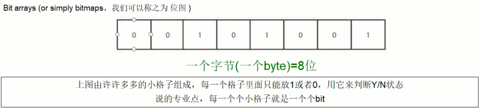

##### 补充:ASCII码

1. [ASCII码对照表](https://ascii.org.cn/)
2. ASCII 编码于 1967 年第一次发布，最后一次更新是在 1986 年，迄今为止共收录了 128  个字符，包含了基本的拉丁字母(A-Z, a-z)、阿拉伯数字、标点符号、特殊符号以及一些具有控制功能的字符。
3. 标准 ASCII 编码用一个字节中的 7 位就能存储，为了让第 8 位也参与编码，就形成了扩展 ASCII 编码。扩展 ASCII 主要包含了一些特殊符号、外来语字母和图形符号。
4.  针对扩展的 ASCII 编码，不同的国家有不同的字符集，所以它并不是国际标准.
5. 由于扩展 ASCII 的局限性（无法表示全球所有语言的字符），出现了更通用的字符编码标准，如 UTF-8 和 GBK。

> - UTF-8是 Unicode 的一种变长编码方式，可以表示 Unicode 标准中的所有字符,完全兼容 ASCII，ASCII 字符(0-127）在 UTF-8 中仍然用 1 个字节表示。
>
> - GBK 是中国国家标准，用于表示简体中文和繁体中文，完全兼容 ASCII，ASCII 字符（0-127）仍然用 1 个字节表示。
>
> - 为了方便后续学习，大致需要知道:
>
>   - [a-z] 的 ascii 为[97-122]
>
>   - [a-z] 的 ascii 为[65-90]
>
>   - hello中个字符的 ascii 如下:
>
>     h	01101000(104)
>
>     e	01100101(101)
>
>     l	01101100(108)
>
>     o	01101111(111)


##### 补充:位运算

1. 位运算（Bitwise Operations）是直接对整数在内存中的二进制位（bit）进行操作的一种运算方式。它通常用于底层编程、性能优化、硬件控制等场景。

2. 运算规则:

   | 运算符 | 名称     | 描述                                                         | 示例     |
   | ------ | -------- | ------------------------------------------------------------ | -------- |
   | `&`    | 按位与   | 两个位都为 1 时结果为 1，否则为 0                            | `a & b`  |
   | `|`    | 按位或   | 两个位中有一个为 1 时结果为 1                                | `a | b`  |
   | `^`    | 按位异或 | <font color=red>两个位不同时结果为 1，相同时为 0</font>      | `a ^ b`  |
   | `~`    | 按位取反 | 对每一位取反（0 变 1，1 变 0）                               | `~a`     |
   | `<<`   | 左移     | 将二进制位全部左移若干位，高位丢弃，低位补 0                 | `a << n` |
   | `>>`   | 右移     | 将二进制位全部右移若干位，低位丢弃，高位补符号位（算术右移） | `a >> n` |

3. 使用案例:

   1. linux 系统中用二进制位表示权限，通过位运算快速判断或修改权限。

   2. 可以使用二进制数组作为标志位数组。

   3. `x & 1`，结果为 0 是偶数，1 是奇数。

   4. 不借助零时变量实现变量交换:

      ```python
      a = a ^ b
      b = a ^ b  # 等价于 (a ^ b) ^ b = a
      a = a ^ b  # 等价于 (a ^ b) ^ a = b
      ```

   5. 实现乘除$2^n$时，位运算更加快。

   6. 异或运算用于简单加密。

      ```python
      data = 123
      key = 456
      encrypted = data ^ key  # 加密
      decrypted = encrypted ^ key  # 解密
      ```

   > - 右移时，正数补 0，负数补 1（算术右移），具体行为取决于编程语言。
   > - 左移时，超出范围的位会被丢弃。
   > - 位运算符优先级通常低于算术运算符，建议用括号明确优先级，例如 `(a & b) == c`。


##### bitmap

1. 位图不是一个实际的数据类型，而是一组在字符串类型上定义的以位为取向的操作，该类型被当作位向量处理。其实就是用String类型作为底层数据结构实现的一种统计二值状态的数据类型。位图本质是数组，它是基于String数据类型的按位的操作。该数组由多个二进制位组成，每个二进制位都对应一个偏移量(我们称之为一个索引)。<br>

2. 常用命令:

   - `SETBIT key offset value` 设置或清除存储在键中的字符串值在偏移量处的位。当键不存在时，创建一个新的字符串值。字符串被扩展以确保它可以容纳偏移量处的位。偏移量参数必须大于或等于 0 。

     ```bash
     # h 01101000 i 01101001
     127.0.0.1:6379> set char_h h
     OK
     127.0.0.1:6379> setbit char_h 7 1
     (integer) 0
     127.0.0.1:6379> get char_h
     "i"
     ```

     > - 偏移量 offset  其实可以理解为 bit 数组的索引。
     > - value 的值只能是 0 或者 1。

   - `GETBIT key offset` 获取存储在键中的字符串值在偏移量处的位。当偏移量超出字符串长度时，假定字符串为连续空格，位数为 0。当键不存在时，假定其为空字符串，因此偏移量始终超出范围，值也假定是连续空格，位数为 0。

   - `strlen` 统计字节数占用多少，不是字符串长度而是占据几个字节，超过 8 位后按照 8 位一组自动扩容。

     ```bash
     127.0.0.1:6379> setbit bitmap 0 1
     (integer) 0
     127.0.0.1:6379> strlen bitmap
     (integer) 1
     127.0.0.1:6379> setbit bitmap 8 1
     (integer) 0
     127.0.0.1:6379> strlen bitmap
     (integer) 2
     127.0.0.1:6379> get bitmap
     "\x80\x80"
     ```

     > 其实某种程度上还是字符串长度，底层是一个字符串，拓容其实就是新增一个字符嘛

   - `BITCOUNT key [start end [BYTE | BIT]]`计算字符串中指定范围内设置位的数量(指定范围内含有多少个 1，其实就是所有位相加)

     > - start、end都是包含的。
     > - <font color=red>默认情况下(byte)，参数 start 和 end 指定一个字节索引范围</font>。
     > - 参数 BIT 指明参数 start 和 end 指定一个位索引范围。
     > - 不存在的键被视为空字符串，因此命令将返回零

     ```bash
     # he 01101000 01100101
     127.0.0.1:6379> set bitmap he
     OK
     127.0.0.1:6379> bitcount bitmap 0 0 byte
     (integer) 3
     127.0.0.1:6379> bitcount bitmap 0 7 bit
     (integer) 3
     127.0.0.1:6379> bitcount bitmap 0 0
     (integer) 3
     ```

   - `BITPOS key bit [start [end [BYTE | BIT]]]`返回字符串中第一个设置为 1 或 0 元素的位索引。

     ```bash
     127.0.0.1:6379> set bitmap he
     OK
     127.0.0.1:6379> bitpos bitmap 1 0 0 byte
     (integer) 1
     127.0.0.1:6379> bitpos bitmap 1 0 7 bit
     (integer) 1
     127.0.0.1:6379> bitpos bitmap 0 0 0
     (integer) 0
     ```

   - `bitop`位运算

     > `BITOP <AND | OR | XOR | NOT> destkey key [key ...]`
     >
     > - and 与运算
     > - or 或运算
     > - xor 异或运算
     > - not 取反

3. 我们还是具体讲一下 bitmap 是一个啥？其实 bitmap 就是一个字符串，只不过使用的时候划分的更细致，将字符串中的每个字符拆分为 8 位 bit，而每个 bit 是由二进制 0 或 1 组成。

   ```bash
   # he 01101000
   127.0.0.1:6379> setbit str 0 0
   (integer) 0
   127.0.0.1:6379> setbit str 1 1
   (integer) 0
   127.0.0.1:6379> setbit str 2 1
   (integer) 0
   127.0.0.1:6379> setbit str 3 0
   (integer) 0
   127.0.0.1:6379> setbit str 4 1
   (integer) 0
   127.0.0.1:6379> get str
   "h"
   127.0.0.1:6379> type str
   string
   ```

4. 应用场景:

   1. 登录统计、应用签到。
   2. 电影、文章、广告是否被点击。
   3. 上下班打卡等等

5. 不妨算一笔账，为啥使用 redis 记录登录打卡，而不是用 mysql?

   按年去存储一个用户的签到情况，365 天只需要 365 / 8 ≈ 46 Byte，1000W 用户量一年也只需要 44 MB 就足够了。假如是亿级的系统，每天使用1个1亿位的Bitmap约占12MB的内存（10^8/8/1024/1024），10天的Bitmap的内存开销约为120MB，内存压力不算太高。此外，在实际使用时，最好对Bitmap设置过期时间，让Redis自动删除不再需要的签到记录以节省内存开销。

   而对于 mysql 而言，若用表结构存储，每条签到记录需包含 `user_id`、`date`、`is_signed` 等字段，此外每天 1 亿次 INSERT 操作，对 MySQL 的写入吞吐量是巨大挑战。

   > 题外话: mysql 设计表的时候是不是可以仿照 redis 用一个 int 类型来记录整年签到情况？那判断哪天没有登录呢，计算非常复杂吧,不妨试试。假设sign 字段表示登录情况。第一天登录记 sign=1(1)，第二天没登录记为sign=1(01)，一样的？不对，我们是知道天数也就是位数的。那么给一个26(000011010)(已经过去 7 天,只分析 7 位)，似乎也是可以通过移位计算的？仅仅是突发奇想，讨论一下。


##### hyperloglog

1. 新版本的[文档](https://redis.io/docs/latest/develop/data-types/probabilistic/)将 hyperloglog 归于 probabilistic 概率部分，后面我们其实会知道 hyperloglog 是一种估计，存在误差的。


其实根据最新官网，后面好像新增了一些数据类型(如时间序列等)，后续有时间补充
