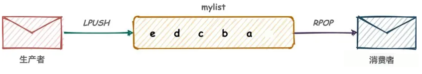

> 其实根据最新官网，后面好像新增了一些数据类型(如时间序列等)，后续有时间补充！！！


##### 补充:ASCII码

1. [ASCII码对照表](https://ascii.org.cn/)
2. ASCII 编码于 1967 年第一次发布，最后一次更新是在 1986 年，迄今为止共收录了 128  个字符，包含了基本的拉丁字母(A-Z, a-z)、阿拉伯数字、标点符号、特殊符号以及一些具有控制功能的字符。
3. 标准 ASCII 编码用一个字节中的 7 位就能存储，为了让第 8 位也参与编码，就形成了扩展 ASCII 编码。扩展 ASCII 主要包含了一些特殊符号、外来语字母和图形符号。
4.  针对扩展的 ASCII 编码，不同的国家有不同的字符集，所以它并不是国际标准.
5. 由于扩展 ASCII 的局限性（无法表示全球所有语言的字符），出现了更通用的字符编码标准，如 UTF-8 和 GBK。

> - UTF-8是 Unicode 的一种变长编码方式，可以表示 Unicode 标准中的所有字符,完全兼容 ASCII，ASCII 字符(0-127）在 UTF-8 中仍然用 1 个字节表示。
>
> - GBK 是中国国家标准，用于表示简体中文和繁体中文，完全兼容 ASCII，ASCII 字符（0-127）仍然用 1 个字节表示。
>
> - 为了方便后续学习，大致需要知道:
>
>   - [a-z] 的 ascii 为[97-122]
>
>   - [a-z] 的 ascii 为[65-90]
>
>   - hello中个字符的 ascii 如下:
>
>     h	01101000(104)
>
>     e	01100101(101)
>
>     l	01101100(108)
>
>     o	01101111(111)


##### 补充:位运算

1. 位运算（Bitwise Operations）是直接对整数在内存中的二进制位（bit）进行操作的一种运算方式。它通常用于底层编程、性能优化、硬件控制等场景。

2. 运算规则:

   | 运算符 | 名称     | 描述                                                         | 示例     |
   | ------ | -------- | ------------------------------------------------------------ | -------- |
   | `&`    | 按位与   | 两个位都为 1 时结果为 1，否则为 0                            | `a & b`  |
   | `|`    | 按位或   | 两个位中有一个为 1 时结果为 1                                | `a | b`  |
   | `^`    | 按位异或 | <font color=red>两个位不同时结果为 1，相同时为 0</font>      | `a ^ b`  |
   | `~`    | 按位取反 | 对每一位取反（0 变 1，1 变 0）                               | `~a`     |
   | `<<`   | 左移     | 将二进制位全部左移若干位，高位丢弃，低位补 0                 | `a << n` |
   | `>>`   | 右移     | 将二进制位全部右移若干位，低位丢弃，高位补符号位（算术右移） | `a >> n` |

3. 使用案例:

   1. linux 系统中用二进制位表示权限，通过位运算快速判断或修改权限。

   2. 可以使用二进制数组作为标志位数组。

   3. `x & 1`，结果为 0 是偶数，1 是奇数。

   4. 不借助零时变量实现变量交换:

      ```python
      a = a ^ b
      b = a ^ b  # 等价于 (a ^ b) ^ b = a
      a = a ^ b  # 等价于 (a ^ b) ^ a = b
      ```

   5. 实现乘除$2^n$时，位运算更加快。

   6. 异或运算用于简单加密。

      ```python
      data = 123
      key = 456
      encrypted = data ^ key  # 加密
      decrypted = encrypted ^ key  # 解密
      ```

   > - 右移时，正数补 0，负数补 1（算术右移），具体行为取决于编程语言。
   > - 左移时，超出范围的位会被丢弃。
   > - 位运算符优先级通常低于算术运算符，建议用括号明确优先级，例如 `(a & b) == c`。


##### bitmap

1. 位图不是一个实际的数据类型，而是一组在字符串类型上定义的以位为取向的操作，该类型被当作位向量处理。其实就是用String类型作为底层数据结构实现的一种统计二值状态的数据类型。位图本质是数组，它是基于String数据类型的按位的操作。该数组由多个二进制位组成，每个二进制位都对应一个偏移量(我们称之为一个索引)。<br>

2. 常用命令:

   - `SETBIT key offset value` 设置或清除存储在键中的字符串值在偏移量处的位。当键不存在时，创建一个新的字符串值。字符串被扩展以确保它可以容纳偏移量处的位。偏移量参数必须大于或等于 0 。

     ```bash
     # h 01101000 i 01101001
     127.0.0.1:6379> set char_h h
     OK
     127.0.0.1:6379> setbit char_h 7 1
     (integer) 0
     127.0.0.1:6379> get char_h
     "i"
     ```

     > - 偏移量 offset  其实可以理解为 bit 数组的索引。
     > - value 的值只能是 0 或者 1。

   - `GETBIT key offset` 获取存储在键中的字符串值在偏移量处的位。当偏移量超出字符串长度时，假定字符串为连续空格，位数为 0。当键不存在时，假定其为空字符串，因此偏移量始终超出范围，值也假定是连续空格，位数为 0。

   - `strlen` 统计字节数占用多少，不是字符串长度而是占据几个字节，超过 8 位后按照 8 位一组自动扩容。

     ```bash
     127.0.0.1:6379> setbit bitmap 0 1
     (integer) 0
     127.0.0.1:6379> strlen bitmap
     (integer) 1
     127.0.0.1:6379> setbit bitmap 8 1
     (integer) 0
     127.0.0.1:6379> strlen bitmap
     (integer) 2
     127.0.0.1:6379> get bitmap
     "\x80\x80"
     ```

     > 其实某种程度上还是字符串长度，底层是一个字符串，拓容其实就是新增一个字符嘛

   - `BITCOUNT key [start end [BYTE | BIT]]`计算字符串中指定范围内设置位的数量(指定范围内含有多少个 1，其实就是所有位相加)

     > - start、end都是包含的。
     > - <font color=red>默认情况下(byte)，参数 start 和 end 指定一个字节索引范围</font>。
     > - 参数 BIT 指明参数 start 和 end 指定一个位索引范围。
     > - 不存在的键被视为空字符串，因此命令将返回零

     ```bash
     # he 01101000 01100101
     127.0.0.1:6379> set bitmap he
     OK
     127.0.0.1:6379> bitcount bitmap 0 0 byte
     (integer) 3
     127.0.0.1:6379> bitcount bitmap 0 7 bit
     (integer) 3
     127.0.0.1:6379> bitcount bitmap 0 0
     (integer) 3
     ```

   - `BITPOS key bit [start [end [BYTE | BIT]]]`返回字符串中第一个设置为 1 或 0 元素的位索引。

     ```bash
     127.0.0.1:6379> set bitmap he
     OK
     127.0.0.1:6379> bitpos bitmap 1 0 0 byte
     (integer) 1
     127.0.0.1:6379> bitpos bitmap 1 0 7 bit
     (integer) 1
     127.0.0.1:6379> bitpos bitmap 0 0 0
     (integer) 0
     ```

   - `bitop`位运算

     > `BITOP <AND | OR | XOR | NOT> destkey key [key ...]`
     >
     > - and 与运算
     > - or 或运算
     > - xor 异或运算
     > - not 取反

3. 我们还是具体讲一下 bitmap 是一个啥？其实 bitmap 就是一个字符串，只不过使用的时候划分的更细致，将字符串中的每个字符拆分为 8 位 bit，而每个 bit 是由二进制 0 或 1 组成。

   ```bash
   # he 01101000
   127.0.0.1:6379> setbit str 0 0
   (integer) 0
   127.0.0.1:6379> setbit str 1 1
   (integer) 0
   127.0.0.1:6379> setbit str 2 1
   (integer) 0
   127.0.0.1:6379> setbit str 3 0
   (integer) 0
   127.0.0.1:6379> setbit str 4 1
   (integer) 0
   127.0.0.1:6379> get str
   "h"
   127.0.0.1:6379> type str
   string
   ```

4. 应用场景:

   1. 登录统计、应用签到。
   2. 电影、文章、广告是否被点击。
   3. 上下班打卡等等

5. 不妨算一笔账，为啥使用 redis 记录登录打卡，而不是用 mysql?

   按年去存储一个用户的签到情况，365 天只需要 365 / 8 ≈ 46 Byte，1000W 用户量一年也只需要 44 MB 就足够了。假如是亿级的系统，每天使用1个1亿位的Bitmap约占12MB的内存（10^8/8/1024/1024），10天的Bitmap的内存开销约为120MB，内存压力不算太高。此外，在实际使用时，最好对Bitmap设置过期时间，让Redis自动删除不再需要的签到记录以节省内存开销。

   而对于 mysql 而言，若用表结构存储，每条签到记录需包含 `user_id`、`date`、`is_signed` 等字段，此外每天 1 亿次 INSERT 操作，对 MySQL 的写入吞吐量是巨大挑战。

   > 题外话: mysql 设计表的时候是不是可以仿照 redis 用一个 int 类型来记录整年签到情况？那判断哪天没有登录呢，计算非常复杂吧,不妨试试。假设sign 字段表示登录情况。第一天登录记 sign=1(1)，第二天没登录记为sign=1(01)，一样的？不对，我们是知道天数也就是位数的。那么给一个26(000011010)(已经过去 7 天,只分析 7 位)，似乎也是可以通过移位计算的？仅仅是突发奇想，讨论一下。


##### hyperloglog

1. 新版本的[文档](https://redis.io/docs/latest/develop/data-types/probabilistic/)将 hyperloglog 归于 probabilistic 概率部分，后面我们其实会知道 hyperloglog 是一种估计算法，存在误差的。

   > 去除重复统计功能的基数估计算法就是 hyperloglog 。那么什么是基数？一个集合中不重复元素的个数，我们假设集合$A=\{a,a,b,c,c,c\}$,执行去重操作得到$\{a,b,c\}$,基数就是 3 。

2. 常用命令:

   - `PFADD key [element [element ...]]` 添加指定元素到 hyperloglog 中。

   - `PFCOUNT key [key ...]`返回给定的 hyperloglog 的基数估计值。

   - `PFMERGE destkey [sourcekey [sourcekey ...]]`将多个 HyperLogLog 值合并为一个唯一值，该值将近似表示源 HyperLogLog 结构观察到的集合的并集基数。

     ```bash
     127.0.0.1:6379> pfadd hy a a b  c c c
     (integer) 1
     127.0.0.1:6379> pfcount hy
     (integer) 3
     127.0.0.1:6379> pfadd hyl  a  a d d
     (integer) 1
     127.0.0.1:6379> pfmerge h_merge hy hyl
     OK
     127.0.0.1:6379> pfcount h_merge
     (integer) 4
     ```

3. 需要说明的是，hyperloglog 基于 string 类型，但是其实严格来说 hyperloglog 更像是一种算法。其底层采用某种存储方式，我们无法使用 get 获取存入的元素。

   ```bash
   127.0.0.1:6379> pfadd hy a a b  c c c
   (integer) 1
   127.0.0.1:6379> type hy
   string
   127.0.0.1:6379> get hy
   "HYLL\x01\x00\x00\x00\x03\x00\x00\x00\x00\x00\x00\x00`\xf3\x80P\xb1\x84K\xfb\x80BZ"
   ```

4. 应用场景:

   1. 统计某些网站或者文章的 uv (unique visitor 独立访客)。
   2. 统计用户每天搜索不同词条的个数。


##### 中文乱码

1. 在 Redis 中遇到中文乱码问题，通常是由于字符编码不一致或终端显示设置导致的。

2. 启动 redis-cli 时强制使用 UTF-8 编码，即`redis-cli --raw`。

3. 确保系统终端支持 UTF-8：

   ```bash
   # 检查当前终端编码
   echo $LANG
   # 正确输出应为类似：en_US.UTF-8 或 zh_CN.UTF-8
   
   # 临时设置 UTF-8 编码
   export LANG=en_US.UTF-8
   ```

   


##### GEO

1. 移动互联网时代 LBS 应用越来越多，外卖软件中附近的美食店铺、高德地图附近的核酸检查点等等，那这种附近各种形形色色的地址位置选择是如何实现的？地球上的地理位置是使用二维的经纬度表示，经度范围 (-180, 180]，纬度范围 (-90, 90]，只要我们确定一个点的经纬度就可以名取得他在地球的位置。例如滴滴打车，最直观的操作就是实时记录更新各个车的位置，然后当我们要找车时，在数据库中查找距离我们坐标`(x0,y0)`附近 r 公里范围内部的车辆，使用如下SQL即可：`select taxi from position where x0-r < x < x0 + r and y0-r < y < y0+r`但是这样会有什么问题呢？

   1. 查询性能问题，如果并发高，数据量大这种查询是要搞垮数据库的。
   2. 这个查询的是一个矩形访问，而不是以我为中心 r 公里为半径的圆形访问。
   3. 精准度的问题，我们知道地球不是平面坐标系，而是一个圆球，这种矩形计算在长距离计算时会有很大误差。

2. 获取坐标:[百度拾取坐标系统](http://api.map.baidu.com/lbsapi/getpoint/)

3. Redis geospatial 允许您存储坐标并搜索它们。这种数据结构有助于在给定半径或边界框内查找附近的点。

4. 常用命令:

   - `GEOADD`添加指定的地理空间项目(经度、纬度、名称)到指定的键,数据以排序集合的形式存储到键中。

     >`GEOADD key [NX | XX] [CH] longitude latitude member [longitude latitude member ...]`
     >
     >- `XX` 仅更新已存在的元素，永不添加元素。
     >- `NX` 不要更新已存在的元素，始终添加新元素。
     >- `CH` 修改返回值，从新增元素的数量改为总变更元素数量。默认情况下 GEOADD 的返回值只计算新增元素的数量。
     >- `longitude` 经度。
     >- `latitude` 纬度。
     >- `member` 名称。

     ```bash
     #  116.403414 39.924091 故宫
     #  116.403414 39.924091 天安门
     127.0.0.1:6379> geoadd geo 116.403414 39.924091 故宫 116.403414 39.924091 天安门
     (integer) 2
     127.0.0.1:6379> zrange geo 0 -1
     1) "\xe5\xa4\xa9\xe5\xae\x89\xe9\x97\xa8"
     2) "\xe6\x95\x85\xe5\xae\xab"
     
     ❯ redis-cli -a yx198973 --raw
     127.0.0.1:6379> zrange geo 0 -1
     天安门
     故宫
     ```

     > 上述显示其实是编码的问题，我们需要重新使用 `--raw` 参数连接 Redis 即可正常显示。

   - `GEOPOS key [member [member ...]]`返回所有给定位置元素的位置(经度和纬度)

   - `GEODIST key member1 member2 [M | KM | FT | MI]`  返回两个给定位置之间的距离。 m表示米、km表示千米、mi表示英里、ft表示英尺。

   - `GEOHASH key [member [member ...]]`返回表示一个或多个元素在表示地理空间索引的有序集合值中位置的有效的 Geohash 。

     > - Redis 使用 Geohash 技术的变体来表示元素的位置，其中位置使用 52 位整数进行编码。
     > - Geohash 是一种将二维经纬度坐标编码为一维字符串的算法，核心思想是通过递归二分法划分区域，生成具有前缀匹配特性的字符串。当然这个不是重点。

   - `GEORADIUS`返回包含地理信息的有序集合的成员，这些成员位于以中心位置和最大距离(半径）指定的区域边界内。<font color=red>版本 6.2.0，此命令被视为已弃用,它可以替换为 GEOSEARCH 和 GEOSEARCHSTORE 。</font>

     > `GEORADIUS key longitude latitude radius <M | KM | FT | MI> [WITHCOORD] [WITHDIST][WITHHASH] [COUNT count [ANY]] [ASC | DESC] [STORE key | STOREDIST key]`
     >
     > - `WITHDIST` 返回数据包含返回项与指定中心的距离，距离以与命令中指定的半径参数相同的单位返回。
     > - `WITHCOORD`返回数据包含匹配项的经纬度坐标。
     > - `WITHHASH`返回数据包含匹配项项的 geohash 的有序集合分数。
     >
     > - `ASC` 按中心点从近到远排序返回的项目。
     > - `DESC`从最远到最近，相对于中心排序返回的项目。
     > - 默认返回所有匹配项。可以通过使用 COUNT  选项将结果限制为前 N 个匹配项。
     > - 当提供 ANY 时，命令会在找到足够匹配项后立即返回，因此结果可能不是最接近指定点的，但另一方面，服务器投入的努力显著降低。当未提供 ANY 时，命令将投入与指定区域匹配项数量成比例的努力，并对其进行排序，因此即使只返回少量结果，查询非常大的区域也可能很慢。
     >
     > - `STORE`将匹配项存储在 给定的 包含其地理空间信息的有序集合中。
     > - `STOREDIST`将匹配项存储在一个 给定的 已排序的集合中，该集合包含它们与中心的距离，以与半径相同的单位指定的浮点数表示。

   - `GEORADIUSBYMEMBER key member radius <M | KM | FT | MI> [WITHCOORD] [WITHDIST] [WITHHASH] [COUNT count [ANY]] [ASC | DESC] [STORE key | STOREDIST key]`同上，只不过中心由 geo 类型指定而非经纬度。<font color=red>版本 6.2.0，此命令被视为已弃用,它可以替换为 GEOSEARCH 和 GEOSEARCHSTORE 。</font>

   - `GEOSEARCH `返回包含地理信息的有序集合的成员，这些成员位于给定形状所指定的区域边界内。此命令扩展了 GEORADIUS 命令，因此除了在圆形区域内搜索外，还支持在矩形区域内搜索。

     > `GEOSEARCH key <FROMMEMBER member | FROMLONLAT longitude latitude> <BYRADIUS radius <M | KM | FT | MI> | BYBOX width height <M | KM | FT | MI>> [ASC | DESC] [COUNT count [ANY]] [WITHCOORD] [WITHDIST] [WITHHASH]`
     >
     > - `BYRADIUS`根据给定的 radius 在圆形区域内进行搜索。
     > - `BYBOX`在由 height 和 width 确定的轴对齐矩形内搜索。
     > - 其他参数同上。

   - `GEOSEARCHSTORE`类似于 `GEOSEARCH` ，但将结果存储在目标键 destination 中。  

     > `GEOSEARCHSTORE destination source <FROMMEMBER member | FROMLONLAT longitude latitude> <BYRADIUS radius <M | KM | FT | MI> | BYBOX width height <M | KM | FT | MI>> [ASC | DESC] [COUNT count [ANY]] [STOREDIST]`
     >
     > - 同上，不过是将结果存储在目标键 destination 中。 

     ```bash
     redis> GEOADD Sicily 13.361389 38.115556 "Palermo" 15.087269 37.502669 "Catania"
     (integer) 2
     redis> GEOADD Sicily 12.758489 38.788135 "edge1"   17.241510 38.788135 "edge2"
     (integer) 2
     redis> GEOSEARCHSTORE key2 Sicily FROMLONLAT 15 37 BYBOX 400 400 km ASC COUNT 3 STOREDIST
     (integer) 3
     redis> ZRANGE key2 0 -1 WITHSCORES
     1) "Catania"
     2) "56.4412578701582"
     3) "Palermo"
     4) "190.44242984775784"
     5) "edge2"
     6) "279.7403417843143"
     ```

5. 应用场景:高德地图附件酒店推荐。


##### 补充:消息队列

1. 消息队列(Message Queue)是一种异步通信机制，用于在分布式系统中协调不同组件之间的通信。它的核心思想是**“生产者发送消息，消费者异步处理”**，通过**“中间存储”**实现系统间的解耦、流量削峰、异步处理等功能。

2. 核心原理: 消息队列的核心是生产者-消费者模型

   1. 生产者(Producer)：产生消息的应用程序(如订单系统)。

   2. 队列(Queue/Topic)：存储消息的中间件(如RabbitMQ、Kafka)。

   3. 消费者(Consumer)：消费消息的应用程序(如库存系统)。

   4. 消息协议:定义消息格式(如AMQP、MQTT、Kafka自定义协议)。

   5. 消息传输模式:

      1. <font color=red>点对点(Queue)</font>

         - 一条消息只能被一个消费者消费（如订单处理）。

         - 适用于任务分发场景。

      2. <font color=red>发布订阅(Topic)</font>

         - 一条消息可被多个消费者订阅（如日志广播）。
         - 适用于事件通知场景。

3. 运行流程:

   1. 生产者发送消息：

      - 流程:生产者 → 序列化数据 → 发送消息到队列 → 队列持久化存储

      - 关键机制: 

        消息确认(ACK)：队列收到消息后返回确认，确保不丢失。

        持久化：消息写入磁盘。

   2. 消息存储

   3. 消费者消费消息:

      - 流程:消费者订阅队列 → 拉取/推送消息 → 反序列化处理 → 返回ACK

      - 消费模式:

        Push模式:队列主动推送消息给消费者(如RabbitMQ)。

        Pull模式:消费者主动拉取消息(如Kafka)。

      - 关键机制:

        消息重试:处理失败时重新投递。

        死信队列(DLQ):无法处理的消息转移到特殊队列。

4. 常见 MQ 对比

   | 消息队列         | 特点                                                   | 适用场景                    |
   | ---------------- | ------------------------------------------------------ | --------------------------- |
   | **Kafka**        | 高吞吐、分区有序、持久化存储、支持流处理               | 日志收集、大数据管道        |
   | **RabbitMQ**     | 灵活的路由规则、ACK机制完善、支持多种协议（AMQP/MQTT） | 企业级异步任务、复杂路由    |
   | **RocketMQ**     | 低延迟、事务消息、阿里系生态                           | 电商交易、金融场景          |
   | **Redis Stream** | 轻量级、基于内存、支持消费者组                         | 简单实时场景、已有Redis环境 |


##### stream

1. Redis 实现消息队列的两种方式:

   1. list 实现消息队列(点对点模式):按照插入顺序排序，可以添加一个元素到列表的头部或者尾部。 所以常用来做异步队列使用，将需要延后处理的任务结构体序列化成字符串塞进 Redis 的列表，另一个线程从这个列表中轮询数据进行处理。LPUSH、RPOP 左进右出  或者 RPUSH、LPOP 右进左出。<br>

      ```bash
      127.0.0.1:6379> lpush mylist a b c d e
      5
      127.0.0.1:6379> rpop mylist
      a
      127.0.0.1:6379> rpop mylist
      b
      127.0.0.1:6379> rpop mylist
      c
      
      127.0.0.1:6379> rpush mylist a b c d e
      5
      127.0.0.1:6379> lpop mylist
      a
      127.0.0.1:6379> lpop mylist
      b
      127.0.0.1:6379> lpop mylist
      c
      ```

   2. pub/sub: Redis 发布订阅 (pub/sub) 有个缺点就是消息无法持久化，如果出现网络断开、Redis 宕机等，消息就会被丢弃。而且也没有 Ack 机制来保证数据的可靠性，假设一个消费者都没有，那消息就直接被丢弃了。<br>

   3. stream:5.0新增。实现消息队列，它支持消息的持久化、支持自动生成全局唯一ID、支持ack确认消息的模式、支持消费组模式等，让消息队列更加的稳定和可靠。<font color=red>一个消息链表，将所有加入的消息都串起来，每个消息都有一个唯一的 ID 和对应的内容。</font><br>

      |                   |                                                              |
      | ----------------- | ------------------------------------------------------------ |
      | Message Content   | 消息内容                                                     |
      | Consumer group    | 消费组，通过 XGROUP CREATE 命令创建，同一个消费组可以有多个消费者 |
      | Last_delivered_id | 游标，每个消费组会有个游标 last_delivered_id，任意一个消费者读取了消息都会使游标 last_delivered_id 往前移动。 |
      | Consumer          | 消费者，消费组中的消费者                                     |
      | Pending_ids       | 消费者会有一个状态变量，用于记录被当前消费已读取但未 ack 的消息 id，如果客户端没有 ack ，这个变量里面的消息 id 会越来越多，一旦某个消息被 ack 它就开始减少。这个pending_ids 变量在 Redis 官方被称之为 PEL(Pending Entries List)，记录了当前已经被客户端读取的消息，但是还没有 ack (Acknowledge  character：确认字符），它用来确保客户端至少消费了消息一次，而不会在网络传输的中途丢失了没处理。 |

2. stream 四大特殊符号:

   1. `*`用于 XADD 命令中，让系统自动生成 id 。
   2. `>`在 XREADGROUP 中使用，在消费者组中，表示获取尚未分配给当前消费者的新消息。
   3. `$`表示当前流的最大 id ,忽略历史消息从流的最新消息之后开始读取。
   4. `-` 和 `+`定义ID范围，`-`(最小 id )表示流的起始位置(0-0)。`+`(最大 id)表示流的结束位置。

3. stream 队列常用命令:<font color=red>某些命令参数不完善，参考最新官方文档!!!</font>

   - `XADD key ID field value [field value ...]`向 stream 添加消息，如果指定的 stream 不存在，则创建一个 stream。<font color=red> id 可用 * 由 redis 生成，可以自定义，但是要自己保证递增性。</font>

     ```bash
     127.0.0.1:6379> xadd stream * name fish age 15
     1740569501681-0
     127.0.0.1:6379> xadd stream * name fish1 age 16
     1740569514868-0
     127.0.0.1:6379> xadd stream * name fish2 age 17
     1740569520063-0
     ```

     >  stream 的默认 ID 规则通过**时间戳 + 序列号**的复合结构，在简单性与高效性之间取得平衡：
     >
     > - **时间戳**：提供全局时间顺序，便于按时间范围检索。
     > - **序列号**：解决同一毫秒内的消息顺序冲突。

   - `XDEL key ID [ID ...] `删除指定的条目从流中，并返回删除的条目数，这可能与传递给命令的 ID 数量不同，因为某些 ID 可能不存在。

     ```bash
     127.0.0.1:6379> xdel stream 1740569501681-0
     1
     ```

   - ` XRANGE key start end [COUNT count] `返回流中满足给定 ID 范围的条目。start、end 均包含。可用`-`表示最小 id ，`+`表示最大 id 。

     ```bash
     127.0.0.1:6379> xrange stream - +
     1740569514868-0
     name
     fish1
     age
     16
     1740569520063-0
     name
     fish2
     age
     17
     ```

   - `XREVRANGE`与 XRANGE 类似，但返回条目顺序相反，并且先声明结束 id，然后是起始 id。

     ```bash
     127.0.0.1:6379> xrange stream - +
     1740569514868-0
     name
     fish1
     age
     16
     1740569520063-0
     name
     fish2
     age
     17
     ```

   - `XLEN key`返回流内条目的数量。如果指定的键不存在，则命令返回零，就像流为空一样。

   - `XTRIM key <MAXLEN | MINID> threshold` 将流裁剪到指定项目数，如果需要则淘汰较小 id，MAXLEN 指定裁剪后最大长度。但是使用 MINID 时小于指定 id 的消息将被淘汰。

   - `XREAD [COUNT count] [BLOCK milliseconds] STREAMS key [key ...] id [id ...]`从一个或多个流中读取数据，仅返回 ID 大于调用者的 count 条消息。

     ```bash
     127.0.0.1:6379> xread streams stream 0-0
     stream
     1740569514868-0
     name
     fish1
     age
     16
     1740569520063-0
     name
     fish2
     age
     17
     
     # 阻塞等待，一旦有新消息加入就会立即返回
     127.0.0.1:6379> xread count 1 block 0 streams stream $
     ```

     > - `*`表示当前 stream 已经存储的最大 id ，当前Stream中不存在大于当前最大 id 的消息，因此此时返回 nil 。
     > - `0-0`代表从最小的 id 开始获取 stream 中的消息，当不指定 count ，将会返回所有消息，注意也可以使用`0`(`00`/`000`也都是可以的…)

4. stream 消费组常用命令:

   - `XGROUP CREATE key group <id | $>` 创建消费组,从 stream 的 id 。 $ 表示从尾部开始消费，0 表示从头开始消费。

   - `XREADGROUP GROUP group consumer [COUNT count] [BLOCK milliseconds] [NOACK] STREAMS key [key ...] id [id ...]`消费组 group 中的消费者 consumer 读取消息队列中的消息。参数使用参考 XREAD 命令。

     ```bash
     127.0.0.1:6379> xadd stream * name fish age 15
     1740627146253-0
     127.0.0.1:6379> xadd stream * name fish1 age 16
     1740627151446-0
     127.0.0.1:6379> xadd stream * name fish2 age 17
     1740627156968-0
     
     127.0.0.1:6379> xgroup create stream group1 0
     OK
     127.0.0.1:6379> xreadgroup group group1 consumer_1 streams stream >
     stream
     1740627146253-0
     name
     fish
     age
     15
     1740627151446-0
     name
     fish1
     age
     16
     1740627156968-0
     name
     fish2
     age
     17
     127.0.0.1:6379> xreadgroup group group1 consumer_2 streams stream >
     
     
     127.0.0.1:6379> xgroup create stream group2 0
     OK
     127.0.0.1:6379> xreadgroup group group2 consumer_2 streams stream >
     stream
     1740627146253-0
     name
     fish
     age
     15
     1740627151446-0
     name
     fish1
     age
     16
     1740627156968-0
     name
     fish2
     age
     17
     ```

     > - 消费组存在的意义:让组内的多个消费者共同分担读取消息，所以，我们通常会让每个消费者读取部分消息，从而实现消息读取负载在多个消费者间是均衡分布的。
     > - 不同消费组的消费者可以读取同一条消息，但是同一个消费组的消费者不能读取同一个消息。
     > - `>` 表示从第一条尚未读取的消息开始读取，但是此时所有的 id 都不比它大，会导致读取所有消息。

   - ack 机制存在的意义:基于 Stream 实现的消息队列，如何保证消费者在发生故障或宕机再次重启后，仍然可以读取未处理完的消息？Streams 会自动使用内部队列（也称为 PENDING List）留存消费组里每个消费者读取的消息保底措施，直到消费者使用 XACK 命令通知 Streams“消息已经处理完成”。消费确认增加了消息的可靠性，一般在业务处理完成之后，需要执行 XACK 命令确认消息已经被消费完成。<br>

   - `XPENDING key group [[IDLE min-idle-time] start end count [consumer]]` 查看某个消费组内消费者已读未回的消息，也可以查看具体的消费者。

   - `XACK key group id [id ...]`向消费队列确认消息 id 已经处理。

     ```bash
     127.0.0.1:6379> xpending stream group1
     3
     1740627146253-0
     1740627156968-0
     consumer_1
     3
     
     
     127.0.0.1:6379> xack stream group1 1740627146253-0
     1
     127.0.0.1:6379> xpending stream group1
     2
     1740627151446-0
     1740627156968-0
     consumer_1
     2
     ```

5. `XINFO`查看信息

   > - `XINFO STREAM key`查看消息队列信息
   >
   > - `XINFO GROUPS key`查看消费组的信息
   >
   > - `XINFO CONSUMERS key`查看消费者的信息

6. 实操:stream 还是不能 100% 等价于 Kafka、RabbitMQ 来使用的，生产案例少，慎用。


##### 补充:溢出

> 计算机组成原理的知识，不详细叙述

1. 有符号数和无符号数:

   |   类型   |            定义             | 8位示例范围  |             二进制表示特点             |
   | :------: | :-------------------------: | :----------: | :------------------------------------: |
   | 无符号数 | 仅表示非负整数（0及正整数） |  `0 ~ 255`   |         所有位直接表示数值大小         |
   | 有符号数 |   可表示正、负整数（含0）   | `-128 ~ 127` | 最高位为符号位（0正1负），其余为数值位 |

2. 现代计算机统一使用补码表示有符号数，而非原码或反码。原因如下：

   1. 解决原码中 `+0` 和 `-0` 的双零问题。
   2. 加减法统一用加法电路实现，无需额外处理符号位。

3. 溢出行为的差异

   1. 无符号数溢出:超出最大值后循环回最小值(即模运算)。

      ```tex
      255 (11111111) + 1 = 0 (00000000)
      0 (00000000) - 1 = 255 (11111111)
      ```

   2. 有符号数溢出(补码):超出范围时环绕到相反极值。

      ```tex
      127 (01111111) + 1 = -128 (10000000)
      -128 (10000000) - 1 = 127 (01111111)
      ```

4. Redis BITFIELD 中的溢出控制:在 Redis 的 bitfield 命令中，溢出控制策略(WRAP/SAT/FAIL)基于补码的数值表示实现。

   1. WRAP 模式(默认)

      有符号数：按补码环绕（如 `127 +1 → -128`）。

      无符号数：按模运算环绕（如 `255 +1 → 0`）。

   2. SAT 模式

      有符号数：溢出时取 `最大值（127）` 或 `最小值（-128）`。

      无符号数：溢出时取 `255` 或 `0`。

   3. FAIL 模式

      任何溢出直接放弃操作，返回 `nil`。


##### bitfield

1. 该数据类型了解即可，似乎很少使用。

2. bitfield 将一个 Redis 字符串看作是是一个由二进制位组成的数组并能对变长位宽和任意没有字节对齐的指定整型位域进行寻址和修改。

3. 常用命令:

   ```bash
   BITFIELD key [GET encoding offset | [OVERFLOW <WRAP | SAT | FAIL>]
     <SET encoding offset value | INCRBY encoding offset increment>
     [GET encoding offset | [OVERFLOW <WRAP | SAT | FAIL>]
     <SET encoding offset value | INCRBY encoding offset increment>
     ...]]
   ```

   - `encoding`整数编码，可以通过在前面加上 i 表示有符号整数和 u 表示无符号整数，后跟我们的整数编码的位数。支持的编码为有符号整数最多 64 位，无符号整数最多 63 位。

   - `GET` 获取指定的位字段。

   - `SET`设置指定的位字段并返回其旧值。

   - `INCRBY`增加或减少(给定负增量)指定的位字段并返回新值。

   - `OVERFLOW`溢出控制。

     `WRAP`: 环绕，适用于有符号和无符号整数。对于无符号整数，环绕类似于执行模最大值的操作。而对于有符号整数，环绕意味着溢出从最负值开始重新开始，下溢则向最正值方向，例如，如果 i8 整数设置为 127，增加 1 将得到 -128 。

     `SAT`: 使用饱和算术，即在下溢时将值设置为最小整数值，在上溢时设置为最大整数值。例如，从值 120 开始以增量 10 递增 i8 整数，将得到值 127，进一步的递增将始终保持值为 127。下溢时也是如此，但值被阻止在最大负值处。

     `AIL`: 在此模式下，不会对检测到的溢出或下溢执行任何操作。相应的返回值设置为 NULL，以向调用者指示该条件。

     ```bash
     127.0.0.1:6379> set field hello
     OK
     # 从 0 开始获取有符号8位
     127.0.0.1:6379> bitfield field get i8 0
     104
     # 从 0 开始获取有符号8位
     127.0.0.1:6379> bitfield field get u8 0
     104
     ```

     > 默认 WRAP 模式。每个 OVERFLOW 语句仅影响其后的 INCRBY 和 SET 命令，直到下一个 OVERFLOW 语句。

4. 应用场景:

   1. 多状态存储: 用一个二进制字符串存储多个整数值（如 RGB 颜色值）。

      ```bash
      # 存储R(8bit)+G(8bit)+B(8bit)=24bit颜色值
      BITFIELD color SET u8 0 200 SET u8 8 150 SET u8 16 100
      ```

   2. 紧凑计数器: 存储多个小范围计数器（如游戏角色属性）。

      ```bash
      # 角色属性：攻击力(0-15,4bit) + 防御力(0-15,4bit)
      BITFIELD hero:1 SET u4 0 12 SET u4 4 8
      ```

   3. 时间戳低位存储: 存储时间戳的低位部分（如毫秒级时间戳后16位）。

5. 对比: 

   |   特性   |                          BITFIELD                          |                   BITMAP                    |
   | :------: | :--------------------------------------------------------: | :-----------------------------------------: |
   | 数据模型 | 结构化位域：将二进制位划分为多个整数位域（如 `u8`、`i16`） | 纯二进制位数组：每个位独立表示布尔值（0/1） |
   | 操作对象 |                 多个整数（有符号/无符号）                  |              单个位（布尔值）               |
   | 溢出控制 |                支持（`WRAP`/`SAT`/`FAIL`）                 |        无（单一位操作，无溢出问题）         |
   | 典型命令 |               `BITFIELD ... SET/GET/INCRBY`                |    `SETBIT`/`GETBIT`/`BITCOUNT`/`BITOP`     |
   | 内存效率 |                 更高（紧凑存储多个小整数）                 |        较高（每个位表示一个布尔值）         |
   | 适用场景 |            多字段紧凑存储（如计数器、状态组合）            |        布尔标记（如签到、特征开关）         |


