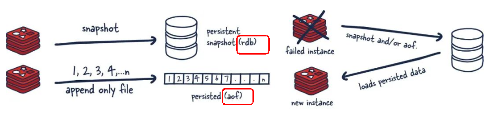
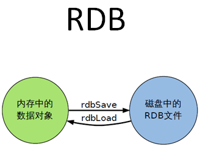
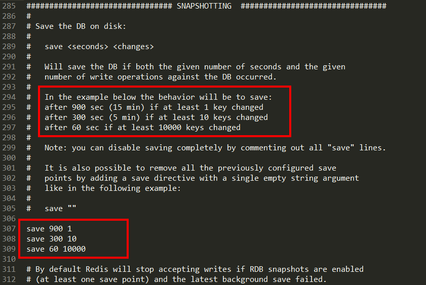
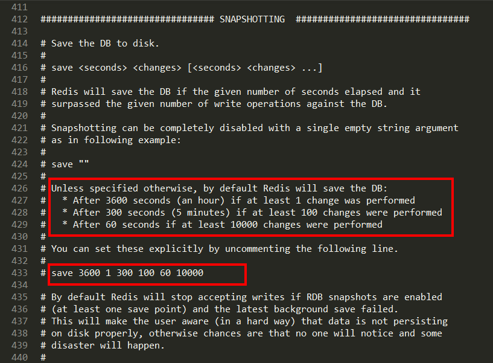
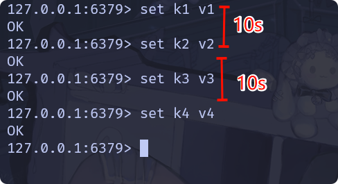
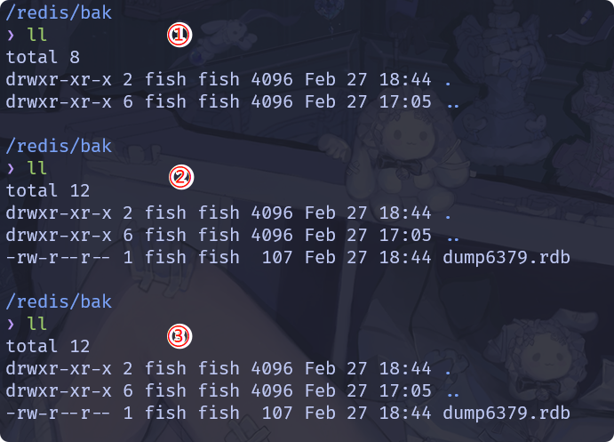
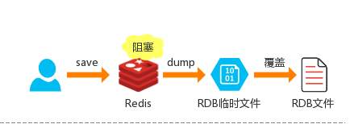
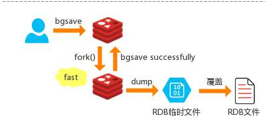
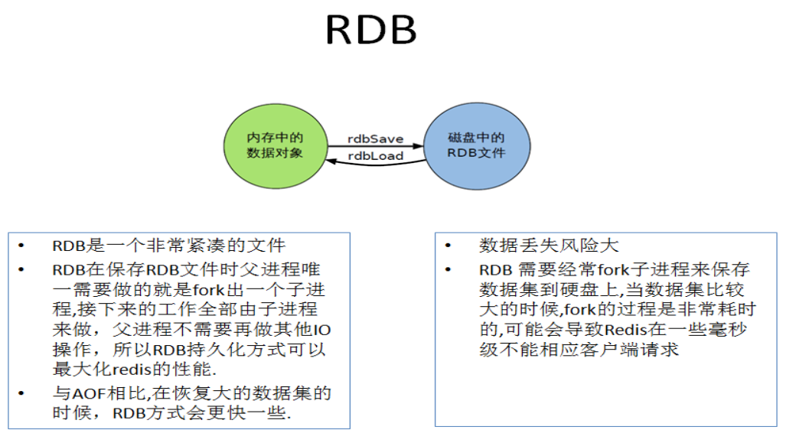

#### 修改参数

1. 修改 redis 的配置一般而言是在 redis.conf 中配置。

2. 但是实际上我们可以通过命令实现:
   1. `config get`获取配置内容及其相关信息。
   
      ```bash
      127.0.0.1:6379> config get *
        1) "bgsave_cpulist"
        2) ""
        3) "hll-sparse-max-bytes"
        4) "3000"
        5) "bio_cpulist"
        6) ""
        7) "protected-mode"
        8) "no"
        9) "proc-title-template"
      ```
   
   2. `config set`允许在不重启 Redis 的情况下修改部分参数。<font color=red>使用 CONFIG SET 命令动态修改的配置参数在Redis 服务重启后会失效,若要永久生效请使用 CONFIG REWRITE 命令。 </font>
   
   3. `CONFIG REWRITE` 命令将当前配置写入 redis.conf 文件(需 Redis 有写入权限）
   
3. <font color=red>部分参数不可动态修改</font>：如 `port`、`dir`、`dbfilename` 等需直接修改配置文件并重启。


#### 持久化

##### 简介

1. [官方介绍](https://redis.io/docs/latest/operate/oss_and_stack/management/persistence/):持久性指的是将数据写入持久存储，例如固态硬盘 SSD ，Redis 提供了一系列持久化选项:
   - RDB(Redis Database):RDB 持久化在指定的时间间隔内对您的数据集执行点时间快照。
   - AOF(Append Only File):AOF 持久化记录服务器接收到的每个写操作。这些操作可以在服务器启动时再次回放，重建原始数据集。命令使用与 Redis 协议相同的格式进行记录。
   - 无持久性：您可以完全禁用持久性,这有时用于 redis 仅用作缓存。
   - RDB + AOF：可以在同一实例中同时使用 AOF 和 RDB。
2. 为什么需要持久化?
   - 内存数据的脆弱性:Redis 数据默认存储在内存中，速度快但易失，进程终止或服务器宕机会导致所有数据丢失。例如电商秒杀活动中，若 Redis 缓存了库存信息但未持久化，服务器宕机后库存数据无法恢复，引发超卖问题。
   - 业务连续性要求:关键业务需保证数据可靠，即使故障也能快速恢复。例如用户支付成功后，订单状态若仅存于内存，支付凭证丢失将导致纠纷。
   - 容灾与备份:持久化数据可用于迁移、复制或灾难恢复，如硬盘损坏后从备份恢复。
3. 示意图:<br>


##### RDB

1. RDB 持久性以指定的时间间隔执行数据集的时间点快照。其实现类似照片记录效果的方式，就是把某一时刻的数据和状态以文件的形式写到磁盘上，也就是快照。这样一来即使故障宕机，快照文件也不会丢失，数据的可靠性也就得到了保证。这个快照文件就称为RDB文件(dump.rdb)，其中，RDB就是Redis DataBase的缩写。

2. RDB是一种一锅端式的备份，Redis的数据都在内存中，保存备份时它执行的是全量快照，也就是说，把内存中的所有数据都记录到磁盘中，一锅端。<br>

3. Redis 6 和 Redis 7 的区别:主要是在 redis.conf 中配置的定时快照的条件。

   1. Redis 6.0.16 及以前:存在<br>

      > - 每隔 900s 内，存在 1 个 key 改变则写一份新的 rdb 文件。
      > - 每隔 300s 内，存在 10 个 key 改变则写一份新的 rdb 文件。
      > - 每隔 60s 内，存在 10000个 key 改变则写一份新的 rdb 文件。

   2. Redis 6.2 及以后:<br>

      > - 每隔 3600s 内，存在 1 个 key 改变则写一份新的 rdb 文件。
      > - 每隔 300s 内，存在 100 个 key 改变则写一份新的 rdb 文件。
      > - 每隔 60s 内，存在 10000个 key 改变则写一份新的 rdb 文件。

4. 自动触发:

   1. 修改自动触发的条件: redis.conf 中的`save <seconds> <changes>`

   2. 修改 rdb 文件存储位置: redis.conf 中的`dir <dir_name>`

   3. 修改 rdb 文件名称: redis.conf 中的`dbfilename <file_name>`，<font color=red>一般在实际生产，文件名一般设置成 Redis 实例的端口号相关。</font>

   4. 不妨做一个测试，我们将配置文件修改成如下所示(提前备份配置文件):

      ```tex
      save 10 2
      
      dir /redis/bak
      
      dbfilename dump6379.rdb
      ```
      
      修改完配置之后重启 Redis。上述配置中，我们将自动触发的条件设置为每隔 10s 存在 2 个 key 改变则生成一份新的 rdb 文件。初始状态下，没有任何 rdb 文件存在。当我们在 10s 内连续插入两个 key 时，观察到存在 rdb 文件生成。
      
      我们在次向redis中插入两个 key ，但是中间等待 10 s，此时发现 rdb 文件大小无变化，此时数据并没有持久化到磁盘，此时若是 redis 宕机，数据就会丢失。<br><br>
      

5. 手动触发:Redis提供了两个命令来生成 RDB 文件，分别是 `save` 和 `bgsave`

   1. `SAVE`:在主程序中执行会阻塞当前 Redis 服务器，直到持久化工作完成 save 。执行 save 命令期间，Redis 不能处理其他命令，<font color=red>线上禁止使用</font>。<br>

   2. `BGSAVE`(默认):Redis 会在后台异步进行快照操作，不阻塞快照同时还可以响应客户端请求，该触发方式会 fork 一个子进程由子进程复制持久化过程。Redis 会使用 bgsave 对当前内存中的所有数据做快照这个操作是子进程在后台完成的，这就允许主进程同时可以修改数据。<br>

      > - 在Linux程序中，fork()会产生一个和父进程完全相同的子进程，但子进程在此后多会 exec 系统调用，出于效率考虑，尽量避免膨胀。
      > - RDB 最大限度地提高了 Redis 的性能，因为 Redis 父进程为了持久化而需要做的唯一工作就是派生一个将完成所有其余工作的子进程。父进程永远不会执行磁盘1/O或类似操作。

   3. `LASTSAVE`可以通过命令获取最后一次成功执行快照的时间,是一个时间戳。

      > 可以使用 linux 命令`date -d@<time>`转换为具体时间。

      ```bash
      127.0.0.1:6379> bgsave
      Background saving started
      127.0.0.1:6379> lastsave
      (integer) 1740663998
      127.0.0.1:6379> quit
      
      $ date -d @1740663998
      Thu Feb 27 09:46:38 PM CST 2025
      ```

6. 触发 rdb 快照的情况:

   1. 配置文件中默认的快照配置。
   2. 手动 `save` 或者 `bgsave `命令。
   3. 执行 `flushall` 或者 `flushdb` 命令也会产生 rdb 文件，但里面是空的，无意义。
   4. 执行 `shutdown` 且未设置开启 `AOF`持久化( aof 开启时 Redis 会优先使用 AOF 文件进行持久化，而不会生成 RDB 文件)。
   5. 主从复制时，主节点自动触发。

7. 如何检查修复 rdb 文件:`redis-check-rdb /redis/bak/dump6379.rdb`

   ```bash
   $ which redis-check-rdb
   /usr/local/bin/redis-check-rdb
   
   
   $ redis-check-rdb /redis/bak/dump6379.rdb
   [offset 0] Checking RDB file /redis/bak/dump6379.rdb
   [offset 26] AUX FIELD redis-ver = '7.4.2'
   [offset 40] AUX FIELD redis-bits = '64'
   [offset 52] AUX FIELD ctime = '1740653089'
   [offset 67] AUX FIELD used-mem = '1142896'
   [offset 79] AUX FIELD aof-base = '0'
   [offset 81] Selecting DB ID 0
   [offset 107] Checksum OK
   [offset 107] \o/ RDB looks OK! \o/
   [info] 2 keys read
   [info] 0 expires
   [info] 0 already expired
   [info] 0 subexpires
   ```

   > 什么情况下 rdb 文件会损坏？
   >
   > - 使用网络存储或云盘时，传输过程中发生数据包丢失或校验错误。
   > - 在生成 RDB(`BGSAVE`)过程中，Redis 主进程或 fork 出的子进程意外崩溃，导致 RDB 文件不完整。
   > - 磁盘坏道、存储介质损坏、电源故障等物理问题，导致 RDB 文件写入或读取时发生数据丢失或损坏。

8. 如何从 rdb 文件恢复数据:关闭 Redis 实例，删除生成的 rdb 文件，将要恢复的 rdb 文件复制到配置的 rdb 文件目录，重启 Redis，此时 Redis 会自动读取 rdb 文件，恢复数据。<font color=red>注意不可以把备份文件 dump.rdb 和生产 redis 服务器放在同一台机器，必须分开各自存储，以防生产机物理损坏后备份文件也挂了。</font>

9. 如何禁用 RDB机制:修改配置文件 redis.conf 为`save ""`,当然也可以采用动态的方式设置:`redis-cli -a xxxx config set save ""`。

10. RDB配置优化:

    1. 控制触发 RDB 快照的条件，格式为 `save <seconds> <keys-changed>`。高数据安全性时可以增加保存频率，但是需接受更高性能开销;高性能优先时可以减少保存频率或禁用 RDB(可改用 AOF)。
    2. `dbfilename`设置 rdb 文件名称，建议`dump`+`port`命名。
    3. `dir`设置 rdb 文件存储位置。
    4. `stop-writes-on-bgsave-error`当 RDB 持久化失败时，是否禁止写入操作，默认 `yes`，一般保持默认即可。
    5. `rdbcompression`是否压缩 RDB 文件，默认 `yes`(LZF 压缩)。一般保持默认即可，若磁盘空间充足且 CPU 资源紧张，可关闭压缩以降低延迟。
    6. `rdbchecksum`是否在 RDB 文件末尾添加 CRC64 校验和，默认 `yes`。建议保持默认 `yes` 以确保数据完整性，除非对性能极度敏感。
    7. `rdb-del-sync-files`在没有持久性的情况下删除复制中使用的 RDB 文件。默认情况下no，此选项是禁用的。

11. RDB 的优势和缺点:

    1. 优势:
       - 适合大规模的数据恢复
       - 按照业务定时备份
       - 对数据完整性和一致性要求不高
       - RDB文件在内存中的加载速度要比AOF快得多
    2. 缺点:
       - 在一定间隔时间做一次备份，所以如果 redis 意外宕机的话，就会丢失从当前至最近一次快照期间的数据，快快照之间的数据会丢失
       - 内存数据的全量同步，如果数据量太大会导致 I/O 严重影响服务器性能
       - RDB 依赖于主进程的 fork ，在更大的数据集中，这可能会导致服务请求的瞬间延迟。
       - fork 的时候内存中的数据被克隆了一份，大致 2 倍的膨胀性，需要考虑。

    <br>

    


##### RDB报错

1. `MISCONF Redis is configured to save RDB snapshots, but it's currently unable to persist to disk.`

   1. 调整内核参数(允许内存超额分配):

      ```bash
      # 临时生效
      sudo sysctl vm.overcommit_memory=1
      
      # 永久生效（写入配置文件）
      echo "vm.overcommit_memory=1" >> /etc/sysctl.conf
      sudo sysctl -p
      ```

   2. 修复目录权限:

      ```bash
      # 查看 redis启动用户
      ps -eo pid,user,comm | grep redis-server
      # 775 fish     redis-server
          
      # 修改目录所有者为Redis用户
      sudo chown -R <user>:<group> /redis/bak
      
      # 确保目录可写
      sudo chmod -R 755 /redis/bak
      ```

      > 关于配置文件权限问题参照[1.简介与安装.md](./1.简介与安装.md)的 配置文件权限问题 相关笔记。

2. 其他常见错误:

   |                         **日志内容**                         |               **原因**                |
   | :----------------------------------------------------------: | :-----------------------------------: |
   |   `Can't save in background: fork: Cannot allocate memory`   |  内存不足，无法fork子进程生成RDB快照  |
   |     `Failed opening .rdb for saving: Permission denied`      |        Redis进程无目录写入权限        |
   | `Write error writing DB file on disk: No space left on device` |             磁盘空间不足              |
   |              `Bad file format reading RDB file`              | RDB文件损坏（需修复或删除后重新生成） |


##### AOF

1. 


##### 混合持久化


##### 纯缓存


#### 事务


#### 管道


#### 发布订阅

