#### 修改参数

1. 修改 redis 的配置一般而言是在 redis.conf 中配置。

2. 但是实际上我们可以通过命令实现:
   1. `config get`获取配置内容及其相关信息。
   
      ```bash
      127.0.0.1:6379> config get *
        1) "bgsave_cpulist"
        2) ""
        3) "hll-sparse-max-bytes"
        4) "3000"
        5) "bio_cpulist"
        6) ""
        7) "protected-mode"
        8) "no"
        9) "proc-title-template"
      ```
   
   2. `config set`允许在不重启 Redis 的情况下修改部分参数。<font color=red>使用 CONFIG SET 命令动态修改的配置参数在Redis 服务重启后会失效,若要永久生效请使用 CONFIG REWRITE 命令。 </font>
   
   3. `CONFIG REWRITE` 命令将当前配置写入 redis.conf 文件(需 Redis 有写入权限）
   
3. <font color=red>部分参数不可动态修改</font>：如 `port`、`dir`、`dbfilename` 等需直接修改配置文件并重启。


#### 持久化

##### 简介

1. [官方介绍](https://redis.io/docs/latest/operate/oss_and_stack/management/persistence/):持久性指的是将数据写入持久存储，例如固态硬盘 SSD ，Redis 提供了一系列持久化选项:
   - RDB(Redis Database):RDB 持久化在指定的时间间隔内对您的数据集执行点时间快照。
   - AOF(Append Only File):AOF 持久化记录服务器接收到的每个写操作。这些操作可以在服务器启动时再次回放，重建原始数据集。命令使用与 Redis 协议相同的格式进行记录。
   - 无持久性：您可以完全禁用持久性,这有时用于 redis 仅用作缓存。
   - RDB + AOF：可以在同一实例中同时使用 AOF 和 RDB。
2. 为什么需要持久化?
   - 内存数据的脆弱性:Redis 数据默认存储在内存中，速度快但易失，进程终止或服务器宕机会导致所有数据丢失。例如电商秒杀活动中，若 Redis 缓存了库存信息但未持久化，服务器宕机后库存数据无法恢复，引发超卖问题。
   - 业务连续性要求:关键业务需保证数据可靠，即使故障也能快速恢复。例如用户支付成功后，订单状态若仅存于内存，支付凭证丢失将导致纠纷。
   - 容灾与备份:持久化数据可用于迁移、复制或灾难恢复，如硬盘损坏后从备份恢复。
3. 示意图:<br>


##### RDB

1. RDB 持久性以指定的时间间隔执行数据集的时间点快照。其实现类似照片记录效果的方式，就是把某一时刻的数据和状态以文件的形式写到磁盘上，也就是快照。这样一来即使故障宕机，快照文件也不会丢失，数据的可靠性也就得到了保证。这个快照文件就称为RDB文件(dump.rdb)，其中，RDB就是Redis DataBase的缩写。

2. RDB是一种一锅端式的备份，Redis的数据都在内存中，保存备份时它执行的是全量快照，也就是说，把内存中的所有数据都记录到磁盘中，一锅端。<br>

3. Redis 6 和 Redis 7 的区别:主要是在 redis.conf 中配置的定时快照的条件。

   1. Redis 6.0.16 及以前:存在<br>

      > - 每隔 900s 内，存在 1 个 key 改变则写一份新的 rdb 文件。
      > - 每隔 300s 内，存在 10 个 key 改变则写一份新的 rdb 文件。
      > - 每隔 60s 内，存在 10000个 key 改变则写一份新的 rdb 文件。

   2. Redis 6.2 及以后:<br>

      > - 每隔 3600s 内，存在 1 个 key 改变则写一份新的 rdb 文件。
      > - 每隔 300s 内，存在 100 个 key 改变则写一份新的 rdb 文件。
      > - 每隔 60s 内，存在 10000个 key 改变则写一份新的 rdb 文件。

4. 自动触发:

   1. 修改自动触发的条件: redis.conf 中的`save <seconds> <changes>`

   2. 修改 rdb 文件存储位置: redis.conf 中的`dir <dir_name>`

   3. 修改 rdb 文件名称: redis.conf 中的`dbfilename <file_name>`，<font color=red>一般在实际生产，文件名一般设置成 Redis 实例的端口号相关。</font>

   4. 不妨做一个测试，我们将配置文件修改成如下所示(提前备份配置文件):

      ```tex
      save 10 2
      
      dir /redis/bak
      
      dbfilename dump6379.rdb
      ```
      
      修改完配置之后重启 Redis。上述配置中，我们将自动触发的条件设置为每隔 10s 存在 2 个 key 改变则生成一份新的 rdb 文件。初始状态下，没有任何 rdb 文件存在。当我们在 10s 内连续插入两个 key 时，观察到存在 rdb 文件生成。
      
      我们在次向redis中插入两个 key ，但是中间等待 10 s，此时发现 rdb 文件大小无变化，此时数据并没有持久化到磁盘，此时若是 redis 宕机，数据就会丢失。<br><br>
      

5. 手动触发:Redis提供了两个命令来生成 RDB 文件，分别是 `save` 和 `bgsave`

   1. `SAVE`:在主程序中执行会阻塞当前 Redis 服务器，直到持久化工作完成 save 。执行 save 命令期间，Redis 不能处理其他命令，<font color=red>线上禁止使用</font>。<br>

   2. `BGSAVE`(默认):Redis 会在后台异步进行快照操作，不阻塞快照同时还可以响应客户端请求，该触发方式会 fork 一个子进程由子进程复制持久化过程。Redis 会使用 bgsave 对当前内存中的所有数据做快照这个操作是子进程在后台完成的，这就允许主进程同时可以修改数据。<br>

      > - 在Linux程序中，fork()会产生一个和父进程完全相同的子进程，但子进程在此后多会 exec 系统调用，出于效率考虑，尽量避免膨胀。
      > - RDB 最大限度地提高了 Redis 的性能，因为 Redis 父进程为了持久化而需要做的唯一工作就是派生一个将完成所有其余工作的子进程。父进程永远不会执行磁盘1/O或类似操作。

   3. `LASTSAVE`可以通过命令获取最后一次成功执行快照的时间,是一个时间戳。

      > 可以使用 linux 命令`date -d@<time>`转换为具体时间。

      ```bash
      127.0.0.1:6379> bgsave
      Background saving started
      127.0.0.1:6379> lastsave
      (integer) 1740663998
      127.0.0.1:6379> quit
      
      $ date -d @1740663998
      Thu Feb 27 09:46:38 PM CST 2025
      ```

6. 触发 rdb 快照的情况:

   1. 配置文件中默认的快照配置。
   2. 手动 `save` 或者 `bgsave `命令。
   3. 执行 `flushall` 或者 `flushdb` 命令也会产生 rdb 文件，但里面是空的，无意义。
   4. 执行 `shutdown` 且未设置开启 `AOF`持久化( aof 开启时 Redis 会优先使用 AOF 文件进行持久化，而不会生成 RDB 文件)。
   5. 主从复制时，主节点自动触发。

7. 如何检查修复 rdb 文件:`redis-check-rdb /redis/bak/dump6379.rdb`

   ```bash
   $ which redis-check-rdb
   /usr/local/bin/redis-check-rdb
   
   
   $ redis-check-rdb /redis/bak/dump6379.rdb
   [offset 0] Checking RDB file /redis/bak/dump6379.rdb
   [offset 26] AUX FIELD redis-ver = '7.4.2'
   [offset 40] AUX FIELD redis-bits = '64'
   [offset 52] AUX FIELD ctime = '1740653089'
   [offset 67] AUX FIELD used-mem = '1142896'
   [offset 79] AUX FIELD aof-base = '0'
   [offset 81] Selecting DB ID 0
   [offset 107] Checksum OK
   [offset 107] \o/ RDB looks OK! \o/
   [info] 2 keys read
   [info] 0 expires
   [info] 0 already expired
   [info] 0 subexpires
   ```

   > 什么情况下 rdb 文件会损坏？
   >
   > - 使用网络存储或云盘时，传输过程中发生数据包丢失或校验错误。
   > - 在生成 RDB(`BGSAVE`)过程中，Redis 主进程或 fork 出的子进程意外崩溃，导致 RDB 文件不完整。
   > - 磁盘坏道、存储介质损坏、电源故障等物理问题，导致 RDB 文件写入或读取时发生数据丢失或损坏。

8. 如何从 rdb 文件恢复数据:关闭 Redis 实例，删除生成的 rdb 文件，将要恢复的 rdb 文件复制到配置的 rdb 文件目录，重启 Redis，此时 Redis 会自动读取 rdb 文件，恢复数据。<font color=red>注意不可以把备份文件 dump.rdb 和生产 redis 服务器放在同一台机器，必须分开各自存储，以防生产机物理损坏后备份文件也挂了。</font>

9. 如何禁用 RDB机制:修改配置文件 redis.conf 为`save ""`,当然也可以采用动态的方式设置:`redis-cli -a xxxx config set save ""`。

10. RDB配置优化:

    1. 控制触发 RDB 快照的条件，格式为 `save <seconds> <keys-changed>`。高数据安全性时可以增加保存频率，但是需接受更高性能开销;高性能优先时可以减少保存频率或禁用 RDB(可改用 AOF)。
    2. `dbfilename`设置 rdb 文件名称，建议`dump`+`port`命名。
    3. `dir`设置 rdb 文件存储位置。
    4. `stop-writes-on-bgsave-error`当 RDB 持久化失败时，是否禁止写入操作，默认 `yes`，一般保持默认即可。
    5. `rdbcompression`是否压缩 RDB 文件，默认 `yes`(LZF 压缩)。一般保持默认即可，若磁盘空间充足且 CPU 资源紧张，可关闭压缩以降低延迟。
    6. `rdbchecksum`是否在 RDB 文件末尾添加 CRC64 校验和，默认 `yes`。建议保持默认 `yes` 以确保数据完整性，除非对性能极度敏感。
    7. `rdb-del-sync-files`在没有持久性的情况下删除复制中使用的 RDB 文件。默认情况下no，此选项是禁用的。

11. RDB 的优势和缺点:

    1. 优势:
       - 适合大规模的数据恢复
       - 按照业务定时备份
       - 对数据完整性和一致性要求不高
       - RDB文件在内存中的加载速度要比AOF快得多
    2. 缺点:
       - 在一定间隔时间做一次备份，所以如果 redis 意外宕机的话，就会丢失从当前至最近一次快照期间的数据，快快照之间的数据会丢失
       - 内存数据的全量同步，如果数据量太大会导致 I/O 严重影响服务器性能
       - RDB 依赖于主进程的 fork ，在更大的数据集中，这可能会导致服务请求的瞬间延迟。
       - fork 的时候内存中的数据被克隆了一份，大致 2 倍的膨胀性，需要考虑。

    <br>

    


##### RDB报错

1. `MISCONF Redis is configured to save RDB snapshots, but it's currently unable to persist to disk.`

   1. 调整内核参数(允许内存超额分配):

      ```bash
      # 临时生效
      sudo sysctl vm.overcommit_memory=1
      
      # 永久生效（写入配置文件）
      echo "vm.overcommit_memory=1" >> /etc/sysctl.conf
      sudo sysctl -p
      ```

   2. 修复目录权限:

      ```bash
      # 查看 redis启动用户
      ps -eo pid,user,comm | grep redis-server
      # 775 fish     redis-server
          
      # 修改目录所有者为Redis用户
      sudo chown -R <user>:<group> /redis/bak
      
      # 确保目录可写
      sudo chmod -R 755 /redis/bak
      ```

      > 关于配置文件权限问题参照[1.简介与安装.md](./1.简介与安装.md)的 配置文件权限问题 相关笔记。

2. 其他常见错误:

   |                         **日志内容**                         |               **原因**                |
   | :----------------------------------------------------------: | :-----------------------------------: |
   |   `Can't save in background: fork: Cannot allocate memory`   |  内存不足，无法fork子进程生成RDB快照  |
   |     `Failed opening .rdb for saving: Permission denied`      |        Redis进程无目录写入权限        |
   | `Write error writing DB file on disk: No space left on device` |             磁盘空间不足              |
   |              `Bad file format reading RDB file`              | RDB文件损坏（需修复或删除后重新生成） |


##### AOF

1. AOF 持久化记录服务器接收到的每个写操作。这些操作可以在服务器启动时再次回放，重建原始数据集。命令使用与 Redis 协议相同的格式进行记录。

2. 以日志的形式来记录每个写操作，<font color=red>将 Redis 执行过的所有写指令记录下来(读操作不记录)</font>，只许追加文件但不可以改写文件，redis启动之初会读取该文件重新构建数据，换言之，Redis 重启的话就根据日志文件的内容将写指令从前到后执行一次以完成数据的恢复工作

3. AOF 持久化工作流程:<br>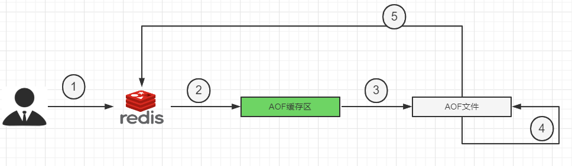

   |      |                                                              |
   | ---- | ------------------------------------------------------------ |
   | 1    | Client作为命令的来源，会有多个源头以及源源不断的请求命令。   |
   | 2    | 在这些命令到达Redis Server 以后并不是直接写入AOF文件，会将其这些命令先放入AOF缓存中进行保存。这里的AOF缓冲区实际上是内存中的一片区域，存在的目的是当这些命令达到一定量以后再写入磁盘，避免频繁的磁盘IO操作。 |
   | 3    | AOF缓冲会根据AOF缓冲区**同步文件的三种写回策略**将命令写入磁盘上的AOF文件。 |
   | 4    | 随着写入AOF内容的增加为避免文件膨胀，会根据规则进行命令的合并(又称**AOF重写**)，从而起到AOF文件压缩的目的。 |
   | 5    | 当Redis Server 服务器重启的时候会从AOF文件载入数据。         |

4. 配置:

   1. 默认情况下，Redis 是没有开启 AOF 的。开启AOF功能需要设置配置：`appendonly yes`

   2. 三种写回策略:在配置文件中配置`appendsync <xx>`

      - always:同步写回，每个写命令执行完立刻同步地将日志写回磁盘
      - everysec(默认):每秒写回，每个写命令执行完，只是先把日志写到 AOF 文件的内存缓冲区，每隔 1 秒把缓冲区中的内容写入磁盘
      - no操作系统控制的写回，每个写命令执行完，只是先把日志写到AOF文件的内存缓冲区，由操作系统决定何时将缓冲区内容写回磁盘

      <br>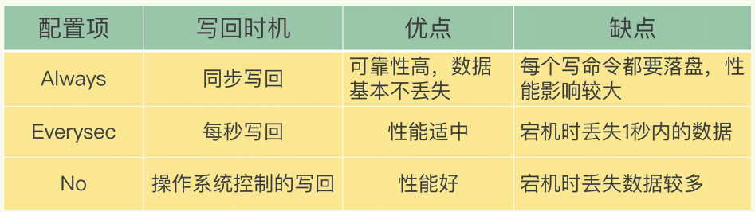

   3. aof 文件保存路径:

      1. redis 6:AOF 保存文件的位置和RDB保存文件的位置一样，都是通过 redis.conf 配置文件的 dir 配置。
      2. redis 7:可以通过`appenddirname <dir>` 设置路径，最终 aof 文件保存路径位置为` dir`+`appenddirname`这两个配置的组合。

   4. aof 文件名称:还是建议和 Redis 实例的端口号相关。

      1. redis 6:通过`appendfilename <file_name>`指定文件名称，只会生成一个文件。

      2. redis 7:通过`appendfilename <file_name>`指定文件名称,会生成三个文件。<br>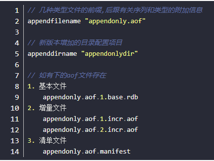

         > 官方文档描述: 自 Redis 7.0.0 以来，Redis 使用多部分 AOF 机制。也就是说，原始的单个 AOF  文件被分割成基础文件(最多一个)和增量文件(可能有多个)。基础文件代表 AOF 重写时现有数据的初始(RDB 或 AOF  格式)快照。增量文件包含自上次创建基础 AOF 文件以来的增量更改。所有这些文件都放在一个单独的目录中，并由清单文件跟踪。<font color=blue>实际上还有 history 类型的 aof 文件，但是会被 redis 自动清理。 </font>

5. <font color=red>aof 重写机制</font>:

   1. 由于 AOF 持久化是 Redis 不断将写命令记录到 AOF 文件中，随着Redis不断的进行，AOF 的文件会越来越大，文件越大，占用服务器内存越大以及 AOF 恢复要求时间越长。为了解决这个问题，Redis新增了重写机制，当AOF文件的大小超过所设定的峰值时，Redis 就会自动启动 AOF 文件的内容压缩，只保留可以恢复数据的最小指令集或者可以手动使用命令 `bgrewriteaof` 来重新。

   2. 一句话来说就是:启动AOF文件的内容压缩，只保留可以恢复数据的最小指令集。

   3. 具体情景:多次对同一个 String 类型的 key 进行更改，在 aof 文件中会完整记录这个过程，实际上这是没有必要的，只需要记录最后一次更改即可，而重写机制就可以实现将多次操作重写为一次等效操作。

   4. 配置重写条件:同时满足条件才会触发。

      1. `auto-aof-rewrite-percentage`设置文件基于上次重写后的增长百分比。

      2. `auto-aof-rewrite-min-size`设置AOF重写的最小触发阈值。

      3. 默认配置如下:当文件达到 64 mb 及以上且在上次重写后文件的基础上大小增长 1 倍，就触发重写。

         ```bash
         auto-aof-rewrite-percentage 50
         auto-aof-rewrite-min-size 64mb
         ```

   5. 触发机制:

      1. 自动触发:根据配置文件条件触发，默认当文件达到 64 mb 及以上且在上次重写后文件的基础上大小增长 1 倍时触发重写。
      2. 手动触发:客户端向服务器发送 `bgrewriteaof`命令。

   6. aof 重写原理:

      1. 在重写开始前，redis 会创建一个重写子进程，这个子进程会读取现有的 aof 文件，并将其包含的指令进行分析压缩并写入到一个临时文件中。
      2. 与此同时，主进程会将新接收到的写指令一边累积到内存缓冲区(重写缓冲区)中，一边继续写入到原有的 aof 文件中(通过原 aof 缓冲区)，这样做是保证原有的 aof 文件的可用性，避免在重写过程中出现意外。
      3. 当重写子进程完成重写工作后，它会给父进程发一个信号，父进程收到信号后就会将内存(重写缓冲区)中缓存的写指令追加到新 aof 文件中。
      4. 当追加结束后，redis 就会用新 aof 文件来代替旧 aof 文件，之后再有新的写指令，就都会追加到新的 aof 文件中
      5. 重写 aof 文件的操作，并没有读取旧的 aof 文件，而是将整个内存中的数据库内容用命令的方式重写了一个新的 aof 文件，这点和快照有点类似

6. 不妨具体操作一下，开启 aof 持久化，设置文件路径和文件名称(可以关闭 rdb，避免影响):

   ```bash
   dir "/redis/bak"
   appendonly yes
   appendfilename "appendonly6379.aof"
   appenddirname "appendonlydir"
   auto-aof-rewrite-percentage 100
   auto-aof-rewrite-min-size 1k
   
   # 关闭混合模式(后续会提)
   aof-use-rdb-preamble no
   ```

   配置完成后重启数据库，会发现 aof 文件已经自动生成：

   ```bash
   $ ll
   total 8
   drwxr-xr-x 2 fish fish 4096 Feb 28 17:10 .
   drwxr-xr-x 3 fish fish 4096 Feb 28 17:10 ..
   
   $ ll
   total 12
   drwxr-xr-x 2 fish fish 4096 Feb 28 17:10 .
   drwxr-xr-x 3 fish fish 4096 Feb 28 17:10 ..
   -rw-r--r-- 1 fish fish    0 Feb 28 17:10 appendonly6379.aof.1.base.aof
   -rw-r--r-- 1 fish fish    0 Feb 28 17:10 appendonly6379.aof.1.incr.aof
   -rw-r--r-- 1 fish fish   96 Feb 28 17:10 appendonly6379.aof.manifest
   ```

   当我们向数据库中写入时，发现文件夹中多出一下数据

   ```bash
   127.0.0.1:6379> set v1 1111111111111
   OK
   127.0.0.1:6379> set v1 1111111111112
   OK
   127.0.0.1:6379> set v1 1111111111113
   OK
   127.0.0.1:6379> set v1 1111111111114
   OK
   ```

   此时在回头看 aof 文件，会发现 incr.aof 文件变大:

   ```bash
   $ ll
   total 16
   drwxr-xr-x 2 fish fish 4096 Feb 28 17:10 .
   drwxr-xr-x 3 fish fish 4096 Feb 28 17:11 ..
   -rw-r--r-- 1 fish fish    0 Feb 28 17:10 appendonly6379.aof.1.base.aof
   -rw-r--r-- 1 fish fish  187 Feb 28 17:11 appendonly6379.aof.1.incr.aof
   -rw-r--r-- 1 fish fish   96 Feb 28 17:10 appendonly6379.aof.manifest
   ```

   我们不妨具体看一下 incr.aof 文件的内容:会发现其实就是我们执行的命令:<br>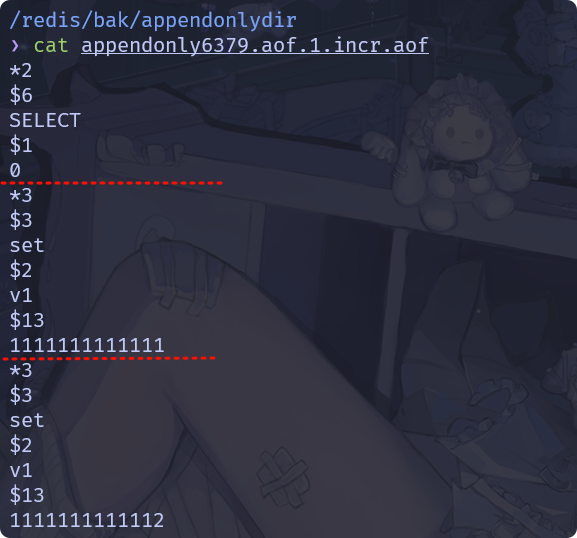

   接下来我们继续修改 v1 的值，触发重写机制,后发现 aof 文件发生变化:

   ```bash
   $ ll
   total 16
   drwxr-xr-x 2 fish fish 4096 Feb 28 17:21 .
   drwxr-xr-x 3 fish fish 4096 Feb 28 17:21 ..
   -rw-r--r-- 1 fish fish   62 Feb 28 17:21 appendonly6379.aof.2.base.aof
   -rw-r--r-- 1 fish fish    0 Feb 28 17:21 appendonly6379.aof.2.incr.aof
   -rw-r--r-- 1 fish fish   96 Feb 28 17:21 appendonly6379.aof.manifest
   ```

   此时发生重写，内容存储到 appendonly6379.aof.2.base.aof 中，appendonly6379.aof.2.incr.aof 将保存基于appendonly6379.aof.2.base.aof 的命令。此时不妨查看一下 appendonly6379.aof.2.base.aof:<br>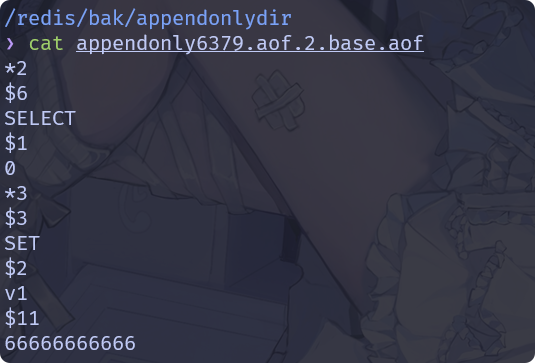

7. aof 文件内容:其实通过上面操作，大致知道 aof 文件中保存我们写入操作执行的代码。<font color=red>开启 aof 后，若是我们不小心执行 flushdb 操作后，其实可以关闭 Redis 后在 aof 文件中删除对应操作的记录，然后重新启动 redis 即可，然后Redis 会读取 aof 文件恢复数据。</font>于是就存在一个好笑的操作，我们可以在 aof 文件中，手动写入 flushdb 操作，在下次启动  Redis 的时候会自动执行 flushdb ，简称代码下毒事件，若是不小心又触发重写机制，那更是完蛋。<br>

8. aof 文件修复:`redis-check-aof --fix <file>`进行修复。

9. aof 配置优化:<br>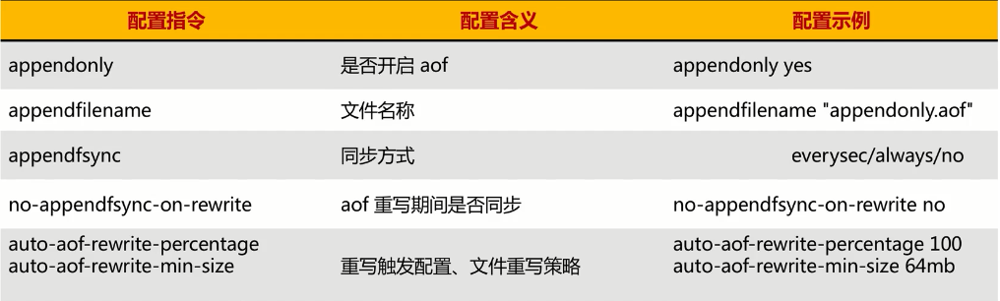

10. aof 优缺点:

    1. 优势:更好的保护数据不丢失、性能高、可做紧急恢复。

    2. 劣势:相同数据集的数据而言 aof 文件要远大于 rdb 文件，恢复速度慢于 rdb 。aof 运行效率要慢于 rdb ，每秒同步策略效率较好，不同步效率和 rdb 相同。

       <br>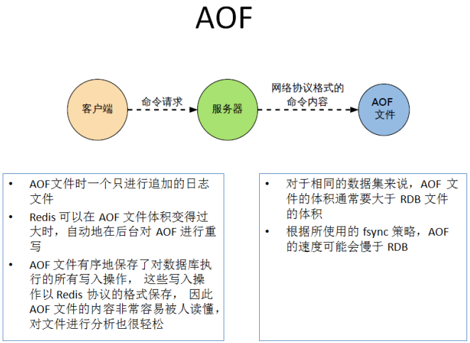

    

 


##### 混合持久化

1. redi 支持同时开启 aof 和 rdb。在这种情况下,当 redis 重启的时候会优先载入 aof 文件来恢复原始的数据，因为在通常情况下 aof 文件保存的数据集要比 rdb文件保存的数据集要完整,rdb 的数据不实时，同时使用两者时服务器重启也只会找 aof 文件。<br>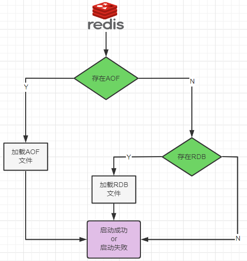
2. 诚如上面所说那要不要只使用AOF呢？建议不要，因为RDB更适合用于备份数据库（AOF在不断变化不好备份），留着 RDB 作为一个万一的手段。
3. 但是在实际生产中还是推荐使用混合模式，结合了RDB和AOF的优点，既能快速加载又能避免丢失过多的数据。
   1. 开启方式:配置文件中设置 `aof-use-rdb-preamble` 的值为 yes。<font color=red>前提是 RDB 和 AOF 均要开启！！！</font>
   2. RDB + AOF 的混合方式时，RDB 镜像做全量持久化，AOF 做增量持久化:先使用 RDB 进行快照存储，然后使用 AOF 持久化记录所有的写操作，当重写策略满足或手动触发重写的时候，将最新的数据存储为新的 RDB 记录。这样的话，重启服务的时候会从 RDB 和 AOF 两部分恢复数据，既保证了数据完整性，又提高了恢复数据的性能。简单来说：混合持久化方式产生的文件一部分是RDB格式，一部分是AOF格式。

| **模式**         | **数据安全性** | **恢复速度**  | **文件大小** | **性能开销** | **适用场景**               |
| ---------------- | -------------- | ------------- | ------------ | ------------ | -------------------------- |
| 纯 RDB           | 低             | 快            | 小           | 低           | 允许数据丢失，快速恢复     |
| 纯 AOF           | 高             | 慢            | 大           | 中           | 数据完整性优先             |
| AOF+RDB 同时开启 | 高             | 慢（优先AOF） | 大 + 小      | 高           | 双重保障，灵活性高         |
| AOF+RDB 混合模式 | 高             | 较快          | 中等         | 中           | 生产环境推荐（Redis 4.0+） |


##### 纯缓存

当我们仅仅将 Redis 作为缓存数据库使用时(纯缓存模式)，数据安全就没有那么重要，此时为了提高数据库的性能，我们需要关闭 RDB 和 AOF缓存：

- 关闭 RDB : 配置文件中设置`save ""`。
- 关闭 AOF :配置文件中配置`appendonly no`。


#### 事务

##### mysql事务

1. 事务（Transaction）是数据库管理系统（DBMS）中一个核心概念，用于确保一组操作要么全部成功，要么全部失败，从而维护数据的完整性和一致性。可以把它想象成数据库操作的“原子单元”，像现实生活中的一个完整动作（比如转账、下单购物），不允许被分割或部分执行。

2. 事务四大特性:ACID

   | 特性                | 描述                                                     | 示例                                                         |
   | ------------------- | -------------------------------------------------------- | ------------------------------------------------------------ |
   | 原子性(Atomicity)   | 事务中的操作要么全部成功，要么全部失败回滚。             | 转账时，A 账户扣款和 B 账户入款必须同时成功或失败。          |
   | 一致性(Consistency) | 事务执行后，数据库从一个有效状态转换到另一个有效状态。   | 转账后，总金额不变（A 减少的金额等于 B 增加的金额）。        |
   | 隔离性(Isolation)   | 并发事务之间互不干扰，每个事务的操作对其他事务透明。     | 事务 A 修改数据时，事务 B 看到的是修改前或后的状态，而非中间状态。 |
   | 持久性(Durability)  | 事务提交后，修改永久保存到数据库，即使系统崩溃也不丢失。 | 转账成功后，即使数据库服务器断电，数据恢复后转账结果仍有效。 |

3. 基本语法：

   ```sql
   START TRANSACTION;  -- 或 BEGIN
   -- 执行 SQL 操作（INSERT/UPDATE/DELETE等）
   COMMIT;             -- 提交事务，确认更改
   ROLLBACK;           -- 回滚事务，撤销所有操作
   ```

4. 事务隔离级别:

   MySQL 支持 4 种事务隔离级别，解决并发问题（如脏读、不可重复读、幻读）：

   | 隔离级别                    | 脏读   | 不可重复读 | 幻读   | 性能 | 适用场景                     |
   | --------------------------- | ------ | ---------- | ------ | ---- | ---------------------------- |
   | 读未提交 (Read Uncommitted) | 可能   | 可能       | 可能   | 最高 | 极少使用（数据准确性要求低） |
   | 读已提交 (Read Committed)   | 不可能 | 可能       | 可能   | 较高 | 允许不可重复读（如统计报表） |
   | 可重复读 (Repeatable Read)  | 不可能 | 不可能     | 可能   | 中等 | MySQL 默认级别（推荐）       |
   | 串行化 (Serializable)       | 不可能 | 不可能     | 不可能 | 最低 | 严格数据一致性（金融交易）   |

   > 上述四种事务隔离级别解释如下:
   >
   > - 事务可以读取其他事务未提交的数据。
   > - 事务只能读取其他事务已提交的数据，避免了脏读。
   > - 同一事务内多次读取同一数据，结果始终一致。
   > - 所有事务按顺序串行执行(通过锁表实现）

5. 事务并发性:

   | 问题       | 描述                                                         | 示例                                                         |
   | ---------- | ------------------------------------------------------------ | ------------------------------------------------------------ |
   | 脏读       | 事务 A 读取了事务 B 未提交的数据，事务 B 回滚导致数据不一致。 | 事务 A 看到 B 未提交的转账操作，但 B 回滚后数据无效。        |
   | 不可重复读 | 事务 A 多次读取同一数据，期间事务 B 修改并提交，导致 A 前后读取结果不一致。 | 事务 A 两次查询账户余额，中间事务 B 完成转账，导致两次结果不同。 |
   | 幻读       | 事务 A 读取某个范围的数据，事务 B 插入新数据，导致 A 再次读取时出现“幻影行”。 | 事务 A 统计用户总数时，事务 B 新增用户，导致 A 两次统计结果不一致。 |


##### redis 事务

1. Redis 事务允许用户将多个命令打包成一个单元，按顺序一次性执行，且执行期间不会被其他客户端的命令中断。可以一次执行多个命令，本质是一组命令的集合。一个事务中的所有命令都会序列化，按顺序地串行化执行而不会被其它命令插入，不许加塞。

2. 特点:

   1. Redis 的事务仅仅是保证事务里的操作会被连续独占的执行，Redis 命令执行是单线程架构，在执行完事务内所有指令前是不可能再去同时执行其他客户端的请求的。因此长时间的事务
   2. <font color=red>Redis 事务提交前任何指令都不会被实际执行</font>，也就不存在”事务内的查询要看到事务里的更新，在事务外查询不能看到”这种问题了。
   3. Redis的事务不保证原子性(部分原子性)，也就是不保证所有指令同时成功或同时失败，没有执行到一半进行回滚的能力。
   4. Redis会保证一个事务内的命令依次执行，而不会被其它命令插入。

3. 悲观锁和乐观锁: 

   1. 悲观锁:假设并发冲突一定会发生，因此在访问共享资源时，先加锁，确保其他线程或事务无法修改资源，直到当前操作完成。
   2. 乐观锁:假设并发冲突发生的概率较低，因此在操作数据时不加锁，而是在提交时检查是否有冲突。如果没有冲突，则提交成功,如果有冲突，则回滚并重试。(<font color=red>乐观锁策略:提交版本号必须大于数据库中记录的当前版本才能执行更新。执行更新时，校验当前数据库中的版本号是否与读取时一致。若一致，则更新数据并将版本号 +1，否则拒绝更新。</font>)
   3. Redis 的 watch机制，本质上是 CAS(check and set),在修改数据前，先检查当前值是否与预期值一致，若一致则更新，否则放弃操作。

4. 常用命令:

   1. `MULTI`标记事务的开始，后续所有命令会按顺序缓存在队列中，直到遇到 `EXEC` 或 `DISCARD`(此前这些命令不会执行)。

   2. `EXEC`执行事务队列中的所有命令，并返回所有命令的响应结果。

   3. `DISCARD`取消事务，清空事务队列并退出事务模式。

   4. `WATCH`监控一个或多个 key，若这些 key 在事务执行前被其他客户端修改，则事务失败（乐观锁机制）。

      > - 一旦执行了`exec`之前加的监控锁都会被取消掉。
      > - 当客户端连接丢失的时候(比如退出链接)，所有东西都会被取消监视。

   5. `UNWATCH`取消对所有被 `WATCH` 的 key 的监控。在事务失败后，若需放弃重试，可显式调用 `UNWATCH` 释放资源。

   <br>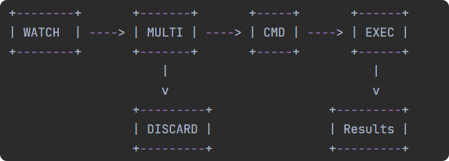

5. 由于 redis 不存在回滚，在出现错误时一般存在一下两种情况:

   1. 语法错误(如命令不存在):事务会被拒绝执行。
   2. 运行时错误(如对字符串执行 INCR):错误命令会失败，但其他命令仍会执行。

6. 下面不妨对 Redis 事务的一些情况进行演示:

   1. 正常情况:

      ```bash
      127.0.0.1:6379> multi
      OK
      127.0.0.1:6379(TX)> set k1 666
      QUEUED
      127.0.0.1:6379(TX)> set k2 777
      QUEUED
      127.0.0.1:6379(TX)> exec
      1) OK
      2) OK
      ```

   2. 放弃事务:在 exec 前放弃执行事务

      ```bash
      127.0.0.1:6379> multi
      OK
      127.0.0.1:6379(TX)> set k1 6
      QUEUED
      127.0.0.1:6379(TX)> set k2 7
      QUEUED
      127.0.0.1:6379(TX)> discard
      OK
      ```

   3. 全体连坐:存在语法错误

      ```bash
      127.0.0.1:6379> get k1
      "666"
      127.0.0.1:6379> get k2
      "777"
      
      127.0.0.1:6379> multi
      OK
      127.0.0.1:6379(TX)> set k1 6
      QUEUED
      127.0.0.1:6379(TX)> set k2
      (error) ERR wrong number of arguments for 'set' command
      127.0.0.1:6379(TX)>
      127.0.0.1:6379(TX)> exec
      (error) EXECABORT Transaction discarded because of previous errors.
      127.0.0.1:6379> get k1
      "666"
      ```

   4. 冤头债主:运行时错误

      ```bash
      127.0.0.1:6379> set k1 66
      OK
      127.0.0.1:6379> set k2 99
      OK
      127.0.0.1:6379> set name a
      OK
      
      
      127.0.0.1:6379> multi
      OK
      127.0.0.1:6379(TX)> set k1 6
      QUEUED
      127.0.0.1:6379(TX)> incr name
      QUEUED
      127.0.0.1:6379(TX)> set k2 9
      QUEUED
      127.0.0.1:6379(TX)> exec
      1) OK
      2) (error) ERR value is not an integer or out of range
      3) OK
      127.0.0.1:6379> get k2
      "9"
      ```

   5. watch监控:<font color=red>需要先监听再开启事务，若是监听后执行失败，别忘记手动取消监听。</font>

      ```bash
      127.0.0.1:6379> get name
      "fish"
      127.0.0.1:6379> watch name
      OK
      
      # 另起一个终端，连接 redis 后修改 name 值
      
      
      127.0.0.1:6379> multi
      OK
      127.0.0.1:6379(TX)> set age 15
      QUEUED
      127.0.0.1:6379(TX)> exec
      (nil)
      127.0.0.1:6379> unwatch
      OK
      ```


 

#### 管道

1. Redis 是一种基于客户端-服务端模型以及请求/响应协议的TCP服务。一个请求会遵循以下步骤：

   1. 客户端向服务端发送命令分四步(发送命令→命令排队→命令执行→返回结果)，并监听 Socket 返回，通常以阻塞模式等待服务端响应。
   2. 服务端处理命令，并将结果返回给客户端。
   3. 这两步所花费的时间称为：Round Trip Time(简称RTT,数据包往返于两端的时间)<br>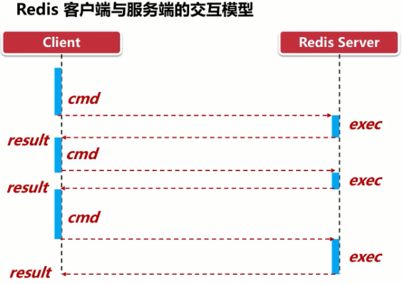

2. 如果同时需要执行大量的命令，那么就要等待上一条命令应答后再执行，这中间不仅仅多了 RTT ，而且还频繁调用系统 IO ，发送网络请求，同时需要Redis 调用多次 read() 和 write() 系统方法，系统方法会将数据从用户态转移到内核态，这样就会对进程上下文有比较大的影响了，性能不太好。

3. 对于上面的问题，我们首先想到的就是一次性尽可能运行较多命令，此时可以使用原生批处理命令。例如 mset、mget ，但是原生批处理命令是有很大局限性的，例如 mset 仅支持 string 类型，无法同时设置不同类型。

4. Redis 管道（Pipeline）是一种客户端技术，用于在一次网络通信中批量发送多个命令并接收所有响应，从而显著减少网络往返时间(RTT)，提升性能。管道实现的原理是队列，先进先出特性就保证数据的顺序性。<br>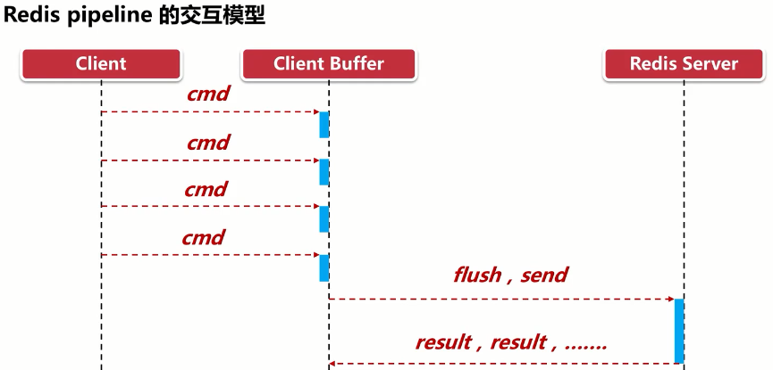

5. 管道的使用:在`redis-cli`命令中使用`--pipe`参数建立连接，将需要执行的命令写在文件中，并通过 linux 管道传递给 `redis-cli`命令.(当然也可以使用`<`重定向）

   ```bash
   $ cat cmd.txt
   set name dream
   set age 18
   rpush list 1 2 3 4
   hset user:001 name fish age 22
   
   $ cat cmd.txt | redis-cli -a yx198973 --pipe
   Warning: Using a password with '-a' or '-u' option on the command line interface may not be safe.
   All data transferred. Waiting for the last reply...
   Last reply received from server.
   errors: 0, replies: 4
   
   $ redis-cli -a yx198973 --pipe < cmd.txt
   Warning: Using a password with '-a' or '-u' option on the command line interface may not be safe.
   All data transferred. Waiting for the last reply...
   Last reply received from server.
   errors: 0, replies: 4
   ```

6. 注意事项:

   1. 非原子性: 管道中的命令不保证原子性(若需原子操作，需结合事务)。
   2. 错误处理: 若某条命令执行失败，后续命令仍会继续执行，需客户端检查每个结果。
   3. 缓冲区限制: <font color=red>使用管道组装的命令个数不能太多，不然数据量过大客户端阻塞的时间可能过久，同时服务端此时也被迫回复一个队列答复，占用很多内存。</font>

7. 原生批处理命令与管道的对比:

   1. 原生批量命令是原子性，管道是非原子性
   2. 原生批量命令一次只能执行一种命令，管道支持批量执行不同命令
   3. 原生批命令是服务端实现，而管道需要服务端与客户端共同完成

8. 管道与事务的对比:

   | 特性         | 管道         | 事务                   |
   | ------------ | ------------ | ---------------------- |
   | **原子性**   | 不保证       | 保证                   |
   | **目的**     | 减少网络开销 | 保证命令组的原子执行   |
   | **错误处理** | 逐条检查结果 | 命令入队时检查语法错误 |
   | **性能**     | 更高         | 略低（需额外事务控制） |

   


#### 发布订阅

1. Redis 的发布与订阅（Pub/Sub）是一种消息传递机制，允许发布者向频道发送消息，订阅者接收特定频道的消息。

2. 相当于 stream 的前身，可以实现消息队列MQ，但是不建议，而且无法持久化。所以仅作为了解，专业的事还是要交给专业的人。

3. Redis 客户端可以订阅任意数量的频道，类似我们微信关注多个公众号。当频道发布新消息时，订阅频道的客户端都会收到消息。<br>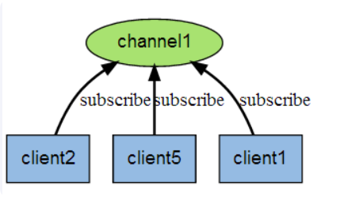<br>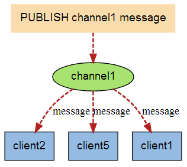

4. 发布/订阅其实是一个轻量的队列，只不过数据不会被持久化，一般用来处理实时性较高的异步消息<br>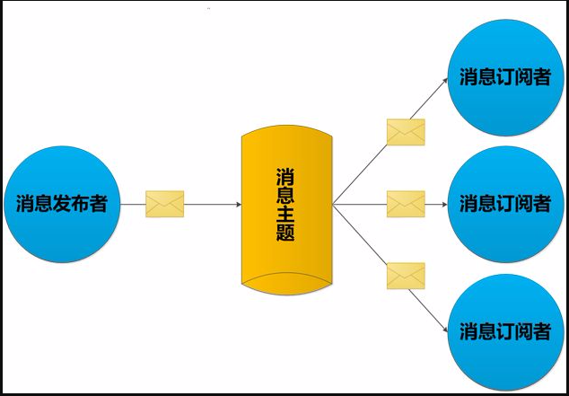

5. 常用命令:

   - `SUBSCRIBE channel [channel ...]`订阅一个或多个频道，客户端进入订阅模式。订阅成功后，客户端会持续接收消息，每条消息格式为：`["message", <channel>, <message>]`

   - `PSUBSCRIBE pattern [pattern ...]`订阅匹配指定模式的所有频道(支持通配符，如 `*` 匹配任意字符，`?` 匹配单个字符),订阅成功后，客户端会收到格式为 `["pmessage", <pattern>, <channel>, <message>]` 的消息。

   - `PUBLISH channel message`向指定频道发送消息，所有订阅该频道的客户端都会收到消息,返回接收到消息的客户端数量。

   - `UNSUBSCRIBE [channel ...]`退订一个或多个频道。若不指定频道，则退订所有频道。

   - `PUNSUBSCRIBE [pattern ...]`退订一个或多个模式。若不指定模式，则退订所有模式订阅。

   - `PUBSUB subcommand [argument ...]`查看订阅和发布系统状态:

     - `PUBSUB CHANNELS [pattern]`列出当前活跃的频道(至少有一个订阅者的频道)(不含模式订阅)。

       ```bash
       # 列出所有以 "news" 开头的活跃频道
       PUBSUB CHANNELS news*  
       ```

     - `PUBSUB NUMSUB [channel ...]`返回指定频道的订阅者数量(不含模式订阅)。

     - `PUBSUB NUMPAT`返回当前被订阅的模式数量（通过 `PSUBSCRIBE` 订阅的 `a*`、`c?`什么的）。

6. 缺点:

   1. 发布的消息在 Redis 系统中不能持久化，因此，<font color=red>必须先执行订阅，再等待消息发布</font>。如果先发布了消息，那么该消息由于没有订阅者，消息将被直接丢弃。
   2. 消息只管发送对于发布者而言消息是即发即失的，不管接收，也没有 ACK 机制，无法保证消息的消费成功。
