##### 主从复制

1. 主从复制: master 以写为主，slave 以读为主,当 master 数据变化的时候，自动将新的数据异步同步到其它 slave 数据库。<br>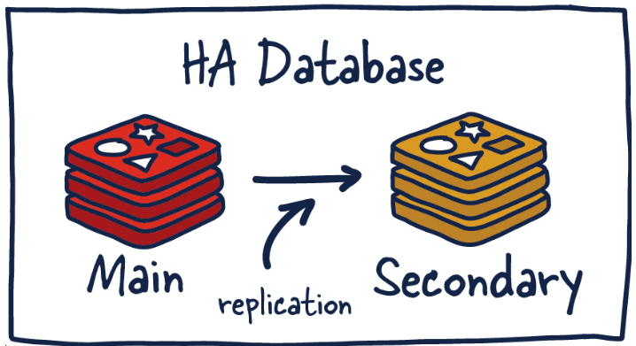

2. 作用:读写分离、容灾恢复、数据备份、水平拓容支撑高并发

3. 主从复制常用配置:<font color=red>配从库不配主库！！！</font>

   1. master 如果配置了 `requirepass` 参数，需要密码登陆。那么 slave 就要配置 `masterauth`来设置校验密码，否则的话 master 会拒绝 slave 的访问请求。
   2. slave 的 redis.conf 配置文件添加`replicaof <master_ip> <master_port>`，配置主库 ip 和端口。
   3. `info replication`可以查看复制节点的主从关系和配置信息。
   4. `slaveof <master_ip> <master_port>`无需修改配置文件，使用命令动态设置主库信息。
   5. `slaveof no one`是当前 slave 断开与 master 同步，并转为主数据库。

4. 前置条件，配置文件修改:

   1. `daemonize yes`守护进程形式启动(后台启动)。
   2. 注释`bind 127.0.0.1`运行其他 ip 远程连接。
   3. `protected-mode no` 关闭保护模式。
   4. 指定运行端口`port <port>`。
   5. 指定当前工作目录`dir <dir>`。
   6. 指定 pid 文件名字`pidfile <file_name>`一般不用改，知道这个配置就行。
   7. 指定日志文件存储路径`logfile <name>`，如果指定的是相对路径会将该路径解析为相对于 Redis  启动时的当前工作目录的路径。。
   8. 指定日志级别`loglevel <level>`,一般就是 notic，知道就行。
   9. 指定数据库密码`requirepass <passwd>`(一般无论主从都是设置同一个密码)。
   10. 指定 RDB 文件名称`dbfilename <name>`。
   11. 指定 aof 文件目录`appenddirname <dir>`和文件名称`appendfilename <name>`。
   12. 开启 aof 持久化`appendonly yes`。
   13. 开启 rdb 持久化`save <seconds> <changes>`。
   14. <font color=red>从机必须指定访问主机的通行密码 `masterauth <passwd>`。</font>

5. 在 Redis 主从复制架构中，是否开启 RDB 或 AOF 持久化取决于你的数据安全需求和容灾策略:

   1. <font color=red>master 强烈建议开启 RDB 或 AOF(至少一种)</font>:主节点是写入的核心，若主节点宕机且未持久化，所有未落盘的数据会丢失。即使有从节点，从节点可能尚未同步最新数据。
   2. <font color=red>slave 是否开启持久化取决于需求(建议开启)</font>从节点不会主动持久化，而是依赖主节点的数据同步。从节点重启时，若有持久化文件，可快速加载本地数据，避免全量同步。此外从节点开启 RDB/AOF 可作为主节点的额外数据备份。

6. docker 搭建主从复制注意事项:

   1. 使用 docker 的 -d 参数启动 redis 容器时，配置文件需要关闭守护进程形式(后台)形式启动`daemonize no`，，不然二者会冲突！！
   2. 至于`dir /data`配置前面已经提过，默认的`dir ./`是等效的。
   3. 由于端口映射的存在，容器的 redis.conf 的端口号就不要修改，修改容器启动的映射端口就行。
   4. 由于是使用自建的 docker 网络，ip 直接填写容器名，至于端口 6379。需要注意 6379 不是映射端口，而是容器默认端口号(配置的 redis 启动端口号)。当然也可以使用主机 ip 和映射端口号。
   5. `Failed to write PID file: Permission denied`：Redis 无法写入 PID 文件，可能是权限问题。使用参数`--privileged=true`启动容器，容器内的进程几乎拥有与宿主机 root 用户相同的权限。

7. 为了方便演示操作，采用 docker 演示:

   | 容器名  | 角色   | 端口 | 配置文件       |
   | ------- | ------ | ---- | -------------- |
   | redis_1 | master | 6379 | redis6379.conf |
   | redis_2 | slave  | 6380 | redis6380.conf |
   | redis_3 | slave  | 6381 | redis6381.conf |

   ```bash
   # 确保主从容器在同一网络下，避免 IP 动态变化问题
   docker network create redis-net
   
   # redis_1
   docker run \
   -v /redis/conf:/etc/redis  \
   -v /redis/data6379:/data \
   --network redis-net \
   --restart=always \
   --privileged=true \
   -dp 6379:6379 \
   --name redis_1 \
   redis:7.4.2 \
   redis-server /etc/redis/redis6379.conf
   
   # redis_2
   docker run \
   -v /redis/conf:/etc/redis  \
   -v /redis/data6380:/data \
   --network redis-net \
   --restart=always \
   --privileged=true \
   -dp 6380:6379 \
   --name redis_2 \
   redis:7.4.2 \
   redis-server /etc/redis/redis6380.conf
   
   # redis_3
   docker run \
   -v /redis/conf:/etc/redis  \
   -v /redis/data6381:/data \
   --network redis-net \
   --privileged=true \
   --restart=always \
   -dp 6381:6379 \
   --name redis_3 \
   redis:7.4.2 \
   redis-server /etc/redis/redis6381.conf
   ```

   ```bash
   # 以 redis6380.conf 为例给出部分配置
   
   # daemonize yes
   daemonize no
   #bind 127.0.0.1 -::1
   protected-mode no
   port 6379
   dir /data
   pidfile /var/run/redis_6380.pid
   logfile "/data/6380.log"
   loglevel notice
   requirepass yx198973
   dbfilename dump6380.rdb
   appendfilename "appendonly6380.aof"
   appenddirname "appendonlydir"
   #appendonly yes
   appendonly no
   #save 3600 1 300 100 60 10000
   masterauth yx198973
   replicaof redis_1 6379
   ```

   > 一些教程会直接将 Redis 配置文件挂载，但是后面搭建哨兵时，是会报错的，关于这一情况会在搭建哨兵时说明。

8. 具体操作:<font color=red>配从库不配主库！！！</font>

   1. 永久型:配置在 redis.conf 中，不会因为重启导致配置失效

      1. 在 master 的配置文件中使用 `requirepass <passwd>` 设置访问密码。

      2. 在所有 slave 的配置文件中使用 `masterauth <passwd>` 指定其所属 master 的访问密码。同时添加 `replicaof <master_ip> <master_port>` 配置主库 ip 和端口。

         ```bash
         replicaof redis_1 6379
         masterauth yx198973
         ```

         > 或者也可以 ip 填写主机 ip , 端口 6379(从主机访问，是映射端口)。注意这两种配置端口号的区别，涉及到 docker 网络和访问方式的区别。

      3. 启动 redis ，分别在主从数据库中使用 `info replication` 查看节点的主从关系和配置信息。<br>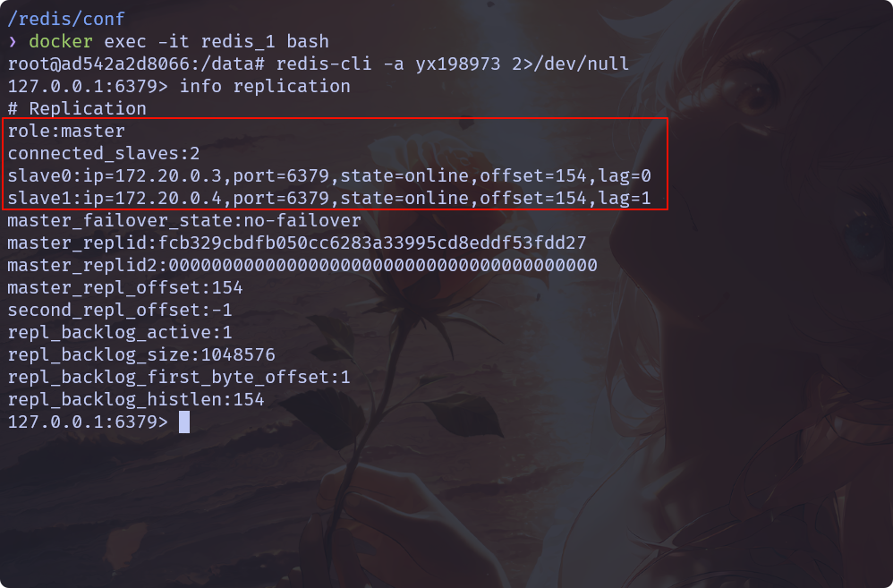<br>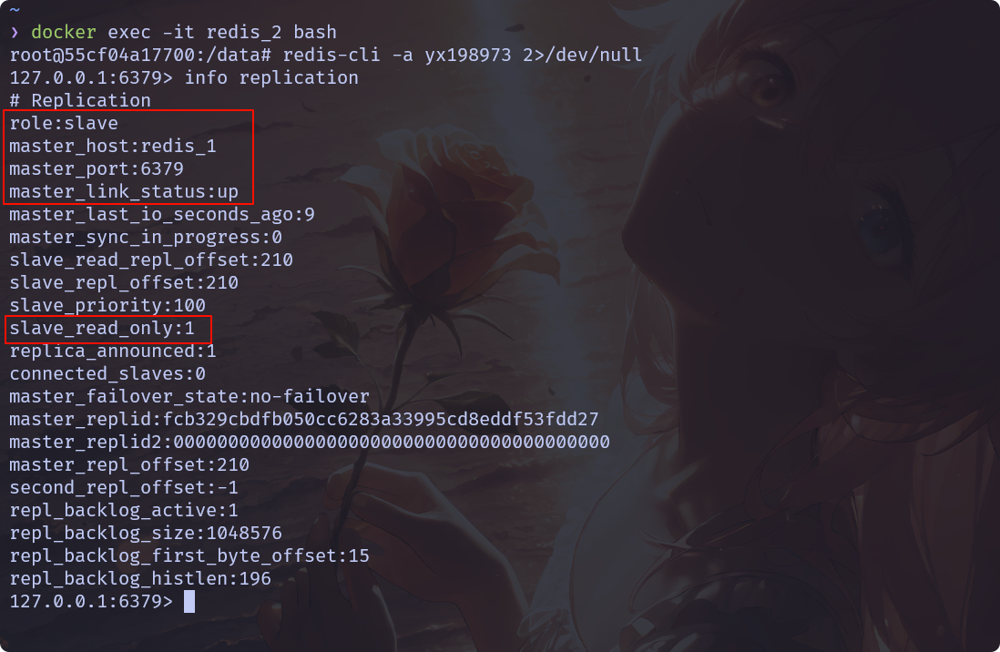

         > `slave_read_only:1`表明从库只读，无法写入数据。

   2. 动态型:不需要修改配置文件，直接使用命令操作:

      1. `slaveof <master_ip> <master_port>`无需修改配置文件，使用命令动态设置主库信息。

      2. 使用命令`config set masterauth <passwd>`设置访问 master 的密码。

      3. 使用 `slaveof no one` 断开与 master 同步，并转为主数据库。<font color=red>重启后失效，若要永久操作，还是需要修改配置文件。</font>

      4. 其实上述操作也可以使用 redis-server 启动命令一次性配置好配置:

         ```bash
         redis-server --port 6380 --slaveof <master-ip> <master-port> --masterauth <password>
         ```

9. 主从配置的特点:

   1. 从库 slave 无法写入，只能读取。
   2. 主库 master 宕机后，从机不会上位，原地待命，从机数据可以正常使用；等待主机重启动归来。
   3. 主库 master 宕机后重启，主从复制关系仍然存在。
   4. 从库 slave 宕机后重启，仍能跟上主库 master 。

10. <font color=red>上一个 slave 可以是下一个 slave 的 master ，slave 同样可以接收其他 slaves 的连接和同步请求，那么该 slave 作为了链条中下一个的master (仍是只读) 。</font>由于所有的写操作都是先在 master 上操作，然后同步更新到 slave 上，所以从 master 同步到 slave 机器有一定的延迟，当系统很繁忙的时候，延迟问题会更加严重， slave 机器数量的增加也会使这个问题更加严重。<br>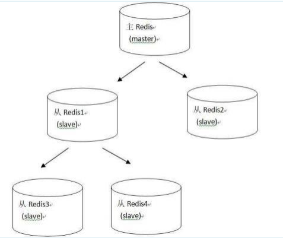

11. 主从复制的原理和流程:

    1. 主从复制的本质是数据单向同步：master负责处理写请求，并将数据变更异步复制到 slave。核心机制基于以下组件：
       - Replication ID:主节点唯一标识，用于标识数据版本。
       - Offset(复制偏移量):主从节点维护的增量数据同步位置，用于判断数据一致性。
       - Replication Backlog(复制积压缓冲区):主节点的环形缓冲区，存储最近的写命令,用于增量同步。
    2. 增量同步:
       1. 触发条件:
          - slave 首次连接 Master。
          - slave 的 Replication ID 与 Master 不匹配,例如 Master 重启后生成新 ID。
          - slave 的 Offset 超出 master 的 Replication Backlog 范围。
       2. 流程步骤：
          1. master 生成 RDB 快照(通过 bgsave 后台进程)。
          2. master 将 RDB 文件发送给 slave。
          3. slave 清空旧数据，加载 RDB 文件。
          4. master 将 RDB 生成期间的写命令存入 Replication Backlog，RDB 传输完成后发送这些增量命令给 slave。
       3. <font color=red>RDB 生成和传输消耗大量资源(CPU、内存、网络带宽),可以通过配置 `repl-backlog-size`(默认 1MB)适当增大 Replication Backlog 以容忍更长的网络中断。</font>

    3. 全量同步:
       1. 触发条件：
          - slave 的 Replication ID 与 master 一致。
          - slave 的 Offset 仍在 master 的 Replication Backlog 范围内。
       2. 流程步骤：
          1. master 从 Replication Backlog 中提取 Offset 之后的增量命令，发送给 slave。
          2. slave 执行这些命令，追上 master 的数据状态。

    4. 工作流程:
       1. **slvae 启动，同步初请**:slave 向 master 发起连接，master 验证身份后，建立 Socket 连接，进入同步流程。slave 全量复制将被自动执行,向 master 会发送一个 sync 命令。
       2. **首次连接，全量复制**: master 节点收到 sync 命令后会开始在后台保存快照(即 rdb 持久化，主从复制时会触发 rdb)，同时收集所有接收到的用于修改数据集命令缓存起来，master 节点执行 rdb 持久化完后，master 将 rdb 快照文件和所有缓存的命令发送到所有 slave，以完成一次完全同步。而s lave 服务在接收到数据库文件数据后，将其存盘并加载到内存中，从而完成复制初始化，slave 自身原有数据会被 master 数据覆盖清除。
       3. **心跳持续，保持通信**:保持连接，slave 周期性向 master 发送消息，表示自己还活着。可以在 redis.conf 中配置 `repl-ping-replica-period 10`时间间隔。
       4. **进入平稳，增量复制**:master 继续将新的所有收集到的修改命令自动依次传给 slave ,完成同步。
       5. **从机下线，重连续传**:master 会检查 backlog 里面的 offset ，master 和 slave 都会保存复制的 offset 还有一个 masterld，offset 是保存在 backlog 中的。master 只会把已经复制的 offset 后面的数据复制给 Slave，类似断点续传。

12. master 和 slave 宕机重启后的数据一致性:

    1. master 宕机重启:若开启持久化,master 重启后加载持久化文件恢复数据。slave 会尝试增量同步，若 master 的 Replication ID 和 Offset 未丢失，则触发增量同步；否则触发全量同步。若 master 未持久化，则数据丢失，重启后数据集为空，slave 同步时会清空自身数据(连锁数据丢失风险)。
    2. slave 宕机重启:根据自身持久化文件(若有)加载数据,向 master 上报自己的 Replication ID 和 Offset。若 Offset 仍在 master 的 Replication Backlog 中,则触发增量同步。若 Offset 已丢失则触发全量同步。

13. 主从复制的缺点:

    1. 由于所有的写操作都是先在 master 上操作，然后同步更新到 slave 上，所以从 master 同步到 slave 机器有一定的延迟，当系统很繁忙的时候，延迟问题会更加严重， slave 机器数量的增加也会使这个问题更加严重。
    2. 默认情况下，master 挂掉后，不会自动在 slave 节点中自动重选一个 master，必须人工干预。


##### 哨兵

1. 哨兵是 Redis 官方提供的分布式监控与故障转移系统(无人值守)，通过多节点协作确保 Redis 主从集群的高可用。哨兵巡查监控后台 master 主机是否故障，如果故障了根据投票数自动将某一个从库转换为新主库，继续对外服务。<font color=red>哨兵不对外提供服务！！！</font>

2. 核心功能

   - 主从监控: 持续检查主节点和从节点的健康状态。
   - 自动故障转移: 主节点宕机时，提升从节点为新主节点。
   - 配置中心: 为客户端提供最新的主节点地址。
   - 消息通知: 通过 API 或脚本通知管理员故障事件。

3. 常见概念:

   1. 主观下线(SDOWN):

      1. 单个哨兵实例通过自身的监控机制判定某个节点(主节点或从节点)不可达时，标记该节点为主观下线。哨兵向节点发送 `PING` 命令后，在 `down-after-milliseconds`内未收到有效响应(如 `PONG` 回复),则认为节点主观下线。
      2. 此判定仅代表当前哨兵的主观观点，仅反映当前哨兵与目标节点的通信状态，不涉及其他哨兵实例，可能存在误判(如网络抖动)。
      3. 即使主节点被标记为主观下线，哨兵也不会立即启动故障转移。

   2. 客观下线(ODOWN):

      1. 当多个哨兵实例达成共识，认为主节点不可达时，主节点会被标记为客观下线，此时哨兵集群将启动故障转移流程。
      2. 某个哨兵发现主节点主观下线后，向其他哨兵发起投票请求`SENTINEL is-master-down-by-addr`,超过法定人数 `quorum` 的哨兵同意主节点不可达。
      3. 客观下线仅针对主节点，从节点的主观下线不会触发故障转移。
      4. 基于分布式一致性(Raft 算法)确保判断的可靠性，避免单点误判。主节点被标记为客观下线后，哨兵集群开始选举新主节点。

   3. 选举纪元(epoch):配置纪元是一个全局递增的计数器，用于标识哨兵集群中的每一次配置变更(如故障转移、主节点切换等)，确保哨兵集群在分布式环境下对配置变更达成一致，避免因网络分区或消息延迟导致的冲突。其主要作用如下:

      1. 作为唯一性标识:每次选举时，配置纪元会递增，确保每次选举的投票请求具有唯一性。

      2. 防止旧消息干扰:

         - 哨兵在投票时会检查请求中的配置纪元(epoch)。

         - 如果收到的请求的配置纪元比当前已知的配置纪元更旧，则拒绝投票,避免旧消息干扰当前选举。

      3. 确保一致性: 只有配置纪元最新的哨兵才能成为 Leader，避免多个哨兵同时发起故障转移。

4. 哨兵运行流程:

   1. 监控阶段:哨兵每秒向主/从节点发送 PING 命令,若节点在 `down-after-milliseconds`(默认 30 秒)内未响应，标记为主观下线(SDOWN)。

   2. 客观下线判定:当某个哨兵认为主节点主观下线时，通过 `SENTINEL is-master-down-by-addr` 命令询问其他哨兵。若超过 `quorum`（法定人数)的哨兵确认主节点不可达，主节点被标记为客观下线。

   3. 选举领头哨兵(Leader Sentinel):使用 Raft 算法选举领头哨兵，负责执行故障转移。获得多数哨兵投票，且得票数至少为 `quorum` 的哨兵成为 leader 。

      ```mermaid
      graph TD
          A[主节点被标记为客观下线 ODOWN] --> B[哨兵集群中每个哨兵发起投票请求]
          B --> C{收到投票请求的哨兵}
          C --> D[检查请求中的配置纪元 epoch]
          D --> E{是否已投票 或 请求的 epoch ≤ 当前 epoch?}
          E -->|否| F[投票给第一个有效的请求者]
          E -->|是| G[拒绝投票]
          F --> H[统计所有哨兵的投票结果]
          G --> H
          H --> I{得票数是否 ≥ 半数 且 ≥ quorum?}
          I -->|是| J[当选为 Leader 哨兵]
          I -->|否| K[等待超时后重新发起选举]
      ```

   4. 故障转移流程：

      1. 筛选候选从节点:排除已下线或延迟过高的从节点。

      2. 选举新主节点:基于优先级(`slave-priority`)、复制偏移量等选择最优从节点。

      3. 提升新主节点:向选中的从节点发送 `SLAVEOF NO ONE`，使其成为主节点。

      4. 切换从节点:其他从节点改为复制新主节点。

      5. 旧主处理:旧主恢复后，作为从节点加入集群。

         ```mermaid
         graph TD
             A[Leader 哨兵启动 Master 选举] --> B[筛选候选从节点]
             B --> C{是否排除以下节点?}
             C -->|是| D[已下线或网络断连次数超限]
             C -->|是| E[优先级为 0 的节点]
             C -->|否| F[进入打分阶段]
             F --> G[第一轮: 按优先级 slave-priority 排序]
             G --> H[选择优先级最小的节点]
             H --> I{是否有多个节点优先级相同?}
             I -->|是| J[第二轮: 按复制偏移量 repl_offset 排序]
             I -->|否| K[确定新主节点]
             J --> L[选择复制偏移量最大的节点]
             L --> M{是否有多个节点偏移量相同?}
             M -->|是| N[第三轮: 按 run_id 字典序排序]
             M -->|否| K
             N --> O[选择 run_id 最小的节点]
             O --> K
             K --> P[提升为新主节点]
             P --> Q[通知其他从节点同步新主节点]
         ```

5. 关于优先级 0 : 在 master 选举中，优先级为 0 的节点不会参与选举。

   1. 优先级为 0 的节点通常用于特殊用途，如备份节点、跨地域副本等，明确其不参与主节点选举。
   2. 优先级为 0 的节点可能是延迟较高的从节点(如跨地域同步)，如果被选为主节点，可能导致数据丢失或不一致。
   3. 通过设置优先级为 0，管理员可以手动指定某些节点不参与故障转移，从而更好地控制集群行为。

6. 哨兵配置讲解:

   1. 哨兵的默认配置文件在源码中的 sentinel.conf 文件:

      ```bash
      # 禁用保护模式以允许跨网络访问（需配合防火墙策略）
      protected-mode no
      
      # Sentinel 服务监听端口配置
      port 26379
      
      # 以非守护进程模式运行（生产环境建议设为 yes）
      daemonize no
      
      # PID 文件存储路径
      pidfile /var/run/redis-sentinel.pid
      
      # 日志记录级别（notice 适用于生产环境）
      loglevel notice
      
      # 日志输出到标准控制台（守护模式时自动重定向到 /dev/null）
      logfile ""
      
      # 工作目录配置（存储运行时文件）
      dir /tmp
      
      # 主节点监控配置
      # mymaster: 主节点名称
      # 127.0.0.1:6379: 主节点地址
      # 2: 故障判定仲裁数
      sentinel monitor mymaster 127.0.0.1 6379 2
      
      # 主节点密码认证配置（需与 Redis 实例密码一致）
      # sentinel auth-pass mymaster your_redis_password
      
      # 主观下线检测阈值（单位：毫秒）
      sentinel down-after-milliseconds mymaster 30000
      
      # ACL 日志最大记录长度
      acllog-max-len 128
      
      # 并行同步副本数量配置
      sentinel parallel-syncs mymaster 1
      
      # 故障转移超时配置（单位：毫秒）
      sentinel failover-timeout mymaster 180000
      
      # 禁止动态修改脚本配置（安全增强）
      sentinel deny-scripts-reconfig yes
      
      # 禁用主机名解析（强制使用 IP 地址）
      SENTINEL resolve-hostnames no
      
      # 禁用主机名广播（保持 IP 可见性）
      SENTINEL announce-hostnames no
      
      # 主节点重启保护机制（0=禁用此特性）
      SENTINEL master-reboot-down-after-period mymaster 0
      
      #################### 可选配置示例 ####################
      # 系统日志配置（需解除注释使用）
      # syslog-enabled yes
      # syslog-ident sentinel
      # syslog-facility local0
      
      # 外部 ACL 文件配置（与 requirepass 互斥）
      # aclfile /etc/redis/sentinel-users.acl
      
      # Sentinel 集群认证（需所有节点一致）
      # requirepass your_sentinel_password
      # sentinel sentinel-user default
      # sentinel sentinel-pass your_sentinel_password
      
      # 事件通知脚本配置
      # sentinel notification-script mymaster /path/to/notify.sh
      
      # 客户端重配置脚本
      # sentinel client-reconfig-script mymaster /path/to/reconfig.sh
      
      # 命令重命名配置（兼容特殊环境）
      # SENTINEL rename-command mymaster CONFIG NEWNAME
      ```

   2. 对于哨兵，其默认的端口号为 26379 。

   3. `sentinel monitor <master-name> <ip> <redis-port> <quorum>`用于让哨兵监控一个主节点。哨兵会持续检查该主节点的健康状态，并在主节点故障时触发故障转移。<font color=red>可以多次配置，监控多个 master！！！</font>

      1.  `master-name`:主节点的名称。这是一个自定义的名称，用于标识被监控的主节点,不能包含空格或特殊字符。
      2.  `ip`:主节点的 IP 地址。
      3.  `redis-port`:主节点的端口号。
      4.  `quorum`:仲裁数，表示判定主节点客观下线所需的最小 Sentinel 同意数。

   4. `sentinel auth-passs <master-name> <password>`用于设置 master 的访问密码。

      1. `master-name`:主节点的名称，必须与对应的 `sentinel monitor` 中配置的名称一致。
      2. `password`:认证密码。

   5. `sentinel resolve-hostnames no|yes`是否开启主机名解析，默认 no 。

   6. 哨兵监控多个 master:

      ```bash
      # 监控第一个主节点
      sentinel monitor mymaster1 192.168.1.100 6379 2
      sentinel auth-passs  mymaster1 abc123
      
      # 监控第二个主节点
      sentinel monitor mymaster2 192.168.1.101 6380 3
      sentinel auth-passs  mymaster2 abc123
      
      # 监控第三个主节点
      sentinel monitor mymaster3 192.168.1.102 6381 1
      sentinel auth-passs  mymaster3 abc123
      ```

7. 哨兵存在两种启动方式:

   1. `redis-sentinel <path_conf>`

   2. `redis-server <path_conf> --sentinel`

8. 使用演示:

   1. 在 redis.conf 中，`slave-priority`(旧版本)或 `replica-priority`(Redis 5.0+)参数用于定义从节点在哨兵故障转移时的优先级,数字越小优先级越高。

   2. 在 redis.conf 中，`down-after-milliseconds`定义节点无响应多久后标记为主观下线,默认 30 秒。缩短此值可加快故障检测，但可能因网络波动导致误判。延长此值可减少误判，但故障恢复延迟增加。

   3. 基于docker部署，预计结构如下:

      | 容器名  | 角色     | ip:port      | 映射端口 | 配置文件           |
      | ------- | -------- | ------------ | -------- | ------------------ |
      | redis_1 | master   | 172.20.0.101 | 6379     | redis6379.conf     |
      | redis_2 | slave    | 172.20.0.102 | 6380     | redis6380.conf     |
      | redis_3 | slave    | 172.20.0.103 | 6381     | redis6381.conf     |
      | redis_4 | sentinel | 172.20.0.104 | 26379    | sentinel26379.conf |
      | redis_5 | sentinel | 172.20.0.105 | 26380    | sentinel26380.conf |
      | redis_6 | sentinel | 172.20.0.106 | 26381    | sentinel26381.conf |

      <br>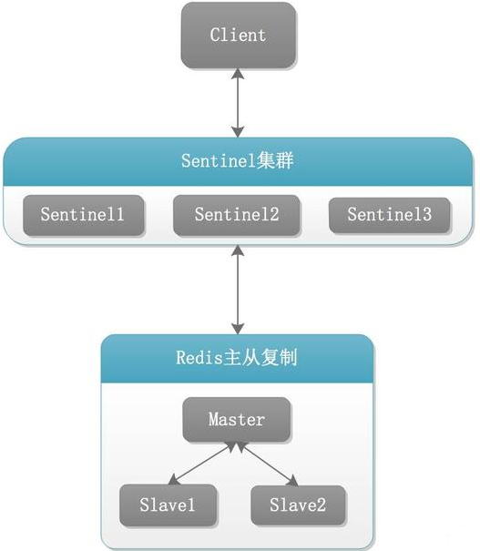

   4. 配置一下配置文件:提供一些配置文件作为参考:

      1. z注意事项:

         1. master 后续可能成为 slave，需要配置 masterauth 。
         2. 使用 docker 运行 redis，需要关闭 daemonize。
         3. 使用 docker 运行 redis，端口号使用默认即可。
         4. 使用参数`--privileged=true`启动容器，容器内的进程几乎拥有与宿主机 root 用户相同的权限。

      2. redis_2 的 redis6380.conf，仅仅给出部分修改配置:

         ```bash
         # daemonize yes
         daemonize no
         #bind 127.0.0.1 -::1
         protected-mode no
         port 6379
         dir /data
         pidfile /var/run/redis_6380.pid
         logfile "/data/6380.log"
         loglevel notice
         requirepass yx198973
         dbfilename dump6380.rdb
         appendfilename "appendonly6380.aof"
         appenddirname "appendonlydir"
         #appendonly yes
         appendonly no
         #save 3600 1 300 100 60 10000
         masterauth yx198973
         replicaof 172.20.0.101 6379
         ```

      3. redis_6 的 sentinel26381.conf 配置如下:

         ```bash
         bind 0.0.0.0
         # daemonize yes
         daemonize no
         protected-mode no
         port 26379
         logfile "/data/sentinel26381.log"
         pidfile /var/run/redis-sentinel26379.pid
         dir /data
         # 开启主机名解析
         sentinel resolve-hostnames yes
         # 适当
         sentinel down-after-milliseconds mymaster 30000 
         
         sentinel monitor mymaster 172.20.0.101 6379 2
         sentinel auth-pass mymaster yx198973
         ```

   5. docker 容器构建:
   
      ```bash
      # 提供读写权限
      sudo chmod -R 777 /redis
      
      # 使用静态 ip 
      docker network create redis-net --subnet 172.20.0.0/24
      
      # redis_1
      docker run \
      -v /redis/conf:/etc/redis  \
      -v /redis/data6379:/data \
      --network redis-net \
      --privileged=true \
      --ip 172.20.0.101 \
      -dp 6379:6379 \
      --name redis_1 \
      redis:7.4.2 \
      redis-server /etc/redis/redis6379.conf
      
      # redis_2
      docker run \
      -v /redis/conf:/etc/redis  \
      -v /redis/data6380:/data \
      --network redis-net \
      --privileged=true \
      --ip 172.20.0.102 \
      -dp 6380:6379 \
      --name redis_2 \
      redis:7.4.2 \
      redis-server /etc/redis/redis6380.conf
      
      # redis_3
      docker run \
      -v /redis/conf:/etc/redis  \
      -v /redis/data6381:/data \
      --network redis-net \
      --privileged=true \
      --ip 172.20.0.103 \
      -dp 6381:6379 \
      --name redis_3 \
      redis:7.4.2 \
      redis-server /etc/redis/redis6381.conf
      
      # redis_4
      docker run \
      -v /redis/conf:/etc/redis  \
      -v /redis/data26379:/data \
      --network redis-net \
      --privileged=true \
      --ip 172.20.0.104 \
      -dp 26379:26379 \
      --name redis_4 \
      redis:7.4.2 \
      redis-sentinel /etc/redis/sentinel26379.conf
      
      # redis_5
      docker run \
      -v /redis/conf:/etc/redis \
      -v /redis/data26380:/data \
      --network redis-net \
      --privileged=true \
      --ip 172.20.0.105 \
      -dp 26380:26379 \
      --name redis_5 \
      redis:7.4.2 \
      redis-sentinel /etc/redis/sentinel26380.conf
      
      # redis_6
      docker run \
      -v /redis/conf:/etc/redis  \
      -v /redis/data26381:/data \
      --network redis-net \
      --privileged=true \
      --ip 172.20.0.106 \
      -dp 26381:26379 \
      --name redis_6 \
      redis:7.4.2 \
      redis-sentinel /etc/redis/sentinel26381.conf
      ```
      
   
9. 问题解决:

   1. <font color=red>注意使用 docker 部署哨兵，不要使用容器名！！！后续容器挂了，哨兵就无法解析容器名，进而会报错并导致容器重启后无法成为从节点。这里我们使用静态 ip 部署容器！！！</font>
   2. 为研究故障转移，不要使用 `--restart=always` 参数启动容器。
   3. `Could not rename tmp config file (Device or resource busy)`挂载时不要直接挂载文件，而是挂载配置目录。
   4. `Failed to resolve hostname`哨兵默认关闭主机名解析，此时无法通过容器名访问 master，需要使用配置`sentinel resolve-hostnames yes`开启主机名解析。
   5. 由于哨兵不对外提供服务，可以不挂载数据目录。但是实际上在当发生故障转移时，哨兵会自动修改配置文件，更新主节点信息，对于配置文件最好还是挂载到本地。此外日志文件最好也挂载到本地，我这里图个方便，把日志文件放在 /data 里了。
   6. 安装 ping 测试连接:`apt update && apt install -y iputils-ping`。

10. 信息查看:

    1. 先查看哨兵 redis_6 的日志:

          ```bash
          1:X 04 Mar 2025 03:29:36.399 * oO0OoO0OoO0Oo Redis is starting oO0OoO0OoO0Oo
          # [启动标识] Redis 服务初始化启动的艺术化提示信息
          
          1:X 04 Mar 2025 03:29:36.399 * Redis version=7.4.2, bits=64, commit=00000000, modified=0, pid=1, just started
          # [版本信息] 显示 Redis 版本为 7.4.2，64 位架构，进程 ID 为 1
          
          1:X 04 Mar 2025 03:29:36.399 * Configuration loaded
          # [配置加载] 成功加载 sentinel.conf 配置文件
          
          1:X 04 Mar 2025 03:29:36.399 * Increased maximum number of open files to 10032 (it was originally set to 1024).
          # [系统调优] 自动提升文件描述符限制（Redis Sentinel 需要保持大量网络连接）
          
          1:X 04 Mar 2025 03:29:36.399 * monotonic clock: POSIX clock_gettime
          # [时间机制] 使用 POSIX 单调时钟保证时间计算的准确性（防止系统时间回拨影响）
          
          1:X 04 Mar 2025 03:29:36.400 * Running mode=sentinel, port=26379.
          # [运行模式] 当前以哨兵模式运行，监听端口 26379（默认哨兵端口）
          
          1:X 04 Mar 2025 03:29:36.407 * Sentinel new configuration saved on disk
          # [配置持久化] 将新的哨兵配置写入磁盘（保存到 sentinel.conf 或 sentinel 状态文件）
          
          1:X 04 Mar 2025 03:29:36.407 * Sentinel ID is bf10846a139a7b0dc3e00a91d317975ce2fc4e03
          # [节点标识] 当前哨兵节点的唯一哈希标识（用于集群节点识别）
          
          1:X 04 Mar 2025 03:29:36.407 # +monitor master mymaster 172.20.0.101 6379 quorum 2
          # [主节点监控] 开始监控名为 "mymaster" 的主节点（IP:172.20.0.101:6379），仲裁数 quorum=2
          
          1:X 04 Mar 2025 03:29:36.410 * +slave slave 172.20.0.102:6379 172.20.0.102 6379 @ mymaster 172.20.0.101 6379
          # [从节点发现] 发现主节点 mymaster 的从节点 172.20.0.102:6379
          
          1:X 04 Mar 2025 03:29:36.416 * Sentinel new configuration saved on disk
          # [配置更新] 写入新增从节点的配置信息到磁盘
          
          1:X 04 Mar 2025 03:29:36.416 * +slave slave 172.20.0.103:6379 172.20.0.103 6379 @ mymaster 172.20.0.101 6379
          # [从节点发现] 发现第二个从节点 172.20.0.103:6379
          
          1:X 04 Mar 2025 03:29:36.420 * Sentinel new configuration saved on disk
          # [配置更新] 再次保存更新后的配置
          
          1:X 04 Mar 2025 03:29:37.745 * +sentinel sentinel e7c0874818b16c6118b1236525ad4d9f57c13e53 172.20.0.104 26379 @ mymaster 172.20.0.101 6379
          # [哨兵集群] 发现其他哨兵节点（ID 以 e7c08 开头，地址 172.20.0.104:26379）
          
          1:X 04 Mar 2025 03:29:37.760 * Sentinel new configuration saved on disk
          # [集群配置] 保存新增哨兵节点的配置
          
          1:X 04 Mar 2025 03:29:38.084 * +sentinel sentinel 6ae78a532fe33eaa4dc482bc581432192dea7e3b 172.20.0.105 26379 @ mymaster 172.20.0.101 6379
          # [哨兵集群] 发现第三个哨兵节点（172.20.0.105:26379）
          
          1:X 04 Mar 2025 03:29:38.100 * Sentinel new configuration saved on disk
          # [最终配置] 完成哨兵集群配置的最终持久化
          ```

    2. 显然上面提到一个一句`Sentinel new configuration saved on disk` 保存新配置到磁盘,我们看看 reids_6 配置文件发生那些变化:

          ```bash
          # Generated by CONFIG REWRITE
          # [配置生成] 该配置文件由 Redis 自动重写生成（基于运行时状态）
          latency-tracking-info-percentiles 50 99 99.9
          # [延迟监控] 配置延迟统计的百分位点
          user default on nopass sanitize-payload ~* &* +@all
          # [用户权限] 默认用户配置
          
          sentinel myid bf10846a139a7b0dc3e00a91d317975ce2fc4e03
          # [节点标识] 当前哨兵节点的唯一 ID
          
          sentinel config-epoch mymaster 0
          # [配置纪元] 主节点 mymaster 的当前配置版本号（初始为 0）
          
          sentinel leader-epoch mymaster 0
          # [领导纪元] 主节点 mymaster 的当前领导版本号（初始为 0）
          
          sentinel current-epoch 0
          # [全局纪元] 哨兵集群的全局配置版本号（初始为 0）
          
          sentinel known-replica mymaster 172.20.0.102 6379
          # [从节点信息] 已知的主节点 mymaster 的从节点：172.20.0.102:6379
          
          sentinel known-replica mymaster 172.20.0.103 6379
          # [从节点信息] 已知的第二个从节点：172.20.0.103:6379
          
          sentinel known-sentinel mymaster 172.20.0.105 26379 6ae78a532fe33eaa4dc482bc581432192dea7e3b
          # [哨兵节点] 已知的哨兵节点：
          # - 地址：172.20.0.105:26379
          # - 唯一 ID：6ae78a532fe33eaa4dc482bc581432192dea7e3b
          
          sentinel known-sentinel mymaster 172.20.0.104 26379 e7c0874818b16c6118b1236525ad4d9f57c13e53
          # [哨兵节点] 已知的第二个哨兵节点：
          # - 地址：172.20.0.104:26379
          # - 唯一 ID：e7c0874818b16c6118b1236525ad4d9f57c13e53
          ```

    3. 发生故障转移时，哨兵会自动修改配置文件，更新主节点信息,例如我们执行`docker stop redis_1`关闭 redis_1,此时触发故障转移，哨兵的配置文件已经自动更新，从这里可以看出来，redis_2 成为新的 master:

          ```bash
          # Generated by CONFIG REWRITE
          latency-tracking-info-percentiles 50 99 99.9
          user default on nopass sanitize-payload ~* &* +@all
          sentinel myid bf10846a139a7b0dc3e00a91d317975ce2fc4e03
          sentinel config-epoch mymaster 1
          sentinel leader-epoch mymaster 1
          sentinel current-epoch 1
          
          sentinel known-replica mymaster 172.20.0.101 6379
          sentinel known-replica mymaster 172.20.0.103 6379
          
          sentinel known-sentinel mymaster 172.20.0.105 26379 6ae78a532fe33eaa4dc482bc581432192dea7e3b
          sentinel known-sentinel mymaster 172.20.0.104 26379 e7c0874818b16c6118b1236525ad4d9f57c13e53
          ```

    4. 此时我们不妨查看一下 redis_2、redis_3的配置文件,依次如下，显然这些节点的配置文件也被修改:新 master 的 replicaof 配置会被删除，其他节点的 replicaof 配置会自动更新为新 master。

          ```bash
          # replicaof 172.20.0.101 6379(被自动删除)
          # Generated by CONFIG REWRITE
          save 3600 1
          save 300 100
          save 60 10000
          latency-tracking-info-percentiles 50 99 99.9
          user default on sanitize-payload #b56af6117a308d5b6002ab8b59026ca5aebd4f30034f8d3540064ac1fb093091 ~* &* +@all
          ```

          ```bash
          # 自动修改为新主机
          replicaof 172.20.0.102 6379
          # Generated by CONFIG REWRITE
          latency-tracking-info-percentiles 50 99 99.9
          save 3600 1
          save 300 100
          save 60 10000
          user default on sanitize-payload #b56af6117a308d5b6002ab8b59026ca5aebd4f30034f8d3540064ac1fb093091 ~* &* +@all
          ```

          > - 为啥不看redis_1的配置文件，因为 redis_1 挂掉了，配置文件显然不会被修改。但是 redis_1 上线后，配置文件应该会被更正。
          > - 由于 redis_2、redis_3 仍在运行，修改配置文件对它们是无效的，显然这些节点还会在哨兵的引导下执行对应的命令，实现 master 的转换。

    5. 查看一下哨兵日志:

          ```bash
          1:X 04 Mar 2025 03:38:19.464 # +sdown master mymaster 172.20.0.101 6379
          # [主观下线] 当前哨兵检测到主节点 mymaster (172.20.0.101:6379) 不可达（Subjective Down）
          
          1:X 04 Mar 2025 03:38:19.656 * Sentinel new configuration saved on disk
          # [配置保存] 将主观下线状态写入磁盘
          
          1:X 04 Mar 2025 03:38:19.656 # +new-epoch 1
          # [纪元升级] 哨兵集群全局配置纪元升级到 1（故障转移需要递增纪元号）
          
          1:X 04 Mar 2025 03:38:19.660 * Sentinel new configuration saved on disk
          # [纪元保存] 保存新的纪元配置
          
          1:X 04 Mar 2025 03:38:19.660 # +vote-for-leader 6ae78a532fe33eaa4dc482bc581432192dea7e3b 1
          # [选举投票] 投票给哨兵节点 6ae78a53... 成为新领导者（Raft 算法选举阶段）
          
          1:X 04 Mar 2025 03:38:20.589 # +odown master mymaster 172.20.0.101 6379 #quorum 3/2
          # [客观下线] 达成客观下线条件（3个哨兵中有2个确认不可达，超过quorum=2）
          
          1:X 04 Mar 2025 03:38:20.589 * Next failover delay: I will not start a failover before Tue Mar  4 03:44:20 2025
          # [故障转移延迟] 安全机制：6分钟内不重复触发故障转移（防止脑裂）
          
          1:X 04 Mar 2025 03:38:20.653 # +config-update-from sentinel 6ae78a532fe33eaa4dc482bc581432192dea7e3b 172.20.0.105 26379 @ mymaster 172.20.0.101 6379
          # [配置同步] 从哨兵节点 172.20.0.105:26379 接收新配置
          
          1:X 04 Mar 2025 03:38:20.653 # +switch-master mymaster 172.20.0.101 6379 172.20.0.102 6379
          # [主节点切换] 故障转移完成！新主节点：172.20.0.102:6379，旧主：172.20.0.101:6379
          
          1:X 04 Mar 2025 03:38:20.654 * +slave slave 172.20.0.103:6379 172.20.0.103 6379 @ mymaster 172.20.0.102 6379
          # [从节点更新] 从节点 172.20.0.103:6379 已自动切换到新主节点
          
          1:X 04 Mar 2025 03:38:20.654 * +slave slave 172.20.0.101:6379 172.20.0.101 6379 @ mymaster 172.20.0.102 6379
          # [旧主降级] 原主节点 172.20.0.101:6379 被降级为从节点（需修复后重新加入）
          
          1:X 04 Mar 2025 03:38:20.661 * Sentinel new configuration saved on disk
          # [最终配置] 保存完整的故障转移后配置
          
          1:X 04 Mar 2025 03:38:50.694 # +sdown slave 172.20.0.101:6379 172.20.0.101 6379 @ mymaster 172.20.0.102 6379
          # [从节点异常] 降级后的原主节点仍然不可达（可能需要人工干预）
          ```

          > 根据上面日志不难知道，故障转以后哨兵的配置会再次更新。此外后面旧主节点重新上线，配置文件会自动更新，同时自身在哨兵的引导下转为 slave。这些就不在演示。

12. 使用建议:

    1. 哨兵节点的数量应为多个，哨兵本身应该集群，保证高可用。

    2. 哨兵节点的数量应该是奇数。

    3. 哨兵使用建议一各个哨兵节点的配置应一致。

    4. 如果哨兵节点部署在 Docker 等容器里面，尤其要注意端口的正确映射。

    5. 哨兵集群+主从复制，并不能保证数据零丢失。若是设新选举的 master 偏移量 为 8，原 master 为 9，且在新 master 执行一段时间后原来的 master 才上线，会造成数据丢失。此外此外选举过程中，无法连接写入，实际应用中会存在数据丢失。

       > 1. 哨兵节点数量: 推荐至少 3 个哨兵节点
       >    1. 容错性: 3 个节点允许最多 1 个节点故障(如宕机或网络隔离)，仍能形成多数(2/3)，确保系统可用。
       >    2. 避免脑裂: 奇数个节点可降低网络分区时出现平票的概率，确保快速达成共识。
       > 2. 哨兵数量的奇偶性: 优先选择奇数个哨兵
       >    1. 多数派决策: 奇数个节点能更简单明确地形成多数(如3节点需2票，5节点需3票)，避免偶数节点在故障时出现平票(如2节点中1个故障，剩余1个无法形成多数)。
       >    2. 减少资源浪费: 4 个哨兵的容错能力与 3 个相同(仅允许1节点故障)，但需要更多资源，因此奇数更高效。
       > 3. quorum 用于判定主节点是否真正故障的最低票数,若超过 quorum 数量的哨兵认为主节点不可用，则触发故障转移。通常设为 `ceil(N/2) + 1`(如 3 节点时 quorum=2，5 节点时 quorum=3)。


##### Redis 容器存在问题

1. 在使用 docker 搭建哨兵的时候遇到一个问题，那就是slave 如何访问 master?
   1. 使用 ip 访问的话，当 master 容器宕机之后重启，ip 是可能会发生变化的。
   2. 那通过容器名访问的话，当 master 挂掉后，容器名将无法解析，此时当哨兵尝试执行“旧主诚服”这一步会无法解析到旧主 ip 。
   3. 最终选择静态 ip !!!
2. `Could not rename tmp config file (Device or resource busy)` 错误:将原来的直接挂载配置文件改为挂载配置文件目录。关于这一点的解释:当容器内的 redis 进程尝试修改配置文件时，会生成一个临时配置文件,然后通过 `rename()` 系统调用将临时配置文件重命名为原配置文件，以实现原子性更新。如果宿主机上的原配置文件被直接挂载到容器内，则 `rename()` 操作会直接作用于宿主机的文件系统。某些文件系统或挂载方式会限制对挂载文件的 `rename` 操作，导致错误。
3. `Could not create tmp config file (Permission denied), CONFIG REWRITE failed: Permission denied`错误：使用` sudo chmod -R 777 /redis/conf` 赋予读写权限。


##### Raft算法(待补)

pass


##### 集群

1. 由于数据量过大，单个 master 复制集难以承担，因此需要对多个复制集进行集群，形成水平扩展。通过分片将数据分散到多个节点，并通过主从复制和故障转移保证服务连续性,每个复制集只负责存储整个数据集的一部分，这就是Redis的集群，其作用是提供在多个 Redis 节点间共享数据的程序集。Redis 集群是一个提供在多个 Redis 节点间共享数据的程序集，Redis 集群可以支持多个 master。<br>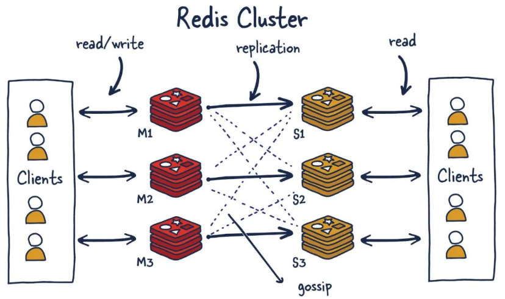

2. redis 集群能干啥:
   1. 水平扩展: 突破单机内存和性能瓶颈，支持海量数据和高并发。
   2. 读写分离: 集群支持多个 master，每个 master 又可以挂载多个 slave 支持数据的高可用。
   3. 高可用性: 自动故障检测与转移，主节点宕机时从节点接替,无需再去使用哨兵功能。
   4. 负载均衡: 数据均匀分布，避免热点问题。
   5. 无缝扩容: 动态添加节点并重新分配数据槽(Slot)。

3. 一些重要数据:

   1.  Redis 集群将数据划分为 <font color=red>16384</font> 个固定哈希槽位。
   2.  Redis集群中，官方不建议超过 <font color=red>1000</font> 个节点。

4. 分片和槽位:

   1. 分片(Sharding): 分片是分布式系统中将数据分散到多个节点的技术，目的是突破单机资源限制(如内存、CPU、带宽)，实现水平扩展。Redis 集群通过分片将数据分布到多个节点，每个节点负责处理一部分数据,简言之集群中的每个 Redis 实例都被认为是整个数据的一个分片。
   2. 槽位(Slot): Redis 集群将数据划分为 <font color=red>16384</font> 个固定哈希槽位(Hash Slot)，每个键通过哈希算法映射到其中一个槽位。槽位是逻辑上的数据分片单元，由集群中的主节点负责管理。例如，一个 3 主节点的集群，每个主节点负责约 5461 个槽位(16384 / 3)。
   3. 分片与槽位的优势:
      1. 水平扩展: 数据分散到多个节点，突破单机内存和性能瓶颈，支持海量数据存储和高并发访问。
      2. 负载均衡: 槽位均匀分配到所有主节点，避免热点数据集中在单一节点。
      3. 高可用性: 主节点故障时，其负责的槽位会自动转移到从节点，保证服务连续性。
      4. 无缝扩容: 动态添加节点时，槽位可重新分配，无需停机或迁移全部数据。

5. redis 数据分片常见的三种方式:

   1. 哈希取余:假设有 N 台机器构成一个集群，用户每次读写操作都是根据公式 ` hash(key) % N `个机器台数，计算出哈希值，用来决定数据映射到哪一个节点上。

      1. 优点:简单粗暴，直接有效，只需要预估好数据规划好节点，使用Hash算法让固定的一部分请求落到同一台服务器上，这样每台服务器固定处理一部分请求。
      2. 缺点:规划好的节点，进行扩容或者缩容就比较麻烦了额，不管扩缩，每次数据变动导致节点有变动，映射关系需要重新进行计算。在服务器个数固定不变时没有问题，如果需要弹性扩容或故障停机的情况下，原来的取模公式就会发生变化，此时地址经过取余运算的结果将发生很大变化，根据公式获取的服务器也会变得不可控。<br>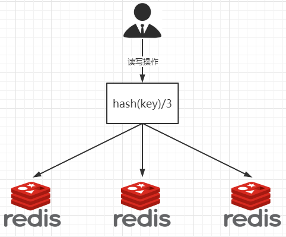

   2. 一致性哈希算法分区:将哈希值空间组织成环形，节点和键均映射到环上，键的请求由顺时针方向最近的节点处理。一致性哈希算法在1997年由麻省理工学院中提出的，设计目标是为了解决分布式缓存数据变动和映射问题。

      1. 三大步骤:

         1. 算法构建一致性哈希环: 一致性哈希算法必然有个 hash 函数并按照算法产生 hash 值，这个算法的所有可能哈希值会构成一个全量集，这个集合可以成为一个 hash 空间$[0,2^32-1]$，这个是一个线性空间，但是在算法中，我们通过适当的逻辑控制将它首尾相连($0 = 2^{32}$),这样让它逻辑上形成了一个环形空间。它也是按照使用取模的方法，上一种取模法是对节点的数量进行取模，而一致性哈希算法是对$2^{32}$取模。<br>
         2. redis 节点映射: 将集群中各个IP节点映射到环上的某一个位置,将各个服务器使用 hash 进行哈希，具体可以选择服务器的 ip 或主机名作为关键字进行哈希，这样每台机器就能确定其在哈希环上的位置。假如 4 个节点 A、B、C、D，经过IP地址的哈希函数计算(hash(ip))，使用IP地址哈希后在环空间的位置如下：<br>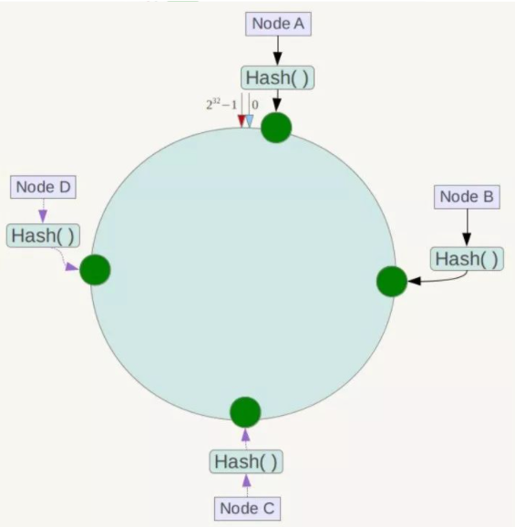
         3.  key 落到 redis 服务器的落键规则:当我们需要存储一个 kv 键值对时，首先计算 key 的 has值 hash(key)，将这个 key 使用相同的函数 Hash 计算出哈希值并确定此数据在环上的位置，从此位置沿环顺时针行走，第一台遇到的服务器就是其应该定位到的服务器，并将该键值对存储在该节点上。如我们有Object A、Object B、Object C、Object D四个数据对象，经过哈希计算后，在环空间上的位置如下：根据一致性 Hash 算法，数据 A 会被定为到 Node A上，B 被定为到 Node B 上，C 被定为到 Node C上，D 被定为到 Node D 上。<br>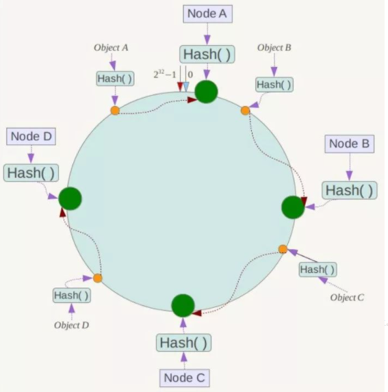

      2. 优点:

         1. 容错性:假设 Node C 宕机，可以看到此时对象A、B、D不会受到影响。一般的，在一致性Hash算法中，如果一台服务器不可用，则受影响的数据仅仅是此服务器到其环空间中前一台服务器(即沿着逆时针方向行走遇到的第一台服务器)之间数据，其它不会受到影响。简单说，就是 C 挂了，受到影响的只是 B、C 之间的数据且这些数据会转移到 D 进行存储。<br>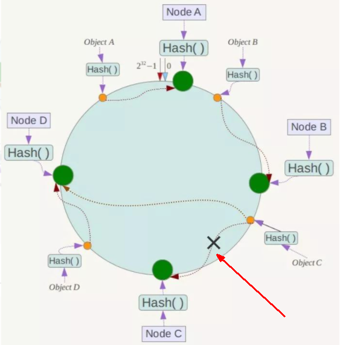

         2. 扩展性:当需要增加一台节点 Node X ，X 的位置在 A 和 B 之间，那收到影响的也就是 A 到 X 之间的数据，重新把 A 到 X 的数据录入到 X 上即可，

            不会导致hash取余全部数据重新洗牌。<br>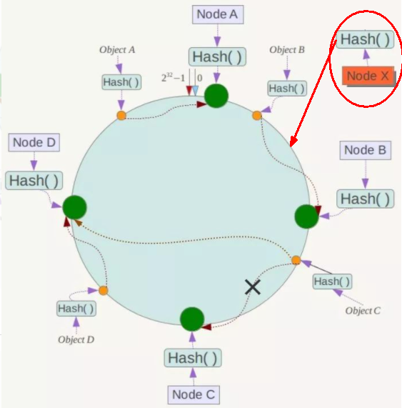

      3. 缺点:Hash环的数据倾斜问题,一致性Hash算法在服务节点太少时，容易因为节点分布不均匀而造成数据倾斜(被缓存的对象大部分集中缓存在某一台服务器上)问题，

         例如系统中只有两台服务器<br>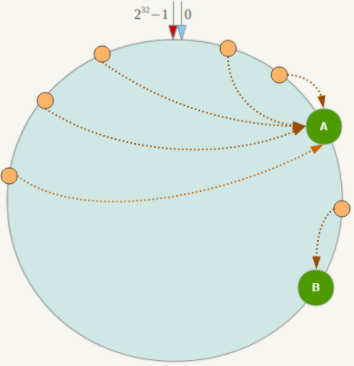

   3. 哈希槽分区:为了解决一致性哈希算法分区的数据倾斜问题，又提出哈希槽分区方式。

      1. 哈希槽分区简单来说就是`HASH_SLOT = CRC16(key) mod 16384`,解决均匀分配的问题，在数据和节点之间又加入了一层，把这层称为哈希槽(slot)，用于管理数据和节点之间的关系，现在就相当于节点上放的是槽，槽里放的是数据。<br>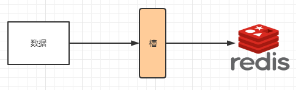

         

      2. 槽解决的是粒度问题，相当于把粒度变大了，这样便于数据移动。哈希解决的是映射问题，使用key的哈希值来计算所在的槽，便于数据分配。

      3. 一个集群只能有16384个槽，编号 0-16383($[0,2^{14}-1]$）,这些槽会分配给集群中的所有主节点，分配策略没有要求,集群会记录节点和槽的对应关系。

      4. 解决了节点和槽的关系后，接下来就需要对 key 求哈希值，然后对 16384 取模，余数是几 key 就落入对应的槽里。`HASH_SLOT = CRC16(key) mod 16384`。以槽为单位移动数据，因为槽的数目是固定的，处理起来比较容易，这样数据移动问题就解决了。

      5. Redis 集群中内置了 16384 个哈希槽，redis 会根据节点数量大致均等的将哈希槽映射到不同的节点。当需要在 Redis 集群中放置一个 key-value时，redis先对key使用crc16算法算出一个结果然后用结果对 16384 求余数[ CRC16(key) % 16384]，这样每个 key 都会对应一个编号在 0-16383 之间的哈希槽，也就是映射到某个节点上。如下代码，key之A 、B在Node2， key之C落在Node3上。<br>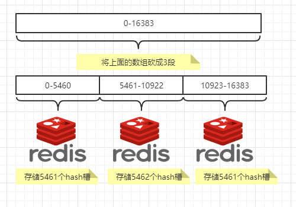

6. 为啥 redis 槽位设置为 16384 个，明明 CRC16 生成的哈希值是 16 位的，范围是 `0-65535`($2^{16}$),为啥不设置 65535 个？

   1. 参考[github issues](https://github.com/redis/redis/issues/2576)
   2. 由于其他设计折衷，Redis 集群不太可能扩展到 1000 个以上的主节点, 12 位处于正确的范围内，以确保每个主机具有足够的插槽，最多可容纳 1000 个矩阵，但数量足够少，可以轻松地将插槽配置作为原始位图传播。
   3. 集群节点通过 Gossip 协议交换状态信息，每个节点需要广播自己负责的槽位信息。若槽位数为 65536，每个节点的心跳包中需要传输 8KB(65536/8)的位图 bitmap，而 16384 槽位仅需 2KB(16384/8)，大幅减少网络带宽消耗。<br>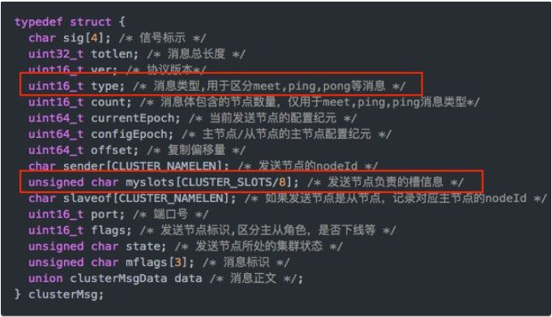

7. 为啥 Redis 官方不建议节点数超过 1000 :

   1. 性能瓶颈:节点增多会导致节点间通信频繁，网络延迟和带宽消耗增加，影响整体性能。每个节点需要维护集群状态信息，节点过多会占用大量内存，降低系统效率。
   2. 管理复杂度：节点数量增加会使得集群配置和管理更加复杂，提升运维难度。节点过多时，故障排查和恢复变得更加耗时和复杂。
   3. 数据分片限制：Redis集群通过分片存储数据，节点过多可能导致分片过小，增加管理开销和性能下降的风险。
   4. Gossip协议限制：Redis集群使用Gossip协议进行节点通信，节点过多会导致通信开销急剧增加，影响集群的收敛速度和稳定性。
   5. 硬件资源限制: 每个节点都需要一定的CPU、内存和存储资源，节点过多会显著增加硬件需求，提升成本。

8. <font color=red>Redis 集群采用的是哈希槽分区 的方式来实现数据分布和管理,这是 Redis 集群的核心设计，专门为了解决数据分布、扩展性和高可用性问题。</font>

9. redis 集群常见命令:

   1. `redis-cli --cluster create ip:port [ip:port,...] --cluster-replicas <num>`初始化集群。
      1. `--cluster create`用于初始化 Redis 集群，需配合节点列表(IP:Port)使用。
      2. `--cluster-replicas <num>`指定每个主节点 master 的副本 slave 数量。

   2. `redis-cli -c`的 `-c` 参数用于启用集群模式，使得客户端能够自动处理 Redis 集群的节点重定向。
   3. `redis-cli -a <passwd> --cluster add-node ip:port exit_ip:exit_port`添加新节点到集群中,需要通过已经在集群中的节点(exit_ip:exit_port)作为媒介。此外还可以使用一下参数:
      1. `--cluster-slave` 设置加入节点作为 slave。
      2. ` --cluster-master-id <master_id>`同 --cluster-slave 一起使用，制定 master 的id。

   4. `redis-cli -a <passwd> --cluster check <exit_ip:exit_port>`用于检查集群的健康状态。
   5. `redis-cli -a <passwd> --cluster reshard exit_ip:exit_port`为 master 重新分配槽号，这里的 ip 和 port 为集群中任意节点的。后续会通过交互方式指定要分配槽点的 master 。
   6. `CLUSTER INFO`查看集群的整体状态信息。
      - `cluster_state`：集群状态，`ok` 表示正常。
      - `cluster_slots_assigned`：已分配的哈希槽数量，总为 16384。
      - `cluster_known_nodes`：集群中的节点总数。
   7. `CLUSTER NODES`列出集群中所有节点的详细信息。
   8. `CLUSTER FAILOVER [FORCE]`手动触发故障转移,将主节点切换到从节点。添加参数`FORCE`强制故障转移(即使主节点未宕机)。
   9. `CLUSTER ADDSLOTS`为当前节点分配哈希槽，需在主节点上执行。
   10. `CLUSTER DELSLOTS`从当前节点移除哈希槽，需在主节点上执行。
   11. `CLUSTER KEYSLOT <key>`计算某个键所属的哈希槽。
   12. `CLUSTER COUNTKEYSINSLOT <slot_num>`判断槽位是否被占用，返回 0 则该槽位没占用，返回 1 则该槽位被占用 。

10. 使用 docker 搭建 redis 集群:

    1. 预计结构如下:<font color=red>实际结构是不确定的，无法确定谁是 master，谁是 slave ！！！</font>

       | 容器名  | ip           | 映射端口 | 配置文件         |
       | ------- | ------------ | -------- | ---------------- |
       | redis_1 | 172.20.0.101 | 6379     | cluster6379.conf |
       | redis_2 | 172.20.0.102 | 6380     | cluster6380.conf |
       | redis_3 | 172.20.0.103 | 6381     | cluster6381.conf |
       | redis_4 | 172.20.0.104 | 6382     | cluster6382.conf |
       | redis_5 | 172.20.0.105 | 6383     | cluster6383.conf |
       | redis_6 | 172.20.0.106 | 6384     | cluster6384.conf |
       | redis_7 | 127.20.0.107 | 6385     | cluster6385.conf |
       | redis_8 | 127.20.0.108 | 6386     | cluster6386.conf |

    2. 配置文件 cluster6380.conf 举例:

       ```bash
       bind 0.0.0.0
       # daemonize yes
       daemonize no
       protected-mode no
       port 6379
       logfile "/data/6380.log"
       pidfile /data/cluster6379.pid
       dir /data
       dbfilename dump6380.rdb
       appendonly yes
       appendfilename "appendonly6380.aof"
       requirepass yx198973
       masterauth yx198973
       
       # 启用 Redis 实例的集群模式,默认值为 no（单机模式)
       cluster-enabled yes
       # 指定 Redis 集群节点的配置文件名称,集群启动后，会自动生成此文件并记录当前节点的集群状态信息
       cluster-config-file nodes-6380.conf
       # 定义集群节点间的通信超时时间
       cluster-node-timeout 5000
       ```

    3. docker 启动各个节点:

       ```bash
       # 提供读写权限
       sudo mkdir -p /redis/cluster
       sudo chmod -R 777 /redis
       # 使用静态 ip 
       docker network create redis-net --subnet 172.20.0.0/24
       
       # redis_1
       docker run \
       -v /redis/conf:/etc/redis  \
       -v /redis/data6379:/data \
       --network redis-net \
       --privileged=true \
       --ip 172.20.0.101 \
       -dp 6379:6379 \
       --name redis_1 \
       redis:7.4.2 \
       redis-server /etc/redis/cluster6379.conf
       
       # redis_2
       docker run \
       -v /redis/conf:/etc/redis  \
       -v /redis/data6380:/data \
       --network redis-net \
       --privileged=true \
       --ip 172.20.0.102 \
       -dp 6380:6379 \
       --name redis_2 \
       redis:7.4.2 \
       redis-server /etc/redis/cluster6380.conf
       
       # redis_3
       docker run \
       -v /redis/conf:/etc/redis  \
       -v /redis/data6381:/data \
       --network redis-net \
       --privileged=true \
       --ip 172.20.0.103 \
       -dp 6381:6379 \
       --name redis_3 \
       redis:7.4.2 \
       redis-server /etc/redis/cluster6381.conf
       
       # redis_4
       docker run \
       -v /redis/conf:/etc/redis  \
       -v /redis/data6382:/data \
       --network redis-net \
       --privileged=true \
       --ip 172.20.0.104 \
       -dp 6382:6379 \
       --name redis_4 \
       redis:7.4.2 \
       redis-server /etc/redis/cluster6382.conf
       
       # redis_5
       docker run \
       -v /redis/conf:/etc/redis  \
       -v /redis/data6383:/data \
       --network redis-net \
       --privileged=true \
       --ip 172.20.0.105 \
       -dp 6383:6379 \
       --name redis_5 \
       redis:7.4.2 \
       redis-server /etc/redis/cluster6383.conf
       
       # redis_6
       docker run \
       -v /redis/conf:/etc/redis  \
       -v /redis/data6384:/data \
       --network redis-net \
       --privileged=true \
       --ip 172.20.0.106 \
       -dp 6384:6379 \
       --name redis_6 \
       redis:7.4.2 \
       redis-server /etc/redis/cluster6384.conf
       
       # redis_7
       docker run \
       -v /redis/conf:/etc/redis  \
       -v /redis/data6385:/data \
       --network redis-net \
       --privileged=true \
       --ip 172.20.0.107 \
       -dp 6385:6379 \
       --name redis_7 \
       redis:7.4.2 \
       redis-server /etc/redis/cluster6385.conf
       
       # redis_8
       docker run \
       -v /redis/conf:/etc/redis  \
       -v /redis/data6386:/data \
       --network redis-net \
       --privileged=true \
       --ip 172.20.0.108 \
       -dp 6386:6379 \
       --name redis_8 \
       redis:7.4.2 \
       redis-server /etc/redis/cluster6386.conf
       ```

    4. 将 redis_1 至 redis_6 构建集群关系,设定一个 master 后面跟一个 slave : 

       ```bash
       docker exec -it redis_1 \
       redis-cli --cluster create \
       172.20.0.101:6379 \
       172.20.0.102:6379 \
       172.20.0.103:6379 \
       172.20.0.104:6379 \
       172.20.0.105:6379 \
       172.20.0.106:6379 \
       --cluster-replicas 1 \
       -a yx198973
       ```

       <br>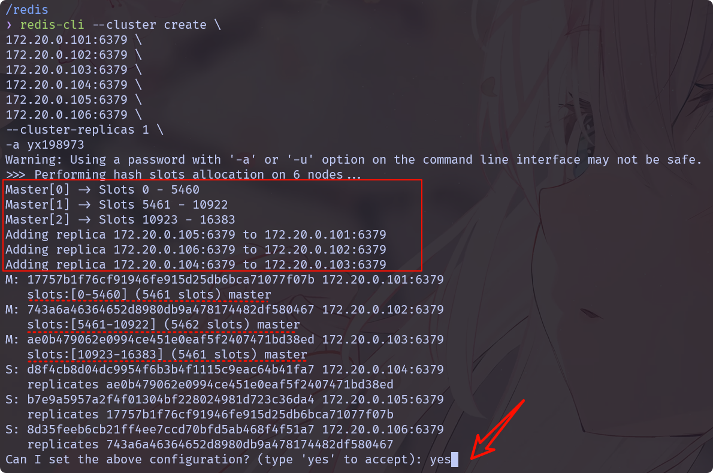

    5. 通过 redis_2查看集群信息:redis_1、redis_2、redis_3 成为 master，并且分配不同段的槽位。

       ```bash
       $ cluster nodes
       8d35feeb6cb21ff4ee7ccd70bfd5ab468f4f51a7 172.20.0.106:6379@16379 slave 743a6a46364652d8980db9a478174482df580467 0 1741082592538 2 connected
       
       ae0b479062e0994ce451e0eaf5f2407471bd38ed 172.20.0.103:6379@16379 master - 0 1741082593000 3 connected 10923-16383
       
       b7e9a5957a2f4f01304bf228024981d723c36da4 172.20.0.105:6379@16379 slave 17757b1f76cf91946fe915d25db6bca71077f07b 0 1741082593243 1 connected
       
       743a6a46364652d8980db9a478174482df580467 172.20.0.102:6379@16379 myself,master - 0 0 2 connected 5461-10922
       
       d8f4cb8d04dc9954f6b3b4f1115c9eac64b41fa7 172.20.0.104:6379@16379 slave ae0b479062e0994ce451e0eaf5f2407471bd38ed 0 1741082593746 3 connected
       
       17757b1f76cf91946fe915d25db6bca71077f07b 172.20.0.101:6379@16379 master - 0 1741082594248 1 connected 0-5460
       
       $ info replication
       role:master
       connected_slaves:1
       slave0:ip=172.20.0.106,port=6379,state=online,offset=168,lag=1
       master_failover_state:no-failover
       master_replid:a6d0262fbd635602b702993bd992090a72bce789
       master_replid2:0000000000000000000000000000000000000000
       master_repl_offset:168
       second_repl_offset:-1
       repl_backlog_active:1
       repl_backlog_size:1048576
       repl_backlog_first_byte_offset:1
       repl_backlog_histlen:168
       
       $ cluster info
       cluster_state:ok
       cluster_slots_assigned:16384
       cluster_slots_ok:16384
       cluster_slots_pfail:0
       cluster_slots_fail:0
       cluster_known_nodes:6
       cluster_size:3
       cluster_current_epoch:6
       cluster_my_epoch:2
       cluster_stats_messages_ping_sent:571
       cluster_stats_messages_pong_sent:582
       cluster_stats_messages_meet_sent:1
       cluster_stats_messages_sent:1154
       cluster_stats_messages_ping_received:582
       cluster_stats_messages_pong_received:572
       cluster_stats_messages_received:1154
       total_cluster_links_buffer_limit_exceeded:0
       ```

    6. 尝试向 redis_1 中写入和获取 key:`redis-cli` 的 `-c` 参数用于启用集群模式，使得客户端能够自动处理 Redis 集群的节点重定向。

       ```bash
       $ redis-cli -a yx198973
       127.0.0.1:6379> set name dream
       OK
       127.0.0.1:6379> set age 22
       (error) MOVED 741 172.20.0.101:6379
       
       
       $ redis-cli -a yx198973 -c
       127.0.0.1:6379> set age 22
       -> Redirected to slot [741] located at 172.20.0.101:6379
       OK
       ```

       > 未开启客户端集群模式时，若是插入、获取的 key 所属的槽不是分配给当前 master，此时就会报错。但是启动客户端集群模式后，客户端会自动重定向到对应的 master 插入或者读取。

    7. 获取某个 key 所属的哈希槽:

       ```bash
       127.0.0.1:6379> set age 22
       -> Redirected to slot [741] located at 172.20.0.101:6379
       OK
       172.20.0.101:6379> get age
       "22"
       172.20.0.101:6379> cluster keyslot age
       (integer) 741
       ```

    8. 模拟 redis_1 宕机(其 slave 为 redis_5)，然后重新启动，此时 redis_5会成为新 master，redis_1会成为 slave，此时若想恢复 redis_1 为 master:`CLUSTER FAILOVER`主节点会主动让出角色，完成数据同步后从节点晋升为主节点。

    9. 将 redis_7 (master)和 redis_8 (slave)加入集群:

       ```bash
       # 将 redis_7 加入作为 master
       $ docker exec -it redis_1 \
       redis-cli \
       -a yx198973 \
       --cluster add-node \
       172.20.0.107:6379 172.20.0.101:6379
       
       Warning: Using a password with '-a' or '-u' option on the command line interface may not be safe.
       >>> Adding node 172.20.0.107:6379 to cluster 172.20.0.101:6379
       >>> Performing Cluster Check (using node 172.20.0.101:6379)
       M: 4b5c71f2bd27618b59d5d4b08916cf99fc658f9a 172.20.0.101:6379
          slots:[0-5460] (5461 slots) master
          1 additional replica(s)
       M: 2a2fb30f150aa6d31b69d92c59226b17dec0130a 172.20.0.103:6379
          slots:[10923-16383] (5461 slots) master
          1 additional replica(s)
       S: 562b8c3c88645c98e43bf21b1627c468c72e19e2 172.20.0.106:6379
          slots: (0 slots) slave
          replicates 4f044bcac9ed2d15a41bfcc1680b1d4853e9ba42
       M: 4f044bcac9ed2d15a41bfcc1680b1d4853e9ba42 172.20.0.102:6379
          slots:[5461-10922] (5462 slots) master
          1 additional replica(s)
       S: 4a30affb04e93b58fb7d6317872edb064734d78d 172.20.0.105:6379
          slots: (0 slots) slave
          replicates 4b5c71f2bd27618b59d5d4b08916cf99fc658f9a
       S: 40805f30e909b19798ac3f0c621f87d5c169b602 172.20.0.104:6379
          slots: (0 slots) slave
          replicates 2a2fb30f150aa6d31b69d92c59226b17dec0130a
       [OK] All nodes agree about slots configuration.
       >>> Check for open slots...
       >>> Check slots coverage...
       [OK] All 16384 slots covered.
       >>> Getting functions from cluster
       >>> Send FUNCTION LIST to 172.20.0.107:6379 to verify there is no functions in it
       >>> Send FUNCTION RESTORE to 172.20.0.107:6379
       >>> Send CLUSTER MEET to node 172.20.0.107:6379 to make it join the cluster.
       [OK] New node added correctly.
       
       # 通过任意节点检查集群状况
       $ docker exec -it redis_1 \
       redis-cli \
       -a yx198973 \
       --cluster \
       check 172.20.0.101:6379
       
       172.20.0.101:6379 (4b5c71f2...) -> 0 keys | 5461 slots | 1 slaves.
       172.20.0.103:6379 (2a2fb30f...) -> 0 keys | 5461 slots | 1 slaves.
       172.20.0.102:6379 (4f044bca...) -> 0 keys | 5462 slots | 1 slaves.
       172.20.0.107:6379 (83231690...) -> 0 keys | 0 slots | 0 slaves.
       [OK] 0 keys in 4 masters.
       0.00 keys per slot on average.
       >>> Performing Cluster Check (using node 172.20.0.101:6379)
       M: 4b5c71f2bd27618b59d5d4b08916cf99fc658f9a 172.20.0.101:6379
          slots:[0-5460] (5461 slots) master
          1 additional replica(s)
       M: 2a2fb30f150aa6d31b69d92c59226b17dec0130a 172.20.0.103:6379
          slots:[10923-16383] (5461 slots) master
          1 additional replica(s)
       S: 562b8c3c88645c98e43bf21b1627c468c72e19e2 172.20.0.106:6379
          slots: (0 slots) slave
          replicates 4f044bcac9ed2d15a41bfcc1680b1d4853e9ba42
       M: 4f044bcac9ed2d15a41bfcc1680b1d4853e9ba42 172.20.0.102:6379
          slots:[5461-10922] (5462 slots) master
          1 additional replica(s)
       M: 83231690bee730a7cdf022158345c9e2602b8de5 172.20.0.107:6379
          slots: (0 slots) master
       S: 4a30affb04e93b58fb7d6317872edb064734d78d 172.20.0.105:6379
          slots: (0 slots) slave
          replicates 4b5c71f2bd27618b59d5d4b08916cf99fc658f9a
       S: 40805f30e909b19798ac3f0c621f87d5c169b602 172.20.0.104:6379
          slots: (0 slots) slave
          replicates 2a2fb30f150aa6d31b69d92c59226b17dec0130a
       [OK] All nodes agree about slots configuration.
       >>> Check for open slots...
       >>> Check slots coverage...
       [OK] All 16384 slots covered.
       ```

    10. 为新加入的 master 节点分配槽位:需要提供集群中某个节点的 ip:port 。

        ```bash
        $ docker exec -it redis_1 \
        redis-cli -a yx198973 \
        --cluster \
        reshard \
        172.20.0.101:6379
        ```

        <br>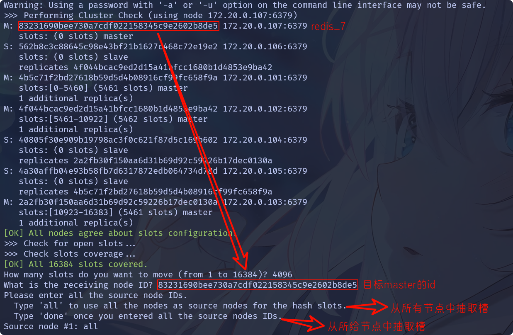

        ```bash
        # 通过任意节点检查集群状况
        $ docker exec -it redis_1 \
        redis-cli \
        -a yx198973 \
        --cluster \
        check 172.20.0.101:6379
        
        172.20.0.101:6379 (4b5c71f2...) -> 0 keys | 4096 slots | 1 slaves.
        172.20.0.103:6379 (2a2fb30f...) -> 0 keys | 4096 slots | 1 slaves.
        172.20.0.102:6379 (4f044bca...) -> 0 keys | 4096 slots | 1 slaves.
        172.20.0.107:6379 (83231690...) -> 0 keys | 4096 slots | 0 slaves.
        [OK] 0 keys in 4 masters.
        0.00 keys per slot on average.
        >>> Performing Cluster Check (using node 172.20.0.101:6379)
        M: 4b5c71f2bd27618b59d5d4b08916cf99fc658f9a 172.20.0.101:6379
           slots:[1365-5460] (4096 slots) master
           1 additional replica(s)
        M: 2a2fb30f150aa6d31b69d92c59226b17dec0130a 172.20.0.103:6379
           slots:[12288-16383] (4096 slots) master
           1 additional replica(s)
        S: 562b8c3c88645c98e43bf21b1627c468c72e19e2 172.20.0.106:6379
           slots: (0 slots) slave
           replicates 4f044bcac9ed2d15a41bfcc1680b1d4853e9ba42
        M: 4f044bcac9ed2d15a41bfcc1680b1d4853e9ba42 172.20.0.102:6379
           slots:[6827-10922] (4096 slots) master
           1 additional replica(s)
        M: 83231690bee730a7cdf022158345c9e2602b8de5 172.20.0.107:6379
           slots:[0-1364],[5461-6826],[10923-12287] (4096 slots) master
        S: 4a30affb04e93b58fb7d6317872edb064734d78d 172.20.0.105:6379
           slots: (0 slots) slave
           replicates 4b5c71f2bd27618b59d5d4b08916cf99fc658f9a
        S: 40805f30e909b19798ac3f0c621f87d5c169b602 172.20.0.104:6379
           slots: (0 slots) slave
           replicates 2a2fb30f150aa6d31b69d92c59226b17dec0130a
        [OK] All nodes agree about slots configuration.
        >>> Check for open slots...
        >>> Check slots coverage...
        [OK] All 16384 slots covered.
        ```

        > 从这里可以看到 172.20.0.107:6379(redis_7) 的槽点是从各个 master 中拼凑的，这样可以避免重新分配成本太高的问题。

    11. 将 redis_8 作为 redis_7 的 slave:

        ```bash
        $ docker exec -it redis_1 \
        redis-cli \
        -a yx198973 \
        --cluster add-node \
        172.20.0.108:6379 172.20.0.101:6379 \
        --cluster-slave \
        --cluster-master-id 83231690bee730a7cdf022158345c9e2602b8de5
        
        >>> Adding node 172.20.0.108:6379 to cluster 172.20.0.101:6379
        >>> Performing Cluster Check (using node 172.20.0.101:6379)
        M: 4b5c71f2bd27618b59d5d4b08916cf99fc658f9a 172.20.0.101:6379
           slots:[1365-5460] (4096 slots) master
           1 additional replica(s)
        M: 2a2fb30f150aa6d31b69d92c59226b17dec0130a 172.20.0.103:6379
           slots:[12288-16383] (4096 slots) master
           1 additional replica(s)
        S: 562b8c3c88645c98e43bf21b1627c468c72e19e2 172.20.0.106:6379
           slots: (0 slots) slave
           replicates 4f044bcac9ed2d15a41bfcc1680b1d4853e9ba42
        M: 4f044bcac9ed2d15a41bfcc1680b1d4853e9ba42 172.20.0.102:6379
           slots:[6827-10922] (4096 slots) master
           1 additional replica(s)
        M: 83231690bee730a7cdf022158345c9e2602b8de5 172.20.0.107:6379
           slots:[0-1364],[5461-6826],[10923-12287] (4096 slots) master
        S: 4a30affb04e93b58fb7d6317872edb064734d78d 172.20.0.105:6379
           slots: (0 slots) slave
           replicates 4b5c71f2bd27618b59d5d4b08916cf99fc658f9a
        S: 40805f30e909b19798ac3f0c621f87d5c169b602 172.20.0.104:6379
           slots: (0 slots) slave
           replicates 2a2fb30f150aa6d31b69d92c59226b17dec0130a
        [OK] All nodes agree about slots configuration.
        >>> Check for open slots...
        >>> Check slots coverage...
        [OK] All 16384 slots covered.
        >>> Send CLUSTER MEET to node 172.20.0.108:6379 to make it join the cluster.
        Waiting for the cluster to join
        >>> Configure node as replica of 172.20.0.107:6379.
        [OK] New node added correctly.
        
        
        $ docker exec -it redis_1 \
        redis-cli \
        -a yx198973 \
        --cluster \
        check 172.20.0.101:6379
        
        172.20.0.101:6379 (4b5c71f2...) -> 0 keys | 4096 slots | 1 slaves.
        172.20.0.103:6379 (2a2fb30f...) -> 0 keys | 4096 slots | 1 slaves.
        172.20.0.102:6379 (4f044bca...) -> 0 keys | 4096 slots | 1 slaves.
        172.20.0.107:6379 (83231690...) -> 0 keys | 4096 slots | 1 slaves.
        [OK] 0 keys in 4 masters.
        0.00 keys per slot on average.
        >>> Performing Cluster Check (using node 172.20.0.101:6379)
        M: 4b5c71f2bd27618b59d5d4b08916cf99fc658f9a 172.20.0.101:6379
           slots:[1365-5460] (4096 slots) master
           1 additional replica(s)
        M: 2a2fb30f150aa6d31b69d92c59226b17dec0130a 172.20.0.103:6379
           slots:[12288-16383] (4096 slots) master
           1 additional replica(s)
        S: 562b8c3c88645c98e43bf21b1627c468c72e19e2 172.20.0.106:6379
           slots: (0 slots) slave
           replicates 4f044bcac9ed2d15a41bfcc1680b1d4853e9ba42
        M: 4f044bcac9ed2d15a41bfcc1680b1d4853e9ba42 172.20.0.102:6379
           slots:[6827-10922] (4096 slots) master
           1 additional replica(s)
        S: dfcb443e0163a71ec8882e6a29939ecde3e791b6 172.20.0.108:6379
           slots: (0 slots) slave
           replicates 83231690bee730a7cdf022158345c9e2602b8de5
        M: 83231690bee730a7cdf022158345c9e2602b8de5 172.20.0.107:6379
           slots:[0-1364],[5461-6826],[10923-12287] (4096 slots) master
           1 additional replica(s)
        S: 4a30affb04e93b58fb7d6317872edb064734d78d 172.20.0.105:6379
           slots: (0 slots) slave
           replicates 4b5c71f2bd27618b59d5d4b08916cf99fc658f9a
        S: 40805f30e909b19798ac3f0c621f87d5c169b602 172.20.0.104:6379
           slots: (0 slots) slave
           replicates 2a2fb30f150aa6d31b69d92c59226b17dec0130a
        [OK] All nodes agree about slots configuration.
        >>> Check for open slots...
        >>> Check slots coverage...
        [OK] All 16384 slots covered.
        ```

    12. 将 redis_7 和 redis_8 从集群中删除，槽位重新分配给 redis_1 :

        ```bash
        # 删除从节点 redis_8
        $ docker exec -it redis_1 \
        redis-cli \
        -a yx198973 \
        --cluster del-node \
        172.20.0.101:6379 \
        dfcb443e0163a71ec8882e6a29939ecde3e791b6
        
        # 重新将 redis_7 的槽位分配给 redis_1
        $ docker exec -it redis_1 \
        redis-cli -a yx198973 \
        --cluster \
        reshard \
        172.20.0.101:6379 \
        83231690bee730a7cdf022158345c9e2602b8de5
        ```
        
        <br>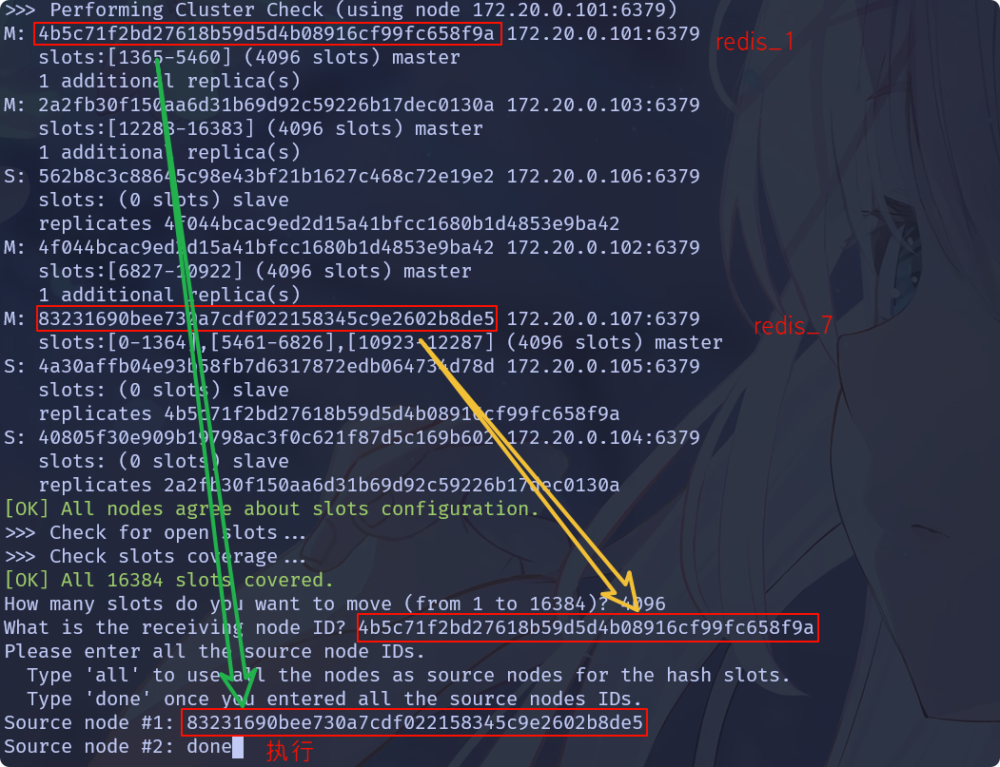
        
        ```bash
        # 删除从节点 redis_7
        $ docker exec -it redis_1 \
        redis-cli \
        -a yx198973 \
        --cluster del-node \
        172.20.0.101:6379 \
        dfcb443e0163a71ec8882e6a29939ecde3e791b6
        ```
        
        

11. 集群补充操作:

    1. 配置文件中的 `cluster-require-full-coverage` 配置项， 默认值 yes，即需要集群完整性，方可对外提供服务 通常情况，如果这3个小集群中，任何一个（1主1从）挂了，你这个集群对外可提供的数据只有 2/3 了,整个集群是不完整的,redis 默认在这种情况下，是不会对外提供服务的。

    2. 不在同一个 slot 槽位下的键值无法使用 `mset`、`mget`等多键操作,此时可以通过 `{}`来定义同一个组的概念，使 key 中`{}`内相同内容的键值对放到一个 slot 槽位去。

       ```bash
       $ redis-cli -a yx198973 -c
       127.0.0.1:6379>  mset name fish  gender boy
       (error) CROSSSLOT Keys in request don't hash to the same slot
       
       127.0.0.1:6379>  mset name{z} fish  gender{z} boy
       -> Redirected to slot [8157] located at 172.20.0.102:6379
       OK
       ```

       > 注意以 -c 集群模式连接。

    3. <font color=red>Redis 集群不保证强一致性，这这意味着在特定的条件下，Redis 集群可能会丢掉一些被系统收到的写入请求命令。</font>


##### redis-cli集群命令

> 部分命令待验证！！！

1. 在此之前先解释一个问题，Redis Cluster 的分布式元数据特性，Redis Cluster 的所有节点都维护一份完整的集群元数据(Cluster Metadata)，包括：

   1. 所有节点的 ip:port 信息。
   2. 哈希槽的分配关系,即哪些槽分配到哪个主节点。
   3. 集群状态,如节点角色、主从关系、故障转移状态等。

2. 依据上面内容我们不难理解:任意一个节点都可以作为集群的入口,只要连接到其中一个节点，`redis-cli` 就能通过它获取整个集群的拓扑信息。

3. 自动发现机制:当执行 `redis-cli --cluster` 命令时，例如 `redis-cli --cluster create`、`redis-cli --cluster reshard`时，工具会：

   1. 连接指定的节点: 通过提供的 ip:port 连接到集群中的一个节点。
   2. 获取集群元数据: 使用 `CLUSTER NODES` 或 `CLUSTER SLOTS` 命令从该节点拉取完整的集群信息。
   3. 构建集群拓扑: 解析元数据，识别所有主节点和从节点，明确槽位分布。
   4. 执行操作: 根据命令需求，直接与其他节点通信完成操作,如迁移槽、重新平衡数据等。

4. 在理解上面内容后，下面命令参数中的 `<existing-node:port>` 就很好理解了。

5. 以下是 `redis-cli --cluster` 工具下常用命令参数的详解，涵盖集群创建、节点管理、数据迁移、状态检查等核心操作：

   1. 创建集群:`redis-cli --cluster create <node1:port> <node2:port> ...   --cluster-replicas <replica-num>`

      1. `--cluster-replicas <num>`：每个主节点的从节点数量。
      2. `--cluster-yes`：跳过确认提示。

   2. 添加新节点:`redis-cli --cluster add-node <new-node:port> <existing-node:port> [--cluster-slave] [--cluster-master-id <master-id>]`

      1. `--cluster-slave`：将新节点作为从节点添加。
      2. `--cluster-master-id <id>`：指定主节点ID,需与`--cluster-slave`配合使用。

   3. 移除节点:`redis-cli --cluster del-node <existing-node:port> <node-id>`

      1. 移除主节点前需先清空其负责的槽位,通过 `reshard` 迁移槽位。
      2. 移除从节点可直接执行。

   4. 重新分片(槽位迁移):

      1. 命令格式:

         ```bash
         redis-cli --cluster reshard <existing-node:port>
           --cluster-from <from-node-id> 
           --cluster-to <to-node-id> 
           --cluster-slots <num-slots>
           [--cluster-yes]
         ```

      2. 参数说明:

         1. `--cluster-from`：源节点ID,可指定多个，用逗号分隔。
         2. `--cluster-to`：目标节点ID。
         3. `--cluster-slots`：迁移的槽位数。

      3. 其实`redis-cli --cluster reshard <existing-node:port>`采用交互方式也可以。

   5. 自动槽位平衡:

      1. 命令格式:

         ```bash
         redis-cli --cluster rebalance <existing-node:port>
           [--cluster-weight <node-id>=<weight>]
           [--cluster-use-empty-masters]
         ```

      2. 参数说明:

         1. `--cluster-weight`：指定节点的权重,控制槽位分配比例。
         2. `--cluster-use-empty-masters`：允许为空的主节点分配槽位。

   6. 检查集群状态:`redis-cli --cluster check <node:port>`

   7. 修复集群问题:`redis-cli --cluster fix <node:port> [--cluster-yes]`,自动修复可能导致数据覆盖，需谨慎使用。

   8.  数据迁移(批量键迁移):

      1. 命令格式:

         ```bash
         redis-cli --cluster import <source-node:port> 
           --cluster-from <source-host:port> 
           [--cluster-copy] [--cluster-replace]
         ```

      2. 参数说明:

         1. `--cluster-copy`：复制数据,不删除源数据。
         2. `--cluster-replace`：覆盖目标同名键。

   9. 将主节点设置为从节点:`redis-cli --cluster replicate <master-node-id> <slave-node:port>`

   10. 在所有节点上执行指定 Redis 命令:`redis-cli --cluster call <node:port> <command>`
