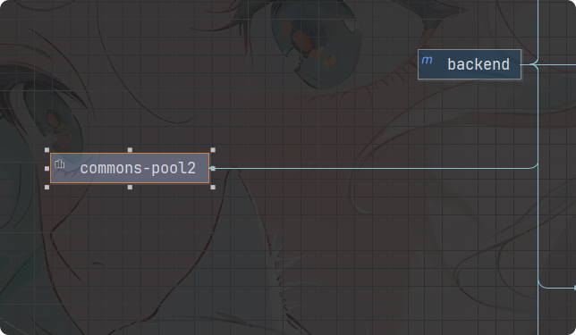
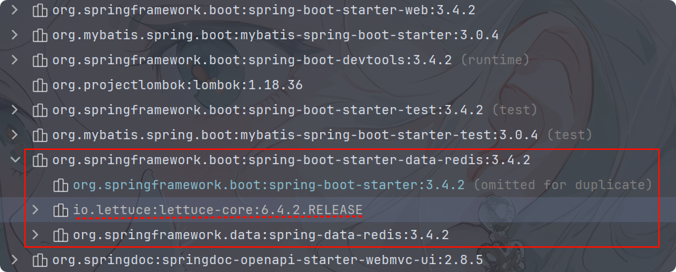

#### Jedis和Lettuce 

> Jedis 和 Lettuce 不是使用重点，不作深入。

##### Jedis

1. JedisClient 是 Redis 官网推荐的一个面向 java 客户端库文件实现了对各类API进行封装调用。

2. 引入依赖:

   ```xml
   <dependency>
       <groupId>redis.clients</groupId>
       <artifactId>jedis</artifactId>
       <version>4.4.3</version>
   </dependency>
   ```

3. 使用:

   ```java
   @Slf4j
   public class JedisDemo {
       public static void main(String[] args) {
           try (Jedis jedis = new Jedis("127.0.0.1", 6379)) {
               jedis.auth("yx198973");
               log.info("msg:{}", jedis.ping());
   
               //string
               jedis.set("name", "dream");
               log.info("name:{}", jedis.get("name"));
   
               //list
               jedis.lpush("list", "java,php");
               log.info("list:{}", jedis.lrange("list", 0, -1));
   
               //set
               jedis.sadd("set", "java", "php");
               log.info("set:{}", jedis.smembers("set"));
   
               //hash
               jedis.hset("hash", "name", "dream");
               log.info("hash:{}", jedis.hgetAll("hash"));
   
               //zset
               jedis.zadd("zset", 1, "java");
               log.info("zset:{}", jedis.zrange("zset", 0, -1));
           } catch (Exception e) {
               log.error("Redis操作错误: {}", e.getMessage(), e);
           }
       }
   }
   ```
   
   


##### Lettuce

1. Lettuce 是一个 Redis 的 Java 驱动包，Lettuce 翻译为生菜，没错，就是吃的那种生菜。

2. 引入依赖:

   ```xml
   <dependency>
       <groupId>io.lettuce</groupId>
       <artifactId>lettuce-core</artifactId>
       <version>6.2.1.RELEASE</version>
   </dependency>
   ```

3. 具体使用:

   ```java
   @Slf4j
   public class LettuceDemo {
       public static void main(String[] args) {
           RedisClient redisClient = null;
           StatefulRedisConnection<String, String> conn = null;
           try {
               // 使用构建器
               RedisURI url = RedisURI.builder()
                   .withHost("127.0.0.1")
                   .withPort(6379)
                   .withAuthentication("default", "yx198973")
                   .build();
   
               // 创建连接客户端
               redisClient = RedisClient.create(url);
               conn = redisClient.connect();
   
               // 操作
               RedisCommands<String, String> commands = conn.sync();
   
               // keys
               log.info("keys:{}", commands.keys("*"));
   
               // String
               commands.set("name", "dream");
               log.info("name:{}", commands.get("name"));
   
               // set
               commands.sadd("set", "1", "2", "3");
               log.info("set:{}", commands.smembers("set"));
   
               // list
               commands.lpush("list", "1", "2", "3");
               log.info("list:{}", commands.lrange("list", 0, -1));
   
               // hash
               commands.hset("hash", "name", "dream");
               log.info("hash:{}", commands.hget("hash", "name"));
   
               // zset
               commands.zadd("zset", 1, "1");
               log.info("zset:{}", commands.zrange("zset", 0, -1));
   
           } catch (Exception e) {
               log.error("Redis连接异常: {}", e.getMessage(), e);
           } finally {
               // 关闭连接
               try {
                   if (conn != null) {
                       conn.close();
                   }
               } catch (Exception e) {
                   log.error("关闭连接异常: {}", e.getMessage(), e);
               }
   
               try {
                   if (redisClient != null) {
                       redisClient.shutdown();
                   }
               } catch (Exception e) {
                   log.error("关闭Redis客户端异常: {}", e.getMessage(), e);
               }
           }
       }
   }
   ```
   
   
   
    


#### RedisTemplate(推荐)

##### RedisTemplate(单机)

> 实际上使用起来复杂得多

1. `RedisTemplate` 是 Spring Data Redis 提供的一个核心工具类，用于简化与 Redis 的交互操作。它封装了 Redis 的常用操作(如数据读写、事务管理、序列化等)，开发者可以通过它直接操作 Redis 的各种数据结构，而无需手动处理底层连接和序列化细节。

2. 配置依赖:Spring Boot 2.x+ 默认使用 Lettuce 作为 Redis 客户端，而非旧版的 Jedis。

   1. 关于下面 commons-pool2 依赖存在疑惑，我似乎并没有发现它被 Lettuce 依赖，而且不添加项目也可以正常连接到 redis :目前还没有找到相关资料，但是加上总是不会错的！<br>

   2. 使用默认的Lettuce集成:

      ```xml
      <dependency>
          <groupId>org.springframework.boot</groupId>
          <artifactId>spring-boot-starter-data-redis</artifactId>
      </dependency>
      <dependency>
          <groupId>org.apache.commons</groupId>
          <artifactId>commons-pool2</artifactId>
      </dependency>
      ```

      <br>

   3. 当然，若是不喜欢吃生菜，也可以换成 Jedis:

      ```xml
      <!--排除 lettuce 依赖-->
      <dependency>
          <groupId>org.springframework.boot</groupId>
          <artifactId>spring-boot-starter-data-redis</artifactId>
          <exclusions>
              <exclusion>
                  <groupId>io.lettuce</groupId>
                  <artifactId>lettuce-core</artifactId>
              </exclusion>
          </exclusions>
      </dependency>
      <!--改用 Jedis -->
      <dependency>
          <groupId>redis.clients</groupId>
          <artifactId>jedis</artifactId>
      </dependency>
      <dependency>
          <groupId>org.apache.commons</groupId>
          <artifactId>commons-pool2</artifactId>
      </dependency>
      ```

3. 修改配置文件:

   ```properties
   spring.application.name=backend
   #server.servlet.context-path=/
   server.port=8080
   
   # ========================logging=====================
   logging.level.root=info
   logging.level.com.dreamfish.backend=info
   # 控制台日志输出格式
   logging.pattern.console=%d{yyyy-MM-dd HH:mm:ss.SSS} [%thread] %-5level %logger- %msg%n
   # 日志文件输出格式及其路径
   logging.file.name=D:work_hub/log/backend.log
   logging.pattern.file=%d{yyyy-MM-dd HH:mm:ss.SSS} [%thread] %-5level %logger- %msg%n
   
   # ========================swagger=====================
   springdoc.swagger-ui.path=/swagger-ui.html
   springdoc.api-docs.path=/v3/api-docs
   springdoc.swagger-ui.enabled=true
   springdoc.api-docs.enabled=true
   
   spring.mvc.pathmatch.matching-strategy=ant_path_matcher
   
   # ========================redis单机=====================
   spring.data.redis.database=0
   spring.data.redis.host=127.0.0.1
   spring.data.redis.port=6379
   spring.data.redis.password=yx198973
   # 连接超时时间（毫秒）
   spring.data.redis.lettuce.pool.max-active=8
   # 连接池最大阻塞等待时间（使用负值表示没有限制）
   spring.data.redis.lettuce.pool.max-wait=-1ms
   # 连接池中的最大空闲连接
   spring.data.redis.lettuce.pool.max-idle=8
   # 连接池中的最小空闲连接
   spring.data.redis.lettuce.pool.min-idle=0
   ```

4. 添加配置类:

   ```java
   @Configuration
   public class RedisConfig {
   
       @Bean
       RedisTemplate<String, Object> redisTemplate(LettuceConnectionFactory lettuceConnectionFactory){
           RedisTemplate<String, Object> template = new RedisTemplate<>();
           // 设置连接工厂
           template.setConnectionFactory(lettuceConnectionFactory);
           // 创建序列化器
           StringRedisSerializer stringRedisSerializer = new StringRedisSerializer();
           GenericJackson2JsonRedisSerializer jsonRedisSerializer = new GenericJackson2JsonRedisSerializer();
           // 使用 StringRedisSerializer 来序列化和反序列化 key 值
           template.setKeySerializer(stringRedisSerializer);
           //使用 GenericJackson2JsonRedisSerializer 来序列化和反序列化 value 值
           template.setValueSerializer(jsonRedisSerializer);
           // 使用 StringRedisSerializer 来序列化和反序列化 hash key 值
           template.setHashKeySerializer(stringRedisSerializer);
           // 使用 GenericJackson2JsonRedisSerializer 来序列化和反序列化 hash value 值
           template.setHashValueSerializer(jsonRedisSerializer);
           // 初始化 RedisTemplate
           template.afterPropertiesSet();
           return template;
       }
   }
   ```

   > 不要直接返回 template 对象，需要设置一下序列化器。等会儿尝试阅读源码时可以看到默认使用 JdkSerializationRedisSerializer ，这会导致存储到 redis 中出现乱码！！！

5. 关于序列化的说明:允许自定义键（Key）和值（Value）的序列化方式，默认使用 JDK 序列化（`JdkSerializationRedisSerializer`），但通常建议改为 JSON 或其他格式。

6. 使用举例:

   ```java
   @Service
   @Slf4j
   public class OrderService {
       public static final String ORDER_KEY = "order:";
       
       @Resource // 依照名称注入
       private RedisTemplate<String, Object> redisTemplate;
   
       public void addOrder() {
           int keyId = ThreadLocalRandom.current().nextInt(1000) + 1;
           String orderNo = UUID.randomUUID().toString();
           redisTemplate.opsForValue().set(ORDER_KEY + keyId, "淘宝订单" + orderNo);
           log.info("=====>编号{}的订单流水生成:{}", keyId, orderNo);
       }
   
       public String getOrderById(Integer id) {
           return (String) redisTemplate.opsForValue().get(ORDER_KEY + id);
       }
   }
   ```

   > 在 Redis 中使用键前缀(如 `order:`)是一个关键设计策略,以下是其优点:<font color=red>Redis 官方建议键名使用以下格式：<业务名>:<数据名>:<唯一标识>。</font>
   >
   > - 防止键名冲突:通过前缀隔离业务数据,如订单`order:`和购物车`cart:`使用不同前缀,可以避免不同业务模块的Redis键名意外重叠。
   > - Redis 没有传统数据库的表概念，但可以通过前缀模拟类似效果，例如`KEYS order:*`。
   > - 提升代码可读性:键名自解释，降低理解成本,便于后续维护。


##### 序列化问题

1. 序列化是将对象转换为字节流的过程，使得对象可以存储到文件、数据库或通过网络传输。反序列化则是将字节流恢复为对象的过程。
2. 为什么需要序列化？
   1. Redis 是一个键值存储系统，所有数据最终以字节序列( byte[] )形式存储。
   2. Java 对象无法直接存储到 Redis 中，必须通过序列化转换成字节流。
   3. 读取数据时，Redis 返回字节流，需反序列化为 Java 对象才能使用。
3. Spring Boot 默认使用 `JdkSerializationRedisSerializer`，但它有以下缺点：
   1. 可读性差: 序列化后的数据是二进制格式，无法直观查看内容。
   2. 跨语言兼容性差: 仅支持 Java 语言，其他语言无法解析。
   3. 存储空间大: JDK 序列化生成的字节流包含类元数据，导致体积臃肿。
   4. 安全性风险: 反序列化时会自动执行类的 readObject() 方法，可能触发恶意代码。

4. 以下是更优的序列化方式及其特点：
   1. JSON: 如`GenericJackson2JsonRedisSerializer`、`Jackson2JsonRedisSerializer`等，可读性强、跨语言支持、体积适中，但是序列化速度略慢于二进制格式。
   2. String: 如 `StringRedisSerializer`,简单键值对场景高效，直接存储字符串,但是仅支持字符串类型，不适用复杂对象。

5. 对比:

   ```bash
   # JDK 序列化结果(乱码)
   127.0.0.1:6379> get user
   "\xac\xed\x00\x05sr\x00\x0com.example.User\x93..."
   
   # JSON 序列化结果
   127.0.0.1:6379> get user
   "{\"name\":\"Alice\",\"age\":30}"
   ```

6. `GenericJackson2JsonRedisSerializer`和`Jackson2JsonRedisSerializer`

   1. Jackson2JsonRedisSerializer: 反序列化时，它不会包含类型信息，因此需要在使用时指定目标类型(强制类型转换)。

   2. GenericJackson2JsonRedisSerializer: 需要反序列化时自动识别对象类型，避免强制类型转换。

   3. 二者序列化后内容对比:

      ```json
      # Jackson2JsonRedisSerializer
      {
          "name":"Alice",
          "age":30
      }
      
      # GenericJackson2JsonRedisSerializer
      {
          "@class": "com.example.User",
          "name": "Alice",
          "age": 30
      }
      ```

7. 配置序列化器:

   ```java
   @Configuration
   public class RedisConfig {
   
       @Bean
       public RedisTemplate<String, Object> redisTemplate(RedisConnectionFactory factory) {
           RedisTemplate<String, Object> template = new RedisTemplate<>();
           template.setConnectionFactory(factory);
   
           // 使用 JSON 序列化 Value
           Jackson2JsonRedisSerializer<Object> jsonSerializer = 
               new Jackson2JsonRedisSerializer<>(Object.class);
           template.setValueSerializer(jsonSerializer);
           template.setHashValueSerializer(jsonSerializer);
   
           // 使用 String 序列化 Key
           StringRedisSerializer stringSerializer = new StringRedisSerializer();
           template.setKeySerializer(stringSerializer);
           template.setHashKeySerializer(stringSerializer);
   
           template.afterPropertiesSet();
           return template;
       }
   }
   ```


##### RedisTemplate和StringRedisTemplate

1. 核心区别: StringRedisTemplate 是 RedisTemplate的一个子类:

   | 特性       | RedisTemplate                                            | StringRedisTemplate                         |
   | ---------- | -------------------------------------------------------- | ------------------------------------------- |
   | 序列化方式 | 默认使用 JdkSerializationRedisSerializer，存储二进制数据 | 使用 StringRedisSerializer ，键值均为字符串 |
   | 数据可读性 | 存储的键值含编码信息，Redis中显示乱码                    | 字符串形式存储，数据直观易读                |
   | 适用场景   | 复杂Java对象存储（需自定义序列化）                       | 纯字符串操作，跨客户端兼容性高              |

2. RedisTemplate:

   ```java
   public class RedisTemplate<K, V> extends RedisAccessor implements RedisOperations<K, V>, BeanClassLoaderAware {
       private boolean enableTransactionSupport = false;
       private boolean exposeConnection = false;
       private boolean initialized = false;
       private boolean enableDefaultSerializer = true;
       
       @Nullable
       private RedisSerializer<?> defaultSerializer;
       @Nullable
       private ClassLoader classLoader;
       @Nullable
       private RedisSerializer keySerializer = null;
       @Nullable
       private RedisSerializer valueSerializer = null;
       @Nullable
       private RedisSerializer hashKeySerializer = null;
       @Nullable
       private RedisSerializer hashValueSerializer = null;
       private RedisSerializer<String> stringSerializer = RedisSerializer.string();
       
       @Nullable
       private ScriptExecutor<K> scriptExecutor;
       private final BoundOperationsProxyFactory boundOperations = new BoundOperationsProxyFactory();
       private final ValueOperations<K, V> valueOps = new DefaultValueOperations(this);
       private final ListOperations<K, V> listOps = new DefaultListOperations(this);
       private final SetOperations<K, V> setOps = new DefaultSetOperations(this);
       private final StreamOperations<K, ?, ?> streamOps = new DefaultStreamOperations(this, ObjectHashMapper.getSharedInstance());
       private final ZSetOperations<K, V> zSetOps = new DefaultZSetOperations(this);
       private final GeoOperations<K, V> geoOps = new DefaultGeoOperations(this);
       private final HashOperations<K, ?, ?> hashOps = new DefaultHashOperations(this);
       private final HyperLogLogOperations<K, V> hllOps = new DefaultHyperLogLogOperations(this);
       private final ClusterOperations<K, V> clusterOps = new DefaultClusterOperations(this);
   
       public RedisTemplate() {
       }
   
       public void afterPropertiesSet() {
           super.afterPropertiesSet();
           if (this.defaultSerializer == null) {
               // 设置默认序列化器
               this.defaultSerializer = new JdkSerializationRedisSerializer(
                   this.classLoader != null ? this.classLoader : this.getClass().getClassLoader()
               );
           }
   
           if (this.enableDefaultSerializer) {
              	//使用默认序列化器
               if (this.keySerializer == null) {
                   this.keySerializer = this.defaultSerializer;
               }
   
               if (this.valueSerializer == null) {
                   this.valueSerializer = this.defaultSerializer;
               }
   
               if (this.hashKeySerializer == null) {
                   this.hashKeySerializer = this.defaultSerializer;
               }
   
               if (this.hashValueSerializer == null) {
                   this.hashValueSerializer = this.defaultSerializer;
               }
           }
   
           if (this.scriptExecutor == null) {
               this.scriptExecutor = new DefaultScriptExecutor(this);
           }
   
           this.initialized = true;
       }
       //...其他:略
   }
   ```

3. StringRedisTemplate:

   ```java
   public class StringRedisTemplate extends RedisTemplate<String, String> {
       public StringRedisTemplate() {
           // 设置键序列化器（String类型）
           this.setKeySerializer(RedisSerializer.string());
           // 设置普通值序列化器
           this.setValueSerializer(RedisSerializer.string());
           // 设置Hash结构键序列化器
           this.setHashKeySerializer(RedisSerializer.string());
           // 设置Hash结构值序列化器
           this.setHashValueSerializer(RedisSerializer.string());
       }
       //...其他:略
   }
   ```

   


##### RedisTemplate(集群）

1. 依赖和配置不变，修改以下配置文件即可:

   ```properties
   # ========================redis单机=====================
   spring.data.redis.password=yx198973
   # 设置连接超时时间
   spring.data.redis.timeout=60000
   # 设置获取失败时最大重定向次数
   spring.data.redis.cluster.max-redirects=3
   # 设置最大连接数
   spring.data.redis.lettuce.pool.max-active=8
   # 设置最大阻塞等待时间,负数表示无限等待
   spring.data.redis.lettuce.pool.max-wait=-1ms
   # 设置最大空闲连接
   spring.data.redis.lettuce.pool.max-idle=8
   # 设置最小空闲连接
   spring.data.redis.lettuce.pool.min-idle=0
   spring.data.redis.cluster.nodes=127.0.0.1:6379,127.0.0.1:6380,127.0.0.1:6381,127.0.0.1:6382,127.0.0.1:6383,127.0.0.1:6384
   ```

1. (<font color=red>springboot3最新版本不存在该问题</font>)SpringBoot2.X 版本，Redis 默认的连接池采用 Lettuce 当 Redis 集群节点发生变化后，Leture 默认是不会刷新节点拓扑,解决方式有以下三种:

   1. 将Lettuce换位Jedis。

   1. 重写连接工厂实例。

   1. 添加配置:

      ```properties
      # 使能集群拓扑自适应刷新，默认值：false
      spring.data.redis.lettuce.cluster.refresh.adaptive=true
      ## 集群拓扑定时刷新周期，Unit：毫秒
      spring.data.redis.lettuce.cluster.refresh.period=30000
      ```

      
