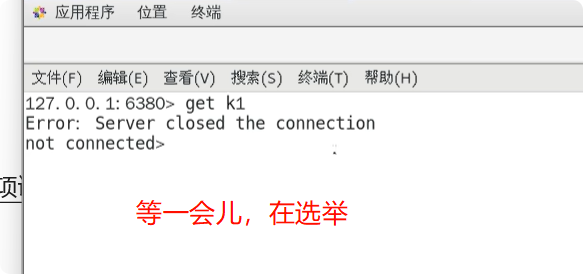
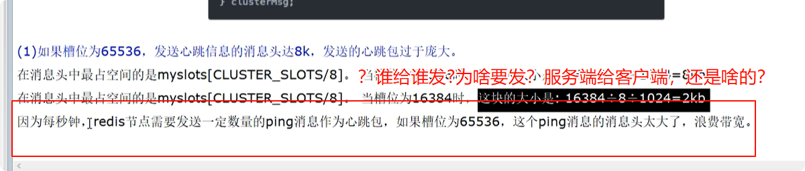
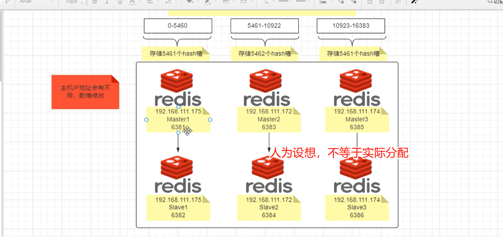
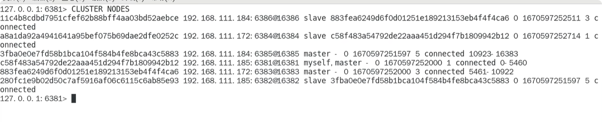
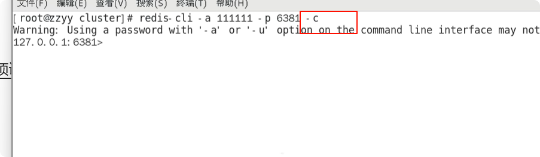

哨兵为啥需要配置集群，为啥需要奇数

哨兵不光改master配置，也要改slave配置告诉新master是谁，强烈建议实验前先备份conf，以便恢复

两种错误在 哨兵中出现的情况有哪些？？

为啥成为 master 后，配置文件改变（由哨兵完成整个过程的执行）。

Roft算法

假设 新选举的 master 偏移量 为 8，原 master 为 9，咋办？且在新 master 执行一段时间后，原来的master上线，如何保证数据安全的？？？ 

此外选举过程中，无法连接写入，实际应用中会存在数据丢失。—–>推荐使用集群！！！

哈希环：

这个nb，掉落位置不会变，只要它原来访问的主机在，就能继续访问

心跳包相关，在主从复制中是否存在？？？补充！！！

为啥不超过 1000 个?信息失真，数据复制起来非常损耗资源？？？

集群不保证强一致性，master写完没来得及发 slave ，结果挂了，slave 上位造成数据丢失。

假如在其他master使用也会换吗？是有条件（调换前已发生过故障迁移）的还是无条件直接调换角色？

为master加slave，是否一定需要指定 master_id呢？

