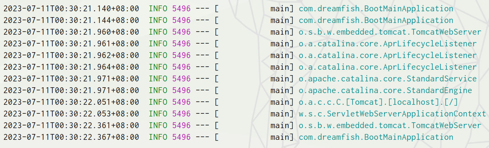

#### ps

1.   idea的一些快捷键(方便阅读源码)：

     > 1.  `CTRL+H`：查看继承树
     > 2.  `CTRL+N`：查找
     > 3.  `CTRL+F12`：查看类方法
     > 4.  `CTRL+o`：快速重写方法
     > 5.  `Alt + F7`： 用来查找某个元素(变量、方法、类)的所有引用的。执行此操作后，会在一个新窗口中显示所有引用的位置。
     > 6.  `Ctrl + Alt + F7 `：用来快速查找某个元素的所有引用的。执行此操作后，会在一个弹出窗口中以列表的形式显示所有引用的位置。
     > 7.  `Ctrl + Alt + H `：专门用来查看某个方法的调用层次的。会展开一个树形的结构，显示出这个方法被哪个方法直接调用，而这些方法又被哪些方法调用，形成一种调用链。
     > 8.  `CTRL+ALT+点击`：查看调用情况。

2.   idea的书签功能非常好用，用来阅读源码或者标记常用位置。

3.   关于调试功能：<br>

4.   debug过程中选中表达式，右键选择``可以计算表达式的值：<br>

5.   之前一直使用是`3.1.1`，后来学到`yaml`后`springboot`版本更新到`3.1.2`,所以后续笔记均使用`3.1.2`版本。


#### 1-简介

##### a-springboot简介

1.   SpringBoot 帮我们简单、快速地创建一个独立的、生产级别的 Spring 应用(说明：SpringBoot底层是Spring)。大多数 SpringBoot 应用只需要编写少量配置即可快速整合 Spring 平台以及第三方技术。
2.   springboot特性：

     1.   快速创建独立 Spring 应用，无需像SSM(导包、写配置、启动运行)
     2.   直接嵌入`Tomcat`、`Jetty` 或者`Undertow`（无需部署 war 包）【Servlet容器】
     3.   重点：<u>提供可选的`starter`，简化应用整合</u>
          1.   场景启动器(`starter`)：web、json、邮件、oss（对象存储）、异步、定时任务、缓存...
          2.   导包一堆，控制好版本。
          3.   为每一种场景准备了一个依赖： `web-starter`、`mybatis-starter`等等。

     4.   重点：<u>按需自动配置Spring 以及第三方库</u>
          1.   如果这些场景我要使用，这个场景的所有配置都会自动配置好。
          2.   约定大于配置：每个场景都有很多默认配置。
          3.   自定义：配置文件中修改对应项就可以

     5.   提供生产级特性：如 监控指标(k8s)、健康检查、外部化配置(项目相关的配置可以放在jar包外面，当要修改相关配置时，不需要重新打包部署启动)等
     6.   无代码生成、无xml

3.   springboot特性总结：简化开发，简化配置，简化整合，简化部署，简化监控，简化运维。


##### b-官网介绍

1.   [springboot官网](https://spring.io/projects/spring-boot)。
2.   在官网选择对应的springboot版本，即可查看文档(可以选择查看参考文档或者API文档)：<br>
3.   对于英文文档可以使翻译插件，Google翻译也还行，当然也可以使用沉浸式翻译插件。


##### c-前置要求

1.   首先`springboot3`是基于jdk17的，所以java的最低版本要求jdk17。

2.   对于maven需要设置一些配置(可以参考之前maven学习中配置，但是jdk版本需要修改为jdk17)，具体的配置文件在`apache-maven-3.9.0\conf\settings.xml"`：

     ```xml
     <!--具体配置方法见Maven笔记-->
     <!--阿里云最新镜像仓库：https://maven.aliyun.com/repository/public-->
     <mirrors>
         <mirror>
             <id>nexus-aliyun</id>
             <mirrorOf>central</mirrorOf>
             <name>Nexus aliyun</name>
             <url>http://maven.aliyun.com/nexus/content/groups/public</url>
         </mirror>
     </mirrors>
     
     <profiles> <!--默认jdk版本-->
         <profile>
             <id>jdk-17</id>
             <activation>
                 <activeByDefault>true</activeByDefault>
                 <jdk>17</jdk>
             </activation>
             <properties>
                 <maven.compiler.source>17</maven.compiler.source>
                 <maven.compiler.target>17</maven.compiler.target>
                 <maven.compiler.compilerVersion>17</maven.compiler.compilerVersion>
             </properties>
         </profile>
     </profiles>
     ```

---


#### 2-快速入门

##### a-创建项目

1.   首先我们需要新建一个Maven项目。接下来，我们就需要将这个maven项目改造为springboot项目。其实这里我们可以参考官方文档：<br>

2.   首先我们需要在`pom.xml`中引入springboot的父项目：

     ```xml
     <!-- 所有springboot项目都必须继承自spring-boot-starter-parent -->
     <parent>
         <groupId>org.springframework.boot</groupId>
         <artifactId>spring-boot-starter-parent</artifactId>
         <version>3.1.1</version>
     </parent>
     ```

3.   此后，我们需要在`pom.xml`中引入springboot的web开发启动器的依赖：

     ```xml
     <dependencies>
         <!-- web开发的场景启动器 -->
         <dependency>
             <groupId>org.springframework.boot</groupId>
             <artifactId>spring-boot-starter-web</artifactId>
         </dependency>
     </dependencies>
     ```

4.   我们还需要为springboot创建一个入口程序，入口程序位置有严格要求(后续说明)：

     ```java
     @SpringBootApplication
     public class BootMainApplication {  // 类名无限制
     
         public static void main(String[] args) {
             SpringApplication.run(BootMainApplication.class, args);  // 传参当前类、args
         }
     
     }
     ```
     
     >   1.   `@RestController`是`@Controller`和`@ResponseBody`的复合注解。其表明类为controller，且返回参数为响应内容。
     >   2.   `@SpringBootApplication`：声明这是一个springboot程序(位于主程序上)，后续会进一步讲解。
     
5.   此外，我们需要为springboot项目编写一个`controller`，这里我写一个`HelloController`：

     ```java
     @RestController
     public class HelloController {
     
         @RequestMapping("/hello")
         public String hello(){
             return "Hello Spring Boot!";
         }
     }
     ```

6.   这里我们还是要提一下主程序的位置(与`controller`包同一级)：<br>

7.   其实经过上述步骤一个简单地springboot项目已经创建完成了。我们可以直接运行主程序启动项目，访问`localhost:8080`。<br>


##### b-打包

1.   我们可以通过打包为`jar`包的方式，来简化springboot项目的部署。

2.   首先我们还是需要在`pom.xml`中配置springboot打包插件的依赖：

     ```xml
     <!-- SpringBoot应用打包插件 -->
     <build>
         <plugins>
             <plugin>			
                 <groupId>org.springframework.boot</groupId>
                 <artifactId>spring-boot-maven-plugin</artifactId>
             </plugin>
         </plugins>
     </build>
     ```

3.   这时候就可以通过命令`mvn clean package`把项目打成可执行的`jar`包。当然可以使用idea代劳先`clean`后`packae`就行。<br>

4.   完成后的`jar`包位置就在新生成的`target`目录下：<br>

5.   这时我们可以直接在命令行通过命令`java -jar xxxx.jar`运行项目`jar`包(`jar`位置要填写正确)。当然你也可以使用`linux`或者`wsl`甚至是`docker`部署运行它。<br>

6.   还没完，这里我们还可以体会一下springboot的外部化配置。当你像修改spingboot项目配置时，无需需改源码重新打包。只需要在`jar`同级目录添加springboot配置文件重新运行`jar`包即可。

     1.   例如，我使用命令`gedit ./application.properties`添加配置文件。

          ```properties
          server.port=8888
          ```

     2.   重新运行`java -jar xxxx.jar`即可，端口号便已修改为8888。

---


#### 3-特性小结

##### a-简化整合

1.   导入相关的场景也就是场景启动器，springboot项目就拥有相关的功能。简单来说就是场景一导入，万物皆就绪。默认支持的所有场景参考：[官网](https://docs.spring.io/spring-boot/docs/current/reference/html/using.html#using.build-systems.starters)。

2.   官方提供的场景：命名为：`spring-boot-starter-*`。

3.   第三方提供场景：命名为：`*-spring-boot-starter`。

     


##### b-简化开发

无需编写任何配置，直接开发业务


##### c-简化配置

1.   springboot采用集中式配置，所以的配置都在文件`application.properties`(文件类型后缀可以有多种)：
     1.   集中式管理配置，只需要修改这个文件就行 。
     2.   配置基本都有默认值。
     3.   能写的所有配置都在： [官网](https://docs.spring.io/spring-boot/docs/current/reference/html/application-properties.html#appendix.application-properties)。


##### d-简化部署

1.   打包为可执行的jar包。
2.   linux服务器上只需要有java环境，无需安装tomcat。


##### e- 简化运维

1.   修改配置(外部放一个`application.properties`文件)、监控、健康检查。

---


#### 4-创建springboot项目

##### a-官方脚手架

1.   除了快速入门的创建springboot项目的方式外，我们还可以使用脚手架搭建springboot项目。
2.   官方脚手架：[Spring Initializr 脚手架](https://start.spring.io/)。
3.   阿里云教授级(多一些一些阿里云的依赖包):[云原生应用脚手架](https://start.aliyun.com/)。
4.   下面以官方脚手架演示一下创建springboot项目的过程。<br><br><br><br><br>


##### b-idea

1.   idea其实内置了官方的脚手架，当然你也可以在idea中配置其他第三方提供的脚手架(更新不及时)。
2.   在idea中选择新建项目，并且选择使用`spring Initializr`。<br><br><br>
3.   这样创建的项目，`pom.xml`可能颜色不对，这时需要右键`pom.xml`选择`add as maven project`等待依赖加载完成即可：<br>

---


#### 5-机制分析

##### a-父项目依赖管理

1.  springboot的`pom.xml`配置的父项目(配置了一些)：

    ```xml
    <parent>
        <groupId>org.springframework.boot</groupId>
        <artifactId>spring-boot-starter-parent</artifactId>
        <version>3.1.1</version>
    </parent>
    ```

2.   父项目的父项目(CTRL+右键点击`spring-boot-starter-parent`即可查看)：

     ```xml
     <parent>
         <groupId>org.springframework.boot</groupId>
         <artifactId>spring-boot-dependencies</artifactId>
         <version>3.1.1</version>
     </parent>
     ```

3.  父项目的父项目即`spring-boot-dependencies`几乎声明了所有开发中常用的依赖的版本号,这也就是自动版本仲裁机制。<br>


##### a-依赖仲裁机制

1.   每个springboot项目都有一个父项目`spring-boot-starter-parent`，其父项目的父项目是`spring-boot-dependencies`。而`spring-boot-dependencies`把所有常见的jar的依赖版本都声明好了，我们将其称为版本仲裁中心。

2.   `sprongboot`父依赖既然规定了相关依赖版本，因此引入依赖一般可以不写版本。并且`spring-boot-dependencies`中依赖版本的规定形式如下：

     ```xml
     <properties>
         <log4j2.version>2.20.0</log4j2.version>
         <logback.version>1.4.8</logback.version>
         <lombok.version>1.18.28</lombok.version>
         <mysql.version>8.0.33</mysql.version>
     </properties>
     ```

3.   那么有时候我们不想使用springboot提供的依赖版本，例如我的`mysql`是5.x.x但是默认8.0.33。存在两种解决方式(利用maven的就近原则)：

     1.   直接在当前项目`properties`标签中声明父项目用的版本属性的key(覆盖父项目中依赖版本)。

          ```xml
          <properties>
              <mysql.version>5.1.49</mysql.version> <!-- 名称要与父依赖一致 -->
          </properties>
          
          <dependency>
              <groupId>mysql</groupId>
              <artifactId>mysql-connector-java</artifactId>
          </dependency>
          ```

     2.   直接在导入依赖的时候声明版本。

          ```xml
          <dependency>
              <groupId>mysql</groupId>
              <artifactId>mysql-connector-java</artifactId>
              <version>5.1.49</version> <!-- 直接声明版本 -->
          </dependency>
          ```

4.   对于非版本仲裁的依赖，则要写版本号：

     1.   也可以参考`spring-boot-dependencies`的写法，创建一个依赖版本标签，通过`${ }`使用标签：

          ```xml
          <properties>
              <druid.version>1.2.16</druid.version> <!-- 创建标签druid.version -->
          </properties>
          
          <dependency>
              <groupId>com.alibaba</groupId>
              <artifactId>druid</artifactId>
              <version>${druid}</version> <!-- 使用标签druid.version -->
          </dependency>
          ```

     2.   或者直接指明依赖版本：

          ```xml
          <dependency>
              <groupId>com.alibaba</groupId>
              <artifactId>druid</artifactId>
              <version>1.2.16</version> <!-- 直接声明版本 -->
          </dependency>
          ```


5.   示意图：<br>


##### c-自动配置机制

1.  自动配好Tomcat：我们在项目中引入`spring-boot-starter-web`其内部引入Tomcat启动器，里面配置了tomcat。

    ```xml
        <dependency>
            <groupId>org.springframework.boot</groupId>
            <artifactId>spring-boot-starter-tomcat</artifactId>
            <version>3.1.1</version>
            <scope>compile</scope>
        </dependency>
    ```

2.  自动配好SpringMVC，包括引入SpringMVC全套组件，并自动配好SpringMVC常用组件功能。

3.  自动配好Web常见功能，如：字符编码问题，SpringBoot帮我们配置好了所有web开发的常见场景

4.  默认的包结构

    1.  <span style="color:red">springboot中，主程序所在包及其下面的所有子包里面的组件都会被默认扫描进来。</span>
    2.  无需以前的包扫描配置。

5.  但是<span style="color:red">想要改变扫描路径，存在两种方式</span>：

    1.  `@SpringBootApplication(scanBasePackages="要扫描包路径")`。

        ```java
        @SpringBootApplication(scanBasePackages = "com.dreamfish")
        public class BootMainApplication {
        
            public static void main(String[] args) {
                SpringApplication.run(BootMainApplication.class, args);
            }
        
        }
        ```

        >   1.   `@SpringBootApplication()`还可以配置一个`scanBasePackageClasses`，其可以配置多个类，springboot会扫描这些类所在包及其子包。
        >
        >   2.   例如下面代码：
        >
        >        ```java
        >        @SpringBootApplication(
        >            scanBasePackageClasses = {
        >                com.dreamfish.controller.HelloController.class,
        >                com.dreamfish.service.HelloService.class
        >                    })
        >        public class BootMainApplication {
        >                                                                                                                                                         
        >            public static void main(String[] args) {
        >                SpringApplication.run(BootMainApplication.class, args);
        >            }
        >                                                                                                                                                         
        >        }
        >        ```

    2.  或者使用`@ComponentScan("包路径")` 指定扫描路径。

        ```java
        @SpringBootConfiguration
        @EnableAutoConfiguration
        @ComponentScan("com.dreamfish")
        public class BootMainApplication {
        
            public static void main(String[] args) {
                SpringApplication.run(BootMainApplication.class, args);
            }
        
        }
        ```

    3.  @SpringBootApplication等同于三个注解：

        ```java
        @SpringBootConfiguration
        @EnableAutoConfiguration
        @ComponentScan("主程序所在包路径")
        ```

6.  配置默认值

    1.  配置文件的所有配置项是和某个类的对象值进行一一绑定的，绑定了配置文件中每一项值的类称为属性类，比如：
        1.  `ServerProperties`绑定了所有Tomcat服务器有关的配置。
        2.  `MultipartProperties`绑定了所有文件上传相关的配置

    2.   参照[官方文档](https://docs.spring.io/spring-boot/docs/current/reference/html/application-properties.html#appendix.application-properties.server)或者参照绑定的属性类确认某个配置的默认值。
    3.  在配置文件中点击某个配置就可以跳转对应的属性类。

7.  按需加载自动配置

    1.  导入场景启动器时，场景启动器除了会导入相关功能依赖，导入一个`spring-boot-starter`，是所有`starter`的`starter`，即基础核心`starter`。

    2.  `spring-boot-starter`导入了一个包 `spring-boot-autoconfigure`。包里面都是各种场景的`AutoConfiguration`自动配置类。

        ```xml
        <dependency>
            <groupId>org.springframework.boot</groupId>
            <artifactId>spring-boot-autoconfigure</artifactId>
            <version>3.1.1</version>
            <scope>compile</scope>
        </dependency>
        ```
    
        <br>
    
    3.  虽然全场景的自动配置都在 `spring-boot-autoconfigure`这个包，但是不是全都开启的。
    
    4.  导入哪个场景就开启哪个自动配置。
    
        >   1.   官方提供的场景：命名为：`spring-boot-starter-*`。
        >
        >   2.   第三方提供场景：命名为：`*-spring-boot-starter`。
    
    ---
    
    


#### 6-常用注解(含lombok)

##### a-补充(含lombok)

1.   其实在主程序中存在一系列API，可以用来获取判断ioc容器中的bean对象：

     ```java
     @SpringBootApplication
     public class BootMainApplication {
     
         public static void main(String[] args) {
             //启动SpringBoot应用,返回IOC容器
             var ioc = SpringApplication.run(BootMainApplication.class, args);
     
             //获取容器中所有的bean的名字
             String[] beanDefinitionNames = ioc.getBeanDefinitionNames();
             for (String name : beanDefinitionNames) {
                 System.out.println(name);
             }
     
             //通过类型获取bean(与springboot2不同)
             var helloController = ioc.getBean(BootMainApplication.class);
     
             //通过名字获取bean
             var helloController2 = ioc.getBean("bootMainApplication");
     
             //是否包含某个名称bean
             boolean isContains = ioc.containsBean("bootMainApplication");
     
             //是否是单例
             boolean isSingleton = ioc.isSingleton("bootMainApplication");
     
             //是否是多例
             boolean isPrototype = ioc.isPrototype("bootMainApplication");
     
             //通过名称获取bean的类型
             Class<?> type = ioc.getType("bootMainApplication");
         }
     
     }
     ```

2.   关于`@SpringBootApplication`的进一步介绍，上面代码可以看出`@SpringBootApplication`标注的类对象也会交给ioc管理：

     1.   `@SpringBootApplication`注解里使用了`@SpringBootConfiguration`注解。<br>
     2.   `@SpringBootConfiguration`注解里使用了`@Configuration`注解。<br>
     3.   `@Configuration`注解里使用了`@Component`注解(这个注解不陌生吧)。<br>
     4.   综上所述，从某种意义上说：`@SpringBootApplication`、`@SpringBootConfiguration`、`@Configuration`、`@Component`、`@Controller`、`@Service`、`@Repository`、`@RestController`等均实现了`@Component`组件。
     5.   也就是说这些注解所标注的类都会交个ioc管理。

3.   下面补充一下`lombok`的使用：

     1.   引入lombok依赖（springboot提供依赖管理，无需设置版本；若是其他可能需要）

          ```xml
          <!--lombok依赖-->
          <dependency>
              <groupId>org.projectlombok</groupId>
              <artifactId>lombok</artifactId>
              <version>1.18.12</version>
              <scope>provided</scope> <!--排除lombok依赖:表示依赖只在编译和测试过程中被需要，部署时不需要-->
          </dependency>
          ```
     
     2.   但是在springboot项目中，我们更推荐下面这中写法：
     
          ```xml
          <dependencies>
              <dependency>
                  <groupId>org.projectlombok</groupId>
                  <artifactId>lombok</artifactId>
                  <optional>true</optional>
              </dependency>
          </dependencies>
          
          <build>
              <plugins>
                  <plugin>
                      <groupId>org.springframework.boot</groupId>
                      <artifactId>spring-boot-maven-plugin</artifactId>
                      <configuration> <!--打包时排除lombok依赖-->
                          <excludes>
                              <exclude>
                                  <groupId>org.projectlombok</groupId>
                                  <artifactId>lombok</artifactId>
                              </exclude>
                          </excludes>
                      </configuration>
                  </plugin>
              </plugins>
          </build>
          ```
     
     3.   idea安装lombok插件，(不报错可忽略当此步设置，但是一般idea会在报错时自动提醒你打开，没必要手动去开启)`file–>setting–>build,excecution,deployment–>compiler–>annotation processors`勾选上` enable annotation processing`,并重启idea。<br>
     
     4.   在相关类上标记注解，在编译时帮助生成相关代码（一部分）
     
     5. 关于`lombok`的一些常用注解：
     
        1.  `@Setter`：注解在类时为所有字段生成setter方法，注解在字段上时为该字段生成setter方法。
        2.  `@Getter` ：使用方法同上，区别在于生成的是getter方法。
        3.  `@ToString `：注解在类，添加toString方法。还可以加其他参数，例如`@ToString(exclude="id")`排除 id 属性。
        4.  `@EqualsAndHashCode` ：注解在类，生成hashCode和equals方法。
        5.  `@NoArgsConstructor` ：注解在类，生成无参的构造方法。
        6.  `@AllArgsConstructor` ：注解在类，生成包含类中所有字段的构造方法。
        7.  ``@Data`` ：注解在类，生成setter/getter、equals、canEqual、hashCode、toString方法，如为final属性，则不会为该属性生成setter方法。
        8.  `@Slf4j `：注解在类，生成log变量，严格意义来说是常量。主要用于创建SLF4J 类型的日志记录器。等同于` Logger  log = LoggerFactory.getLogger(getClass());`
        9.  `@Log`：注解在类，生成log变量，严格意义来说是常量。主要用于创建使用Java Logging API(`java.util.logging.Logger`)的日志记录器。等同于`Logger log = Logger.getLogger(MyClass.class.getName())`。
        10.  `@Builder` 是 Lombok 提供的一个注解，用于自动生成构建器模式的代码。构建器模式(Builder Pattern)是一种创建对象的设计模式，通过一步一步地设置参数来构建对象，比传统的构造方法更灵活，特别是在对象有很多可选参数时非常有用。
     
     6.  具体演示如下：
     
         ```java
         //示例1
         @ToString(exclude = "age")
         @Getter
         @Setter
         @ConfigurationProperties(prefix = "my.cat")
         @AllArgsConstructor
         public class Cat {
             private String name;
             private int age;
         
         }
         
         //示例2
         @Slf4j  //生成名为log的变量
         @RestController
         public class HelloController {
         
             @RequestMapping("/")
             public String sayHello(){
                 String s="该方法已被调用！";
                 log.info(s);  // log.info()用于输出日志
                 return "Hello world!";
         
             }
         }
         ```
     
         


##### b-组件注册

###### ①xml方式

1.   在ssm中我们一般都是使用`<bean>`注解的形式为ioc容器添加组件。

2.   例如现在有一个person类，为了开发简便我们先添加`lombok`依赖：

     ```xml
     <dependencies>
         <dependency>
             <groupId>org.projectlombok</groupId>
             <artifactId>lombok</artifactId>
         </dependency>
     </dependencies>
     ```

     ```java
     @Data
     @NoArgsConstructor
     public class Person {
         private String name;  //姓名
         private int age;  //年龄
         private String gender;  //性别
     }
     ```

3.   下面就是使用配置文件配置bean：

     ```xml
     <beans>
         <bean id="person1" class="com.dreamfish.entity.Person" scope="singleton"></bean> <!-- 单例 -->
         <bean id="person2" class="com.dreamfish.entity.Person" scope="prototype"></bean> <!-- 多例 -->
     </beans>
     ```


###### ②@Configuration配置类、@Bean添加组件

1.   `@Configuration`：声明这是一个配置类，等同于配置文件。其标记的类也是一个组件，也可以通过IOC容器获取，<span style="color:red">其组件id默认为类名首字母小写</span>。

2.   `@Configuration`注解的参数：`proxyBeanMethods`，规定代理bean的方法是否开启：

     1.   `Full(proxyBeanMethods = true)`：默认；保证每个`@Bean`方法被调用多少次返回的组件都是单实例的，每次调用前都会去IOC容器查找(使用代理类)，存在则返回IOC中实体对象，不存在则创建。启动慢。
     2.   `Lite(proxyBeanMethods = false)`：每个`@Bean`方法被调用多少次返回的组件都是新创建的。不会查找，启动快。
     3.   配置类组件之间无依赖关系用`Lite`模式加速容器启动过程，减少判断；配置类组件之间有依赖关系，方法会被调用得到之前单实例组件，用`Full`模式(不同组件相互依赖就要保证组件的单例，不然每次调都是新的，依赖个鬼)。

3.   `@Bean`：给容器中添加组件，以方法名作为组件的id。返回类型就是组件类型，返回的值，就是组件在容器中的实例。当然也可以使用`@Bean("xxx")`指定值作为组件id。

4.   <span  style="color:red">`@Bean`标记方法的参数会从Spring容器中根据类型注入(若有多个类型的的话则根据方法名按名称注入，没有找到就会报错)</span>。

5.   `@Scope`用于设置bean实例是单例`singleton`还是多例模式`prototype`。可以与`@Bean`一同使用表明bean的作用域，当然该注解也可以标注配置类作为全局bean作用域配置。

     >   这里还是要提一嘴：`@Configuration(proxyBeanMethods = true)`注解表示启用CGLIB代理，可以实现对同一个类中的`@Bean`方法调用返回的对象进行缓存，避免重复调用。`@Scope`注解则是用于定义Bean的作用域。两者的作用不同，但都可以用于控制Bean的创建和销毁。

6.   具体举例如下：

     ```java
     //开启代理模式,即full模式(单例)
     @Configuration(proxyBeanMethods = true)
     public class MyConfig {
     
         @Bean("person")
         @Scope("prototype") //单个设置为多例
         public Person person(){
             Person p = new Person();
             p.setName("Dream fish");
             p.setAge(18);
             return p;
         }
     
     }
     ```

7.   上述的`@Configuration`可以换为`@SpringBootConfiguration`,`@SpringBootConfiguration`只是表明这是springboot配置类，本质上和使用上没有区别。<br>


###### ③@Component、@Controller、@Service、@Repository

1.   这些注解的使用与spring中一致。
2.   但是还是要说明一下，`@Component`、`@Controller`、`@Service`、`@Repository`底层源码中都是使用了`@Component`注解的。


###### ④@Import

1.  `@Import`注解的作用是导入配置类或者一些需要前置加载的类。`@Import`注解只能用在类上，通过快速导入的方式实现把实例加入Spring的IOC容器中。`@Import`注解的作用和在使用Spring的xml配置时用到的类似。但应注意是`@Import`在使用时，必须要保证能被IOC容器扫描到。

2.  可以添加在`@SpringBootApplication`(启动类)、`@Configuration`(配置类、`@SpringBootConfiguration`)、`@Component`组件对应的类上。请注意这里的`@Component`组件指的是：实现了`@Component`的注解组件。（`@SpringBootApplication`、`@SpringBootConfiguration`、`@Configuration`、`@SpringBootConfiguration`、`@Component`、`@Controller`、`@Service`、`@Repository`、`@RestController`等均实现了`@Component`组件）

3.  `@Import`的参数为运行时类，多个运行时类用用逗号隔开，`@Import`调用无参构造器，给容器中自动创建出参数类型组件、<span style="color:red">默认组件的名字就是全类名</span>。

4.  其实`@Import`一般用于导入第三方类实例，这种第三方类无法直接在源码上添加`@Component`等注解。

5.  具体演示如下：

    ```java
    @Data  //lombok注解
    @NoArgsConstructor
    public class Animal {
        private String name; //姓名
        private int age; //年龄
        private String color; //颜色
    
    }
    ```

    ```java
    //开启代理模式,即full模式(单例)
    @SpringBootConfiguration(proxyBeanMethods = true)
    @Scope("singleton") //全局设置为单例
    @Import({Person.class, Animal.class})
    public class MyConfig {
    
    }
    ```

    ```java
    @SpringBootApplication
    public class BootMainApplication {
        public static void main(String[] args) {
            var ioc = SpringApplication.run(BootMainApplication.class, args);
    
            Object bean = ioc.getBean("com.dreamfish.entity.Animal"); //通过全类名获取bean
        }
    
    }
    
    ```

6.  其实`@Import`还可以用来配置多个配置类：

    1.  假设我存在两个配置类：

        ```java
        @Configuration
        public class FirstConfig {
        
            @Bean
            public Animal animal() {
                Animal animal = new Animal();
                animal.setName("小猫");
                animal.setAge(2);
                return animal;
            }
        }
        ```

        ```java
        @SpringBootConfiguration
        public class SecondConfig {
        
            @Bean
            public Person person() {
                Person person = new Person();
                person.setName("小明");
                person.setAge(18);
                return person;
            }
        }
        ```

    2.  一般来说，当存在多个配置类，你可以将它们分别定义在不同的文件中，然后在`xxConfig`中导入这些配置类。这样可以使你的代码更加清晰和易于维护。

    3.  一般使用`@Import`注解导入其他配置类:

        ```java
        @SpringBootConfiguration(proxyBeanMethods = true)
        @Import({FirstConfig.class, SecondConfig.class})
        public class MyConfig {}
        ```

        ```java
        @SpringBootApplication
        public class BootMainApplication {
            public static void main(String[] args) {
                var ioc = SpringApplication.run(BootMainApplication.class, args);
        
                Object cat = ioc.getBean("animal");  //通过id获取bean
            }
        
        }
        ```

7.  补充：

    >   1.    `@Import`还可以引入`ImportSelector`的实现类，把`ImportSelector`接口`selectImports()`方法返回的`Class`名称都定义为`bean`。
    >
    >        ```java
    >        public interface ImportSelector {
    >        
    >            String[] selectImports(AnnotationMetadata importingClassMetadata);
    >        
    >            @Nullable
    >            default Predicate<String> getExclusionFilter() {
    >                return null;
    >            }
    >        
    >        }
    >        ```
    >
    >   2.   而`selectImports()`方法的参数`AnnotationMetadata`，通过这个参数我们可以获取到`@Import`标注的Class的各种信息。这一点特别有用，包括其Class名称，实现的接口名称、父类名称、添加的其它注解等信息。主要用于做一些参数的传递。
    >
    >   3.   下面提供演示代码：
    >
    >        ```java
    >        // 一个简单地类
    >        public class Me {
    >            public void say () {
    >                System.out.println("Hello, I'm Me!");
    >            }
    >        }
    >                                                                                             
    >        ```
    >
    >        ```java
    >        // 编写ImportSelector实现类
    >        public class EnableMeSelector implements ImportSelector {
    >            @Override
    >            public String[] selectImports(AnnotationMetadata importingClassMetadata) {
    >                // 获取标注类名称
    >                String className = importingClassMetadata.getClassName();
    >                System.out.println(className);
    >                                                                                             
    >                return new String[]{Me.class.getName()}; // 返回要导入的类的全类名数组
    >            }
    >                                                                                             
    >            @Override
    >            public Predicate<String> getExclusionFilter() {
    >                return ImportSelector.super.getExclusionFilter();
    >            }
    >        }
    >        ```
    >
    >        ```java
    >        // 自定义一个包含@Import的注解
    >        @Documented // 生成文档
    >        @Retention(value = java.lang.annotation.RetentionPolicy.RUNTIME) // 运行时注解
    >        @Import(EnableMeSelector.class)
    >        public @interface EnableMe {
    >                                                                                             
    >        }
    >        ```
    >
    >        ```java
    >        // 主程序类(测试)
    >        @SpringBootApplication
    >        @EnableMe 
    >        public class BootMainApplication {
    >            public static void main(String[] args) {
    >                var ioc = SpringApplication.run(BootMainApplication.class, args);
    >                Me me = (Me) ioc.getBean("com.dreamfish.annotation.Me");
    >                me.say(); //Hello, I'm Me!
    >            }
    >                                                                                             
    >        }
    >        ```


###### ⑤@ComponentScan

1.  `@SpringBootApplication`等同于三个注解：
    1.  `@SpringBootConfiguration`
    2.  `@EnableAutoConfiguration`
    3.  `@ComponentScan("主程序所在包路径")`

2.  `@ComponentScan`主要用于将指定包路径下的、带有特定注解的对象自动装配到Spring容器中。`ComponentScan`会把正确标注`@Component`注解的对象进行自动装配。除了`@Component`外，还有`@Controller`、`@Repository`、`@Service`等等都标注了`@Component`注解。

3.  `@ComponentScan`常用属性：
    1.  `basePackages`、`value`：定义待扫描的包路径名。
    2.  `basePackageClasses`：定义待扫描的类所在的包及其子包中所有的类。
    3.  `includeFilters`： 满足过滤器条件的，才能被扫描。
    4.  `excludeFilters`：满足过滤器条件的，不会被扫描。

4.  `includeFilters`和`excludeFilters`都需要借助`@ComponentScan.Filter`来完成相应的扫描规则，`FilterType`有以下几个可选项:

    1.  `ANNOTATION`(默认注解类型)
    2.  `ASSIGNABLE_TYPE`(指定固定类)
    3.  `ASPECTJ`(ASPECTJ类型)
    4.  `REGEX`(正则表达式)
    5.  `CUSTOM`(自定义类型)，自定义的`Filter`需要实现`TypeFilter`接口。

5.  演示如下：

    ```java
    @SpringBootConfiguration
    @EnableAutoConfiguration
    @ComponentScan(
        basePackages = {"com.dreamfish.service", "com.dreamfish.controller"},
        includeFilters = {
            @ComponentScan.Filter(type = FilterType.ANNOTATION,classes = {Service.class})
                //这里表示只扫描@Service类型注解的类
        }
    )
    public class BootMainApplication {
        public static void main(String[] args) {
            var ioc = SpringApplication.run(BootMainApplication.class, args);
            Object bean = ioc.getBean("animal");
            System.out.println(bean);
        }
    
    }
    ```


###### ⑥@ImportResource

1.  `@ImportResource`：导入spring配置文件，解析配置文件，创建bean。

2.  `@ImportResource`注解可以使用在`@SpringBootApplication`、`@SpringBootConfiguration`、`@Configuration`、`@Component`、`@Controller`、`@Service`、`@Repository`、`@RestController`等组件(亲测)。

3.  具体演示如下：

    ```xml
    <?xml version="1.0" encoding="UTF-8"?>
    <beans xmlns="http://www.springframework.org/schema/beans"
           xmlns:xsi="http://www.w3.org/2001/XMLSchema-instance"
           xsi:schemaLocation="http://www.springframework.org/schema/beans http://www.springframework.org/schema/beans/spring-beans.xsd">
        <beans>
            <bean id="person" class="com.dreamfish.entity.Person">
                <property name="name" value="dream fish"/>
                <property name="age" value="18"/>
                <property name="gender" value="男"/>
            </bean>
        </beans>
    </beans>
    ```

    ```java
    @SpringBootConfiguration(proxyBeanMethods = true)
    @ImportResource(locations = {"classpath:beans.xml"})  //导入xml配置文件
    public class MyConfig {}
    ```

    


##### c-条件注解

1.   `@Conditional `注解是用来匹配只有满足所有指定条件才能将`Bean`注册到`Spring`上下文中。

2.   常用的 `@Conditional `的衍生注解，关于这些注解的参数及使用可以参考源码文档：

     ```tex
     @ConditionalOnJava        		//系统的java版本是否符合要求               
     @ConditionalOnBean        		//容器中存在指定Bean；                  
     @ConditionalOnMissingBean 		//容器中不存在指定Bean；                 
     @ConditionalOnExpression  		//满足表达式指定                   
     @ConditionalOnClass             //有指定的类                      
     @ConditionalOnMissingClass      //统中没有指定的类                     
     @ConditionalOnSingleCandidate   //器中只有一个指定的Bean，或者这个Bean是首选Bean
     @ConditionalOnProperty          //统中指定的属性是否有指定的值               
     @ConditionalOnResource          //路径下是否存在指定资源文件                
     @ConditionalOnWebApplication    //前是web环境                      
     @ConditionalOnNotWebApplication //当前不是web环境                     
     @ConditionalOnJndi              //JNDI存在指定项     
     ```

     <br>

3.   三种使用方式：

     1.   作为方法级注解：在` @Bean` 注解下添加 `@Conditional `注解来达到满足条件注册Bean。

          ```java
          @Data
          @NoArgsConstructor
          public class Person {
              private String name;  //姓名
              private int age;  //年龄
              private String gender;  //性别
          }
          ```

          ```java
          @SpringBootConfiguration(proxyBeanMethods = true)
          public class MyConfig {
          
              @Bean
              //@ConditionalOnClass(Person.class)
              @ConditionalOnClass(name="com.dreamfish.entity.Person")  //表示存在Person类时才会加载该类
              public Person person(){
                  return new Person();
              }
          }
          ```

     2.   作为类级注解：可以在有 `@Component`,` @Service`, `@Repository`,` @Controller`, `@RestController,` 或 `@Configuration` 等注解的类上标注 `@Conditional`，仅当满足条件才能将这个类型的 bean 注册到 Spring 上下文中。

          ```java
          @Data
          @NoArgsConstructor
          //@ConditionalOnClass(Person.class)
          @ConditionalOnClass(name="com.dreamfish.entity.Person")  //表示存在Person类时才会加载该类
          @Component
          public class Person {
              private String name;  //姓名
              private int age;  //年龄
              private String gender;  //性别
          }
          ```

          >   这里要提一点：`@ConditionalOnClass`默认的`value`是一个`class`类型，而`name`是一个全类名字符串。一般来说更趋向于使用全类名字符串，因为可能存在某些情况无法导入该类型(不存在，导入就会报错)，也就无法使用`value`。但是此时使用全类名字符串就不会报错。

     3.   当然其实也没这么严格， `@Conditional `只需要添加到任意一个ioc管理的bean上都可以用来管理限制该bean的装配(xml配置文件的不行)。

          ````java
          @Data
          @NoArgsConstructor
          @ConditionalOnClass(name="com.dreamfish.entity.Person")  //表示存在Person类时才会加载该类
          public class Person {
              private String name;  //姓名
              private int age;  //年龄
              private String gender;  //性别
          }
          ````

          ```java
          @SpringBootConfiguration(proxyBeanMethods = true)
          public class MyConfig {
          
              @Bean
              public Person person(){
                  return new Person();
              }
          }
          ```

     4.   作为源注解：可以创建一个自定义注解，在注解上添加 `@Conditional `作为新的条件注解。


##### d-属性绑定

###### ①@ConfigurationProperties+组件注解

1.   在一个组件类上使用`@ConfigurationProperties`可将读取到的`properties`文件中内容封装到JavaBean中。

2.   `@ConfigurationProperties`的`sprefix`（value）属性：指定`application.properties`文件的key的前缀。

3.   注意：在这种情况下，<span style="color:red">组件bean的id为：类名首字母小写</span>。

4.   但是在使用这个注解之前，需要在`pom.xml`导入maven依赖，不然idea会提醒你(`spring-boot-configuration-processor`的作用是生成配置的元数据信息，即META-INF目录下的`spring-configuration-metadata.json`文件，从而告诉spring这个jar包中有哪些自定义的配置)：

     ```xml
     <dependency>
         <groupId>org.springframework.boot</groupId>
         <artifactId>spring-boot-configuration-processor</artifactId>
         <optional>true</optional>
     </dependency>
     ```

5.   具体演示如下：

     ```properties
     # Application.properties
     animal.name=Tom
     animal.age=12
     animal.color=withe
     ```

     ```java
     @Data
     @NoArgsConstructor
     @ConfigurationProperties(prefix = "animal")  //需要是一个组件类
     //@Component
     public class Animal {
         private String name; //姓名
         private int age; //年龄
         private String color; //颜色
     
     }
     ```

     ```java
     @SpringBootConfiguration(proxyBeanMethods = true)
     public class MyConfig {
     
         @Bean
         public Animal animal(){
             return new Animal();
         }
     }
     ```

6.   对于可能出现的`properties`类型配置文件乱码：`settings->Editor->File Encodings`配置如下即可：<br>

     


###### ②@ConfigurationProperties+@EnableConfigurationProperties/@ConfigurationPropertiesScan

1.   在启动类或者配置类中添加`@EnableConfigurationProperties`或者`@ConfigurationPropertiesScan`。

2.   `@EnableConfigurationProperties`:参数为要封装属性的类的运行时类，该注解有两个功能：

     1.   开启参数类的配置绑定功能。
     2.   把这个该类组件自动注册到容器中。

3.  `@ConfigurationPropertiesScan`：会自动扫描所有的`@ConfigurationProperties`注解

4.  注意：在这两种情况下，<span style="color:red">组件bean的id为`@ConfigurationPropertiesScan`注解参数-该类全类名（`prefix/value的值-该类全类名`）</span>

5.  这种情况下，`@ConfigurationPropertiesScan`修饰的类可以不事先表示为组件。

6.  具体演示一下：

    1.   `@EnableConfigurationProperties`:

         ```java
         @Data
         @NoArgsConstructor
         @ConfigurationProperties(prefix = "animal")
         public class Animal {
             private String name; //姓名
             private int age; //年龄
             private String color; //颜色
         }
         ```

         ```java
         @SpringBootConfiguration(proxyBeanMethods = true)
         @EnableConfigurationProperties({Animal.class})
         public class MyConfig {}
         ```

         >   这种方式一般主要是用来导入第三方的类进行属性配置，因为第三方类无法被扫描的，即使标记了`@Component`和`@ConfigurationProperties`也没有用。

    2.   `@ConfigurationPropertiesScan`:

         ```java
         @Data
         @NoArgsConstructor
         @ConfigurationProperties(prefix = "animal")
         public class Animal {
             private String name; //姓名
             private int age; //年龄
             private String color; //颜色
         }	
         ```

         ```java
         @SpringBootApplication
         @ConfigurationPropertiesScan(basePackages = "com.dreamfish.entity")
         //不指定basePackages的话默认扫描当前包及其子包
         public class BootMainApplication {
             public static void main(String[] args) {
                 var ioc = SpringApplication.run(BootMainApplication.class, args);
         
                 //获取Animal类的所有bean在ioc容器中的名字
                 String[] beanNamesForType = ioc.getBeanNamesForType(Animal.class);
         
                 for (String s : beanNamesForType) {
                     System.out.println(s);
                 }
             }
         
         }
         
         ```

         >   对于`@ConfigurationPropertiesScan`注解最好标注在启动类，因为不指明`basePackages`的话默认扫描当前包及其子包。

    3.   上述的`Animal`类型的bean的id均为`animal-com.dreamfish.entity.Animal`。


#### e-补充

1.   `@Value`注解它可以用于字段、方法和方法/构造函数参数上，表示当前标注的字段或参数的值是一个可配置的值：

     1.   `@Value("常量")` 常量,包括字符串,网址,文件路径等:

          ```java
          // 注入普通字符串
          @Value("Jack")
          private String username; 
          
          // 注入文件资源
          @Value("classpath:com/test/config.xml")
          private Resource resource; 
          
          // 注入URL资源
          @Value("http://www.baidu.com")
          private Resource url; 
          ```

     2.   `@Value("${} : default_value") `读取配置文件:

          ```java
          @Value("${name}")
          private String name; 
          ```

          ```properties
          name=dream
          ```

     3.   `@Value("#{}? : default_value")`读取注入bean的属性:

          ```java
          @Value("#{ T(java.lang.Math).random() * 100.0 }")
          private double randomNum;
          
          @Value("#{user.name}")
          private String userName
          ```

     4.   此外还支持嵌套：

          ```java
          @Value("#{'${name}'.toUpperCase()}")
          private String name;
          ```

2.   ​	`@Resource`按照名称进行属性注入。

     ```java
     @Resource(name = "messageSource") //按照名称注入
     private MessageSource messageSource;
     ```

     

---


#### 7-深入理解自动配置

<br>

##### a-过程分析step1

1.   首先我们已经知道，所以的场景启动器(例如`spring-boot-starter-web`)除了会导入相关功能依赖，还会导入一个`spring-boot-starter`，是所有`starter`的`starter`，即基础核心`starter`。

     ```xml
     <dependency><!--核心starter-->
         <groupId>org.springframework.boot</groupId>
         <artifactId>spring-boot-starter</artifactId>
         <version>3.1.1</version>
         <scope>compile</scope>
     </dependency>
     <dependency><!--json依赖-->
         <groupId>org.springframework.boot</groupId>
         <artifactId>spring-boot-starter-json</artifactId>
         <version>3.1.1</version>
         <scope>compile</scope>
     </dependency>
     <dependency><!--tomcat依赖-->
         <groupId>org.springframework.boot</groupId>
         <artifactId>spring-boot-starter-tomcat</artifactId>
         <version>3.1.1</version>
         <scope>compile</scope>
     </dependency>
     <!--其他依赖...-->
     ```

2.   而`spring-boot-starter`导入了一个包 `spring-boot-autoconfigure`。包里面都是各种场景的`AutoConfiguration`自动配置类。

     ```xml
     <dependency>
         <groupId>org.springframework.boot</groupId>
         <artifactId>spring-boot-autoconfigure</artifactId>
         <version>3.1.1</version>
         <scope>compile</scope>
     </dependency>
     ```

3.   具体看一下`spring-boot-autoconfigure`包中，直接在项目依赖中搜索即可(无需任何快捷键)：<br>

4.   而`spring-boot-autoconfigure`中几乎涵盖了所有的自动配置。


##### b-过程分析step2

1.   上面我们说到`spring-boot-autoconfigure`中几乎涵盖了所有的自动配置。但是通过前面的知识我们已经知道这些配置类是无法被扫描到的(不在主程序的包内)。

2.   那么这些配置是如何装配的，这其实还是与主程序有关，前面已经提到过`@SpringBootApplication`本质上是有三个注解组成，这其中一个便是`@EnableAutoConfiguration`即启用自动配置注解。

3.   而这个`@EnableAutoConfiguration`注解中又使用了`@Import(AutoConfigurationImportSelector.class)`,到这里就不陌生了，前面已经提过`@Import`用来注册第三方类(无法直接在类上使用`@component`注解)，而这里其实是用来批量注册的。

     ```java
     //...
     @Import(AutoConfigurationImportSelector.class)
     public @interface EnableAutoConfiguration {
     //...
     }		
     ```

4.   不知道是否还记得 `@Import`还可以引入`ImportSelector`的实现类，把`ImportSelector`接口`selectImports()`方法返回的`Class`名称都定义为`bean`。而`AutoConfigurationImportSelector.class`就是`ImportSelector`接口的实现类(`DeferredImportSelector`实现了`ImportSelector`接口)。

     ```java
     public class AutoConfigurationImportSelector implements DeferredImportSelector, BeanClassLoaderAware,
     ResourceLoaderAware, BeanFactoryAware, EnvironmentAware, Ordered {
     
         @Override
         public String[] selectImports(AnnotationMetadata annotationMetadata) {
             if (!isEnabled(annotationMetadata)) {
                 return NO_IMPORTS;
             }
             //!
             AutoConfigurationEntry autoConfigurationEntry = getAutoConfigurationEntry(annotationMetadata);
             return StringUtils.toStringArray(autoConfigurationEntry.getConfigurations());
         }
     
         // 获取自动配置条目
         protected AutoConfigurationEntry getAutoConfigurationEntry(
             AnnotationMetadata annotationMetadata) {
             if (!isEnabled(annotationMetadata)) {
                 return EMPTY_ENTRY;
             }
             AnnotationAttributes attributes = getAttributes(annotationMetadata);
             List<String> configurations = getCandidateConfigurations(annotationMetadata, attributes); //!
             configurations = removeDuplicates(configurations);
             Set<String> exclusions = getExclusions(annotationMetadata, attributes);
             checkExcludedClasses(configurations, exclusions);
             configurations.removeAll(exclusions);
             configurations = getConfigurationClassFilter().filter(configurations);
             fireAutoConfigurationImportEvents(configurations, exclusions);
             return new AutoConfigurationEntry(configurations, exclusions);
         }
     
         // 获取候选配置
         protected List<String> getCandidateConfigurations(AnnotationMetadata metadata, AnnotationAttributes attributes) {
             List<String> configurations = ImportCandidates.load(  //!
                 AutoConfiguration.class, getBeanClassLoader())
                 .getCandidates();
             Assert.notEmpty(configurations,
                             "No auto configuration classes found in "
                             + "META-INF/spring/org.springframework.boot.autoconfigure.AutoConfiguration.imports. If you "
                             + "are using a custom packaging, make sure that file is correct.");
             return configurations;
         }
     
     }
     ```

5.   其实通过上面内容我们大致可以猜测，批量注册的组件类名称是配置在`META-INF/spring/org.springframework.boot.autoconfigure.AutoConfiguration.imports`中的。通过查看可知一共146个。<br>

6.   当然我们也可以证实一下：`AutoConfigurationImportSelector`的`getCandidateConfigurations`中其实使用了`ImportCandidates.load()`方法。通过下面代码其实可以知道加载配制的位置`META-INF/spring/%s.imports`中的`%s`是注解的全类名。

     ```java
     public final class ImportCandidates implements Iterable<String> {
         private static final String LOCATION = "META-INF/spring/%s.imports";
         private static final String COMMENT_START = "#";
         private final List<String> candidates
             
         public static ImportCandidates load(Class<?> annotation, ClassLoader classLoader) {
             Assert.notNull(annotation, "'annotation' must not be null");
             ClassLoader classLoaderToUse = decideClassloader(classLoader);
             String location = String.format("META-INF/spring/%s.imports", annotation.getName());
             Enumeration<URL> urls = findUrlsInClasspath(classLoaderToUse, location);
             List<String> importCandidates = new ArrayList();
     
             while(urls.hasMoreElements()) {
                 URL url = (URL)urls.nextElement();
                 importCandidates.addAll(readCandidateConfigurations(url));
             }
     
             return new ImportCandidates(importCandidates);
         }
     }
     ```

7.   通过上面分析我们大致得出springboot内部使用`@Import`批量引入配置类。


##### c-过程分析step3

1.   我们通过上述过程将配制类加载进来后，并非所有的配置类都会生效，因为这些配置类上还存在条件注解`@ConditionalOnxxx`。当条件成立时，配制才会生效。如下图，以`DispatcherServletAutoConfiguration`：<br>

2.   此外，大多属自动配置类都可能有这样一个注解`@EnableConfigurationProperties(**ServerProperties**.class)`，用来把配置文件中配的指定前缀的属性值封装到 `xxxProperties`属性类中。下面我们就以`ServletWebServerFactoryAutoConfiguration`配置类中自动装配`tomcat`为例：

     ```java
     @AutoConfiguration(after = SslAutoConfiguration.class)
     @AutoConfigureOrder(Ordered.HIGHEST_PRECEDENCE)
     @ConditionalOnClass(ServletRequest.class)  // 将配制文件与属性类绑定
     @ConditionalOnWebApplication(type = Type.SERVLET)
     @EnableConfigurationProperties(ServerProperties.class)
     @Import({ ServletWebServerFactoryAutoConfiguration.BeanPostProcessorsRegistrar.class,
              ServletWebServerFactoryConfiguration.EmbeddedTomcat.class,
              ServletWebServerFactoryConfiguration.EmbeddedJetty.class,
              ServletWebServerFactoryConfiguration.EmbeddedUndertow.class })
     public class ServletWebServerFactoryAutoConfiguration {
         // tomcat
         @Bean
         @ConditionalOnClass(name = "org.apache.catalina.startup.Tomcat")
         public TomcatServletWebServerFactoryCustomizer tomcatServletWebServerFactoryCustomizer(
             ServerProperties serverProperties) {
             // 将属性类作为参数,初始化tomcat
             return new TomcatServletWebServerFactoryCustomizer(serverProperties);
         }
     }
     ```

3.   而在`ServerProperties`属性类通过`@ConfigurationProperties`中指明配制的前缀，实现依赖注入：

     ```java
     @ConfigurationProperties(prefix = "server", ignoreUnknownFields = true)
     public class ServerProperties {
     
         //HTTP port
         private Integer port;
     
         private InetAddress address;
     
         private final Tomcat tomcat = new Tomcat();
     
         //...
     }
     ```

4.   而在具体的初始化`tomcat`的逻辑中，就会使用属性类。

     ```java
     public class TomcatServletWebServerFactoryCustomizer
         implements WebServerFactoryCustomizer<TomcatServletWebServerFactory>, Ordered {
     
         private final ServerProperties serverProperties;
     
         public TomcatServletWebServerFactoryCustomizer(ServerProperties serverProperties) {
             this.serverProperties = serverProperties;
         }
     
         @Override
         public int getOrder() {
             return 0;
         }
     
         @Override
         public void customize(TomcatServletWebServerFactory factory) {
             ServerProperties.Tomcat tomcatProperties = this.serverProperties.getTomcat();
             if (!ObjectUtils.isEmpty(tomcatProperties.getAdditionalTldSkipPatterns())) {
                 factory.getTldSkipPatterns().addAll(tomcatProperties.getAdditionalTldSkipPatterns());
             }
             if (tomcatProperties.getRedirectContextRoot() != null) {
                 customizeRedirectContextRoot(factory, tomcatProperties.getRedirectContextRoot());
             }
             customizeUseRelativeRedirects(factory, tomcatProperties.isUseRelativeRedirects());
             factory.setDisableMBeanRegistry(!tomcatProperties.getMbeanregistry().isEnabled());
         }
     
         private void customizeRedirectContextRoot(
             ConfigurableTomcatWebServerFactory factory, 
             boolean redirectContextRoot) {
             factory.addContextCustomizers((context) -> context.setMapperContextRootRedirectEnabled(redirectContextRoot));
         }
     
         private void customizeUseRelativeRedirects(
             ConfigurableTomcatWebServerFactory factory,
             boolean useRelativeRedirects) {
             factory.addContextCustomizers((context) -> context.setUseRelativeRedirects(useRelativeRedirects));
         }
     
     }
     
     ```

5.   当然具体情况还会存在默认值的逻辑，这块不叙述。


##### d-开发一般流程

1.   选择场景，导入新项目。一般可以在[springboot官网](https://docs.spring.io/spring-boot/docs/current/reference/html/using.html#using.build-systems.starters)或者[其他网站](https://mvnrepository.com/)搜索依赖。<br>

2.   编辑配置文件。

3.   分析引入了哪些组件，使用组件。

4.   更加高级的用法，自定义配置，大致两种方式：

     1.   修改springboot配置：找到`XxxAutoConfiguration`(可以快捷键`CTRL+N`搜索)，然后找到`XxxProperties`。参照属性类配置配置文件即可。
     2.   自定义组件。

5.   下面以`redis`为例：

     1.   选场景：`spring-boot-starter-data-redis `，场景`RedisAutoConfiguration `就是这个场景的自动配置类。
     2.   写配置：
          1.   分析到这个场景的自动配置类开启了哪些属性绑定关系 
          2.   `@EnableConfigurationProperties(RedisProperties.class)`
          3.   修改`redis`相关的配置
     3.   分析组件：
          1.   分析到 `RedisAutoConfiguration`  给容器中放了 `StringRedisTemplate`
          2.   给业务代码中自动装配 `StringRedisTemplate`
     4.   定制化
     1.   修改配置文件
     2.   自定义组件，自己给容器中放一个 `StringRedisTemplate`

---


#### 8-yaml配置文件

##### a-yaml语法规范

1.   `properties`文件配置多以后难阅读和修改，层级结构辨识度不高，这时候`yaml`横空出世。
2.   语法规范：
     1.   `key:  value`,kv之间有空格。
     2.   大小写敏感。
     3.   使用缩进表示层级关系。
     4.   缩进不允许使用tab，只允许空格。
     5.   缩进的空格数不重要，只要相同层级的元素左对齐即可。
     6.   在`yaml`文件中`'#'`表示注释(与`properties`文件一致)。
     7.   字符串无需加引号，如果要加，`' '`与`" "`表示字符串内容会被转义/不转义。
     8.   冒号要用英文，不要写错了。
     9.   文件类型一般是`.yml`或者`.yaml`。


##### b-语法使用

1. (字面量)单个的、不可再分的值`date、boolean、string、number、null`:

    1. `K: V`

2. (对象)键值对的集合`map、hash、object `:

    1. 行内写法：

        ```yaml
        K: {k1:v1,k2:v2:k3:v3}
        ```

    2. 多行写法：

        ```yaml
        K:
          k1: v1
          k2: v2
          k3: v3
        ```

    3. 属性写法：

        ```yaml
        K.k1: v1
        K.k2: v2
        K.k3: v3
        ```

3. (数组)一组按次序排列的值`array、list、set、queue`。

    1. 行内写法：

        ```yaml
        K: [v1,v2,v3]
        ```

    2. 多行写法：

        ```yaml
        K:
          - v1
          - v2
          - v3
        ```


##### c-细节

1. 在`yaml`中，单引号会将字符串的`\n`作为字符串输出，而双引号会将`\n`换行输出，所以单引号不会转义，双引号转义。

2. 在`springboot`中大驼峰类型名称可以改为短横线`-`拼接。例如`birthDay `推荐写为 `birth-day`。

3. 大文本：

      1. `|`开头，大文本写在下层，保留文本格式，换行符正确显示。

      2. `>`开头，大文本写在下层，折叠换行符。

      3. 具体举例如下：

            ```yaml
            name: |
              1
              2
              3
            # 显示为原本带换行的字符串
            
            other-name: >
              1
              2
              3
            # 显示为一行字符串，换行符被替换为空格，即：1 2 3
            ```

4. 多文档合并：使用`---`可以把多个`yaml`文档合并在一个文档中，每个文档区依然认为内容独立。

      ```yaml
      ---
      name: dream
      age: 19
      
      ---
      color: red
      size: 39
      ```


##### d-properties与yaml对比

1.   假设存在下面的类：

     ```java
     @Data
     @ConfigurationProperties(value = "person")
     public class Person {
         private String userName;
         private Boolean boss;
         private Date birth;
         private Integer age;
         @NestedConfigurationProperty
         private Pet pet;
         private String[] interests;
         private List<String> animal;
         private Map<String, Integer> score;
         private Map<String, Double> salary;
         private Map<String, List<Pet>> allPets;
     }
     
     @Data
     public class Pet {
     	private String name;
     	private Integer age;
     }
     ```

2.   使用`yaml`配置如下：

     ```yaml
     person:
       user-name: 梦鱼
       boss: true
       birth: 2003/2/5 # 日期写法
       age: 19
       pet:
         age: 18
         name: tom
       interests: [java,python]
       animal:
         - deer
         - fish
       score: {math: 127,English: 110}
       salary:
         January: 18000
         February: 25000
         March: 31000
       all-pets:
         sick:
           - {name: jerry,age: 16}
           - {name: 大黄,age: 15}
         health: [{name: tom,age: 18},{name: 小黑,age: 17}]
     ```

3.   使用properties文件：

     ```properties
     person.user-name=梦鱼
     person.boss=true
     person.birth=2003/2/5 
     # 日期写法
     person.age=19
     
     person.pet.age=18
     person.pet.name=tom
     
     # 数组、list形式写法1
     person.interests[0]=java
     person.interests[1]=python
     
     # 数组、list形式写法2
     person.animal=cat,fish
     
     
     # map形式写法1
     person.score.math=127
     person.score.English=110
     
     # map形式写法2
     person.salary[January]=18000
     person.salary[February]=25000
     person.salary[March]=31000
     
     
     person.all-pets.sick[0].name=jerry
     person.all-pets.sick[0].age=16
     person.all-pets.sick[1].name=大黄
     person.all-pets.sick[1].age=15
     
     person.all-pets.health[0].name=tom
     person.all-pets.health[0].age=18
     person.all-pets.health[1].name=小黑
     person.all-pets.health[1].age=17
     ```

4.补充一下：

>   1.   `yaml`文件对象类型属性赋值还可以这样写：
>
>        ```yaml
>        pet.age: 18
>        pet.name: tom
>        ```
>
>   2.   成员属性被`@NestedConfigurationProperty`修饰，那么这个属性将不再是可以绑定的单个值，而是作为一个属性嵌套组。当一个类中嵌套引用了外部类，一般在该属性上加该注解。但是似乎没啥用！


##### e-配置文件提示

1.   有时候可能存在`yaml`或者`properties`配置文件没有提示的情况：
2.   打开`project structure->project Settings->modules->+`。<br>

3.   选择新建`spring`:<br>

4.   然后再点击`+`新建一个`Application Context`，勾选配置类、启动类。然后点击左上角`+`号，添加配置文件。<br>
5.   选择合适的文件类型，配置好配置文件，最好应用保存即可。最终样式:<br>
6.   配置成功，配置文件颜色如下：<br>

---


#### 9-日志

##### a-简介

1.   开发中不要使用`sout`,而应该使用日志。而日志又分为日志门面、日志实现。
     1.   日志门面只提供日志相关的接口定义，即相应的API，而不提供具体的接口实现。
     2.   而日志门面在使用时，可以动态或者静态地指定具体的日志框架实现，解除了接口和实现的耦合，使用户可以灵活地选择日志的具体实现框架。
     3.   主流的门面日志：`JCL`、`Slf4j`(springboot默认)、`jboss-logging`、`Commons-Logging`等。
     4.   主流的日志系统：`Log4j`、`JUL`、`Log4j2`、`Logback`等。
2.   Spring使用`commons-logging`作为内部日志，但底层日志实现是开放的。可对接其他日志框架。spring5及以后 `commons-logging`被spring直接自己写了。支持 `jul`，`log4j2`,`logback`。SpringBoot 提供了默认的控制台输出配置，也可以配置输出为文件。
3.   springboot的默认日志配置：
     1.   每个`starter`场景，都会导入一个核心场景`spring-boot-starter`。
     2.   核心场景引入了日志的所用功能`spring-boot-starter-logging`。
     3.   默认使用了`logback + slf4j` 组合作为默认底层日志。
     4.   与其他自动配置不同，日志是系统一启动就要用,`xxxAutoConfiguration`是系统启动好了以后放好的组件，后来用的。所以日志是利用**监听器机制**配置好的，即`ApplicationListener`。
     5.   日志所有的配置都可以通过修改配置文件实现。以`logging`开始的所有配置。


##### b-日志格式

1.   springboot的默认输出格式(为方便显示删除多余空格)：

     ```tex
     <Date> <Time> <Log Level> <Process ID> --- [<Thread>] <Logger Class> : <Log Message>
     2023-08-04T15:02:53.105+08:00  INFO 22012 --- [main] com.dreamfish.dream.DreamApplication: Started DreamApplication in 1.937 seconds
     ```

2.   默认输出格式：

     1.   时间和日期：毫秒级精度

     2.   日志级别：ERROR, WARN, INFO, DEBUG,  TRACE(logback 没有FATAL级别，对应的是ERROR)。

     3.   进程 ID。

     4.   ---： 消息分割符。

     5.   线程名： 使用[]包含。

     6.   Logger 名： 通常是产生日志的类名。

     7.   消息： 日志记录的内容。

          >   提一嘴，可以在cmd中使用`jps`查看当前的java程序进程，下面是一些参数：
          >
          >   1.  `-l `会显示完全的包名以及应用的主类名或者jar的完整路径名。
          >   2.  `-m `会显示传递给main函数的参数。
          >   3.  `-v `会显示传递给JVM的参数。<br>

3.   补充一下：`spring-configuration-metadata.json`(`xx-spring-configuration-metadata.json`) 文件主要用于存储关于Spring Boot配置属性的元数据信息, 比如其类型，文档，默认值等。它能帮助IDE提供自动完成和其他支持工具，以方便地配置Spring Boot application.properties或application.yml文件。当你在项目中定义了带 `@ConfigurationProperties `注解的Beans时，项目构建过程中会自动生成这个文件，并将它放在项目的`META-INF `目录下。文件中的元数据会从相关的 `@ConfigurationProperties` 类和它们的字段中提取。

4.   也可以通过配置文件修改默认的日志格式：

     1.     在springboot包下面存在一个additional-spring-configuration-metadata.json 文件，里面有一些关于日志配置的元数据信息。<br>

     2.   我们可以通过这些元数据信息来配置日志(节选)：

          ```json
          {
              {
              "name": "logging.level",
              "type": "java.util.Map<java.lang.String,java.lang.String>",
              "description": "日志级别",
              "sourceType": "org.springframework.boot.context.logging.LoggingApplicationListener"
          },
          {
              "name": "logging.pattern.console",
              "type": "java.lang.String",
              "description": "控制台日志输出",
              "sourceType": "org.springframework.boot.context.logging.LoggingApplicationListener",
              "defaultValue": "%clr(%d{${LOG_DATEFORMAT_PATTERN:-yyyy-MM-dd'T'HH:mm:ss.SSSXXX}}){faint} %clr(${LOG_LEVEL_PATTERN:-%5p}) %clr(${PID:- }){magenta} %clr(---){faint} %clr([%15.15t]){faint} %clr(%-40.40logger{39}){cyan} %clr(:){faint} %m%n${LOG_EXCEPTION_CONVERSION_WORD:-%wEx}"
          },
          {
              "name": "logging.pattern.dateformat",
              "type": "java.lang.String",
              "description": "日志日期格式，其实就是LOG_DATEFORMAT_PATTERN",
              "sourceType": "org.springframework.boot.context.logging.LoggingApplicationListener",
              "defaultValue": "yyyy-MM-dd'T'HH:mm:ss.SSSXXX"
          },
          {
              "name": "logging.pattern.file",
              "type": "java.lang.String",
              "description": "文件日志输出格式",
              "sourceType": "org.springframework.boot.context.logging.LoggingApplicationListener",
              "defaultValue": "%d{${LOG_DATEFORMAT_PATTERN:-yyyy-MM-dd'T'HH:mm:ss.SSSXXX}} ${LOG_LEVEL_PATTERN:-%5p} ${PID:- } --- [%t] %-40.40logger{39} : %m%n${LOG_EXCEPTION_CONVERSION_WORD:-%wEx}"
          },
          }
          ```

     3.   可以使用`logging.pattern.console`或者`logging.pattern.file`配置日志在控制台、文件的输出格式。或者使用`logging.pattern.dateformat`仅仅修改日志的日期输出格式。

          ```yaml
          # application.yaml
          logging:
            pattern:
              console: '%d{yyyy-MM-dd HH:mm:ss.SSS} %-5level [%thread] %logger{15} ===> %msg%n'
          ```

     4.   那么我们如何在代码中使用日志：

          1.   可以使用日志工厂创建日志对象：

               ```java
               @RestController
               public class HelloController {
                   Logger log = LoggerFactory.getLogger(getClass()); //通过日志工厂获取日志对象
               
                   @GetMapping("/hello")
                   public String hello(){
                       log.info("I have been called!"); //打印日志
                       return "Hello World!";
                   }
               }
               ```

          2.   我们还可以使用`lombok`简化：

               ```java
               @RestController
               @Slf4j //lombok注解，自动创建日志对象
               public class HelloController {
               
                   @GetMapping("/hello")
                   public String hello(){
                       log.info("I have been called!"); //打印日志
                       return "Hello World!";
                   }
               }
               ```

          3.   这里提一下：`@Slf4j`和`@Log`都是`lombok`的注解，都会创建日志对象。但是二者略有不同。

               1.   `@Slf4j`:注解用于创建SLF4J 类型的日志记录器。
               2.   `@Log`:注解用于创建使用Java Logging API(`java.util.logging.Logger`)的日志记录器。等同于`Logger log = Logger.getLogger(MyClass.class.getName())`。


##### c-日志级别

1.   日志级别由低到高分为：`ALL,TRACE, DEBUG, INFO, WARN, ERROR,FATAL,OFF`(`logback` 没有`FATAL`级别，对应的是`ERROR`)。

    1.     ALL：打印所有日志。
    2.   TRACE：追踪框架详细流程日志，一般不使用。
    3.   DEBUG：开发调试细节日志(*)。
    4.   INFO：关键、感兴趣信息日志(*)。
    5.   WARN：警告但不是错误的信息日志，比如：版本过时(*)。
    6.   ERROR：业务错误日志，比如出现各种异常(*)(严重)。
    7.   FATAL：致命错误日志，比如jvm系统崩溃。
    8.   OFF：关闭所有日志记录。

2.   日志只会输出指定级别及以上级别的日志。

3.   对于springboot而言，不指定级别的所有类，都使用`root`指定的级别作为默认级别。且SpringBoot日志默认级别是`INFO`。

4.   springboot配置日志级别(改用properties类型配置文件)：通过`logging.level.xxx=xxx`可以配置root日志级别，也可以为某些包单独配置日志级别。

     ```properties
     # 默认日志级别info,所有未指定日志级别都使用root的日志级别
     logging.level.root=INFO
     
     # 可以精确指定某个包的日志级别，例如：com.dreamfish.dream.controller
     logging.level.com.dreamfish.dream.controller=DEBUG
     ```

5.   在java代码中输出不同级别的日志，只需要调用相应的方法即可，此外这些日志方法中的信息字符串中可以使用`{}`作为占位符，具体变量作为一个个参数传入即可：

     ```java
     @RestController
     @Slf4j
     public class HelloController{
     
         @GetMapping("/hello")
         public String hello(String name,Integer gender){
             log.trace("I am trace log!"); // trace级别的日志
             log.debug("I am debug log!参数name:{},参数gender:{}",name,gender); // debug级别的日志,{}是占位符 
             log.info("I am info log!"); // info级别的日志
             log.warn("I am warn log!"); // warn级别的日志
             log.error("I am error log!");  // error级别的日志 
     
             return "Hello World!";
         }
     ```

6.   此外我们其实也可以通过`logging.level`精确指定某一个类的日志级别：

     ```properties
     logging.level.com.dreamfish.dream.controller.HelloController=DEBUG
     ```

     


##### d-日志分组

1.   为了方便管理多个包相同日志级别，springboot提供了日志分组的功能。我们可以通过`logging.group.组名=包名1、包名2、...`创建自定义分组。然后通过`logging.level.组名`来设置分组的日志级别。

     ```properties
     # 自定义日志分组
     logging.group.me=com.dreamfish.dream.controller,com.dreamfish.dream.service
     
     # 为分组设置日志级别
     logging.level.me=DEBUG
     ```

2.   其实springboot也为我们提供了两个分组：

     | Name | Loggers                                                      |
     | ---- | ------------------------------------------------------------ |
     | web  | `org.springframework.core.codec, org.springframework.http, org.springframework.web`, `org.springframework.boot.actuate.endpoint.web`, `org.springframework.boot.web.servlet.ServletContextInitializerBeans` |
     | sql  | `org.springframework.jdbc.core`, `org.hibernate.SQL`,` org.jooq.tools.LoggerListener` |

3.   例如你想在控制台看见sql语句，你可以将sql分组的日志级别设置文debug：

     ```properties
     logging.level.sql=DEBUG
     ```


##### e-文件输出和切割归档(日志滚动)

1.   SpringBoot 默认只把日志写在控制台，如果想额外记录到文件，可以在配置文件中添加`logging.file.name`或者`logging.file.path`配置项。

     1.   首先要说明`logging.file.name`或者`logging.file.path`均存在时`logging.file.name`生效。

     2.   `logging.file.name`可以配置绝对文件路径和相对文件路径(含文件名)，配置相对路径是相对于当前项目(不是模块)的根路径。

          ```properties
          logging.file.name= ./logs/dream.log
          ```

          <br>

     3.   `logging.file.name`知名日志文件路径(不含文件名)，日志文件名默认为`spring.log`。

          ```properties
          logging.file.path= D:\\logs\\
          ```

2.   对于日志文件不宜过大，否则不一整理阅读。事实上，我们应该将每天的日志独立归档，并且对于较大的文件进行分割。

3.   日志滚动`Log Rolling`是一种处理日志文件的策略，当日志文件到达特定的大小或者年龄时，它会被自动"滚动"，即重新命名或移动，然后创建一个新的空日志文件来继续记录。这种机制可以防止日志文件无限制地增长并最终占满磁盘的空间。它也使得检查和分析特定时间范围内的日志变得容易，因为你可以直接定位到特定的日志文件，而不必在一个巨大的日志文件中进行搜索。例如，在Log4j中，你可以使用`RollingFileAppender`来实现日志滚动(后面自定义配置有涉及到)。

4.   如果使用`logback`(SpringBoot默认)，可以通过`application.properties/yaml`文件指定日志滚动规则。

     | 配置项                                                 | 描述                                                         |
     | ------------------------------------------------------ | ------------------------------------------------------------ |
     | `logging.logback.rollingpolicy.file-name-pattern`      | 日志存档的文件名格式（默认值：${LOG_FILE}.%d{yyyy-MM-dd}.%i.gz）。即`文件名.日期.第几个.gz`。 |
     | `logging.logback.rollingpolicy.clean-history-on-start` | 应用启动时是否清除以前存档（默认值：false）。                |
     | `logging.logback.rollingpolicy.max-file-size`          | 存档前，每个日志文件的最大大小（默认值：10MB）。             |
     | `logging.logback.rollingpolicy.total-size-cap`         | 日志文件被删除之前，可以容纳的最大大小（默认值：0B）。设置1GB则磁盘存储超过 1GB 日志后就会删除旧日志文件。 |
     | `logging.logback.rollingpolicy.max-history`            | 日志文件保存的最大天数(默认值：7)。                          |

5.   下面具体演示一下：

     ```properties
     # 日志级别
     logging.level.root=debug
     
     # 日志文件名称
     logging.file.name= ./logs/dream.log
     logging.logback.rolling-policy.file-name-pattern= ${LOG_FILE}-%d{yyyy-MM-dd}-%i.log.gz
     
     # 日志文件大小
     logging.logback.rolling-policy.max-file-size=1MB
     
     # 日志文件保留天数
     logging.logback.rolling-policy.max-history=7
     
     # 日志文件总大小
     logging.logback.rolling-policy.total-size-cap=1GB
     ```

     <br>

6.   如果是其他日志系统，需要自行配置(添加`log4j2.xml`或`log4j2-spring.xml`)。


##### f-自定义配置

1.   一般情况下，我们使用springboot的配置文件配制日志功能就行。但是我们其实也可以使用自定义日志配置文件。我们只需要在`resources`目录下新建日志配置文件即可，例如：

     | 日志系统                  | 自定义                                                       |
     | ------------------------- | ------------------------------------------------------------ |
     | `Logback`                 | `logback-spring.xml`, `logback-spring.groovy,` `logback.xml`, `logback.groovy` |
     | `Log4j2`                  | `log4j2-spring.xml `或者 `log4j2.xml`                        |
     | `JDK (Java Util Logging)` | `logging.properties`                                         |

2.   建议在日志配置中使用`-spring` 变量(如:`logback-spring.xml` 而不是 `logback.xml`)。如果您使用标准配置文件，spring 无法完全控制日志初始化,最终还是日志系统自己控制日志初始化。

3.   此外，如果不想使用默认的`logback`日志而是使用性能更好的`log4j2`(其他日志同理)：

     1.   删除默认的日志依赖，添加添加自己的依赖。

          ```xml
          <dependencies>
              <dependency>
                  <groupId>org.springframework.boot</groupId>
                  <artifactId>spring-boot-starter</artifactId>
                  <exclusions> <!--排除springboot自带的日志依赖-->
                      <exclusion>
                          <groupId>org.springframework.boot</groupId>
                          <artifactId>spring-boot-starter-logging</artifactId>
                      </exclusion>
                  </exclusions>
              </dependency>
              
              <dependency> <!--引入log4j2日志依赖-->
                  <groupId>org.springframework.boot</groupId>
                  <artifactId>spring-boot-starter-log4j2</artifactId>
              </dependency>
          </dependencies>
          ```

     2.   上述配置的原理是：maven的就近原则，我们导入的`spring-boot-starter`会覆盖原本的依赖。同时我们的`spring-boot-starter`排除了`logback`依赖，这样就达到了删除`logback`依赖的目的。最后再导入我们自己的日志依赖就行了。

     3.   最后就是使用自定义的日志配置文件。例如下面展示`log4j2-spring.xml`配置(凑合着看)：

          ```xml
          <?xml version="1.0" encoding="UTF-8"?>
          <!--Configuration后面的status，这个用于设置log4j2自身内部的信息输出，可以不设置，当设置成trace时，你会看到log4j2内部各种详细输出-->
          <!--monitorInterval：Log4j能够自动检测修改配置 文件和重新配置本身，设置间隔秒数(最小是5秒钟)-->
          <configuration monitorInterval="5" status="warn">
              <!--日志级别以及优先级排序: OFF > FATAL > ERROR > WARN > INFO > DEBUG > TRACE > ALL -->
          
              <!--变量配置-->
              <Properties>
                  <!-- 格式化输出：%date表示日期(可缩写成%d，后同)，%thread表示线程名，%-5level：级别从左显示5个字符宽度 %msg：日志消息，%n是换行符-->
                  <!-- %logger{36} 表示 Logger 名字最长36个字符 -->
                  <property name="LOG_PATTERN" value="%d{yyyy-MM-dd HH:mm:ss,SSS} %highlight{%-5level} [%t] %highlight{%c{1.}.%M(%L)}: %msg%n" />
                  <!-- 定义日志存储的路径 -->
                  <property name="FILE_PATH" value="log" />
                  <!--<property name="FILE_NAME" value="myProject" />-->
              </Properties>
          
              <!--此节点有三种常见的子节点：Console,RollingFile,File-->
              <appenders>
          
                  <!--console节点用来定义输出到控制台的Appender-->
                  <!--target:SYSTEM_OUT或SYSTEM_ERR,一般只设置默认:SYSTEM_OUT-->
                  <console name="Console" target="SYSTEM_OUT">
                      <!--输出日志的格式,默认为：%m%n,即只输出日志和换行-->
                      <PatternLayout pattern="${LOG_PATTERN}"/>
                      <!--阈值过滤器，控制台只输出level及其以上级别的信息（onMatch），其他的直接拒绝（onMismatch）-->
                      <ThresholdFilter level="info" onMatch="ACCEPT" onMismatch="DENY"/>
                  </console>
          
                  <!--        &lt;!&ndash;文件会打印出所有信息，这个log每次运行程序会自动清空，由append属性决定，适合临时测试用&ndash;&gt;-->
                  <!--        <File name="Filelog" fileName="${FILE_PATH}/test.log" append="false">-->
                  <!--            <PatternLayout pattern="${LOG_PATTERN}"/>-->
                  <!--        </File>-->
          
          
                  <!-- 这个会打印出所有的debug及以下级别的信息，每次大小超过size，则这size大小的日志会自动存入按年份-月份建立的文件夹下面并进行压缩，作为存档-->
                  <RollingFile name="RollingFileDebug" fileName="${FILE_PATH}/debug.log" filePattern="${FILE_PATH}/debug/DEBUG-%d{yyyy-MM-dd}_%i.log.gz">
                      <!--阈值过滤器，控制台只输出level及其以上级别的信息（onMatch），其他的直接拒绝（onMismatch）-->
                      <ThresholdFilter level="debug" onMatch="ACCEPT" onMismatch="DENY"/>
                      <!--如果配置的是“%d{yyyy-MM}”，滚动时间单位就是月。“%d{yyyy-MM-dd}”，滚动时间单位就是天-->
                      <PatternLayout pattern="${LOG_PATTERN}"/>
                      <!--指定滚动日志的策略，就是指定新建日志文件的时机-->
                      <Policies>
                          <!--interval属性用来指定多久滚动一次，时间单位取决于<PatternLayout pattern>，modulate属性调整时间，true：0点为基准滚动，false：服务器启动时间开始滚动-->
                          <TimeBasedTriggeringPolicy interval="1" modulate="true" />
                          <SizeBasedTriggeringPolicy size="100MB"/>
                      </Policies>
                      <!-- DefaultRolloverStrategy属性如不设置，则默认为最多同一文件夹下7个文件开始覆盖-->
                      <DefaultRolloverStrategy max="15">
                          <!--删除15天之前的日志-->
                          <Delete basePath="${FILE_PATH}" maxDepth="2">
                              <IfFileName glob="*/*.log.gz" />
                              <IfLastModified age="360H" />
                          </Delete>
                      </DefaultRolloverStrategy>
                  </RollingFile>
          
          
                  <!-- 这个会打印出所有的info及以下级别的信息，每次大小超过size，则这size大小的日志会自动存入按年份-月份建立的文件夹下面并进行压缩，作为存档-->
                  <RollingFile name="RollingFileInfo" fileName="${FILE_PATH}/info.log" filePattern="${FILE_PATH}/info/INFO-%d{yyyy-MM-dd}_%i.log.gz">
                      <!--阈值过滤器，控制台只输出level及其以上级别的信息（onMatch），其他的直接拒绝（onMismatch）-->
                      <ThresholdFilter level="info" onMatch="ACCEPT" onMismatch="DENY"/>
                      <PatternLayout pattern="${LOG_PATTERN}"/>
                      <Policies>
                          <!--interval属性用来指定多久滚动一次，时间单位取决于<PatternLayout pattern>，modulate属性调整时间，true：0点为基准滚动，false：服务器启动时间开始滚动-->
                          <TimeBasedTriggeringPolicy interval="1" modulate="true" />
                          <SizeBasedTriggeringPolicy size="100MB"/>
                      </Policies>
                      <!-- DefaultRolloverStrategy属性如不设置，则默认为最多同一文件夹下7个文件开始覆盖-->
                      <DefaultRolloverStrategy max="15"/>
                  </RollingFile>
          
          
                  <!-- 这个会打印出所有的error及以下级别的信息，每次大小超过size，则这size大小的日志会自动存入按年份-月份建立的文件夹下面并进行压缩，作为存档-->
                  <RollingFile name="RollingFileError" fileName="${FILE_PATH}/error.log" filePattern="${FILE_PATH}/error/ERROR-%d{yyyy-MM-dd}_%i.log.gz">
                      <!--阈值过滤器，控制台只输出level及其以上级别的信息（onMatch），其他的直接拒绝（onMismatch）-->
                      <ThresholdFilter level="error" onMatch="ACCEPT" onMismatch="DENY"/>
                      <PatternLayout pattern="${LOG_PATTERN}"/>
                      <Policies>
                          <!--interval属性用来指定多久滚动一次，时间单位取决于<PatternLayout pattern>，modulate属性调整时间，true：0点为基准滚动，false：服务器启动时间开始滚动-->
                          <TimeBasedTriggeringPolicy interval="1" modulate="true" />
                          <SizeBasedTriggeringPolicy size="100MB"/>
                      </Policies>
                      <!-- DefaultRolloverStrategy属性如不设置，则默认为最多同一文件夹下7个文件开始覆盖-->
                      <DefaultRolloverStrategy max="15"/>
                  </RollingFile>
                  <!--启用异步日志，阻塞队列最大容量为20000，超出队列容量时是否等待日志输出，不等待将直接将日志丢弃-->
                  <Async name="Async" bufferSize="20000" blocking="true">
                      <AppenderRef ref="Console"/>
                      <AppenderRef ref="RollingFileDebug"/>
                      <AppenderRef ref="RollingFileInfo"/>
                      <AppenderRef ref="RollingFileError"/>
                  </Async>
              </appenders>
          
          
              <!--Logger节点用来单独指定日志的形式，比如要为指定包下的class指定不同的日志级别等。-->
              <!--然后定义loggers，只有定义了logger并引入的appender，appender才会生效-->
              <loggers>
                  <!--过滤掉spring和mybatis的一些无用的DEBUG信息-->
                  <logger name="org.mybatis" level="info" additivity="false">
                      <AppenderRef ref="Async"/> <!--引入appender-->
                  </logger>
                  <!--监控系统信息-->
                  <!--若是additivity为false，则子Logger只会在自己的appender里输出，而不会在父Logger的appender里输出。-->
                  <Logger name="org.springframework" level="info" additivity="false">
                      <AppenderRef ref="Async"/>
                  </Logger>
                  <!--root节点用来指定项目的根日志-->
                  <root level="debug">
                      <AppenderRef ref="Async" />
                  </root>
              </loggers>
          
          
          </configuration>
          
          ```

     4.   其实上面这种不同级别日志放入不同日志文件很常用，需要特别关注。大致看了一下，上面配置文件借助ai也很容易理解。

4.   其实log4j2还支持`yaml`和`json`格式的配置文件。但是需要引入相关依赖：

     | 格式   | 需要引入的依赖                                               | 配置文件名                   |
     | ------ | ------------------------------------------------------------ | ---------------------------- |
     | `YAML` | `com.fasterxml.jackson.core:jackson-databind` + `com.fasterxml.jackson.dataformat:jackson-dataformat-yaml` | `log4j2.yaml `或`log4j2.yml` |
     | `JSON` | `com.fasterxml.jackson.core:jackson-databind`                | `log4j2.json` 或`log4j2.jsn` |

     1.   下面演示json类型(ai生成)：

          ```json
          {
              "configuration": {
                  "name": "Default",
                  "appenders": {
                      "Console": {
                          "name": "Console",
                          "target": "SYSTEM_OUT",
                          "PatternLayout": {
                              "pattern": "%d{HH:mm:ss} [%t] %-5level %logger{36} - %msg%n"
                          }
                      }
                  },
                  "loggers": {
                      "root": {
                          "level": "info",
                          "appenderRef": [{"ref": "Console"}]
                      }
                  }
              }
          }
          ```

     2.   下面演示yaml类型(ai生成)：

          ```yaml
          configuration:
              name: Default
              appenders:
                  console:
                      - name: Console
                        target: SYSTEM_OUT
                        PatternLayout:
                            pattern: "%d{HH:mm:ss} [%t] %-5level %logger{36} - %msg%n"
              loggers:
                  root:
                      level: info
                      appenderRef:
                          ref: Console
          ```

5.   此外还有一些其他日志配置，参考[官网](https://docs.spring.io/spring-boot/docs/current/reference/html/features.html#features.logging)。<br>
