<br>

---

#### 1-参数映射

##### a-restful风格

1.   `restful`风格`/user`： GET-获取用户、 DELETE-删除用户、PUT-修改用户、 POST-保存用户。

2.   前面已经提到过`WebMvcAutoConfiguration`自动配置类中配置了一个`OrderedHiddenHttpMethodFilter`类型的过滤器组件。并且我们还知道`spring.mvc.hiddenmethod.filter.enabled`配置为`true`时才会生效(缺失则为`false`)，ioc容器中才会有这个组件。

     ```java
     public class WebMvcAutoConfiguration {
     
     	@Bean
     	@ConditionalOnMissingBean(HiddenHttpMethodFilter.class)
     	@ConditionalOnProperty(prefix = "spring.mvc.hiddenmethod.filter", name = "enabled")
         // ===spring.mvc.hiddenmethod.filter.enabled配置为true时才会生效。(缺失则为false)===
     	public OrderedHiddenHttpMethodFilter hiddenHttpMethodFilter() {
     		return new OrderedHiddenHttpMethodFilter();
     	}
     }
     ```

3.   而这个`OrderedHiddenHttpMethodFilter`其实是继承了`HiddenHttpMethodFilter`类型。

     ```java
     public class OrderedHiddenHttpMethodFilter extends HiddenHttpMethodFilter implements OrderedFilter {
     }
     ```

4.   我们的关注重心就是这个`HiddenHttpMethodFilter`类。

     ```java
     public class HiddenHttpMethodFilter extends OncePerRequestFilter {
         private static final List<String> ALLOWED_METHODS;
         public static final String DEFAULT_METHOD_PARAM = "_method";
         private String methodParam = "_method";
     
         // ===设置methodParam,也就是隐藏参数的名称===
         public void setMethodParam(String methodParam) {  
             Assert.hasText(methodParam, "'methodParam' must not be empty");  
             this.methodParam = methodParam;
         }
         protected void doFilterInternal(
             HttpServletRequest request, 
             HttpServletResponse response, 
             FilterChain filterChain) throws ServletException, IOException {
             HttpServletRequest requestToUse = request;
             if ("POST".equals(request.getMethod())  //===是否是post请求
                 && request.getAttribute("jakarta.servlet.error.exception") == null //===是否有错误===
                ) { 
                 String paramValue = request.getParameter(this.methodParam); //===获取_method请求参数===
                 if (StringUtils.hasLength(paramValue)) {
                     String method = paramValue.toUpperCase(Locale.ENGLISH);//===_method参数转为大写===
                     if (ALLOWED_METHODS.contains(method)) { // ===判断是否为允许的请求方式===
                         // ===通过HttpMethodRequestWrapper包装原来的request请求(包装模式)===
                         requestToUse = new HttpMethodRequestWrapper(request, method);  
                     }
                 }
             }
     
             filterChain.doFilter((ServletRequest)requestToUse, response);  //===放入请求处理链===
         }
     
         //===允许的请求方式===	
         static { 
             ALLOWED_METHODS = List.of(
                 HttpMethod.PUT.name(), 
                 HttpMethod.DELETE.name(),
                 HttpMethod.PATCH.name());
         }
     
         private static class HttpMethodRequestWrapper extends HttpServletRequestWrapper {
             private final String method;
     
             public HttpMethodRequestWrapper(HttpServletRequest request, String method) {
                 super(request);
                 this.method = method;
             }
     
             public String getMethod() {
                 return this.method; //===获取包装的请求方式
             }
         }
     }
     ```

5.   其实通过这些代码，我们大致知道了流程：请求会被`hiddenHttpMethodFilter`组件拦截，并判断是否为`post`请求，如果是并且含有`_method`参数，那么会将原生的请求包装为`HttpServletRequestWrapper`类型，并将`method`设置为`_method`的值。这样下次获取请求类型实际上都是`_method`的值。

6.   下面具体说一下操作：

     1.   首先在配置文件中启用`hiddenHttpMethodFilter`：

          ```properties
          # 开启 HiddenHttpMethodFilter 过滤器
          spring.mvc.hiddenmethod.filter.enabled=true
          ```

     2.   请求类型需要为`post`才行，并且携带一个`_method`参数说明请求方式(通过源码我们知道大小写无所谓)。

          ```html
          <!DOCTYPE html>
          <html lang="en">
              <head>
                  <meta charset="UTF-8">
                  <title>index</title>
              </head>
              <body><!--可以省略为/rest即可-->
                  <form action="http://localhost:8080/rest" method="post">
                      <input type="hidden" name="_method" value="delete">
                      <input type="text" name="username" value="admin">
                      <input type="password" name="password" value="123456">
                      <input type="submit" value="提交">
                  </form>
              </body>
          </html>
          ```

     3.   编写`controller`限制相关请求方式：

          ```java
          @Controller
          @Slf4j
          public class HelloController{
             
              @DeleteMapping("/rest")
              @ResponseBody
              public String delete(){
                  log.info("Delete was called!"); // info级别的日志
                  return "success";
              }
          }
          ```

     4.   注意使用`apifox`等软件直接发送`Put`、`delete`等方式请求，`hiddenHttpMethodFilter`不满足`post`请求的条件。同时也没必要，这些请求本身就是`put`等，不需要包装。但是浏览器不一样，他们发送不了`put`等请求。

7.   下面我们自定义配置，将`_method`改为其他名称：前面源码中我们看到`hiddenHttpMethodFilter`中有一个`setMethodParam`方法用于设置`设置methodParam`。我们只需调用该方法设置自己的自定义参数名称即可：

     ```java
     @Configuration
     //@EnableWebMvc
     public class MyConfig implements WebMvcConfigurer {
     
         @Bean
         public OrderedHiddenHttpMethodFilter hiddenHttpMethodFilter() {
             // AI:建议使用OrderedHiddenHttpMethodFilter而非HiddenHttpMethodFilter以确保在Spring Security之前运行
             OrderedHiddenHttpMethodFilter methodFilter = new OrderedHiddenHttpMethodFilter();
             methodFilter.setMethodParam("real_method");
             return methodFilter;
         }
     }
     
     ```


##### b-请求映射原理(第一步)

1.   首先声明，这部分源码需要在debug模式下观看。因为存在多态性的存在。

2.   快捷键：`CTRL+H`查看继承树、`CTRL+N`查找、`CTRL+F12`查看类方法。

3.   我们通过查看`DispatcherServlet`的继承树来研究请求处理：<br>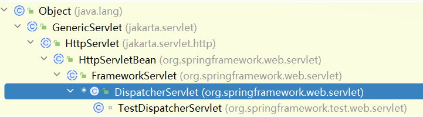

     1.   在Java的web开发中，一般需要通过继承`HttpServlet`类并重写`doGet()`和`doPost()`方法来处理请求。
     2.   `HttpServletBean`并未重写`HttpServlet`的`doGet`、`doPost`方法。
     3.   `FrameworkServlet`重写了`doGet`、`doPost`方法，并在其中调用自己的`processRequest(request, response)`方法，随后又在`processRequest`中调用`doService`，但是`FrameworkServlet`的`doService`是抽象方法。
     4.   `DispatcherServlet`重写类`doService`方法 ，随后`doService`方法又调用了`doDispatch`。
     5.   到这里基本上就可以了，SpringMVC功能分析基本上都从` org.springframework.web.servlet.DispatcherServlet.doDispatch()`方法开始。

4.   下面，具体研究一下`DispatcherServlet`类的`doDispatch`方法中获取处理器部分源码：

     1.   `doDispatch`方法中获取处理器源码如下：

          ```java
          protected void doDispatch(HttpServletRequest request, HttpServletResponse response) throws Exception {
              // ===获取匹配的处理器(通过处理器映射器)===
              mappedHandler = getHandler(processedRequest);
              if (mappedHandler == null) {
                  noHandlerFound(processedRequest, response);
                  return;
              }
          }
          ```

     2.   在`doDispatch`中通过调用同样在`DispatcherServlet`类下的`getHandler(processedRequest)`获取了处理器。

          ```java
          @Nullable
          protected HandlerExecutionChain getHandler(HttpServletRequest request) throws Exception {
              if (this.handlerMappings != null) {  //===获取所有的处理器映射(器)===
                  for (HandlerMapping mapping : this.handlerMappings) { //===遍历所有的处理器映射(器)===
                      //===尝试是否能找到处理该请求的处理器===
                      HandlerExecutionChain handler = mapping.getHandler(request); 
                      if (handler != null) {
                          return handler; //===适配的返回处理器===
                      }
                  }
              }
              return null;
          }
          ```

     3.   值得注意的是，我们通过debug查看上述代码的`handlerMappings`的值，得到如下结果:

          1.   springboot3中处理器映射含有6个：<br>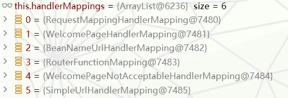
          2.   此外在`RequesMappingHandlerMApping`下的`mapperingRegistery`下的`register`中找到了这些：<br>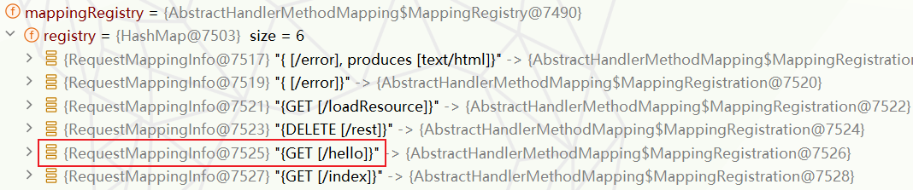

     4.   以`/hello`请求为例，我们看看`HandlerExecutionChain handler = mapping.getHandler(request)`内部如何获取处理器。其实通过上面的图片不难猜出，只有`RequesMappingHandlerMApping`中能获取处理器。我们具体看一下`mapping.getHandler`(准确来说是`RequesMappingHandlerMApping.getHandler`)的逻辑(一顿调用)。

          ```java
          public final HandlerExecutionChain getHandler(HttpServletRequest request) throws Exception {
              Object handler = getHandlerInternal(request);  //===调用getHandlerInternal===
              //===这里其实还获取拦截器列表(后面会提到)===
          }
          ```

          ```java
          protected HandlerMethod getHandlerInternal(HttpServletRequest request) throws Exception {
          		request.removeAttribute(PRODUCIBLE_MEDIA_TYPES_ATTRIBUTE);
          		try {
          			return super.getHandlerInternal(request); //===调用父类的getHandlerInternal===
          		}
          		finally {
          			ProducesRequestCondition.clearMediaTypesAttribute(request);
          		}
          	}
          ```

          ```java
          protected HandlerMethod getHandlerInternal(HttpServletRequest request) throws Exception {
              String lookupPath = initLookupPath(request);//====获取查找请求的路径===
              this.mappingRegistry.acquireReadLock();  //===上锁,防止修改===
              try {
                  HandlerMethod handlerMethod = lookupHandlerMethod(lookupPath, request);//===获取处理器方法===
                  return (handlerMethod != null ? handlerMethod.createWithResolvedBean() : null);
              }
              finally {
                  this.mappingRegistry.releaseReadLock();//===释放锁===
              }
          }
          ```

     5.   那么它的具体逻辑就来到了`lookupHandlerMethod`方法：

          ```java
          @Nullable
          protected HandlerMethod lookupHandlerMethod(String lookupPath, HttpServletRequest request) throws Exception {
              List<Match> matches = new ArrayList<>();
              //===通过lookupPath进行路径匹配查找===
              List<T> directPathMatches = this.mappingRegistry.getMappingsByDirectPath(lookupPath);
              if (directPathMatches != null) {
                  addMatchingMappings(directPathMatches, matches, request);  //===封装到matches中===
              }
              if (matches.isEmpty()) {
                  addMatchingMappings(this.mappingRegistry.getRegistrations().keySet(), matches, request);
              }
              if (!matches.isEmpty()) { 
                  //===不为空，通过一些规则获取最优bestMatch的AbstractHandlerMethodMapping对象===
                  //===通过AbstractHandlerMethodMapping对象(bestMatch)获取处理器方法并返回===。
                  return bestMatch.getHandlerMethod();
              }
              else {
                  return handleNoMatch(this.mappingRegistry.getRegistrations().keySet(), lookupPath, request);
              }
          }
          
          private void addMatchingMappings(Collection<T> mappings, List<Match> matches, HttpServletRequest request) {
              for (T mapping : mappings) {
                  T match = getMatchingMapping(mapping, request);
                  if (match != null) {
                      //===将mappings封装到matches===
                      matches.add(new Match(match, this.mappingRegistry.getRegistrations().get(mapping)));
                      //this.mappingRegistry.getRegistrations()其实就是获取mappingRegistry下的registry。
                      //===通过RequestMapperingInfo找对应的registry中的AbstractHandlerMethodMapping对象。
                  }
              }
          }
          ```

     6.   上面的`getMappingsByDirectPath`逻辑为：

          ```java
          @Nullable
          public List<T> getMappingsByDirectPath(String urlPath) {
              return this.pathLookup.get(urlPath); //===在pathLookup中找的匹配路径的RequestMapperingInfo对象===
          }
          ```

     7.   这时候就得拿出我私藏的图，大致流程如图所示，最终找的处理器方法:<br>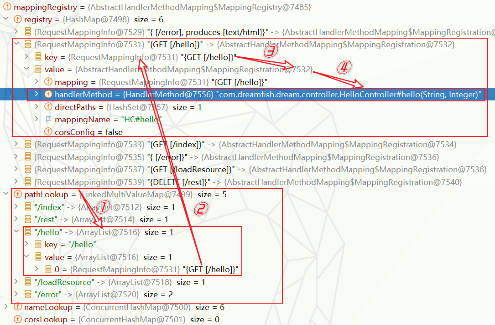

5.   通过上述过程，我们需要一些自定义的映射处理，也可以自己给容器中放自定义`HandlerMapping`。

6.   顺便说一句，`RequestMappingHandlerMapping`、`WelcomePageNotAcceptableHandlerMapping`、`WelcomePageHandlerMapping`这三个处理器映射都是配置在`WebMvcAutoConfiguration`自动配置类的`EnableWebMvcConfiguration`组件中，前面扒源码的时候提过。


#### 2-参数及基本注解

##### a-常用参数注解

1.  `@PathVariable`：路径变量，见springMvc，补充可以通过`Map<String, String>`获取所有参数。

    ```java
    @RestController
    public class OtherController {
    
        @GetMapping("/test/{msg}/{name}/{age}")
        public String test(
            @PathVariable("msg") String message,
            @PathVariable String name, //同名可以省略@PathVariable内参数
            @PathVariable Integer age,  //最好使用包装类,基本数据类型接受null会报错
            @PathVariable Map<String,String> map //接受多个参数
        ){
            System.out.println(name);
            return "test";
        }
    }
    ```

2.  `@RequestHeader`:获取请求头，可以通过`Map<String, String>`获取所有参数。

3.  `@RequestParam`：请求参数，见springmvc，补充可以通过`Map<String, String>`获取所有参数。

    ```java
    @RestController
    public class OtherController {
    
        @PostMapping("/test")
        public String test2(
            @RequestParam("user") String name, //参数与浏览器传递的参数名不一致时,使用@RequestParam注解
            Integer age,
            @RequestParam Map<String,String> map //接受多个参数
        ){
            System.out.println(name);
            return "test";
        }
    }
    ```

4.  `@CookieValue`：获取`cookie`值。可以通过

    1.  `value`：参数名称。
    2.  `required`：是否必须。
    3.  `defaultValue`：默认值。
    4.    可以通过`jakarta.servlet.http.Cookie`类型变量获取所有cookie。

    ```java
    import jakarta.servlet.http.Cookie;
    
    @RestController
    public class OtherController {
    
        @PostMapping("/test")
        public String test2(
                @CookieValue("xx") String xx, //获取指定cookie
                @CookieValue Cookie cookie //获取所有cookie
                ){
            return "test";
        }
    }
    ```

5.  `@RequestBody`：获取请求体信息,只有`post`请求才有请求体。

6.  `@ModelAttribute`：获取request域中的数据，这个注解的使用有些复杂：

    1.  使用在`controller`组件中：`@ModelAttribute`注解的方法会在`Controller`每个方法执行之前都执行，因此对于一个`Controller`中包含多个URL的时候，要谨慎使用。

        1.  使用`@ModelAttribute`注解无返回值的方法，用来在请求 Controller 方法前预先设置`Model`属性的值。

            ```java
            @Controller
            public class OtherController {
            
                @ModelAttribute  //===在所有controller方法前执行===
                public void advance(@RequestParam("name") String name,
                                    Model model){
                    model.addAttribute("name",name);
                }
            
                @GetMapping("/other")
                public String other(Model model){
                    System.out.println(model.getAttribute("name")); //===在model读取name的值===
                    return "other";
                }
            }
            ```

        2.  使用`@ModelAttribute`注解带有返回值的方法，会将返回值放到隐含的`Model`中，在`Model`中的`key`为返回值类型首字母小写，`value`为返回的值。

            ```java
            @Controller
            public class OtherController {
            
                //@ModelAttribute 不写value默认key为类型首字母小写
                @ModelAttribute("age")
                public int advance(@RequestParam("age") int age){
                    return age;//返回值会被放入model中
                }
            
                @GetMapping("/other")
                public String other(Model model){
                    System.out.println(model.getAttribute("age"));
                    // System.out.println(model.getAttribute("int"));
                    return "other";
                }
            }
            ```

    2.  `@ModelAttribute`注解的参数。Spring MVC 会根据参数类型和参数名字取出中的对应的属性,那么问题来了，它去那里找：

        1.  从URL路径变量中获取：如果您在URL的路径中定义了变量，并且控制器方法的参数中有`@PathVariable`注解的同名变量， 那么`@ModelAttribute`注解可以从URL路径中获取这些变量的值。

            ```java
            @RestController
            public class HelloController{
            
                @GetMapping("/hello/{userId}")
                public String handleRequest(@ModelAttribute("userId") String userId) {
                    return "Hello World!";
                }
            }
            ```
        
        2.  从请求参数中获取：如果URL的查询字符串或请求体中含有与模型对象属性同名的参数，@ModelAttribute能够将这些参数绑定到模型对象中,且这个参数对象会保存到`model`中(似乎不使用该注解也会放到`model`中)。(其实就是将参数封装为`pojo`)
        
            ```java
            @Controller
            public class HelloController{
            
                private record Fish(String name, Integer age){} //局部record类
            
                @GetMapping("/hello")
                @ResponseBody
                public String hello(@ModelAttribute("fish") Fish fish, Model model){  //会将fish封装到model中
                    System.out.println(model.getAttribute("fish")); //===model中获取fish对象====
                    return "Hello World!";
                }
            }
            ```
        
        3.  从`session`作用域的属性中获取，`@ModelAttribute`能从session的属性中获取对应`key`的值(后续重定向中使用)。
        
        4.  从`Model`中找。
        
            ```java
            @Controller
            public class OtherController {
            
                @ModelAttribute("mode")
                public int judge(@RequestParam("mode") Integer mode){
                    return mode;
                }
            
                @GetMapping("/other")
                @ResponseBody
                public String other(@ModelAttribute("mode") int mode){ // 从当前model中取出mode值
                    System.out.println(mode);
                    return "other";
                }
            }
            ```
        
        5.   直接创建一个新的实例：如果`@ModelAttribute`注解的参数是一个类，并且在以上描述的位置也没有找到匹配的属性，那么Spring会尝试使用默认构造函数创建一个新的实例。

    3.  当然还有其他用法，略。

7.  `@RequestAttribute`从请求域中获取数据，一般用于内部转发。

    ```java
    @RestController
    public class OtherController {
    
        @GetMapping("/judge")
        public String judge(HttpServletRequest request){
            request.setAttribute("mode",1);  //// 向请求域中添加mode属性
            return "forward:/other"; // 转发到/other
        }
    
        @GetMapping("/other")
        public String other(@RequestAttribute("mode") int mode){ // 从请求域中获取mode属性
            return "other";
        }
    }
    ```

8.  `@MatrixVariable`：矩阵变量，默认是禁用的，需要手动开启。

    1.  首先我们需要认识一下矩阵变量，如图所示(路径中使用`;`分割)：<br>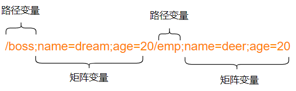

    2.    矩阵变量的多种写法(针对数组类型)：

         ```tex
         方式一(多个同名key): /fruit;name=apple;name=banana/search
         
         方式二(数组值使用,分隔): /fruit;name=apple,banana/search
         ```

    3.   但是存在一个不好的消息，那就是springboot中默认矩阵变量是不开启的：

         1.   在`WebMvcAutoConfiguration`自动配置类中存在一个`WebMvcAutoConfigurationAdapter`(都知道是啥)，其中有这样一个组件：

              ```java
              @Override
              public void configurePathMatch(PathMatchConfigurer configurer) {
                  if (this.mvcProperties.getPathmatch()
                      //===这部分眼熟不？===
                      .getMatchingStrategy() == WebMvcProperties.MatchingStrategy.ANT_PATH_MATCHER) {
                      configurer.setPathMatcher(new AntPathMatcher());
                      //======
                      this.dispatcherServletPath.ifAvailable((dispatcherPath) -> {
                          String servletUrlMapping = dispatcherPath.getServletUrlMapping();
                          if (servletUrlMapping.equals("/") && singleDispatcherServlet()) {
                              //===关键在这里===
                              UrlPathHelper urlPathHelper = new UrlPathHelper(); 
                              urlPathHelper.setAlwaysUseFullPath(true); //===获取完整的请求URL路径(多数情况没必要)===
                              configurer.setUrlPathHelper(urlPathHelper);
                              //=======
                          }
                      });
                  }
              }
              ```

         2.   这个`UrlPathHelper`是Spring MVC 中的一个类，主要用于解析和处理servlet请求的URL路径。spring MVC默认设置 `removeSemicolonContent `属性为 `true `，这表示URL中` ; `后的所有内容都将被忽略，这会导致矩阵变量无法正常获取。

              ```java
              public class UrlPathHelper {
                  
                  private boolean removeSemicolonContent = true; //===自动移除;后面内容，默认开启===
                  
                  public void setRemoveSemicolonContent(boolean removeSemicolonContent) {//===setter===
                      checkReadOnly();
                      this.removeSemicolonContent = removeSemicolonContent;
                  }
              }
              ```

    4.   好了，看完源码，我们大致知道怎么开启矩阵变量：

         1.   不就是重新向容器中添加一个我们自己的`urlPathHelper`组件，同时设置`removeSemicolonContent`为`false`即可。这样就会覆盖springboot默认的`UrlPathHelper`。

              ```java
              @Configuration
              public class MyWebMvcConfig implements WebMvcConfigurer {
              
                  @Override
                  public void configurePathMatch(PathMatchConfigurer configurer) {
                      // ===创建自定义的UrlPathHelper实例===
                      UrlPathHelper urlPathHelper = new UrlPathHelper();
                      // ===允许矩阵变量===
                      urlPathHelper.setRemoveSemicolonContent(false);
                      // ====使用自定义UrlPathHelper实例===
                      configurer.setUrlPathHelper(urlPathHelper);
                  }
              }
              ```

         2.   接下来就是通过`@MatrixVariable`获取矩阵变量。注意有不同的路径变量时，一般需要指定`pathVar`路径变量名,`value`指定矩阵变量名。此外还有两个参数：`required `是否为必填值，默认为`false`；`defaultValue `设置默认值。

            ```java
            @RestController
            @Slf4j
            public class OtherController {
                //访问路径:localhost:8080/other/boss;name=dream;age=20/emp;name=fish;age=16
                @GetMapping("/other/{boss}/{emp}")
                @ResponseBody
                public String other(
                    @MatrixVariable(value ="name",pathVar = "boss") String bossName,
                    @MatrixVariable(value="name",pathVar = "emp") String empName,
                    //有不同的路径变量时，需要指定pathVar路径变量名,value指定矩阵变量名
                    @PathVariable("boss") String boss
                    //这里的boss是路径变量，不是矩阵变量
                ){
                    log.info("bossName={},empName={},boss={}",bossName,empName,boss); //===日志输出===
                    return "other";
                }
            }
            ```
         
    


##### b-Servlet API

1.   `WebRequest`、`ServletRequest`、`MultipartRequest`、 `HttpSession`、`javax.servlet.http.PushBuilder`、`Principal`、`InputStream`、`Reader`、`HttpMethod`、`Locale`、`TimeZone`、`ZoneId`

2.   `ServletRequestMethodArgumentResolver`可以解析 以上的部分参数。

3.   并且我们通过`CTRL+N`搜索查看一下`ServletRequestMethodArgumentResolver`判断是否支持参数的处理逻辑，其实就是判断参数类型是不是这些类型：

     ```java
     @Override
     public boolean supportsParameter(MethodParameter parameter) {
         Class<?> paramType = parameter.getParameterType();
         return (WebRequest.class.isAssignableFrom(paramType) ||
                 ServletRequest.class.isAssignableFrom(paramType) ||
                 MultipartRequest.class.isAssignableFrom(paramType) ||
                 HttpSession.class.isAssignableFrom(paramType) ||
                 (pushBuilder != null && pushBuilder.isAssignableFrom(paramType)) ||
                 (Principal.class.isAssignableFrom(paramType) && !parameter.hasParameterAnnotations()) ||
                 InputStream.class.isAssignableFrom(paramType) ||
                 Reader.class.isAssignableFrom(paramType) ||
                 HttpMethod.class == paramType ||
                 Locale.class == paramType ||
                 TimeZone.class == paramType ||
                 ZoneId.class == paramType);
     }
     ```

     


##### c-复杂参数

1.   `Map`、`Model`(map、model里面的数据会被放在`request`的请求域，相当于`request.setAttribute`)、`Errors/BindingResult`、`RedirectAttributes`(重定向携带数据)、`ServletResponse`(response)、`SessionStatus`、`UriComponentsBuilder`、`ServletUriComponentsBuilder`。

2.   顺便提一下，设置浏览器cookie：

     ```java
     @RestController
     public class OtherController {
     
         @GetMapping("/other")
         @ResponseBody
         public String other(HttpServletResponse response){
             response.addCookie(new Cookie("msg","hello")); //创建cookie对象，放入响应体
             return "other";
         }
     }
     ```

3.   关于`BindingResult`类型，在使用jSR303时使用过：关于JSR303后续补充!!!

4.   关于`RedirectAttributes`用于重定向携带数据，一般正常情况下存在两种方式实现重定向传参：

     1.   URL拼接：

          ```java
          @Controller
          @Slf4j
          public class OtherController {
          
              @GetMapping("/test")
              public String test(){
                  String msg = "你好";
                  String s = URLEncoder.encode(msg, StandardCharsets.UTF_8); //设置编码为UTF-8,不然中文参数会乱码
                  return "redirect:/other"+"?"+"msg="+s; //拼接重定向url
              }
          
              @GetMapping("/other")
              @ResponseBody
              public String other(String msg){
                  log.info("msg={}",msg);
                  return "success";
              }
          }
          ```

     2.   使用`RedirectAttributes`，但是这哥们存在两个常用方法：
          1.    (不推荐)`redirectAttributes.addAttributie()`。相当于在重定向链接地址追加传递的参数，暴露参数相当不安全。

          2.    (推荐)`redirectAttributes.addFlashAttributie()`。该方法隐藏参数，链接地址上不直接暴露，但是能且只能在重定向的页面获取参数值。其原理就是放到`session`中，`session`在跳到页面后马上移除对象。如果是重定向一个controller中是获取不到该prama属性值的，除非在controller中用`@RequestPrama`注解(不过更推荐使用`@ModelAttribute`从`session`中获取数据)。

                ```java
                @Controller
                @Slf4j
                public class OtherController {
                
                    @GetMapping("/test")
                    public String test(RedirectAttributes redirectAttributes) {
                        redirectAttributes.addFlashAttribute("msg", "你好"); //===添加重定向参数===
                        //===建议使用addFlashAttribute而不是addAttribute===
                        return "redirect:/other";
                    }
                
                    @GetMapping("/other")
                    @ResponseBody
                    public String other(@ModelAttribute("msg") String msg) { //===从session中获取参数====
                        //===建议使用@ModelAttribute而不是@RequestPrama===
                        log.info("msg={}", msg);
                        return "success";
                    }
                }
                ```
          

5.   接下来的逻辑涉及到后面的处理器调用原理部分知识：<a href="#3">点击跳转</a>。<br>

6.   好了接下来，我们将通过下面的方法研究Model、Map类型的参数解析过程：<a id="front"></a>

     ```java
     @Controller
     public class HelloController {
     
         @GetMapping("/param")
         public String param(
             Map<String, Object> map, //===Map类型===
             Model model //===Model类型===
         ) {
             map.put("hello", "world");
             model.addAttribute("dream", "fish");
             return "param"; //===前往param.html===
         }
     }
     ```

7.   首先前面的部分我们直接跳过(参考下文源码解读部分即可)，直接进入参数解析器和解析参数部分。也就是在后面参数处理原理中器提到的`resolveArgument`方法。

     ```java
     @Override
     @Nullable
     public Object resolveArgument(
         MethodParameter parameter, 
         @Nullable ModelAndViewContainer mavContainer,                
         NativeWebRequest webRequest, 
         @Nullable WebDataBinderFactory binderFactory) throws Exception {
     	//===获取参数解析器===
         HandlerMethodArgumentResolver resolver = getArgumentResolver(parameter);
         
         if (resolver == null) {
             throw new IllegalArgumentException("Unsupported parameter type [" +
                                                parameter.getParameterType().getName() + 
                                                "]. supportsParameter should be called first.");
         }
         //===解析参数===
         return resolver.resolveArgument(parameter, mavContainer, webRequest, binderFactory);
     }
     ```

8.   接下来我们就需要分别探索`Model`、`Map`类型的参数解析器：

     1.   首先对于`Model`类型：

          1.   通过调试不难知道，支持解析该类型的参数解析器是`ModelMethodProcessor`。

          2.   其`supportsParameter`方法逻辑如下 ：

               ```java
               @Override
               	public boolean supportsParameter(MethodParameter parameter) {
               		return Model.class.isAssignableFrom(parameter.getParameterType());
               	}
               ```

          3.   其解析参数方法`resolveArgument`如下：

               ```java
               @Override
               @Nullable
               public Object resolveArgument(
                   MethodParameter parameter, 
                   @Nullable ModelAndViewContainer mavContainer,
                   NativeWebRequest webRequest, 
                   @Nullable WebDataBinderFactory binderFactory) throws Exception {
                   
               	// 决策 mavContainer 参数不为空，若为空会抛出 IllegalStateException
                   Assert.state(mavContainer != null, "ModelAndViewContainer is required for model exposure");
                   // ===调用mavContainer.getModel()获取参数并返回(重点)===
                   return mavContainer.getModel();
               }
               ```

     2.   其次对于`Map`类型：

          1.   通过调试不难知道，支持解析该类型的参数解析器是`MapMethodProcessor`。

          2.   其`supportsParameter`方法逻辑如下 ：

               ```java
               @Override
               public boolean supportsParameter(MethodParameter parameter) {
                   // 检查参数类型是否为 Map 或其子类型，并且参数没有任何注解
                   return (Map.class.isAssignableFrom(parameter.getParameterType()) &&
                           parameter.getParameterAnnotations().length == 0);
               }
               ```

          3.   其解析参数方法`resolveArgument`如下：

               ```java
               @Override
               @Nullable
               public Object resolveArgument(
                   MethodParameter parameter,
                   @Nullable ModelAndViewContainer mavContainer,                   
                   NativeWebRequest webRequest, 
                   @Nullable WebDataBinderFactory binderFactory) throws Exception {
               
                   // 决策 mavContainer 参数不为空，若为空会抛出 IllegalStateException
                   Assert.state(mavContainer != null, "ModelAndViewContainer is required for model exposure");
               
                   // ===调用mavContainer.getModel()获取参数并返回(重点)===
                   return mavContainer.getModel();
               }
               ```

9.   其实到这就不难看出不管是`Map`类型还是`Model`类型其最终参数都是通过`mavContainer.getModel()`获取的`BindingAwareModelMap`对象。而这个`BindingAwareModelMap`对象很有意思，它的继承关系如下,也就是说这个`BindingAwareModelMap`既属于`Model`也属于`Map`。此外请注意：注意这个`getModel`方法始终保证一件事，返回的解析完成的参数是`mavContainer`的一个属性。

     ```java
     public ModelMap getModel() {
         
         //======注意这个方法始终保证一件事:返回的解析完成的参数是mavContainer的一个属性======
         
         if (useDefaultModel()) {
             //private final ModelMap defaultModel = new BindingAwareModelMap();
             return this.defaultModel;//===存在直接返回BindingAwareModelMap===
         }
         else {
             if (this.redirectModel == null) {
                 this.redirectModel = new ModelMap(); //===不存在先创建ModelMap并设置为属性==
             }
             return this.redirectModel;//===再返回===
         }
     }
     ```

     ```tex
     BindingAwareModelMap extends ExtendedModelMap
     ExtendedModelMap extends ModelMap implements Model
     ModelMap extends LinkedHashMap<String, Object>
     LinkedHashMap<K,V>extends HashMap<K,V>implements Map<K,V>
     interface Model
     ```

10.   到这里就真像大白，`controller`参数`Model`、`Map`、`ModelMap`(springmvc提过)其实最后得到的都是同一个`BindingAwareModelMap`对象。<br>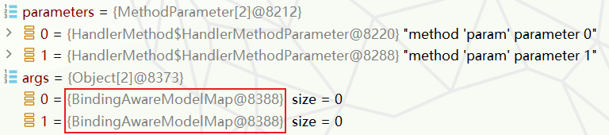

11.   但是这还没完，接下来我们回到`invokeAndHandle`方法中，在解析完参数后就会执行控制器(处理器)方法后最终会返回这里。在这个方法中通过`returnValueHandlers.handleReturnValue`方法处理返回值。

      ```java
      public void invokeAndHandle(ServletWebRequest webRequest, ModelAndViewContainer mavContainer,
                                  Object... providedArgs) throws Exception {
          //===处理请求===
          Object returnValue = invokeForRequest(webRequest, mavContainer, providedArgs);
          setResponseStatus(webRequest); //===设置响应状态===
      
          if (returnValue == null) {
              if (isRequestNotModified(webRequest) 
                  || getResponseStatus() != null 
                  || mavContainer.isRequestHandled()) {
                  disableContentCachingIfNecessary(webRequest);
                  mavContainer.setRequestHandled(true);
                  return;
              }
          }
          else if (StringUtils.hasText(getResponseStatusReason())) {
              mavContainer.setRequestHandled(true);
              return;
          }
      
          mavContainer.setRequestHandled(false);
          Assert.state(this.returnValueHandlers != null, "No return value handlers");
          try {
              //===处理返回值(重点)===
              this.returnValueHandlers.handleReturnValue(
                  returnValue, //===处理器执行的返回值===
                  getReturnValueType(returnValue),//===获取返回值类型===
                  mavContainer,//===注意这个参数===
                  webRequest);//===ServeltWebRequest===
          }
          catch (Exception ex) {
              if (logger.isTraceEnabled()) {
                  logger.trace(formatErrorForReturnValue(returnValue), ex);
              }
              throw ex;
          }
      }
      ```

12.     在研究`handleReturnValue`方法源码之前，我们先看看方法参数`mavContainer`。不知道是否还记得前面解析参数是说过参数`Model`、`Map`、`ModelMap`其实都是`mavContainer`的一个属性。那么在`Controller`方法中通过`map.put()`和
              `model.addAttribute()`等方法设置的键值对最终都会在`mavContainer`对象中。<br>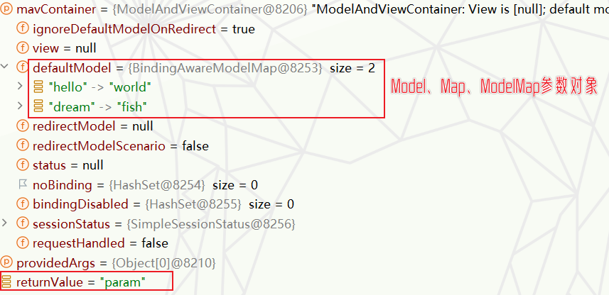

13.   前置分析已经完成，我们看看`handleReturnValue`方法对返回值进行了怎样的处理：

      ```java
      @Override
      public void handleReturnValue(
          @Nullable Object returnValue, 
          MethodParameter returnType,
          ModelAndViewContainer mavContainer, 
          NativeWebRequest webRequest) throws Exception {
          //===获取返回值处理器===
          HandlerMethodReturnValueHandler handler = selectHandler(returnValue, returnType);
          if (handler == null) {
              throw new IllegalArgumentException("Unknown return value type: " 
                                                 + returnType.getParameterType().getName());
          }
          //===处理返回值===
          handler.handleReturnValue(returnValue, returnType, mavContainer, webRequest);
      }
      ```

14.   关于获取返回值处理器的逻辑后面信息解释过就不说，我们重点看一下`handler.handleReturnValue`内容。经过这一步，`mavContainer`中就有了视图名称：

      ```java
      @Override
      public void handleReturnValue(
          @Nullable Object returnValue,
          MethodParameter returnType,   
          ModelAndViewContainer mavContainer, 
          NativeWebRequest webRequest) throws Exception {
      
          if (returnValue instanceof CharSequence) { //===是否为字符串序列===
              String viewName = returnValue.toString();//===获取视图名称===
              mavContainer.setViewName(viewName);//===将视图名称存入mavContainer===
              if (isRedirectViewName(viewName)) {//==判断是否为重定向===
                  mavContainer.setRedirectModelScenario(true);
              }
          }
          else if (returnValue != null) {
              throw new UnsupportedOperationException("Unexpected return type: " 
                                                      +returnType.getParameterType().getName()
                                                      + " in method: " + returnType.getMethod());
          }
      }
      ```

      <br>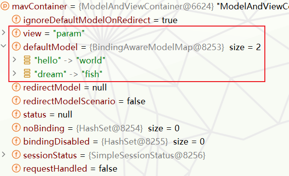

15.   接下来，就是执行完整个`invokeAndHandle`，返回到`invokeHandlerMethod`，而在这个方法中会最终执行`getModelAndView`得到并返回一个`ModelAndView`模型视图对象。

      ```java
      @Nullable
      protected ModelAndView invokeHandlerMethod(
          HttpServletRequest request,                     
          HttpServletResponse response, 
          HandlerMethod handlerMethod) throws Exception {
      
          ServletInvocableHandlerMethod invocableMethod = createInvocableHandlerMethod(handlerMethod);
          if (this.argumentResolvers != null) {
              //===设置参数解析器===
              invocableMethod.setHandlerMethodArgumentResolvers(this.argumentResolvers);
          }
          if (this.returnValueHandlers != null) {
              //===设置返回值处理器===
              invocableMethod.setHandlerMethodReturnValueHandlers(this.returnValueHandlers);
          }
          //===调用处理(重点)===
          invocableMethod.invokeAndHandle(webRequest, mavContainer);
      
          //===获取ModelAndView并返回===
          return getModelAndView(mavContainer, modelFactory, webRequest);
      }
      ```

16.     对于`getModelAndView`的逻辑：

      ```java
      @Nullable
      private ModelAndView getModelAndView(ModelAndViewContainer mavContainer,
                                           ModelFactory modelFactory, NativeWebRequest webRequest) throws Exception {
      
          // 通过modelFactory来更新ModelAndViewContainer中的模型
          modelFactory.updateModel(webRequest, mavContainer);
      
          // 判断请求是否被处理过，如果是，则返回null
          if (mavContainer.isRequestHandled()) {
              return null;
          }
      
          //========获取ModelAndViewContainer中的模型(mavContainer.defaultModel)========
          ModelMap model = mavContainer.getModel();
      
          //========将ModelAndViewContainer中获取的视图名、模型和状态封装为ModelAndView对象========
          ModelAndView mav = new ModelAndView(mavContainer.getViewName(), model, mavContainer.getStatus());
      
          // 判断视图是否是引用类型，如果不是，则从ModelAndViewContainer中获取视图并设置到ModelAndView对象中
          if (!mavContainer.isViewReference()) {
              mav.setView((View) mavContainer.getView());
          }
      
          // 如果模型是RedirectAttributes类型，将闪存属性放入OutputFlashMap
          if (model instanceof RedirectAttributes redirectAttributes) {
              Map<String, ?> flashAttributes = redirectAttributes.getFlashAttributes();//===和重定向部分不谋而合===
              HttpServletRequest request = webRequest.getNativeRequest(HttpServletRequest.class);
              if (request != null) {
                  RequestContextUtils.getOutputFlashMap(request).putAll(flashAttributes);
              }
          }
      
          //========返回构建好的ModelAndView对象========
          return mav;
      }
      ```

17.   至于后面`modelAndView`的数据如何放入请求域，参考下文源码分析的模板解析和页面渲染部分。


##### d-pojo封装

1.   我们一下面的控制器方法调试自定义类型封装的大致过程：

     ```java
     @Controller
     @Slf4j
     public class OtherController {
     
         final record User(String name,String age){} //局部record类
     
         @RequestMapping("/other")
         public String other(User user) {
             log.info(user.toString());
             return "other";
         }
     }
     ```

2.   我们就不一步步调试了，直接进入`resolveArgument`调试参数解析器即可：

     ```java
     @Override
     @Nullable
     public Object resolveArgument(
         MethodParameter parameter, 
         @Nullable ModelAndViewContainer mavContainer,                
         NativeWebRequest webRequest, 
         @Nullable WebDataBinderFactory binderFactory) throws Exception {
         //===获取参数解析器===
         HandlerMethodArgumentResolver resolver = getArgumentResolver(parameter);
     
         if (resolver == null) {
             throw new IllegalArgumentException("Unsupported parameter type [" +
                                                parameter.getParameterType().getName() + 
                                                "]. supportsParameter should be called first.");
         }
         //===解析参数===
         return resolver.resolveArgument(parameter, mavContainer, webRequest, binderFactory);
     }
     ```

3.   通过调试部分，我们很容易知道它的解析器是`ServletModelAttributeMethodProcessor`,并且其`supportsParameter`方法如下。

     ```java
     @Override
     public boolean supportsParameter(MethodParameter parameter) {
         // 检查方法参数是否有 @ModelAttribute 注解时，
         // 或者当annotationNotRequired为true且参数类型不是简单属性类型（即不是基本数据类型或其包装类、以及String类型时，
         // 返回true
         return (parameter.hasParameterAnnotation(ModelAttribute.class) ||
                 (this.annotationNotRequired && !BeanUtils.isSimpleProperty(parameter.getParameterType())));
     }
     ```

     ```java
     //BeanUtils.isSimpleProperty的判断逻辑
     public static boolean isSimpleProperty(Class<?> type) {
         //type为空则抛出 IllegalArgumentException
         Assert.notNull(type, "'type' must not be null");
     
         // 如果type是简单值类型（比如基本数据类型、包装类型、String等），
         // 或者type是一个数组且其元素是简单值类型，则返回true，表示type为简单属性类型
         return isSimpleValueType(type) || (type.isArray() && isSimpleValueType(type.getComponentType()));
     }
     
     //具体的isSimpleValueType逻辑
     public static boolean isSimpleValueType(Class<?> type) {
         return 
             Void.class != type && 
                 Void.TYPE != type &&
                 (ClassUtils.isPrimitiveOrWrapper(type)
                  || Enum.class.isAssignableFrom(type)
                  || CharSequence.class.isAssignableFrom(type) 
                  || Number.class.isAssignableFrom(type)
                  || Date.class.isAssignableFrom(type)
                  || Temporal.class.isAssignableFrom(type)
                  || URI.class == type
                  || URL.class == type 
                  || Locale.class == type 
                  || Class.class == type);
     }
     ```

4.   那么最麻烦的部分来了，就是具体的参数解析部分，休息一下，马上回来!<br>

5.   好了`ServletModelAttributeMethodProcessor`参数解析器的`resolveArgument`方法如下(这里展示的其实是它父类的)：这里需要注意的是创建的空的参数类型的javaBean最好放在了`binder`中的`target`属性中，如下图显示。并且这里留意一下`binder.bindingResult`的存在，初始时为`null`,但是当空对象`attribute`所有属性转换并设置完成后，`bindingResult`中有值(参数对象、错误)，如下图。

     ```java
     @Override
     @Nullable
     public final Object resolveArgument(
         MethodParameter parameter, @Nullable ModelAndViewContainer mavContainer,                             
         NativeWebRequest webRequest, @Nullable WebDataBinderFactory binderFactory) throws Exception {
     
         //确定mavContainer和binderFactory都不为null，否则抛出IllegalStateException
         Assert.state(mavContainer != null, "ModelAttributeMethodProcessor requires ModelAndViewContainer");
         Assert.state(binderFactory != null, "ModelAttributeMethodProcessor requires WebDataBinderFactory");
     
         //为参数获取名称
         String name = ModelFactory.getNameForParameter(parameter);
     
         //取得参数上的@ModelAttribute注解
         ModelAttribute ann = parameter.getParameterAnnotation(ModelAttribute.class);
     
         //如果该注解存在，那么就设置相应的binding属性。
         //===还记得@ModelAttribute会将参数放入Model中，这里大概率就是为了这个===
         if (ann != null) {
             mavContainer.setBinding(name, ann.binding());
         }
     
         
         Object attribute = null;//===(重点)创建空的类型对象===
         BindingResult bindingResult = null;//初始化bindingResult变量
     
         //===(重点)检查模型中是否已经包含了这个属性===
         if (mavContainer.containsAttribute(name)) {
             //===如果包含，那么直接从Model中获取===
             attribute = mavContainer.getModel().get(name);
         }
         else {
             //如果不包含，那么创建一个新的属性实例
             try {
                 //===(重点)创建参数类型的空属性实现,debug:等效于new User()===
                 attribute = createAttribute(name, parameter, binderFactory, webRequest);
             }
             catch (MethodArgumentNotValidException ex) {
                 //一些异常处理
         }
     
         //如果没有获取到绑定结果，那么创建 WebDataBinder，并进行绑定和验证
         if (bindingResult == null) {
             //====创建一个web数据绑定器(这里将空的参数对象放进去)===
             WebDataBinder binder = binderFactory.createBinder(webRequest, attribute, name);
             if (binder.getTarget() != null) {
                 if (!mavContainer.isBindingDisabled(name)) {
                     //===绑定请求参数(重点)===
                     bindRequestParameters(binder, webRequest);
                 }
                 validateIfApplicable(binder, parameter);
                 if (binder.getBindingResult().hasErrors() && isBindExceptionRequired(binder, parameter)) {
                     //===将异常放入bindingResult中===
                     throw new MethodArgumentNotValidException(parameter, binder.getBindingResult());
                 }
             }
     
             //进行类型转换，并获取绑定结果
             if (!parameter.getParameterType().isInstance(attribute)) {
                 attribute = binder.convertIfNecessary(
                     binder.getTarget(), 
                     parameter.getParameterType(), 
                     parameter);
             }
             bindingResult = binder.getBindingResult(); //获取最终的绑定结果
         }
     
         //将解析得到的属性和绑定结果添加到模型中
         Map<String, Object> bindingResultModel = bindingResult.getModel();
         mavContainer.removeAttributes(bindingResultModel); //移除重复key(为添加做准备)
         mavContainer.addAllAttributes(bindingResultModel);//向其中添加数据
     
         //返回解析得到的属性
         return attribute;
     }
     ```

     <br>

     <br>

6.   首先我们大致讲一下，这行代码首先创建了一个空的参数类型的javaBean(属性为空)，然后又创建一个web参数绑定器`WebDataBinder`。而这个web数据绑定器的作用就是将请求参数的值绑定到指定的JavaBean里面。并且`WebDataBinder`会先利用它里面的 `Converters `(在`ConversionService.cinverters`中，如图)将请求数据转成指定的数据类型，再封装到JavaBean中。<br>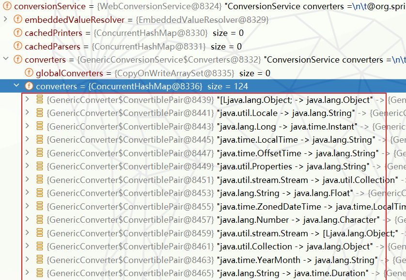

7.   那么`bindRequestParameters`究竟是如何绑定参数的，首先这个方法还只是做一些准备工作。就是获取原生的`request`对象，并且对web数据绑定器做个个转型，最终参数绑定还得落到`bind`方法中：

     ```java
     @Override
     protected void bindRequestParameters(WebDataBinder binder, NativeWebRequest request) {
         // 从NativeWebRequest中获取原始的ServletRequest对象
         ServletRequest servletRequest = request.getNativeRequest(ServletRequest.class);
         
         // 确定servletRequest不为空，否则抛出IllegalStateException
         Assert.state(servletRequest != null, "No ServletRequest");
         
         // 将WebDataBinder强制转化为ServletRequestDataBinder类型(空对象在target属性中)
         ServletRequestDataBinder servletBinder = (ServletRequestDataBinder) binder;
     
         // 使用servletBinder将servletRequest的参数绑定到目标对象上
         servletBinder.bind(servletRequest);
     }
     ```

8.   我们继续看`bind`方法：它将请求参数封装为`mpvs`。

     ```java
     public void bind(ServletRequest request) {
         // 创建一个MutablePropertyValues对象，它将从ServletRequest中获取所有请求参数(键值对)
         MutablePropertyValues mpvs = new ServletRequestParameterPropertyValues(request);
     
         // 尝试将 ServletRequest 对象转换为MultipartRequest对象
         MultipartRequest multipartRequest = WebUtils.getNativeRequest(request, MultipartRequest.class);
     	
         //其他处理
     
         // 添加额外的绑定值
         addBindValues(mpvs, request);
     
         // ===将MutablePropertyValues对象中的属性值绑定到目标对象上===
         doBind(mpvs);
     }
     ```

     <br>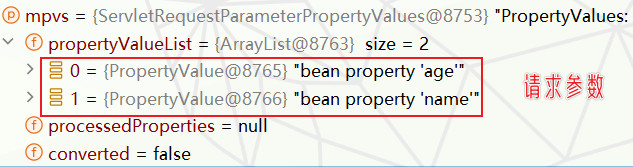

     <br>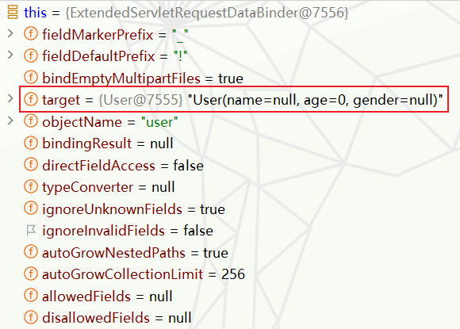

9.   `addBindValues`与我们的整体流程关系不大，但还是提一提。这个方法就是向`MutablePropertyValues` 对象 `mpvs `中保存一些url模板参数。。如果 `mpvs `中已经包含了某个URI变量，那么就会忽略这个变量。所谓url模板参数是URI的一种模板化表示，可以在 URI路径中插入一些占位符，然后再运行时将这些占位符替换为实际的值。例如可以在 `@RequestMapping `或 `@GetMapping` 等注解的路径表达式中使用大括号` {} `来定义 URI 模板变量(`@GetMapping("/users/{userId}")`)。

     ```java
     @Override
     protected void addBindValues(MutablePropertyValues mpvs, ServletRequest request) {
         //设定URI模板变量属性的名字
         String attr = HandlerMapping.URI_TEMPLATE_VARIABLES_ATTRIBUTE;
     
         //从request中获取 URI 模板变量
         @SuppressWarnings("unchecked")
         Map<String, String> uriVars = (Map<String, String>) request.getAttribute(attr);
         
         //如果URI模板变量不为null
         if (uriVars != null) {
             //对于URI模板变量中的每一个条目
             uriVars.forEach((name, value) -> {
                 //检查mpvs是否已包含这个变量名
                 if (mpvs.contains(name)) {
                     //如果包含，且处于debug模式，那么记录一条日志，说明URI变量被request的绑定值覆盖了
                     if (logger.isDebugEnabled()) {
                         logger.debug("URI variable '" + name + "' overridden by request bind value.");
                     }
                 }
                 else {
                     //如果mpvs中不包含这个变量名，那么就将这个变量名和它的值添加到mpvs中
                     mpvs.addPropertyValue(name, value);
                 }
             });
         }
     }
     ```

10.   最终属性绑定逻辑还是在`doBind`方法上面：

      ```java
      @Override
      protected void doBind(MutablePropertyValues mpvs) {
          //===对mvps进行一些处理===
          checkFieldDefaults(mpvs);
          checkFieldMarkers(mpvs);
          adaptEmptyArrayIndices(mpvs);
      
          //===使用处理后的MutablePropertyValues对象调用父类doBind的进行数据绑定===
          super.doBind(mpvs);
      }
      ```

      ```java
      //父类方法继续套娃
      protected void doBind(MutablePropertyValues mpvs) {
          checkAllowedFields(mpvs);
          checkRequiredFields(mpvs);
          applyPropertyValues(mpvs);//===将mpvs中的所有属性值应用到绑定目标对象===
      }
      ```

11.   疯狂套娃，顶不住了。在`applyPropertyValues`中调用`getPropertyAccessor().setPropertyValues`绑定属性。并捕捉异常存放在`BindingResult`中。其中`getPropertyAccessor()`是一个方法，它的目的是获取一个`property accessor`(属性访问器)实例，这个实例能够访问待绑定对象的属性。

      ```java
      protected void applyPropertyValues(MutablePropertyValues mpvs) {
          try {
              // 将 MutablePropertyValues 中的属性值应用到目标对象上
              // getPropertyAccessor方法获取到属性访问器，这是一个BeanWrapper对象，提供了设置和获取属性的方法
              // isIgnoreUnknownFields方法决定是否忽略未知字段
              // isIgnoreInvalidFields方法决定是否在非法字段导致类型转换失败时忽略异常
              getPropertyAccessor().setPropertyValues(mpvs, isIgnoreUnknownFields(), isIgnoreInvalidFields());
          }
          catch (PropertyBatchUpdateException ex) {
              // ===批量更新属性值的过程中出现异常，使用绑定错误处理器处理这些异常(BindingErrorProcessor)===
              // ===将异常转化为FieldError对象，并添加到BindingResult中===
              for (PropertyAccessException pae : ex.getPropertyAccessExceptions()) {
                  getBindingErrorProcessor().processPropertyAccessException(pae, getInternalBindingResult());
              }
          }
      }
      ```

      <br>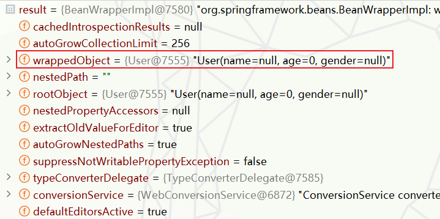

      1.   关于这里还是补充一下`getPropertyAccessor()`获取属性访问器的过程，不然不知道之前的`binder.bindingResult`的数据是怎么出现的：

           ```java
           public class DataBinder implements PropertyEditorRegistry, TypeConverter {
           	//===获取属性访问器===
               protected ConfigurablePropertyAccessor getPropertyAccessor() {
                   return getInternalBindingResult().getPropertyAccessor();
               }
           
               protected AbstractPropertyBindingResult getInternalBindingResult() {
                   if (this.bindingResult == null) {
                       //===不存在则创建,并设置为binder属性(创建的bindingResult含有beanWrapper属性)===
                       this.bindingResult = (this.directFieldAccess ?
                                             createDirectFieldBindingResult(): 
                                             createBeanPropertyBindingResult());
                   }
                   //===返回bindingResult===
                   return this.bindingResult;
               }
           }
           ```

      2.     关于`getPropertyAccessor()`其实就是直接获取`bindingResult`的`beanWrapper`属性。

           ```java
           @Override
           public final ConfigurablePropertyAccessor getPropertyAccessor() {
               if (this.beanWrapper == null) {//===false===
                   this.beanWrapper = createBeanWrapper();
                   this.beanWrapper.setExtractOldValueForEditor(true);
                   this.beanWrapper.setAutoGrowNestedPaths(this.autoGrowNestedPaths);
                   this.beanWrapper.setAutoGrowCollectionLimit(this.autoGrowCollectionLimit);
               }
               return this.beanWrapper;
           }
           ```

      3.   也就是说后面得到的`BeanWrapper`对象其实还是在`binder.bindingResult`中，也就是在`binder`中。这就知道后面的所有处理结果其实都是在`bindingResult`中进行的。

12.   继续看`setPropertyValues`：在这个方法中尝试将`pvs`中的属性设置到参数对象中。

      ```java
      public void setPropertyValues(
          PropertyValues pvs,
          boolean ignoreUnknown,
          boolean ignoreInvalid) throws BeansException {
      
          //检查传入的PropertyValues是否是MutablePropertyValues类型
          //如果是则获取其属性值列表，如果不是则将 PropertyValues 转化为 List
          if (pvs instanceof MutablePropertyValues mpvs) {
              propertyValues = mpvs.getPropertyValueList();
          } else {
              propertyValues = Arrays.asList(pvs.getPropertyValues());
          }
          try {
              // ===遍历所有的PropertyValue==
              // ===并尝试将每一个PropertyValue应用到目标对象的对应属性上===
              for (PropertyValue pv : propertyValues) {
                  try {
                      this.setPropertyValue(pv);
                  } catch (NotWritablePropertyException ex) {
                      //===异常处理逻辑(略)===
                  }
              }
          } finally {
              //===异常处理逻辑(略)===
          }
          //===异常处理逻辑(略)===
      }
      ```

13.   继续看`setPropertyValue`方法：

      ```java
      @Override
      public void setPropertyValue(PropertyValue pv) throws BeansException {
          // 尝试获取已解析的属性名称 token
          PropertyTokenHolder tokens = (PropertyTokenHolder) pv.resolvedTokens;
      
          //检查是否已解析token
          if (tokens == null) {
              String propertyName = pv.getName();//没有解析则获取属性的名称
              AbstractNestablePropertyAccessor nestedPa;//初始化属性访问器
      
              try {
                  // 尝试获取指定属性路径的属性访问器()
                  nestedPa = getPropertyAccessorForPropertyPath(propertyName);
              }
              catch (NotReadablePropertyException ex) {
                  // 如果属性不可读，则抛出属性不可写的异常
                  throw new NotWritablePropertyException(getRootClass(), this.nestedPath + propertyName,
                          "Nested property in path '" + propertyName + "' does not exist", ex);
              }
              // 获取属性名称的 token
              tokens = getPropertyNameTokens(getFinalPath(nestedPa, propertyName));
              // 如果当前属性访问器就是嵌套的属性访问器，将解析的 token 放回到 PropertyValue 中
              if (nestedPa == this) {
                  pv.getOriginalPropertyValue().resolvedTokens = tokens;
              }
              // ===通过属性访问器中设置属性值(重点)===
              nestedPa.setPropertyValue(tokens, pv);
          }
          else {
              setPropertyValue(tokens, pv);
          }
      }
      ```

      ```java
      protected void setPropertyValue(PropertyTokenHolder tokens, PropertyValue pv) throws BeansException {
      		if (tokens.keys != null) {
      			processKeyedProperty(tokens, pv);
      		}
      		else {
      			processLocalProperty(tokens, pv);//===这儿===
      		}
      	}
      ```

14.   经过上面一系列过程，最终进入下面的方法中：通过`convertForProperty`获得转换类型后的参数，最好设置到空的参数对象中。

      ```java
      private void processLocalProperty(PropertyTokenHolder tokens, PropertyValue pv) {
      
          //====转换参数(重点)===
          valueToApply = convertForProperty(
              tokens.canonicalName, 
              oldValue, originalValue, ph.toTypeDescriptor());
      
          //===最终将参数设置到空的参数对象中属性中===
          ph.setValue(valueToApply);
      
      }
      ```

      ```java
      @Nullable
      protected Object convertForProperty(
          String propertyName, @Nullable Object oldValue, @Nullable Object newValue, TypeDescriptor td)
          throws TypeMismatchException {
      	//===需要则进行参数类型装换===
          return convertIfNecessary(
              propertyName, 
              oldValue, 
              newValue, 
              td.getType(), //===获取属性类型===
              td);
      }
      ```

      ```java
      @Nullable
      private Object convertIfNecessary(@Nullable String propertyName, @Nullable Object oldValue,
                                        @Nullable Object newValue, @Nullable Class<?> requiredType, @Nullable TypeDescriptor td)
          
          //===尝试通过 typeConverterDelegate 来进行类型转换，如果转换成功则返回转换后的值===
          return this.typeConverterDelegate.convertIfNecessary(
          propertyName,
          oldValue, 
          newValue,
          requiredType,
          td);
      
      }
      ```

      <br>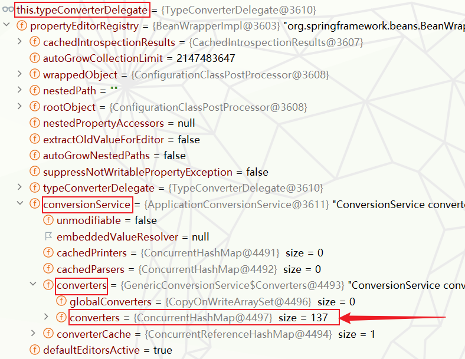

15.   最终就是进入下面`convertIfNecessary`方法获取装换器，然后转换参数。

      ```java
      @Nullable
      public <T> T convertIfNecessary(@Nullable String propertyName, @Nullable Object oldValue, @Nullable Object newValue,
                                      @Nullable Class<T> requiredType, @Nullable TypeDescriptor typeDescriptor) throws IllegalArgumentException {
      
          // Custom editor for this type?
          PropertyEditor editor = this.propertyEditorRegistry.findCustomEditor(requiredType, propertyName);
      
          ConversionFailedException conversionAttemptEx = null;
      
          //===拿到conversionService(里面有大量转换器)===
          ConversionService conversionService = this.propertyEditorRegistry.getConversionService();
          if (editor == null && conversionService != null && newValue != null && typeDescriptor != null) {
              TypeDescriptor sourceTypeDesc = TypeDescriptor.forObject(newValue);
              //===判断conversionService能否装换数据类型(里面其实还获取转换器并放入缓存中)==
              if (conversionService.canConvert(sourceTypeDesc, typeDescriptor)) {
                  try {
                      //===使用缓存中转换器转换参数===
                      return (T) conversionService.convert(newValue, sourceTypeDesc, typeDescriptor);
                  }
                  catch (ConversionFailedException ex) {
                      // fallback to default conversion logic below
                      conversionAttemptEx = ex;
                  }
              }
          }
          //====其他逻辑===
      }
      
      ```
      
      1.   关于获取装换器的逻辑，其实还是适配器模式，遍历查找(这个过程是在`canConvert`进行的)：
      
           ```java
           @Override
           public boolean canConvert(@Nullable TypeDescriptor sourceType, TypeDescriptor targetType) {
               Assert.notNull(targetType, "Target type to convert to cannot be null");
               if (sourceType == null) {
                   return true;
               }
               //===获取converter===
               GenericConverter converter = getConverter(sourceType, targetType);
               return (converter != null);
           }
           ```
      
           ```java
           @Nullable
           protected GenericConverter getConverter(TypeDescriptor sourceType, TypeDescriptor targetType) {
               ConverterCacheKey key = new ConverterCacheKey(sourceType, targetType);
               //===缓存中找,默认放了两个(string->string、string->int)===
               GenericConverter converter = this.converterCache.get(key);
               if (converter != null) {
                   return (converter != NO_MATCH ? converter : null);
               }
               //===缓存中没有,通过find变量查找(内部细节略)===
               converter = this.converters.find(sourceType, targetType);
               if (converter == null) {
                   converter = getDefaultConverter(sourceType, targetType);
               }
               if (converter != null) {
                   this.converterCache.put(key, converter); //===放入缓存===
                   return converter;
               }
           
               this.converterCache.put(key, NO_MATCH);
               return null;
           }
           ```
      
      2.   但是注意获得的`converter`并不能直接转换参数类型，但是里面的`convertertFactory`可以获取到真正执行转换的转换器。<br>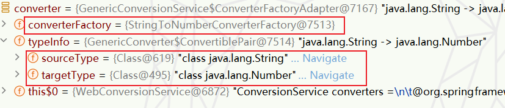
      
      3.   至于解析参数：
      
           ```java
           @Override
           	@Nullable
           	public Object convert(
                   @Nullable Object source,
                   @Nullable TypeDescriptor sourceType,
                   TypeDescriptor targetType) {
                   
           		//===获取converter(上一步canConvert已经找到、放在缓存中)===
           		GenericConverter converter = getConverter(sourceType, targetType);
           		if (converter != null) {
                       //===调用converter===
           			Object result = ConversionUtils.invokeConverter(converter, source, sourceType, targetType);
           			return handleResult(sourceType, targetType, result);
           		}
           	}
           ```
      
           ```java
           @Nullable
           public static Object invokeConverter(GenericConverter converter, @Nullable Object source,
                                                TypeDescriptor sourceType, TypeDescriptor targetType) {
           
               //===调用converter的转换方法转换参数===
               return converter.convert(source, sourceType, targetType);
           
           }
           ```
      
           ```java
           @Override
           @Nullable
           public Object convert(@Nullable Object source, TypeDescriptor sourceType, TypeDescriptor targetType) {
               if (source == null) {
                   return convertNullSource(sourceType, targetType);
               }
               //===通过converterFactory获取真正的converter并转换参数===
               return this.converterFactory.getConverter(targetType.getObjectType()).convert(source);
           }
           ```
           
           <br>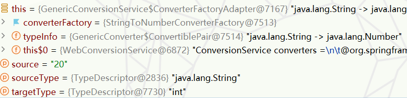
      
           ```java
           private static final class StringToNumber<T extends Number> implements Converter<String, T> {
           
               private final Class<T> targetType;
           
               public StringToNumber(Class<T> targetType) {
                   this.targetType = targetType;
               }
           
               @Override
               @Nullable
               public T convert(String source) {
                   //===source实际上就是待转换类型的请求参数===
                   if (source.isEmpty()) {
                       return null;
                   }
                   return NumberUtils.parseNumber(source, this.targetType);//===转换参数===
               }
           }
           ```
           

16.   其实这个源码最后面的`StringToNumber<T extends Number> implements Converter<String, T> `才是最重要的部分，为我们后续自定义转换器做铺垫。<br>


##### e-自定义转换器

1.   假设首先我存在这样两个类：

     ```java
     @Data
     @NoArgsConstructor
     public class User {
         private String name;
         private int age;
         private Pet pet;
     }
     ```

     ```java
     @Data
     @NoArgsConstructor
     public class Pet {
         private String name;
         private Integer age;
     }
     
     ```

2.   我需要使用该页面传输数据，需要将`(aa,bb)`解析出来。

     ```html
     <!DOCTYPE html>
     <html lang="en">
         <head>
             <meta charset="UTF-8">
             <title>index</title>
         </head>
         <body>
             <form action="http://localhost:8080/user" method="post">
                 <input type="text" name="name" value="dream">
                 <input type="text" name="age" value="20">
                 <!--    <input type="text" name="pet.name" value="小白">-->
                 <!--    <input type="text" name="pet.age" value="2">-->
                 <input type="text" name="pet" value="(小白,2)">
                 <input type="submit" value="提交">
             </form>
         </body>
     </html>
     ```

3.   使用如下`controller`接收参数：

     ```java
     @Controller
     @Slf4j
     public class OtherController {
     
         @RequestMapping("/user")
         @ResponseBody
         public String other(
             User user
         ) {
             log.info(user.toString());
             return "other";
         }
     }
     ```

4.   那么不出意外，我们需要自定义转换器，直接实现`Converter<S, T>`接口，`S`是待转换类型，`T`是转换后的类型。而`WebMvcConfigurer`接口也提供了一个`addFormatters`方法用于添加自定义的转换器和格式化器。

     ```java
     @Configuration
     public class MyConfig implements WebMvcConfigurer {
     
         //用于添加自定义的转换器和格式化器
         @Override
         public void addFormatters(FormatterRegistry registry) {
     
             WebMvcConfigurer.super.addFormatters(registry);
     		
             //===创建string->pet的转换器(这里采用匿名实现类的匿名对象)===
             registry.addConverter(new Converter<String, Pet>() {
                 @Override
                 public Pet convert(String source) {
                     //将(name,age)转换为Pet对象
                     String[] split = source.split(",");
     
                     //去除括号
                     String name = split[0].substring(1);
                     String age = split[1].substring(0, split[1].length() - 1);
     
                     //创建Pet对象
                     Pet pet = new Pet();
                     pet.setName(name);
                     pet.setAge(Integer.parseInt(age));
     
                     //返回Pet对象
                     return pet;
                 }
             });
         }
     }
     
     ```

5.   此外，若是我的请求改为如下形式，上述的自定义转换器也是起作用的：

     ```java
     @Controller
     @Slf4j
     public class OtherController {
         @RequestMapping("/pet")
         @ResponseBody
         public String other(
             Pet pet
         ) {
             log.info(pet.toString());
             return "other";
         }
     }
     ```

6.   并且通过debug，我们发现使用的参数解析器也是`ServletModelAttributeMethodProcessor`，但是在解析参数部分逻辑就有点不一样了,在`WebDataBinder binder = binderFactory.createBinder(webRequest, attribute, name)`这部分直接获得绑定好属性的对象。

     ```java
     @Override
     	@Nullable
     	public final Object resolveArgument(MethodParameter parameter, @Nullable ModelAndViewContainer mavContainer,
     			NativeWebRequest webRequest, @Nullable WebDataBinderFactory binderFactory) throws Exception {
     
     		Assert.state(mavContainer != null, "ModelAttributeMethodProcessor requires ModelAndViewContainer");
     		Assert.state(binderFactory != null, "ModelAttributeMethodProcessor requires WebDataBinderFactory");
     
     		String name = ModelFactory.getNameForParameter(parameter);
     		ModelAttribute ann = parameter.getParameterAnnotation(ModelAttribute.class);
     		if (ann != null) {
     			mavContainer.setBinding(name, ann.binding());
     		}
     
     		Object attribute = null;
     		BindingResult bindingResult = null;
     
     		if (mavContainer.containsAttribute(name)) {
     			attribute = mavContainer.getModel().get(name);
     		}
     		else {
     			try {
                     //======直接通过同名请求参数转换为controller的参数对象======
     				attribute = createAttribute(name, parameter, binderFactory, webRequest);
     			}
     			catch (MethodArgumentNotValidException ex) {
     				if (isBindExceptionRequired(parameter)) {
     					throw ex;
     				}
     				if (parameter.getParameterType() == Optional.class) {
     					attribute = Optional.empty();
     				}
     				else {
     					attribute = ex.getTarget();
     				}
     				bindingResult = ex.getBindingResult();
     			}
     		}
     
     		if (bindingResult == null) {
     			WebDataBinder binder = binderFactory.createBinder(webRequest, attribute, name);
     			if (binder.getTarget() != null) {
     				if (!mavContainer.isBindingDisabled(name)) {
                         //======继续尝试将请求参数注入到controller参数对象属性中=======
     					bindRequestParameters(binder, webRequest);
     				}
     				validateIfApplicable(binder, parameter);
     				if (binder.getBindingResult().hasErrors() && isBindExceptionRequired(binder, parameter)) {
     					throw new MethodArgumentNotValidException(parameter, binder.getBindingResult());
     				}
     			}
     			if (!parameter.getParameterType().isInstance(attribute)) {
     				attribute = binder.convertIfNecessary(
                         binder.getTarget(), parameter.getParameterType(), parameter);
     			}
     			bindingResult = binder.getBindingResult();
     		}
     
     		Map<String, Object> bindingResultModel = bindingResult.getModel();
     		mavContainer.removeAttributes(bindingResultModel);
     		mavContainer.addAllAttributes(bindingResultModel);
     
     		return attribute;
     	}
     ```

7.   我们进一步研究`createAttribute`方法，其实到这我们大致猜到了他在干啥，但是先卖个关子：重点就在这个`createAttributeFromRequestValue`尝试创建参数对象中。

     ```java
     @Override
     protected final Object createAttribute(String attributeName, MethodParameter parameter,
             WebDataBinderFactory binderFactory, NativeWebRequest request) throws Exception {
     
         // 从请求中获取指定名称(attributeName)的属性值
         String value = getRequestValueForAttribute(attributeName, request);
         
         // 如果获取的值非空
         if (value != null) {
             // ======尝试从请求中的值创建属性======
             Object attribute = createAttributeFromRequestValue(
                     value, attributeName, parameter, binderFactory, request);
             
             // 如果属性创建成功
             if (attribute != null) {
                 // 返回创建的属性
                 return attribute;
             }
         }
         // 如果获取的值为空，或属性创建失败，那么调用父类的createAttribute方法
         return super.createAttribute(attributeName, parameter, binderFactory, request);
     }
     ```

8.   看了`createAttributeFromRequestValue`方法就恍然大悟。整个过程就是从请求参数中获取同名参数，然后找转换器看看是不是能直接转为参数所需对象。

     ```java
     @Nullable
     protected Object createAttributeFromRequestValue( String sourceValue, String attributeName,
                                                      MethodParameter parameter, WebDataBinderFactory binderFactory, NativeWebRequest request)
         throws Exception {
     
         // 创建一个 DataBinder 对象，绑定当前的请求
         DataBinder binder = binderFactory.createBinder(request, null, attributeName);
     
         // 获取 DataBinder的 ConversionService 对象，该对象负责进行数据类型转换
         ConversionService conversionService = binder.getConversionService();
     
         // ConversionService 存在时，进行逻辑处理
         if (conversionService != null) {
     
             // 创建一个类型描述符用于表示 String 类型
             TypeDescriptor source = TypeDescriptor.valueOf(String.class);
     
             // 创建一个类型描述符用于表示目标类型
             TypeDescriptor target = new TypeDescriptor(parameter);
     
             // 检查是否可以从 String 类型转换为目标类型
             if (conversionService.canConvert(source, target)) {
     
                 // 转换并返回结果，这里使用的 parameter.getParameterType() 获取方法参数的类型
                 return binder.convertIfNecessary(sourceValue, parameter.getParameterType(), parameter);
             }
         }
     
         // ConversionService 不存在，或者不能从 String 类型转换为目标类型时，返回 null
         return null;
     }
     ```

9.   但是需要注意，后面还会执行`bindRequestParameters`方法还是会尝试将请求参数注入到已经获得的参数对象的属性中。

10.   此外下面的处理器方法也是可以的，个人猜测还是和上面参数解析流程差不多：拿到`@RequestParam`注解标注的参数名，然后从请求参数中获取对应参数，然后找转换器看看是不是能直接转为参数所需对象。<br>

      ```java
      @Controller
      @Slf4j
      public class OtherController {
      
          @RequestMapping("/pet")
          @ResponseBody
          public String other(
                 @RequestParam("pet") Pet cat
          ) {
               log.info(cat.toString());
              return "other";
          }
      }
      ```


>   小提一嘴，`WebMvcAutoConfiguration`自动配置类的`EnableWebMvcConfiguration`的`ConfigurableWebBindingInitializer`配置有`WebBinding`的默认初始化配置。
>
>   ```java
>   @Configuration(proxyBeanMethods = false)
>   @EnableConfigurationProperties(WebProperties.class)
>   public static class EnableWebMvcConfiguration extends DelegatingWebMvcConfiguration implements ResourceLoaderAware {
>   
>   
>       @Override
>       protected ConfigurableWebBindingInitializer getConfigurableWebBindingInitializer(
>           FormattingConversionService mvcConversionService, Validator mvcValidator) {
>           try {
>               //======关键在ConfigurableWebBindingInitializer.class这个类型的组件上====
>               return this.beanFactory.getBean(ConfigurableWebBindingInitializer.class);
>           }
>           catch (NoSuchBeanDefinitionException ex) {
>               //====这里才有数据====
>               return super.getConfigurableWebBindingInitializer(mvcConversionService, mvcValidator);
>           }
>       }
>   }
>   ```
>
>   猜测：那么我们是不是可以作妖呢？<br>


---


#### 3-JSR303校验(大补)

##### 前置说明

1.   `Result`类通常用于包装API的返回结果，并提供一种统一的响应格式，使前端处理响应时更方便。这种对象通常包含一些共同的字段，如状态码(`status`或`code`)，消息(`message`或`msg`)以及实际的数据(`data`)。

2.   通常来说，我们会在项目中构建一个 `Result`类，并且提供自定义的  `Result.build() `方法，用于构造一个特定格式的响应对象。这个特定格式的响应对象通常被称为结果对象(`Result`)。

3.    举例如下，后面JSR303校验会用到：

     ```java
     @Data
     @NoArgsConstructor
     public class Result<T> {
         private int code; // 状态码
         private String msg; // 状态信息
         private T data; // 数据
     
         public static <T> Result<T> build(int code, String msg, T data){ // 用于构建Result对象
             Result<T> result = new Result<T>();
             result.setCode(code);
             result.setMsg(msg);
             result.setData(data);
             return result;
         }
     
         public static <T> Result<T> success(T data){ // 用于构建成功的Result对象
             return build(200, "success", data);
         }
     
         public static <T> Result<T> success(){  // 用于构建成功的Result对象
             return success(null);
         }
     
         public static <T> Result<T> error(T data){  // 用于构建失败的Result对象
             return build(400, "error", data);
         }
     
         public static <T> Result<T> error(){  // 用于构建失败的Result对象
             return error(null);
         }
     }
     ```

4.   对于泛型方法，静态方法需要指明`<T>`告诉编译器这是泛型不是具体某种类型，但是非静态方法不需要：当你在类级别上声明泛型 `T`，例如 `public class Result<T>`，那么这个` T `就在整个类范围内可用，包括非静态方法和非静态字段。在这种情况下，你在非静态方法中就可以直接使用 `T`，无需再在方法级别声明。但是对于静态方法，由于静态方法不依赖于对象的实例就可以执行，所以无法访问类级别的泛型参数 `T`。如果你想在静态方法中使用泛型，就需要在方法级别声明，即 `public static <T> Result<T> build(int code, String msg, T data)`。这就是为什么在静态方法中需要 `<T>`，而在实例（非静态）方法中则不需要的原因。


##### a-规范与实现

1.   `Bean Validation`是一个Java规范，详细定义了如何在Java应用程序中进行Bean验证。这是一个标准化的程序，为Java提供了集中式的、声明式的数据验证。JSR 303(Bean Validation 1.0)、JSR 349(Bean Validation 1.1)以及 JSR 380(Bean Validation 2.0)都是这个规范的不同版本。

2.   然而，规范只是一个标准和声明，它需要一个具体的实现才能在实际应用中使用。因此，`Hibernate Validator`就是这个规范的一个具体实现。`Hibernate Validator`是`Bean Validation`规范的参考实现，也是最常用的实现。它提供了所有标准的验证注解，还额外提供了一些附加功能，例如在验证失败时返回自定义的消息模板，以及支持使用EL表达式在验证注解中做复杂的逻辑判断。

3.   总的来说，`Bean Validation`是一个规范，`Hibernate Validator`是这个规范的一个实现。两者通常结合在一起使用，`Bean Validation`定义了验证规则，`Hibernate Validator`负责执行这些规则。

4.   `Bean Validation`规定的约束注解(部分)：`jakarta.validation.constraints`包。

     | 约束注解                      |                         详细信息                         |
     | :---------------------------- | :------------------------------------------------------: |
     | `@Null`                       |                 被注释的元素必须为 null                  |
     | `@NotNull`                    |                被注释的元素必须不为 null                 |
     | `@AssertTrue`                 |                 被注释的元素必须为 true                  |
     | `@AssertFalse`                |                 被注释的元素必须为 false                 |
     | `@Min(value)`                 | 被注释的元素必须是一个数字，其值必须大于等于指定的最小值 |
     | `@Max(value)`                 | 被注释的元素必须是一个数字，其值必须小于等于指定的最大值 |
     | `@DecimalMin(value)`          | 被注释的元素必须是一个数字，其值必须大于等于指定的最小值 |
     | `@DecimalMax(value)`          | 被注释的元素必须是一个数字，其值必须小于等于指定的最大值 |
     | `@Size(max, min)`             |           被注释的元素的大小必须在指定的范围内           |
     | `@Digits (integer, fraction)` |   被注释的元素必须是一个数字，其值必须在可接受的范围内   |
     | `@Past`                       |             被注释的元素必须是一个过去的日期             |
     | `@Future`                     |             被注释的元素必须是一个将来的日期             |
     | `@Pattern(value)`             |           被注释的元素必须符合指定的正则表达式           |

5.   `Hibernate Validator`补充的注解(部分)：`org.hibernate.validator.constraints`包。

     | 约束注解    |                详细信息                |
     | :---------- | :------------------------------------: |
     | `@Email`    |     被注释的元素必须是电子邮箱地址     |
     | `@Length`   | 被注释的字符串的大小必须在指定的范围内 |
     | `@NotEmpty` |        被注释的字符串的必须非空        |
     | `@Range`    |     被注释的元素必须在合适的范围内     |


##### b-@Valid和@Validated

1.   `@Valid`是Java标准中的校验注解，不支持分组校验，它需要结合`javax.validation.constraints`包中的相关校验注解一起使用(只支持JSR-303规范的校验注解)，例如`@NotNull`、`@NotBlank`、`@Size`等。

2.   而`@Validated`是Spring提供的校验注解，对@Valid进行了二次封装。支持分组校验，可以通过`groups`参数指定校验的分组。它默认使用`Hibernate Validator`实现校验，既支持JSR-303规范的校验注解，同时也支持`Hibernate Validator`扩展的注解，例如：`@Email`、`@Pattern`等特殊校验注解。

3.   当`@Validated`没有指定任何分组或直接使用` @Valid `在验证时，那么将默认进行 Default 分组的验证。

4.   `@Validated`用在类型、方法和方法参数上。但不能用于成员属性。`@Valid`可以用在方法、构造函数、方法参数和成员属性上。

5.   `@Valid`支持嵌套校验、而`@Validated`不支持。

6.   关于嵌套这点，举例说明一下：使用`@Valid`注解，可以实现级联校验，这样你使用`@Valid`或者`@Validated`注解的时候，会对`pet`进行校验，如果`pet`中的属性也有校验注解，也会进行校验。

     ```java
     @Data
     public class User {
     
         @NotNull
         private String name;
     
         private int age;
     
         private String gender;
     
         @Valid //===级联校验===
         private Pet pet;
     }
     ```
     
     ```java
     @Data
     public class Pet {
     
         @NotNull
         private  String name;
     
         @Max(value = 10, message = "年龄不能超过10岁")
         private  int age;
     
         private String color;
     }
     ```
     
     


##### c- 简单使用

1.   springboot中需要添加场景启动器依赖：

     ```xml
     <dependency>
         <groupId>org.springframework.boot</groupId>
         <artifactId>spring-boot-starter-validation</artifactId>
     </dependency>
     ```

2.   在实体类上添加校验逻辑：

     ```java
     @Date //lombok注解
     public class User {
     
         @NotNull(message = "name不能为null")
         @Size(min = 2, max = 30, message = "至少2字符，最多30")
         private String name;
     
         @NotNull(message = "age不能为null")
         @Min(value = 18, message = "age不小于18")
         private Integer age;
     }
     ```

3.   在控制器方法中添加BindingResult类型参数接受校验错误信息：

     ```java
     @RestController
     @Slf4j
     public class UserController {
     
         @PostMapping("/users")
         public ResponseEntity<String> createUser(
             @Valid @RequestBody User user, //===z指定进行校验===
             BindingResult result //===接收校验错误信息===
         ) {
     
             if (bindingResult.hasErrors()) {
                 HashMap<String, String> map = new HashMap<>();
                 // 也可以bindingResult.getFieldErrors() error.getField()
                 bindingResult.getAllErrors().forEach(error -> {  //===遍历错误===
                     log.info("{}:{}", error.getObjectName(), error.getDefaultMessage());
                     map.put(error.getObjectName(), error.getDefaultMessage());
                 });
                 //===自定义类,规范化返回前端的结果json===
                 return Result.build( 400 , "非法参数 !" , map); 
             }
             return Result.success();
         }
     }
     ```


##### d-自定义验证器

1.   `javax.validation.ConstraintValidator` 是 JSR-303 Bean Validation 规范的一部分，用于自定义使用注解方式的 Bean 验证规则。它是一个泛型接口，需要两个参数：一个是你自定义注解，另一个是要验证的字段类型。你需要实现 `isValid()` 方法来定义你的验证逻辑。

2.   我们不妨看一下这个接口及文档：

     ```java
     //泛型A:实现处理的注解类型。泛型T:支持的目标类类型
     public interface ConstraintValidator<A extends Annotation, T> {
     
         //===初始化验证器(参数是对应的A注解泛型)===
     	default void initialize(A constraintAnnotation) {
     	}
     
     	/**
     	 *实现验证逻辑。
     	 *参数：
     	 *	value – 要验证的对象(注解标注的属性、对象等) 
     	 * context – 评估约束的上下文
     	 *返回：
     	 *	如果value未通过约束则为false 
     	 */
     	boolean isValid(T value, ConstraintValidatorContext context);
     }
     ```

3.   看一下官方的的注解`@Min`的实现源码：

     ```java
     // @Target 注解定义了 Min 注解可以应用的地方，包括：方法、属性字段、注解类型、构造器、参数以及在 Java 8 以后的类型使用声明上。
     @Target({ METHOD, FIELD, ANNOTATION_TYPE, CONSTRUCTOR, PARAMETER, TYPE_USE })
     
     // @Retention 注解定义了 Min 注解的生命周期，RUNTIME 表示在运行时保留，也就是说在程序运行时，可以通过反射获取到 
     @Retention(RUNTIME)
     
     // @Repeatable 注解表示 Min 注解可以在同一个元素上多次使用
     @Repeatable(List.class)
     
     // @Documented 注解表明这个注解应该由 javadoc 和类似的工具进行文档化
     @Documented
     
     //验证这个注解的逻辑已经被内置在Bean Validation的实现中无需指明，但是自定义需要指明使用那个类进行数据验证。
     @Constraint(validatedBy = { })
     
     public @interface Min { // 声明注解
     
     	// 默认错误消息(默认值在message.properties中，与国际化messageSource有关)
     	String message() default "{jakarta.validation.constraints.Min.message}";
     
     	// 该属性是用来支持分组校验的，表示该注解会应用在哪些分组上，默认为空，即不属于任何分组，不进行分组校验
     	Class<?>[] groups() default { };
     
     	// 负载
     	Class<? extends Payload>[] payload() default { };
     
     	// 定义最小值属性，原本对应的元素的值必须大于或等于这个值
     	long value();
     
     	// 该注解表示在同一个元素上可以有多个 Min 注解
     	@Target({ METHOD, FIELD, ANNOTATION_TYPE, CONSTRUCTOR, PARAMETER, TYPE_USE })
     	@Retention(RUNTIME)
     	@Documented
     	@interface List {
     		Min[] value(); // 定义 Min 数组
     	}
     }
     ```

     ```java
     public class MinValidatorForMonetaryAmount implements ConstraintValidator<Min, MonetaryAmount> {
         private BigDecimal minValue;
     
         public MinValidatorForMonetaryAmount() {
         }
     
         public void initialize(Min minValue) {
             this.minValue = BigDecimal.valueOf(minValue.value()); //===保存一下@Min注解的value===
         }
     
         public boolean isValid(MonetaryAmount value, ConstraintValidatorContext context) {
             if (value == null) { //===判断逻辑==
                 return true;
             } else {
                 return ((BigDecimal)value.getNumber().numberValueExact(BigDecimal.class)).compareTo(this.minValue) != -1;
             }
         }
     }
     ```

4.   那么接下来我们试着自定义一个注解:

     1.   创建一个注解叫做`@Sex`,用于判断性别是否合法：

          ```java
          import jakarta.validation.Constraint;
          import jakarta.validation.Payload;
          import java.lang.annotation.*;
          
          @Documented
          @Constraint(validatedBy = MyConstraintValidator.class)//===使用MyConstraintValidator类的isValid方法来验证===
          @Target( { ElementType.METHOD, ElementType.FIELD }) //===在方法属性中使用===
          @Retention(RetentionPolicy.RUNTIME)//===生命周期===
          public @interface Sex{
              String message() default "{MyConstraintValidator.Sex.message}";//===错误信息(也可以直接填个默认制)===
              Class<?>[] groups() default {};//===分组信息===
              Class<? extends Payload>[] payload() default {};
          }
          ```

     2.   在类路径(`classpath:`)下创建一个`messages.properties`,配置相关信息(与springboot的国际化配置有关，后面说)。当然你也可以通过springboot配置修改文件的位置：

          ```properties
          MyConstraintValidator.Sex.message=biu~biu~~参数有bug,性别只能是男或女
          ```

          ```properties
          # springboot配置文件
          # 定义资源文件，多个使用逗号分割(一般习惯放在classpath:i18n/messages.peoperties)
          spring.messages.basename=i18n/messages  
          # 使用相对路径
          ```

     3.   关于这个消息参数部分，其实还可以使用`{xxx}`(`xxx`为注解参数名称)引用注解中的值，例如`@Sex(a=?,b=?)`：

          ```properties
          jakarta.validation.constraints.Min.message=xx xxx {a} and xxx {b}
          #{a}、{b}将被替换为对应值
          ```

     4.   创建`MyConstraintValidator`实现`ConstraintValidator`接口来自定义验证器:

          ```java
          import jakarta.validation.ConstraintValidator;
          import jakarta.validation.ConstraintValidatorContext;
          
          public class MyConstraintValidator implements ConstraintValidator<Sex, String> {
          
              private String message;
          
              @Override
              public void initialize(Sex constraintAnnotation) {
                  this.message = constraintAnnotation.message(); //获取注解中的message参数(演示说明用)
              }
          
              @Override
              public boolean isValid(String value, ConstraintValidatorContext context) {
                  //你可以在这里使用 message(演示说明用)
                  if(value.equals("男") || value.equals("女")){
                      return true;
                  }
                  return false;
              }
          }
          ```

5.   测试使用部分：

     1.   创建实体类，使用自定义注解`@Sex`：

          ```java
          // 实体类
          @Data
          public class User {
              private String name;
              private int age;
              @Sex
              private String gender;
          }
          ```

     2.   在`controller`中使用`@Valid`进行参数校验：

          ```java
          // 处理器
          @RestController
          @Slf4j
          public class UserController {
          
              @PostMapping("/login")
              public Object login(@Valid User user,BindingResult bindingResult){
                  if (bindingResult.hasErrors()) { //===判断校验是否成功===
                      HashMap<String, String> map = new HashMap<>();
                      // 也可以bindingResult.getFieldErrors() error.getField()
                      bindingResult.getAllErrors().forEach(error -> {  //===遍历错误===
                          log.info("{}:{}", error.getObjectName(), error.getDefaultMessage());
                          map.put(error.getObjectName(), error.getDefaultMessage());
                      });
                      return Result.error(map);//===出现错误===
                  }
                  return Result.success();//===成功===
              }
          
          }
          ```


##### e-分组校验

1.   分组验证是Bean Validation(SR303是Java规范请求的编号，该规范定义了Java Bean Validation框架)的一个重要特性。通常来说，对一个对象的验证，可能在不同的情况下规则是不同的，比如在保存和更新操作中需要校验的字段可能就不一样。此时就可以使用分组验证的功能，为我们的验证定义分组，只有指定了分组的验证规则才会在该组验证中执行。

2.   自定义的注释也是可以实现分组的(含有`Class<?>[] groups() default {}`)。

3.   分组校验的大致步骤如下：

     1.   创建分组，就是创建空的接口类作为分组，这里要提一点，就是是否继承默认分组，若`Xxx`分组继承`Default`分组，那么使用`@Validated(Xxx.class)`注解会校验当前分组和默认分组：

          ```java
          //@Validated(AddGroup.class)会校验Default、AddGroup两个分组
          public interface AddGroup extends Default{ // 添加分组(继承默认分组)
          }
          
          public interface UpdateGroup { //更新分组
          }
          ```

     2.   在使用校验注解时，使用`group`属性指定注解校验所在的分组，多个分组可以使用数组类型：

          ```java
          @Data
          public class User {
          
              @NotNull(groups = {AddGroup.class})  //===更新时可以为空===
              private String name;
          
              private int age;
          
              @Sex(groups = {AddGroup.class, UpdateGroup.class})  //===添加和更新时都校验(自定义注解)===
              private String gender;
          
          }
          ```

     3.   使用`@Validated`注解(`@Valid`不支持分组)进行分组校验：当`@Validated`没有指定任何分组或直接使用` @Valid `在验证时，那么将默认进行 Default 分组的验证。

          ```java
          @RestController
          @Slf4j
          public class UserController {
          
              @PostMapping("/add")
              public Object login(
                  @Validated(AddGroup.class) User user,//===使用@Validated而不是@valid===
                  BindingResult bindingResult
              ){
                  if (bindingResult.hasErrors()) {
                      HashMap<String, String> map = new HashMap<>();
                      bindingResult.getAllErrors().forEach(error -> {
                          log.info("{}:{}", error.getObjectName(), error.getDefaultMessage());
                          map.put(error.getObjectName(), error.getDefaultMessage());
                      });
                      return Result.error(map);
                  }
                  return Result.success();
              }
          
              @PostMapping("/update")
              public Object update(
                  @Validated((UpdateGroup.class)) User user, //===使用@Validated而不是@valid===
                  BindingResult bindingResult
              ){
                  if (bindingResult.hasErrors()) {
                      HashMap<String, String> map = new HashMap<>();
                      bindingResult.getAllErrors().forEach(error -> {
                          log.info("{}:{}", error.getObjectName(), error.getDefaultMessage());
                          map.put(error.getObjectName(), error.getDefaultMessage());
                      });
                      return Result.error(map);
                  }
                  return Result.success();
              }
          }
          ```

          


##### f-spring自带的校验

1.   `org.springframework.validation.Validator `接口是 Spring 框架的一部分，用于在 Spring MVC 控制器中实现验证逻辑。该接口需要实现 `supports()` 和` validate()` 两个方法。

     ```java
     package org.springframework.validation;
     
     public interface Validator {
     
     	//是否支持校验对应类型
     	boolean supports(Class<?> clazz);
     
     	//校验逻辑
         //target是目标对象，errors是错误对象
     	void validate(Object target, Errors errors);
     
     }
     ```

2.   使用spring的校验功能，我们需要实现`Validator`接口，实现对应方法逻辑：

     ```java
     public class MyValidator implements Validator {
     
         //指定自定义的Validator能够处理哪些类
         @Override
         public boolean supports(Class<?> clazz) { // 判断是否支持校验
             return User.class.equals(clazz);
         }
     
         //进行实际的校验(自定义丰富的校验逻辑)
         @Override
         public void validate(Object target, Errors errors) {
             if (target instanceof User user) {
                 String gender = user.getGender();
                 if (!("男".equals(gender) || "女".equals(gender))) {
                     errors.rejectValue("gender", "MyValidator.gender.error.message","名字长度不能小于2");
                     //field：字段的名称，这必须是目标对象中的属性名。
                     //errorCode：错误代码，通常我们会在消息资源文件中定义一个同名的消息(没有用)。
                     //defaultMessage：当找不到错误代码对应的消息时，使用的默认消息。
                 }
             }
         }
     }
     ```

2.   对于springboot3.1.2，上述代码`errorCode`无法获取消息文件中的错误详细(不知道是不是个人原因)。我在`StackOverflow`找到对应方式，手动解析。

3.   在类路径(`classpath:`)下创建一个`messages.properties`,配置相关信息(与springboot的国际化配置有关，后面说)。当然你也可以通过springboot配置修改文件的位置：

     ```properties
     MyValidator.gender.error=biu~biu~~参数有bug,性别只能是男或女
     ```

     ```properties
     # springboot配置文件
     # 定义资源文件，多个使用逗号分割(一般习惯放在classpath:i18n/messages.peoperties)
     spring.messages.basename=i18n/messages  
     # 使用相对路径
     ```

4.   然后就是在`Controller`中执行验证逻辑，这里有很多方式：

     1.   全局校验器：`WebMvcConfigurer`接口中有一个`default Validator getValidator()`设置校验器。

          ```java
          @Configuration
          public class MyConfig implements WebMvcConfigurer {
          
              @Override
              public Validator getValidator() {
                  return new MyValidator(); //添加自定义的校验器(全局)
              }
          }
          ```

     2.   `@InitBinder`用于在`@Controller`中标注于方法，表示为当前控制器注册一个属性编辑器或者其他，只对当前的`Controller`有效。我们可以通过这个注解为当前`Controller`注册一个数据校验器。

          ```java
          @Controller
          @Slf4j
          public class OtherController {
          
              @InitBinder
              public void initBinder(WebDataBinder binder) {
                  binder.setValidator(new MyValidator()); // 设置自定义的校验器,仅对当前Controller有效
              }
          
          }
          ```

     3.   其实还可以手动进行校验，而不是使用注解，但是略。

     4.   接下来就是使用`@Valid`或者`@Validated`注解进行参数校验：

          ```java
          @Configuration
          public class MyConfig implements WebMvcConfigurer {
              @Bean
              public ResourceBundleMessageSource messageSource () {
                  //ResourceBundleMessageSource 是MessageSource接口的一个实现类，它可以从类路径下的资源文件中加载文本
                  ResourceBundleMessageSource source = new ResourceBundleMessageSource();
                  source.setBasename("messages");
                  return source;
              }
          }
          ```

          ```java
          @Controller
          public class HelloController {
              @Autowired
              private MessageSource messageSource;
          
              @InitBinder
              public void initBinder(WebDataBinder binder) {
                  binder.addValidators(new MyValidator());
              }
          
              @RequestMapping("/hello")
              @ResponseBody
              public Object hello(
                  @Validated User user,
                  BindingResult bindingResult
              ) {
                  if (bindingResult.hasErrors()) {
                      HashMap<String, String> map = new HashMap<>();
                      bindingResult.getFieldErrors().forEach(fieldError -> {
                          //md,手动解析
                          map.put(fieldError.getField(), messageSource.getMessage(fieldError, null));
                      });
                      return Result.error(map);
                  }
          
                  return Result.success();
              }
          }
          
          ```

5.   关于上面手动解析，`ResourceBundleMessageSource->AbstractResourceBasedMessageSource->AbstractMessageSource`:

     1.   在`AbstractMessageSource`有`getMessage`方法如下：

          ```java
          @Override
          public final String getMessage(MessageSourceResolvable resolvable, Locale locale) throws NoSuchMessageException {
              String[] codes = resolvable.getCodes(); //获取codes
              if (codes != null) {
                  for (String code : codes) { // 遍历codes
                      String message = getMessageInternal(code, resolvable.getArguments(), locale); //获取消息
                      if (message != null) {
                          return message; //===有则返回===
                      }
                  }
              }
              String defaultMessage = getDefaultMessage(resolvable, locale); //===无,使用默认值===
              if (defaultMessage != null) {
                  return defaultMessage;
              }
              throw new NoSuchMessageException(!ObjectUtils.isEmpty(codes) ? codes[codes.length - 1] : "", locale);
          }
          ```

     2.    而在` errors.rejectValue()`底层实际上获取了一个`DefaultMessageCodesResolver`类型，执行了`resolveMessageCodes`方法：

          ```java
          @Override
          public String[] resolveMessageCodes(String errorCode, @Nullable String field) {
              return getMessageCodesResolver().resolveMessageCodes(
                  errorCode, getObjectName(), fixedField(field), getFieldType(field));
          }
          ```

     3.   而在`resolveMessageCodes`中就是拼接你给的参数，得到一个`codeList`:

          ```java
          @Override
          public String[] resolveMessageCodes(
              String errorCode, 
              String objectName, 
              String field, 
              @Nullable Class<?> fieldType) {
              Set<String> codeList = new LinkedHashSet<>();
              List<String> fieldList = new ArrayList<>();
              buildFieldList(field, fieldList);
              //codeList中添加errorCode+对象名+属性列表
              addCodes(codeList, errorCode, objectName, fieldList);
              int dotIndex = field.lastIndexOf('.');
              if (dotIndex != -1) {
                  buildFieldList(field.substring(dotIndex + 1), fieldList);
              }
              //codeList中添加errorCode+属性类型名称
              addCodes(codeList, errorCode, null, fieldList);
              if (fieldType != null) {
                  addCode(codeList, errorCode, null, fieldType.getName());
              }
              // codeList中添加errorCode
              addCode(codeList, errorCode, null, null);
              return StringUtils.toStringArray(codeList);
          }
          ```

     4.   而这个`codeList`最后改名为`codes`放在一个`FieldError`中。<br>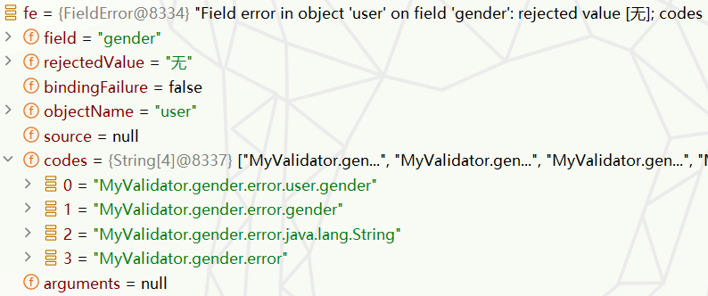

     5.   而这个`FileError`类型对象会放到`errors`中，最后到`bindingResult`参数中。并且`FieldError`恰好是一个`MessageSourceResolvable`。

          ```tex
          FieldError extends ObjectError
          ObjectError extends DefaultMessageSourceResolvable
          ```

     6.   综上种种，我tm怀疑`errors.rejectValue()`内部根本就没解析消息文件，所以才一直获取不到。因为debug发现除了我手动解析调用了`getMessage`,`errors.rejectValue()`这个底层好像不过这个方法。

6.   关于`WebDataBinder`是Spring MVC框架的核心组件，主要负责处理请求参数与目标对象属性之间的绑定和验证。下面是一些WebDataBinder的主要职责和功能：

     1.   请求参数绑定：`WebDataBinder`从请求中获取String类型的参数，然后使用适当的`PropertyEditor`或`Converter`将这些参数转换/绑定为适当的类型，然后设置到目标对象的属性上。
     2.   数据验证：在绑定过程完成之后，`WebDataBinder`可以使用一个或多个`Spring Validator`实例来对结果对象进行验证，从而确认请求参数符合预期的规则。
     3.   字段格式化：`WebDataBinder`还可以使用Spring的`FormattingConversionService`来格式化特定类型的字段，例如日期和时间。
     4.   处理绑定和验证错误：如果在绑定或验证过程中有任何问题或错误（如类型转换错误，缺少必须的请求参数，验证错误等），`WebDataBinder`将这些错误收集到`BindingResult`对象中，控制器方法可以检查这个BindingResult对象来查看是否有错误发生。
     5.   注册自定义编辑器：提供`registerCustomEditor()`方法，可以注册自定义的`PropertyEditor`实例，用于特殊情况的类型转换和格式化。

7.   在Spring MVC控制器中，你可以通过定义一个带有`@InitBinder`注解的方法，来修改和自定义`WebDataBinder`的配置和行为。但是`@InitBinder`注解设置的`WebDataBinder`配置只会应用于其所在的控制器，不会影响到其他的控制器。这样就能为每个控制器提供独立且具有灵活性的数据绑定和验证行为。如果你希望共享某个通用的数据绑定行为，可以使用基类控制器(Base Controller)，并在此基类控制器中定义`@InitBinder`方法，然后让所有其他的控制器继承这个基类控制器。<br>

----


#### 4-处理器调用原理(第二步)

<a id="3"></a>

```java
//===将以这串代码进行debug测试===
//===idea的书签功能真好用,嘿嘿===
@Controller
public class HelloController{

    @GetMapping("/hello")
    @ResponseBody
    public String hello(
            @RequestParam("name") String name,
            HttpServletRequest request
    ){
        return "Hello World!";
    }
    
}
```

##### a-处理器调用流程(1)

1.   获取处理器部分源码前面已经看过了，这里就直接跳过！

2.   以上述请求为例，我们分析一下处理器调用原理。首先回到`DispatcherServlet`类的`doDispatch`方法中：

     ```java
     protected void doDispatch(HttpServletRequest request, HttpServletResponse response) throws Exception {
         //===通过处理器映射获取匹配的处理器===
         mappedHandler = getHandler(processedRequest);
         //===获取处理器适配器====
         HandlerAdapter ha = getHandlerAdapter(mappedHandler.getHandler());
         //===通过处理器适配器执行处理器方法(重点部分)===
         mv = ha.handle(processedRequest, response, mappedHandler.getHandler());
         //===处理派发结果===
         processDispatchResult(processedRequest, response, mappedHandler, mv, dispatchException);
     }
     ```

3.   首先我们先研究一下`mappedHandler.getHandler()`到底会得到什么：一个`HanderMethod`对象。<br>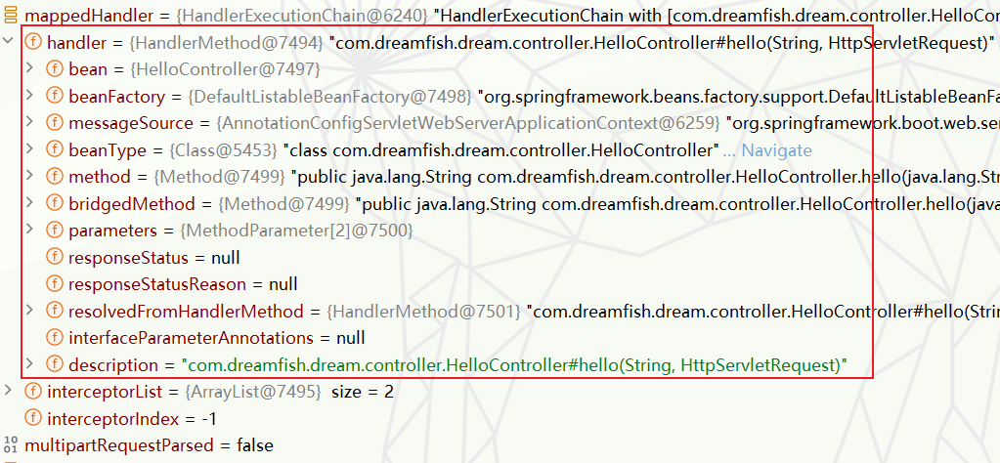

4.   然后就是`getHandlerAdapter`获取处理器适配器的逻辑(遍历、判断)：

     ```java
     protected HandlerAdapter getHandlerAdapter(Object handler) throws ServletException {
         if (this.handlerAdapters != null) {
             for (HandlerAdapter adapter : this.handlerAdapters) {  //===遍历所有的处理器适配器===
                 if (adapter.supports(handler)) { //===查看是否支持执行当前的处理器===
                     return adapter;//===返回处理器适配器===
                 }
             }
         }
         throw new ServletException("No adapter for handler [" + 
                                    handler +
                                    "]: The DispatcherServlet configuration needs to include a HandlerAdapter that supports this handler");
     }
     ```

     <br>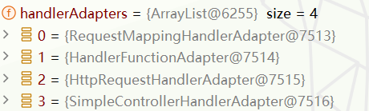

5.   下面我们大致看一下`RequestMappingHandlerAdapter`判断是否支持处理给定处理器的大致逻辑：

     ```java
     @Override
     public final boolean supports(Object handler) {
         //===判断是否是HandlerMethod实例，并转型进一步调用RequestMappingHandlerAdapter的supportsInternal判断===
         return (handler instanceof HandlerMethod handlerMethod && supportsInternal(handlerMethod));
     }
     ```

6.   通过`HandlerAdapter ha = getHandlerAdapter(mappedHandler.getHandler())`获取处理器适配器后，就是要通过`mv = ha.handle(processedRequest, response, mappedHandler.getHandler())`去执行处理器方法了。

     ```java
     @Override
     @Nullable
     public final ModelAndView handle(
         HttpServletRequest request,
         HttpServletResponse response, 
         Object handler) //===mappedHandler.getHandler()===获得的HanderMethod对象
         throws Exception {
         
         return handleInternal(request, response, (HandlerMethod) handler); //===调用内部处理方法===
     }
     ```

7.   进一步深入处理器适配器的`handleInternal`方法：

     ```java
     @Override
     protected ModelAndView handleInternal(
         HttpServletRequest request,
         HttpServletResponse response,
         HandlerMethod handlerMethod) throws Exception {
     
         ModelAndView mav; //===准备一个ModelAndView===
         checkRequest(request);
     
         if (this.synchronizeOnSession) {
             HttpSession session = request.getSession(false);
             if (session != null) {
                 Object mutex = WebUtils.getSessionMutex(session);
                 synchronized (mutex) {
                     mav = invokeHandlerMethod(request, response, handlerMethod);
                 }
             }
             else {
                 mav = invokeHandlerMethod(request, response, handlerMethod);
             }
         }
         else {
             //===重点:调用处理器方法,返回ModelAndView===
             mav = invokeHandlerMethod(request, response, handlerMethod);
         }
     
         if (!response.containsHeader(HEADER_CACHE_CONTROL)) {
             if (getSessionAttributesHandler(handlerMethod).hasSessionAttributes()) {
                 applyCacheSeconds(response, this.cacheSecondsForSessionAttributeHandlers);
             }
             else {
                 prepareResponse(response);
             }
         }
     
         return mav; //===返回ModelAndView===
     }
     ```

8.   继续往下，处理器适配器的`invokeHandlerMethod`方法(部分源码)。这个方法中将适配器方法、所有参数解析器、所有返回值处理器封装到一起，为后面执行处理器方法做准备。：

     ```java
     @Nullable
     protected ModelAndView invokeHandlerMethod(
         HttpServletRequest request,                     
         HttpServletResponse response, 
         HandlerMethod handlerMethod) throws Exception {
     
         ServletInvocableHandlerMethod invocableMethod = createInvocableHandlerMethod(handlerMethod);
         if (this.argumentResolvers != null) {
             //===设置参数解析器===
             invocableMethod.setHandlerMethodArgumentResolvers(this.argumentResolvers);
         }
         if (this.returnValueHandlers != null) {
             //===设置返回值处理器===
             invocableMethod.setHandlerMethodReturnValueHandlers(this.returnValueHandlers);
         }
         //===调用处理(重点)===
         invocableMethod.invokeAndHandle(webRequest, mavContainer);
     
         //===获取ModelAndView并返回===
         return getModelAndView(mavContainer, modelFactory, webRequest);
     }
     ```

     1.   我们不妨看一下参数解析器的格式、数量：<br>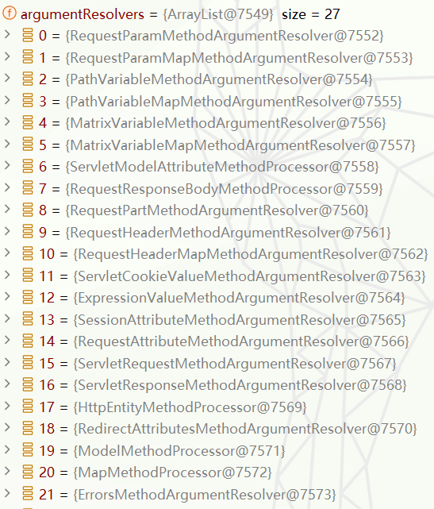

     2.   通过`CTRL+N`查找我们大致知道这些参数解析器继承`HandlerMethodArgumentResolverComposite`，而 `HandlerMethodArgumentResolverComposite`继承`HandlerMethodArgumentResolver`接口：

          ```java
          public interface HandlerMethodArgumentResolver {
          
              //===判断是否支持===
              boolean supportsParameter(MethodParameter parameter);
          
              //===解析参数===
              @Nullable
              Object resolveArgument(MethodParameter parameter, 
                                     @Nullable ModelAndViewContainer mavContainer,
                                     NativeWebRequest webRequest, 
                                     @Nullable WebDataBinderFactory binderFactory) throws Exception;
          
          }
          
          ```

     3.   接下来，同理，看一下返回值处理器的格式、数量：<br>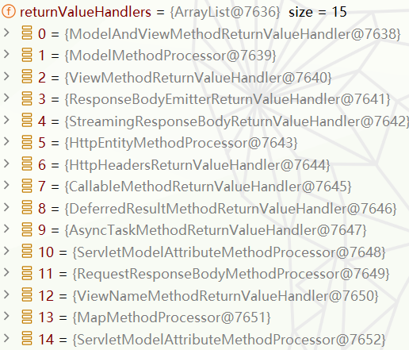

     4.   同理`CTRL+N`查找我们大致知道这些返回值处理器继承`HandlerMethodReturnValueHandler`：

          ```java
          public interface HandlerMethodReturnValueHandler {
          
              //===判断是否支持===
              boolean supportsReturnType(MethodParameter returnType);
          
              //===处理返回值===
              void handleReturnValue(@Nullable Object returnValue, 
                                     MethodParameter returnType,
                                     ModelAndViewContainer mavContainer,
                                     NativeWebRequest webRequest) throws Exception;
          }
          ```

9.   言归正传，我们继续研究`invokeAndHandle`具体逻辑。返回值部分逻辑我们先不管，我们关注`invokeForRequest`方法，见名知意处理请求的嘛：

     ```java
     public void invokeAndHandle(ServletWebRequest webRequest, ModelAndViewContainer mavContainer,
                                 Object... providedArgs) throws Exception {
     	//===处理请求===
         Object returnValue = invokeForRequest(webRequest, mavContainer, providedArgs);
         setResponseStatus(webRequest);
     
         if (returnValue == null) {
             if (isRequestNotModified(webRequest) 
                 || getResponseStatus() != null 
                 || mavContainer.isRequestHandled()) {
                 disableContentCachingIfNecessary(webRequest);
                 mavContainer.setRequestHandled(true);
                 return;
             }
         }
         else if (StringUtils.hasText(getResponseStatusReason())) {
             mavContainer.setRequestHandled(true);
             return;
         }
     
         mavContainer.setRequestHandled(false);
         Assert.state(this.returnValueHandlers != null, "No return value handlers");
         try {
             //===处理返回值===
             this.returnValueHandlers.handleReturnValue(
                 returnValue, 
                 getReturnValueType(returnValue),//===获取返回值类型===
                 mavContainer, webRequest);
         }
         catch (Exception ex) {
             if (logger.isTraceEnabled()) {
                 logger.trace(formatErrorForReturnValue(returnValue), ex);
             }
             throw ex;
         }
     }
     ```

10.   继续深入研究`invokeForRequest`方法，里面大致就是解析参数，然后通过`doInvoke`采用反射机制调用吃力气方法：

      ```java
      @Nullable
      public Object invokeForRequest(NativeWebRequest request, @Nullable ModelAndViewContainer mavContainer,
                                     Object... providedArgs) throws Exception {
      	//===解析参数，获取参数值(解析过程后面)===
          Object[] args = getMethodArgumentValues(request, mavContainer, providedArgs);
          if (logger.isTraceEnabled()) {
              logger.trace("Arguments: " + Arrays.toString(args));//===日志===
          }
          //===通过反射执行处理器方法===
          return doInvoke(args);
      }
      ```


##### b-参数解析原理(2)

1.   前面我们在处理器调用流程提到过在`invokeForRequest`方法中通过`getMethodArgumentValues`去解析参数：它干了这几件事，获取参数信息对象数组，逐个根据参数信息解析参数。

     ```java
     protected Object[] getMethodArgumentValues(NativeWebRequest request, @Nullable ModelAndViewContainer mavContainer,
                                                Object... providedArgs) throws Exception {
     
         MethodParameter[] parameters = getMethodParameters(); //===获取包含参数信息的MethodParameter对象数组===
         if (ObjectUtils.isEmpty(parameters)) {
             return EMPTY_ARGS;
         }
     
         Object[] args = new Object[parameters.length];//===创建等长数组记录参数===
         for (int i = 0; i < parameters.length; i++) {
             MethodParameter parameter = parameters[i];
             parameter.initParameterNameDiscovery(this.parameterNameDiscoverer);
             args[i] = findProvidedArgument(parameter, providedArgs);
             if (args[i] != null) {
                 continue;
             }
             if (!this.resolvers.supportsParameter(parameter)) {
                 throw new IllegalStateException(formatArgumentError(parameter, "No suitable resolver"));
             }
             try {
                 args[i] = this.resolvers.resolveArgument(  //===逐个的去解析参数(重点)===
                     parameter, 
                     mavContainer,
                     request,
                     this.dataBinderFactory);
             }
             catch (Exception ex) {
                 // Leave stack trace for later, exception may actually be resolved and handled...
                 if (logger.isDebugEnabled()) {
                     String exMsg = ex.getMessage();
                     if (exMsg != null && !exMsg.contains(parameter.getExecutable().toGenericString())) {
                         logger.debug(formatArgumentError(parameter, exMsg));
                     }
                 }
                 throw ex;
             }
         }
         return args;//===返回解析完成的参数===
     }
     ```

2.   我们顺便看看`getMethodParameters()`获得的`parameters` 是怎么样的：<br>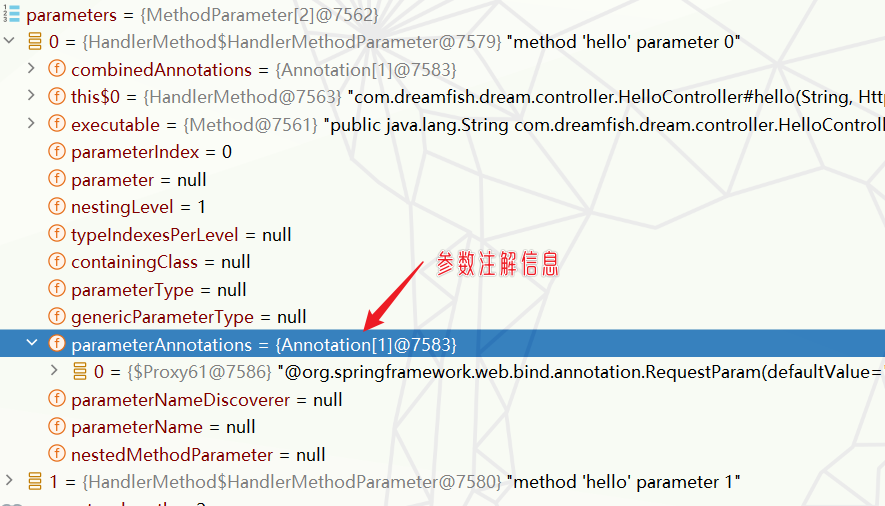

3.   接下来重点来到了，`resolvers.resolveArgument`方法里面干了两件重要的事，获取参数解析器和解析参数:

     ```java
     @Override
     @Nullable
     public Object resolveArgument(
         MethodParameter parameter, 
         @Nullable ModelAndViewContainer mavContainer,                
         NativeWebRequest webRequest, 
         @Nullable WebDataBinderFactory binderFactory) throws Exception {
     	//===获取参数解析器===
         HandlerMethodArgumentResolver resolver = getArgumentResolver(parameter);
         
         if (resolver == null) {
             throw new IllegalArgumentException("Unsupported parameter type [" +
                                                parameter.getParameterType().getName() + 
                                                "]. supportsParameter should be called first.");
         }
         //===解析参数===
         return resolver.resolveArgument(parameter, mavContainer, webRequest, binderFactory);
     }
     ```

4.   我们先看看他是如何获取参数解析器，其实步骤基本类似，遍历逐个判断：

     1.   我们看一下`HandlerMethodArgumentResolver`逻辑和我们想法差不多。但是它还干了一件事找的参数解析器后直接放入缓存，对于同名处理器的同一个参数，它使用的参数解析器也是同一个，下次可以直接从缓存中获取(响应变快)。：

          ```java
          @Nullable
          private HandlerMethodArgumentResolver getArgumentResolver(MethodParameter parameter) {
              //===从缓存中获取===
              HandlerMethodArgumentResolver result = this.argumentResolverCache.get(parameter);
              if (result == null) {
                  //==遍历所有参数解析器===
                  for (HandlerMethodArgumentResolver resolver : this.argumentResolvers) {  
                      //===判断是否支持解析该参数===
                      if (resolver.supportsParameter(parameter)) {
                          result = resolver;
                          this.argumentResolverCache.put(parameter, result);//===放入缓存中===
                          break;
                      }
                  }
              }
              return result;
          }
          ```

     2.   我们简单看一下，它的判断是否支持解析当前参数的逻辑。以`RequestParamMethodArgumentResolver.supportsParameter`为例，大致就是判断一下参数类型(map等特殊类型)、注解是不是满足要求一系列逻辑。这里我猜测`Model`参数对应的参数对应解析器的判断逻辑可能就是看一下是不是`Model`类型：

          ```java
          @Override
          public boolean supportsParameter(MethodParameter parameter) {
              // 包含@RequestParam注解的参数
              if (parameter.hasParameterAnnotation(RequestParam.class)) {
                  // 参数类型为Map或包装类型Optional<Map>
                  if (Map.class.isAssignableFrom(parameter.nestedIfOptional().getNestedParameterType())) {
                      RequestParam requestParam = parameter.getParameterAnnotation(RequestParam.class);
                      // 如果@RequestParam注解的name属性有指定值，返回true
                      return (requestParam != null && StringUtils.hasText(requestParam.name()));
                  }
                  else {
                      // 如果参数不是Map类型，直接返回true，表示支持该参数
                      return true;
                  }
              }
              else {
                  // 包含@RequestPart注解的参数，直接返回false，不支持
                  if (parameter.hasParameterAnnotation(RequestPart.class)) {
                      return false;
                  }
                  parameter = parameter.nestedIfOptional();
                  // Multipart类型参数，返回true，表示支持
                  if (MultipartResolutionDelegate.isMultipartArgument(parameter)) {
                      return true;
                  }
                  else if (this.useDefaultResolution) {
                      // 根据参数类型是不是简单属性来决定是否支持，默认的解析策略
                      return BeanUtils.isSimpleProperty(parameter.getNestedParameterType());
                  }
                  else {
                      // 其他情况，返回false，不支持
                      return false;
                  }
              }
          }
          ```

5.   获取完解析器，就要开始解析参数`resolveArgument`,截取了部分源码，大致过程就是获取参数命名信息、获取参数名、解析参数、执行默认值操作。至于`resolveName()`中如何具体解析参数，大概率是从原生的`request`请求参数(或者请求头、cookie)中获取值，或者说从`urlPathHelper`解析出来的路径中的参数中获取，就不继续深究。：

     ```java
     @Override
     @Nullable
     public final Object resolveArgument(MethodParameter parameter, 
                                         @Nullable ModelAndViewContainer mavContainer,
                                         NativeWebRequest webRequest, 
                                         @Nullable WebDataBinderFactory binderFactory) throws Exception {
     
         // 获取参数的命名值信息（名称、是否必需、默认值）
         NamedValueInfo namedValueInfo = getNamedValueInfo(parameter);
     
         // ===解析参数名称中的嵌入式值和表达式(参数名称)===
         Object resolvedName = resolveEmbeddedValuesAndExpressions(namedValueInfo.name);
     
         // ===根据解析后的名称、嵌套参数、web请求解析参数值(参数值)===
         Object arg = resolveName(resolvedName.toString(), nestedParameter, webRequest);
         if (arg == null) {
             // 如果解析后的参数值为null，则检查是否有默认值
             if (namedValueInfo.defaultValue != null) {
                 arg = resolveEmbeddedValuesAndExpressions(namedValueInfo.defaultValue);
             } else if (namedValueInfo.required && !nestedParameter.isOptional()) {
                 // 如果没有默认值且该参数是必需的，则处理缺失的值
                 handleMissingValue(namedValueInfo.name, nestedParameter, webRequest);
             }
             // 处理null值情况
             arg = handleNullValue(namedValueInfo.name, arg, nestedParameter.getNestedParameterType());
         }
         // 如果参数值为空字符串且有默认值，使用默认值
         else if ("".equals(arg) && namedValueInfo.defaultValue != null) {
             arg = resolveEmbeddedValuesAndExpressions(namedValueInfo.defaultValue);
         }
         
         // 返回解析后的参数值
         return arg;
     }
     ```

     


##### c-返回值处理原理(3)

1.   关于返回值处理器，我们接下来使用下面的处理器方法进行`debug`。并且我们直接将断点打在处理器方法中：

     ```java
     @Controller
     public class HelloController {
     
         @RequestMapping("/hello")
         @ResponseBody
         public User hello() {
             User user = new User();
             user.setName("Dream fish");
             user.setAge(18);
             return user;
         }
     }
     ```

2.   前面已经提到过在`invokeHandlerMethod`方法中设置了返回值处理器，到这里我们再次回顾一下：

     ```java
     @Nullable
     protected ModelAndView invokeHandlerMethod(
         HttpServletRequest request,                     
         HttpServletResponse response, 
         HandlerMethod handlerMethod) throws Exception {
     
         ServletInvocableHandlerMethod invocableMethod = createInvocableHandlerMethod(handlerMethod);
         if (this.argumentResolvers != null) {
             //===设置参数解析器===
             invocableMethod.setHandlerMethodArgumentResolvers(this.argumentResolvers);
         }
         if (this.returnValueHandlers != null) {
             //===设置返回值处理器(这儿)===
             invocableMethod.setHandlerMethodReturnValueHandlers(this.returnValueHandlers);
         }
         //===调用处理===
         invocableMethod.invokeAndHandle(webRequest, mavContainer);
     
         //===获取ModelAndView并返回===
         return getModelAndView(mavContainer, modelFactory, webRequest);
     }
     ```

     <br>

3.   在设置完返回值处理器后，就会在`invokeAndHandle`方法中进行返回值的相关处理，其主要的处理逻辑是调用`handleReturnValue`方法。

     ```java
     // 定义一个方法，用于处理HTTP请求
     public void invokeAndHandle(ServletWebRequest webRequest, ModelAndViewContainer mavContainer,
                                 Object... providedArgs) throws Exception {
     
         // 调用invokeForRequest方法处理HTTP请求
         Object returnValue = invokeForRequest(webRequest, mavContainer, providedArgs);
     
         // 设置响应状态
         setResponseStatus(webRequest);
     
         // 如果返回值null，判断是否为空请求或已处理请求
         if (returnValue == null) {
             if (isRequestNotModified(webRequest) || getResponseStatus() != null || mavContainer.isRequestHandled()) {
                 disableContentCachingIfNecessary(webRequest);
                 mavContainer.setRequestHandled(true);
                 return;
             }
         }
         // 如果响应状态原因不为空，设置请求已处理
         else if (StringUtils.hasText(getResponseStatusReason())) {
             mavContainer.setRequestHandled(true);
             return;
         }
     
         // 设置请求未处理
         mavContainer.setRequestHandled(false);
         // 断言：如果有返回值处理器
         Assert.state(this.returnValueHandlers != null, "No return value handlers");
     
         //===========调用返回值处理器处理返回值===========
         try {
             this.returnValueHandlers.handleReturnValue(
                 returnValue, getReturnValueType(returnValue), mavContainer, webRequest);
         }
         // 如果处理过程中出现异常，记录日志并抛出异常
         catch (Exception ex) {
             if (logger.isTraceEnabled()) {
                 logger.trace(formatErrorForReturnValue(returnValue), ex);
             }
             throw ex;
         }
     }
     ```

4.   在`handleReturnValue`这个方法中:还是我们熟悉的套路，找到一个返回值处理器，然后处理返回值。

     ```java
     @Override
     public void handleReturnValue(
         @Nullable Object returnValue,
         MethodParameter returnType, 
         ModelAndViewContainer mavContainer, 
         NativeWebRequest webRequest) throws Exception {
         //选择一个合适的返回值处理器
         HandlerMethodReturnValueHandler handler = selectHandler(returnValue, returnType);
         // 如果找不到合适的处理器，抛出一个异常
         if (handler == null) {
             throw new IllegalArgumentException("Unknown return value type: " + returnType.getParameterType().getName());
         }
         // 调用处理返回值的方法
         handler.handleReturnValue(returnValue, returnType, mavContainer, webRequest);
     }
     
     ```

     1.   还是老样子，先研究一下如何获取返回值处理器的`selectHandler`：其实还是适配器模式，也就是遍历所有的返回值处理器。

          ```java
          @Nullable
          private HandlerMethodReturnValueHandler selectHandler(@Nullable Object value, MethodParameter returnType) {
          
              // 确定返回的值是否为异步的
              boolean isAsyncValue = isAsyncReturnValue(value, returnType);
          
              // 对所有的返回值处理器进行迭代
              for (HandlerMethodReturnValueHandler handler : this.returnValueHandlers) {
                  // 如果值是异步的，且处理器不是异步处理器，则跳过此次循环
                  if (isAsyncValue && !(handler instanceof AsyncHandlerMethodReturnValueHandler)) {
                      continue;
                  }
                  // 如果处理器支持返回类型，则返回这个处理器
                  if (handler.supportsReturnType(returnType)) {
                      return handler;
                  }
              }
              // 如果没有找到合适的处理器，则返回null
              return null;
          }
          ```

     2.   通过debug，可以很容易知道`@ResponseBody`注解的返回值处理器使用的是`RequestResponseBodyMethodProcessor`,并且它的方法逻辑也是比较简单：

          ```java
          @Override
          	public boolean supportsReturnType(MethodParameter returnType) {
          		// 判断方法所在的类或者方法上是否使用了@ResponseBody注解
          		return (AnnotatedElementUtils.hasAnnotation(returnType.getContainingClass(), ResponseBody.class) ||
          				returnType.hasMethodAnnotation(ResponseBody.class));
          	}
          ```

5.   接下来，继续研究`handleReturnValue`方法中如何通过返回值处理器处理返回值：

     ```java
     @Override
     public void handleReturnValue(@Nullable Object returnValue, MethodParameter returnType,
                                   ModelAndViewContainer mavContainer, NativeWebRequest webRequest)
         throws IOException, HttpMediaTypeNotAcceptableException, HttpMessageNotWritableException {
     
         // 设置ModelAndViewContainer的请求为已经处理过的
         mavContainer.setRequestHandled(true);
     
         // 从NativeWebRequest中创建ServletServerHttpRequest
         ServletServerHttpRequest inputMessage = createInputMessage(webRequest);
     
         // 从NativeWebRequest中创建ServletServerHttpResponse
         ServletServerHttpResponse outputMessage = createOutputMessage(webRequest);
     
         // 检查returnValue是否为ProblemDetail类型
         if (returnValue instanceof ProblemDetail detail) {
             // 设置响应的HTTP状态码为ProblemDetail中的status
             outputMessage.setStatusCode(HttpStatusCode.valueOf(detail.getStatus()));
     
             // 当ProblemDetail实例的instance为null时，获取请求路径并存入instance中
             if (detail.getInstance() == null) {
                 URI path = URI.create(inputMessage.getServletRequest().getRequestURI());
                 detail.setInstance(path);
             }
         }
     
         //===使用消息转换器MessageConverters进行返回值写入操作==
         writeWithMessageConverters(returnValue, returnType, inputMessage, outputMessage);
     }
     ```

     >在这段代码中，`inputMessage `和 `outputMessage `分别代表 HTTP 请求和 HTTP 响应。
     >
     >1.   `ServletServerHttpRequest inputMessage `代表来自客户端的 HTTP 请求，它包含了请求方式(GET、POST等)、请求头、请求参数、cookie等信息。
     >2.   `ServletServerHttpResponse outputMessage `代表服务器返回给客户端的 HTTP 响应，包括状态码(200、404等)、响应头和响应体等信息。在 Handler 方法中，我们可以对 outputMessage 进行操作，以改变返回给客户端的结果。

6.   我们继续查看`writeWithMessageConverters`方法的部分源码：其中大致就是两个过程，一是内容协商，二就是获取消息转换器进行转换操作。

     ```java
     protected <T> void writeWithMessageConverters(
         @Nullable T value,
         MethodParameter returnType,                               
         ServletServerHttpRequest inputMessage, 
         ServletServerHttpResponse outputMessage)
         throws IOException, HttpMediaTypeNotAcceptableException, HttpMessageNotWritableException {
     
         //====================================================<内容协商>=====================================================
     
         //初始化选择的媒体类型
         MediaType selectedMediaType = null;
         //从响应的header中获取内容类型
         MediaType contentType = outputMessage.getHeaders().getContentType();
         //判断内容类型是否早就已经设定好了
         boolean isContentTypePreset = contentType != null && contentType.isConcrete();
     
         if (isContentTypePreset) {
             if (logger.isDebugEnabled()) {
                 logger.debug("Found 'Content-Type:" + contentType + "' in response");
             }
             selectedMediaType = contentType; //若内容类型已设定，直接使用
         }
         else {  // 如果内容类型没有设定
             HttpServletRequest request = inputMessage.getServletRequest();
             List<MediaType> acceptableTypes;
     
             try {
                 //======从HttpServletRequest中获取客户端可接受的媒体类型(浏览器、postman等)======
                 acceptableTypes = getAcceptableMediaTypes(request);
             }
             catch (HttpMediaTypeNotAcceptableException ex) {
                 //异常处理
             }
     
             //======获取服务端可生产的媒体类型======
             List<MediaType> producibleTypes = getProducibleMediaTypes(request, valueType, targetType);
     
             List<MediaType> compatibleMediaTypes = new ArrayList<>();
             //======获取两者之间兼容的媒体类型(客户端可接受的媒体类型、服务端可生产的媒体类型)======
             determineCompatibleMediaTypes(acceptableTypes, producibleTypes, compatibleMediaTypes);
     
             //======将兼容的媒体类型根据优先级排序======
             MimeTypeUtils.sortBySpecificity(compatibleMediaTypes);
     
             // 从已排序的媒体类型中选取第一个作为 selectedMediaType，打印选取的信息
             for (MediaType mediaType : compatibleMediaTypes) {
                 if (mediaType.isConcrete()) {
                     selectedMediaType = mediaType;
                     break;
                 }
             }
         }
     
         //================================================================================================================
     
         //====================================================<消息转换>=====================================================
         // 找到可以写入的HttpMessageConverter
         for (HttpMessageConverter<?> converter : this.messageConverters) {
             //类型转换
             GenericHttpMessageConverter genericConverter =
                 (converter instanceof GenericHttpMessageConverter ghmc ? ghmc : null);
     
             // 检查是否有可以写入选中媒体类型的converter转换器
             if (genericConverter != null ?
                 ((GenericHttpMessageConverter) converter).canWrite(targetType, valueType, selectedMediaType) :
                 converter.canWrite(valueType, selectedMediaType)) {
     
                 //======使用消息转化器写入======
                 genericConverter.write(body, targetType, selectedMediaType, outputMessage);
     
                 return;
             }
     
         }
         //================================================================================================================
     }
     ```

     <br>

7.   如今，我们重点研究消息转换部分源码，首先还是看看消息转换器的接口`HttpMessageConverter`，其主要方法如下：

     ```java
     public interface HttpMessageConverter<T> {
     
         /**
          * 检查此转换器是否可以将提供的类类型的消息内容（可能是基于给定的媒体类型）反序列化。
          *
          * @param clazz 需要反序列化的Java类型。
          * @param mediaType 媒体类型（可以为null）。
          * @return 如果此转换器可以执行反序列化，则返回true，否则返回false。
          */
         boolean canRead(Class<?> clazz, @Nullable MediaType mediaType);
     
         /**
          * 检查此转换器是否可以将提供的类类型的消息内容（可能基于给定的媒体类型）序列化。
          *
          * @param clazz 需要反序列化的Java类型。
          * @param mediaType 媒体类型（可以为null）。
          * @return 如果此转换器可以执行序列化，则返回true，否则返回false。
          */
         boolean canWrite(Class<?> clazz, @Nullable MediaType mediaType);
     
         /**
          * 返回此转换器支持的媒体类型列表。
          *
          * @return 支持的媒体类型列表。
          */
         List<MediaType> getSupportedMediaTypes();
     
         /**
          * 基于给定的类，返回此转换器支持的媒体类型列表。
          *
          * @param clazz The class for which the media types should be checked.
          * @return 支持的媒体类型列表或者为空的列表。
          */
         default List<MediaType> getSupportedMediaTypes(Class<?> clazz) {
             return (canRead(clazz, null) || canWrite(clazz, null) ?
                     getSupportedMediaTypes() : Collections.emptyList());
         }
     
         /**
          * 将传入的HTTP输入消息的主体反序列化为Java类型对象。
          *
          * @param clazz 需要反序列化的Java类型。
          * @param inputMessage HTTP输入消息。
          * @return 反序列化的Java对象。
          * @throws IOException 如果发生I/O错误。
          * @throws HttpMessageNotReadableException 如果消息内容无法读取。
          */
         T read(Class<? extends T> clazz, HttpInputMessage inputMessage)
                 throws IOException, HttpMessageNotReadableException;
     
         /**
          * 将传入的Java对象序列化为HTTP输出消息的主体。
          *
          * @param t 需要序列化的Java对象。
          * @param contentType 内容的媒体类型。
          * @param outputMessage HTTP输出消息。
          * @throws IOException 如果发生I/O错误。
          * @throws HttpMessageNotWritableException 如果消息内容无法写入。
          */
         void write(T t, @Nullable MediaType contentType, HttpOutputMessage outputMessage)
                 throws IOException, HttpMessageNotWritableException;
     
     }
     ```

8.     此外通过debug，我们很容易知道将对象转为json的消息转换器是`MappingJackson2HttpMessageConverter`,但是实际类型为`AbstractJackson2HttpMessageConverter`。其`write`方法如下：

     ```java
     @Override
     public final void write(final T t, @Nullable final Type type, @Nullable MediaType contentType,
                             HttpOutputMessage outputMessage) throws IOException, HttpMessageNotWritableException {
     
         // 从输出消息中获取http头部
         final HttpHeaders headers = outputMessage.getHeaders();
         // 添加默认头部信息，包括传入对象的类类型和媒体类型
         addDefaultHeaders(headers, t, contentType);
     
         // 判断输出消息是否为StreamingHttpOutputMessage类型
         if (outputMessage instanceof StreamingHttpOutputMessage streamingOutputMessage) {
             // 如果是，将主体设置为一个lambda表达式，这个表达式接受一个输出流并对它进行处理
             // 这里的处理是进行内部写入操作，将Java对象写入输出流以供序列化
             streamingOutputMessage.setBody(outputStream -> writeInternal(t, type, new HttpOutputMessage() {
                 // 返回上一步得到的输出流
                 @Override
                 public OutputStream getBody() {
                     return outputStream;
                 }
                 // 返回消息的http头部
                 @Override
                 public HttpHeaders getHeaders() {
                     return headers;
                 }
             }));
         }
         else {
             //======进行内部写入操作======
             writeInternal(t, type, outputMessage);
             // 获取输出消息的主体并进行输出流的刷新，以确保所有数据都被写出
             outputMessage.getBody().flush();
         }
     }
     ```

9.   粗略看一下`writeInternal`,其实最终还是使用`jackson`的`ObjectMapper`(似乎实际上是`objectMapper.writer()`方法)把对象写出去。

     ```java
     @Override
     protected void writeInternal(Object object, @Nullable Type type, HttpOutputMessage outputMessage)
         throws IOException, HttpMessageNotWritableException {
     
         // 从输出消息的头部中获取媒体类型
         MediaType contentType = outputMessage.getHeaders().getContentType();
         // 根据媒体类型获取对应的Json编码
         JsonEncoding encoding = getJsonEncoding(contentType);
     
         // 获取需要处理的对象的类型
         Class<?> clazz = (object instanceof MappingJacksonValue mappingJacksonValue ?
                           mappingJacksonValue.getValue().getClass() : object.getClass());
         // 选择一个适合处理这个类型的ObjectMapper
         ObjectMapper objectMapper = selectObjectMapper(clazz, contentType);
         // 断言objectMapper是否为null，如果为null，则抛出异常
         Assert.state(objectMapper != null, () -> "No ObjectMapper for " + clazz.getName());
     
         // 获得输出消息的主体，并且保证在输出完成后不关闭这个流
         OutputStream outputStream = StreamUtils.nonClosing(outputMessage.getBody());
     
         // 将outputStream发送到一个JsonGenerator中，并使用try-with-resources结构确保在操作完成后自动关闭这个generator
         try (JsonGenerator generator = objectMapper.getFactory().createGenerator(outputStream, encoding)) {
             // 写前缀
             writePrefix(generator, object);
     
             // 设置写入对象的一些属性，预备后续的序列化过程
             Object value = object;
             Class<?> serializationView = null;
             FilterProvider filters = null;
             JavaType javaType = null;
     
             // 如果对象是MappingJacksonValue类型，那么需要载入相关的序列化视图和过滤器
             if (object instanceof MappingJacksonValue mappingJacksonValue) {
                 value = mappingJacksonValue.getValue();
                 serializationView = mappingJacksonValue.getSerializationView();
                 filters = mappingJacksonValue.getFilters();
             }
             // 如果有明确给出的类型，并且这个类型兼容于value的类型，则按照这个类型来生成JavaType对象
             if (type != null && TypeUtils.isAssignable(type, value.getClass())) {
                 javaType = getJavaType(type, null);
             }
     
             // 创建一个ObjectWriter，这个writer就是用于执行序列化的主体
             ObjectWriter objectWriter = (serializationView != null ?
                                          objectMapper.writerWithView(serializationView) : objectMapper.writer());
             if (filters != null) {
                 objectWriter = objectWriter.with(filters);
             }
             if (javaType != null && (javaType.isContainerType() || javaType.isTypeOrSubTypeOf(Optional.class))) {
                 objectWriter = objectWriter.forType(javaType);
             }
             // 对于类型为文本流的MediaType，并且设置开启输出缩进的配置，使用预设的ssePrettyPrinter
             SerializationConfig config = objectWriter.getConfig();
             if (contentType != null && contentType.isCompatibleWith(MediaType.TEXT_EVENT_STREAM) &&
                 config.isEnabled(SerializationFeature.INDENT_OUTPUT)) {
                 objectWriter = objectWriter.with(this.ssePrettyPrinter);
             }
             // 自定义objectWriter
             objectWriter = customizeWriter(objectWriter, javaType, contentType);
             // 使用config过的objectWriter将value写入到generator里
             objectWriter.writeValue(generator, value);
     
             // 写后缀
             writeSuffix(generator, object);
             // 刷新generator，确保所有的输出都被flush到outputStream里
             generator.flush();
         }
         catch (InvalidDefinitionException ex) {
             throw new HttpMessageConversionException("Type definition error: " + ex.getType(), ex);
         }
         catch (JsonProcessingException ex) {
             throw new HttpMessageNotWritableException("Could not write JSON: " + ex.getOriginalMessage(), ex);
         }
     }
     ```

     


##### d-视图解析和页面渲染(4)

1.   首先声明我们在这里采用如下处理器进行debug：

     ```java
     @Controller
     public class OtherController {
     
         @GetMapping("/other")
         public String other1(Model model) {
             model.addAttribute("name", "other");
             return "other";
         }
     
         @PostMapping("/other")
         public String other2(Model model) {
             model.addAttribute("name", "other");
             return "forward:/other";
         }
     
         @PutMapping("/other")
         public String other3(RedirectAttributes redirectAttributes) {
             redirectAttributes.addFlashAttribute("name", "other");
             redirectAttributes.addAttribute("age", "18");
             return "redirect:/other";
         }
     
         @GetMapping("/other/void")
         public void other(Model model){
             model.addAttribute("name","other");
         }
     }
     ```

     ```http
     GET {{host}}/other
     ###
     POST {{host}}/other
     ###
     PUT {{host}}/other
     ###
     GET {{host}}/other/void
     ```

2.   参考前面的<a href="#front">复杂参数处理逻辑</a>，我们其实大致可以知道在`Controller`方法中通过`map.put()`和
           `model.addAttribute()`等方法设置的键值对最终都会在`mavContainer`对象中。

3.   而执行完整个`invokeAndHandle`，就会返回到`invokeHandlerMethod`，而在这个方法中会最终执行`getModelAndView`得到并返回一个`ModelAndView`模型视图对象。

     ```java
     @Nullable
     protected ModelAndView invokeHandlerMethod(
         HttpServletRequest request,                     
         HttpServletResponse response, 
         HandlerMethod handlerMethod) throws Exception {
     
         ServletInvocableHandlerMethod invocableMethod = createInvocableHandlerMethod(handlerMethod);
         if (this.argumentResolvers != null) {
             //===设置参数解析器===
             invocableMethod.setHandlerMethodArgumentResolvers(this.argumentResolvers);
         }
         if (this.returnValueHandlers != null) {
             //===设置返回值处理器===
             invocableMethod.setHandlerMethodReturnValueHandlers(this.returnValueHandlers);
         }
         //===调用处理(重点)===
         invocableMethod.invokeAndHandle(webRequest, mavContainer);
     
         //===获取ModelAndView并返回===
         return getModelAndView(mavContainer, modelFactory, webRequest);
     }
     ```

4.   我们具体查看一下`getModelAndView`的逻辑，就知道大致是将`ModelAndViewContainer`中获取的视图名、模型和状态封装为`ModelAndView`对象最后返回。

     ```java
     @Nullable
     private ModelAndView getModelAndView(ModelAndViewContainer mavContainer,
                                          ModelFactory modelFactory, NativeWebRequest webRequest) throws Exception {
     
         // 通过modelFactory来更新ModelAndViewContainer中的模型
         modelFactory.updateModel(webRequest, mavContainer);
     
         // 判断请求是否被处理过，如果是，则返回null
         if (mavContainer.isRequestHandled()) {
             return null;
         }
     
         //========获取ModelAndViewContainer中的模型(mavContainer.defaultModel)========
         ModelMap model = mavContainer.getModel();
     
         //========将ModelAndViewContainer中获取的视图名、模型和状态封装为ModelAndView对象========
         ModelAndView mav = new ModelAndView(mavContainer.getViewName(), model, mavContainer.getStatus());
     
         // 判断视图是否是引用类型，如果不是，则从ModelAndViewContainer中获取视图并设置到ModelAndView对象中
         if (!mavContainer.isViewReference()) {
             mav.setView((View) mavContainer.getView());
         }
     
         // 如果模型是RedirectAttributes类型，将闪存属性放入OutputFlashMap
         if (model instanceof RedirectAttributes redirectAttributes) {
             Map<String, ?> flashAttributes = redirectAttributes.getFlashAttributes();//===和重定向部分不谋而合===
             HttpServletRequest request = webRequest.getNativeRequest(HttpServletRequest.class);
             if (request != null) {
                 RequestContextUtils.getOutputFlashMap(request).putAll(flashAttributes);
             }
         }
     
         //========返回构建好的ModelAndView对象========
         return mav;
     }
     ```

     <br>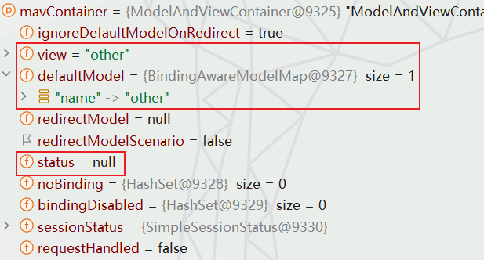

     <br>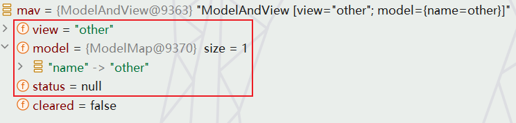

5.   那么接下来我们直接回到`DispatcherServlet`类的`doDispatch`方法中：

     ```java
     protected void doDispatch(HttpServletRequest request, HttpServletResponse response) throws Exception {
         //===通过处理器映射获取匹配的处理器===
         mappedHandler = getHandler(processedRequest);
         //===获取处理器适配器====
         HandlerAdapter ha = getHandlerAdapter(mappedHandler.getHandler());
         //===通过处理器适配器执行处理器方法(重点部分)===
         mv = ha.handle(processedRequest, response, mappedHandler.getHandler());
         //===设置默认视图名称===
         applyDefaultViewName(processedRequest, mv);
         //===处理派发结果===
         processDispatchResult(processedRequest, response, mappedHandler, mv, dispatchException);
     }
     ```

6.   这里有一个设置默认视图名称，简单说一下：

     ```java
     private void applyDefaultViewName(HttpServletRequest request, @Nullable ModelAndView mv) throws Exception {
         if (mv != null && !mv.hasView()) {
             //===视图名为空,获取默认视图名称===
             String defaultViewName = getDefaultViewName(request);
             if (defaultViewName != null) {
                 mv.setViewName(defaultViewName);
             }
         }
     }
     
     @Nullable
     protected String getDefaultViewName(HttpServletRequest request) throws Exception {
         //===其实里面就是获取请求路径作为视图名称(不细究)===
         return (this.viewNameTranslator != null ? this.viewNameTranslator.getViewName(request) : null);
     }
     ```

7.    下面就是核心`processDispatchResult`处理派发结果，我们查看部分代码逻辑：

      ```java
      private void processDispatchResult(
          HttpServletRequest request,
          HttpServletResponse response,
          @Nullable HandlerExecutionChain mappedHandler,
          @Nullable ModelAndView mv,      
          @Nullable Exception exception) throws Exception {
      
          //===判断视图存在、视图是否被清除===
          if (mv != null && !mv.wasCleared()) {
              //======视图渲染======
              render(mv, request, response);
              if (errorView) {
                  WebUtils.clearErrorRequestAttributes(request);
              }
          }
          else {
              if (logger.isTraceEnabled()) {
                  logger.trace("No view rendering, null ModelAndView returned.");
              }
          }
      }
      ```

8.   那么`render`方法中又具体执行了哪些逻辑：首先需要说明`mv.getModelInternal()`是用于获取`ModelAndView`对象中的`model`属性。

     ```java
     protected void render(
         ModelAndView mv,
         HttpServletRequest request, 
         HttpServletResponse response) throws Exception {
     
         //=================确定请求的语言环境=================
         Locale locale =
             (this.localeResolver != null ? this.localeResolver.resolveLocale(request) : 
              request.getLocale());
     
         response.setLocale(locale);
     
         View view;
         String viewName = mv.getViewName();
         if (viewName != null) {
             //==============解析视图名称获得视图对象(getModelInternal()获取model属性)=============
             view = resolveViewName(viewName, mv.getModelInternal(), locale, request);
             if (view == null) {
                 throw new ServletException("Could not resolve view with name '"
                                            + mv.getViewName() 
                                            +"' in servlet with name '" + getServletName() + "'");
             }
         }
         else {
             //ModelAndView对象中包含实际的View对象。
             view = mv.getView();
             if (view == null) {
                 throw new ServletException("ModelAndView [" + mv
                                            + "] neither contains a view name nor a "
                                            +"View object in servlet with name '" 
                                            + getServletName() + "'");
             }
         }
     
         if (logger.isTraceEnabled()) {
             logger.trace("Rendering view [" + view + "] ");
         }
         try {
             // 如果ModelAndView对象中含有状态信息，将其设置到请求属性和应答中。
             if (mv.getStatus() != null) {
                 request.setAttribute(View.RESPONSE_STATUS_ATTRIBUTE, mv.getStatus());
                 response.setStatus(mv.getStatus().value());
             }
             //==============使用View对象渲染模型到请求和应答中(getModelInternal()获取model属性)==============
             view.render(mv.getModelInternal(), request, response);
         }
         catch (Exception ex) {
             if (logger.isDebugEnabled()) {
                 logger.debug("Error rendering view [" + view + "]", ex);
             }
             throw ex;
         }
     }
     ```

     ```java
     @Nullable
     protected Map<String, Object> getModelInternal() {
         return this.model;
     }
     
     ```

9.   首先是解析视图名称获取视图对象方法`resolveViewName`，根据视图名`viewName`、模型对象`model`、Locale 对象，以及 `HttpServletRequest` 对象来解析视图。其中的逻辑就很明显，遍历所有的视图解析器去尝试解决当前视图名称

     ```java
     @Nullable
     protected View resolveViewName(
         String viewName, 
         @Nullable Map<String, Object> model,
         Locale locale,
         HttpServletRequest request) throws Exception {
     
         if (this.viewResolvers != null) { 
             //===遍历viewResolver===
             for (ViewResolver viewResolver : this.viewResolvers) { 
                 //======调用viewResolver的resolveViewName方法尝试解析视图名，获取对应的View对象======
                 View view = viewResolver.resolveViewName(viewName, locale); 
                 if (view != null) {
                     return view;  //===找到对应的View则直接返回该View====
                 }
             }
         }
         return null;
     }
     ```

10.   对于上面的视图解析其一共有5个，但实际上第一个`ContentNegotiatingViewResolver`已经包含了剩余4个视图解析器!那它遍历个寂寞啊？<br>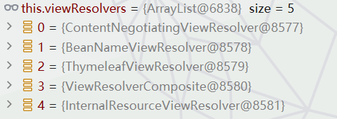

      <br>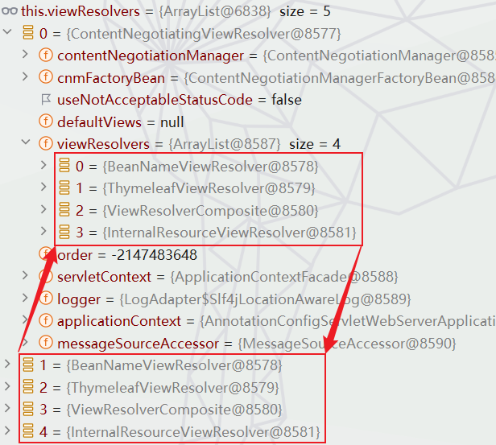

      <br>

11.   那么就是直接看`ContentNegotiatingViewResolver`的`resolveViewName`方法：

      ```java
      @Nullable
      public View resolveViewName(String viewName, Locale locale) throws Exception {
          // 从RequestContextHolder中获取当前的请求属性
          RequestAttributes attrs = RequestContextHolder.getRequestAttributes();
          // 从ServletRequestAttributes中获取经过解析的MediaTypes
          List<MediaType> requestedMediaTypes = getMediaTypes(((ServletRequestAttributes) attrs).getRequest());
          // 如果获取到了请求的MediaTypes
          if (requestedMediaTypes != null) {
              //===获取候选视图===
              List<View> candidateViews = getCandidateViews(viewName, locale, requestedMediaTypes);
              View bestView = getBestView(candidateViews, requestedMediaTypes, attrs);
              // 如果找到最佳视图，则返回该视图
              if (bestView != null) {
                  return bestView;
              }
          }
          return null;
      }
      }
      ```

12.    这里我们先不急查看如何获取候选模板，先看看获取最佳模板的逻辑：首先函数会检查给定的视图列表中是否存在重定向视图，如果存在则返回。如果不存在，那么函数将根据媒体类型来确定最佳视图。函数返回第一个满足请求媒体类型的视图，如果没有找到满足条件的视图则返回null。

       ```java
       
       @Nullable
       private View getBestView(List<View> candidateViews, List<MediaType> requestedMediaTypes, RequestAttributes attrs) {
           // 从候选视图列表中遍历每一个视图
           for (View candidateView : candidateViews) {
               //如果这个视图是一个SmartView类型(一种可处理特殊情况的视图，例如重定向或刷新)
               if (candidateView instanceof SmartView smartView) {
                   // 判断这个视图是否是重定向视图，如果是，直接返回这个视图
                   if (smartView.isRedirectView()) {
                       return candidateView;
                   }
               }
           }
       
           // 如果没有找到任何重定向的视图，那么开始据媒体类型(MediaType)来选择最佳视图
           for (MediaType mediaType : requestedMediaTypes) {
               // 再次从候选视图列表中遍历所有视图
               for (View candidateView : candidateViews) {
                   // 如果视图有设置内容类型
                   if (StringUtils.hasText(candidateView.getContentType())) {
                       // 使用该内容类型创建一个媒体类型实例
                       MediaType candidateContentType = MediaType.parseMediaType(candidateView.getContentType());
       
                       // 如果请求的媒体类型与该视图的媒体类型兼容
                       if (mediaType.isCompatibleWith(candidateContentType)) {
                           // 移除请求的媒体类型中的质量值
                           mediaType = mediaType.removeQualityValue();
       
                           // 如果日志级别为debug，则输出debug日志
                           if (logger.isDebugEnabled()) {
                               logger.debug("Selected '" + mediaType + "' given " + requestedMediaTypes);
                           }
       
                           // 在请求的属性中设置选择的媒体类型
                           attrs.setAttribute(
                               View.SELECTED_CONTENT_TYPE,
                               mediaType, 
                               RequestAttributes.SCOPE_REQUEST);
       
                           // 返回这个视图
                           return candidateView;
                       }
                   }
               }
           }
       
           // 如果没有找到任何满足条件的视图，那么返回null
           return null;
       }
       ```

13.  接下来继续研究`getCandidateViews`获取候选模板列表：这里才是真正的遍历视图解析器，尝试解析视图名称。最后汇总成候选模板。
      ```java
      // 根据给定的视图名称，语言环境和请求的媒体类型，获取候选的视图列表
      private List<View> getCandidateViews(String viewName, Locale locale, List<MediaType> requestedMediaTypes)
          throws Exception {
      
          //存放候选的视图的列表
          List<View> candidateViews = new ArrayList<>();
          if (this.viewResolvers != null) {
              Assert.state(this.contentNegotiationManager != null, "No ContentNegotiationManager set");
              //===遍历视图解析器===
              for (ViewResolver viewResolver : this.viewResolvers) {
                  //===使用视图解析器解析给定的视图名称和语言环境，获取视图===
                  View view = viewResolver.resolveViewName(viewName, locale);
                  
                  if (view != null) {
                      candidateViews.add(view); //===获取view则添加到候选视图列表中==
                  }
                  // 对请求的媒体类型进行遍历
                  for (MediaType requestedMediaType : requestedMediaTypes) {
                      // 使用内容协商管理器解析媒体类型对应的文件扩展名列表(json、xml、yaml...)
                      List<String> extensions = this.contentNegotiationManager
                          .resolveFileExtensions(requestedMediaType);
                      
                      // 遍历文件扩展名列表
                      for (String extension : extensions) {
                          // 将视图名称和文件扩展名进行拼接
                          String viewNameWithExtension = viewName + '.' + extension;
                          // 根据视图名称和文件扩展名，解析并获取视图
                          view = viewResolver.resolveViewName(viewNameWithExtension, locale);
                          // 如果找到了视图，则添加到候选视图列表中
                          if (view != null) {
                              candidateViews.add(view);
                          }
                      }
                  }
              }
          }
          // 如果默认的视图列表不为空，则将其所有元素添加到候选视图列表中
          if (!CollectionUtils.isEmpty(this.defaultViews)) {
              candidateViews.addAll(this.defaultViews);
          }
          // 返回候选的视图列表
          return candidateViews;
      }
      ```

14.   下面我们只研究`thymeleaf`视图解析器解析视图名获取`view`：大致就是不使用缓存就兴建视图，不然就从缓存中找，找不到就新建。

      ```java
      @Override
      @Nullable
      public View resolveViewName(String viewName, Locale locale) throws Exception {
          if (!isCache()) { //不使用缓存
              //======创建新的视图并返回(here)======
              return createView(viewName, locale);  
          }
          else {  
              // 通过视图名称和区域环境信息获取缓存键
              Object cacheKey = getCacheKey(viewName, locale);  
              // 从访问缓存中获取视图
              View view = this.viewAccessCache.get(cacheKey);  
              if (view == null) {  //缓存中没有
                  synchronized (this.viewCreationCache) {
                      //从创建缓存中获取视图
                      view = this.viewCreationCache.get(cacheKey); 
                      if (view == null) {  //如果创建缓存中也没有
                          //===创建新的视图===
                          view = createView(viewName, locale);  
                          if (view == null && this.cacheUnresolved) {
                              view = UNRESOLVED_VIEW;  // 视图设置为无法解析状态
                          }
                          if (view != null && this.cacheFilter.filter(view, viewName, locale)) { 
                              this.viewAccessCache.put(cacheKey, view); //放入viewAccessCache
                              this.viewCreationCache.put(cacheKey, view); //放入viewCreationCache
                          }
                      }
                  }
              }
              else {
                  if (logger.isTraceEnabled()) {
                      logger.trace(formatKey(cacheKey) + "served from cache");
                  }
              }
              //返回视图,若无法解析状态，则返回null
              return (view != UNRESOLVED_VIEW ? view : null);  
          }
      }
      ```

15.   那么我们接下来就看看`createView`创建视图逻辑，三分天下，一目了然！

      ```java
      protected View createView(final String viewName, final Locale locale) throws Exception {
      
          // 如果当前处理器无法处理给定的视图名称，并且设置为不总是处理重定向和转发
          if (!this.alwaysProcessRedirectAndForward && !this.canHandle(viewName, locale)) {
              // 记录trace级别的日志，表示视图无法由此处理器处理，交给下一个解析器处理
              vrlogger.trace("[THYMELEAF] View \"{}\" "
                             +"cannot be handled by ThymeleafViewResolver. "
                             +"Passing on to the next resolver in the chain.", viewName);
              return null;
          } else {
              String forwardUrl;
              //======如果视图名称以"redirect:"开始======
              if (viewName.startsWith("redirect:")) {
                  // 记录trace级别的日志，表示视图是重定向类型，此处理器不直接处理
                  vrlogger.trace("[THYMELEAF] View \"{}\" "
                                 +"is a redirect, and will not be handled "
                                 +"directly by ThymeleafViewResolver.", viewName);
      
                  // 获取重定向URL
                  forwardUrl = viewName.substring("redirect:".length(), viewName.length());
      
                  // 创建一个重定向类型的视图，并完成初始化
                  RedirectView view = new RedirectView(
                      forwardUrl, 
                      this.isRedirectContextRelative(),
                      this.isRedirectHttp10Compatible());
      
                  return
                      (View)this
                      .getApplicationContext()
                      .getAutowireCapableBeanFactory()
                      .initializeBean(view, "redirect:");
              } 
              //======如果视图名称以"forward:"开始======
              else if (viewName.startsWith("forward:")) {
                  // 记录trace级别的日志，表示视图是转发类型，此处理器不直接处理
                  vrlogger.trace("[THYMELEAF] View \"{}\" "
                                 +"is a forward, and will not be handled directly by "
                                 +"ThymeleafViewResolver.", viewName);
      
                  // 获取转发URL
                  forwardUrl = viewName.substring("forward:".length(), viewName.length());
      
                  // 包装为内部资源视图类型并返回
                  return new InternalResourceView(forwardUrl);
              } 
              // 如果设置为总是处理重定向和转发，但当前处理器无法处理给定的视图名称
              else if (this.alwaysProcessRedirectAndForward && !this.canHandle(viewName, locale)) {
                  // 记录trace级别的日志，表示视图无法由此处理器处理，交给下一个解析器处理
                  vrlogger.trace("[THYMELEAF] View \"{}\""
                                 +" cannot be handled by ThymeleafViewResolver. "
                                 +"Passing on to the next resolver in the chain.", viewName);
      
                  return null;//将视图解析权交给下一个视图解析器
              } 
              //======其他情况，即此处理器可以处理给定的视图名称======
              else {
                  // 记录trace级别的日志，表示视图将由此处理器处理，且将创建对应的视图实例
                  vrlogger.trace("[THYMELEAF] View {} will "
                                 +"be handled by ThymeleafViewResolver and a {}"
                                 +""" instance will be created for it",
                                 viewName, 
                                 this.getViewClass().getSimpleName());
      
                  // 加载并返回视图(见下一块代码)
                  return this.loadView(viewName, locale);
              }
          }
      }
      ```

      ```java
      protected View loadView(final String viewName, final Locale locale) throws Exception {
      
          // 获取应用的基于自动装配的Bean工厂，AutowireCapableBeanFactory可以自动装配bean、检查bean是否存在、获取bean等
          AutowireCapableBeanFactory beanFactory = this.getApplicationContext().getAutowireCapableBeanFactory();
      
          // 检查给定的bean名称是否在bean工厂中已经定义 
          boolean viewBeanExists = beanFactory.containsBean(viewName);
      
          // 如果bean存在，则获取bean的类型
          Class<?> viewBeanType = viewBeanExists ? beanFactory.getType(viewName) : null;
      
          //======声明AbstractThymeleafView类型的view变量======
          AbstractThymeleafView view;
      
          // 检查bean是否存在，bean的类型是否为AbstractThymeleafView或其子类
          if (viewBeanExists && viewBeanType != null 
              && AbstractThymeleafView.class.isAssignableFrom(viewBeanType)) {
      
              //如果bean工厂是ConfigurableListableBeanFactory实例，则获取bean的定义
              BeanDefinition viewBeanDefinition = beanFactory instanceof ConfigurableListableBeanFactory 
                  ? ((ConfigurableListableBeanFactory)beanFactory).getBeanDefinition(viewName) : null;
      
              // 如果bean定义存在且Bean的作用域是prototype，就从Bean工厂获取bean的实例
              if (viewBeanDefinition != null && viewBeanDefinition.isPrototype()) {
                  view = (AbstractThymeleafView)beanFactory.getBean(viewName);
              } else {
                  // 否则，实例化该视图类并在该视图实例上执行完所有bean初始化的回调接口
                  AbstractThymeleafView viewInstance = 
                      (AbstractThymeleafView)BeanUtils.
                      instantiateClass(this.getViewClass());
      
                  view = (AbstractThymeleafView)beanFactory.configureBean(viewInstance, viewName);
              }
          } else {
              // 否则，实例化并初始化该视图类。如果bean存在但类型是空，则设置该视图的bean属性和初始化
              AbstractThymeleafView viewInstance = 
                  (AbstractThymeleafView)BeanUtils.
                  instantiateClass(this.getViewClass());
      
              if (viewBeanExists && viewBeanType == null) {
                  beanFactory.autowireBeanProperties(viewInstance, 0, false);
                  beanFactory.applyBeanPropertyValues(viewInstance, viewName);
                  view = (AbstractThymeleafView)beanFactory.initializeBean(viewInstance, viewName);
              } else {
                  // 否则，只进行自动装配和初始化
                  beanFactory.autowireBeanProperties(viewInstance, 0, false);
                  view = (AbstractThymeleafView)beanFactory.initializeBean(viewInstance, viewName);
              }
          }
      
          // 设置模板引擎
          view.setTemplateEngine(this.getTemplateEngine());
      
          // 设置静态变量
          view.setStaticVariables(this.getStaticVariables());
      
          // 如果模板名为空，则将视图名设置为模板名
          if (view.getTemplateName() == null) {
              view.setTemplateName(viewName);
          }
      
          // 如果未设置强制内容类型，就设置默认的强制内容类型
          if (!view.isForceContentTypeSet()) {
              view.setForceContentType(this.getForceContentType());
          }
      
          // 如果未设置内容类型并且默认的内容类型不为空，就设置默认的内容类型
          if (!view.isContentTypeSet() && this.getContentType() != null) {
              view.setContentType(this.getContentType());
          }
      
          // 如果未设置语言环境且默认的语言环境不为空，就设置默认的语言环境
          if (view.getLocale() == null && locale != null) {
              view.setLocale(locale);
          }
      
          // 如果未设置字符编码且默认的字符编码不为空，就设置默认的字符编码
          if (view.getCharacterEncoding() == null && this.getCharacterEncoding() != null) {
              view.setCharacterEncoding(this.getCharacterEncoding());
          }
      
          // 如果未设置在处理时产生部分输出，就设置默认的在处理时产生部分输出
          if (!view.isProducePartialOutputWhileProcessingSet()) {
              view.setProducePartialOutputWhileProcessing(this.getProducePartialOutputWhileProcessing());
          }
      
          // 返回装配完成的视图
          return view;
      }
      ```

16.   解析完视图名称获取view后就是具体的渲染视图的逻辑`view.render(mv.getModelInternal(), request, response)`，接下来就是分别研究:

      1.   对于`"/other"`(将`model`放入请求域的源码太深，建议看`forward:/other`部分)，解析得到`org.thymeleaf.spring6.view.ThymeleafView`类型视图：太复杂、放弃待补！

           ```java
           public void render(
               final Map<String, ?> model,
               final HttpServletRequest request,
               final HttpServletResponse response)
                       throws Exception {
                   //markupSelectors（应该是一个字符串数组，用于指定要渲染的HTML片段），
                   // model（即对应的模型，可能包含业务逻辑处理后的数据），
                   // request（来自客户端的请求对象，可能包含一些请求参数等），
                   // response（服务端的响应对象，可以在这个对象里设置一些HTTP响应头、响应状态码等）。
                   renderFragment(this.markupSelectors, model, request, response);
               }
           ```

           ```java
           // 定义受保护的方法renderFragment
           protected void renderFragment(
               final Set<String> markupSelectorsToRender,
               final Map<String, ?> model, 
               final HttpServletRequest request,                           
               final HttpServletResponse response)
               throws Exception {
               //===关键(开摆)===
               viewTemplateEngine.process(templateName, processMarkupSelectors, context, templateWriter);
           }
           ```

           ```java
           public final void process(
               final String template, 
               final Set<String> templateSelectors,
               final IContext context, 
               final Writer writer) {
           
               this.process(new TemplateSpec(template, templateSelectors, (TemplateMode)null, (String)null, (Map)null), context, writer);
           }
           ```

           ```java
           public final void process(final TemplateSpec templateSpec, final IContext context, final Writer writer) {
           
               TemplateManager templateManager = this.configuration.getTemplateManager();
               templateManager.parseAndProcess(templateSpec, context, writer); //===略(待补)===
           
           }
           ```

      2.   对于`forward:/other`，解析得到`class org.springframework.web.servlet.view.InternalResourceView`类型视图:

           ```java
           @Override
           public void render(@Nullable Map<String, ?> model, HttpServletRequest request,
                              HttpServletResponse response) throws Exception {
               
           	//===创建合并的输出模型(把model中数据放入mergedModel)===
               Map<String, Object> mergedModel = createMergedOutputModel(model, request, response);
               
               // 对HTTP响应进行准备工作
               prepareResponse(request, response);
               
               //===渲染合并的输出模型===
               renderMergedOutputModel(mergedModel, getRequestToExpose(request), response);
           }
           ```
           1. `createMergedOutputModel`(部分源码)大致就是将`model`中的数据放入一个`mergedModel`:

               ```java
               protected Map<String, Object> createMergedOutputModel(
                   @Nullable Map<String, ?> model,
                   HttpServletRequest request, 
                   HttpServletResponse response) {
               
                   // 新建一个大小为size的LinkedHashMap
                   Map<String, Object> mergedModel = CollectionUtils.newLinkedHashMap(size);
                   //把静态属性全部复制到mergedModel
                   mergedModel.putAll(this.staticAttributes);
                   
                   //把pathVars的所有内容也放入mergedModel
                   if (pathVars != null) {
                       mergedModel.putAll(pathVars);
                   }
               
                   //===========把model的所有内容也放入mergedModel===============
                   if (model != null) {
                       mergedModel.putAll(model);
                   }
               
                   //requestContextAttribute不为null，那么把当前的请求上下文放入mergedModel
                   if (this.requestContextAttribute != null) {
                       mergedModel.put(
                           this.requestContextAttribute,
                           createRequestContext(request, response, mergedModel));
                   }
               
                   // 返回合并后的Map模型
                   return mergedModel;
               }
               ```

               <br>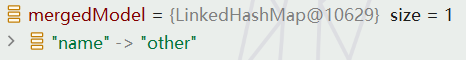

           2. 而`renderMergedOutputModel`：把传入的`mergedModel`作为请求的属性暴露出去(`exposeModelAsRequestAttributes`)，然后不就是原生的转发嘛。

               1. 获取`RequestDispatcher`对象：单个Servlet无法产生复杂的响应，通过调用`request.getRequestDispatcher()`方法，可以获取一个`RequestDispatcher`对象，这个对象可以接收一个路径作为参数，路径直接关联到应用内部的其他资源(比如另一个Servlet，JSP页面，或者HTML文件)。

               2. 请求转发： `RequestDispatcher`对象的`forward()`方法可以实现请求的转发，这个方法接收两个参数：`request`和`response`，操作实际会将处理权转移给其他的Servlet或者JSP页面。

                   ```java
                   @Override
                   // 覆盖父类的方法，用于渲染已合并的输出模型
                   protected void renderMergedOutputModel(
                       Map<String, Object> model, HttpServletRequest request, HttpServletResponse response) throws Exception {
                   
                       //========把模型对象作为请求的属性暴露出来=====
                       exposeModelAsRequestAttributes(model, request);
                   
                       //如果存在的话，把助手类作为请求的属性暴露出来
                       exposeHelpers(request);
                   
                       //确定请求调度器的路径
                       String dispatcherPath = prepareForRendering(request, response);
                   
                       //获取指向目标资源的请求调度器。
                       RequestDispatcher rd = getRequestDispatcher(request, dispatcherPath);
                   
                       //转发请求和响应
                       rd.forward(request, response);
                   }
                   ```

           3. `exposeModelAsRequestAttributes`具体如何暴露属性：

               ```java
               protected void exposeModelAsRequestAttributes(Map<String, Object> model,
                                                             HttpServletRequest request) throws Exception {
               
                   model.forEach((name, value) -> { //===遍历mergedModel===
                       if (value != null) {
                           request.setAttribute(name, value); //===添加到request域===
                       }
                       else {
                           request.removeAttribute(name);
                       }
                   });
               }
               ```

      3.   对于`redirect:/other`，解析得到`class org.springframework.web.servlet.view.RedirectView`类型视图:

           ```java
           @Override
           public void render(@Nullable Map<String, ?> model, HttpServletRequest request,
                              HttpServletResponse response) throws Exception {
           
               //===创建合并的输出模型(把model中数据放入mergedModel)(redirectAttributes.addAttribute的参数也在其中)===
               Map<String, Object> mergedModel = createMergedOutputModel(model, request, response);
           
               // 对HTTP响应进行准备工作
               prepareResponse(request, response);
           
               //===渲染合并的输出模型===
               renderMergedOutputModel(mergedModel, getRequestToExpose(request), response);
           }
           ```

           <br>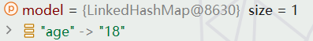  

           1.   而`renderMergedOutputModel`：把传入的`mergedModel`作为请求的属性暴露出去(`exposeModelAsRequestAttributes`)，然后不就是原生的重定向嘛。

                ```java
                @Override
                protected void renderMergedOutputModel(Map<String, Object> model, HttpServletRequest request,
                                                       HttpServletResponse response) throws IOException {
                
                    //===创建重定向目标url(从view中获取)===
                    String targetUrl = createTargetUrl(model, request);
                
                    //更新targetUrl(redirectAttributes.addAttribute的参数拼接到url)
                    targetUrl = updateTargetUrl(targetUrl, model, request, response);
                
                    //调用"RequestContextUtils.saveOutputFlashMap"方法来把当前请求的FlashMap保存到指定的目标URL
                    //FlashMap用于存储一次性信息，跳转过后就会消失。
                    RequestContextUtils.saveOutputFlashMap(targetUrl, request, response);
                
                    //重定向
                    sendRedirect(request, response, targetUrl, this.http10Compatible);。
                }
                ```

                <br>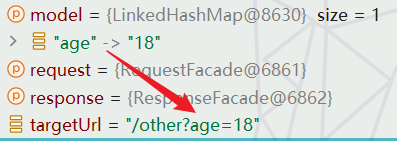

           2.    `saveOutputFlashMap`其实就是对`redirectAttributes.addFlashAttribute`的处理：`FlashMap`主要用于临时存储一些数据，然后在重定向后使用这些数据。 `FlashMap`的数据基本上存储在HTTP Session中，但是和直接存储在Session中不同，这些存储在`FlashMap`中的数据只会存活到下一个请求，即在下一个请求处理完成后，这些数据就会从Session中删除。这样就避免了Session中充满过期的数据。

                ```java
                public static void saveOutputFlashMap(String location, HttpServletRequest request, HttpServletResponse response) {
                
                    FlashMap flashMap = getOutputFlashMap(request);
                    //使用请求对象从当前HTTP session获取一个FlashMap对象。如果存在则返回该flashMap，如果不存在则创建一个新的。
                
                    if (CollectionUtils.isEmpty(flashMap)) {
                        return;
                    }
                
                    UriComponents uriComponents = UriComponentsBuilder.fromUriString(location).build();
                    //使用UriComponentsBuilder从给定的location字符串构建一个UriComponents。UriComponents能够用于分解URI路径，查询参数等。
                
                    flashMap.setTargetRequestPath(uriComponents.getPath());
                    //将UriComponents的路径设置为flashMap的目标请求路径
                
                    flashMap.addTargetRequestParams(uriComponents.getQueryParams());
                    //将UriComponents的查询参数添加到flashMap的目标请求参数中
                
                    FlashMapManager manager = getFlashMapManager(request);
                    //获取一个FlashMapManager，用来处理flashMap的存储和恢复等操作
                
                    Assert.state(manager != null, "No FlashMapManager. Is this a DispatcherServlet handled request?");
                    //断言我们当前的请求一定有一个FlashMapManager。如果没有获取到FlashMapManager，抛出异常
                
                    manager.saveOutputFlashMap(flashMap, request, response);
                    //使用FlashMapManager的saveOutputFlashMap()方法保存我们的FlashMap
                }
                ```

                <br>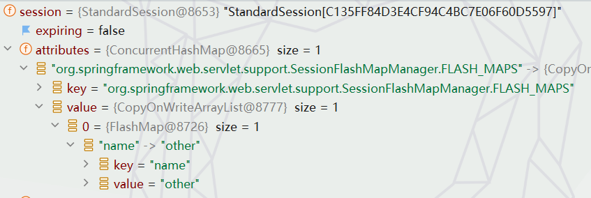

17.   终于结束了！！！<br>
