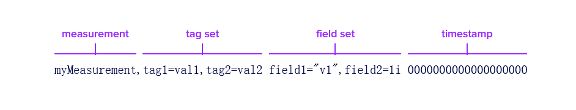

#### PageHelper

1. [PageHelper官网](https://pagehelper.github.io/docs/howtouse/)。

2. 导入依赖:

   ```xml
   <dependencies>
       <dependency>
           <groupId>com.github.pagehelper</groupId>
           <artifactId>pagehelper-spring-boot-starter</artifactId>
           <version>1.2.3</version>
       </dependency>
   </dependencies>
   ```

3. 配置 application.yml:

   ```yaml
   pagehelper:
     # 设置方言，此处指定 MySQL 数据库
     helper-dialect: mysql
     # 是否启动合理化，默认是 false。
     # 启用合理化时，如果pageNum<1会查询第一页，如果pageNum>pages（最大页数）会查询最后一页。
     # 禁用合理化时，如果pageNum<1或pageNum>pages会返回空数据
     reasonable: true
     # 是否支持接口参数来传递分页参数，默认false
     support-methods-arguments: true
     # 为了支持startPage(Object params)方法，增加了该参数来配置参数映射，用于从对象中根据属性名取值
     params: count=countSql
     # 默认值为 false，当该参数设置为 true 时，如果 pageSize=0 或者 RowBounds.limit = 0 就会查询出全部的结果（相当于没有执行分页查询，但是返回结果仍然是 Page 类型）
     page-size-zero: true
   ```

4. 使用举例:

   ```java
   /**
   * service实现类
   * @param pageNumber    页码
   * @param pageSize      每页显示数目
   */
   public PageInfo<T> list(Integer pageNumber, Integer pageSize) { 
       // 设置分页
       PageHelper.startPage(pageNumber, pageSize);
    
       // 查询用户角色列表（需要分页的查询）
       List<T> list = userRoleService.queryList();
       PageInfo<T> pageInfo = new PageInfo<>(list);
    
       return pageInfo;
   )
   ```

   > 注意:PageHelper.startPage(页码, 每页显示数目); 这一句代码，必须放在需要分页的查询语句之前，否则会分页不生效

5. 分页失效情况

   > 分页设置与需要分页的查询之间存在其他查询,如下代码是一个错误示范，虽然在方法的开头设置了分页，但因为在`【查询用户角色列表】`之前，多查了一步`【查询用户信息】`，此时实际上分页针对的是【查询用户信息】进行分页，而并非对【查询用户角色列表】进行分页。startPage会寻找最近的一个查询方法执行分页

   ```java
   public PageInfo<UserRole> list(Integer pageNumber, Integer pageSize, String userId) {
       // 设置分页
       PageHelper.startPage(pageNumber, pageSize);
    
       // 查询用户信息
       User user = userService.findById(userId);
    
       // 查询用户角色列表（需要分页的查询）
       List<UserRole> list = userRoleService.queryList();
       PageInfo<UserRole> pageInfo = new PageInfo<UserRole>(list);
    
       return pageInfo;
   )
   ```

   > 在需要分页的查询后才设置分页,如下代码是一个错误示范，在【查询用户角色列表】后才进行分页设置，因为已进行的所有数据的查询，所以此时再设置分页已无任何意义，自然会分页失效

   ```java
   public PageInfo<UserRole> list(Integer pageNumber, Integer pageSize) {
       // 查询用户角色列表（需要分页的查询）
       List<UserRole> list = userRoleService.queryList();
    
       // 设置分页
       PageHelper.startPage(pageNumber, pageSize);
       PageInfo<UserRole> pageInfo = new PageInfo<UserRole>(list);
    
       return pageInfo;
   )
   ```

6. 返回参数说明

   ```java
   //当前页
   private int pageNum;
   //每页的数量
   private int pageSize;
   //当前页的数量
   private int size;
   //当前页面第一个元素在数据库中的行号
   private int startRow;
   //当前页面最后一个元素在数据库中的行号
   private int endRow;
   //总记录数
   private long total;
   //总页数
   private int pages;
   //结果集重要,通过getList获取结果集
   private List<T> list;
   
   //前一页
   private int prePage;
   //下一页
   private int nextPage;
   
   //是否为第一页
   private boolean isFirstPage = false;
   //是否为最后一页
   private boolean isLastPage = false;
   //是否有前一页
   private boolean hasPreviousPage = false;
   //是否有下一页
   private boolean hasNextPage = false;
   //导航页码数
   private int navigatePages;
   //所有导航页号
   private int[] navigatepageNums;
   //导航条上的第一页
   private int navigateFirstPage;
   //导航条上的最后一页
   private int navigateLastPage;
   ```


#### Redis

详情参考[springboot集成redis](../redis7/6.springboot集成redis.md)


#### Swagger

1. Swagger 是一个用于生成、描述、调用和可视化 RESTful API 的框架，常用于生成 API 文档和测试接口。在 Spring Boot 中集成 Swagger 可以方便开发者调试和查看 API 信息。

2. 引入依赖:

   1. ~~springfox版本:早期 Spring Boot 生态中主流的 Swagger 集成方案,已停止维护。~~

   2. SpringDoc版本:现代 Spring Boot 生态的 OpenAPI 3 实现，替代 Springfox 的解决方案:

      ```xml
      <!-- SpringDoc OpenAPI 3 依赖 -->
      <dependency>
          <groupId>org.springdoc</groupId>
          <artifactId>springdoc-openapi-starter-webmvc-ui</artifactId>
          <version>2.3.0</version>
      </dependency>
      ```

3. 配置 openApi :

   1. 注解方式:通过主类添加全局信息

      ```java
      @SpringBootApplication
      @OpenAPIDefinition(
          info = @Info(
              title = "API文档",
              version = "1.0.0",
              description = "示例项目API文档"
          )
      )
      public class Application {
          public static void main(String[] args) {
              SpringApplication.run(Application.class, args);
          }
      }
      ```

   2. 配置类方式:

      ```java
      @Configuration
      public class OpenApiConfig {
      
          @Bean
          public OpenAPI customOpenAPI() {
              return new OpenAPI()
                  .info(new Info()
                        .title("API文档")
                        .version("1.0.0")
                        .description("示例项目API文档")
                        .contact(new Contact()
                                 .name("技术支持")
                                 .email("support@example.com")))
                  .externalDocs(new ExternalDocumentation()
                                .description("详细文档")
                                .url("https://docs.example.com"));
          }
      }
      ```

   3. 配置文件方式：如下。

4. 配置配置文件:

   ```properties
   # application.properties
   springdoc.swagger-ui.path=/swagger-ui.html
   springdoc.api-docs.path=/v3/api-docs
   springdoc.swagger-ui.enabled=true
   springdoc.api-docs.enabled=true
   
   # 自定义文档信息
   springdoc.info.title=API文档
   springdoc.info.version=1.0.0
   springdoc.info.description=示例项目API文档
   ```

5. 常用注解:略，详细使用参考[swagger笔记](./9.swagger使用.md)

6. 访问:需要依照自定义配置而定

   1. Swagger UI 界面: [http://localhost:8080/swagger-ui.html](http://localhost:8080/swagger-ui.html)
   2. OpenAPI JSON：[http://localhost:8080/v3/api-docs](http://localhost:8080/v3/api-docs)


#### influxdb

> 除开部分特别提到的 1.x 版本内容外，下面笔记均以 2.x 版本为主。

##### 简介

1. 对于 influxdb而言， 1.x 版本和 2.x 版本可能略有不同:

   | 特性         | InfluxDB 1.x                   | InfluxDB 2.x                      |
   | ------------ | ------------------------------ | --------------------------------- |
   | 核心认证方式 | 用户名 + 密码(HTTP Basic Auth) | Token(API 令牌)                   |
   | 用户管理     | 内置用户系统(admin、普通用户)  | 通过组织 Org 和用户 User 管理     |
   | 权限控制     | 基于数据库的读写权限           | 细粒度权限(Bucket、Task、Token等) |
   | 默认端口     | 8086                           | 8086                              |
   | 查询语法     | InfluxQL                       | Flux（主）/ InfluxQL（兼容）      |
   | 数据库       | Database                       | Bucket                            |

2. influxDB 是一个开源的时序数据库(按时间顺序记录的数据点，如传感器数据、服务器监控指标等)，专为处理高写入和查询负载的时序数据设计，适用于监控、指标分析、物联网等场景。

3. 其核心组件：
   - Database：类似传统数据库的库，用于隔离数据。
   - Measurement：类似关系型数据库的表，用于存储同一类数据。
   - Timestamp：每个数据点的时间戳,默认纳秒精度。
   - Tag：索引字段(Key-Value)，用于快速查询和分组。
   - Field：实际存储的数值，不支持索引。
   - Point：一条时间序列数据记录
   - Retention Policy (RP)：数据保留策略，定义数据存储时长和副本数。
   - Continuous Query (CQ)：自动定期执行的查询，用于数据聚合和降采样。

4. 数据库操作:

   ```sql
   -- 创建数据库
   CREATE DATABASE mydb
   
   -- 显示所有数据库
   SHOW DATABASES
   
   -- 使用数据库
   USE mydb
   
   -- 删除数据库
   DROP DATABASE mydb
   ```

5. 写入数据:InfluxDB 使用 Line Protocol 写入数据点。它是一种基于文本的格式，提供数据点的 measurement(测量名)、tag set(标签集)、field set(字段集)和 timestamp(时间戳)。<br>

   ```sql
   -- 基本语法
   INSERT measurement,tag_key=tag_value field_key=field_value timestamp
   
   -- 示例
   INSERT cpu,host=serverA,region=us_west value=0.64 1434055562000000000
   ```

6. 查询数据:

   > InfluxDB 2.x 增加对 flux 语法的支持，但同时也保证对原来InfluxQL 兼容。Flux 是 InfluxData 的功能性数据脚本语言，设计用于查询、分析和处理数据，它是InfluxQL 和其他类似 SQL 的查询语言的替代品。详细的语法使用参考:[flux(推荐)](https://docs.influxdb.org.cn/flux/v0/get-started/)、[influxql](https://docs.influxdb.org.cn/influxdb/v2/reference/syntax/influxql/)

   ```sql
   -- 查询所有数据
   SELECT * FROM "cpu"
   
   -- 条件查询
   SELECT * FROM "cpu" WHERE "host" = 'serverA'
   
   -- 时间范围查询
   SELECT * FROM "cpu" WHERE time > now() - 1h
   
   -- 聚合查询
   SELECT MEAN("value") FROM "cpu" WHERE time > now() - 1h GROUP BY time(10m)
   ```

   ```flux
   from(bucket: "mybucket")
     |> range(start: -1h)
     |> filter(fn: (r) => r._measurement == "temperature")
     |> mean()
   ```

7. 删除:使用 Flux 命令删除指定时间范围的数据

   ```bash
   influx delete \
     --bucket mybucket \
     --org myorg \
     --start 2023-01-01T00:00:00Z \
     --stop 2023-01-02T00:00:00Z \
     --predicate '_measurement="temperature"'
   ```

8. 其他内容和具体使用参考中文文档:[influxdb v2](https://docs.influxdb.org.cn/influxdb/v2/)。


##### 整合

1. 对于 1.x 版本:

   1. 添加依赖:

      ```xml
      <!-- InfluxDB 1.x -->
      <dependency>
          <groupId>org.influxdb</groupId>
          <artifactId>influxdb-java</artifactId>
          <version>2.23</version>
      </dependency>
      ```

   2. 配置连接参数:

      ```properties
      # InfluxDB 1.x 配置
      influx.url=http://localhost:8086
      influx.username=<user>
      influx.password=<passwd>
      influx.database=<database>
      ```

   3. 添加配置类:

      ```java
      @Configuration
      public class InfluxDbConfig {
      
          @Bean
          public org.influxdb.InfluxDB influxDB(
              @Value("${influx.url}") String url,
              @Value("${influx.username}") String username,
              @Value("${influx.password}") String password
          ) {
              org.influxdb.InfluxDB influxDB = org.influxdb.InfluxDBFactory.connect(
                  url,
                  username,
                  password
              );
              influxDB.setDatabase(database);
              return influxDB;
          }
      
      }
      ```

2. 对于 2.x 版本:

   1. 添加依赖:

      ```xml
      <!-- InfluxDB 2.x -->
      <dependency>
          <groupId>com.influxdb</groupId>
          <artifactId>influxdb-client-java</artifactId>
          <version>6.10.0</version>
      </dependency>
      ```

   2. 配置连接参数:

      ```properties
      # InfluxDB 2.x 配置
      influx.url=http://localhost:8086
      influx.token=<admin_token>
      influx.org=<org>
      influx.bucket=<bucket>
      ```

   3. 添加配置类:

      ```java
      @Configuration
      public class InfluxDbConfig {
      
          @Value("${influx.url}")
          private String influxUrl;
      
          @Value("${influx.token}")
          private String influxToken;
      
          @Value("${influx.org}")
          private String influxOrg;
      
          @Value("${influx.bucket}")
          private String influxBucket;
      
          @Bean
          public InfluxDBClient influxDBClient() {
              return InfluxDBClientFactory.create(
                  influxUrl, 
                  influxToken.toCharArray(),
                  influxOrg,
                  influxBucket
              );
          }
      }
      ```

3. 具体使用:内容可以参考[github文档](https://github.com/influxdata/influxdb-client-java)

   ```java
   @Service
   public class InfluxService {
   
       private final InfluxDBClient client;
   
       public InfluxService(InfluxDBClient client) {
           this.client = client;
       }
   
       //以 point 的方式写入数据
       public void writePoint() {
           try {
               WriteApiBlocking api = client.getWriteApiBlocking();
               Point point = Point.measurement("temperature")
                   .addTag("location", "room1")
                   .addField("value", 25.6)
                   .time(Instant.now(), WritePrecision.MS);
               api.writePoint(point);
           }catch (Exception e) {
               throw new RuntimeException(e);
           }
       }
   
       //以 line protocol 的方式写入数据
       public void  writeLineProtocol() {
           String lineProtocol = 
               "temperature,location=room1 value=25.6 " + Instant.now().toEpochMilli();
           WriteApiBlocking api = client.getWriteApiBlocking();
           try {
               api.writeRecord("my-bucket", "my-org", WritePrecision.MS, lineProtocol);
           } catch (Exception e) {
               throw new RuntimeException(e);
           }
   
       }
       //使用sql语法查询数据
       public void selectBySql(){
           String sql = "SELECT * FROM temperature WHERE location='room1'";
           try {
               QueryApi queryApi = client.getQueryApi();
               for (FluxTable fluxTable : queryApi.query(sql)) {
                   System.out.println(fluxTable.toString());
               }
           } catch (Exception e) {
               throw new RuntimeException(e);
           }
       }
   
       //使用flux语法查询数据
       public void selectByFlux(){
           String flux = "from(bucket: \"my-bucket\") |> range(start: -1h) |> filter(fn: (r) => r._measurement == \"temperature\" and r.location == \"room1\")";
           try {
               QueryApi queryApi = client.getQueryApi();
               for (FluxTable fluxTable : queryApi.query(flux)) {
                   System.out.println(fluxTable.toString());
               }
           } catch (Exception e) {
               throw new RuntimeException(e);
           }
       }
   
       //删除
       public void deleteData() {
           String start = "2025-01-01T00:00:00Z";
   
           String stop = "2025-01-02T00:00:00Z";
           String predicate = "_measurement=\"temperature\" AND location=\"room1\"";
           String bucket = "my-bucket";
           String org = "my-org";
           try {
               DeleteApi api = client.getDeleteApi();
               api.delete(
                   OffsetDateTime.parse(start, DateTimeFormatter.ISO_OFFSET_DATE_TIME),
                   OffsetDateTime.parse(stop, DateTimeFormatter.ISO_OFFSET_DATE_TIME),
                   predicate,
                   bucket,
                   org
               );
   
           } catch (Exception e) {
               throw new RuntimeException(e);
           }
       }
   }
   ```

   


#### websocket

1. 添加依赖:

   ```xml
   <dependency>
       <groupId>org.springframework.boot</groupId>
       <artifactId>spring-boot-starter-websocket</artifactId>
   </dependency>
   ```

2. 添加配置类,创建配置类启用STOMP消息代理:

   ```java
   @Configuration
   @EnableWebSocketMessageBroker
   public class WebSocketConfig implements WebSocketMessageBrokerConfigurer {
   
       @Override
       public void registerStompEndpoints(StompEndpointRegistry registry) {
           registry.addEndpoint("/ws") // WebSocket连接端点
                   .setAllowedOriginPatterns("*") // 允许跨域
                   .withSockJS(); // 支持SockJS
       }
   
       @Override
       public void configureMessageBroker(MessageBrokerRegistry registry) {
           registry.enableSimpleBroker("/topic"); // 启用内存消息代理，路由前缀为/topic
           registry.setApplicationDestinationPrefixes("/app"); // 客户端发送消息的前缀
       }
   }
   ```

3. 创建消息控制器,处理客户端发送的请求并广播数据

   ```java
   @Controller
   public class DataController {
   
       @MessageMapping("/data") // 接收客户端发送到/app/data的消息
       @SendTo("/topic/iot-data") // 将返回结果广播到/topic/iot-data
       public String handleData(String message) {
           // 处理数据（例如：从物联网设备获取数据）
           return "实时数据: " + message;
       }
   }
   ```

   

4. 

#### kafka

1. 
