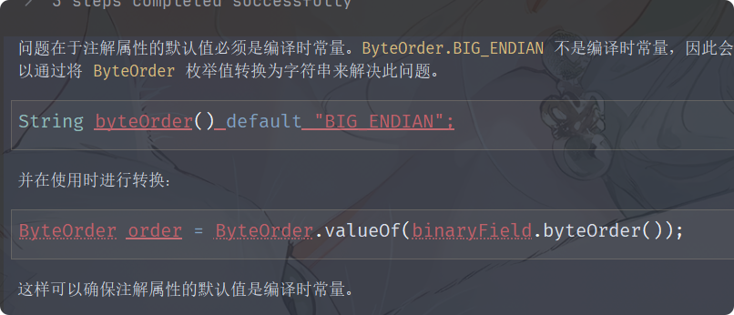

##### 引言

在毕设中实现物联网和springboot通信时，存在这样一个需求:由于物联网设备的功耗问题和网络问题，经可能的缩短数据，提高传输数据的效率。因此往往需要将数组拼接成字节流进行传输(不含参数名称)，而后端拿到字节流后需要手动根据约定拆分字节流转换为对应数据。



编写一个自定义注解，用于标注字段的长度和类型等

```java
@Retention(RetentionPolicy.RUNTIME)
@Target({ElementType.FIELD, ElementType.TYPE})
public @interface BinaryField {
    //字段优先级,优先级越小越先解析
    int order();

    //字段字节长度,基本类型可自动推导
    int length() default -1;

    //数据类型
    DataType type() default DataType.AUTO;

    //是否为嵌套对象
    boolean nested() default false;

    //嵌套对象类型,nested=true时生效
    Class<?> nestedType() default Void.class;

    //特殊格式说明,如时间戳格式
    String format() default "";

    //字节序,默认大端序
    String byteOrder() default "BIG_ENDIAN";

    enum DataType {
        AUTO,
        BYTE,
        SHORT,
        INT,
        LONG,
        FLOAT,
        DOUBLE,
        STRING,
        TIMESTAMP,
        BOOLEAN,
        ArrAY,
        //自定义类型
        CUSTOM
    }
}
```

注解参数校验是否可以通过实现 ConstraintValidator 实现？


上述解析器可定是存在不足的，基本数据类型如何处理？？？


```yaml
  kafka:
    image: bitnami/kafka:${KAFKA_VERSION}
    container_name: kafka
    ports:
      - "${KAFKA_PORT}:9092"
    environment:
      KAFKA_CFG_NODE_ID: 0
      KAFKA_CFG_PROCESS_ROLES: controller,broker
      KAFKA_CFG_LISTENERS: PLAINTEXT://:9092,CONTROLLER://:9093
      KAFKA_CFG_LISTENER_SECURITY_PROTOCOL_MAP: CONTROLLER:PLAINTEXT,PLAINTEXT:PLAINTEXT
      KAFKA_CFG_CONTROLLER_QUORUM_VOTERS: 0@kafka:9093
      KAFKA_CFG_CONTROLLER_LISTENER_NAMES: CONTROLLER
    networks:
      - grid
```

```yaml
  zookeeper:
    image: wurstmeister/zookeeper:latest
    container_name: zookeeper
    ports:
      - "2181:2181"
    volumes:
      - "/etc/localtime:/etc/localtime"  # 同步宿主机时间
    networks:
      - grid

  kafka:
    image: wurstmeister/kafka:latest
    container_name: kafka
    ports:
      - "9092:9092"
    environment:
      KAFKA_BROKER_ID: 1
      KAFKA_ZOOKEEPER_CONNECT: "zookeeper:2181"  # 使用 Docker 服务名连接
      KAFKA_LISTENERS: PLAINTEXT://0.0.0.0:9092  # 监听所有网络接口
      KAFKA_ADVERTISED_LISTENERS: PLAINTEXT://172.18.43.141:9092  # 动态传入宿主机 IP
    volumes:
      - "/etc/localtime:/etc/localtime"
    depends_on:
      - zookeeper
    networks:
      - grid
```


```bash
0        1        17       29       33       41
+--------+--------+--------+--------+--------+
| 协议版本 | 设备ID  | GPS数据 | 温度   | 时间戳 |
| (1B)   | (16B)  | (12B)  | (4B)   | (8B)   |
+--------+--------+--------+--------+--------+

GPS数据详细结构（12字节）：
0        4        8        12
+--------+--------+--------+
| 纬度    | 经度    | 精度    |
| (4B)   | (4B)   | (4B)   |
+--------+--------+--------+
```


```bash
物联网设备 → (MQTT/Kafka) → Spring Boot消费者 → 验证API Key → 存储至InfluxDB
           ↑                   ↑
        API Key校验       数据清洗与缓存
```


```bash
            ┌──────────────────────┐
            │      物联网设备        │
            └──────────┬─────────────┘
                       │
                       ▼ 发送二进制数据（无需认证）
            ┌──────────────────────┐
            │  数据接收端点 (HTTP/TCP)  │
            └──────────┬─────────────┘
                       │ 暂存数据（临时存储/队列）
                       ▼
            ┌──────────────────────┐
            │   异步认证与数据处理     │
            └──────────┬─────────────┘
                       │ 验证通过后
                       ▼
            ┌──────────────────────┐
            │      持久化存储        │
            └──────────────────────┘
```

```bash
           ┌───────────────────────┐
           │       HTTP 请求        │
           └──────────┬────────────┘
                      ▼
      ┌───────────────────────────────┐
      │ 检查请求头是否包含 Authorization │
      │      且以 "Bearer " 开头        │
      └──────────────┬────────────────┘
           │ 是                │ 否
           ▼                    ▼
  ┌─────────────────┐   ┌─────────────────┐
  │ 提取 Token      │   │ 跳过 JWT 验证    │
  │ (去掉 "Bearer ")│   │ 继续后续过滤器链  │
  └───────┬─────────┘   └────────┬────────┘
          │                      │
          ▼                      ▼
┌─────────────────────┐   ┌─────────────────┐
│ 使用 JwtUtils 解析 Token │   │ 请求继续处理      │
│ 验证签名、过期时间等      │   └─────────────────┘
└───────┬─────────────┘
        │ 有效
        ▼
┌───────────────────────┐
│ 创建 SecurityContext   │
│ 设置 Authentication   │
│ 存入 SecurityContextHolder │
└───────┬───────────────┘
        ▼
┌───────────────────────┐
│ 继续后续过滤器链和请求处理 │
└───────────────────────┘
```


**解决方案**：集成 Resilience4j 限流

java

复制

```
// 在登录接口添加限流注解
@RateLimiter(name = "loginLimiter", fallbackMethod = "loginFallback")
```


```sql
CREATE TABLE device_data (
    id BIGINT PRIMARY KEY,
    device_id INT,
    api_key VARCHAR(16),
    resistance DECIMAL(5,2),  -- 范围: 0.00~655.35
    longitude DECIMAL(9,6),   -- 经度
    latitude DECIMAL(8,6),    -- 纬度
    accuracy DECIMAL(3,1),    -- 精度
    create_time TIMESTAMP
);
```


刚开始并不知道后期会传来什么类型的参数，于是写一个多种类型的参数解析器


我真傻，为啥不全部设置成字符串格式传输呢？这样后端解析起来就方便很多???


还是很麻烦的，比如基本数据类型没有实现、若是存在继承类，从父类中的继承的含注解字段也没有考虑，要真是写一个完美的参数解析器很复杂！！！


首先将float浮点数转化为整数读取，之后将整数拆分为四个字节字符型数据，之后便可以拿着这四个字节的数据进行存储和传输了


不考虑无符号数！！！


python: 格式化输出！！！https://zhuanlan.zhihu.com/p/545833765

prettytable：一款可完美格式化输出的 Python 库
