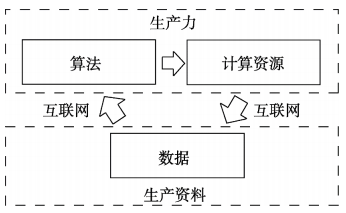
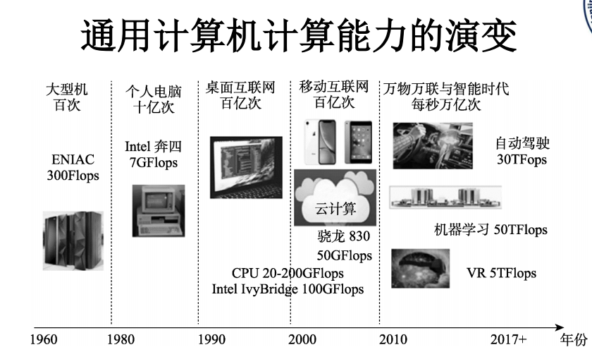
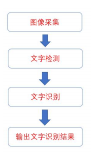
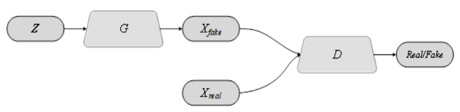

##### 第一章

1. `ai`三要素：算法、计算资源、数据。<br>

2. 数据可以分为两种：公开数据集的数据质量较高，但种类和数量较少。为了提高泛化能力，一般采用公开数据集+自采数据的形式。
   1. 公开数据集
   2. 自行采集或购买的行业数据
3. 数据处理的步骤分为：
   1. 数据清洗
   2. 数据标注
   3. 数据增强
4. 算力的演变：<br>


##### 第二章

1. 卷积神经网络的构成：
   1. 卷积层
   2. 激活函数：`Sigmoid`函数、`Tanh`激活函数、`ReLU`激活函数
   3. 池化层
2. 激活函数的作用：引入非现实关系。
3. 池化层的作用：减少计算量
4. 图像分类的概念：图像分类是从给定的分类集合中给图像分配一个标签，实现输入图像并返回一个分类标签的任务。


##### 第三章

1. `YOLO`目标检测算法中非极大值检测算法的作用：去掉多余候选框，减少误检率。
2. `Faster R-CNN`的作用：它的主要作用是通过在图像中识别并定位多个对象，从而实现高效、准确的对象检测。


##### 第四章

1. 图像分割: 分为<font color=red>语义分割</font>与<font color=red>实例分割</font>
   1.  语义分割是指需要进一步判断图像中哪些像素属于哪类目标。但是，语义分割不区分属于相同类别的不同实例。
   2.  实例分割需要区分出属于各个不同的实例的那些像素。
2. 反卷积层的主要作用：将经过卷积操作得到的特征图还原成输入图像的大小，实现图像的恢复和重构。在图像分割、目标检测等应用中，为了从缩小的特征图恢复到原始图像的大小，需要利用反卷积层进行上采样操作。
3. `DeepLab`目标分割算法是一系列结合了深度卷积神经网络和概率图模型的方法，用于实现高精度的语义图像分割。
4. <font color=red>空洞卷积：也被称为扩张卷积或带孔卷积，它能够在不增加参数数量和计算量的前提下，有效地增大感受野，从而捕获更多的上下文信息。这对于目标分割任务至关重要，因为它有助于更准确地识别目标的边界和形状。</font>
5. `U-Net`(基于卷积神经网络的语义分割算法)的名称来源于其独特的“U”形状网络结构。这个网络结构主要分为两部分：收缩路径（也称为下采样路径）和扩张路径（也称为上采样路径）。
   1. 收缩路径主要用于提取特征。通过多次下采样操作，输入图像被转换为较小的特征图。这一过程中包含卷积层和池化层。卷积层负责提取特征，而池化层则用于下采样，减小输出大小并增加感受野范围。
   2.  扩张路径则将这些特征图上采样至原始输入大小，并在此基础上完成像素级别的预测。这一过程中包含反卷积层和拼接层。反卷积层负责上采样，还原图片大小，而拼接层则将编码器和解码器中同尺寸但不同深度的特征拼接起来，以提高表现力。


##### 第六章

1. <font color=red>OCR文字识别流程</font>：<br>
2. `CTPN`网络结构本质上是全卷积神经网络，通过在卷积特征图上，以固定步长的滑动窗口检测文本行，输出细粒度文本候选框序列。
3. 在`RNN`(循环神经网络)中，神经元不仅接收来自其他神经元的信息，还会接收自身的信息，形成一个循环的结构。这使得`RNN`可以捕捉序列中的时间依赖性和长期依赖关系。`RNN`通过迭代的方式对序列中的每一个元素进行处理，并将前一个元素的信息传递到下一个元素。


##### 第八章

1. 生成对抗神经网络(`GAN`)的概念：`GAN`的提出是为了弥补真实数据的不足，生成高质量的人工数据。`GAN`的主要思想是通过两个模型的对抗性训练。随着训练过程的推进，生成网络逐渐变得擅长创建看起来真实的图像，而判别网络则变得更擅长区分真实图像和生成器生成的图像。
2. GAN的结构图：
   1. $Z$是随机噪声向量
   2. $G$是生成器
   3. $D$是判别器
   4. $X_{fake}$表示生成器生成的假数据样本
   5. $X_{real}$表示真实数据样本
   6. $Real/Fake$表示输出结果<br>


##### 第九章

1. <font color=red>数据增强的目的：可以大大提高模型的泛化能力。</font>


##### <font color=red>必考题</font>

1. 解释 `Faster R-CNN` 中 `RPN`（Region Proposal Network，区域生成网络）的作用：`FasterR-CNN `方法中最重要的是使用候选区域推荐网络（ `RPN`）获得准确的候选区域框，并且将选择区域框的过程嵌入卷积神经网络中，与 `Fast R-CNN`网络共享卷积层的参数，从而提高网络的训练和测试速度。候选区域推荐网络的核心思想是使用卷积神经网络直接产生候选区域框，使用的方法本质上就是滑动窗口, 在 `RPN` 中，通过 `anchor `机制，可以在每个像素点对应原图的区域生成可能存在目标的候选框 称为 `anchor`（box）。`RPN `的任务就是判断每个像素点对应的区域是否包含目标。如果包含目标，则这些区域会被输送到后续的 `RCNN `基于区域的卷积神经网络）进行进一步的判断和处理。
2. 简述深度学习中梯度消失的原因及解决方法。
   1.  梯度消失产生原因：梯度消失的主要原因是深度网络中的链式求导。在反向传播过程中，梯度是从网络的顶部一直传播到底部，每一层都要计算梯度并传递给前一层。如果激活函数的导数值在 `0` 附近，或者权重矩阵的特征值接近 `0`，那么梯度就会迅速减小，最终趋近于零，导致权重几乎不再更新。
   2. 解决方法：调整学习率、使用 `ReLU `等激活函数、权重初始化、批处理归一化。


##### 代码题

1. 代码：

   ```cpp
   #include <iostream>
   #include <opencv2/opencv.hpp>
   using namespace std;
   using namespace cv;
   int main() {
   
       // 读取图像
       Mat image = imread("Test_Picture.jpg"); // 将 Test_Picture.jpg 放在本代码所
       在目录
           if (image.empty()) {
               cout << "无法读取图像文件" << endl;
               return -1;
           }
   
       // 将图像转换为浮点数类型，以便进行 K-means 聚类
       Mat float_image;
       image.convertTo(float_image, CV_32F);
   
       // 将图重塑为 Nx3 的矩阵，其中 N 是图像像素数，每个像素由 BGR 值组成
       Mat data = float_image.reshape(1, float_image.rows * float_image.cols);
       data.convertTo(data, CV_32F);
   
       //设置 K-means参数
       int k = 3; // 聚类数
       TermCriteria criteria(TermCriteria::EPS + TermCriteria::MAX_ITER, 10, 1.0); // 
       创建 TermCriteria 对象，用于指定 K-means 算法的停止准则
           int attempts = 5;
       Mat labels, centers;
   
       //===============执行K-means聚类===============
       kmeans(data, k, labels, criteria, attempts, KMEANS_RANDOM_CENTERS, 
              centers);
   
       // 将每个像素重新着色为其所属的聚类中心值
       Mat segmented_image = Mat::zeros(image.size(), image.type());
       for (int i = 0; i < float_image.rows * float_image.cols; ++i) {
           int label = labels.at<int>(i);
           segmented_image.at<Vec3b>(i) = centers.at<Vec3f>(label);
       }
       Mat gray_image;
   
       //===============将图像转换为灰度图像===============
       cvtColor(segmented_image, gray_image, COLOR_BGR2GRAY);
       Mat edges;
   
       //===============应用Canny边缘检测===============
       Canny(gray_image, edges, 50, 150); 
       
       // 显示结果
       imshow("Segmented Image", segmented_image);
       imshow("Canny Edges", edges);
       waitKey(0);
       return 0;
   }
   ```

   

2. 基于`chatgpt`的逐行解释：

   1. 读取并检查图像文件。

   2. 将图像转换为32位浮点格式。

   3. 重塑图像数据并进行K-means聚类。

   4. 根据聚类结果创建分割后的图像。

   5. 将分割后的图像转换为灰度图像并进行边缘检测。

   6. 显示分割后的图像和边缘检测结果。

      ```cpp
      #include <iostream>              // 包含输入输出流库
      #include <opencv2/opencv.hpp>    // 包含OpenCV库的头文件
      
      using namespace std;             // 使用标准命名空间
      using namespace cv;              // 使用OpenCV命名空间
      
      int main() {
          // 读取图像文件 "Test_Picture.jpg"
          Mat image = imread("Test_Picture.jpg"); 
      
          // 如果图像文件为空，输出错误信息并返回 -1 退出程序
          if (image.empty()) {
              cout << "无法读取图像文件" << endl;
              return -1;
          }
      
          // 定义一个新的Mat对象，用于存储转换为32位浮点数的图像
          Mat float_image;
          image.convertTo(float_image, CV_32F);  // 将图像转换为32位浮点数格式
      
          // 将图像重塑为单通道的二维数据，行数为像素总数，列数为1
          Mat data = float_image.reshape(1, float_image.rows * float_image.cols);
          data.convertTo(data, CV_32F);          // 确保数据格式为32位浮点数
      
          int k = 3;  // 设置聚类的类数 k 为 3
          // 创建 TermCriteria 对象，用于指定 K-means 算法的停止准则
          TermCriteria criteria(TermCriteria::EPS + TermCriteria::MAX_ITER, 10, 1.0); 
          int attempts = 5;  // 设置K-means算法的尝试次数
      
          Mat labels, centers;  // 定义用于存储K-means算法输出的标签和中心点
      
          // 运行K-means算法，对数据进行聚类
          kmeans(data, k, labels, criteria, attempts, KMEANS_RANDOM_CENTERS, centers);
      
          // 创建一个与输入图像相同大小和类型的Mat对象，用于存储分割后的图像
          Mat segmented_image = Mat::zeros(image.size(), image.type());
          // 根据K-means算法的结果，将每个像素分配到对应的聚类中心
          for (int i = 0; i < float_image.rows * float_image.cols; ++i) {
              int label = labels.at<int>(i);  // 获取当前像素的聚类标签
              segmented_image.at<Vec3b>(i) = centers.at<Vec3f>(label);  // 分配像素值
          }
      
          Mat gray_image;  // 定义一个Mat对象，用于存储灰度图像
          // 将分割后的图像转换为灰度图像
          cvtColor(segmented_image, gray_image, COLOR_BGR2GRAY);
      
          Mat edges;  // 定义一个Mat对象，用于存储边缘检测结果
          // 使用Canny算法进行边缘检测
          Canny(gray_image, edges, 50, 150);
      
          // 显示分割后的图像
          imshow("Segmented Image", segmented_image);
          // 显示边缘检测结果
          imshow("Canny Edges", edges);
      
          waitKey(0);  // 等待用户按键后关闭窗口
          return 0;    // 返回0，结束程序
      }
      ```

      

3. 一些解释：

   ```tex
   kmeans(InputArray data, int K, OutputArray labels, TermCriteria criteria, int attempts, int flags, OutputArray centers=noArray())
       data：输入样本集，通常是一个矩阵，其类型应为 CV_32F，即 32 位浮点数。矩阵的每一行代表一个样本，列数代表样	本的维度。
       K：聚类的数量，即你希望将数据分成多少个簇。
       labels：输出标签数组，是一个整数类型的矩阵，其大小与输入数据矩阵相同。每个元素表示对应样本所属的簇的索引。
       criteria：终止准则，定义了算法何时停止。它可以是最大迭代次数、达到指定的收敛精度或两者都有。
       attempts：算法尝试的不同初始标签的次数。算法会返回最佳的结果（即具有最小畸变的聚类）。
       flags：初始化中心的标志。通常使用 cv::KMEANS_PP_CENTERS来用k-means++方法初始化中心。
       centers：输出聚类中心。它是一个浮点数类型的矩阵，其大小为 K x 数据维度。果此参数未设置,即默认为 noArray()，则函数内部会分配存储并返回聚类中心
   
   cvtColor(InputArray src, OutputArray dst, int code)
       src：输入图像，即原图像，可以是 8 位无符号整数或浮点 32 位图像。
       dst：输出图像，即转换后的图像，与源图像大小和类型一致。
       code：转换类型，即你想要进行的颜色空间转换的代码。
       
   Canny(InputArray image, OutputArray edges, double threshold1, double threshold2)
       image：输入图像，必须是 8 位单通道图像。
       edges：输出图像，即边缘检测后的结果。
       threshold1：第一个阈值，用于滞后阈值法，一般可设置为50。
       threshold2：第二个阈值，用于滞后阈值法。通常 threshold2是threshold1的2倍或3倍
   ```

   

