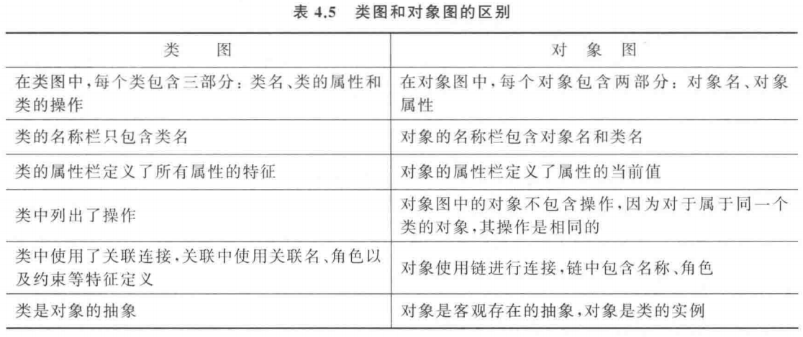
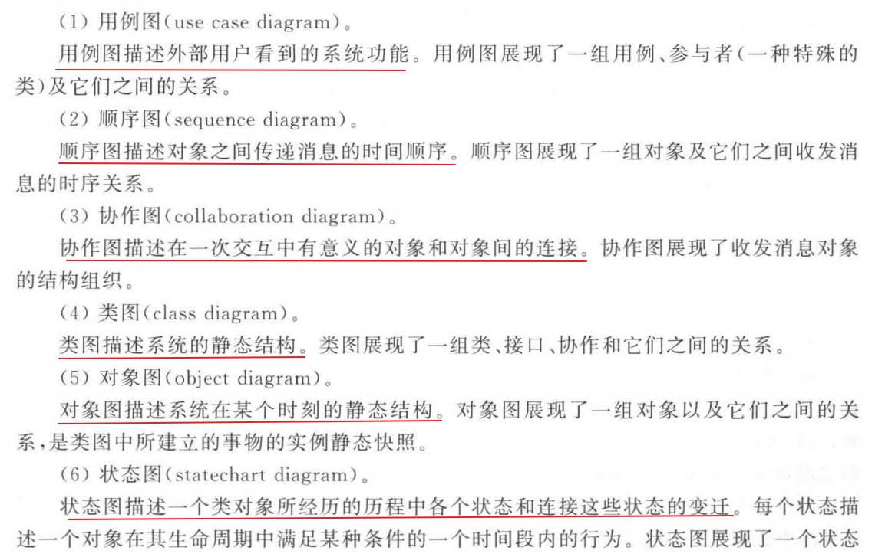
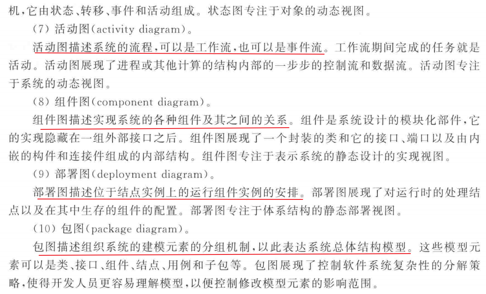

###### 聚合、组合关系的区别

在 UML（Unified Modeling Language，统一建模语言）中，聚合（Aggregation）和组合（Composition）都是用于描述类之间关系的概念，它们表示了对象之间的包含关系。虽然它们在某种程度上都表达了包含的概念，但它们之间存在着重要的区别：

1. **聚合关系（Aggregation）**：
   - 聚合关系表示类之间的“整体与部分”的关系，其中部分对象可以独立存在于整体对象之外。
   - 在聚合关系中，部分对象的生命周期不受整体对象的控制，它们可以被多个整体对象共享。
   - 通常用一个空心的菱形箭头来表示聚合关系，箭头指向整体对象。

   例如，汽车与引擎之间的关系可以用聚合来描述。汽车可以拥有引擎，但是引擎也可以独立存在于汽车之外，而且一个引擎可以被多辆汽车共享。

2. **组合关系（Composition）**：
   - 组合关系也表示类之间的“整体与部分”的关系，但是在组合关系中，部分对象是整体对象的一部分，它们的生命周期与整体对象的生命周期相同。
   - 整体对象负责创建和管理部分对象，部分对象不能被多个整体对象共享。
   - 通常用一个实心的菱形箭头来表示组合关系，箭头指向整体对象。

   例如，汽车与轮胎之间的关系可以用组合来描述。轮胎是汽车的一部分，没有了汽车，轮胎也就失去了存在的意义，而且一个轮胎只能属于一辆汽车。

总的来说，聚合关系表示的是“整体与部分”的松散关系，而组合关系表示的是“整体与部分”的强关系，其中部分对象是整体对象的一部分。

###### 对象和类的关系

对象（Object）和类（Class）之间是一种“实例与抽象”的关系。

1. **类（Class）**：
   - 类是对一组具有相似特征（属性）和行为（方法）的对象的抽象描述。
   - 类定义了对象的共同特征和行为，但它本身并不是一个具体的实体，而是一种模板或蓝图。
   - 类可以看作是对象的类型，它描述了对象应该具有的属性和方法。

2. **对象（Object）**：
   - 对象是类的一个实例，它是类的具体化。
   - 对象是内存中的实体，具有实际的状态和行为。
   - 每个对象都有自己的属性值，可以调用类中定义的方法来执行特定的操作。

类和对象之间的关系可以简单地描述为：类是对象的模板，而对象是类的实例化结果。一个类可以有多个对象实例，每个对象都可以拥有相同或不同的属性值，但它们共享相同的行为（即类中定义的方法）。通过实例化类来创建对象，我们可以在程序中使用这些对象来完成各种操作。

###### 用例之间存在包含、拓展、泛化关系，分析比较

在软件工程中，用例之间的关系可以通过包含、拓展和泛化来描述，它们是用于组织和描述系统功能的重要概念。下面我将分别介绍这三种关系，并进行比较分析：

1. **包含（Include）关系**：
   - **定义**：包含关系表示一个用例（被包含用例）包含了另一个用例（包含用例）的功能。也就是说，被包含用例的行为在执行包含用例时会被执行。
   - **示例**：例如，一个“购物车”用例可能包含了“添加商品到购物车”和“从购物车删除商品”两个子用例。
   - **用途**：包含关系用于将复杂的用例分解为更小的、可重用的模块，提高了用例的可维护性和可扩展性。

2. **拓展（Extend）关系**：
   - **定义**：拓展关系表示一个用例（拓展用例）可以在某种条件下扩展另一个用例（基础用例）的功能，但并不总是发生。当满足一定条件时，拓展用例可以选择性地执行。
   - **示例**：例如，一个“登录”用例可能在“登录失败”时拓展了“密码重置”用例。
   - **用途**：拓展关系用于描述可选功能，提高了系统的灵活性和可定制性。

3. **泛化（Generalization）关系**：
   - **定义**：泛化关系表示一个用例（子用例）继承了另一个用例（父用例）的所有属性和行为，并可以添加自己的特定功能。
   - **示例**：例如，一个“管理员”用例可能泛化了“用户”用例，继承了用户的所有功能，并额外添加了管理员特有的功能。
   - **用途**：泛化关系用于描述类之间的继承关系，通过共享通用的特征和行为，提高了系统的重用性和可扩展性。

比较分析：
- **包含关系 vs. 拓展关系**：包含关系用于描述被包含用例的功能是包含用例的一部分，而拓展关系用于描述在特定条件下扩展基础用例的功能。包含关系是强关联的，而拓展关系是条件性的。
- **拓展关系 vs. 泛化关系**：拓展关系描述了可选功能的添加，而泛化关系描述了类之间的继承关系。拓展关系是在某种条件下扩展功能，而泛化关系是子类继承父类的全部功能。
- **包含关系 vs. 泛化关系**：包含关系用于描述用例之间的模块化组合，而泛化关系用于描述类之间的继承关系。包含关系是组合关系，泛化关系是一种继承关系。

总体而言，这三种关系在用例建模中都扮演着重要的角色，它们分别描述了用例之间的不同依赖关系，帮助开发者更好地理解和设计系统的功能结构。

###### 顺序图和协作图的区别

顺序图（Sequence Diagram）和协作图（Collaboration Diagram）都是用于描述系统中对象之间的交互行为的UML图表，它们在显示对象之间的消息传递和协作方面有所不同。

1. **顺序图**：
   - **焦点**：顺序图侧重于描述对象之间消息交换的时间顺序和时序关系。它强调了消息在对象之间传递的顺序，并突出了消息的时间序列。
   - **表达方式**：在顺序图中，对象被垂直排列在图的顶部，消息从一个对象沿着垂直方向向下传递，显示了消息传递的时间顺序。消息的箭头表示消息的方向，而垂直的虚线表示对象的生存期。
   - **用途**：顺序图常用于描述系统中的时序逻辑，例如，对象之间的交互顺序，消息的传递顺序，以及对象之间的活动调用顺序。

2. **协作图**：
   - **焦点**：协作图侧重于描述对象之间的协作关系和交互结构。它更关注对象之间的结构和关系，而不是时间顺序。
   - **表达方式**：在协作图中，对象被水平或垂直排列，彼此之间通过连接线表示消息传递或协作关系。协作图展示了对象之间的协作结构，但并不强调消息传递的顺序。
   - **用途**：协作图通常用于描述对象之间的静态结构和协作关系，例如，展示对象之间的相互作用和关联。

比较：
- **焦点不同**：顺序图关注消息传递的时间顺序，强调对象之间的时序关系；而协作图关注对象之间的结构和协作关系，强调对象之间的交互结构。
- **表达方式不同**：顺序图以垂直方向展示消息传递的时间顺序，使用箭头表示消息的传递方向；而协作图则以水平或垂直排列对象，并通过连接线表示对象之间的交互关系。
- **用途不同**：顺序图适用于描述对象之间的时序逻辑，例如，消息的传递顺序和活动调用顺序；而协作图适用于描述对象之间的静态结构和协作关系，例如，对象之间的相互作用和关联。

综上所述，顺序图和协作图在UML建模中分别强调了对象之间的时序关系和结构关系，它们可以根据需要选择合适的图表来描述系统中的对象交互行为。

##### 类图和用例图的区别

类图和用例图是 UML（统一建模语言）中两种不同类型的图表，它们分别用于描述软件系统的不同方面，具有以下区别：

1. **焦点不同**：
   - **类图**：主要用于描述系统的静态结构，包括系统中的类、类之间的关系和类的属性与方法。
   - **用例图**：主要用于描述系统的功能需求和用户与系统之间的交互，包括系统的用例、参与者（actor）和用例之间的关系。

2. **表达方式不同**：
   - **类图**：类图通过类、关联、继承、聚合、组合等元素来表示系统的静态结构。类用矩形框表示，类之间的关系可以用箭头连接表示，例如，关联用实线箭头表示，继承用空心箭头表示，聚合和组合用菱形箭头表示。
   - **用例图**：用例图通过用例、参与者（actor）、关系（包括关联、泛化、包含和扩展）等元素来表示系统的功能需求和用户与系统之间的交互。用例用椭圆表示，参与者用人形图标表示，用例之间的关系可以用实线箭头表示，例如，包含关系用包含关键字和实线箭头表示，扩展关系用扩展关键字和虚线箭头表示。

3. **用途不同**：
   - **类图**：类图用于描述系统的静态结构，包括系统中的类、类之间的关系和类的属性与方法，有助于开发人员理解系统的组成部分和类之间的关系，以便进行系统设计和编码。
   - **用例图**：用例图用于描述系统的功能需求和用户与系统之间的交互，包括系统的用例、参与者和用例之间的关系，有助于开发人员和系统用户理解系统的功能和需求，以便进行需求分析和系统规划。

总的来说，类图和用例图是 UML 中两种不同类型的图表，分别用于描述系统的静态结构和功能需求，它们在表达方式、用途和应用场景上有所不同，可以根据需要选择合适的图表来描述系统的不同方面。

##### 类图和对象图

##### 各种图

