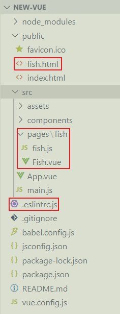
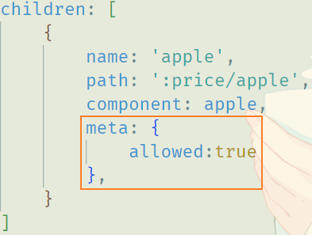
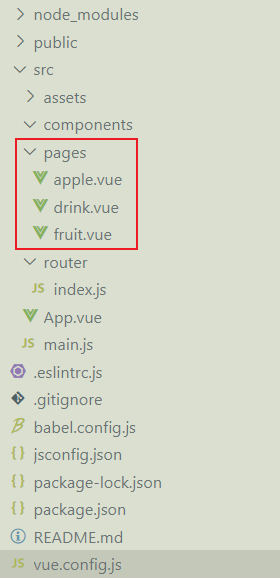
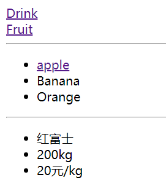
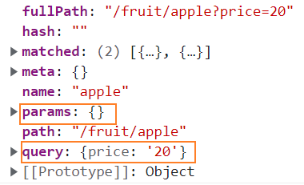
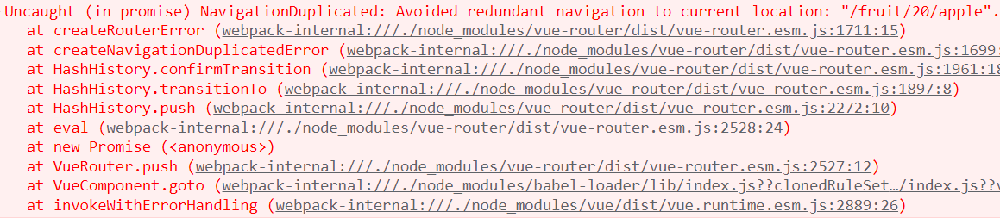
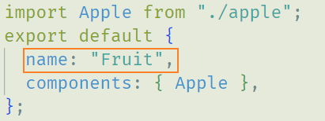
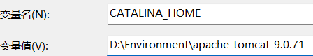

#### 1-路由与路由器

##### a-传统web与单页面web

<br>

>   1.   单页应用又称 SPA（Single Page Application）指的是使用单个 HTML 完成多个页面切换和功能的应用。这些应用只有一个 html 文件作为入口，一开始只需加载一次 js,css 等相关资源。使用 js 完成页面的布局和渲染。页面展示和功能室根据路由完成的。单页应用跳转，就是切换相关组件，仅刷新局部资源。
>   2.   多页应用又称 MPA（Multi Page Application）指有多个独立的页面的应用，每个页面必须重复加载 js,css 等相关资源。多页应用跳转，需要整页资源刷新。
>   3.   单页面更利于前后端分离，后端只需提供接口api，无需再负责页面渲染、输出页面等工作。


##### b-路由与路由器

<br>

>   1.   路由`route`：个人觉得就是提供页面路径与对应组件的一种映射关系(key、value对)。
>   2.   路由器`router`:用于管理和调度各个路由。
>   3.   对于一个应用，一般来说路由器只有一个，但是路由是有多个的。
>   4.   路由器一直监视路径变化，一旦路径变化，路由器就会找到对应路由，完成路由的切换。


#### 2-MPA开发

<br>

##### a-关闭组件命名

<br>

>   1.   干一件很早就想干的事，关闭该死的组件命名规则校验：`Component name "xxx" should always be multi-word“`。
>   2.   在项目根目录中找到或者创建`.eslintrc.js`，添加自定义规则：

```js
module.exports = {
    root: true,
    env: {
        node: true
    },
    'extends': [
        'plugin:vue/essential',
        'eslint:recommended'
    ],
    parserOptions: {
        parser: '@babel/eslint-parser'
    },
    rules: {
        'no-console': process.env.NODE_ENV === 'production' ? 'warn' : 'off',
        'no-debugger': process.env.NODE_ENV === 'production' ? 'warn' : 'off',
        //在rules中添加自定义规则
        //关闭组件命名规则(二选一)
        "vue/multi-word-component-names": "off",
        //添加组件命名规则(二选一)
        "vue/no-multiple-template-root": [
            "error", { "ignore": ['fish'] }  //需要忽略的组件命名
        ],
    },
    overrides: [
        {
            files: [
                '**/__tests__/*.{j,t}s?(x)',
                '**/tests/unit/**/*.spec.{j,t}s?(x)'
            ],
            env: {
                jest: true
            }
        }
    ]
}
```


##### b-多页面

<br>

>   1.   在`src`创建一个`pages`目录用于存放个人页面。
>   2.   `html`页面一般放在`public`目录中，但是也可以放在`pages`中，取决于最后的配置。
>   3.   在`vue.config.js`中配置页面。

1.   在`src`创建一个`pages`目录用于存放个人页面，在`pages`中创建`fish`文件夹存放fish页面的配置文件。

2.   在`public`目录下创建`fish.html`页面，页面内容如下：(当然其实可以在`src/pages/fish`中创建)

     ```html
     <!DOCTYPE html>
     <html lang="">
         <head>
             <meta charset="utf-8">
             <meta http-equiv="X-UA-Compatible" content="IE=edge">
             <meta name="viewport" content="width=device-width,initial-scale=1.0">
             <link rel="icon" href="<%= BASE_URL %>favicon.ico">
             <title><%= htmlWebpackPlugin.options.title %></title>
                 <!-- 获取vue.config.js中设定的title -->
                 </head>
             <body>
                 <noscript>
                     <strong>We're sorry but <%= htmlWebpackPlugin.options.title %> doesn't work properly without JavaScript enabled. Please enable it to continue.</strong>
                         </noscript>
                     <div id="app"></div>
                     <!-- built files will be auto injected -->
                     </body>
                 </html>
     ```

     

3.   在`src/pages/fish`中创建`fish.js`作为入口文件，`Fish.vue`作为fish页面的根组件。

     ```html
     <!--Fish.vue-->
     <template>
         <div id="app">
         </div>
     </template>
     
     <script>
         export default {
         }
     </script>
     
     <style>
     </style>
     ```

     ```js
     import Vue from 'vue'
     import Fish from './Fish.vue'  // 引入fish页面根组件
     
     Vue.config.productionTip = false // 阻止启动生产消息
     
     new Vue({
       render: h => h(Fish),
     }).$mount('#app')
     
     ```

     

4.   最后就是在`vue.config.js`配置页面了：

     ```js
     const { defineConfig } = require('@vue/cli-service')
     module.exports = defineConfig({
         transpileDependencies: true,// 为true时，babel-loader会忽略所有node_modules中的文件
         lintOnSave: false, // 关闭eslint
         pages:{
             index:{
                 entry:'src/main.js',
                 template:'public/index.html',
                 filename:'index.html',
                 title:'首页', 
             },
             fish:{ 
                 entry:'src/pages/fish/fish.js', // 入口文件,类似于main.js
                 template:'public/fish.html',  // 模板文件,类似于index.html
                 filename:'fish.html',		// 文件名
                 title:'dream',		//页标题
             },
         }
     })
     
     ```

     

5.   启动项目就可以通过`http://localhost:8080/fish`访问对应页面了。但是仅仅是可以访问而已。

6.   项目目录：,<br>


##### c-配置webpack打包

<br>

>   1.   由于还不需要打包，也不知道是否需要配置，内容待补。
>   2.   后续有需要，参考[vue多页面配置](https://blog.csdn.net/atu1111/article/details/120552898)。


#### 3-路由

##### 1-路由配置

<br>

>   1.   项目安装`vue-router`插件，cmd输入命令：
>        1.   vue2安装vue-router3：`npm i vue-router@3`。
>        2.   vue3安装vue-router4：`npm i vue-router@34`。
>   2.   配置路由器对象：
>        1.   在`src`下创建一个`index.js`，在其中配置`router`对象。
>        2.   `name`是路由名称，后续会使用。
>        3.   `path`是路径，检测到路径匹配，就会切换对应组件。
>        4.   `component`是路径所映射的组件。
>   3.   在`main.js`中配置使用`vue-router`插件，并且将路由器挂载到vm上。
>        1.   这里还是要提一嘴，导入`router`时，路径`./router/index.js`为啥可以省略为`./router`。查了一下，似乎发现是路径时会去默认找其下的`index.js`，因此可以省。似乎可以自定义，但在此不深入。
>        2.   此外导入时`.js`文件后缀也是可以省略的。

```js
//	src/router/index.js

import VueRouter from 'vue-router'     //引入vue-router

import Home from '../components/Home.vue'	//引入组件
import About from '../components/About.vue'

//创建路由对象
const router = new VueRouter({
    //配置路由规则
    routes: [
        //每个路由规则都是一个对象
        {	
            name: 'home', //路由名称
            path: '/home', //路由路径(key)
            component: Home //路由组件(value)
        },
        // 检测到路径是/home时，自动切换到Home组件
        {
            name:'about',
            path: '/about',
            component: About
        }
    ]
})
export default router //暴露路由对象
```

```js
//	main.js	

import Vue from 'vue'
import App from './App.vue'
Vue.config.productionTip = false

import VueRouter from 'vue-router'	//引入vue-router
import router from './router' 	//引入路由对象，这里的./router是./router/index.js的简写  

Vue.use(VueRouter) 	//使用路由插件

new Vue({
    router, 	//将路由对象挂载到Vue实例上,等同于router:router
    render: h => h(App),
}).$mount('#app')
```

>   ps:提醒一点，给路由对象添加自定义属性，需要在路由对象的`meta`(路由元)中定义。不能直接定义在路由对象中，报错。同时访问自定义属性时，需要使用`$route.meta.xx`，后续在路由守卫中会使用。<br>


##### b-使用路由

<br>

>   1.   在配置挂载完路由器对象后，就可以在组件中使用路由。
>   2.   使用路由方式，就不能使用超链接`<a></a>`来实现跳转，需要使用`vue-router`提供的一个标签`<router-link to=""></router-link>`(到时候会被编译成a标签)。
>        1.   其中`to`写的是跳转的路径。但为了使用vue数据，一般使用`v-bind`来设置`to`属性。也即`<router-link :to=""></router-link>`
>   3.   此外需要使用`<router-view></router-view>`起到占位作用，指明未来切换的组件放在哪儿。

1.   下面使用一个具体案例来演示路由的使用。假设`App.vue`中存在两个连接，点击后分别展示`fruit.vue`、`drink.vue`组件中的水果、饮品列表(两组件略)。

2.   在`src/router/index.js`中配置路由：

     ```js
     // src/router/index.js
     
     import VueRouter from 'vue-router'     
     
     import fruit from '../components/fruit.vue'
     import drink from '../components/drink.vue'
     
     const router = new VueRouter({
         routes: [
             {
                 name: 'fruit', 
                 path: '/fruit', 
                 component: fruit 
             },
             {
                 name: 'drink',
                 path: '/drink',
                 component: drink
             }
         ]
     })
     export default router 
     ```

     

3.   在`App.vue`根组件中使用路由，关于路由路径写法，暂不说明。不过需要说明一下，按理说`App.vue->main.js->router.js(含两组件)`，也就是说没有必要再重复导入两组件，vscode也是这样报错的。但是如果删除组件导入，浏览器控制台就会报错找不到组件。气死了，为了不让vscode报重复导入的错，我们去除导入组件时文件路径的文件`.vue`后缀。

     ```html
     <template>
         <div id="app">
             <router-link :to="{ name: 'drink' }">Drink</router-link><br />
             <router-link :to="{ name: 'fruit' }">Fruit</router-link>
             <hr />
             <router-view></router-view> <!--占位-->
         </div>
     </template>
     
     <script>
         // 似乎不用导入Drink和Fruit组件(但是禁不住项目报错)
         import Drink from "./components/drink"; //省略.vue后缀,就不会报重复导入的错
         import Fruit from "./components/fruit";
         export default {
             name: "App",
             components: {
                 Drink,
                 Fruit,
             },
         };
     </script>
     ```


##### c-多级路由

<br>

>   1.   这时需要说一件事，组件分为普通组件和路由组件。按照约定俗成，路由组件一般放在`src/pages`目录中。<br>
>   2.   子路由就是在路由中配置一个`children`，其值就是子路由数组。
>        1.   注意子路由的`path`不能以`/`开头，这个`/`会自动被添加。
>        2.   访问子路由是需要加上父级路由路径的，当然太长的话也是可以使用`name`访问的。

1.   下面我们在之前的列表中，提供一个`apple.vue`用于点击apple时展示详情。`apple.vue`逻辑省略。提供一下`router/index.js`的逻辑。

     ```js
     // src/router/index.js
     import VueRouter from 'vue-router'     
     
     import fruit from '../pages/fruit.vue'
     import drink from '../pages/drink.vue'
     import apple from '../pages/apple.vue'
     
     const router = new VueRouter({
         routes: [
             {
                 name: 'fruit', 
                 path: '/fruit', 
                 component: fruit,
                 children: [     //子路由
                     {
                         name: 'apple',
                         path: 'apple', //这里的path不要加/，否则会报错
                         component: apple
                     }
                 ]
             },
             {
                 name: 'drink',
                 path: '/drink',
                 component: drink
             }
         ]
     })
     export default router 
     ```

     

2.   在`fruit.app`提供apple的链接。

     ```html
     <!--src/pages/fruit.vue-->
     <template>
         <div>
             <ul>
                 <li><router-link :to="'/fruit/apple'">apple</router-link></li> 
                 <!--加上父级路由-->
                 <li>Banana</li> 
                 <li>Orange</li>
             </ul>
             <hr />
             <router-view></router-view>
         </div>
     </template>
     
     <script>
         import Apple from "./apple";
         export default {
             name: "Fruit",
             components: { Apple },
         };
     </script>
     ```

     

3.   最终结果：<br>


##### d-query传参

<br>

>   1.   先提一下，`router-link`标签`to`属性中路由路径的写法：
>        1.   字符串式：单纯字符串写死路径。
>        2.   模式字符串：使用模式字符串(反引号)，可以并且路径、参数。
>        3.   对象：`{name:'xxx',}`使用`name`匹配路径；`{path:'/fruit',}`使用`path`匹配路径。
>        4.   这里还是要强调，使用`name`匹配路径只能用对象形式。
>   2.   所谓query传参，就是在url路径中拼接参数，如下面代码演示：
>        1.   再次强调，推荐使用`:to`绑定属性，而不是直接使用`to`。
>        2.   对于对象形式，使用query传参需要使用`query`属性，将参数拼接为一个对象传递过去。
>   3.   传参之后，如何获取参数？实际上每个路由组件都存在一个`$route`属性，通过该属性可以获取该路由组件所关联的路由对象。而路由对象中存在一个`query`对象属性，该属性可以接收query方式传递的参数。也即是路由组件可以通过`this.$route.query`获取所有的参数组成的对象(可以使用`v-for`遍历输出哦)。

```vue
<!--字符串传参(不推荐)-->
<router-link :to="'/fruit/apple?price=20'">edit</router-link>

<!--模式字符串传参(price为js变量)-->
<router-link :to="`/fruit/apple?price=${price}`">edit</router-link>

<!--对象形式使用name(推荐)-->
<router-link :to="{
                  name:'apple',
                  query:{
                  price:20
                  }
                  }">
    user
</router-link>

<!--对象形式使用path(推荐)-->
<router-link :to="{
                  path:'/fruit/apple',
                  query:{
                  price:20
                  }
                  }">
    user
</router-link>
```

```html
<template>
    <ul>
        <li>红富士</li>
        <li>200kg</li>
        <li>{{$route.query.price}}元/kg</li>  <!--使用传递参数-->
    </ul> 
</template>

<script>
export default {
    name: "Apple",
    mounted() {
        console.log(this.$route);  // 看看长啥样(下图)
    },
}
</script>
```

记住下面这两个属性！！！<br>


##### e-params传参

<br>

>   1.   所谓`params`传参，其实类似于`restfull`风格，例如`/get/2/fish`，如下面代码演示：
>
>        1.   再次强调，推荐使用`:to`绑定属性，而不是直接使用`to`。
>        2.   使用`params`传参，路由的`path`配置中需要使用`:参数名`去接收参数，参数间使用`/`分割。传参数，直接将参数用类似于路径的形式传入。
>        3.   使用`params`传参，且使用对象形式时，必须使用`name`匹配路径，不能使用`path`去匹配路径。
>
>   2.   传参之后，如何获取参数？实际上每个路由组件都存在一个`$route`属性，通过该属性可以获取该路由组件所关联的路由对象。而路由对象中存在一个`params`对象属性，该属性可以接收query方式传递的参数。也即是路由组件可以通过`this.$route.params`获取所有的参数组成的对象(可以使用`v-for`遍历输出哦)。
>
>   3.   好吧，其实通过之前的截图(`$route`的截图)也知道存在这个`params`属性，正好相互印证了。<br>
>
>        
>
>   4.   此外，其实`:参数名`位置写哪都行，但是传参时注意位置匹配就行。例如一个好玩的子路由路径：
>
>        `children:[{name:'apple',path:':price/apple',component: apple }]`。

1.   使用params传参，需要在路由配置时，设置路由的`path`:

     ```js
     // src/route/index.js
     import VueRouter from 'vue-router'     
     
     import fruit from '../pages/fruit.vue'
     import drink from '../pages/drink.vue'
     import apple from '../pages/apple.vue'
     
     const router = new VueRouter({
         routes: [
             {
                 name: 'fruit', 
                 path: '/fruit', 
                 component: fruit,
                 children: [     //子路由
                     {
                         name: 'apple/:price', // :price用于接受参数
                         path: 'apple', //这里的path不要加/，否则会报错
                         component: apple
                     }
                 ]
             },
         ]
     })
     export default router 
     ```

     

2.   几种params传参形式如下：

     ```vue
     <!--字符串传参(不推荐)-->
     <router-link :to="'/fruit/apple/20'">edit</router-link>
     
     <!--模式字符串传参(price为js变量)-->
     <router-link :to="`/fruit/apple/${price}`">edit</router-link>
     
     <!--对象形式使用path(推荐)(不能使用path)-->
     <router-link :to="{
                       name:'apple',   
                       params:{
                       price:20
                       }
                       }">
         user
     </router-link>
     ```

     

3.   在`fruit.vue`组件中使用：

     ```html
     <!--fruit.vue-->
     <template>
         <div>
             <ul>
                 <li>
                     <router-link
                                  :to="{
                                       name: 'apple',
                                       params: { price: 20 },
                                       }"
                                  >
                         apple
                     </router-link
                         >
                 </li>
                 <!--加上父级路由-->
                 <li>Banana</li>
                 <li>Orange</li>
             </ul>
             <hr />
             <router-view></router-view>
         </div>
     </template>
     
     <script>
         import Apple from "./apple";
         export default {
             name: "Fruit",
             components: { Apple },
         };
     </script>
     ```

     

##### d-优雅的

<br>

>   1.   说实话，在组件中使用`this.$route.params.xx`、`this.$route.query.xx`获取参数。那么长，着实是不怎么优雅。
>   2.   于是乎我们参考之前的知识(vuex)，可以使用计算属性来优化一下。
>   3.   但是，当访问参数较多时，自己手写计算属性就很麻烦。于是乎`vue-router`的路由配置提供了一个`props`属性。该属性为一个对象，其对象的属性可以在路由组件中使用`props`接收。于是乎我们在路由配置的`porps`访问对应参数，在路由组件中接收，即可直接使用。
>   4.   但是仅靠上述知识，我们在`props`中无法访问参数。于是乎`props`存在一种函数形式写法，接收一个参数`route`即为当前路由对象，形如`props(route){ return{} }`。那么通过该路由对象即可访问传递的参数。
>   5.   这里提一下，其实如果是`params`形式传参，使用省略形式`props:true`也可以实现上述功能(框架会帮你实现)。但是仅支持`params`形式传参。
>   6.   此外，要觉得还不优雅，还可以使用ES6拓展语法`...`。直接在路由配置属性`props`函数中返回对象`{...route.params`、`...route.query}`。

1.   使用计算属性优化参数访问：

     ```html
     <!--apple.vue-->
     <template>
         <ul>
             <li>红富士</li>
             <li>200kg</li>
             <li>{{price}}元/kg</li>
         </ul>
     </template>
     
     <script>
         export default {
             name: "Apple",
             computed: {
                 price() {
                     return this.$route.params.price;
                     // return this.$route.query.price;(query、params都行)
                 },
             },
         }
     </script>
     ```

     

2.   使用`props`属性处理参数，不采用对象形式，采用函数形式：

     ```js
     // src/route/index.js
     import VueRouter from 'vue-router'     
     
     import fruit from '../pages/fruit.vue'
     import drink from '../pages/drink.vue'
     import apple from '../pages/apple.vue'
     
     const router = new VueRouter({
         routes: [
             {
                 name: 'fruit', 
                 path: '/fruit', 
                 component: fruit,
                 children: [     //子路由
                     {
                         name: 'apple',
                         path: ':price/apple', 
                         component: apple,
                         // props:{
                         //     price: 200
                         // }
                         props(route) {     //动态路由传参 
                             return {
                                 price: route.params.price
                             }
                         }
                     }
                 ]
             },
             {
                 name: 'drink',
                 path: '/drink',
                 component: drink
             }
         ]
     })
     export default router 
     ```

     ```html
     <!--apple.vue-->
     <template>
         <ul>
             <li>红富士</li>
             <li>200kg</li>
             <li>{{price}}元/kg</li>
         </ul>
       
     </template>
     
     <script>
     export default {
         name: "Apple",
         props:['price'],  // 接收参数
     }
     </script>
     ```

     

3.   使用拓展语法`...`，简化传参过程。

     ```js
     // src/route/index.js
     import VueRouter from 'vue-router'     
     
     import fruit from '../pages/fruit.vue'
     import drink from '../pages/drink.vue'
     import apple from '../pages/apple.vue'
     
     const router = new VueRouter({
         routes: [
             {
                 name: 'fruit', 
                 path: '/fruit', 
                 component: fruit,
                 children: [     //子路由
                     {
                         name: 'apple',
                         path: ':price/apple', 
                         component: apple,
                         // props:true  将params中的数据传递给组件(省略写法)
                         props(route) {     
                             return {
                                 ...route.params,   //将params中的数据传递给组件
                                 ...route.query,  //将query中的数据传递给组件
                             }
                         }
                     }
                 ]
             },
         ]
     })
     export default router 
     ```

     

##### e-浏览历史

<br>

>   1.   浏览器的历史记录是存放在栈这种数据结构中。
>   2.   历史记录存放到栈时，存在两种不同模式：
>        1.   `push`模式：以追加的形式，入栈。
>        2.   `replace`模式：以替换栈顶的方式，入栈。
>        3.   浏览器默认使用的是`push`模式。
>   3.   此外，浏览器的前进后退，并不会删除栈当中的历史记录，只是指针的前后移动。
>   4.   那么，我们如何使用`replace`模式。在标签`<router-link replace="true"></router-link>`添加属性`replace="true"`即为当前路径设置使用`push`模式。当然其实存在简写模式，直接`replace`即可。当然亦可以使用`v-bind`指令绑定属性，即`:replace="true"`。

```html
<router-link replace
             :to="{
                  name: 'xxx',
                  params: {},
                  }"
             >
    apple
</router-link>
```


##### f-函数式路由导航

<br>

>   1.   我们之前使用的`<router-link></router-link>`标签，实际上最后会会编译成`<a></a>`标签，点击从而实现组件切换，这种方式称为声明式的路由导航。
>   2.   但是，有些时候，我们并不想通过链接实现跳转，这时候我们就需要编写函数，在函数中实现跳转。这种跳转方式称为函数式的路由导航。
>   3.    要实现函数式路由导航，可以调用API实现。但是在此之前，需要获取路由器对象，之一不是路由对象。
>        1.   `this.$route`:当前路由对象。
>        2.   `this.$router`:当前路由器对象。
>   4.   `this.$router.push({})`：`push`模式，需要提供一个对象，配置同声明式路由导航的对象形式。
>   5.   `this.$router.replace({})`：`replace`模式，需要提供一个对象，配置同声明式路由导航的对象形式。
>   6.   还是提一嘴，`params`形式传参时，只能使用`name`进行路径匹配。

```html
<!--App.vue-->
<template>
    <div id="app">
        <router-link :to="{ name: 'drink' }">Drink</router-link><br />
        <router-link :to="{ name: 'fruit' }">Fruit</router-link>
        <hr />
        <router-view></router-view>
        <button @click="goto">click</button>  <!--函数式路由导航-->
    </div> 
</template>

<script>
    import Drink from "./pages/drink"; 
    import Fruit from "./pages/fruit";
    export default {
        name: "App",
        components: {
            Drink,
            Fruit,
        },
        methods: {
            goto() {
                this.$router.push({ name: "apple", params: { price: 20 } });
            },
        },
    };
</script>
```

<br>

>   1.   但是实际上，上述的函数式路由导航还会保存：
>
>        
>
>   2.   实际上，在使用路由导航时，`push()`以及`replace()`方法会返回一个`Promise`对象。`Promise`对象期望你能通过参数的形式传递给它两个回调函数，一个成功的回调，一个失败的回调。如果你没提供两个回调函数，则会出错。这种情况的解决方式实际上很简单，就是传两个无逻辑的回调函数即可。

```html
<template>
    <div id="app">
        <router-link :to="{ name: 'drink' }">Drink</router-link><br />
        <router-link :to="{ name: 'fruit' }">Fruit</router-link>
        <hr />
        <router-view></router-view>
        <button @click="goto">click</button>
    </div>
</template>

<script>
    import Drink from "./pages/drink"; 
    import Fruit from "./pages/fruit";
    export default {
        name: "App",
        components: {
            Drink,
            Fruit,
        },
        methods: {
            goto() {
                this.$router.push({ name: "apple", params: { price: 20 } },()=>{},()=>{});
                // 传两个无逻辑回调函数，不然会报错
            },
        },
    };
</script>
```

>   1.   我们其实也可以实现浏览器的前进和后退的逻辑：
>        1.   `this.$router.forward()`：前进。
>        2.   `this.$router.back()`：后退。
>        3.   `this.$router.go(step)`：移动`step`步，正数向前，负数向后。

```html
<template>
    <div id="app">
        <router-link :to="{ name: 'drink' }">Drink</router-link><br />
        <router-link :to="{ name: 'fruit' }">Fruit</router-link>
        <hr />
        <router-view></router-view>
        <button @click="forword">&gt;</button>
        <button @click="back">&lt;</button>
    </div>
</template>

<script>
    import Drink from "./pages/drink"; 
    import Fruit from "./pages/fruit";
    export default {
        name: "App",
        components: {
            Drink,
            Fruit,
        },
        methods: {
            forword() {
                this.$router.go(1);
            },
            back() {
                this.$router.go(-1);
            },
        },
    };
</script>
```


##### g-路由组件钩子函数

<br>

>   1.   关于路由组件，其实在切换路由组件时，前一个路由组件会被杀死。关于这一点其实可以通过`beforeDestroy()`钩子函数验证。切换组件时，前一个路由组件的该钩子函数会被调用。
>   2.   但是，我们可以使用`<keep-alive></keep-alive>`包裹住`<router-view></router-view>`使组件切换时，组件实例不被销毁。
>        1.   但是上述方式，会导致`<router-view>`标签占位的所有路由组件在切换组件时不被销毁。
>        2.   若想细化到某个组件，可以使用`include`属性，配置一个组件名称，该组件实例切换时不会销毁。
>        3.   此外，`include`还可以配置一个组件名称数组，数组中所有组件的实例也均不会销毁。当然此时需要使用`:include`。
>        4.   此外还可以使用`exclude`配置不包含的组件名称(当然也可以是组件名称数组，但是注意使用`:exclude`)。
>        5.   此外还需说明，上述的组件名称指的是组件的`name`配置项。<br>

```html
<keep-alive :exclude="['Fruit']">
    <router-view></router-view>
</keep-alive>
```

>   1.   对于普通组件，我们已经知道其含有8个生命周期钩子函数，但是实际上还有另一个钩子函数`nextTick()`。在了解这个钩子函数前，需要回顾[组件开发案例](./6.组件化开发案例.md)中的9-修改描述中的`$nextTick()`方法(将回调函数延迟在下一次dom更新数据后调用，即当数据更新了在DOM中渲染后自动执行该函数)。
>   2.   `vm.nextTick(fun)`钩子函数在下一次DOM渲染时执行钩子函数。
>   3.   所以总而言之，普通组件的钩子函数：8+1。
>   4.   而对于路由组件而言，多出两个钩子函数：
>        1.   `activated()`:在路由组件被激活时执行。
>        2.   `deactivated()`:在路由组件被切走时执行，注意不是销毁时。
>   5.   两个钩子函数存在的意义何在？由于`<keep-alive>`的存在导致组件在切走时不一定被销毁。此时假设我在组件中放一个计时器，那么想实现切走组件时删除计时器。你可能会使用`beforeDestory()`，但是不好意思，它在切走时并不一定被销毁，这时就需要`deactivated()`出手。
>   6.   那么，对于路由组件而言，钩子函数：8+1+2。


#### 4-路由守卫

##### a-全局前置路由守卫

<br>

>   1.   我们有时候需要在路由组件前执行一段代码，用于检验访问权限。一般来说，这段代码通常会写在路由守卫中。
>   2.   路由守卫逻辑通常在`src/router/index.js`中编写，在创建`router`之后，以及暴露`router`之前。
>   3.   所谓全局前置路由守卫，也即`beforeEach(callback)`。其中`callback`是一个回调函数，在初始化时调用一次，此后每次切换任意路由组件时都会被调用。
>   4.   `callback`回调函数存在三个参数`to、from、next`：
>        1.   `to`:一个路由对象，表示去哪儿。
>        2.   `from`:是一个路由对象，表示从哪里来。
>        3.   `next`：是一个函数，调用该函数后，表示放行，继续执行后续逻辑。
>   5.   但是我们有时候进行放行判断的逻辑极其复杂，这时我们可以在路由对象中自定义一个属性，布尔类型。`true`表示可以放行。
>   6.   给路由对象添加自定义属性，需要在路由对象的`meta`(路由元)中定义。不能直接定义在路由对象中，会报错。同时访问自定义属性时，需要使用`$route.meta.xx`。

```js
// src/router/index.js
import VueRouter from 'vue-router'     

import fruit from '../pages/fruit.vue'
import drink from '../pages/drink.vue'
import apple from '../pages/apple.vue'

const router = new VueRouter({
    routes: [
        {
            name: 'fruit', 
            path: '/fruit', 
            component: fruit,
            meta: {
                allowed:true //自定义属性,指明是否允许直接访问
            },
            children: [
                {
                    name: 'apple',
                    path: ':price/apple', 
                    component: apple,
                }
            ]
        },
        {
            name: 'drink',
            path: '/drink',
            component: drink,
            meta: {
                allowed:true //自定义属性,指明是否允许直接访问
            },
        }
    ]
})
router.beforeEach((to, from, next) => {  //全局前置路由守卫
    let author='admin' // 假设访问用户
    if (to.meta.allowed) { //判断是否允许直接访问(包含allowed,且为true)
        next()  // 放行
        return
    }
    if(author==='dreamfish'){  // 判断用户
        next()	// 放行
    }else{
        console.log('无权限访问');
    }
})5
export default router 
```


##### b-全局后置路由守卫

<br>

>   1.   路由守卫逻辑通常在`src/router/index.js`中编写，在创建`router`之后，以及暴露`router`之前。
>   2.   所谓全局前置路由守卫，也即`afterEach(callback)`。其中`callback`是一个回调函数，在初始化时调用一次，此后每次切换任意路由组件之后时都会被调用。
>   3.   `callback`回调函数存在三个参数`to、from`：
>        1.   `to`:一个路由对象，表示去哪儿。
>        2.   `from`:是一个路由对象，表示从哪里来。
>        3.   注意不存在`next`函数，没有意义。

```js
// src/router/index.js

import VueRouter from 'vue-router'     

import fruit from '../pages/fruit.vue'
import drink from '../pages/drink.vue'
import apple from '../pages/apple.vue'

const router = new VueRouter({
    routes: [
        {
            name: 'fruit', 
            path: '/fruit', 
            component: fruit,
            children: [
                {
                    name: 'apple',
                    path: ':price/apple', 
                    component: apple,
                }
            ]
        },
        {
            name: 'drink',
            path: '/drink',
            component: drink,
        }
    ]
})
router.afterEach((to, from) => {  // 全局后置路由守卫
    document.title = to.name || '首页'  //动态修改页面标题
})
export default router 
```

>   1.   顺便提一句，上述逻辑实际上存在一点问题，就是`afterEach()`会在切换组件后调用，相当于时页面形成后修改的页面标题。
>   2.   此外为了解决延时问题，最后将`.html`文件中的标题也改为`首页`。当然你也可以修改`vue.config.js`配置文件中`pages`中的对应页面的`title`设置。
>   3.   关于`||`：短路符号，前面为`true`后不执行，为`false`后执行。


##### c-局部路由守卫之path守卫

<br>

>   1.   首先`path`守卫是一个局部路由守卫，它应该配置在路由对象中。其实就是配置一个`beforeEnter()`函数。但是其参数并非回调函数。
>   2.   `beforeEnter()`参数有三，`to、from、next`：
>        1.   `to`:一个路由对象，表示去哪儿。
>        2.   `from`:是一个路由对象，表示从哪里来。
>        3.   `next`：是一个函数，调用该函数后，表示放行，继续执行后续逻辑。
>   3.   `beforeEnter()`在进入当前路由时被调用。但是注意不存在`afterEnter()`一说，不！存！在！

```js
// src/router/index.js
import VueRouter from 'vue-router'     

import fruit from '../pages/fruit.vue'
import drink from '../pages/drink.vue'
import apple from '../pages/apple.vue'

const router = new VueRouter({
    routes: [
        {
            name: 'fruit', 
            path: '/fruit', 
            component: fruit,
            children: [
                {
                    name: 'apple',
                    path: ':price/apple', 
                    component: apple,
                    beforeEnter(to, from, next) {	// path局部路由守卫
                        let author='admin'
                        if (author === 'dreamfish') {
                        next()
                        } else {
                        alert('该页面需要权限')
                        }
                    }
                }
            ]
        },
        {
            name: 'drink',
            path: '/drink',
            component: drink,
        }
    ]
})
export default router 
```


##### d-局部路由组件之component守卫

<br>

>   1.   component守卫是局部守卫，其代码逻辑是写在组件中(`xxx.vue`)。
>   2.   `beforeRouteEnter(to,from,next)`：进入该路由组件之前执行。
>   3.   `beforeRouteLeave(to,from,next)`:离开路由组件之前执行。
>   4.   上述两个放在在普通组件中不会触发，只有路由组件才触发。

```html
<!--apple.vue-->
<template>
    <div>
        <ul>
            <li>红富士</li>
            <li>{{price}}元/kg</li>
        </ul>
    </div>
</template>

<script>
    export default {
        name: "Apple",
        props:['price'],
        beforeRouteEnter(to,from,next){	//局部路由组件
            console.log('beforeRouteEnter');
            next();
        },
        beforeRouteUpdate(to,from,next){  //局部路由组件
            console.log('beforeRouteUpdate');
            next();
        },
    }
</script>
```


#### 5-部署上线

##### a-浏览器路由模式

<br>

>   1.   浏览器的路由存在两种路由模式：
>        1.   `hash`模式：路径中带`#`。如：`http://localhost:8080/#/drink`。
>        2.   `history`模式：路径中不带`#`。如：`http://localhost:8080/drink`
>   2.   默认是`hash`模式。如要配置，在`src/router/indez.js`文件中，在创建路由器对象时添加一个`mode`配置，值可以选`'hash'、'history'`。
>   3.   关于`hash`模式，`#`之后的路径称为`hash`，这个`hash`不会作为路径一部分发送到服务器。

```js
// src/router/index.js
import VueRouter from 'vue-router'     

import fruit from '../pages/fruit.vue'
import drink from '../pages/drink.vue'
import apple from '../pages/apple.vue'

const router = new VueRouter({
    mode: 'history',	// 浏览器路由模式
    routes: [
        {
            name: 'fruit', 
            path: '/fruit', 
            component: fruit,
            children: [
                {
                    name: 'apple',
                    path: ':price/apple', 
                    component: apple,
                }
            ]
        },
        {
            name: 'drink',
            path: '/drink',
            component: drink,
        }
    ]
})
export default router 
```


##### b-打包

<br>

>   1.   源代码`xxx.vue`浏览器无法识别，浏览器只认`html、css、js`。
>   2.   vue项目需要使用项目构建工具打包编译，例如可以使用`webpack`来打包编译生成`html、css、js`。`vue-CLI`就是基于`webpack`的。
>   3.   打包命令：cmd运行`npm run build`即可。此时项目根目录下出现`dist`文件夹，里面就是打包好的`html、css、js`等文件。
>   4.   补充一点：在`src/router/indez.js`文件中，在创建路由器对象时添加一个`base`声明项目名称。此后访问路由页面都会加上这个项目名称`http://ip:port/base值/xxx`，当然除了根目录。并且没有这个项目名你还访问不了。

```js
// src/router/index.js
import VueRouter from 'vue-router'     

import fruit from '../pages/fruit.vue'
import drink from '../pages/drink.vue'
import apple from '../pages/apple.vue'

const router = new VueRouter({
    mode: 'history',
    base:'/vue/',  // 项目名称，主要是在tomcat中，是部署在/webapp/vue/下的
    routes: [
        {
            name: 'fruit', 
            path: '/fruit', 
            component: fruit,
            children: [
                {
                    name: 'apple',
                    path: ':price/apple', 
                    component: apple,
                }
            ]
        },
        {
            name: 'drink',
            path: '/drink',
            component: drink,
        }
    ]
})
export default router 
```


##### c-Tomcat部署

<br>

>   1.   配置`src/router/index.js`。
>   2.   配置`vue.config.js`。`publicPath`值也可以被设置为空字符串 (`''`) 或是相对路径 (`'./'`)，这样所有的资源都会被链接为相对路径，这样打出来的包可以被部署在任意路径。
>   3.   打包文件。说一下上述配置主要是由于文件部署在tomcat的`/webapps/vue/`目录下。所以需要配一下`/vue/`。
>   4.   转移文件 打包好`dist`文件夹中的`index.html`与其他静态文件 放入`tomcat `安装目录 `webapps `文件夹下的自定义目录(我这里是`/vue/`)。
>   5.   cmd运行`startup.bat`命令，启动tomcat。

```js
// src/router/index.js
import VueRouter from 'vue-router'     

import fruit from '../pages/fruit.vue'
import drink from '../pages/drink.vue'
import apple from '../pages/apple.vue'

const router = new VueRouter({
    mode: 'history',
    base:'/vue/',	// 自动添加/vue/
    routes: [
        {
            name: 'fruit', 
            path: '/fruit', 
            component: fruit,
            children: [
                {
                    name: 'apple',
                    path: ':price/apple', 
                    component: apple,
                }
            ]
        },
        {
            name: 'drink',
            path: '/drink',
            component: drink,
        }
    ]
})
export default router 
```

```js
// vue.config.js
const { defineConfig } = require('@vue/cli-service')
module.exports = defineConfig({
    transpileDependencies: true,
    lintOnSave: false, 
    publicPath: process.env.NODE_ENV === 'production' ? '/vue/' : '/',
    //判断,生产环境使用`/vue/`,否则开发环境使用`/vue/`。
    pages:{
        index:{
            entry:'src/main.js',
            template:'public/index.html',
            filename:'index.html',
            title:'首页', 
        },
    },
})
```

>   1.   但是，上述部署项目仍存在问题，由于时`history`模式，刷新时后面的路由路径会被传到服务器，但是根本找不到对应资源，就会导致报错。
>   1.   解决方式，部署目录中新建`WEB-INF`，其下配置`web.xml`如下(基本解决)：

```xml
<!--web.xml-->
<?xml version="1.0" encoding="UTF-8"?>
<web-app xmlns="http://xmlns.jcp.org/xml/ns/javaee"
         xmlns:xsi="http://www.w3.org/2001/XMLSchema-instance"
         xsi:schemaLocation="http://xmlns.jcp.org/xml/ns/javaee
                             http://xmlns.jcp.org/xml/ns/javaee/web-app_4_0.xsd"
         version="4.0"
         metadata-complete="true">

    <error-page>
        <error-code>404</error-code>  <!--404错误时，跳转/index.html-->
        <location>/index.html</location>
    </error-page>
</web-app>
```

>   1.   另外提一点，想要使用`startup.bat`命令启动tomcat。是需要额外配置tomcat环境的：<br><br>
