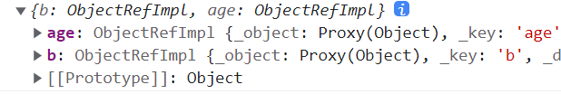

#### 1-vue3初识

##### a-注意事项

<br>

>   1.   vue3中，`<template></template>`中可以有多个根标签，不在要求只有一个根标签。
>   2.   vue3中，`data`必须是一个函数形式，不能使用对象形式。
>   3.   实际上`vue3`中返回对象中的属性会与`data`函数返回对象的属性合并成为组件对象的属性,返回对象中的方法会与`methods`中的方法合并成功组件对象的方法，但是不建议混用。二者若有重名, `setup`优先。
>   4.   一般不要混合使用: `methods`中可以访问`setup`提供的属性和方法, 但在`setup`方法中不能访问`data`和`methods`。这点通过生命周期可以知道，`setup()`在`beforeCreate()`之前1执行，没有`this`存在，无法访问。
>   5.   `setup`不能是一个`async`函数, 因为返回值不再是`return`的对象, 而是`promise`, 模板看不到`return`对象中的属性数据。

##### b-项目创建

<br>

>   1.   官网：[vue3](https://cn.vuejs.org/)
>
>   2.   vue3项目可以使用`vue-cli`创建，但是目前流行使用`create-vue`脚手架创建。
>
>   3.   `create-vue`脚手架基于vite项目构建工具实现的，`vue-cli`脚手架基于webpack构建工具实现的。
>
>   4.   但是相较于webpack，vite服务器启动速度非常快，性能更加好。
>
>   5.   使用`vue-cli`创建vue3项目(<font color=red>不会使用到`vite`，不会`vite`建议使用该方式创建项目</font>)：
>
>        1.   要求`vue-cli`版本至少`4.5.0`。
>        2.   `vue --version`查看版本，不够使用`npm install -g @vue-cli`。
>        3.   构建vue3与构建vue2差不多，就是期间选择时使用默认vue3创建项目即可。具体参考[组件](./5.组件.md)部分知识。<br>
>
>   6.   (`vite`配置方式存在学习成本)使用`create-vue`创建项目：
>
>        1.   切换到项目的创建目录。
>
>        2.   cmd运行命令`npm init vue@latest`安装`create-vue`脚手架的同时创建vue3工程。如果已经安装了`create-vue`脚手架，也采用这种方式。若是报错，可在管理员权限下运行(安装`gsudo`，运行`sudo`也行)。
>
>        3.   若是第一次使用，会提醒安装`create-vue`脚手架，键入`y`安装即可。<br>
>
>        4.   之后输入项目名称，回车即可：<br>
>
>        5.   此后，会配置一些东西，不管全选`No`，也就是一路回车就行了。
>
>             
>
>        6.   最后，进入创建好的项目的根目录，运行命令`npm install`(缩写:`npm i`)。<br>
>
>        7.   记住，启动项目的命令是`npm run dev`(`npm run serve`是`vue-cli`脚手架的)。


#####  c-项目结构

<br>

>   1.   `vue-cli`创建的项目目录结构如下：<br>
>   2.   `create-vue`创建项目目录结构如下：<br>
>   3.   对vite创建的工程，注意：
>        1.   `setup`
>        2.   `index.html`放在了`public`的外面；vite以`index.html`作为入口，不再使用`main.js`作为入口。
>        3.   对于vite构建工具来说，配置文件是`vite.config.js`，相当于webpack当中的`vue.config.js`。如果需要配置代理的话，需要在`vite.config.js`中配置。至于如何配置，参考[vite官网](https://cn.vitejs.dev/config/server-options.html)。
>        4.   启动服务器时，端口号也不一样了。当然了内部实现也不一样了，毕竟启动、更新更快。
>   4.   下面简单研究一下`main.js`文件，如下：

```js
// main.js

// vue3中，不再使用Vue这个类，而是使用createApp函数来创建app实例，
import { createApp } from 'vue'

// 引入App根组件
import App from './App.vue'

// createApp(App).mount('#app')

// 通过createApp函数创建app实例，app实例类似于Vue2中的vm实例
// app和vm的区别:app更加轻量级，没有vm实例中的很多属性和方法

const app = createApp(App)

// 将app实例挂载到指定位置
app.mount('#app')
```


#### 2-setup

##### a-window.proxy

<br>

>   1.   在学习`proxy`之前，先复习一下`object.definePrpperty()`：
>        1.   `getter`在读取数据时实现拦截。
>        2.   `setter`在修改数据时实现拦截，vue在这里实现响应处理。
>        3.   但是新增、删除、数组下标访问都是默认不存在响应式。
>   2.   在vue3中使用的是`window.Proxy`，访问、修改、新增、删除、数组下标访问都是可以实现响应式的。再也不需要`Vue.set()、this.$set()`了。
>   3.   可通过`new Proxy(targetObj,options)`创建代理类对象:
>        1.   `targetObj`:被代理对象。
>        2.   `options`：配置对象。这要是通过这些配置项来实现响应式处理的。
>   4.   下面具体说一下`options`配置对象，里面可以配置下面三个函数。
>        1.   `get(target,propertyName){}`：读取属性时，自动执行。
>             1.   `target`是被代理的的对象。
>             2.   `propertyName`是访问的属性名称，是一个字符串。所有通过`target[propertyName]`访问属性。
>             3.   该方法需要返回当前访问的属性值，例如`return target[propertyName]`。
>        2.   `set(target,propertyName,value){}`：当<font color=red>修改属性、新增属性</font>时自动被调用。
>             1.   `target`是被代理的的对象。
>             2.   `propertyName`是新增或者修改的属性名称，是一个字符串。
>             3.   `value`是修改或者添加属性的新值。
>             4.   该方法需为被代理对象新增或者修改属性，例如`target[propertyName]=value`。
>        3.   `deleteProperty(target,propertyName){}`:删除某个属性时，会自动执行。
>             1.   `target`是被代理的的对象。
>             2.   `propertyName`是删除的属性名称，是一个字符串。
>             3.   需要返回删除的结果(`Boolean`类型)，例如`return delete target[propertyName]`。
>   5.   但是，实际上vue3(还有一些其他框架)，其实并不直接使用`target[propertyName]`访问被代理对象的属性。而是使用ES6的反射机制，即通过`Reflect`对象。
>        1.   `Reflect.get(target,propertyName)`:获取。
>        2.   `Reflect.set(target,propertyName,value)`:新增或修改。
>        3.   `Reflect.seleteProperty(target,propertyName)`:删除。
>   6.   还是需要重点强调：<font color=red>`Proxy`的代理是递归进行的，对象的所有属性、对象属性的属性、...都会被代理</font>。
>   7.   详细使用方式参考下面实例：顺便提一嘴，通过下图测试其实可以知道`Proxy`是递归代理的。所以`team`下的`fish`的属性均被代理了<br>

```js
let team = {    //被代理的对象
    'fish': {
        age: 18,
        job: 'student'
    },
    'cat': {
        age: 19,
        job: 'student'
    }
}
let proxy = new Proxy(team, {    //代理对象
    get(target, propertyName) {
        console.log('get is called');
        return Reflect.get(target, propertyName)  //使用反射机制 
    },
    set(target, propertyName, value) {
        console.log('set is called');
        Reflect.set(target, propertyName, value)
    },
    deleteProperty(target, propertyName) {
        console.log('delete is called');
        return Reflect.deleteProperty(target, propertyName)
    }
})
```


##### b-setup

<br>

>   1.   vue3任然可以使用`data、methods、computeds、watch、生命周期钩子`这些配置项(向下兼容)，但是不建议在vue3项目中这样用，即不建议vue2和vue3语法混用。
>   2.   vue3提供一个新的配置项`setup`，`data、methods、computeds、watch、生命周期钩子,...`等，都要配置到`setup`中。`setup`是一个新的`option`, 所有的组合API函数都在此使用, 只在初始化时执行一次,函数如果返回对象, 对象中的属性或方法, 模板中可以直接使用。
>   3.   具体使用步骤：
>        1.   在`setup`函数中定义的变量，可以视作vue2中的`data`。
>        2.   在`setup`函数中定义的函数，可以视作vue2中的`methods`。
>        3.   注意要想在模板语法中使用，最终`setup`需要返回这些变量、函数所组成的对象。
>   4.   其实`setup`还可以返回一个渲染函数。
>        1.   通过`import {h} from 'vue'`。
>        2.   `h`函数可以用于创建dom元素。
>   5.   `setup`中的`this`是`undefined`，所以在`setup`函数中`this`不可以。
>   6.   此外vue3中，非要使用`data`的话，`data`也必须是一个函数形式，不在支持对象形式。

```html
<!--setup返回对象-->
<script>
    export default {
        name: 'App',
        setup() {
            let msg = 'Hello vue3!'
            function change(){
                msg = 'Hello dreamfish!'	// 不存在this,无响应式
            }
            return {
                msg,
                change
            }
        }
    }
</script>

<template>
    <div>
        <h1>{{ msg }}</h1>
        <button @click="change">change</button>
    </div>
</template>
```

```html
<!--setup返回渲染函数-->
<script>
    import {h} from 'vue';
    export default {
        setup(){
            return () => h('div', 'Hello World') // 返回渲染函数
        }
    }
</script>

<template>  
</template>
```


##### c-ref函数

<br>

>   1.   其实，我们会发现参照上述写法，`setup`中的变量是不存在响应式的。
>
>        1.   这主要是因为创建`msg`的创建和修改都是在`setup`函数中，根本不存在代理访问，自然也就不存在响应式处理(没给vue机会)。
>
>   2.   这时，实际上我们可以使用`ref`函数，为`setup`中变量创建响应式。
>
>        1.   通过`import {ref} from 'vue'`导入`ref`函数。
>        2.   使用方式也很简单，就是将定义的变量值使用`ref()`包裹。
>        3.   `ref()`返回的对象(引用的实现实现对象，Reference Implement)中存在`value`属性，这个`value`是有响应式处理的，其底层使用了`Object.defineProperty`完成响应式。
>        4.   在模板语法中访问对应数据，本来应为`xxx.value.xxx`或者`xxx.value`；但是`.value`可以省略哦。
>
>   3.   当`ref()`包裹基本数据类型时：
>
>        1.     通过下图其实可以知道`value`属性通过`Object.defineProperty`实现了代理和响应式。<br> 
>
>   4.   当`ref()`包裹对象类型时：
>
>        1.    通过下图其实可以知道`value`属性通过`Object.defineProperty`实现了代理和响应式。但是同时`vlue`的值又使用了`Proxy`实现了代理和响应式。
>
>              
>
>   5.   当`ref()`包裹基本数据类型，响应式实现：`Object.defineProperty`。
>
>   6.   当`ref()`包裹对象类型，响应式实现：`Object.defineProperty`+`Proxy`。实际上底层调用了`reactive`函数。
>

```html
<script>
    import { ref } from "vue";  // 导入ref函数
    export default {
        setup() {
            let nameRefImpl = ref("deramfish");
            let fishRefImpl = ref({ name: "deramfish", age: 18 });

            console.log(nameRefImpl);
            console.log(fishRefImpl);

            function change() {
                nameRefImpl.value = "fish";
                // fishRefImpl.value = { name: "fish", age: 20 };
                // fishRefImpl.value其实是一个proxy对象，底层实现了递归代理，都有响应式的能力
                fishRefImpl.value.name = "fish";
                fishRefImpl.value.age = 20; 
            }
            return {nameRefImpl,fishRefImpl,change};
        },
    };
</script>

<template>
    <h1>{{ nameRefImpl }}</h1><br>
    <!--省略.value-->
    <h1>{{ fishRefImpl.name }}</h1><br>
    <!--省略.value-->
    <button @click="change">click</button>
</template>
```


##### d-reactive函数

<br>

>   1.   `ref()`通常适合基本数据类型(处理对象类型时，底层还是会调用`reactive`函数)。
>   2.   `reactive()`函数通常适合对象类型。被该函数包裹的对象，会通过`Proxy`实现递归代理，从而实现响应式。
>   3.   使用方式：
>        1.   通过`import {reactive} from 'vue'`导入`ref`函数。
>        2.   使用方式也很简单，就是将定义的变量值使用`reactive()`包裹。<br>
>   4.   故而，实际上我们再使用时，都是使用代理对象，对代理对象进行修改，目标对象也会相应修改，并且页面也会重新渲染。

```html
<script>
    import { reactive } from "vue";  // 导入reactive函数
    export default {
        setup() {
            let fishProxy = reactive({ name: "deramfish", age: 18 });

            console.log(fishProxy); 

            function change() {
                fishProxy.name = "fish";
                fishProxy.age = 20;
            }
            return { fishProxy, change };
        },
    };
</script>

<template>
    <h1>{{ fishProxy.name }}</h1>
    <br />
    <h1>{{ fishProxy.age }}</h1>
    <br />
    <button @click="change">click</button>
</template>
```

>   个人理解：其实到这里，一个疑惑可以解决了，`setup`函数中非要定义变量，直接在写在返回的对象中不香嘛。但是实际上由于我们的函数逻辑很麻烦，不会直接写法返回对象中。但是这些函数中通常要访问这些变量，所以这些变量会先定义，而不是直接在写在返回的对象中。


##### e-props

<br>

>   1.   依旧使用配置项`props`接收父组件传递的参数。
>   2.   但是在`setup`函数中并不存在`this`。但是`setup(props,context)`其实会自动提供两个参数；其中`props`就是父组件传过来的数据，`context`是组件上下文对象(后续会讲)。
>        1.   而我们就可以在`setup`函数中使用`props`中的数据。
>        2.   参数`props`被包装为一个代理`Proxy`对象，也是具有响应式的。
>   3.   注意，`setup`函数中的`props`仅仅用于函数中访问，并不是用于接收父组件传参。父组件传参还是使用`props`配置项。

```html
<!--children.vue-->
<template>
</template>

<script>
    export default {
        name: 'Children',
        props:['name','age'],  // 接收参数
        setup(props){  // 传参props
            console.log(props)  // 使用props
        }   
    }
</script>
```


#### 3-vue3生命周期


##### a-简介

<br>

>   1.   相较于vue2，vue3中生命周期将`beforeDestroy()、destroy()`修改为`beforeUnmount()、unmounted()`，即卸载前、卸载后。
>   2.    `beforeUnMount `钩子函数会在组件销毁(解绑)之前执行，`unmounted `钩子函数会在组件销毁(解绑)之后执行。
>   3.   `beforeCreate()`之前`setup()`函数就执行了。
>   4.   vue3存在两种配置方式：
>        1.   直接在实例中进行的配置，叫做选项式API(options api)。
>        2.   在`setup`函数中进行的配置，使用的api叫做组合式api(例如:`ref、reactive`等)。


##### b-生命周期钩子函数

<br>

>   1.   vue3中，生命周期钩子函数存在两种写法：
>        1.   使用选项式API，直接在实例中配置即可。
>        2.   使用组合式API。
>   2.   关于生命周期的组合式API，其与选项式API对应关系如下：
>        1.   `beforeCreate()、created()`的执行晚于`setup()`，但是执行时机相接近。所以一般使用`setup()`替代二者。当然非要使用`beforeCreate()、created()`请使用选项式API。此时也就<font color=red>说明在`setup()`函数中`this`不存在</font>。
>        2.   使用组合式API，需要先使用`import {xxx} from 'vue'`导入对应api。
>        3.   组合式API函数需要提供一个回调函数(普通函数、箭头函数均可)，会自动在对应时机被调用。
>        4.   组合式API创建的钩子函数中可以正常使用`setup()`函数的参数，以及内部定义的变量、函数。

|        选项式 API         | 组合式 API                              |
| :-----------------------: | :-------------------------------------- |
| `beforeCreate`，`created` | 无对应函数，此逻辑直接写道`setup`中即可 |
|       `beforeMount`       | `onBeforeMount`                         |
|         `mounted`         | `onMounted`                             |
|      `beforeUpdate`       | `onBeforeUpdate`                        |
|         `updated`         | `onUpdated`                             |
|      `beforeUnmount`      | `onBeforeUnmount`                       |
|        `unmounted`        | `onUnmounted`                           |
|      `errorCaptured`      | `onErrorCaptured`                       |
|      `renderTracked`      | `onRenderTracked`                       |
|     `renderTriggered`     | `onRenderTriggered`                     |
|        `activated`        | `onActivated`                           |
|       `deactivated`       | `onDeactivated`                         |

```html
<template>
    <child name="'fish'" age="20"></child>
</template>

<script>
    import Child from './children.vue';
    import { onBeforeMount,onMounted,onBeforeUnmount,onUpdated } from 'vue';
    // 导入函数
    export default {
        name: 'Parent',
        components: {
            Child
        },

        setup(){ 
            console.log('the setup was used to replace the beforeCreate,created')
            // 组合式API
            onBeforeMount(()=>{
                console.log('onBeforeMount')
            })
            onMounted(()=>{
                console.log('onMounted')
            })
            onBeforeUnmount(()=>{
                console.log('onBeforeUnmount')
            })
            onUpdated(()=>{
                console.log('onUpdated')
            })
        },
        // 选项式API
        unmounted() {
            console.log('unmounted')
        },
        beforeUpdate() {
            console.log('updated')
        },    
    }
</script>
```


#### 4-组件自定义事件

##### a-自定义事件

<br>

>   1.   在`setup()`函数中定义自定义组件事件时，不同于vue2。前面提到，`setup(props,context)`存在两个参数。其中`context`就是组件的上下文对象。其中:
>        1.   `context.emit("my-event",params)`：触发事件。
>        2.   似乎只能通过子组件标签中使用`v-bind`也即是`@xxx`绑定事件。
>             1.   父组件无法获取子组件实例。
>             2.   (先使用vue2中的形式)你可能想使用选项式钩子函数。然后使用`this.$refs.xxx.$on()`绑定，但是没有`$on`这个属性，就很无语。
>   2.   `context`实际上由三部分组成,即`{attrs, slots, emit}`：
>        1.   `attrs`: 包含没有在`props`配置中声明的属性的对象, 相当于` this.$attrs`
>        2.   `slots`: 包含所有传入的插槽内容的对象, 相当于 `this.$slots`
>        3.   `emit`: 用来分发自定义事件的函数, 相当于 `this.$emit`

```html
<!--children.vue-->
<template>
    <button @click="on">on</button>
</template>

<script>
    export default {
        name: 'Children',
        setup(props,context) {
            function on(){
                context.emit('myEvent',{name:'fish',age:18})
                // 触发组件的myEvent事件，并传递数据
            }
            return {on}
        },
    };
</script>
```

```html
<!--parent.vue-->
<template>
    <children @myEvent="log"></children> <!-- 监听子组件的myEvent事件 -->
</template>

<script>
    import children from './children.vue';
    export default {
        components: { children },
        name: 'Parent',
        setup(props,context) {
            function log(data){
                console.log(data)
            }
            return {log}
        },
    };
</script>
```


##### b-全局事件总线

<br>

>   1.   vue3中要使用全局事件总线，麻烦的很。
>        1.   在项目中使用命令`npm i mitt`安装`mitt`(报错，则在管理员权限下运行)。
>        2.   在`src`文件夹下创建`utils`文件夹，在文件夹下创建`event-nus.js`文件。
>        3.   其中配置见下面。
>   2.   在组件中通过`import emitter form './utils/event-bus.js' `导入emitter对象。
>   3.   `emitter`对象其实就相当于全局事件总线对象。
>        1.   `emitter.emit("my-event",params)`：触发事件。
>        2.   顺便提一嘴，`emitter.once('my-event',function)`不存在。
>        3.   `emitter.on("my-event",function)`：为组件绑定事件，为事件绑定回调函数，此种方式一般用在`mounted()`钩子函数中。
>        4.   `context.off('my-event')`:为当前组件实例解绑选定事件。不能传递数组，会将数组中时间解绑。当然还可以`context.all.clear()`解绑当前组件实例的所有自定义事件。

```js
// src/utils/event-bus.js配置

import mitt from 'mitt'

export default mitt() 
// emitter对象相当于一个事件总线，可以用来触发事件和监听事件
```

```html
<!--children.vue-->
<template>
    <button @click="on">on</button>
</template>

<script>
    import emitter from '../utils/event-bus.js'  // 引入emitter全局事件管理器
    export default {
        name: 'Children',
        setup(props,context) {
            function on(){
                emitter.emit('myEvent', {name:'fish',age:18})
                // 触发组件的myEvent事件，并传递数据
            }
            return {
                on
            }
        },
    };
</script>
```

```html
<!--parent.vue-->
<template>
    <children ></children> <!-- 监听子组件的myEvent事件 -->
</template>

<script>
    import children from './children.vue';
    import emitter from '../utils/event-bus.js'  // 引入emitter全局事件管理器
    import { onBeforeUnmount, onMounted } from 'vue';
    export default {
        components: { children },
        name: 'Parent',
        setup(props,context) {
            onMounted(()=>{
                emitter.on('myEvent', (data) => {  // 绑定事件、回调函数
                    console.log(data)
                })
            })
            onBeforeUnmount(()=>{
                emitter.off('myEvent') // 移除myEvent事件
                //context.all.clear()
            })
        },
    };
</script>
```


#### 5-计算属性

##### a-计算属性

<br>

>   1.   vue3中计算属性需要使用`computed`组合式API：
>        1.   需要使用`import {computed} from 'vue'`导入函数。
>        2.   简写形式：`let xxx= computed(fun)`，只含有`getter`。
>        3.   完整写法：`let xxx=computed({})`，对象`{}`中提供`getter`、`setter`即可。
>        4.   具体配置参考vue2配置。

```html
<template></template>

<script>
    import children from "./children.vue";
    import { computed } from "vue";
    export default {
        components: { children },
        name: "Parent",
        setup() {
            let name = "fish";
            // 简写
            let reverseName = computed(() => name.split("").reverse().join(""));
            // 完整写法
            let reverseName = computed({
                get: () => name.split("").reverse().join(""),  // 读取时执行
                set: (newVal) => {
                    name = newVal.split("").reverse().join("");  // 修改时执行
                },
            });
            return { name, reverseName };  // 返回
        },
    };
</script>
```


#### 6-监听

##### a-声明

<br>

1.   先研究一个事，下面这段代码：

     ```js
     let team = {    //被代理的对象
         'fish': {
             age: 18,
             job: 'student'
         },
         'cat': {
             age: 19,
             job: 'student'
         }
     }
     let proxy = new Proxy(team, {    //代理对象
         get(target, propertyName) {
             console.log('get is called');
             return Reflect.get(target, propertyName)  //使用反射机制 
         },
         set(target, propertyName, value) {
             console.log('set is called');
             Reflect.set(target, propertyName, value)
         },
         deleteProperty(target, propertyName) {
             console.log('delete is called');
             return Reflect.deleteProperty(target, propertyName)
         }
     })
     ```

     

2.   我访问`proxy.fish.age`和`proxy.fish`得到两个结果，即基本数据类型、对象类型。<br>

3.   但是vue这个家伙就喜欢暗箱操作，搞一些小动作，看下面这段vue代码：

     ```html
     <script>
         import { reactive } from "vue";
         export default {
             name: "App",
             setup() {
                 let proxy = reactive({
                     fish: {
                         age: 18,
                         job: "student",
                     },
                     cat: {
                         age: 19,
                         job: "student",
                     },
                 });
                 console.log(proxy.fish.age);
                 console.log(proxy.fish);
     
                 return {proxy};
             },
         };
     </script>
     
     <template>
     </template>
     ```

     

4.   同样是访问`proxy.fish.age`和`proxy.fish`得到两个结果，即基本数据类型、代理对象类型。这个混蛋玩意当你获取属性对象时，他给你进行代理处理。但是基本类型属性时，他就返回基本数据类型。<br>

5.   总之一句话，<font color=red>对于`reactive()`包裹的对象，访问基本数据类型属性，返回基本数据类型(基本数据类型是不可变的，没有必要创建代理对象来追踪它们的变化)。访问对象属性，返回代理对象。</font>

6.   这时你可能要问了，`ref()`包裹的基本数据类型，访问基本数据类型，返回代理对象呗(你访问的就是代理对象，除非`.value`)。<br>


##### b-简单监视

<br>

>   1.   首先，要知道被监视的数据应当是具有响应式的。这样才能让vue执行监听逻辑。
>   2.   组合式API监视需要通过`import {watch} from 'vue'`导入对应函数。
>   3.   具体使用`watch(obj,handler,option)`，其中`obj`是被监视变量；`handler`是函数，也即`handler(newVal,oldVal)`函数，在属性更改时函数被调用，其参数分别为属性更新后的值、属性更新前的值。变量变化时字段调用；`option`是配置对象，包含初始化执行`immediate`、深度监视`deep`。
>   4.   一般来说，监视多个属性就多次调用`watch`函数。但其实还有一种用法`watch(arr,handler,option)`，其中`arr`是一个属性数组。多个属性需要监听，并且处理函数逻辑一致时，可以采用这种方式。数组中任意属性变化，`handler`都会执行，其中`newVal,oldVal`都是数组类型。<br>

```html
<!--数组形式-->
<template>
    <h1>hahaha</h1>
</template>

<script>
    import { watch,ref } from "vue";
    export default {
        name: "Parent",
        setup() {
            let name=ref('fish')
            let age = ref(20)
            console.log(name);

            watch([name,age],(newVal,oldVal)=>{
                console.log(newVal,oldVal);
            },{immediate:true,deep:true})

            return {name,age}
        },
    };
</script>
```


##### c-深入研究监视

<br>

>   对于`reactive`函数获取的代理对象：
>
>   1.   默认是开启深度监听的，且是无法取消的，配置`deep:false`无效。
>   2.   <font color=red>如果你想监视单个基本类型属性，则`watch()`函数的第一个参数必须为函数，且返回你所要监视的对象属性</font>。
>   3.   但是当你想监视对象的属性对象时，则不需要首个参数传递函数。这主要是由于上述的：`reactive()`包裹的对象，访问基本数据类型属性，返回基本数据类型。访问对象属性，返回代理对象。而监视的变量必须具有响应式。
>   4.   但是如果监视对象的属性对象，并且第一个参数采用函数方式时，配置`deep:false`有效。
>   5.   个人觉得，`watch()`第一个参数传函数时，可能会给返回值包一个类似于`ref()`的函数。

```html
<script>
    import { reactive,watch } from "vue";
    import parent from './components/parent.vue'
    export default {
        name: "App",
        components: {
            parent
        },
        setup() {
            let proxy = reactive({
                fish: {
                    age: 18,
                    job: "student",
                },
                cat: {
                    age: 19,
                    job: "student",
                },
            });

            watch(()=>proxy.fish.age,(newVal,oldVal)=>{  // 基本类型属性(无响应式)
                console.log(newVal,oldVal);
            },{immediate:true})

            watch(proxy.cat,(newVal,oldVal) =>{  // 对象类型属性(有响应式)
                console.log(newVal,oldVal);
            },{immediate:true}) // 设置deep:false无效

            watch(
                [() => proxy.fish.age, proxy.cat],    // 还可以这样玩
                (newVal, oldVal) => {
                    console.log(newVal, oldVal);
                },
                { immediate: true });
            
            watch(
                () => proxy.cat,
                (newVal, oldVal) => {
                    console.log(newVal, oldVal);
                },
                { deep: true } // 设置deep：false有效(且默认false)
            );
            
            return { proxy};
        },
    };
</script>

<template>
    <parent></parent>
</template>
```

>   对于`ref()`包裹基本数据类型的代理对象：
>
>   1.   是含有响应式的，直接使用`watch()`监视代理对象即可。
>   1.   当然，你也可以在`watvh()`第一个参数传递一个函数，该函数返回`RefImpl对象.value`。
>   1.   但是，请不要直接监视`RefImpl对象.value`，是不存在响应式的，错误的。
>

```html
<script>
    import { ref,reactive, watch } from "vue";
    import parent from "./components/parent.vue";
    export default {
        name: "App",
        components: {
            parent,
        },
        setup() {
            let name = ref("fish");   

            watch(name.value, (newVal, oldVal) => { // 错误的(不存在响应式处理)
                console.log(newVal, oldVal);
            });

            watch(name, (newVal, oldVal) => { // 正确的
                console.log(newVal, oldVal);
            });

            watch(                // 正确的
                () => name.value,
                (newVal, oldVal) => {
                    console.log(newVal, oldVal);
                }
            );

            return {name};
        },
    };
</script>

<template>
    <parent></parent>
</template>
```


>   对于`ref()`包裹对象类型的代理对象：
>
>   1.   可以直接对`RefImpl对象.value`进行监听。本质上就是`reactive()`。
>   1.   也可以对`RefImpl对象`对象进行监听，此时很容易知道`deep:false`配置是有效的。

```html
<script>
    import { ref,reactive, watch } from "vue";
    import parent from "./components/parent.vue";
    export default {
        name: "App",
        components: {
            parent,
        },
        setup() {
            let team = ref({
                fish: {
                    age: 18,
                    job: "student",
                },
                cat: {
                    age: 19,
                    job: "student",
                },
            });

            watch(team, (newVal, oldVal) => {
                console.log(newVal, oldVal);
            }, {deep:false});  // deep:false有效(且默认false)

            watch(
                () => team.value,
                (newVal, oldVal) => {
                    console.log(newVal, oldVal);
                });  // deep:false无效

            return {
                team,
            };
        },
    };
</script>

<template>
    <parent></parent>
</template>
```


##### d-watchEffect

<br>

>   1.   `watchEffect(callback)`是一个组合式API，也是用于监视。其中需要提供一个回调函数。
>   2.   <font color=red>`callback`回调函数开始时执行一次，此后只要回调函数中使用到的数据发生变化，回调函数就会执行一次</font>。

```html
<script>
    import { ref,watchEffect} from "vue";
    import parent from "./components/parent.vue";
    export default {
        name: "App",
        components: {
            parent,
        },
        setup() {
            let name = ref("fish");

            watchEffect(() => {
                console.log('name is changed, new name is: ' + name.value);  
                // 使用name.value
            });

            return {
                name,
            };
        },
    };
</script>

<template>
    <parent></parent>
</template>
```


#### 7-hook钩子函数

##### a-自定义钩子

<br>

>   1.   自定义钩子函数，即`hook`函数，翻译为钩子。主要是用来实现代码复用。一般来说，一个`hook`函数用来实现一个功能。
>   2.   使用`hook`步骤：
>        1.   在`src`下创建`hooks`目录。
>        2.   在`src/hooks`下，创建功能命名的`.js`文件。
>        3.   此后在组件的`setup()`函数中自定义的钩子使用，并返回结果即可。 
>   3.   一般来说，一个功能。其中包含着`data`数据，`methods`方法、`computed`计算属性、`watch`属性监听等等。
>   4.   当然`hook`钩子函数还可以接收参数。例如将`setup(props,context)`中的`props,context`传递过去。

1.   例如我需要实现一个两数求和，创建相关文件。<br>

2.   编写`src/hooks/sum.js`逻辑。

     ```js
     // src/hooks/sum.js
     import {reactive} from 'vue'
     export default function(props,context){	// 参数
         //data
         let data = reactive({
             numA:0, //第一个数
             numB:0, //第二个数
             ans:0  //和
         })
         //methods
         function sum(){
             data.ans = data.numA + data.numB
         }
         //computed、watch等等
     
         //return
         return { data, sum }
     }
     ```

     

3.   在组件中使用：

     ```html
     <script>
         import sum from "./hooks/sum"   // 导入钩子函数
         export default {
             name: "App",
             components: {
                 parent,
             },
             setup(props,context) {
                 return sum(props,context)  // 调用钩子函数(也可以让其作为setup函数的一部分内容)
             },
         };
     </script>
     
     <template>
         numA:<input type="text" v-model.number="data.numA" /><br>
         numB<input type="text" v-model.number="data.numB" /><br>  
         <!--type也可以写成"number"-->
         ans:<span>{{data.ans}}</span><br>
         <button @click="sum">sum</button>
     </template>
     
     <style scoped>
         input {
             width: 100px;
             height: 30px;
             font-size: 20px;
         }
     </style>
     ```

     

##### b-组合式与分布式

<br>

>   1.   组合式API(Composition API)：
>        1.   vue3中。
>        2.   采用的是组合式+`hook`的形式，其关注点在功能上。
>        3.   每个`hook`中包含着一个功能的`data`数据，`methods`方法、`computed`计算属性、`watch`属性监听等等。
>   2.   选项式API(Option API)：
>        1.   vue2中。
>        2.   其关注点在一个个选项上，没有一个个独立功能的概念。这种方式在大型项目中往往不利于维护(不知道哪个配置的哪个部分用于哪个功能)。
>        3.   特点是：分散。


##### c-axios封装

1. 使用`hook`钩子函数封装`axios`请求(`hooks/useRequest.ts`)：此处使用`TypeScript`非`JavaScript`。

   ```typescript
   import { ref } from 'vue'
   import axios from 'axios'
   
   /* 
   使用axios发送异步ajax请求
   */
   export default function useUrlLoader<T>(url: string) {
   
     const result = ref<T | null>(null)
     const loading = ref(true)
     const errorMsg = ref(null)
   
     axios.get(url)
       .then(response => {
         loading.value = false
         result.value = response.data
       })
       .catch(e => {
         loading.value = false
         errorMsg.value = e.message || '未知错误'
       })
   
     return {
       loading,
       result,
       errorMsg,
     }
   }
   ```

   

2. 在页面中使用展示：

   ```vue
   <template>
   <div class="about">
       <h2 v-if="loading">LOADING...</h2>
       <h2 v-else-if="errorMsg">{{errorMsg}}</h2
           <ul v-for="p in result" :key="p.id">
           <li>id: {{p.id}}</li>
           <li>title: {{p.title}}</li>
           <li>price: {{p.price}}</li>
       </ul>
       </div>
   </template>
   
   <script lang="ts">
       import {
           watch
       } from "vue"
       import useRequest from './hooks/useRequest'
   
       // 地址数据接口
       interface AddressResult {
           id: number;
           name: string;
           distance: string;
       }
   
       // 产品数据接口
       interface ProductResult {
           id: string;
           title: string;
           price: number;
       }
   
       export default {
           setup() {
   
               // const {loading, result, errorMsg} = useRequest<AddressResult>('url')
               const {loading, result, errorMsg} = useRequest<ProductResult[]>('url')
   
               watch(result, () => {
                   if (result.value) {
                       console.log(result.value.length) // 有提示
                   }
               })
   
               return {
                   loading,
                   result, 
                   errorMsg
               }
           }
       }
   </script>
   ```

   

---


#### 8-杂谈

##### a-深只读与浅只读

<br>

>   1.   所谓只读，就是不可修改。
>   2.   组合式API：
>        1.   `readonly()`：深只读。具有响应式的对象中所有属性(包含子对象的属性)的值均是不可修改的。
>        2.   `shallowReadonly()`：浅只读，具有响应式的对象属性不可修改，子对象属性等可修改。只读限制只有一层。
>   3.   一般是其他组件传递的数据，并且不希望被修改，此时我们为其加上只读。

```html
<script>
    import { reactive, readonly, shallowReadonly } from 'vue';
    export default {
        name: "App",
        setup() {
            let data = reactive({
                name:'dream',
                other:{
                    name:'fish'
                }
            })
            data = readonly(data)  // data.name、data.other.name都不可修改

            let other = reactive({
                name:'fish',
                other:{
                    name:'dream'
                }
            });

            other = shallowReadonly(other) // other.other.name可修改，但是other.name不可修改
        },
    };
</script>

<template>
</template>
```


##### b-浅响应

>   1.   所谓浅响应就是浅层次的响应，其实就是只支持一层响应式。
>   2.   组合式API：
>        1.   `shallowReactive()`:只对对象第一层支持响应式(子对象的属性就不在含有响应式)。
>        2.   `shallowRef()`:只对基本数据类型添加响应式。如果是对象类型，则不会为对象添加响应式(似乎即使是替换整个对象，也不会触发响应式)。<br>
>   3.   对于基本数据类型，使用`ref`和`shallowRef`二者无区别。
>   4.   对于浅响应，性能高。对于某些可能永远不可能修改，或是即使修改也是替换整个对象。显然这个时候可以使用`shallowRef`进行优化。

```html
<script>
    import {shallowReactive,shallowRef} from "vue";
    import sum from "./hooks/sum";
    export default {
        name: "App",
        components: {
            parent,
        },
        setup() {
            let data = shallowReactive({	// 单层响应
                name: "dream",
                other: {
                    name: "fish",
                },
            });

            let other = shallowRef({	// 无响应
                name: "fish",
                other: {
                    name: "dream",
                },
            });

            let fish = shallowRef(1);	// 与ref无区别

            console.log(other);

            return { data, other, fish};
        },
    };
</script>

<template>
</template>
```


#####  c-响应式数据的判断

<br>

>   组合式API(使用前需要导入)：
>
>   1.   `isRef()`:检查某个值是否为`ref()`。
>   2.   `isReactive()`检查一个对象是否是由`reactive()`或者`shallowReactive()`创建的代理。
>   3.   `isProxy()`:检查一个对象是否由`reactive()`、`shallowReactive()`、`readonly()`、`shallowReadonly()`创建的代理。
>   4.   `isReadonly()`:检查传入的值是否为只读对象。
>   5.   主要是用来判断其他组件传递的参数是否具有响应式。


##### d-toRef和toRefs

<br>

1.   对于下面代码，我们对`xxx.xx.x`这种一大串访问前缀实在是厌烦了。

     ```html
     <script>
         import {reactive} from 'vue'
         export default {
             name: "App",
             setup() {
                 let data = reactive({
                     b: {
                         msg: "hello fish!",
                     },
                     age: 20,
                 });
                 return { data };
             },
         };
     </script>
     
     <template>
         msg: {{ data.b.msg }} <br /> <!--data.b.msg太长了鸭呀-->
         age: {{ data.age }}
     </template>
     ```

     

2.   于是乎，我们可能会有下面这种方式，但是很抱歉，根据前面知识可以知道，这种方式是不存在响应式的，跟直接返回基本数据类型没区别。

     ```html
     <script>
         import {reactive} from 'vue'
         export default {
             name: "App",
             setup() {
                 let data = reactive({
                     b: {
                         msg: "hello fish!",
                     },
                     age: 20,
                 });
                 return { 
                     msg: data.b.msg,  
                     age: data.age 
                 };
                 /*
                    相当于(无响应式)：
                    return {
                       msg: "hello fish!",
                       age: 20
                    }
           		*/
             },
         };
     </script>
     
     <template>msg: {{ data.b.msg }} <br />age: {{ data.age }}</template>
     ```

     

3.   于是乎，我们又想，是不是在返回数据外层包裹`ref()`。这样数据是存在响应式，但是与原来的对象属性再无任何关系，相当于创建了一个新数据。

     ```html
     <script>
         import { ref,reactive } from "vue";
         export default {
             name: "App",
             setup() {
                 let data = reactive({
                     b: {
                         msg: "hello fish!",
                     },
                     age: 20,
                 });
                 return { 
                     msg: ref(data.b.msg),  
                     age: ref(data.age) 
                 };
                 /*
            相当于(创建新变量，与data对象)：
            return {
               msg: ref("hello fish!"),
               age: ref(20)
            }
            */
             },
         };
     </script>
     
     <template>msg: {{ data.b.msg }} <br />age: {{ data.age }}</template>
     ```

     >   实际上vue3为我们提供了两个组合式API：
     >
     >   1.   `toRef(obj,propertyName)`:执行后会生成一个全新的引用对象`XxRefImpl`(存在`get`、`set`）。此后访问该属性、修改该属性都会去原对象中操作。
     >        1.   `obj`:原对象。
     >        2.   `propertyName`:属性名。
     >   2.   `toRefs(obj)`：会将`obj`中第一层属性以`name:obj.name`的形式封装成一个对象。还是要强调只对第一层对象属性有用。使用时一般与ES6拓展运算符一起使用，即`...toRefs(data)`。<br>

     ```html
     <!--toRef演示-->
     <script>
         import {toRef,reactive } from "vue";
         export default {
             name: "App",
             setup() {
                 let data = reactive({
                     b: {
                         msg: "hello fish!",
                     },
                     age: 20,
                 });
                 return { 
                     msg: toRef(data.b, "msg"),  
                     age: toRef(data, "age")
                 };
             },
         };
     </script>
     
     <template>msg: {{ data.b.msg }} <br />age: {{ data.age }}</template>
     ```

     ```html
     <!--toRefs演示-->
     <script>
         import { toRefs, reactive } from "vue";
         export default {
             name: "App",
             setup() {
                 let data = reactive({
                     b: {
                         msg: "hello fish!",
                     },
                     age: 20,
                 });
                 console.log(toRefs(data));
     
                 return {
                     ...toRefs(data),
                 };
                 /*相当于(只处理第一层)：
                 return {
                   b: toRef(data, "b"),
                   age: toRef(data, "age"),
                */
             },
         };
     </script>
     
     <template>msg: {{ b.msg }} <br />age: {{ age }}</template>
     ```

     


##### e-转化为原始&标记为原始

<br>

>   1.   `toRaw()`：将响应式对象转为普通对象，只适合`reactive`生成的响应式对象。不响应但是数据仍会修改。
>   2.   `markRaw()`:标记某个对象，使该对象永远不具备响应式。
>   3.   当我们为某个对象添加一个只读的子对象属性时，可以使用`markRow()`包裹添加的子对象将其标记为原始，此后该子对象不会添加响应式(一种性能优化)。
>   4.   当我们修改响应式对象属性，但是不想响应式时，可以使用`toRow()`获取原始对象。但是注意，虽然不存在响应式，但是原数据仍会同步修改。

```html
<script>
    import {  reactive,toRaw,markRaw } from "vue";
    export default {
        name: "App",
        setup() {
            let data = reactive({
                name: "fish",
                age: 18,
            });
            function changeName() {
                let rawData = toRaw(data); // 获取原始数据
                rawData.name = "dreamfish"; // 修改原始数据 data.name 也会改变
            }
            function addProperty() {
                data.other = markRaw({
                    msg: "hello",  // 添加不响应的属性
                });
            }
            function changeMsg() {
                data.other.msg = "world"; // 修改不响应的属性
            }
            return {
                data,
                changeName,
                addProperty,
                changeMsg,
            };
        },
    };
</script>

<template>
    data: {{ data }} <br />
    <button @click="changeName">changeName</button> <br />
    <button @click="addProperty">addProperty</button> <br />
    <button @click="changeMsg">changeMsg</button> <br />
</template>
```


#### 9-杂谈2

##### a-fragment组件

<br>

>   1.   在vue2中，每个组件只允许存在一个根标签，这就导致很多组件外存在大量无用根标签。
>   2.   不同于vue2，vue3中`<template>`标签不在要求只存在一个根标签。
>   3.   其实是vue3内部会将组件嵌套好后，在最外部添加`<fragment></fragment>`当做根标签(虚拟的组件标签)，这是一种优化策略。

```vue
<template>
	<fragment>
        <xx></xx>
        <dream></dream>
        <fish></fish>
        <!--...-->
    </fragment>
</template>
```


##### b-teleport组件(传送门)

<br>

>   1.   `teleport`翻译为远距离传送，用于显示组件的显示位置。
>   2.   `<teleport to=""></telepoet>`：将包裹的部分传递到指定位置。
>        1.   `to`中可以是css选择器字符串，也可以是`DOM`对象。用于告诉vue将模板片段传送到哪里。
>   3.   下面省略了一些组件，`App`组件包含`Parent`组件，`Parent`组件包含`Children`组件。其中`Children`组件逻辑如下：

```html
<template>
    data: {{ msg }}<br>
    <button @click="open">弹窗</button>
    <teleport to="body"> <!--通过teleport可以将组件的内容传送到任意位置-->
        <div v-show="isOpen" class="win">
            <h6>data: {{ data }}</h6> <br />
            <button @click="close">关闭</button>
        </div>
    </teleport>
</template>

<script setup>
    import { ref } from "vue";
    let msg = "this is a children";
    let data = "this is a window";
    let isOpen = ref(false);

    function open() {  // 开启弹窗
        isOpen.value = true;
    }

    function close() {  // 关闭弹窗
        isOpen.value = false;
    }
</script>
<style scoped>
    .win {
        height: 200px;
        width: 200px;
        background-color: red;
        /* 绝对定位*/
        position: absolute;
    }
</style>
```


##### c-provide和inject

<br>

>   1.   `provide()`和`inject()`函数可以完成祖宗组件向后代组件的数据传递。但是父组件向子组件传递数据，建议使用`props`配置项。
>   2.   祖宗组件中使用`provide(key,value)`提供数据。
>   3.   后代中使用`inject(key)`通过`key`获取祖宗组件中的对应数据，也称注入。
>   4.   下面演示实例中，`App`包含`Parent`，`Parent`保含`Children`。我们实现从`App`向`Children`传递数据。

```html
<!--App.vue-->
<script setup >
    import { provide } from 'vue'  // 引入provide
    import Parent from './components/parent.vue'
    provide('data', {msg:"毕竟几人真得鹿，不知终日梦为鱼！"}) // 通过provide提供数据
</script>

<template>
    <Parent />
</template>
```

```html
<!--children.vue-->
<template>
    data: {{data.msg}}
</template>

<script setup>
    import { inject } from "vue";  // 引入inject
    let data = inject("data");  // 通过inject获取数据
</script>
```


##### d-自定义ref

<br>

>   1.   自定义`ref`来实现一个功能，这种自定义`ref`函数也是存在响应式的。
>   2.   由于具体逻辑很烦，直接代码演示。
>        1.   自定义`ref`函数需要使用`customRef()`函数，必不可少就是导入步骤了。`customRef()`可以获取一个自定义的`ref`对象。
>        2.   `customRef()`函数的使用需要传递一个回调函数(称作工厂`factory`)，这个回调函数存在两个参数:`track`是追踪依赖，`trigger`是触发，两者均为函数。
>        3.   对于`factory`回调函数而言，必须返回一个对象，对象中要存在`get()、set()`方法。
>             1.   模板中使用了自定义`ref`包裹的数据，`get`会自动调用。其中可以调用`track()`告诉vue追踪这个数据的变化。
>             2.   模板中修改了自定义`ref`包裹的数据，`set`会自动调用。其中可以调用`trigger()`告诉vue去调用`get`方法。

1.   像是一个功能，在输入一串字符串经过10s后反转显示字符串。

2.   我们可以使用监视属性，并通过`setTimeout()`实现延时触发。但是我们不用这种方式，我们采用自定义`ref`函数来实现。

3.   为了方便，我们在`src/utils/myRef.js`编辑自定义`ref`函数的执行逻辑。

     ```js
     // src/utils/myRef.js
     
     import { customRef } from "vue";
     function myRef(value) {
         let timer=null;
     
         // track追踪依赖，trigger触发更新
         return customRef((track, trigger) => {
     
             return {
                 get() {
                     track();  // 告诉vue这个属性需要收集依赖
                     return value;
                 },
                 set(newValue) {
                     clearTimeout(timer); // 防抖 清除上一次的定时器
                     timer=setTimeout(() => { 
                         value = newValue;
                         trigger(); // 告诉vue这个属性需要更新
                     }, 10000);
                 },
             };
     
         });
     }
     
     export default myRef;
     ```

     

4.   在组件中使用`myRef`函数：

     ```html
     <script setup >
         import { ref } from "vue";
         import myRef from './utils/myRef.js'  // 引入
         let num = myRef(0);  // 使用
     </script>
     
     <template>
         <input type="number" v-model="num" /><br>
         num: {{ num }}
     </template>
     ```

     

##### e-script setup

<br>

>   1.   vue3提供一个语法糖，可以直接在`<script setup></script>`中使用`setup`。这样以前写在`setup()`函数中的内容可以直接写在`<script setup></script>`中，无需返回。
>   2.   组件也无需注册，只需要在`<script setup></script>`导入即可，会自动帮我们注册。
>   3.   如果要从父组件接收传递参数，也即`props`。可以使用`const props = defineProps()`，其中传递配置与`props`配置项一致。此后也就自然可以在`setup`中访问相应数据。
>        1.   数组形式：
>             1. 使用形式`['属性名','属性名',...]`
>             2. 例如`['brand','color','price']`。
>        2.   对象添加类型限制：
>             1. 使用形式`{name:type,name:type,...}`
>             2. 例如`{brand:String,color:String,price:Number}`。
>        3.   对象，设置默认值，类型、必要性：
>             1. 使用形式`{name:{type:xx,required:xx,default:xx}}`
>             2. 例如`{brand:{type:String,required:true,default:'五菱'},}`
>   4.   此外如果要使用`emits`。可以使用`const emits= defineEmits()`。

```html
<template>
    <children></children>
    props:{{num}}
</template>

<script setup>
    import Children from './children.vue'
    import {defineProps} from 'vue'
    const props = defineProps({  // 此后可以通过props获取到父组件传递过来的数据
        num: {
            type: Number,
            default: 0
        }
    })
    let fish = 'fish'
</script>
```


#### 完结散花

##### a-补充emits配置项

<br>

>   1.   `emits`配置主要用于自定义参数的验证。存在多种写法：
>        1.   数组形式，数组中为自定义事件名称，不存在验证函数。
>        2.   对象形式，`{eventName:funcation,...}`，为每个自定义事件提供一个`function`验证函数，`function`可以为`null`即不提供验证函数。
>        3.   验证函数必须返回布尔类型，`true`表示通过验证，`false`则vue会自动抛出警告！不返回默认当做失败，抛出warn警告！
>        4.     验证函数主要就是验证参数是否正确，并不会在`return false`时中断`emit()`事件！
>   2.   详情待补。


##### b-父子组件生命周期钩子顺序

```html
<!--父组件-->
<template>
    <children></children>
</template>

<script setup>
    import Children from './children.vue'
    import { onBeforeMount, onMounted } from "vue";

    console.log('父组件数据准备...');

    onBeforeMount(() => {
        console.log("父组件BeforeMount...");
    });

    onMounted(()=>{
        console.log('父组件Mounted...');
    })
</script>
```

```html
<!--子组件-->
<template></template>

<script setup>
    import { onBeforeMount, onMounted } from "vue";

    console.log('子组件数据准备...');

    onBeforeMount(() => {
        console.log("子组件BeforeMount...");
    });

    onMounted(()=>{
        console.log('子组件Mounted...');
    })
</script>
```

>   1.   通过上述代码验证，执行逻辑如下：<br>
>   2.   先执行父组件数据加载、执行父组件`beforeMount()`，此后跳转子组件数据加载、子组件`beforeMount()、mounted()`，此后回去进行父组件的`mounted()`.。


##### c-ref获取子组件实例

<br>

>   1.   在子组件标签中使用`ref="name"`关联子组件(也可以用于获取其他标签)。
>   2.   在`setup`中使用`const name=ref(null)`获取子组件实例，注意变量名称与上述`ref`属性中一致。
>   3.   子组件中需要使用`defineExpose(obj)`暴露子组件可访问的数据，数据需要封装为一个对象。
>   4.   通过上述知识可知，只有在父组件`mounted()`之后，子组件实例对象中才会有数据，参考父子组件执行顺序。
>   5.   使用`TypeScript`时，可以使用泛型：` const child = ref<HTMLElement>(null)`

```html
<!--父组件-->
<template>
    <children ref="child"></children>  <!--通过ref关联子组件-->
    props:{{num}}
</template>

<script setup>
    import { ref,onMounted } from "vue";
    import Children from './children.vue'
    const child = ref(null)  // 获取组件实例
    console.log(child);
    onMounted(()=>{
        console.log(child.value); //子对象暴露的数据对象
        child.value.log() //子对象暴露的方法
    })
</script>
```

```html
<!--子组件-->
<template>
</template>

<script setup>
    import { reactive,defineExpose } from "vue";
    let data = reactive({
        name:'fish',
        age:18
    })
    function log(){
        console.log('haha');
    }
    defineExpose({  //暴露给父组件的数据
        data,
        log
    })
</script>
```

> 1. 使用上述示例，在文本框加载时自动获取焦点。
> 2. `inputRef.value?.focus()`是`js`的一种可选链写法，当`inputRef.value`不为`false`(广义上的)，调用`focus()`方法。

```vue
<template>
<!--vue3不在需要单入口-->
<input type="text" ref="inputRef" />
</template>

<script lang="ts">
    import { onMounted, ref } from 'vue';
    export default {
        setup() {
            const inputRef = ref<HTMLInputElement | null>(null);
            onMounted(() => {
                //js的一种可选链写法，相当于：inputRef.value && inputRef.value.focus();
                inputRef.value?.focus(); 
            });
            return {
                inputRef,
            };
        },

    };
</script>

```

