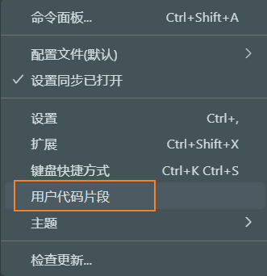

> tips:
>
> 1. JavaScript的`debugger;`可用于调试，浏览器执行到该行会自动暂停。


#### 1-安装配置

##### a-vscode配置vue环境

> 1. vscode配置vue：
>     1. vue 3 Snippets：代码提示。
>     2. vetur：vue插件。
>     3. EsLint：js代码检测。
>     4. JavaScript (ES6) code snippets：js提示。
>     5. 配置文件配置<kbd>CTL</kbd>+<kbd>S</kbd>保存时自动格式化代码。
>     6. vscode在html中使用模板:`!`+<kbd>Tab</kbd>。
>     7. SHIFT+ALT+F：格式化代码
> 2. 推荐一个插件`Live Server`：为本地前端开发，提供了一个临时搭建的后台服务。修改文件保存后，浏览器自动刷新显示。注意使用时选择`open with live server`而非浏览器打开。(提一嘴，可以在设置中修改默认打开浏览器)

```json
"editor.codeActionsOnSave": {
    "source.fixAll.eslint": true
},
```


##### b-下载vue.js

> 1. 官网安装：https://v2.cn.vuejs.org/
> 2. 关于开发版和生产版：
>     1. 开发版(vue.js)：体积大，有注释，易阅读。
>     2. 生产版(vue.min.js)：体积小，已压缩，难阅读。
> 3. html中引入vue.js，`<script src='../js/vue.js'></script>`，引入了vue.js，


##### c-第一个vue程序

```html
<div id="app"> <!--挂载位置-->
</div>

<script>
    var myVue = new Vue({
        template:'<h1>哈哈，点名了！</h1>',
    })
    myVue.$mount('#app')
    // myVue.$mount(document.getElementById('app'))
</script>
```

> 1. 使用vue需要创建vue实例，即调用`Vue()`构造函数。
> 2. vue构造函数的参数options，翻译为多个选项，其必须是一个严格的js对象(`{}`，含多个键值对)，用于指定实例的多个配置项。
> 3. `template`配置项用来指定模板语句(一个字符串，可以是html代码、vue中特殊规则、或二者就混合)，其会被vue框架的编译器进行编译，转换为浏览器可识别的html语句。
> 4. vue实例存在`$mount()`方法，用于将vue实例挂载到html的指定位置。


##### d-配置vue模板

<br>

> 1. 在vscode的右下角设置中选择用户代码片段：
>
>     <br>
>
> 2. 在弹出输入框中输入`javaScript`并回车。
>
> 3. 在打开文件中配置模板：其中`$+数字`相当于内容待定，会自动把光标放入该处用于输入，可以使用<kbd>Tab</kbd>切换。

```json
{
    "提示信息": {  
        "prefix": "快捷缩写",
        "body": [
            "代码行1",
            "代码行2",
            "..."
            "$1"
        ],
        "description": "描述"
    }
}
```

```json
{
    "Print to console": {
        "prefix": "log",
        "body": [
            "console.log('$1');",
            "$2"
        ],
        "description": "Log output to console"
    },
    "create vue instance": {
        "prefix": "cvue",
        "body": [
            "const $3 = new Vue({" ,
            "   data: {",
            "        $1",
            "    },",
            "    el: '$2',",
            "})",
            "$4"
        ],
    },
}
```


##### e-配置vscode字体

<br>

> 1. 打开配置文件`settings.json`，添加下述配置。
> 2. 当然也可以直接在设置中配置字体，略。

```json
"editor.fontLigatures": true,
"editor.fontFamily": "Fira Code Regular, 'Courier New', Microsoft YaHei"
```


#### 2-配置项

##### a-数据源

<br>

> 1. 正常使用js的数据放入页面的时候需要自己手动拼接字符串的，es6提供了一种增强版的字符串，即模板字符串，用反引号(`) 标识。它可以当作普通字符串使用，也可以用来定义多行字符串，或者在字符串中嵌入变量。
> 2. `data`配置项叫做vue示例的数据对象，给vue实例提供数据来源。
> 3. `data`类型可以是对象(必须是纯粹的对象，只包含键值对)或者函数。
> 4. `data`数据源可以通过`{{}}`语法在模板中使用，改语法叫做模板语法中的插值语法，戏称胡子语法。

```html
<div id="app">
</div>

<script>
    var myVue = new Vue({
        template:`<h6>哈哈,{{class_name}}课,
                {{leader.name}}老师在{{time}}点名了,
                @{{other[0].name}}({{other[0].age}}),
                @{{other[1].name}}({{other[1].age}})</h6>`,
        data:{
            class_name:'习概',
            time:'2023-4-12',
            leader:{
                name:'?',
                age:30,
            },
            other:[
                {
                    name:'小郑',
                    age:30,
                },
                {
                    name:'amy',
                    age:30,
                }
            ]

        }
    })
    myVue.$mount('#app')
</script>
```

> 1. 通过后面的学习，我们其实可以知道，`data`除了可以是纯粹的JavaScript对象，其实还可以是一个函数，但是这个函数必须返回一个对象。
> 2. 而且在js对象中，函数属性的`:function`可以省略。
> 3. 至于对象和函数的使用区别，后续补充。

```html
<div id="app">
    <span>{{msg}}</span>
</div>
<script>
    const vm = new Vue({
        data() {
            return {
                msg: 'hello fish!',
            }
        },
        el: '#app',
    })
</script>
```


##### b-模板配置项

<br>

> 1. `template`后面指定模板语句，但是注意模板语句只能有一个根节点(谁叫它覆盖挂载点呢!)。
> 2. 只要`data`数据源发生改变，模板语句就会重新编译。
> 3. 使用`template`配置项，指定挂载位置的元素会被替换。
> 4. 我们可以不使用`template`来编写模板语句，而这些模板语句可以直接写在html标签。此时挂载元素不会被替换，vue会找到它并编译渲染。

```html
<div id="app">
</div>
<script>
    var myVue = new Vue({
        template:`<span><h5>hello,{{name}},{{msg}}</h5></span>`,
        data:{
            name:'dream fish',
            msg: 'welcome to vue!'

        }
    })
    myVue.$mount('#app')
</script>
```

<br>

```html
<div id="app">
    <span>
        <h5>
            hello,{{name}},{{msg}}
        </h5>
    </span>
</div>

<script>
    var myVue = new Vue({
        data: {
            name: 'dream fish',
            msg: 'welcome to vue!'

        }
    })
    myVue.$mount('#app')
</script>
```

<br>

> 1. 关于一个根节点的理解：个人觉得就是只能层层递进，不能存在多个入口(兄弟元素)
> 1. 其实主要是`template`会将绑定标签覆盖，存在多个根节点，vue就不知道渲染哪一个。但是不用`template`而是直接在html中使用，就不存在这个问题。

```html
<div> <!--一个根节点-->
    <div>
    </div>
    
    <div>
    </div>
</div>
```

```html
<div> <!--两个个根节点-->
</div>

<div>
</div>
```


##### c-el配置项

<br>

> 1. 我们可以不使用`$mount()`挂载，而使用`el`配置项告诉vue接管那个元素容器。

```html
<div id="app">
    <span>
        <h5>
            hello,{{name}},{{msg}}
        </h5>
    </span>
</div>

<script>
    var myVue = new Vue({
        data: {
            name: 'dream fish',
            msg: 'welcome to vue!'

        },
        el:'#app',
        // el: document.getElementById('app')
    })
</script>
```


#### 3-控制台优化


##### a- vue自身报错

<br>

> 1. 浏览器控制台经常出现下图的一些提示，就很烦。
> 2. 第一条是提示下载浏览器插件`Vue Devtools`，可以直接在浏览器插件商店下，也可以使用[极简插件](https://chrome.zzzmh.cn/)网站下载，当然也可以在官网下载。
>     1. `devtools`在使用时，data中数据以中文开头时有时不刷新，可以修改为非中文开头。
>     1. 这里有坑，注意安装`beta`版本，不然vue3用不了。建议[下载地址](https://chrome.zzzmh.cn/info/ljjemllljcmogpfapbkkighbhhppjdbg)。
> 3. 第二条是提示使用开发版,，即`vue.min.js`。想要关闭，可以修改Vue全局配置对象`Vue.config`。
>     1. 在最前面设置`Vue.config.productionTip=fasle`。其中`Vue.config`是vue的全局配置对象；`productionTip`属性控制是否生成生产提示信息，且默认为`true`。
>     2. 若上一步不起作用，直接在`vue.js`中搜索并修改`productionTip`，然后保存。

<br>

```html
<script>
    Vue.config.productionTip = false  //配置

    var myVue = new Vue({
        data: {
            name: 'dream fish',
        },
        el:'#app',
    })
</script>
```


##### b-Live server导致报错

<br>

> 1. 我们使用`Live Server`的`open with live server`打开时，会报`Get http://127.0.0.1:5500/favicon.ico 404 (Not Found)`
> 2. 在项目根目录添加`favicon.ico`文件，自己搞个图片修改个名字就行，大小自个看着办。

<br>

##### c-devtools导致报错

> 1. 控制台警告：`DevTools failed to load source map: `。
> 2. 解决措施：忽略，打开控制台设置，关闭js源代码映射。

<br>


#### 4-vue实例和容器关系

<br>

> 1. vue实例和容器为"一夫一妻制"。
> 2. 多个vue实例接管同一个容器，只有第一个vue实例有效。
> 3. 一个vue实例接管多个容器，只对第一个容器有效。

```html
<div id="app">		<!--生效-->
    hello,{{msg}}
</div>
<div id="app">		<!--无效-->
    hello,{{msg}}
</div>

<script>
    new Vue({
        data: {
            msg: 'welcome to vue!'
        },
        el: '#app',
    })
</script>
```

```html
<div id="app">
    hello,{{msg}}
</div>

<script>
    //有效
    new Vue({
        data: {
            msg: 'welcome to vue!'
        },
        el: '#app',
    })
    //无效
    new Vue({
        data: {
            msg: 'welcome,fish!!'
        },
        el: '#app',
    })
</script>
```


