#### 1-模板语法

##### a-插值语法

<br>

> 1. 前面已经知道了插值语法`{{}}`,那么插值语法中能使用哪些值呢?
>     1. `data`数据对象中声明的变量和函数等等(其实vue实例管理的都行)。
>     2. 常量，如`123`、`'asc'`等字面量，JavaScript使用`const`定义的常量不算。
>     3. 合法的JavaScript表达式(含三元运算符)都行，注意`var a=51`为语句，而非表达式(是否可以认为存在返回值的即为表达式？)。
>     4. 模板表达式放在沙盒中，只能访问在全局变量白名单上的变量：`Infinity,undefined,NaN,isFinite,isNaN,parseFloat,parseInt,decodeURI,decodeURIComponent,encodeURI,encodeURIComponent,Math,Number,Date,Array,Object,Boolean,String,RegExp,Map,Set,JSON,Intl,require`。

```html
<div id="app">
    <h1>{{msg}}</h1>
    <h1>{{func(2,3)}}</h1>
</div>

<script>
    new Vue({
        data: {
            msg: 'welcome to vue!',
            func: function (a, b) {  //函数
                return a + b
            }
        },
        el: '#app',
    })
</script>
```

```html
<div id="app">
    <h1>{{a}}</h1>  <!--错误-->
    <h1>{{123}}</h1>
</div>

<script>
    const a  = 10
    new Vue({
        el: '#app',
    })
</script>
```

```html
<div id="app">
    <h1>{{msg.split(' ').reverse().join('')}}</h1>
    <h1>{{1 +2}}</h1>
    <h1>{{msg ? 1 : 2}}</h1>
</div>

<script>
    new Vue({
        data: {
            msg: 'welcome to vue!',
        },
        el: '#app',
    })
</script>
```

```html
<div id="app">
    <h1>{{Date.now()}}</h1>
</div>

<script>
    new Vue({
        el: '#app',
    })
</script>
```


##### b-指令语法

<br>

> 1. vue框架中所有指令语法均以`v-`为前缀。
> 2. vue框架的指令语法是以html标签的属性形式存在的，但是需要让vue框架编译后，浏览器才能解释运行。
> 3. 指令语法格式：`<html标签 v-指令名:参数="表达式"></html标签>`。
> 4. 插值语法的`{{}}`中可以写的，在指令语法中的表达式都能写。
> 5. 注意并非所有指令语法都有参数和表达式：
>     1. `v-once`无参、无表达式。
>     2. `v-if="表达式"`:无参，有表达式。
>     3. `v-bind:参数="表达式"`:有参，有表达式。

> * 插值语法主要处理html标签包围部分的数据
> * 而指令语法主要处理html标签的属性。


##### c-指令详解

<br>

> 1. `v-once`：只渲染元素和组件一次。随后的重新渲染，元素/组件及其所有的子节点将被视为静态内容并跳过。这可以用于优化更新性能。

```HTML
<div id="app">
    <h1 v-once>{{msg}}</h1> <!--修改data数据对象,不会重新渲染-->
</div>

<script>
    new Vue({
        data: {
            msg: 'hello,vue!'
        },
        el: '#app',
    })
</script>
```

> 2. `v-if="表达式"`:表达式执行结果必须返回`bool`类数据：
>     1. `true`:当前指令所在标签，会被渲染到浏览器。
>     2. `false`:当前指令所在标签，不会被渲染到浏览器。
>     3. 关于不渲染，不同于使用样式设置标签不显示，而是在浏览器右键检查时标签根本不存在。

```html
<div id="app">
    <h1 v-if="a < b">{{msg}}</h1>
</div>

<script>
    new Vue({
        data: {
            a:12,
            b:13,
            msg:'a < b'
        },
        el: '#app',
    })
</script>
```

> 3. `v-else if="表达式"`:前一兄弟元素必须有 `v-if` 或 `v-else-if`，就相当于python中的`elif`。
> 4. `v-else`:无需表达式，前一兄弟元素必须有 `v-if` 或 `v-else-if`，就相当于python中的`else`。
>     1. `>`的html转义为`&gt;`。
>     2. `<`的html转义为`&lt;`。

```html
<div id="app">
    <h1 v-if="a < b">a &lt; b</h1>
    <h1 v-else-if="a > b">a &gt; b</h1>
    <h1 v-else>a = b</h1>
</div>

<script>
    new Vue({
        data: {
            a:12,
            b:13,
        },
        el: '#app',
    })
</script>
```

> 5. `v-bind:参数="表达式"`：一个动态绑定指令，vue框架会把`参数`的名称编译为html属性名，`表达式`的值编译为属性的值。
>     1. 表达式发生变化，就会导致html标签属性变化，从而产生动态效果。
>     2. 原则上参数名可以随便写，但是建议写为html标签属性，不然没有意义。
>     3. 注意表达式中的变量不能带`''`，不然会被识别为字符串而非变量。
>     4. 由于`v-bind`标签使用频繁，vue提供简写形式`:参数="表达式"`。
>     5. 注意`属性="{{}}"`的写法会报错显示已经被移除，vue建议你使用`v-bind`。

```html
<!--准备一个容器-->
<div id="app">
    
    
      <!--'img_path'被识别为字符串-->
</div>

<script>
    new Vue({
        data: {
            img_path:'../img/1.png'
        },
        el: '#app',
    })
</script>
```

> 6. `v-model:参数="表达式"`：与`v-bind`(单向绑定)一样都是动态绑定，但是`v-model`是双向绑定。
>     1. 所谓双向绑定，就是`data`数据对象变化导致表达式变化，从而导致属性变化；同样的属性变化也会导致`data`数据对象变化，即`data<==>视图`。
>     2. 所谓单向绑定，就是`data`数据对象变化导致表达式变化，从而导致属性变化；但是属性变化不会导致`data`数据对象变化，即`data==>视图`。
>     3. `v-model`作用标签有限制：`input`、`select`、`textarea`标签。(表单元素才需要用户交互)
>     4. `v-model`一般作用于`value`属性，当其作用于`value`属性时，可以缩写为`v-model="表达式"`。

```html
<!--准备一个容器-->
<div id="app">
    <input type="text" v-model:value="name">
    <input type="text" v-model="age"> <!--缩写-->
</div>

<script>
    new Vue({
        data: {
            name:'fish',
            age: '20',
        },
        el: '#app',
    })
</script>
```


#### 2-MVVM

<br>

##### a-简介

<br>

> 1. `MVVM`分为三部分：
>     1. `M`: model，模型或者数据。
>     2. `V`: View，视图。
>     3. `VM`：ViewModel，视图模型，`MVVM`中的核心部分。
> 2. `MVVM`是当前前端开发非常流行的架构模式。vue的设计也受到`MVVM`的启发，但是vue没有完全遵循`MVVM`模型，遵了又没完全循，但是vue是基本符合`MVVM`。
> 3. vue将model和view进行了分离。假如没有分离，我们model中发生变化，需要编写一系列的js代码操作维护视图的DOM。
> 4. 而vue将维护等复杂操作交给viewmodel来执行，当model发生改变，viewmodel会自动去更新view。我们不需要关注如何维护，只需要关注model变动就行，提高了开发效率。
> 5. vue中的vue实例就相当于viewmodel，所有我们常常将vue实例命名为vm。而vue实例中的data就相当于model。而html中的被接管的标签就相当于view。

```html
<!--view V-->
<div id="app">
    <span>{{ msg }}</span>
</div>

<script>
    // viewmodel  VM
    const vm = new Vue({
        data: {  // model M
            msg: 'dream fish is here!',
        },
        el: '#app',
    })
```


#### 3-代理机制

##### a-vm属性

<br>

> 1. vue实例属性存在很多：
>     1. 以`$`开头，可视为公开属性，是常用的。
>     2. 以`_`开头，可视为私有属性，是vue框架底层使用，一般开发人员不常用。
>     3. vue实例对象的原型对象上的属性，例如`vm.$delete`。
> 2. 其实vue实例中`data`数据对象的变量也可以直接通过vue实例访问，即形如`vm.msg`访问而非`vm.data.msg`。这主要是由于vue底层使用了数据代理机制。
> 3. 要搞明白数据代理机制，我们需要学会`Object.defineProperty()`。

```html
<div id="app">
    <span>{{ msg }}</span>
</div>

<script>
    const vm = new Vue({
        data: {  
            msg: 'dream fish is here!',
        },
        el: '#app',
    })
    console.log(vm.msg);  //直接通过vm访问msg
</script>
```

<br>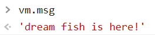


##### b-defineProperty()

<br>

> 1. `object.defineProperty(obj,name,options)`:该方法为ES5新增，用于给对象新增属性，或者设置对象原有属性。
>     1. `obj`:指定给哪个对象新增属性。
>     2. `name`:指定属性名称。
>     3. `options`:一些配置项，一个纯粹的js对象。
>         1. `value`:给属性指定对应值。
>         2. `writable`:设置该属性值是否允许更改。
>         3. `getter方法`：访问属性值时自动调用。
>         4. `setter方法`：修改属性值时自动调用，需要一个参数val，为修改值。
>         5. 注意，配置项中存在`getter、setter`时不允许配置`value`和`writable`。
>         6. `enumerable`:为true则该属性可以用所在对象遍历，为false则不可被迭代。
>         7. `configurable`:为true表示该属性可以被删除，为false则不可以被删除。

```js
let fish = {}
Object.defineProperty(fish,'name',{
    get:function(){
        return this.name;
    },
    set:function(val){
        this.name = val; 
    }
})
```

> 1. 实际上述代码存在问题，访问`name`属性会调用`getter`；但`getter`内部的`this.name`又会访问`name`，于是又调用`getter`，死循环。
> 2. 于是我们可以借助代理来实现，获取和返回均为另一个变量的同名属性。
> 3. 此外`getter、setter`可以省略`:funcation`，直接使用`get(){}、set(val){}`。

```js
let fish = {}
var temp = {
    name:undefined,
}
Object.defineProperty(fish,'name',{
    get(){
        return temp.name;
    },
    set(val){
        temp.name = val; 
    }
})
```

<br>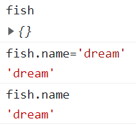

> 1. `options`配置项中还可以有一些配置：
>     1. `enumerable`:为true则该属性可以用所在对象遍历，为false则不可被迭代。
>     2. `configurable`:为true表示该属性可以被删除，为false则不可以被删除。

```js
let fish = {
    age:20,
    color:'sky blue',
}

Object.defineProperty(fish, 'name', {
    configurable:false,
    enumerable:false,
})
```

<br>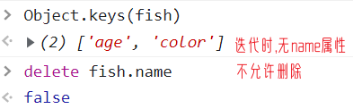


#####  c-代理机制

<br>

> 1. `vue`实例与`data`数据对象就是代理与被代理的关系。
> 2. 将`data`参数传入`vue`实例时，`Vue`实际上类似于通过`Object.defineProperty`添加了一系列`data`中的同名属性，并将其对应的`getter、setter`设为访问`data`的同名属性。

```js
//被代理对象
data = {
    msg:'fish'
}
//代理对象
new Vue({
    data: {
        data: data,
    },
    el: '#app',
})
```

```js
//被代理对象
data = {
    msg:'fish'
}

//代理对象
vue = {
}

Object.defineProperty(vue,'msg',{
    //数据代理
    get(){
        return data.msg
    },
    //数据劫持(真实的vue在此时会重新渲染页面)
    set(val){
        data.msg=val
    }
})
```

> 1. 需要注意的是，`data`数据对象中`_`或者`$`前缀的变量不会被vue数据代理。
> 2. 这主要是因为，自定义的`_`或`$`为前缀的变量可能会与vue框架自身的属性名冲突。所以给`data`对象属性命名时，是不允许以`_`或`$`开始。

```js

const vm = new Vue({
    data: {
        msg:'fish',
        _name:'梦鱼',   //报错
        $age:20    //报错
    },
    el: '#app',
})

```

>1. 了解了vue的数据代理原理，我们直接手写vue数据代理框架；当然vue内部的原理要比我们写的好得多。
>2. JavaScript的`foreach`函数为当前可迭代对象提供一个回调函数，函数可以含三个参数`(value，index，arr)`，分别为数组元素值、数组元素索引，当前元素所属数组对象。

```js
class Vue{

    constructor(options){
        Object.keys(options.data).forEach((p_name,index) => {
            let firstChar = p_name.charAt(0)	// 获取首字符
            if (firstChar !='_' && firstChar !='$'){  // 不以_或$开头
                Object.defineProperty(this,p_name,{  // 数据代理
                    get(){
                        return options.data[p_name]
                    },
                    set(val){
                        options.data[p_name] = val
                    }
                })
            }
        })
    }
}
const vm = new Vue({
    data: {
        msg:'fish',
    },
})
console.log(vm.msg);
```


##### d-怒砍源码

```js
function initData(vm) {
    var data = vm.$options.data;  //获取data对象
    data = vm._data = isFunction(data) ? getData(data, vm) : data || {};  //设置_data属性
    //...
}
```

> 1. `var data = vm.$options.data`:程序执行到时，`vue`实例中还不存在`_data`属性，该代码是获取`data`。
> 2. ` data = vm._data = isFunction(data) ? getData(data, vm) : data || {}`:
>     1. 该代码执行后，vm对象会多一个`_data`属性。
>     2. 通过源码可知，`data`亦可以是一个函数，当`data`为函数则调用`getData`，否则直接将`data`返回并赋值`vm._data`和`data`。
> 3. 为什么vue要在内部重现拓展一个`_data`属性？，主要是`_data`属性指向了底层真正的`data`，通过`_data`访问属性不会走代理，也即不会调用`getter、setter`方法，主要<font color=red>用于框架自身使用</font>。
> 4. 其实vue实例不仅存在`_data`属性，还有`$data`属性，当我们不想通过数据代理访`data`的属性，就可以通过`_data`或者`$data`，但是不推荐使用`_data`。

```js
function isReserved(str) {
    var c = (str + '').charCodeAt(0);
    return c === 0x24 || c === 0x5f;
}
```

> 上述函数其实就是判断`data`内属性是否以`$`或者`_`为前缀，返回true则是。

```js
// proxy(vm, "_data", key);

function proxy(target, sourceKey, key) {
    sharedPropertyDefinition.get = function proxyGetter() {
        return this[sourceKey][key];
    };
    sharedPropertyDefinition.set = function proxySetter(val) {
        this[sourceKey][key] = val;
    };
    Object.defineProperty(target, key, sharedPropertyDefinition); //数据代理
}
```

> 1. 通过`proxy(vm, "_data", key)`实现数据代理。


#### 4-事件绑定

##### a-v-on

<br>

> 1. 在vue中绑定事件需要使用`v-on:事件名="表达式"`，例如：
>     1. `v-on:click="表达式"`，当发生鼠标单击事件之后，执行表达式。
>     2. `v-on:keydown="表达式"`，当发生键盘按下事件之后，执行表达式。
> 2. 在vue中，所有事件关联的回调函数，需要备注在`methods`配置项中。js的对象中函数的`:function`可以省略。
> 3. `v-on`指令也存在简写，`v-on:`简写为`@`；例如为`v-on:click`可以简写为`@click`。
> 4. 此外当`v-on`的回调函数无需传参数时，表达式的`()`可以省略。
> 5. vue在调用回调函数时，会自动传递一个参数，也即当前的事件对象。但是如果`v-on`给回调函数传递自定义参数，vue就不会自动传递事件对象。这时，我们需要在`v-on`调用回调函数时使用`$event`传递事件对象。
> 6. `event.target`可以获取事件触发的元素。

```html
<div id="app">
    <button @click="log">log</button>  <!--省略v-on:,自动传参event-->
    <button v-on:click="say('hello',$event)">say</button>
</div>
<script>
    const vm = new Vue({
        el: '#app',
        methods: {
            log(event){  //省略:function
                console.log('hello!');
                console.log(event)

            },
            say:function(a,event){
                window.alert(a);
                console.log(event);
            }
        },
    })
</script>
```


##### b-this

<br>

> 1. 事件回调函数中的`this`指向当前`vue`实例。
> 2. 假如我们实现一个计数器，在`vue`实例的`data`数据对象中提供计数器`counter:0`，这时我们可以直接使用`@click="counter++"`；但是有时候可能需要执行一些其他操作，这时我们可以使用回调函数，并在回调函数中使用`this.counter++`。
> 3. 注意回调函数最好不要使用箭头函数，箭头函数不存在自己的`this`。

```html
<div id="app">
    <sp>counter:{{counter}}</sp><br>
    <button @click="counter++">add</button>
    <button @click="add">add</button><br>
</div>
<script>
    const vm = new Vue({
        data:{
            counter:1,
        },
        el: '#app',
        methods: {
            add() {
                this.counter++;
                // vm.counter++；
            },
            other:() => {this.counter++} //这里的this是外部层的window全局作用域
        },
    })
</script>
```

> 关于箭头函数(`(params) => {}`)：
>
> 1. 箭头函数无自己的`this`，使用箭头函数时，箭头函数会默认帮我们绑定外层`this`的值，所以在箭头函数 `this`和外层的`this`是一样的。
> 2. 当参数只有一个，`()`可以省略；但是注意无参数时`()`不可省略。
> 3. `(params) => expression`相当于`(params) => { return expression }`，若要单纯返回对象，需要在对象外使用`()`，例如`(name,age) => ({name:name,age:age})`


##### c-methods原理

<br>

> 1. `methods`中的对象并没有被`vue`代理，但是若没有代理的话，函数中的`this`必然不会是当前`vue`实例。
> 2. 但是我们很容易知道，`methods`中的方法可以直接通过`vue`实例调用。这主要是应为，<font color=red>vue实例构建了和`methods`完全一样的属性函数。我们通过vue实例调用函数，其实调用的就是vue实例自己的函数，因此函数中的`this`指向当前vue实例</font>。
> 3. 我们可以简单实现一下自己的`methods`:

```js
class Vue{
    constructor(options){
        Object.keys(options.data).forEach((p_name,index) => {
            let firstChar = p_name.charAt(0)
            if (firstChar !='_' && firstChar !='$'){
                Object.defineProperty(this,p_name,{
                    get(){
                        return options.data[p_name]
                    },
                    set(val){
                        options.data[p_name] = val
                    }
                })
            }
        })

        Object.keys(options.methods).forEach((methodName) => {  //遍历方法名称
            this[methodName]=options.methods[methodName]    //为实例添加方法

        })

    }
}

const vm = new Vue({  //实例化
    data: {
        counter:0
    },
    methods: {
        add(){
            this.counter++;
            console.log('counter:'+this.counter);
        }
    },
}) 
```

<br>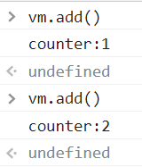


####  5-修饰符

##### a-事件修饰符

<br>

> 关于js事件传播补充：
>
> 1. 事件捕获：当鼠标点击或者触发dom事件，浏览器会从根节点->事件源进行事件传播。
> 2. 事件冒泡：事件源->根节点进行事件传播。
> 3. dom事件流的触发顺序为：先捕获后冒泡。
> 4. 回调函数默认在冒泡阶段执行。

> 1. `.stop`：停止事件冒泡，等同于`event.stopPropagation()`。
>     1. `three`被调用，后向上冒泡。
>     2. `two`所在div监听到，执行`two`，由于存在`.stop`而停止冒泡，`one`将不被调用。

```html
<div id="app">
    <div @click="one">
        <div @click.stop="two">
            <a href="#" @click="three">bing</a>
        </div>
    </div>    
</div>
<script>
    const vm = new Vue({
        el: '#app',
        methods: {
            one(){
                console.log('1');
            },
            two(){
                console.log('2');
            },
            three(){
                console.log('3');
            }
        },
    })
</script>
```

<br>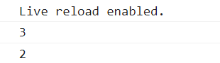


> 2. `.prevent`:等同于`event.stopProgation()`，阻止事件的默认行为。
>     1. 关于下面点击链接，`some()`函数会执行，但是不会跳转。
>     2. 点击的默认事件跳转bing被阻止。

```html
<div id="app">
    <a href="https://www.bing.com/" @click.prevent="some">bing</a> 
</div>
<script>
    const vm = new Vue({
        el: '#app',
        methods: {
            some(){
                console.log('fish');
            }
        },
    })
</script>
```

> 3. `.capture`：添加事件监听器时使用事件捕获模式，事件监听器存在两种不同方式。
>     1. 从内到外添加，事件冒泡模式。
>     2. 从外到内添加，事件捕获模式。
>     3. 下述事件由于`one`使用捕获模式，先调用。
>     4. `two、three`依旧使用默认冒泡模式，先`three`后`two`。

```html
<div id="app">
    <div @click.capture="one">
        <div @click="two">
            <a href="#" @click="three">bing</a>
        </div>
    </div>    
</div>
<script>
    const vm = new Vue({
        data: {
            msg:'fish'
        },
        el: '#app',
        methods: {
            one(){
                console.log('1');
            },
            two(){
                console.log('2');
            },
            three(){
                console.log('3');
            }
        },
    })
</script>
```

<br>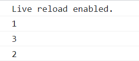

> 4. `.self`:只有事件监听器绑定本身，才触发回调函数。
>     1. 我们点击链接，`three`函数调用。
>     2. `two`函数所在div监听到，但自己不是事件源，由于使用`.self`，不被调用。
>     3. `one`函数所在div监听到，被调用。

```html
<div id="app">
    <div @click="one">
        <div @click.self="two">
            <a href="#" @click="three">bing</a>
        </div>
    </div>
</div>
<script>
    const vm = new Vue({
        data: {
            msg:'fish'
        },
        el: '#app',
        methods: {
            one(){
                console.log('1');
            },
            two(){
                console.log('2');
            },
            three(){
                console.log('3');
            }
        },
    })
</script>
```

<br>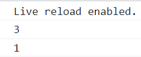

> 5. `.once`：事件只回调一次。
>     1. 无论点击多少次，回调函数只被调一次。

```html
<div id="app">
    <a href="#" @click.once="add">here</a>
</div>
<script>
    const vm = new Vue({
        el: '#app',
        methods: {
            add() {
                console.log('fish');

            },
        },
    })

</script>
```

<br>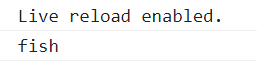

> 6. `.passive`：优先执行事件默认行为；与`.prevent`对立，一起使用就会报错。每次事件产生，浏览器都会去查询回调函数是否有preventDefault阻止该次事件的默认动作。使用passive就是告诉浏览器，不用查询了，我们没用preventDefault阻止默认动作。

> 7. `.left`:只当点击鼠标左键时触发。
> 8. `.right`:只当点击鼠标右键时触发。
> 9. `.middle` :只当点击鼠标中键时触发。
> 10. `.{keyCode | keyAlias}` ：只当事件是从特定键触发时才触发回调。
> 11. 事件修饰符可以联合使用，但是执行顺序从左到右。`.self.stop`先`.self`执行，满足后`.stop`。
>     1. `.prevent.self`:阻止所有点击。
>     2. `.self.prevent`:阻止自身元素点击。


##### b-按键修饰符

<br>

> 1. 按键修饰符一般与`@keyup`和`@keydown`事件一起使用。
> 2. 常用的按键修饰符：
>     1. `.enter`
>     2. `.tab`
>     3. `.delete` ：捕获`delete`和`Backspace`键
>     4. `.esc`
>     5. `.space`
>     6. `.up`
>     7. `.down`
>     8. `.left`
>     9. `.right`
> 3. 获取未知的按键修饰符：
>     1. 通过事件参数`event.key`获取该键真实名称(`event.keyCode`获取键的数字表示)。
>     2. 将真实名称转为kebab-case风格即使按键修饰符名称(其实就是全小写，单词间`-`连接)。
>     3. `PageDown`的对应按键修饰符就是`page-down`。
> 4. 自定义事件修饰符：使用vue的全局配置对象`config`来配置：
>     1. 即`Vue.config.keyCodes.按键修饰符名称=键值`。
>     2. 配置的键值应当是按键所表示的数字。
> 5. `tab`键无法触发keyup事件，只能触发keydown事件。
> 6. `ctrl、alt、shift、meta(window)`键：按下时触发keydown，但是只有使用组合键，并且组合键松开且改键按下时才会触发keyup事件。例如`ctrl+c`必须`ctrl`按下`c`松开才触发keyup。如果不爽，请自定义。

> js按键监听：
>
> 1. `event.key`获取该键真实名称
> 2. `event.keyCode`获取键的数字表示，例如enter为13。

```html
<div id="app">
    <input type="text"  @keydown="log">
</div>
<script>
    const vm = new Vue({
        data: {
            msg:'fish'
        },
        el: '#app',
        methods: {
            log(event){
                console.log(event.key+" : "+event.keyCode);

            },
        },
    })
</script>
```

<br>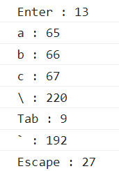

```html
<div id="app">
    <input type="text"  @keydown.\="log">	<!--\键按下触发-->
    <input type="text"  @keydown.220="log">	<!--\键按下触发-->
</div>
<script>
    const vm = new Vue({
        data: {
            msg:'fish'
        },
        el: '#app',
        methods: {
            log(event){
                window.alert('the \\ is down');

            },
        },
    })
</script>
```

```html
<div id="app">
    <input type="text"  @keydown.fish="log">
</div>
<script>
    Vue.config.keyCodes.fish = 13  //自定义按键修饰符
    const vm = new Vue({
        data: {
            msg:'fish'
        },
        el: '#app',
        methods: {
            log(event){
                window.alert('the enter is down');

            },
        },
    })
</script>
```


#### 6-计算属性

##### a-反转字符串

> 1. 第一种写法如下：
> 2. 存在问题：
>     1. 代码无法复用。
>     2. 代码不利于维护。
>     3. 不需要每次都计算，执行效率低。

```html
<div id="app">
    <input type="text" v-model="msg" >
    <span>反转:{{msg.split('').reverse().join('')}}</span>
</div>
<script>
    const vm = new Vue({
        data: {
            msg:'fish'
        },
        el: '#app',
    })
</script>
```

> 1. 第二种写法，我们将逻辑写在`methods`方法里，实现了代码复用，有利于维护。
> 2. 但是执行效率的问题仍未解决。

```html
<div id="app">
    <input type="text" v-model="msg" >
    <span>反转:{{reverse()}}</span>
</div>
<script>
    const vm = new Vue({
        data: {
            msg:'fish'
        },
        el: '#app',
        methods: {
            reverse(){
                return this.msg.split('').reverse().join('');
            }
        },
    })
</script>
```


##### b-计算属性

> 1. 使用vue原有属性(`data`数据对象中的属性)，经过一系列运算，最终得到一个全新属性，叫做计算属性。
> 2. 计算属性不存在于`data`数据对象中，与`data`数据对象关系不大。
> 3. 使用计算属性需要配置项`computed`；其内部属性中key为计算属性名，value为对象，其中提供了`setter、getter`方法。
>     1. `getter`会自动调用，即第一次访问时调用，或者与计算属性关联的vue原有属性变化时会被调用。
>     2. `setter`在计算属性修改时自动调用，一般不直接修改计算属性(会递归)，而是间接修改vue原有属性。一般不用这个鸡肋方法。
> 4. 当`setter`这个鸡肋方法不需要时，计算属性可以直接省略为`计算属性(){ //getter逻辑 }`，这个时候就很容易搞混淆，使用计算属性时是不需要`()`的。

```html
<div id="app">
    <input type="text" v-model="msg">
    <span>反转:{{reverseMsg}}</span>
</div>
<script>
    const vm = new Vue({
        data: {
            msg: 'fish'
        },
        el: '#app',
        computed: {
            reverseMsg: {  //计算属性
                get() {
                    return this.msg.split('').reverse().join('');
                },
                set(val) {
                    //不要直接修改计算属性,要设法修改原有属性
                    this.msg = val.split('').reverse().join('');
                }
            }
        }
    })
</script>
```

```js
new Vue({
    el: '#app',
    computed: {
        reverseMsg() {
            return this.msg.split('').reverse().join('');
        },
    }
})
```


#### 7-属性侦视

##### a-初识监视

<br>

> 1. 属性监听可以监视原有属性，也可以监视计算属性。
> 2. 属性监视使用`watch`配置项，其key为要监视的属性，value为配置对象，其中需要提供一个`handler(newVal,oldVal)`函数，在属性更改时函数被调用，其参数分别为属性更新后的值、属性更新前的值。
> 3. `handler`方法在项目初始化时不会调用，可以设置配置`immediate:true`设置初始化时调用。

> 4. 此外我们还可以使用`vm.$watch(属性名,option)`后期添加监视。`options`需要包含`handler`函数。

```html
<div id="app">
    <input type="text" v-model="msg">
    <input type="text" v-model="age">
</div>
<script>
    const vm = new Vue({
        data: {
            msg: 'fish',
            age: 19,
        },
        el: '#app',
        watch: {
            msg: {
                immediate: true,  //初始化时调用
                handler(newVal, olderVal) {
                    console.log(olderVal + '->' + newVal);
                }
            }
        }
    })
    // 后期添加
    vm.$watch('age', {
        immediate: true,  //初始化时调用
        handler(newVal, olderVal) {
            console.log(olderVal + '->' + newVal);
        }
    })
</script>
```

<br>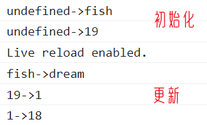


##### b-深度监视

<br>

> 1. 使用`deep:true`启用深度监视，会给多级结构下的所有属性启用监视。但是传参时`newVal、olderVal`都是传的根对象，而非具体属性(吐了)。
> 2. 当然针对对象属性内部某个属性监视时，可以使用`'对象属性.内部属性'`进行监视，注意一定要使用单引号。(数组元素监视使用`'arr.index'`，别忘记单引号)。

```js
const vm = new Vue({
    data: {
        author:{
            name:'dream fish',
            age: 20,
            sex:'男',
        },
        team:['dream','fish']
    },
    el: '#app',
    watch:{
        'author.name':{  //监视字典name属性
            handler(newVal,olderVal){
                console.log(olderVal + '->' + newVal);
            }
        },
        'team.0':{	// 监视数组元素
            handler(newVal,olderVal){
                console.log(olderVal + '->' + newVal);
            }
        }
    },

})
```

```js
new Vue({
    data: {
        author: {
            name: 'dream fish',
            age: 20,
        },
    },
    el: '#app',
    watch: {
        'author': {
            deep: true,
            handler(newVal, olderVal) {
                console.log(olderVal + '->' + newVal);
            }
        },
    }

})
```


##### c-缩写

<br>

> 1. `watch`配置项实现监视属性，且支只配置`handler`函数时，可以省略为`watch{ 属性名(newVal,olderVal){ //handler逻辑 } }`。
> 2. `$watch()`实现监视，且支只配置`handler`函数时，可以省略为`$watch(属性名,function(newVal,olderVal){ // handler逻辑 })`

```html
<div id="app">
    <input type="text" v-model="msg">
    <input type="text" v-model="age">
</div>
<script>
    const vm = new Vue({
        data: {
            msg: 'fish',
            age: 19,
        },
        el: '#app',
        watch:{  
            // 缩写
            msg(newVal, olderVal) {
                console.log(olderVal + '->' + newVal);
            },
        }            
    })
    //缩写
    vm.$watch('age', function (newVal, olderVal) {
        console.log(olderVal + '->' + newVal);
    })
</script>
```

<br>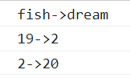


##### d-计算属性与属性监听

> 1. 如果`computed`和`watch`均可以完成某功能，优先选择`computed`，代码量少。
> 2. 但是在异步的条件下，必须使用`watch`，`computed`无法完成。
>     1. 例如下面实现3s后响应，但是返回值是返回给js引擎，因为这个`setTimeout`是引擎调用。所以调用函数vue根本无法得到结果给result计算属性赋值。

```js
new Vue({
    data: {
        one: undefined,
        two: undefined,
    },
    el: '#app',
    computed: {
        result() {
            var result = this.one - this.two

            setTimeout(() => {  //设置3s后响应
                if (result == 0) {
                    return this.one + '=' + this.two
                } else if (result < 0) {
                    return this.one + '<' + this.two

                } else {
                    return this.one + '>' + this.two
                }
            }, 1000 * 3)
        }
    }
})
```


#####  e- 普通和箭头函数

> 1. 关于vue中普通函数和箭头函数的使用：
>     1. 如果当前函数为vue管理，使用普通函数。
>     2. 如果当前函数不是vue管理，使用箭头函数。

```js

const vm = new Vue({
    data: {
        one: 0,
        two: 0,
        result: undefined,
    },
    el: '#app',
    watch: {
        one: {
            immediate: true,
            handler(val) {
                var result = val - this.two

                setTimeout(() => {  //设置3s后响应
                    if (result == 0) {
                        this.result = val + '=' + this.two
                    } else if (result < 0) {
                        this.result = val + '<' + this.two

                    } else {
                        this.result = val + '>' + this.two
                    }
                }, 1000 * 3)
            }
        },
        two: {
            immediate: true,
            handler(val) {
                var result = this.one - val

                setTimeout(() => {  //设置3s后响应
                    if (result == 0) {
                        this.result = this.one + '=' + val
                    } else if (result < 0) {
                        this.result = this.one + '<' + val

                    } else {
                        this.result = this.one + '>' + val
                    }
                }, 1000 * 3)
            }
        }
    }

})
```

> <font color=red>上述`watch`中的`setTimeout`中只能使用箭头函数，因为`setTimeout`不是`vue`管理的，而是`js`引擎调用的；若使用箭头函数，则不存在`this`，会向上找也即是`vue`；而若是使用普通函数，那么`this`就指向调用者`window`</font>。


