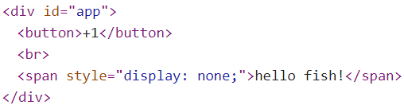

#### 1-样式绑定

##### a-class绑定字符串

<br>

> 1. `class`绑定其实就是`v-bind:class="表达式"`，也可以缩写`:class="表达式"`。表达式一般有三种形式：
>     1. 字符串：用于单个类样式。
>     2. 数组形式：用于类样式个数不固定、样式名不固定。
>     3. 对象形式：用于类样式个数、名称固定，不确定是否使用。对象的key为样式名，value为`true、false`控制类样式是否使用。
> 2. 使用对象形式，若类样式名含js某些字符(如`class-big`)，定义对象key可以使用字符串(`'class-big'`)。

```css
.static{
    border: 1px solid black;
    background-color: antiquewhite;
}
.class-big{
    width: 200px;
    height: 200px;
}
.small{
    width: 100px;
    height: 100px;
}
```

```html
<div id="app">
    <div :class="c1">       <!--字符串-->
        Dream fish is dreaming!
    </div><br><br>
    <div :class="c2">       <!--数组-->
        Dream fish is dreaming!
    </div><br><br>
    <div :class="c3">       <!--对象-->
        Dream fish is dreaming!
    </div>
</div>
<script>
    new Vue({
        data: {
            c1: 'static',
            c2: ['static', 'small'],
            c3: {
                static: true,
                'class-big': true,
                small: false
            }
        },
        el: '#app',
    })
</script>
```


##### b-style绑定

<br>

> 1. 使用`v-bind:style="表达式"`，亦可以缩写为`:style="表达式"`。同样表达式可以存在多个类型：
>     1. 字符串形式。
>     2. 对象形式：当属性名含js某些字符，可以转为大驼峰样式，或者直接用单引号包裹。
>     3. 数组形式：元素为对象。

```html
<div id="app">
    <div :style="c1"> <!--字符串-->
        Dream fish is dreaming!
    </div><br><br>
    <div :style="c3"> <!--数组-->
        Dream fish is dreaming!
    </div><br><br>
    <div :style="c3"> <!--对象-->
        Dream fish is dreaming!
    </div>
</div>
<script>
    const vm = new Vue({
        data: {
            c1: 'background-color:antiquewhite',
            c2: [
                { 'background-color': 'blue' },
                { border: '1px solid black' }
            ],
            c3: {
                backgroundColor: 'blue',
            }
        },
        el: '#app',
    })
</script>
```


#### 2-条件渲染

<br>

##### a-条件渲染

> 1. 使用指令`v-if、v-else-if、v-else`，注意中间不能中断，哪怕是`<br>`也不行。
> 2. 也可以<font color=red>使用`v-show="表达式"`，是通过修改元素的`css`的`display`属性来达到显示和隐藏的</font>。
> 3. 二者区别：
>     1. 如果一个元素被频繁隐藏和显示，建议使用`v-show`(只需修改`css`属性)，因为`v-if`开销大(每次都需要删除标签)。
>     2. 使用`v-if`页面加载速度快，提高页面渲染效率。

```html
<div id="app">
    <button @click="counter++">+1</button><br>
    <span v-show="counter%2==1">{{msg}}</span>
</div>
</body>
<script>
    const vm = new Vue({
        data: {
            msg:'hello fish!',
            counter:0, 
        },
        el: '#app',
    })
```

<br>


##### b-template占位

<br>

> 1. 当多个标签的渲染条件相同时，如果都添加条件渲染就很浪费。我们可能会想将他们包裹在一个`div`标签上，并把条件渲染绑定到`div`上。但是这样就会多了个`div`影响页面结构和布局。
> 2. 这时vue为我们提供了`template`标签或元素，起到占位的作用，该标签不会真正出现在页面代码上，当然也就不会影响页面结构。

```html
<div id="app">
    <button @click="counter++">+1</button><br>
    <template v-if="counter%2==1">
        <span>{{msg}}</span>
        <span>{{name}}</span>
        <span>{{age}}</span>
    </template>
</div>
</body>
<script>
    const vm = new Vue({
        data: {
            msg:'hello,',
            name:'dream fish',
            age:20,
            counter:0,
        },
        el: '#app',
    })
</script>
```

<br>


#### 3-列表渲染

##### a-简介

<br>

> 1. 使用`v-for`指令，实现循环遍历；注意`v-for`必须要写在要循环的标签上。
> 2. `v-for`遍历数组：`v-for="(ele,index) in/of arr"`
>     1. `ele`:数组元素。
>     2. `index`:元素在数组的索引。
>     3. `arr`:遍历数组。
> 3. `v-for`遍历对象：`v-for="(value,key) in/of obj"`
>     1. `value`:属性值。
>     2. `key`:属性名。
>     3. `obj`:遍历对象。
> 4. `v-for`遍历指定次数：`v-for="(num,index) in/of counter"`
>     1. `num`：数字值(从1开始)。
>     2. `index`:索引(从0开始)。
>     3. `counter`：遍历次数。
> 5. `v-for`遍历字符串：`v-for="(char,index) in/of str"`
>     1. `char`:字符串中字符。
>     2. `index`:索引。
>     3. `str`:遍历字符串。
> 6. 上述遍历格式中的`()`可省略，但是不建议(不利于代码可读性)。

```html
<div id="app">
    <ul>
        <li v-for="(ele,idx) of team"><!--遍历数组-->
            {{idx}}->name:{{ele.name}},age:{{ele.age}}
        </li>
        </ol>
</div>
<script>
    new Vue({
        data: {
            team: [
                {
                    name: 'fish',
                    age: 20
                },
                {
                    name: 'dream',
                    age: 20
                },
                {
                    name: 'dream fish',
                    age: 20
                }
            ]
        },
        el: '#app',
    })

</script>
```

```html
<div id="app">
    <ul>
        <li v-for="(val,nam) in fish"><!--遍历对象-->
            {{nam}}:{{val}}
        </li>
        </ol>
</div>
<script>
    new Vue({
        data: {
            fish:{
                name:'dream',
                age:20
            }
        },
        el: '#app',
    })
</script>
```

```html
<div id="app">
    <ul>
        <li v-for="(num,idx) in counter"><!--遍历指定次数-->
            {{idx}}:{{num}}
        </li>
        </ol>
</div>
<script>
    new Vue({
        data: {
            counter:10,
        },
        el: '#app',
    })
</script>
```

```html
<div id="app">
    <ul>
        <li v-for="(char,idx) in fish"><!--遍历string-->
            {{idx}}:{{char}}
        </li>
        </ol>
</div>
<script>
    new Vue({
        data: {
            fish:'dream fish'
        },
        el: '#app',
    })
</script>
```


##### b-虚拟dom与diff算法

<br>

> 1. `vue`框架采用了虚拟`dom`机制+`diff`算法提高执行效率。
> 2. 虚拟`dom`：在内存中的`dom`对象(用`JS`模拟出的`DOM`)。
> 3. `diff`算法：一种能快速比较两事务不同之处的算法。
> 4. 当<font color=red>数据发生改变时，会比较，若虚拟`dom`部分一致，则直接复用真实`dom`；否则，则需要生成真实`dom`</font>。

<br>


##### c-:key

> 1. `v-for`所在标签存在一个非常重要属性`:key`，没有指定自动使用`index`作为`key`。
> 2. 这个`key`作为`dom`元素的唯一标识。`vue`会将相同`key`的dom用于对比复用。
> 3. 但是默认使用index存在问题：
>     1. 效率低，因为一旦数据的`index`发生变化(例如发生首部插入)，整条数据的`dom`就不会满足复用。
>     2. 产生错乱，见下面演示。
>     3. 其实上述根本原因就是`key`无法永久表示一条固定数据导致的。
> 4. 我们一般将`:key`设为对象的`id`，即后端数据库主键。
>     1. 即`<tr v-for="(val,idx) of team" :key="val.id">`

1. 假设使用默认`index`作为`key`，我们存在以下图示内容：

    <br>

2. 但是，我们在真实dom将`key=0`的`age`改为18，注意此时虚拟dom并未发生变化。此外还需注意这里的修改不通过vue而是浏览器修改html页面数据，因为vue数据更新会更新虚拟dom。

    <br>

3. 此时我们在首部插入`{name:'dream',age:20}`会惊讶发现，显示的真实`dom`居然显示`age`为18。这主要是由于首部插入，导致插入数据的key变为0，就会与之前的虚拟`dom`对比；发现年龄一致均为20，就会直接复用真实`dom`(但是真实`dom`已经修改为18)，从而错乱。

    <br>


#### 4-列表过滤、排序

##### a-过滤

<br>

> 1. 假设存在一个表格，我们需要实现一个数据过滤功能：
>     1. `watch`实现。
>     2. `computed`实现。

```html
<!--主代码部分-->
<div id="app">
    <input type="text" v-model="key">
    <table style="border: 1px solid black;margin: 5px;">
        <tr>
            <th>uid</th>
            <th>name</th>
            <th>age</th>
        </tr>
        <tr v-for="(val,idx) of filterTeam" :key="val.uid">
            <td>{{val.uid}}</td>
            <td>{{val.name}}</td>
            <td>{{val.age}}</td>
        </tr>
    </table>
</div>
<script>
    const vm = new Vue({
        data: {
            team: [
                { uid: '101', name: 'fish', age: 20 },
                { uid: '102', name: 'dream', age: 20 },
                { uid: '103', name: 'deer', age: 20 },
            ],
            key:''
        },
        el: '#app',
        //pass
    })

</script>
```

```js
// 计算属性实现pass部分
computed: {
    filterTeam(){
        return this.team.filter((obj) => {
            return obj.name.indexOf(this.key) >= 0
        })
    }
}
```

```js
// 属性监听实现pass部分
watch: {
    immediate: true,//初识化需要加载
        handler(val) {
        this.filterTeam = this.team.filter((obj) => {
            return obj.name.indexOf(val) >= 0
        })
    }
}
```

> javascript的map()和filter():
>
> 1. `arr.filter(fun)`接受一个函数，根据函数返回值(`true`、`false`)决定数组元素去留，返回一个新数组。关于函数参数：
>     1. `value`:函数元素值。
>     2. `index`:索引。
>     3. `arr`：数组本身。
> 2. `arr.map(fun)`，接受一个函数，对数组元素进行映射操作，返回新数组。


##### b-排序

<br>

> 1. 其实思路同上，只是需要使用`arr.sort(fun)`排序，比较函数需要两个参数a、b：
>     1. 若 a 小于 b，在排序后的数组中 a 应该出现在 b 之前，则返回一个小于0的值。
>     2. 若 a 等于 b，则返回 0。
>     3. 若 a 大于 b，则返回一个大于0的值。
>     4. 直接对原数组操作。

```js
// 计算属性为例
computed: {
    filterTeam() {
        let arr = this.team.filter((obj) => {
            return obj.name.indexOf(this.key) >= 0
        })
        arr.sort((a, b) => { //升序
            return a.age - b.age
        })
        return arr
    }
}
```


#### 5-表单数据收集

##### a-表单绑定总结

<br>

> 1. 注意单选框`radio`需要设置`name`属性(用于单选)，还需要设置`value`(用于`v-model`数据绑定)。
> 2. 多选框`checkbox`需要设置`value`属性(用于`v-model`数据绑定)，且vue中采用数组接收。
> 3. `radio、checkbox`每个选项需要使用`v-model`，此外未设置`value`属性，则`v-model`默认绑定`checked`属性。
> 4. `select`下拉框的`v-model`需要绑定在`<select>`标签，但是每个`<option>`需要提供`value`属性。
> 5. 数字输入框类型一般选择`number`类型。
> 6. 此外，绑定的数据一般存于vue实例的data数据对象的一个对象属性中，而不是直接放在`data`数据对象中，便于后面使用ajax发生请求时获取数据。

```html
<div id="app">
    <form>
        用户名:
        <input type="text" v-model.trim="user.name"><br>
        密码：
        <input type="password" v-model="user.password"><br>
        年龄：
        <input type="number" v-model.number="user.age"><br>
        性别：   
        男<input type="radio" value=1 v-model="user.sex">
        女<input type="radio" value=2 v-model="user.sex"><br><br>
        爱好： 
        抽烟<input type="checkbox" v-model="user.like" value="抽烟">
        喝酒<input type="checkbox" v-model="user.like" value="喝酒">
        烫头<input type="checkbox" v-model="user.like" value="烫头"><br><br>
        学历：
        <select v-model="user.educate">
            <option>选择学历</option>
            <option value="初中">初中</option>
            <option value="高中">高中</option>
            <option value="大学">大学</option>
        </select><br><br>
        简介：
        <textarea v-model.lazy="user.introduce"></textarea><br><br>
        <input type="checkbox" v-model="user.accept">同意阅读协议<br><br>
        <button>注册</button>
    </form>
    </table>
</div>

<script>
    const vm = new Vue({
        data: {
            user: {
                name: '',
                password: '',
                age: 0,
                sex: 1,
                like: [],
                educate: '',
                introduce: '',
                accept: false
            },
        },
        el: '#app',
    })
</script>
```


##### b-v-model属性

<br>

> 1. `.lazy`：取代 `input` 监听 `change` 事件，输入框失去焦点时更新绑定数据。
>
> 2. `.number`：将输入字符串转为有效的数字。
>
> 3. `.trim`:去除输入首尾空格。


##### 6-过滤器

##### a-简介

<br>

> 1. 首先需要说明，过滤器在`vue3`中已经废弃。
> 2. 在vue实例中创建过滤器需要使用`filters`配置项，在模板中使用`| filter-name(params)`即可。
> 3. 过滤器可以连续使用，类似于链式结构。
> 4. 过滤器的第一个参数一般来自过滤字段或者上一个过滤器的返回值，这个参数一般有`vue`获取，但是其他参数需要手动传参。
> 5. 过滤器只能用在插值语法、指令`v-bind`中。
> 6. 过滤器一定要有返回值。

```html
<div id="app">
    <input type="text" v-model="price">
    <span>{{ price | toNum | toLength(3) }}</span>
</div>
<script>
    const vm = new Vue({
        data: {
            price: '',
        },
        el: '#app',
        filters: {
            toNum(val) {
                if (val == undefined | val == null | val == 0 | val == '') {
                    return '-'
                } else {
                    return val
                }
            },
            toLength(val, len) {
                if (val=='-'){
                    return '-'
                }
                return parseFloat(val).toFixed(len) //保留len位小数
            }
        }
    })
</script>
```


##### b-全局过滤器

<br>

> 1. 在vue实例中定义的过滤器是局部过滤器，只能在当前vue实例接管的模板使用。
> 2. 我们也可以·使用`Vue.filter(filter_name,filter_function)`定义全局过滤器。

```html
<div id="app">
    <input type="text" v-model="price">
    <span>{{ price | toNum | toLength(3) }}</span>
</div>
<script>
    Vue.filter('toNum',function(val) {  // 全局过滤器
        if (val == undefined | val == null | val == 0 | val == '') {
            return '-'
        } else {
            return val
        }
    })
    Vue.filter('toLength',function(val, len) { // 全局过滤器
        if (val=='-'){
            return '-'
        }
        return parseFloat(val).toFixed(len)
    })
    new Vue({
        data: {
            price: '',
        },
        el: '#app',
    })
</script>
```


#### 6-其他指令

##### a-其他指令

<br>

> 1. `v-text="表达式"`，将指令的内容拿出填充标签体中，和JavaScript的`innerText`一样。
>     1. 这种填充是以覆盖形式进行，会清除原有内容。
>     2. 若内容为一段html代码，不会进行解析执行，只会识别为普通文本。
> 2. `v-html="表达式"`，也是采用覆盖式进行填充标签体内容。只不过会将指令内容当做html代码解析并执行。类似于JavaScript的`innerHTML`。
> 3. `v-pre`，该指令所在标签不会被`vue`编译，可以提高编译速度。但是不要在带有其他指令语法或者插值语法的标签中使用。
> 4. `v-cloak`用于解决使用插值表达式页面闪烁问题。当该标签内容是变量且没有请求响应回来的时候，页面上先不显示该标签（`vue`给该标签加了`css`样式），当响应回来的时候改标签默认将`css`样式去除。

```css
[v-cloak]{
    display:none;
}
```

```html
<div id="app">
    <span v-cloak>{{msg}}</span>
</div>
<script>
    new Vue({
        data:{
            msg:"hello dream!"
        }
    })
</script>
```


##### b-v-html的安全问题

<br>

> 1. `v-html`不要用于用户提交内容，这样可能会导致XSS攻击(巧妙地注入恶意指令代码到网页，使用户加载并执行恶意网页程序，通常是JavaScript)。
> 1. 例如将一个恶意连接作为文本输入，并且获取cookie传参。被`v-html`解析后，就变成一个链接。


#### 7-自定义指令

##### a-局部自定义指令

<br>

> 1. 自定义指令需要使用`directives`配置项，分为函数式和对象式。
> 2. 对于<font color=red>自定义指令来说，函数体中的`this`是指`window`而非`vue`实例</font>。
> 3. 函数式：`name:function(element,binding){}`
>     1. `name`：指令名称，省略`v-`。官方建议全小写，多个单词使用`-`进行衔接。
>     2. 该回调函数执行时机：第一次绑定时(此时是内存虚拟dom，还未插入页面)、模板被重新解析时。
>     3. 回调函数参数：`element`指令所在的dom元素；`binding`是标签与指令之间绑定关系(其`value`值为指令表达式的值)。
>     4. 下例实现标签体字体颜色设置指令：

```html
<div id="app">
    <span v-text-color="'red'">{{msg}}</span>
</div>
<script>
    const vm = new Vue({
        data: {
            msg:'fish',
        },
        el: '#app',
        directives:{
            'text-color':function(element,binding){
                element.style.color = binding.value
            }

        }
    })
</script>
```

> 3. 对象式：`name:{}`，对象需要提供可选钩子函数如下：
>     1. `bind(element,binding){}`元素与指令初次绑定时，自动调用`bind`函数。
>     2. `inserted(element,binding){}`元素被插入页面之后，该函数自动调用。
>     3. `update(element,binding){}`当模板被重新解析时，该函数自动调用。
>     4. `componentUpdated(element,binding){}`: 组件更新时调用。
>     5. `unbind(element,binding){}`: 只调用一次， 指令与元素解绑时调用。
>     6. 下例自定义指令，设置父类背景颜色为蓝色，并渲染表达式内容到标签体。

```html
<div id="app">
    <span v-text-bind="msg"></span>
</div>
<script>
    const vm = new Vue({
        data: {
            msg: 'fish',
        },
        el: '#app',
        directives: {
            'text-bind': {
                bind(element, binding) {
                    element.innerText = binding.value
                },
                inserted(element, binding) {
                    element.parentNode.style.backgroundColor = 'blue'
                },
                update(element, binding) {
                    element.innerText = binding.value
                }
            }
        }
    })
</script>
```


##### b-全局自定义指令

<br>

> 1. 使用`Vue.directive()`定义全局指令。
> 2. 函数式：`Vue.directive(name,function(element,binding){})`。
> 3. 对象式：`Vue.directive(name,{...})`，同样的需要提供可选钩子函数，同上。
> 4. 同样的，对于自定义指令来说，函数体中的`this`是指`window`而非`vue`实例。


#### 8-响应式与数据劫持

##### a-响应式

<br>

> 1. `vue`的响应式主要是通过数据劫持实现的。
> 1. 在之前的数据代理部分中`Object.defineProperty()`中存在一个`setter`方法，就是用于数据劫持的，vue会在这个方法中执行页面重新渲染等操作。
> 1. vue的响应式，就是我们修改了数据对象中的数据，页面也会自动刷新改变。vue的底层使用了`object.defineProperty()`，当修改数据对象时，`setter`方法自动调用，在该方法中不仅修改了属性的值，还会进行一些其他操作，例如重新渲染页面。
> 1. vue会给`data`中所有属性添加响应式，但是后期添加的属性(`vm.$data['other']="something"`)则不会添加响应式。既想后期通过vue实例添加的数据，又要想响应式，需使用以下方式添加属性：
>     1. `vm.$set(目标对象,属性名,值)`。
>     1. `Vue.set(目标对象，属性名，值)`。
>     1. 注意上述目标对象只能时`data`内的属性对象，不能是`data`对象本身。这是因为vue建议在初始化时预先声明，而不是通过`$data、_data`创建属性。

```html
<div id="app">
    <span>{{msg.age}}</span>
    <button @click="add">add</button>
</div>
<script>
    const vm = new Vue({
        data: {
            msg: {
                name: 'dream fish',
            },
        },
        el: '#app',
        methods: {
            add(){
                this.msg.age++;
            }
        },
    })
    vm.set(vm.msg,'age',18)  // 添加属性
</script>
```


##### b-数组响应式

<br>

> 1.  对于数组，通过数组下表去修改数组元素，默认情况下是不会添加响应式处理的。
>     1. `vm.$set(数组对象,索引,值)`。
>     2. `Vue.set(数组对象,索引,值)`。
>     3. 此外，vue还对数组一些方法进行了重写，通过这些方法操作数组，会进行响应式初识：
>         1. `push`：数组末端添加
>         2. `pop`：数组末端获取
>         3. `reverse`：反转
>         4. `splice(start[, deleteCount, elem1, ..., elemN])`：从`start`开始删除`deleteCount`个元素，并添加多个元素，最终返回删除元素组成的数组。
>         5. `shift`：数组首端获取
>         6. `unshift`：数组首端添加
>         7. `sort`：数组排序
>         8. 为啥没有`slice`，因为返回一个新数组，不修改元素组，添加响应式没啥用。
> 2. 数组内部元素为对象，对象属性操作有响应式处理，但是通过索引修改对象无响应式处理。


#### 9-生命周期

##### a-简介

<br>

> 1. vue的生命周期：vm对象从创建到最终删除的整个过程。
> 2. 在vue生命线上的函数称为钩子函数，这些函数无需手动调用，而是由Vue管理的。我们只需要配置需求，到了对应时间点，钩子函数就会自动执行需求。
> 3. vue的生命周期分为4个阶段：初始化阶段、挂载阶段、更新阶段、销毁阶段。每个阶段会自动调用两个钩子函数——`beforeXxx()、xxxed()`
>     1. 初始阶段：`beforeCreate()`：创建前、`created()`：创建后。
>     2. 挂载阶段：`beforeMount()`、`mounted`。
>     3. 更新阶段：`beforeUpdate()`、`updated`。
>     4. 销毁阶段：`beforeDestroy()`、`destroyed`。
> 4. 钩子函数直接定义在vue实例的`options`配置项对象中。
> 5. 关于销毁阶段的钩子方法只有vue实例销毁时调用，需要手动`vm/this.$destroy()`销毁当前vue实例。

```js
const vm = new Vue({
    el: '#app',
    beforeCreate() {
        console.log('beforeCreate');
    },
    created() {
        console.log('created');
    },
    beforeMount() {
        console.log('beforeMount');
    },
    mounted() {
        console.log('mounted');
    },
    beforeUpdate() {
        console.log('beforeUpdate');
    },
    updated() {
        console.log('updated');
    },
    beforeDestroy() {
        console.log('beforeDestroy');
    },
    destroyed() {
        console.log('destroyed');
    },
})
```

> 1. 初始阶段，虚拟DOM生成：
>     1. 初始阶段的创建前指的是数据代理和数据监测的创建前，而非vue实例创建前。此时数据对象`data`中的数据、包括`methods`均是无法访问的。也即是说`beforeCreate()`中无法访问上述数据。
>     2. 在执行完`created()`，会判断vue实例是否存在`el`配置项，不存在则调用`vm.$mount()`手动挂载。
>     3. 然后会判断`template`配置项是否存在，存在则编译`template`模板，否则会编译`el`模板。
>     4. 通过上述过程其实可以知道，`template`模板和`el`模板同上存在，`template`具有优先性。
> 2. 挂载阶段，生成真实DOM：
>     1. 在`beforeMount()`中任何对当前页面挂载点标签的操作均不会生效，此后生成真实DOM会挂载到页面的对应位置，覆盖原内容（演示如下：）。
>     2. 接着创建`vm.$el`替换`el`，执行`mounted()`。
> 3. 更新阶段，`data`变化，重新渲染：
>     1. `data`数据对象改变，进入更新阶段。
>     2. `beforeUpdate()`执行完毕，就会重新渲染虚拟DOM、更新页面。
>     3. 最后执行`updated()`。
> 4. 销毁阶段，解绑属性，销毁vm：
>     1. 指令、监视器、事件监听器、子组件在`beforeDestroy()`时仍存在，但是无法使用。
>     2. 此后指令、监视器、事件监听器、子组件会解绑。
>     3. 在`destroy()`中，上述内容均以解绑。
>     4. 但是需要注意vm实例仍然存在。所谓销毁并非是指vm被销毁。
>     5. 提一嘴，`beforeDestroy()`中，监听器存在，且`active:true`处于激活状态，但是无法使用。`destroyed()`中，监听器仍存在，但是`active:false`处于非激活状态，仍无法使用。

```html
<div id="app">
    {{msg}}
</div>
<div id="other">
    <span>dream</span>
</div>
<script>
    const vm = new Vue({
        data:{
            msg:'hello',
        },
        el:'#app',
        beforeCreate() {
            console.log('beforeCreate');
        },
        created() {
            console.log('created');
        },
        beforeMount() {
            debugger;
            console.log('beforeMount');
        },
        mounted() {
            console.log('mounted');
        },  
        beforeUpdate() {
            console.log('beforeUpdate');
        },
        updated() {
            console.log('updated');
        },
        beforeDestroy() {
            console.log('beforeDestroy');
        },
        destroyed() {
            console.log('destroyed');
        },
    })
</script>
```

<br>

<br>


