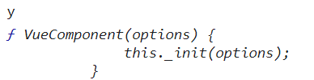
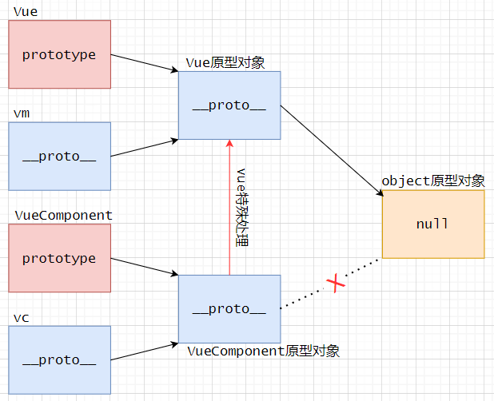
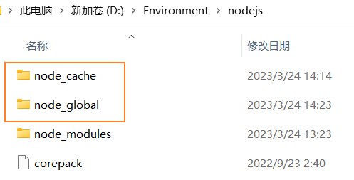
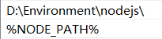
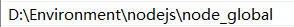
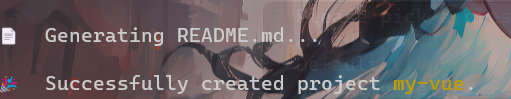
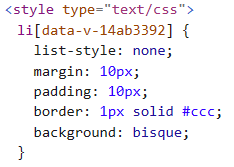
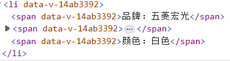

#### 1- 组件

##### a-介绍

<br>

> 1. 传统的`html、css、js`牵一发动全身，不利于维护。虽然复用，但是复用率不高。
> 2. 组件是vue强大的功能之一，能够封装可重复利用的代码，是实现了应用中局部功能的代码和资源的集合。
> 3. 一个组件可以包含:html、css、js、图片、音频、视频等。
> 4. 组件的划分粒度很重要，太粗不利于组件复用。
> 5. vue组件也可以嵌套使用。

<br>

##### b-创建组件

<br>

> 1. 创建组件：
>     1. 通过`xxx = Vue.extend({})`创建组件，提供一个和初始化vue几乎相同的配置项(但是略有区别)。
>         1. 创建vue组件时，不能使用`el`配置项(组件要复用，不能与单个元素绑定)；于是我们需要提供`template`模板语句(可以使用指令、胡子语法),注意只能有一个根节点。
>         2. 配置项中的`data`数据对象不能使用对象形式，而必须使用函数(生成组件实例时调用)。这主要是因为组件要复用，就必须保证每次复用，内部数据都是单独的(不能为同一个对象)，不然就会一改均变。
>         3. 其实`Vue.extend()`可以省略，直接使用一个`xxx = {}`对象即可，在注册组件时，vue会自动调用`Vue.extend()`。
> 2. 注册组件：
>     1. 局部注册：在vue实例中使用`components`配置项：`components:{ 组件名: 组件对象，}`。
>     2. 全局注册：使用`Vue.component(组件名，组件对象)`即可注册全局组件。
>     3. 注意组件的创建不能在组件注册之后。
>     4. 注意组件名不要与HTML内置的标签名冲突。
>     5. 在创建组件时，通过配置项配置一个`name`,设置vue开发者工具中显示的组件名称。
>     6. 当组件名与组件对象定义的变量名一致时，组件注册过程可以省略为`components( 组件名,)`,但是全局注册不可以省略。
> 3. 使用组件：将组件名作为html标签使用，例如`<my-component></my-component>`。
>     1. 提一嘴，vue中组件可以使用自闭合标签，例如`<my-component/>`,但前提是必须在脚手架环境中使用。
> 4. 组件命名规则：
>     1. 全部小写，例如`userlist`。
>     2. 首字母大写，其余小写，例如`Userlist`。
>     3. `kebab-case`命名法(串式命名法，例如`user-list`)。
>     4. `CamelCase`命名法(驼峰式命名法，例如`UserList`),但是注意这种方法只允许在脚手架环境中使用。

```html
<div id="app">
    <user-list></user-list> <!-- 使用组件 -->
</div>
<script>
    // 创建组件(省略形式)
    const user_list = {
        template: `
            <table>
                <th>
                    <td>name</td>
                    <td>age</td>
                </th>
                <tr>
                    <td>{{name}}</td>
                    <td>{{age}}</td>
                </tr>
            </table>`,
        data() {
            return {
                name: 'dreamfish',
                age: 18,
            }
        },
        name：'UserList',	// 设置开发者工具中组件名称

    }
    const vm = new Vue({
        data: {
            msg: 'hello',
        },
        el: '#app',
        components: {   // 注册组件
            'user-list': user_list,
        }
    })
</script>
```


##### c-组件嵌套

<br>

> 1. vue中组件可以嵌套，但是记住：组件在哪里注册就在哪里使用(全局注册就在全局使用)。
> 2. 组件中嵌套组件，可以使用`components`配置项为组件注册组件。
> 3. 同时组件中的`template`模板中可以使用注册的组件。

```html
<div id="app">
    <x></x> <!-- 使用组件 -->
</div>
<script>
    // 创建y组件
    const y = Vue.extend({
        template: `
            <div>
                <span>{{msg}}</span>
            </div>`,
        data() {
            return {
               msg:'this is y'
            }
        },
    })
    // 创建x组件
    const x = {
        template: `
            <div>
                <span>{{msg}}</span>
                <y></y>
            </div>`,
        data() {
            return {
               msg:'this is x'
            }
        },
        components:{
            y,  // 嵌套y组件
        }
    }
    const vm = new Vue({
        el: '#app',
        components: {   
           x,  // 注册x组件
        }
    })
</script>
```


##### d-extend原理

<br>

> 1. 关于`this`是vue永恒的研究话题，组件中的`this`是指向当前的组件实例。
> 2. 我们研究一下创建组件的`Vue.extend()`函数，它其实每次都会返回一个新的构造函数(VueComponent构造函数)。那么注册组件其实就是传入构造函数(我们通过控制台输出组件对象变量，可以很容易知道，如下图所示)。
> 3. 当vue解析模板遇到组件标签时，才会创建组建的实例。

<br>	


#### 2-单文件组件与脚手架

<br>

##### a-原型对象

<br>

> 1. JavaScript的构造函数本身是一种类型，其存在一个`prototype`属性，称为显式的原型属性，可以获取构造函数的原型对象。
> 1. 构造函数的实例存在一个`__proto__`属性，称为隐式的原型属性，可以获取构造函数的原型对象。
> 1. 原型对象只存在一个，无论是通过构造函数的`prototype`还是该构造函数的`__proto__`，获得的原型属性均为同一个。
> 1. 并且建议使用显式的原型属性，不建议使用隐式的原型属性获取原型对象。
> 1. 其实个人觉得，原型对象就是`java`中的类，其中定义的属性可以被所有实例访问。

```js
function My(name){
    this.name = name;
}
my = new My('fish');
console.log(My.prototype===my.__proto__);  // true
```

> 我们假设存在上述代码，我们通过`My.prototype.msg='something'`在原型对象中设置一个`msg`属性。然后我们惊奇的发现，通过`my.msg`可以访问原型对象的`msg`属性。这主要是因为`JavaScript`执行`my.msg`时先在`my`实例中找`msg`属性，发现找不到。又会向上在`my.__proto__`也就是原型对象中找。也就是说`my.msg`其实根本上是`my.__proto__.msg`。

```js
function My(name){
    this.name = name;
}
my = new My('fish');
My.prototype.msg='something';
console.log(my.msg);  // something
```

> 1. 那么理解上述代码之后，我们说一下vm(Vue实例)和vc(VueComponent实例)之间的关系:
>     1. 我们在Vue的原型对象设置一个`msg='something'`属性:`Vue.prototype.msg='something'`。
>     2. 我们发现`vc.msg`居然可以访问到`something`？我去，啥子情况？
>     3. 首先`Vue.prototype`和`vm.__proto__`获得的都是Vue的原型对象，而`VueComponent.prototype`和`vc.__proto__`获取的是VueComponent原型对象。这些都没错，但是`vue`对`VueComponent`原型对象的`__proto__`做了一点手脚，即使用`VueComponent.prototype.__proto__ = Vue.prototype`让`VueComponent`原型对象的`__proto__`指向了`Vue`的原型对象。
>     4. 那么对于`vc.msg`，先在`vc`实例中找不到，其次去`vc.__proto__`中找，最后去`vc.__proto__.__proto__`中找。
>     5. 但是注意无法通过`VueComponent`访问`msg`属性，猜测可能跟`prototype`而非`__proto__`有关，估计只有有`__proto__`属性才会去原型对象中获取。
>     6. 具体代码以及图示如下：

```js
Vue.prototype.msg='something'  // 给Vue原型添加属性

const userlist = Vue.extend({
    template:`
        <div>
            <span>{{msg}}</span>
        </div>
    `,
    data(){
        return {
            msg:'this is userlist'
        }
    },
    mounted() {
        console.log(this.msg)  //访问msg
    },
})

const vm = new Vue({
    el: '#app',
    components:{
            userlist,  // 注册组件
        }
    }) 
```

<br>	

##### b-单文件组件

<br>

> 1. 所谓单文件组件，就是一个文件(`.vue`)对应一个组件。
> 2. `.vue`文件无法被浏览器打开运行，需要使用Vue框架进行编译，最终成为浏览器能够识别的html、js、css。
> 3. 单文件组件命名规范和组件的命名规范相同：
>     1. 全部小写，例如`userlist`。
>     2. 首字母大写，其余小写，例如`Userlist`。
>     3. `kebab-case`命名法(串式命名法，例如`user-list`)。
>     4. `CamelCase`命名法(驼峰式命名法，例如`UserList`，和Vue开发者工具呼应),但是注意这种方法只允许在脚手架环境中使用。
> 4. 注意`.vue`文件的内容包括三部分：
>     1. `<template></template>`:html代码模板。
>     2. `<script></script>`:js代码。
>     3. `<style></style>`:css代码。
> 5. 我们使用`vscode`的拓展`Vetur`,使用<kbd><</kbd>+<kbd>v</kbd>+<kbd>Enter</kbd>可以快捷创建上述三个标签。


> 关于js的导入和导出(详细内容，以后补充)：
>
> 1. 分别导出：
>     1. 使用`export`语法将允许分别导入按名称导出的值。
>     2. 可以使用`import`通过`{}`按名称和需求导入。也可以通过`as`起别名。

```js
export function sum(a,b){
    return a+b;
}
export var fish = {
    name:'fish',
    age:20,
}
```

```js
// import { sum,fish } from "./first"
import { sum as mySum,fish as user} from "./first"
console.log(mySum(1,2)+user.name);
```

> 2. 默认导出：
>     1. 使用`export default`语法默认导出。
>     2. 一个js文件，只能含有一个默认导出。可以将多个导出放在一个对象中使用默认导出。

```js
function sum(a,b){
    return a+b;
}
var fish = {
    name:'fish',
    age:20,
}
export default {sum,fish}
```


> 1. 下面我们将之前的嵌套组件改为单文件组件。
>     1. 一般组件写在`.vue`文件中。
>     2. vue实例写在`main.js`文件中。
>     3. 而最后在页面中引入`vue.js`和`main.js`。
> 2. 但是请注意哦，浏览器无法识别`.vue`,所以当前我们尚无法编译`.vue`文件。

```vue
<!--y.vue-->
<template>
	<div>
    	<span>{{ msg }}</span>
    </div>
</template>

<script>
    export default Vue.extend({
        data() {
            return {
                msg: "this is y",
            };
        },
    });
</script>
<style>
</style>
```

```vue
<!--x.vue-->
<template>
	<div>
    	<span>{{ msg }}</span>
    	<y></y>
    </div>
</template>

<script>
    import y from "./y.vue"; // 引入y组件，其实名称可以随意
    export default {
        data() {
            return {
                msg: "this is x",
            };
        },
        components: {
            y, // 嵌套y组件
        },
    };
</script>

<style>
</style>
```

```js
// main.js
import x from './x.js'

new Vue({	// vue实例
    template: `
        <div>
            <x></x> 
        </div>
    `,
    el：'#app'
    components: {   // 注册组件
       x,  
    }
})
```

```html
<!--index.html-->
<!DOCTYPE html>
<html lang="en">
<head>
    <meta charset="UTF-8">
    <meta http-equiv="X-UA-Compatible" content="IE=edge">
    <meta name="viewport" content="width=device-width, initial-scale=1.0">
    <title>fish</title>
    <script src="../js/vue.js"></script> <!-- 引入vue.js -->
</head>
<body>
    <dic id="app">

    </dic>
    <script src="../vue2/main.js"></script> <!-- 引入main.js -->
</body>
</html>
```


#### 3-脚手架安装

##### a-node.js

<br>

> 1. 官网安装：[官网](http://nodejs.cn/download/)
>
> 2. [安装过程参考网上教程](https://blog.csdn.net/Nicolecocol/article/details/136788200)，注意无需安装`Tools for Native Modules`。
>
> 3. 环境配置:
>
>     1. 在安装目录下添加两个目录`node_cache`和`node_global`：
>
>         <br>
>
>     2. cmd运行`npm config set prefix "E:\Environment\nodejs\node_global"`(权限不够、管理员下运行cmd)。
>
>     3. cmd运行`npm config set cache "E:\Environment\nodejs\node_cache"`。
>
>     4. 配置环境变量`NODE_PATH`,变量值为：`E:\Environment\nodejs\node_global\node_modules`(告诉系统包、模块在这)。
>
>     5. path路径添加`%NODE_PATH%`和node.js的安装路径`E:\Environment\nodejs`。
>
>         <br>
>
>     6. 用户path路径添加`E:\Environment\nodejs\node_global`：
>
>         <br>
>
> 4. 配置淘宝镜像源：
>
>     1. 运行`npm config set registry https://registry.npm.taobao.org`配制镜像源。
>     2. 运行`npm config get registry`检查是否配置成功。
>
> 5. 下载`hexo`测试：`npm install -g hexo-cli`
>
>     1. `hexo init`：初始化站点，生成一个简单网站所需的各种文件。
>     2. `hexo clean/hexo c`：清除缓存网页正常情况下可以忽略此条命令。
>     3. `hexo g`:生效新增、修改、更新文件。
>     4. `hexo d`:一键部署，将网站发布到配置的仓库地址。
>     5. `hexo s`：本地启动网站。
>     6. 一般执行`hexo clean && hexo s`或者`hexo clean && hexo d`


##### b-安装脚手架

<br>

> 1. Vue脚手架官网[Vue CLI](https://cli.vuejs.org/zh/)。
>
> 2. Vue脚手架(Vue CLI)是vue官方提供的标准化开发平台，它可以将vue的代码(`.vue`)编译生成html、css、js代码，并可以将这些代码自动发布到它的自带服务器。
>
> 3. 注意安装CLI需要使用node.js(版本不宜太低)，建议配置淘宝npm镜像。
>
> 4. 安装脚手架：
>
>     1. cmd运行`npm install -g @vue/cli`安装即可(权限不够，管理员下运行，警告忽略)。
>     2. 运行`vue --version`检查安装是否成功。
>
> 5. 创建项目：
>
>     1. cmd下，切换到创建项目的目录，使用命令`vue create 项目名称`创建项目(报错可能是权限不够，管理员下运行即可)。
>
>     2. 但是会弹出一个选择，即vue2还是vue3(自行判断)。关于参数`babel`负责ES6语法转为ES5，参数`eslint`负责语法检查。
>
>         <br>
>
>     3. 等待一段时间，出现下图则创建成功。
>
>         <br>
>
> 6. 编译Vue程序，自动将生成的html、css、js放入内置服务器，自动启动服务器。
>
>     1. 创建的项目中会自动生成一个HelloWorld案例。
>     2. 我们在cmd运行`cd`命令切换到项目根目录。
>     3. 执行`npm run serve`编译vue程序。(注意是`npm`而非`vue`)
>     4. 编译完成后，可以打开浏览器`http://localhost:8080`即可访问。(`Ctrl+C`停止服务->连续两次即可)
>
> 7. 顺便提一嘴，之前不是需要`favicon.ico`文件，在生成的项目的`\public\favicon.ico`就存在一个。


#### 4-分析HelloWorld案例

##### a-项目目录

<br>

```tex
--node_modules/  		node安装的依赖包(脚手架的依赖)
--public/				公共目录，存放静态不变的文件，不会被webpack打包处理。
	--favicon.ico
	--index.html
--src/					源码文件夹，禁止改名，一般在此目录开发
	--assets/			存放静态资源，如：图片、声音、视频，会被webpack打包处理
	--components/		存放公共组件
	--App.vue			根组件
	--main.js			应用入口(名称、位置可修改，但需要在vue.config.js文件中配置)
--.gitignore			git忽略文件
--babel.config.js		babel语法，负责将ES6语法编译为ES5
--jsconfig.json			提供大量快速便捷的提高代码效率的方法
--package-lock.json		用于锁定当前状态下实际安装的各个包的具体来源和版本号，保证其他人npm install项目时依赖一致
--package.json			项目基本信息、包依赖配置信息等
--README.md				项目说明文件
--vue.config.js			vue脚手架的配置文件，可以配置入口文件名、是否保存时语法检查等
```

> 1. 项目的目录各部分介绍参考上述代码文件树。


##### b-index.html

<br>

```html
<!DOCTYPE html>
<html lang="">

<head>
  <meta charset="utf-8">
  <!--让IE浏览器启用最高渲染标准，IE8是不支持Vue的-->
  <meta http-equiv="X-UA-Compatible" content="IE=edge">
  <!--开启移动端虚拟窗口(理想窗口)-->
  <meta name="viewport" content="width=device-width,initial-scale=1.0">
  <!--设置页签图标-->
  <link rel="icon" href="<%= BASE_URL %>favicon.ico">
  <!--设置页签标题-->
  <title>
    <%= htmlWebpackPlugin.options.title %>
  </title>
</head>

<body>
  <!--当浏览器不支持js语法时，显示如下信息-->
  <noscript>
    <strong>We're sorry but <%= htmlWebpackPlugin.options.title %> 
        doesn't work properly without JavaScript enabled.
        Please enable it to continue.
    </strong>
  </noscript>
  <!--容器-->
  <div id="app"></div>
  <!-- built files will be auto injected -->
</body>

</html>
```

> 1. 居然不引入`vue.js`和`main.js`文件。
>     1. vue脚手架会自动找到`main.js`文件，不需要手动引入(所以不要随便修改入口文件名称和位置)。
>     2. 而在`main.js`中通过`import Vue form 'vue'`引入`Vue`(等同于导入`vue.js`)。


##### c-main.js

<br>

```js
// 等同于引入vue.js
import Vue from 'vue'
// 引入App组件(根组件)
import App from './App.vue'

// 关闭生产提示信息
Vue.config.productionTip = false

// 创建Vue实例
new Vue({
  render: h => h(App),
}).$mount('#app')
```


##### d-render详解

<br>

> 1. 首先在`main.js`中的`import Vue from 'vue'`导入的是Vue的仅运行时版本(`vue/dist/vue.runtime.esm.js`,我也不知道为啥不是`vue/dist/vue.runtime.js`)。完全的`Vue.js`包含Vue的核心、模板编译器两块，<font color=red>但仅运行时版本不含模板编译器部分</font>。
> 2. 之所以这么做，主要是程序员使用webpack打包处理后(编译为html、css、js),模板编译器没有存在必要。为了减小体积，故而直接删去。
> 3. 这就导致一个很严重的，那就是`template`配置项无法使用了。这种情况存在两种解决措施：
>     1. 导入完整的`vue.js`:`import Vue form 'vue/dist/vue.js'`。
>     2. 使用`render(createElement)`函数，该函数会自动被调用，并且传递一个`createElement`参数:
>         1. `createElement`是一个函数，可以用于创建元素。
>         2. `createElement(eleName,text)`:创建一个`eleName`类型元素，内部文本为`text`。
>         3. 关于`render()`函数演变过程如下：

```js
reader(createElement){
    return createElement('div','this is render function!')
}

/*
1. 变为箭头函数
2. 单个参数，省略()
3. 省略返回值return
*/

render: createElement => createElement('div','this is render function!')

/*
1. 修改createElement参数名为h。
2. 创建App组件标签
*/

render: h => h(APP)
```


##### e-配置

<br>

> 1. 在vue项目的`vue.config.js`中可以进行项目的一些配置：
>     1. `lintOnSave`:设置保存时是否进行语法检查(一些短名称组件会报错)，一般使用`false`关闭。
>     2. `pages`：配置页面对应的JavaScript入口。

```js
const { defineConfig } = require('@vue/cli-service')
module.exports = defineConfig({
    transpileDependencies: true,
    lintOnSave: false,  // 关闭保存时语法检查
    pages: {
        index: {
            // page入口文件
            entry: 'src/main.js', 
            // 模板来源
            template: 'public/index.html',
            // 在 dist/index.html 的输出
            filename: 'index.html',
            // 设置页签标题
            // template 中的 title 标签需要是 <title><%= htmlWebpackPlugin.options.title %></title>
            title: 'Vue3.0',
        }
    },
})
```


#### 5-组件

##### a-props

<br>

> 1. 在组件中使用`props`配置，可以让组件从父组件获取数据。存在三种接收数据方式：
>     1. 数组形式：
>         1. 使用形式`['属性名','属性名',...]`
>         2. 例如`['brand','color','price']`。
>     2. 对象添加类型限制：
>         1. 使用形式`{name:type,name:type,...}`
>         2. 例如`{brand:String,color:String,price:Number}`。
>     3. 对象，设置默认值，类型、必要性：
>         1. 使用形式`{name:{type:xx,required:xx,default:xx}}`
>         2. 例如`{brand:{type:String,required:true,default:'五菱'},}`
> 2. 父组件使用自组件标签，并采用属性形式传递数据。
> 3. 关于上述获取数据，组件标签存在两种属性填写方式：
>     1. 直接使用标签属性(不建议)。当设置类型`price:Number`,若使用标签`price="10"`会被识别为字符串导致类型不匹配。
>     2. 使用vue指令`v-bind`(建议,可以传变量)。当设置`color:String`,则需要使用`:color="'颜色'"`，而不是`:color="颜色"`。

```vue
<!--CarList.vue-->
<template>
    <li>
        <span>品牌：{{ brand }}</span>
        <span>价格：{{ price }}</span>
        <span>颜色：{{ color }}</span>
    </li>
</template>

<script>
    export default {
        name:'CarList',  // 设置vue开发插件中组件名称
        props: {
            brand: {
                type: String,  // 类型
                required: true,  // 是否必须
                default: "五菱宏光", // 默认值
            },
            price: {
                type: Number,
                required: true,
                default: 100000,
            },
            color: {
                type: String,
                required: true,
                default: "白色",
            },
        },
    };
</script>
```

```vue
<template>
  <div id="app">
    <ol>
        <!--通过组件标签的属性形式传值-->
      <car-list :brand="'宝马'" :color="'屎黄'" :price="10"></car-list>
      <car-list :brand="'宝马'" :color="'屎黄'" :price="10"></car-list>
      <car-list :brand="'宝马'" :color="'屎黄'" :price="10"></car-list>
      <car-list :brand="'宝马'" :color="'屎黄'" :price="10"></car-list>
    </ol>
  </div>
</template>

<script>
import CarList from "./components/CarList.vue";
export default {
  name: "App",
  components: {
    CarList,
  },
};
</script>
```

> 1. 注意一件事，<font color=red>不要修改`props`中数据，vue不建议这样做。因为当父组件重新渲染，`props`中值会被覆盖(修改没有任何效果)</font>。
> 2. 但是，我们非要改也不是不行，使用一个替换变量即可。每次`prop`改变，重新赋值替换变量，并且页面中也使用替换变量。

```vue
<template>
    <li>
        <span>价格：{{ otherPrice }}</span>  <!--使用替换变量(可修改)-->
    </li>
</template>

<script>
    export default {
        data(){
            return{
                otherPrice:this.price  // 替换变量初始化赋值
            }
        },
        props: {
            price: {
                type: Number,
                required: true,
                default: 100000,
            },
        },
    };
</script>
```


##### b-获取子组件

<br>

> 1. 我们可以在子组件标签中添加`ref="name"`属性标志。
> 2. 在父组件中可以通过`this.$refs.name`获取子组件，从而可以访问子组件中数据。
> 3. 此外还可以在Dom元素中设置`ref="name"`属性标签，在父组件中可以通过`this.$refs.name`获取`dom`元素。vue不建议你使用`js`原生代码获取`Dom`元素。

```vue
<template>
  <div id="app">
    <ol ref="ol"> <!--添加ref属性标志-->
      <car-list ref="car_one"></car-list>  <!--添加ref属性标志-->
    </ol>
	<button @click="print">
        print
    </button>
  </div>
</template>

<script>
import CarList from "./components/CarList.vue";
export default {
  name: "App",
  components: {
    CarList,
  },
  methods:{
    print(){
      console.log(this.$refs.ol);  //通过ref名称获取ol元素
      console.log(this.$refs.car_one);  //通过ref名称获取子组件
      console.log(this.$refs.car_one.color);
    }
  }
};
</script>
```


##### c-minin混入

<br>

> 1. 在创建`vue`实例或者组件时，常常有很多重复的配置项。为了避免代码冗余，我们可以使用混入来提取相同配置项。
> 2. 我们一般在`src`目录(就是`main.js`所在目录)下建一个`mixin.js`(名字不建议违背俗称约定)文件配置混入。
> 3. `mixin.js`需要将配置项放在一个`{}`对象中，这种对象可以存在多个，一般采用分别导出。
> 4. 在创建vue实例或者组件时导入`mixin.js`中的对象，然后使用`mixins`配置项提供一个数组来引入。
> 5. 混入并不会覆盖原有的同名配置项。
> 6. 但是对于生命周期的钩子函数，会先执行`minxin.js`中引入的同名钩子函数，再执行原对象中的钩子函数(钩子函数执行时期不会改变)。
> 7. 全局混入会在每个组件、vue实例添加混入；具体操作为在`main.js`中引入并使用`Vue.mixin()`引入。

```js
//mixins.js
export const mix_1 = {
    methods: {
        print() {
            console.log('This is a method from mixin!');
        }
    }
}
export const mix_2 = {
    mounted(){
        console.log(this);
    }
}
```

```vue
<!--局部混入-->
<template>
  <div id="app">
    <button @click="print">打印</button>
</template>

<script>
import { mix_1 } from "./mixin.js";
export default {
  name: "App",
  mixins: [mix_1]	// 混入
};
</script>
```

```js
//全局混入

// 等同于引入vue.js
import Vue from 'vue'
// 引入App组件(根组件)
import App from './App.vue'

// 关闭生产提示信息
Vue.config.productionTip = false

import { mix_1,mix_2 } from './mixin'
Vue.mixin(mix_2)  // 全局混入

// 创建Vue实例
new Vue({
  render: h => h(App),
}).$mount('#app')
```


#### 6-插件

<br>

##### a-创建插件

<br>

> 1. 我们一般在`src`目录(就是`main.js`所在目录)下建一个`plugins.js`(名字不建议违背俗称约定)文件配置插件。
> 2. 插件是一个对象`{}`，且必须包含`install()`方法，该方法会自动调用。该方法包含两部分参数：
>     1. `Vue`:Vue构造函数(无需手动传参)。
>     2. `...`:一些用户调用时传递的参数，参数个数不限例如(`a,b,c,d`)。但是一般我们使用一个配置项`options`接收所有参数。

```js
// plugins.js
export const plug_1 = {
    install(Vue, options) {
        console.log('用户传参',options);
        Vue.prototype.counter=0;  //原型对象添加属性，vc、vm均可访问
    }
}
```


##### b-使用插件

<br>

> 1. `main.js`中引入对应插件，并通过`Vue.use(plugin,params...)`调用插件。
> 2. 插件的使用通过在vue实例创建之前，删除插件只需要删除调用插件的代码即可。
> 3. 此外，<font color=red>其实还可以再插件中编译几个全局的函数，这样就可以在组件中调用</font>。

```js
import Vue from 'vue'
import App from './App.vue'
import { plug_1 } from './plugins'  //导入插件

Vue.config.productionTip = false

Vue.use(plug_1, {name: 'fish'});  //调用插件

new Vue({
  render: h => h(App),
}).$mount('#app')
```


#### 7-杂识

<br>

##### a-局部样式

<br>

> 1. vue会默认将所有`.vue`文件中的`<style></style>`样式放在一起，这样当某些`.vue`文件class属性一致，就会导致css样式混乱。而后引入组件的样式会覆盖先引入组件的同名样式。
>
> 2. 这时我们一般在组件中使用局部样式，而App根组件中使用全局样式(不添加`scoped`,采用全局)。
>
> 3. 所谓局部样式就是style标签中添加`scoped`，也即是`<style scoped></style>`,其中的css样式只为当前组件服务。
>
> 4. 其实就是为局部样式配置了一个独有的属性，并为当前样式所应用的标签添加该属性。
>
>     <br>
>
>     <br>

```vue
<style scoped>
li {
  list-style: none;  //不显示列表样式
  margin: 10px;
  padding: 10px;
  border: 1px solid #ccc;
  background: bisque;
}
</style>
```

