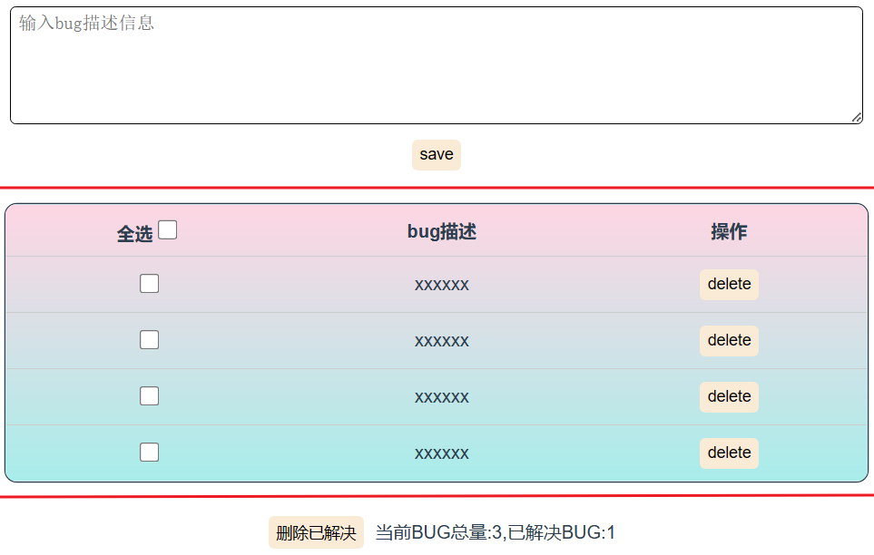
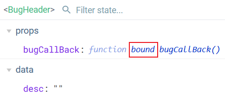
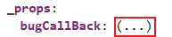
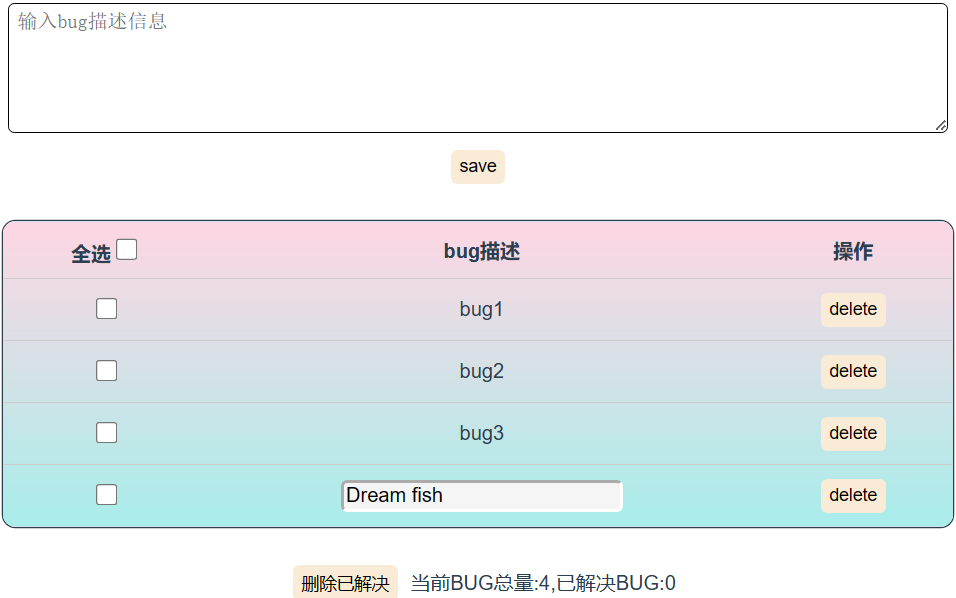

#### 1-静态页面

1. 参考下述页面，采用组件化开发静态页面。

    <br>

2. 创建`BugHeader、BugList(内含BugItem)、BugFooter`组件，并在`App`根组件中注册并使用。

    ```html
    <!--BugHeader.vue-->
    <template>
        <div>
            <textarea cols="90" rows="5" placeholder="输入bug描述信息"> </textarea><br/>
            <button>save</button>
        </div>
    </template>
    
    <script>
        export default {
            name: "BugHeader",
        };
    </script>
    
    <style scoped>
        textarea {
            border-radius: 5px;
            border: 1px solid black;
            padding: 5px 7px;
            font-size: 16px;
        }
    </style>
    ```

    ```html
    <!--BugFooter.vue-->
    <template>
        <div>
            <button>删除已解决</button>
            <span>当前BUG总量:3,已解决BUG:1</span>
        </div>
    </template>
    
    <script>
        export default {
            name: "BugFooter",
        };
    </script>
    ```
	```html 
    <!--BugList.vue-->
    <template>
        <tr>
            <td><input type="checkbox" /></td>
            <td>xxxxxx</td>
            <td><button>delete</button></td>
        </tr>
    </template>
    
    <script>
        export default {
            name: "BugItem",
        };
    </script>
    
    <style scoped>
        /*checkbox*/
        input[type=checkbox] {
            cursor: pointer; /* 鼠标样式为手型 */
            position: relative; /* 相对定位 */
            width: 18px;
            height: 18px;
            font-size: 12px;
        }
    
        input[type=checkbox]::after {
            position: absolute; /* 绝对定位 */
            top: 0; /* 与父元素的上边框对齐 */
            color: #000;
            width: 18px; 
            height: 18px; 
            display: inline-block; /* 显示为行内块元素 */
            visibility: visible; /* 显示 */
            padding-left: 0px; /* 文字距离左边框的距离 */
            text-align: center; /* 文字居中 */
            content: ' '; /* 未选中时显示的内容 */
            border-radius: 3px; /* 边框圆角 */
        }
    
        input[type=checkbox]:checked::after {
            content: "✓"; /* 选中时显示的内容 */
            color: #fff; /* 选中时的字体颜色 */
            font-size: 12px; /* 选中时的字体大小 */
            font-weight: bold; /* 选中时的字体粗细 */
            background-color: #00a7cb;
        }
    </style>	
	```

    ```html
    <!--App.vue-->
    <template>
        <div id="app">
            <BugHeader></BugHeader>
            <BugList></BugList>
            <BugFooter></BugFooter>
        </div>
    </template>
    
    <script>
        import BugHeader from "./components/BugHeader.vue";
        import BugList from "./components/BugList.vue";
        import BugFooter from "./components/BugFooter.vue";
        export default {
            name: "App",
            components: {
                BugHeader,
                BugList,
                BugFooter,
            },
        };
    </script>
    <style>
        #app {
            font-family: Avenir, Helvetica, Arial, sans-serif;
            -webkit-font-smoothing: antialiased;
            -moz-osx-font-smoothing: grayscale;
            text-align: center;
            color: #2c3e50;
            margin-top: 60px;
        }
        div {
            margin: 20px auto;	//外边距
        }
        button {
            margin: 10px;
            border-radius: 5px;
            border: 0px;
            padding: 5px 7px;
            text-align: center;
            font-size: 14px;
            background-color: antiquewhite;
        }
        button:hover {
            background-color: wheat;
            cursor: pointer; /* 鼠标样式为手型 */
        }
    </style>
    ```


#### 2-动态列表

1. 在`BugList.vue`中添加bugs数据，使用`v-for`遍历数据并通过`<BugItem></BugItem>`使用属性传参。

    ```html
    <!--BugList.vue-->
    <template>
      <div class="table">
        <table>
          <tr>
            <th>全选<input type="checkbox" /></th>
            <th>bug描述</th>
            <th>操作</th>
          </tr>
          <!--使用v-for遍历，通过属性给子组件传参-->
          <BugItem v-for="bug in bugs" :bug="bug" :key="bug.id"></BugItem>
        </table>
      </div>
    </template>
    
    <script>
    import BugItem from "./BugItem.vue";
    export default {
      name: "BugList",
      data() {
        return {
          bugs: [
            { id: 1, desc: "bug1", resolve: false },
            { id: 2, desc: "bug2", resolve: false },
            { id: 3, desc: "bug3", resolve: false },
            { id: 4, desc: "bug4", resolve: false },
          ],
        };
      },
      components: {
        BugItem,
      },
    };
    </script>
    <!--省略局部样式-->
    ```

    

2. 在`BugItem.vue`中接收数据并显示。

    ```html
    <!--BugItem.vue-->
    <template>
        <tr>
            <td><input type="checkbox" :checked="bug.resolve"/></td>  // 使用数据
            <td>{{bug.desc}}</td>
            <td><button>delete</button></td>
        </tr>
    </template>
    
    <script>
        export default {
            name: "BugItem",
            props: ["bug"],  //接收数据
        };
    </script>
    <!--省略局部样式-->
    ```

    

#### 3-文本域保存

1. `BugHeader.vue`中为文本域添加双向绑定。

2. 为保存按钮绑定一个事件，并编写一个保存函数。我们可以在函数中构造bug对象并保存。

3. 这时就存在一个问题，我们要保存bug对象到`BugList.vue`中的数据对象的`bugs`数组中，但是`BugHeader.vue`与`BugList.vue`为兄弟组件，无法获取`bugs`数组。

4. 于是我们提出一想法，将`bugs`定义在根组件`App`中，然后分别传给`BugHeader.vue`和`BugList.vue`(别想了，是同一个对象,是同一个App组件)。这样就可以获取到`bugs`数组，自然也就能执行保存逻辑。

5. 但是实际上vue不建议我们修改`props`中数据，所有我们另辟蹊径，尽量在`App.vue`中修改数据。于是乎，我们在`App.vue`中定义一个函数用于添加bug，将函数传给`BugHeader.vue`，执行保存bug逻辑时，可以调用该函数。

6. 有一点需要说明，`App.vue`中函数`bugCallBack`使用了`this`,将函数传递给子组件时，函数的上下文发生改变。在子组件中调用那`this`应该指向子组件。但是经过测试发现，并非如此，`this`依旧指向父组件App。我想应该是vue作为处理(似乎是启用了代理)，并且使用vue开发插件时发现方法前面多了个`bind`。

    <br>

    <br>

    ```html
    <!--App.vue-->
    <template>
        <div id="app">
            <BugHeader :bugCallback="bugCallback"></BugHeader>  <!--传递bug添加函数-->
            <BugList :bugs="bugs"></BugList>   <!--传递bugs数组-->
            <BugFooter></BugFooter>
        </div>
    </template>
    
    <script>
        import BugHeader from "./components/BugHeader.vue";
        import BugList from "./components/BugList.vue";
        import BugFooter from "./components/BugFooter.vue";
        export default {
            name: "App",
            data(){
                return {
                    bugs: [  //bug存储器
                        { id: 1, desc: "bug1", resolve: false },
                        { id: 2, desc: "bug2", resolve: false },
                        { id: 3, desc: "bug3", resolve: false },
                        { id: 4, desc: "bug4", resolve: false },
                    ],
                }
            },
            components: {
                BugHeader,
                BugList,
                BugFooter,
            },
            methods: {
                bugCallback(bug) {		// 添加bug函数
                    this.bugs.push(bug);  //想不通，是子组件调用该方法，为啥this指向父组件。
                },
            },
        };
    </script>
    <!--省略全局样式-->
    ```

    ```html
    <!--BugHeader.vue-->
    <template>
      <div>
        <textarea cols="90" rows="5" v-model="desc" placeholder="输入bug描述信息"> </textarea><br />
        <button @click="bugSave">save</button> //绑定保存事件
      </div>
    </template>
    
    <script>
    export default {
      name: "BugHeader",
      data() {
        return {
          desc: "",
        };
      },
      props: ["bugCallback"],  //接收bug添加函数
      methods: {
        bugSave() {
          if (this.desc.trim() === "") return;  //判断空字符
          let bug = {
            id: Date.now(),
            desc: this.desc,
            resolve: false,
          };
          this.bugCallback(bug);  //调用bug添加函数
          this.desc = "";  //置空文本域
        },
      },
    };
    </script>
    <!--省略局部样式-->
    ```

    ```html
    <!--BugList.vue-->
    <template>
        <div class="table">
            <table>
                <tr>
                    <th>全选<input type="checkbox" /></th>
                    <th>bug描述</th>
                    <th>操作</th>
                </tr>
                <!-- 遍历bugs，传递bug -->
                <BugItem v-for="bug in bugs" :bug="bug" :key="bug.id"></BugItem>
            </table>
        </div>
    </template>
    
    <script>
        import BugItem from "./BugItem.vue";
        export default {
            name: "BugList",
            components: {
                BugItem,
            },
            props: ["bugs"],	//接收bugs数组
        };
    </script>
    <!--省略局部样式-->
    ```
    
    ```html
    <!--BugItem.vue-->
    <template>
        <tr>
            <td><input type="checkbox" :checked="bug.resolve"/></td>
            <td>{{bug.desc}}</td>
            <td><button>delete</button></td>
        </tr>
    </template>
    
    <script>
        export default {
            name: "BugItem",
            props: ["bug"],	// 接收bug对象
        };
    </script>
    <!--省略局部样式-->
    ```


#### 3-复选框选择

1. 我们可以使用`v-model`即进行双向数据绑定。checkbox不存在value默认绑定checked属性。这样就可以实现复选框勾选，但是不建议这样做。首先我们要知道`bugs`数组存在`App.vue`中，`BugItem.vue`中的bug数据也是从`App.vue`中传递来的。也就是说`v-model`必定会改变`props`中数据。这是vue所不许的。

2. 于是我们想到使用单向数据绑定即`v-bind`,并且我们为复选框添加一个click事件或者change事件(当元素更改完成时，将触发 change事件)。

3. 然后在`App.vue`定义修改数据的函数，并通过属性传递给子组件`BugList.vue`,接着通过属性传递给`BugItem.vue`并在事件回调函数中调用。

4. 先在大致流程已经确定，但是由一个问题需要考虑。那就是我们如何确定我们操作的是哪一个bug对象。对了，就是bug的身份证`Id`,我们在事件回调函数需要传递当前bug的id。

5. 具体代码逻辑如下，省略样式。

    ```html
    <!--App.vue-->
    <template>
        <div id="app">
            <BugHeader :bugCallback="bugCallback" ref='haha'></BugHeader>
            <BugList :bugs="bugs" :bugCheckCallback="bugCheckCallback"></BugList>  <!--传递函数-->
            <BugFooter ></BugFooter>
        </div>
    </template>
    
    <script>
        import BugHeader from "./components/BugHeader.vue";
        import BugList from "./components/BugList.vue";
        import BugFooter from "./components/BugFooter.vue";
        export default {
            name: "App",
            data(){
                return {
                    bugs: [
                        { id: 1, desc: "bug1", resolve: false },
                        { id: 2, desc: "bug2", resolve: false },
                        { id: 3, desc: "bug3", resolve: false },
                        { id: 4, desc: "bug4", resolve: false },
                    ],
                }
            },
            components: {
                BugHeader,
                BugList,
                BugFooter,
            },
            methods: {
                bugCallback(bug) {  // 保存bug
                    this.bugs.push(bug);
                },
                bugCheckCallback(id) { // 处理bug
                    this.bugs.forEach((item) => {	 // 遍历数组
                        if (item.id === id) {  // 找到对应的bug
                            item.resolve = !item.resolve;  // 取反
                        }
                    });
                },
            },
        };
    </script>
    ```

    ```html
    <!--BugList.vue-->
    <template>
        <div class="table">
            <table>
                <tr>
                    <th>全选<input type="checkbox" /></th>
                    <th>bug描述</th>
                    <th>操作</th>
                </tr>
                <!-- 传递bug对象、bug选择函数 -->
                <BugItem v-for="bug in bugs" :bug="bug" :key="bug.id" :bugCheckCallback="bugCheckCallback"></BugItem>
            </table>
        </div>
    </template>
    
    <script>
        import BugItem from "./BugItem.vue";
        export default {
            name: "BugList",
            components: {
                BugItem,
            },
            props: ["bugs", "bugCheckCallback"],
        };
    </script>
    ```

    ```html
    <template>
        <tr>
            <td><input type="checkbox" :checked="bug.resolve" @change="checkBug(bug.id)"/></td>
            <!--绑定change事件，传参bug.id-->
            <td>{{bug.desc}}</td>
            <td><button>delete</button></td>
        </tr>
    </template>
    
    <script>
        export default {
            name: "BugItem",
            props: ["bug", "bugCheckCallback"],
            methods: {
                checkBug(id) {
                    this.bugCheckCallback(id);
                },
            },
        };
    </script>
    ```

    

#### 4-删除bug

1. 删除逻辑其实与复选框选择类似，`App.vue`传递删除bug函数直至`BugItem.vue`。

2. 在`BugItem.vue`为中删除按钮添加事件(注意别忘了传递bug.id)

3. 省略大多数代码，只展示`App.vue`中的bug删除函数逻辑。

    ```js
    deleteBugCallback(id) {
        this.bugs = this.bugs.filter((item) =>{ // 过滤数组
            return item.id !== id; // 返回不等于id的bug
        });
    },
    ```

    

#### 5-Bug统计

1. 对于统计所有bug的功能，我们直接使用`bugs.length`即可，当然，`bugs`需要从父组件传进来。

2. 对于已解决bug统计，可以使用一个计算属性，遍历`bugs`获取已解决的bug数。

3. 当然对于bug总数，也可以使用计算属性。

4. 当然，不要忘记将`bugs`数组从`App.vue`传入`BugFooter.vue`中。

5. `arr.reduce((pre,ele) => {//... },start)`：会将数组进行累加操作(调用`arr.length`次)。

    1. 其中`start`为初始值。
    2. `pre`为上一次调用该函数的返回值。
    3. `ele`为当前访问的数组元素。

6. 省略组件传值部分逻辑(写了很多遍)。只展示`BugFooter.vue`中。

    ```html
    <template>
        <div>
            <button>删除已解决</button>
            <span>当前BUG总量:{{bugs.length}},已解决BUG:{{bugResolvedCount}}</span>
        </div>
    </template>
    
    <script>
        export default {
            name: "BugFooter",
            props:["bugs"],
            computed: {
                bugCount() {
                    return this.bugs.length;
                },
                bugResolvedCount() {
                    return this.bugs.reduce((prev, bug) => { 
                        // reduce:用于数组的累加 prev为上一次的返回值 bug为当前的值 0为初始值
                        return prev + (bug.resolve ? 1 : 0);
                    }, 0)
                },
            },
        };
    </script>
    ```

    

#### 6-显示

1. 实现功能：所有复选框选中时，全选自动选中。没有数据时全选框不选中。并且无数据时，`BugFooter`和`BugList`不展示。

2. 其实上述功能很好解决，当`bugs.length==bugResolvedCount && !bugs.length`时全选框选中即可。对于`bugs.length=0`使用`v-show`指令隐藏`BugFooter`和`BugList`即可。

3. 但是vue不建议指令表达式过长，于是可以将表达式抽出成计算属性`checkAll`。

4. 具体实施就是在`BugList.vue`中提供计算属性即可。

5. 我们仅提供`BugList`组件部分的代码逻辑。

    ```html
    <template>
        <div class="table" v-show="bugCount">  <!-- v-show:根据bugCount的值来判断是否显示 -->
            <table>
                <tr>
                    <th>全选<input type="checkbox" :checked="checkAll" /></th>
                    <th>bug描述</th>
                    <th>操作</th>
                </tr>
                <BugItem v-for="bug in bugs" :bug="bug" :key="bug.id" 
                         :bugCheckCallback="bugCheckCallback" 
                         :deleteBugCallback="deleteBugCallback">
                </BugItem>
            </table>
        </div>
    </template>
    
    <script>
        import BugItem from "./BugItem.vue";
        export default {
            name: "BugList",
            components: {
                BugItem,
            },
            props: ["bugs", "bugCheckCallback", "deleteBugCallback"],
            computed: {
                bugCount() { // bug总数
                    return this.bugs.length;
                },
                bugResolvedCount() { // 已解决的bug数量
                    return this.bugs.reduce((prev, bug) => {
                        return prev + (bug.resolve ? 1 : 0);
                    }, 0);
                },
                checkAll(){ // 全选显示
                    return this.bugs.length === this.bugResolvedCount;
                }
            },
        };
    </script>
    ```


#### 7-全选

1. 要实现全选功能，可以为全选框添加一个click或者change事件。要实现全部选中或全部不选，就是让所有bug的选中属性设置为全选框的`checked`属性。通过事件就是`bug.resolved = event.target.checked`。

2. 通过上述经验，我们很容易知道需要在`App.vue`中提供一个函数用于全选，并将其传递给子组件。

3. 但是我们不采用这种绑定事件形式，我们之前设置所有复选框选中时，全选自动选中创建一个计算属性`checkAll`。我们将`checkAll`于全选框`checked`实现双向绑定。这样当我们点击全选框，其实会改变`checked`值，就会调用计算属性的`setter`方法，那么问题就很容易解决了。我们在计算属性的`setter`中调用`App.vue`的全选函数即可。问题又来了，怎么获取当前全选框的`checked`,其实就是修改后的新值，会自动传给`setter`。

    ```html
    <!--BugList.vue-->
    <template>
        <div class="table" v-show="bugCount">
            <!-- v-show:根据bugCount的值来判断是否显示 -->
            <table>
                <tr>
                    <th>
                        <!-- 全选<input type="checkbox" :checked="checkAll" @change="selectAll" /> -->
                        全选<input type="checkbox" v-model="checkAll"/>
                    </th>
                    <th>bug描述</th>
                    <th>操作</th>
                </tr>
                <BugItem
                         v-for="bug in bugs"
                         :bug="bug"
                         :key="bug.id"
                         :bugCheckCallback="bugCheckCallback"
                         :deleteBugCallback="deleteBugCallback"
                         >
                </BugItem>
            </table>
        </div>
    </template>
    
    <script>
        import BugItem from "./BugItem.vue";
        export default {
            name: "BugList",
            components: {
                BugItem,
            },
            props: ["bugs", "bugCheckCallback", "deleteBugCallback", "selectAllCallback"],
            computed: {
                bugCount() {
                    return this.bugs.length;
                },
                bugResolvedCount() {
                    return this.bugs.reduce((prev, bug) => {
                        return prev + (bug.resolve ? 1 : 0);
                    }, 0);
                },
                // checkAll(){ // 全选显示
                //   return this.bugs.length === this.bugResolvedCount;
                // }
                checkAll: {
                    // 全选显示
                    get() {
                        return this.bugs.length === this.bugResolvedCount;
                    },
                    set(val) {
                        this.selectAllCallback(val);
                    },
                },
            },
            //  methods: {
            //    selectAll(e) {
            // 全选
            //      this.selectAllCallback(e.target.checked);
            //    },
            //  },
        };
    </script>
    ```

    ```html
    <template>
        <div id="app">
            <BugHeader :bugCallback="bugCallback" ref="haha"></BugHeader>
            <BugList
                     :bugs="bugs"
                     :bugCheckCallback="bugCheckCallback"
                     :selectAllCallback="selectAllCallback"
                     :deleteBugCallback="deleteBugCallback"
                     >
            </BugList>
            <BugFooter :bugs="bugs"></BugFooter>
        </div>
    </template>
    
    <script>
        import BugHeader from "./components/BugHeader.vue";
        import BugList from "./components/BugList.vue";
        import BugFooter from "./components/BugFooter.vue";
        export default {
            name: "App",
            data() {
                return {
                    bugs: [
                        { id: 1, desc: "bug1", resolve: false },
                        { id: 2, desc: "bug2", resolve: false },
                        { id: 3, desc: "bug3", resolve: false },
                        { id: 4, desc: "bug4", resolve: false },
                    ],
                };
            },
            components: {
                BugHeader,
                BugList,
                BugFooter,
            },
            methods: {
                bugCallback(bug) {
                    this.bugs.push(bug);
                },
                bugCheckCallback(id) {
                    this.bugs.forEach((item) => {
                        if (item.id === id) {
                            item.resolve = !item.resolve;
                        }
                    });
                },
                deleteBugCallback(id) {
                    this.bugs = this.bugs.filter((item) => {
                        return item.id !== id;
                    });
                },
                selectAllCallback(flag) {
                    // 全选
                    this.bugs.forEach((item) => {
                        item.resolve = flag;  // 遍历修改bug的resolve
                    });
                },
            },
        };
    </script>
    ```


#### 8-清除已解决bug

1. 在`App.vue`中提供删除已解决bug的函数，传递给子组件。
2. 在`BugFooter.vue`中为按钮添加点击事件，并在回调函数中使用`App.vue`传递的函数。
3. 关于`App.vue`中函数逻辑，其实就是使用`filter()`按`resolve`属性过滤数组即可。


#### 9-修改描述

1. 需求：点击描述时变为输入框，并且输入框获取焦点，修改完后，失去焦点则自动保存变为文本。

2. 我们为bug对象添加一个属性`isEdit`记录是否位于编辑状态。但是注意我们是后期添加，并且需要设置响应式。

3. 并且我们使用`v-show="isEdit"`来决定是显示输入框还是文本。这时自然需要为文本所在元素添加一个点击事件。注意开始时`bug.isEdit`不存在，但是需要显示文本，所以`!bug.isEdit==True`时显示文本。(别忘了使用`:value="bug.desc"`为输入框绑定value属性)

4. 当触发文本点击事件时，我们判断bug对象是否存在`isEdit`属性，存在则设为true。不存在则使用`this.$set()`创建，并设为true。当然，上述逻辑任然定义在`App.vue`中，通过属性传递给子组件。并在事件回调函数中调用。

5. 在修改完`isEdit`属性后，我们可以通过设置`ref="editInput"`属性标志，并通过`this.$ref.editInput.focus()`使输入框获取焦点。但是这是错误的。为了效率，vue会等函数内容执行完才重新渲染，此前对页面的操作会被覆盖。因此需要让上述逻辑延后执行，可以使用`setTimeout()`设置延时执行。但是vue也为我们提供了`$nextTick(function)`。

6. `$nextTick(function(){})`会绑定一个回调函数，在下一次DOM全部渲染完毕后自动调用。

    ```html
    <!--App.vue-->
    <template>
        <div id="app">
            <BugHeader :bugCallback="bugCallback" ref="haha"></BugHeader>
            <BugList
                     :bugs="bugs"
                     :bugCheckCallback="bugCheckCallback"
                     :selectAllCallback="selectAllCallback"
                     :deleteBugCallback="deleteBugCallback"
                     :toEditCallback="toEditCallback" 
                     ></BugList> 
            <BugFooter :bugs="bugs" :deleteAllResolveBug="deleteAllResolveBug"></BugFooter>
        </div>
    </template>
    
    <script>
        import BugHeader from "./components/BugHeader.vue";
        import BugList from "./components/BugList.vue";
        import BugFooter from "./components/BugFooter.vue";
        export default {
            name: "App",
            data() {
                return {
                    bugs: [
                        { id: 1, desc: "bug1", resolve: false },
                        { id: 2, desc: "bug2", resolve: false },
                        { id: 3, desc: "bug3", resolve: false },
                        { id: 4, desc: "bug4", resolve: false },
                    ],
                };
            },
            components: {
                BugHeader,
                BugList,
                BugFooter,
            },
            methods: {
                bugCallback(bug) {
                    this.bugs.push(bug);
                },
                bugCheckCallback(id) {
                    this.bugs.forEach((item) => {
                        if (item.id === id) {
                            item.resolve = !item.resolve;
                        }
                    });
                },
                deleteBugCallback(id) {
                    this.bugs = this.bugs.filter((item) => {
                        return item.id !== id;
                    });
                },
                selectAllCallback(flag) {
                    this.bugs.forEach((item) => {
                        item.resolve = flag;
                    });
                },
                deleteAllResolveBug() {
                    this.bugs = this.bugs.filter((item) => {
                        return !item.resolve;
                    });
                },
                toEditCallback(id){  
                    this.bugs.forEach((item) => {
                        if(item.id === id){
                            // 不推荐使用item.hasOwnProperty("isEdit"),因为hasOwnProperty是Object的原型方法,会被污染
                            if(!Object.prototype.hasOwnProperty.call(item, "isEdit")){ // 判断是否有isEdit属性
                                this.$set(item, "isEdit", true); // 添加isEdit属性
                            }else{
                                item.isEdit=true; // 修改元素isEdit属性
                            }
                        }
                    })
                }
            },
        };
    </script>
    ```

    ```html
    <!--BugItem.vue-->
    <template>
        <tr>
            <td>
                <input
                       type="checkbox"
                       :checked="bug.resolve"
                       @change="checkBug(bug.id)"
                       />
            </td>
            <td @click="toEdit(bug)">
                <span v-show="!bug.isEdit" class="edit-span">{{ bug.desc }}</span>
                <input type="text" v-show="bug.isEdit" ref="editInput" class="edit-input" :value="bug.desc"/>
            </td>
            <td><button @click="delBug(bug.id)">delete</button></td>
        </tr>
    </template>
    
    <script>
        export default {
            name: "BugItem",
            props: ["bug", "bugCheckCallback", "deleteBugCallback", "toEditCallback"],
            methods: {
                checkBug(id) {
                    this.bugCheckCallback(id);
                },
                delBug(id) {
                    this.deleteBugCallback(id);
                },
                toEdit(bug) {
                    this.toEditCallback(bug.id);
                    //this.$refs.editInput.focus();  错误 vue会等方法全部执行才会渲染页面，在此之前操作页面无效。
                    this.$nextTick(function(){
                        this.$refs.editInput.focus();  
                    })
                },
            },
        };
    </script>
    
    <style scoped>
        /*省略一些样式*/
        .edit-span{
            cursor: pointer;
        }
        .edit-input{ 
            width: 50%;
            height: 100%;
            border-radius: 5px;
            border: 3px inset white;
            font-size: 16px;
        }
        .edit-input:focus{ /* input获取焦点时的样式 */
            outline: none; /* 去掉input的边框 */
            background-color: whitesmoke;
        }
    </style>
    ```

    7.  接下来需要在失去焦点时,自动保存数据。为输入框绑定一个失去焦点事件`@blur`函数，并在其中调用下述函数。

    8. 当然也是在`App.vue`根组件实现基本逻辑：

        1. 通过传递的id找到对于bug对象。
        2. 更新bug对象的描述。
        3. 修改当前bug的`isEdit=False`退出编辑。

    9. 具体代码实现如下：

        ```html
        <!--App.vue-->
        <template>
            <div id="app">
                <BugHeader :bugCallback="bugCallback" ref="haha"></BugHeader>
                <BugList
                         :bugs="bugs"
                         :bugCheckCallback="bugCheckCallback"
                         :selectAllCallback="selectAllCallback"
                         :deleteBugCallback="deleteBugCallback"
                         :toEditCallback="toEditCallback"
                         :saveDescCallback="saveDescCallback"
                         ></BugList>
                <BugFooter :bugs="bugs" :deleteAllResolveBug="deleteAllResolveBug"></BugFooter>
            </div>
        </template>
        
        <script>
            import BugHeader from "./components/BugHeader.vue";
            import BugList from "./components/BugList.vue";
            import BugFooter from "./components/BugFooter.vue";
            export default {
                name: "App",
                data() {
                    return {
                        bugs: [
                            { id: 1, desc: "bug1", resolve: false },
                            { id: 2, desc: "bug2", resolve: false },
                            { id: 3, desc: "bug3", resolve: false },
                            { id: 4, desc: "bug4", resolve: false },
                        ],
                    };
                },
                components: {
                    BugHeader,
                    BugList,
                    BugFooter,
                },
                methods: {
                    bugCallback(bug) {
                        this.bugs.push(bug);
        
                    },
                    bugCheckCallback(id) {
                        this.bugs.forEach((item) => {
                            if (item.id === id) {
                                item.resolve = !item.resolve;
                            }
                        });
                    },
                    deleteBugCallback(id) {
                        this.bugs = this.bugs.filter((item) => {
                            return item.id !== id;
                        });
                    },
                    selectAllCallback(flag) {
                        this.bugs.forEach((item) => {
                            item.resolve = flag;
                        });
                    },
                    deleteAllResolveBug() {
                        this.bugs = this.bugs.filter((item) => {
                            return !item.resolve;
                        });
                    },
                    toEditCallback(id){  
                        this.bugs.forEach((item) => {
                            if(item.id === id){
                                if(!Object.prototype.hasOwnProperty.call(item, "isEdit")){ 
                                    this.$set(item, "isEdit", true);
                                    console.log('哈哈');
        
                                }else{
                                    item.isEdit=true; 
                                }
                            }
                        })
                    },
                    saveDescCallback(id, desc){
                        this.bugs.forEach((item) => {
                            if(item.id === id){
                                item.desc = desc;	// 更新描述
                                item.isEdit = false; // 退出编辑状态
                            } 
                        })
                    }
                },
            };
        </script>
        ```

        ```html
        <!--BugItem.vue-->
        <template>
            <tr>
                <td>
                    <input
                           type="checkbox"
                           :checked="bug.resolve"
                           @change="checkBug(bug.id)"
                           />
                </td>
                <td @click="toEdit(bug)">
                    <span v-show="!bug.isEdit" class="edit-span">{{ bug.desc }}</span>
                    <input type="text" v-show="bug.isEdit" 
                           ref="editInput" class="edit-input" 
                           @blur="saveDesc(bug,$event)" :value="bug.desc"/>
                </td>
                <td><button @click="delBug(bug.id)">delete</button></td>
            </tr>
        </template>
        
        <script>
            export default {
                name: "BugItem",
                props: ["bug", "bugCheckCallback", "deleteBugCallback", "toEditCallback","saveDescCallback"],
                methods: {
                    checkBug(id) {
                        this.bugCheckCallback(id);
                    },
                    delBug(id) {
                        this.deleteBugCallback(id);
                    },
                    toEdit(bug) {
                        this.toEditCallback(bug.id);
                        this.$nextTick(function(){
                            this.$refs.editInput.focus();  
                        })
                    },
                    saveDesc(bug,e){
                        let desc = e.target.value;
                        if (desc.trim() === '') { // 如果输入为空，不保存
                            return;
                        }
                        // 保存bug的描述
                        this.saveDescCallback(bug.id,e.target.value); // 保存bug的描述,并退出编辑
                    }
                },
            };
        </script>
        ```

​		<br>				

