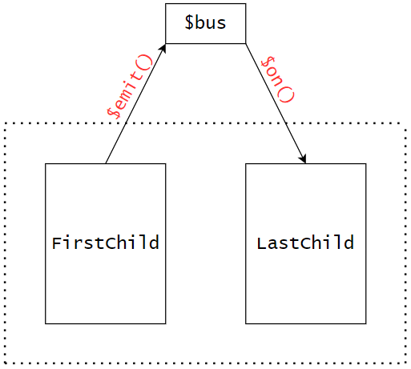

>   1.   自定义组件事件解绑：在子组件`beforeDestroy()`中解绑。
>   2.   全局事件总线事件解绑：谁接收数据，在谁中解绑当前事件。

#### 1-组件的自定义事件

##### a-指令绑定自定义事件

<br>

>   1.   自定义事件的步骤与内置事件步骤类似：
>        1.   提供事件源(就是事件所绑定的组件)
>        2.   给组件绑定事件，使`v-on:my-event="表达式"`指令，或者`@my-event="表达式"`缩写形式(指令属性仍可以使用)。
>        3.   编写回调函数，将回调函数与事件进行绑定(就是在父组件中定义回调函数)。
>        4.   等待事件触发，但是自定义组件的触发，需要在子组件中执行`vc.$emit('my-event',…params)`，强调一遍在子组件中触发。当然触发时间上也可以传递参数，`my-event`是自定义事件名,后面可以接收一堆不限长参数。
>        5.   那么传递的参数在哪里接收？在父组件定义的事件回调函数中接收，其中也可以使用不定参数接收。
>   2.   需要强调一点，自定义组件事件其实是绑定在组件实例上的，哪个实例调用`$emit()`,就会触发哪个组件实例上的对应事件。
>   3.   当目前为止，关于子父组件传参方式：
>        1.   父--->子：使用自组件标签的属性形式传参，自组件通过`props`配置项获取传递的参数。
>        2.   子--->父：
>             1.   在父组件定义方法，将方法传递给子组件，子组件调用该方法以参数形式传递数据给父组件。
>             2.   使用组件的自定义事件形式，在父组件绑定事件，子组件触发事件。

```html
<!--App.vue-->
<template>
    <div id="app">
        <sonexample @my-event="reactMethod"></sonexample> 
        <!-- 通过@my-event来监听子组件触发的事件 -->
    </div>
</template>

<script>
    import sonexample from './components/sonexample.vue';
    export default {
        name: "App",
        components: {
            sonexample,
        },
        methods:{
            reactMethod(user){ // 通过reactMethod来接收子组件传递过来的数据
                console.log(user);
            }
        }

    };
</script>
```

```html
<!--sonexample.vue-->
<template>    
    <button @click="touchOff">click</button>
</template>

<script>
    export default {
        name: "SonExample",
        methods: {
            touchOff() {
                this.$emit("my-event", {name:'fish',age:20});   
                // 通过$emit来触发自定义事件，第一个参数为事件名，第二个参数为传递的数据
            },
        },   
    }
</script>
```


##### b-代码绑定自定义事件

<br>

>   1.   对于组件的自定义事件，除了使用`v-on`绑定之外，我们还可以在父组件的`mounted()`钩子方法中绑定。
>        1.   首先肯定要获取子组件，通过`ref="xx"`添加属性标识，同时`mounted()`通过`this.$refs.xx`获取子组件`vc`。
>        1.   然后通过`vc.$on("my-event",function)`为子组件绑定事件，并为事件绑定回调函数。其中`my-event`时子组件的自定义事件名，`function`是回调函数。此种方式一般用在`mounted()`钩子函数中。
>   2.   顺便提一嘴，`vc.$once('my-event',function)`为子组件绑定事件，且只触发一次。

```html
<!--App.vue-->
<template>
    <div id="app">
        <sonexample ref="event"></sonexample> <!-- 通过@my-event来监听子组件触发的事件 -->
    </div>
</template>

<script>
    import sonexample from './components/sonexample.vue';
    export default {
        name: "App",
        components: {
            sonexample,
        },
        mounted(){
            this.$refs.event.$on('my-event',this.reactMethod); 
            // 通过$on来监听子组件触发的事件，第一个参数为事件名，第二个参数为回调函数
        },
        methods:{
            reactMethod(user){ // 通过reactMethod来接收子组件传递过来的数据
                console.log(user);
            }
        }

    };
</script>
```

```html
<!--sonexample-->
<template>    
        <button @click.once="touchOff">click</button><!--只执行一次回调函数-->
</template>

<script>
export default {
    name: "SonExample",
    
    methods: {
        touchOff() {
            this.$emit("my-event", {name:'fish',age:20});   
            // 通过$emit来触发事件，第一个参数为事件名，第二个参数为传递的数据
        },
    },   
}
</script>
```


##### c-组件解绑事件

<br>

>   1.   给谁绑事件就给谁解绑事件。
>   2.   在子组件中调用解绑方法即可为当前组件实例解绑指定事件：
>        1.   `vc.$off('my-event')`:为当前组件实例解绑名为my-event的事件。
>        2.   `vc.$off(['my-event1','my-event2'])`:为当前组件实例解绑数组中所有自定义事件。
>        3.   `vc.$off()`:为当前组件实例解绑所有自定义事件。
>   3.   有一个非常重要的习惯，我们在一个组件中接收数据时，如果该组件被销毁，需要在全局事件总线解绑对应事件。一般在该组件的`beforeDestroy()`组件中使用`$off()`解绑事件，从而在即将销毁时解绑。

```html
<!--App.vue-->
<template>
    <div id="app">
        <sonexample ref="event"></sonexample> <!-- 通过@my-event来监听子组件触发的事件 -->
    </div>
</template>

<script>
    import sonexample from './components/sonexample.vue';
    export default {
        name: "App",
        components: {
            sonexample,
        },
        mounted(){
            this.$refs.event.$on('my-event',this.reactMethod); 
            // 通过$on来监听子组件触发的事件，第一个参数为事件名，第二个参数为回调函数
        },
        methods:{
            reactMethod(user){ // 通过reactMethod来接收子组件传递过来的数据
                console.log(user);
            }
        }

    };
</script>
```

```html
<!--sonexample-->
<template>
    <div>
        <button @click="touchOff">on</button>
        <button @click="unbinding">off</button>
    </div>
</template>

<script>
    export default {
        name: "SonExample",
        methods: {
            touchOff() {
                this.$emit("my-event", { name: "fish", age: 20 });
                // 通过$emit来触发事件，第一个参数为事件名，第二个参数为传递的数据
            },
            unbinding() {
                this.$off("my-event");
                // 通过$off来解除事件监听
            },
        },
    };
</script>
```


##### d-this大杂烩

<br>

>   1.   在使用组件的自定义事件时，使用普通函数还是箭头函数区别很大。
>        1.   `vc.$on()`中使用<span style="color:red">箭头函数</span>配置回调函数：`this`指向父组件实例(不存在this,引用外层代码块this，也即是父组件实例)。
>        2.   `vc.$on()`中使用<span style="color:red">普通函数</span>配置回调函数：`this`指向子组件实例，而非父组件实例(因为是通过子组件调用`$on()`方法，所以是子组件)。
>        3.   `metnods`配置项中使用<span style="color:red">普通函数</span>配置回调函数：毋庸置疑，`this`就是当前`methods`所在父组件实例对象。
>   2.   我们一般会把回调函数定义在`methods`配置项中，而不是用其他两种形式。

```js
{
    name: "App",
    components: {
        sonexample,
    },
    mounted(){
        this.$refs.event.$on('my-event',() => {
            console.log(this);  //App组件实例
        });
        this.$refs.event.$on('my-event',function(){
            console.log(this);  // sonedxample组件实例实例
        });
        this.$refs.event.$on('my-event',this.reactMethod);
    },
    methods:{
        reactMethod(){ 
            console.log(this);  //App组件实例
        }
    }
}
```


#### 2-全局事件总线

##### a-简介

<br>

>   1.   其实，通过组件的自定义事件，可以基本得出：对于同一个实例`vc`而言(`vm`其实也行)，`vc.$emit()`、`vc.$on()`可以分别传输数据、获取数据。
>   2.   那么，我们可以设置一个全局的Vue实例(`vm`或者`vc`)实现下面功能：
>        1.   某组件获取该全局实例，调用`$emit()`传递数据。
>        2.   另一组件获取全局实例，调用`$on()`接收数据。
>   3.   这时，我们很容易想到，将全局Vue实例存储在Vue原型对象上，就可以在任何`vm`、`vc`中获取该全局Vue实例。
>   4.   那么，我们可以通过`Vue.extend({})`获取VueComponent构造器，通过`new`创建其实例，最后存储在Vue原型对象中即可。
>   5.   但是，为了方便往往直接将`vm`充当全局实例，但是又会存在几个问题：
>        1.   我们在创建`vm`之前将其放入`Vue.prototype`中，肯定不对，此时`vm`还不存在。
>        2.   我们在创建`vm`之后将其放入`Vue.prototype`中，也不对，此时页面都渲染完毕了，有啥用。
>        3.   所以我们在`beforeCreate()`钩子函数中将`vm`设置为Vue原型对象属性，这时`vm`已经创建并且页面还没渲染。
>   6.   我们一般会把全局Vue实例称为全局事件总线，并且将属性命名为`$bus`。
>   7.   有一个非常重要的习惯，我们在一个组件中接收数据时，如果该组件被销毁，需要在全局事件总线解绑对应事件。一般在该组件的`beforeDestroy()`组件中使用`$off()`解绑事件，从而在即将销毁时解绑。

```js
//main.js

import Vue from 'vue'
import App from './App.vue'

Vue.config.productionTip = false

const VueComponent = Vue.component({}) // 获取VueComponent构造函数
Vue.prototype.$bus = new VueComponent() // 创建一个vc实例作为事件总线

new Vue({
    render: h => h(App),
}).$mount('#app')
```

```js
// main.js(改良版)

import Vue from 'vue'
import App from './App.vue'

Vue.config.productionTip = false

new Vue({
    render: h => h(App),
    beforeCreate() {
        Vue.prototype.$bus = this // 安装全局事件总线
    }
}).$mount('#app')
```


##### b-示意图

<br>

>   1.   虽然我们推荐使用`vm`作为`$bus`，但是不利于演示。所以我们选择`vc`作为`$bus`用于演示。
>
>   2.   我们在`App.vue`中创建`FirstChild.vue`和`LastChild.vue`,并且通过全局总线实现`FirstChild.vue`和`LastChild.vue`之前数据通信。
>
>        <br>
>
>   3.   关于具体实现：
>        1.   `FirstChild.vue`调用`$emit()`绑定组件与事件。
>        2.   `LastChild.vue`在`$mounted()`钩子函数中使用`$on()`绑定事件与回调函数。
>        3.   在`LastChild.vue`的`methods`配置项中创建对应的回调函数，用于接收数据。
>        4.   在`LastChild.vue`的`$beforeDestroy()`中使用`$off()`解绑事件。

```js
//main.js

import Vue from 'vue'
import App from './App.vue'

Vue.config.productionTip = false

const VueComponent = Vue.extend({}) // 获取VueComponent构造函数
Vue.prototype.$bus = new VueComponent() // 创建一个Vue实例作为事件总线

new Vue({
    render: h => h(App),
}).$mount('#app')
```

```vue
<!--App.vue-->
<template>
  <div id="app">
    <FirstChild></FirstChild><br>
    <LastChild></LastChild> 
  </div>
</template>

<script>
import FirstChild from "./components/FirstChild.vue";
import LastChild from "./components/LastChild.vue";
export default {
  name: "App",
  components: {
    FirstChild,LastChild
  },
};
</script>
```

```vue
<!--FirstChild.vue-->
<template>
  <button @click="click">first</button>
</template>

<script>
export default {
    name: "FirstChild",
    methods:{
        click(){
            this.$bus.$emit('my-event',{msg:'this is data'}); 
            // 通过$emit来触发事件
        }
    },
}
</script>
```

```vue
<!--LastChild.vue-->
<template>
    <button>last</button>
</template>

<script>
export default {
    name: "LastChild",
    mounted(){
        this.$bus.$on('my-event',this.getDate)  
        // 通过$on来监听事件
    },
    beforeDestroy(){
        this.$bus.$off('my-event')
        // 解除事件绑定
    }
    methods:{
        getDate(data){
            console.log(data);
        }
    },

}
</script>
```


#### 3-消息订阅

#####  a-实现

<br>

>   1.   使用消息的订阅与发布机制，也可以完成任意组件之间的数据传递。
>        1.   订阅方负责接收数据，发布方负责发送数据。
>        2.   `订阅('title',function(a,b){})`，发布方发布时，`function(a,b){}`自动调用。
>             1.   `a`:订阅消息的标题。
>             2.   `b`:具体的订阅数据。
>        3.   `发布('title',data)`，发布。
>   2.   我们要使用消息的订阅与发布，需要借助第三方库，这里我们选择`pubsub-js`:
>        1.   pub：publish(发布)。
>        2.   sub：subscribe(订阅)。
>   3.   `pubsub-js`可以在任何框架中使用，完成订阅与发布，我们通过`node.js`的`npm i pubsub-js`命令安装js库。
>   4.   我们需要在组件中通过`import pubsub from 'pubsub-js'`形式引入`pubsub`对象，通过该对象实现消息的订阅与发布。
>        1.   `pubsub.subscribe('title',function(){msgName,msg})`:订阅消息，一般在`mounted()`钩子函数中订阅。返回一个订阅`pid`，在取消订阅时有用。`msgName、msg`分别为消息标题、消息数据。
>        2.   `pubsub.publish('title',data)`：发布消息，一般在某个方法中执行即可。
>        3.   `pubsub.unsubscribe(pid)`：当组件销毁前，需要取消订阅(好习惯)。一般用在`beforeDestroy()`中。
>   5.   推荐优先使用全局事件总线，而不是消息订阅。

```html
<!--FirstChild.vue-->
<template>
    <button @click="click">click-first</button> 
</template>

<script>
    import pubsub from 'pubsub-js';
    export default {
        name: "FirstChild",
        methods:{
            click(){
                pubsub.publish("msg", {name:"fish",msg:"hello first"}); // 发布消息 
            },

        },

    }
</script>
```

```html
<!--LastChild.vue-->
<template>
    <div class="last">
        <button @click="destroy">destroy-last</button>   
    </div>
</template>

<script>
    import pubsub from 'pubsub-js';
    export default {
        name: "LastChild",
        mounted(){
            this.pid = pubsub.subscribe("msg", (msg, data) => {
                console.log(data);
            }); // 订阅消息
        },
        beforeDestroy(){
            pubsub.unsubscribe(this.pid);  // 取消订阅
        },
        methods:{
            destroy(){
                this.$destroy(); // 销毁组件
            }
        },  
    }
</script>
```


##### b-this大杂烩

<br>

>   1.   关于消息订阅中的`this`指向问题：
>        1.    `pubsub.subscribe()`中使用箭头函数时，函数中`this`就是当前`vc`。
>        2.    `pubsub.subscribe()`中使用普通函数时，函数中`this`为`undefined`。
>        3.    `pubsub.subscribe()`中使用在`methods`配置项中函数时，函数中`this`就是当前`vc`。
>        4.   上述中`this`是指`pubsub.subscribe()`的参数函数中的`this`而非`pubsub.subscribe()`内的`this`。
>   2.   此外我们也推荐使用全局事件总线，而非消息发布与订阅(就算要用，建议将接收函数定义在`methods`配置项中)。


