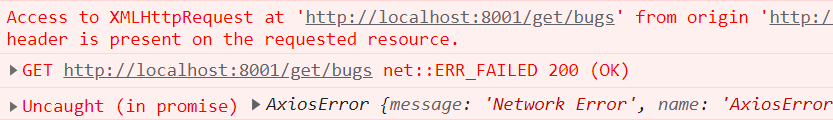

#### 1-python搭建简单服务器

#####  a-简单介绍

<br>

>   1.   虽然`django`、`flask`提供可以用于搭建web，但是很多时候就是做一个简单测试，没有必要创建web项目。这时可以通过python搭建一个简单地web服务器。
>   2.   这时我们可以使用python的`BaseHTTPRequestHandler`和`HTTPServer`搭建一个简单地服务器。而且还可以多开。
>   3.   `BaseHTTPServer `这个模块提供了两个类让开发者实现 `HTTP server`：`HTTPServer` 和 `BaseHTTPRequestHandler`。`HTTPServer` 继承了 `SocketServer.BaseServer`，主要功能是：创建和监听`socket`，把请求转发给`handler `去处理。主要的工作都是在 `BaseHTTPRequestHandler` 中处理的，它把和请求有关的信息都封装成自己的实例变量，可以在子类中直接使用。


#####  2-BaseHTTPRequestHandler

<br>

```tex
BaseHTTPRequestHandler.path                   	包含的请求路径和GET请求的数据
BaseHTTPRequestHandler.command                	请求类型GET、POST...
BaseHTTPRequestHandler.request_version        	请求的协议类型HTTP/1.0、HTTP/1.1
BaseHTTPRequestHandler.headers                	请求的头
BaseHTTPRequestHandler.responses              	HTTP错误代码及对应错误信息的字典
BaseHTTPRequestHandler.handle()                	用于处理某一连接对象的请求，调用															handle_one_request方法处理
BaseHTTPRequestHandler.handle_one_request()    	根据请求类型调用do_XXX()方法，XXX为请求类型
BaseHTTPRequestHandler.do_XXX()               	处理请求
BaseHTTPRequestHandler.send_error()           	发送并记录一个完整的错误回复到客户端,内部调用													send_response()方法实现
BaseHTTPRequestHandler.send_response()         	发送一个响应头并记录已接收的请求
BaseHTTPRequestHandler.send_header()          	发送一个指定的HTTP头到输出流。keyword 应该指定
												头关键字,value指定它的值
BaseHTTPRequestHandler.end_headers()           	发送一个空白行，标识发送HTTP头部结束
BaseHTTPRequestHandler.wfile    				应答的HTTP文本流对象，可写入应答信息
BaseHTTPRequestHandler.rfile    				请求的HTTP文本流对象，可读取请求信息
```

>   1.   可以使用`send_headers('Content-type', 'text/html; charset=utf-8')`设置响应内容格式：
>        1.   `text/html` ： HTML格式
>        2.   ` text/plain` ：纯文本格式
>        3.   `application/json`：json格式
>        4.   ` text/xml `： XML格式
>        5.   `image/gif `：gif图片格式
>        6.   `image/jpeg` ：jpg图片格式
>        7.   ` image/png`：png图片格式
>        8.   `application/pdf`：pdf格式
>
>   2.   需要声明的是，我们一般不使用这些响应格式，不知道为啥，似乎会报错。


#####  c-最终成果

<br>

```python
from http.server import HTTPServer, BaseHTTPRequestHandler
import json
from io import BytesIO

class SimpleHTTPRequestHandler(BaseHTTPRequestHandler):

    def do_GET(self):
        self.send_response(200)  # 响应状态码
        self.end_headers()  # 响应头
        if self.path == '/get/data':  # 路径匹配
            data = {
                'user': 'fish',
                'age': 20,
                'sex': '男',
            }
            self.wfile.write(json.dumps(data).encode('utf-8'))  # 响应内容
        elif self.path == '/get/other':  # 路径匹配
            data = {
                'user': 'dream',
                'age': 18,
                'sex': '男',
            }
            self.wfile.write(json.dumps(data).encode('utf-8'))  # 响应内容

    def do_POST(self):
        content_length = int(self.headers['Content-Length'])  # 获取请求头
        body = self.rfile.read(content_length)  # 获取请求体
        self.send_response(200)  # 响应状态码
        self.end_headers()  # 响应头
        response = BytesIO()  # 响应内容
        response.write(b'This is POST request. ')
        response.write(b'Received: ')
        response.write(body)
        self.wfile.write(response.getvalue())  # 响应内容
        
    def do_OPTIONS(self):  # 针对ajax的试探
        pass


httpd = HTTPServer(('localhost', 8100), SimpleHTTPRequestHandler) 
# 服务器地址  服务器处理类
httpd.serve_forever()
# 一直监听 8100端口
```

>   1.   在下面的测试中，需要连接web服务器，选择这种简单地web服务器即可。


#### 2-ajax

##### a-跨域问题

<br>

>1.   在a页面中想获取b页面中的资源，若a页面和b页面所处的协议、域名、端口不同(只要一个不同)，所进行的访问都是跨域的。
>2.   允许的跨域行为：
>     1.   直接在浏览器地址栏输入地址进行访问。
>     2.   超链接。
>     3.   ``
>     4.   `<link href="其他网站css文件">`
>     5.   `<script src="其他网站js文件">`
>3.   不允许的跨域行为：
>     1.   `ajax`请求。
>     2.   `cookie`、`localStorage`、`IndexedDB`等存储性内容。
>     3.   DOM节点。
>4.   跨域问题主要是由于浏览器的同源策略，为了安全起见，不会接收不允许的非同源数据。
>5.   同源策略时浏览器所需要遵循的标准，而服务器向服务器请求就无需遵循同源策略。这也是Vue CLI的解决跨域问题的原理，即通过代理服务器。


##### b-jquery

<br>

```js
$.ajax({
    type : "POST",			//以post方法提交数据给服务器
    url : "User",				//提交数据的url
    dataType : "text",		//数据类型
    data : {						//传给服务器的数据
        "name": $("#name").val(),			
        "password":$("#pwd").val()
    },
    success:function(msg) {			//回调函数
        if(msg =="OK"){
            alert("登录成功！");
        }
        else{
            alert("登录失败！");
        }
    }
});
```


#### 3-axios

##### a-安装与简介

>   1.   cmd通过`npm install axios` 安装到当前项目目录中，前提是已经安装`node.js`。
>   2.   `axios`可以实现ajax，vue也推荐使用`axios`实现ajax。


##### b-发送get请求

<br>

>   1.   可以直接通过`axios`对象发送get请求。
>   1.   也可以使用axois提供的别名，也就是`axios.get()`，此时就无须使用`method`指定请求方式。
>   1.   注意回调函数的`this`指向问题。
>   1.   当然，你也可以直接将参数使用`?`拼接在`url`中。
>   1.   `responseType: 'json'`：设置响应数据类型，默认`json`，可选值`json、arraybuffer、blob、document、json、text、stream`。
>   1.   在别名方法中，`url`、`params`、`options`，其中若需要配置响应数据类型，就要在`options`对象中配置。此外`options`中无需再配置`url、params`。

```js
axios({ 
    method: 'get',  						// 请求方式
    url: 'http://localhost:8001/get/bugs'   // 请求地址
    params:{								//参数
        id:1
    },
    responseType:'json',
}).then((res) => {  						// 请求成功之后进行什么操作
    console.log(res);
}).catch((err) => {  						// 请求失败之后进行什么操作
    console.log(err)
}).then(() => {  							// 不管请求成功还是失败都会执行的操作
    console.log('finally')
})
```

```js
axios.get('http://localhost:8001/get/bugs',{
    params:{
        id:1
    }
},{
    responseType:'json'
}).then((res) => { 						// 成功  
    console.log(res);
}).catch((err) => {  					// 捕获错误
    console.log(err);
}).then(() => {  						// 必定执行
    console.log('finally');
})
```


##### c-发送post请求

<br>

>   1.    可以直接通过`axios`对象发送get请求。
>   2.    也可以使用axois提供的别名，也就是`axios.post()`，此时就无须使用`method`指定请求方式。
>   3.    注意在发送真正的请求前, 会先发送一个方法为OPTIONS的预请求，检查试探服务端是否能接受真正的请求。
>   4.    `responseType: 'json'`：设置响应数据类型，默认`json`，可选值`json、arraybuffer、blob、document、json、text、stream`。
>   5.    在别名方法中，`url`、`data`、`options`，其中若需要配置响应数据类型，就要在`options`对象中配置。此外`options`中无需再配置`url、data`。

```js
axios({
    method: 'post',
    url: 'bug/get/user',
    data:{
        userName:'fish',
        age:20,
    },
    responseType:'json',
}).then((res) => {  					// 成功
    console.log(res);
}).catch((err) => {  					// 失败
    console.log(err);
}).then(() => {  						// 不管成功或失败都会执行
    console.log('finally');
})
```

```js
axios.post('bug/get/user',{
    userName:'fish',
    age:20,
},{
    responseType:'json'
}).then((res) => {  // 成功
    console.log(res);
}).catch((err) => {  					// 失败
    console.log(err);
}).then(() => {  						// 不管成功或失败都会执行
    console.log('finally');
})
},
```


##### d-其他请求

>   1.   `axios.delete(url[, config])`：delete请求，同样可以使用`method:delete`替换。
>   2.   `axios.head(url[, config])`：请求页面首部。
>   3.   `axios.options(url[, config])`：请求就是预检请求(一般跨域)。
>   5.   `axios.put(url[, data[, config]])`：put请求，同样可以使用`method:dput`替换。
>   6.   `axios.patch(url[, data[, config]])`：patch请求，同样可以使用`method:patch`替换。


##### e-请求配置

>   1.   发送请求时，可以使用`options`配置对象对请求进行一些配置，具体常见配置如下：

```js
{
  // `url` 是用于请求的服务器 URL
  url: '/user',

  // `method` 是创建请求时使用的方法
  method: 'get', // 默认值

  // `baseURL` 将自动加在 `url` 前面，除非 `url` 是一个绝对 URL。
  // 它可以通过设置一个 `baseURL` 便于为 axios 实例的方法传递相对 URL
  baseURL: 'https://some-domain.com/api/',

  // `transformRequest` 允许在向服务器发送前，修改请求数据
  // 它只能用于 'PUT', 'POST' 和 'PATCH' 这几个请求方法
  // 数组中最后一个函数必须返回一个字符串， 一个Buffer实例，ArrayBuffer，FormData，或 Stream
  // 你可以修改请求头。
  transformRequest: [function (data, headers) {
    // 对发送的 data 进行任意转换处理

    return data;
  }],

  // `transformResponse` 在传递给 then/catch 前，允许修改响应数据
  transformResponse: [function (data) {
    // 对接收的 data 进行任意转换处理

    return data;
  }],

  // 自定义请求头
  headers: {'X-Requested-With': 'XMLHttpRequest'},

  // `params` 是与请求一起发送的 URL 参数
  // 必须是一个简单对象或 URLSearchParams 对象
  params: {
    ID: 12345
  },

  // `paramsSerializer`是可选方法，主要用于序列化`params`
  // (e.g. https://www.npmjs.com/package/qs, http://api.jquery.com/jquery.param/)
  paramsSerializer: function (params) {
    return Qs.stringify(params, {arrayFormat: 'brackets'})
  },

  // `data` 是作为请求体被发送的数据
  // 仅适用 'PUT', 'POST', 'DELETE 和 'PATCH' 请求方法
  // 在没有设置 `transformRequest` 时，则必须是以下类型之一:
  // - string, plain object, ArrayBuffer, ArrayBufferView, URLSearchParams
  // - 浏览器专属: FormData, File, Blob
  // - Node 专属: Stream, Buffer
  data: {
    firstName: 'Fred'
  },
  
  // 发送请求体数据的可选语法
  // 请求方式 post
  // 只有 value 会被发送，key 则不会
  data: 'Country=Brasil&City=Belo Horizonte',

  // `timeout` 指定请求超时的毫秒数。
  // 如果请求时间超过 `timeout` 的值，则请求会被中断
  timeout: 1000, // 默认值是 `0` (永不超时)

  // `withCredentials` 表示跨域请求时是否需要使用凭证
  withCredentials: false, // default

  // `adapter` 允许自定义处理请求，这使测试更加容易。
  // 返回一个 promise 并提供一个有效的响应 （参见 lib/adapters/README.md）。
  adapter: function (config) {
    /* ... */
  },

  // `auth` HTTP Basic Auth
  auth: {
    username: 'janedoe',
    password: 's00pers3cret'
  },

  // `responseType` 表示浏览器将要响应的数据类型
  // 选项包括: 'arraybuffer', 'document', 'json', 'text', 'stream'
  // 浏览器专属：'blob'
  responseType: 'json', // 默认值

  // `responseEncoding` 表示用于解码响应的编码 (Node.js 专属)
  // 注意：忽略 `responseType` 的值为 'stream'，或者是客户端请求
  // Note: Ignored for `responseType` of 'stream' or client-side requests
  responseEncoding: 'utf8', // 默认值

  // `xsrfCookieName` 是 xsrf token 的值，被用作 cookie 的名称
  xsrfCookieName: 'XSRF-TOKEN', // 默认值

  // `xsrfHeaderName` 是带有 xsrf token 值的http 请求头名称
  xsrfHeaderName: 'X-XSRF-TOKEN', // 默认值

  // `onUploadProgress` 允许为上传处理进度事件
  // 浏览器专属
  onUploadProgress: function (progressEvent) {
    // 处理原生进度事件
  },

  // `onDownloadProgress` 允许为下载处理进度事件
  // 浏览器专属
  onDownloadProgress: function (progressEvent) {
    // 处理原生进度事件
  },

  // `maxContentLength` 定义了node.js中允许的HTTP响应内容的最大字节数
  maxContentLength: 2000,

  // `maxBodyLength`（仅Node）定义允许的http请求内容的最大字节数
  maxBodyLength: 2000,

  // `validateStatus` 定义了对于给定的 HTTP状态码是 resolve 还是 reject promise。
  // 如果 `validateStatus` 返回 `true` (或者设置为 `null` 或 `undefined`)，
  // 则promise 将会 resolved，否则是 rejected。
  validateStatus: function (status) {
    return status >= 200 && status < 300; // 默认值
  },

  // `maxRedirects` 定义了在node.js中要遵循的最大重定向数。
  // 如果设置为0，则不会进行重定向
  maxRedirects: 5, // 默认值

  // `socketPath` 定义了在node.js中使用的UNIX套接字。
  // e.g. '/var/run/docker.sock' 发送请求到 docker 守护进程。
  // 只能指定 `socketPath` 或 `proxy` 。
  // 若都指定，这使用 `socketPath` 。
  socketPath: null, // default

  // 参考官方文档
  httpAgent: new http.Agent({ keepAlive: true }),
  httpsAgent: new https.Agent({ keepAlive: true }),

  // `proxy` 定义了代理服务器的主机名，端口和协议。
  // 您可以使用常规的`http_proxy` 和 `https_proxy` 环境变量。
  // 使用 `false` 可以禁用代理功能，同时环境变量也会被忽略。
  // `auth`表示应使用HTTP Basic auth连接到代理，并且提供凭据。
  // 这将设置一个 `Proxy-Authorization` 请求头，它会覆盖 `headers` 中已存在的自定义 `Proxy-Authorization` 请求头。
  // 如果代理服务器使用 HTTPS，则必须设置 protocol 为`https`
  proxy: {
    protocol: 'https',
    host: '127.0.0.1',
    port: 9000,
    auth: {
      username: 'mikeymike',
      password: 'rapunz3l'
    }
  },

  // 参考官方文档
  cancelToken: new CancelToken(function (cancel) {
  }),

  // 参考官方文档
  decompress: true // 默认值

}
```


##### f-响应结构

<br>

>   1.   axios的响应结果的格式一般如下：
>   2.   需要特别注意`data`。

```js
{
  // 服务器提供的响应的数据
  data: {},

  // 来自服务器响应的 HTTP 状态码
  status: 200,

  // 来自服务器响应的 HTTP 状态信息
  statusText: 'OK',

  // `headers` 是服务器响应头
  // 所有的 header 名称都是小写，而且可以使用方括号语法访问
  // 例如: `response.headers['content-type']`
  headers: {},

  // `config` 是 `axios` 请求的配置信息
  config: {},

  // `request` 是生成此响应的请求
  // 在node.js中它是最后一个ClientRequest实例 (in redirects)，
  // 在浏览器中则是 XMLHttpRequest 实例
  request: {}
}
```


##### g-自定义配置

>   1.   我们也可以使用`axios.create(options)`创建一个自定义的axios实例，提供一个`options`配置对象。
>   2.   配置类似于请求配置，参考官网，略。


##### h-拦截器

略


#### 4-vue代理服务器

<br>

>   1.   直接在vue项目中通过axios发送请求时，若跨域，会报错：
>
>        <br>
>
>   2.   这时vue提供了一种解决措施，就是使用内部服务器访问。同源策略时浏览器所需要遵循的标准，而服务器向服务器请求就无需遵循同源策略。于是，vue项目访问跨域资源时，会通过代理服务器去访问，而不是浏览器，代理服务器访问资源并获取资源后返回给浏览器。
>
>   3.    
>
>        


##### a-vue中使用axios

<br>

>   1.   vue中使用`axios`一般存在两种方式。
>   2.   一种是直接导入`import axios form "axios"`，然后就可以使用axios。
>   3.   另一种是参考全局事件总线的方式，在`main.js`中，将`axios`配置为Vue原型对象的一个属性，一般名为`$axios`。此后可以通过`this.$axios`使用axios。
>        1.   配置在`beforeCreate()`方法中。
>        2.   需要`import axios form "axios"`导入。
>   4.   但是，第二种存在一些问题，就是所有的axios是同一个对象，使用同一套配置，不利于组件复用。
>   5.   注意回调函数的`this`指向问题，当然一般使用箭头函数，最好在`methods`中定义操作vue实例的函数。
>   6.   下面只演示第二种方式。

```js
//main.js
import Vue from 'vue'

import App from './App.vue'
import axios from "axios"

Vue.config.productionTip = false

new Vue({
  beforeCreate() {
    Vue.prototype.$axios = axios // 将axios挂载到Vue原型上
  },
  render: h => h(App),
}).$mount('#app')
```

>   1.   如果觉得上述还不够顺心，还可以自定义几个拦截器：不会，略。


##### b-简单代理

<br>

>   1.   在`vue.config.js`中添加配置`devServer`，`devServer`是一个对象，其中可以配置一个`proxy:xxx`即需要代理的url(只需包含域名和端口号)。
>   2.   但是这种简单地配置只能代理一个域名，无法提供多个代理。

```js
// vue.config.js
const { defineConfig } = require('@vue/cli-service')
module.exports = defineConfig({
  transpileDependencies: true,
  lintOnSave: false, 
  pages: {
    index: {
      entry: 'src/main.js', 
      template: 'public/index.html',
      filename: 'index.html',
      title: 'Vue3.0',
    }
  },
  devServer: {
    proxy:'http://localhost:8001'  // 配置代理(127.0.0.1也OK)
  },
})
```

>   1.   这时，我们访问`http:\\localhost:8080/get/bugs`(`localhost:8080`是脚手架的内置服务器)或者省略写法`/get/bugs`(一般省略)，vue会先在自身找对应资源，找不到，就会向代理地址发送请求索要对应资源。
>   2.   注意，不是直接访问`127.0.0.1:8001`，这还是跨域访问，访问不了。
>   3.   有一个问题，浏览器不认为`localhost`和`127.0.0.1`是同一个域名，建议选用其中一种即可。也就是使用`localhost`访问项目，但是项目内部使用`127.0.0.1`似乎会认为跨域。
>   4.   `localhost `与`127.0.0.1 `相比关吗，`127.0.0.1 `是通过网卡传输，依赖网卡，并受到网络防火墙和网卡相关的限制。 一般设置程序时本地服务用`localhost `是最好的，`localhost `不会解析成IP，也不会占用网卡、网络资源。


##### c-高级代理

>   1.   在`vue.config.js`中添加配置`devServer`，`devServer`是一个对象，其中可以配置一个`proxy:{}`。而在这个`proxy`配置对象中可以配置多个代理域名。

```js
const { defineConfig } = require('@vue/cli-service')
module.exports = defineConfig({
    transpileDependencies: true,
    lintOnSave: false, 
    pages: {
        index: {
            entry: 'src/main.js', 
            template: 'public/index.html',
            filename: 'index.html',
            title: 'Vue3.0',
        }
    },
    devServer: {  //代理配置
        proxy: {
            '/bug': {
                target: 'http://127.0.0.1:8001', // 代理地址
                changeOrigin: true, // 是否改变起源(让服务器不知道你是谁)
                pathRewrite: {
                    '^/bug': '' // 重写路径
                },
                ws: true // websocket支持(一种实时推送技术)， 默认true
            }
        }
    },

})
```

>   1.   上述配置的一些说明，`/bug`匹配所有以`/bug`开头的路径，将其适配代理。其实个人认为就是一个代理域名的别名。
>   2.   `pathRewrite:{}`对访问路径重写，例如大多数情况`/bug`不作为有效访问地址，而是作为一个标识。这时我们并不希望其出现在代理的访问地址中，可以使用`pathRewrite:{'^/bug':''}`将其替换为空字符。当然如果`/bug`有效则无需替换。下面还有一些其他处理形式：
>        1.   `pathRewrite:{'^/old':'/new'}`替换。
>        2.   `pathRewrite:{'^/':'/add'}`添加。
>        3.   `pathRewrite:{'^/bug':''}`删除。
>   3.   我们简单捋一下访问逻辑：`/bug/get/bugs`会首先去`localhost:8080`找，找不到走代理。删除`/bug`部分，拼接`http://127.0.0.1:80001/get/bugs`代理路径，访问获取资源并返回给浏览器。

> `vue3`中配置略有变化：`vite.config.js`配置文件

```js
export default defineConfig({
    server: {
        proxy: {
            '/api': {
                target: 'http://127.0.0.1:3000',
                changeOrigin: true,
                rewrite: (path) => path.replace(/^\/api/, '')
            }
        }
    },
})
```


#### 5-vue-resource插件

<br>

>   1.   通过`npm i vue-resource`在项目目录中安装插件。
>   2.   在`main.js`中通过`import vueResource from "vue-resource"`导入，并且通过`Vue.use(vueResource)`使用插件。
>   3.   使用插件后，会在所有的vm、vc中添加一个`$http`属性，可以通过该属性发送ajax请求。
>        1.   `$http.get().then()`:发送get请求，使用方式与axios一致。
>        2.   其他类型请求类比`$http.xxx()`即可。
>        3.   当然也可以类似`axois()`，使用`$http()`，然后传递一个配置对象即可。

```js
//main.js(使用插件)
import Vue from 'vue'
import App from './App.vue'
import VueResource from 'vue-resource' // 引入VueResource插件

Vue.config.productionTip = false
Vue.use(VueResource)  // 使用VueResource插件

new Vue({
  render: h => h(App),
}).$mount('#app')

```

```vue
<!--某个vc-->
<template>
<button>click-first</button>
</template>

<script>
    export default {
        name: "FirstChild",
        data() {
            return {
                bugs: [],
            };
        },
        mounted() { // 组件挂载完成后执行,一般在这里发送请求获取数据 
            this.$http.get("bug/get/bugs").then((response) => {
                console.log(this);  // 箭头函数:this指向当前组件实例
                console.log(response);
            }).catch((err) => {  //捕获异常
                console.log(err);
            }).then(() => {  // 无论成功或失败都会执行
                console.log("finally");
            });
        },
    };
</script>
```


#### 6-天气案例

<br>

##### a-静态页面

<br>

1.   将上述页面分为`search.vue`和`weather.vue`，最外层为`App.vue`。
2.   `search.vue`包含搜索框、提交按钮。`weather.vue`显示搜索到的天气信息。
3.   分别编写页面，由于逻辑较简单，略。


#####  b-api接口

<br>

>   1.   这里使用`https://openweathermap.org/`提供的api接口。
>   2.   这里需要说明：
>        1.   `http://api.openweathermap.org/geo/1.0/direct?q={}&appid={}`：通过地点名称获取该地区经纬度。
>        2.   `https://api.openweathermap.org/data/2.5/weather?lat={}&lon={}&appid={}&units=metric`:根据经纬度查询天气信息，`units=metric`设置单位为公制单位。
>   3.   具体内容：注册网站--->生成APIKey--->学习官方API文档。


##### c-axios获取信息

<br>

>   1.   一些说明：`localhost:8080\${path}`这时ES6的一种语法，可以用于字符串格式化，有点类似于python。但是注意该语法似乎只在模板字符(一对反引号括起来的字符串)串中支持。
>
>   2.   此外，无需考虑跨域是api提供者已经考虑并解决了(如下图)。`Access-Control-Allow-Origin:*`是指允许任何域名的网站跨域访问该服务器端口，即无需对请求的来源进行验证，可以访问服务器资源。它用于告诉浏览器该响应可以被所有站点访问。它可以被用来解决某些特定的同源策略限制，使得一个网站可以通过Ajax请求来访问另一个网站的资源，从而达到跨域的目的。
>
>        

```vue
<!--Search.vue-->
<template>
<div>
    <input ref="input" type="text" placeholder="Enter a city name" v-model.trim="city" />
    <button @click="search">
        <i class="fa fa-search" aria-hidden="true"></i>
    </button>
    </div>
</template>

<script>
    import axios from "axios";
    import "font-awesome/css/font-awesome.min.css";
    export default {
        name: "SearchVc",
        data() {
            return {
                city: "",
            };
        },
        methods: {
            search() {
                if (this.city === "" || this.city === " ") {
                    return;
                }
                const apiKey = "08da371980fefaa27f3dc951044d067d"; // API Key
                const apiUrlGetLocation =
                      `http://api.openweathermap.org/geo/1.0/direct?
                      q=${this.city}&appid=${apiKey}`;
                axios
                    .get(apiUrlGetLocation)
                    .then((res) => {
                    if (res.data.length === 0) {
                        this.city='valid city name!'; // 提示无效城市名
                        return;
                    }
                    const lat = res.data[0].lat; // 获取经纬度
                    const lon = res.data[0].lon;

                    const apiUrlGetWeather = 
                          `https://api.openweathermap.org/data/2.5/weather?
                          lat=${lat}&lon=${lon}&appid=${apiKey}&units=metric`;
                    axios
                        .get(apiUrlGetWeather)
                        .then((res) => {
                        const weather = {
                            temp: res.data.main.temp, // 温度
                            windSpeed: res.data.wind.speed, // 风速
                            humidity: res.data.main.humidity, // 湿度
                            imgPath: 
                        `http://openweathermap.org/img/wn/${res.data.weather[0].icon}.png`, 
                            // 图片路径
                        };
                        this.$bus.$emit("getWeather", weather); // 发送事件
                    })
                        .catch((err) => {
                        console.log(err);
                    });
                })
                    .catch((err) => {
                    console.log(err);
                });
            },
        },
    };
</script>

<style scoped>
    input {
        width: 55%;
        height: 15px;
        border: 2px inset #ccc;
        border-radius: 5px;
        margin: 25px 0;
        padding: 9px 0 9px 13px;
        background-image: linear-gradient(0deg, #accbee 0%, #e7f0fd 100%);
        font-family: "Lucida Sans", "Lucida Sans Regular", "Lucida Grande",
            "Lucida Sans Unicode", Geneva, Verdana, sans-serif;
    }
    input:focus {
        outline: none; /*去除黑色边框*/
    }
    button {
        width: 40px;
        height: 40px;
        border: 1px solid #ccc;
        border-radius: 20px;
        margin: 3px 10px;
        padding: 5px 10px;
        background-image: linear-gradient(0deg, #accbee 0%, #e7f0fd 100%);
        font-family: "Lucida Sans", "Lucida Sans Regular", "Lucida Grande",
            "Lucida Sans Unicode", Geneva, Verdana, sans-serif;
    }

</style>
```

```vue
<!--weather.vue-->
<template>
<div class="weather" v-show="flag">   <!--无数据时不显示-->
    <div class="pic">
        
    </div>
    <ul>
        <li>温度：{{ weather.temp }}℃</li>
        <li>风速：{{ weather.windSpeed }}m/s</li>
        <li>湿度：{{ weather.humidity }}%</li>
    </ul>
    </div>
</template>

<script>
    export default {
        name: "WeatherVc",
        data() {
            return {
                weather: {
                },
                flag:false
            };
        },
        mounted() {
            this.$bus.$on("getWeather", (weather) => {
                // 接收事件
                this.weather = weather; 
                this.flag=true; // 显示天气信息
            });
        },
    };
</script>

<style scoped>
    #weather {
        margin: 20% 0;
        width: 80%;
        height: 100%;
        background-image: linear-gradient(0deg, #a8edea 0%, #fed6e3 100%);
    }
    ul {
        list-style: none;
        padding: 0;
        margin: 15px auto;
    }
    ul li {
        margin: 15px 0;
        font-family: "Lucida Sans", "Lucida Sans Regular", "Lucida Grande",
            "Lucida Sans Unicode", Geneva, Verdana, sans-serif;
    }
</style>
```

```vue
<!--App.vue-->
<template>
<div id="app">
    <Search></Search>
    <Weather></Weather>
    </div>
</template>

<script>
    import Search from "./components/search.vue";
    import Weather from "./components/weather.vue";
    export default {
        name: "App",
        components: {
            Search,
            Weather,
        },
    };
</script>
<style>
    #app {
        font-family: "Avenir", Helvetica, Arial, sans-serif;
        -webkit-font-smoothing: antialiased; /* for mac */
        -moz-osx-font-smoothing: grayscale; /* for mac */
        text-align: center;
        width: 20%;
        margin: 100px auto;
        border: 1px solid #ccc;
        border-radius: 10px;
        background-image:linear-gradient(0deg,#a8edea 0%, #fed6e3 100%);
    }
</style>
```

```js
//main.js

import Vue from 'vue'
import App from './App.vue'

Vue.config.productionTip = false

// 创建Vue实例
new Vue({
  beforeCreate() {
    Vue.prototype.$bus=this  // 注册事件总线
  },
  render: h => h(App),
}).$mount('#app')
```


##### d-使用[font awesome](https://fontawesome.dashgame.com/)

<br>

>   1.   cmd使用`npm install font-awesome --save`安装。
>   2.   在对应组件下导入`import 'font-awesome/css/font-awesome.min.css'`。
>   3.   然后就可以找自己喜欢的图标，正常使用了。其实也有插件形式，但是比较麻烦，后续补。

