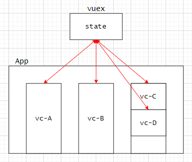
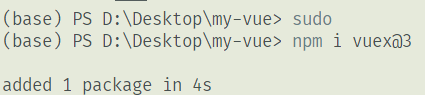
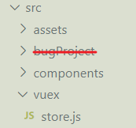
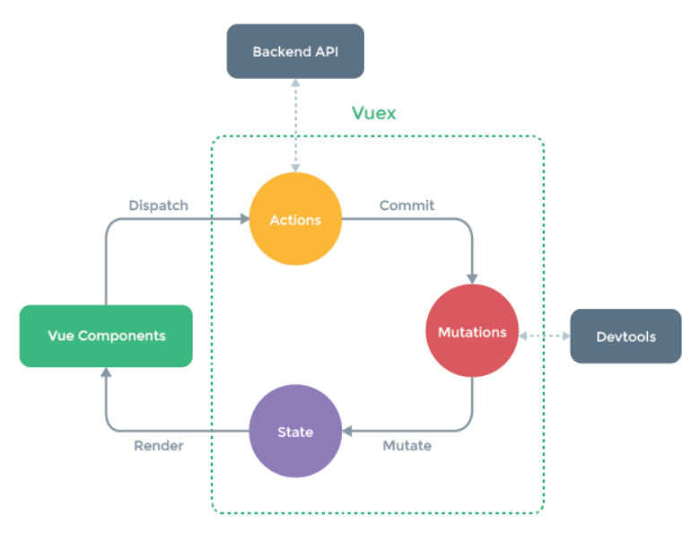
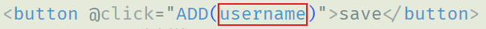
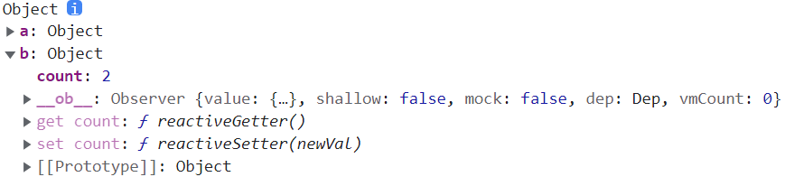
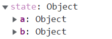
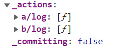
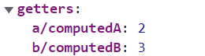

#### 1-环境搭建

##### a-vuex初识

<br>

>   1.   `vuex`是实现数据集中式状态管理的插件，数据由`vuex`统一管理，一个组件修改该共享数据，其他组件会同步更新。即`vuex`中的共享数据有响应式处理。
>   2.   那么问题来了，我们已经有了全局事件总线，也可以使用消息发布与订阅，为什么还要有`vuex`的存在？全局事件总线关注的是数据的传递，并没有实现真正的数据共享。而`vuex`是真正意义上的数据共享。
>   3.   `vuex`的使用场景：多个组件之间依赖同一种状态；来自不同组件的行为需要变更同一状态。<br>


##### b-安装使用

<br>

>   1.   安装：cmd在项目根目录运行安装命令：
>        1.   vue2安装vuex3版本：`npm i vuex@3`。
>        2.   vue3安装vuex4版本：`npm i vuex@4`。<br>
>   2.   创建目录与js文件(src目录下)(目录和文件名称非必须)：
>        1.   目录规范名称：`vuex`。
>        2.   js文件：`store.js`。<br>
>        3.   在`store.js`文件中创建核心`store`对象，并暴露出去，此后需要在`main.js`中注册。这一步会具体说明。


##### c-store核心对象

<br>

```js
// src/vuex/store.js

// 引入vue，使用vuex插件需要Vue
import Vue from 'vue' 

// 引入vuex
import Vuex from 'vuex' 

Vue.use(Vuex) // 使用vuex插件

const actions = {} // 定义actions
const mutations = {} // 定义mutations
const state = {} // 定义state

export default new Vuex.Store({  //最核心对象
    actions:actions,
    mutations, // ES6语法，相当于mutations:mutations(同名简写)
    state
})
```

>   关于上述创建store核心对象：
>
>   1.   `actions、mutations、state`是vuex插件三个核心对象，而`store`是最核心的对象，用于管理三个核心对象。
>   2.   `actions、mutations、state`可以直接在`store`中定义，但是不建议，显得太笨重。当属性名和外部对象一致，`state`对象定义属性时可以简写(如上)。
>   3.   `actions、mutations、state`的用途：
>        1.   `actions`:负责执行某一行为的对象。
>        2.   `mutations`:负责更新数据的对象。
>        3.   `state`:一个状态对象，其实类似于`vm`中的`data`。
>   4.   其实后面就知道还有一个`getters`，后面再说。
>   5.   此后需要在`main.js`中将`store`对象配置在vm中，需要使用配置项`store`，具体如下：

```js
// main.js
import Vue from 'vue'

import App from './App.vue'
import store from './vuex/store'

Vue.config.productionTip = false

new Vue({
  store, // store:store(同名简写)
  render: h => h(App),
}).$mount('#app')
```

>   1.   为vm配置`store`配置项后，vm以及所有的vc对象都会多一个属性`$store`，此后就可以通过`vc.$store`或者`vm.$store`来获取store对象。
>   2.   同样的`store:store`可以使用ES6语法省略为`store`。


#### 2-案例初识

1.   我们通过一些简单地案例学习vuex的使用，假设我们存在一个用户数组，并且许多组件需要共享该数组。我们肯定会选择定义在vuex中，我们先创建对应文件和文件夹，在`main.js`中配置(实际上这个案例并不优雅，仅仅是用于理解使用vuex)。

2.   接下来为了便于解释，我们只关注`store.js`和`UserShow.vue`两个文件。`UserShow.vue`主要实现用户列表的展示以及添加功能。

     ```js
     // store.js
     import Vue from 'vue' 
     import Vuex from 'vuex' 
     
     Vue.use(Vuex) 
     
     const actions = {} 
     const mutations = {} 
     const state = {
         userList:[  // 用户列表
             {id:1,name:'张三',age:18},
             {id:2,name:'李四',age:19},
             {id:3,name:'王五',age:20},
         ]
     }
     export default new Vuex.Store({
         actions:actions,
         mutations, 
         state
     })
     ```

3.   我们简单实现以下`UserShow.vue`的功能，如下：

     ```html
     <!--UserShow.vue-->
     <template>
         <div>
             <input type="text" placeholder="请输入用户名" v-model="username"/><br />
             <button @click="save">save</button>
             <hr /> <!-- 分割线 -->
             <ul>
                 <li v-for="user in $store.state.userList" :key="user.id">
                     {{ user.name }}
                 </li>
             </ul>
         </div>
     </template>
     
     <script>
         export default {
             methods: {
                 data() {
                     return {
                         username: "",
                     };
                 },
                 save() {
                     //一些处理逻辑
                     this.$store.state.userList.push({
                         id: Date.now(),
                         name: this.username,
                     });
                 },
             },
         };
     </script>
     ```

     

4.    <font color=red>注：Vue3中使用`useStore()`方法创建store对象，类似于Vue2中`this.$store` </font>。

5.    但是实际上，有时候`save()`方法中的数据处理逻辑可能会有些复杂，如果将这些代码逻辑放在这里，将很不利于代码的复用(其他组件也需要对应的数据处理，需要重写)。对此，我们需要使用vuex中`store`对象的`actions`，将大部分代码逻辑放在其中，并通过调用`$store.dispatch(funName,param)`实现分发，此后store的`actions`中的`funName`方法会自动调用。(`dispatch`:分发)

6.   而`store`对象中`actions`对象中存在许多函数，每一个`action`函数都是`callback`，即回调函数。`action`专门用于处理业务逻辑，或者发生`ajax`请求。每个`action`一般需要两个参数`context,value`，其中`context`是vuex的上下文，`value`是传递的数据。

7.   但是，同样的`actions`中并不能进行数据更新，这时就轮到`mutations`出场了。`mutations`中存在许许多多的`mutation`，都是`callback`，他们的作用是更新`state`。每个`mutation`一般存在两个参数`state、value`，其中`state`就是状态对象，`value`是上一环节传递的数据。

8.   注意的是，`mutation`要想被调用，需要在`action`中使用`context.commit(funName,value)`，此后`mutations`中的`funName`函数自动被调用，更新`state`中数据。

9.   最终得到如下逻辑代码：

     ```js
     // store.js
     import Vue from 'vue' 
     import Vuex from 'vuex' 
     
     Vue.use(Vuex) 
     
     const actions = {		//逻辑处理
     
         // context:上下文对象,这里你可以理解称store本身
         add(context,value){
             console.log(value)  // 一些逻辑处理
             context.commit('ADD',value)
         }
     } 
     const mutations = {		//数据更新
         ADD(state,value){
             state.userList.push(value)
         }
     } 
     const state = {
         userList:[  // 用户列表
             {id:1,name:'张三'},
             {id:2,name:'李四'},
             {id:3,name:'王五'},
         ]
     }
     export default new Vuex.Store({
         actions,
         mutations, 
         state
     })
     ```

     ```html
     <!--UserShow.vue-->
     <template>
         <div>
             <input type="text" placeholder="请输入用户名" v-model="username"/><br />
             <button @click="save">save</button>
             <hr /> <!-- 分割线 -->
             <ul>
                 <li v-for="user in $store.state.userList" :key="user.id">
                     {{ user.name }}
                 </li>
             </ul>
         </div>
     </template>
     
     <script>
         export default {
             data() {
                 return {
                     username: "",
                 };
             },
             methods: {
                 save() {
                     var user = {
                         id: Date.now(),
                         name: this.username,
                     }
                     this.$store.dispatch("add", user)  // 分发
                     // this.$store.commit("ADD",user)  直接更新
                 },
             },
         };
     </script>
     ```

     

>   1.   `mutations`中函数一般大写，单词间使用`_`分隔，例如`PLUS_ONE`。
>   2.   `actions`中函数采用驼峰式即可，例如`plusOne`。
>   3.   上述配置项中函数`xxx:function(){}`可省`xxx(){}`。
>   4.   `actions`中函数的参数`context`可以认为是缩小版的`store`对象。知道这个道理后，其实一个`action`中还可以调用另一个`action`，也就是继续分发，这时就需要用到`context.dispatch(funName,param)`。
>   5.   顺便提一嘴，`vue devtools`浏览器插件也可以显示vuex的一些信息。还可以监视`actions、mutations`中一些方法的调用。
>   6.   大致过程如下图：<br>


#### 3-vuex深入

##### a-强调

<br>

>   1.   在`store`对象的`actions`中，其实一个`action`中还可以调用另一个`action`，也就是继续分发，这时就需要用到`context.dispatch(funName,param)`。
>   2.   此外如果有些逻辑处理及其简单，可以直接跳过`$store.dispatch()`过程，直接使用`$store.commit(funName,param)`直接略过`actions`到`mutations`中进行数据更新逻辑。


##### b-getters

<br>

>   1.   在`store`对象中还存在一个`getters`配置项，其类似于计算属性(computed)。其中每个`getter`都会自动接收一个`state`参数。
>   2.   别忘了在`store`对象中配置`getters`配置项。
>   3.   此后就可以通过`$store.getters.xxx`使用，类似于计算属性。

```js
import Vue from 'vue' 
import Vuex from 'vuex' 

Vue.use(Vuex) 

const actions = {
    add(context,value){
        context.commit('ADD',value)
    }
} 
const mutations = {
    ADD(state,value){
        state.userList.push(value)
    }
} 
const state = {
    userList:[
        {id:1,name:'张三'},
        {id:2,name:'李四'},
    ]
}
const getters = {
    userLength(state){  // 用户数量
        return state.userList.length
    }
}
export default new Vuex.Store({
    actions:actions,
    mutations, 
    state,
    getters  //别忘了配置getters
})
```

```html
<hr />  <!--分割线-->
<span>当前用户数量：{{ $store.getters.userLength }}</span> <!--使用getters-->
```


##### c-ES6拓展运算符

<br>

>   前置知识(ES6拓展运算符`...`):
>
>   1.   个人觉得`...`就类似于python中的`*`序列解包。
>   2.   `...arr`会得到数组所有元素，类似于去掉`[]`。例如`...[1,2,3]`得到`1 2 3`。可以通过`console.log`输出。
>   3.   `...obj`会得到对象的所有键值对，类似于去掉`{}`。例如`...{name:'fish',age:20}`得到`name:'fish' age:20`。但是注意无法通过`console.log`输出。
>   4.   拓展语法`...`主要用于对象属性的合并。但是注意`{...obj}`与原来的`obj`不是同一个对象。

```js
let a = {
    name:'fish',
    age:20
}

let b = {...a}  // a!=b(不再是同一个对象)

let c = {...a,sex='男'}
```


##### d-mapState和mapGetters优化

<br>

1.   首先声明`store.js`文件内容为：

     ```js
     import Vue from 'vue' 
     import Vuex from 'vuex' 
     
     Vue.use(Vuex) 
     
     const actions = {
         add(context,value){
             context.commit('ADD',value)
         }
     } 
     const mutations = {
         ADD(state,value){
             state.userList.push(value)
         }
     } 
     const state = {
         userList:[ 
             {id:1,name:'张三'},
             {id:2,name:'李四'},
         ]
     }
     const getters = {
         userLength(state){
             return state.userList.length
         }
     }
     export default new Vuex.Store({
         actions:actions,
         mutations, 
         state,
         getters
     })
     
     ```

     

2.   我们在使用vuex中的共享数据时，往往需要使用`$store.state.xx`的形式，作为一个优雅的vuer，这样就显得很不优雅。

3.   于是乎，我们提出一种想法，那就是将`$store.state`中属性设计为组件的计算属性，然后组件中就可以使用计算属性代替`$store.state.xxx`，属实是优雅。

     ```html
     <template>
         <div>
             <ul>
                 <li v-for="user in userList" :key="user.id"> <!--使用计算属性-->
                     {{ user.name }}
                 </li>
             </ul>
         </div>
     </template>
     
     <script>
         export default {
             data() {
                 return {
                     username: "",
                 };
             },
             computed: {
                 userList() {  // 计算属性
                     return this.$store.state.userList;
                 },
             },
             methods: {
                 save() {
                     var user = {
                         id: Date.now(),
                         name: this.username,
                     }
                     this.$store.dispatch("add", user)
                 },
             },
         };
     </script>

4.   但是当一个组件中需要使用很多vuex的共享数据时，一个个的创建计算属性就会显得很呆。而这类的计算属性声明起来往往类似，于是乎vuex提供了一个`mapState`帮我们生成计算属性。

     ```html
     <template>
         <div>
             <ul>
                 <li v-for="user in userList" :key="user.id">
                     {{ user.name }}
                 </li>
             </ul>
         </div>
     </template>
     
     <script>
         import { mapState} from "vuex";  //引入mapState
         export default {
             data() {
                 return {
                     username: "",
                 };
             },
             computed: {
                 ...mapState(["userList"]), //属性名与state中的属性名一致(省略为数组形式)
                 // ...mapState({userLength: 'userList'})  对象形式
             },
             methods: {
                 save() {
                     var user = {
                         id: Date.now(),
                         name: this.username,
                     }
                     //一些处理逻辑
                     this.$store.dispatch("add", user)
                 },
             },
         };
     </script>
     ```

6.   下面进入正文：

     >   1.   `mapState`：用于进行名称映射，为`$store.state`中数据创建计算属性。
     >        1.   使用前需要导入`import {mapState} from 'vuex'`。
     >        2.   对象形式使用：`...mapState({'name':'stateName'})`，其中`'name'`为计算属性名称，可以不使用字符串格式；而`'stateName'`是`store.state`中的属性名称，必须使用字符串形式(不然会被当成一个变量去查找)。
     >        3.   当对象形式`'name'`和`'stateName'`一致时，就可以省略。此时数组形式就出现了，即`...mapState(['stateName'])`，同理需要使用字符串形式。
     >        4.   但是，使用这种方式生成的是最简单的计算属性，也就是不会生成`setter`。于是对计算属性双向绑定时会报错，这时还是老老实实的使用`$store.state.xxx`。
     >   2.   `mapGetters`:用于进行名称映射，为`$store.getters`中数据创建计算属性。使用方式参考`mapState`，也存在数组形式、对象形式两种使用方式。
     >   3.   基于二者，我们对上述2中案例进行修改，如下：

    ```html
    <template>
        <div>
            <input type="text" placeholder="请输入用户名" v-model="username"/><br />
            <button @click="save">save</button>
            <hr /> <!-- 分割线 -->
            <ul>
                <li v-for="user in userList" :key="user.id"> <!--使用计算属性-->
                    {{ user.name }}
                </li>
            </ul>
            <hr />
            <span>用户数量：{{ userLength }}</span><!--使用计算属性-->
        </div>
    </template>
    
    <script>
        import { mapState,mapGetters} from "vuex";  //引入mapState、mapGetters
        export default {
            data() {
                return {
                    username: "",
                };
            },
            //******begin******
            computed: {
                ...mapState(["userList"]), 
                ...mapGetters(["userLength"]), 
            },
            //******end******
            methods: {
                save() {
                    var user = {
                        id: Date.now(),
                        name: this.username,
                    }
                    this.$store.dispatch("add", user)
                },
            },
        };
    </script>
    ```


##### e-mapActions和mapMutations优化

<br>

1.   一般来说，`save()`类似的方法中，逻辑很简单，就是分发`$store.dispatch()`。甚至说，处理逻辑很简单时，可能就一行`$store.commit()`。这时我们自己写这些方法就很麻烦。

     ```js
     export default {
         data() {
             return {
                 username: "",
             };
         },
         methods: {
             var user={
                 id:Date.now(),
                 name:userName,
             },
             add(){
             	this.$store.dispatch('add',user) // 分发
             },
             ADD(){
                 this.$store.commit('ADD',user)  // 跳过actions
             }
     	},
     };
     ```

     

2.   于是乎，vuex提供了`mapActions、mapMutations`帮我们生成这些逻辑很简单的方法。使用方式类似于`mapState、mapGetters`。

3.   下面开始正文：

     >   1.   `mapActions`:用于名称映射，为`$state.actions`方法创建调用方法。
     >        1.   其实就是为组件创建方法，方法内部只调用`$state.actions`中的某些方法。
     >        2.   对象形式使用：`...mapActions({'name':'actionName'})`，其中`'name'`为方法名称，可以不使用字符串格式；而`'actionName'`是`store.actions`中的方法名称，必须使用字符串形式(不然会被当成一个变量去查找)。
     >        3.   当对象形式`'name'`和`'actionName'`一致时，就可以省略。此时数组形式就出现了，即`...mapState(['actionName'])`，同理需要使用字符串形式。
     >   2.   `mapMutations`:用于名称映射，为`$state.mutations`方法创建调用方法。
     >        1.   使用方式同上。
     >        2.   数组形式时注意，要以`$state.mutations`的方法名称为主。
     >        3.   相当于为组件创建方法，其内部只执行简单地调用`$state.mutations`中的某些方法。
     >   3.   其实这种自动创建方法，一般存在三个不确定，也就是方法名不确定，内部调用函数不确定、内部调用函数的参数不确定。通过前面知识，已经为方法名、内部函数名提供了映射。那么内部函数的参数又如何确定？其实就是调用该函数时，传递参数，会自动将该参数传递到内部被调函数。<br>

4.   那么之前的逻辑就需要略作修改：

     ```js
     // store.js
     import Vue from 'vue' 
     
     import Vuex from 'vuex' 
     
     Vue.use(Vuex) 
     
     const actions = {
         add(context,value){
             context.commit('ADD',value)
         }
     } 
     const mutations = {
         ADD(state,value){
             state.userList.push({id:Date.now(),name:value}) // 略改
         }
     } 
     const state = {
         userList:[
             {id:1,name:'张三'},
             {id:2,name:'李四'},
         ]
     }
     const getters = {
         userLength(state){
             return state.userList.length
         }
     }
     export default new Vuex.Store({
         actions:actions,
         mutations, 
         state,
         getters
     })
     ```

     ```html
     <!--UserShow.vue-->
     <template>
         <div>
             <input type="text" placeholder="请输入用户名" v-model="username"/><br />
             <button @click="ADD(username)">save</button>  <!--传递参数-->
             <hr />
             <ul>
                 <li v-for="user in userList" :key="user.id">
                     {{ user.name }}
                 </li>
             </ul>
             <hr />
             <span>当前用户数量：{{ userLength }}</span>
         </div>
     </template>
     
     <script>
         import { mapState,mapGetters} from "vuex"; 
         import {mapActions,mapMutations} from "vuex"; //引入mapActions
         export default {
             data() {
                 return {
                     username: "",
                 };
             },
             computed: {
                 ...mapState(["userList"]), 
                 ...mapGetters(["userLength"]), 
             },
             //******begin******
             methods: {
                 ...mapActions(["add"]), 
                 ...mapMutations(["ADD"]), 
             },
             //******end******
         };
     </script>
     ```

     

##### f-直接修改数据

<br>

>   1.   为啥不直接修改`$store.state`中的数据，而非要通过`$store.mutations`修改？
>
>        因为state是实时更新的，mutations无法进行异步操作，而如果直接修改state的话是能够异步操作的，当你异步对state进行操作时，还没执行完，这时候如果state已经在其他地方被修改了，这样就会导致程序存在问题了。所以state要同步操作，通过mutations的方式限制了不允许异步。

​     

#### 4-vuex的模块化开发

##### a-模块开发

<br>

>   1.   当许多的业务都需要使用vuex时，`store`对象中会包含大量的逻辑，变得非常臃肿。而且这些逻辑中，大多数彼此之前并没有耦合关系。这时Vuex允许我们将store按照业务逻辑分割成模块(`module`)。每个模块都是一个对象，拥有自己的`state、mutations、actions、getters`。
>   2.   之后创建`store`对象时，使用`modules`配置项配置模块，其每个属性为一个`module`。每个`model`属性的`key`为模块名，`value`为模块配置对象。当`key、value`同名时可以省略。
>   3.   为了方便演示，我们单纯为了模块化而模块化，不去讨论业务逻辑。

1.   我们通过`AVc.vue`、`BVc.vue`演示vuex的模块化开发，但是并不提供响应的演示代码。

     ```js
     // store.js
     import Vue from 'vue' 
     import Vuex from 'vuex' 
     
     Vue.use(Vuex) 
     
     const a={  // a模块
         state:{
             count:1
         },
         mutations:{
             LOG(){
                 console.log('this is a mutation in a module')
             }
         },
         actions:{
             log(){
                 console.log('this is a action in a module')
             }
         },
         getters:{
             computedA(state){
                 return state.count+1
             }
         }
     }
     const b={  // b模块
         state:{
             count:2
         },
         mutations:{
             LOG(){
                 console.log('this is a mutation in b module')
             }
         },
         actions:{
             log(){
                 console.log('this is a action in b module')
             }
         },
         getters:{
             computedB(state){
                 return state.count+1
             }
         }
     }
     
     export default new Vuex.Store({
         modules:{
             a,  // 等同于 a:a,
             b
         }
     })
     ```

     

2.   这时你会发现组件中通过`$store.state.count`无法访问到对应共享数据。通过输出`$store.state`会发现其中的数据也分模块了，要访问数据，则需要通过`$store.state.模块名.xxx`去访问。<br>

3.   但是你会发现一个有趣的事情，那就是`$store.getters`仍可以访问对应数据。`$store.dispatch()、$store.commit()`同样可以分为对应方法，并且假设访问`$store.dispatch('log')`函数，所有模块中`actions`的`log`函数均会被调用。

4.   上述现象的出现，主要是因为vuex的机制，会去所有的模块中找名称匹配的方法，并全部调用。而对于`getters`多个同名则会报错，则不会共存，会报错。

5.   想要解决这个问题，我们需要在每个模块对象中添加`namespace:true`配置，开启命名空间。

     ```js
     // store.js
     import Vue from 'vue' 
     import Vuex from 'vuex' 
     
     Vue.use(Vuex) 
     
     const a={
         namespaced:true, // 开启命名空间 
         state:{
             count:1
         },
         mutations:{
             LOG(){
                 console.log('this is a mutation in a module')
             }
         },
         actions:{
             log(){
                 console.log('this is a action in a module')
             }
         },
         getters:{
             computedA(state){
                 return state.count+1
             }
         }
     }
     const b={
         namespaced:true, // 开启命名空间
         state:{
             count:2
         },
         mutations:{
             LOG(){
                 console.log('this is a mutation in b module')
             }
         },
         actions:{
             log(){
                 console.log('this is a action in b module')
             }
         },
         getters:{
             computedB(state){
                 return state.count+1
             }
         }
     }
     export default new Vuex.Store({
         modules:{
             a,
             b
         }
     })
     ```

     

6.   一旦开启了模块的命名空间，此后访问所有都需要包含模块，此时也无需被同名困扰。具体访问形式如下表(其实这样访问形式，可以通过输出`$store`知道)：

     | 代码                          | 解释               | 举例                        |
     | ----------------------------- | ------------------ | --------------------------- |
     | `$store.state.模块.xxx`       | 访问模块下的属性   | `$store.state.a.name`       |
     | `$store.getters['模块/xxx']`  | 访问模块下计算属性 | `$store.getters['a/count']` |
     | `$store.dispatch('模块/xxx')` | 调用模块下action   | `$store.dispatch('a/add')`  |
     | `$store.commit('模块/XXX')`   | 调用模块下mutation | `$store.dispatch('a/ADD')`  |

     <br><br><br>


##### b-拆分store.js

1.   对于js文件，我们也可以拆分，安装模块拆分，然后在`store.js`中导入使用即可。

2.   具体拆分后如下：

     ```js
     // a.js
     export default{
         namespaced:true, // 开启命名空间 
         state:{
             count:1
         },
         mutations:{
             LOG(){
                 console.log('this is a mutation in a module')
             }
         },
         actions:{
             log(){
                 console.log('this is a action in a module')
             }
         },
         getters:{
             computedA(state){
                 return state.count+1
             }
         }
     }
     ```

     ```js
     // b.js
     export default {
         namespaced:true, // 开启命名空间
         state:{
             count:2
         },
         mutations:{
             LOG(){
                 console.log('this is a mutation in b module')
             }
         },
         actions:{
             log(){
                 console.log('this is a action in b module')
             }
         },
         getters:{
             computedB(state){
                 return state.count+1
             }
         }
     }
     ```

     ```js
     // store.js
     import Vue from 'vue' 
     
     import Vuex from 'vuex' 
     
     Vue.use(Vuex) 
     
     import a from './a'
     import b from './b.js'  // .js后缀可省
     
     export default new Vuex.Store({
         modules:{
             a,
             b
         }
     })
     ```

     


##### c-mapxxx修正

<br>

>   1.   当开启命名空间后，`mapState、mapGetters、mapActions、mapMutations`也会无法使用。
>   2.   若要使用，则需要传递模块名称方可使用，即形如`...mapXxx('模块',arr | obj)`。其他使用规则不变。
>   3.   具体示例如下：

```html
<!--AVc.vue-->
<template>
    <div>
        <button>...</button>
        <button>...</button>
    </div>
</template>

<script>
    import{mapState,mapGetters,mapMutations,mapActions} from 'vuex'
    export default {
        computed: {
            ...mapState('a',['count']),
            ...mapGetters('a',['computedA']),
        },
        methods: {
            ...mapMutations('a',['LOG']),
            ...mapActions('a',['log']),
        },
    }
</script>
```


##### d-发送ajax

<br>

1.   前面提到，`actions`中可以发送ajax请求。

2.   下面具体演示，一般`actions`发送请求获取数据，然后通过`mutations`保存在`state`中。省略代理部分配置。

     ```js
     // a.js
     import axios from 'axios'
     export default{
         namespaced:true, // 开启命名空间 
         state:{
             bugs:[]
         },
         mutations:{
             SAVE(state,data){
                 state.bugs=data //将请求到的数据保存到state中
             }
         },
         actions:{
             get(context){
                 axios.get('/api/get/bugs').then(res=>{
                     context.commit('SAVE',res.data)  //提交到上下文中的mutations中
                 }) 
             }
         },
     }
     ```

     
