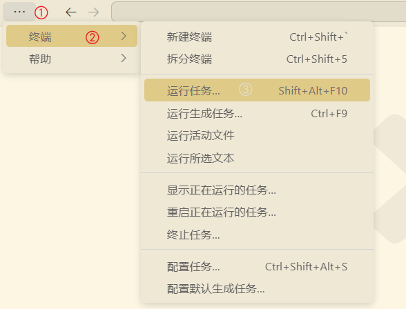
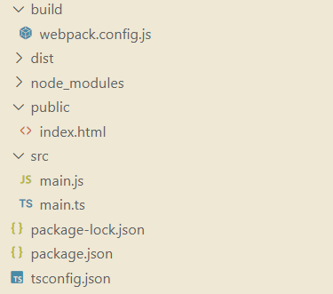

###### 安装TypeScript

1. 前置步骤：安装`node.js`。

2. 使用`npm install  -g typescript`，若`node.js`为全局安装，可能需要使用管理员权限或者`sudo`命令(window按照`gsudo`命令行提权软件即可)。其中`gsudo`安装方式如下：

   ```cmd
   PowerShell -Command "Set-ExecutionPolicy RemoteSigned -scope Process; iwr -useb https://raw.githubusercontent.com/gerardog/gsudo/master/installgsudo.ps1 | iex"
   ```

3. 使用`tsc -V `命令查看版本信息，确保安装成功。


###### 编写第一个ts代码

1. `ts`代码中若只有`js`的语法规则，则可以直接在浏览器中引用。但是若含有ts自己的规则，则会报错。
2. 使用命令`tsc xx.ts`可以将`ts`文件编译为`js`文件。
3. `ts`代码中变量使用`let`修饰，在编译为`js`后变为`var`。
4. 在`vscode`中可以自动编译`ts`代码。
   1. 使用`tsc --init`命令生成配置文件`tsconfig.json`。
   2. 修改`tsconfig.json`配置中的`"outDir": "./js",`表示编译生成的`js`文件存放位置。
   3. 修改`tsconfig.json`配置中的`"strict": false,`表示是否启用严格模式。
   4. (也可以使用命令`tsc -p d:\cpp\tsconfig.json --watch`，也可以在对应目录中简写为`tsc --watch`)打开`vscode`的工具栏：终端 -> 运行任务->显示所有任务 -> 监视`tsconfig.json`。<br>


###### 类型注解

类似于python的类型注解，例如下面给 `person` 函数的参数添加 `: string` 类型注解，如下：

```ts
function greeter (person: string) {
    return 'Hello, ' + person
}

let user = 'Yee'

console.log(greeter(user))
```


###### 接口

这里我们使用接口来描述一个拥有 `firstName` 和 `lastName` 字段的对象。 在 `TypeScript` 里，只在两个类型内部的结构兼容，那么这两个类型就是兼容的。 这就允许我们在实现接口时候只要保证包含了接口要求的结构就可以，而不必明确地使用 `implements` 语句。

```ts
interface Person {
    firstName: string
    lastName: string
}

function greeter (person: Person) {
    return 'Hello, ' + person.firstName + ' ' + person.lastName
}

let user = {
    firstName: 'Yee',
    lastName: 'Huang'
}

console.log(greeter(user))
```


###### 类

 `TypeScript `支持 `JavaScript `的新特性，比如支持基于类的面向对象编程。让我们创建一个 `User` 类，它带有一个构造函数和一些公共字段。因为类的字段包含了接口所需要的字段，所以他们能很好的兼容。还要注意的是，我在类的声明上会注明所有的成员变量，这样比较一目了然。

```ts
class User {
    fullName: string
    firstName: string
    lastName: string
    #name: string; // private
    static plant: string = "earth"; // static

    constructor (firstName: string, lastName: string) {
        this.firstName = firstName
        this.lastName = lastName
        this.fullName = firstName + ' ' + lastName
    }
}

interface Person {
    firstName: string
    lastName: string
}

function greeter (person: Person) {
    return 'Hello, ' + person.firstName + ' ' + person.lastName
}

let user = new User('Yee', 'Huang')

console.log(greeter(user))
```


###### webpack打包ts

1. 项目文件框架：<br>

2. `Webpack `通过递归的方式，创建一个依赖图。它从一个或多个入口文件开始，解析文件中的依赖（如 `import` 或 `require`），然后依次解析每个依赖文件，直到构建出整个应用程序的依赖图。根据依赖图，`Webpack `将所有模块打包成一个或多个 `bundle `文件。每个 `bundle `文件包含所有相关模块的代码，这样可以减少 HTTP 请求的数量，提高加载速度。

3. 安装webpack:`npm install webpack -g`或者使用命令`npm install webpack@4.41.5 -g`安装指定版本。

4. 安装依赖：版本上可能会出现一些问题。

   ```cmd
   npm add -D typescript 
   npm add -D webpack webpack-cli
   npm add -D webpack-dev-server
   npm add -D html-webpack-plugin clean-webpack-plugin
   npm add -D ts-loader
   npm add -D cross-env
   
   # 或者直接一条命令安装
   npm add -D typescript & npm add -D webpack webpack-cli & npm add -D webpack-dev-server & npm add -D html-webpack-plugin clean-webpack-plugin & npm add -D ts-loader & npm add -D cross-env 
   ```

5. 配置入口`js`：`src/main.ts`

   ```ts
   alert("ok！！！");
   ```

6. 新建一个 `index`页面: `public/index.html`

   ```html
   <!DOCTYPE html>
   <html lang="en">
       <head>
           <meta charset="UTF-8">
           <meta name="viewport" content="width=device-width, initial-scale=1.0">
           <meta http-equiv="X-UA-Compatible" content="ie=edge">
           <title>webpack & TS</title>
       </head>
       <body>
   
       </body>
   </html>
   ```

7. 配置`webpack`配置文件：`build/webpack.config.js`

   ```cpp
   const { CleanWebpackPlugin } = require('clean-webpack-plugin');
   // 引入 CleanWebpackPlugin 插件，用于清理输出目录。
   
   const HtmlWebpackPlugin = require('html-webpack-plugin');
   // 引入 HtmlWebpackPlugin 插件，用于生成 HTML 文件，并自动引入打包后的资源。
   
   const path = require('path');
   // 引入 Node.js 的 path 模块，用于处理和转换文件路径。
   
   const isProd = process.env.NODE_ENV === 'production';
   // 通过环境变量判断当前环境是否为生产环境，结果存储在 isProd 变量中。
   
   function resolve(dir) {
       return path.resolve(__dirname, '..', dir);
   }
   // 定义一个辅助函数 resolve，用于将相对路径转换为绝对路径。
   
   module.exports = {
       mode: isProd ? 'production' : 'development',
       // 根据 isProd 变量设置模式，如果是生产环境则为 'production'，否则为 'development'。
   
       entry: {
           app: './src/main.ts'
       },
       // 定义入口文件为 './src/main.ts'，并命名为 'app'。
   
       output: {
           path: resolve('dist'),
           // 定义输出目录为项目根目录下的 'dist' 目录。
   
           filename: '[name].[contenthash:8].js'
               // 定义输出文件名格式，使用入口名加上内容哈希值，并保留前 8 位，确保文件名的唯一性以实现缓存优化。
       },
   
       module: {
           rules: [
               {
                   test: /\.tsx?$/,
                   // 定义一个规则，匹配所有以 .ts 或 .tsx 结尾的文件。
   
                   use: 'ts-loader',
                   // 使用 ts-loader 来处理 TypeScript 文件。
   
                   include: [resolve('src')]
                   // 限定处理的文件范围为 'src' 目录下的文件，提升打包速度。
               }
           ]
       },
       // 配置模块处理规则，这里仅配置了 ts-loader 处理 TypeScript 文件。
   
       plugins: [
           new CleanWebpackPlugin(),
           // 使用 CleanWebpackPlugin 插件，每次构建前清理输出目录。
   
           new HtmlWebpackPlugin({
               template: './public/index.html'
                   // 使用 HtmlWebpackPlugin 插件，指定模板文件为 './public/index.html'，并生成最终的 HTML 文件。
           })
       ],
       // 配置插件，这里使用了 CleanWebpackPlugin 和 HtmlWebpackPlugin 插件。
   
       resolve: {
           extensions: ['.ts', '.tsx', '.js']
           // 配置模块解析规则，自动解析这些扩展名的文件，这样在 import 语句中可以省略扩展名。
       },
   
       devtool: isProd ? 'cheap-module-source-map' : 'cheap-module-eval-source-map',
       // 配置 source map 生成方式，生产环境使用 'cheap-module-source-map'，开发环境使用 'cheap-module-eval-source-map'，方便调试。
   
       devServer: {
           host: 'localhost',
           // 配置开发服务器的主机名为 'localhost'。
   
           //stats: 'errors-only',(webpack5报错)
           // 配置打包日志输出级别，仅输出错误信息。
   
           port: 8081,
           // 配置开发服务器的端口号为 8081。
   
           open: true
               // 配置开发服务器启动时自动打开默认浏览器。
       },
   };
   // 导出 Webpack 配置对象。
   
   ```

8. 运行命令`npm init -y`生成`package.json`,可以在脚本配置中添加一个`build`命令，后续可以使用`npm run build`来运行`webpack`打包(`npm webpack --config build/webpack.config.js`)。当然一般为了区分生产环境和开发环境，还会配置一个`dev`命令用于开发环境直接运行程序。

   ```json
   {
       "name": "cpp",
       "version": "1.0.0",
       "description": "",
       "main": "first.js",
       "scripts": {
           "test": "echo \"Error: no test specified\" && exit 1",
           "dev": "cross-env NODE_ENV=development webpack-dev-server --config build/webpack.config.js",
   		"build": "cross-env NODE_ENV=production webpack --config build/webpack.config.js"
       },
       "keywords": [],
       "author": "",
       "license": "ISC"
   }
   ```

9. 使用`tsc --init`命令生成配置文件`tsconfig.json`并完成响应配置。

10. 使用`npm run dev`运行或者`npm run build`打包。

>`webpack`配置了`resolve.extensions`(`webpack.config.js`文件中)，`import`时可以不写后缀名,会自动查找并补全后缀名。

----

> 对于端口号占用的解决措施：
>
> 1. ` netstat -aon|findstr xxx`：查看端口号占用情况。
> 2. `tasklist|findstr xxx`：查看进程。
