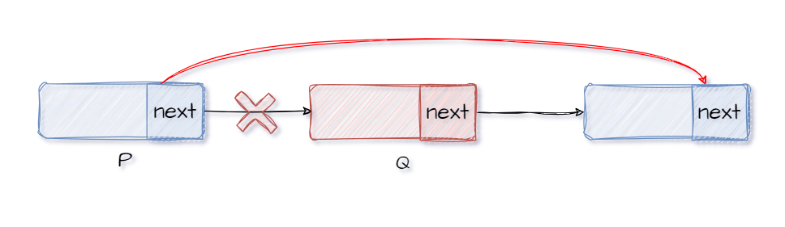

##### 顺序表

1.   顺序表的定义：

     1.   静态分配：定义时直接定义为`ElemType []`数组类型，此外静态分配无需手动销毁。

          ```cpp
          #include <iostream>
          #define MaxSize 100
          
          typedef struct{
              int data [MaxSize]; //存放顺序表元素
              int length;  //记录顺序表的当前长度
          } SqList; 
          
          bool InitList(SqList &L){
              L.length = 0;
              return true;
          }
          ```

          

     2.   动态分配：定义时使用`ElemType *`定义动态数组的指针，在初始化时使用`malloc`函数分配一整片内存。需要使用`free()`函数手动释放内存空间。

          ```cpp
          #include <iostream>
          #define InitSize 100
          typedef struct{
              int *data;  //指示动态分配数组的指针
              int MaxSize;  //记录顺序表的最大长度
              int length;  //记录顺序表的当前长度
          } SqList; 
          
          bool InitList(SqList &L){
              //分配内存
              L.data = (int *)malloc(InitSize * sizeof(int));  
          
              //判断内存是否分配成功
              if(L.data==NULL){
                  return false;
              }
              L.length = 0;
              L.MaxSize = InitSize;
              return true;
          }
          
          int main(){
              SqList L;
              InitList(L);
              return 0;
          }
          ```

          

2.   补充：动态的增加数组的长度(动态分配为例)。如果是直接`p=L.data`,让后直接对`L.data`重新分配内存，当分配失败时直接返回`NULL`,此时函数返回`false`会导致原数据丢失。

     ```cpp
     bool autoExtend(SqList &L){
         int *p;
         //也可以使用realloc函数重新分配内存
         p = (int *)calloc(L.MaxSize + 10, sizeof(int));
         if (p==NULL){
             return false;
         }
         for(int i=0;i<L.length;i++){
             p[i] = L.data[i];
         }
         free(L.data); 
     
         L.data = p;
         L.MaxSize += 10;
         return true;
     }
     ```

     

3.   插入和删除

     1.   插入：判断位序是否合理($i$​的取值是`1~L.length+1`)，判断顺序表是否已满，将第`i`个元素及其后面的元素依次后移(注意从最后一个开始移动)，最后在第$i$​的位置插入新的元素即可，注意不要漏掉了`length++`。

          ```cpp
          bool ListInsert(SqList &L, int i, int e) // 插入时i是位序(从1开始计数)
          {
              if (i < 1 || i > L.length + 1) // 考点：i的取值是1~L.length+1
              {
                  return false;
              }
              if (L.length >= L.MaxSize)
              {
                  return false;
              }
              for (int j = L.length; j >= i; j--) // 从i开始元素依次后移
              {
                  L.data[j] = L.data[j - 1];
              }
              L.data[i - 1] = e; // 插入新元素
              L.length++;
              return true;
          }
          ```

          

     2.   删除：判断位序是否合理($i$的取值是`1~L.length`)，将第$i+1$​个元素及其后面的元素依次前移(注意是从第`i+1`个开始移动)，注意不要漏掉了`length--`。

          ```cpp
          bool ListDelete(SqList &L, int i, int &e)
          {
              if (i < 1 || i > L.length) // 考点：删除时i的取值是1~L.length
              {
                  return false;
              }
              e = L.data[i - 1];
              for (int j = i; j < L.length; j++) // 从第i+1开始元素依次前移
              {
                  L.data[j - 1] = L.data[j];
              }
              L.length--;
              return true;
          }
          ```

     

4.   查找

     1.   按值查找：遍历查找即可。

          ```cpp
          int LocateElem(SqList L, int e)
          {
              for (int i = 0; i < L.length; i++)
              {
                  if (L.data[i] == e)
                  {
                      return i + 1; // 返回位序
                  }
              }
              return 0;
          }
          ```

          

     2.   按位查找：首先判断位序是否合理($i$的取值是`1~L.length`)，由于<span style="color:red">顺序表的随机存储特性</span>，直接返回结果即可。

          ```cpp
          int GetElem(SqList L, int i) 
          {
              if (i < 1 || i > L.length) // 考点：查找时i的取值是1~L.length
              {
                  return -1;
              }
              return L.data[i - 1];
          }
          ```

     

5.   其他操作：

     1.   判空：

          ```cpp
          bool Empty(SqList L)
          {
              if (L.length == 0)
              {
                  return true;
              }
              else
              {
                  return false;
              }
          }
          ```

          

     2.   求表长：

          ```cpp
          int Length(SqList L)
          {
              return L.length;
          }
          ```

          

     3.   销毁：

          ```cpp
          bool destoryList(SqList &L)
          {
              free(L.data);
              L.length = 0;
              L.MaxSize = 0;
              return true;
          }
          ```

          

     4.   输出：

          ```cpp
          void PrintList(SqList L)
          {
              for (int i = 0; i < L.length; i++)
              {
                  printf("%d ", L.data[i]);
              }
              printf("\n");
          }
          ```

          


---


##### 单向链表

1.   初始化：分带头结点和不带头结点(推荐)，后续均以带头结为例。

     1.   带头结点：创建头结点，分配内存。头结点的`next`指向`NULL`。

          ```cpp
          //带头节点
          #include <iostream>
          
          typedef struct LNode {
              int data;
              struct LNode *next; //struct LNode是定义的类型名
          } LNode, *LinkList;
          
          bool initList(LinkList &L){
              L = (LNode *)malloc(sizeof(LNode));
              if(L == NULL){
                  return false;
              }
              L->next = NULL;
              return true;
          }
          ```

          

     2.   不带头结点：指向`NULL`即可。

          ```cpp
          //不带头节点
          #include <iostream>
          
          typedef struct LNode {
              int data;
              struct LNode *next; //struct LNode是定义的类型名
          } LNode, *LinkList;
          
          bool initList(LinkList &L){
              L = NULL;
              return true;
          }
          ```

          

2.   为什么要设立头结点？ 可以对链表统一操作，边界操作统一。

3.   单链表的查找：

     1.   按位查找：判断位序是否合理，遍历查找(找到或者遍历到末尾则结束查找)，返回查找结果。

          ```cpp
          LNode *getElem(LinkList L, int i)
          {
              if (i < 0)
              {
                  return NULL;
              }
          
              /* 
              if (i==0){
                  return L;
              }
              int j = 1;
              LNode *p=L->next; 
              */
          
              LNode *p = L;
              int j = 0;
              while (j < i && p != NULL)
              {
                  p = p->next;
                  i--;
              }
          
              /* 
              if (p == NULL)
              {
                  return NULL;
              } 
              */
              return p;
          }
          ```

          

     2.   按值查找：直接遍历查找即可。

          ```cpp
          LNode *locateElem(LinkList L, int e)
          {
              LNode *p = L->next;
              while (p != NULL && p->data != e)
              {
          
                  p = p->next;
              }
              return p;
          }
          ```

     

4.   插入：

     1.   前插：若在第$i$位置插入，需要找到第$i-1$个结点(在第$i-1$个结点后插入)。注意顺序，若先将`p.next`指向`s`。我们将无法访问到原本的`p.next`结点。<br>

          ```cpp
          bool ListInsert(LinkList &L, int i, int e)
          {
              // 找到第i-1个节点
              if (i < 1)
                  return false;
              LNode *p = L;
              int j = 0;
              while (j < i - 1 && p != NULL)
              {
                  p = p->next;
                  j++;
              }
          
              if (p == NULL) // i值不合法
                  return false;
          
              LNode *s = (LNode *)malloc(sizeof(LNode));
              s->data = e;
          
              s->next = p->next;
              p->next = s;
              return true;
          }
          ```

          

     2.   前插：忽略上述内容，如果对于一个结点`p`,我们如何在`p`结点前面插入一个结点？由于单链表的局限性，我们无法直接访问到`p`节点的的前一个结点(除非从头开始遍历一遍)。我们不妨仍然对`p`结点进行后插`s`结点，然后交换`p`与`s`结点的数据。

          ```cpp
          //后插
          s->next = p->next;
          p->next = s;
          
          //交换数据
          temp = p->data;
          p->data = s->data;
          s->data = temp;
          ```

          

5.   单链表的建立：<span style="color:red">需要重点注意头插法数据的顺序与插入的顺序是相反的，可以用于逆置链表。</span>

     1.   头插法：每次插入结点都在头结点后面进行。需要注意的是`s`结点是不能在定义时分配内存的，`s`需要再循环中迭代，每次迭代需要重新为`s`分配新的空间。

          ```cpp
          LinkList List_HeadInsert(LinkList &L)
          {
              L = (LNode *)malloc(sizeof(LNode));
              L->next = NULL;
          
              int x;
              LNode *s; // s此时不能分配空间
              scanf("%d", &x);
          
              while (x != 9999)
              {
                  s = = (LNode *)malloc(sizeof(LNode));
                  if (L == NULL)
                      return NULL;
                  s->data = x;
                  s->next = L->next;
                  L->next = s;
                  scanf("%d", &x);
              }
              return L;
          }
          ```

     2.   尾插法：每次插入结点都在尾部进行。既然要在尾部进行，肯定需要访问到尾结点，有时候似乎不那么容易，此时一般需要设置一个尾指针指向尾结点的位置。

          ```cpp
          LinkList List_TailInsert(LinkList &L)
          {
              int x;
              LNode *s, *r = L; // r指向尾节点,s此时不能分配空间
              scanf("%d", &x);
          
              while (x != 9999)
              {
                  s = (LNode *)malloc(sizeof(LNode));
                  if (L == NULL)
                  	return NULL;
                  //建议s->next = NULL
                  s->data = x;
                  r->next = s;
                  r = s;
                  scanf("%d", &x);
              }
              r->next = NULL;
              return L;
          }
          ```

     3.   `List_TailInsert(LinkList &L)`方法为啥要返回`LinkList`类型，不返回不也可以吗？反正参数是引用`LinkList &L`。对此``github copilot``是这样回答的：`List_TailInsert()`方法返回`LinkList`类型主要是为了提供链式操作的可能性。这样，你可以在一个语句中连续调用多个操作，例如`List_TailInsert(List_TailInsert(L))`。

6.   删除：找到要删除节点的前一个结点，注意$i$值合法性的判断条件`p == NULL || p->next == NULL`,即前一个结点是否存在以及该结点是否存在。<br>

     ```cpp
     bool ListDelete(LinkList &L, int i, int &e)
     {
         if (i < 1)
             return NULL;
         LNode *p = L;
         int j = 0;
         while (j < i - 1 && p != NULL)
         {
             p = p->next;
             j++;
         }
     
         if (p == NULL || p->next == NULL) // i值不合法(删除节点不存在)
             return false;
     
         LNode *q = p->next; // q指向被删除的节点
         e = q->data;
         p->next = q->next;
         free(q);
         return true;
     }
     ```

7.   对于单向链表的几个要点：

     1.   不论是插入、删除，一般是找到其前一个结点后才进行后续操作。

     2.   对于遍历指针`p`，若`p->next=NULL`，则其指向尾结点。此时说明`p`不存在后继结点，对于删除而言是不合理的，至于插入则是合理的(尾插嘛)。

     3.   对于遍历指针`p`，若`p=NULL`，则整个链表已经遍历完毕。此时对于查找来说是没找到，对于插入、删除来说是不合理的(指定位置的前一个位置就已经出界了，就跟别提指定位置了)。

     4.   链表的销毁其实和删除过程类似，遍历并依次释放各个结点的空间。 如下为带头节点的单链表的销毁过程。

          ```cpp
          bool DestroyList(LinkList &L)
          {
              LNode *p;
              while (L)
              {
                  p = L;
                  L = L->next;
                  free(p);
              }
              return true;
          }
          ```

          


---


##### 双向链表

1.   暂只考虑带头结点的情况：

     ```cpp
     #include <iostream>
     
     typedef struct DLNode
     {
         int data;
         struct DLNode *prior, *next;
     } DLNode, *DLinkList;
     ```

     

2.   初始化：

     ```cpp
     bool initList(DLinkList &L)
     {
         L = (DLNode *)malloc(sizeof(DLNode));
         if (L == NULL)
         {
             return false;
         }
         L->next = NULL;
         L->prior = NULL;
         return true;
     }
     ```

     

3.   插入：

     1.   同单链表插入形式差不多，同样要先将`p`结点的后一个结点的访问形式保存，防止后面丢失。

          ```cpp
          //p->s->l
          
          //s、l互指
          s->next = p->next;
          p->next->prior = s;
          
          // p、s互指
          p->next = s;
          s->prior = p;
          ```

          

     2.   但是在实际操作时，我们还需要考虑`l`结点的存在与否。

          ```cpp
          //p->s->l
          
          //s、l互指
          s->next = p->next;
          if(p->next!=NULL)
              p->next->prior = s;
          
          // p、s互指
          p->next = s;
          s->prior = p;
          ```

4.   删除：同样的需要考虑`l`结点的存在性问题。别忘了设置一个指向删除结点的指针用于后续释放内存。

     

---


##### 循环链表

1.   对于循环链表，若我们经常对链表首尾操作，可以使用循环链表，并建一个尾指针。

2.   在循环链表中，头结点的优势就体现出来了，我们无需建一个头指针作为标记。

3.   循环单链表：

     1.   初始化：

          ```cpp
          #include <iostream>
          
          typedef struct LNode
          {
              int data;
              struct LNode *next; 
          } LNode, *LinkList;
          
          bool initList(LinkList &L)
          {
              L = (LNode *)malloc(sizeof(LNode));
              if (L == NULL)
              {
                  return false;
              }
              L->next = L;  // 自个指向自个
              return true;
          }
          ```

          

     2.   判空：当头结点指向自己时链表为空。

          ```cpp
          bool empty(LinkList L)
          {
              if (L->next == L)
              {
                  return true;
              }
              return false;
          }
          ```

     3.   链表尾部：当`p->next=L`时，`p`为意义上的尾结点。

4.   循环双链表：

     1.   初始化：

          ```cpp
          #include <iostream>
          
          typedef struct DLNode
          {
              int data;
              struct DLNode *prior, *next;
          } DLNode, *DLinkList;
          
          bool initList(DLinkList &L)
          {
              L = (DLNode *)malloc(sizeof(DLNode));
              if (L == NULL)
              {
                  return false;
              }
              L->next = L;
              L->prior = L; // 双向循环链表
              return true;
          }
          ```

          

     2.   判空以及判断尾结点逻辑同上。


---


##### 静态链表

1.   `next`记录的是索引而不再是指针。其中$0$位置作为头结点，`next=-1`所在结点为尾结点。

     ```cpp
     #include <iostream>
     #define MAXSIZE 100
     
     typedef struct Node{
         int data;
         int next;
     } SLinkList[MAXSIZE];
     
     SLinkList L;
     ```

     

