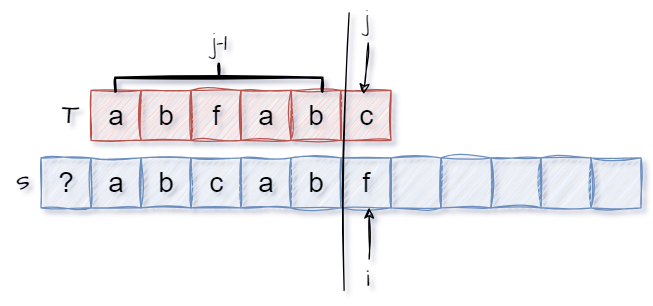
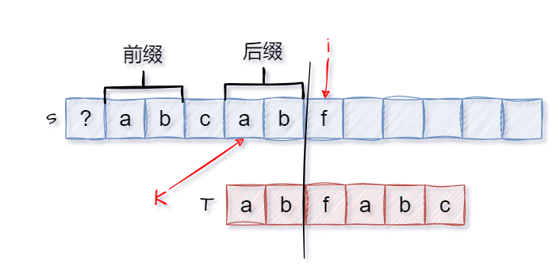
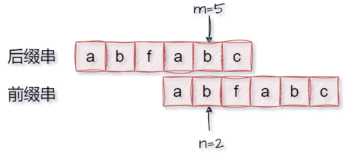
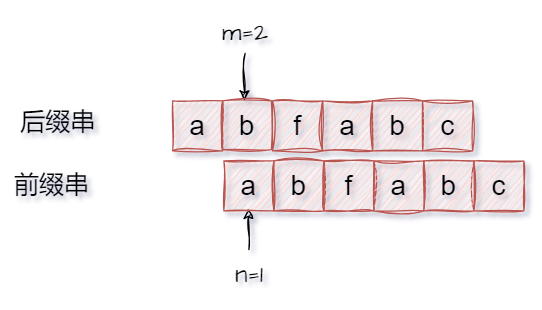
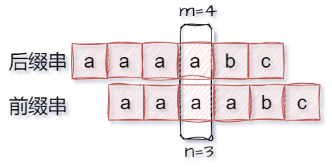
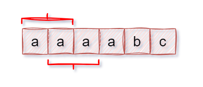
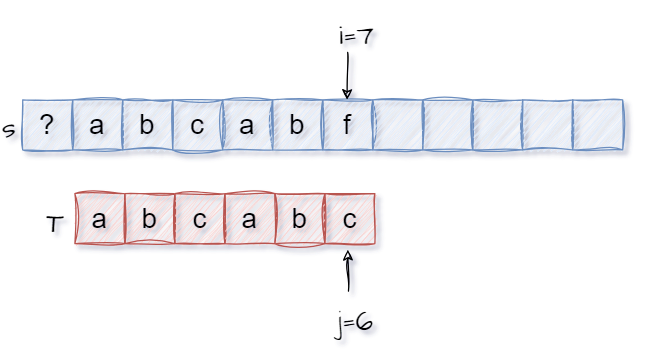

##### 串的实现以及基本操作

1. 顺序存储实现串可以分为：不论哪一种，一般我们默许数组索引为0的位置不使用。

   1. 定长顺序存储:

      ```cpp
      #include <iostream>
      #define MaxLen 50
      
      typedef struct {
          char ch[MaxLen];
          int length;
      }SString;
      ```

      

   2. 堆分配存储:

      ```cpp
      #include <iostream>
      #define MaxLen 50
      
      typedef struct {
          char *ch;
          int length;
      }HString;
      
      bool InitString(HString &S) {
          S.ch = (char *)malloc(sizeof(char)*MaxLen);
          if(S.ch==NULL) {
              return false;
          }
          S.length = 0;
          return true;
      }
      ```

      

2. 我们以定长分配为例，编写串的基本操作(似乎不在考纲要求之内略)

   1. 比较：

      ```cpp
      int StrCompare(SString S, SString T)
      {
          for (int i = 1; i <= S.length && i <= T.length; i++)
          {
              if (S.ch[i] != T.ch[i])
              {
                  return S.ch[i] - T.ch[i];
              }
          }
          //谁长谁大
          return S.length - T.length;
      }
      ```

      

   2. 查找：具体参考`BF`和`KMP`算法。

      ```cpp
      int Index(SString S, SString T)
      {
          int i = 1, n = S.length, m = T.length;
          SString sub;
          while (i <= n - m + 1) //要保证子串的长度是m
          {
              SubString(sub, S, i, m);
              if (StrCompare(sub, T) != 0)
              {
                  i++;
              }
              else
              {
                  return i;
              }
          }
          return 0;
      }
      ```

      

   3. 求子串：

      ```cpp
      bool SubString(SString &Sub, SString S, int pos, int len)
      {
          //从pos到pos+len-1的长度正好是len
          for (int i = pos; i < pos + len; i++)
          {
              Sub.ch[i - pos + 1] = S.ch[i];
          }
          Sub.length = len;
          return true;
      }
      ```

      

3. 链式存储结构：字符的字节很小，为了提高链表的存储密度，我们通常一个节点存储多个字符。

   ```cpp
   #include <iostream>
   typedef struct {
       char data[4];
       StringNode *next;
   }StringNode,*String;
   ```

   

---


##### BF算法

1. 首先声明，一般而言字符串的索引为0的位置是存储元素的，可以试着忽略它从1开始考虑。我们不妨先给出其代码：

   ```cpp
   #include <iostream>
   #define MaxLen 50
   typedef struct {
       char ch[MaxLen];
       int length; // 串的实际长度(从索引1开始，0号索引不存放元素)
   }SString;
   
   
   
   int BF(SString S, SString T) {
       int i = 1, j = 1;
       while(i <= S.length && j <= T.length) {
           if(S.ch[i] == T.ch[j]) {
               //匹配成功，继续比较下一个字符
               i++;
               j++;
           } else {
               //匹配失败，i回溯到上次匹配首位的下一位，j回溯到T的首位
               i = i - j + 2;
               j = 1;
           }
       }
       if(j > T.length) {
           //为啥不是i - j + 1呢?一样的,此时j=T.length+1
           return i - T.length;
       } else {
           return 0;
       }
   }
   ```

   

2. 所谓BF算法就是将主串的每一个位置开始的子串去匹配模式串。具体参考下图的回溯方法：<br>

3. 当完成遍历找到子串后，参考如下：<br>


---


##### KMP算法

1. 个人觉得KMP算法是一个很哲学的算法，在我看来它的本质就是牺牲一部分已经获得的东西(舍去部分已成功的匹配)，去博取更大的利益(更长的匹配)。但是由于人的贪婪，为了得到利益的最大化(使得模式串全部匹配)，每次只舍得给出最少的必要牺牲(最小回溯或者说最大后缀)。对此不妨先放一句话：<span style="color:red">当我们发现当前的匹配方式是不行的(`i`和`j`不匹配)，那么我们尝试牺牲尽可能短的已匹配部分，从而使得`i`、`j`位置可能再次匹配，作为下一次尝试的匹配方案，如`i`、`j`还不匹配，则继续牺牲。这种牺牲方式就会必然导致求解与前缀相等的最长后缀问题的出现。</span>

2. 在研究KMP之前我们不妨先回顾一下BF算法：如下图，我们先不考虑其他的有的没的，按照BF算法的逻辑，由于`f`和`c`的不匹配，接下来将回溯`i=3、j=1`。<br>

3. 那么对于这种回溯方式是否可以进一步优化吗?显然可以。在此之前，我们不妨研究一下,子串匹配的一些特点：

   1.   当`S`的`i`位置与`T`的`j`位置不匹配时，显然此前的`j-1`个位置都是匹配的。<br>
   2.   由于当前并没有找的匹配模式串`T`的子串(`j-1<T.length`)，故而如果`S`以这`j-1`个位置中某个位置`k`为首的子串能匹配模式串，那么必然会有一件事发生：即从`k`一直到`i-1`都能与`T`串匹配(显然这种情况下`i`无需变动,下一次仍然从`i`开始继续匹配)，也就会产生下图中完全相同的前缀和后缀两部分(我们可以从这一点出发找下一次的匹配起始点，`T`中的`f`),此外显然该后缀不等于`T`(前`j-1`个元素不可能是`T`不然就已经找到结果了)<br>
   3.   那么显然，为了不错过正确匹配方式，我们只需要找到已匹配位置中与前缀相等的最大后缀(不等于`T`)，直接从该最大后缀开始重新匹配就行(不是最大就可能会错过，我们必须保证正确的情况下才去尽可能跳到远些)。换句话说就是我们发现当前的匹配方式是不行的(`i`和`j`不匹配)，那么我们尝试牺牲尽可能短的已匹配部分，从而使得`i`、`j`位置可能再次匹配，作为下一次尝试的匹配方案，如`i`、`j`还不匹配，则继续牺牲。这种牺牲方式就会必然导致与前缀相等的最长后缀问题的出现。

4. 其实通过上述分析，我们大致已经理解了KMP算法的基本思想，保持`i`不变，通过某种算法逻辑对`j`进行回溯(BF算法`i、j`都进行回溯)。并且显然这种回溯只和模式串`T`有关。

   1. 其实本质上就是找`T`中与前缀相同(且不等于`T`)的最大后缀，从该最大后缀在`T`中的后一个位置开始重新匹配，故而我们不妨设置一个数组`next[T.length+1]`,我们假设`next[k]`表示模式串`T`的前`k-1`中与前缀相等的最大后缀长度。此外`next[k]+1`也表示当`j=i`时主串`S`和`T`模式串不匹配下一次`j`的回溯位置(后缀部分与前缀部分完全相等，已经可以通过上一次的匹配得出是匹配的)。这显然有点冗余，故而我们不妨直接将`next[k]=l(最大相等前后缀的长度)+1`，即`next[k]`便是`j=k`时主串`S`和`T`模式串不匹配下一次`j`的回溯位置。<br><br>
   2. 下面我们考虑一种特殊情况，当`j=1`时主串`S`与模式串`T`不匹配(`T`的第一个位置就与`S`不匹配),此时显然我们需要修改`j`移到下一个位置`next[j]`，于是乎我们不妨记作`next[1]=0`(后续代码中会判断当`j=0`时执行`i++`、`j++`达到重新匹配的目的)。
   3. <span style="color:red">我们要始终知道`next[k]=0`相当于一种标记告诉程序下一步需要执行`i++`操作。而`next[k]`是当`j=k`时出现不匹配时`j`的下一个位置。这样才不会在后面求`next[]`数组时产生疑惑。</span>
   4. 实际上对于任意一个模式串`T`(从1开始)的next数组中都有：`next[1]=0`、`next[2]=1`。

5. 我们依旧是先给出求解`next`数组的代码部分(为了与上述`i`、`j`意义区分，我们采用`m`和`n`)：

   ```cpp
   void get_next(SString T, int next[]) {
       int m = 1, n = 0;
   
       //特殊处理，会导致m++并使n自增为1
       next[1] = 0; 
       while(m < T.length) {
           if(n == 0 || T.ch[m] == T.ch[n]) {
               m++;
               n++;
               next[m] = n;
           } else {
               n = next[n];
           }
       }
   }
   ```

   

6. 下面我们分析一下如何求取`next[]`数组(为了与上述`i`、`j`意义区分，我们采用`m`和`n`)：

   1. 首先就是牢记`next[1]=0`、`next[2]=1`、其他时候`next[m]=l+1=n`。

   2. 其次我们要想明白，求解`next`数组的过程，其实就是模式串`T`自己和自己之间的字符串匹配问题(后续会说明)，当然由于人为的设置，导致这是一场没有"结果"的匹配，当然我们会在匹配过程中记录最大的匹配长度(准确的说是`l+1`)。

   3. 我们先看一个普通一点的例子：当`m=5`时`n=2`此时匹配，说明`m<5`部分中与前缀相等的最大后缀的长度为`2`。那么实际上我们需要执行`next[m+1]=next[6]=n+1=2+1`，即表示`j=6`时发生不匹配，下次`j`的位置是`2+1`。但是在代码中，是将`m+1`设置为`m++`，`n+1`设置为`n++`，最后直接`next[m]=n`即可。<br>

   4. 我们不妨以下面这个图为例：当`m=2`时`n=1`此时发生不匹配，说明`m<3`部分中与前缀相等的最大后缀的长度为`0`。此时`next[m+1]=0+1=1`表示模式串的`j`的下一个匹配位置。有时候可能会觉得`next[m+1]=0`才对，但实际上上面提到过这时候不需要移动`i`指针，而是令`j=1`开始匹配(只有`j=1`时不匹配才需要`i++`)。<span style="color:red">而这段逻辑在后续代码中的体现就是`n=next[n]  (0)`，对，就这么一小步，参考上一步思考发现，这他喵的简直就是这个代码的灵魂。</span><br>

      <br>

   5. 下面就是进一步研究灵魂`n=next[n]`。我们不妨引入一个新的例子说明这个问题：

      1. 当出现下面情况时，我们显然是知道`next[5]=3`。此时代码会将`m`、`n`值加一，然后对赋值`next[m]=n`即可。<br>

      2. 此时来到了下面的情况，这时候就会出现不匹配的情况。<br>

      3. 这时我们显然不可以认为`next[6]=0+1`，此时我们需要尝试尽可能少的回溯`n`去`L`中找一个尽可能长的前缀串使`n`和`m`能够再次匹配(两个尽可能就是为了保证找到KMP中要求的与前缀相等的最长后缀)。这个想法是不是很熟悉，对了`n=next[n]`，使用`next`数组自身(然后判断`m`和`n`位置字符是否相等，不等则再次缩短)。当然经过推测最终`next[6]=1`(纯属巧合，恰好无论怎缩短都不行。)<br><br>

7. 最终完整代码：(`m、n`换成`i、j`)也是一样的。

   ```cpp
   void get_next(SString T, int next[])
   {
       int m = 1, n = 0;
       // 提问:next[1] = 0的意义是什么？
       next[1] = 0;
       while (m < T.length)
       {
           if (n == 0 || T.ch[m] == T.ch[n])
           {
               m++;
               n++;
               next[m] = n;
           }
           else
           {
               n = next[n];
           }
       }
   }
   
   int KMP(SString S, SString T, int next[])
   {
       int i = 1, j = 1;
       get_next(T,next);
       while (i <= S.length && j <= T.length)
       {
           // 提问:判断j == 0的意义是什么？
           if (j == 0 || S.ch[i] == T.ch[j])
           {
               i++;
               j++;
           }
           else
           {
               j = next[j];
           }
       }
       if (j > T.length)
       {
           return i - T.length;
       }
       else
       {
           return 0;
       }
   }
   ```

   

8. 其实现在可以知道，所谓求解`next`数组的过程，其实就是将后缀串作为主串，前缀串作为模式串进行模式匹配，我们每次都尽可能时让后缀串的尽可能长的子串去匹配前缀串(此时就满足KMP要求的等于前缀的最长后缀)，并记录匹配长度，这其实就是串匹配的思想。当不匹配时，我们尝试牺牲一点已匹配的长度，使其再次匹配，为了得到最大结果，我们尽可能小的缩短匹配长度。<br>

9. 此外对于这种利用对称方式进行字符串匹配操作的思路，其实遇到一道类似的:[5. 最长回文子串(2025.4.3)](https://leetcode.cn/problems/longest-palindromic-substring)的 Manacher  算法。


---


##### KMP的进一步优化(nextval数组)

1. 在对KMP算法优化之前，需要提一点，理解KMP算法离不开对对称的认识。

2. 对于KMP算法，我们是否还有继续优化的可能性？显然(个der)是有的，我们不妨观察一下下图过程，此时我们发现`i`与`j`位置的不匹配问题。<br>

3. 于是乎我们采用KMP的牺牲原理，将`j`回溯到`next[6]=2+1=3`，此时问题就出现了，`j`在回溯前后的字符并没有变化，此时显然还是会有`i`与`j`位置的不匹配。然后就需要再次将`j`回溯，即`j=next[3]=1`。<br>

4. 上述问题其实我们在求解`next`数组时进行规避。于是乎我们得出了改进的`next`数组求解方式，记作`nextval`数组。其实仔细想想也会发现这种求解`nextval`数组方式也在求解`nextval`数组过程中规避了上述情况(由之前的分析，不难知道KMP和求解`next`数组都用到了`next`数组)。

   ```cpp
   void get_nextval(SString T, int nextval[])
   {
       int m = 1, n = 0;
       nextval[1] = 0;
       while (m < T.length)
       {
           if (n == 0 || T.ch[m] == T.ch[n])
           {
               m++;
               n++;
               if (T.ch[m] != T.ch[n])
               {
                   nextval[m] = n;
               }
               else //此时回溯的位置就是n,当ch[m]=ch[n]时，我们直接跳过当前回溯，直接回溯到next[n]
               {
                   nextval[m] = nextval[n];
               }
           }
           else
           {
               n = nextval[n];
           }
       }
   }
   ```

   

5. 显然我们还是需要解释一下上述代码，当我们发现如下图紫色部分对应时，应该执行`i++`、`j++`操作，这些我们不变。但原本我们要执行`nextval[m]=n`。对应KMP中将`j`回溯从`m`到`n`的位置。但是若`ch[m]=ch[n]`的话，显然这一步的回溯是不满足要求的，我们就可以直接跳过，将`j`从`m`直接跳到`nextval[n]`。也就是上述代码中的`nextval[m]=nextval[n]`。<br>

6. 后续待补。<br> 

---

##### 补充

1. 对于上述的内容，需要理解其过程，以便在选择题中能快速模拟`KMP`。
2. 实际上我们之前都是从`1`开始，实际上考研也是会考察从`0`开始，那么上述内容就需要相应变化：
   1. next数组不需要整体加一(考研不考察`KMP`算法题，理解即可)，似乎就是整体`-1`。
   2. 初始时`next[0]=-1`、`next[1]=0`。
   3. 题目中会暗示你从零还是从一开始。
3. BF算法中也要相应变化。


---

