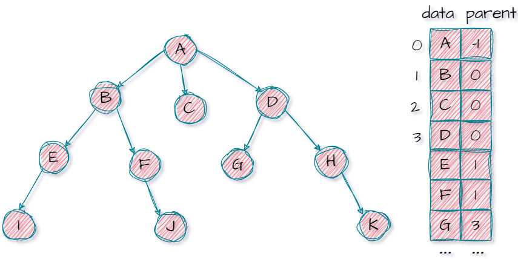
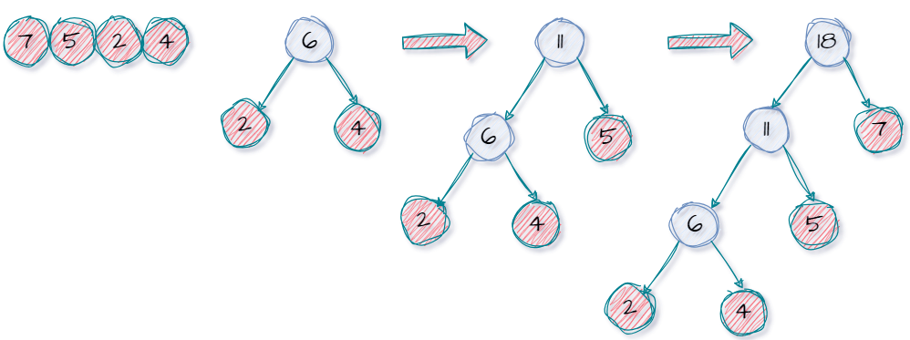

##### 二叉树的性质

1. <span style="color:red">注意！注意！注意！对于二叉树的性质判别是，一定不要忘记只有根节点的二叉树。</span>
2. 满二叉树：满二叉树是完全二叉树的一种。完全二叉树的一些性质满二叉树也适用。
   1. 高度为$h$则有$2^h-1$​​个结点(等比数列求和)。
   2. <span style="color:red">二叉树的第$h$层最多有$2^{h-1}$个结点。</span>
   3. 对于编号为$i$的结点，其双亲为$\lfloor(i/2)\rfloor$。若有左右孩子，则左孩子编号为$2i$,右孩子结点为$2i+1$。
3. 结点数为$n$的二叉树最小高度$h$：$h=\lceil log_2(n+1) \rceil$或者$h=\lfloor log_2n \rfloor+1$。对于$m$叉树同理可推(理在树上$P_{136}$)。
4. 不妨推导一下上述公式：
   1. <span style="color:red">二叉树的第$h$层最多有$2^{h-1}$个结点。$m$叉树的第$h$层最多有$m^{h-1}$个结点。</span>

   2. <span style="color:red">前$h$行</span>共有结点 $S_1=2^h -1$ ，而<span style="color:red">第$h+1$行</span>有结点 $S_2=2^{h+1-1}$ 个。那么显然有 $S_1+1=S_2$ ，即前`n`层若共有$a$个结点，那么第$n+1$层就有$a+1$个结点(当然了这里的$a$其实就等于$2^{h+1-1}$)。<br>

   3. 当然上述结论还可以推导到满$m$叉树，<span style="color:red">前$h$行</span>共有结点 $S_1=\frac{m^h -1}{m-1}$ ，而<span style="color:red">第$h+1$行</span>有结点 $S_2=m^{h+1-1}$ 个。那么显然有 $(m-1)S_1+1=S_2$ 。

   4. 不妨继续，如下图所示：假设第$i+a$个结点是该层的第$a$个结点，那么结合上一个规律显然可以推导出上述满二叉树的性质<br>
   5. 同样的我们将这个结论推导到满$m$叉树，若某个结点为$i$，结合上述内容不难知道其的第$m$个子结点为$mi+1$，显然其子结点的编号范围为$m(i-1)+2$到$mi+1$​。
   6. 那如果树结点的编号从零开始呢？显然编号全部减一即可推出父子结点的编号关系。
5. 完全二叉树：

   1. 对于编号为$i$的结点，其双亲为$\lfloor i/2 \rfloor$。若有左右孩子，则左孩子编号为$2i$,右孩子结点为$2i+1$。
   2. 完全二叉树中$i<=\lfloor n/2\rfloor$，则$i$为分支节点，否则为叶子节点。	
   3. 完全二叉树有$n$个结点，高为多少？推断过程见王道课本。
6. 不妨再推一下上述公式：我们假设<span style="color:red">某二叉树</span>有$n$个结点，其中包含$n_0$个叶子结点,$n_1$个有一个分支的结点，$n_2$个含义两个分支的结点，并假设其含有$B$条分支，显然有$n=n_0+n_1+n_2$及$B=n-1$,那么：

   1. $B=2n_2+n_1$，同时另一方面又有 $B=n_0+n_1+n_2-1$(减去根节点)。故而$n_0=n_2+1$,即 $叶子节点的个数=含两个分支的结点个数+1$。<span style="color:red">此外显然有$n_0+n_2=2n_0+1$必定是一个奇数。</span>
   2. 显然通过上述推断过程后，不难知道对于任意一个二叉树都有：$n=2n_0+n_1-1$。
   3. 对于<span style="color:red">完全二叉树</span>我们知道$n_1<=1$的($n_1$非$0$即$1$)，故而$n=2n_0-1$或者$n=2n_0$：
      1. 显然当$n$为偶数时说明$n_1=1$，此时$i<=n/2$为分支结点(完全二叉树的性质决定了其叶子结点的编号连续)。
      2. 显然当$n$为奇数时说明$n_1=0$，此时$i<=(n-1)/2$​为分支结点。除此之外，甚至可以推出哪一个结点是唯一的只有一个分支的结点。
      3. 综上所述$i<=\lfloor n/2\rfloor$，则$i$​为分支节点，否则为叶子节点。对于一个完全二叉树，结点个数为偶数，则叶子结点占一半；结点个数为奇数，叶子结点占一半还多一个。<br>
   4. 不妨总结一下:
      1. <span style="color:red">对于任意二叉树有</span>：
         1. $n_0+n_2=2n_0+1$​必定是一个奇数。
         2. $B=n_0+n_1+n_2-1$​
         3. $B=2n_2+n_1$​
         4. $B=n-1$
         5. $n_0=n_2+1$
      2. <span style="color:red">对于完全二叉树有</span>：
         1. $n_0=1$或者$n_0=0$
         2. $n_1=1$时，$n_0=\frac{n}{2}$、$n_2=\frac{n-2}{2}=n_0-1$、$n$为偶数
         3. $n_1=0$时，$n_0=\frac{n+1}{2}$、$n_2=\frac{n-1}{2}=n_0-1$、$n$为奇数
7. 二叉排序树：略
8. 平衡二叉树：任意一个结点的左右子树高度之差不超过1，搜索效率较高。
9. 正则二叉树：每个分支结点都有2个孩子结点，即树中只有度为0或2的结点(正则$m$树就只有度为$m$或者$0$的结点)。
10. 需要注意的是：上述结论都是在二叉树结点编号从$1$开始。对于考研中可能出现的结点编号从$0$​开始，需要思考并相应变化。
11. 下面我们来讨论一下只有高为$h$且度为$0$或者$2$的树(<span style="color:red">正则二叉树</span>)长啥样？显然就是$n_1=0$的二叉树(<span style="color:red">注意不一定完全二叉树，下面只是举了一部分例子。</span>):<br>


---


##### 二叉树存储

1. 顺序存储：

   1. 顺序存储结构只适合于完全二叉树存储，对于非完全二叉树使用顺序存储会浪费大量空间。

   2. <span style="color:red">顺序存储时一定要将各结点与完全二叉树对应起来，然后实现存储，尤其是非完全二叉树。</span>

   3. 结构定义如下：顺序存储一般建议索引为`0`的位置不存储结点，从而使结点的索引和树中的编号一致，便于通过性质求解父子结点等。

      ```cpp
      #include <iostream>
      #define MaxSize 50
      
      typedef int OlderTree[MaxSize];
      ```

      

2. (<span style="color:red">重点</span>)链式存储：

   1. <span style="color:red">在$n$个结点的二叉链表中至少有$n+1$个空指针域(即$2n-(n-1)$)。同理可以推广到$m$叉树有$n$个结点，则至少有空指针域$mn-(n-1)=(m-1)n+1$个。</span>

   2. 二叉链表表示：

      ```cpp
      #include <iostream>
      
      typedef char ElemType;
      typedef struct BiTNode
      {
          ElemType data; // 数据域
          struct BiTNode *lchild, *rchild; // 左右孩子指针
      } BiTNode, *BiTree;
      ```

      

   3. 有时我们可能希望直接找到某个结点的父节点，于是又有了三叉链表(多一个父指针)：

      ```cpp
      #include <iostream>
      
      typedef char ElemType;
      typedef struct BiTNode
      {
          ElemType data; // 数据域
          struct BiTNode *lchild, *rchild,*parent;  
      } BiTNode, *BiTree;
      ```

3.  对于链式存储的一些常见操作(基于二叉树的遍历)：

    1. 求树的深度：

       ```cpp
       int Depth(BiTree T)
       {
           int ldepth, rdepth;
           if (T == NULL)
               return 0;
           else
           {
               ldepth = Depth(T->lchild); // 左子树的深度
               rdepth = Depth(T->rchild); // 右子树的深度
               return (ldepth > rdepth) ? (ldepth + 1) : (rdepth + 1);
           }
       }
       ```

    2. 树的结点数：

       ```cpp
       int nodeCount(BiTree T)
       {
           if (T == NULL)
               return 0;
           else
               return nodeCount(T->lchild) + nodeCount(T->rchild) + 1;
       }
       ```

    3. 树的叶子结点数：

       ```cpp
       int LeafCount(BiTree T)
       {
           if (T == NULL) //容易忽略
               return 0;
           if (T->lchild == NULL && T->rchild == NULL)
               return 1;
           return LeafCount(T->lchild) + LeafCount(T->rchild);
       }
       ```

    4. 树的复制：

       ```cpp
       void CopyTree(BiTree T, BiTree &NewT)
       {
           if (T == NULL)
           {
               NewT = NULL;
           }
           else
           {
               NewT = (BiTNode *)malloc(sizeof(BiTNode));
               NewT->data = T->data;
               CopyTree(T->lchild, NewT->lchild); // 递归复制左子树
               CopyTree(T->rchild, NewT->rchild); // 递归复制右子树
           }
       }
       ```

      


---


##### 先序遍历(根左右)(NLR)

1. <span style="color:red">始终牢记根左右。</span>

2. 如下图二叉树，我们直接通过人脑模拟(从根结点一路向下，然后回退到上一个节点对右子树重复上述过程)：从A开始一路向左下D的空左子结点(`ABD`)，然后回退到D找右子树(`ABDE`)，然后回退到B找右子树(`ABDGE`)，然后回退到A同理遍历右子树(`ABDGECF`)。<br>

3. 下面给出递归形式代码(空间复杂度$O(h+1)=O(h)$)：注意下面代码的参数都是指针形式。

   ```cpp
   void visit(BiTNode *T)
   {
       printf("%c", T->data);
   }
   
   void PreOrderTraverse(BiTree T)
   {
       if (T != NULL)
       {
           visit(T);
           PreOrderTraverse(T->lchild);
           PreOrderTraverse(T->rchild);
       }
   }
   ```

   

4. 给出略微复杂的非递归形式：

   1. 首先需要定义一个栈用于存储树结点，但需要注意是我们每次入栈的实际上不是结点本身，而是指向结点的指针：

      ```cpp
      #include <iostream>
      #define MaxSize 50
      typedef char ElemType; // 嫌麻烦可以不重命名
      
      typedef struct BiTNode
      {
          ElemType data; 
          struct BiTNode *lchild, *rchild;
      } BiTNode, *BiTree;
      
      typedef struct Stack
      {
          BiTNode* data[MaxSize];
          int top; 
      } Stack;
      
      //省略具体实现
      void InitStack(Stack &S);       // 初始化栈
      bool isEmpty(Stack S);          // 判断栈是否为空
      bool Push(Stack &S, BiTNode* x);  // 进栈
      bool Pop(Stack &S, BiTNode* x);   // 出栈
      bool GetTop(Stack S, BiTNode* x); // 取栈顶元素
      ```

      

   2. 编写先序遍历函数：实际上就是上面模拟的的遍历逻辑。

      ```cpp
      void PreOrder(BiTree T)
      {
          Stack S;
          InitStack(S);
      
          BiTree p = T;
          // 栈不空或者p不空时循环
          while (p || !isEmpty(S))
          {
              if (p)
              {
                  // 一路向左访问遍历(直到空的左孩子)
                  visit(p);
                  Push(S, p);
                  p = p->lchild;
              }
              else
              {
                  // 回退到上一个子树的根节点，然后遍历右子树
                  Pop(S, p);
                  p = p->rchild;
              }
          }
      }
      ```

   

5. 后续待补。<br>

---


##### 中序遍历(左根右)(LNR)

1. <span style="color:red">始终牢记左根右。</span>

2. 同上，我们使用人脑模拟一下(不停地递归找左子树，直到得到一个叶子结点，若是得到无左孩子的根结点就补全(如图)(最左边或者说最左下的结点)，重复<span style="color:red">回退+根右</span>)：先是遍历以D为根节点的子树(`DG`)，然后到以B为根结点的子树(`DGBE`)，然后是以A为根节点的子树(右边子树同样的方式)(`DGBEAFC`)<br>

3. 下面给出递归形式代码：

   ```cpp
   void visit(BiTNode *T)
   {
       printf("%c", T->data);
   }
   
   void InOrder(BiTree T)
   {
       if (T != NULL)
       {
           InOrder(T->lchild);
           visit(T);
           InOrder(T->rchild);
       }
   }
   ```

   

4. 给出略微复杂的非递归形式：

   1.   首先需要定义一个栈用于存储树结点，依旧需要注意我们每次入栈的实际上不是结点本身，而是指向结点的指针：

        ```cpp
        #include <iostream>
        #define MaxSize 50
        typedef char ElemType; // 嫌麻烦可以不重命名
        
        typedef struct BiTNode
        {
            ElemType data; 
            struct BiTNode *lchild, *rchild;
        } BiTNode, *BiTree;
        
        typedef struct Stack
        {
            BiTNode* data[MaxSize];
            int top; 
        } Stack;
        
        //省略具体实现
        void InitStack(Stack &S);       // 初始化栈
        bool isEmpty(Stack S);          // 判断栈是否为空
        bool Push(Stack &S, BiTNode* x);  // 进栈
        bool Pop(Stack &S, BiTNode* x);   // 出栈
        bool GetTop(Stack S, BiTNode* x); // 取栈顶元素
        ```

        

   2.   编写先序遍历函数：实际上就是上面模拟的的遍历逻辑。

        ```cpp
        void visit(BiTNode *T)
        {
            printf("%c", T->data);
        }
        
        // 非递归中序遍历
        void InOrderTraverse(BiTree T)
        {
            Stack S;
            InitStack(S);
        
            BiTree p = T;
            while (p || !isEmpty(S))
            {
                if (p)
                {
                    // 一路向左，直到左孩子为空(但是不访问)
                    Push(S, p);
                    p = p->lchild;
                }
                else
                {
                    Pop(S, p);
                    visit(p);      // 根
                    p = p->rchild; // 右子树
                }
            }
        }
        ```

        

5. 注意观察先序遍历和中序遍历的非递归形式代码，我们不难发现：对于同一棵树，先序遍历总是在进栈时访问结点，而中序遍历总是在出栈时访问结点，仅此而已(二者栈中元素的变化情况完全相同)。那么这时后我给一个先序遍历序列为$a,b,c,d$，问其二叉树有多少可能?显然我们知道先序序列和中序序列可以确定一棵二叉树，那么先序序列已知(进栈顺序已知)，其实就是问中序序列的有多少可能(出栈顺序有多少可能)，显然有$\frac{1}{n+1}C^n_{2n}$种可能。

---


##### 后序遍历(左右根)(LRN)

1. <span style="color:red">始终牢记左右根。</span>

2. 同上，我们使用人脑模拟一下(不停地递归找左子树，直到得到一个叶子结点，若是得到无左孩子的根结点就补全(如图)(最左边或者说最左下的结点)，重复<span style="color:red">回退+右根</span>)：先是遍历D为根结点的子树(`GD`)，然后遍历以B为根结点的子树(`GDEBFCA`)，然后遍历以A为根结点的子树(`GDEBFCA`)。当然也可以采用咸鱼学长的"从你的全世界路过法"。<br>

3. 需要说明一点，上述图示过程实际上并不能完全展示后序遍历的过程，因为遍历左子树必然要经过根节点，但这时候我们不去访问根节点，因此没有画出。王道咸鱼学长给这种遍历方式取名为"从你的全世界路过"是很恰当的(路过多次却不访问)。

4. 下面给出递归形式代码：

   ```cpp
   void visit(BiTNode *T)
   {
       printf("%c", T->data);
   }
   
   void PostOrder(BiTree T)
   {
       if (T != NULL)
       {
           PostOrder(T->lchild);
           PostOrder(T->rchild);
           visit(T);
       }
   }
   ```

   

5. 给出略微复杂的非递归形式：

   1. 首先需要定义一个栈用于存储树结点，需要注意我们每次入栈的实际上不是结点本身，而是指向结点的指针：

      ```cpp
      #include <iostream>
      #define MaxSize 50
      typedef char ElemType; // 嫌麻烦可以不重命名
      
      typedef struct BiTNode
      {
          ElemType data; 
          struct BiTNode *lchild, *rchild;
      } BiTNode, *BiTree;
      
      typedef struct Stack
      {
          BiTNode* data[MaxSize];
          int top; 
      } Stack;
      
      //省略具体实现
      void InitStack(Stack &S);       // 初始化栈
      bool isEmpty(Stack S);          // 判断栈是否为空
      bool Push(Stack &S, BiTNode* x);  // 进栈
      bool Pop(Stack &S, BiTNode* x);   // 出栈
      bool GetTop(Stack S, BiTNode* x); // 取栈顶元素
      ```

      

   2.  编写先序遍历函数：实际上就是上面模拟的的遍历逻辑，但是相较于前面两个而言还是有些难度：

       ```cpp
       void visit(BiTNode *T)
       {
           printf("%c", T->data);
       }
       
       void PostOrder(BiTree T)
       {
           Stack S;
           InitStack(S);
       
           BiTree p = T, r = NULL;
           while (p || !isEmpty(S))
           {
               if (p)
               {
                   // 一路向左，直到左孩子为空(但是不访问)
                   Push(S, p);
                   p = p->lchild;
               }
               else
               {
                   GetTop(S, p);
                   if (p->rchild && p->rchild != r)
                   {
                       // 转向右子树(仍然不访问)(后续p不为空会继续入栈)
                       p = p->rchild; 
                   }
                   else
                   {
                       // 没有右子树或者右子树已经访问过(直接访问)
                       Pop(S, p);
                       visit(p);
                       r = p;    // 记录最近访问过的结点
                       p = NULL; // 使p为空，以便继续弹栈
                   }
               }
           }
       }
       ```

       

6. 对于`r`指针的原理(记录上一次访问过的结点)：我们当前存在的问题对于一个结点，我们无法知道当前是该访问还是该转向右子树。那么我们不妨考虑一个问题，若右子树被访问了会有哪些特征？显然下一步会回到根结点，那么我们设置一个`r`指针指向上一次访问的结点，若`r`恰为当前结点的右结点说明右子树已经遍历完毕，可以安心访问当前结点了。<br>


---

##### 小结(不包括层次遍历)

1. 对于上述三种遍历方式其实还是有一些细节问题，如果能很好地利用，能够极大地方便我们做题:
   1. 无论对于上述哪一种遍历方式，左子树的遍历始终在右子树之前。故而我们可以推断出：
      1. ($P_{155}$的10、12、13)若某两个结点在两种遍历序列中出现的先后顺序不一致，那么这两个结点一定不是兄弟结点的关系(反之不成立，参考后面结点左右位置的情况讨论)。
      2. 同一棵树，无论采用何种遍历方式，其叶子结点出现的先后顺序一定是完全相同的(从左往右)。
      3. 左子树上的点在遍历序列中一定先于右子树上的点出现。
   2. (容易晕)无论是哪一种遍历，本质上还是以(子)树作为遍历单位(观察递归形式的遍历代码)，故而只有一棵子树遍历完才会去遍历另一棵子树，不会出现穿插遍历子树的情况。例如下面，遍历完当前结点后，是不可能立即出现$A$或者$B$的(右结点还没遍历,该子树还未结束遍历)。(王道课本$P_{155}$的14题的D选项中当我们推断出46属于一棵子树，57属于另一棵同级子树时，就与题目矛盾了，哪怕不是先序遍历也不可能出现题目所给的123<span style="color:red">4567</span>)<br>
   3. 关于遍历序列中的最后、第一个的判别问题：
      1. 后序遍历的最后一个结点一定是根结点。先序遍历的第一个结点一定是根结点。
      2. 中序遍历中的最后一个结点。
      3. 先序遍历的最后一个结点一定是叶子结点(假设不是，则与`根左右`矛盾)。
      4. 后续遍历的第一个结点一定是叶子结点。
      5. 中序遍历的第一个结点一定没有左孩子(同理)。
      6. 中序遍历的最后一个结点一定不含右孩子(假设有，则与`左根右`矛盾)，但是不一定是根结点。那如果我们已知中序遍历的最后一个结点为叶子结点，那么我们就可以知道先序遍历的最后一个结点也是它(叶子结点出现的先后顺序一定是完全相同的)(或者也可以通过先序和中序的遍历顺序去理解，显然中序最后遍历的叶子结点一定是右叶子结点...)。
   4. 二叉树的三序遍历本质上还是后面的深度优先遍历:都是先访问左结点，然后再访问兄弟结点。
      1. 尤其是先序遍历，是以根结点开始的深度优先遍历，先一路南下，然后回退向右，再一路南下...。知道了这个原理，其实就很容易写出先序遍历序列了。
      2. 而对于中序遍历、后序遍历，也是以根结点开始，但是总是路过，似乎就没那么好用了。
   5. 那么下面我们讨论一些东西，事情的起因是关于王道的两道题。我们假设$n$结点在$m$​的左边，那么有几种情况：
      1. 在研究这个问题之前我询问了`chatgpt`一个问题：我们在考虑二叉树是是否需要考虑视觉位置？也就是说有没有可能出现某个结点的左子树中的结点$n$在右子树结点$m$的右边这种说法？下面给出它的回答：在讨论二叉树时，我们通常不会考虑节点的视觉位置，尤其是在算法和数据结构的上下文中。二叉树的讨论主要集中在节点之间的层级关系和父子关系上，而非它们在某个图形界面上的相对位置。这是因为二叉树的结构是抽象的，它的主要用途是为了组织数据和支持高效的数据操作（如搜索、插入和删除），而不是为了在视觉上表示这些数据。
      2. $m$与$n$是祖孙关系：图示不唯一<br>
      3. $m$与$n$是兄弟关系：<br>
      4. $m$与$n$是堂兄弟关系：图示不唯一<br>
      5. 不具有祖孙关系，且不在同一层级(不考虑出现某个结点的左子树中的结点$n$在右子树结点$m$的右边)：图示不唯一<br>
      6. 待补
   6. 我们不妨提出一种阶梯策略，当然这种解题策略的理解是基于对三序遍历的认识，不妨称其为"逻辑删除法"
      1. 若一个非空二叉树的先序序列和后序序列相同：先序遍历`根左右`，后序遍历`左右根`，显然逻辑删除`左右`，该树只有一个根节点。
      2. 若一个非空二叉树的先序序列和后序序列相反：先序遍历`根左右`，后序遍历`左右根`，显然显然逻辑删除`左`或`有`，该树每层只有一个结点。
      3. 若一个非空二叉树的先序序列和中序序列相同：先序遍历`根左右`，中序遍历`左根右`，显然显然逻辑删除`左`，该树只有右子树。
      4. 若一个非空二叉树的中序序列和后序序列相同：中序遍历`左根右`，后序遍历`左右根`，显然显然逻辑删除`右`，该树只有左子树。
      5. 其他：略
      6. 若没有局限二叉树非空，则还需考虑二叉树为空的情况(提一嘴，也别忘记二叉树只有根结点的情形)。


##### 层次遍历

1. 同上面非递归形式的栈一样，要强调：入队的是指向结点指针而不是结点本身。

2. 如图，层次遍历只需要从左往右，一层层依次遍历就行，显然层次遍历序列为：`ABCDEFG`<br>

3. 给出实现代码：

   1. 首先需要定义一个栈用于存储树结点，需要注意我们每次入栈的实际上不是结点本身，而是指向结点的指针：

      ```cpp
      #include <iostream>
      #define MaxSize 50
      typedef char ElemType;
      
      typedef struct BiTNode
      {
          ElemType data; 
          struct BiTNode *lchild, *rchild;
      } BiTNode, *BiTree;
      
      typedef struct
      {
          BiTNode* data[MaxSize];
          int front;
          int rear;
      } sqQueue;
      
      // 省略具体实现
      void initQueue(sqQueue &Q); // 初始化
      bool isEmpty(sqQueue Q);   // 判空
      bool enQueue(sqQueue &Q, BiTNode* x); // 入队
      bool deQueue(sqQueue &Q, BiTNode* &x); // 出队
      ```

      

   2.  编写先序遍历函数：时刻牢记队列先进先出的公平原则。

        ```cpp
       void visit(BiTNode *T)
       {
           printf("%c", T->data);
       }
       
       void LevelOrder(BiTree T)
       {
           sqQueue Q;
           initQueue(Q);
       
           BiTree p;
           enQueue(Q, T);
       
           while (!isEmpty(Q))
           {
               deQueue(Q, p); // 出队
               visit(p);     // 访问
       
               // 左孩子不为空则左孩子入队
               if (p->lchild != NULL) 
                   enQueue(Q, p->lchild);
       
               // 右孩子不为空则右孩子入队
               if (p->rchild != NULL) 
                   enQueue(Q, p->rchild);
           }
       }
        ```

      


---


##### 构造二叉树

1. 必需要有<span style="color:red">中序遍历</span>配合另外一个非中序遍历方可确定一个<span style="color:red">二叉树</span>。关键在于找到根节点，然后划分左右子树，然后重复上述过程。
2. <span style="color:red">注意：对于完全二叉树而言，我们是可以尝试通过某个遍历序列推出唯一的二叉树的。</span>

3. 通过先序遍历序列和中序遍历序列构造二叉树：对于先序序列`ABDGECF`和中序序列`DGBEAFC`
   1. 由先序序列知道`A`为根结点，结合中序序列知道`DGBE`为左子树、`FC`为右子树
   2. 由先序序列知道`DGBE`中的`B`为根结点(`BDGE`中`B`最靠前)，则`DG`为左子树，`E`为右子树。
   3. 同理可知`FC`中的`C`为根结点(`CF`中`C`最前)，`F`为左子树。
   4. ...
   5. 重复上述分析过程。

4. 通过后序遍历序列和中序遍历序列构造二叉树：`GDEBFCA`和中序序列`DGBEAFC`
   1. 由后序序列知道`A`为根结点，结合中序序列知道`DGBE`为左子树、`FC`为右子树
   2. 由后序序列知道`DGBE`中的`B`为根结点(`GDEB`中`B`最后)，则`DG`为左子树，`E`为右子树。
   3. 同理可知`FC`中的`C`为根结点(`FC`中`C`最后)，`F`为左子树。
   4. ...
   5. 重复上述分析过程。

5. 通过层次遍历序列和中序遍历序列构造二叉树：`ABCDEFG`和中序序列`DGBEAFC`
   1. 由层次序列知道`A`为根结点，结合中序序列知道`DGBE`为左子树、`FC`为右子树
   2. 由后序序列知道`DGBE`中的`B`为根结点(`B`显然为左子树根节点)，则`DG`为左子树，`E`为右子树。
   3. 同理可知`FC`中的`C`为根结点(由于右子树不为空，`C`显然为左子树根节点)，`F`为左子树。
   4. ...
   5. 重复上述分析过程。

6. 给出上述分析的树示意图：<br>
7. 那么我们试着理解一下，为什么确定一个二叉树一定需要中序遍历序列呢?这是由于中序序列一旦知道了根结点，就可以将左右子树区分开。从而可以继续递归分析推断，直至推断出整个树，而其他的遍历序列无法将左右子树完全区分开来。


---


##### 二叉树线索化

1. 按照某种遍历顺序设置前驱和后继线索，将某个结点的空左指针域指向它的前驱(遍历序列中的前驱)，空右指针域指向它的后继(遍历序列中的后继)。为了为了区分左右孩子指针指向的是孩子还是线索，增加两个标志域`ltag`和`rtag`，如果`ltag=0`，`lchild`指向左孩子，若`ltag=1`则`lchild`指向前驱；`rchild`同理。故而我们给出如下的类型定义：

   ```cpp
   #include <iostream>
   typedef char ElemType; 
   
   typedef struct ThreadNode
   {
       ElemType data;
       struct ThreadNode *lchild, *rchild;
       int ltag, rtag;
   } ThreadNode, *ThreadTree;
   ```

   

2. 线索二叉树方便找前驱和后继，可以直接从某个结点开始遍历二叉树。

3. 无论哪种线索二叉树，最多只会有两个空指针域。

   1. 对于先序线索化：最后一个结点一定是叶子结点，一定有一个空的右指针域。至于第一个结点是否具有右指针域则要看根结点是否具有左子树。

   2. 对于中序线索化(必有2个)：最后一个结点一定不含右孩子，一定有一个空的右指针域。而第一个结点一定没有左孩子，一定具有一个空的左指针域。

   3. 对于后续线索化：最后一个结点不一定有左指针域，关键要看根结点是否具有左孩子。同理其第一个结点一定具有一个空的左指针域。

4. 我们不妨讨论下线索二叉树是逻辑结构还是物理结构：

   1. 逻辑结构：数据元素之间的逻辑关系，与数据的存储无关。

   2. 存储结构(物理结构)：数据结构在计算机中的具体表示，是使用计算机语言实现的逻辑结构，它依赖于计算机语言。

   3. 而对于线索二叉树而言，每个结点的线索(不属于逻辑结构中的任何一种类型或者任何一种类型的一部分)是通过指针定义的，而指针是一种C语言的功能，故而满足<span style="color:red">物理结构</span>的定义。

5. 前序线索二叉树：

   1. 示意图如下：空左指针域指向先序序列中的前驱，空右指针域指向先序序列中的后继。<br>

   2. 给出代码实现：

      ```cpp
      void PreThread(ThreadTree T, ThreadTree &pre)
      {
          if (T != NULL)
          {
              // (A)
              if (T->lchild == NULL)
              {
                  T->lchild = pre;
                  T->ltag = 1;
              }
              // (B)
              if (pre != NULL && pre->rchild == NULL)
              {
                  pre->rchild = T;
                  pre->rtag = 1;
              }
              // 更新pre
              pre = T; 
      
              // 判断lchild是否为前驱线索
              if (T->ltag == 0)
                  PreThread(T->lchild, pre);
              // (C) rchild一定不是后继
              PreThread(T->rchild, pre); 
          }
      }
      
      void CreatePreThread(ThreadTree T)
      {
          // (D)
          ThreadTree pre = NULL;
          if (T != NULL)
          {
              PreThread(T, pre);
              // (E)最后一个节点的右指针指向空
              pre->rtag = 1; 
          }
      }
      ```

      

   3. 关于上述代码还是有一些需要说明的问题：

      1. A处：可以将该部分代码抽出为一个函数：

         ```cpp
         void visit(ThreadTree T, ThreadTree &pre){
             if (T->lchild == NULL)
             {
                 T->lchild = pre;
                 T->ltag = 1;
             }
             if (pre != NULL && pre->rchild == NULL) 
             {
                 pre->rchild = T;
                 pre->rtag = 1;
             }
             pre = T;
         }
         ```

         

      2. B处：初始时`pre=NULL`，若某个树只有右子树就会出问题。

      3. C处：该处代码为何不需要判断 `rchild`不是后继线索，因为建立后继线索一定是对`pre.rchild=T`。故而对于当前的`T.rchild`其要么是`NULL`要么指向右子结点，一定不是后继线索。而由于前面可能建立了前驱线索`T->lchild=pre`，因此需要对其进行判断。

         ```cpp
         // lchild不是前驱线索
         if (T->ltag == 0)
             PreThread(T->lchild, pre);
         
         // rchild不是后继线索
         if (T->rtag == 0) 
             PreThread(T->rchild, pre);
         ```

         

      4. E处：由于第一个结点的前驱线索是`NULL`，因此`pre`要初始化为`NULL`。

      5. D处：为什么无需判断，我们不妨假设先序遍历最后一个结点有右结点，那么根据先序遍历规则，该结点为最后一个结点的假设就不成立。故而先序遍历的最后一个结点一定没有右结点。

         ```cpp
         // 不会判断就直接这么记(推荐)
         if (pre->rchild == NULL) 
         {
             pre->rtag = 1; 
         }
         ```

6. 中序线索二叉树：

   1. 示意图如下：空左指针域指向中序序列中的前驱，空右指针域指向中序序列中的后继。<br>

   2. 给出代码实现：

      ````cpp
      void InThread(ThreadTree &T, ThreadTree &pre)
      {
          if (T != NULL)
          {
              //(A)
              InThread(T->lchild, pre);
      
              if (T->lchild == NULL)
              {
                  T->lchild = pre;
                  T->ltag = 1;
              }
              if (pre != NULL && pre->rchild == NULL)
              {
                  pre->rchild = T;
                  pre->rtag = 1;
              }
              pre = T;
              //(B)
              InThread(T->rchild, pre);
          }
      }
      
      void CreateThread(ThreadTree &T)
      {
          ThreadTree pre = NULL;
          if (T != NULL)
          {
              InThread(T, pre);
              //(C)
              pre->rtag = 1;
          }
      }
      ````

   3. 同样的我们为上述代码提出部分说明：

      1. A处：此时还未对`T`建立前驱线索，故而无需判断。

      2. B处：此时还未对`T`建立后继线索，故而无需判断。

      3. C处：我们不妨假设中序遍历最后一个结点有右结点，那么根据中序遍历规则，该结点为最后一个结点的假设就不成立。故而同先序遍历一样，中序遍历的最后一个结点也一定没有右结点。

         ```cpp
         // 不会判断就直接这么记(推荐)
         if (pre->rchild == NULL) 
         {
             pre->rtag = 1; 
         }
         ```

         

7. 后续线索二叉树：

   1. 示意图如下：空左指针域指向后序序列中的前驱，空右指针域指向后序序列中的后继。<br>

   2. 给出代码实现：

      ```cpp
      void PostThread(ThreadTree &T, ThreadTree &pre)
      {
          if (T != NULL)
          {
              PostThread(T->lchild, pre);
              PostThread(T->rchild, pre);
              if (T->lchild == NULL)
              {
                  T->lchild = pre;
                  T->ltag = 1;
              }
              if (pre != NULL && pre->rchild == NULL)
              {
                  pre->rchild = T;
                  pre->rtag = 1;
              }
              pre = T;
          }
      }
      
      void CreatePostThread(ThreadTree &T)
      {
          ThreadTree pre = NULL;
          if (T != NULL)
          {
              PostThread(T, pre);
              //(A)
              if (pre->rchild == NULL)
              {
                  pre->rtag = 1;
              }
          }
      }
      ```

      

   3. 同样的我们为上述代码提出部分说明：A处实际上我们知道后续遍历的最后一个结点一定是根节点。故而此处要么直接省略对根节点的处理(树只有一个结点时这样似乎不太恰当)，要么就要加判断。

8. 实际上线索化二叉树的过程就是二叉树的遍历过程，而创建线索的过程就是`visit`函数的逻辑。<br>

---


##### 线索二叉树中找前驱后继

1. 以中序遍历为例(最完美的线索二叉树)：`左 根 右`

   1. 找中序前驱：

      1. 若`lchild`被线索化，则直接找到前驱。

      2. 若`lchild`未线索化，则必有左孩子。则根据`左 根 右`，其前驱必为左子树中最后遍历的结点(一般称<span style="color:red">最右边</span>或者<span style="color:red">最右下</span>的结点)(此处因该是不停地递归找右子树，直到得到一个叶子结点或者无右孩子的根结点)。

         ```cpp
         ThreadNode *LastNode(ThreadNode *p)
         {
             while (p->rtag == 0)
                 p = p->rchild;
             return p;
         }
         
         ThreadNode *PreNode(ThreadNode *p)
         {
             if (p->ltag == 1)
                 return p->lchild;
             else
                 return LastNode(p->lchild);
         }
         ```

         <br>

   2. 找中序后继：

      1. 若`rchild`被线索化，则直接找到后驱。

      2. 若`rchild`未线索化，则必有右孩子。则根据`左 根 右`，其前驱必为右子树中最先遍历的结点(一般称<span style="color:red">最左边</span>或者<span style="color:red">最左下</span>的结点)(此处因该是不停地递归找左子树，直到得到一个叶子结点或者无左孩子的根结点)。

         ```cpp
         ThreadNode *Firstnode(ThreadNode *p)
         {
             while (p->ltag == 0) // 不断找左子树
                 p = p->lchild;
             return p;
         }
         
         ThreadNode *Nextnode(ThreadNode *p)
         {
             if (p->rtag == 0) 
                 //未线索化
                 return Firstnode(p->rchild);
             else
                 // 线索化
                 return p->rchild;
         }
         ```

         <br>

   3. 根据上述分析，我们就可以实现:

      1. 中序线索二叉树的中序遍历：(除非给的是中序序列的第一个结点，不然无法全部遍历)

         ```cpp
         void visit(ThreadNode *q)
         {
             printf("%c", q->data);
         }
         
         
         ThreadNode *Firstnode(ThreadNode *p)
         {
             while (p->ltag == 0)
                 p = p->lchild;
             return p;
         }
         ThreadNode *Nextnode(ThreadNode *p)
         {
             if (p->rtag == 0)
                 return Firstnode(p->rchild);
             else
                 return p->rchild;
         }
         void Inorder(ThreadNode *T)
         {
             for (ThreadNode *p = Firstnode(T); p !=NULL; p = Nextnode(p))
                 visit(p);
         }
         ```

         

      2. 中序线索二叉树的逆向中序遍历：(除非给的是中序序列的最后一个结点，不然无法全部遍历)

         ```cpp
         void visit(ThreadNode *q)
         {
             printf("%c", q->data);
         }
         
         ThreadNode *LastNode(ThreadNode *p)
         {
             while (p->rtag == 0)
                 p = p->rchild;
             return p;
         }
         ThreadNode *PreNode(ThreadNode *p)
         {
             if (p->ltag == 1)
                 return p->lchild;
             else
                 return LastNode(p->lchild);
         }
         void RevInThread(ThreadTree T)
         {
             for (ThreadNode *p = LastNode(T); p != NULL; p = PreNode(p))
                 visit(p);
         }
         ```

         

      3. 对于上述两部分代码的初始遍历条件有些疑惑：

         1. 中序遍历中使用`ThreadNode *p = Firstnode(T)`即将`p`初始化为当前以`T`为根结点子树的的最先访问的结点，从而可以将当前子树完整访问。
         2. 中序遍历中使用`ThreadNode *p = LastNode(T)`即将`p`初始化为当前以`T`为根结点子树的的最后访问的结点，从而可以逆序将当前子树完整访问。
         3. 那么我们接下来需要思考的是，对于任意的`T`这样做能否保证整个二叉树均被遍历？除非`T`为根结点(由`p`的初始化方式引起的)或者上述提到的两种情况，不然不行。

      

2. 以先序遍历为例：`根 左 右`

   1. 找先序后继：
      1. 若`rchild`被线索化，则直接找到后继。
      2. 若`rchild`没有线索化，则必有右孩子，则根据先序遍历顺序`根 左 右`:
         1. 若其有左孩子，则后继必在左子树中，且为左孩子。
         2. 若其没有左孩子，则后继必在右子树中，且为右孩子。
   2. 找先序前驱：
      1. 若`lchild`被线索化，则直接找到前继。
      2. 若`lchild`未被线索化：找不到，除非重新遍历。此时我们可以想到之前的三叉链表，此时可以访问父节点(我们假设父节点存在)：
         1. 若其为左孩子，则根据`根 左 右`，父结点为其前驱。
         2. 若其父结点无左孩子且其为右孩子，则根据`根 左 右`，父结点为其前驱。
         3. 若父结点有左孩子且其为右孩子，则根据`根 左 右`，其前驱为其父结点的左子树的最后访问的结点(优先向右转，其次向左转，最后的叶子结点)。<br>

3. 以后序遍历为例：` 左 右 根`

   1. 找后序前驱：
      1. 若`lchild`被线索化，则直接找到前驱。
      2. 若`lchild`未线索化，则必有左孩子。
         1. 若有右孩子，则前驱在右子树中，根据`左 右 根`知前驱为右孩子。
         2. 若无右孩子，则前驱在左子树中，根据`左 右 根`知前驱为左孩子。
   2. 找后序后继：
      1. 若`rchild`被线索化，则直接找到后继。
      2. 若`rchild`未被线索化：找不到，除非重新遍历。此时我们可以想到之前的三叉链表，此时可以访问父节点(我们假设父节点存在)：
         1. 若其为右孩子，则父结点为前驱。
         2. 若其父结点有右孩子且其为左孩子，则根据`左 右 根`，其前驱为其父结点的右子树的最先被访问的结点(优先向左转，其次向右转，最后的叶子结点)。<br>
         3. 若其父结点无右孩子且其为左孩子，则根据`左 右 根`，父结点为前驱。


---


##### 树的存储结构

1. 由于树中不存在完全树的概念，我们无法按照使用数组存储二叉树那样去存储树。

2. 由于每个树结点的双亲结点是唯一的，于是乎我们提出了双亲表示法，

   1. 根节点的双亲指针指向`-1`，其他结点的双亲域指向双亲结点的位置。

   2. 双亲表示法找双亲结点容易，但是找子结点则需要遍历。故而双亲表示法适合找父结点多，找子结点少的场景(并查集)。

   3. 具体类型定义如下：

      ```cpp
      #include <iostream>
      #define MaxSize 100
      typedef char ElemType;
      
      typedef struct
      {
          ElemType data;   // 数据域
          int parent; // 双亲位置域
      } PTNode;
      
      typedef struct
      {
          PTNode nodes[MaxSize];
          int n; // 节点数
      } PTree;
      ```

      

   4. 演示如下：<br>

   5. 同样的双亲表示法也可以表示森林(将森林视作多个树存储)。

3. 由于双亲表示法不容易找子结点，于是乎我们又提出了孩子表示法(顺序存储+链式存储)：

   1. 记录根节点的位置很有必要(我们遍历时一般都是从根结点开始)。

   2. 与双亲表示法相反，孩子表示法找孩子容易找双亲难，故而双亲表示法适合找父结点少，找子结点多的场景(服务流程树)。

   3. 具体类型定义如下：

      ```cpp
      #include <iostream>
      #define MaxSize 100
      typedef char ElemType;
      
      typedef struct CTNode {
          int child;   // 孩子结点的下标
          struct CTNode *next; // 指向下一个孩子结点
      } *ChildPtr;
      
      typedef struct {
          ElemType data; // 结点的数据域
          ChildPtr firstchild; // 指向第一个孩子结点
          int n; // 节点数
      } CTBox;
      ```

      

   4. 演示如下：<br><br>

   5. 双亲表示法也表示森林(同上类比)。

4. 孩子兄弟表示法(纯链式存储)：左指针指向第一个孩子结点，右指针指向右兄弟结点。

   1. (后续森林转二叉树就是这样玩的)表示森林：将森林中每棵树的根节点视为平级的兄弟结点。

   2. 具体类型定义：

      ```cpp
      #include <iostream>
      #define MaxSize 100
      typedef char ElemType;
      
      typedef struct CSNode {
          ElemType data;
          struct CSNode *firstchild, *nextsibling; // 第一个孩子和右兄弟指针
      } CSNode, *CSTree;
      ```

      

   3. 演示结果如下：<br><br><br>


---

##### 树、森林、二叉树的转换(本质上是孩子兄弟表示法)

1. 人的每一次经历都是之前的经历加上命运造就的，而每个人的境遇是不可能相同的，命运也具有不确定性，这也就注定了世界上永远不会存在一个人会永远做出和你一样的选择，人生的每一个来客终有一天会在某一个十字路口离开。无论好的还是坏的，无论喜欢还是讨厌，他们都会远去。可是这个道理不能知道的太早，太早知道就会将每一个生命的来客当做过客，没了来时的欣喜，没了去时的悲伤，于是生命失去了相遇、失去了别离，你便成了整个世界的过客，或许这便是清醒的代价吧...<br>
2. 我们不妨先回顾一下孩子兄弟表示法：左指针指向第一个孩子结点，右指针指向右兄弟结点。
3. 树转换为二叉树：
   1. 转换流程：不熟悉建议自行画图模拟一遍！
      1. 保留根节点。
      2. 在兄弟结点之间加一个线。
      3. 对于每个结点保留它与第一个孩子的连线，而与其他孩子的连线全部抹掉。
      4. 以树根为轴心，将整个树顺时针旋转45°。
   2. 演示如下：<br><br>
4. 森林到二叉树的转换：森林中所以的根结点视为平级的兄弟关系。
   1. 转换流程：
      1. 将森林中各棵树视为平级的兄弟结点。
      2. 然后同上。
   2. 演示如下：<br>
5. 二叉树转树:
   1. 转换流程(自行领悟，逆过程而已)：
      1.   画出树的根结点。
      2.   把左孩子和其所在的一系列右指针"糖葫芦"拆开依次挂在该节点上。
      3.   依次重复上述过程...
   2. 演示如下：<br><br>
6. 二叉树转森林(自行领悟，逆过程而已)：
   1. 转换流程：
      1.  现将二叉树的根结点所在的一整串右指针"糖葫芦"拆下来作为多棵树的根。
      2.  然后依次回复各个树。
      3.  回复树的过程参考上述过程，自行领悟。
   2. 演示如下：<br>
7. 前面说到树和森林转为二叉树本质上还是孩子兄弟表示法：左指针指向第一个孩子结点，右指针指向右兄弟结点。那么不妨假设一棵树(或者森林)$T$转换为二叉树为$BT$:
   1. $T$中的结点不存在子结点，即为叶子结点时，转换为$BT$后的结点左指针为空。
   2. $T$中的结点无右兄弟时，转换为$BT$​​后的结点右指针为空。
   3. 显然只有满足在$T$中为叶子结点，且其无右兄弟结点时，转为为$BT$后的结点为叶子结点。故而不难知道，$BT$中的叶子结点数一定小于或者等于$T$中的叶子结点数(猜想，显然条件跟严格，数量就可能变少)。
   4. <span style="color:red">$BT$中左指针为空的结点个数等于$T$中的叶子结点个数。</span>
   5. 下面提出一个稍微复杂的结论：<span style="color:red">$BT$中的右指针为空的结点个数等于$T$​中非终端结点个数+1。</span>
      1. 首先提出几个概念：
         1. 非终端结点：度不为$0$的结点称为非终端结点或者分支结点。
         2. 终端结点：度为$0$的结点称为终端结点或者叶子结点。
         3. 堂兄弟结点不包括亲兄弟结点，祖先不包括父结点的兄弟结点。

      2. 根据上面分析，显然对于一个非叶子结点来说，它一定有孩子，那么其必存在一个无右兄弟的孩子结点，转为为$BT$必定存在一个左指针域为空的结点。显然有多少个非叶子结点就会有多少个左指针域为空的结点。
      3. 那么到了关键问题，$+1$哪来的？
         1. 对于森林而言其所有树的根结点连在一起，会产生一个左指针域为空的结点，即最后一棵树的根节点。<br>
         2. 而对于树转二叉树而言，树的根节点转换后会产生一个左指针域为空的结点(你也可视为只有一棵树的森林)。<br>
      4. 此外还需要点明的是：在森林转换为二叉树的过程中，第一棵树组成二叉树的根节点和左子树部分。剩余的二叉树则组成右子树中最外层部分(有几个结点就有几棵树)。<br>


---


##### 树和森林的遍历

1. 树的先根遍历：先访问根结点，然后再依次对每棵子树进行先根遍历，树的先根遍历与将树转化为二叉树后进行先序遍历所得的遍历序列相同。<br>

   ```cpp
   void PreOrderTraverse(Tree R)
   {
       if (R！=NULL)
       {
           visit(R); // 访问根节点
           while (还有下一个子树T)
           {
               PreOrderTraverse(T);
           }
       }
   }
   ```

   

2. 树的后根遍历：先依次对每棵子树进行后根遍历，然后再访问根节点(无私地)，树的后根遍历与将树转化为二叉树后进行中序遍历所得的遍历序列相同。<br>

   ```cpp
   void PreOrderTraverse(Tree R)
   {
       if (R！=NULL)
       {  
           while (还有下一个子树T)
           {
               PreOrderTraverse(T);
           }
           visit(R); // 访问根节点
       }
   }
   ```

   

3. 树的层次遍历：同二叉树的层次遍历。<br>

4. 森林的先序遍历：效果等同于依次对各个树进行先根遍历(`one by one`)，或者将森林转换为二叉树后进行先序遍历。<br>

5. 森林的中序遍历(中序是相对其二叉树形态而言，故而有些教材称其为后续遍历)：效果等同于依次对各个树进行后根遍历(`one by one`)，或者将森林转换为二叉树后进行中序遍历。<br>

6. 等效关系具体如下：根据下面的等效关系可以知道：知道一棵树的先根遍历和后根遍历可以推出一棵树(先推出对应二叉树，再转换为树)，同理知道森林的先序遍历和中序遍历也可以确定森林(先推出对应二叉树，再转换为森林)。

   | 树                                      | 森林                                                        | 二叉树                                  |
   | --------------------------------------- | ----------------------------------------------------------- | --------------------------------------- |
   | 先根遍历                                | 先序遍历                                                    | 先序遍历                                |
   | <span style="color:red">后根遍历</span> | <span style="color:red">中序遍历(有的书也叫后根遍历)</span> | <span style="color:red">中序遍历</span> |

----

##### 哈夫曼树(不唯一)与哈夫曼编码

###### 哈夫曼树

1. 结点的权：具有某种现实意义的数值。
2. 结点的带权路径长度：从根到该结点的路径长度(所含分支数目)与该结点上权值的乘积。
3. 树的带权路径长度(`WPL`)：树中所有<span style="color:red">叶子结点</span>的带权路径长度之和。
4. 在含有`n`个带权叶结点的二叉树中，哈夫曼树的`WPL`最小的称哈夫曼树，也称最优二叉树。哈夫曼树的构建步骤如下:
   1. 将所给的n个结点分别作为`n`棵仅含一个结点的二叉树，构成森林`F`。
   2. 构造一个新的结点，从`F`中选取两棵结点权值最小的树作为新结点的左、右子树，并将新结点的权值置为其左右子树上根结点的权值之和。
   3. 在`F`中删除这两棵树，同时将新得到的二叉树加入到森林`F`中。
   4. 重复上述2、3两步。
5. 哈夫曼树的特点：
   1. 每个初始结点都会最终成为哈夫曼树的叶子结点。

   2. 哈夫曼树的构建过程总共新建了`n-1`个结点(两两一组，建一个双分支结点)，故而一个哈夫曼树共有`2n-1`个结点。

   3. 哈夫曼树中不存在度为1的结点。

   4. 关于哈夫曼树构建过程中的疑惑：在哈夫曼树构建的第二步中有个步骤是"将新结点的权值置为其左右子树上根结点的权值之和"，为什么不是将新树的`WPL`作为新结点的权值(似乎更加不对劲)。这样真的能保证得到的是哈夫曼树吗？

      1. 哈夫曼是一个典型的贪心算法，总是先合并权值最小的两个节点，这样可以确保权值小的节点在树的底部，从而使得`WPL`最小。

      2. 始终不明白将$①$部分等效为$②$部分真的可行吗。其实对于$①②$的`WPL`来说，显然有：$①=②+x1+x2$。如果我们将$②$视为$①$的子问题的话，那么显然当$②$最优时，$①$也最优。故而使用$②$去代替$①$贪心是可行的。<br>

      3. 对于贪心问题除了知道如何贪，还需要从子问题与原问题的关系入手，佐证贪心的局部最优能保证整体最优。
6. 关于哈夫曼树的一些说明：
   1. 哈夫曼树可能不唯一(谁左谁右、相等时选谁等等)，但是无论如何其`WPL`都是一样的。
   2. 哈夫曼树的代码实现部分待补，暂不知是否会考察(参考语雀笔记部分)。
   3. 哈夫曼树的构建过程演示如下：<br>
7. 细节补充：
   1. 我们平时一般所说的哈夫曼树是指最优二叉树,也叫做严格二叉树,但是哈夫曼树完全不局限于二叉树,也存在于多叉树中,即度为$m$的哈夫曼树,也叫最优$m$叉树或严格$m$叉树。对于这种度为$m$的哈夫曼树(只存在度为$0$或者$m$的结点)，假设叶子结点有$n_0$个时显然有$n_m+n_0=n$且$m*n_m+1=n$，整理得$n_m=\frac{n_0+1}{m-1}$。
   2. 我们一般所说的哈夫曼树(最优二叉树)，只存在度为$0$或者$2$的结点。若有$n$个叶子结点，则有$n-1$个非叶子结点，整棵树含有$2n-1$个结点。
   3. 对于哈夫曼树的带权路径长度存在两种求法：
      1. 所有叶子结点的带权路径长度之和。
      2. <span style="color:red">所以分支结点(非叶子结点)的权值之和</span>。
      3. 重点推导一下第二种方法：实际上在哈夫曼树中，对于一个叶子结点而言，其祖先结点的个数实际上就是等同于其路径长度的。而我们知道哈夫曼树构建过程中，把子结点的权值之和作为父结点的权值，那么其实每个非叶子结点的权值其实就等于其子孙非叶子结点的权值之和。那么显然所以非叶子结点的权值之和是等于所有叶子结点的带权路径之和的。例如下图中，我们计算$①+②+③$时，实际上$2+4$计算$3$次，$5$计算$2$次，$7$计算$1$次。<br>

8. 根据哈夫曼的构建过程，我们不妨判断一下下列各序列(从根到叶子结点的权值序列)是否可能出自同一个哈夫曼树：
   1. $24,10,5$和$24,10,7$:
      1. 若上述两个序列中的$10$不为同一个结点，则由于$10+10\not=24$,故不成立。<br>
      2. 若上述两个序列中的$10$为同一个结点，则$7$和$5$为$10$的两个子结点，但是由于$5+7\neq 10$，故不成立。<br>

   2. $24,10,10$和$24,14,11$:
      1. 显然若出自同一棵哈夫曼树，则$10$和$14$为$24$的子结点，于是得出下图所示情况。但是根据哈夫曼树的构建原则，显然$3$应该先和$10$一起构成兄弟而不是$11$。此外哈夫曼树中不存在度为$1$的结点也同样表明着矛盾。<span style="color:red">进一步分析，显然$24,10,10$根本就不可能是哈弗曼树的产物。</span><br>


---


###### 哈夫曼编码(最优前缀码)

1. 对于固定长度编码，我们使用相等长度的二进制位表示不同字符即可。但是对于可变长度编码，则复杂一些，我们需要保证没有一个编码是另一个编码的前缀，这样的编码称为前缀编码。而哈夫曼编码是一种最优前缀编码，其将每个字符出现的频度作为该结点的权值，使得频繁使用的字符的二进制长度尽可能小。
2. 由于哈夫曼树的不唯一性，哈夫曼编码也是不唯一的。因此编码和解码需要使用同一棵哈夫曼树。
3. 具体演示如下：
   1. 要保证使用概率越大的编码越短。
   2. 哈夫曼树的每个分支标上$0$或者$1$，其中左分支标记$0$，右分支标记$1$。
   3. <span style="color:red">为什么哈夫曼编码是前缀编码，其实就是所有字符均在叶子结点，所以不存在到达哪个字符会经过其他字符，自然而然也就不会出现前缀问题。</span><br>
4. 编码与解码：
   1. 编码：根据字符使用频率构建哈夫曼树，查字符获得哈夫曼编码。
   2. 解码：读取二进制码,并按照"$0$走左孩子，$1$走右孩子"的规则遍历哈夫曼树，到达叶子结点则译出字符。而后重新开始从根结点遍历。
5. 代码实现：略
6. 细节探究：
   1. 哈夫曼树的加权平均路径长度是哈夫曼编码的效率衡量标准，它表示的是每个字符编码长度(结点的路径长度)与其出现频率的乘积的总和。
   2. <span style="color:red">我们不妨研究一下等长编码的二叉树存储形式：显然所有编码均为叶子结点，且均在同一层。其存储二叉树是一棵满二叉树</span>。<br>

7. 较复杂的前缀编码进一步讨论：
   1. 哈夫曼编码是一种变长编码方式，通常情况下，不同的字符的编码长度是不同的。然而，<span style="color:red">如果所有字符的出现频率都相同，那么生成的哈夫曼编码就会是等长的。当然还有其他情况，例如$5,6,7,8$这种情况构建哈夫曼树显然也是满二叉树。</span><br>
   2. 假设哈夫曼编码长度不超过$n$位，那么其最多可以表示多少个字符？这个问题乍一看似乎不太好分析，但是实际上哈夫曼编码不超过$n$其实就是指哈夫曼树的高度不超过$n+1$。问最多表示几个字符，其实就是问叶子结点最多多少个？显然满二叉树的情况下最多且为：$2^n$​个。
   3. 那么接下来考虑另外一个问题，在不考虑等长编码的情况下，对于我们一个哈夫曼树，我们已经使用$0$，那么假设还有一个字符待编码，则可以使用$1$。那若我们还有两个字符需要编码时，显然$1$就不可取。此时我们可以取$0,10,11$(当然其实$0,10,110$或者$0,10,110$等等也均可，但是我们不考虑，重点是分析的过程)。那若我们还有三个字符需要存储时，显然此时$11$不可取，此时我们取$0,10,110,111$(由于$0、10$的存在限制我们第一位必需是$1$，第二位必是$1$​)。
   4. 那么现在我们就可以解决：假设哈夫曼编码长度不超过4，若已经对两个字符编码为$1$和$01$,则最多还可以编码多少个字符？显然由于$1$和$01$的限制，我们后续的编码必定要形如$00\_\ \_$。显然最大时，直接考虑等长编码，故最大可继续为$2^2=4$个字符进行编码。或者我们可以按照之前的树去分析，如图：<br>


---


##### 补充

1. 所谓先序、中序、后序指的是根在遍历顺序中的位置。
2. 王道的"分支点逐层展开法"和从"你的全世界路过法"(中序、后序遍历)很好，但如果对代码非常熟悉的话，可以直接模拟代码执行过程求遍历序列。<br>
3. <span style="color:red">所谓中序前驱是指在中序遍历时该结点的前驱，而中序后继是指在中序遍历时该结点的后继，其他类似即可。</span>
4. <span style="color:red">在上述遍历过程中使用的`visit()`函数实际上只要接受数据域就可以，没必要接受整个结点的指针。但是为了后面线索化二叉树时抽出`visit()`函数，就不改了！</span><br>
5. 上述代码中`BiTNode*`和`BiTree`本质上是同一种类型，但是一般而言`BiTree`是指的树，而`BiTNode*`指的是树结点的指针类型，最好不要混用。
6. 递归类型的三种遍历熟练掌握，很多算法题都是在遍历的基础上修改`visit()`函数内的逻辑的。


---


##### 并查集

1. 并查集是<span style="color:red">采用顺序存储的树</span>，而<span style="color:red">不是二叉树</span>。且为了方便，采用双亲表示法。

2. 并查集的逻辑结构是集合。不同集合互不相交，这一点与森林中各棵树互不相交的性质及其相似。故而我们可以将属于同一个集合的不同元素构成一棵树。并查集中除了初始化之外，还有两个主要的操作就是并`union`和查`find`，其实现思想如下：

   1. 查：判断当前元素属于哪个集合，即从当前元素开始不断向上查找父结点，直至找到根结点。
   2. 并：将两个集合合并为一个集合，只需要将一个树挂在另一棵树的根节点下面即可(即成为其子树)。
   3. <span style="color:red">此外提一嘴，通过查找到两个元素的根，可以判断二者是否属于同一个集合。</span>

3. 并查集的关键在于并和查，无论是哪一个都离不开找父结点的操作。故而在选择存储方式时，选择树的存储方式中的双亲表示法。

   1. 结构定义：

      ```cpp
      #include <iostream>
      #define MaxSize 100
      
      // 不存储结点的数据域
      int UFSets[MaxSize];
      ```

      

   2. 初始化：初始时，每个元素都是一个单独的集合，根结点是自己。

      ```cpp
      void Initial(int S[])
      {
          for (int i = 0; i < MaxSize; i++)
          {
              S[i] = -1;
          }
      }
      ```

      

   3. 并(时间复杂度$O(1)$)：其实一般而言在合并之前都会去查找各自的根节点(省略)，后执行合并操作。

      ```cpp
      void Union(int S[], int Root1, int Root2)
      {
          if (Root1 != Root2)
          {
              S[Root2] = Root1;
          }
      }
      ```

      

   4. 查(时间复杂度$O(n)$)：一路向北，知道找到根结点(其指向的索引为负值)。<span style="color:red">根结点中的负数可以视作一种标志表示找到根结点，但是不要误以为$find$返回的是该负数，实际上$find$返回的是根结点的位置</span>。

      ```cpp
      int Find(int S[], int x)
      {
          while (S[x] >= 0)
          {
              x = S[x];
          }
          return x;
      }
      ```

      

   5. 关于并查集为何不存储数据域(`github copilot`)：

      1. 简化数据结构：并查集的主要操作是“合并”和“查找”，并不涉及到对数据域的直接操作。因此，为了简化数据结构，通常不在并查集中直接存储数据域。
      2. 灵活性：并查集中的元素可以是任何可以区分的对象，如整数、字符串等。<span style="color:red">如果需要，你可以在外部维护一个映射，将并查集中的元素映射到实际的数据。</span>
      3. 效率：并查集的效率主要取决于“合并”和“查找”操作的效率，而这两个操作并不需要访问数据域。因此，不存储数据域可以减少内存使用，提高效率。

   6. 关于上面所给的查的时间复杂度，当集合元素是一条长长的链状时，达到最大时间复杂度$O(n)$。显然我们不难看出树的深度越小，广度越大，查的时间复杂度就越小。

   7. 基于上述分析，我们提出并查集的优化版本，在合并时我们总是让小树挂在大树上，保证树的宽度不会增加(如下图)。那么我们如何去判断树的大小？通过树的结点数来粗略估计树的高度(显然不是很精确)，并且我们把树的结点数记在根节点的索引指针域中(以负数的形式，方便将根结点与其他结点区分开)。<span style="color:red">此时时间复杂度降为$O(log_2n)$,始终牢记根节点的指针域记录的是当前树的结点数的负数。</span>

      ```cpp
      void Union(int S[], int Root1, int Root2)
      {
          if (Root1 == Root2)
              return;
      
          if (S[Root2] > S[Root1]) // (负数)Root2的结点个数小
          {
              S[Root1] += S[Root2]; // Root1结点个数增加
              S[Root2] = Root1;     // Root2并入Root1
          }
          else
          {
              S[Root2] += S[Root1]; // Root2结点个数增加
              S[Root1] = Root2;     // Root1并入Root2
          }
      }
      ```

      <br>

   8. 当然上述优化只是尽力不增加树的高度，那我们为啥不想办法降低树的告诉呢？于是乎我们进一步优化，在查时将查找路径上的所以结点都挂在根节点上，<span style="color:red">我们把这种方式称为路径压缩。此时可以将查的时间复杂度优化到$O(\alpha(n))$。</span>

      ```cpp
      // 路径压缩
      int find(int S[], int x)
      {
          int root = x;
          while (S[root] >= 0) // 循环找到根结点
          {
              root = S[root];
          }
      
          while (x != root)
          {
              int parent = S[x]; // 保存父结点(后续向上访问)
              S[x] = root;       // 将当前结点指向根结点
              x = parent;        // 向上访问
          }
          return root;
      }
      
      // 递归形式实现
      int find(int S[], int x)
      {
          if (S[x] >= 0){
              S[x] = find(S,S[x])  // 递归查找并顺带路径压缩
          }else{
              return x  			// 找到，返回根节点位置
          }
          return S[x]				// 由于根节点存储的为 -1,已在上面单独处理
      }
      ```
      
      <br>

4. 补充：

   1.  对于优化前后的分析：
       1. 优化前：查的时间复杂度$O(n)$，将$n$个独立元素经过多次并操作的时间复杂度$O(n^2)$​。
       2. 对并操作优化后：查的时间复杂度$O(log_2n)$，将$n$个独立元素经过多次并操作的时间复杂度$O(n*log_2n)$。
       3. 对查操作优化后：查的时间复杂度$O(\alpha(n))$，将$n$个独立元素经过多次并操作的时间复杂度$O(n*\alpha(n))$。
   2.  数据结构可视化网站：[Data Structure Visualization](https://www.cs.usfca.edu/~galles/visualization/Algorithms.html)<br>

> 其实在初始化时，也可以将节点的根初始化为自己，此时并查集部分代码如下，采用 python 实现:

```python
from typing import List

def find(self,f:List[int],target:int)->int:
    # 路径压缩
    if f[target] != target:
        f[target] = self.find(f,f[target])
    return f[target]

def merge(self,f:List[int],a:int,b:int):
    fa = self.find(f,a)
    fb = self.find(f,b)
    if fa != fb:
        f[fa] = fb

f = [i for i in range(10)]
```

