##### 图的基本概念

1. 我在自己笔记上胡说八道很正常的：很多时候觉得世界不好，但是世界本就是由人组成的，所以或许很多时候还是觉得人不好。一坨屎，爷不想写了，什么狗东西也想炸爷心态。乐观开朗，积极向上！！！

2. 单词: 
   1. `arc`弧

   2. `edge`边

   3. `vertex`顶点

   4. `vertice`顶点

3. 图$G$由顶点集$V$和边集$E$组成，$G=(V,E)$即$Graph(Vertex,Edge)$,其中，$V(G)$表示图$G$中顶点的有限非空集合，$E(G)$表示图$G$中顶点之间的关系(边)集合。若$V=\{v_1,v_2,v_3,...,v_n\}$，则用$|V|$表示图$G$中的顶点个数，也称图G的阶。$E=\{(u,v)|u\in V,v\in V \}$,用$|E|$表示图G的边的条数。<span style="color:red">线性表可以是空表，树可以是空树，但图不可以是空，即$V$一定是非空集。</span>

4. 无向图与有向图：

   1. 无向图：若$E$是无向边(简称边)，则图$G$为无向图。其边是顶点的无序对，记作$(v,w)$或$(w,v)$，且$(v,w)=(w,v)$。

   1. 有向图：若$E$是无向边(也称弧)，则图$G$为有向图。其边是顶点的有序对，记作$<v,w>$，其中$v$称为弧尾。$w$称作弧头，注意$<v,w>\not=<w,v>$。

5. 简单图与多重图：其中简单图不存在重复边，亦不存在到顶点自身的边，多重图略。

6. 度：

   1. 无向图：顶点$v$的度指的是依附于该顶点的边的条数，记作$TD(v)$。例如下图中$A$顶点的度为3。<br>
   2. 有向图：入度是以顶点v为终点的有向边的数目，记作$ID(v)$。出度是以顶点$v$为起点的有向边的数目，记作$OD(v)$。顶点v的度等于入度与出度之和，即$TD(v)=ID(v)+OD(v)$。例如下图中$A$顶点的度为3，其中入度为1，出度为2。<br>

7. 关于点与点之间的关系描述：
   1. 路径：顶点$v_p$到顶点$v_q$之间的一条路径是指顶点序列：$v_p,{v_i}_1,,{v_i}_2,...,{v_i}_m,v_q$。
   2. 回路：第一个顶点和最后一个顶点相同的路径称为回路或者环。
   3. 简单路径：在路径序列中，顶点不重复出现的路径。
   4. 简单回路：除了第一个顶点和最后一个顶点之外，其余顶点不重复出现的路径。
   5. 路径长度：路径上的边的数目。
   6. <span style="color:red">带权路径长度：网中，一条路径上所有边的权值之和称为该路径的带权路径长度。</span>
   7. 点到点的距离：从顶点$u$出发到顶点$v$的最短路径若存在，则此路径的长度称为$u$到$v$的距离。若从$u$到$v$不存在路径，则记该距离为无穷($\infty$)。
   8. 连通与强连通：
      1. 在<span style="color:red">无向图</span>中，若顶点$u$到顶点$v$有路径存在，则称$v$和$w$是连通的。若图$G$中任意两个顶点都是<span style="color:red">连通</span>的，则称图$G$为<span style="color:red">连通图</span>，否则称为<span style="color:red">非连通图</span>。
      2. 在<span style="color:red">有向图</span>中，若顶点$u$到顶点$v$和顶点$v$到顶点$u$都有路径存在，则称$v$和$w$是<span style="color:red">强连通</span>的。若图$G$中任意一对顶点都是<span style="color:red">强连通</span>的，则称图$G$​为<span style="color:red">连强通图</span>。
   9. 子图与生成子图(不区分无向图和有向图)：子图：若一个图$G'$(注意$G'$一定要能够构成一个图)的顶点集合和边集合都是图$G$的子集，则称$G'$为$G$的子图。<span style="color:red">若$G'$包含$G$的所有顶点，则称$G'$为$G$的生存子图。</span><br>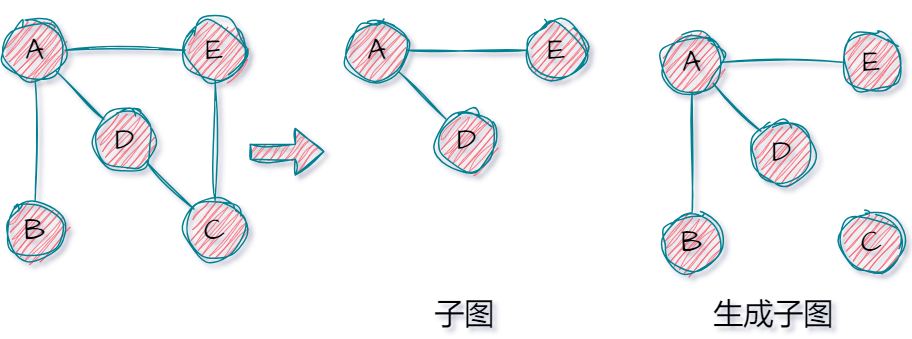
   10. 连通分量与强连通分量：
       1. 连通分量：无向图中的极大连通子图(子图必需连通，且包含尽可能多的顶点和边)称为连通分量。下图中图$G$存在3个极大连通子图(显然由图可知这不是你所理解的那种唯一的"极大连通子图")。<br>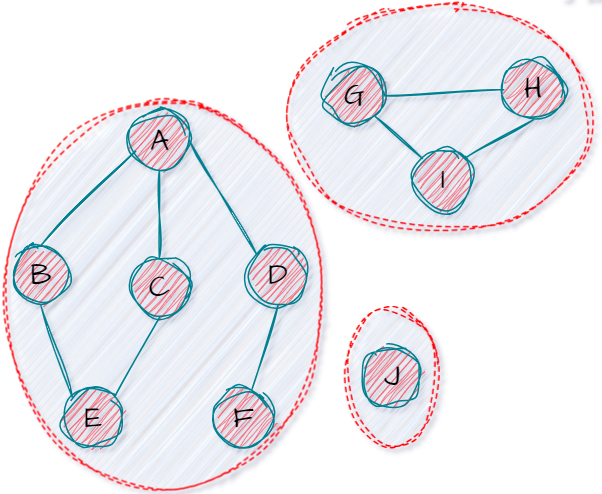
       2. 强连通分量：有向图中的极大强连通子图(子图必需强连通，且包含尽可能多的顶点和边)称为连通分量。下图中图$G$存在3个极大强连通子图(显然由图可知这不是你所理解的那种唯一的"极大强连通子图")。<br>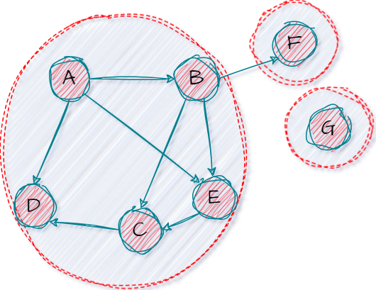


11. 生成树(<span style="color:red">只针对无向图</span>)：连通图的生成树是包含图中全部顶点的极小连通子图。若图中有$n$个顶点，则它的生成树含有$n-1$条边。对于生成树而言，多一条边会形成回路，少一条边会变成非联通图，恰好(<span style="color:red">注意生成树不唯一！！！</span>)。<br>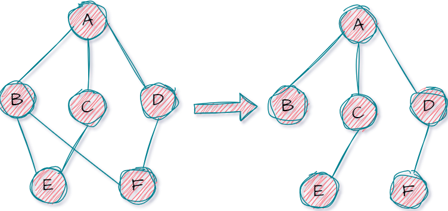
12. 生成森林(<span style="color:red">只针对无向图</span>)：在非连通图中，连通分量的生成树构成了非连通图的生成森林。
13. (<span style="color:red">重点</span>)权：
    1. 边的权：一个图中，每条边都可以标上具有某种含义的数值，该数值称为该边的权。
    2. 带权图/网：边上带有权值的图也称<span style="color:red">带权图</span>，也称<span style="color:red">网</span>。
    3. <span style="color:red">带权路径长度：网中，一条路径上所有边的权值之和称为该路径的带权路径长度。</span>
14. 稀疏图和稠密图：相对而言。
15. 树和有向树：
    1. 不存在回路且连通的无向图称为树。
    2. 一个顶点的入度为0，其余顶点的入度均为1的有向图称为有向树。
16. (<span style="color:red">重点</span>)考点：
    1. 对于含有$n$个顶点的无向图$G$​：
       1. <span style="color:red">所有顶点的度之和为$2|E|$。</span>
       2. <span style="color:red">若$G$为连通图，则至少含有$n-1$条边(树)。</span>
       3. <span style="color:red">若$|E|>n-1$,则图一定有回路，但是注意图$G$​此时不一定连通。</span>
       4. <span style="color:red">若$G$为非连通图，则最多含有${C^2_{n-1}}$条边(一个顶点游离在外，其余顶点两两连通)。</span>
       5. <span style="color:red">无向完全图共有${C^2_{n}}$条边。</span>
    2. 对于含有$n$个顶点的有向图$G$​：
       1. <span style="color:red">所有顶点的出度之和=入度之和=$|E|$。</sapn>
       2. <span style="color:red">所有顶点的度之和为$2|E|$。</span>
       3. <span style="color:red">若$G$为强连通图，则至少含有$n$​条边(形成回路)。</span>
       4. <span style="color:red">无向完全图共有$2{C^2_{n}}$​条边。</span>
17. 补充完全图：
    1. 对于无向图而言，其$|E|$的取值范围为$0$到$\frac{n(n-1)}{2}$。其中$|E|=\frac{n(n-1)}{2}$的图为无向完全图，即任意两个顶点之间都存在边。
    2. 对于有向图而言，其$|E|$的取值范围为$0$到$n(n-1)$。其中$|E|=n(n-1)$​的图为有向完全图，即任意两个顶点之间都存在方向相反的两条弧。


---


##### 图的存储

###### 邻接矩阵法

1. 存储步骤：

   1. 设置一个定点表存储顶点的一些额外信息。
   2. 设置一个邻接矩阵，其中：<span style="color:red">邻接矩阵的大小为$|V|*|V|$。
      1. 无向图中，$edge[i][j]$表示顶点表中的第$i$个顶点和第$j$个顶点是否有边$(v_i,v_j)$,有记$1$无记$0$。
      2. 有向图中，$edge[i][j]$表示顶点表中的第$i$个顶点和第$j$个顶点是否有有向边$<v_i,v_j>$,有记$1$无记$0$。
      3. 网中，$edge[i][j]$表示边$<v_i,v_j>$或$(v_i,v_j)$的权值,若没有则记作$\infty$(当然有些教材喜欢把自己指向自己记作$0$)。

2. 类型定义：

   ```cpp
   #include <iostream>
   #define MaxVexNum 100
   #define infty 65535 // 定义∞
   
   typedef char VertexType;
   typedef struct
   {
       VertexType vex[MaxVexNum]; // 顶点表
       int edge[MaxVexNum][MaxVexNum]; // 邻接矩阵
       int vertexNum, edgeNum; // 顶点数和边(弧)数
   } MGraph;
   ```

   

3. 演示图(主对角线处全填0也是可以的)：<br>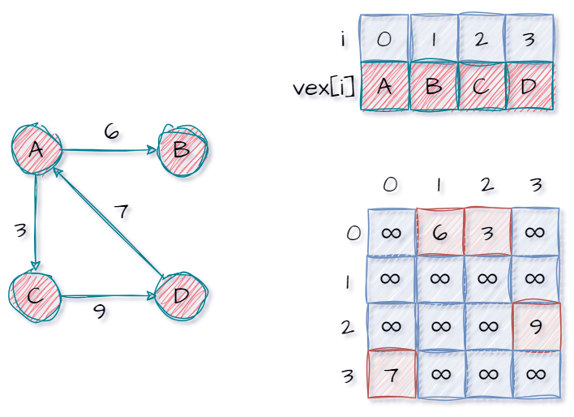

4. 基本操作的思想：

   1. 求顶点的度(<span style="color:red">时间复杂度$O(|V|)$</span>)：对于无向图找顶点$v_i$的边，只需要遍历领接矩阵的第$i$行,记录<span style="color:red">非零元素个数</span>即为度。而对于有向图，找指向顶点$v_i$的边，只需要遍历领接矩阵的第$i$列,记录<span style="color:red">非零元素个数</span>即为入度。同理遍历对应的第$i$​行可以求出度。
   2. 找与一个顶点相连的边或者弧：遍历对应的行或者列即可。

5. 注意事项：

   1. 邻接矩阵法适合存储稠密图。
   2. 空间复杂度$O(|V|^2)$​，只与顶点数有关。
   3. <span style="color:red">邻接矩阵的性质：设图$G$的邻接矩阵为$A$(矩阵元素只有$0$、$1$)，则$A^n$的元素$A^n[i][j]$表示顶点$v_i$到顶点$v_j$的长度为$n$的路径的数目。</span>(可以尝试使用线代知识算一算：略。例如$a_{12}*a_{23}=1$显然表明$v_1->v_2->v_3$可行，即$a_{12}=a_{23}=1$​​)
   4. 需要说明的是：<font color=red>对于有向图的邻接矩阵存储也可以关于主对角线对称</font>。

---


###### 邻接表法

1. (顺序+链式存储)(<span style="color:red">不唯一</span>)

2. 存储步骤：

   1. 定义一个顶点表，其中每个元素含一个顶点域用于存储信息，此外还有一个指针域指向第一个边(不唯一,因为不存在顺序可言)。
   2. 每个顶点元素指向一串(出度)边链表(表示由该顶点指出的边)。其中链表结点中存储下一条边的指针、边的权值、边或者弧指向的顶点。

3. 结构定义：

   ```cpp
   #include <iostream>
   #define MaxVexNum 100
   typedef char VertexType;
   
   typedef struct ArcNode
   {
       int adjvex;           // 邻接点域，存储边或者弧指向哪个顶点
       struct ArcNode *next; // 指向下一条边或者弧
       int weight;           // 权值
   } ArcNode;
   
   typedef struct VNode
   {
       VertexType data;      // 顶点域，存储顶点信息
       ArcNode *firstedge; // 边表头指针
   } VNode, AdjList[MaxVexNum];
   
   typedef struct
   {
       AdjList vertices;       // 邻接表
       int vexnum, arcnum; // 顶点数和边数
   } ALGraph;
   ```

   

4. 演示：<br>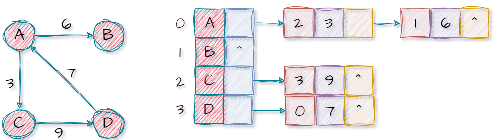

5. 基本操作的思想：

   1. 计算度：
      1. 对于无向图：显然遍历顶点后的边链表，记录的结点个数即为度。
      2. 对于有向图：入度同上，但是出度不好算(<span id="inverse_adjacency">当然也可以在单链表中存储入度边，此时出度边难找，此时称为逆邻接表</span>)(或者说出度、入度二选一)。

6. 注意事项：

   1. 适合存储稀疏图，表示不唯一。
   2. 若使用邻接表法存储无向图，删除顶点、边的复杂度较高，并且边存储两遍，数据冗余。
   3. 有向图计算出度容易，入度难。
   4. 邻接表法不方便检查任意一对顶点见是否存在边。
   5. 空间复杂度：
      1. 有向图：$O(|V|+|E|)$
      2. 无向图：$O(|V|+2|E|)$​

----


###### 十字链表法

1. 十字链表法(<span style="color:red">只存储有向图，且同邻接表法一样不唯一</span>)：由于有向图的入度难求，故而对邻接表法提出改进。

2. 存储步骤：

   1. 依旧是定义顶点表，但是顶点表中除了数据域($data$)外，还有指向入度边链表的首个顶点($firstin$)、出度边链表首个顶点($firstout$)的两个指针。

   2. 而链表结点提供如下

      1. $hlink$​指向下一个入度边(具有相同头端点的边的链表结点)
      2. $tlink$​指向下一个除度边(具有相同尾端点的边的链表结点)
      3. $tailvex$有向边的尾端顶点在顶点表中的位置索引。
      4. $headvex$​有向边的头端顶点在顶点表中的位置索引。
      5. $info$​​记录边的权值。

   3. 类型定义：

      ```cpp
      #include <iostream>
      #define MaxVexNum 100
      
      typedef char VertexType;
      typedef struct ArcNode {
          int tailvex, headvex; // 弧尾、弧头顶点的位置
          struct ArcNode *hlink, *tlink; // 分别指向弧头相同和弧尾相同的下一条弧
          int info; // 权值
      } ArcNode;
      
      typedef struct VNode {
          VertexType data; // 顶点信息
          ArcNode *firstin, *firstout; // 分别指向该顶点的第一条入弧和出弧
      } VNode;
      
      typedef struct {
          VNode xlist[MaxVexNum]; // 顶点数组
          int vexnum, arcnum; // 顶点数和弧数
      } OLGraph;
      ```

      

   4. 演示如下：<br>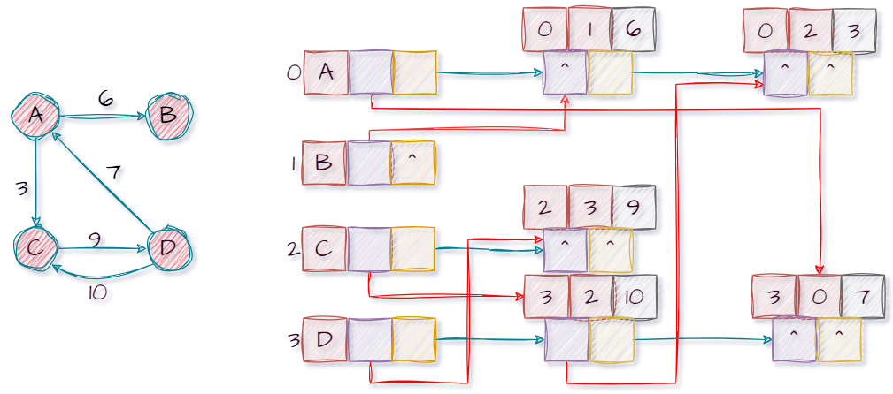

---


###### 邻接多重表

1. 邻接多重表(<span style="color:red">只存储无向图，不唯一</span>)：由于无向图的每条边在存储时都要存储多次，浪费空间，故而我们提出邻接多重表法存储无向图。
   1. 存储步骤：
      1. 顶点表中设有数据域$data$以及指向第一个边链表结点的$firstEdge$。
      2. 而链表结点设有:
         1. $ivex$、$jvex$存储边依附的顶点在顶点表中的位置索引。
         2. $ilink$(或$jlink$)指向依附于顶点$ivex$($jvex$)的边结点。不用像十字链插法纠结谁指向谁，但是$ilink$一定是和$ivex$对应的，$jlink$亦同理。
         3. $info$存储边的权值信息等。
   2. 结构定义：略
   3. 演示：<br>

---


###### 多种存储结构对比

这里的$E$和$V$其实因该是$|E|$和$|V|$，但是`obsidian`的渲染有问题所以就没写这种形式。

|            |                         邻接矩阵                         | 邻接表                                  | 十字链表   | 邻接多重表 |
| ---------- | :------------------------------------------------------: | --------------------------------------- | ---------- | ---------- |
| 空间复杂度 |                         $O(V^2)$                         | 无向图：$O(V+{2E})$    有向图：$O(V+E)$ | $O(V+E)$   | $O(V+E)$   |
| 找相邻边   | 遍历对应行或者列                      时间复杂度为$O(V)$ | 找有向图的入边必需整个遍历              | 很方便     | 很方便     |
| 删顶点或边 |       删除边很方便，但是删除顶点需要移动大量数据。       | 无向图删除顶点和边都不方便。            | 很方便     | 很方便     |
| 适用于     |                          稠密图                          | 稀疏图                                  | 只能有向图 | 只能无向图 |
| 表达方式   |                           唯一                           | 不唯一                                  | 不唯一     | 不唯一     |


----


##### 图的基本操作

1. 人还是要严于律己，不该说的少说，不该做的不做。如果放纵能让我快乐，却我遗忘自我并沉迷，那我宁可不要。我追寻的是灵魂的自由，探索存在本质的自由，而不是虚伪的快感和舒适。哪怕最后躯体破碎、身死道消，也会欣然接受吧，至少我的灵魂曾有某一刻触摸亦或感受到存在的存在。<br>

2. 常见的图的基本操作：

   ```tex
   Adjacent(G, x, y): 判断图G中是否存在顶点x到y的边，若存在则返回true，否则返回false
   Neighbours(G, x): 列出图G中与顶点x邻接的所有边
   InsertVertex(&G, x): 在图G中插入一个顶点x
   DeleteVertex(&G, x): 在图G中删除一个顶点x
   AddEdge(&G, x, y): 在图G中插入一条边(x, y)
   RemoveEdge(&G, x, y): 在图G中删除一条边(x, y)
   FirstNeighbor(G, x): 返回图G中顶点x的第一个邻接顶点
   NextNeighbor(G, x, y): 返回图G中顶点x的相对于顶点y的下一个邻接顶点
   Get_edge_value(G, x, y): 返回图G中边(x, y)的权值
   Set_edge_value(&G, x, y, v): 设置图G中边(x, y)的权值为v
   BFS 广度优先遍历
   DFS 深度优先遍历
   ```

3. `FirstNeighbor(G, x)`找图$G$中顶点$x$的第一个邻接点，不存在则返回$-1$​。

   1. 邻接矩阵法中实现：遍历顶点v的所有邻接点(遍历第$v$行)

      ```cpp
      int FirstNeighbor(MGraph G, int v)
      {
          if (v < 0 || v > G.vexnum - 1)
              return -1;
          
          for (int i = 0; i < G.vertexNum; i++)
          {
              if (G.edge[v][i] != 0 && G.edge[v][i] != infty)
                  return i;
          }
          return -1;
      }
      ```

      

   2. 邻接表法中实现：

      ```cpp
      int FirstNeighbor(ALGraph G, int v)
      {
          if (v < 0 || v > G.vexnum - 1)
              return -1;
          if (G.vertices[v].firstedge != NULL)
              return G.vertices[v].firstedge->adjvex;
          return -1;
      }
      ```

      

4. `NextNeighbor(G, x, y)`假设找图$G$中顶点$y$是顶点$x$的一个邻接点，返回除$y$之外顶点$x$的下一个邻接点的顶点号，不存在则返回$-1$​。

   1. 邻接矩阵法中实现：从$w$后面接着遍历顶点v的邻接点(遍历第$v$行中$w$后面的剩余部分)

      ```cpp
      int NextNeighbor(MGraph G, int v, int w)
      {
          if (v < 0 || v > G.vexnum - 1)
              return -1;
      
          //遍历顶点v的所有邻接点
          for (int i = w + 1; i < G.vertexNum; i++)
          {
              if (G.edge[v][i] != 0 && G.edge[v][i] != infty)
                  return i;
          }
          return -1;
      }
      ```

      

   2. 邻接表法中实现：<span style="color:red">注意这里不是王道所说的$O(1)$时间复杂的实现方式，这里主要是为后续遍历做准备。</span>

      ```cpp
      int NextNeighbor(ALGraph G, int v, int w)
      {
          if (v < 0 || v > G.vexnum - 1 || w < 0 || w > G.vexnum - 1)
              return -1;
      
          ArcNode *p = G.vertices[v].firstedge;
      
          // 找到v,w对应的边
          while (p != NULL && p->adjvex != w)
              p = p->next;
      
          //找到w的下一个邻接顶点
          if (p != NULL && p->next != NULL)
              return p->next->adjvex;
      
          return -1;
      }
      ```

      

5. 其他的实现，本质上还是遍历查找，有时间可以思考一下算法思路。但是对于邻接矩阵的删除顶点操作而言需要移动大量数据，我们提供另一种思路即逻辑删除，通过一个`bool`类型记录当前顶点是否删除。                                                                                                                                                           

----


##### 图的遍历

###### 广度优先遍历$BFS$

1. 我们先对比一下树和图的广度优先：

   1. 树的遍历中不存在回路，故而不可能搜索到已访问的顶点。但是图不同，故而需要使用一个额外数组记录顶点是否已访问。
   2. 同树的层次遍历一样，需要借助队列来实现。

2. 算法实现步骤：从图的某一结点出发，首先依次访问该结点的所有邻接结点$v_{i1}, v_{i2}, .... ,v_{in}$再按这些顶点被访问的先后次序依次访问与它们相邻接的所有未被访问的顶点重复此过程，直至所有顶点均被访问为止。

3. 具体代码实现：

   1. 定义图的存储结构：由于存储结构未定，我们暂时使用`Graph`作为图的类型。<span style="color:red">有一点需要说明一下，虽然我们前面实现过邻接表的$NextNeighbor$和$NextNeighbor$，当然也可以使用下面的代码实现遍历邻接点。但是不如直接遍历边链表来得快(访问$firstedge$，然后$while$循环即可)！！！</span>

      ```cpp
      #define MaxVexNum 100
      typedef char VertexType;
      
      // 图的存储结构定义:略
      
      int FirstNeighbor(Graph G, int v);
      int NextNeighbor(Graph G, int v, int w);
      ```

      

   2. 定义和声明队列及其方法：

      ```cpp
      #define QueueSize 100
      
      typedef struct
      {
          int data[QueueSize];
          int front;
          int rear;
      } sqQueue;
      
      // 省略具体实现
      void initQueue(sqQueue &Q); // 初始化
      bool isEmpty(sqQueue Q);   // 判空
      bool enQueue(sqQueue &Q, int x); // 入队
      bool deQueue(sqQueue &Q, int &x); // 出队
      ```

      

   3. 先基于连通图考虑$BFS$​算法：

      ```cpp
      bool visited[MaxVexNum] = {false}; 
      
      void visit(VertexType v)
      {
          printf("%c ", v);
      }
      
      void BFS(Graph G, int v)
      {
          sqQueue Q;
          initQueue(Q);
      
          visit(G.vertices[v].data);   // 访问v顶点
          visited[v] = true;  
          enQueue(Q, v);   // v顶点入队
          while (!isEmpty(Q))
          {
              deQueue(Q, v);
              //NextNeighbor找不到会返回-1
              for (int w = FirstNeighbor(G, v); w >= 0; w = NextNeighbor(G, v, w))
              {
                  if (!visited[w])
                  {
                      visit(G.vertices[w].data);
                      visited[w] = true;
                      enQueue(Q, w);
                  }
              }
          }
      }
      ```

      

   4. 考虑非连通图的最终版本$BFS$：

      ```cpp
      bool visited[MaxVexNum]; // 访问数组
      
      void visit(VertexType v)
      {
          printf("%c ", v);
      }
      
      void BFSTraverse(ALGraph G)
      {
          // 初始化visited数组为false
          for (int v = 0; v < G.vexnum; v++)
          {
              visited[v] = false;
          }
      
          // 以每一个未访问的顶点作为起始点进行BFS
          for (int v = 0; v < G.vexnum; v++)
          {
              if (!visited[v])
              {
                  BFS(G, v);
              }
          }
      }
      
      void BFS(ALGraph G, int v)
      {
          sqQueue Q;
          initQueue(Q);
      
          visit(G.vertices[v].data);
          visited[v] = true;
          enQueue(Q, v);
          while (!isEmpty(Q))
          {
              deQueue(Q, v);
      
              //NextNeighbor找不到会返回-1
              for (int w = FirstNeighbor(G, v); w >= 0; w = NextNeighbor(G, v, w))
              {
                  if (!visited[w])
                  {
                      visit(G.vertices[w].data);
                      visited[w] = true;
                      enQueue(Q, w);
                  }
              }
          }
      }
      
      ```

      

4. 演示过程：略

5. 复杂度分析:<span id="bfs"></span >

   1. 空间复杂度，队列大小$O(|V|)$，访问数组大小$O(|V|)$,另外图的存储是否需要考虑？
   2. 邻接矩阵法：访问每个顶点需要时间$O(|V|)$，对于每顶点遍历查找邻接顶点需要时间$O(|V|)$,而共有$|V|$个顶点，故而时间复杂度为$O(|V|)+O(|V|^2)=O(|V|^2)$​​​
   3. 邻接表法：访问访问每个顶点需要时间$O(|V|)$，对于所有顶点遍历查找邻接顶点需要时间$O(|E|)$,故而时间复杂度为$O(|V|)+O(|E|)=O(|V|+|E|)$。

6. 不妨思考：树的层次层次遍历和图的广度优先遍历在代码实现上有和不同？

7. 说明：

   1. 由于图的领接矩阵的表示方式唯一，故而所得广度优先遍历的序列唯一。
   2. 由于图的领接表的表示方式不唯一，故而所得广度优先遍历的序列不唯一。
   3. 对于无向图，其调用$BFS$​函数的次数是等于连通分量数。对于连通图只需调用一次。
   4. 对于有向图,若起始顶点到其他各顶点都有路径，则只需调用一次$BFS$。此外对于强连通图，也只需调用一次。其它情况，一言难尽。<br>

8. 广度优先生成树：对于连通图的广度优先遍历可以得到广度优先生成树。

9. 广度优先生成森林：对于非连通图的广度优先遍历可以得到广度优先生成森林。

---


###### 深度优先遍历$DFS$

1. 先对比树的先根遍历和图的深度优先：树的遍历中不存在回路，故而不可能搜索到已访问的顶点。但是图不同，故而需要使用一个额外数组记录顶点是否已访问。

2. 遍历步骤：

   1. 首先访问起始顶点$v$。

   2. 接着由$v$出发访问$v$的任意一个邻接且未被访问的邻接顶点$w$。
   3. 然后再访问与$w$邻接且未被访问的任意顶点$x$，不断重复……
   4. 若$w$没有邻接且未被访问的顶点时，退回到它的上一层顶点$v$
   5. 重复上述过程，直到所有顶点被访问为止。
   6. 非联通图$DFS$时，结束后若发现没有全部遍历，则在未遍历的结点中找一个首结点继续$DFS$。

3. 具体代码实现：

   1. 定义图的存储结构：由于存储结构未定，我们暂时使用`Graph`作为图的类型。

      ```cpp
      #define MaxVexNum 100
      typedef char VertexType;
      
      // 结构定义略
      
      int FirstNeighbor(Graph G, int v);
      int NextNeighbor(Graph G, int v, int w);
      ```

      

   2. 先基于连通图考虑$DFS$​​算法：

      ```cpp
      bool visited[MaxVexNum] = {false}; 
      
      void visit(int v)
      {
          printf("%d ", v);
      }
      
      void DFS(Graph G, int v)
      {
          visit(v);
          visited[v] = true; // 标记为已访问
          for (int w = FirstNeighbor(G, v); w >= 0; w = NextNeighbor(G, v, w))
          {
              if (!visited[w])
              {
                  DFS(G, w);
              }
          }
      }
      ```

      

   3. 最后给出非连通图的最终版本$DFS$​​算法：

      ```cpp
      bool visited[MaxVexNum]; // 访问数组
      
      void visit(int v)
      {
          printf("%d ", v);
      }
      
      void DFSTraverse(ALGraph G)
      {
          for (int v = 0; v < G.vexnum; v++)
          {
              visited[v] = false;
          }
      
          for (int v = 0; v < G.vexnum; v++)
          {
              if (!visited[v])
              {
                  DFS(G, v);
              }
          }
      }
      
      void DFS(ALGraph G, int v)
      {
          visit(v);
          visited[v] = true; // 标记为已访问
          for (int w = FirstNeighbor(G, v); w >= 0; w = NextNeighbor(G, v, w))
          {
              if (!visited[w])
              {
                  DFS(G, w);
              }
          }
      }
      ```

      

4. 演示过程：略

5. 复杂度分析：

   1. 空间复杂度，递归深度$O(|V|)$，访问数组大小$O(|V|)$,另外图的存储是否需要考虑？
   2. 邻接矩阵法：访问每个顶点需要时间$O(|V|)$，对于每顶点遍历查找邻接顶点需要时间$O(|V|)$,而共有$|V|$个顶点，故而时间复杂度为$O(|V|)+O(|V|^2)=O(|V|^2)$​​
   3. 邻接表法：访问访问每个顶点需要时间$O(|V|)$，对于所有顶点遍历查找邻接顶点需要时间$O(|E|)$,故而时间复杂度为$O(|V|)+O(|E|)=O(|V|+|E|)$。
   4. 对于有向图,若起始顶点到其他各顶点都有路径，则只需调用一次$BFS$。此外对于强连通图，也只需调用一次。其它情况，一言难尽。

6. 说明：

   1. 由于图的领接矩阵的表示方式唯一，故而所得广度优先遍历的序列唯一。
   2. 由于图的领接表的表示方式不唯一，故而所得广度优先遍历的序列不唯一。
   3. 对于无向图，其调用$DFS$函数的次数是等于连通分量数。对于连通图只需调用一次。

7. 深度优先生成树：对于非连通图的深度优先遍历可以得到深度优先生成树。

8. 深度优先生成森林：对于非连通图的深度优先遍历可以得到深度优先生成森林。


---


#####  最小生成树(不唯一)

1. 我们只对<span style="color:red">带权连通无向图</span>讨论最小生成树。
2. 对于一个带权连通无向图，生成树不同，每棵树的权(树中所以边上的权值之和)也可能不同，当生成树的各边权值之和最小时，我们称其为最小生成树。

---


###### $Prim$

1. $Prim$​​算法(选顶点，适合稠密图)：从某一个顶点开始构建生成树，每次将代价最小的顶点纳入到最小生成树中，直到所有的顶点都纳入最小生成树中。

2. 时间复杂度：$O(|V|^2)$

3. 演示过程：<br>

4. 算法描述：

   1. 从一个顶点开始，将该顶点加入生成树的顶点集合$U$，然后将与该顶点相连的边的权值加入$lowcost$数组，同时将该边的另一个顶点加入集合U。
   2. 从$lowcost$数组中找到$U$各中顶点的权值最小的边，将该边的另一个顶点加入集合$U$，然后更新$lowcost$数组。
   3. 重复2过程，直到所有顶点都加入集合U。

5. 算法的一些变量说明：

   1. 设计一个$lowcost$​数组，用来记录该位置结点加入最小生成树的最小代价(或者说当前最小生成树个结点到该位置的最小代价)，每次往最小生成树添加结点时更新。
   2. $adjvex[w]=v$ 在顶点集合$U$中到顶点$w$的最短边的另一端点是$v$，且这条边的权值为$lowcost[w]$​。
   3. $sum$表示最小生成树的各边权值之和。

6. 代码实现：

   1. 结构定义：

      ```cpp
      #include <iostream>
      #define MaxVexNum 100
      #define infty 65535 // 定义∞
      
      typedef char VertexType;
      typedef struct
      {
          VertexType vex[MaxVexNum];
          int edge[MaxVexNum][MaxVexNum];
          int vertexNum, edgeNum;
      } MGraph;
      ```

      

   2. 主要代码：

      ```cpp
      void MiniSpanTree_Prim(MGraph G, int startVex)
      {
          int lowcost[G.vertexNum]; // 存放到集合U的最短边的权值
          int adjvex[G.vertexNum];  // 存放到集合U的最短边的另一端点(与lowcost对应)
          int i, j, k;
          int min;      // lowcost数组中的最小值
          int minIndex; // lowcost数组中最小值的下标
          int sum = 0;  // 最小权值
      
          // 初始化lowcost和adjvex数组
          for (i = 0; i < G.vertexNum; i++)
          {
              // 初始化lowcost数组为各结点到startVex的边的权值
              lowcost[i] = G.edge[startVex][i];
      
              // 初始化都为startVex
              adjvex[i] = startVex;
          }
      
          for (i = 1; i < G.vertexNum; i++)
          {
              min = infty;  // 初始化最小权值为∞
              minIndex = 0; // 初始化最小权值的顶点为0
      
              // 找到lowcost数组中的最小值
              for (j = 0; j < G.vertexNum; j++)
              {
                  if (lowcost[j] != 0 && lowcost[j] < min)
                  {
                      min = lowcost[j];
                      minIndex = j;
                  }
              }
      
              // 输出最小生成树的边
              printf("(%c -->%c)\n", G.vex[adjvex[minIndex]], G.vex[minIndex]);
      
              // 累加最小权值
              sum += lowcost[minIndex];
      
              // 将顶点minIndex加入到集合U中
              lowcost[minIndex] = 0;
      
              // 更新lowcost和adjvex数组
              for (k = 0; k < G.vertexNum; k++)
              {
                  // 如果发现从minIndex到k的边的权值小于lowcost[k]
                  // 则更新lowcost[k]和adjvex[k]
                  if (lowcost[k] != 0 && G.edge[minIndex][k] < lowcost[k])
                  {
                      lowcost[k] = G.edge[minIndex][k];
                      adjvex[k] = minIndex;
                  }
              }
          }
      
          // 输出最小权值
          printf("sum = %d\n", sum);
      }
      ```

      

   3. 上述代码是基于邻接矩阵实现的，而邻接表法初始化$lowcost$时稍显麻烦，需要遍历$startVex$的边链表，同时将其他值设置为不可达($\infty$)(可以和上面一样，但是先初始化为$\infty$，后面在遍历边链表改回来)。

7. $Prim$会不会成环：要想成环，则环的最后一条边必然连接两个已经使用过的顶点。但是在$Prim$算法过程中，我们用$lowcost=0$记录了已使用结点，并将他们排除在外。所以不会出现成环。

   

---


###### $Kruskal$

1. $Kruskal$​算法(选边，适合稀疏图)：每次选择一条权值最小的边，使得这条边的两头连通(原本连通的就不选择)，直到所有结点都连通。

2. 时间复杂度：$O(|E|log_2|E|)$,一般采用堆排序，每次选择最小权值的边需要$O(log_2|E|)$时间，而并查集判断的时间非常小(前面提过)。

3. 演示过程：<br>

4. 注意事项：

   1. 由于$Kruskal$​算法是选边，可能会导致回路的出现，此时我们需要使用并查集来规避回路的出现。当我们将一条边的两个顶点使用并查集发现是同一个集合时，说明当前边的加入会导致回路的产生。
   2. 为了选边的效率，我们可以对边进行排序(多种排序可供选择)，就无需每次遍历所以的边找最小的。
   3. 此外我们也可以参考并查集知识，对并查集部分进行优化。

5. 代码实现：

   1. 结构定义：

      ```cpp
      #include <iostream>
      #define MaxVexNum 100
      #define infty 65535 // 定义∞
      
      typedef char VertexType;
      typedef struct
      {
          VertexType vex[MaxVexNum];
          int edge[MaxVexNum][MaxVexNum];
          int vertexNum, edgeNum;
      } MGraph;
      ```

      

   2. 主要代码：之所以循环边的个数次，是为了找齐所有顶点。

      ```cpp
      int Find(int *parent, int f)
      {
          while (parent[f] >= 0)
              f = parent[f];
          return f;
      }
      
      int Kruskal(MGraph G)
      {
          int i, j, k;
          int n, m; // n, m分别表示当前最小边的两个顶点
      
          int parent[G.vertexNum]; // 并查集数组
      
          for (i = 0; i < G.vertexNum; i++)
              parent[i] = -1;
      	
          // 循环边的个数次
          for (i = 0; i < G.edgeNum; i++) 
          {
              int min = infty;
              // 遍历所有边，找一个最小边
              for (j = 0; j < G.vertexNum; j++)
              {
                  for (k = 0; k < G.vertexNum; k++)
                  {
                      if (G.edge[j][k] < min)
                      {
                          min = G.edge[j][k];
                          n = j;
                          m = k;
                      }
                  }
              }
              int sn = Find(parent, n);
              int sm = Find(parent, m);
              if (sn != sm)
              {
                  parent[sn] = sm; // 合并
                  printf("(%d, %d) %d\n", n, m, G.edge[n][m]);
              }
      
              // 将该边的权值设为∞，表示已经访问过
              G.edge[n][m] = G.edge[m][n] = infty;
          }
          return 0;
      }
      ```

      

   3. 但是实际上上述代码并不完美：为了更好对边进行排序，我们定义一个边的数据类型。此外我们这里采用冒泡排序，当前也可以采用后续所学的其他排序方式。<span style="color:red">此外需要说明的是，结构体能直接赋值，但是直接赋值方式只适用于简单的结构体，如果结构体中包含了指针或动态分配的内存，那么可能自行操作</span>。还有就是涉及到之前存储网时的规定问题，我们当初说过自己指向自己的还可以记作$\infty$，那么下面判断的条件就要对应变化。

      ```cpp
      typedef struct
      {
          int begin, end;
          int weight;
      } Edge;
      ```

      ```cpp
      // 并查集的查
      int find(int *parent, int f)
      {
          while (parent[f] >= 0)
              f = parent[f];
          return f;
      }
      // 冒泡排序
      void SortEdge(Edge *edge, int edgeNum)
      {
          for (int i = 0; i < edgeNum - 1; i++)
          {
              for (int j = 0; j < edgeNum - i - 1; j++)
              {
                  if (edge[j].weight > edge[j + 1].weight)
                  {
                      // 交换edge[j],edge[j + 1]的数据
                      Edge temp = edge[j];
                      edge[j] = edge[j + 1];
                      edge[j + 1] = temp;
                  }
              }
          }
      }
      
      void Kruskal(MGraph G)
      {
          Edge edge[G.edgeNum]; // 存储边的数组
          int parent[G.vertexNum];
          int edgeNum = 0;
      
          // 将图的边存储到边数组中
          for (int i = 0; i < G.vertexNum; i++)
          {
              for (int j = 0; j < G.vertexNum; j++)
              {
                  //显然,自己指向自己还是记作∞方便
                  if (G.edge[i][j] != infty)
                  {
                      edge[edgeNum].begin = i;
                      edge[edgeNum].end = j;
                      edge[edgeNum].weight = G.edge[i][j];
                      edgeNum++;
                  }
              }
          }
      
          // 对边数组按权值从小到大排序
          SortEdge(edge, edgeNum);
      
          // 初始化并查集的parent数组
          for (int i = 0; i < G.vertexNum; i++)
              parent[i] = -1;
      
          // Kruskal算法(遍历edgeNum次)
          for (int i = 0; i < edgeNum; i++)
          {
              int n = Find(parent, edge[i].begin);
              int m = Find(parent, edge[i].end);
              if (n != m)
              {
                  parent[n] = m;
                  printf("(%d, %d),权值为:%d\n", edge[i].begin, edge[i].end, edge[i].weight);
              }
          }
      }
      ```

      


---


##### 最短路径

1. 单源最短路径通俗讲就是从某固定源点出发的最短路径。
2. 多源最短路径通俗讲就是求每对顶点间的最短路径。

---


###### $BFS$算法(单源、无权图)

1. $BFS$算法只能解决单源、无权图的最短路径问题。

2. 当然你也可以认为$BFS$是解决各边权值相同的问题的，由于各个边的权值相同，要想达到各顶点路径最短，其实就是经过的边最短即可。而$BFS$算法本质上就是通过其实顶点找所有与之邻接的结点，这些结点最短路径显然为1，然后再借助这些路径访问更多的结点，这些新访问的结点的最短路径显然为2，依次类推。<span style="color:red">它保证每个路径的中转结点尽可能的少，从而路径最短。</span>

3. 具体代码实现：

   1. 类型定义：由于存储结构未定，我们暂时使用`Graph`作为图的类型。

      ```cpp
      #include <iostream>
      #define MaxVexNum 100
      #define infty 65535 // 定义∞
      
      // 图的存储结构定义:略
      
      int FirstNeighbor(Graph G, int v);
      int NextNeighbor(Graph G, int v, int w);
      ```

      

   2. 定义队列：

      ```cpp
      #define QueueSize 100
      typedef struct
      {
          int data[QueueSize];
          int front;
          int rear;
      } sqQueue;
      
      // 省略具体实现
      void initQueue(sqQueue &Q); // 初始化
      bool isEmpty(sqQueue Q);   // 判空
      bool enQueue(sqQueue &Q, int x); // 入队
      bool deQueue(sqQueue &Q, int &x); // 出队
      ```

      

   3. 关键实现：我们不考虑非连通，没有意义，反正也访问不到。

      ```cpp
      int dist[MaxVexNum]; // 存放最短路径长度
      int path[MaxVexNum]; // 存放最短路径的前驱
      bool visited[MaxVexNum]; // 访问标志数组
      
      void BFS_MIN_Distance(Graph G, int u)
      {
          sqQueue Q;
          initQueue(Q);
      
          for (int i = 0; i < G.vertexNum; i++)
          {
              dist[i] = infty; // 初始化距离
              path[i] = -1;   // 初始化最短路径前驱为-1
              visited[i] = false; 
          }
      
          // 起始点到自己的距离为0
          dist[u] = 0; 
          visited[u] = true; 
          enQueue(Q, u);
      
          while (!isEmpty(Q))
          {
              deQueue(Q, u);
              // 遍历u的所有邻接点,更新距离和路径
              for (int w = FirstNeighbor(G, u); w >= 0; w = NextNeighbor(G, u, w))
              {
                  if (!visited[w])
                  {
                      dist[w] = dist[u] + 1; 
                      // 设置前驱为u
                      path[w] = u; 
                      visited[w] = true; 
                      enQueue(Q, w); 
                  }
              }
          }
      }
      
      ```

      

4. 变量说明：

   1. $dist$存放最短路径长度。
   2. $path$存放最短路径的前驱中转结点，即从哪个顶点过来的。
   3. $visited$标记顶点是否访问过。

5. 时间复杂度：参考广度优先遍历：<a href="#bfs">快速跳转</a>

   1. 邻接矩阵法：访问每个顶点需要时间$O(|V|)$，对于每顶点遍历查找邻接顶点需要时间$O(|V|)$,而共有$|V|$个顶点，故而时间复杂度为$O(|V|)+O(|V|^2)=O(|V|^2)$​​​

   2. 邻接表法：访问访问每个顶点需要时间$O(|V|)$，对于所有顶点遍历查找邻接顶点需要时间$O(|E|)$,故而时间复杂度为$O(|V|)+O(|E|)=O(|V|+|E|)$。

6. 那么最后就是$path$数组的使用问题了：我们给出如下的$path$、$dist$数组(起始顶点是$2$)，那如果我们要求$2->7$，显然由$dist[7]=2$可知最短路径长为$2$。由$path[7]=6$可知$2->6->7$。由$path[6]=2$(或者加上$path[2]=-1$)可知$2->6->7$就是最终求的最短路径。

   |           | 1    | 2                                 | 3    | 4    | 5    | 6                                | 7                                | 8        |
   | --------- | ---- | --------------------------------- | ---- | ---- | ---- | -------------------------------- | -------------------------------- | -------- |
   | $dist[ ]$ | 1    | 0                                 | 3    | 3    | 2    | 1                                | 2                                | $\infty$ |
   | $path[ ]$ | 2    | <span style="color:red">-1</span> | 6    | 3    | 1    | <span style="color:red">2</span> | <span style="color:red">6</span> | -1       |

   

---

###### Dijkstra算法(单源，无权图或者带权图)

1. 首先说明$Dijkstra$算法不适合带负权边的带权图，如下图可以试着使用该算法计算$A$到各顶点的最短路径。<br>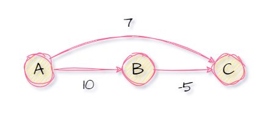

2. $Dijkstra$是一个很灵性的算法，贴进现实。例如现实中你想认识某个大人物，你没法直接认识他(人家不鸟你)，那么你就得通过其他人介绍对吧，但是你得请中间人吃饭或者花钱对吧，那显然作为一个节俭的人，肯定是找一个花钱最少的中间人。然后重复如此，认识许许多多的大人物！<span style="color:red">(重点)所以$Dijkstra$本人应该也是一位和我一样善于观察的哲学大师，哈哈！</span><br>

3. 算法思路：这里由于需要考虑无向图的边和有向图的弧的表示，干脆直接使用$->$表示。

   1. 初始化：先找出从源点$v_0$到各终点$v_k$的直达路径$v_0->v_k$ ，即通过一条弧到达的路径。
   2. 选择：从这些路径中找出一条长度最短的路径$v_0->u$。
   3. 更新：然后对其余各条路径进行适当调整。若在图中存在弧$v_0->u$，且$(v_0->u)+(u->v_k)<(v_0->v_k)$则以路径$v_0->u->u_k$代替$v_0->v_k$。
   4. 重复：在调整后的各条路径中，再找长度最短的路径, 依此类推。

4. 具体代码实现：

   1. 结构定义：由于存储结构未定，我们暂时使用`Graph`作为图的类型。

      ```cpp
      #include <iostream>
      #define MaxVexNum 100
      #define infty 65535 
      
      typedef char VertexType;
      typedef struct
      {
          VertexType vex[MaxVexNum];
          int edge[MaxVexNum][MaxVexNum];
          int vertexNum, edgeNum;
      } Graph;
      ```

      

   2. 关键代码：

      ```cpp
      bool final[MaxVexNum]; // 最短路径是否已经求出
      int dist[MaxVexNum];   // 存放最短路径长度
      int path[MaxVexNum];   // 存放最短路径的路径
      
      void dijkstra(Graph G, int u)
      {
          int i, j, k;
      
          // 初始化各数组
          for (i = 0; i < G.vertexNum; i++)
          {
              final[i] = false;
              // 初始化dist数组为u到各顶点的距离
              dist[i] = G.edge[u][i];
              path[i] = -1;
          }
      
          final[u] = true;
          dist[u] = 0;
      
          // 遍例G.vertexNum-1次，每次找出一个顶点的最短路径
          for (i = 1; i < G.vertexNum; i++)
          {
              int min = infty;
              // 找一个最短路径
              for (j = 0; j < G.vertexNum; j++)
              {
                  if (!final[j] && dist[j] < min)
                  {
                      min = dist[j];
                      k = j;
                  }
              }
      
              // 标记找到的最短路径
              final[k] = true;
      
              // 更新(未求的)最短路径
              for (j = 0; j < G.vertexNum; j++)
              {
                  // 防止溢出
                  int temp = (G.edge[k][j] == infty ? infty : (min + G.edge[k][j])); 
      
                  if (!final[j] && (temp < dist[j]))
                  {
                      dist[j] = min + G.edge[k][j];
                      path[j] = k;
                  }
              }
          }
      }
      ```

      

   3. 使用邻接表法表示时，初始化时略显复杂。

5. 变量说明：其实本质上与$BFS$的含义差不多。

   1. $final$标记相应顶点是否已经得出最短路径。
   2. $dist$记录最短路径长度。
   3. $path$​​​记录路径前驱(当然也存在所谓的后继形式，我们不予考虑)。

6. 时间复杂度：$O(|V|^2)$，每找一个顶点都需要遍历找一个最小的路径加入。

7. 那么最后就是$path$数组的使用问题了：参考$BFS$算法求最短路径。


---

###### Floyd算法(多源，无权图或者带权图)

1. 首先说明$Floyd$算法不适合带负权边的有环带权图。如下图，绕一圈最短路径就减小一点。<br>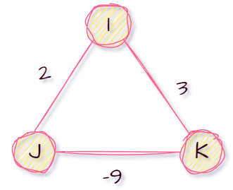

2. $Floyd$​算法利用动态规划思想，将问题的求解分为多个阶段，每个阶段添加一个中转点

3. 仔细品味$Floyd$算法，是不是就是对各个顶点执行$Dijkstra$(但是不完全是，$Floyd$解决了负权边问题)。如果$Dijkstra$描写的是人的选择，那$Floyd$何尝不是体现社会风气。好吧，爷有病。

4. 具体代码实现：

   1. 存储结构定义：

      ```cpp
      #include <iostream>
      #define MaxVexNum 100
      #define infty 65535 // 定义∞
      
      typedef char VertexType;
      typedef struct
      {
          VertexType vex[MaxVexNum];
          int edge[MaxVexNum][MaxVexNum];
          int vertexNum, edgeNum;
      } Graph;
      ```

      

   2. 关键代码实现：关于存前驱还是后继，只是后面遍历的方式不同而已

      ```cpp
      int dist[MaxVexNum][MaxVexNum]; // 保存最短路径长度
      int path[MaxVexNum][MaxVexNum]; // 保存最短路径的前驱或者后继
      
      void Floyd(Graph G)
      {
          int i, j, k;
      
          // 没有同王道书上一样全部初始化为-1(便于后续输出路径,dddd)
          for (i = 0; i < G.vertexNum; i++)
          {
              for (j = 0; j < G.vertexNum; j++)
              {
                  dist[i][j] = G.edge[i][j];
                  if (i != j && dist[i][j] < infty)
                      // 存储j的前驱
                      path[i][j] = i; 
                  // path[i][j] = j;存储i的后继
                  else
                      path[i][j] = -1; 
              }
          }
      
          // 以k为中间点，对所有顶点对i->j进行检测
          for (k = 0; k < G.vertexNum; k++)
          {
              for (i = 0; i < G.vertexNum; i++)
              {
                  for (j = 0; j < G.vertexNum; j++)
                  {
                      // 三元运算符太长,不好看
                      int temp;
                      if (dist[i][k] == infty || dist[k][j] == infty)
                          temp = infty;
                      else
                          temp = dist[i][k] + dist[k][j];
      
                      if (dist[i][j] > temp)
                      {
                          dist[i][j] = temp;
                          path[i][j] = path[k][j]; // j的前驱
                          // path[i][j] = path[i][k]; // i的后继
                      }
                  }
              }
          }
      }
      ```

      

   3. 使用邻接表法表示时，初始化时略显复杂。

5. 变量说明：

   1. $dist$存放最短路径长度的矩阵。
   2. $path$存放最短路径前驱的矩阵。

6. 我们不妨考虑一下为什么$Floyd$能解决负权边问题，而$Dijkstra$不能？其实通过代码我们大致能猜到，$Dijkstra$在得到某两个点的最短路径后，就不在更新(其认为再添加多余中转点只会使得路径变大)，但是由于负权边的出现，经历更多的中间点是可能反而使得最短路径变小的，故而无法解决负权边的问题。而$Floyd$​短小精悍，与时俱进。

7. 我们不妨具体研究一下$Floyd$是如何工作的：

   1. 我们不妨直接开启上帝模式，我说一定有这样一条最短路径$v->y->x->w$存在。那么我们可以知道哪些东西呢，显然由反证法我们知道：<span style="color:red">$v->y$、$y->x$、$x->w$(这三个初始化时就有)</span>、$y->x->w$(以$x$为中转点时找到)、$v->y->x$(以$y$为中转点时找到)均为最短路径。
   2. 初始时我们认为$v->w$为最小。后面我们通过$x$为中转点，又可能发现$v->x->w$为最小。
   3. 然而实际上这可能仍不是真正的最小路径(假设你不知道真正的最小路径)，甚至可能你看到的都是不全的路径(可能当前的路径完整是$v->h->f->x->w$)，<span style="color:red">因为在此之前或者之后我们一直在尝试缩短$v->x$、$x->v$乃至换掉$x$​这个中转点(与时俱进的关键)。</span>
   4. 最后使用$y$作为中转点时，发现$v->y->x$，于是上述的$v->x->w$就会随着$v->y->$的出现变为$v->y->x->w$。
   5. 到这里我不禁想有没有可能开始没有找到$v->x$导致我们将$x$换掉，后面找到一个很小的$v->y->x$我们咋换回来呢？首先我们知道此时早已经找到$y->x->w$、$v->y$为最短路径，显然我们使用$y$去作为中转点时，会得到$v->y->x->w$(上帝视角的我们看来，$y$一定会被采纳)。

8. 显然上述分析的$nb$之处在于作者$nb$的使用了上帝视角。但是计算机没有这玩意，他是如何知道这些的呢？显然它不知道。但是通过上述分析过程不难看出$Floyd$算法首先会找到所以无需中转点的最短路径(形如$a->b$)(当然它不知道是哪些)，接着又会找到借助某个中转点的最短路径(形如$a->b->c$)(当然程序仍然不知道它找到了)，依次递推($Dijkstra$也可以采用这种理解思路)。虽然计算机不知道这些最短路径，但是这些最短路径会在此后无数次的筛选中保留下来，成为我们的最后结果。需要强调说明的是该算法并不是先找到所有只需一个中转点的最短路径然后再找需要两个中转点的路径，而是混合找的(稍微熟悉该算法，其实应该不难理解)，当然我们不妨再模拟一下：

   1. 我们假设先最先通过$v_0$作为中转点，找到了只需以$v_0$作为中转点的最短路径。

   2. 此后我们使用$v_1$作为中转点，此时我们除了找到只需以$v_1$作为中转点的最短路径。我们实际上还找到需要$v_0->v_1$或者$v_1->v_0$两个中转点的最短路径。

   3. 依次类推。

9. <span style="color:red">查找$path$、$dist$​时按照行找，只在某一行进行！！！。</span>

10. 复杂度：

    1. 时间复杂度：$O(|V|^3)$
    2. 空间复杂度：$(O(|V|^2))$


---


#####  有向无环图描述表达式(表示不唯一)

1. 首先我们提出一点表达式可以使用二叉树存储(其构建过程：可以尝试通过遍历后缀表达式建立)，叶子结点存储操作数，非叶子结点存储运算符。其三序遍历分别对于表达式的前缀、中缀、后缀表达式，如$((a+b)*(b*(c+d))+(c+d)*e)*((c+d)*e)$:<br>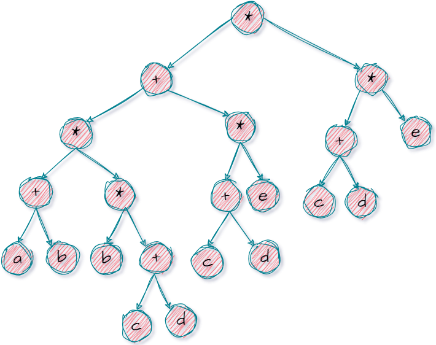
2. 显然上述表达式中有一些相同的子表达式，而在二叉树中它们也重复出现，浪费存储空间，故而我们可以通过有向无环图进行存储：<br>
3. 下面演示一下如何构建表达式的有向无环图：
   1. 把各个操作数不重复的排成一排。<br>
   2. 标出各个运算符的生效顺序(不唯一)。$((a+b)*(b*(c+d))+(c+d)*e)*((c+d)*e)$排序如下：$((a①b)④(b③(c②d))⑦(c⑤d)⑥e)⑩((c⑧d)⑨e)$。
   3. 按照顺序加入运算符，注意分层(指向某个运算符，当前运算符就标在其上一层)(这么做主要是因为二者不会合并，我们把可能合并的放在同一层)。<br><br><br><br><br>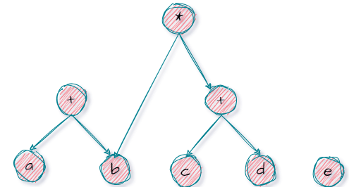<br><br><br><br>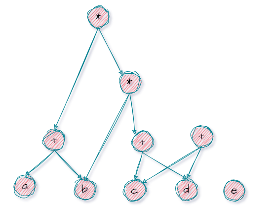<br><br><br><br>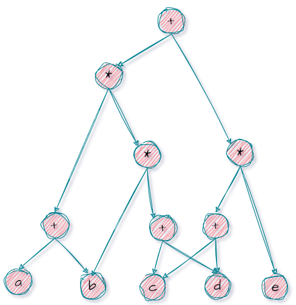<br><br><br><br><br><br>
   4. 从下到上逐层检查同层运算符是否可以合并。<br>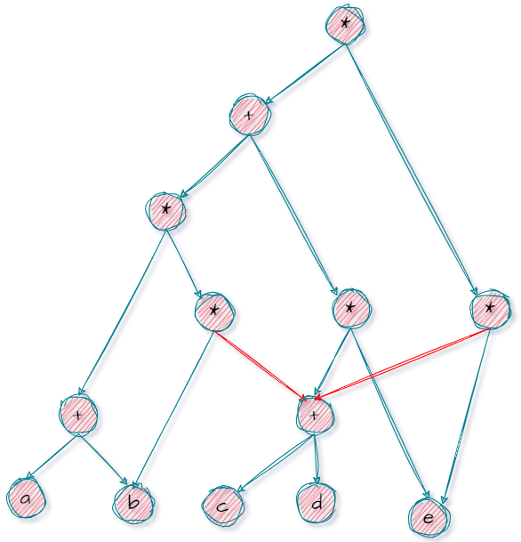<br><br>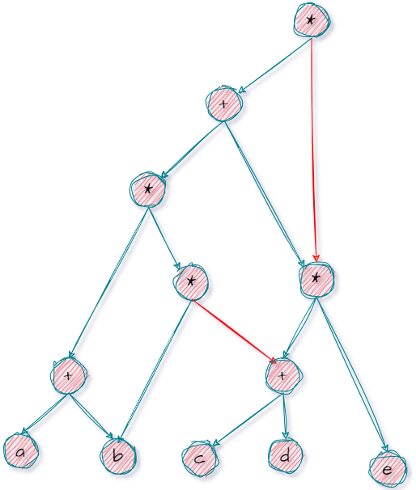<br><br>


---


##### 拓扑排序

###### (逆)拓扑排序

1. 有向无环图具有拓扑序列。下面是王道书的一段补充：<span style="color:red">如果一个有向图的邻接矩阵是上三角矩阵，那么所有的边都从编号小的顶点指向编号大的顶点。同理，如果邻接矩阵是下三角矩阵，那么所有的边都从编号大的顶点指向编号小的顶点。在这两种情况下，图中不可能存在环，因此这个图一定是有向无环图(DAG)，并且一定存在拓扑序列。</span><br>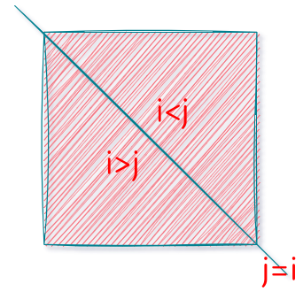

2. $AOV$网：用一个有向无环图表示一个工程的各子工程及其相瓦制约的关系,其中以<span style="color:red">顶点表示活动,弧表示活动之间的低先制约关系</span>，称这种有向图为顶点表示活动的网，简称$AOV$​网(Activity On Vertex network)。

   1. 若从$i$到$j$有一条有向路径，则$i$是$j$的前驱，$j$是$i$的后继。
   2. 若$<i,j>$是网中有向边，则$i$是$j$的直接前驱(时间$i$的执行要在时间$j$之前)，$j$是$i$的直接后继。
   3. $AOV$网中不允许有回路，因为如果有回路存在，则表明某项活动以自己为先决条件，显然这是荒谬的。

3. 拓扑排序：在$AOV$网没有回路的前提下，我们将全部活动排列成一个线性序列，使得若$AOV$ 网中有弧$<i,j>$存在，则在这个序列中，$i$一定排在$j$的前面，具有这种性质的线性序列称为拓扑有序序列，相应的拓扑有序排序的算法称为拓扑排序($AOV$网的拓扑序列不唯一)。

4. 拓扑排序思路：

   1. 在有向图中选一个没有前驱(入度为$0$)的顶点且输出之(这一步可能有很多个，但是我们随便选一个，故而不唯一且不存在顺序问题)。
   2. 从图中删除该顶点和所有以它为起点的弧(对它而言是出度边)。
   3. 重复上述两步，直至全部顶点均已输出或者<span style="color:red">当图中不存在无前驱的顶点为止(说明图中存在回路)</span>。<br>

5. 拓扑排序的具体代码实现：

   1. 栈的定义：实际上由于没有顺序要求，这里也可以使用队列、数组，都是ok的。

      ```cpp
      #define MaxSize 100
      typedef struct Stack
      {
          int data[MaxSize];
          int top; 
      } Stack;
      
      //省略具体实现
      void InitStack(Stack &S);       
      bool isEmpty(Stack S);          
      bool Push(Stack &S, int x);  
      bool Pop(Stack &S, int x);   
      bool GetTop(Stack S, int x); 
      ```

      

   2. 图的结构定义：

      ```cpp
      #include <iostream>
      #define MaxVexNum 100
      
      typedef char VertexType;
      typedef struct
      {
          VertexType vex[MaxVexNum];
          int edge[MaxVexNum][MaxVexNum];
          int vertexNum, edgeNum;
      } Graph;
      ```

      

   3. 关键代码：

      ```cpp
      int indegree[MaxVexNum]; // 顶点的入度
      int print[MaxVexNum];    // 存放拓扑排序的结果
      
      bool TopologicalSort(Graph G)
      {
          Stack S;
          InitStack(S);
      
          // initIndegree(Graph G)
      
          int i, j, k = 0;
      
          // 查找入度为0的顶点
          for (i = 0; i < G.vertexNum; i++)
          {
              if (indegree[i] == 0)
              {
                  Push(S, i);
              }
          }
      
          while (!isEmpty(S))
          {
              Pop(S, i);
              print[k++] = i; // 记录排序结果
      
              // 刷新其他顶点的入度(邻接表法就遍历边链表即可)
              for (j = 0; j < G.vertexNum; j++)
              {
                  if (G.edge[i][j] != infty)
                  {
                      indegree[j]--;
                      if (indegree[j] == 0)
                      {
                          Push(S, j);
                      }
                  }
              }
          }
          if (k < G.vertexNum)
          {
      
              return false; // 有回路
          }
          else
          {
              return true;
          }
          // return !(count < G.vexnum)
      }
      ```

      

   4. 补充说明：

      1. 上述代码其实缺少对$indegree$数组的初始化，我们现在给出如下代码。实际上我们知道$AOV$是一个有向图，但如果假设下面代码执行的对象是一个无向图，还会有效吗？是否会由于无向图的边存储两遍导致出错呢？显然不会，因为我们执行的是$indegree[j]++$,只对当前认为的逻辑上的($i->j$)后端点进行入度加一。除非我们再添加一步$indegree[i]++$，当然有些操作可能是会需要这一步的。

         ```cpp
         void initIndegree(Graph G){
             for (int i = 0; i < G.vertexNum; i++)
             {
                 indegree[i] = 0;
             }
         
             for (int i = 0; i < G.vertexNum; i++)
             {
                 for (int j = 0; j < G.vertexNum; j++)
                 {
                     if (G.edge[i][j] != infty)
                     {
                         indegree[j]++;
                     }
                 }
             }
         }
         ```

         

      2. 若上述使用邻接表法表示图，那么在刷新$indegree$时遍历对应的变链表即可。

6. 复杂度分析：

   1. 对于邻接矩阵法：每个顶点访问后，都会查找邻接点，显然时间复杂度为$O(|V|^2)$。
   2. 对于邻接表法：每个顶点访问后，都会查找邻接点(遍历边链表)，显然时间复杂度为$O(|V|+|E|)$。

7. 逆拓扑排序：

   1. 在有向图中选一个没有后继(出度为$0$)的顶点且输出之。
   2. 从图中删除该顶点和所有以它为终点的弧(对它而言是入度边)。
   3. 重复上述两步，直至全部顶点均已输出或者<span style="color:red">当图中不存在无后继的顶点为止(说明图中存在回路)</span>。

8. 逆拓扑排序的具体代码实现：

   1. 栈的定义：实际上由于没有顺序要求，这里同样也可以使用队列、数组。

      ```cpp
      #define MaxSize 100
      typedef struct Stack
      {
          int data[MaxSize];
          int top; 
      } Stack;
      
      //省略具体实现
      void InitStack(Stack &S);       
      bool isEmpty(Stack S);          
      bool Push(Stack &S, int x);  
      bool Pop(Stack &S, int x);   
      bool GetTop(Stack S, int x); 
      ```

      

   2. 图的结构定义：

      ```cpp
      #include <iostream>
      #define MaxVexNum 100
      
      typedef char VertexType;
      typedef struct
      {
          VertexType vex[MaxVexNum];
          int edge[MaxVexNum][MaxVexNum];
          int vertexNum, edgeNum;
      } Graph;
      ```

      

   3. 关键代码：

      ```cpp
      void initOutDegree(Graph G)
      {
          for (int i = 0; i < G.vertexNum; i++)
          {
              outDegree[i] = 0;
          }
      
          for (int i = 0; i < G.vertexNum; i++)
          {
              for (int j = 0; j < G.vertexNum; j++)
              {
                  if (G.edge[i][j] != infty)
                  {
                      // 出度
                      outDegree[i]++;
                  }
              }
          }
      }
      ```

      ```cpp
      int outDegree[MaxVexNum]; // 保存每个顶点的出度
      int path[MaxVexNum];      // 保存逆拓扑排序的结果
      
      bool TopologicalSort(Graph G)
      {
          Stack S;
          InitStack(S);
      
          initOutDegree(G);
      
          int i, j, k = 0;
      
          for (i = 0; i < G.vertexNum; i++)
          {
              if (outDegree[i] == 0)
              {
                  Push(S, i);
              }
          }
      
          while (!isEmpty(S))
          {
              Pop(S, j);
              path[k++] = j;
      
              for (i = 0; i < G.vertexNum; i++)
              {
                  // 注意不是outDegree[j]--(因该是出度减1)
                  if (G.edge[i][j] != infty)
                  {
                      outDegree[i]--;
                      if (outDegree[i] == 0)
                      {
                          Push(S, i);
                      }
                  }
              }
          }
          return !(k < G.vertexNum);
      }
      ```

      

   4. 关键是有一点需要说明：那就是使用邻接表法时，实现逆拓扑排序可能不太方便，因为需要找顶点的入度边删掉。但是实际上我们知道邻接表法实现这个过程是需要全部遍历的。对此我们不难想到之前提过一嘴的逆邻接表法(<a href="#inverse_adjacency">跳转</a>)，即边链表存储入度边，这样找入度容易，找出度难。

9. 使用$DFS$​算法实现拓扑排序和逆拓扑排序：

   1. 首先我们不妨思考为什么深度优先遍历算法$DFS$能够实现的逆拓扑排序？$dfs$实际上干了一件事就是当它访问到某个结点$u$它会将$u$的子结点依次进行深度优先遍历，如果我们将遍历结点过程视作完成该结点的任务的话，显然当回溯到$u$时，$u$的所有后置任务已经完成，显然按照逆拓扑排序的定义，此时$u$可以输出。

   2. (当前阶段不深究)那么我们继续思考另外一个问题，就是如何解决环路问题。对此我们可以定义一个$color$数组，$color[i]=0$表示未被遍历，$color[i]=1$表示真在被遍历，$color[i]=2$​表示已经遍历(第一次访问记$1$，第二次回溯回来记$2$，遇到$1$说明有圈绕回来了)，好了就提到这。

   3. $DFS$​​实现逆拓扑排序：

      1. 图结构定义：

         ```cpp
         #include <iostream>
         #define MaxVexNum 100
         #define infty 65535 
         
         // 图结构定义略
         
         int FirstNeighbor(Graph G, int v);
         int NextNeighbor(Graph G, int v, int w);
         ```

         

      2. 关键代码：

         ```cpp
         bool visited[MaxVexNum]; // 访问标志数组
         int print[MaxVexNum]; // 存储逆拓扑排序的结果
         
         void DFS(Graph G, int v, int &count)
         {
             visited[v] = true;
             for (int w = FirstNeighbor(G, v); w >= 0; w = NextNeighbor(G, v, w))
             {
                 if (!visited[w])
                 {
                     DFS(G, w, count);
                 }
             }
             // 遍历完所有后继子孙后，将该节点加入逆拓扑排序结果中
             print[count++] = v;
         }
         
         void TopologicalSort(Graph G)
         {
             int count = 0;
             for (int i = 0; i < G.vertexNum; i++)
             {
                 visited[i] = false;
             }
             for (int i = 0; i < G.vertexNum; i++)
             {
                 if (!visited[i])
                 {
                     DFS(G, i, count);
                 }
             }
         }
         ```

         

   4. $dfs$实现拓扑排序：我们是否还能采用上述思路？假设对于一个初始遍历顶点$u$，<span style="color:red">我们显然可以知道$u$的所有子孙顶点必需出现在$u$后</span>，但是有一个最根本的问题：我们无法确定当前的$u$是否可以执行，就算$u$可以执行，我们也无法保证其子孙结点可以紧随其后，故而我们无法完全照搬上述代码思路。但是我们不妨分析一下，对于当前$u$为根结点的深度优先生成树(姑且这么叫)而言，其中某个结点的前置条件会在哪儿？只有两种可能，要么在当前深度优先生成树中，要么还没被遍历对吧。那如果我们将当前子树的所有任务放到最后执行<span style="color:red">(可行性：剩余部分一定不会有以当前深度优先生成树的某个结点为前提的)</span>，那么显然一箭双雕(还没遍历的前置任务部分会先执行，故而不存在卡脖子。而当前树中根据深度优先遍历，前置任务肯定会先执行)，故当前任务必可以执行。

   5. 那么现在我们再去理解王道所给的算法，为每一个结点设置一个任务结束时间$time$(个人更倾向于使用$order$优先级去理解，越大越优先)，我们只需要让所有的父结点的$time$大于子结点即可。<span style="color:red">后续按照$time$的从大到小排序就可以找到拓扑排序的结果。</span>

      ```cpp
      bool visited[MaxVexNum]; // 访问标志数组
      int finish[MaxVexNum]; // 完成时间数组
      
      void DFS(Graph G, int v, int &time)
      {
          visited[v] = true;
          for (int w = FirstNeighbor(G, v); w >= 0; w = NextNeighbor(G, v, w))
          {
              if (!visited[w])
              {
                  DFS(G, w, time);
              }
          }
          finish[v] = time++; // 设置完成时间
      }
      
      void TopologicalSort(Graph G)
      {
          int time = 0;
          for (int i = 0; i < G.vertexNum; i++)
          {
              visited[i] = false;
          }
          for (int i = 0; i < G.vertexNum; i++)
          {
              if (!visited[i])
              {
                  DFS(G, i, time);
              }
          }
      }
      ```

      

10. 参考$DFS$实现逆拓扑排序的思路，我们不难知道显然$BFS$也是可行的。其实在$DFS$之前，我们给出的实现方式就是基于$BFS$形式的，只不过由于没有严格的先后顺序，故而就没有严格使用队列存储。

11. 为了方便后续的求解关键路径的代码编写，我们需要说明一点，那就是一个拓扑排序反过来就可以作为逆拓扑排序序列(反之也成立)。我们不妨分析一下下面的过程：我们知道在拓扑排序中，当$g$完成后，显然就可以完成$h、j$。而在逆拓扑排序中，完成$h、j$就可以完成$g$。显然更复杂的情况也适用。<br>

---


###### 关键路径(应用)

1. $AOE$网：用一个有向图表示一个工程的各子工程及其相互制约的关系。<span style="color:red">以弧表示活动，以项点表示活动的开始或结束事件</span>，称这种有向图为边表示活动的网，简称为$AOE$网(Activity On Edge)。

2. 关键路径：把工程计划表示为边表示活动的网络，即$AOE$网，<span style="color:red">用顶点表示事件</span>，弧表示活动，弧的权表示活动持续时间。<span style="color:red">事件表示在它之前的活动已经完成，或者在它之后的活动可以开始</span>。

   1. 关键路径——路径长度最长的路径。
   2. 路径长度——路径上各活动持续时间之和。
   3. 源点：表示整个工程开始(入度为$0$的顶点)。
   4. 汇点：表示整个工程结束(出度为$0$​的顶点)。

3. 那么在此之前，我们需要先提出一些表示说明：

   1. $v_e(v_j)$——表示<span style="color:red">事件</span>$v_j$的最早发生时间，决定了从$v_j$开始的各事件最早开工的时间。例: $v_e(v_1)=0$，$v_e(v_2)= 6$
   2. $v_l(v_j)$——表示<span style="color:red">事件</span>$v_j$的最迟发生时间(要保证发生在其后面事件都能完成)。例: $v_l(v_4)= 18-4-4-2=8$
   3. $e(i)$———表示<span style="color:red">活动</span>$a_i$的最早开始时间。例: $e(a_3)=0$
   4. $l(i)$———表示<span style="color:red">活动</span>$a_i$的最迟开始时间。例: $l(a_3)=18-(4+4+2+5)=3$
   5. $d(i)=l(i)-e(i)$——表示完成活动$a_i $的时间余量。例: $d(3)=i(3) - e(3)=3$
   6. <span style="color:red">关键活动——(关键路径上的活动)，即$l(i)=e(i)$或者$l(i)-e(i)=0$的活动</span>。<br>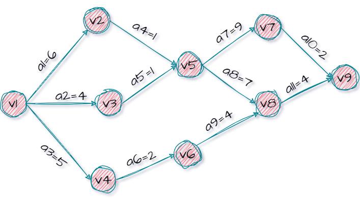

4. 那么我们显然需要求解$l(i)$和$e(i)$,我们不妨假设有这样一条有向边$v_i->v_j$表示事件$a_k$，边的权值记作$weigth(v_i,v_j)$,显然有：

   1. $e(k)=v_e(v_i)$，保证前面的活动都完成。
   2. $l(j)=v_l(v_j)-weigth(v_i,v_j)$，保证后面的活动都能够按时完成。

5. 那么我们又如何求解$v_e(v_j)$和$v_l(v_j)$​：答，一直递推。

   1. $v_e(v_j)$：由于我们需要保证前面的事件有足够的时间去执行，我们需要选择一个最晚的开始时间。我们不妨从某个源点开始(事件最早发生事件记作$0$)，通过递推公式$v_e(v_j)=Max\{v_e(v_i)+weigth(v_i,v_j)\}$，其中$v_i$为$v_j$的任意一个前驱结点。我们不妨具体举例：对于$v_e(v_5)$而言，显然$v_e(v_2)+1>v_e(v_3)+1$,故$v_e(v_5)=7$。仔细观察下面过程，不难看出，这是$TMD$​拓扑排序。<br>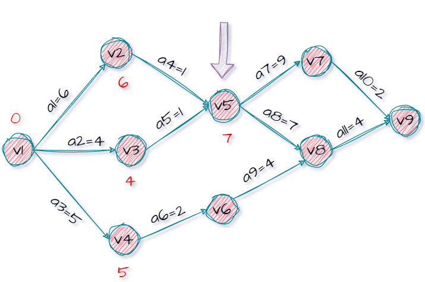
   2. 为了后续描述，实际上我们再求所有顶点的$v_e(vj)$的过程中，我们可以得到共$AOE$网的最短总耗时为$t_{all}=18$。
   3. $v_l(v_j)$：由于我们需要保证前面的事件有足够的时间去执行，我们需要选择一个最早的开始时间。我们不妨从某个汇点开始(事件最早发生事件记作$t_{all}$)，通过递推公式$v_l(v_j)=Min\{v_l(v_i)-weigth(v_i,v_j)\}$，其中$v_i$为$v_j$的任意一个后继结点。我们不妨具体举例：对于$v_l(v_5)$而言，显然$v_l(v_7)-9=v_l(v_8)-7$,故$v_l(v_5)=7$。仔细观察下面过程，不难看出，这是$TMD$逆拓扑排序。<span style="color:red">(其实到这儿，你就可以知道这关键路径必定会经过$v_5$)</span><br>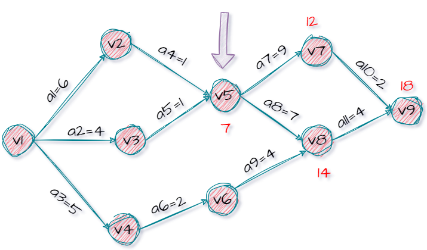

6. 求解关键路径的算法步骤：

   1. 从源点出发且$v_e(源)=0$，按照拓扑排序递推$v_e(v_j)$。
   2. 从汇点出发且$v_l(汇)=v_e(汇)$，按照逆拓扑排序递推$v_l(v_j)$。
   3. 根据$v_e()$求$e()$，根据$v_l()$求$l()$。
   4. 求$d()$,找出所以$d()=0$​的活动构成关键路径。

7. 给出具体代码实现：前面都是通过邻接矩阵实现拓扑排序，这次不妨就使用邻接表：

   1. 给出工具栈的定义：

      ```cpp
      #define MaxSize 100
      typedef struct Stack
      {
          int data[MaxSize];
          int top;
      } Stack;
      
      // 省略具体实现
      void InitStack(Stack &S);
      bool isEmpty(Stack S);
      bool Push(Stack &S, int x);
      bool Pop(Stack &S, int x);
      bool GetTop(Stack S, int x);
      ```

      

   2. 给出图的定义：

      ```cpp
      #include <iostream>
      #define MaxVexNum 100
      typedef char VertexType;
      
      typedef struct ArcNode
      {
          int adjvex;           // 邻接点域，存储边或者弧指向哪个顶点
          struct ArcNode *next; // 指向下一条边或者弧
          int weight;           // 权值
      } ArcNode;
      
      typedef struct VNode
      {
          VertexType data;    // 顶点域，存储顶点信息
          ArcNode *firstedge; // 边表头指针
      } VNode, AdjList[MaxVexNum];
      
      typedef struct
      {
          AdjList vertices;   // 邻接表
          int vexnum, arcnum; // 顶点数和边数
      } ALGraph;
      ```

      

   3. 拓扑排序的实现：

      ```cpp
      void initIndegree(ALGraph &G, int indegree[])
      {
          for (int i = 0; i < G.vexnum; i++)
          {
              indegree[i] = 0;
          }
      
          for (int i = 0; i < G.vexnum; i++)
          {
              ArcNode *p = G.vertices[i].firstedge;
              while (p != NULL)
              {
                  // 入度加1
                  indegree[p->adjvex]++;
                  p = p->next;
              }
          }
      }
      ```

      ```cpp
      bool TopologicalSort(ALGraph &G, int indegree[], int print[])
      {
          Stack S;
          InitStack(S);
      
          // 初始indegree数组
          initIndegree(G, indegree);
      
          int i, count = 0;
      
          for (int i = 0; i < G.vexnum; i++)
          {
              if (indegree[i] == 0)
              {
                  Push(S, i);
              }
          }
      
          while (!isEmpty(S))
          {
              Pop(S, i);
              print[count++] = i;
              ArcNode *p = G.vertices[i].firstedge;
              while (p != NULL)
              {
                  indegree[p->adjvex]--;
                  if (indegree[p->adjvex] == 0)
                  {
                      Push(S, p->adjvex);
                  }
                  p = p->next;
              }
          }
      
          return !(count < G.vexnum);
      }
      ```

      

   4. 关键路径：初始化时也可$int\  ve[MaxVexNum]={0}$,但是不可$int\ a[5]={1}$,这是错误的。

      ```cpp
      // 关键路径
      bool CriticalPath(ALGraph &G)
      {
          int ve[MaxVexNum], vl[MaxVexNum];
          //int e[MaxVexNum], l[MaxVexNum];
          int e,l;
          int indegree[MaxVexNum]; // 用于存储各个顶点的入度
          int print[MaxVexNum];    // 用于存储拓扑排序的结果
          int i, j, k;
          ArcNode *p;
      
          // 初始化ve
          for (i = 0; i < G.vexnum; i++)
          {
              ve[i] = 0;
          }
      
          // 获取拓扑排序
          if (!TopologicalSort(G, indegree, print))
          {
              return false;
          }
      
          // 按照拓扑排序的顺序计算ve
          for (i = 0; i < G.vexnum; i++)
          {
              j = print[i];
      
              p = G.vertices[j].firstedge;
      
              // 计算所有邻接点的ve
              while (p != NULL)
              {
                  k = p->adjvex;
                  if (ve[j] + p->weight > ve[k])
                  {
                      ve[k] = ve[j] + p->weight;
                  }
                  p = p->next;
              }
          }
      
          // 初始化vl
          for (i = 0; i < G.vexnum; i++)
          {
              vl[i] = ve[G.vexnum - 1];
          }
      
          // 按照拓扑排序的逆序计算vl
          for (i = G.vexnum - 1; i >= 0; i--)
          {
              j = print[i];
              p = G.vertices[j].firstedge;
      
              // 计算所有邻接点的vl
              while (p != NULL)
              {
                  k = p->adjvex;
                  if (vl[k] - p->weight < vl[j])
                  {
                      vl[j] = vl[k] - p->weight;
                  }
                  p = p->next;
              }
          }
      
          // 计算e和l，找出关键路径(i->k)
          for (i = 0; i < G.vexnum; i++)
          {
              p = G.vertices[i].firstedge; 
              while (p != NULL)
              {
                  k = p->adjvex;
                  e = ve[i];
                  l = vl[k] - p->weight;
                  if (e == l)
                  {
                      printf("%d->%d\n", i, k);
                  }
                  p = p->next;
              }
          }
      }
      ```

      

   5. 关于上述代码可能疑惑的地方就是如何将$e(i)$与$l(k)$对应上同一个边。显然找边不好找，我们找顶点，通过顶点找其所有的边(<span style="color:red">两点一线</span>)。我们通过$v_e(i)$中的$i$找到对应顶点，通过顶点遍历与其依附的边，在通过边找另一顶点$k$从而得到$v_l(k)$。显然当前边对应活动的$e=v_e(i)$且$l=v_l(k)-weight(i,k)$。显然实际上上述代码中的$e、l$变量是冗余的：

      ```cpp
      // 计算e和l，找出关键路径(i->k)
      for (i = 0; i < G.vexnum; i++)
      {
          p = G.vertices[i].firstedge; 
          while (p != NULL)
          {
              k = p->adjvex;
              if (ve[i] == vl[k] - p->weight)
              {
                  printf("%d->%d\n", i, k);
              }
              p = p->next;
          }
      }
      ```

      

   6. 由于$dfs$实现逆拓扑排序比较方便，我们也可以采用这种方式。

8. <span style="color:red">关于缩减工程时间的方式</span>：

   1. <span style="color:red">关键路径可能不唯一</span>。
   2. 若网中存在多条关键路径，需要加快同时在这多条关键路径上的关键活动。
   3. 若一个活动处于所有关键路径上，那么提高这个活动的速度，就能缩短整个工程的完成时间。
   4. 处于所有关键路径上的活动完成时间不能缩短太多，否则会使得原来的关键路径不在是关键路径。

9. 最后给出示例图的关键路径：<br>