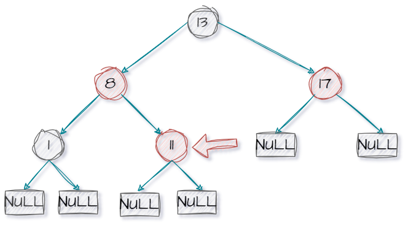
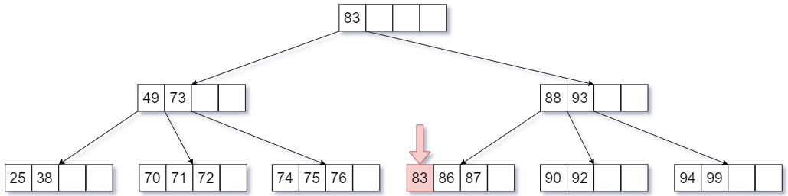

##### 基本概念

1. 静态表查找：只查找某个符合条件的数据 (只需关注查找速度)。
2. 动态表查找：在查找某个符合条件的数据的过程中，会插入、删除某个数据元素 (除了关注查找速度，也要关注插入、删除操作是否方便)。
3. 查找表：由同一类型的数据元素 (或记录) 构成的集合。由于集合中的数据元素之间存在着松散的关系，因此查找表是一种应用灵便的结构。
4. 查找：根据给定的某个值，在查找表中确定一个某关键字等于给定值的数据元素或 (记录)。
5. 关键字用来标识一个数据元素 (或记录) 的某个数据项的值：<span style="color:red">可唯一地标识一个记录 (王道书中提到的关键字似乎默认就是主关键字)</span>的关键字是主关键字。反之，用以识别若干记录的关键字是次关键字。
6. 查找算法的评价指标：
   1. 查找长度：在查找运算中，需要**对比关键字的次数**称为查找长度。
   2. <span style="color:red">平均查找长度 ($ASL$)：所以查找过程中进**行关键字的比较次数的平均值**，其反映查找算法的时间复杂度。评价一个查找算法的效率时，通常需要考虑成功和失败两种情况的$ASL$​​。</span>

---

##### 顺序查找

1. 顺序查找，又叫线性查找，通常用于线性表。其算法思路是：从头到脚挨个查找 (反之亦可)，时间复杂度 $O(n)$。

2. 给出其一般形式代码：<span style="color:red">显然当返回$1$时表示查找失败</span>。

   ```cpp
   typedef int ElemType;
   typedef struct{
       ElemType *elem;
       int tableLen;
   } SSTable;
   
   int Search_Seq(SSTable ST, ElemType key){
       int i = 0;
       for (i = 0; i<ST.tableLen && ST.elem[i] != key; i++);
   
       // 当查找失败时, i的值等于ST.tableLen
       return i==ST.tableLen ? -1 : i;
   }
   ```

   <br>

3. 哨兵形式代码：我们将查找表的 $0$ 号位置作为哨兵 (遇到哨兵就该停下来了)，存储当前查找的关键字，这样就不需要每次判断是否出界 (效率更高)，因为出界前一定可以找到。<span style="color:red">显然当返回$0$时表示查找失败</span>。

   ```cpp
   typedef int ElemType;
   typedef struct{
       ElemType *elem;
       int tableLen;
   } SSTable;
   
   int Search_Seq(SSTable ST, ElemType key){
       // 设置哨兵
       ST.elem[0] = key; 
       int i;
       for(i = ST.tableLen; ST.elem[i] != key; --i);
       // 查找失败反回0
       return i; 
   }
   ```

   <br>

4. 不妨以哨兵形式为例，分析一下其 $ASL$，我们假设查找表的数据个数为 $n$。

   1. 对于查找成功而言，我们假设对每个元素的查找是等可能的 ($\frac{1}{n}$)，那么显然有 $ASL_{成功}=\frac{1+2+3+\cdots+n}{n}=\frac{n+1}{2}$。
   2. 对于查找失败而言，$ASL_{失败}=n+1$。

5. 优化形式：

   1. 对查找表中元素进行有序存放 (递增/递减)，不妨假设递增，显然我们知道当从小到大依次查找时，若发现当前元素的关键字大于查找的关键字，就可以判定查找失败，无需遍历到末尾。此时 $ASL_{失败}=\frac{1+2+3+\cdots+n+n}{n+1}=\frac{n}{2}+\frac{n}{n+1}$，有所降低。<span style="color:red">适合经常查找失败的场景</span>。<br>
   2. 此外还可以将查找表的元素按照查找概率存储，将存储概率大的元素放在先查找的位置，<span style="color:red">适合经常查找成功的情形</span>。此时 $ASL_{成功}=\sum_{i=1}^{m}P_iC_i$ ​。

6. (<span style="color:red">重点</span>) 使用判定树分析 $ASL$，我们使用圆形结点表示查找表中存在的元素，而矩形结点的失败结点 (若有 $n$ 个结点，则相应地有 $n+1$ ​个查找失败结点)。

   1. 一个成功结点的查找长度=自身所在层数。
   2. 一个失败结点的查找长度=其父结点所在层数。
   3. 一般默认情况下，各种失败情况或者成功情况<span style="color:red">都等概率发生</span>。<br>


---

##### 折半查找

1. 折半查找又称二分查找，仅适用于<span style="color:red">有序</span>的<span style="color:red">顺序表 (可随机访问，链表不行)</span>。

2. 给出如下形式的代码：假设查找表为从小到大的有序表，显然一般而言当 $low>high$ 时认为查找失败。

   ```cpp
   typedef int ElemType;
   typedef struct
   {
       ElemType *elem;
       int tableLen;
   } SSTable;
   
   int Binary_Search(SSTable L, ElemType key)
   {
       int low = 0, high = L.tableLen - 1, mid;
       while (low <= high)
       {
           mid = (low + high) / 2;
           if (L.elem[mid] == key)
           {
               return mid;
           }
           else if (L.elem[mid] > key) // key在左半区
           {
               high = mid - 1;
           }
           else // key在右半区
           {
               low = mid + 1;
           }
       }
       return -1;
   }
   ```

   

3. 折半查找判定树构成：首先我们要知道在 c 或 c++语言中，$mid = (low + high) / 2$ 其实是等同于 $mid=\lfloor \frac{low+high}{2}\rfloor$。

   1. $mid=\lfloor \frac{low+high}{2}\rfloor$ 时：<span style="color:red">每次二分后，$high$到$low$元素个数的奇偶性是可能发生变化的。</span>
      1. 若 $high$ 到 $low$ 共有奇数个元素时，则 $mid$ ​分隔后，左右两边元素个数相等。
      2. 若 $high$ 到 $low$ 共有偶数个元素时，则 $mid$ ​分隔后，左边元素个数比右边少一个。
      3. 对于任意一个判定树结点，右子树结点数-左子树结点数= $0$ 或者 $1$。
   2. $mid=\lceil \frac{low+high}{2}\rceil$ ​时：
      1. 若 $high$ 到 $low$ 共有奇数个元素时，则 $mid$ ​分隔后，左右两边元素个数相等。
      2. 若 $high$ 到 $low$ 共有偶数个元素时，则 $mid$ ​分隔后，右边元素个数比左边少一个。
      3. 对于任意一个判定树结点，左子树结点数-右子树结点数= $0$ 或者 $1$ ​。
   3. 故而经上面分析，<span style="color:red">折半查找的判定树一定是平衡二叉树，且除最后一层可能不满以外，其它层都是满的。含有元素个数$n$的树高 (不含失败结点) 为$h=\lceil log_2 (n+1) \rceil$，显然$ASL_{成功}<=h$且$ASL_{失败}<=h$，即折半查找时间复杂度$o(log_2n)$</span>。但是请注意，这不意味着任何情况下折半查找的效率均高于顺序查找，例如查找查找表的第一个元素。
   4. 显然依旧满足：<span style="color:red">若有$n$个结点，则相应地有$n+1$个查找失败结点 (成功结点的空链域数量)</span>。
   5. 下面我们不妨演示一下 $mid=\lfloor \frac{low+high}{2}\rfloor$ 的判定树构建过程 (下图省略失败结点部分)：
      1. 显然按照左子树比右子树少一原则，$16$ 和 $41$ 因该是右孩子。
      2. 当然我们其实要知道在折半查找的判定树中，左右子树其实就是在折半过程中划分的左右区间。当 $mid=13$ 时显然 $16$ 属于右区间内，故而在右子树中，$41$ ​​同理可得。<br>
   6. 不妨判断一下面的二叉树是否可能是折半查找的判定树：显然不是，不可能一会右子树比左子树多，一会儿左子树比右子树多。<br>

4. 提醒一点：`mid=(left+right)/2`存在`left+right`过大导致溢出的风险，推荐使用`mid=left+(right-left)/2`。

5. 为了后续分块查找部分，提一嘴。实际上查找关键字并不是二分查找的全部内容，例如如何找到一个比关键字大的最小值、或者找比关键字小的最大值。实际上我们要知道一点：<span style="color:red">查找失败，$low$和$high$会分别指向比目标值稍大和稍小的元素，如下图两种情况的演示。当然也可以直接尝试逻辑分析，当$low=high$时，若$arr[mid] \leq key$显然$low$右移，反之$high$左移，故而不难看出上述结论。</span>不妨尝试力扣题：[搜索插入位置 ](https://leetcode.cn/problems/search-insert-position/description/)(由于不存在重复，若找到相等元素时返回当前位置即可)<br><br><br>

6. 补充：但是对于上述问题，其存在一个前提查找表中无重复元素。但是当我们允许重复时情况似乎略复杂，即允许存在重复元素，此时我们需要深入理解一下二分法的原理：<font color=red>为了方便叙述，这里暂时使用 $arr$ 代替 $L.elem$，再次开启上帝视角，将查找结构记作 $ans$</font>。

   1. 前提：关于程序结束条件的讨论

      1. `low<high`：当循环结束时`low=high`，此时对于双闭区间($[low,high]$)而言，我们已经找到一个值$hiht=low$,下一步就是判断$high=low$是不是我们要的$ans$,不是则没结果。

      2. `low<=high`：当循环结束时`low=high+1`，此时对于双闭区间($[high,low]$)而言，我们找到两个值`high`和`low`。这时后我们需要判断，我们$ans$​是其中哪一个，还是都不是。

      3. <font color=red>实际上`low<=high`就是在`low<high`的基础上再运行了一遍程序，这个过程其实就可以认为将`low=high`得到的唯一结果进行验算，判断是否为我们要的$ans$</font>。

   2. 现在，我们不妨提出以下两个问题：

      1. $A$：在一个存在重复元素的查找表中，我们需要找到比$key$大的最小值。
      2. $B$：在一个存在重复元素的查找表中，我们需要找到比$key$​小的最大值。

   3. 显然无论是哪个问题，有一点我们需要肯定。当`low=high`时，我们就要终止程序,即终止条件仍为`low<high`(这一点通过后面讨论很容易理解)。而一般二分法之所以在`low=high`后还执行一遍程序，是为了判断最终找到位置的关键字是不是`key`。参照这个形式，其实可以写出另一种二分法代码如下，这个我们后面再说。

   4. 对于问题 $A$,当我们发现 $L.elem[mid] \leq key$ 时，我们该怎么做？显然我们需要找比 $key$ 大的，我们可以直接 $low=mid+1$ ​。当我们发现 $L.elem[mid] \gt key$ 时，我们该怎么做？显然我们需要保留 $mid$，因为 $mid$ 可能就是我们需要的结果，即 $high=mid$。给出下列代码:

      ```cpp
      int binary_search(SSTable ST, ElemType key)
      {
          int low = 0, high = ST.tableLen - 1, mid;
          while (low < high)
          {
              mid = (low + high) / 2;
              if (ST.elem[mid] <= key)
                  low = mid + 1;
              else
                  high = mid;
          }
          return ST.elem[low] > key ? low : -1;
      }
      ```

      

   5. 当然对于上述代码最后返回值可能存在一些小的疑问,为啥不直接返回`low`?其实可能`high`一直没动，`low`一路狂奔追上`high`，也就是说整个数组可能不存在比`key`大的数。

   6. 那么若将`low<high`的条件换为`low>=high`呢？给出如下代码：显然当`high=low`时，我们找到可能结果; 此时若`low`是所求`ans`则`low`不变，否则`low`加一则没找则返回`low`即可(当然也可以推测`low+1=high`时的情形)。

      ```cpp
      int Search_Bin(SSTable ST, ElemType key)
      {
          int low = 0, high = ST.tableLen - 1, mid;
          while (low <= high)
          {
              mid = (low + high) / 2;
              if (ST.elem[mid] <= key)
                  low = mid + 1;
              else
                  high = mid;
          }
          return low; // high+1也是可以的
      }
      ```

      

   7. 同样的，对于问题 $B$, 当我们发现 $L.elem[mid] \geq key$ 时，我们该怎么做？显然我们需要找比 $key$ 小的，我们可以直接 $high=mid-1$ ​。当我们发现 $L.elem[mid] \lt key$ 时，我们该怎么做？显然我们需要保留 $mid$，因为 $mid$ 可能就是我们需要的结果，即 $low=mid$。给出下列代码:

      ```cpp
      int Search_Bin(SSTable ST, ElemType key)
      {
          int low = 0, high = ST.tableLen - 1, mid;
          while (low < high)
          {
              mid = (low + high) / 2;
              if (ST.elem[mid] < key)
                  low = mid;
              else
                  high = mid - 1;
          }
          return ST.elem[high] < key ? high : -1;
      }
      ```

      

   8. 同理可以写出$B$问题的另一种代码：

      ```cpp
      int Search_Bin(SSTable ST, ElemType key)
      {
          int low = 0, high = ST.tableLen - 1, mid;
          while (low <= high)
          {
              mid = (low + high) / 2;
              if (ST.elem[mid] < key)
                  low = mid;
              else
                  high = mid - 1;
          }
          return high; // low-1也是可以的
      }
      ```

      

   9. 实际上，我们给出折半查找的另一种解释，即<font color=red>排除法</font>解释，上述代码就会变得和蔼可亲。

      1. 先以基本的折半查找为例，当我们发现 $arr[mid]>key$，显然我们的 $ans \lt mid$ 于是乎排除右区间转向左区间，其代码语言就是 $high=mid-1$。而当我们发现 $arr[mid]<key$，显然我们的 $ans \gt mid$ 于是乎排除左区间转向右区间，其代码语言就是 $low=mid+1$。

      2. 在次回到 $A$ 问题中，我们的 $arr[ans]>key$，当 $arr[mid]=key$, 显然我们显然需要排除左区间，同理当 $arr[mid]<key$，我们也需要丢弃左区间，转换为代码语言就是 $low=high+1$。那么当 $arr[mid]<key$ 时，此时 $mid$ 可能就是 $ans$，需要保留 $high=mid$。对于 $B$​ 问题同理分析即可。

      3. <font color=red>排除法的精髓在于，不断排除不可能存在结果的区间直至区间长度为1，那么我们的结果要不就是这玩意，要不就没结果。</font>于是我们根据上述知识得到新的二分代码：当然不难看出，这种形式的效率较低，每次都需要遍历整个表才能得出最后结果，哪怕是中间某个过程中$arr[mid]=key$。

         ```cpp
         int Binary_Search(SSTable L, ElemType key)
         {
             int low = 0, high = L.tableLen - 1, mid;
             while (low < high)
             {
                 mid = (low + high) / 2;
                 if (L.elem[mid] > key)
                 {
                     high = mid - 1;
                 }
                 else
                 {
                     low = mid;
                 }
             }
             return L.elem[low] == key ? low : low - 1;
         }
         ```

         ```cpp
         int Binary_Search(SSTable L, ElemType key)
         {
             int low = 0, high = L.tableLen - 1, mid;
             while (low < high)
             {
                 mid = (low + high) / 2;
                 if (L.elem[mid] < key)
                 {
                     low = mid + 1;
         
                 }
                 else
                 {
                     high = mid;
                 }
             }
             return L.elem[low] == key ? low : low - 1;
         }
         ```

         

   10. 此外对于 $A$ 和 $B$ 问题，我们提出另一种略难理解的方式，<font color=red>区间开闭</font>。
      1. 给出示意图：其中数组长度为$n$<br>

      2. 对于 $A$ 问题，我们需要找比 $key$ 大的关键字，即 $ans$ 。那么 $ans$​ 在数组中的位置在哪儿？显然存在多种表示：
         1. $0 \leq ans \leq n-1$​，我们称这种为双闭区间，就是我们上面代码所使用的区间法。
         
         2. $0 \leq ans \lt n$，我们称这种为左闭右开区间，这种形式可以解决$A$​问题：我们在理论上`n`补上，这样就没有必要在`high=low`后验证一次，也不能验证，验证就可能导致数组越界。
         
            ```cpp
            int binary_search(SSTable ST, ElemType key)
            {
                int low = 0, high = ST.tableLen, mid;
                while (low < high)
                {
                    mid = (low + high) / 2;
                    if (ST.elem[mid] <= key)
                        low = mid + 1;
                    else
                        high = mid;
                }
                return low;
            }
            ```
         
         3. $-1 \lt ans \leq n-1$，我们称这种为左开右闭区间，这种形式可以解决$B$​问题：原理同上。
         
            ```cpp
            int Search_Bin(SSTable ST, ElemType key)
            {
                int low = -1, high = ST.tableLen - 1, mid;
                while (low < high)
                {
                    mid = (low + high) / 2;
                    if (ST.elem[mid] < key)
                        low = mid;
                    else
                        high = mid - 1;
                }
                return high;
            }
            ```

   11. 指鹿为马(顿悟所得)：实际上，我们前面在二分法(不含有重复元素)中提过：查找失败，$low$和$high$会分别指向比目标值稍大和稍小的元素。那对于$A$问题，我们倘若将$=key$执行的操作归类到$<key$的操作(将所有$=key$的视作$<key$)，那么最终就演变成了最开始不存在重复元素且必然查找失败的场景。那对于$B$问题同理(将所有$=key$的视作$>key$)

       1. 对于$A$​​​​问题：

          ```cpp
          int Search_Bin(SSTable ST, ElemType key)
          {
              int low = 0, high = ST.tableLen, mid; // 左闭右开
              while (low <= high)
              {
                  mid = (low + high) / 2;
                  if (ST.elem[mid] <= key)
                      low = mid + 1;
                  else
                      high = mid - 1;
              }
              return low;
          }
          ```

          

       2. 对于$B$问题：

          ```cpp
          int Search_Bin(SSTable ST, ElemType key)
          {
              int low = -1, high = ST.tableLen-1, mid; // 左开右闭
              while (low <= high)
              {
                  mid = (low + high) / 2;
                  if (ST.elem[mid] >= key)
                      high = mid - 1;
                  else
                      low = mid + 1;
              }
              return high;
          }
          ```

       

7. 最终给出一个图和一句话：二分法的关键还是讨论`low=high`以及其前、后一步的执行情况。<br>

   


---

##### 分块查找

1. 分块查找 (块内无序，块间有序)：又称索引顺序查找，其将查找表划分为若干字块，块内元素可以无序，但是块间的元素是有序的。即每一块中的最大关键字是递增的 (似乎是不允许递减)。<br>

2. 分块查找步骤：

   1. 先在索引表中通过顺序查找或者折半查找 (返回 $low$，等于时直接返回 $mid$ 即可)(若返回的 $low$ 超出索引表范围，则查找失败) 找到对应的所属块的位置。

   2. 顺序遍历所属块查找对应元素。

   3. 给出类型定义，分块查找具体代码实现较简单略。

      ```cpp
      Typedef int ElemType;
      Typedef struct
      {
          ElemType maxVal;
          Int low, high;
      }index;
      
      ElemType List[100];
      ```

      

3. 关于分块矩阵的查找效率分析，在求 $ASL$ 时，要分析索引表的关键字对比次数和块中关键字的对比次数。<span style="color:red">尤其是要注意使用折半查找搜索索引表时，当索引表中不存在对应元素，则要得出所属块位置，需要等到二分法执行结束，这个过程中的关键字对比次数分析起来略显复杂。</span>而对于失败情况下的 $ASL$ 一般而言不予考虑。

4. 假设长度为 $n$ 的查找表被均匀地划分为 $b$ 块，每块 $s$ 个元素。此时显然 $ASL_{all}=ASL_{index}+ASL_{block}$。

   1. 当使用顺序查找查索引表时：$ASL_{index}=\frac{1+2+3+\cdots+b}{b}=\frac{b+1}{2}$, 而 $ASL_{block}=\frac{1+2+\cdots+s}{s}=\frac{s+1}{2}$。故而 $ASL_{all}=\frac{b+1}{2}+\frac{s+1}{2}=\frac{s^2+2 s+n}{2 s}$ ($b=\frac{n}{s}$)。求导可知当 $s=\sqrt{n}$ 时，$ASL_{min}=\sqrt{n}+1$。
   2. 当使用折半查找查索引表时：依旧有 $ASL_{block}=\frac{1+2+\cdots+s}{s}=\frac{s+1}{2}$，但是 $ASL_{index}$ 王道给的是 $\lceil log_2 (b+1) \rceil$，但是个人觉得不太合适。

5. 若查找是动态查找表，即需要再查找过程中插入或者删除元素，可以使用链式存储，只不过此时索引表无法折半查找。<br>

---

##### 二叉排序树

1. 二叉排序树的每个结点的值大于其左子树的所有结点的值，小于其右子树的所有结点的值<span style="color:red">($value_{左} \lt value_{根} \lt value_{右}$)(二叉排序树中不存在重复的值)</span>。

2. 为了后续方便，先给出二叉排序树的存储结构：

   ```cpp
   #include <iostream>
   
   Typedef struct  {
       Int key;
       BSTNode *lchild, *rchild;
   } BSTNode, *BSTree;
   ```

   

3. 二叉排序树的查找：

   1. 查找步骤：若相等则查找成功。若小于根节点，则在左子树查找。若大于根结点，则在右子树查找。查找成功返回结点指针，失败返回 $NULL$。

   2. 具体实现：

      1. 非递归形式：<span style="color:red">空间复杂度$O (1)$</span>。

         ```cpp
         BSTNode* search (BSTree T, int key) {
             // 若 T 为空或等于 key 则返回 T
             While (T != NULL && T->key != key) {
                 if (key < T->key) {
                     T = T->lchild;
                 } else {
                     T = T->rchild;
                 }
             }
             Return T;
         }
         ```

         

      2. 递归形式：空间复杂度 $O (n)$。

         ```cpp
         BSTNode *search (BSTree T, int key)
         {
             If (T == NULL)
                 Return NULL;
             If (key == T->key)
                 Return T;
         
             return key < T->key ? Search (T->lchild, key) : search (T->rchild, key);
         }
         ```

         

4. 二叉排序树的插入：<span style="color:red">新插入的结点一定是叶子结点</span>。

   1. 步骤：若原二叉排序树为空则直接插入结点，否则若 $key$ 小于根结点的值则插入到左子树，否则插入到右子树。若 $key$ ​大于根结点的值则插入到右子树。

   2. 给出具体代码：这里给出递归形式，其空间复杂度 $O (h)$。

      ```cpp
      Int BST_insert (BSTree &T, int key)
      {
          If (T == NULL)
          {
              T = (BSTNode *) malloc (sizeof (BSTNode));
              T->key = key;
              T->lchild= T->rchild = NULL;
              Return 1;
          }
          If (key == T->key)
              Return 0;
          else if (key < T->key)
              Return BST_insert (T->lchild, key);
          Else
              Return BST_insert (T->rchild, key);
      }
      ```

      

   3. 关于上面代码其实存在些许疑问 (代码片段如下)：实际上 `T` 是一个引用，它是原始对象的别名, 当你通过引用 `T` 修改对象时，实际上是在修改原始对象。若将参数 `BSTree  &T` 换成 `BSNode *T`，此时 $T$ 分配内存后，原本的 $T$ 依旧为 `null` (你可以把指针类型理解成一个变量，由于值传递机制，参数 $T$ 和原本指针的值一致，即指向同一片内存空间)。但是若将参数 `BSTree  &T` 换成 `BSNode **T`，此时的 $T$ 指向指针的内存地址，此时对 `*T` 分配内存可行。

      ```cpp
       If (T == NULL)
          {
              T = (BSTNode *) malloc (sizeof (BSTNode));
              T->key = key;
              T->lchild= T->rchild = NULL;
              Return 1;
          }
      ```

      <br>

   4. 非递归形式实现：

      ```cpp
      Int insert (BSTree &T, int key)
      {
          BSTNode *p = T, *pre = NULL;
          While (p != NULL)
          {
              Pre = p;
              If (key == p->key)
                  Return 0;
              p = key < p->key ? P->left : p->right;
          }
      
          P = (BSTNode *) malloc (sizeof (BSTNode));
          P->key = key;
          P->left = p->right = NULL;
      
          // 判断是 pre 的左子树还是右子树
          If (pre == NULL)
              T = p;
          else if (key < pre->key)
              Pre->left = p;
          Else
              Pre->right = p;
      
          Return 1;
      }
      ```

      

5. 二叉排序树的构造：

   1. 步骤：调用插入函数 $BST\_insert$ 即可。

   2. 具体代码实现：需要注意的是不同关键字序列 $str$ 可能得到同款二叉排序树，也可能得到不同二叉排序树。

      ```cpp
      Void createBST (BSTree &T, int str[], int n)
      {
          T = NULL;
          // 依次将数组中的元素插入到二叉排序树中
          For (int i = 0; i < n; i++)
              Insert (T, str[i]);
      }
      ```

6. 二叉排序树的删除：

   1. 思路分析：假设需要删除结点 $p$。再次之前，我们需要知道的是，<span style="color:red">二叉排序树的中序遍历得到的是一串递增的有序序列</span>。

      1. 若 $p$ 是叶子结点，直接删除，不会影响二叉排序树的性质。<br>
      2. 若 $p$ 只有左子树或者右子树，则直接使用 $p$ 的左子树或者右子树成为 $p$ 父结点的子树，替代 $p$ 的位置。<br>
      3. 若 $p$ 结点存在左右两棵子树，则令 $p$ 的直接后继 (或者直接前驱) 替代 $p$，然后从二叉排序树中删除该直接后继或者直接前驱，此后就换成第一种或者第二种情况。<br><br><br>
      4. 关于第三种情况需要进一步说明，这里其实就是将删除 $p$ 结点转换为删除另一个结点 (满足第一种或者第二种情况的结点)。前面已经提到过二叉排序树的中序遍历得到的是一串递增的有序序列。那么为了保证替换后二叉排序树的性质不变，这里用于替换的直接后继或者直接前驱显然是基于中序遍历而言的。那么我们参考线索二叉树的知识不难知道：
         1. 直接前驱：左子树中一直递归找右子树即可。或者说左子树中最右边或最右下的结点。
         2. 直接后继：右子树中一直递归找左子树即可。或者说右子树中最左边或最左下的结点。

   2. 具体代码实现：实际上第三种情况，我们没有必要递归调用 `deleteBST (s)`, 因为左子树的最右结点只有几种情况：要么是右叶子结点，要么是无右孩子的根结点 (当然需要注意的是可能左子树就一个结点)。

      ```cpp
      Bool deleteBST (BSTNode *&T)
      {
          BSTNode *p = T, *s, *q;
          If (T == NULL) // 树为空
          {
              Return false;
          }
          If (T->right == NULL) // 右子树为空
          {
              T = T->left;
              Free (p);
          }
          Else if (T->left == NULL) // 左子树为空
          {
              T = T->right;
              Free (p);
          }
          Else // 左右子树均不为空, 找左子树的最右节点
          {
              S = T->left;
              While (s->right != NULL)
              {
                  S = s->right;
              }
              T->key = s->key;
              DeleteBST (s);
          }
          Return true;
      }
      ```

      ```cpp
      Bool deleteBST (BSTNode *&T)
      {
          BSTNode *p = T, *s, *q;
          If (T == NULL) // 树为空
          {
              Return false;
          }
          Else if (T->right == NULL) // 右子树为空
          {
              T = T->left;
              Free (p);
          }
          Else if (T->left == NULL) // 左子树为空
          {
              T = T->right;
              Free (p);
          }
          Else // 左右子树均不为空, 找左子树的最右节点
          {
              S = T->left;
              Q = T;  // 前指针 (指向 s 的父结点)
              While (s->right != NULL)
              {
                  Q = s;
                  S = s->right;
              }
              T->key = s->key;
              If (q != T) { //右叶子或无右孩子的根
                  Q->right = s->left;
              } else { // 没进循环，左子树中没有右子树
                  Q->left = s->left;
              }
              Free (s);
          }
          Return true;
      }
      ```

      

7. 查找效率分析：

   1. 查找长度：在查找运算中，需要对比关键字的次数称为查找长度，反应了查找操作时间复杂度。
   2. 若树高 $h$，则找到最下层结点需要对比 $h$ 次。
   3. 含有 $n$ 个结点的二叉树：最好的情况，高度最小为 $\lfloor log_2 n+1 \rfloor$, 平均查找长度 $=O (log_2 n)$。最坏的情况，树高 $h=n$, 平均查找长度 $=O (n)$。显然，<span style="color:red">二叉排序树"越胖越矮"，平均查找长度$ASL$​越小。</span>
   4. 查找失败的 $ASL$ 略。<br>


---

##### 平衡二叉树

1.   看山是山，看山不是山，看山还是山。

2.   在前面提过二叉排序树"越胖越矮"，平均查找长度 $ASL$ 越小。而平衡二叉树左右子树高度差不超过 $1$，显然若二叉排序树能够始终保证是一棵平衡二叉树，就很 $nice$。

3.   平衡二叉树的基本概念：

     1.   二叉平衡树，简称平衡树 ($AVL$ 树)，其规定树中任意一结点的左子树和右子树的高度之差不超过 $1$。

     2.   <span style="color:red">平衡因子：左子树高-右子树高。</span>显然在平衡二叉树中结点的平衡因子的值只可能为 $-1、0、1$ (${|平衡因子| \leq 1}$)

     3.   类型定义：

          ```cpp
          Typedef struct
          {
              Int key;                         // 关键字
              Int balance;                     // 平衡因子
              Struct AVLNode *lchild, *rchild; // 左右孩子指针
          } AVLNode, *AVLTree;
          ```
          

4.   平衡二叉树的插入：我们再对二叉排序树进行插入操作后，如何将二叉排序树调整为平衡二叉树呢？分为以下四种情况：

     1.   首先我们需要知道的是，我们<span style="color:red">每次调整的对象都是最小不平衡子树</span>，后续讨论的各种情况均是以 $A$ 为根结点的子树作为最小不平衡树。
          1.   最小不平衡子树是第一个破坏平衡条件的子树。
          2.   如果我们不从最小不平衡子树开始调整，而是选择其他子树进行调整，那么可能无法恢复整棵树的平衡。因为调整其他子树可能不会影响到最小不平衡子树，最小不平衡子树的平衡因子可能仍然大于 1。

     2.   <span style="color:red">$LL$: 在$A$的左孩子的左子树中插入结点导致不平衡。</span>
          1.   我们给出插入前的示意图：其中方块代指子树，那我们不妨考虑为什么子树高度全为 $H$? 我们不妨假设 $BL$ 高 $H$，那么由于在 $B$ 的左子树插入结点导致 $A$ 点不平衡。那么显然 $AR$ 的高度应为 $H$ (若为 $H+1$，插入结点后仍平衡)，那么显然 $BR$ 为 $H$。$BR$ 为什么不是 $H-1$? 若 $BR$ 的高度为 $H-1$ 则最小的不平衡子树将以 $B$ 为根结点而不是 $A$，此时我们需要将 $BL$ 拆开，又回到开始的分析情况。那若 $BR$ 为 $H+1$，显然一开始就不平衡，不合理。<br>
          2.   对于这种情况，我们需要知道：$BL \lt B \lt BR \lt A \lt AR$。
          3.   <span style="color:red">于是我们采取策略：右旋 (右单旋转)，将$B$向右旋转代替$A$作为根结点，将$A$向右下旋转变为$B$的右子树。显然由于$B \lt BR \lt A$, 我们让$BR$成为$A$的左子树。</span><br><br><br>
          4.   显然，经过右旋后二叉树的高度没变，这也表明调整最小不平衡子树的可行性。

     3.   <span style="color:red">$RR$: 在$A$的右孩子的右子树中插入结点导致不平衡。</span>
          1.    我们给出插入前的示意图：其中方块代指子树。<br>
          2.    对于这种情况，我们需要知道：$AL \lt A \lt BL \lt B \lt BR$。
          3.    <span style="color:red">于是我们采取策略：左旋 (左单旋转)，将$B$向左旋转代替$A$作为根结点，将$A$向左下旋转变为$B$的左子树。显然由于$A \lt BL \lt B$, 我们让$BL$成为$A$的右子树。</span><br><br><br>
          4.    显然，经过左旋后二叉树的高度没变，这表明调整最小不平衡子树的可行性。

     4.   其实通过上述两种情况，都是将两个 $H$ 的子树放在一起，将 $H+1$ 子树放在上一层，使得整体高度变为原来的 $H+2$。
     5.   <span style="color:red">$LR$: 在$A$的左孩子的右子树中插入结点导致不平衡。</span>
          1.   给出插入前的示意图：老规矩，分析一下 $CR$ 和 $CL$ 中能否存在高为 $H$，显然不可能，要不插入后继续平衡，要不就是 $C$ 所在子树变为最小不平衡子树。<br>
          2.   对于这种情况，我们需要知道：$BL<B<CL<C<CR<A<AR$ ​。
          3.   <span style="color:red">于是我们采取策略：先左后右双旋转。我们先将$C$左旋替换$B$作为根结点，然后由于$B \lt CL \lt C$, 于是我们让$CL$作为$B$的右子树。显然此时仍未平衡。若我们将$B$所在子树视作一个整体，其实又回到了$LL$型。于是，我们再将$C$右旋替换$A$作为根结点，由于$C \lt CR \lt A$, 我们将$CR$作为$A$的左子树。</span><br><br><br><br><br>
          4.   实际上我们上述讨论的是在 $C$ 的右子树中插入，那如果在 $C$ 的左子树中插入呢，显然从上图可以看出也是可行的，无非是最后 $CL$ 高度为 $H$, $CR$ 高度为 $H-1$。

     6.   <span style="color:red">$RL$: 在$A$​的右孩子的左子树中插入结点导致不平衡。</span>
          1.   给出插入前的示意图：<br>
          2.   对于这种情况，我们需要知道：$AL\lt A \lt CL \lt C \lt CR \lt B \lt BR$。
          3.   <span style="color:red">于是乎我们采取策略：先右后左双旋转。我们先将$C$右旋替换$B$作为根结点，然后由于$C \lt CL \lt B$, 于是我们让$CL$作为$B$的左子树。显然此时仍未平衡。我们再将$C$右旋替换$A$作为根结点，由于$A \lt CL \lt C$, 我们将$CR$作为$A$的右子树。</span><br><br><br><br><br>
          4.   需要说明的是，若在 $C$ 的左子树插入结点，在右旋后会短暂出现最小不平衡树发生变化的情况 (变为 $C$ 所在子树)。对于这一现象实属正常，暂不知如何解释，不妨强行认为两次旋转视为一体，不可单独看 (实际上这种解释可能是对的)。

5.   左旋和右旋的伪代码：

     1.   右旋：其中 $f$ 是 $p$ 的父结点，$gf$ 是 $f$ 的父结点，$p$ 为 $f$ ​的左孩子 (左孩子才能右上旋)：

          ```cpp
          F->lchild=p->rchild;
          P->rchild=f;
          Gf->lchild/rchild=p;
          ```

          

     2.   左旋：其中 $f$ 是 $p$ 的父结点，$gf$ 是 $f$ 的父结点，$p$ 为 $f$ 的右孩子 (右孩子才能左上旋)：

          ```cpp
          F->rchild=p->lchild;
          P->lchild=f;
          Gf->lchild/rchild=p;
          ```

          

6.   举例说明：略。

7.   平衡二叉树的删除：
     1.   删除规则：直接按照二叉排序树的删除规则。
     2.   关键是调整平衡：我们假设是删除 $w$ 结点，<span style="color:red">(这句话才是贯穿插入和删除的精髓部分) 我们向上找到第一个不平衡的结点$A$(最小不平衡子树)，我们记$B$为$A$的高度的孩子结点，$C$为$B$中高度最高的孩子结点，最后转换成上述四种情况</span>(是否可以理解为将删除等效为在另一个位置插入)。
     3.   <span style="color:red">需要注意的是：插入操作只需要对$A$为根结点的子树进行操作。但是删除不一样，先对$A$为根结点的子树进行操作，但是调整后可能会导致子树高度减$1$，此时可能需要对$A$​的祖先结点进行平衡调整，甚至最终回溯到根结点。</span>
     4.   举例说明：暂无合适例子。

8.   <span style="color:red">查找效率分析：若树高为$h$，则最坏情况下，查找一个关键字最多需要比较$h$次，即查找操作的时间复杂度不可能超过$O (h)$。我们假设使用$n_h$表示深度为$h$的平衡树中含有的最少结点数。显然有$n_0=0$,$n_1=1$,$n_2=2$, 且有$n_h=n_{h-1}+n_{h-2}+1$的递推式 ($0,1,2,4,7,12,20$)。显然可知含有结点$n_h$个的平衡二叉树的最大高度为$h$，不难找出规律：结点个数为$n$，则最大高度为$O (log_2{n})$。当然可以尝试推导：由于$n_{h-1} \lt n_{h-2}$, 故$n_h \leq 2^{h-1}$, 然后…… 没推出来……，另一种搁两个放缩一次略复杂，不推了，略。</span><br>

9.   如何快速看出二叉排序树中结点之间的大小关系？显然答：水平方向的相对位置 (左小，右大)(不妨看看上面的分析过程，注意忽略视觉排列的影响)。那么，其实上面的子树变换过程就是将替换结点和被替换结点的所有子树依次重新挂在两个结点上，但是保证原来的水平相对位置即可。

10.   给出一幅图：我们不妨将圆视作较为光滑 (不完全光滑，有摩擦) 的棍子，上面放着柔软的铁链。当铁链一端重，为了平衡，就需要向另一边拉。<br> 

11. 关于具体的原理的理解，后续有时间待补。


---

##### 红黑树 (送命题)

1. 复杂度对比：注意的是红黑树和平衡二叉树都属于特殊的二叉排序树。

   | 操作                 | BST (二叉排序树) | AVL (平衡二叉树) | RBT (红黑树) |
   | -------------------- | --------------- | --------------- | ----------- |
   | 查、删、插时间复杂度 | $O (n)$          | $O (log_2 n)$     | $O (log_2 n)$ |

2. 平衡二叉树和红黑树的对比：实际上对于平衡二叉树，由于要求过于苛刻，对于插入和删除操作，往往会破坏其结构，需要频繁调整树的形态。为此我们提出了不那么严格的红黑树。后面我们会知道，红黑树只需要保证任意结点的左右子树高度相差不超过 $2$ 倍即可。故而：对于一查为主、少插少删的场景可以使用平衡二叉树，而对于频繁插入、删除的场景，适合使用红黑树。<br>

3. 红黑树的定义:<span style="color:red">左根右，根叶黑。不红红，黑路同。</span> 
	1. 每个结点都是红色或者黑色的。
	2. 根结点必定是黑色的。
	3. 叶子结点 (实际上应该叫做外部结点、NULL 结点、失败结点，是为了方便加上去的结点) 均是黑色的。
	4. 不存在两个相连的红色结点 (红结点的孩子结点和父结点均是黑色的)
	5. 对于每个结点，从该结点到任意一个叶子结点的简单路径上，所含的黑色结点的数目相同。
	6. 不妨给出其结构定义:
	
	   ```cpp
	   Typedef struct RBnode
	   {
	       Int key;        // 关键字
	       RBnode *parent;
	       RBnode *lChild;
	       RBnode *rChild;
	       Bool color;     // 0: red, 1: black
	   }RBnode, *RBtree;
	   ```
	
	   
	
4. 红黑树的一些概念：
	1. 黑高：从某个结点出发 (不含该结点) 到达任意一个结点的路径上的黑结点总数。
	2. 从根到叶子结点的最长路径不大于最短路径的二倍。对于这点我们可以解释一下，我们在上面提过红黑树中：对于每个结点，从该结点到任意一个叶子结点的简单路径上，所含的黑色结点的数目相同。那么显然，对于一个根结点而言，最短路径必然是全部由黑色结点构成 (如果存在的话)。同理可知，最长路径一定是红黑相间构成的 (存在的话，此时红色结点和黑色结点数量相同)。故而我们很容易就得到上述条件，同样的分析方式，我们还可以知道红黑树中任意结点的左右子树高度相差不超过 $2$ 倍。
	3. 有 $n$ 个结点的红黑树的高度 $h \leq 2 log_2 n$, 显然可以通过上述内容推导出来 (后续存在推导过程)。
	
5. 红黑树的插入:
	1. 插入规则：
		1. 先查找，确定插入的位置 (原理同二叉排序树一样)，插入新的结点。
		2. 若新结点是根，则染为黑色。
		3. 若新结点是非根，则染为红色。(实际上是为了不改变“黑路同”的条件)
		4. 若插入新结点后依然满足红黑树的条件，则插入结束。否则需要根据定义进行调整 (调整方式取决于新结点的叔叔结点)。
			1. 黑叔: 旋转 (二叉排序树的旋转)+染色 (取反)
				- $LL$ 型: 右单旋, 父换爷+二者染色 (取反)。
				- $RR$ 型: 左单选，父换爷+二者染色 (取反)。
				- $LR$ 型: 左旋后右旋，儿换爷+二者染色 (取反)。
				- $RL$ 型: 右旋后左旋，儿换爷+二者染色 (取反)。
			2. 红叔: 染色 (取反)+变新, 即为叔、父、爷三者染色，然后将爷作为新插入的结点后继续调整。
	2. 需要说明的是，上述的父换爷、儿换爷都是由于排序二叉树引起的。这种交换实际上不会改变"左根右, 根叶同"，但是可能进一步改变 "不红红, 黑路同"。在此之前，我们需要明白，当要调整时，插入结点的相关结点的颜色其实可以推断如下图 (这里给出 $LL$ 型，其他也是类似的)。为了不改变"黑路同", 我们采取染色的方式，显然无论是哪一种互换染色方式都不会改变"黑路同" (此外，支路中添或删除红结点亦不会影响)。至于"不红红", 不在讨论 (盯着颜色看即可)。<br>
	
6. 具体演示红黑树的插入: 实际上插入结点只可能不满足不红红和黑路同两个条件，但是实际上我们规定插入的结点必定是红色，这就一定满足黑路同。故而我们对插入的结点只需要判断是否满足不红红的条件即可。
	1. 举例: 叔和爷互换
	   1. 首先我们给出如下形式的红黑树:<br>
	   2. 我们向其中插入 $5$，得到如下的形式:<br>
	   3. 显然我们需要进行调整，由于插入结点的叔叔结点为黑色, 且属于 $LL$ 型, 故而先右单旋后父换爷并染色。<br><br><br>
	2. 举例: 儿爷互换
	   1. 给出其初始状态:<br>
	   2. 我们向其中插入 $6$ 结点:<br>
	   3. 显然我们需要进行调整，由于插入结点的叔叔结点为黑色, 且属于 $LR$ 型, 故而先左后右旋后，儿父染色。<br><br><br><br><br><br>
	3. 举例：红叔
	   1. 给出最初的状态:<br>
	   2. 向其中插入 $11$ 结点:<br>
	   3. 显然我们需要进行调整，由于插入结点的叔叔结点为红色, 故将叔父爷染色并将爷结点设置为新插入的结点。<br><br><br>
	
7. 关于"黑高"的相关推论:
	1. 若黑高为 $h$ 的红黑树，其最少存在多上个结点？显然 $2^h-1$，即全部为黑色结点时。
	2. 红黑树的红色结点只能穿插在黑结点之间，永远不可能出现两个连续的红色结点。
	3. 若红黑树的总高度为 $h$，显然黑高 $\geq {h/2}$, 故而内部结点数 $n \geq 2^{h/2}-1$。由此可以知道 $h \leq 2log_2(n+1)$。
	4. 此外强调一点，任何一条失败路径上的黑色结点数相等。
8. 红黑树的删除:
	1. 红黑树的删除的时间复杂度是 $O(log_2n)$。
	2. 红黑树删除结点的操作和二叉树的删除一致。
	3. 在删除结点之后，可能会破坏红黑树的特性，此时需要调整结点的位置和颜色
	4. 具体步骤:  不会, 有时间再学。<br>
	

----

##### B 树
1. 在给出 b 树定义之前，不妨先了解一下 $m$ 叉查找树，不妨以 5 叉查找树为例。

   1.  给出结构定义:

      ```cpp
      struct Node
      {
          ElemType keys[4];		// 最多4个关键字
          struct Node * child[5];	// 最多5个孩子
          int num;				// 结点中的实际关键字数
      }
      ```

   2.  参考二叉查找树的知识，我们可以类比 5 叉查找树的查找方式。由于 $m$ 叉查找树中都是有序的，我们再每个结点中除了顺序查找外也可以使用折半查找。例如在下面 5 叉查找树中找 9 的过程如下所示 (红色和蓝色部分代表叶子结点或者说查找失败结点)。<br>

   3.  实际上，我们要找到数据，不需要找到叶子结点 (区分于 B+树)。为了保证查找的效率，我们要保证树尽可能的宽和矮，让每个结点中尽可能存储多的关键字。于是乎提出以下思考:
      1.  如何让每个结点存储更多的关键字呢？答:<span style="color:red">$m$ 叉查找树中，规定除了根结点之外，任何结点至少存在 $\lceil m/2 \rceil$ 个分叉，至少存在 $\lceil m/2 \rceil -1$ 个关键字。</span>为什么根结点除外？当整棵树只有一个关键字时根结点只存在两个分叉，做不到。<br>
      2.  那么我们是否可以提出 $m$ 叉平衡树？实际上要实现这个想法是很复杂的。于是我们不妨要求更严格些，要求每个子树的高度必需要相等。于是得出: <span style="color:red">$m$ 叉查找树中，规定任何一个结点，其所有子树的高度都要相同。</span>

2. 实际上，上面的探究过程已经得出了 B 树的雏形。下面给出 B 树的定义： B 树，又称为多路平衡查找树，B 树中被允许的孩子数的最大值称为 B 树的阶，通常用 $m$ 表示。一棵 $m$ 阶 B 树或为空述，或是满足如下特征的 $m$ 叉树:

   1. 树中每个结点至多有 $m$ 棵子树，即至多有 $m-1$ 个关键字。
   2. 若根结点不是终端结点，则至少含有两棵子树。
   3. 除了根结点以外的所以非叶子结点至少含有 $\lceil m/2 \rceil$ 个子树，即至少含有 $\lceil m/2 \rceil -1$ 个关键字。
   4. 所有非叶子结点都出现在同一层次上，并且不带有信息 (可视为外部结点或者折半查找判定树的查找失败结点，实际上这些结点并不存在，指向这些结点的指针为空)。
   5. <span style="color:red">B 树中每个结点中的关键子是严格递增的</span>。<br>
   6. 不难看出，上述的第 $4$ 其实就是要求所有子树的高度一致。

3. $m$ 阶 B 树的核心特征:

   1. (尽可能满) 根结点的子树数 $\in [2,m]$, 关键字数 $\in [1,m-1]$。其他结点的子树数 $\in [\lceil m/2 \rceil,m]$, 关键字个数 $\in[\lceil m/2 \rceil-1,m-1]$。
   1. (尽可能平衡) 对于任意一个结点，其所有子树的高度都一致。
   1. <span style="color:red">关键字的值: $子树_1 \lt 子树_2 \lt \cdots$，类比二叉排序树的左中右即可。</span>

4. (大部分学校计算 B 树的高度不包括叶子结点，即失败结点) 含有 $m$ 个关键字的 $m$ 阶 B 树，最小高度和最大高度是多少？

   1. 首先，有很重要的一点需要说明: <span style="color:red">含有 $n$ 个关键字的 B 树必定存在 $n+1$ 个叶子结点。关于这点我们可以参考折半查找的查找树，叶子结点其实就是失败结点，而含有 $n$ 个关键字的查找，失败的区间存在 $n+1$ 个，那么也就存在 $n+1$ 个叶子结点。</span>
   2. <span style="color:red">此外需要注意的是，区别于 B+树，B 树的关键字存在于所有的非叶子结点中而非最底层的叶子结点中，其中存储或者指向真正的数据。</span>
   3. 最小高度: 让每个结点都尽可能的满，即含有 $m-$ 个关键字、$m$ 个分叉。故有 $n \leq (m-1)(1+m^2+m^3+ \cdots +m^{h-1}) = m^{h-1}$，即 $h \geq log_m(m+1)$。
   4. 最大高度: 让各层的分叉尽可能的少，即根结点只有 2 个分叉，其他结点含有 $\lceil m/2 \rceil$ 个分叉。即第 1 层含有 1 个结点，第二层含有 2 个结点，第 3 层含有 $2\lceil m/2 \rceil$ 个结点，…，第 $h$ 层含有 $2{\lceil m/2 \rceil}^{h-2}$ 个结点 (看图说话)。那么显然具有 $2{\lceil m/2 \rceil}^{h-1}$ 个叶子结点 (失败结点)。则 $n+1 \geq 2{\lceil m/2 \rceil}^{h-1}$
   5. 那么显然 $n$ 个关键字的 B 树必定有 $2{\lceil m/2 \rceil}^{h-1}$ 个叶子结点 (失败结点)。故而有 $m+1 \geq 2{\lceil m/2 \rceil}^{h-1}$, 即 $h \leq log_{\lceil m/2 \rceil}\frac{n+2}{2}+1$。当然你也可以对上述所有层的结点求和记作 $n_{sum}= 1+2({\lceil m/2 \rceil}^{h-1}-1)$，当关键字小于该数值时，高度小于 $h$, 可得到 $n \geq n_{sum}$ 也可以推导出来结果。
   6. 综上所述: 含有 $n$ 个结点的 $m$ 阶 B 树有 $log_m(m+1) \leq h \leq log_{\lceil m/2 \rceil}\frac{n+2}{2}+1$。

5. B 树的插入 (插的是关键字不是整个结点): 首先肯定是查找，找到插入的位置 (省略失败结点，下述"终端结点"均不指代叶子结点)。

   1. 若插入后，原结点关键字未超过上限，插入完成。
   2. 若插入后，导致原结点的关键字数超过上限，则从中间位置 ( $\lceil m/2 \rceil$ )(注: $m$ 是 B 树的阶数，每个结点最多存在 $m-1$ 个关键字) 将关键字分成两部分，左半部分放在原结点中，右半部分的结点放在新结点中，中间位置 $\lceil m/2 \rceil$ 插入父结点中。(这时候你会想 $m$ 是偶数咋办? 一般而言依旧可以从 $\lceil m/2 \rceil$ 拆开)。<br><br><br><br><br>
   3. 需要说明的是，插入的位置一定是底层的"终端结点" (叶子结点的上一层)。实际上在插入过程中可能会不停地分裂，最终可能会是根结点喜提兄弟结点一枚，导致树的高度加一。

6. B 树的删除 (删的是关键字不是整个结点): 相较于插入而言略显麻烦，首先还是先遍历找到删除的位置 (省略失败结点，下述"终端结点"、"非终端结点"均是在不考虑叶子结点的情况下的对应结点)。

   1. 若待删除关键字在"终端结点"中:
      1. 若删除后，原结点关键字不低于 $\lceil m/2 \rceil$，删除完成。
      2. 若删除后，原结点关键字低于 $\lceil m/2 \rceil$，则按照以下情况处理:
         1. 兄弟够借: 该结点的右 (或左) 兄弟结点的关键字个数很宽裕，则需要调整该结点、右 (或者) 左兄弟结点以及其双亲结点 (父子换位法)。不严谨的说，其实就是使用**后继+后继的后继**或者**前驱+前驱的前驱**来补充。<br><br>
         2. 兄弟不够借: 该结点的右、左兄弟结点的关键字个数均为 $\lceil m/2 \rceil -1$，此时我们将当前结点、左 (或者右) 兄弟结点以及双亲结点中的关键字进行合并。<br><br><br><br>
         3. 需要注意的是，兄弟不够借时，我们使用合并。这时父结点可能会导致关键字数低于下限。但是这里和直接删除非终端结点是不一样的，这里不要需要使用直接前驱和直接后继进行替换，而可以直接"借"或者"合并"即可。原因是这种合并会将原来的两棵子树变为一棵，真好挂在删除关键字后产生的位置上。而直接删除"非终端结点"关键字会产生两棵子树，挂不下，所以需要"换"来保住两个位置。<br>

   2. 若被删除结点在"非终端结点"，则需要使用直接前驱或者直接后继来代替被删除的关键字，<span style="color:red">然后就转换成了"终端顶点"的删除操作</span>。
      1. 直接前驱: 当前关键字左侧指针所指子树<span style="color:red">最右下</span>的元素。<br><br><br>
      2. 直接后继: 当前关键字右侧指针所指子树<span style="color:red">最左下</span>的元素。<br><br><br>
      3. 实际上之所以要替换，是由于删除"非终端节点"但是子树仍然存在，故而会产生问题。故而需要把删除的关键字的位置补上, 不然如下面这种情况是不合适的。<br>

7. 实际上，对于 B 树也可以通过相对水平位置判断大小关系，但是可能有点难以理解。

8. 后续待补。

---

##### B+树

1. B+树属于 B 树的一种变形树，对于 B+树的理解可以参考分块查找。一棵 $m$ 阶 B+ 树需要满足如下条件:
	1. 每个分支最多右 $m$ 棵子树 (孩子结点)。
	2. (尽可能满) 非叶根结点至少包含两棵子树，其他每个分支至少有 $\lceil m/2 \rceil$ 棵子树。
	3. (尽可能平衡) 结点的子树个数与该结点的关键字个数相等。
	4. 所有的叶子结点包含全部的关键字及指向相应记录的指针。叶子结点中将关键字按照大小顺序排列并且相邻叶子按照大小顺序相互连接起来 (<span style="color:red">支持顺序遍历</span>)。<br>
	
3. 如下图是一棵 $4$ 阶 B+s 树，我们在其中查找 7，显然当我们找到比 7 大的叶子结点，说明查找失败。<br>
4. 需要注意:B+树与 B 树不同，B+树要想找到对应数据，一定需要查找到叶子结点为止。哪怕查找失败，也只有到了叶子结点才能知道。
5. 实际上，在 B+树中非叶子结点不含有关键字对应记录的存储地址。而参考操作系统知识，若将每个结点的关键字存储在一个磁盘块中，B+树中，每个磁盘块可以存储更多的关键字，使得 B+树的阶数更大，树更矮，从而减小读磁盘次数 (每次查找一个结点被认为是一次读取磁盘操作)，查找更快。


---
##### B 树和 B+树的比较

|               | B 树                                                                      | B+树                                                                                                       |
| :-----------: | ------------------------------------------------------------------------ | --------------------------------------------------------------------------------------------------------- |
|    关键存储位置     | 关键字在各个结点中，且各个结点中的关键字不重复                                                  | 叶子结点包含全部关键字，非叶子结点中出现的关键字也会出现在叶子结点中                                                                        |
|    查找完成的位置    | 可能停留在任何一层，查找速度不稳定                                                        | 一定停留在叶子层，查找速度稳定。                                                                                          |
| 结点中的关键字与子树的关系 | $n$ 个关键字对应 $n+1$ 个子树                                                     | $n$ 个关键字对应 $n$ 个子树                                                                                        |
|    结点中关键字数    | 根结点的关键字数 $n \in [1,m-1]$, 其他结点中的关键字数 $n \in [{\lceil m/2 \rceil}-1,m-1]$ | 根结点的关键字数 $n \in [1,m]$, 其他结点中的关键字数 $n \in [{\lceil m/2 \rceil},m]$                                        |
|    数据存储位置     | <span style="color:red">结点包含关键字对应记录的存储地址</span>                          | 叶子结点包含信息，所有非叶子结点仅起索引作用。非叶子结点中的每个索引项只含有对应子树的最大关键字和指向该子树的指针，<span style="color:red">不含有该关键字对应记录的存储地址</span> |
|      类比       | $m$ 叉查找树                                                                 | 多级分块查找                                                                                                    |

---

##### 散列表

1. 基本概念:
	1. 散列表 (哈希表): 可以根据数据元素的关键字计算其在散列表中的存储地址的数据结构。
	2. 散列函数: 通过函数 $Addr=H(key)$ 建立起 $关键字->存储地址$ 的映射关系。例如 $Addr=H(key)=key \% 9$。
	3. 理想情况下，在散列表中找到一个元素的时间复杂度为 $O(1)$。
	4. 冲突 (碰撞): 在散列表中插入一个元素时，需要根据关键字的值确定其存储地址，若该地址已经存储其他元素，则称这种情况为冲突。
	5. 同义词: 若不同关键字通过散列函数映射到同一个地址，则称它们为同义词。是不是可以认为同义词造成冲突？
2. 前面提到过，当同义词插入散列表中会造成冲突，<font color=red>对于一个优秀的散列表，我们需要尽可能让各个关键字映射到不同的存储位置，从而减少冲突</font>。
3. 散列函数的设计原则:
	1. 定义域必需涵盖所有可能出现的关键字。
	2. 值域不能超过散列表的地址范围。
	3. 尽可能减少冲突，即散列函数计算出来的地址应该尽可能均匀分布在整个空间。
	4. 散列函数尽可能简单，能够快速计算出关键字对应的散列表。例如不要出现 $key!$ 这种东西。
4. 散列函数的构造:
	1. <font color=red>除留余数法</font>: 对于长度为 $m$ 的散列表，取一个不大于 $m$ 但是最接近于 $m$ 的质数 $p$，构造散列函数 $H(key)=key \% p$。至于为什么取质数，一些说法是由于合数的因子较多，会导致散列地址分布不均。例如 $p=8$ 时，若 $key$ 是偶数，机会导致散列地址分布在偶数上，但是对于 $p=7$ 就无事。
	2. 直接定址法: 构造散列函数 $H(key)=a*key+b$，其中 $a$ 和 $b$ 为基本常数。 
		1. 适用场景: 关键字分布基本连续。
		2. 但是当关键字分布不连续时，可能导致空位较多。
		3. 例如学生学号，构造 $H(key)=key-classId$，用学号减去班级作为散列函数的计算结果。
	3. 数字分析法: 选取数码中分布较为均匀的若干位作为散列地址。
		1. 适用场景: 关键字集合已知，且关键字某几个数码位分布较均匀。
		2. 例如手机号取后四位存储。
	4. 平方取中法: 取关键字的平方的中间几位作为散列地址。
		1. 适用场景: 关键字的每位取值不够均匀。
		2. 实际上在求取 $key^2$ 的过程中，$key$ 的每个数位都会参与结果中间数值的构成，这样使得每个数字的信息在散列地址中得以表示(可以试着通过算式模拟乘法发现)，能够保证基本均匀。
5. 我们不妨采用除留余数法实现一下散列表: 略
6. 解决散列表冲突:
	1. 使用<font color=red>拉链法(链地址法)</font>解决冲突: 将同义词放在一条链表上。
		1. 当散列表的插入时: 
			1. 通过散列函数计算新元素的散列地址。
			2. 将新元素插入到散列地址对应的列表中 (考试默认头插法，当然也可以尾插法)
			3. 例如我们使用确定散列函数为 $H(key)=key \% 13$，我们向其中插入 79、10，插入前后如图所示:<br><br>
		2. 对于上述的拉链法，在查找时，通过散列函数确定对应链表后，实际上还是需要遍历整个链表查找元素。于是我们提出: 每次插入元素时，保持链表有序，这样显然可以略微提高查找效率。<br>
		3. 实际上需要说明的是，在上述散列表中查找 2 会查找失败，且查找长度为 0。显然在查找运算中，需要对比关键字的次数称为查找长度。由于 $3\%13=2$，而 2 处为空链表，没有进行关键字比较，故而查找长度为 0。
	2. <font color=red>开发定定址法</font>: 通过添加一个偏移量 $d_i$ (表示第 $i$ 次产生冲突的偏移量)来为新元素找一个新的位置。显然 $d_0=0$，且 $d_n \leq l_{散列表}$。即 $H_i=(H(key)+d_i) \% m$ (散列表的长度为 $m$)。
		1. 当散列表插入是时:
			1. 通过散列函数计算新元素的散列地址。
			2. 将新元素插入到散列地址对应的列表中。
		2. 四种开发定址法: $m$ 为散列表长度。
			1. 线性探测法: $d_i=0、1、2、3、\cdots 、m-1$
			2. 平方探测法 (二次探测法): $d_i=0^2、1^2、-1^2、2^2、-2^2、\cdots 、k^2,-k^2$，且 $k \leq m/2$。
			3. 双散列表法: $d_i=i*hash_2(key)$，其中 $hash_2(key)$ 是另一个散列函数。
			4. 为随机序列法: $d_i$ 是一个伪随机序列，如 $d_i=0,5,3,11$。
		3. 查找:
			1. 通过散列函数计算新元素的散列地址，找到则返回。
			2. 没找到，根据 $d_i$ 的设置规则，我们依次探测，找到则返回。
			3. 若在探测过程中探测到空单元，测查找失败。
			4. 例如在如下散列表中查找 1、27。其中散列函数为 $H(key)=key \% 13$。<br>
7. <font color=red>散列表删除</font>:
	1. 散列表的删除是一个大坑，对于拉链法我们可以直接删除。
	2. 对于开放定址法时，我们知道在查找中我们探测时遇到空单元就认为查找失败。这就不允许我们直接删除散列表元素，不然导致经过它的探测终止。例如下图散列函数为 $H(key)=key \% 13$ 的散列表，在删除 15 后导致无法再找到 1。<br>
	3. 因此对于开发定址法，我们需要采用逻辑删除的方式。例如可以使用一个变量 $deleted$ 标记是否被删除。<font color=red>在查找时，遇到被删除的元素，不能停止探测。但是在插入时，标记删除的元素所在位置可以插入元素。</font>当然逻辑删除也会导致查找效率低下，一个散列表看起来很满实则很空。故而我们可以不定期的对散列表进行整理，真正删除逻辑删除的数据(依次重新存入？)。
8. 对于散列表而言，最关键的便是散列函数，无论是插入、查找、删除都需要通过散列函数定位数据的散列地址。
9. 拓展: 关于散列表的 (针对开放定址法)"探测覆盖率"(非官方描述)的问题。若散列表表长 $m$: ($H_i=(H(key)+d_i) \% m$ )
	1. 线性探测法: 最多发生 $m-1$ 次冲突即可探测完整个散列表。
	2. 平方探测法: 至少可以探测到散列表一半的位置，这意味着: <font color=red>即便散列表中存在空闲位置，也未必能插入成功。若散列表的长度m是一个可以表示成 4 j+3 的素数，则平方探测法就可以探测到所以位置。</font>(此处不加证明)
	3. 双散列表法: 双散列表未必能探测到散列表的所以位置。若 $hash_2(key)$ 计算得到的值与散列表表长 $m$ 互质，就能保证双散列法可以探测所有单元(其实只需要令表长 $m$ 为质数，此时无论 $hash_2(key) \leq m$ 为多少，均能满足上述条件，当然一般 $hash_2(key)=m-(key \% m) \leq m$ 即可。)。
	4. 伪随机序列法: $d_i$ 是一个伪随机序列，能否探测全部，取决于伪随机序列的设计是否合理。