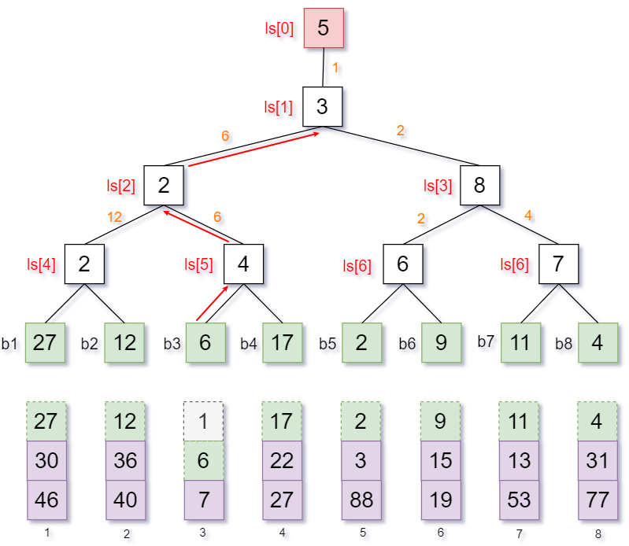
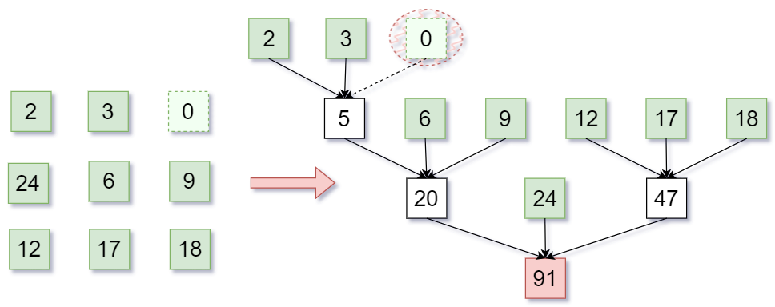

##### 基本概念
1. 排序就是重新排列表中元素使其有序化的过程。
2. 排序算法的稳定性: 待排序表中存在两个元素 $R_i$ 和 $R_j$，其对应的关键字 $key_i=key_j$，若排序前后 $R_i$ 和 $R_j$ 的相对关系不变 (前后关系)，则称算法是稳定的。否则该算法就不稳定。当然讨论算法的稳定性只有在实际问题中才有意义，因此稳定的算法不一定就比不稳定的算法优秀。<br>
3. 对于不稳定算法，只要列出一组不稳定，我们就认为算法不稳定。
4. 除了算法的稳定性之外，排序算法的评价指标还有时间复杂度和空间复杂度。
5. 对于排序算法，分为内部排序和外部排序:
	1. 内部排序，数据都存储在内存中，对此我们需要关注如何使得算法的时间、空间复杂度更低。
	2. 外部排序，数据太多无法全部存入内存，我们还需要关注如何尽可能少的读写磁盘。

---

##### 插入排序

###### 插入排序

1. 对于插入排序: 将整个待排序序列分为两部分：有序序列和无序序列。每一次排序，将无序序列的元素插入到有序区的合适位置。<br>

2. <font color=red>在待排序的元素序列基本有序的前提下，直接插入排序是效率最高的排序算法</font>。

3. 具体实现过程:

   1.  直接插入: 

        ```cpp
        void InsertSort(int arr[], int n)
        {
            int i, j, temp;
            for (i = 1; i < n; i++) 
            {
                // 如果当前元素小于前一个元素
                if (arr[i] < arr[i - 1])
                {
                    // 保存待插入元素
                    temp = arr[i]; 
                    for (j = i - 1; j >= 0 && arr[j] > temp; j--)
                    {
                        arr[j + 1] = arr[j];
                    }
                    // 插入元素
                    arr[j + 1] = temp; 
                }
            }
        }
        ```

        

   2.  带哨兵:

        ```cpp
        void InsertSort(int arr[], int n)
        {
            int i, j;
            for (i = 2; i <= n; i++)
            {
                if (arr[i] < arr[i - 1])
                {
                    // 设置哨兵
                    arr[0] = arr[i];
                    // 从后往前查找插入位置(大的后移)
                    for (j = i - 1; arr[0] < arr[j]; j--)
                    {
                        // 向后挪位
                        arr[j + 1] = arr[j];
                    }
                    // 插入
                    arr[j + 1] = arr[0];
                }
            }
        }
        ```

        

4.  过程演示: 图片来源于网络<br>

5.  算法评价:

    1. 空间复杂度: $O(1)$
    2. 时间复杂度: 时间复杂度只要来源于对比关键字、移动元素。故而时间复杂度为 $O(n^2)$ ​。
    3. 稳定性：显然稳定(每次插入时都是经可能往后插)。

6.  进一步优化: 我们再查找插入位置时，采用的是顺序查找的方式。但是实际上由于在有序区，我们完全可以使用折半查找来找到插入的位置。但是我们只是查找快了，并不会改变移动元素的次数，因此时间复杂度仍然为 $O(n^2)$​​。注意为了保证算法的稳定性，要找"左边界"而不是"右边界"，即我们前面提到的$A$问题而不是$B$问题。

   ```cpp
   void InsertSort(int arr[], int n)
   {
       int low, high, mid, i, j;
       for (i = 2; i < n; i++)
       {
           // 暂存arr[i]
           arr[0] = arr[i];
   
           low = 1;
           high = i - 1;
   
           // 指鹿为马:找比arr[i]小的最大元素
           while (low <= high)
           {
               mid = (low + high) / 2;
               if (arr[mid] > arr[0])
                   high = mid - 1;
               else
                   low = mid + 1;
           }
           // 其实找到的位置是high+1,或者说low
           for (j = i - 1; j >= high + 1; j--)
               arr[j + 1] = arr[j];
           arr[high + 1] = arr[0];
       }
   }
   ```

   

7.  实际上插入排序对链表适用，具体实现略,但时间复杂度仍为$ O(n) $​。

---

###### 希尔排序

1. 前面提到过，对于插入排序而言，若序列基本有序，则使用插入排序是非常快的。而希尔排序就是这个思路。先使得排序序列基本有序，然后插入排序(先局部有序后全局有序)。

2. 希尔排序(又称缩小增量排序)是插入排序的一种，它是针对直接插入排序算法的改进。它通过比较相距一定间隔的元素来进行，各趟比较所用的距离随着算法的进行而减小，直到只比较相邻元素的最后一趟排序为止。

3. 将整个序列切按照一定的间隔$d$取值划分为若干个子序列，每个子序列分别进行插入排序。然后逐渐缩小间隔$d$进行下一轮划分子序列和对子序列进行插入排序(希尔本人建议每次将$d$缩小一半)。直至最后一轮排序间隔为 1，即对整个序列进行插入排序。演示过程如下：<br>

4. 具体实现：

   ```cpp
   void ShellSort(int arr[], int n) {
       int d, i, j;
       // 设置增量d
       for (d = n / 2; d >= 1; d /= 2) {
           //显然前d个元素是有序的(在各自的组内有序)
           for (i = d+1; i <= n; i++) {
   
               if (arr[i] < arr[i-d]) {
   
                   //用arr[0]暂存arr[i]
                   arr[0] = arr[i];
   
                   for (j = i-d; j > 0 && arr[0] < arr[j]; j -= d) {
                       arr[j+d] = arr[j];
                   }
                   arr[j+d] = arr[0];
               }
           }
       }
   }
   ```

   

5. 算法评价：

   1. 适用：仅适用于顺序表，不适用链表。
   2. 时间复杂度：依赖于其增量函数，但是最差为插入排序复杂度$O(n^2)$。
   3. 空间复杂度：$O(1)$。
   4. 稳定性：不稳定，分组时可能将顺序打乱。<br>

6. 


---

##### 交换排序

###### 冒泡排序

1. 冒泡排序法是通过相邻元素之间的比较与交换，使值较小的元素逐步从后面移到前面，值较大的元素从前面移到后面，这个过程就像水底的气泡一样向上冒，这也是冒泡排序法名字的由来。

2. <font color=red>冒泡排序需要移动较多次数的元素，并且排序时间效率比较低。比较适合于排序序列的数据量较小的情况，尤其是当序列的初始状态为基本有序的情况</font>。

3. 过程演示(这里是向后冒泡，代码部分是向前冒泡)：图片来源于网络。<br>

4. 算法评价：

   1. 适用：适用链表。
   2. 时间复杂度：最差为$O(n^2)$(当前序列的顺序于所需顺序相反)，最好时间复杂度$O(n)$(比较$n-1$次，无需交换)。
   3. 空间复杂度：$O(1)$。
   4. 稳定性：由于元素交换是在相邻元素之间进行的，不会改变值相同元素的相对位置，因此，冒泡排序法是一种稳定排序算法。或者说等于的时候不会交换也可以知道冒泡排序是稳定的。

5. 具体实现：

   ```cpp
   void bubbleSort(int arr[], int n) {
       //第n-1次不需要冒泡
       for (int i = 0; i < n - 1; i++) {
           bool flag = false;
   
           for (int j = 0; j < n - i - 1; j++) {
               if (arr[j] > arr[j + 1]) {
                   swap(arr[j], arr[j + 1]);
                   flag = true;
               }
           }
   
           if (!flag) {
               return;
           }
       }
   }
   ```

   ```cpp
   void bubbleSort(int arr[], int n) {
   
       for (int i = 0; i < n - 1; i++) {
           bool flag = false;
   
           for (int j = n - 1; j > i; j--) {
               if (arr[j] < arr[j - 1]) {
                   swap(arr[j], arr[j - 1]);
                   flag = true;
               }
           }
   
           if (!flag) {
               break;
           }
       }
   }
   ```

   ```cpp
   void swap(int &a, int &b) {
       int temp = a;
       a = b;
       b = temp;
   }
   ```

   

6. 我们思考一下：为什么只要一次没有发生交换就说明序列已经有序?我们知道所谓冒泡排序就是相邻元素两两比较，大(小)的往外冒。显然如下图，当$a$和$b$之间没有交换，说明$b$大(小)于$a$,同样的$c$大(小)于$b$​​,故而已经有序。<br>

7. 需要提一点的是：没交换一次，需要移动三次，参考`swap`函数可知。


---

###### 快速排序

1. 快排思路：选取一个枢轴`pivot`，通过一趟排序将无序序列分为独立的两个序列，第一个序列的值均比`pivot`的值小,而第二个序列的值均大于等于`pivot`。然后递归地排列两个子序列，以达到整个序列有序。

2. 模拟过程：图片来自网络。<br>

3. 具体实现：实际上对于快排的实现存在多种方式，其中最常用的就是挖坑法(下面所示)和交换法，均属于双路快排。当然还有三路快排，不详细介绍。

   ```cpp
   int partition(int arr[], int low, int high) {
       int pivot = arr[low]; // 挖坑(low)
       while (low < high) {
   
           while (low < high && arr[high] >= pivot) {
               high--;
           }
           arr[low] = arr[high]; // 填坑(low)并挖坑(high)
           while (low < high && arr[low] <= pivot) {
               low++;
           }
           arr[high] = arr[low]; // 填坑(high)并挖坑(low)
       }
       arr[low] = pivot; // 填最后一个坑
       return low;
   }
   
   void quickSort(int arr[], int low, int high) {
       if (low < high) {
           int pivot = partition(arr, low, high);
           quickSort(arr, low, pivot - 1);
           quickSort(arr, pivot + 1, high);
       }
   }
   ```

   

4. 算法评价：

   1. 时间复杂度：实际上我们几乎每一趟排序需要对所有元素进行遍历，若假设我们一共需要进行$m$趟，则显然时间复杂度为$O(n*m)$，那么最好时间复杂度为$O(nlog_2n)$,最坏时间复杂度$O(n^2)$。
   1. 空间复杂度：显然，我们进行$m$趟，空间复杂度为$O(m)$。那么最好空间复杂度$O(log_2n)$,最坏空间复杂度$O(n)$。
   1. 稳定性：由于枢轴选取的不确定性，显然快排不稳定。<br>
   1. 那么不妨研究一下，对于含有$n$个元素的待排序序列，需要进行几趟排序，即求取$m$的值：其实参考之前的二分查找判定树不难知道(每次将序列分成两部分)，其实就是求含有$n$个结点的二叉树的高度。显然$n \leq m \leq {\lfloor log_2n \rfloor}+1$。

5. 通过对上述时间复杂度的分析，不难看出若是每次选取的枢轴都能将待排序数列划分为均匀的两部分，那么此时算法的效率最高。对此我们可以提出快排的优化方式，在选取枢轴时采取以下思路：

   1. 选取头、中、尾三个位置的元素，取中间值作为枢轴元素。
   2. 随机选取一个元素作为枢轴元素。

6. 上述代码其实还会存在一个疑问，那就是先找`high`和先找`low`有区别吗？如下图，我们先在最右边通过`low`指针找到比枢纽大的元素然后放到枢轴的位置，显然这是不合适的。**故而我们给出一句话：取`low`为枢轴，先从`high`开始找。取`high`为枢轴，先从`low`开始找**。<font color=red>进而不难推出，对于随机枢轴，上述代码是存在问题的，那么如何解决？查阅资料可知：我们在选择随机枢轴后，通过一次交换将该随机枢轴换到`low`位置(也可以换到`high`位置，但是代码顺序需要修改)即可，例如：`swap(arr[randomPivot], arr[low])`</font>。<br>

   

7. 补充：这里补充快排实现的另一种方式左，姑且称之为左右交换：当然对于下述代码，我们选取`low`作为`pivot`，那么依旧需要先`high`后`low`。我们不妨分析一下结束`while`循环时，可能存在几种情况：

   1. `high`指针后退遇到`low`指针(此时`low`经过上一次交换找打比`pivot`小的)，那么显然`arr[low]<arr[pivot]`。

   2. `low`指针前进遇到`high`指针(此时`high`找到一个比`pivot`小的)，那么显然`arr[low]<arr[pivot]`。

   3. 给出具体实现代码：对于随机枢轴的实现同上。

      ```cpp
      void swap(int &a, int &b)
      {
          int temp = a;
          a = b;
          b = temp;
      }
      
      int partition(int arr[], int low, int high)
      {
          int pivot = low;
          while (low < high)
          {
      
              while (low < high && arr[high] >= pivot)
              {
                  high--;
              }
              while (low < high && arr[low] <= pivot)
              {
                  low++;
              }
              swap(arr[low], arr[high]);
          }
          swap(arr[low], arr[pivot]);
      
          return low;
      }
      
      void quickSort(int arr[], int low, int high)
      {
          if (low < high)
          {
              int pivot = partition(arr, low, high);
              quickSort(arr, low, pivot - 1);
              quickSort(arr, pivot + 1, high);
          }
      }
      ```

      

8. 需要说明的是，在408原题中对所有尚未确定位置的所以元素进行一遍处理称为<font color=red>一趟排序</font>，显然这里的一趟不等于<font color=red>一次划分</font>。<font color=red>一次划分</font>只能确定一个元素的最终位置，但是<font color=red>一趟排序</font>能确定多个元素的最终位置。

---

##### 选择排序

###### 简单选择排序

1.  简单来说，选择排序是在每一趟排序中，从未排序部分中选出一个关键字最小(或者最大)的元素，加入到有序序列(其实就是与为排序部分边界元素交换位置)，从而将该元素划分到已排序部分。通俗的讲：将序列分为已排序和未排序两部分，每次在未排序部分选择一个最小位置，将其与未排序部分首位(末位)交换，一步步缩小未排序的部分<br>

2. 过程演示：<br>

3. 代码实现：

   ```cpp
   void swap(int &a, int &b)
   {
       int temp = a;
       a = b;
       b = temp;
   }
   
   void SelectionSort(int arr[], int n)
   {
       for (int i = 0; i < n - 1; i++)
       {
           int min = i;
           // 找到最小值
           for (int j = i + 1; j < n; j++)
           {
               if (arr[j] < arr[min])
               {
                   min = j;
               }
           }
           // 将最小值放到有序区间的末尾(无序区间的开头)
           swap(arr[min], arr[i]);
       }
   }
   ```

   

4. 算法评价：

   1. 时间复杂度：显然时间复杂度为$O(n^2)$，即$(n-1)+(n-2)+\cdots+1=\frac{n(n-1)}{2}$。
   2. 空间复杂度：显然空间复杂度为$O(1)$。
   3. 稳定性：由于存在与无序区元素交换，可能导致不稳定，故而不稳定。<br>
   4. 适用性：既可以适用顺序表，也可以适用链表。


---

###### 堆排序

1. 首先我们需要回顾完全二叉树的知识，对于第$i$个结点，其左孩子为$2i$,右孩子为$2i+1$。

2. 若$n$个关键字序列$L[1\cdots n]$满足下面任意一条性质，则称为堆$heap$​。

   1. 若满足：$L_i \gt L_{2i}$且$L_i \gt L_{2i+1}$($1 \leq i \leq n/2$),则称为大根堆(大顶堆)。其实转换成二叉树就是$root \gt max\{lchild、rchild\}$。<br>
   2. 若满足：$L_i \lt L_{2i}$且$L_i \lt L_{2i+1}$($1 \leq i \leq n/2$),则称为小根堆(小顶堆)。其实转换成二叉树就是$root \lt min\{lchild、rchild\}$。<br>

3. 那么以大根堆为例，对于一个初始数组，如何建立大根堆：

   1. 首先我们肯定是要从逻辑视角出发，我们从最底层开始检查当前结点是否满足$root \gt max\{lchild、rchild\}$,若不满足则将根结点与更大的那个孩子结点互换。
   2. 但是上述的交换，其实是小元素换下来，可能导致下一级的堆结构被破坏，此时就需要采用相同的方式继续向下调整，即<font color=red>"小元素不断下坠"</font>(针对大根堆而言)。<br>

4. 给出建立大根堆的代码实现部分：

   ```cpp
   void buildMaxHeap(int *arr, int len)
   {
       // i>len/2的结点为叶结点，不需要调整
       for (int i = len / 2; i > 0; i--)
       {
           HeadAdjust(arr, i, len);
       }
   }
   
   // 将以k为根的子树调整为大根堆
   void HeadAdjust(int *arr, int k, int len)
   {
       arr[0] = arr[k];
       // 从k的子结点开始
       for (int i = 2 * k; i <= len; i *= 2)
       {
           // 取较大的子结点(注意:相等则仍取左孩子)
           if ( i+1 < len && arr[i] < arr[i + 1])
           {
               i++;
           }
   
           if (arr[0] >= arr[i])
           {
               // 满足大根堆，不需要调整
               break;
           }
           else
           {
               arr[k] = arr[i];
               // 继续调整子树
               k = i;
           }
       }
       // 放入最终位置
       arr[k]=arr[0];
   }
   ```

   > 构建堆时，0 号位置是不放置树节点的，那么根结点 i 的子结点是 2i 和 2i+1。但是若是 0 号位置存储元素，根结点 a 的子结点就是 2a+1 和 2a+2。

5. 堆排序的基本思路：小根堆的实现略。

   1. 将初始序列建堆。

   2. 选择堆顶(即最大或者最小元素)加入有序子序列，即将堆顶元素和最后一个元素互换。

   3. 将待排序元素序列再次调整为对应的堆(小元素不断下坠或者大元素不断下坠)。

   4. 给出最终实现代码(递增序列)：<font color=red>大根堆得到递增序列，小根堆得到递减序列(是相对于下面代码而言的)。</font>

      ```cpp
      void swap(int &a, int &b)
      {
          int temp = a;
          a = b;
          b = temp;
      }
      
      void HeapSort(int *arr, int len)
      {
          buildMaxHeap(arr, len);
          for (int i = len; i > 1; i--)
          {
              swap(arr[i], arr[1]);
              HeadAdjust(arr, 1, i - 1);
          }
      }
      ```

      > 如何理解堆排序呢？首先需要明白建立大根堆或者小根堆，得到的不是一个有序序列或者说是一个部分有序序列。但是有一点是可以确定的，那就是，堆顶元素一定是极值。每次建堆，我们到会得到一个极值，直到最终得到一个有序序列。可以看看[2353. 设计食物评分系统](https://leetcode.cn/problems/design-a-food-rating-system)的堆解法。

6. 算法评价：

   1. 首先需要提一点：一个结点每坠落一层，最多只需要对比关键字2次。若某棵树高$h$,而某个结点在第$i$层，那么最多只需要坠落$h-i$层，即对比关键字$2(h-i)$。
   2. 那么对于一个含有$n$个结点的二叉树，其高度最大为$h=\lfloor log_2n \rfloor+1$，但是实际上只有$[1,h-1]$层需要下坠，故总的关键字对比次数为$2\sum\limits_{i=1}^{h-1}2^{i-1}(h-i)=\sum\limits_{i=1}^{h-1}2^i(h-i) \leq 2n\sum\limits_{i=1}^{h-1}\frac{h-i}{2^{h-i}} \leq 4n$。其中有一步使用到$n \leq 2^h-1$和一步差比数列求和(乘以公比，然后二式作差)。那么显然建堆的过程中关键字的比较次数不会超过$4n$,即为$O(n)$。
   3. 那么在排序过程中，每次都需要重新对根结点进行下坠操作，最多下坠$h-1$层，显然时间复杂度为$O(nlog_2n)$。
   4. 时间复杂度：综上所述$O(n)+O(nlog_2n)=O(nlog_2n)$。
   5. 空间复杂度：$O(1)$。
   6. 稳定性：显然不稳定，从操作上说，依旧是存在将堆顶元素与底部位置元素交换，会破坏稳定性。当然可以举例如下图：<br>

7. 堆的插入：

   1. 将新元素放到表尾。
   2. 若导致父结点的堆结构破坏，则进行调整。但是实际上调整可能会导致更上一层的堆结构发生破坏，需要继续向上调整。例如以小根堆为例，当我们插入一个极小的数，就导致父结点的堆结构破坏，新元素上移。但是小元素上移可能进一步造成爷结点的堆结构破坏，…依次类推，直至不在破坏堆结构为止。
   3. 总而言之：<font color=red>新元素插入到末尾，然后一路上浮，直至无法上浮为止</font>。

8. 堆的删除：

   1. 我们使用堆底的元素替代原来的元素。
   2. 但是实际上这可能导致堆结构的破坏，参考插入的思考逻辑不难看出：我们需要不断让该元素下沉。
   3. 总而言之：<font color=red>删除元素时使用堆底元素替换，然后一路下沉，直至无法下沉为止</font>。

9. <font color=red>堆中元素升降一层需要对比关键字2次</font>。


----

##### 归并排序

1. 归并：将两个或者多个已经有序的序列合并为一个。

2. 对于二路归并只需要每次在两个有序序列中选出一个最小(最大)元素，只需要比较关键字1次。而对于$m$路归并，则需要在$m$个序列中选出最小(最大)的元素，需要比较关键字$m-1$次。

3. 在内部排序中一般采用二路归并，而归并排序的关键部分其实在于如何将两个有序序列归并为一个：每次选取一个最小值，直至一方序列已全部加入，则将另一方序列的剩余元素加入。下面给出具体实现：

   ```cpp
   int *B = (int *)malloc(sizeof(int) * arr_size);
   
   void Merge(int arr[], int low, int mid, int high)
   {
       int i, j, k;
       // 复制arr到辅助数组B
       for (k = low; k <= high; k++)
           B[k] = arr[k];
   
       for (i = low, j = mid + 1, k = i; i <= mid && j <= high; k++)
       {
           // 保证稳定性，使用<=
           if (B[i] <= B[j])
               arr[k] = B[i++];
           else
               arr[k] = B[j++];
       }
   
       while (i <= mid)
           arr[k++] = B[i++];
       while (j <= high)
           arr[k++] = B[j++];
   }
   ```

   

4. 归并排序是采用分治法的一个非常典型的应用，其不断将已有序的子序列合并(初始的有序序列长度为1)，得到完全有序的序列。即先使每个子序列有序，再使子序列段间有序从而得到整体有序。具体实现如下：

   ```cpp
   void MergeSort(int arr[], int low, int high)
   {
       if (low < high)
       {
           int mid = (low + high) / 2;
           MergeSort(arr, low, mid);
           MergeSort(arr, mid + 1, high);
           Merge(arr, low, mid, high);
       }
   }
   ```

   

5. 算法评价：

   1. 空间复杂度：实际上归并排序中分成两部分的思想，仍可以参考二叉树。相当于对叶子结点进行归并操作，最后得到一棵二叉树(实际上这玩意叫做<font color=red>归并树：用来描述$m$归并，并且只有度为$0$和度为$m$的结点的严格$m$叉树</font>)，显然期间经过$h-1$次合并。而叶子结点数最多为$2^{h-1}$个，当归并排序有$n$个元素时，存在关系式$n \leq 2^{h-1}$即$h-1 \leq log_2n$。故而需要排序$\lfloor log_2n \rfloor$次。而每一趟其实都会对所有元素进行一次访问，故而时间复杂度为$O(nlog_2n)$。<br>
   2. 时间复杂度：显然辅助数组需要$O(n)$,递归需要$O(log_2n)$,故而空间复杂度为$O(n)$。
   3. 稳定性：稳定，我们再合并两个序列时，遇到相同元素时优先选择前一个元素，从而保证排序算法的稳定性(见代码部分注释)。

---

##### 基数排序

1. 基数排序是一种不基于比较的排序。其显然各个元素在各位上有序，然后在此基础上再让十位有序，依此类推，最后得到有序序列。当然这里的描述只是作为理解，基数排序并不局限于给整数排序。

2. 对于基数排序，通常采用链式基数排序。我们不妨演示其过程如下：

   1. 实际上，在演示基数排序之前，为了更好的理解演示过程，给出链式队列数组的定义：其中$r$即为基数。

      ```cpp
      typedef struct LinkNode{
          ElemType data;
          struct LinkNode * next;
      }
      
      typedef struct{
          LinkNode * prior,rear; // 队头、队尾指针
      } LinkQueue;
      
      LinkQueue q[r];
      ```

      <br>

   2. 初始时各个元素状态如下：知道是个链表就行，反正排序过程和初始序列的顺序木得啥子关系。<br>

   3. 我们将各个元素按个位分组，若个位为$i$则分至$Q_i$中。<br>

   4. 我们将$Q_i$中的元素依次按照顺序收集，此时个位已经有序(从某种意义上说，也算是一种局部有序)。<font color=red>下面演示的是升序排列，所以从右往左(由小到大)收取元素。若要降序排列则需要由左往右(由大到小)收取元素。</font><br>

   5. 我们在将上面收集到的各个元素按十位分组，若十位为$i$则分至$Q_i$中。<br>

   6. 我们将$Q_i$中的元素依次按照顺序收集，此时个位和十位均已经有序。<br>

   7. 我们在将上面收集到的各个元素按百位分组，若百位为$i$则分至$Q_i$中。<br>

   8. 我们将$Q_i$中的元素依次按照顺序收集，此时元素已经有序。<br>

3. 给出基数排序的算法思路：

   1. 假设长度为$n$的线性表中的每个结点的关键字右由$d$元组$(k_j^{d-1},k_j^{d-2},\cdots,k_j^{1},k_j^0)$组成，其中$0 \leq k_j^i \leq r-1$，则称$r$为基数。
   2. 我们初始时设置$r$个空队列$Q_{r-1},Q_{r-2},\cdots,Q_0$。
   3. 按照各个关键字位权重递增的次序，对$d$个关键字位分别进行分配和收集。
      1. 分配：按照顺序扫描各个元素，若当前关键字位$w$，则将元素分配到队列$Q_w$中。
      2. 收集，将$Q_{r-1},\cdots,Q_0$各个队列中的结点依次出队链接。

4. 算法评价

   1. 时间复杂度：每一次分配$O(n)$,每一次收集$O(r)$(不需要一个个收集，直接将队列的头结点接到收集链表的尾端即可)。故而总的时间复杂度为$O(d(n+r))$。
   2. 空间复杂度：需要$r$个辅助队列，空间复杂度为$O(r)$。
   3. 稳定性：显然每次都是按顺序分配，也是按照顺序收集，排序算法是稳定的。

5. 基于时间复杂度，我们不难知道基数排序的适用场景：
   1. 元素的关键字可以方便的拆为$d$组，且$d$较小。
   2. 每组关键字位的取值范围不大，即$r$较小。
   3. 数据元素的个数$n$较大。

6. 其他使用场景：对学生信息按照出生日期进行降序排列。显然权重：年>月>日(你可以认为比较大小时，先比较的那一位权值高)，我们先按照日分配和降序收集，在按照月，最后按照年。


----


##### 记数排序

1. 使用一个额外的数组`counts`，其中`counts[i]`表示原数组`arr`中值等于`i`的元素个数。然后根据数组`counts`来将`arr`中的元素排到正确的位置。

2. 计数排序也是一种不基于比较的排序算法。

3. 给出演示过程：<br>

4. 具体代码实现：对于网上流传的计数排序似乎并不规范，即没有考虑元素除了关键字不同之外，其他属性也具有独特性，需要整体移动，给出王道书上的代码。

   ```cpp
   // n为input数组长度，k=max{input}-min{input[]}+1(input值域区间长度)
   void CountSort(ElemType input[], ElemType output[], int n, int k)
   {
       int i, count[k];
   
       // 初始化数组
       for (i = 0; i < k; i++)
           count[i] = 0;
   
       // 计数
       for (i = 0; i < n; i++)
           count[input[i]]++;
   
       // 累加(count[i]表示小于等于i的元素个数)
       for (i = 1; i < k; i++)
           count[i] = count[i] + count[i - 1];
   
       // 排序
       for (i = n - 1; i >= 0; i--)
       {
           output[count[input[i]] - 1] = input[i];
           count[input[i]]--;
       }
   }
   ```

   

5. 关于上述算法与网上找到的有些不同，还是需要记录一下。相较于网上查到的主要版本，多了一步累加的步骤。即$count[x]$表示大于等于$x$的元素个数，而不是等于$x$的元素个数。这样就可以快速计算出一个元素在数组中应该存放的位置，即第$count[x]$个位置(从1开始算的话)。故而我们倒序遍历待排序序列，并通过$count[input[i]-1]$计算其在$output$数组中应该存放的位置。然后更正$count$数组。

6. 算法评价：

   1. 时间复杂度：$O(n+k)$,其中k代表待排序序列的值域长度。
   2. 空间复杂度：需要$O(k)$，其中$k$为代表待排序序列的值域长度。
   3. 稳定性：显然由于是逆序遍历$input$数组，依次存放元素，显然稳定。


---

##### 外部排序

###### 归并排序

1. 外部排序：数据元素太多，无法一次全部读取到内存中进行排序。

2. 操作系统以"块"为单位对磁盘存储空间进行管理。磁盘的读写以块为单位，数据读入内存中才能修改，修改后的数据还需要写入磁盘中。

3. 使用归并排序进行外部排序时，最少只需要在内存中分配三块大小的缓冲区进行二路归并即可。

4. 大致过程阐述：

   1. 排序前，磁盘数据如下所示：<br>
   2. 先声明，我们不妨将进行归并排序的$k$个有序序列称为$k$个归并段(或者说把当前进行归并排序的各个序列称为归并段)
   3. 初始话时，依次读取每个块，对块进行排序：<font color=red>下图的初始化内部排序是以块为单位，则得到的初始归并段与块大小一样为$3$。但其实内存允许的话，可以尽可能多的读取磁盘中数据进行内部排序(仍是按照块为单位读取)，这样得到的初始归并段就较长，内部归并的次数就少(根据后面分析可知，效率会提高)</font>。<br>
   4. 以二路归并排序为例，每次读入两部分(大小取决于初始归并段大小)，进行归并排序(font color=red>一旦输入缓冲区满了，就写入磁盘。一旦输入缓冲区空了，就要用所在归并段中后一块补上</font>)：。<br>
   5. 每次读取两个归并段，<font color=red>一旦输入缓冲区满了，就写入磁盘。一旦输入缓冲区空了，就要用所在归并段中后一块补上</font>。<br>

5. 大致就是上面这么个过程，对于上述排序：时间开销=读写外存的时间+内部排序的时间(初始化时各个块内排序的时间)+内部归并的时间。实际上根据操作系统的知识我们知道，读写外存的时间是远远大于另外两个部分的时间。而读写外存又分为内部排序是读写内存块和内部归并排序时读取内存块。

6. 利用前面知识不难知道：<font color=red>对于含有$r$个初始归并块，进行$k$路归并排序，则归并树可以使用$k$叉树表示，若树高$h$，则归并趟数为$=h-1=\lfloor log_kr \rfloor$($r \leq k^{h-1}$)，显然$k$越大，$r$越小越好</font>。于是乎提出下面两种优化方式：

   1. (方式一：增大$k$)多路归并：采用多路归并可以减少归并次数，从而减少磁盘的I/O(input/output)次数。下图给出第一次归并的示意图：<br>

   2. 当然多路归并并不是$k$越大越好，$k$输入缓冲区的大小越大，内存开销增大。同时每挑选一个关键字需要对比关键字$k-1$次(后面使用败者树解决)。

   3. (方式二：减少$r$)减少初始归并段数量：我们通过增加初始归并段的长度，但是这样会导致生成初始归并段的内存工作区变大(后面使用置换选择排序解决)，下面给出内部排序生成初始归并段的示意图：<font color=red>需要说明按照上述的方式生成初始归并段，若含有$N$个记录，内存工作区可以容纳$L$个记录，则初始归并段的数量为$r=N/L$​</font><br>

7. <font color=red>多路平衡归并</font>：以$k$路平衡归并排序为例，满足以下条件：

   1. 最多只能有$k$个归并段归并为一个。
   2. 每一趟归并中，若有$m$个归并段参与归并，则经过这一趟处理得到$\lceil m/k \rceil$个新的归并段(<font color=red>其实就是每次都尽可能的$k$个归并段一起归并，不足$k$个就取最大个数合并</font>)。

   

---

###### 败者树

1. 败者树(当然也有胜者树，就是我们常见的比赛选出最终胜者的方式)：是一种树形选择排序的一种变形，其每个非终端结点表示左、右孩子中的败者，而胜利者则继续同其它的胜者去比较。

2. 败者树可以视为一棵完全二叉树，但是在二叉树的根结点(姑且这么称呼吧)之上多了个父结点。

3. 败者树主要解决多路归并排序带来的关键字对比问题。

4. 演示一下败者树的构造过程：

   1. 一般在归并排序中，败者树的非终端结点保存败者的位置，而不是具体的败者，而参赛者也就是叶子结点一般是虚拟的。故而一般只需要定义一个数组存储所有非终端结点即可：

      ```cpp
      int ls[tree_size]; // ls[0]存储胜者
      ```

      

   2. 下面我们构建一个败者树：由于我们需要找最小的，故而比较时，大者为败保存在当前非终端结点；小者为胜者继续参与上一层的比较。最终得到一个最终获胜者(最小值)。显然，在这个建立败者树的过程中，对于$k$个元素，一共对比了$k-1$次关键字。<br>

   3. 实际上在归并排序中，当我们构建了一棵败者树后，我们取走最终获胜者后，会用一个新的元素顶替最终胜者在叶子结点的位置，并重新调整败者树。但是实际上其他一部分败者不会改变，故而实际上只需要从新元素开始依次向上比较调整败者树即可(实际上类似于堆的不断上浮，直至无法继续上浮)。此时若败者树存在$k$个结点且高为$h$,则只需要比较$h-1$次，实际上我们$k \leq 2^{h-1}$即$h-1=\lceil log_2k \rceil$。<br>

   4. 我们假设$k$路归并一共需要进行$s=\lceil log_kr \rceil$趟归并，每一趟归并$n$个元素，故而总次数约为$\lceil log_kr \rceil n \lceil log_2k \rceil = (n-1)\lceil log_2r \rceil$，与$k$无关了。


---


###### 置换选择排序

1. 由前面知识知道在归并排序中减少初始归并段的个数$r$也可以减少归并趟数$s$。采用内部排序得到的各个初始归并段的长度都相同，它受限于内部排序工作区的大小，于是乎提出了置换选择排序。
2. 选择置换排序的过程如下：我们假设初始待排序文件为$FI$,初始归并段为$FO$，内存工作区为$WA$,且$WA$最所可以容纳$w$个记录。
   1. 我们从$FI$中读取$w$个记录到内存工作区$WA$中。
   2. 从$WA$中选出最小值，记作$MINMAX$记录。
   3. 将$MINMAX$输出到$FO$中去<font color=red>(实际上是先存储到输出缓存区，带缓存区满后再写到磁盘中的$FO$中)</font>。
   4. 若$FI$不为空，则从$FI$读取下一个记录到$WA$<font color=red>(这样描述便于理解但是有些不准确，应该明白实际上还是按照块为单位读取)</font>。
   5. 从$WA$中找比$MINMAX$大的最小值(保障了归并段间的有序性)，记作新的$MINMAX$。
   6. 重复3~5步。直至找不到比$MINMAX$大的最小值，则到此为止找到一个初始归并段。<br>
   7. 重复2~6步，直至$WA$为空(当然此时$FI$​必定已经为空)，由此得到所有的初始归并段。
3. 关于置换选择排序还需说明几点：
   1. 显然每个初始归并段的长度可能不一致。
   2. 无论是从$FI$读取还是向$FO$中写入，仍是以块作为单位，这一点一定要清楚。


---

###### 最佳归并树

1. 我们知道归并树的叶子结点实际上代表通过置换选择算法得到的各个初始归并段。那么如果我们将各个结点的权值赋值为该结点的归并段的块数($l_{归并段}/l_{块}$)，即叶子结点的权值赋值为该初始归并段的块数($l_{初始归并段}/l_{块}$)，如下图：<br>
2. 显然上述的归并排序一共需要读取磁盘(不包含初始时内部排序的读取磁盘数)$6+8+14+16$。参考之前哈夫曼树的$WPL$的两种计算方式，不难知道，归并树的$WPL=读磁盘数=写磁盘数$(不含内部排序部分的I/O操作)，即$IO次数=2WPL$。
3. 那么我们想让归并排序的I/O次数最少，不就转换成了求哈夫曼树的问题，这种满足哈夫曼树的归并树我们称之为最佳归并树，此处就不在过多叙述。
4. 但是还是需要强调一点：<font color=red>对于初始归并段数量无法构成严格的$k$叉归并树时，我们需要补充几个长度为$0$的虚段，然后再进行$k$叉哈夫曼树的构建。</font>那么我们需要研究的是，究竟需要构建几个长度为$0$的虚段呢？首先$k$叉的最佳归并树一定是一棵严格的$k$阶二叉树，即只包含度为$k$、度为$0$的结点。我们假设度为$k$的结点存在$n_k$个，度为$0$的结点$n_0$个，归并树总结点树为$n$​。那么显然有：$n=n_0+n_k$和$n = k*n_k+1$，整理得到$n_k = \frac{n_0-1}{k-1}$为整数。故：
   1. 若$(n_0-1)\%(k-1)=0$,则说明刚好可以构成一棵严格$k$阶二叉树，无需添加虚段。
   2. 若$(n_0-1)\%(k-1)=u \not = 0$,则需添加$(k-1)-u$​个长度为零的虚段。
5. 给出一个3叉最佳归并树的构建过程演示：<br>


​																										    我思故我在！

​																										2024.4.13  21:16	

​																											    梦鱼
