### 1.线性表

##### 顺序表

1.   顺序表的定义：

     1.   静态分配：定义时直接定义为`ElemType []`数组类型，此外静态分配无需手动销毁。

          ```cpp
          #include <iostream>
          #define MaxSize 100
          
          typedef struct{
              int data [MaxSize]; //存放顺序表元素
              int length;  //记录顺序表的当前长度
          } SqList; 
          
          bool InitList(SqList &L){
              L.length = 0;
              return true;
          }
          ```

          

     2.   动态分配：定义时使用`ElemType *`定义动态数组的指针，在初始化时使用`malloc`函数分配一整片内存。需要使用`free()`函数手动释放内存空间。

          ```cpp
          #include <iostream>
          #define InitSize 100
          typedef struct{
              int *data;  //指示动态分配数组的指针
              int MaxSize;  //记录顺序表的最大长度
              int length;  //记录顺序表的当前长度
          } SqList; 
          
          bool InitList(SqList &L){
              //分配内存
              L.data = (int *)malloc(InitSize * sizeof(int));  
          
              //判断内存是否分配成功
              if(L.data==NULL){
                  return false;
              }
              L.length = 0;
              L.MaxSize = InitSize;
              return true;
          }
          
          int main(){
              SqList L;
              InitList(L);
              return 0;
          }
          ```

          

2.   补充：动态的增加数组的长度(动态分配为例)。如果是直接`p=L.data`,让后直接对`L.data`重新分配内存，当分配失败时直接返回`NULL`,此时函数返回`false`会导致原数据丢失。

     ```cpp
     bool autoExtend(SqList &L){
         int *p;
         //也可以使用realloc函数重新分配内存
         p = (int *)calloc(L.MaxSize + 10, sizeof(int));
         if (p==NULL){
             return false;
         }
         for(int i=0;i<L.length;i++){
             p[i] = L.data[i];
         }
         free(L.data); 
     
         L.data = p;
         L.MaxSize += 10;
         return true;
     }
     ```

     

3.   插入和删除

     1.   插入：判断位序是否合理($i$​的取值是`1~L.length+1`)，判断顺序表是否已满，将第`i`个元素及其后面的元素依次后移(注意从最后一个开始移动)，最后在第$i$​的位置插入新的元素即可，注意不要漏掉了`length++`。

          ```cpp
          bool ListInsert(SqList &L, int i, int e) // 插入时i是位序(从1开始计数)
          {
              if (i < 1 || i > L.length + 1) // 考点：i的取值是1~L.length+1
              {
                  return false;
              }
              if (L.length >= L.MaxSize)
              {
                  return false;
              }
              for (int j = L.length; j >= i; j--) // 从i开始元素依次后移
              {
                  L.data[j] = L.data[j - 1];
              }
              L.data[i - 1] = e; // 插入新元素
              L.length++;
              return true;
          }
          ```

          

     2.   删除：判断位序是否合理($i$的取值是`1~L.length`)，将第$i+1$​个元素及其后面的元素依次前移(注意是从第`i+1`个开始移动)，注意不要漏掉了`length--`。

          ```cpp
          bool ListDelete(SqList &L, int i, int &e)
          {
              if (i < 1 || i > L.length) // 考点：删除时i的取值是1~L.length
              {
                  return false;
              }
              e = L.data[i - 1];
              for (int j = i; j < L.length; j++) // 从第i+1开始元素依次前移
              {
                  L.data[j - 1] = L.data[j];
              }
              L.length--;
              return true;
          }
          ```

     

4.   查找

     1.   按值查找：遍历查找即可。

          ```cpp
          int LocateElem(SqList L, int e)
          {
              for (int i = 0; i < L.length; i++)
              {
                  if (L.data[i] == e)
                  {
                      return i + 1; // 返回位序
                  }
              }
              return 0;
          }
          ```

          

     2.   按位查找：首先判断位序是否合理($i$的取值是`1~L.length`)，由于<span style="color:red">顺序表的随机存储特性</span>，直接返回结果即可。

          ```cpp
          int GetElem(SqList L, int i) 
          {
              if (i < 1 || i > L.length) // 考点：查找时i的取值是1~L.length
              {
                  return -1;
              }
              return L.data[i - 1];
          }
          ```

     

5.   其他操作：

     1.   判空：

          ```cpp
          bool Empty(SqList L)
          {
              if (L.length == 0)
              {
                  return true;
              }
              else
              {
                  return false;
              }
          }
          ```

          

     2.   求表长：

          ```cpp
          int Length(SqList L)
          {
              return L.length;
          }
          ```

          

     3.   销毁：

          ```cpp
          bool destoryList(SqList &L)
          {
              free(L.data);
              L.length = 0;
              L.MaxSize = 0;
              return true;
          }
          ```

          

     4.   输出：

          ```cpp
          void PrintList(SqList L)
          {
              for (int i = 0; i < L.length; i++)
              {
                  printf("%d ", L.data[i]);
              }
              printf("\n");
          }
          ```

          


---


##### 单向链表

1.   初始化：分带头结点和不带头结点(推荐)，后续均以带头结为例。

     1.   带头结点：创建头结点，分配内存。头结点的`next`指向`NULL`。

          ```cpp
          //带头节点
          #include <iostream>
          
          typedef struct LNode {
              int data;
              struct LNode *next; //struct LNode是定义的类型名
          } LNode, *LinkList;
          
          bool initList(LinkList &L){
              L = (LNode *)malloc(sizeof(LNode));
              if(L == NULL){
                  return false;
              }
              L->next = NULL;
              return true;
          }
          ```

          

     2.   不带头结点：指向`NULL`即可。

          ```cpp
          //不带头节点
          #include <iostream>
          
          typedef struct LNode {
              int data;
              struct LNode *next; //struct LNode是定义的类型名
          } LNode, *LinkList;
          
          bool initList(LinkList &L){
              L = NULL;
              return true;
          }
          ```

          

2.   为什么要设立头结点？ 可以对链表统一操作，边界操作统一。

3.   单链表的查找：

     1.   按位查找：判断位序是否合理，遍历查找(找到或者遍历到末尾则结束查找)，返回查找结果。

          ```cpp
          LNode *getElem(LinkList L, int i)
          {
              if (i < 0)
              {
                  return NULL;
              }
          
              /* 
              if (i==0){
                  return L;
              }
              int j = 1;
              LNode *p=L->next; 
              */
          
              LNode *p = L;
              int j = 0;
              while (j < i && p != NULL)
              {
                  p = p->next;
                  i--;
              }
          
              /* 
              if (p == NULL)
              {
                  return NULL;
              } 
              */
              return p;
          }
          ```
          
          
          
     2.   按值查找：直接遍历查找即可。

          ```cpp
          LNode *locateElem(LinkList L, int e)
          {
              LNode *p = L->next;
              while (p != NULL && p->data != e)
              {
          
                  p = p->next;
              }
              return p;
          }
          ```

     

4.   插入：

     1.   前插：若在第$i$位置插入，需要找到第$i-1$个结点(在第$i-1$个结点后插入)。注意顺序，若先将`p.next`指向`s`。我们将无法访问到原本的`p.next`结点。<br>

          ```cpp
          bool ListInsert(LinkList &L, int i, int e)
          {
              // 找到第i-1个节点
              if (i < 1)
                  return false;
              LNode *p = L;
              int j = 0;
              while (j < i - 1 && p != NULL)
              {
                  p = p->next;
                  j++;
              }
          
              if (p == NULL) // i值不合法
                  return false;
          
              LNode *s = (LNode *)malloc(sizeof(LNode));
              s->data = e;
          
              s->next = p->next;
              p->next = s;
              return true;
          }
          ```

          

     2.   前插：忽略上述内容，如果对于一个结点`p`,我们如何在`p`结点前面插入一个结点？由于单链表的局限性，我们无法直接访问到`p`节点的的前一个结点(除非从头开始遍历一遍)。我们不妨仍然对`p`结点进行后插`s`结点，然后交换`p`与`s`结点的数据。

          ```cpp
          //后插
          s->next = p->next;
          p->next = s;
          
          //交换数据
          temp = p->data;
          p->data = s->data;
          s->data = temp;
          ```

          

5.   单链表的建立：<span style="color:red">需要重点注意头插法数据的顺序与插入的顺序是相反的，可以用于逆置链表。</span>

     1.   头插法：每次插入结点都在头结点后面进行。需要注意的是`s`结点是不能在定义时分配内存的，`s`需要再循环中迭代，每次迭代需要重新为`s`分配新的空间。

          ```cpp
          LinkList List_HeadInsert(LinkList &L)
          {
              L = (LNode *)malloc(sizeof(LNode));
              L->next = NULL;
          
              int x;
              LNode *s; // s此时不能分配空间
              scanf("%d", &x);
          
              while (x != 9999)
              {
                  s = = (LNode *)malloc(sizeof(LNode));
                  if (L == NULL)
                      return NULL;
                  s->data = x;
                  s->next = L->next;
                  L->next = s;
                  scanf("%d", &x);
              }
              return L;
          }
          ```

     2.   尾插法：每次插入结点都在尾部进行。既然要在尾部进行，肯定需要访问到尾结点，有时候似乎不那么容易，此时一般需要设置一个尾指针指向尾结点的位置。

          ```cpp
          LinkList List_TailInsert(LinkList &L)
          {
              int x;
              LNode *s, *r = L; // r指向尾节点,s此时不能分配空间
              scanf("%d", &x);
          
              while (x != 9999)
              {
                  s = (LNode *)malloc(sizeof(LNode));
                  if (L == NULL)
                  	return NULL;
                  //建议s->next = NULL
                  s->data = x;
                  r->next = s;
                  r = s;
                  scanf("%d", &x);
              }
              r->next = NULL;
              return L;
          }
          ```

     3.   `List_TailInsert(LinkList &L)`方法为啥要返回`LinkList`类型，不返回不也可以吗？反正参数是引用`LinkList &L`。对此``github copilot``是这样回答的：`List_TailInsert()`方法返回`LinkList`类型主要是为了提供链式操作的可能性。这样，你可以在一个语句中连续调用多个操作，例如`List_TailInsert(List_TailInsert(L))`。

6.   删除：找到要删除节点的前一个结点，注意$i$值合法性的判断条件`p == NULL || p->next == NULL`,即前一个结点是否存在以及该结点是否存在。<br>

     ```cpp
     bool ListDelete(LinkList &L, int i, int &e)
     {
         if (i < 1)
             return NULL;
         LNode *p = L;
         int j = 0;
         while (j < i - 1 && p != NULL)
         {
             p = p->next;
             j++;
         }
     
         if (p == NULL || p->next == NULL) // i值不合法(删除节点不存在)
             return false;
     
         LNode *q = p->next; // q指向被删除的节点
         e = q->data;
         p->next = q->next;
         free(q);
         return true;
     }
     ```

7.   对于单向链表的几个要点：

     1.   不论是插入、删除，一般是找到其前一个结点后才进行后续操作。
     
     2.   对于遍历指针`p`，若`p->next=NULL`，则其指向尾结点。此时说明`p`不存在后继结点，对于删除而言是不合理的，至于插入则是合理的(尾插嘛)。
     
     3.   对于遍历指针`p`，若`p=NULL`，则整个链表已经遍历完毕。此时对于查找来说是没找到，对于插入、删除来说是不合理的(指定位置的前一个位置就已经出界了，就跟别提指定位置了)。
     
     4.   链表的销毁其实和删除过程类似，遍历并依次释放各个结点的空间。 如下为带头节点的单链表的销毁过程。
     
          ```cpp
          bool DestroyList(LinkList &L)
          {
              LNode *p;
              while (L)
              {
                  p = L;
                  L = L->next;
                  free(p);
              }
              return true;
          }
          ```
     
          


---


##### 双向链表

1.   暂只考虑带头结点的情况：

     ```cpp
     #include <iostream>
     
     typedef struct DLNode
     {
         int data;
         struct DLNode *prior, *next;
     } DLNode, *DLinkList;
     ```

     

2.   初始化：

     ```cpp
     bool initList(DLinkList &L)
     {
         L = (DLNode *)malloc(sizeof(DLNode));
         if (L == NULL)
         {
             return false;
         }
         L->next = NULL;
         L->prior = NULL;
         return true;
     }
     ```

     

3.   插入：

     1.   同单链表插入形式差不多，同样要先将`p`结点的后一个结点的访问形式保存，防止后面丢失。

          ```cpp
          //p->s->l
          
          //s、l互指
          s->next = p->next;
          p->next->prior = s;
          
          // p、s互指
          p->next = s;
          s->prior = p;
          ```

          

     2.   但是在实际操作时，我们还需要考虑`l`结点的存在与否。

          ```cpp
          //p->s->l
          
          //s、l互指
          s->next = p->next;
          if(p->next!=NULL)
              p->next->prior = s;
          
          // p、s互指
          p->next = s;
          s->prior = p;
          ```

4.   删除：同样的需要考虑`l`结点的存在性问题。别忘了设置一个指向删除结点的指针用于后续释放内存。

     

---


##### 循环链表

1.   对于循环链表，若我们经常对链表首尾操作，可以使用循环链表，并建一个尾指针。

2.   在循环链表中，头结点的优势就体现出来了，我们无需建一个头指针作为标记。

3.   循环单链表：

     1.   初始化：

          ```cpp
          #include <iostream>
          
          typedef struct LNode
          {
              int data;
              struct LNode *next; 
          } LNode, *LinkList;
          
          bool initList(LinkList &L)
          {
              L = (LNode *)malloc(sizeof(LNode));
              if (L == NULL)
              {
                  return false;
              }
              L->next = L;  // 自个指向自个
              return true;
          }
          ```

          

     2.   判空：当头结点指向自己时链表为空。

          ```cpp
          bool empty(LinkList L)
          {
              if (L->next == L)
              {
                  return true;
              }
              return false;
          }
          ```

     3.   链表尾部：当`p->next=L`时，`p`为意义上的尾结点。

4.   循环双链表：

     1.   初始化：

          ```cpp
          #include <iostream>
          
          typedef struct DLNode
          {
              int data;
              struct DLNode *prior, *next;
          } DLNode, *DLinkList;
          
          bool initList(DLinkList &L)
          {
              L = (DLNode *)malloc(sizeof(DLNode));
              if (L == NULL)
              {
                  return false;
              }
              L->next = L;
              L->prior = L; // 双向循环链表
              return true;
          }
          ```

          

     2.   判空以及判断尾结点逻辑同上。


---


##### 静态链表

1.   `next`记录的是索引而不再是指针。其中$0$位置作为头结点，`next=-1`所在结点为尾结点。

     ```cpp
     #include <iostream>
     #define MAXSIZE 100
     
     typedef struct Node{
         int data;
         int next;
     } SLinkList[MAXSIZE];
     
     SLinkList L;
     ```

     


### 2.栈和队列


##### 顺序栈

1.   结构定义：由于栈的后进先出，只在一端进行操作，故只需额外记录一个栈顶指针即可。

     ```cpp
     #include <iostream>
     #define MaxSize 50
     using namespace std;
     
     typedef int ElemType;
     
     typedef struct Stack{
         ElemType data[MaxSize];
         int top; // 栈顶指针
     } Stack;
     
     
     ```

     

2.   初始化：初始化时赋予栈顶指针`top=-1`，从而使其指向当前栈顶元素。

     ```cpp
     // 初始化栈(top指向栈顶元素)
     void InitStack(Stack &S){
         S.top = -1; 
     }
     ```

     

3.     判断是否为空：

     ```cpp
     // 判断栈是否为空
     bool StackEmpty(Stack S){
         if(S.top == -1){
             return true;
         }else{
             return false;
         }
     }
     ```

     

4.   入栈：判断栈是否已满，由于`top`指向当前栈顶元素，故入栈时需先`top+1`后元素入栈。

     ```cpp
     // 进栈
     bool Push(Stack &S, ElemType x){
         if(S.top == MaxSize - 1){
             return false;
         }
         S.data[++S.top] = x; // 先top+1，再赋值
         return true;
     }
     
     ```

     

5.   获取栈顶元素：判断栈是否为空，合适时返回栈顶元素，但元素不出栈。

     ```cpp
     // 取栈顶元素
     bool GetTop(Stack S, ElemType &x){
         if(S.top == -1){
             return false;
         }
         x = S.data[S.top];
         return true;
     }
     ```

     

6.   出栈：判断栈是否为空，由于`top`指向当前栈顶元素，故入栈时需先记录当前元素(元素出栈)，后`top-1`。实际上此时出栈的元素只是在逻辑上删除了，只有下一次该位置有元素进栈时才真正在内存中被覆盖。

     ```cpp
     // 出栈
     bool Pop(Stack &S, ElemType &x){
         if(S.top == -1){
             return false;
         }
         x = S.data[S.top--]; // 先赋值，再top-1
         return true;
     }
     ```

     

7.   一些概念：

     1.   上溢：栈满时，继续进栈。
     2.   下溢:栈空时，继续出栈。

8.   初始化时除了可以赋予栈顶指针`top=-1`使其指向当前栈顶元素外，还可以`top=0`,使其指向当前栈顶元素的下一个位置，此时判空、获取栈顶元素、进栈、出栈的逻辑需要相应修改。

     

---


##### 共享栈

1.   共享栈：两个栈公用一片空间，能够提高空间利用率，但是容易发生上溢。

2.   结构定义以及初始化：

     ```cpp
     #include <iostream>
     #define MaxSize 200
     typedef int ElemType;
     
     typedef
         struct Stack {
             ElemType data[MaxSize];
             int top_1;
             int top_2;
         } Stack;    
     
     void InitStack(Stack &S) {
         S.top_1 = -1;
         S.top_2 = MaxSize;
     }
     ```

     


---


##### 链栈

1.   使用单链表实现栈其实就是按照头插法建立链表，并始终在头部删除节点而已。不推荐使用循环单链表，画蛇添足，每次操作还需要将链表连成循环链表。

2.   结构定义：同单链表结构一致。

     ```cpp
     #include <iostream>
     
     typedef int ElemType;
     
     typedef struct LNode {
         ElemType data;
         struct LNode *next;
     } LNode, *LinkStack;
     ```

     

3.   初始化：不同于单链表，链栈只需对表头进行操作，因此推荐使用不带头结点的链表实现(头结点占用空间，还使操作更繁琐)。

     ```cpp
     // 初始化栈(不带头结点)（推荐）
     void InitStack(LinkStack &S) { 
         S = NULL;
     }
     ```

     

4.   判空：

     ```cpp
     // 判断栈是否为空
     bool StackEmpty(LinkStack S) {
         if(S == NULL) {
             return true;
         } else {
             return false;
         }
     }
     ```

     

5.   进栈：虽然理论上链栈长度不限，但是也不能无线增长下去。

     ```cpp
     // 进栈
     void Push(LinkStack &S, ElemType x) {
         LNode *p = (LNode*)malloc(sizeof(LNode));
         p->data = x;
         //p->next = NULL;
         p->next = S;
         S = p;
     }
     ```

     

6.   出栈：判空，然后出栈，释放空间。

     ```cpp
     // 出栈
     bool Pop(LinkStack &S, ElemType &x) {
         if(StackEmpty(S)) {
             return false;
         }
         LNode *p = S;
         x = p->data;
         S = S->next;
         free(p);
         return true;
     }
     ```

     

7.   获取栈顶元素：

     ```cpp
     // 取栈顶元素
     bool GetTop(LinkStack S, ElemType &x) {
         if(StackEmpty(S)) {
             return false;
         }
         x = S->data;
         return true;
     }
     ```


---


##### 顺序队列

1.   队列需要对线性表进行头尾操作，因此需要设置两个指针用于指向头尾。

     ```cpp
     #include <iostream>
     #define MaxSize 50
     typedef int ElemType;
     
     typedef struct {
         ElemType data[MaxSize];
         int front; // 队头指针
         int rear; // 队尾指针
     } sqQueue;
     ```

     

2.   初始化：我们以`front`指向队头元素、`rear`指向队尾元素的下一个位置为例。我们不妨分析一下，当第一个元素入队时，我们应该会`rear`指针$+1$。按照上述规则，显然我们初始化时应当让`front`和`rear`均指向0。

     ```cpp
     // 初始化队列
     void InitQueue(sqQueue &Q) {
         //执行顺序：先执行Q.rear = 0，再执行Q.front= Q.rear
         Q.front = Q.rear = 0;
     }
     ```

     

3.   判空：

     ```cpp
     // 判断队列是否为空
     bool QueueEmpty(sqQueue Q) {
         if(Q.front == Q.rear) {
             return true;
         } else {
             return false;
         }
     }
     ```

     

4.   在执行入队逻辑之前，我们还需要考虑一个问题，如何判断队列已满。为了重复利用空间，我们采用循环队列的实现方式。但是这样也就导致了当队列已满或队列为空时都有`rear=front`。此时我们大致有以下三种解决方式：

     1.   (推荐)空出一个位置作为间隔：则队列满的条件变为`(rear+1)%MaxSize=front`，但同时也导致了队列最多能存储`MaxSize-1`个元素。
     2.   设置一个`size`字段记录队列的元素个数，初始化时`size=0`,同样的会增加一个数据成员`size`。
     3.   我们不难想到，只有队列入队时可能会造成队列满，队列出队时会造成队列为空。故而我们设置一个`tag`数据成员，当入队成功时执行`tag=1`,当出队成功时我们执行`tag=0`。初始时显然要执行`tag=0`。
          1.   当`tag=1`且`rear=front`时显然队列已满。
          2.   当`tag=0且`rear=front`时显然队列为空。

5.   入队：先判断队列是否已满，未满则插入元素后`rear`后移(`Q.rear = (Q.rear + 1) % MaxSize`)。

     ```cpp
     bool EnQueue(sqQueue &Q, ElemType x)
     {
         // 判断队列是否已满
         if ((Q.rear + 1) % MaxSize == Q.front)
         {
             return false;
         }
         Q.data[Q.rear] = x;
     
         Q.rear = (Q.rear + 1) % MaxSize;
         return true;
     }
     ```

     

6.   出队：先判断队列是否为空，不为空则取出元素后`front`后移(`Q.front= (Q.front+ 1) % MaxSize`)。

     ```cpp
     bool DeQueue(sqQueue &Q, ElemType &x)
     {
         if (Q.front == Q.rear)
         {
             return false;
         }
         x = Q.data[Q.front];
         Q.front = (Q.front + 1) % MaxSize;
         return true;
     }
     ```

     

7.   获取队首元素：

     ```cpp
     bool GetHead(sqQueue Q, ElemType &x)
     {
         if (Q.front == Q.rear)
         {
             return false;
         }
         x = Q.data[Q.front];
         return true;
     }
     ```

     

8.   同栈一样，初始化`front`和`rear`时也可以采取不同的方式，例如让`front`指向队头元素的上一个元素、`rear`指向队尾元素等。但是这样做缺乏一定的合理性。但不排除有这种做法。


----


##### 链式队列

1. 对于链式队列，我们除了定义一个`LNode`之外，还可以定义一个`LinkQueue`管理队列。

   ```cpp
   #include <iostream>
   typedef int ElemType;
   
   typedef struct LinkNode
   {
       ElemType data;
       LinkNode *next;
   } LinkNode;
   
   typedef struct
   {
       LinkNode *front;
       LinkNode *rear;
   } LinkQueue;
   
   
   ```

   

2. 初始化：我们采用不带头结点的链表实现队列。

   ```cpp
   void InitQueue(LinkQueue &Q)
   {
       Q.front = NULL;
       Q.rear = NULL;
   }
   ```

   

3. 判断是否为空： 判断是否为空，即`front=0`。

   ```cpp
   bool QueueEmpty(LinkQueue Q)
   {
       // 若带头结点则判断Q.front == Q.rear
       if (Q.front == NULL)
       {
           return true;
       }
       else
       {
           return false;
       }
   }
   ```

   

4. 入队：不同于带头结点的链表，不带头结点的链表的操作有些特殊。当入队前队列为空时，我们是无法执行插入逻辑的,此时`rear`为`NULL`，指行`rear->next`会报空指针。

   ```cpp
   void EnQueue(LinkQueue &Q, ElemType x)
   {
       LinkNode *s = (LinkNode *)malloc(sizeof(LinkNode));
       s->data = x;
       s->next = NULL;
   
       // 对空队列进行特殊处理
       if (Q.rear == NULL)
       {
           Q.front = s;
           Q.rear = s;
       }
       else
       {
           Q.rear->next = s;
           // 修改队尾指针
           Q.rear = s;
       }
   }
   ```

   

5. 出队：当删除后队列为空时，我么需要重新将`front`、`rear`设置为`NULL`。

   ```cpp
   bool DeQueue(LinkQueue &Q, ElemType &x)
   {
       if (Q.front == NULL)
       {
           return false;
       }
       LinkNode *p = Q.front;
       x = p->data;
       Q.front = p->next;
   
       // 如果出队后队列为空，需要修改指针
       if (Q.rear == p)
       {
           Q.rear = NULL;
           Q.front = NULL;
       }
       free(p);
       return true;
   }
   ```

6. 获取队头元素：

   ```cpp
   
   bool GetHead(LinkQueue Q, ElemType &x)
   {
       if (Q.front == NULL)
       {
           return false;
       }
       x = Q.front->data;
       return true;
   }
   ```


----

##### 栈和队列的应用

1. 括号匹配:
2. 中缀表达式转后缀表达式(重点)：左优先原则，设置操作符栈。
3. 后缀表达式求值(重点)：设置操作数栈。


---


### 3. 串

##### 串的实现以及基本操作

1. 顺序存储实现串可以分为：不论哪一种，一般我们默许数组索引为0的位置不使用。

   1. 定长顺序存储:

      ```cpp
      #include <iostream>
      #define MaxLen 50
      
      typedef struct {
          char ch[MaxLen];
          int length;
      }SString;
      ```

      

   2. 堆分配存储:

      ```cpp
      #include <iostream>
      #define MaxLen 50
      
      typedef struct {
          char *ch;
          int length;
      }HString;
      
      bool InitString(HString &S) {
          S.ch = (char *)malloc(sizeof(char)*MaxLen);
          if(S.ch==NULL) {
              return false;
          }
          S.length = 0;
          return true;
      }
      ```

      

2. 我们以定长分配为例，编写串的基本操作(似乎不在考纲要求之内略)

   1. 比较：

      ```cpp
      int StrCompare(SString S, SString T)
      {
          for (int i = 1; i <= S.length && i <= T.length; i++)
          {
              if (S.ch[i] != T.ch[i])
              {
                  return S.ch[i] - T.ch[i];
              }
          }
          //谁长谁大
          return S.length - T.length;
      }
      ```

      

   2. 查找：具体参考`BF`和`KMP`算法。

      ```cpp
      int Index(SString S, SString T)
      {
          int i = 1, n = S.length, m = T.length;
          SString sub;
          while (i <= n - m + 1) //要保证子串的长度是m
          {
              SubString(sub, S, i, m);
              if (StrCompare(sub, T) != 0)
              {
                  i++;
              }
              else
              {
                  return i;
              }
          }
          return 0;
      }
      ```

      

   3. 求子串：

      ```cpp
      bool SubString(SString &Sub, SString S, int pos, int len)
      {
          //从pos到pos+len-1的长度正好是len
          for (int i = pos; i < pos + len; i++)
          {
              Sub.ch[i - pos + 1] = S.ch[i];
          }
          Sub.length = len;
          return true;
      }
      ```

      

3. 链式存储结构：字符的字节很小，为了提高链表的存储密度，我们通常一个节点存储多个字符。

   ```cpp
   #include <iostream>
   typedef struct {
       char data[4];
       StringNode *next;
   }StringNode,*String;
   ```

   

---


##### BF算法

1. 首先声明，一般而言字符串的索引为0的位置是存储元素的，可以试着忽略它从1开始考虑。我们不妨先给出其代码：

   ```cpp
   #include <iostream>
   #define MaxLen 50
   typedef struct {
       char ch[MaxLen];
       int length; // 串的实际长度(从索引1开始，0号索引不存放元素)
   }SString;
   
   
   
   int BF(SString S, SString T) {
       int i = 1, j = 1;
       while(i <= S.length && j <= T.length) {
           if(S.ch[i] == T.ch[j]) {
               //匹配成功，继续比较下一个字符
               i++;
               j++;
           } else {
               //匹配失败，i回溯到上次匹配首位的下一位，j回溯到T的首位
               i = i - j + 2;
               j = 1;
           }
       }
       if(j > T.length) {
           //为啥不是i - j + 1呢?一样的,此时j=T.length+1
           return i - T.length;
       } else {
           return 0;
       }
   }
   ```

   

2. 所谓BF算法就是将主串的每一个位置开始的子串去匹配模式串。具体参考下图的回溯方法：<br>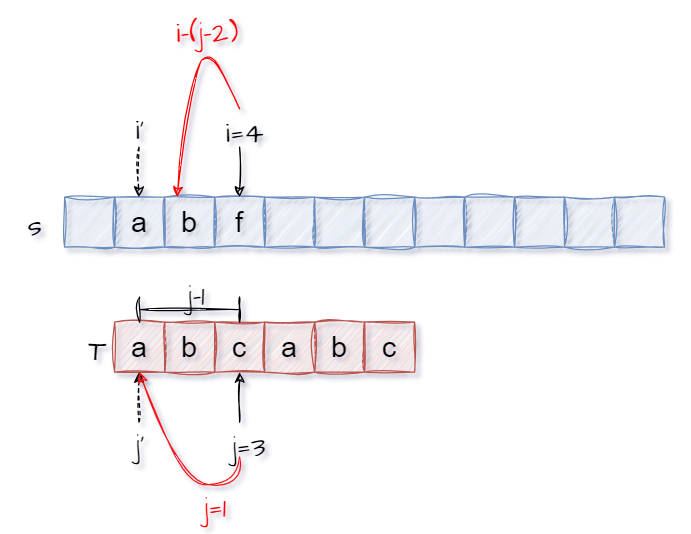

3. 当完成遍历找到子串后，参考如下：<br>


---


##### KMP算法

1. 个人觉得KMP算法是一个很哲学的算法，在我看来它的本质就是牺牲一部分已经获得的东西(舍去部分已成功的匹配)，去博取更大的利益(更长的匹配)。但是由于人的贪婪，为了得到利益的最大化(使得模式串全部匹配)，每次只舍得给出最少的必要牺牲(最小回溯或者说最大后缀)。对此不妨先放一句话：<span style="color:red">当我们发现当前的匹配方式是不行的(`i`和`j`不匹配)，那么我们尝试牺牲尽可能短的已匹配部分，从而使得`i`、`j`位置可能再次匹配，作为下一次尝试的匹配方案，如`i`、`j`还不匹配，则继续牺牲。这种牺牲方式就会必然导致求解与前缀相等的最长后缀问题的出现。</span>

2. 在研究KMP之前我们不妨先回顾一下BF算法：如下图，我们先不考虑其他的有的没的，按照BF算法的逻辑，由于`f`和`c`的不匹配，接下来将回溯`i=3、j=1`。<br>

3. 那么对于这种回溯方式是否可以进一步优化吗?显然可以。在此之前，我们不妨研究一下,子串匹配的一些特点：
   1.   当`S`的`i`位置与`T`的`j`位置不匹配时，显然此前的`j-1`个位置都是匹配的。<br>
   2.   由于当前并没有找的匹配模式串`T`的子串(`j-1<T.length`)，故而如果`S`以这`j-1`个位置中某个位置`k`为首的子串能匹配模式串，那么必然会有一件事发生：即从`k`一直到`i-1`都能与`T`串匹配(显然这种情况下`i`无需变动,下一次仍然从`i`开始继续匹配)，也就会产生下图中完全相同的前缀和后缀两部分(我们可以从这一点出发找下一次的匹配起始点，`T`中的`f`),此外显然该后缀不等于`T`(前`j-1`个元素不可能是`T`不然就已经找到结果了)<br>
   3. 那么显然，为了不错过正确匹配方式，我们只需要找到已匹配位置中与前缀相等的最大后缀(不等于`T`)，直接从该最大后缀开始重新匹配就行(不是最大就可能会错过，我们必须保证正确的情况下才去尽可能跳到远些)。换句话说就是我们发现当前的匹配方式是不行的(`i`和`j`不匹配)，那么我们尝试牺牲尽可能短的已匹配部分，从而使得`i`、`j`位置可能再次匹配，作为下一次尝试的匹配方案，如`i`、`j`还不匹配，则继续牺牲。这种牺牲方式就会必然导致与前缀相等的最长后缀问题的出现。

4. 其实通过上述分析，我们大致已经理解了KMP算法的基本思想，保持`i`不变，通过某种算法逻辑对`j`进行回溯(BF算法`i、j`都进行回溯)。并且显然这种回溯只和模式串`T`有关。
   1. 其实本质上就是找`T`中与前缀相同(且不等于`T`)的最大后缀，从该最大后缀在`T`中的后一个位置开始重新匹配，故而我们不妨设置一个数组`next[T.length+1]`,我们假设`next[k]`表示模式串`T`的前`k-1`中与前缀相等的最大后缀长度。此外`next[k]+1`也表示当`j=i`时主串`S`和`T`模式串不匹配下一次`j`的回溯位置(后缀部分与前缀部分完全相等，已经可以通过上一次的匹配得出是匹配的)。这显然有点冗余，故而我们不妨直接将`next[k]=l(最大相等前后缀的长度)+1`，即`next[k]`便是`j=k`时主串`S`和`T`模式串不匹配下一次`j`的回溯位置。<br>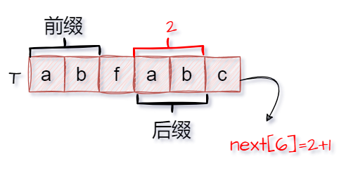<br>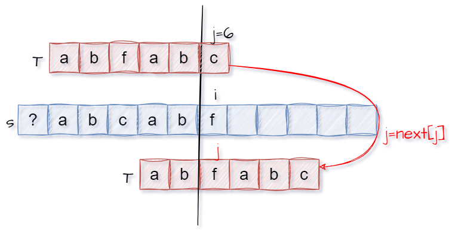
   2. 下面我们考虑一种特殊情况，当`j=1`时主串`S`与模式串`T`不匹配(`T`的第一个位置就与`S`不匹配),此时显然我们需要修改`j`移到下一个位置`next[j]`，于是乎我们不妨记作`next[1]=0`(后续代码中会判断当`j=0`时执行`i++`、`j++`达到重新匹配的目的)。
   3. <span style="color:red">我们要始终知道`next[k]=0`相当于一种标记告诉程序下一步需要执行`i++`操作。而`next[k]`是当`j=k`时出现不匹配时`j`的下一个位置。这样才不会在后面求`next[]`数组时产生疑惑。</span>
   4. 实际上对于任意一个模式串`T`(从1开始)的next数组中都有：`next[1]=0`、`next[2]=1`。

5. 我们依旧是先给出求解`next`数组的代码部分(为了与上述`i`、`j`意义区分，我们采用`m`和`n`)：

   ```cpp
   void get_next(SString T, int next[]) {
       int m = 1, n = 0;
   
       //特殊处理，会导致m++并使n自增为1
       next[1] = 0; 
       while(m < T.length) {
           if(n == 0 || T.ch[m] == T.ch[n]) {
               m++;
               n++;
               next[m] = n;
           } else {
               n = next[n];
           }
       }
   }
   ```

   

6. 下面我们分析一下如何求取`next[]`数组(为了与上述`i`、`j`意义区分，我们采用`m`和`n`)：

   1. 首先就是牢记`next[1]=0`、`next[2]=1`、其他时候`next[m]=l+1=n`。

   2. 其次我们要想明白，求解`next`数组的过程，其实就是模式串`T`自己和自己之间的字符串匹配问题(后续会说明)，当然由于人为的设置，导致这是一场没有"结果"的匹配，当然我们会在匹配过程中记录最大的匹配长度(准确的说是`l+1`)。

   3. 我们先看一个普通一点的例子：当`m=5`时`n=2`此时匹配，说明`m<5`部分中与前缀相等的最大后缀的长度为`2`。那么实际上我们需要执行`next[m+1]=next[6]=n+1=2+1`，即表示`j=6`时发生不匹配，下次`j`的位置是`2+1`。但是在代码中，是将`m+1`设置为`m++`，`n+1`设置为`n++`，最后直接`next[m]=n`即可。<br>

   4. 我们不妨以下面这个图为例：当`m=2`时`n=1`此时发生不匹配，说明`m<3`部分中与前缀相等的最大后缀的长度为`0`。此时`next[m+1]=0+1=1`表示模式串的`j`的下一个匹配位置。有时候可能会觉得`next[m+1]=0`才对，但实际上上面提到过这时候不需要移动`i`指针，而是令`j=1`开始匹配(只有`j=1`时不匹配才需要`i++`)。<span style="color:red">而这段逻辑在后续代码中的体现就是`n=next[n]  (0)`，对，就这么一小步，参考上一步思考发现，这他喵的简直就是这个代码的灵魂。</span><br>

      <br>

   5. 下面就是进一步研究灵魂`n=next[n]`。我们不妨引入一个新的例子说明这个问题：

      1. 当出现下面情况时，我们显然是知道`next[5]=3`。此时代码会将`m`、`n`值加一，然后对赋值`next[m]=n`即可。<br>

      2. 此时来到了下面的情况，这时候就会出现不匹配的情况。<br>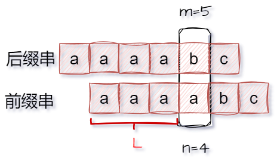

      3. 这时我们显然不可以认为`next[6]=0+1`，此时我们需要尝试尽可能少的回溯`n`去`L`中找一个尽可能长的前缀串使`n`和`m`能够再次匹配(两个尽可能就是为了保证找到KMP中要求的与前缀相等的最长后缀)。这个想法是不是很熟悉，对了`n=next[n]`，使用`next`数组自身(然后判断`m`和`n`位置字符是否相等，不等则再次缩短)。当然经过推测最终`next[6]=1`(纯属巧合，恰好无论怎缩短都不行。)<br><br>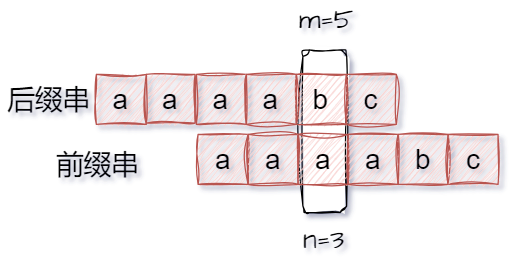

7. 最终完整代码：(`m、n`换成`i、j`)也是一样的。

   ```cpp
   void get_next(SString T, int next[])
   {
       int m = 1, n = 0;
       // 提问:next[1] = 0的意义是什么？
       next[1] = 0;
       while (m < T.length)
       {
           if (n == 0 || T.ch[m] == T.ch[n])
           {
               m++;
               n++;
               next[m] = n;
           }
           else
           {
               n = next[n];
           }
       }
   }
   
   int KMP(SString S, SString T, int next[])
   {
       int i = 1, j = 1;
       get_next(T,next);
       while (i <= S.length && j <= T.length)
       {
           // 提问:判断j == 0的意义是什么？
           if (j == 0 || S.ch[i] == T.ch[j])
           {
               i++;
               j++;
           }
           else
           {
               j = next[j];
           }
       }
       if (j > T.length)
       {
           return i - T.length;
       }
       else
       {
           return 0;
       }
   }
   ```

   

8. 其实现在可以知道，所谓求解`next`数组的过程，其实就是将后缀串作为主串，前缀串作为模式串进行模式匹配，我们每次都尽可能时让后缀串的尽可能长的子串去匹配前缀串(此时就满足KMP要求的等于前缀的最长后缀)，并记录匹配长度，这其实就是串匹配的思想。当不匹配时，我们尝试牺牲一点已匹配的长度，使其再次匹配，为了得到最大结果，我们尽可能小的缩短匹配长度。<br>


---


##### KMP的进一步优化(nextval数组)

1. 在对KMP算法优化之前，需要提一点，理解KMP算法离不开对对称的认识。

2. 对于KMP算法，我们是否还有继续优化的可能性？显然(个der)是有的，我们不妨观察一下下图过程，此时我们发现`i`与`j`位置的不匹配问题。<br>

3. 于是乎我们采用KMP的牺牲原理，将`j`回溯到`next[6]=2+1=3`，此时问题就出现了，`j`在回溯前后的字符并没有变化，此时显然还是会有`i`与`j`位置的不匹配。然后就需要再次将`j`回溯，即`j=next[3]=1`。<br>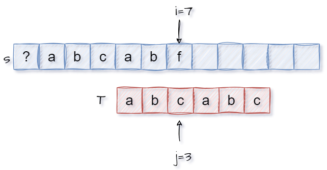

4. 上述问题其实我们在求解`next`数组时进行规避。于是乎我们得出了改进的`next`数组求解方式，记作`nextval`数组。其实仔细想想也会发现这种求解`nextval`数组方式也在求解`nextval`数组过程中规避了上述情况(由之前的分析，不难知道KMP和求解`next`数组都用到了`next`数组)。

   ```cpp
   void get_nextval(SString T, int nextval[])
   {
       int m = 1, n = 0;
       nextval[1] = 0;
       while (m < T.length)
       {
           if (n == 0 || T.ch[m] == T.ch[n])
           {
               m++;
               n++;
               if (T.ch[m] != T.ch[n])
               {
                   nextval[m] = n;
               }
               else //此时回溯的位置就是n,当ch[m]=ch[n]时，我们直接跳过当前回溯，直接回溯到next[n]
               {
                   nextval[m] = nextval[n];
               }
           }
           else
           {
               n = nextval[n];
           }
       }
   }
   ```

   

5. 显然我们还是需要解释一下上述代码，当我们发现如下图紫色部分对应时，应该执行`i++`、`j++`操作，这些我们不变。但原本我们要执行`nextval[m]=n`。对应KMP中将`j`回溯从`m`到`n`的位置。但是若`ch[m]=ch[n]`的话，显然这一步的回溯是不满足要求的，我们就可以直接跳过，将`j`从`m`直接跳到`nextval[n]`。也就是上述代码中的`nextval[m]=nextval[n]`。<br>

6. 后续待补。<br> 

---

##### 补充

1. 对于上述的内容，需要理解其过程，以便在选择题中能快速模拟`KMP`。
2. 实际上我们之前都是从`1`开始，实际上考研也是会考察从`0`开始，那么上述内容就需要相应变化：
   1. next数组不需要整体加一(考研不考察`KMP`算法题，理解即可)，似乎就是整体`-1`。
   2. 初始时`next[0]=-1`、`next[1]=0`。
   3. 题目中会暗示你从零还是从一开始。
3. BF算法中也要相应变化。


---


### 4.树和森林

##### 二叉树的性质

1. <span style="color:red">注意！注意！注意！对于二叉树的性质判别是，一定不要忘记只有根节点的二叉树。</span>
2. 满二叉树：满二叉树是完全二叉树的一种。完全二叉树的一些性质满二叉树也适用。
   1. 高度为$h$则有$2^h-1$​​个结点(等比数列求和)。
   2. <span style="color:red">二叉树的第$h$层最多有$2^{h-1}$个结点。</span>
   3. 对于编号为$i$的结点，其双亲为$\lfloor(i/2)\rfloor$。若有左右孩子，则左孩子编号为$2i$,右孩子结点为$2i+1$。
3. 结点数为$n$的二叉树最小高度$h$：$h=\lceil log_2(n+1) \rceil$或者$h=\lfloor log_2n \rfloor+1$。对于$m$叉树同理可推(理在树上$P_{136}$)。
4. 不妨推导一下上述公式：
   1. <span style="color:red">二叉树的第$h$层最多有$2^{h-1}$个结点。$m$叉树的第$h$层最多有$m^{h-1}$个结点。</span>

   2. <span style="color:red">前$h$行</span>共有结点 $S_1=2^h -1$ ，而<span style="color:red">第$h+1$行</span>有结点 $S_2=2^{h+1-1}$ 个。那么显然有 $S_1+1=S_2$ ，即前`n`层若共有$a$个结点，那么第$n+1$层就有$a+1$个结点(当然了这里的$a$其实就等于$2^{h+1-1}$)。<br>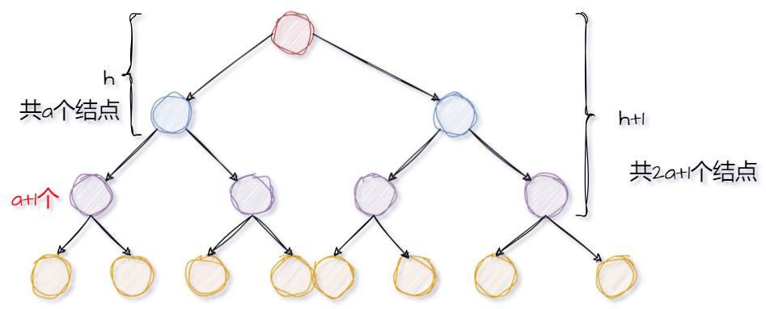

   3. 当然上述结论还可以推导到满$m$叉树，<span style="color:red">前$h$行</span>共有结点 $S_1=\frac{m^h -1}{m-1}$ ，而<span style="color:red">第$h+1$行</span>有结点 $S_2=m^{h+1-1}$ 个。那么显然有 $(m-1)S_1+1=S_2$ 。

   4. 不妨继续，如下图所示：假设第$i+a$个结点是该层的第$a$个结点，那么结合上一个规律显然可以推导出上述满二叉树的性质<br>
   5. 同样的我们将这个结论推导到满$m$叉树，若某个结点为$i$，结合上述内容不难知道其的第$m$个子结点为$mi+1$，显然其子结点的编号范围为$m(i-1)+2$到$mi+1$​。
   6. 那如果树结点的编号从零开始呢？显然编号全部减一即可推出父子结点的编号关系。
5. 完全二叉树：

   1. 对于编号为$i$的结点，其双亲为$\lfloor i/2 \rfloor$。若有左右孩子，则左孩子编号为$2i$,右孩子结点为$2i+1$。
   2. 完全二叉树中$i<=\lfloor n/2\rfloor$，则$i$为分支节点，否则为叶子节点。	
   3. 完全二叉树有$n$个结点，高为多少？推断过程见王道课本。
6. 不妨再推一下上述公式：我们假设<span style="color:red">某二叉树</span>有$n$个结点，其中包含$n_0$个叶子结点,$n_1$个有一个分支的结点，$n_2$个含义两个分支的结点，并假设其含有$B$条分支，显然有$n=n_0+n_1+n_2$及$B=n-1$,那么：

   1. $B=2n_2+n_1$，同时另一方面又有 $B=n_0+n_1+n_2-1$(减去根节点)。故而$n_0=n_2+1$,即 $叶子节点的个数=含两个分支的结点个数+1$。<span style="color:red">此外显然有$n_0+n_2=2n_0+1$必定是一个奇数。</span>
   2. 显然通过上述推断过程后，不难知道对于任意一个二叉树都有：$n=2n_0+n_1-1$。
   3. 对于<span style="color:red">完全二叉树</span>我们知道$n_1<=1$的($n_1$非$0$即$1$)，故而$n=2n_0-1$或者$n=2n_0$：
      1. 显然当$n$为偶数时说明$n_1=1$，此时$i<=n/2$为分支结点(完全二叉树的性质决定了其叶子结点的编号连续)。
      2. 显然当$n$为奇数时说明$n_1=0$，此时$i<=(n-1)/2$​为分支结点。除此之外，甚至可以推出哪一个结点是唯一的只有一个分支的结点。
      3. 综上所述$i<=\lfloor n/2\rfloor$，则$i$​为分支节点，否则为叶子节点。对于一个完全二叉树，结点个数为偶数，则叶子结点占一半；结点个数为奇数，叶子结点占一半还多一个。<br>
   4. 不妨总结一下:
      1. <span style="color:red">对于任意二叉树有</span>：
         1. $n_0+n_2=2n_0+1$​必定是一个奇数。
         2. $B=n_0+n_1+n_2-1$​
         3. $B=2n_2+n_1$​
         4. $B=n-1$
         5. $n_0=n_2+1$
      2. <span style="color:red">对于完全二叉树有</span>：
         1. $n_0=1$或者$n_0=0$
         2. $n_1=1$时，$n_0=\frac{n}{2}$、$n_2=\frac{n-2}{2}=n_0-1$、$n$为偶数
         3. $n_1=0$时，$n_0=\frac{n+1}{2}$、$n_2=\frac{n-1}{2}=n_0-1$、$n$为奇数
7. 二叉排序树：略
8. 平衡二叉树：任意一个结点的左右子树高度之差不超过1，搜索效率较高。
9. 正则二叉树：每个分支结点都有2个孩子结点，即树中只有度为0或2的结点(正则$m$树就只有度为$m$或者$0$的结点)。
10. 需要注意的是：上述结论都是在二叉树结点编号从$1$开始。对于考研中可能出现的结点编号从$0$​开始，需要思考并相应变化。
11. 下面我们来讨论一下只有高为$h$且度为$0$或者$2$的树(<span style="color:red">正则二叉树</span>)长啥样？显然就是$n_1=0$的二叉树(<span style="color:red">注意不一定完全二叉树，下面只是举了一部分例子。</span>):<br>


---


##### 二叉树存储

1. 顺序存储：

   1. 顺序存储结构只适合于完全二叉树存储，对于非完全二叉树使用顺序存储会浪费大量空间。

   2. <span style="color:red">顺序存储时一定要将各结点与完全二叉树对应起来，然后实现存储，尤其是非完全二叉树。</span>

   3. 结构定义如下：顺序存储一般建议索引为`0`的位置不存储结点，从而使结点的索引和树中的编号一致，便于通过性质求解父子结点等。

      ```cpp
      #include <iostream>
      #define MaxSize 50
      
      typedef int OlderTree[MaxSize];
      ```

      

2. (<span style="color:red">重点</span>)链式存储：

   1. <span style="color:red">在$n$个结点的二叉链表中至少有$n+1$个空指针域(即$2n-(n-1)$)。同理可以推广到$m$叉树有$n$个结点，则至少有空指针域$mn-(n-1)=(m-1)n+1$个。</span>

   2. 二叉链表表示：

      ```cpp
      #include <iostream>
      
      typedef char ElemType;
      typedef struct BiTNode
      {
          ElemType data; // 数据域
          struct BiTNode *lchild, *rchild; // 左右孩子指针
      } BiTNode, *BiTree;
      ```

      

   3. 有时我们可能希望直接找到某个结点的父节点，于是又有了三叉链表(多一个父指针)：

      ```cpp
      #include <iostream>
      
      typedef char ElemType;
      typedef struct BiTNode
      {
          ElemType data; // 数据域
          struct BiTNode *lchild, *rchild,*parent;  
      } BiTNode, *BiTree;
      ```

3.  对于链式存储的一些常见操作(基于二叉树的遍历)：

	1. 求树的深度：

       ```cpp
       int Depth(BiTree T)
       {
           int ldepth, rdepth;
           if (T == NULL)
               return 0;
           else
           {
               ldepth = Depth(T->lchild); // 左子树的深度
               rdepth = Depth(T->rchild); // 右子树的深度
               return (ldepth > rdepth) ? (ldepth + 1) : (rdepth + 1);
           }
       }
       ```

	2. 树的结点数：

        ```cpp
        int nodeCount(BiTree T)
        {
            if (T == NULL)
                return 0;
            else
                return nodeCount(T->lchild) + nodeCount(T->rchild) + 1;
        }
        ```
      
	3. 树的叶子结点数：

        ```cpp
        int LeafCount(BiTree T)
        {
            if (T == NULL) //容易忽略
                return 0;
            if (T->lchild == NULL && T->rchild == NULL)
                return 1;
            return LeafCount(T->lchild) + LeafCount(T->rchild);
        }
        ```
      
	4. 树的复制：

        ```cpp
        void CopyTree(BiTree T, BiTree &NewT)
        {
            if (T == NULL)
            {
                NewT = NULL;
            }
            else
            {
                NewT = (BiTNode *)malloc(sizeof(BiTNode));
                NewT->data = T->data;
                CopyTree(T->lchild, NewT->lchild); // 递归复制左子树
                CopyTree(T->rchild, NewT->rchild); // 递归复制右子树
            }
        }
        ```
   
      


---


##### 先序遍历(根左右)(NLR)

1. <span style="color:red">始终牢记根左右。</span>
1. 如下图二叉树，我们直接通过人脑模拟(从根结点一路向下，然后回退到上一个节点对右子树重复上述过程)：从A开始一路向左下D的空左子结点(`ABD`)，然后回退到D找右子树(`ABDE`)，然后回退到B找右子树(`ABDGE`)，然后回退到A同理遍历右子树(`ABDGECF`)。<br>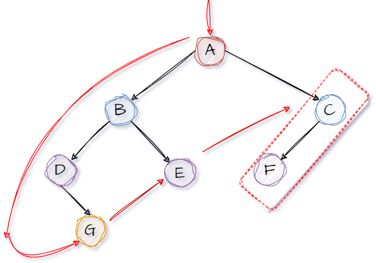

3. 下面给出递归形式代码(空间复杂度$O(h+1)=O(h)$)：注意下面代码的参数都是指针形式。

   ```cpp
   void visit(BiTNode *T)
   {
       printf("%c", T->data);
   }
   
   void PreOrderTraverse(BiTree T)
   {
       if (T != NULL)
       {
           visit(T);
           PreOrderTraverse(T->lchild);
           PreOrderTraverse(T->rchild);
       }
   }
   ```

   

4. 给出略微复杂的非递归形式：

   1. 首先需要定义一个栈用于存储树结点，但需要注意是我们每次入栈的实际上不是结点本身，而是指向结点的指针：

      ```cpp
      #include <iostream>
      #define MaxSize 50
      typedef char ElemType; // 嫌麻烦可以不重命名
      
      typedef struct BiTNode
      {
          ElemType data; 
          struct BiTNode *lchild, *rchild;
      } BiTNode, *BiTree;
      
      typedef struct Stack
      {
          BiTNode* data[MaxSize];
          int top; 
      } Stack;
      
      //省略具体实现
      void InitStack(Stack &S);       // 初始化栈
      bool isEmpty(Stack S);          // 判断栈是否为空
      bool Push(Stack &S, BiTNode* x);  // 进栈
      bool Pop(Stack &S, BiTNode* x);   // 出栈
      bool GetTop(Stack S, BiTNode* x); // 取栈顶元素
      ```

      

   2. 编写先序遍历函数：实际上就是上面模拟的的遍历逻辑。

      ```cpp
      void PreOrder(BiTree T)
      {
          Stack S;
          InitStack(S);
      
          BiTree p = T;
          // 栈不空或者p不空时循环
          while (p || !isEmpty(S))
          {
              if (p)
              {
                  // 一路向左访问遍历(直到空的左孩子)
                  visit(p);
                  Push(S, p);
                  p = p->lchild;
              }
              else
              {
                  // 回退到上一个子树的根节点，然后遍历右子树
                  Pop(S, p);
                  p = p->rchild;
              }
          }
      }
      ```

   

5. 后续待补。<br>

---


##### 中序遍历(左根右)(LNR)

1. <span style="color:red">始终牢记左根右。</span>
1. 同上，我们使用人脑模拟一下(不停地递归找左子树，直到得到一个叶子结点，若是得到无左孩子的根结点就补全(如图)(最左边或者说最左下的结点)，重复<span style="color:red">回退+根右</span>)：先是遍历以D为根节点的子树(`DG`)，然后到以B为根结点的子树(`DGBE`)，然后是以A为根节点的子树(右边子树同样的方式)(`DGBEAFC`)<br>

3. 下面给出递归形式代码：

   ```cpp
   void visit(BiTNode *T)
   {
       printf("%c", T->data);
   }
   
   void InOrder(BiTree T)
   {
       if (T != NULL)
       {
           InOrder(T->lchild);
           visit(T);
           InOrder(T->rchild);
       }
   }
   ```

   

4. 给出略微复杂的非递归形式：

   1.   首先需要定义一个栈用于存储树结点，依旧需要注意我们每次入栈的实际上不是结点本身，而是指向结点的指针：

      ```cpp
      #include <iostream>
      #define MaxSize 50
      typedef char ElemType; // 嫌麻烦可以不重命名
      
      typedef struct BiTNode
      {
          ElemType data; 
          struct BiTNode *lchild, *rchild;
      } BiTNode, *BiTree;
      
      typedef struct Stack
      {
          BiTNode* data[MaxSize];
          int top; 
      } Stack;
      
      //省略具体实现
      void InitStack(Stack &S);       // 初始化栈
      bool isEmpty(Stack S);          // 判断栈是否为空
      bool Push(Stack &S, BiTNode* x);  // 进栈
      bool Pop(Stack &S, BiTNode* x);   // 出栈
      bool GetTop(Stack S, BiTNode* x); // 取栈顶元素
      ```

      

   2.   编写先序遍历函数：实际上就是上面模拟的的遍历逻辑。

      ```cpp
      void visit(BiTNode *T)
      {
          printf("%c", T->data);
      }
      
      // 非递归中序遍历
      void InOrderTraverse(BiTree T)
      {
          Stack S;
          InitStack(S);
      
          BiTree p = T;
          while (p || !isEmpty(S))
          {
              if (p)
              {
                  // 一路向左，直到左孩子为空(但是不访问)
                  Push(S, p);
                  p = p->lchild;
              }
              else
              {
                  Pop(S, p);
                  visit(p);      // 根
                  p = p->rchild; // 右子树
              }
          }
      }
      ```

      

5. 注意观察先序遍历和中序遍历的非递归形式代码，我们不难发现：对于同一棵树，先序遍历总是在进栈时访问结点，而中序遍历总是在出栈时访问结点，仅此而已(二者栈中元素的变化情况完全相同)。那么这时后我给一个先序遍历序列为$a,b,c,d$，问其二叉树有多少可能?显然我们知道先序序列和中序序列可以确定一棵二叉树，那么先序序列已知(进栈顺序已知)，其实就是问中序序列的有多少可能(出栈顺序有多少可能)，显然有$\frac{1}{n+1}C^n_{2n}$种可能。

---


##### 后序遍历(左右根)(LRN)

1. <span style="color:red">始终牢记左右根。</span>
2. 同上，我们使用人脑模拟一下(不停地递归找左子树，直到得到一个叶子结点，若是得到无左孩子的根结点就补全(如图)(最左边或者说最左下的结点)，重复<span style="color:red">回退+右根</span>)：先是遍历D为根结点的子树(`GD`)，然后遍历以B为根结点的子树(`GDEBFCA`)，然后遍历以A为根结点的子树(`GDEBFCA`)。当然也可以采用咸鱼学长的"从你的全世界路过法"。<br>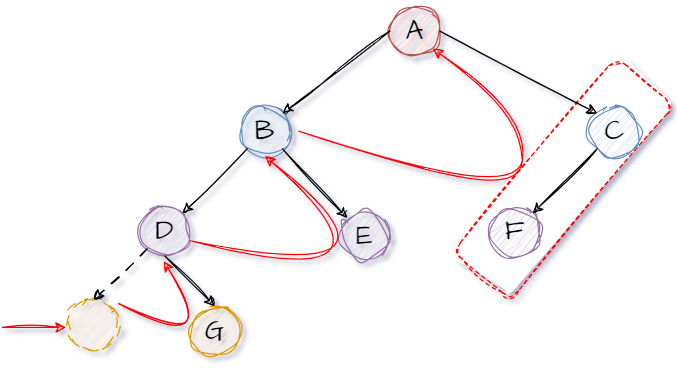

3. 需要说明一点，上述图示过程实际上并不能完全展示后序遍历的过程，因为遍历左子树必然要经过根节点，但这时候我们不去访问根节点，因此没有画出。王道咸鱼学长给这种遍历方式取名为"从你的全世界路过"是很恰当的(路过多次却不访问)。

4. 下面给出递归形式代码：

   ```cpp
   void visit(BiTNode *T)
   {
       printf("%c", T->data);
   }
   
   void PostOrder(BiTree T)
   {
       if (T != NULL)
       {
           PostOrder(T->lchild);
           PostOrder(T->rchild);
           visit(T);
       }
   }
   ```

   

5. 给出略微复杂的非递归形式：

   1. 首先需要定义一个栈用于存储树结点，需要注意我们每次入栈的实际上不是结点本身，而是指向结点的指针：

      ```cpp
      #include <iostream>
      #define MaxSize 50
      typedef char ElemType; // 嫌麻烦可以不重命名
      
      typedef struct BiTNode
      {
          ElemType data; 
          struct BiTNode *lchild, *rchild;
      } BiTNode, *BiTree;
      
      typedef struct Stack
      {
          BiTNode* data[MaxSize];
          int top; 
      } Stack;
      
      //省略具体实现
      void InitStack(Stack &S);       // 初始化栈
      bool isEmpty(Stack S);          // 判断栈是否为空
      bool Push(Stack &S, BiTNode* x);  // 进栈
      bool Pop(Stack &S, BiTNode* x);   // 出栈
      bool GetTop(Stack S, BiTNode* x); // 取栈顶元素
      ```

      

   2.  编写先序遍历函数：实际上就是上面模拟的的遍历逻辑，但是相较于前面两个而言还是有些难度：

      ```cpp
      void visit(BiTNode *T)
      {
          printf("%c", T->data);
      }
      
      void PostOrder(BiTree T)
      {
          Stack S;
          InitStack(S);
      
          BiTree p = T, r = NULL;
          while (p || !isEmpty(S))
          {
              if (p)
              {
                  // 一路向左，直到左孩子为空(但是不访问)
                  Push(S, p);
                  p = p->lchild;
              }
              else
              {
                  GetTop(S, p);
                  if (p->rchild && p->rchild != r)
                  {
                      // 转向右子树(仍然不访问)(后续p不为空会继续入栈)
                      p = p->rchild; 
                  }
                  else
                  {
                      // 没有右子树或者右子树已经访问过(直接访问)
                      Pop(S, p);
                      visit(p);
                      r = p;    // 记录最近访问过的结点
                      p = NULL; // 使p为空，以便继续弹栈
                  }
              }
          }
      }
      ```

      

6. 对于`r`指针的原理(记录上一次访问过的结点)：我们当前存在的问题对于一个结点，我们无法知道当前是该访问还是该转向右子树。那么我们不妨考虑一个问题，若右子树被访问了会有哪些特征？显然下一步会回到根结点，那么我们设置一个`r`指针指向上一次访问的结点，若`r`恰为当前结点的右结点说明右子树已经遍历完毕，可以安心访问当前结点了。<br>


---

##### 小结(不包括层次遍历)

1. 对于上述三种遍历方式其实还是有一些细节问题，如果能很好地利用，能够极大地方便我们做题:
   1. 无论对于上述哪一种遍历方式，左子树的遍历始终在右子树之前。故而我们可以推断出：
      1. ($P_{155}$的10、12、13)若某两个结点在两种遍历序列中出现的先后顺序不一致，那么这两个结点一定不是兄弟结点的关系(反之不成立，参考后面结点左右位置的情况讨论)。
      2. 同一棵树，无论采用何种遍历方式，其叶子结点出现的先后顺序一定是完全相同的(从左往右)。
      3. 左子树上的点在遍历序列中一定先于右子树上的点出现。
   2. (容易晕)无论是哪一种遍历，本质上还是以(子)树作为遍历单位(观察递归形式的遍历代码)，故而只有一棵子树遍历完才会去遍历另一棵子树，不会出现穿插遍历子树的情况。例如下面，遍历完当前结点后，是不可能立即出现$A$或者$B$的(右结点还没遍历,该子树还未结束遍历)。(王道课本$P_{155}$的14题的D选项中当我们推断出46属于一棵子树，57属于另一棵同级子树时，就与题目矛盾了，哪怕不是先序遍历也不可能出现题目所给的123<span style="color:red">4567</span>)<br>
   3. 关于遍历序列中的最后、第一个的判别问题：
      1. 后序遍历的最后一个结点一定是根结点。先序遍历的第一个结点一定是根结点。
      2. 中序遍历中的最后一个结点。
      3. 先序遍历的最后一个结点一定是叶子结点(假设不是，则与`根左右`矛盾)。
      4. 后续遍历的第一个结点一定是叶子结点。
      5. 中序遍历的第一个结点一定没有左孩子(同理)。
      6. 中序遍历的最后一个结点一定不含右孩子(假设有，则与`左根右`矛盾)，但是不一定是根结点。那如果我们已知中序遍历的最后一个结点为叶子结点，那么我们就可以知道先序遍历的最后一个结点也是它(叶子结点出现的先后顺序一定是完全相同的)(或者也可以通过先序和中序的遍历顺序去理解，显然中序最后遍历的叶子结点一定是右叶子结点...)。
   4. 二叉树的三序遍历本质上还是后面的深度优先遍历:都是先访问左结点，然后再访问兄弟结点。
      1. 尤其是先序遍历，是以根结点开始的深度优先遍历，先一路南下，然后回退向右，再一路南下...。知道了这个原理，其实就很容易写出先序遍历序列了。
      2. 而对于中序遍历、后序遍历，也是以根结点开始，但是总是路过，似乎就没那么好用了。
   5. 那么下面我们讨论一些东西，事情的起因是关于王道的两道题。我们假设$n$结点在$m$​的左边，那么有几种情况：
      1. 在研究这个问题之前我询问了`chatgpt`一个问题：我们在考虑二叉树是是否需要考虑视觉位置？也就是说有没有可能出现某个结点的左子树中的结点$n$在右子树结点$m$的右边这种说法？下面给出它的回答：在讨论二叉树时，我们通常不会考虑节点的视觉位置，尤其是在算法和数据结构的上下文中。二叉树的讨论主要集中在节点之间的层级关系和父子关系上，而非它们在某个图形界面上的相对位置。这是因为二叉树的结构是抽象的，它的主要用途是为了组织数据和支持高效的数据操作（如搜索、插入和删除），而不是为了在视觉上表示这些数据。
      2. $m$与$n$是祖孙关系：图示不唯一<br>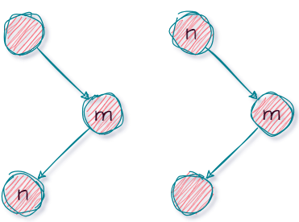
      3. $m$与$n$是兄弟关系：<br>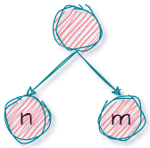
      4. $m$与$n$是堂兄弟关系：图示不唯一<br>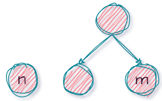
      5. 不具有祖孙关系，且不在同一层级(不考虑出现某个结点的左子树中的结点$n$在右子树结点$m$的右边)：图示不唯一<br>
      6. 待补
   6. 我们不妨提出一种阶梯策略，当然这种解题策略的理解是基于对三序遍历的认识，不妨称其为"逻辑删除法"
      1. 若一个非空二叉树的先序序列和后序序列相同：先序遍历`根左右`，后序遍历`左右根`，显然逻辑删除`左右`，该树只有一个根节点。
      2. 若一个非空二叉树的先序序列和后序序列相反：先序遍历`根左右`，后序遍历`左右根`，显然显然逻辑删除`左`或`有`，该树每层只有一个结点。
      3. 若一个非空二叉树的先序序列和中序序列相同：先序遍历`根左右`，中序遍历`左根右`，显然显然逻辑删除`左`，该树只有右子树。
      4. 若一个非空二叉树的中序序列和后序序列相同：中序遍历`左根右`，后序遍历`左右根`，显然显然逻辑删除`右`，该树只有左子树。
      5. 其他：略
      6. 若没有局限二叉树非空，则还需考虑二叉树为空的情况(提一嘴，也别忘记二叉树只有根结点的情形)。


##### 层次遍历

1. 同上面非递归形式的栈一样，要强调：入队的是指向结点指针而不是结点本身。

2. 如图，层次遍历只需要从左往右，一层层依次遍历就行，显然层次遍历序列为：`ABCDEFG`<br>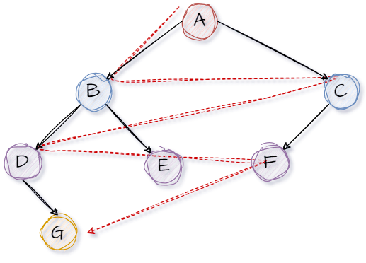

3. 给出实现代码：

   1. 首先需要定义一个栈用于存储树结点，需要注意我们每次入栈的实际上不是结点本身，而是指向结点的指针：

      ```cpp
      #include <iostream>
      #define MaxSize 50
      typedef char ElemType;
      
      typedef struct BiTNode
      {
          ElemType data; 
          struct BiTNode *lchild, *rchild;
      } BiTNode, *BiTree;
      
      typedef struct
      {
          BiTNode* data[MaxSize];
          int front;
          int rear;
      } sqQueue;
      
      // 省略具体实现
      void initQueue(sqQueue &Q); // 初始化
      bool isEmpty(sqQueue Q);   // 判空
      bool enQueue(sqQueue &Q, BiTNode* x); // 入队
      bool deQueue(sqQueue &Q, BiTNode* &x); // 出队
      ```

      

   2.  编写先序遍历函数：时刻牢记队列先进先出的公平原则。

        ```cpp
       void visit(BiTNode *T)
       {
           printf("%c", T->data);
       }
       
       void LevelOrder(BiTree T)
       {
           sqQueue Q;
           initQueue(Q);
       
           BiTree p;
           enQueue(Q, T);
       
           while (!isEmpty(Q))
           {
               deQueue(Q, p); // 出队
               visit(p);     // 访问
       
               // 左孩子不为空则左孩子入队
               if (p->lchild != NULL) 
                   enQueue(Q, p->lchild);
       
               // 右孩子不为空则右孩子入队
               if (p->rchild != NULL) 
                   enQueue(Q, p->rchild);
           }
       }
        ```

      


---


##### 构造二叉树

1. 必需要有<span style="color:red">中序遍历</span>配合另外一个非中序遍历方可确定一个<span style="color:red">二叉树</span>。关键在于找到根节点，然后划分左右子树，然后重复上述过程。
2. <span style="color:red">注意：对于完全二叉树而言，我们是可以尝试通过某个遍历序列推出唯一的二叉树的。</span>

3. 通过先序遍历序列和中序遍历序列构造二叉树：对于先序序列`ABDGECF`和中序序列`DGBEAFC`
   1. 由先序序列知道`A`为根结点，结合中序序列知道`DGBE`为左子树、`FC`为右子树
   2. 由先序序列知道`DGBE`中的`B`为根结点(`BDGE`中`B`最靠前)，则`DG`为左子树，`E`为右子树。
   3. 同理可知`FC`中的`C`为根结点(`CF`中`C`最前)，`F`为左子树。
   4. ...
   5. 重复上述分析过程。

4. 通过后序遍历序列和中序遍历序列构造二叉树：`GDEBFCA`和中序序列`DGBEAFC`
   1. 由后序序列知道`A`为根结点，结合中序序列知道`DGBE`为左子树、`FC`为右子树
   2. 由后序序列知道`DGBE`中的`B`为根结点(`GDEB`中`B`最后)，则`DG`为左子树，`E`为右子树。
   3. 同理可知`FC`中的`C`为根结点(`FC`中`C`最后)，`F`为左子树。
   4. ...
   5. 重复上述分析过程。

5. 通过层次遍历序列和中序遍历序列构造二叉树：`ABCDEFG`和中序序列`DGBEAFC`
   1. 由层次序列知道`A`为根结点，结合中序序列知道`DGBE`为左子树、`FC`为右子树
   2. 由后序序列知道`DGBE`中的`B`为根结点(`B`显然为左子树根节点)，则`DG`为左子树，`E`为右子树。
   3. 同理可知`FC`中的`C`为根结点(由于右子树不为空，`C`显然为左子树根节点)，`F`为左子树。
   4. ...
   5. 重复上述分析过程。

6. 给出上述分析的树示意图：<br>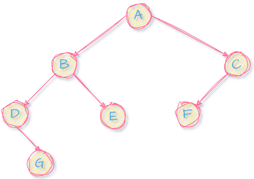
7. 那么我们试着理解一下，为什么确定一个二叉树一定需要中序遍历序列呢?这是由于中序序列一旦知道了根结点，就可以将左右子树区分开。从而可以继续递归分析推断，直至推断出整个树，而其他的遍历序列无法将左右子树完全区分开来。


---


##### 二叉树线索化

1. 按照某种遍历顺序设置前驱和后继线索，将某个结点的空左指针域指向它的前驱(遍历序列中的前驱)，空右指针域指向它的后继(遍历序列中的后继)。为了为了区分左右孩子指针指向的是孩子还是线索，增加两个标志域`ltag`和`rtag`，如果`ltag=0`，`lchild`指向左孩子，若`ltag=1`则`lchild`指向前驱；`rchild`同理。故而我们给出如下的类型定义：

   ```cpp
   #include <iostream>
   typedef char ElemType; 
   
   typedef struct ThreadNode
   {
       ElemType data;
       struct ThreadNode *lchild, *rchild;
       int ltag, rtag;
   } ThreadNode, *ThreadTree;
   ```

   

2. 线索二叉树方便找前驱和后继，可以直接从某个结点开始遍历二叉树。

3. 无论哪种线索二叉树，最多只会有两个空指针域。

   1. 对于先序线索化：最后一个结点一定是叶子结点，一定有一个空的右指针域。至于第一个结点是否具有右指针域则要看根结点是否具有左子树。

   2. 对于中序线索化(必有2个)：最后一个结点一定不含右孩子，一定有一个空的右指针域。而第一个结点一定没有左孩子，一定具有一个空的左指针域。

   3. 对于后续线索化：最后一个结点不一定有左指针域，关键要看根结点是否具有左孩子。同理其第一个结点一定具有一个空的左指针域。

4. 我们不妨讨论下线索二叉树是逻辑结构还是物理结构：

   1. 逻辑结构：数据元素之间的逻辑关系，与数据的存储无关。

   2. 存储结构(物理结构)：数据结构在计算机中的具体表示，是使用计算机语言实现的逻辑结构，它依赖于计算机语言。

   3. 而对于线索二叉树而言，每个结点的线索(不属于逻辑结构中的任何一种类型或者任何一种类型的一部分)是通过指针定义的，而指针是一种C语言的功能，故而满足<span style="color:red">物理结构</span>的定义。

5. 前序线索二叉树：

   1. 示意图如下：空左指针域指向先序序列中的前驱，空右指针域指向先序序列中的后继。<br>

   2. 给出代码实现：

      ```cpp
      void PreThread(ThreadTree T, ThreadTree &pre)
      {
          if (T != NULL)
          {
              // (A)
              if (T->lchild == NULL)
              {
                  T->lchild = pre;
                  T->ltag = 1;
              }
              // (B)
              if (pre != NULL && pre->rchild == NULL)
              {
                  pre->rchild = T;
                  pre->rtag = 1;
              }
              // 更新pre
              pre = T; 
      
              // 判断lchild是否为前驱线索
              if (T->ltag == 0)
                  PreThread(T->lchild, pre);
              // (C) rchild一定不是后继
              PreThread(T->rchild, pre); 
          }
      }
      
      void CreatePreThread(ThreadTree T)
      {
          // (D)
          ThreadTree pre = NULL;
          if (T != NULL)
          {
              PreThread(T, pre);
              // (E)最后一个节点的右指针指向空
              pre->rtag = 1; 
          }
      }
      ```

      

   3. 关于上述代码还是有一些需要说明的问题：

      1. A处：可以将该部分代码抽出为一个函数：

         ```cpp
         void visit(ThreadTree T, ThreadTree &pre){
             if (T->lchild == NULL)
             {
                 T->lchild = pre;
                 T->ltag = 1;
             }
             if (pre != NULL && pre->rchild == NULL) 
             {
                 pre->rchild = T;
                 pre->rtag = 1;
             }
             pre = T;
         }
         ```

         

      2. B处：初始时`pre=NULL`，若某个树只有右子树就会出问题。

      3. C处：该处代码为何不需要判断 `rchild`不是后继线索，因为建立后继线索一定是对`pre.rchild=T`。故而对于当前的`T.rchild`其要么是`NULL`要么指向右子结点，一定不是后继线索。而由于前面可能建立了前驱线索`T->lchild=pre`，因此需要对其进行判断。

         ```cpp
         // lchild不是前驱线索
         if (T->ltag == 0)
             PreThread(T->lchild, pre);
         
         // rchild不是后继线索
         if (T->rtag == 0) 
             PreThread(T->rchild, pre);
         ```

         

      4. E处：由于第一个结点的前驱线索是`NULL`，因此`pre`要初始化为`NULL`。

      5. D处：为什么无需判断，我们不妨假设先序遍历最后一个结点有右结点，那么根据先序遍历规则，该结点为最后一个结点的假设就不成立。故而先序遍历的最后一个结点一定没有右结点。

         ```cpp
         // 不会判断就直接这么记(推荐)
         if (pre->rchild == NULL) 
         {
             pre->rtag = 1; 
         }
         ```

6. 中序线索二叉树：

   1. 示意图如下：空左指针域指向中序序列中的前驱，空右指针域指向中序序列中的后继。<br>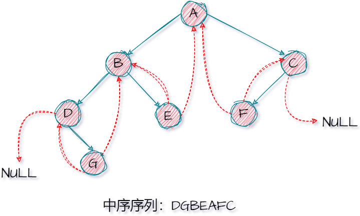

   2. 给出代码实现：

      ````cpp
      void InThread(ThreadTree &T, ThreadTree &pre)
      {
          if (T != NULL)
          {
              //(A)
              InThread(T->lchild, pre);
      
              if (T->lchild == NULL)
              {
                  T->lchild = pre;
                  T->ltag = 1;
              }
              if (pre != NULL && pre->rchild == NULL)
              {
                  pre->rchild = T;
                  pre->rtag = 1;
              }
              pre = T;
              //(B)
              InThread(T->rchild, pre);
          }
      }
      
      void CreateThread(ThreadTree &T)
      {
          ThreadTree pre = NULL;
          if (T != NULL)
          {
              InThread(T, pre);
              //(C)
              pre->rtag = 1;
          }
      }
      ````

   3. 同样的我们为上述代码提出部分说明：

      1. A处：此时还未对`T`建立前驱线索，故而无需判断。

      2. B处：此时还未对`T`建立后继线索，故而无需判断。

      3. C处：我们不妨假设中序遍历最后一个结点有右结点，那么根据中序遍历规则，该结点为最后一个结点的假设就不成立。故而同先序遍历一样，中序遍历的最后一个结点也一定没有右结点。

         ```cpp
         // 不会判断就直接这么记(推荐)
         if (pre->rchild == NULL) 
         {
             pre->rtag = 1; 
         }
         ```

         

7. 后续线索二叉树：

   1. 示意图如下：空左指针域指向后序序列中的前驱，空右指针域指向后序序列中的后继。<br>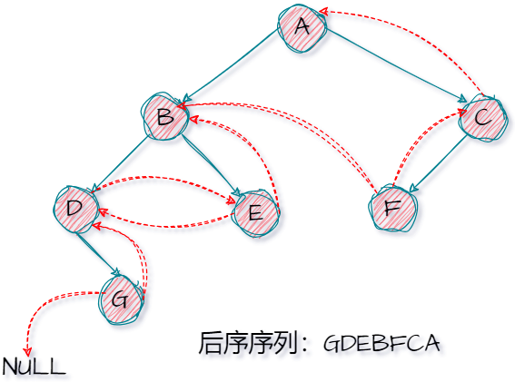

   2. 给出代码实现：

      ```cpp
      void PostThread(ThreadTree &T, ThreadTree &pre)
      {
          if (T != NULL)
          {
              PostThread(T->lchild, pre);
              PostThread(T->rchild, pre);
              if (T->lchild == NULL)
              {
                  T->lchild = pre;
                  T->ltag = 1;
              }
              if (pre != NULL && pre->rchild == NULL)
              {
                  pre->rchild = T;
                  pre->rtag = 1;
              }
              pre = T;
          }
      }
      
      void CreatePostThread(ThreadTree &T)
      {
          ThreadTree pre = NULL;
          if (T != NULL)
          {
              PostThread(T, pre);
              //(A)
              if (pre->rchild == NULL)
              {
                  pre->rtag = 1;
              }
          }
      }
      ```

      

   3. 同样的我们为上述代码提出部分说明：A处实际上我们知道后续遍历的最后一个结点一定是根节点。故而此处要么直接省略对根节点的处理(树只有一个结点时这样似乎不太恰当)，要么就要加判断。

8. 实际上线索化二叉树的过程就是二叉树的遍历过程，而创建线索的过程就是`visit`函数的逻辑。<br>

---


##### 线索二叉树中找前驱后继

1. 以中序遍历为例(最完美的线索二叉树)：`左 根 右`

   1. 找中序前驱：

      1. 若`lchild`被线索化，则直接找到前驱。

      2. 若`lchild`未线索化，则必有左孩子。则根据`左 根 右`，其前驱必为左子树中最后遍历的结点(一般称<span style="color:red">最右边</span>或者<span style="color:red">最右下</span>的结点)(此处因该是不停地递归找右子树，直到得到一个叶子结点或者无右孩子的根结点)。

         ```cpp
         ThreadNode *LastNode(ThreadNode *p)
         {
             while (p->rtag == 0)
                 p = p->rchild;
             return p;
         }
         
         ThreadNode *PreNode(ThreadNode *p)
         {
             if (p->ltag == 1)
                 return p->lchild;
             else
                 return LastNode(p->lchild);
         }
         ```
         
         <br>

   2. 找中序后继：

      1. 若`rchild`被线索化，则直接找到后驱。

      2. 若`rchild`未线索化，则必有右孩子。则根据`左 根 右`，其前驱必为右子树中最先遍历的结点(一般称<span style="color:red">最左边</span>或者<span style="color:red">最左下</span>的结点)(此处因该是不停地递归找左子树，直到得到一个叶子结点或者无左孩子的根结点)。

         ```cpp
         ThreadNode *Firstnode(ThreadNode *p)
         {
             while (p->ltag == 0) // 不断找左子树
                 p = p->lchild;
             return p;
         }
         
         ThreadNode *Nextnode(ThreadNode *p)
         {
             if (p->rtag == 0) 
                 //未线索化
                 return Firstnode(p->rchild);
             else
                 // 线索化
                 return p->rchild;
         }
         ```

         <br>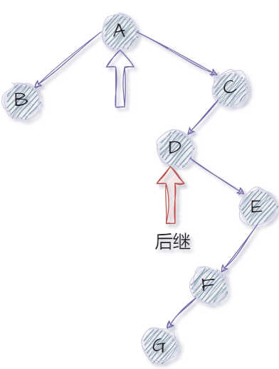

   3. 根据上述分析，我们就可以实现:

      1. 中序线索二叉树的中序遍历：(除非给的是中序序列的第一个结点，不然无法全部遍历)

         ```cpp
         void visit(ThreadNode *q)
         {
             printf("%c", q->data);
         }
         
         
         ThreadNode *Firstnode(ThreadNode *p)
         {
             while (p->ltag == 0)
                 p = p->lchild;
             return p;
         }
         ThreadNode *Nextnode(ThreadNode *p)
         {
             if (p->rtag == 0)
                 return Firstnode(p->rchild);
             else
                 return p->rchild;
         }
         void Inorder(ThreadNode *T)
         {
             for (ThreadNode *p = Firstnode(T); p !=NULL; p = Nextnode(p))
                 visit(p);
         }
         ```

         

      2. 中序线索二叉树的逆向中序遍历：(除非给的是中序序列的最后一个结点，不然无法全部遍历)

         ```cpp
         void visit(ThreadNode *q)
         {
             printf("%c", q->data);
         }
         
         ThreadNode *LastNode(ThreadNode *p)
         {
             while (p->rtag == 0)
                 p = p->rchild;
             return p;
         }
         ThreadNode *PreNode(ThreadNode *p)
         {
             if (p->ltag == 1)
                 return p->lchild;
             else
                 return LastNode(p->lchild);
         }
         void RevInThread(ThreadTree T)
         {
             for (ThreadNode *p = LastNode(T); p != NULL; p = PreNode(p))
                 visit(p);
         }
         ```

         

      3. 对于上述两部分代码的初始遍历条件有些疑惑：

         1. 中序遍历中使用`ThreadNode *p = Firstnode(T)`即将`p`初始化为当前以`T`为根结点子树的的最先访问的结点，从而可以将当前子树完整访问。
         2. 中序遍历中使用`ThreadNode *p = LastNode(T)`即将`p`初始化为当前以`T`为根结点子树的的最后访问的结点，从而可以逆序将当前子树完整访问。
         3. 那么我们接下来需要思考的是，对于任意的`T`这样做能否保证整个二叉树均被遍历？除非`T`为根结点(由`p`的初始化方式引起的)或者上述提到的两种情况，不然不行。

      

2. 以先序遍历为例：`根 左 右`

   1. 找先序后继：
      1. 若`rchild`被线索化，则直接找到后继。
      2. 若`rchild`没有线索化，则必有右孩子，则根据先序遍历顺序`根 左 右`:
         1. 若其有左孩子，则后继必在左子树中，且为左孩子。
         2. 若其没有左孩子，则后继必在右子树中，且为右孩子。
   2. 找先序前驱：
      1. 若`lchild`被线索化，则直接找到前继。
      2. 若`lchild`未被线索化：找不到，除非重新遍历。此时我们可以想到之前的三叉链表，此时可以访问父节点(我们假设父节点存在)：
         1. 若其为左孩子，则根据`根 左 右`，父结点为其前驱。
         2. 若其父结点无左孩子且其为右孩子，则根据`根 左 右`，父结点为其前驱。
         3. 若父结点有左孩子且其为右孩子，则根据`根 左 右`，其前驱为其父结点的左子树的最后访问的结点(优先向右转，其次向左转，最后的叶子结点)。<br>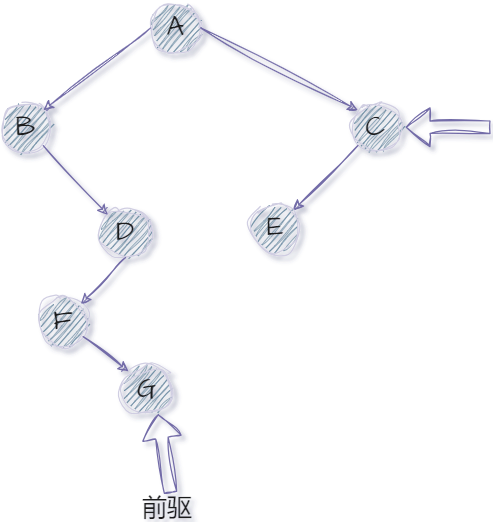

3. 以后序遍历为例：` 左 右 根`

   1. 找后序前驱：
      1. 若`lchild`被线索化，则直接找到前驱。
      2. 若`lchild`未线索化，则必有左孩子。
         1. 若有右孩子，则前驱在右子树中，根据`左 右 根`知前驱为右孩子。
         2. 若无右孩子，则前驱在左子树中，根据`左 右 根`知前驱为左孩子。
   2. 找后序后继：
      1. 若`rchild`被线索化，则直接找到后继。
      2. 若`rchild`未被线索化：找不到，除非重新遍历。此时我们可以想到之前的三叉链表，此时可以访问父节点(我们假设父节点存在)：
         1. 若其为右孩子，则父结点为前驱。
         2. 若其父结点有右孩子且其为左孩子，则根据`左 右 根`，其前驱为其父结点的右子树的最先被访问的结点(优先向左转，其次向右转，最后的叶子结点)。<br>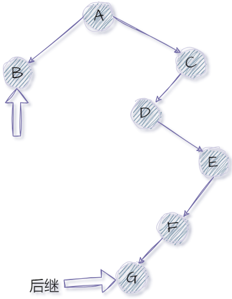
         3. 若其父结点无右孩子且其为左孩子，则根据`左 右 根`，父结点为前驱。


---


##### 树的存储结构

1. 由于树中不存在完全树的概念，我们无法按照使用数组存储二叉树那样去存储树。

2. 由于每个树结点的双亲结点是唯一的，于是乎我们提出了双亲表示法，

   1. 根节点的双亲指针指向`-1`，其他结点的双亲域指向双亲结点的位置。

   2. 双亲表示法找双亲结点容易，但是找子结点则需要遍历。故而双亲表示法适合找父结点多，找子结点少的场景(并查集)。

   3. 具体类型定义如下：

      ```cpp
      #include <iostream>
      #define MaxSize 100
      typedef char ElemType;
      
      typedef struct
      {
          ElemType data;   // 数据域
          int parent; // 双亲位置域
      } PTNode;
      
      typedef struct
      {
          PTNode nodes[MaxSize];
          int n; // 节点数
      } PTree;
      ```

      

   4. 演示如下：<br>

   5. 同样的双亲表示法也可以表示森林(将森林视作多个树存储)。

3. 由于双亲表示法不容易找子结点，于是乎我们又提出了孩子表示法(顺序存储+链式存储)：

   1. 记录根节点的位置很有必要(我们遍历时一般都是从根结点开始)。

   2. 与双亲表示法相反，孩子表示法找孩子容易找双亲难，故而双亲表示法适合找父结点少，找子结点多的场景(服务流程树)。

   3. 具体类型定义如下：

      ```cpp
      #include <iostream>
      #define MaxSize 100
      typedef char ElemType;
      
      typedef struct CTNode {
          int child;   // 孩子结点的下标
          struct CTNode *next; // 指向下一个孩子结点
      } *ChildPtr;
      
      typedef struct {
          ElemType data; // 结点的数据域
          ChildPtr firstchild; // 指向第一个孩子结点
          int n; // 节点数
      } CTBox;
      ```

      

   4. 演示如下：<br>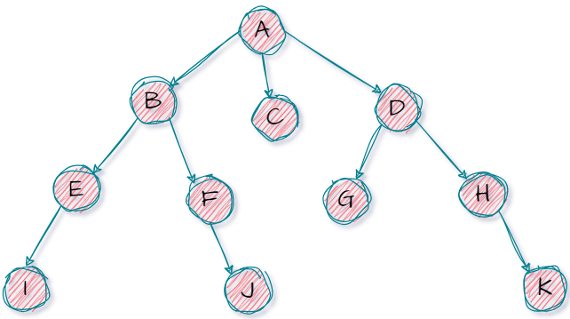<br>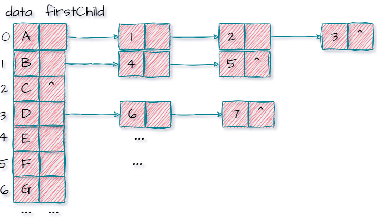

   5. 双亲表示法也表示森林(同上类比)。

4. 孩子兄弟表示法(纯链式存储)：左指针指向第一个孩子结点，右指针指向右兄弟结点。

   1. (后续森林转二叉树就是这样玩的)表示森林：将森林中每棵树的根节点视为平级的兄弟结点。
   
   2. 具体类型定义：
   
      ```cpp
      #include <iostream>
      #define MaxSize 100
      typedef char ElemType;
      
      typedef struct CSNode {
          ElemType data;
          struct CSNode *firstchild, *nextsibling; // 第一个孩子和右兄弟指针
      } CSNode, *CSTree;
      ```
   
      
   
   1. 演示结果如下：<br><br><br>


---

##### 树、森林、二叉树的转换(本质上是孩子兄弟表示法)

1. 人的每一次经历都是之前的经历加上命运造就的，而每个人的境遇是不可能相同的，命运也具有不确定性，这也就注定了世界上永远不会存在一个人会永远做出和你一样的选择，人生的每一个来客终有一天会在某一个十字路口离开。无论好的还是坏的，无论喜欢还是讨厌，他们都会远去。可是这个道理不能知道的太早，太早知道就会将每一个生命的来客当做过客，没了来时的欣喜，没了去时的悲伤，于是生命失去了相遇、失去了别离，你便成了整个世界的过客，或许这便是清醒的代价吧...<br>
2. 我们不妨先回顾一下孩子兄弟表示法：左指针指向第一个孩子结点，右指针指向右兄弟结点。
3. 树转换为二叉树：
   1. 转换流程：不熟悉建议自行画图模拟一遍！
      1. 保留根节点。
      2. 在兄弟结点之间加一个线。
      3. 对于每个结点保留它与第一个孩子的连线，而与其他孩子的连线全部抹掉。
      4. 以树根为轴心，将整个树顺时针旋转45°。
   2. 演示如下：<br><br>
4. 森林到二叉树的转换：森林中所以的根结点视为平级的兄弟关系。
   1. 转换流程：
      1. 将森林中各棵树视为平级的兄弟结点。
      2. 然后同上。
   2. 演示如下：<br>
5. 二叉树转树:
   1. 转换流程(自行领悟，逆过程而已)：
      1.   画出树的根结点。
      2.   把左孩子和其所在的一系列右指针"糖葫芦"拆开依次挂在该节点上。
      3. 依次重复上述过程...
   2. 演示如下：<br><br>
6. 二叉树转森林(自行领悟，逆过程而已)：
   1. 转换流程：
      1.  现将二叉树的根结点所在的一整串右指针"糖葫芦"拆下来作为多棵树的根。
      2.  然后依次回复各个树。
      3. 回复树的过程参考上述过程，自行领悟。
   2. 演示如下：<br>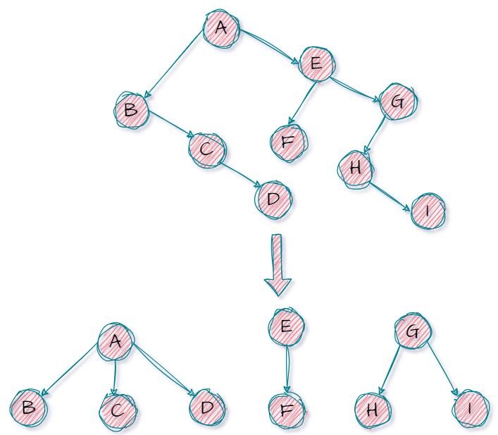
7. 前面说到树和森林转为二叉树本质上还是孩子兄弟表示法：左指针指向第一个孩子结点，右指针指向右兄弟结点。那么不妨假设一棵树(或者森林)$T$转换为二叉树为$BT$:
   1. $T$中的结点不存在子结点，即为叶子结点时，转换为$BT$后的结点左指针为空。
   2. $T$中的结点无右兄弟时，转换为$BT$​​后的结点右指针为空。
   3. 显然只有满足在$T$中为叶子结点，且其无右兄弟结点时，转为为$BT$后的结点为叶子结点。故而不难知道，$BT$中的叶子结点数一定小于或者等于$T$中的叶子结点数(猜想，显然条件跟严格，数量就可能变少)。
   4. <span style="color:red">$BT$中左指针为空的结点个数等于$T$中的叶子结点个数。</span>
   5. 下面提出一个稍微复杂的结论：<span style="color:red">$BT$中的右指针为空的结点个数等于$T$​中非终端结点个数+1。</span>
      1. 首先提出几个概念：
         1. 非终端结点：度不为$0$的结点称为非终端结点或者分支结点。
         2. 终端结点：度为$0$的结点称为终端结点或者叶子结点。
         3. 堂兄弟结点不包括亲兄弟结点，祖先不包括父结点的兄弟结点。

      2. 根据上面分析，显然对于一个非叶子结点来说，它一定有孩子，那么其必存在一个无右兄弟的孩子结点，转为为$BT$必定存在一个左指针域为空的结点。显然有多少个非叶子结点就会有多少个左指针域为空的结点。
      3. 那么到了关键问题，$+1$哪来的？
         1. 对于森林而言其所有树的根结点连在一起，会产生一个左指针域为空的结点，即最后一棵树的根节点。<br>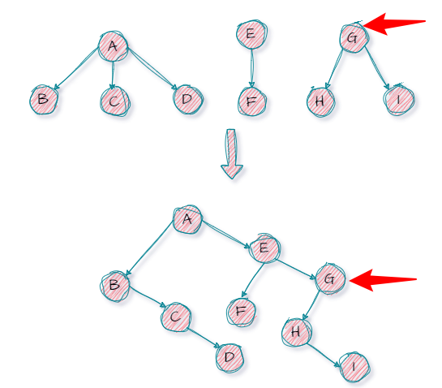
         2. 而对于树转二叉树而言，树的根节点转换后会产生一个左指针域为空的结点(你也可视为只有一棵树的森林)。<br>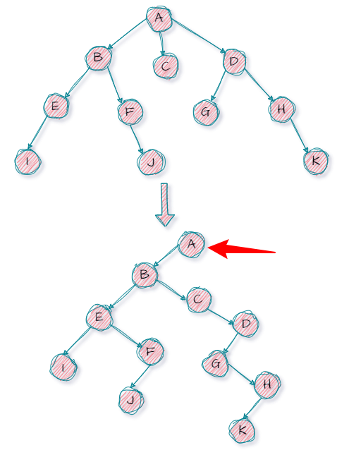
      4. 此外还需要点明的是：在森林转换为二叉树的过程中，第一棵树组成二叉树的根节点和左子树部分。剩余的二叉树则组成右子树中最外层部分(有几个结点就有几棵树)。<br>


---


##### 树和森林的遍历

1. 树的先根遍历：先访问根结点，然后再依次对每棵子树进行先根遍历，树的先根遍历与将树转化为二叉树后进行先序遍历所得的遍历序列相同。<br>

   ```cpp
   void PreOrderTraverse(Tree R)
   {
       if (R！=NULL)
       {
           visit(R); // 访问根节点
           while (还有下一个子树T)
           {
               PreOrderTraverse(T);
           }
       }
   }
   ```

   

2. 树的后根遍历：先依次对每棵子树进行后根遍历，然后再访问根节点(无私地)，树的后根遍历与将树转化为二叉树后进行中序遍历所得的遍历序列相同。<br>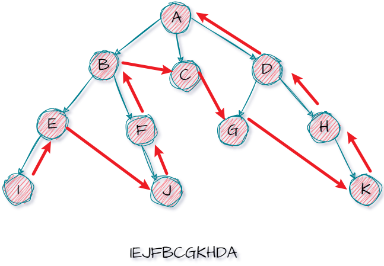

   ```cpp
   void PreOrderTraverse(Tree R)
   {
       if (R！=NULL)
       {  
           while (还有下一个子树T)
           {
               PreOrderTraverse(T);
           }
           visit(R); // 访问根节点
       }
   }
   ```

   

3. 树的层次遍历：同二叉树的层次遍历。<br>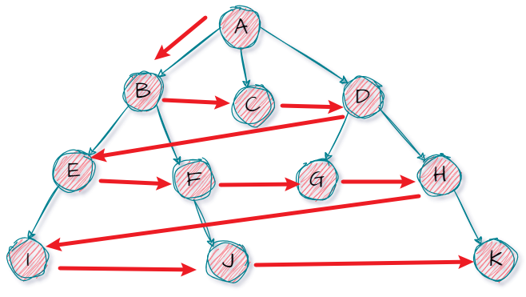

4. 森林的先序遍历：效果等同于依次对各个树进行先根遍历(`one by one`)，或者将森林转换为二叉树后进行先序遍历。<br>

5. 森林的中序遍历(中序是相对其二叉树形态而言，故而有些教材称其为后续遍历)：效果等同于依次对各个树进行后根遍历(`one by one`)，或者将森林转换为二叉树后进行中序遍历。<br>

6. 等效关系具体如下：根据下面的等效关系可以知道：知道一棵树的先根遍历和后根遍历可以推出一棵树(先推出对应二叉树，再转换为树)，同理知道森林的先序遍历和中序遍历也可以确定森林(先推出对应二叉树，再转换为森林)。

   | 树                                      | 森林                                                        | 二叉树                                  |
   | --------------------------------------- | ----------------------------------------------------------- | --------------------------------------- |
   | 先根遍历                                | 先序遍历                                                    | 先序遍历                                |
   | <span style="color:red">后根遍历</span> | <span style="color:red">中序遍历(有的书也叫后根遍历)</span> | <span style="color:red">中序遍历</span> |

----

##### 哈夫曼树(不唯一)与哈夫曼编码

###### 哈夫曼树

1. 结点的权：具有某种现实意义的数值。
2. 结点的带权路径长度：从根到该结点的路径长度(所含分支数目)与该结点上权值的乘积。
3. 树的带权路径长度(`WPL`)：树中所有<span style="color:red">叶子结点</span>的带权路径长度之和。
4. 在含有`n`个带权叶结点的二叉树中，哈夫曼树的`WPL`最小的称哈夫曼树，也称最优二叉树。哈夫曼树的构建步骤如下:
   1. 将所给的n个结点分别作为`n`棵仅含一个结点的二叉树，构成森林`F`。
   2. 构造一个新的结点，从`F`中选取两棵结点权值最小的树作为新结点的左、右子树，并将新结点的权值置为其左右子树上根结点的权值之和。
   3. 在`F`中删除这两棵树，同时将新得到的二叉树加入到森林`F`中。
   4. 重复上述2、3两步。
5. 哈夫曼树的特点：
   1. 每个初始结点都会最终成为哈夫曼树的叶子结点。

   2. 哈夫曼树的构建过程总共新建了`n-1`个结点(两两一组，建一个双分支结点)，故而一个哈夫曼树共有`2n-1`个结点。

   3. 哈夫曼树中不存在度为1的结点。

   4. 关于哈夫曼树构建过程中的疑惑：在哈夫曼树构建的第二步中有个步骤是"将新结点的权值置为其左右子树上根结点的权值之和"，为什么不是将新树的`WPL`作为新结点的权值(似乎更加不对劲)。这样真的能保证得到的是哈夫曼树吗？

      1. 哈夫曼是一个典型的贪心算法，总是先合并权值最小的两个节点，这样可以确保权值小的节点在树的底部，从而使得`WPL`最小。

      2. 始终不明白将$①$部分等效为$②$部分真的可行吗。其实对于$①②$的`WPL`来说，显然有：$①=②+x1+x2$。如果我们将$②$视为$①$的子问题的话，那么显然当$②$最优时，$①$也最优。故而使用$②$去代替$①$贪心是可行的。<br>

      3. 对于贪心问题除了知道如何贪，还需要从子问题与原问题的关系入手，佐证贪心的局部最优能保证整体最优。
6. 关于哈夫曼树的一些说明：
   1. 哈夫曼树可能不唯一(谁左谁右、相等时选谁等等)，但是无论如何其`WPL`都是一样的。
   2. 哈夫曼树的代码实现部分待补，暂不知是否会考察(参考语雀笔记部分)。
   3. 哈夫曼树的构建过程演示如下：<br>
7. 细节补充：
   1. 我们平时一般所说的哈夫曼树是指最优二叉树,也叫做严格二叉树,但是哈夫曼树完全不局限于二叉树,也存在于多叉树中,即度为$m$的哈夫曼树,也叫最优$m$叉树或严格$m$叉树。对于这种度为$m$的哈夫曼树(只存在度为$0$或者$m$的结点)，假设叶子结点有$n_0$个时显然有$n_m+n_0=n$且$m*n_m+1=n$，整理得$n_m=\frac{n_0+1}{m-1}$。
   2. 我们一般所说的哈夫曼树(最优二叉树)，只存在度为$0$或者$2$的结点。若有$n$个叶子结点，则有$n-1$个非叶子结点，整棵树含有$2n-1$个结点。
   3. 对于哈夫曼树的带权路径长度存在两种求法：
      1. 所有叶子结点的带权路径长度之和。
      2. <span style="color:red">所以分支结点(非叶子结点)的权值之和</span>。
      3. 重点推导一下第二种方法：实际上在哈夫曼树中，对于一个叶子结点而言，其祖先结点的个数实际上就是等同于其路径长度的。而我们知道哈夫曼树构建过程中，把子结点的权值之和作为父结点的权值，那么其实每个非叶子结点的权值其实就等于其子孙非叶子结点的权值之和。那么显然所以非叶子结点的权值之和是等于所有叶子结点的带权路径之和的。例如下图中，我们计算$①+②+③$时，实际上$2+4$计算$3$次，$5$计算$2$次，$7$计算$1$次。<br>

8. 根据哈夫曼的构建过程，我们不妨判断一下下列各序列(从根到叶子结点的权值序列)是否可能出自同一个哈夫曼树：
   1. $24,10,5$和$24,10,7$:
      1. 若上述两个序列中的$10$不为同一个结点，则由于$10+10\not=24$,故不成立。<br>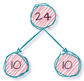
      2. 若上述两个序列中的$10$为同一个结点，则$7$和$5$为$10$的两个子结点，但是由于$5+7\neq 10$，故不成立。<br>

   2. $24,10,10$和$24,14,11$:
      1. 显然若出自同一棵哈夫曼树，则$10$和$14$为$24$的子结点，于是得出下图所示情况。但是根据哈夫曼树的构建原则，显然$3$应该先和$10$一起构成兄弟而不是$11$。此外哈夫曼树中不存在度为$1$的结点也同样表明着矛盾。<span style="color:red">进一步分析，显然$24,10,10$根本就不可能是哈弗曼树的产物。</span><br>


---


###### 哈夫曼编码(最优前缀码)

1. 对于固定长度编码，我们使用相等长度的二进制位表示不同字符即可。但是对于可变长度编码，则复杂一些，我们需要保证没有一个编码是另一个编码的前缀，这样的编码称为前缀编码。而哈夫曼编码是一种最优前缀编码，其将每个字符出现的频度作为该结点的权值，使得频繁使用的字符的二进制长度尽可能小。
2. 由于哈夫曼树的不唯一性，哈夫曼编码也是不唯一的。因此编码和解码需要使用同一棵哈夫曼树。
3. 具体演示如下：
   1. 要保证使用概率越大的编码越短。
   2. 哈夫曼树的每个分支标上$0$或者$1$，其中左分支标记$0$，右分支标记$1$。
   3. <span style="color:red">为什么哈夫曼编码是前缀编码，其实就是所有字符均在叶子结点，所以不存在到达哪个字符会经过其他字符，自然而然也就不会出现前缀问题。</span><br>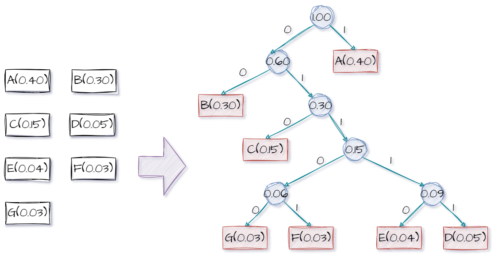
4. 编码与解码：
   1. 编码：根据字符使用频率构建哈夫曼树，查字符获得哈夫曼编码。
   2. 解码：读取二进制码,并按照"$0$走左孩子，$1$走右孩子"的规则遍历哈夫曼树，到达叶子结点则译出字符。而后重新开始从根结点遍历。
5. 代码实现：略
6. 细节探究：
   1. 哈夫曼树的加权平均路径长度是哈夫曼编码的效率衡量标准，它表示的是每个字符编码长度(结点的路径长度)与其出现频率的乘积的总和。
   2. <span style="color:red">我们不妨研究一下等长编码的二叉树存储形式：显然所有编码均为叶子结点，且均在同一层。其存储二叉树是一棵满二叉树</span>。<br>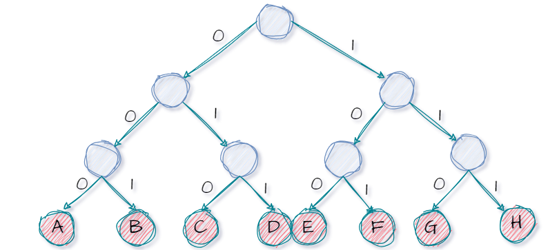

7. 较复杂的前缀编码进一步讨论：
   1. 哈夫曼编码是一种变长编码方式，通常情况下，不同的字符的编码长度是不同的。然而，<span style="color:red">如果所有字符的出现频率都相同，那么生成的哈夫曼编码就会是等长的。当然还有其他情况，例如$5,6,7,8$这种情况构建哈夫曼树显然也是满二叉树。</span><br>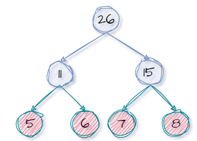
   2. 假设哈夫曼编码长度不超过$n$位，那么其最多可以表示多少个字符？这个问题乍一看似乎不太好分析，但是实际上哈夫曼编码不超过$n$其实就是指哈夫曼树的高度不超过$n+1$。问最多表示几个字符，其实就是问叶子结点最多多少个？显然满二叉树的情况下最多且为：$2^n$​个。
   3. 那么接下来考虑另外一个问题，在不考虑等长编码的情况下，对于我们一个哈夫曼树，我们已经使用$0$，那么假设还有一个字符待编码，则可以使用$1$。那若我们还有两个字符需要编码时，显然$1$就不可取。此时我们可以取$0,10,11$(当然其实$0,10,110$或者$0,10,110$等等也均可，但是我们不考虑，重点是分析的过程)。那若我们还有三个字符需要存储时，显然此时$11$不可取，此时我们取$0,10,110,111$(由于$0、10$的存在限制我们第一位必需是$1$，第二位必是$1$​)。
   4. 那么现在我们就可以解决：假设哈夫曼编码长度不超过4，若已经对两个字符编码为$1$和$01$,则最多还可以编码多少个字符？显然由于$1$和$01$的限制，我们后续的编码必定要形如$00\_\ \_$。显然最大时，直接考虑等长编码，故最大可继续为$2^2=4$个字符进行编码。或者我们可以按照之前的树去分析，如图：<br>


---


##### 补充

1. 所谓先序、中序、后序指的是根在遍历顺序中的位置。
2. 王道的"分支点逐层展开法"和从"你的全世界路过法"(中序、后序遍历)很好，但如果对代码非常熟悉的话，可以直接模拟代码执行过程求遍历序列。<br>
3. <span style="color:red">所谓中序前驱是指在中序遍历时该结点的前驱，而中序后继是指在中序遍历时该结点的后继，其他类似即可。</span>
4. <span style="color:red">在上述遍历过程中使用的`visit()`函数实际上只要接受数据域就可以，没必要接受整个结点的指针。但是为了后面线索化二叉树时抽出`visit()`函数，就不改了！</span><br>
5. 上述代码中`BiTNode*`和`BiTree`本质上是同一种类型，但是一般而言`BiTree`是指的树，而`BiTNode*`指的是树结点的指针类型，最好不要混用。
6. 递归类型的三种遍历熟练掌握，很多算法题都是在遍历的基础上修改`visit()`函数内的逻辑的。


---


##### 并查集

1. 并查集是<span style="color:red">采用顺序存储的树</span>，而<span style="color:red">不是二叉树</span>。且为了方便，采用双亲表示法。

2. 并查集的逻辑结构是集合。不同集合互不相交，这一点与森林中各棵树互不相交的性质及其相似。故而我们可以将属于同一个集合的不同元素构成一棵树。并查集中除了初始化之外，还有两个主要的操作就是并`union`和查`find`，其实现思想如下：

   1. 查：判断当前元素属于哪个集合，即从当前元素开始不断向上查找父结点，直至找到根结点。
   2. 并：将两个集合合并为一个集合，只需要将一个树挂在另一棵树的根节点下面即可(即成为其子树)。
   3. <span style="color:red">此外提一嘴，通过查找到两个元素的根，可以判断二者是否属于同一个集合。</span>

3.   并查集的关键在于并和查，无论是哪一个都离不开找父结点的操作。故而在选择存储方式时，选择树的存储方式中的双亲表示法。

   1. 结构定义：

      ```cpp
      #include <iostream>
      #define MaxSize 100
      
      // 不存储结点的数据域
      int UFSets[MaxSize];
      ```

      

   2. 初始化：初始时，每个元素都是一个单独的集合，根结点是自己。

      ```cpp
      void Initial(int S[])
      {
          for (int i = 0; i < MaxSize; i++)
          {
              S[i] = -1;
          }
      }
      ```

      

   3. 并(时间复杂度$O(1)$)：其实一般而言在合并之前都会去查找各自的根节点(省略)，后执行合并操作。

      ```cpp
      void Union(int S[], int Root1, int Root2)
      {
          if (Root1 != Root2)
          {
              S[Root2] = Root1;
          }
      }
      ```

      

   4. 查(时间复杂度$O(n)$)：一路向北，知道找到根结点(其指向的索引为负值)。<span style="color:red">根结点中的负数可以视作一种标志表示找到根结点，但是不要误以为$find$返回的是该负数，实际上$find$返回的是根结点的位置</span>。

      ```cpp
      int Find(int S[], int x)
      {
          while (S[x] >= 0)
          {
              x = S[x];
          }
          return x;
      }
      ```

      

   5. 关于并查集为何不存储数据域(`github copilot`)：

      1. 简化数据结构：并查集的主要操作是“合并”和“查找”，并不涉及到对数据域的直接操作。因此，为了简化数据结构，通常不在并查集中直接存储数据域。
      2. 灵活性：并查集中的元素可以是任何可以区分的对象，如整数、字符串等。<span style="color:red">如果需要，你可以在外部维护一个映射，将并查集中的元素映射到实际的数据。</span>
      3. 效率：并查集的效率主要取决于“合并”和“查找”操作的效率，而这两个操作并不需要访问数据域。因此，不存储数据域可以减少内存使用，提高效率。

   6. 关于上面所给的查的时间复杂度，当集合元素是一条长长的链状时，达到最大时间复杂度$O(n)$。显然我们不难看出树的深度越小，广度越大，查的时间复杂度就越小。

   7. 基于上述分析，我们提出并查集的优化版本，在合并时我们总是让小树挂在大树上，保证树的宽度不会增加(如下图)。那么我们如何去判断树的大小？通过树的结点数来粗略估计树的高度(显然不是很精确)，并且我们把树的结点数记在根节点的索引指针域中(以负数的形式，方便将根结点与其他结点区分开)。<span style="color:red">此时时间复杂度降为$O(log_2n)$,始终牢记根节点的指针域记录的是当前树的结点数的负数。</span>

      ```cpp
      void Union(int S[], int Root1, int Root2)
      {
          if (Root1 == Root2)
              return;
      
          if (S[Root2] > S[Root1]) // (负数)Root2的结点个数小
          {
              S[Root1] += S[Root2]; // Root1结点个数增加
              S[Root2] = Root1;     // Root2并入Root1
          }
          else
          {
              S[Root2] += S[Root1]; // Root2结点个数增加
              S[Root1] = Root2;     // Root1并入Root2
          }
      }
      ```

      <br>

   8. 当然上述优化只是尽力不增加树的高度，那我们为啥不想办法降低树的告诉呢？于是乎我们进一步优化，在查时将查找路径上的所以结点都挂在根节点上，<span style="color:red">我们把这种方式称为路径压缩。此时可以将查的时间复杂度优化到$O(\alpha(n))$。</span>

      ```cpp
      // 路径压缩
      int find(int S[], int x)
      {
          int root = x;
          while (S[root] >= 0) // 循环找到根结点
          {
              root = S[root];
          }
      
          while (x != root)
          {
              int parent = S[x]; // 保存父结点(后续向上访问)
              S[x] = root;       // 将当前结点指向根结点
              x = parent;        // 向上访问
          }
          return root;
      }
      ```

      <br>

4. 补充：

   1.  对于优化前后的分析：
      1. 优化前：查的时间复杂度$O(n)$，将$n$个独立元素经过多次并操作的时间复杂度$O(n^2)$​。
      2. 对并操作优化后：查的时间复杂度$O(log_2n)$，将$n$个独立元素经过多次并操作的时间复杂度$O(n*log_2n)$。
      3. 对查操作优化后：查的时间复杂度$O(\alpha(n))$，将$n$个独立元素经过多次并操作的时间复杂度$O(n*\alpha(n))$。
   2. 数据结构可视化网站：[Data Structure Visualization](https://www.cs.usfca.edu/~galles/visualization/Algorithms.html)<br>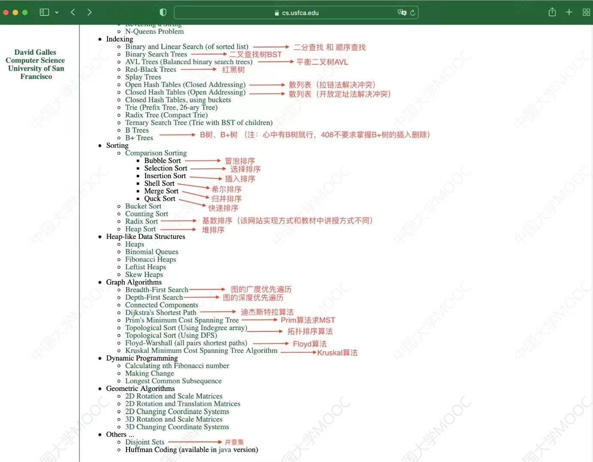


---


### 5.图


##### 图的基本概念

1. 我在自己笔记上胡说八道很正常的：很多时候觉得世界不好，但是世界本就是由人组成的，所以或许很多时候还是觉得人不好。一坨屎，爷不想写了，什么狗东西也想炸爷心态。乐观开朗，积极向上！！！

2. 单词
   1. `arc`弧

   2. `edge`边

   3. `vertex`顶点

   4. `vertice`顶点

3. 图$G$由顶点集$V$和边集$E$组成，$G=(V,E)$即$Graph(Vertex,Edge)$,其中，$V(G)$表示图$G$中顶点的有限非空集合，$E(G)$表示图$G$中顶点之间的关系(边)集合。若$V=\{v_1,v_2,v_3,...,v_n\}$，则用$|V|$表示图$G$中的顶点个数，也称图G的阶。$E=\{(u,v)|u\in V,v\in V \}$,用$|E|$表示图G的边的条数。<span style="color:red">线性表可以是空表，树可以是空树，但图不可以是空，即$V$一定是非空集。</span>

4. 无向图与有向图：

   1. 无向图：若$E$是无向边(简称边)，则图$G$为无向图。其边是顶点的无序对，记作$(v,w)$或$(w,v)$，且$(v,w)=(w,v)$。

   1. 有向图：若$E$是无向边(也称弧)，则图$G$为有向图。其边是顶点的有序对，记作$<v,w>$，其中$v$称为弧尾。$w$称作弧头，注意$<v,w>\not=<w,v>$。

5. 简单图与多重图：其中简单图不存在重复边，亦不存在到顶点自身的边，多重图略。

6. 度：

   1. 无向图：顶点$v$的度指的是依附于该顶点的边的条数，记作$TD(v)$。例如下图中$A$顶点的度为3。<br>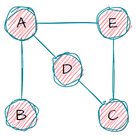
   2. 有向图：入度是以顶点v为终点的有向边的数目，记作$ID(v)$。出度是以顶点$v$为起点的有向边的数目，记作$OD(v)$。顶点v的度等于入度与出度之和，即$TD(v)=ID(v)+OD(v)$。例如下图中$A$顶点的度为3，其中入度为1，出度为2。<br>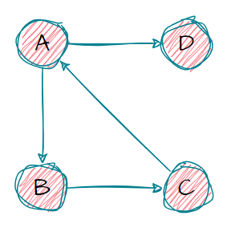

7. 关于点与点之间的关系描述：
   1. 路径：顶点$v_p$到顶点$v_q$之间的一条路径是指顶点序列：$v_p,{v_i}_1,,{v_i}_2,...,{v_i}_m,v_q$。
   2. 回路：第一个顶点和最后一个顶点相同的路径称为回路或者环。
   3. 简单路径：在路径序列中，顶点不重复出现的路径。
   4. 简单回路：除了第一个顶点和最后一个顶点之外，其余顶点不重复出现的路径。
   5. 路径长度：路径上的边的数目。
   6. <span style="color:red">带权路径长度：网中，一条路径上所有边的权值之和称为该路径的带权路径长度。</span>
   7. 点到点的距离：从顶点$u$出发到顶点$v$的最短路径若存在，则此路径的长度称为$u$到$v$的距离。若从$u$到$v$不存在路径，则记该距离为无穷($\infty$)。
   8. 连通与强连通：
      1. 在<span style="color:red">无向图</span>中，若顶点$u$到顶点$v$有路径存在，则称$v$和$w$是连通的。若图$G$中任意两个顶点都是<span style="color:red">连通</span>的，则称图$G$为<span style="color:red">连通图</span>，否则称为<span style="color:red">非连通图</span>。
      2. 在<span style="color:red">有向图</span>中，若顶点$u$到顶点$v$和顶点$v$到顶点$u$都有路径存在，则称$v$和$w$是<span style="color:red">强连通</span>的。若图$G$中任意一对顶点都是<span style="color:red">强连通</span>的，则称图$G$​为<span style="color:red">连强通图</span>。
   9. 子图与生成子图(不区分无向图和有向图)：子图：若一个图$G'$(注意$G'$一定要能够构成一个图)的顶点集合和边集合都是图$G$的子集，则称$G'$为$G$的子图。<span style="color:red">若$G'$包含$G$的所有顶点，则称$G'$为$G$的生存子图。</span><br>
   10. 连通分量与强连通分量：
       1. 连通分量：无向图中的极大连通子图(子图必需连通，且包含尽可能多的顶点和边)称为连通分量。下图中图$G$存在3个极大连通子图(显然由图可知这不是你所理解的那种唯一的"极大连通子图")。<br>
       2. 强连通分量：有向图中的极大强连通子图(子图必需强连通，且包含尽可能多的顶点和边)称为连通分量。下图中图$G$存在3个极大强连通子图(显然由图可知这不是你所理解的那种唯一的"极大强连通子图")。<br>


11. 生成树(<span style="color:red">只针对无向图</span>)：连通图的生成树是包含图中全部顶点的极小连通子图。若图中有$n$个顶点，则它的生成树含有$n-1$条边。对于生成树而言，多一条边会形成回路，少一条边会变成非联通图，恰好(<span style="color:red">注意生成树不唯一！！！</span>)。<br>
12. 生成森林(<span style="color:red">只针对无向图</span>)：在非连通图中，连通分量的生成树构成了非连通图的生成森林。
13. (<span style="color:red">重点</span>)权：
    1. 边的权：一个图中，每条边都可以标上具有某种含义的数值，该数值称为该边的权。
    2. 带权图/网：边上带有权值的图也称<span style="color:red">带权图</span>，也称<span style="color:red">网</span>。
    3. <span style="color:red">带权路径长度：网中，一条路径上所有边的权值之和称为该路径的带权路径长度。</span>
14. 稀疏图和稠密图：相对而言。
15. 树和有向树：
    1. 不存在回路且连通的无向图称为树。
    2. 一个顶点的入度为0，其余顶点的入度均为1的有向图称为有向树。
16. (<span style="color:red">重点</span>)考点：
    1. 对于含有$n$个顶点的无向图$G$​：
       1. <span style="color:red">所有顶点的度之和为$2|E|$。</span>
       2. <span style="color:red">若$G$为连通图，则至少含有$n-1$条边(树)。</span>
       3. <span style="color:red">若$|E|>n-1$,则图一定有回路，但是注意图$G$​此时不一定连通。</span>
       4. <span style="color:red">若$G$为非连通图，则最多含有${C^2_{n-1}}$条边(一个顶点游离在外，其余顶点两两连通)。</span>
       5. <span style="color:red">无向完全图共有${C^2_{n}}$条边。</span>
    2. 对于含有$n$个顶点的有向图$G$​：
       1. <span style="color:red">所有顶点的出度之和=入度之和=$|E|$。</sapn>
       2. <span style="color:red">所有顶点的度之和为$2|E|$。</span>
       3. <span style="color:red">若$G$为强连通图，则至少含有$n$​条边(形成回路)。</span>
       4. <span style="color:red">无向完全图共有$2{C^2_{n}}$​条边。</span>
17. 补充完全图：
    1. 对于无向图而言，其$|E|$的取值范围为$0$到$\frac{n(n-1)}{2}$。其中$|E|=\frac{n(n-1)}{2}$的图为无向完全图，即任意两个顶点之间都存在边。
    2. 对于有向图而言，其$|E|$的取值范围为$0$到$n(n-1)$。其中$|E|=n(n-1)$​的图为有向完全图，即任意两个顶点之间都存在方向相反的两条弧。


---


##### 图的存储

###### 邻接矩阵法

1. 存储步骤：

   1. 设置一个定点表存储顶点的一些额外信息。
   2. 设置一个邻接矩阵，其中：<span style="color:red">邻接矩阵的大小为$|V|*|V|$。
      1. 无向图中，$edge[i][j]$表示顶点表中的第$i$个顶点和第$j$个顶点是否有边$(v_i,v_j)$,有记$1$无记$0$。
      2. 有向图中，$edge[i][j]$表示顶点表中的第$i$个顶点和第$j$个顶点是否有有向边$<v_i,v_j>$,有记$1$无记$0$。
      3. 网中，$edge[i][j]$表示边$<v_i,v_j>$或$(v_i,v_j)$的权值,若没有则记作$\infty$(当然有些教材喜欢把自己指向自己记作$0$)。

2. 类型定义：

   ```cpp
   #include <iostream>
   #define MaxVexNum 100
   #define infty 65535 // 定义∞
   
   typedef char VertexType;
   typedef struct
   {
       VertexType vex[MaxVexNum]; // 顶点表
       int edge[MaxVexNum][MaxVexNum]; // 邻接矩阵
       int vertexNum, edgeNum; // 顶点数和边(弧)数
   } MGraph;
   ```
   
   
   
3. 演示图(主对角线处全填0也是可以的)：<br>

4. 基本操作的思想：

   1. 求顶点的度(<span style="color:red">时间复杂度$O(|V|)$</span>)：对于无向图找顶点$v_i$的边，只需要遍历领接矩阵的第$i$行,记录<span style="color:red">非零元素个数</span>即为度。而对于有向图，找指向顶点$v_i$的边，只需要遍历领接矩阵的第$i$列,记录<span style="color:red">非零元素个数</span>即为入度。同理遍历对应的第$i$​行可以求出度。
   2. 找与一个顶点相连的边或者弧：遍历对应的行或者列即可。

5. 注意事项：

   1. 邻接矩阵法适合存储稠密图。
   2. 空间复杂度$O(|V|^2)$​，只与顶点数有关。
   3. <span style="color:red">邻接矩阵的性质：设图$G$的邻接矩阵为$A$(矩阵元素只有$0$、$1$)，则$A^n$的元素$A^n[i][j]$表示顶点$v_i$到顶点$v_j$的长度为$n$的路径的数目。</span>(可以尝试使用线代知识算一算：略。例如$a_{12}*a_{23}=1$显然表明$v_1->v_2->v_3$可行，即$a_{12}=a_{23}=1$​)

---


###### 邻接表法

1. (顺序+链式存储)(<span style="color:red">不唯一</span>)

2. 存储步骤：

   1. 定义一个顶点表，其中每个元素含一个顶点域用于存储信息，此外还有一个指针域指向第一个边(不唯一,因为不存在顺序可言)。
   2. 每个顶点元素指向一串(出度)边链表(表示由该顶点指出的边)。其中链表结点中存储下一条边的指针、边的权值、边或者弧指向的顶点。

3. 结构定义：

   ```cpp
   #include <iostream>
   #define MaxVexNum 100
   typedef char VertexType;
   
   typedef struct ArcNode
   {
       int adjvex;           // 邻接点域，存储边或者弧指向哪个顶点
       struct ArcNode *next; // 指向下一条边或者弧
       int weight;           // 权值
   } ArcNode;
   
   typedef struct VNode
   {
       VertexType data;      // 顶点域，存储顶点信息
       ArcNode *firstedge; // 边表头指针
   } VNode, AdjList[MaxVexNum];
   
   typedef struct
   {
       AdjList vertices;       // 邻接表
       int vexnum, arcnum; // 顶点数和边数
   } ALGraph;
   ```

   

4. 演示：<br>

5. 基本操作的思想：

   1. 计算度：
      1. 对于无向图：显然遍历顶点后的边链表，记录的结点个数即为度。
      2. 对于有向图：入度同上，但是出度不好算(<span id="inverse_adjacency">当然也可以在单链表中存储入度边，此时出度边难找，此时称为逆邻接表</span>)(或者说出度、入度二选一)。

6. 注意事项：

   1. 适合存储稀疏图，表示不唯一。
   2. 若使用邻接表法存储无向图，删除顶点、边的复杂度较高，并且边存储两遍，数据冗余。
   3. 有向图计算出度容易，入度难。
   4. 邻接表法不方便检查任意一对顶点见是否存在边。
   5. 空间复杂度：
      1. 有向图：$O(|V|+|E|)$
      2. 无向图：$O(|V|+2|E|)$​

----


###### 十字链表法

1. 十字链表法(<span style="color:red">只存储有向图，且同邻接表法一样不唯一</span>)：由于有向图的入度难求，故而对邻接表法提出改进。

2. 存储步骤：

   1. 依旧是定义顶点表，但是顶点表中除了数据域($data$)外，还有指向入度边链表的首个顶点($firstin$)、出度边链表首个顶点($firstout$)的两个指针。

   2. 而链表结点提供如下
      1. $hlink$​指向下一个入度边(具有相同头端点的边的链表结点)
      2. $tlink$​指向下一个除度边(具有相同尾端点的边的链表结点)
      3. $tailvex$有向边的尾端顶点在顶点表中的位置索引。
      4. $headvex$​有向边的头端顶点在顶点表中的位置索引。
      5. $info$​​记录边的权值。

   3. 类型定义：

      ```cpp
      #include <iostream>
      #define MaxVexNum 100
      
      typedef char VertexType;
      typedef struct ArcNode {
          int tailvex, headvex; // 弧尾、弧头顶点的位置
          struct ArcNode *hlink, *tlink; // 分别指向弧头相同和弧尾相同的下一条弧
          int info; // 权值
      } ArcNode;
      
      typedef struct VNode {
          VertexType data; // 顶点信息
          ArcNode *firstin, *firstout; // 分别指向该顶点的第一条入弧和出弧
      } VNode;
      
      typedef struct {
          VNode xlist[MaxVexNum]; // 顶点数组
          int vexnum, arcnum; // 顶点数和弧数
      } OLGraph;
      ```

      

   4. 演示如下：<br>

---


###### 邻接多重表

1. 邻接多重表(<span style="color:red">只存储无向图，不唯一</span>)：由于无向图的每条边在存储时都要存储多次，浪费空间，故而我们提出邻接多重表法存储无向图。
   1. 存储步骤：
      1. 顶点表中设有数据域$data$以及指向第一个边链表结点的$firstEdge$。
      2. 而链表结点设有:
         1. $ivex$、$jvex$存储边依附的顶点在顶点表中的位置索引。
         2. $ilink$(或$jlink$)指向依附于顶点$ivex$($jvex$)的边结点。不用像十字链插法纠结谁指向谁，但是$ilink$一定是和$ivex$对应的，$jlink$亦同理。
         3. $info$存储边的权值信息等。
   2. 结构定义：略
   3. 演示：<br>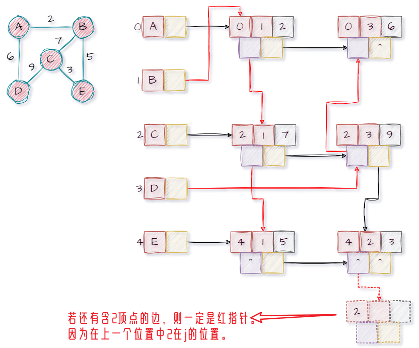

---


###### 多种存储结构对比

这里的$E$和$V$其实因该是$|E|$和$|V|$，但是`obsidian`的渲染有问题所以就没写这种形式。

|            |                         邻接矩阵                         | 邻接表                                  | 十字链表   | 邻接多重表 |
| ---------- | :------------------------------------------------------: | --------------------------------------- | ---------- | ---------- |
| 空间复杂度 |                         $O(V^2)$                         | 无向图：$O(V+{2E})$    有向图：$O(V+E)$ | $O(V+E)$   | $O(V+E)$   |
| 找相邻边   | 遍历对应行或者列                      时间复杂度为$O(V)$ | 找有向图的入边必需整个遍历              | 很方便     | 很方便     |
| 删顶点或边 |       删除边很方便，但是删除顶点需要移动大量数据。       | 无向图删除顶点和边都不方便。            | 很方便     | 很方便     |
| 适用于     |                          稠密图                          | 稀疏图                                  | 只能有向图 | 只能无向图 |
| 表达方式   |                           唯一                           | 不唯一                                  | 不唯一     | 不唯一     |


----


##### 图的基本操作

1. 人还是要严于律己，不该说的少说，不该做的不做。如果放纵能让我快乐，却我遗忘自我并沉迷，那我宁可不要。我追寻的是灵魂的自由，探索存在本质的自由，而不是虚伪的快感和舒适。哪怕最后躯体破碎、身死道消，也会欣然接受吧，至少我的灵魂曾有某一刻触摸亦或感受到存在的存在。<br>

2. 常见的图的基本操作：

   ```tex
   Adjacent(G, x, y): 判断图G中是否存在顶点x到y的边，若存在则返回true，否则返回false
   Neighbours(G, x): 列出图G中与顶点x邻接的所有边
   InsertVertex(&G, x): 在图G中插入一个顶点x
   DeleteVertex(&G, x): 在图G中删除一个顶点x
   AddEdge(&G, x, y): 在图G中插入一条边(x, y)
   RemoveEdge(&G, x, y): 在图G中删除一条边(x, y)
   FirstNeighbor(G, x): 返回图G中顶点x的第一个邻接顶点
   NextNeighbor(G, x, y): 返回图G中顶点x的相对于顶点y的下一个邻接顶点
   Get_edge_value(G, x, y): 返回图G中边(x, y)的权值
   Set_edge_value(&G, x, y, v): 设置图G中边(x, y)的权值为v
   BFS 广度优先遍历
   DFS 深度优先遍历
   ```

3. `FirstNeighbor(G, x)`找图$G$中顶点$x$的第一个邻接点，不存在则返回$-1$​。

   1. 邻接矩阵法中实现：遍历顶点v的所有邻接点(遍历第$v$行)

      ```cpp
      int FirstNeighbor(MGraph G, int v)
      {
          if (v < 0 || v > G.vexnum - 1)
              return -1;
          
          for (int i = 0; i < G.vertexNum; i++)
          {
              if (G.edge[v][i] != 0 && G.edge[v][i] != infty)
                  return i;
          }
          return -1;
      }
      ```

      

   2. 邻接表法中实现：

      ```cpp
      int FirstNeighbor(ALGraph G, int v)
      {
          if (v < 0 || v > G.vexnum - 1)
              return -1;
          if (G.vertices[v].firstedge != NULL)
              return G.vertices[v].firstedge->adjvex;
          return -1;
      }
      ```

      

4. `NextNeighbor(G, x, y)`假设找图$G$中顶点$y$是顶点$x$的一个邻接点，返回除$y$之外顶点$x$的下一个邻接点的顶点号，不存在则返回$-1$​。

   1. 邻接矩阵法中实现：从$w$后面接着遍历顶点v的邻接点(遍历第$v$行中$w$后面的剩余部分)

      ```cpp
      int NextNeighbor(MGraph G, int v, int w)
      {
          if (v < 0 || v > G.vexnum - 1)
              return -1;
      
          //遍历顶点v的所有邻接点
          for (int i = w + 1; i < G.vertexNum; i++)
          {
              if (G.edge[v][i] != 0 && G.edge[v][i] != infty)
                  return i;
          }
          return -1;
      }
      ```

      

   2. 邻接表法中实现：<span style="color:red">注意这里不是王道所说的$O(1)$时间复杂的实现方式，这里主要是为后续遍历做准备。</span>

      ```cpp
      int NextNeighbor(ALGraph G, int v, int w)
      {
          if (v < 0 || v > G.vexnum - 1 || w < 0 || w > G.vexnum - 1)
              return -1;
      
          ArcNode *p = G.vertices[v].firstedge;
      
          // 找到v,w对应的边
          while (p != NULL && p->adjvex != w)
              p = p->next;
      
          //找到w的下一个邻接顶点
          if (p != NULL && p->next != NULL)
              return p->next->adjvex;
      
          return -1;
      }
      ```

      

5. 其他的实现，本质上还是遍历查找，有时间可以思考一下算法思路。但是对于邻接矩阵的删除顶点操作而言需要移动大量数据，我们提供另一种思路即逻辑删除，通过一个`bool`类型记录当前顶点是否删除。                                                                                                                                                           

----


##### 图的遍历

###### 广度优先遍历$BFS$

1. 我们先对比一下树和图的广度优先：

   1. 树的遍历中不存在回路，故而不可能搜索到已访问的顶点。但是图不同，故而需要使用一个额外数组记录顶点是否已访问。
   2. 同树的层次遍历一样，需要借助队列来实现。

2. 算法实现步骤：从图的某一结点出发，首先依次访问该结点的所有邻接结点$v_{i1}, v_{i2}, .... ,v_{in}$再按这些顶点被访问的先后次序依次访问与它们相邻接的所有未被访问的顶点重复此过程，直至所有顶点均被访问为止。

3. 具体代码实现：

   1. 定义图的存储结构：由于存储结构未定，我们暂时使用`Graph`作为图的类型。<span style="color:red">有一点需要说明一下，虽然我们前面实现过邻接表的$NextNeighbor$和$NextNeighbor$，当然也可以使用下面的代码实现遍历邻接点。但是不如直接遍历边链表来得快(访问$firstedge$，然后$while$循环即可)！！！</span>

      ```cpp
      #define MaxVexNum 100
      typedef char VertexType;
      
      // 图的存储结构定义:略
      
      int FirstNeighbor(Graph G, int v);
      int NextNeighbor(Graph G, int v, int w);
      ```

      

   2. 定义和声明队列及其方法：

      ```cpp
      #define QueueSize 100
      
      typedef struct
      {
          int data[QueueSize];
          int front;
          int rear;
      } sqQueue;
      
      // 省略具体实现
      void initQueue(sqQueue &Q); // 初始化
      bool isEmpty(sqQueue Q);   // 判空
      bool enQueue(sqQueue &Q, int x); // 入队
      bool deQueue(sqQueue &Q, int &x); // 出队
      ```

      

   3. 先基于连通图考虑$BFS$​算法：

      ```cpp
      bool visited[MaxVexNum] = {false}; 
      
      void visit(VertexType v)
      {
          printf("%c ", v);
      }
      
      void BFS(Graph G, int v)
      {
          sqQueue Q;
          initQueue(Q);
      
          visit(G.vertices[v].data);   // 访问v顶点
          visited[v] = true;  
          enQueue(Q, v);   // v顶点入队
          while (!isEmpty(Q))
          {
              deQueue(Q, v);
              //NextNeighbor找不到会返回-1
              for (int w = FirstNeighbor(G, v); w >= 0; w = NextNeighbor(G, v, w))
              {
                  if (!visited[w])
                  {
                      visit(G.vertices[w].data);
                      visited[w] = true;
                      enQueue(Q, w);
                  }
              }
          }
      }
      ```

      

   4. 考虑非连通图的最终版本$BFS$：

      ```cpp
      bool visited[MaxVexNum]; // 访问数组
      
      void visit(VertexType v)
      {
          printf("%c ", v);
      }
      
      void BFSTraverse(ALGraph G)
      {
          // 初始化visited数组为false
          for (int v = 0; v < G.vexnum; v++)
          {
              visited[v] = false;
          }
      
          // 以每一个未访问的顶点作为起始点进行BFS
          for (int v = 0; v < G.vexnum; v++)
          {
              if (!visited[v])
              {
                  BFS(G, v);
              }
          }
      }
      
      void BFS(ALGraph G, int v)
      {
          sqQueue Q;
          initQueue(Q);
      
          visit(G.vertices[v].data);
          visited[v] = true;
          enQueue(Q, v);
          while (!isEmpty(Q))
          {
              deQueue(Q, v);
      
              //NextNeighbor找不到会返回-1
              for (int w = FirstNeighbor(G, v); w >= 0; w = NextNeighbor(G, v, w))
              {
                  if (!visited[w])
                  {
                      visit(G.vertices[w].data);
                      visited[w] = true;
                      enQueue(Q, w);
                  }
              }
          }
      }
      
      ```

      

4. 演示过程：略

5. 复杂度分析:<span id="bfs"></span >

   1. 空间复杂度，队列大小$O(|V|)$，访问数组大小$O(|V|)$,另外图的存储是否需要考虑？
   2. 邻接矩阵法：访问每个顶点需要时间$O(|V|)$，对于每顶点遍历查找邻接顶点需要时间$O(|V|)$,而共有$|V|$个顶点，故而时间复杂度为$O(|V|)+O(|V|^2)=O(|V|^2)$​​​
   3. 邻接表法：访问访问每个顶点需要时间$O(|V|)$，对于所有顶点遍历查找邻接顶点需要时间$O(|E|)$,故而时间复杂度为$O(|V|)+O(|E|)=O(|V|+|E|)$。

6. 不妨思考：树的层次层次遍历和图的广度优先遍历在代码实现上有和不同？

7. 说明：

   1. 由于图的领接矩阵的表示方式唯一，故而所得广度优先遍历的序列唯一。
   2. 由于图的领接表的表示方式不唯一，故而所得广度优先遍历的序列不唯一。
   3. 对于无向图，其调用$BFS$​函数的次数是等于连通分量数。对于连通图只需调用一次。
   4. 对于有向图,若起始顶点到其他各顶点都有路径，则只需调用一次$BFS$。此外对于强连通图，也只需调用一次。其它情况，一言难尽。<br>

8. 广度优先生成树：对于连通图的广度优先遍历可以得到广度优先生成树。

9. 广度优先生成森林：对于非连通图的广度优先遍历可以得到广度优先生成森林。

---


###### 深度优先遍历$DFS$

1. 先对比树的先根遍历和图的深度优先：树的遍历中不存在回路，故而不可能搜索到已访问的顶点。但是图不同，故而需要使用一个额外数组记录顶点是否已访问。

2. 遍历步骤：

   1. 首先访问起始顶点$v$。

   2. 接着由$v$出发访问$v$的任意一个邻接且未被访问的邻接顶点$w$。
   3. 然后再访问与$w$邻接且未被访问的任意顶点$x$，不断重复……
   4. 若$w$没有邻接且未被访问的顶点时，退回到它的上一层顶点$v$
   5. 重复上述过程，直到所有顶点被访问为止。
   6. 非联通图$DFS$时，结束后若发现没有全部遍历，则在未遍历的结点中找一个首结点继续$DFS$。

3. 具体代码实现：

   1. 定义图的存储结构：由于存储结构未定，我们暂时使用`Graph`作为图的类型。

      ```cpp
      #define MaxVexNum 100
      typedef char VertexType;
      
      // 结构定义略
      
      int FirstNeighbor(Graph G, int v);
      int NextNeighbor(Graph G, int v, int w);
      ```

      

   2. 先基于连通图考虑$DFS$​​算法：

      ```cpp
      bool visited[MaxVexNum] = {false}; 
      
      void visit(int v)
      {
          printf("%d ", v);
      }
      
      void DFS(Graph G, int v)
      {
          visit(v);
          visited[v] = true; // 标记为已访问
          for (int w = FirstNeighbor(G, v); w >= 0; w = NextNeighbor(G, v, w))
          {
              if (!visited[w])
              {
                  DFS(G, w);
              }
          }
      }
      ```

      

   3. 最后给出非连通图的最终版本$DFS$​​算法：

      ```cpp
      bool visited[MaxVexNum]; // 访问数组
      
      void visit(int v)
      {
          printf("%d ", v);
      }
      
      void DFSTraverse(ALGraph G)
      {
          for (int v = 0; v < G.vexnum; v++)
          {
              visited[v] = false;
          }
      
          for (int v = 0; v < G.vexnum; v++)
          {
              if (!visited[v])
              {
                  DFS(G, v);
              }
          }
      }
      
      void DFS(ALGraph G, int v)
      {
          visit(v);
          visited[v] = true; // 标记为已访问
          for (int w = FirstNeighbor(G, v); w >= 0; w = NextNeighbor(G, v, w))
          {
              if (!visited[w])
              {
                  DFS(G, w);
              }
          }
      }
      ```

      

4. 演示过程：略

5. 复杂度分析：

   1. 空间复杂度，递归深度$O(|V|)$，访问数组大小$O(|V|)$,另外图的存储是否需要考虑？
   2. 邻接矩阵法：访问每个顶点需要时间$O(|V|)$，对于每顶点遍历查找邻接顶点需要时间$O(|V|)$,而共有$|V|$个顶点，故而时间复杂度为$O(|V|)+O(|V|^2)=O(|V|^2)$​​
   3. 邻接表法：访问访问每个顶点需要时间$O(|V|)$，对于所有顶点遍历查找邻接顶点需要时间$O(|E|)$,故而时间复杂度为$O(|V|)+O(|E|)=O(|V|+|E|)$。
   4. 对于有向图,若起始顶点到其他各顶点都有路径，则只需调用一次$BFS$。此外对于强连通图，也只需调用一次。其它情况，一言难尽。

6. 说明：

   1. 由于图的领接矩阵的表示方式唯一，故而所得广度优先遍历的序列唯一。
   2. 由于图的领接表的表示方式不唯一，故而所得广度优先遍历的序列不唯一。
   3. 对于无向图，其调用$DFS$函数的次数是等于连通分量数。对于连通图只需调用一次。

7. 深度优先生成树：对于非连通图的深度优先遍历可以得到深度优先生成树。

8. 深度优先生成森林：对于非连通图的深度优先遍历可以得到深度优先生成森林。


---


#####  最小生成树(不唯一)

1. 我们只对<span style="color:red">带权连通无向图</span>讨论最小生成树。
2. 对于一个带权连通无向图，生成树不同，每棵树的权(树中所以边上的权值之和)也可能不同，当生成树的各边权值之和最小时，我们称其为最小生成树。

---


###### $Prim$

1. $Prim$​​算法(选顶点，适合稠密图)：从某一个顶点开始构建生成树，每次将代价最小的顶点纳入到最小生成树中，直到所有的顶点都纳入最小生成树中。

2. 时间复杂度：$O(|V|^2)$

3. 演示过程：<br>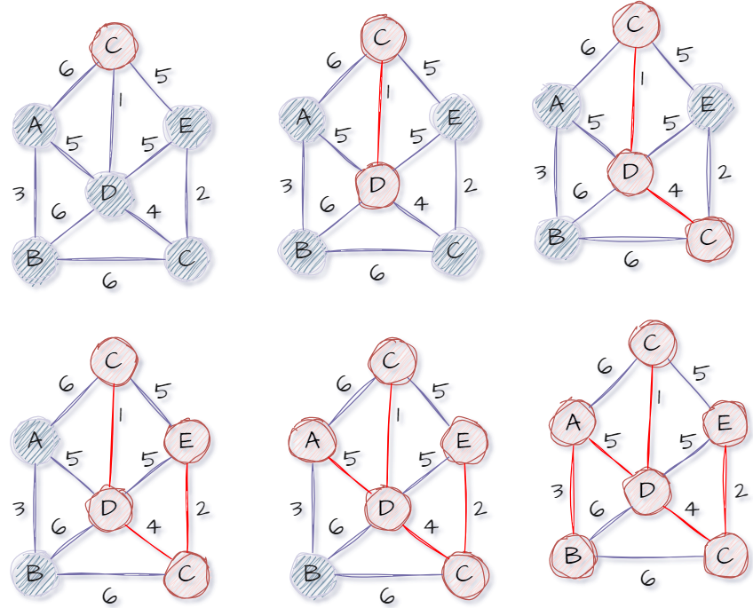

4. 算法描述：

   1. 从一个顶点开始，将该顶点加入生成树的顶点集合$U$，然后将与该顶点相连的边的权值加入$lowcost$数组，同时将该边的另一个顶点加入集合U。
   2. 从$lowcost$数组中找到$U$各中顶点的权值最小的边，将该边的另一个顶点加入集合$U$，然后更新$lowcost$数组。
   3. 重复2过程，直到所有顶点都加入集合U。

5. 算法的一些变量说明：

   1. 设计一个$lowcost$​数组，用来记录该位置结点加入最小生成树的最小代价(或者说当前最小生成树个结点到该位置的最小代价)，每次往最小生成树添加结点时更新。
   2. $adjvex[w]=v$ 在顶点集合$U$中到顶点$w$的最短边的另一端点是$v$，且这条边的权值为$lowcost[w]$​。
   3. $sum$表示最小生成树的各边权值之和。

6. 代码实现：

   1. 结构定义：

      ```cpp
      #include <iostream>
      #define MaxVexNum 100
      #define infty 65535 // 定义∞
      
      typedef char VertexType;
      typedef struct
      {
          VertexType vex[MaxVexNum];
          int edge[MaxVexNum][MaxVexNum];
          int vertexNum, edgeNum;
      } MGraph;
      ```

      

   2. 主要代码：

      ```cpp
      void MiniSpanTree_Prim(MGraph G, int startVex)
      {
          int lowcost[G.vertexNum]; // 存放到集合U的最短边的权值
          int adjvex[G.vertexNum];  // 存放到集合U的最短边的另一端点(与lowcost对应)
          int i, j, k;
          int min;      // lowcost数组中的最小值
          int minIndex; // lowcost数组中最小值的下标
          int sum = 0;  // 最小权值
      
          // 初始化lowcost和adjvex数组
          for (i = 0; i < G.vertexNum; i++)
          {
              // 初始化lowcost数组为各结点到startVex的边的权值
              lowcost[i] = G.edge[startVex][i];
      
              // 初始化都为startVex
              adjvex[i] = startVex;
          }
      
          for (i = 1; i < G.vertexNum; i++)
          {
              min = infty;  // 初始化最小权值为∞
              minIndex = 0; // 初始化最小权值的顶点为0
      
              // 找到lowcost数组中的最小值
              for (j = 0; j < G.vertexNum; j++)
              {
                  if (lowcost[j] != 0 && lowcost[j] < min)
                  {
                      min = lowcost[j];
                      minIndex = j;
                  }
              }
      
              // 输出最小生成树的边
              printf("(%c -->%c)\n", G.vex[adjvex[minIndex]], G.vex[minIndex]);
      
              // 累加最小权值
              sum += lowcost[minIndex];
      
              // 将顶点minIndex加入到集合U中
              lowcost[minIndex] = 0;
      
              // 更新lowcost和adjvex数组
              for (k = 0; k < G.vertexNum; k++)
              {
                  // 如果发现从minIndex到k的边的权值小于lowcost[k]
                  // 则更新lowcost[k]和adjvex[k]
                  if (lowcost[k] != 0 && G.edge[minIndex][k] < lowcost[k])
                  {
                      lowcost[k] = G.edge[minIndex][k];
                      adjvex[k] = minIndex;
                  }
              }
          }
      
          // 输出最小权值
          printf("sum = %d\n", sum);
      }
      ```

      

   3. 上述代码是基于邻接矩阵实现的，而邻接表法初始化$lowcost$时稍显麻烦，需要遍历$startVex$的边链表，同时将其他值设置为不可达($\infty$)(可以和上面一样，但是先初始化为$\infty$，后面在遍历边链表改回来)。

7. $Prim$会不会成环：要想成环，则环的最后一条边必然连接两个已经使用过的顶点。但是在$Prim$算法过程中，我们用$lowcost=0$记录了已使用结点，并将他们排除在外。所以不会出现成环。

   

---


###### $Kruskal$

1. $Kruskal$​算法(选边，适合稀疏图)：每次选择一条权值最小的边，使得这条边的两头连通(原本连通的就不选择)，直到所有结点都连通。

2. 时间复杂度：$O(|E|log_2|E|)$,一般采用堆排序，每次选择最小权值的边需要$O(log_2|E|)$时间，而并查集判断的时间非常小(前面提过)。

3. 演示过程：<br>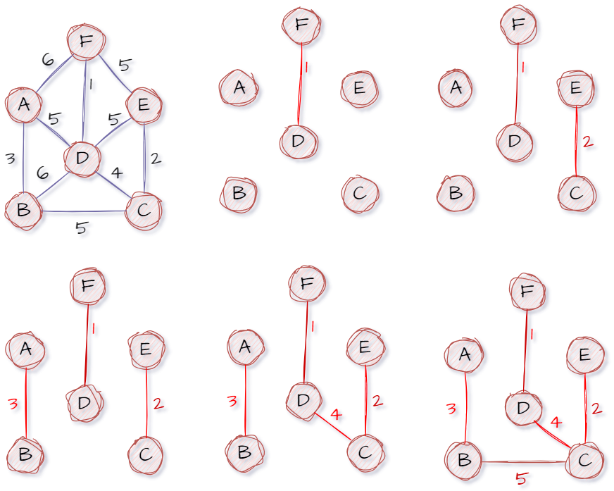

4. 注意事项：

   1. 由于$Kruskal$​算法是选边，可能会导致回路的出现，此时我们需要使用并查集来规避回路的出现。当我们将一条边的两个顶点使用并查集发现是同一个集合时，说明当前边的加入会导致回路的产生。
   2. 为了选边的效率，我们可以对边进行排序(多种排序可供选择)，就无需每次遍历所以的边找最小的。
   3. 此外我们也可以参考并查集知识，对并查集部分进行优化。

5. 代码实现：

   1. 结构定义：

      ```cpp
      #include <iostream>
      #define MaxVexNum 100
      #define infty 65535 // 定义∞
      
      typedef char VertexType;
      typedef struct
      {
          VertexType vex[MaxVexNum];
          int edge[MaxVexNum][MaxVexNum];
          int vertexNum, edgeNum;
      } MGraph;
      ```

      

   2. 主要代码：之所以循环边的个数次，是为了找齐所有顶点。

      ```cpp
      int Find(int *parent, int f)
      {
          while (parent[f] >= 0)
              f = parent[f];
          return f;
      }
      
      int Kruskal(MGraph G)
      {
          int i, j, k;
          int n, m; // n, m分别表示当前最小边的两个顶点
      
          int parent[G.vertexNum]; // 并查集数组
      
          for (i = 0; i < G.vertexNum; i++)
              parent[i] = -1;
      	
          // 循环边的个数次
          for (i = 0; i < G.edgeNum; i++) 
          {
              int min = infty;
              // 遍历所有边，找一个最小边
              for (j = 0; j < G.vertexNum; j++)
              {
                  for (k = 0; k < G.vertexNum; k++)
                  {
                      if (G.edge[j][k] < min)
                      {
                          min = G.edge[j][k];
                          n = j;
                          m = k;
                      }
                  }
              }
              int sn = Find(parent, n);
              int sm = Find(parent, m);
              if (sn != sm)
              {
                  parent[sn] = sm; // 合并
                  printf("(%d, %d) %d\n", n, m, G.edge[n][m]);
              }
      
              // 将该边的权值设为∞，表示已经访问过
              G.edge[n][m] = G.edge[m][n] = infty;
          }
          return 0;
      }
      ```

      

   3. 但是实际上上述代码并不完美：为了更好对边进行排序，我们定义一个边的数据类型。此外我们这里采用冒泡排序，当前也可以采用后续所学的其他排序方式。<span style="color:red">此外需要说明的是，结构体能直接赋值，但是直接赋值方式只适用于简单的结构体，如果结构体中包含了指针或动态分配的内存，那么可能自行操作</span>。还有就是涉及到之前存储网时的规定问题，我们当初说过自己指向自己的还可以记作$\infty$，那么下面判断的条件就要对应变化。

      ```cpp
      typedef struct
      {
          int begin, end;
          int weight;
      } Edge;
      ```

      ```cpp
      // 并查集的查
      int find(int *parent, int f)
      {
          while (parent[f] >= 0)
              f = parent[f];
          return f;
      }
      // 冒泡排序
      void SortEdge(Edge *edge, int edgeNum)
      {
          for (int i = 0; i < edgeNum - 1; i++)
          {
              for (int j = 0; j < edgeNum - i - 1; j++)
              {
                  if (edge[j].weight > edge[j + 1].weight)
                  {
                      // 交换edge[j],edge[j + 1]的数据
                      Edge temp = edge[j];
                      edge[j] = edge[j + 1];
                      edge[j + 1] = temp;
                  }
              }
          }
      }
      
      void Kruskal(MGraph G)
      {
          Edge edge[G.edgeNum]; // 存储边的数组
          int parent[G.vertexNum];
          int edgeNum = 0;
      
          // 将图的边存储到边数组中
          for (int i = 0; i < G.vertexNum; i++)
          {
              for (int j = 0; j < G.vertexNum; j++)
              {
                  //显然,自己指向自己还是记作∞方便
                  if (G.edge[i][j] != infty)
                  {
                      edge[edgeNum].begin = i;
                      edge[edgeNum].end = j;
                      edge[edgeNum].weight = G.edge[i][j];
                      edgeNum++;
                  }
              }
          }
      
          // 对边数组按权值从小到大排序
          SortEdge(edge, edgeNum);
      
          // 初始化并查集的parent数组
          for (int i = 0; i < G.vertexNum; i++)
              parent[i] = -1;
      
          // Kruskal算法(遍历edgeNum次)
          for (int i = 0; i < edgeNum; i++)
          {
              int n = Find(parent, edge[i].begin);
              int m = Find(parent, edge[i].end);
              if (n != m)
              {
                  parent[n] = m;
                  printf("(%d, %d),权值为:%d\n", edge[i].begin, edge[i].end, edge[i].weight);
              }
          }
      }
      ```

      


---


##### 最短路径

1. 单源最短路径通俗讲就是从某固定源点出发的最短路径。
2. 多源最短路径通俗讲就是求每对顶点间的最短路径。

---


###### $BFS$算法(单源、无权图)

1. $BFS$算法只能解决单源、无权图的最短路径问题。

2. 当然你也可以认为$BFS$是解决各边权值相同的问题的，由于各个边的权值相同，要想达到各顶点路径最短，其实就是经过的边最短即可。而$BFS$算法本质上就是通过其实顶点找所有与之邻接的结点，这些结点最短路径显然为1，然后再借助这些路径访问更多的结点，这些新访问的结点的最短路径显然为2，依次类推。<span style="color:red">它保证每个路径的中转结点尽可能的少，从而路径最短。</span>

3. 具体代码实现：

   1. 类型定义：由于存储结构未定，我们暂时使用`Graph`作为图的类型。

      ```cpp
      #include <iostream>
      #define MaxVexNum 100
      #define infty 65535 // 定义∞
      
      // 图的存储结构定义:略
      
      int FirstNeighbor(Graph G, int v);
      int NextNeighbor(Graph G, int v, int w);
      ```

      

   2. 定义队列：

      ```cpp
      #define QueueSize 100
      typedef struct
      {
          int data[QueueSize];
          int front;
          int rear;
      } sqQueue;
      
      // 省略具体实现
      void initQueue(sqQueue &Q); // 初始化
      bool isEmpty(sqQueue Q);   // 判空
      bool enQueue(sqQueue &Q, int x); // 入队
      bool deQueue(sqQueue &Q, int &x); // 出队
      ```

      

   3. 关键实现：我们不考虑非连通，没有意义，反正也访问不到。

      ```cpp
      int dist[MaxVexNum]; // 存放最短路径长度
      int path[MaxVexNum]; // 存放最短路径的前驱
      bool visited[MaxVexNum]; // 访问标志数组
      
      void BFS_MIN_Distance(Graph G, int u)
      {
          sqQueue Q;
          initQueue(Q);
      
          for (int i = 0; i < G.vertexNum; i++)
          {
              dist[i] = infty; // 初始化距离
              path[i] = -1;   // 初始化最短路径前驱为-1
              visited[i] = false; 
          }
      
          // 起始点到自己的距离为0
          dist[u] = 0; 
          visited[u] = true; 
          enQueue(Q, u);
      
          while (!isEmpty(Q))
          {
              deQueue(Q, u);
              // 遍历u的所有邻接点,更新距离和路径
              for (int w = FirstNeighbor(G, u); w >= 0; w = NextNeighbor(G, u, w))
              {
                  if (!visited[w])
                  {
                      dist[w] = dist[u] + 1; 
                      // 设置前驱为u
                      path[w] = u; 
                      visited[w] = true; 
                      enQueue(Q, w); 
                  }
              }
          }
      }
      
      ```

      

4. 变量说明：

   1. $dist$存放最短路径长度。
   2. $path$存放最短路径的前驱中转结点，即从哪个顶点过来的。
   3. $visited$标记顶点是否访问过。

5. 时间复杂度：参考广度优先遍历：<a href="#bfs">快速跳转</a>

   1. 邻接矩阵法：访问每个顶点需要时间$O(|V|)$，对于每顶点遍历查找邻接顶点需要时间$O(|V|)$,而共有$|V|$个顶点，故而时间复杂度为$O(|V|)+O(|V|^2)=O(|V|^2)$​​​

   2. 邻接表法：访问访问每个顶点需要时间$O(|V|)$，对于所有顶点遍历查找邻接顶点需要时间$O(|E|)$,故而时间复杂度为$O(|V|)+O(|E|)=O(|V|+|E|)$。

6. 那么最后就是$path$数组的使用问题了：我们给出如下的$path$、$dist$数组(起始顶点是$2$)，那如果我们要求$2->7$，显然由$dist[7]=2$可知最短路径长为$2$。由$path[7]=6$可知$2->6->7$。由$path[6]=2$(或者加上$path[2]=-1$)可知$2->6->7$就是最终求的最短路径。

   |           | 1    | 2                                 | 3    | 4    | 5    | 6                                | 7                                | 8        |
   | --------- | ---- | --------------------------------- | ---- | ---- | ---- | -------------------------------- | -------------------------------- | -------- |
   | $dist[ ]$ | 1    | 0                                 | 3    | 3    | 2    | 1                                | 2                                | $\infty$ |
   | $path[ ]$ | 2    | <span style="color:red">-1</span> | 6    | 3    | 1    | <span style="color:red">2</span> | <span style="color:red">6</span> | -1       |

   

---

###### Dijkstra算法(单源，无权图或者带权图)

1. 首先说明$Dijkstra$算法不适合带负权边的带权图，如下图可以试着使用该算法计算$A$到各顶点的最短路径。<br>

2. $Dijkstra$是一个很灵性的算法，贴进现实。例如现实中你想认识某个大人物，你没法直接认识他(人家不鸟你)，那么你就得通过其他人介绍对吧，但是你得请中间人吃饭或者花钱对吧，那显然作为一个节俭的人，肯定是找一个花钱最少的中间人。然后重复如此，认识许许多多的大人物！<span style="color:red">(重点)所以$Dijkstra$本人应该也是一位和我一样善于观察的哲学大师，哈哈！</span><br>

3. 算法思路：这里由于需要考虑无向图的边和有向图的弧的表示，干脆直接使用$->$表示。

   1. 初始化：先找出从源点$v_0$到各终点$v_k$的直达路径$v_0->v_k$ ，即通过一条弧到达的路径。
   2. 选择：从这些路径中找出一条长度最短的路径$v_0->u$。
   3. 更新：然后对其余各条路径进行适当调整。若在图中存在弧$v_0->u$，且$(v_0->u)+(u->v_k)<(v_0->v_k)$则以路径$v_0->u->u_k$代替$v_0->v_k$。
   4. 重复：在调整后的各条路径中，再找长度最短的路径, 依此类推。

4. 具体代码实现：

   1. 结构定义：由于存储结构未定，我们暂时使用`Graph`作为图的类型。

      ```cpp
      #include <iostream>
      #define MaxVexNum 100
      #define infty 65535 
      
      typedef char VertexType;
      typedef struct
      {
          VertexType vex[MaxVexNum];
          int edge[MaxVexNum][MaxVexNum];
          int vertexNum, edgeNum;
      } Graph;
      ```

      

   2. 关键代码：

      ```cpp
      bool final[MaxVexNum]; // 最短路径是否已经求出
      int dist[MaxVexNum];   // 存放最短路径长度
      int path[MaxVexNum];   // 存放最短路径的路径
      
      void dijkstra(Graph G, int u)
      {
          int i, j, k;
      
          // 初始化各数组
          for (i = 0; i < G.vertexNum; i++)
          {
              final[i] = false;
              // 初始化dist数组为u到各顶点的距离
              dist[i] = G.edge[u][i];
              path[i] = -1;
          }
      
          final[u] = true;
          dist[u] = 0;
      
          // 遍例G.vertexNum-1次，每次找出一个顶点的最短路径
          for (i = 1; i < G.vertexNum; i++)
          {
              int min = infty;
              // 找一个最短路径
              for (j = 0; j < G.vertexNum; j++)
              {
                  if (!final[j] && dist[j] < min)
                  {
                      min = dist[j];
                      k = j;
                  }
              }
      
              // 标记找到的最短路径
              final[k] = true;
      
              // 更新(未求的)最短路径
              for (j = 0; j < G.vertexNum; j++)
              {
                  // 防止溢出
                  int temp = (G.edge[k][j] == infty ? infty : (min + G.edge[k][j])); 
      
                  if (!final[j] && (temp < dist[j]))
                  {
                      dist[j] = min + G.edge[k][j];
                      path[j] = k;
                  }
              }
          }
      }
      ```

      

   3. 使用邻接表法表示时，初始化时略显复杂。

5. 变量说明：其实本质上与$BFS$的含义差不多。

   1. $final$标记相应顶点是否已经得出最短路径。
   2. $dist$记录最短路径长度。
   3. $path$​​​记录路径前驱(当然也存在所谓的后继形式，我们不予考虑)。

6. 时间复杂度：$O(|V|^2)$，每找一个顶点都需要遍历找一个最小的路径加入。

7. 那么最后就是$path$数组的使用问题了：参考$BFS$算法求最短路径。


---

###### Floyd算法(多源，无权图或者带权图)

1. 首先说明$Floyd$算法不适合带负权边的有环带权图。如下图，绕一圈最短路径就减小一点。<br>

2. $Floyd$​算法利用动态规划思想，将问题的求解分为多个阶段，每个阶段添加一个中转点

3. 仔细品味$Floyd$算法，是不是就是对各个顶点执行$Dijkstra$(但是不完全是，$Floyd$解决了负权边问题)。如果$Dijkstra$描写的是人的选择，那$Floyd$何尝不是体现社会风气。好吧，爷有病。

4. 具体代码实现：

   1. 存储结构定义：

      ```cpp
      #include <iostream>
      #define MaxVexNum 100
      #define infty 65535 // 定义∞
      
      typedef char VertexType;
      typedef struct
      {
          VertexType vex[MaxVexNum];
          int edge[MaxVexNum][MaxVexNum];
          int vertexNum, edgeNum;
      } Graph;
      ```

      

   2. 关键代码实现：关于存前驱还是后继，只是后面遍历的方式不同而已

      ```cpp
      int dist[MaxVexNum][MaxVexNum]; // 保存最短路径长度
      int path[MaxVexNum][MaxVexNum]; // 保存最短路径的前驱或者后继
      
      void Floyd(Graph G)
      {
          int i, j, k;
      
          // 没有同王道书上一样全部初始化为-1(便于后续输出路径,dddd)
          for (i = 0; i < G.vertexNum; i++)
          {
              for (j = 0; j < G.vertexNum; j++)
              {
                  dist[i][j] = G.edge[i][j];
                  if (i != j && dist[i][j] < infty)
                      // 存储j的前驱
                      path[i][j] = i; 
                  // path[i][j] = j;存储i的后继
                  else
                      path[i][j] = -1; 
              }
          }
      
          // 以k为中间点，对所有顶点对i->j进行检测
          for (k = 0; k < G.vertexNum; k++)
          {
              for (i = 0; i < G.vertexNum; i++)
              {
                  for (j = 0; j < G.vertexNum; j++)
                  {
                      // 三元运算符太长,不好看
                      int temp;
                      if (dist[i][k] == infty || dist[k][j] == infty)
                          temp = infty;
                      else
                          temp = dist[i][k] + dist[k][j];
      
                      if (dist[i][j] > temp)
                      {
                          dist[i][j] = temp;
                          path[i][j] = path[k][j]; // j的前驱
                          // path[i][j] = path[i][k]; // i的后继
                      }
                  }
              }
          }
      }
      ```

      

   3. 使用邻接表法表示时，初始化时略显复杂。

5. 变量说明：

   1. $dist$存放最短路径长度的矩阵。
   2. $path$存放最短路径前驱的矩阵。

6. 我们不妨考虑一下为什么$Floyd$能解决负权边问题，而$Dijkstra$不能？其实通过代码我们大致能猜到，$Dijkstra$在得到某两个点的最短路径后，就不在更新(其认为再添加多余中转点只会使得路径变大)，但是由于负权边的出现，经历更多的中间点是可能反而使得最短路径变小的，故而无法解决负权边的问题。而$Floyd$​短小精悍，与时俱进。

7. 我们不妨具体研究一下$Floyd$是如何工作的：

   1. 我们不妨直接开启上帝模式，我说一定有这样一条最短路径$v->y->x->w$存在。那么我们可以知道哪些东西呢，显然由反证法我们知道：<span style="color:red">$v->y$、$y->x$、$x->w$(这三个初始化时就有)</span>、$y->x->w$(以$x$为中转点时找到)、$v->y->x$(以$y$为中转点时找到)均为最短路径。
   2. 初始时我们认为$v->w$为最小。后面我们通过$x$为中转点，又可能发现$v->x->w$为最小。
   3. 然而实际上这可能仍不是真正的最小路径(假设你不知道真正的最小路径)，甚至可能你看到的都是不全的路径(可能当前的路径完整是$v->h->f->x->w$)，<span style="color:red">因为在此之前或者之后我们一直在尝试缩短$v->x$、$x->v$乃至换掉$x$​这个中转点(与时俱进的关键)。</span>
   4. 最后使用$y$作为中转点时，发现$v->y->x$，于是上述的$v->x->w$就会随着$v->y->$的出现变为$v->y->x->w$。
   5. 到这里我不禁想有没有可能开始没有找到$v->x$导致我们将$x$换掉，后面找到一个很小的$v->y->x$我们咋换回来呢？首先我们知道此时早已经找到$y->x->w$、$v->y$为最短路径，显然我们使用$y$去作为中转点时，会得到$v->y->x->w$(上帝视角的我们看来，$y$一定会被采纳)。

8. 显然上述分析的$nb$之处在于作者$nb$的使用了上帝视角。但是计算机没有这玩意，他是如何知道这些的呢？显然它不知道。但是通过上述分析过程不难看出$Floyd$算法首先会找到所以无需中转点的最短路径(形如$a->b$)(当然它不知道是哪些)，接着又会找到借助某个中转点的最短路径(形如$a->b->c$)(当然程序仍然不知道它找到了)，依次递推($Dijkstra$也可以采用这种理解思路)。虽然计算机不知道这些最短路径，但是这些最短路径会在此后无数次的筛选中保留下来，成为我们的最后结果。需要强调说明的是该算法并不是先找到所有只需一个中转点的最短路径然后再找需要两个中转点的路径，而是混合找的(稍微熟悉该算法，其实应该不难理解)，当然我们不妨再模拟一下：

   1. 我们假设先最先通过$v_0$作为中转点，找到了只需以$v_0$作为中转点的最短路径。

   2. 此后我们使用$v_1$作为中转点，此时我们除了找到只需以$v_1$作为中转点的最短路径。我们实际上还找到需要$v_0->v_1$或者$v_1->v_0$两个中转点的最短路径。

   3. 依次类推。

9. <span style="color:red">查找$path$、$dist$​时按照行找，只在某一行进行！！！。</span>

10. 复杂度：

    1. 时间复杂度：$O(|V|^3)$
    2. 空间复杂度：$(O(|V|^2))$


---


#####  有向无环图描述表达式(表示不唯一)

1. 首先我们提出一点表达式可以使用二叉树存储(其构建过程：可以尝试通过遍历后缀表达式建立)，叶子结点存储操作数，非叶子结点存储运算符。其三序遍历分别对于表达式的前缀、中缀、后缀表达式，如$((a+b)*(b*(c+d))+(c+d)*e)*((c+d)*e)$:<br>
2. 显然上述表达式中有一些相同的子表达式，而在二叉树中它们也重复出现，浪费存储空间，故而我们可以通过有向无环图进行存储：<br>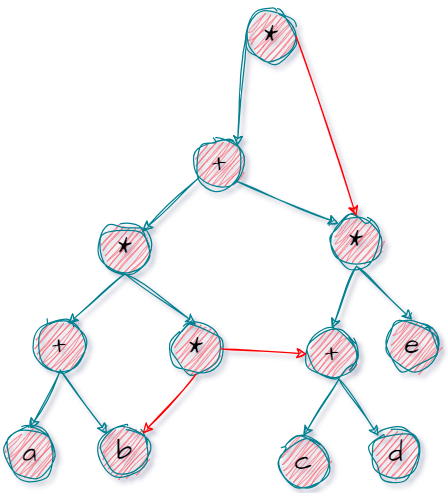
3. 下面演示一下如何构建表达式的有向无环图：
   1. 把各个操作数不重复的排成一排。<br>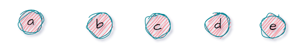
   2. 标出各个运算符的生效顺序(不唯一)。$((a+b)*(b*(c+d))+(c+d)*e)*((c+d)*e)$排序如下：$((a①b)④(b③(c②d))⑦(c⑤d)⑥e)⑩((c⑧d)⑨e)$。
   3. 按照顺序加入运算符，注意分层(指向某个运算符，当前运算符就标在其上一层)(这么做主要是因为二者不会合并，我们把可能合并的放在同一层)。<br>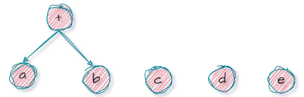<br><br>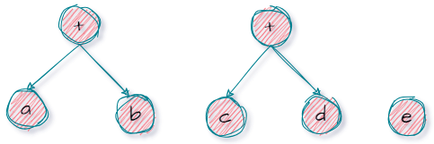<br><br><br><br>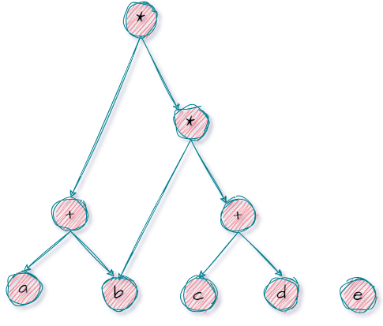<br><br><br><br>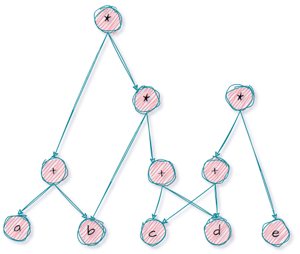<br><br><br><br><br><br>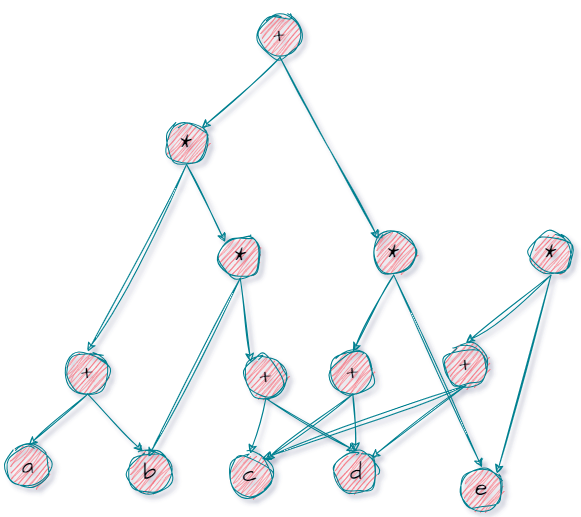<br><br>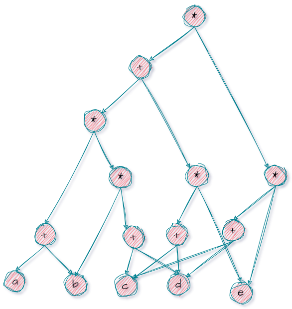
   4. 从下到上逐层检查同层运算符是否可以合并。<br><br><br><br><br>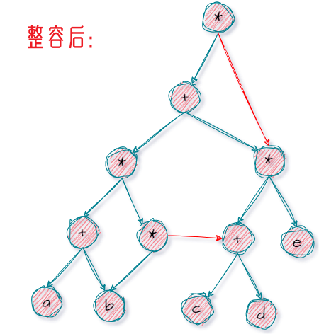


---


##### 拓扑排序

###### (逆)拓扑排序

1. 有向无环图具有拓扑序列。下面是王道书的一段补充：<span style="color:red">如果一个有向图的邻接矩阵是上三角矩阵，那么所有的边都从编号小的顶点指向编号大的顶点。同理，如果邻接矩阵是下三角矩阵，那么所有的边都从编号大的顶点指向编号小的顶点。在这两种情况下，图中不可能存在环，因此这个图一定是有向无环图(DAG)，并且一定存在拓扑序列。</span><br>

2. $AOV$网：用一个有向无环图表示一个工程的各子工程及其相瓦制约的关系,其中以<span style="color:red">顶点表示活动,弧表示活动之间的低先制约关系</span>，称这种有向图为顶点表示活动的网，简称$AOV$​网(Activity On Vertex network)。

   1. 若从$i$到$j$有一条有向路径，则$i$是$j$的前驱，$j$是$i$的后继。
   2. 若$<i,j>$是网中有向边，则$i$是$j$的直接前驱(时间$i$的执行要在时间$j$之前)，$j$是$i$的直接后继。
   3. $AOV$网中不允许有回路，因为如果有回路存在，则表明某项活动以自己为先决条件，显然这是荒谬的。

3. 拓扑排序：在$AOV$网没有回路的前提下，我们将全部活动排列成一个线性序列，使得若$AOV$ 网中有弧$<i,j>$存在，则在这个序列中，$i$一定排在$j$的前面，具有这种性质的线性序列称为拓扑有序序列，相应的拓扑有序排序的算法称为拓扑排序($AOV$网的拓扑序列不唯一)。

4. 拓扑排序思路：

   1. 在有向图中选一个没有前驱(入度为$0$)的顶点且输出之(这一步可能有很多个，但是我们随便选一个，故而不唯一且不存在顺序问题)。
   2. 从图中删除该顶点和所有以它为起点的弧(对它而言是出度边)。
   3. 重复上述两步，直至全部顶点均已输出或者<span style="color:red">当图中不存在无前驱的顶点为止(说明图中存在回路)</span>。<br>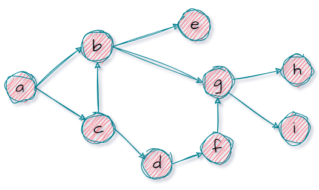

5. 拓扑排序的具体代码实现：

   1. 栈的定义：实际上由于没有顺序要求，这里也可以使用队列、数组，都是ok的。

      ```cpp
      #define MaxSize 100
      typedef struct Stack
      {
          int data[MaxSize];
          int top; 
      } Stack;
      
      //省略具体实现
      void InitStack(Stack &S);       
      bool isEmpty(Stack S);          
      bool Push(Stack &S, int x);  
      bool Pop(Stack &S, int x);   
      bool GetTop(Stack S, int x); 
      ```

      

   2. 图的结构定义：

      ```cpp
      #include <iostream>
      #define MaxVexNum 100
      
      typedef char VertexType;
      typedef struct
      {
          VertexType vex[MaxVexNum];
          int edge[MaxVexNum][MaxVexNum];
          int vertexNum, edgeNum;
      } Graph;
      ```

      

   3. 关键代码：

      ```cpp
      int indegree[MaxVexNum]; // 顶点的入度
      int print[MaxVexNum];    // 存放拓扑排序的结果
      
      bool TopologicalSort(Graph G)
      {
          Stack S;
          InitStack(S);
      
          // initIndegree(Graph G)
      
          int i, j, k = 0;
      
          // 查找入度为0的顶点
          for (i = 0; i < G.vertexNum; i++)
          {
              if (indegree[i] == 0)
              {
                  Push(S, i);
              }
          }
      
          while (!isEmpty(S))
          {
              Pop(S, i);
              print[k++] = i; // 记录排序结果
      
              // 刷新其他顶点的入度(邻接表法就遍历边链表即可)
              for (j = 0; j < G.vertexNum; j++)
              {
                  if (G.edge[i][j] != infty)
                  {
                      indegree[j]--;
                      if (indegree[j] == 0)
                      {
                          Push(S, j);
                      }
                  }
              }
          }
          if (k < G.vertexNum)
          {
      
              return false; // 有回路
          }
          else
          {
              return true;
          }
          // return !(count < G.vexnum)
      }
      ```

      

   4. 补充说明：

      1. 上述代码其实缺少对$indegree$数组的初始化，我们现在给出如下代码。实际上我们知道$AOV$是一个有向图，但如果假设下面代码执行的对象是一个无向图，还会有效吗？是否会由于无向图的边存储两遍导致出错呢？显然不会，因为我们执行的是$indegree[j]++$,只对当前认为的逻辑上的($i->j$)后端点进行入度加一。除非我们再添加一步$indegree[i]++$，当然有些操作可能是会需要这一步的。

         ```cpp
         void initIndegree(Graph G){
             for (int i = 0; i < G.vertexNum; i++)
             {
                 indegree[i] = 0;
             }
         
             for (int i = 0; i < G.vertexNum; i++)
             {
                 for (int j = 0; j < G.vertexNum; j++)
                 {
                     if (G.edge[i][j] != infty)
                     {
                         indegree[j]++;
                     }
                 }
             }
         }
         ```

         

      2. 若上述使用邻接表法表示图，那么在刷新$indegree$时遍历对应的变链表即可。

6. 复杂度分析：

   1. 对于邻接矩阵法：每个顶点访问后，都会查找邻接点，显然时间复杂度为$O(|V|^2)$。
   2. 对于邻接表法：每个顶点访问后，都会查找邻接点(遍历边链表)，显然时间复杂度为$O(|V|+|E|)$。

7. 逆拓扑排序：

   1. 在有向图中选一个没有后继(出度为$0$)的顶点且输出之。
   2. 从图中删除该顶点和所有以它为终点的弧(对它而言是入度边)。
   3. 重复上述两步，直至全部顶点均已输出或者<span style="color:red">当图中不存在无后继的顶点为止(说明图中存在回路)</span>。

8. 逆拓扑排序的具体代码实现：

   1. 栈的定义：实际上由于没有顺序要求，这里同样也可以使用队列、数组。

      ```cpp
      #define MaxSize 100
      typedef struct Stack
      {
          int data[MaxSize];
          int top; 
      } Stack;
      
      //省略具体实现
      void InitStack(Stack &S);       
      bool isEmpty(Stack S);          
      bool Push(Stack &S, int x);  
      bool Pop(Stack &S, int x);   
      bool GetTop(Stack S, int x); 
      ```

      

   2. 图的结构定义：

      ```cpp
      #include <iostream>
      #define MaxVexNum 100
      
      typedef char VertexType;
      typedef struct
      {
          VertexType vex[MaxVexNum];
          int edge[MaxVexNum][MaxVexNum];
          int vertexNum, edgeNum;
      } Graph;
      ```

      

   3. 关键代码：

      ```cpp
      void initOutDegree(Graph G)
      {
          for (int i = 0; i < G.vertexNum; i++)
          {
              outDegree[i] = 0;
          }
      
          for (int i = 0; i < G.vertexNum; i++)
          {
              for (int j = 0; j < G.vertexNum; j++)
              {
                  if (G.edge[i][j] != infty)
                  {
                      // 出度
                      outDegree[i]++;
                  }
              }
          }
      }
      ```

      ```cpp
      int outDegree[MaxVexNum]; // 保存每个顶点的出度
      int path[MaxVexNum];      // 保存逆拓扑排序的结果
      
      bool TopologicalSort(Graph G)
      {
          Stack S;
          InitStack(S);
      
          initOutDegree(G);
      
          int i, j, k = 0;
      
          for (i = 0; i < G.vertexNum; i++)
          {
              if (outDegree[i] == 0)
              {
                  Push(S, i);
              }
          }
      
          while (!isEmpty(S))
          {
              Pop(S, j);
              path[k++] = j;
      
              for (i = 0; i < G.vertexNum; i++)
              {
                  // 注意不是outDegree[j]--(因该是出度减1)
                  if (G.edge[i][j] != infty)
                  {
                      outDegree[i]--;
                      if (outDegree[i] == 0)
                      {
                          Push(S, i);
                      }
                  }
              }
          }
          return !(k < G.vertexNum);
      }
      ```

      

   4. 关键是有一点需要说明：那就是使用邻接表法时，实现逆拓扑排序可能不太方便，因为需要找顶点的入度边删掉。但是实际上我们知道邻接表法实现这个过程是需要全部遍历的。对此我们不难想到之前提过一嘴的逆邻接表法(<a href="#inverse_adjacency">跳转</a>)，即边链表存储入度边，这样找入度容易，找出度难。

9. 使用$DFS$​算法实现拓扑排序和逆拓扑排序：

   1. 首先我们不妨思考为什么深度优先遍历算法$DFS$能够实现的逆拓扑排序？$dfs$实际上干了一件事就是当它访问到某个结点$u$它会将$u$的子结点依次进行深度优先遍历，如果我们将遍历结点过程视作完成该结点的任务的话，显然当回溯到$u$时，$u$的所有后置任务已经完成，显然按照逆拓扑排序的定义，此时$u$可以输出。

   2. (当前阶段不深究)那么我们继续思考另外一个问题，就是如何解决环路问题。对此我们可以定义一个$color$数组，$color[i]=0$表示未被遍历，$color[i]=1$表示真在被遍历，$color[i]=2$​表示已经遍历(第一次访问记$1$，第二次回溯回来记$2$，遇到$1$说明有圈绕回来了)，好了就提到这。

   3. $DFS$​​实现逆拓扑排序：

      1. 图结构定义：

         ```cpp
         #include <iostream>
         #define MaxVexNum 100
         #define infty 65535 
         
         // 图结构定义略
         
         int FirstNeighbor(Graph G, int v);
         int NextNeighbor(Graph G, int v, int w);
         ```

         

      2. 关键代码：

         ```cpp
         bool visited[MaxVexNum]; // 访问标志数组
         int print[MaxVexNum]; // 存储逆拓扑排序的结果
         
         void DFS(Graph G, int v, int &count)
         {
             visited[v] = true;
             for (int w = FirstNeighbor(G, v); w >= 0; w = NextNeighbor(G, v, w))
             {
                 if (!visited[w])
                 {
                     DFS(G, w, count);
                 }
             }
             // 遍历完所有后继子孙后，将该节点加入逆拓扑排序结果中
             print[count++] = v;
         }
         
         void TopologicalSort(Graph G)
         {
             int count = 0;
             for (int i = 0; i < G.vertexNum; i++)
             {
                 visited[i] = false;
             }
             for (int i = 0; i < G.vertexNum; i++)
             {
                 if (!visited[i])
                 {
                     DFS(G, i, count);
                 }
             }
         }
         ```

         

   4. $dfs$实现拓扑排序：我们是否还能采用上述思路？假设对于一个初始遍历顶点$u$，<span style="color:red">我们显然可以知道$u$的所有子孙顶点必需出现在$u$后</span>，但是有一个最根本的问题：我们无法确定当前的$u$是否可以执行，就算$u$可以执行，我们也无法保证其子孙结点可以紧随其后，故而我们无法完全照搬上述代码思路。但是我们不妨分析一下，对于当前$u$为根结点的深度优先生成树(姑且这么叫)而言，其中某个结点的前置条件会在哪儿？只有两种可能，要么在当前深度优先生成树中，要么还没被遍历对吧。那如果我们将当前子树的所有任务放到最后执行<span style="color:red">(可行性：剩余部分一定不会有以当前深度优先生成树的某个结点为前提的)</span>，那么显然一箭双雕(还没遍历的前置任务部分会先执行，故而不存在卡脖子。而当前树中根据深度优先遍历，前置任务肯定会先执行)，故当前任务必可以执行。

   5. 那么现在我们再去理解王道所给的算法，为每一个结点设置一个任务结束时间$time$(个人更倾向于使用$order$优先级去理解，越大越优先)，我们只需要让所有的父结点的$time$大于子结点即可。<span style="color:red">后续按照$time$的从大到小排序就可以找到拓扑排序的结果。</span>

      ```cpp
      bool visited[MaxVexNum]; // 访问标志数组
      int finish[MaxVexNum]; // 完成时间数组
      
      void DFS(Graph G, int v, int &time)
      {
          visited[v] = true;
          for (int w = FirstNeighbor(G, v); w >= 0; w = NextNeighbor(G, v, w))
          {
              if (!visited[w])
              {
                  DFS(G, w, time);
              }
          }
          finish[v] = time++; // 设置完成时间
      }
      
      void TopologicalSort(Graph G)
      {
          int time = 0;
          for (int i = 0; i < G.vertexNum; i++)
          {
              visited[i] = false;
          }
          for (int i = 0; i < G.vertexNum; i++)
          {
              if (!visited[i])
              {
                  DFS(G, i, time);
              }
          }
      }
      ```

      

10. 参考$DFS$实现逆拓扑排序的思路，我们不难知道显然$BFS$也是可行的。其实在$DFS$之前，我们给出的实现方式就是基于$BFS$形式的，只不过由于没有严格的先后顺序，故而就没有严格使用队列存储。

11. 为了方便后续的求解关键路径的代码编写，我们需要说明一点，那就是一个拓扑排序反过来就可以作为逆拓扑排序序列(反之也成立)。我们不妨分析一下下面的过程：我们知道在拓扑排序中，当$g$完成后，显然就可以完成$h、j$。而在逆拓扑排序中，完成$h、j$就可以完成$g$。显然更复杂的情况也适用。<br>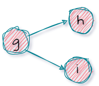

---


###### 关键路径(应用)

1. $AOE$网：用一个有向图表示一个工程的各子工程及其相互制约的关系。<span style="color:red">以弧表示活动，以项点表示活动的开始或结束事件</span>，称这种有向图为边表示活动的网，简称为$AOE$网(Activity On Edge)。

2. 关键路径：把工程计划表示为边表示活动的网络，即$AOE$网，<span style="color:red">用顶点表示事件</span>，弧表示活动，弧的权表示活动持续时间。<span style="color:red">事件表示在它之前的活动已经完成，或者在它之后的活动可以开始</span>。

   1. 关键路径——路径长度最长的路径。
   2. 路径长度——路径上各活动持续时间之和。
   3. 源点：表示整个工程开始(入度为$0$的顶点)。
   4. 汇点：表示整个工程结束(出度为$0$​的顶点)。

3. 那么在此之前，我们需要先提出一些表示说明：

   1. $v_e(v_j)$——表示<span style="color:red">事件</span>$v_j$的最早发生时间，决定了从$v_j$开始的各事件最早开工的时间。例: $v_e(v_1)=0$，$v_e(v_2)= 6$
   2. $v_l(v_j)$——表示<span style="color:red">事件</span>$v_j$的最迟发生时间(要保证发生在其后面事件都能完成)。例: $v_l(v_4)= 18-4-4-2=8$
   3. $e(i)$———表示<span style="color:red">活动</span>$a_i$的最早开始时间。例: $e(a_3)=0$
   4. $l(i)$———表示<span style="color:red">活动</span>$a_i$的最迟开始时间。例: $l(a_3)=18-(4+4+2+5)=3$
   5. $d(i)=l(i)-e(i)$——表示完成活动$a_i $的时间余量。例: $d(3)=i(3) - e(3)=3$
   6. <span style="color:red">关键活动——(关键路径上的活动)，即$l(i)=e(i)$或者$l(i)-e(i)=0$的活动</span>。<br>

4. 那么我们显然需要求解$l(i)$和$e(i)$,我们不妨假设有这样一条有向边$v_i->v_j$表示事件$a_k$，边的权值记作$weigth(v_i,v_j)$,显然有：

   1. $e(k)=v_e(v_i)$，保证前面的活动都完成。
   2. $l(j)=v_l(v_j)-weigth(v_i,v_j)$，保证后面的活动都能够按时完成。

5. 那么我们又如何求解$v_e(v_j)$和$v_l(v_j)$​：答，一直递推。

   1. $v_e(v_j)$：由于我们需要保证前面的事件有足够的时间去执行，我们需要选择一个最晚的开始时间。我们不妨从某个源点开始(事件最早发生事件记作$0$)，通过递推公式$v_e(v_j)=Max\{v_e(v_i)+weigth(v_i,v_j)\}$，其中$v_i$为$v_j$的任意一个前驱结点。我们不妨具体举例：对于$v_e(v_5)$而言，显然$v_e(v_2)+1>v_e(v_3)+1$,故$v_e(v_5)=7$。仔细观察下面过程，不难看出，这是$TMD$​拓扑排序。<br>
   2. 为了后续描述，实际上我们再求所有顶点的$v_e(vj)$的过程中，我们可以得到共$AOE$网的最短总耗时为$t_{all}=18$。
   3. $v_l(v_j)$：由于我们需要保证前面的事件有足够的时间去执行，我们需要选择一个最早的开始时间。我们不妨从某个汇点开始(事件最早发生事件记作$t_{all}$)，通过递推公式$v_l(v_j)=Min\{v_l(v_i)-weigth(v_i,v_j)\}$，其中$v_i$为$v_j$的任意一个后继结点。我们不妨具体举例：对于$v_l(v_5)$而言，显然$v_l(v_7)-9=v_l(v_8)-7$,故$v_l(v_5)=7$。仔细观察下面过程，不难看出，这是$TMD$逆拓扑排序。<span style="color:red">(其实到这儿，你就可以知道这关键路径必定会经过$v_5$)</span><br>

6. 求解关键路径的算法步骤：

   1. 从源点出发且$v_e(源)=0$，按照拓扑排序递推$v_e(v_j)$。
   2. 从汇点出发且$v_l(汇)=v_e(汇)$，按照逆拓扑排序递推$v_l(v_j)$。
   3. 根据$v_e()$求$e()$，根据$v_l()$求$l()$。
   4. 求$d()$,找出所以$d()=0$​的活动构成关键路径。

7. 给出具体代码实现：前面都是通过邻接矩阵实现拓扑排序，这次不妨就使用邻接表：

   1. 给出工具栈的定义：

      ```cpp
      #define MaxSize 100
      typedef struct Stack
      {
          int data[MaxSize];
          int top;
      } Stack;
      
      // 省略具体实现
      void InitStack(Stack &S);
      bool isEmpty(Stack S);
      bool Push(Stack &S, int x);
      bool Pop(Stack &S, int x);
      bool GetTop(Stack S, int x);
      ```

      

   2. 给出图的定义：

      ```cpp
      #include <iostream>
      #define MaxVexNum 100
      typedef char VertexType;
      
      typedef struct ArcNode
      {
          int adjvex;           // 邻接点域，存储边或者弧指向哪个顶点
          struct ArcNode *next; // 指向下一条边或者弧
          int weight;           // 权值
      } ArcNode;
      
      typedef struct VNode
      {
          VertexType data;    // 顶点域，存储顶点信息
          ArcNode *firstedge; // 边表头指针
      } VNode, AdjList[MaxVexNum];
      
      typedef struct
      {
          AdjList vertices;   // 邻接表
          int vexnum, arcnum; // 顶点数和边数
      } ALGraph;
      ```

      

   3. 拓扑排序的实现：

      ```cpp
      void initIndegree(ALGraph &G, int indegree[])
      {
          for (int i = 0; i < G.vexnum; i++)
          {
              indegree[i] = 0;
          }
      
          for (int i = 0; i < G.vexnum; i++)
          {
              ArcNode *p = G.vertices[i].firstedge;
              while (p != NULL)
              {
                  // 入度加1
                  indegree[p->adjvex]++;
                  p = p->next;
              }
          }
      }
      ```

      ```cpp
      bool TopologicalSort(ALGraph &G, int indegree[], int print[])
      {
          Stack S;
          InitStack(S);
      
          // 初始indegree数组
          initIndegree(G, indegree);
      
          int i, count = 0;
      
          for (int i = 0; i < G.vexnum; i++)
          {
              if (indegree[i] == 0)
              {
                  Push(S, i);
              }
          }
      
          while (!isEmpty(S))
          {
              Pop(S, i);
              print[count++] = i;
              ArcNode *p = G.vertices[i].firstedge;
              while (p != NULL)
              {
                  indegree[p->adjvex]--;
                  if (indegree[p->adjvex] == 0)
                  {
                      Push(S, p->adjvex);
                  }
                  p = p->next;
              }
          }
      
          return !(count < G.vexnum);
      }
      ```

      

   4. 关键路径：初始化时也可$int\  ve[MaxVexNum]={0}$,但是不可$int\ a[5]={1}$,这是错误的。

      ```cpp
      // 关键路径
      bool CriticalPath(ALGraph &G)
      {
          int ve[MaxVexNum], vl[MaxVexNum];
          //int e[MaxVexNum], l[MaxVexNum];
          int e,l;
          int indegree[MaxVexNum]; // 用于存储各个顶点的入度
          int print[MaxVexNum];    // 用于存储拓扑排序的结果
          int i, j, k;
          ArcNode *p;
      
          // 初始化ve
          for (i = 0; i < G.vexnum; i++)
          {
              ve[i] = 0;
          }
      
          // 获取拓扑排序
          if (!TopologicalSort(G, indegree, print))
          {
              return false;
          }
      
          // 按照拓扑排序的顺序计算ve
          for (i = 0; i < G.vexnum; i++)
          {
              j = print[i];
      
              p = G.vertices[j].firstedge;
      
              // 计算所有邻接点的ve
              while (p != NULL)
              {
                  k = p->adjvex;
                  if (ve[j] + p->weight > ve[k])
                  {
                      ve[k] = ve[j] + p->weight;
                  }
                  p = p->next;
              }
          }
      
          // 初始化vl
          for (i = 0; i < G.vexnum; i++)
          {
              vl[i] = ve[G.vexnum - 1];
          }
      
          // 按照拓扑排序的逆序计算vl
          for (i = G.vexnum - 1; i >= 0; i--)
          {
              j = print[i];
              p = G.vertices[j].firstedge;
      
              // 计算所有邻接点的vl
              while (p != NULL)
              {
                  k = p->adjvex;
                  if (vl[k] - p->weight < vl[j])
                  {
                      vl[j] = vl[k] - p->weight;
                  }
                  p = p->next;
              }
          }
      
          // 计算e和l，找出关键路径(i->k)
          for (i = 0; i < G.vexnum; i++)
          {
              p = G.vertices[i].firstedge; 
              while (p != NULL)
              {
                  k = p->adjvex;
                  e = ve[i];
                  l = vl[k] - p->weight;
                  if (e == l)
                  {
                      printf("%d->%d\n", i, k);
                  }
                  p = p->next;
              }
          }
      }
      ```

      

   5. 关于上述代码可能疑惑的地方就是如何将$e(i)$与$l(k)$对应上同一个边。显然找边不好找，我们找顶点，通过顶点找其所有的边(<span style="color:red">两点一线</span>)。我们通过$v_e(i)$中的$i$找到对应顶点，通过顶点遍历与其依附的边，在通过边找另一顶点$k$从而得到$v_l(k)$。显然当前边对应活动的$e=v_e(i)$且$l=v_l(k)-weight(i,k)$。显然实际上上述代码中的$e、l$变量是冗余的：

      ```cpp
      // 计算e和l，找出关键路径(i->k)
      for (i = 0; i < G.vexnum; i++)
      {
          p = G.vertices[i].firstedge; 
          while (p != NULL)
          {
              k = p->adjvex;
              if (ve[i] == vl[k] - p->weight)
              {
                  printf("%d->%d\n", i, k);
              }
              p = p->next;
          }
      }
      ```

      

   6. 由于$dfs$实现逆拓扑排序比较方便，我们也可以采用这种方式。

8. <span style="color:red">关于缩减工程时间的方式</span>：

   1. <span style="color:red">关键路径可能不唯一</span>。
   2. 若网中存在多条关键路径，需要加快同时在这多条关键路径上的关键活动。
   3. 若一个活动处于所有关键路径上，那么提高这个活动的速度，就能缩短整个工程的完成时间。
   4. 处于所有关键路径上的活动完成时间不能缩短太多，否则会使得原来的关键路径不在是关键路径。

9. 最后给出示例图的关键路径：<br>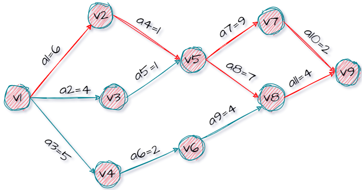

---


### 6.查找


##### 基本概念

1. 静态表查找：只查找某个符合条件的数据(只需关注查找速度)。
2. 动态表查找：在查找某个符合条件的数据的过程中，会插入、删除某个数据元素(除了关注查找速度，也要关注插入、删除操作是否方便)。
3. 查找表：由同一类型的数据元素(或记录)构成的集合。由于集合中的数据元素之间存在着松散的关系，因此查找表是一种应用灵便的结构。
4. 查找：根据给定的某个值，在查找表中确定一个某关键字等于给定值的数据元素或(记录)。
5. 关键字用来标识一个数据元素(或记录)的某个数据项的值：<span style="color:red">可唯一地标识一个记录(王道书中提到的关键字似乎默认就是主关键字)</span>的关键字是主关键字。反之，用以识别若干记录的关键字是次关键字。
6. 查找算法的评价指标：
   1. 查找长度：在查找运算中，需要**对比关键字的次数**称为查找长度。
   2. <span style="color:red">平均查找长度($ASL$)：所以查找过程中进**行关键字的比较次数的平均值**，其反映查找算法的时间复杂度。评价一个查找算法的效率时，通常需要考虑成功和失败两种情况的$ASL$​​。</span>

---

##### 顺序查找

1. 顺序查找，又叫线性查找，通常用于线性表。其算法思路是：从头到脚挨个查找(反之亦可)，时间复杂度$O(n)$。

2. 给出其一般形式代码：<span style="color:red">显然当返回$1$时表示查找失败</span>。

   ```cpp
   typedef int ElemType;
   typedef struct{
       ElemType *elem;
       int tableLen;
   } SSTable;
   
   int Search_Seq(SSTable ST, ElemType key){
       int i = 0;
       for (i = 0; i<ST.tableLen && ST.elem[i] != key; i++);
   
       // 当查找失败时, i的值等于ST.tableLen
       return i==ST.tableLen ? -1 : i;
   }
   ```

   <br>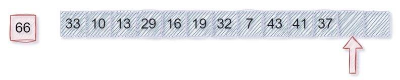

3. 哨兵形式代码：我们将查找表的$0$号位置作为哨兵(遇到哨兵就该停下来了)，存储当前查找的关键字，这样就不需要每次判断是否出界(效率更高)，因为出界前一定可以找到。<span style="color:red">显然当返回$0$时表示查找失败</span>。

   ```cpp
   typedef int ElemType;
   typedef struct{
       ElemType *elem;
       int tableLen;
   } SSTable;
   
   int Search_Seq(SSTable ST, ElemType key){
       // 设置哨兵
       ST.elem[0] = key; 
       int i;
       for(i = ST.tableLen; ST.elem[i] != key; --i);
       // 查找失败反回0
       return i; 
   }
   ```

   <br>

4. 不妨以哨兵形式为例，分析一下其$ASL$，我们假设查找表的数据个数为$n$。

   1. 对于查找成功而言，我们假设对每个元素的查找是等可能的($\frac{1}{n}$)，那么显然有$ASL_{成功}=\frac{1+2+3+\cdots+n}{n}=\frac{n+1}{2}$。
   2. 对于查找失败而言，$ASL_{失败}=n+1$。

5. 优化形式：

   1. 对查找表中元素进行有序存放(递增/递减)，不妨假设递增，显然我们知道当从小到大依次查找时，若发现当前元素的关键字大于查找的关键字，就可以判定查找失败，无需遍历到末尾。此时$ASL_{失败}=\frac{1+2+3+\cdots+n+n}{n+1}=\frac{n}{2}+\frac{n}{n+1}$，有所降低。<span style="color:red">适合经常查找失败的场景</span>。<br>
   2. 此外还可以将查找表的元素按照查找概率存储，将存储概率大的元素放在先查找的位置，<span style="color:red">适合经常查找成功的情形</span>。此时$ASL_{成功}=\sum_{i=1}^{m}P_iC_i$​。

6. (<span style="color:red">重点</span>)使用判定树分析$ASL$，我们使用圆形结点表示查找表中存在的元素，而矩形结点的失败结点(若有$n$个结点，则相应地有$n+1$​个查找失败结点)。

   1. 一个成功结点的查找长度=自身所在层数。
   2. 一个失败结点的查找长度=其父结点所在层数。
   3. 一般默认情况下，各种失败情况或者成功情况<span style="color:red">都等概率发生</span>。<br>


---

##### 折半查找

1. 折半查找又称二分查找，仅适用于<span style="color:red">有序</span>的<span style="color:red">顺序表(可随机访问，链表不行)</span>。

2. 给出如下形式的代码：假设查找表为从小到大的有序表，显然一般而言当$low>high$时认为查找失败。

   ```cpp
   typedef int ElemType;
   typedef struct
   {
       ElemType *elem;
       int tableLen;
   } SSTable;
   
   int Binary_Search(SSTable L, ElemType key)
   {
       int low = 0, high = L.tableLen - 1, mid;
       while (low <= high)
       {
           mid = (low + high) / 2;
           if (L.elem[mid] == key)
           {
               return mid;
           }
           else if (L.elem[mid] > key) // key在左半区
           {
               high = mid - 1;
           }
           else // key在右半区
           {
               low = mid + 1;
           }
       }
       return -1;
   }
   ```

   

3. 折半查找判定树构成：首先我们要知道在c或c++语言中，$mid = (low + high) / 2$其实是等同于$mid=\lfloor \frac{low+high}{2}\rfloor$。

   1. $mid=\lfloor \frac{low+high}{2}\rfloor$时：<span style="color:red">每次二分后，$high$到$low$元素个数的奇偶性是可能发生变化的。</span>
      1. 若$high$到$low$共有奇数个元素时，则$mid$​分隔后，左右两边元素个数相等。
      2. 若$high$到$low$共有偶数个元素时，则$mid$​分隔后，左边元素个数比右边少一个。
      3. 对于任意一个判定树结点，右子树结点数-左子树结点数=$0$或者$1$。
   2. $mid=\lceil \frac{low+high}{2}\rceil$​时：
      1. 若$high$到$low$共有奇数个元素时，则$mid$​分隔后，左右两边元素个数相等。
      2. 若$high$到$low$共有偶数个元素时，则$mid$​分隔后，右边元素个数比左边少一个。
      3. 对于任意一个判定树结点，左子树结点数-右子树结点数=$0$或者$1$​。
   3. 故而经上面分析，<span style="color:red">折半查找的判定树一定是平衡二叉树，且除最后一层可能不满以外，其它层都是满的。含有元素个数$n$的树高(不含失败结点)为$h=\lceil log_2(n+1) \rceil$，显然$ASL_{成功}<=h$且$ASL_{失败}<=h$，即折半查找时间复杂度$o(log_2n)$</span>。但是请注意，这不意味着任何情况下折半查找的效率均高于顺序查找，例如查找查找表的第一个元素。
   4. 显然依旧满足：<span style="color:red">若有$n$个结点，则相应地有$n+1$个查找失败结点(成功结点的空链域数量)</span>。
   5. 下面我们不妨演示一下$mid=\lfloor \frac{low+high}{2}\rfloor$的判定树构建过程(下图省略失败结点部分)：
      1. 显然按照左子树比右子树少一原则，$16$和$41$因该是右孩子。
      2. 当然我们其实要知道在折半查找的判定树中，左右子树其实就是在折半过程中划分的左右区间。当$mid=13$时显然$16$属于右区间内，故而在右子树中，$41$​​同理可得。<br>
   6. 不妨判断一下面的二叉树是否可能是折半查找的判定树：显然不是，不可能一会右子树比左子树多，一会儿左子树比右子树多。<br>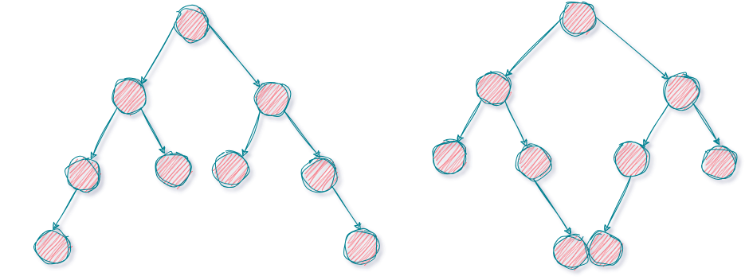

4. 为了后续分块查找部分，提一嘴。实际上查找关键字并不是二分查找的全部内容，例如如何找到一个比关键字大的最小值、或者找比关键字小的最大值。实际上我们要知道一点：<span style="color:red">查找失败，$low$和$high$会分别指向比目标值稍大和稍小的元素，如下图两种情况的演示。当然也可以直接尝试逻辑分析，当$low=high$时，若$arr[mid]<key$显然$low$右移，反之$high$左移，故而不难看出上述结论。</span>不妨尝试力扣题：[搜索插入位置 ](https://leetcode.cn/problems/search-insert-position/description/)<br>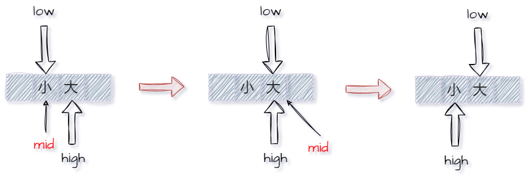<br><br>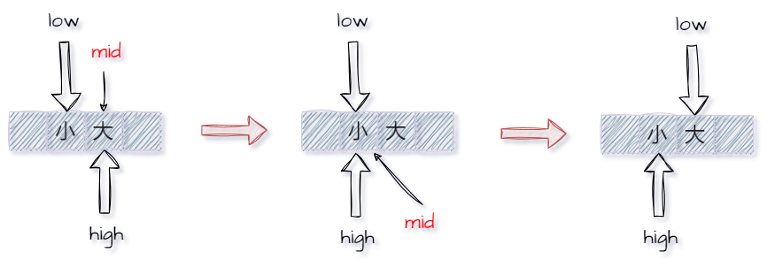

5. 但是对于上述问题，当我们将等于条件也加入时情况似乎略复杂(依然很简单)，我们不妨改造一下二分法：略。

---

##### 分块查找

1. 分块查找(块内无序，块间有序)：又称索引顺序查找，其将查找表划分为若干字块，块内元素可以无序，但是块间的元素是有序的。即每一块中的最大关键字是递增的(似乎是不允许递减)。<br>

2. 分块查找步骤：

   1. 先在索引表中通过顺序查找或者折半查找(返回$low$，等于时直接返回$mid$即可)(若返回的$low$超出索引表范围，则查找失败)找到对应的所属块的位置。

   2. 顺序遍历所属块查找对应元素。

   3. 给出类型定义，分块查找具体代码实现较简单略。

      ```cpp
      typedef int ElemType;
      typedef struct
      {
          ElemType maxVal;
          int low, high;
      }index;
      
      ElemType List[100];
      ```

      

3. 关于分块矩阵的查找效率分析，在求$ASL$时，要分析索引表的关键字对比次数和块中关键字的对比次数。<span style="color:red">尤其是要注意使用折半查找搜索索引表时，当索引表中不存在对应元素，则要得出所属块位置，需要等到二分法执行结束，这个过程中的关键字对比次数分析起来略显复杂。</span>而对于失败情况下的$ASL$一般而言不予考虑。

4. 假设长度为$n$的查找表被均匀地划分为$b$块，每块$s$个元素。此时显然$ASL_{all}=ASL_{index}+ASL_{block}$。

   1. 当使用顺序查找查索引表时：$ASL_{index}=\frac{1+2+3+\cdots+b}{b}=\frac{b+1}{2}$,而$ASL_{block}=\frac{1+2+\cdots+s}{s}=\frac{s+1}{2}$。故而$ASL_{all}=\frac{b+1}{2}+\frac{s+1}{2}=\frac{s^2+2s+n}{2s}$($b=\frac{n}{s}$)。求导可知当$s=\sqrt{n}$时，$ASL_{min}=\sqrt{n}+1$。
   2. 当使用折半查找查索引表时：依旧有$ASL_{block}=\frac{1+2+\cdots+s}{s}=\frac{s+1}{2}$，但是$ASL_{index}$王道给的是$\lceil log_2(b+1) \rceil$，但是个人觉得不太合适。

5. 若查找是动态查找表，即需要再查找过程中插入或者删除元素，可以使用链式存储，只不过此时索引表无法折半查找。<br>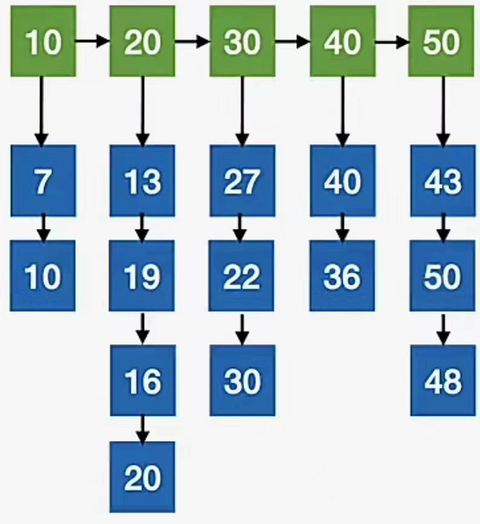

---

##### 二叉排序树

1. 二叉排序树的每个结点的值大于其左子树的所有结点的值，小于其右子树的所有结点的值<span style="color:red">($value_{左}<value_{根}<value_{右}$)(二叉排序树中不存在重复的值)</span>。

2. 为了后续方便，先给出二叉排序树的存储结构：

   ```cpp
   #include <iostream>
   
   typedef struct  {
       int key;
       BSTNode *lchild, *rchild;
   } BSTNode, *BSTree;
   ```

   

3. 二叉排序树的查找：

   1. 查找步骤：若相等则查找成功。若小于根节点，则在左子树查找。若大于根结点，则在右子树查找。查找成功返回结点指针，失败返回$NULL$。

   2. 具体实现：

      1. 非递归形式：<span style="color:red">空间复杂度$O(1)$</span>。

         ```cpp
         BSTNode* search(BSTree T, int key) {
             // 若T为空或等于key则返回T
             while (T != NULL && T->key != key) {
                 if (key < T->key) {
                     T = T->lchild;
                 } else {
                     T = T->rchild;
                 }
             }
             return T;
         }
         ```

         

      2. 递归形式：空间复杂度$O(n)$。

         ```cpp
         BSTNode *search(BSTree T, int key)
         {
             if (T == NULL)
                 return NULL;
             if (key == T->key)
                 return T;
         
             return key < T->key ? search(T->lchild, key) : search(T->rchild, key);
         }
         ```

         

4. 二叉排序树的插入：<span style="color:red">新插入的结点一定是叶子结点</span>。

   1. 步骤：若原二叉排序树为空则直接插入结点，否则若$key$小于根结点的值则插入到左子树，否则插入到右子树。若$key$​大于根结点的值则插入到右子树。

   2. 给出具体代码：这里给出递归形式，其空间复杂度$O(h)$。

      ```cpp
      int BST_insert(BSTree &T, int key)
      {
          if (T == NULL)
          {
              T = (BSTNode *)malloc(sizeof(BSTNode));
              T->key = key;
              T->lchild= T->rchild = NULL;
              return 1;
          }
          if (key == T->key)
              return 0;
          else if (key < T->key)
              return BST_insert(T->lchild, key);
          else
              return BST_insert(T->rchild, key);
      }
      ```

      

   3. 关于上面代码其实存在些许疑问(代码片段如下)：实际上`T`是一个引用，它是原始对象的别名,当你通过引用`T`修改对象时，实际上是在修改原始对象。若将参数`BSTree  &T`换成`BSNode *T`，此时$T$分配内存后，原本的$T$依旧为`null`(你可以把指针类型理解成一个变量，由于值传递机制，参数$T$和原本指针的值一致，即指向同一片内存空间)。但是若将参数`BSTree  &T`换成`BSNode **T`，此时的$T$指向指针的内存地址，此时对`*T`分配内存可行。

      ```cpp
       if (T == NULL)
          {
              T = (BSTNode *)malloc(sizeof(BSTNode));
              T->key = key;
              T->lchild= T->rchild = NULL;
              return 1;
          }
      ```

      <br>

   4. 非递归形式实现：

      ```cpp
      int insert(BSTree &T, int key)
      {
          BSTNode *p = T, *pre = NULL;
          while (p != NULL)
          {
              pre = p;
              if (key == p->key)
                  return 0;
              p = key < p->key ? p->left : p->right;
          }
      
          p = (BSTNode *)malloc(sizeof(BSTNode));
          p->key = key;
          p->left = p->right = NULL;
      
          // 判断是pre的左子树还是右子树
          if (pre == NULL)
              T = p;
          else if (key < pre->key)
              pre->left = p;
          else
              pre->right = p;
      
          return 1;
      }
      ```

      

5. 二叉排序树的构造：

   1. 步骤：调用插入函数$BST\_insert$即可。

   2. 具体代码实现：需要注意的是不同关键字序列$str$可能得到同款二叉排序树，也可能得到不同二叉排序树。

      ```cpp
      void createBST(BSTree &T, int str[], int n)
      {
          T = NULL;
          // 依次将数组中的元素插入到二叉排序树中
          for (int i = 0; i < n; i++)
              insert(T, str[i]);
      }
      ```

6. 二叉排序树的删除：

   1. 思路分析：假设需要删除结点$p$。再次之前，我们需要知道的是，<span style="color:red">二叉排序树的中序遍历得到的是一串递增的有序序列</span>。

      1. 若$p$是叶子结点，直接删除，不会影响二叉排序树的性质。<br>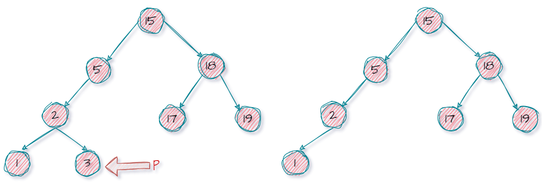
      2. 若$p$只有左子树或者右子树，则直接使用$p$的左子树或者右子树成为$p$父结点的子树，替代$p$的位置。<br>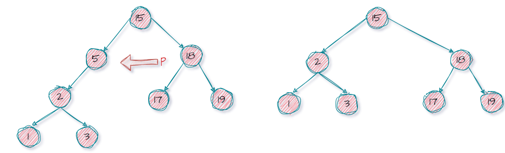
      3. 若$p$结点存在左右两棵子树，则令$p$的直接后继(或者直接前驱)替代$p$，然后从二叉排序树中删除该直接后继或者直接前驱，此后就换成第一种或者第二种情况。<br><br><br>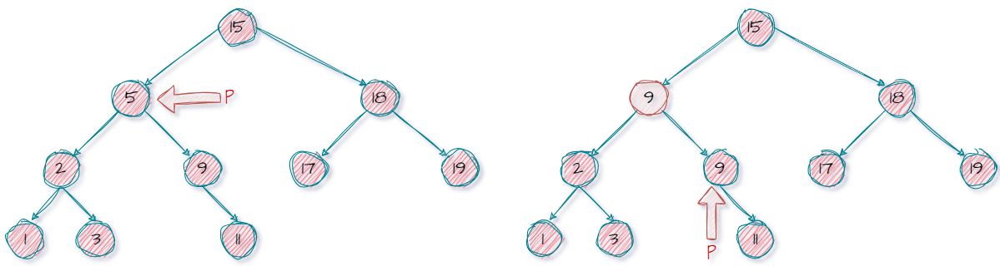
      4. 关于第三种情况需要进一步说明，这里其实就是将删除$p$结点转换为删除另一个结点(满足第一种或者第二种情况的结点)。前面已经提到过二叉排序树的中序遍历得到的是一串递增的有序序列。那么为了保证替换后二叉排序树的性质不变，这里用于替换的直接后继或者直接前驱显然是基于中序遍历而言的。那么我们参考线索二叉树的知识不难知道：
         1. 直接前驱：左子树中一直递归找右子树即可。或者说左子树中最右边或最右下的结点。
         2. 直接后继：右子树中一直递归找左子树即可。或者说右子树中最左边或最左下的结点。

   2. 具体代码实现：实际上第三种情况，我们没有必要递归调用`deleteBST(s)`,因为左子树的最右结点只有几种情况：要么是右叶子结点，要么是无右孩子的根结点(当然需要注意的是可能左子树就一个结点)。

      ```cpp
      bool deleteBST(BSTNode *&T)
      {
          BSTNode *p = T, *s, *q;
          if (T == NULL) // 树为空
          {
              return false;
          }
          if (T->right == NULL) // 右子树为空
          {
              T = T->left;
              free(p);
          }
          else if (T->left == NULL) // 左子树为空
          {
              T = T->right;
              free(p);
          }
          else // 左右子树均不为空,找左子树的最右节点
          {
              s = T->left;
              while (s->right != NULL)
              {
                  s = s->right;
              }
              T->key = s->key;
              deleteBST(s);
          }
          return true;
      }
      ```

      ```cpp
      bool deleteBST(BSTNode *&T)
      {
          BSTNode *p = T, *s, *q;
          if (T == NULL) // 树为空
          {
              return false;
          }
          else if (T->right == NULL) // 右子树为空
          {
              T = T->left;
              free(p);
          }
          else if (T->left == NULL) // 左子树为空
          {
              T = T->right;
              free(p);
          }
          else // 左右子树均不为空,找左子树的最右节点
          {
              s = T->left;
              q = T;  // 前指针(指向s的父结点)
              while (s->right != NULL)
              {
                  q = s;
                  s = s->right;
              }
              T->key = s->key;
              if (q != T) { //右叶子或无右孩子的根
                  q->right = s->left;
              } else { // 没进循环，左子树中没有右子树
                  q->left = s->left;
              }
              free(s);
          }
          return true;
      }
      ```

      

7. 查找效率分析：

   1. 查找长度：在查找运算中，需要对比关键字的次数称为查找长度，反应了查找操作时间复杂度。
   2. 若树高$h$，则找到最下层结点需要对比$h$次。
   3. 含有$n$个结点的二叉树：最好的情况，高度最小为$\lfloor log_2n+1 \rfloor$,平均查找长度$=O(log_2n)$。最坏的情况，树高$h=n$,平均查找长度$=O(n)$。显然，<span style="color:red">二叉排序树"越胖越矮"，平均查找长度$ASL$​越小。</span>
   4. 查找失败的$ASL$略。<br>


---

##### 平衡二叉树

1.   看山是山，看山不是山，看山还是山。

2.   在前面提过二叉排序树"越胖越矮"，平均查找长度$ASL$越小。而平衡二叉树左右子树高度差不超过$1$，显然若二叉排序树能够始终保证是一棵平衡二叉树，就很$nice$。

3.   平衡二叉树的基本概念：

     1.   二叉平衡树，简称平衡树($AVL$树)，其规定树中任意一结点的左子树和右子树的高度之差不超过$1$。

     2.   <span style="color:red">平衡因子：左子树高-右子树高。</span>显然在平衡二叉树中结点的平衡因子的值只可能为$-1、0、1$($|平衡因子|<=1$)

     3.   类型定义：

          ```cpp
          typedef struct
          {
              int key;                         // 关键字
              int balance;                     // 平衡因子
              struct AVLNode *lchild, *rchild; // 左右孩子指针
          } AVLNode, *AVLTree;
          ```

          

4.   平衡二叉树的插入：我们再对二叉排序树进行插入操作后，如何将二叉排序树调整为平衡二叉树呢？分为以下四种情况：

     1.   首先我们需要知道的是，我们<span style="color:red">每次调整的对象都是最小不平衡子树</span>，后续讨论的各种情况均是以$A$为根结点的子树作为最小不平衡树。
          1.   最小不平衡子树是第一个破坏平衡条件的子树。
          2.   如果我们不从最小不平衡子树开始调整，而是选择其他子树进行调整，那么可能无法恢复整棵树的平衡。因为调整其他子树可能不会影响到最小不平衡子树，最小不平衡子树的平衡因子可能仍然大于1。

     2.   <span style="color:red">$LL$:在$A$的左孩子的左子树中插入结点导致不平衡。</span>
          1.   我们给出插入前的示意图：其中方块代指子树，那我们不妨考虑为什么子树高度全为$H$?我们不妨假设$BL$高$H$，那么由于在$B$的左子树插入结点导致$A$点不平衡。那么显然$AR$的高度应为$H$(若为$H+1$，插入结点后仍平衡)，那么显然$BR$为$H$。$BR$为什么不是$H-1$?若$BR$的高度为$H-1$则最小的不平衡子树将以$B$为根结点而不是$A$，此时我们需要将$BL$拆开，又回到开始的分析情况。那若$BR$为$H+1$，显然一开始就不平衡，不合理。<br>
          2.   对于这种情况，我们需要知道：$BL<B<BR<A<AR$。
          3.   <span style="color:red">于是我们采取策略：右旋(右单旋转)，将$B$向右旋转代替$A$作为根结点，将$A$向右下旋转变为$B$的右子树。显然由于$B<BR<A$,我们让$BR$成为$A$的左子树。</span><br>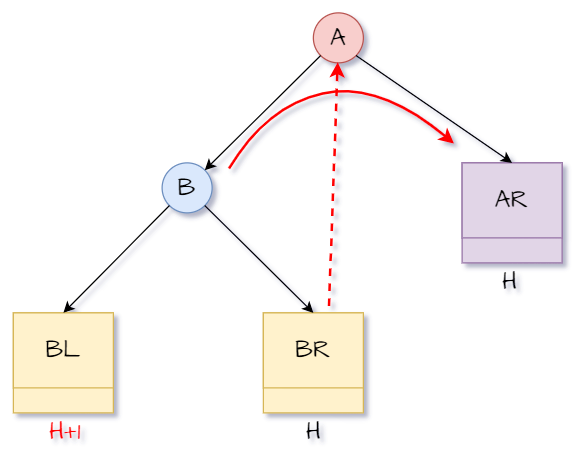<br><br>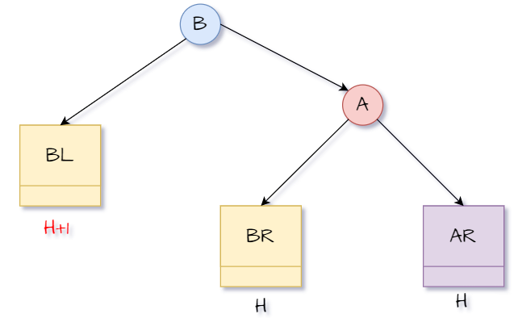
          4.   显然，经过右旋后二叉树的高度没变，这也表明调整最小不平衡子树的可行性。

     3.   <span style="color:red">$RR$:在$A$的右孩子的右子树中插入结点导致不平衡。</span>
          1.    我们给出插入前的示意图：其中方块代指子树。<br>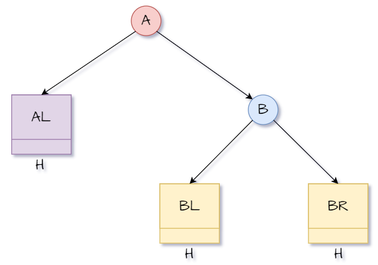
          2.   对于这种情况，我们需要知道：$AL<A<BL<B<BR$。
          3.   <span style="color:red">于是我们采取策略：左旋(左单旋转)，将$B$向左旋转代替$A$作为根结点，将$A$向左下旋转变为$B$的左子树。显然由于$A<BL<B$,我们让$BL$成为$A$的右子树。</span><br><br><br>
          4.   显然，经过左旋后二叉树的高度没变，这表明调整最小不平衡子树的可行性。

     4.   其实通过上述两种情况，都是将两个$H$的子树放在一起，将$H+1$子树放在上一层，使得整体高度变为原来的$H+2$。
     5.   <span style="color:red">$LR$:在$A$的左孩子的右子树中插入结点导致不平衡。</span>
          1.   给出插入前的示意图：老规矩，分析一下$CR$和$CL$中能否存在高为$H$，显然不可能，要不插入后继续平衡，要不就是$C$所在子树变为最小不平衡子树。<br>
          2.   对于这种情况，我们需要知道：$BL<B<CL<C<CR<A<AR$​。
          3.   <span style="color:red">于是我们采取策略：先左后右双旋转。我们先将$C$左旋替换$B$作为根结点，然后由于$B<CL<C$,于是我们让$CL$作为$B$的右子树。显然此时仍未平衡。若我们将$B$所在子树视作一个整体，其实又回到了$LL$型。于是，我们再将$C$右旋替换$A$作为根结点，由于$C<CR<A$,我们将$CR$作为$A$的左子树。</span><br><br><br>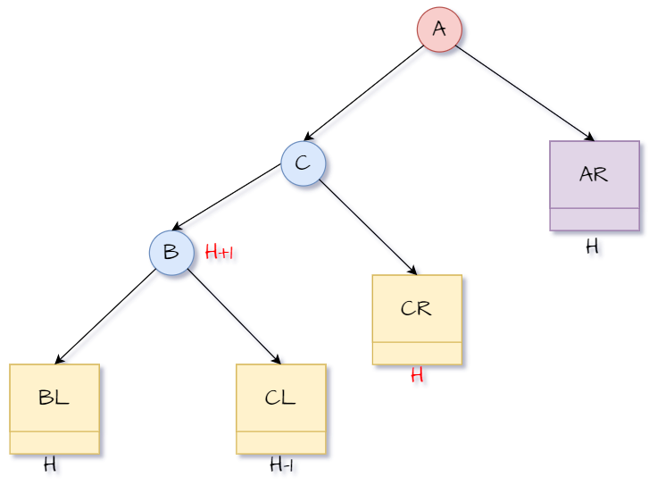<br><br>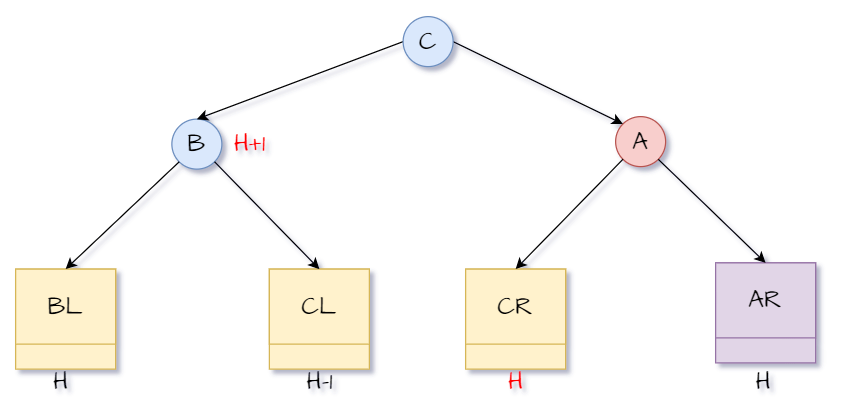
          4.   实际上我们上述讨论的是在$C$的右子树中插入，那如果在$C$的左子树中插入呢，显然从上图可以看出也是可行的，无非是最后$CL$高度为$H$,$CR$高度为$H-1$。

     6.   <span style="color:red">$RL$:在$A$​的右孩子的左子树中插入结点导致不平衡。</span>
          1.   给出插入前的示意图：<br>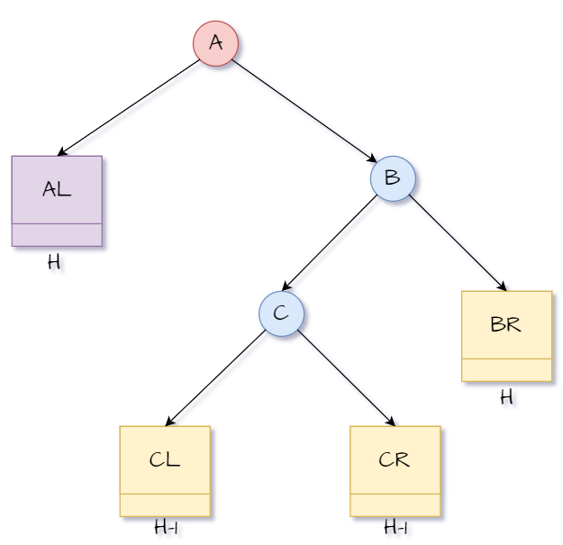
          2.   对于这种情况，我们需要知道：$AL<A<CL<C<CR<B<BR$。
          3.   <span style="color:red">于是乎我们采取策略：先右后左双旋转。我们先将$C$右旋替换$B$作为根结点，然后由于$C<CL<B$,于是我们让$CL$作为$B$的左子树。显然此时仍未平衡。我们再将$C$右旋替换$A$作为根结点，由于$A<CL<C$,我们将$CR$作为$A$的右子树。</span><br><br><br><br><br>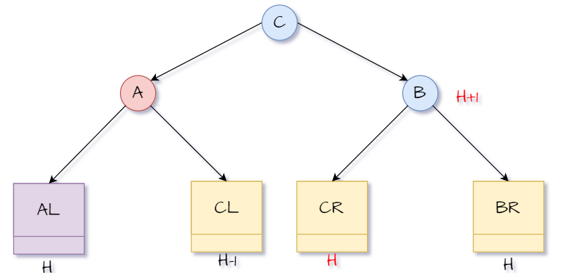
          4.   需要说明的是，若在$C$的左子树插入结点，在右旋后会短暂出现最小不平衡树发生变化的情况(变为$C$所在子树)。对于这一现象实属正常，暂不知如何解释，不妨强行认为两次旋转视为一体，不可单独看(实际上这种解释可能是对的)。

5.   左旋和右旋的伪代码：

     1.   右旋：其中$f$是$p$的父结点，$gf$是$f$的父结点，$p$为$f$​的左孩子(左孩子才能右上旋)：

          ```cpp
          f->lchild=p->rchild;
          p->rchild=f;
          gf->lchild/rchild=p;
          ```

          

     2.   左旋：其中$f$是$p$的父结点，$gf$是$f$的父结点，$p$为$f$的右孩子(右孩子才能左上旋)：

          ```cpp
          f->rchild=p->lchild;
          p->lchild=f;
          gf->lchild/rchild=p;
          ```

          

6.   举例说明：略。

7.   平衡二叉树的删除：

     1.   删除规则：直接按照二叉排序树的删除规则。
     2.   关键是调整平衡：我们假设是删除$w$结点，<span style="color:red">(这句话才是贯穿插入和删除的精髓部分)我们向上找到第一个不平衡的结点$A$(最小不平衡子树)，我们记$B$为$A$的高度的孩子结点，$C$为$B$中高度最高的孩子结点，最后转换成上述四种情况</span>(是否可以理解为将删除等效为在另一个位置插入)。
     3.   <span style="color:red">需要注意的是：插入操作只需要对$A$为根结点的子树进行操作。但是删除不一样，先对$A$为根结点的子树进行操作，但是调整后可能会导致子树高度减$1$，此时可能需要对$A$​的祖先结点进行平衡调整，甚至最终回溯到根结点。</span>
     4.   举例说明：暂无合适例子。

8.   <span style="color:red">查找效率分析：若树高为$h$，则最坏情况下，查找一个关键字最多需要比较$h$次，即查找操作的时间复杂度不可能超过$O(h)$。我们假设使用$n_h$表示深度为$h$的平衡树中含有的最少结点数。显然有$n_0=0$,$n_1=1$,$n_2=2$,且有$n_h=n_{h-1}+n_{h-2}+1$的递推式。显然可知含有结点$n_h$个的平衡二叉树的最大高度为$h$，不难找出规律：结点个数为$n$，则最大高度为$O(log_2{n})$。当然可以尝试推导：由于$n_{h-1}<n_{h-2}$,故$n_h<=2^{h-1}$,然后......没推出来......，另一种搁两个放缩一次略复杂，不推了，略。<br>

9.   推论：如何快速看出二叉排序树中结点之间的大小关系？水平方向的相对位置(左小，右大)(不妨看看上面的分析过程，注意忽略视觉排列的影响)。

10.   给出一幅图：我们不妨将圆视作较为光滑(不完全光滑，有摩擦)的棍子，上面放着柔软的铁链。当铁链一端重，为了平衡，就需要向另一边拉。<br>


---

##### 红黑树(送命题)

1. 复杂度对比：注意的是红黑树和平衡二叉树都属于特殊的二叉排序树。

   | 操作                 | BST(二叉排序树) | AVL(平衡二叉树) | RBT(红黑树) |
   | -------------------- | --------------- | --------------- | ----------- |
   | 查、删、插时间复杂度 | $O(n)$          | $O(log_2n)$     | $O(log_2n)$ |

2. 平衡二叉树和红黑树的对比：实际上对于平衡二叉树，由于要求过于苛刻，对于插入和删除操作，往往会破坏其结构，需要频繁调整树的形态。为此我们提出了不那么严格的红黑树。后面我们会知道，红黑树只需要保证任意结点的左右子树高度相差不超过$2$倍即可。故而：对于一查为主、少插少删的场景可以使用平衡二叉树，而对于频繁插入、删除的场景，适合使用红黑树。

3. 红黑树的基本概念:

4. 


----

##### B树


---

##### B+树


---

##### 散列表


---

### 7.排序


---


### 待补

1.   归并排序
2.   [考研数据结构笔记——第二章线性表（基础部分） - 知乎 (zhihu.com)](https://zhuanlan.zhihu.com/p/32450661)
3.   [考研——图算法大题整理(一)_图的代码考研题型-CSDN博客](https://blog.csdn.net/Jayna_Su/article/details/133214381)
4.   [数据结构—图_nextneighbor-CSDN博客](https://blog.csdn.net/qi_SJQ_/article/details/123064172)


