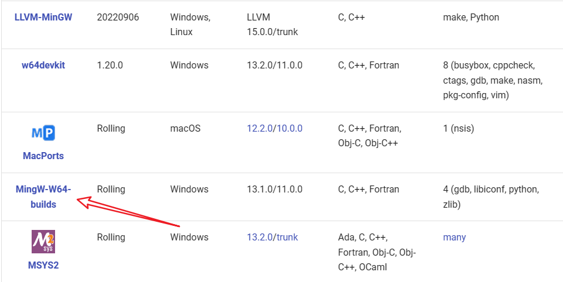
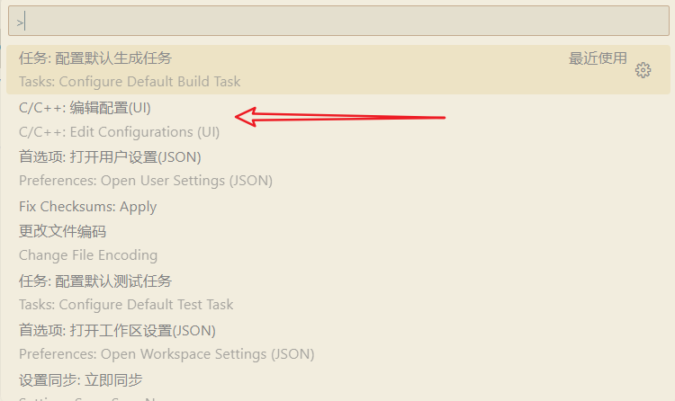
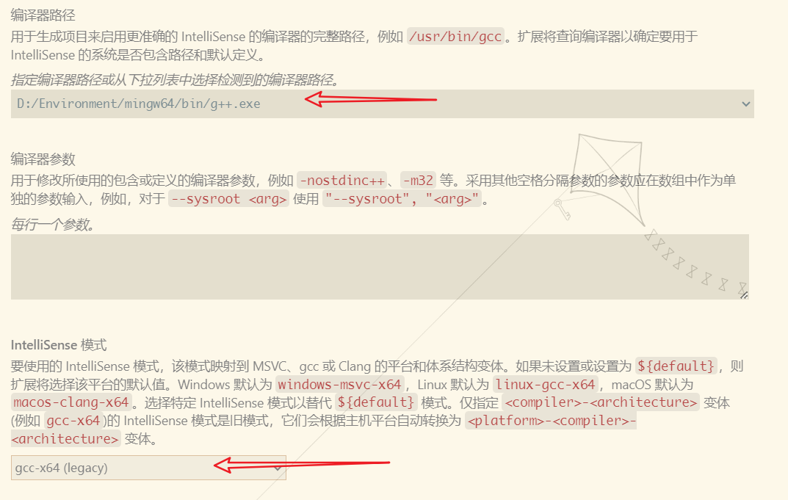
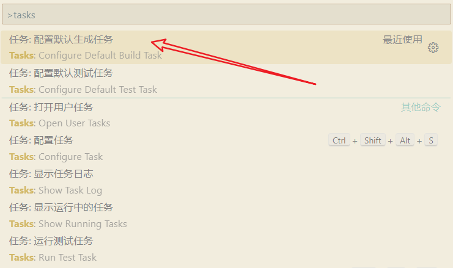
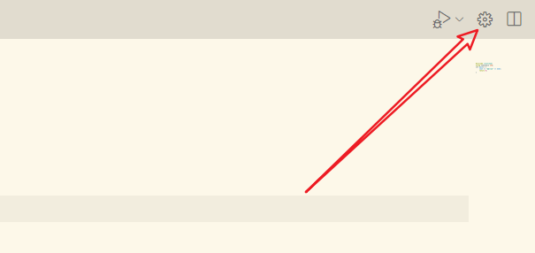
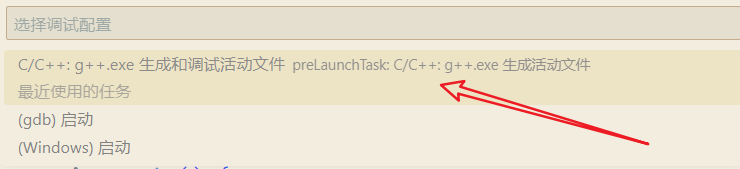
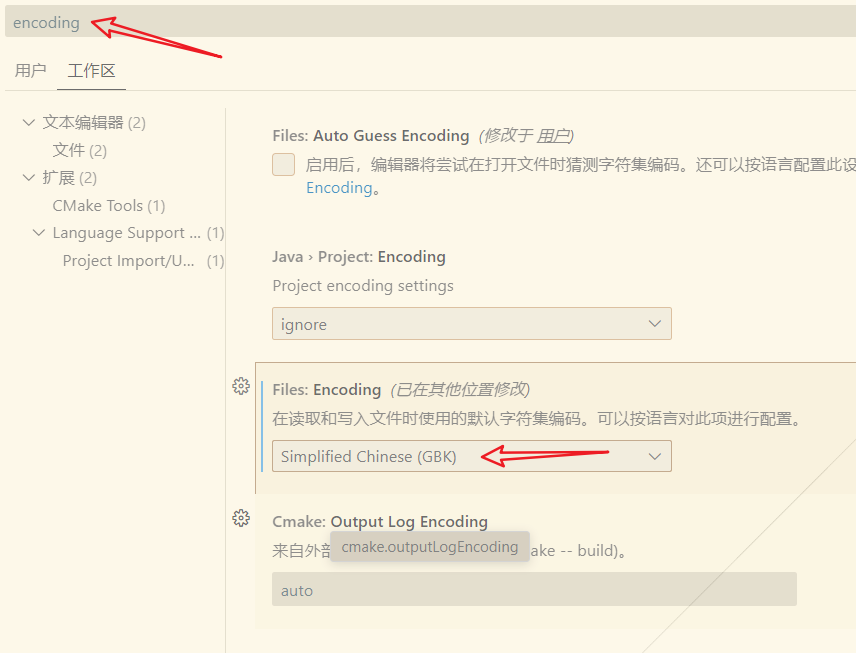

#### vscode配置cpp

1.   安装[mingw-64]([Downloads - MinGW-w64](https://www.mingw-w64.org/downloads/))<br>

2.   参考教程[VSCode配置C/C++环境 - 知乎 (zhihu.com)](https://zhuanlan.zhihu.com/p/87864677)。

     1.   对于c++而言，配置g++编译器：使用快捷键ctrl+shift+p<br>

     2.   配置g++：生成`c_cpp_properties.json`配置文件。<br>

     3.   设置tasks，生成对应`tasks`配置文件：<br>

     4.   点击设置图标，生成`launch.json`配置文件：<br><br><br>

     5.   修改生成`launch.json`配置文件，配置运行程序打开系统cmd黑窗口显示：

          ```json
          {
              "version": "0.2.0",
              "configurations": [
                  {
                      "name": "C/C++: g++.exe 生成和调试活动文件",
                      "type": "cppdbg",
                      "request": "launch",
                      "program": "${fileDirname}\\${fileBasenameNoExtension}.exe",
                      "args": [],
                      "stopAtEntry": false,
                      "cwd": "D:/Environment/mingw64/bin",
                      "environment": [],
                      "externalConsole": true, //打开控制台
                      "MIMode": "gdb",
                      "miDebuggerPath": "D:\\Environment\\mingw64\\bin\\gdb.exe",
                      "setupCommands": [
                          {
                              "description": "为 gdb 启用整齐打印",
                              "text": "-enable-pretty-printing",
                              "ignoreFailures": true
                          },
                          {
                              "description": "将反汇编风格设置为 Intel",
                              "text": "-gdb-set disassembly-flavor intel",
                              "ignoreFailures": true
                          }
                      ],
                      "preLaunchTask": "C/C++: g++.exe 生成活动文件"
                  }
              ]
          }
          ```

     6.   设置vscode的默认编码为`gbk`,打开设置搜索`encoding`:

#### [基本语法](https://oi-wiki.org/lang/basic/)

##### 基本框架

```cpp
#include <cstdio>
#include <iostream>
using namespace std;
int main() {
    // do something...
    return 0;
}
```


##### 注释

1.   行内注释

     以 `//` 开头，行内位于其后的内容全部为注释。

2.   注释块

     以 `/*` 开头，`*/` 结尾，中间的内容全部为注释，可以跨行。


##### 输入输出

1.   使用`using namespace std`后`std::cin`和`std::cout`、`std::endl`可以缩写。`endl`用于换行。
2.   `scanf` 与 `printf` 其实是 C 语言提供的函数。大多数情况下，它们的速度比 `cin` 和 `cout` 更快，并且能够方便地控制输入输出格式。

```cpp
#include <iostream>
using namespace std;

int main() {
  int x, y;                      // 声明变量
  cin >> x >> y;                // 读入 x 和 y
  cout << y << endl << x;  		// 输出 y，换行，再输出 x
  return 0;                     // 结束主函数
}
```

```cpp
#include <cstdio>

int main() {
    int x, y;
    scanf("%d%d", &x, &y);   // 读入 x 和 y
    printf("%d\n%d", y, x);  // 输出 y，换行，再输出 x
    return 0;
}
```


##### neovim中使用c++

1. 在`neovim`中使用cpp时`main`函数需要添加两个参数`int argc,char *argv[]`，如下：

   ```cpp
   int main(int argc,char *argv[]) {
       // do something...
       return 0;
   }
   ```

   

2. 使用`NULL`，需要`#include <stddef.h>`。

   ```cpp
   #include <stddef.h>
   #include <cstdio>
   #include <iostream>
   using namespace std;
   
   int main(int argc,char *argv[]) {
       // do something...
       return 0;
   }
   ```

   
