##### 数与编码

###### 数质与编码

1. 罗马的数字是基于加法原理的，例如$XII=10+1+1=12$、$IX=10-1=9$。
2. 而十进制等是基于乘法原理实现的，其每一位的数字以及每一位数字所在的位置均表示权重。例如$96$中的就其实表示的是$9 \cdot 10^1$​。
3. 十进制$D(decimalism)$、十六进制$H(hexadecimal)$。
4. 对于十进制转二进制的原理进行一定程度的说明: 十进制$a$表示为二进制为$K_n \ K_{n-1} \ \cdots \  K_2 \ K_1 \ K_0 \  K_{-1} \  K_{-2} \  \cdots \  \ k_{-m+1} \ k_{-m}$
   1. 对于整数部分：$K_n*2^{n}+K_{n-1}*2^{n-1}+\cdots+K_1*2^1+K_0*2^0$，显然我们每次$\%2$就可以得到一个低位二进制数。
   2. 对于小数部分: $K_{-1}*2^{-1}+K_{-2}*2^{-2}+\cdots+K_{-m+1}*2^{-m+1}+K_{-m}*2^{-m}$，显然我们每次$\cdot 2$​就可以得到一个高位二进制数。

---


###### BCD码

1. 实际上通过上述内容，不难知道将二进制转换为十进制还是比较麻烦的，对此我们可以参照二进制转八进制的思想，我们规定某种编码中，4位二进制表示一位十进制数(<font color=red>当然$4b$能表示16种数字，显然有$6$多余</font>)。
2. <font color=red>$8421$码</font>： 在这种编码方式中每一位二值代码的1都是代表一个固定数值，把每一位的1代表的十进制数加起来，得到的结果就是它所代表的十进制数码。 由于代码中从左到右每一位的1分别表示8，4，2，1，所以把这种代码叫做8421代码。
   1. $8421$码是一种有权码。
   2. $0110=2+4=6$显然$0110$在$8421$中表示十进制$6$。
3. 对于$8421$码的计算：$0101(5)+1000(8)=1101(113)$,但是$13$并不是这样表示的，正确的13为$00010011$,此时我们就需要在上述计算结果上进行$+0110(6)$修正(<font color=red>大于$1001(9)$即需要修正</font>)，即$1101+0110=(000)10011$。至于为什么是加6修正，上面提过$4b$表示一个个位的十进制数存在6中冗余的状态，在上面计算中，我们计算的结果实际上是需要跳过这些冗余状态的。
4. 余3码：其实就是$8421$码$+0011$,显然是一种无权码。
5. $2421$码：有权码，对于十进制$5$而言，实际上存在多种表示方式：$1011=2+2+1$、$0101=4+1$,为了保证编码的唯一性，规定$<5$的十进制表示为$0\_ \ \_ \ \_$,而$\geq 5$的十进制数表示为$1\_ \ \_ \ \_$。即$5$的表示为$1011$。


---

###### <font color=red>编码表示</font>

1. 二进制无法表示所以小数，例如$0.3$无法通过$0.5、0.25、0.125、\cdots$线性表示。
2. 有符号数和无符号数：对于无符号数，寄存器中的每一位都可以用来存放数值。
3. 原码：以尾数表示真值的绝对值，符号位表示正负($0$正$1$​负)
   1. 以$8b$为例：对于原码存在$+0(0,000\ 0000)$和$-0(1,000\ 0000)$，前面给出的是整数，小数也是一样的。
   2. 对于$n+1$位机器字长：
      1. 若表示整数：$[-(2^n-1),(2^n-1)]$
      2. 若表示小数：$[-(1-2^{-n}),(1-2^{-n})]$
      3. 关于上述两个数怎么得出的需要解释一下，对于最大的数，我们采取$+1$或者$+2^{-n}$来计算，于是得到了$2^n$或者$1$，给出示意图：<br>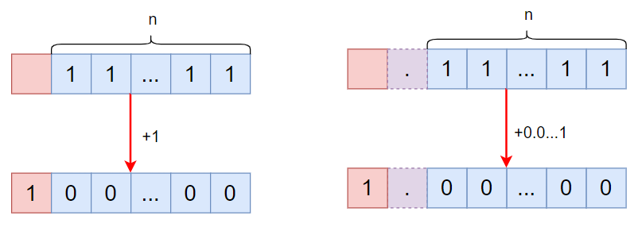
4. 反码：用于原码和补码相互转换的过度。
   1. 反码与原码的关系：反码与原码一一对应。
      1. 正数：反码与补码相同。
      2. 负数：其等于原码除符号位外按位取反。
   2. 以$8b$为例：对于反码存在$+0(0,000\ 0000)$和$-0(1,111\ 1111)$，前面给出的是整数，小数也是一样的。
   3. 对于$n+1$位机器字长：
      1. 若表示整数：$[-(2^n-1),(2^n-1)]$
      2. 若表示小数：$[-(1-2^{-n}),(1-2^{-n})]$
5. 补码：
   1. 实际上在二进制计算的过程中，对与加法和减法需要通过加法器和加法器进行计算，这就会增加底层硬件的设计成本。于是，便有了加法替代减法的操作。那如何使用加法代替减法呢？我们不妨参考一下时钟,如果需要将指针从7拨到3，可以逆时针拨动4下，即对应$-4$。也可以顺时针拨动8下，即对应$+8$。<br>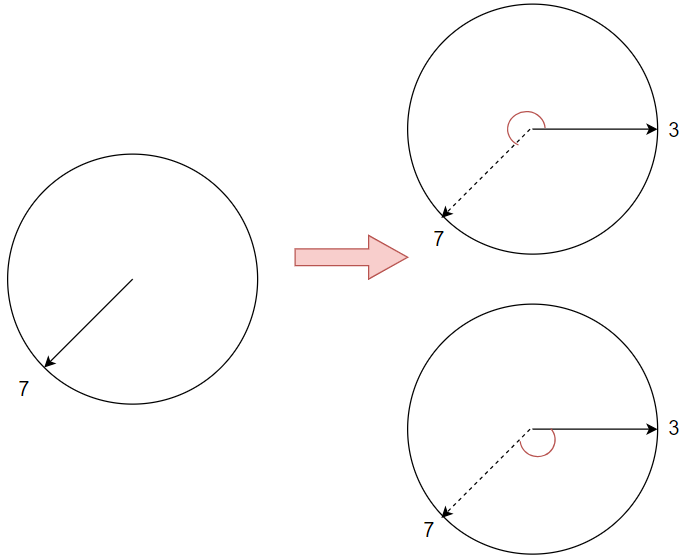
   2. 那么对于上述过程，在执行减法$a-4$时其效果等价于$a+8$。这其实是因为时钟最大只能表示12，因此大于12的部分被舍弃。那么依此原理得出原码和补码的关系：
      1. 正数：原码和补码一致。
      2. 负数：补码等于原码除符号位外按位取反后$+1$。
      3. 实际上对于机器字长为$n+1$,$原码+补码=2^n$(这里的原码和补码默认不包含符号位的)。其中$2^n$​可以认为是模。
      4. 实际上，对于一个负数的补码，我们计算时，是将其作为一个正数
   3. <font color=red>补码的补码就是原码。</font>我们不妨从两个角度思考这句话：
      1. 从模的角度来说，$补码=2^n-原码$，同样的$原码=2^n-补码$。而对于二进制来说$2^n-*$的操作就是对$*$除符号位按位取反然后加一。
      2. <span id="buma"></span>当然，不妨给出下列解释。实际上对原码求反码这个过程很好理解。<font color=red>重点在于此后会对反码执行加一操作得到补码，这个过程会导致从低位开始，反码中的1依次变为0，直到遇见0并将其变为1，则结束得到补码。显然这个过程会将反码末端的$01\cdots 1$变回原码形式的$10 \cdots 0$，而补码前端的$A$部分仍和原码$a$相反</font>。那么显然我们再次进行上述两步操作，就又可以将补码转变为原码。<br>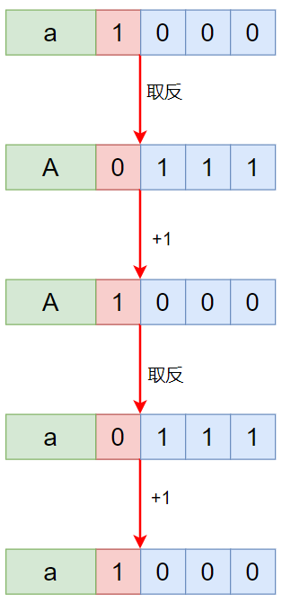
      3. 对于上述的2过程，提供一个由原码求补码的新思路：对于负数，忽略符号位后，保留原码末尾部分的$10 \cdots 0$(0的个数可以是0)​,剩余部分全部取反。如下：<br>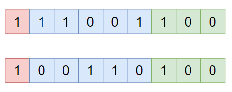
   4. <font color=red>$+x$的补码等于$-x$的补码包括符号位在内按位取反后末尾加一，其实就是求$-x$​的原码然后改变一下符号位</font>。
   5. 对于补码而言，真值0只有一种表现形式。以$8b$为例：对于原码的$+0(0,000\ 0000)$和$-0(1,000\ 0000)$，其对应的补码只有$0,000 \ 0000$。那么显然，对于补码而言$+0(0,000\ 0000)$和$-0(1,000\ 0000)$都对应原码$0,000 \ 0000$。于是乎就多了一个$1,000 \ 0000$，对于整数我们将其记为$-2^7$,对于小数将其记为$-1$​。
   6. 那么显然对于机器字长为$n+1$，其原码：
      1. 表示整数：$[-2^n,(2^n-1)]$
      2. 表示小数：$[-1,(1-2^n)]$​
      3. <font color=red>显然$-1$和$-2^n$​不存在与之对应的原码和补码。</font>
   7. <font color=red>执行加法时，补码的符号位可以一同参与运算</font>。
      1. 一旦发生溢出，就很容易被发现，例如$0,111+0,111=1,000$，显然两个正数相加变成负数，说明发生了溢出。当不发生溢出时，对于两个负数相加时，最高数值位相符号位进1，导致计算结果符号位仍为1。
      2. 对于一个负数加上一个正数，我们不妨思考一下，当二者相加为零，显然$+x$的补码等于$-x$的补码<font color=red>包括符号位</font>在内按位取反后末尾加一，也就是说$[+x]_补$等于$[-x]_原$对符号位取反。那么不难得出$[-x]_补+[+x]_补=0$(自动舍去一个1)。那么：
         1. 当负数绝对值大于正数，负数对应补码的二进制大小其实会变小，不会进位，即符号位为$0+1=1$,表示负数(按照$[-x]_补+[+x]_补=0$理解就很容易知道符号位是1)。
         2. 当正数绝对值大于负数，正数对应当补码的二进制大小会变大，导致进位，即符号位变为$0+1+1=0$，表示正数(按照$[-x]_补+[+x]_补=0$理解就很容易知道符号位还是0)。
      3. 或者换一种角度说：对于正数而言，补码从最高数值位开始向右，连续的1越多()，正数越大。而对于负数而言，补码从最高数值位开始向右，连续的1越多，负数越大，其真值的绝对值越小。
      4. 实际上，我们不难知道：只有同号相加才会导致溢出(负数+负数、正数+正数)，此时由于符号位的参与运算，就会导致符号位变化，从而很容易判断出溢出的存在。
6. 移码：其实就是将补码的符号位取反即可。
   1. 显然对于移码而言，真值0也是唯一的。
   2. 对于补码由于符号位和数据一同存储，我们不好比较大小。但是对于移码，正数的符号位变为1，负数的符号位变为0，此时就可以按位比较大小。
   3. <font color=red>移码只能表示整数</font>。
7. 小结：
   1. 给出原码和补码的示意图：<br>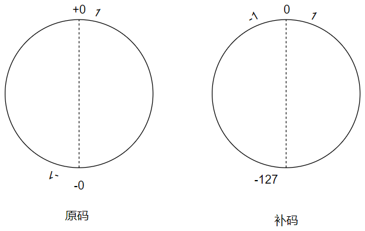
   2. 再次强调：补码的补码是原码。
   3. 对于正数而言：补码、原码、反码三种相同。

---

###### 逻辑门电路

1. 逻辑运算：
   1. 与($and$)：只有当输入$A、B$均为$1$时返回$1$，其他情况返回$0$，其实可以将$AND$视为乘法,只有$1*1=1$。
      1. $Y=A \cdot B$也可以简写为$Y=AB$​。
      2. 门电路图形符号：(左边为国标画法，右边为国际常用画法)<br>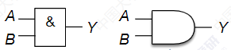
   2. 或门($or$)：只有当输出$A、B$均为$0$时返回$0$，其他情况返回$1$，其实可以将$OR$视为加法,只有$0+0=0$。
      1. $Y=A+B$
      2. 门电路图形符号：(左边为国标画法，右边为国际常用画法)<br>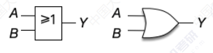
   3. 非门($not$)：输出结果为输入$A$取反即可。例如$A=1$则输出$0$。
      1. $Y=\overline{A}$。
      2. 门电路图形符号：(左边为国标画法，右边为国际常用画法)<br>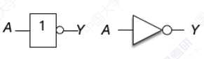
2. 复合逻辑运算：
   1. 与非($NAND$)：本质上就是在$AND$操作后对结果在执行一次$NOT$。故而只有当$A、B$输入均为$0$时，结果才为$0$，其他情况输出$1$​。
      1. $Y=\overline{A \cdot B}$,当然也可以简写为$Y= \overline{AB}$。
      2. 门电路图形符号:(左边为国标画法，右边为国际常用画法)<br>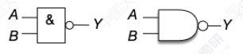
      3. 当然也可以使用一个与门加一个非门表示，只不过常用上述简化写法：<br>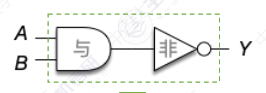
   2. 或非($NOR$)：本质上就是在$OR$操作后对结果在执行一次$NOT$。故而只有当$A、B$输入均为$0$时，结果才为$1$，其他情况输出$0$​。
      1. $Y= \overline{A+B}$
      2. 门电路图形符号：(左边为国标画法，右边为国际常用画法)<b<br>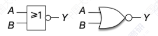
      3. 当然也可以使用一个或门加一个非门表示，只不过常用上述简化写法(<font color=red>封装：屏蔽电路部件的内部实现细节，竞对外部暴露出输入/输出引脚，使用者仅需关注该部件的核心功能即可</font>)：<br>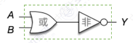
   3. 异或($XOR$)：输入$A、B$相异时，输出$1$，否则输出$0$​。只有$A+B=1$才返回$1$。
      1. $Y=A \oplus B$​
      2. 真值表：<br>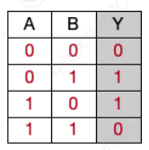
      3. 门电路图形符号：<br>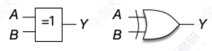
      4. 当然其实$A\oplus B= \overline{A}B+ A \overline{B}$,由此可以通过不同逻辑运算组合得到异或：<br>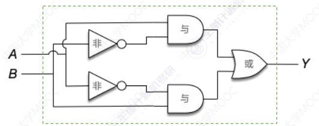
   4. 同或($XNOR$)(有时可能会被叫做异或非门)：对异或取反，只有当$A、B$两个输入相同时返回$1$，否则返回$0$。只有$A+B \not =1$才返回$1$。
      1. $Y= A \odot B$(等价于$Y= \overline{A \oplus B}$)
      2. 真值表:<br>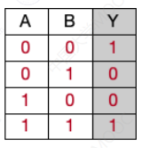
      3. 门电路图形符号：<br>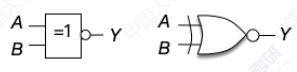
      4. 显然同或也可以使用异或和非构成：<br>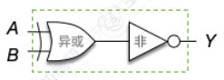
3. 异或运算的妙用：对于$n \ bit$进行异或操作，若其中$1$的个数为奇数，则异或结果为$1$，若$1$的个数为偶数个，则结果为$0$，该原理运用于后续的奇偶校验发、二进制加法。<font color=red>实际上对于异或操作而言是可以交换运算顺序的，那么若将所有的$1$放在一起计算就很容易推出上述结论，而$0$的个数对异或结果无影响，无论多少个$0$异或的结果都是$0$</font>。
4. 逻辑门电路的补充：<br>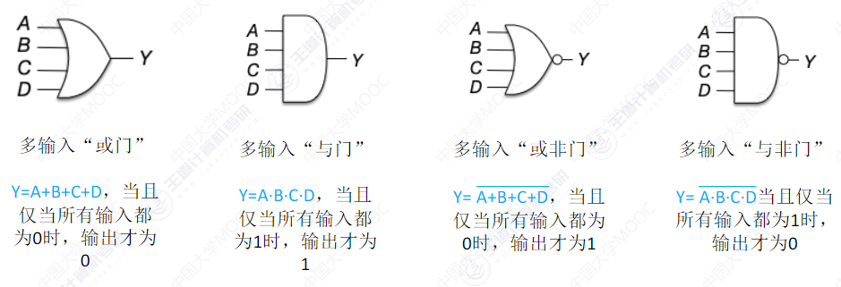
5. 逻辑运算的优先级：非>与>或。存在括号，括号的优先级更高。对于非运算符下，可以默认理解为含有一个括号。
6. 逻辑运算的常见公式：
   1. $A(C+D)=AC+AD$
   2. $ABC+A(BC)$
   3. $A+B+C=A+(B+C)$
   4. $\overline{A+B}=\overline{A} \cdot \overline{B}$​,反演律(德摩根定律)
   5. $\overline{A \cdot B}= \overline{A}+ \overline{B}$​,反演律(德摩根定律)
7. 实际上利用上述公式可以简化电路设计，逻辑表达式是对电路的数学化表达。例如$AC+AD=A(C+D)$可以画出下面两种电路图：<br>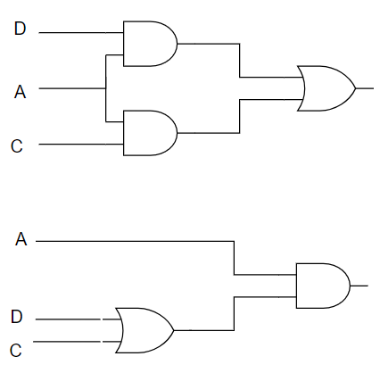

---

###### 加法器

1. 我们不妨使用上述逻辑电路实现一位全加器：我们不妨假设$A_i$表示被加数当前参与运算的位置的数，$B_i$表示加数当前参与运算的位置的数，而$C_i$表示来自低位的进位，$S_i$表示当前位加法的结果。
   1. $S_i$：显然其值与$A_i、B_i、C_{i-1}$都有关，当三者中存在奇数个$1$时，则输出$1$，显然为多位异或操作，即$S_i=A_i  \oplus B_i \oplus C_{i-1}$。<br>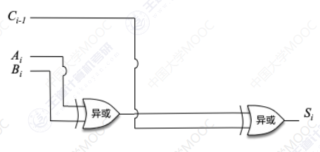
   2. $C_i$：显然$A_i、B_i、C_i$三者中至少存在$2$个$1$时才会进位，即$A_i、B_i$都是$1$，或者$A_i、B_i$中含有一个$1$且$C_i$为$1$，即$C_i=A_iB_i+(A_i \oplus B_i)C_{i-1}$。<br>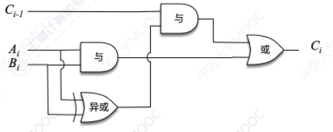
   3. 给出加法器的最终电路实现：<br>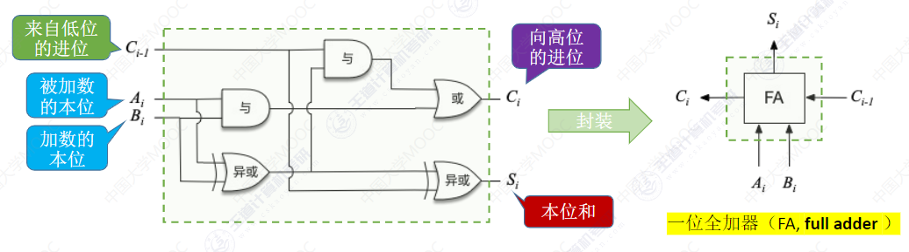
2. 实现一位全加器，那么多位全加器就是多个一位全加器串在一起即可。但是实际上这种全加器的缺点也很明显，即进位信息是串行产生的，每次计算都需要等待来自低位的进位$C_{i-1}$,这就导致位数越多，运算速度越慢。<font color=red>由于两个输入端允许并行输入$n \ bit$​，因此这种加法器属于并行加法器。但是由于进位信息是串行产生的，因此从进位方式来看，这种加法器属于串行进位加法器，故而综上所述很多教材称之为串行进位的并行加法器</font>。<br>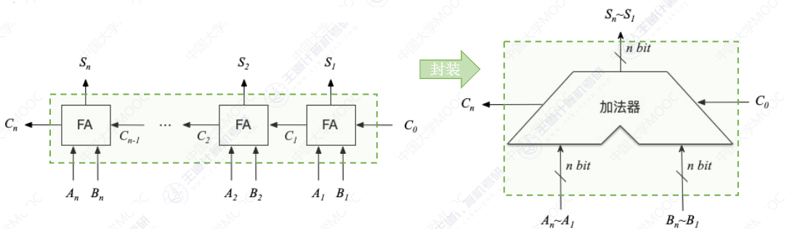
3. 实际上，$C_i$的数据$A_i、B_i$都是已知的(<font color=red>$C_i=A_iB_i+(A_i \oplus B_i)C_{i-1}$</font>)，而$C_{i-1}$可以递推求得，故而我们还可以直接在最开始的时候计算出各个位的$C_i$，这样各位的加法几乎就可以并行进行，而不用等待来自低位的进位。<font color=red>对于这种加法器，其所有的进位信息几乎都是同时产生的，我们称之为并行进位的并行加法器</font>。<br>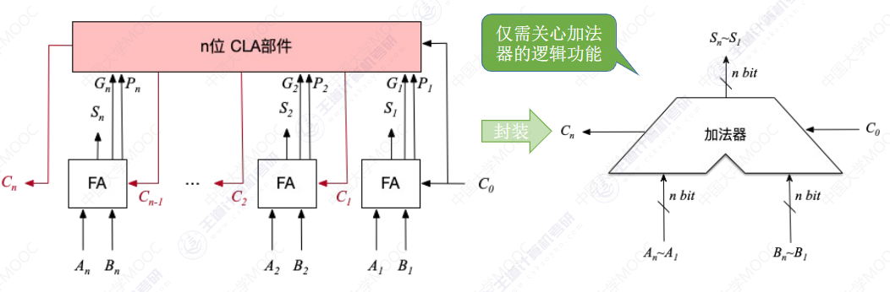
4. <span id="biaozhiwei"></span>实际上加法器还需要一些标志位，来记录是否发生溢出，计算结果的正负等信息(似乎默认状态为0，那么就很好理解SF=1表示负值)：
   1. $OF$($overflow \ flag$): 溢出标志位，用于判断带符号数进行加减法运算时是否溢出。$OF=1$溢出，$OF=0$​未溢出。
   2. $SF$($symbol \ flag$): 符号标志, 用于判断带符号数加减法运算结果的正负性。$SF=1$结果为负，$SF=0$​结果为正。
   3. $ZF$($zero \ flag$): 零标志位，判断加减法的计算结果是否为$0$。运算结果的每一位都为$0$，$ZF=1$，否则$ZF=0$​。
   4. $CF$($carry flag$): 进/借位标志位, 用于判断无符号数进行加减运算是否发生溢出。$CF=1$溢出，$CF=0$​未溢出。
   5. 实际上上述的标志位在计算结束后，会送往标志寄存器。<br>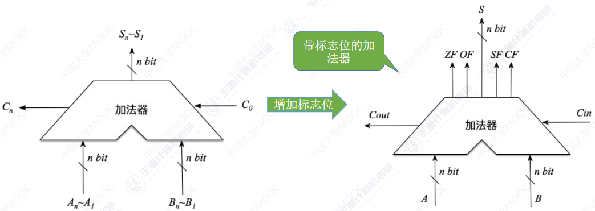


###### 三态门与多路选择器

1. 多路选择器$MUX$：在多个输入中，只允许一个输入数据通过$MUX$。
   1. 电路示意图：<br>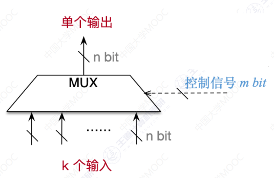
   2. 若存在$k$个输入，则一般控制信号的位数$m \geq \lceil log_2k \rceil bit$​
   3.  有的多路选择器可能会预留一个控制信号用于拦截所有的输入，此时控制信号的位数$m \geq \lceil log_2k+1 \rceil bit$
2. 三态门：根据控制型号决定是否让输入的数据通过。三态门的控制信号只需要$1 bit$，一般而言$op=1$时输入数据可以通过，$op=0$时无法通过。
   1. 电路示意图如下：<br>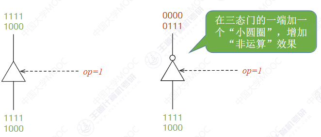
   2. 有时候还会在三态门的基础上取反，当$op=0$时，输入数据通过三态门并取反。


##### 定点数运算

###### 算数逻辑单元ALU

1. CPU由控制器和运算器组成，其中控制器负责解析指令，运算器负责对数据进行处理。而ALU是一种组合逻辑电路，实现加减乘除、与或非等功能，因此<font color=red>ALU是运算器的核心</font>，而加减乘除的运算实际上需要基于加法实现，因此<font color=red>加法器其ALU的核心</font>。
2. ALU的功能：<font color=red>若ALU支持$k$种功能，则控制信号的位数$m \geq \lceil log_2 k \rceil$</font>
   1. 算数运算：加、减、乘、除等
   2. 逻辑运算：与、或、非、异或、位移等
   3. 其他：求补码、直送等<br>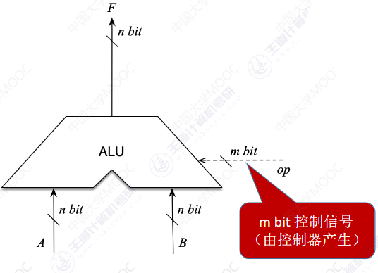
3. ALU的实现原理图(简单了解)：<br>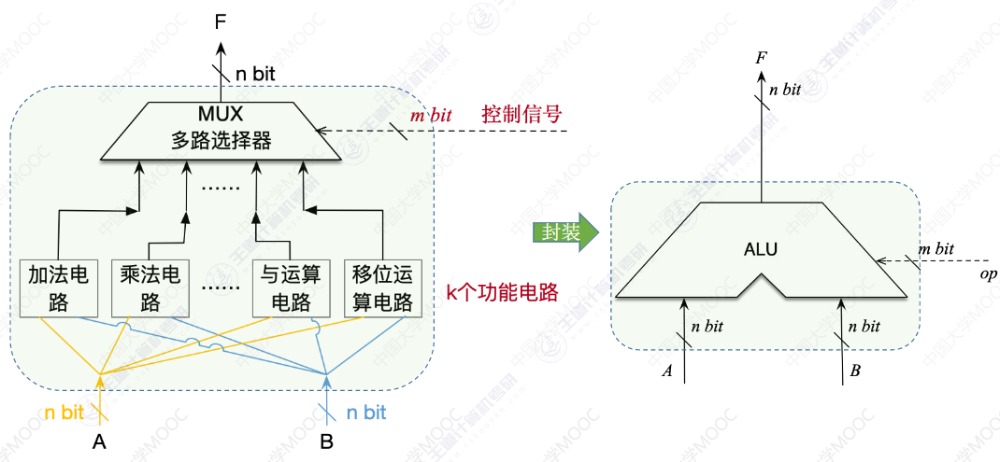
4. ALU的重点考点：$cin$是进位输入信号、$cout$是进位输出信号。
   1. <font color=red>若ALU支持$k$种功能，则控制信号的位数$m \geq \lceil log_2 k \rceil$</font>
   2. <font color=red>ALU的运算数、运算结果的位数与计算机的机器字长相同</font>
   3. <font color=red>$ZF/OF/SF/CF$标志位的信息通常会被送往$PSW$程序状态字寄存器(有的计算机系统会把PSW寄存器称之为标志寄存器$FR$)</font><br>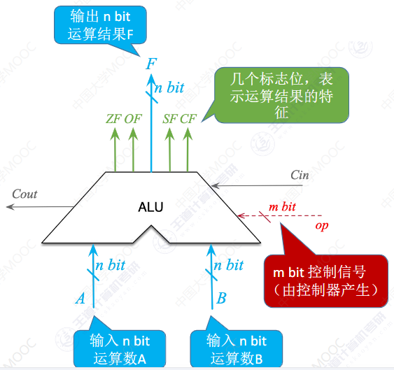


###### 位移

1. 通过改变各个数码位和小数点之间的相对位置，从而改变各个数码位的位权。可用位移运算实现乘除法,但是由于补码、反码、<font color=red>原码的位数有限，有些时候算术移位无法精准的等效乘除法</font>。
2. 原码的算数位移：保<font color=red>持符号位不变，仅对数值为进行移位</font>。
   1. 右移：高位补0，低位舍弃。若舍弃位$=0$，则相当于$/2$；若舍弃位$\not=0$,则会损失精度。
   2. 左移：低位补0，高位舍弃。若舍弃位$=0$，则相当于$*2$；若舍弃位$\not=0$,则会出现严重错误。
3. 反码的算数移位：
   1. 正数：正数的反码和原码一致，故而：
      1. 右移：高位补0，低位舍弃。
      2. 左移：低位补0，高位舍弃。
   2. 负数：负数的反码与原码相反，故而：
      1. 右移：高位补1，低位舍弃。
      2. 左移：低位补1，高位舍弃。
4. 补码的算数移位: <font color=red>(注意理解)</font>
   1. 正数：正数的补码和原码一致，故而：
      1. 右移：高位补0，低位舍弃。
      2. 左移：低位补0，高位舍弃。
   2. 负数：负数的反码与原码相比，二者前部分相反，后部分相等(前面补码部分已经分析过了<a href="#buma">here</a>)，故而：
      1. 右移(同反码)：高位补1，低位舍弃。
      2. 左移(同原码)：低位补0，高位舍弃。
5. 逻辑位移：可以将逻辑位移视作对无符号数的算数位移。
   1. 逻辑左移：高位补0，低位舍弃。
   2. 逻辑右移：低位补0，高位舍弃。
6. 循环移位：
   1. 不带进位：
      1. 循环左移：<br>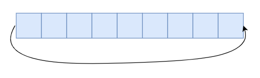
      2. 循环右移：<br>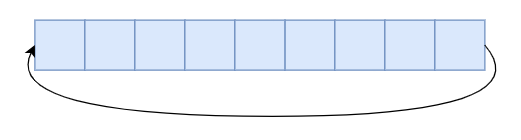
   2. 带进位:
      1. 循环左移：<br>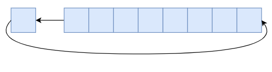
      2. 循环右移：<br>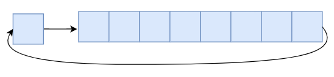


###### 有符号数加减法

1. 加法器直接对原码进行加减法可能出错，并且设计起来也比较复杂。
2. 一般对补码进行加减法运算，并使用补码加法替代补码减法。
3. 补码执行加减法时，符号位也参与运算。下面分析两种溢出情况：$A=15、B=-24,C=124$

   1. 正数+正数：可能发生上溢，此时正+正=负。例如：$[A+C]_补=0,0001111+0,1111100=1,0001011=-117$
   2. 负数+负数：可能发生下溢，此时负+负=正。例如：$[B-C]_补=1,1101000+1,0000100=0,1101100=108$​
4. 溢出判断：
   1. 方法一：采用一位符号位，设A的符号记为$A_s$,B的符号记为$B_s$,运算结果的符号记为$S_s$，则溢出的逻辑表达式为$V=A_SB_S\overline{S_s}+\overline{A_s}\overline{B_s}S_s$,其中$V=0$表示无溢出，$V=1$表示溢出。
   2. 方法二：采用一位符号位，根据数据位的进位情况判断是否溢出，记符号位的进位$S_s$,最高数值位的进位为$C_1$。分析不难知道$S_s$与$C_1$不同时存在溢出，即$V=S_s \oplus C_1$。
   3. 方法三：采用双符号位，正数符号位$00$，负数符号位$11$，具体操作如下图。<font color=red>需要注意的是：实际存储中指存储一个符号位，运算时会复制一个符号位。</font><br>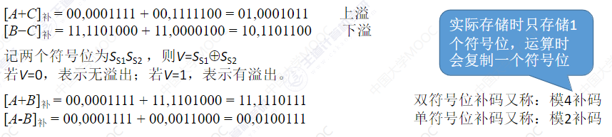


###### 无符号数加减法

1. 对于无符号数加法：直接从最低位开始，按位相加，并往更高维进位。

2. 而对于无符号减法：其实类似于有符号减法。保持被减数不变，减数全部按位取反并末尾加一，然后减法变加法即可。

3. 对于全部按位取反并末尾加一这个操作得到的数称为原数的补数，其是就是类似于有符号数的补数。对于一个$8bit$的无符号数$A$，显然有$A+[A]_{补数}+1=256(2^8)$​。

   ```tex
   A:99 ->原码:01100011
   B:9  ->原码:00001001 ->补数:11110111
   A-B=01100011 - 00001001 = 01100011 + 11110111 = 01011010=90
   ```

4. 无符号数加减法判断溢出的方式：

   1. (应试)手算判断溢出：$n \  bit$无符号整数的表示范围是$0 \  - \  (2^n-1) $。
   2. 计算机判断溢出的方式：
      1. 无符号数加法：最高位产生的进位$=1$时发生溢出，否则未溢出。
      2. 无符号数减法：减法变加法，最高位产生的进位$=0$时发生溢出，否则未溢出。<font color=red>最高位进位为0说明不足以进行取模操作，减法的计算结果比被减数还大，这里的溢出似乎不同于前面叙述的溢出</font>。


###### 加减法运算电路

1. 补码的加减法运算电路(<font color=red>实际上该电路也可用于无符号加减法运算</font>)：$sub=0$时表示是加法，多路选择器会直接对输入的Y放行，此时来自低位的进位为$cin=0$(默认情况下)。但是当$sub=1$表示减法时会对输入的$Y$进行按位取反操作，并且来自低位的进位$cin=1$(默认的情况下，但是当此时不是最低位时，似乎还是以低位的进位为主)，二者其实就共同构成了取补数或者说补码的操作。<br>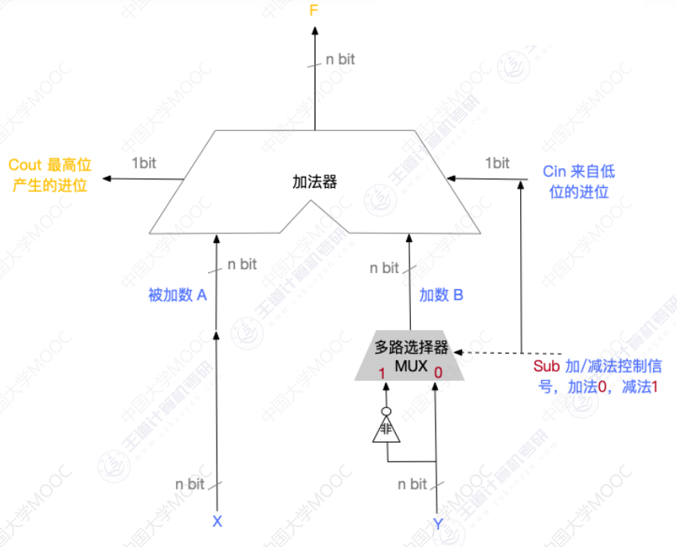
2. 关于各标志位的获取方式：<a href="#biaozhiwei">回顾</a>
   1. $OF=C_n \oplus C_{n+1}$即最高位的进位和次高位的进位进行异或。
   2. $SF=S_n$,取计算结果的最高位，即符号位。
   3. $ZF= \overline{S_n+ \cdots+S_2+S_1}$，仅仅当计算结果的所以位均不为0时，$SF=1$。
   4. $CF=C_{out} \oplus C_{in}=C_n \oplus C_0$，其实通过上述的加减法电路不难知道，其实减法时$C_{in}=1$，加法时$C_{out}=0$。


###### 原码一位乘法

1. <font color=red>原码的一位乘法本质上还是由加法+移位实现的</font>。

2. 乘法的符号由二者的符号位异或得到$X_s \oplus Y_s$。

3. 运算结果的绝对值获取：先加法再移位(<font color=red>每次右移是原码的逻辑移位</font>)，重复$n$次。其中加法的规则是(每次ACC可能加$0、[x]_原$)：若当前为$1$，则$ACC$加上被乘数，当前为为$0$，则$ACC$加上$0$。

4. 下面不妨具体演示一下：假设机器字长为$n+1=5$位(含1位符号位)，$[X]_原=1.1101,[y]_原=0.1011$，采用一位乘法求$xy$。需要回顾的是：在乘法中，$ACC$存放乘积的高位，$MQ$存放乘积的低位，$X$中存放被乘数。

   1. 初始时，将$ACC$中初始化置零，乘数、被乘数存入对应位置：<br>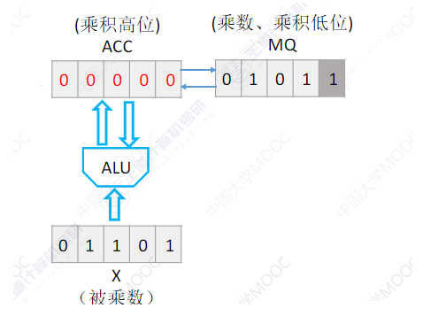

   2. 当前参与乘法的是$1$，即$MQ$的最低位，如下图置灰色的位置。故而$ACC$加上被乘数，<br>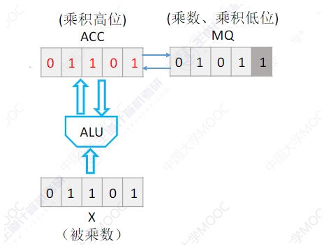

   3. 计算完毕后，$ACC$连同$MQ$左移。<br>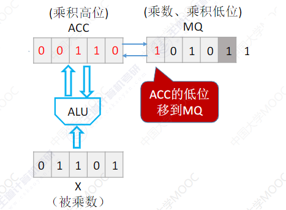

      ```tex
      	01101
      +	01011
      ----------------
      	01101
      ```

   4. 下一个参与乘法的是$1$，即$MQ$的最低位，如下图置灰色的位置。故而$ACC$​加上被乘数，<br>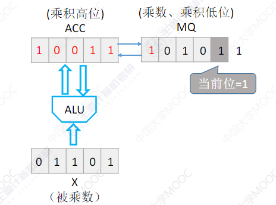

      ```tex
              01101
          +	01011
          ----------------
              01101
             01101
          ----------------
             100111
      ```

   5. 计算完毕后，$ACC$连同$MQ$左移。<br>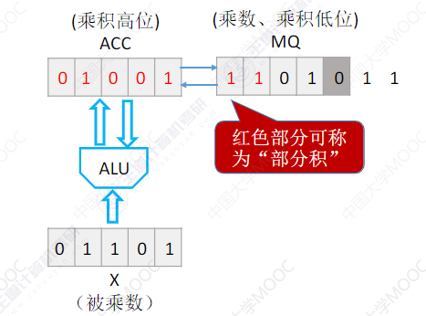

   6. 此时参与乘法运算的值变为$0$，故而$ACC$加上$0$即可。<br>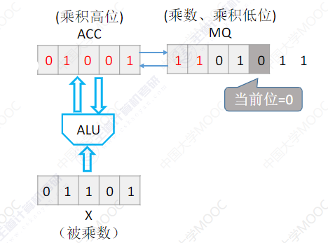

      ```tex
                  01101
              +	01011
              ----------------
                  01101
                 01101
                00000
              ----------------
                0100111
      ```

      

   7. 计算完毕，$ACC$连同$MQ$左移。<br>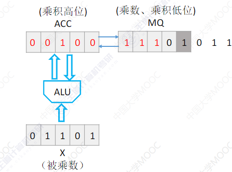

   8. 此时，然后参与乘法的数变为$1$，$ACC$加被乘数。<br>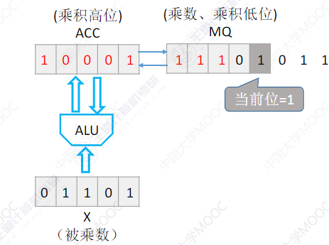

      ```tex
                      01101
                  +	01011
                  ----------------
                      01101
                     01101
                    00000
                   01101
                  ----------------
                   10001111
      ```

   9. 计算完毕，$ACC$连同$MQ$​右移。<br>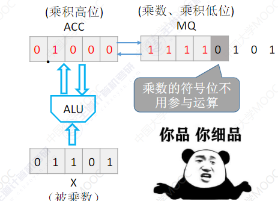

   10. 符号位不参与运算，将$X_s \oplus Y_s=1$​替换符号位。小数点的位置依情况而定(整数乘法、小数乘法各有不同)。<br>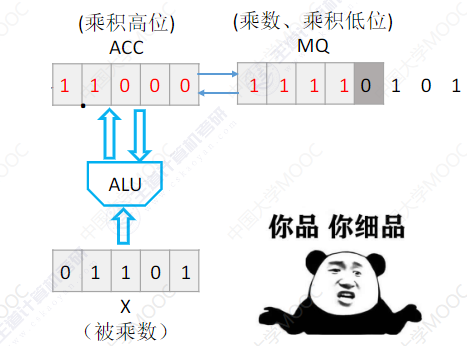


###### 补码的一位乘法(Booth算法)

1. 对于补码的一位乘暂时无法理解，待补。
2. 补码的一位乘法中，<font color=red>符号位参与运算</font>。故而需要进行$n$轮加法、移位(<font color=red>每次右移是补码的算数移位</font>)，最后还有多一次加法(针对符号位)。
3. 加法的规则($ACC$可能加$0、[x]_补、[-x]_补$​)：
   1. 辅助位-$MQ$中"最低位(除去辅助位)"$=1$时，$ACC+[x]_补$​
   2. 辅助位-$MQ$中"最低位(除去辅助位)"$=0$时，$ACC+0$
   3. 辅助位-$MQ$中"最低位(除去辅助位)"$=-1$时，$ACC+[-x]_补$
4. 不妨具体演示一下：假设机器字长为$n+1=5$位(含1位符号位)，$x=-0.1101,y=+0.1011,[X]_补=1.1101,[-x]_补=0.1011$，采用Booth算法求$xy$。
   1. 初始时$ACC$中置零，<font color=red>辅助位初始化为$0$</font>。由于符号位参与运算且$MQ$需要拓展一个辅助位，故寄存器全部拓展为$n+2$位，故而采用双符号位进行运算。<br>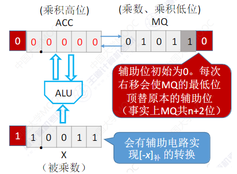
   2. 具体过程如下图所示：<br>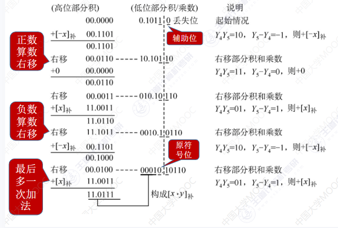


###### 原码除法

1. 恢复余数法：
   1. 符号位单独处理：$X_S \oplus Y_s$。
   2. 使用数值的绝对值进行除法计算。一般每次都默认上商$1$，如果不合适再改为$0$，然后更新余数，把余数作为被除数。$ACC$和$MQ$集体左移。
   3. 不妨具体演示一下：机器字长5位(含有一位符号位)，$x=0.1011,y=0.1101$,采用回复余数法求得$x/y$.
      1. 初始化时$ACC$中存入被除数，$MQ$中全部置零，除数放在通用寄存器中。<br>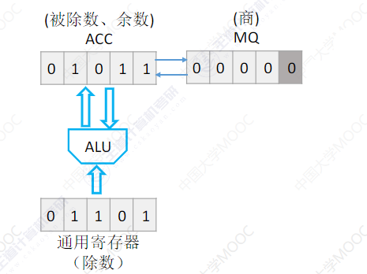
      2. 先对商上$1$,然后$ACC$中的被除数(或者说余数)就需要减去除数。<br>
      3. $ACC$减完除数后，发现$ACC$中的值变为负数，此时说明商上大。此时需要将商换为0，并回复余数。回复余数的具体操作为：$ACC$​中的被除数(或者说余数)加上除数。<br><br><br>
      4. 此时已经完成第一位商的计算，需要$ACC$连同$MQ$<font color=red>逻辑左移(原码左移默认补0)</font>，试探下一位商。<br>
      5. 同样的，先试探性上商$1$。<br>
      6. 然后$ACC$中的被除数(或者说余数)就需要减去除数，减完发现于是是一个正数，故而商上1可行。<br>
      7. 此时已经计算完第二位的上，$ACC$连同$MQ$逻辑左移。<br>
      8. 后面同样采用上述分析过程，最终得到的计算结果如下(先后上1、0)：<br>
      9. 最后还需要根据$X_S \oplus Y_s$修改符号位。<font color=red>需要说明的是，对于小数定点除法，我们规定被除数$\lt$除数，也就是第一位的商必需上0，不然计算机会认为不合理。至于为什么要满足这一点，主要是如果被除数$\geq$除数，那么商就会$\geq 1$​​,是无法用小数表示的。当然，更重要的是，根据这些分析过程，我们可以知道第一次上的商其实最终会被移动到符号位(小数点之前)(在手动修正符号位前)。</font>
      10. <font color=red>注意：显然，假设机器字长$n+1$位(含一位符号位)，那么恢复余数法需要尝试上商$n+1$次(这里不能说执行减法此时，因为期间可能会恢复余数，需要使用加法实现，并且恢复余数的次数不定)，逻辑左移$n$次，且最后一次上完商后不左移。</font>
2. 加减交替法(不恢复余数法)：
   1. 对于上面的回恢复余数的过程，我们实际上可以简化：当我们上1后，会用$ACC-除数$(记此时ACC中余数为$a$，除数为$b$)，此时发现余数为负数，则需要进行恢复余数，即ACC+余数($测试余数(a+b)$)，然后商上0，后逻辑左移(此时余数$(a+b) \times 2$)，然后下一位再次尝试上商1(此时余数$2(a+b)-b=2a+b$)。实际上不难看出，其实整个过程(包含逻辑左移)其实就等效该位商上0，将余数置为$2a+b$,然后根据计算结果判断下一位商是否可以上1。
   2. 符号位单独处理：$X_S \oplus Y_s$​。
   3. 需要着重说明的是：<font color=red>我们不妨假设机器字长为$n+1$位(含一位符号位),每一次加或者减法都会确定一位商，故而确定$n+1$位商需要执行加减法$n+1$次(当然，我们已经知道第一位的商最后会移到符号位，最终被手动修正)，同时会伴随着执行$n$次左移。需要理解的是，最后一次上商时若无法上商1，则此时必需恢复余数，会导致多一次加法，显然最后一次上商是无法使用加减交替法的"加法"恢复余数的。</font>
   4. 加减交替法过程演示：<br>
3. 注意事项：
   1. <font color=red><u>除法余数的符号和被除数的符号一致。</u>(其实通过符号位等于$X_S \oplus Y_s$以及$被除数=除数*商+余数$不难推理。)</font>
   2. <font color=red>对于余数，假设最后从ACC中读取的值为$0xxxx$($n+1=5$),则余数为$\_.xxxx * 2^n$(其中$\_$表示手动修正后的符号位),其实本质上是由于计算过程中逻辑移位$n$次造成的。</font>
   3. <font color=red>需要深刻理解计算的过程。此外$(-7)/2$的商和余数是多少？$-3、-1$。</font><font color=sky_blue>余数的符号与被除数符号一致，商的符号为被除数和除数的符号位异或的结果。</font>

###### 补码的除法

1. 补码的除法只介绍加减交替法(使用较多)。
2. 对于补码的除法原理其实与原码一样，我们每次通过比较余数和被除数的大小来确定商。对于原码的除法，我们使用绝对值计算，大小比较好比较，但是补码的比较就略显复杂(无法通过补码绝对值比较真值大小)。
   1. 当被除数和除数同号时，做减法，若得到的余数与除数同号时(其实感觉与被除数同号跟容易理解一些)，则表示够减，否则不够减。
   2. 当被除数和除数异号时，做加法，若得到的余数与除数异号(其实感觉与被除数同号跟容易理解一些)，则表示"够减"，否则表示不够减。<font color=red>但是补码除法的商应该为补码，当够减时，本来应该上商1，但是显然商($X_S \oplus Y_s$)为负值，负值的补码应该补1(至于你认为的补码和反码不是按位取反的关系，后续使用末尾置1处理)</font>。
3. 于是乎我们得出补码的加减交替法运算规则：<font color=red>首先补码的除法运算，符号位参与运算</font>。
   1. 当余数(初始时为被除数)和除数同号时，余数(初始时为被除数)减去除数，若所得余数与除数同号，则商1且余数逻辑左移一位并减去除数，否则商0且余数逻辑左移一位并加上除数。
   2. 当余数(初始时为被除数)和除数异号时，余数(初始时为被除数)加上除数，若所得余数与除数同号，则商1且余数逻辑左移一位并减去除数，否则商0且余数逻辑左移一位并加上除数。
   3. 注意每次左移为逻辑左移。
   4. <font color=red>此外我们约定商的末尾恒置$1$​。在这一点的约束下，就可以保证商出最后一位外补码为原码按位取反。</font>
4. 说明：
   1. 前面的是加是减在得到被除数和除数时就已经确定了，重点是后面的：<font color=red>若所得余数与除数同号，则商1且余数逻辑左移一位并减去除数，否则商0且余数逻辑左移一位并加上除数</font>。
   2. <font color=red>无论是原码还是补码的除法，一定需要理解每一次上商的完整流程</font>。对于补码的加减交替法，我们在上商之前会执行被除数和除数的比较过程(原码的除法都是先试商，然后加减再去验证)，此时得出商，然后根据所得的商判断下一步是恢复余数并移位进行下一位商的计算继续下一次还是移位进入下一次商的计算。例如当被除数和除数异号时，我们使被除数加上除数。此时若余数和除数异号(与被除数同号)则"够减"，由于是补码商0，<u>然后逻辑左移,计算下一位商需要加上被除数</u>(这一系列步骤其实就等效于先左移一位然后加上除数)；若是此时余数和除数同号(与被除数异号)，则不够减，商1，<u>此时需要恢复余数，即减去余数，然后逻辑左移，然后计算下一位商，加上被除数</u>(这一系列步骤其实就等效于先左移一位在减去除数)。而对于被除数与除数同号时，同理分析。
   3. 对于机器字长$n+1=5$位，我们需要上商$n+1$次，最后一次无需移位，故而移位$n$次。且由于商末位恒置1的规定，最后一次爷无需调整余数，故而不存在像原码的加减交替法一样可能会多出一次余数的计算。
5. 演示示例：设机器字长为$n+1=5$位（含1位符号位），$x=+0.1011$，$y=-0.1101$，采用原码加减交替除法求$x/y$,$[x]_补=00.1000,[y]_补=11.0101,[-y]_补=00.1011$。
   1. 演示结果如下图：<br>
   2. 对于使用双符号位的问题：在原教材中并未使用双符号位。<font color=sky_blue>具体后续再补！</font>


###### 长拓展

1. 为什么需要对数据进行长拓展？
   1. ALU的位数是固定的，运算前可能需要把短数据扩展为长数据。
   2. 主存内的各种数据长度不一，有时需要把短数据扩展为长数据。
   3. 通用寄存器位数是固定的，把数据存入寄存器时，可能需要进行长度扩展。
2. 零拓展： 适用于无符号整数，用0拓展高位。例如$0101 \to 0000,01010$
3. 符号拓展：适用于带符号整数(一般针对补码)，使用符号位拓展高位，例如$[-90]_补=0,1011010 \to 0,00000000,1011010$。


###### C语言强类型转换

<font color=red>c语言中定点数以补码的形式存储</font>。其强类型转换如下：

1. 当将有符号函转为无符号数时，数据的内容和存储方式并未改变，只是改变了数据的解释方式。
2. 当将长整数变为短整数时，会将高位截断，保留低位。
3. 当将一个短整型变为长整型时，使用的是符号拓展。<br>


###### 数据排列和存储

1. 数据的大端方式和小端方式存储：
   1. 大端模式：数据的最高有效字节(MSB)存储在内存的最低地址处，而最低有效字节(LSB)存储在内存的最高地址处。这种存储方式更符合人的阅读习惯。
   2. 小端模式：据的最低有效字节存储在内存的最低地址处，而最高有效字节存储在内存的最高地址处。这种存储方式更适合计算机处理数据，一般计算机处理数据都是从低位开始，同时计算机读取数据一般也是从第地址开始读取。<br>
2. 不妨简单提一下：现代计算机一般是按照字节编址，即每个字节对应一个地址。当然通常也支持按照字、半字、字节寻址。假设存储字长为32位，则一个字=32$bit$=4字节，那么就可以四个字节一个分组，从而实现按照字寻址($xxx \to xxx00$，可以通过逻辑左移实现字地址到首字节地址的转换);当然了，半个字就是2字节，也可以照此分组，从而实现按照半字寻址($xxxx \to xxxx0$,可以通过逻辑左移实现字地址到首字节地址的转换)。
3. 边界对齐的存储方式：对于边界对齐的方式访问一个字或者半个字都只需要一次访存，但是会有一些空间浪费。而对于边界不对齐的方式，访问一个字或者半个字可能会需要多次访存。<br>


##### 浮点数

###### 浮点数表示

1. 定点数可表示的范围有限，但是我们无法无限的增加数据的长度。
2. 浮点数类似于科学计数法，其构成如下：尾数给出一个小数，而阶码表明小数的小数点需要向前或者向后移动的位数。
   1. 阶码：通常使用补码或者移码表示的定点小数。
   2. 尾数：常用原码或者补码表示的定点小数。
   3. 浮点数的真值：$N=r^E \times M$,其中$r$表示阶码的底，通常为2，但也可以为2的整数幂，如4、8等。<br>
3. 浮点数的规格化(实际是对尾数的规格化)：
   1. 对于这样一个浮点数$0,10;0.01001$我们倘若使用8位表示会发现小数部分无法表示完整。但是实际上根据科学计数法不难知道，其实还可以表示为$0,11;0.1001$​。所谓规格化，似乎目的就是尽可能的缩短小数部分而不改变浮点数的大小。
   2. 浮点数的规格化：规定尾数的最高位数值(不含符号位)必须是一个有效值(非0)。
      1. 左规：通过尾数算数左移、阶码减1来规格化。当浮点数运算的结果为非规格化时要进行规格化处理。
      2. 右规：通过尾数算数右移，阶码加1来规格化。当浮点数运算的结果位数出现溢出(双符号位为$01$或者$10$)时，需要右规。
      3. <span id="twoSign"></span>不妨补充一下双符号位出现溢出，对于补码加减法而言：<font color=red>双符号位发生溢出时，可以挽救，高位的符号位是正确的符号位</font>。
         1. 当两个正数$00xxxxx$相加时，结果出现溢出，即符号位变为$01$，此时最高符号位是正确的符号，可以结果视为单符号数处理。
         2. 当两个负数$11xxxxx$相加时，结果出现溢出，即符号位变为$10$​,此时最高符号位是正确的付符号，可以将结果视为单符号数处理。
   3. 规格化浮点数的特点：
      1. 用原码表示的尾数进行规格化：
         1. 正数为$0.1xxx \cdots xxxx$,其最大可以表示$0.1111 \cdots111$,其最小可以表示$0.1000 \cdots 000$。其表示范围为$\frac{1}{2} \to 1-2^{-n} $。
         2. 负数为$1.1xxx \cdots 111$,其最大可以表示$1.1000 \cdots 000$，其最小可以表示$1.1111 \cdots 111$。其表示范围$-(1-2^{-n}) \to -\frac{1}{2}$。
      2. 用补码表示的尾数进行规格化：
         1. 正数为$0.1xxx \cdots xxxx$,其最大可以表示$0.1111 \cdots111$,其最小可以表示$0.1000 \cdots 000$。其表示范围为$\frac{1}{2} \to 1-2^{-n} $。
         2. <font color=red>负数为$0.0xxx \cdots xxx$,其最大可以表示$1.0111 \cdots 111$，其最小可以表示$1.0000 \cdots 000$</font>。其表示范围为$-1 \to -(\frac{1}{2}+2^{n})$。
      3. 显然通过上述分析过程很容易知道，浮点数存在表示盲区。一般而言正下溢和负上溢和零十分接近，直接当做机器0处理，而正上溢和负下溢则中断(后续)<br>
      4. 不妨举个例子：若某浮点数的阶码、尾数使用补码表示，共$4+8$位。$0.110;1.1110100$如何规格化？对于补码而言显然高位1无用，直接左规。由于尾数为负数补码形式，算数右移时高位舍弃且低位补0。即$0110;10100000$。


###### IEEEE 754标准

1. 在此之前，需要深入定义一下移码：在前面我们提到过所谓移码就是对补码的符号位取反，这并不是移码的定义。移码实际上是$移码=真值+偏置值$。对于前面我们所说的移码，其实就是偏置值为$2^{n-1}$，对于正数而言这点很容易理解，对于负数二进制数$-a$而言，首先取补码就是$2^n-a$,而符号位取反就是$2^n-a+2^{n-1}$，显然就是$-a+2^{n-1}$。而之所以在前面的移码部分，我们对偏置值取$2^{n-1}$，是因为这样得到的移码可以根据移码的二进制大小比较真值的大小。
2. 需要区分的是，在IEEE 754标准中，我们也会使用移码，但是其偏置值是$2^{n-1}-1$($n=8$时其值为127)。
   1. 对于$-127$而言其补码为$1000,0001$($ps$:$1000,0000$表示-128),故而其移码为补码的符号位取反后减一，即$0000,0000$。
   2. 对于$-128$而言，移码=$(-128+127)\%2^8=-1%2^8=255$也就是$1111,1111$。
   3. 上述的两个移码在IEEE 754中非常特别。此外也可以将真值和偏置值全部转换为原码后计算，但是比较麻烦。
3. <font color=sky_blue>(重点)</font>IEEE 754标准：
   1. <font color=red>阶码使用移码表示(偏置值为$2^{n-1}-1$)，数符表示浮点数的正负，尾数部分用原码表示且默认隐藏最高位的有效位1(尾数为$1.M$</font>，这里可能会认为不符合规格化。实际上这里隐含的1就是最高数值位且有效，完全符合规格化。实际上这里的尾数不是我们理解的原码，因为已经使用数符表示浮点数的符号，故而尾数部分的符号位失去作用，作为数值位的最高位。)<br>
   2. 各精度的浮点型规格如下：<br>
4. 不妨具体演示一下：
   1. 将十进制的$-0.75$转换为IEEE 754标准的单精度浮点数。首先$(-0.75)_{10}=(-0.11)_2$(从这一步没有直接化为带符号原码就可以看出，阶码尾数使用的原码应该是无符号的)，故而我们可以确定数符为1。而$0.11=1.1 \times 2^{-1}$,由于单精度浮点型尾数长23，故而尾数部分为$.1000\cdots$(22个0)，阶码真值为$-1$，换算为移码为$-1+127=126=(0111,1110)_2$,故而阶码为$0111,1110$。也即是单精度浮点数为$1;0111,1110;1000\cdots$​。
   2. IEEE 754标准下的单精度浮点型$C0 \ A0 \ 00 \ 00 \  H$的真值是：首先$(C0 \ A0 \ 00 \ H)_{16}=(1100,0000 \ 1010,0000 \ 0000,0000 \ 0000,0000)$(H时是十六进制的标识)=<font color=red>1</font><font color=sky_blue>100,00001</font><font color=orange>010,0000,0000,0000,0000,0000</font>,显然数符为1表示为负数。阶码$1000,0001$的真值为$0000,0010=2$,而尾数为$1.01$。故而浮点数的真值为$-1.01\times 2^2=-101=-5$。
5. 前面提到过，对于阶码全1($-128$的移码$-128+127=-1\%256=255=(1111,1111)_2$)或者全0($-127$的移码为$0000,0000$)的用作特殊用途：
   1. 当阶码$E$全为0时：
      1. 若尾数$M$不全为0，表示非规格化小数$\pm (0.xxx \cdots x)_2 \times 2^{-126}$​,此时尾数的最高位隐含0。
      2. 若尾数$M$全为0，表示真值$\pm 0$。
   2. 当阶码$E$全为1时：
      1. 若尾数$M$不全为0，则表示非数值$NAN(not \ a \ number)$，$0/0、\infty.\infty $等非法运算的结果就是$NAN$。
      2. 若尾数$M$全为0，则表示无穷大$\pm \infty$。
   3. 只有当阶码的真值不为上述两种情况的时候，浮点数的真值才是之前的计算方法。
6. IEEE 754标准下的单精度浮点数所能表示的最小绝对值和最大绝对值。
   1. 最小绝对值：阶码真值最小为$-126$(对应的移码为$0000,0001$),尾数全为0，此时对与的浮点数的真值为$(1.0)_2 \times 2^(-126)$(可正可负)。
   2. 最大绝对值：阶码真值最大为$127$(对应的移码为$1111,1101$),尾数全为1，此时与之对应的浮点数的真值为$(2-2^{-23}) \times 2^{127}$(可正可负)(<font color=red>注意是-23,隐含的1不包含在尾数长度23中</font>)。
   3. 对于双精度或者临时浮点型也按照同样的思路推理。
7. 小结：<br>
8. 我该如何赋予我存在的意义？？？<font color=white>人生天地间，忽如远行客。</font>


###### 浮点数的加减法运算

1. 浮点数加减法的一般步骤：
   1. 转换格式：将浮点数转换为符合题目要求的格式。
   2. 对阶：一般是小阶向大阶看齐(避免尾数过大)。同时对阶的过程中可能需要舍去造成精度损失。
   3. 尾数加减：尾数计算后可能会导致溢出，如果采用双符号位是可以补救的。
   4. 规格化：对计算结果进行规格化或者对双符号溢出进行处理。
   5. 舍入：
      1. <font color=red>$0$舍$1$​​入法，若进1可能导致需要再次规格化</font>。
      2. <font color=red>恒置$1$法</font>。
   6. 判溢出：实际上主要是判断阶码是否溢出。尾数的溢出通常可以采用双符号位补救和规格化补救。但是阶数的溢出则会产生严重问题。<br>

2. 事实上丢弃末位可能就会存在舍入问题。在对阶、尾数加减中都可能出现。此外在某些计算机中可能会把浮点数的尾数部分单独拆分出去计算(期间可能会长拓展$24 \ bit \to 32 \ bit$),计算完后又会舍入($32 \ bit \to 24 \ bit$)拼接回浮点数中，此时也可能需要舍入。

3. 回顾一下：两位符号位溢出的补救措施 <a href="#twoSign">跳转</a>。

4. 不妨具体举一个例子说明一下：已知十进制数$X=-5/256$和$Y=+59/1024$，按照机器补码浮点数的运算规则计算$X-Y$，结果用二进制表示，浮点数的格式为：阶符取2位，阶码取3位，数符取2位，尾数取9位。
   1. 格式转换：按照题目要求，阶码和尾数需要使用补码表示，且使用两位符号位。$(-5/256)D=(-101/2^{-8})B=(-0.101 \times 2^{-5})=(11.011 \times 2^{11,011})_补$，故而$X$的浮点数为$11,011;11,0 \ 1100 \ 0000$。同理不难求出$(+59/1024)D=(111011 \times 2^{-10})B=(0.111011 \times 2^{-4})=(0,111011 \times 2^{11,100})_补$，故而$Y$的浮点数为$11,100;00,1 \ 1101 \ 1000$。
   2. 对阶：$X_阶-Y_阶= \Delta阶=11,011+00,100=11,111=(-1) \lt 0$,故而$X$的阶码更小，小阶向大阶看齐。对$X$进行右规，阶码加1，尾数算数右移得到$11,110;11,10 \ 1100 \ 0000$​(<font color=red>此处由于舍掉末尾0，没有精度损失</font>。)
   3. 尾数相加减：$X_尾-Y_尾=11,10 \ 1100 \ 0000+ 11,0001 \ 0100 \ 0=10,1 \ 1000 \ 1000$。
   4. 规格化：此时显然尾数计算的过程中发生溢出，参考双符号溢出补救措施，我们对计算结果进行右规，阶码加1，即得到$11,101;11,0 \ 1100 \ 0100$。
   5. 舍入：在上述规格化过程中，舍弃末尾0，无精度损失，无需舍入。但是若是尾数计算的结果为$10,1 \ 1000 \ 1001$,那么规格化后的尾数$11,0 \ 1100 \ 0100(1)$舍去末尾1会造成精度损失，此时则需要进行舍入。一般存在下面两种规则：
      1. <font color=red>$0$舍$1$入法</font>：类似于四舍五入，<font color=red>需要注意的是若进1可能导致需要再次规格化</font>，。由于上述末尾丢掉1，故而根据0舍1入，需要进1，则舍入后的尾数为$11,0 \ 1100 \ 0101$。
      2. <font color=red>恒置$1$法</font>：无论末位丢掉0还是1，都将舍弃后的新末位置1。由于上述末尾丢掉1，在新末位置1得到舍入后的尾数为$11,0 \ 1100 \ 0101$。

   6. 判溢出：由于规格化后的阶码未溢出，故而不存在溢出。

5. 强类型转换：

   1. 一般不同机器中的类型长度如下图所示：<br>
   2. $char \to int \to long \to double$类型的转换以及$float \to double$的类型转换都是没有精度损失的。当然需要说明的是$long->double$无精度损失是在32位机器中，因为$64$位长度的$float$类型中尾数部分长度为52+1位，而64位机器中的$long$类型长度为64，显然转换过程中会存在精度损失。
   3. 对于$int$类型和$float$类型的相互转换，C语言中采用补码存储数据。$int$的表示范围为$-2^{31} \to 2^{31}-1$，$float$类型的表示范围在$\pm[2^{-126} \to 2^{127} \times(2-2^{-23})]$,这点前面已经分析过。显然：
      1. $int \to float$：可能会损失精度。
      2. $float \to int$：可能会溢出($float$表示的范围更大)及损失精度(小数转整型时，小数点后会被截断造成精度损失)。

   