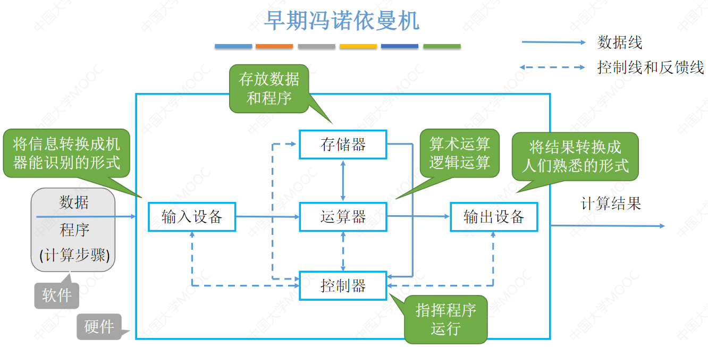
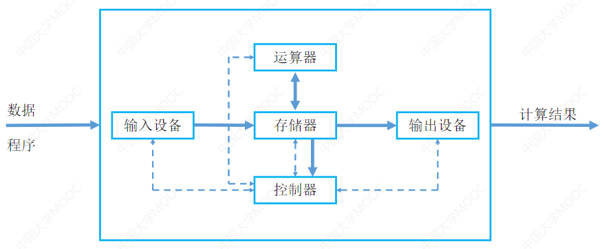
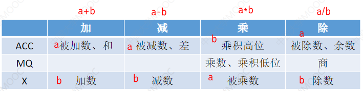

> 1. :warning:本笔记仅作为对王道课本的补充说明。
> 2. 高电平与低电平
>    1. 高电平：一般表示二进制的 $1$
>    2. 低电平：一般表示二进制的 $0$

###### 冯诺依曼体系

1. 结构示意图如下： 
2. 早期的冯诺依曼结构中以存储器作为中心，而在如今的计算机中则是以存储器作为核心。如下为现代计算机的结构： 
3. 冯诺依曼结构中，指令和数据以同等的地位存放在存储器中。而实际上还存在一种哈弗结构，将指令和数据分开存储。
4. 冯诺依曼体系的基本工作方式是：控制流驱动的方式。
   1. 控制流驱动：指令控制数据(按照指令的执行序列，依次读取指令，根据指令所含的控制信息调用数据信息)，执行指令即可进行相关操作，著名的冯诺依曼机就是这种模式。
   2. 数据流驱动: 是只要一条或一组指令所 要求的操作数全部准备就绪，就可立即激发相应的 指令或指令组执行。执行结果的输出将送往等待这数据的下一条或下一组指令。
   3. 多指令多数据流：使用多个控制器来异步地控制多个处理器，能实现作业、任务、指令、数组各级全面并行的多机系统。例如：多处理机。

5. CPU=运算器+控制器

###### 现代计算机的结构

1. 我们给出如下形式的=现代计算机结构： 
2. 从上图不难看出：
   1. 存储器主要包含主存(内存)和辅存(外存)，但是实际上主机只包含主存，而辅存是视作I/O设备的。
   2. 对于我们常用的APP实际上是存储在外存中，在使用时被调入主存运行。
   3. CPU主要是由运算器和控制器组成。

###### 字和字节

1.  位：bit(有时简写为b)是最基本的概念，每一个逻辑0或者1便是一个位，是计算机中最基本的单位。
2. 字节：Byte(也有时简写为B)是由八个位组成的一个单元，也就是8个bit组成1个Byte。
3. 字：Word代表计算机处理指令或数据的二进制数位数，是计算机进行数据存储和数据处理的运算的单位。对于32位计算机与64位计算机，字的大小往往不同。32位计算机：1字=32位=4字节，64位计算机：1字=64位=8字节。
4. 一字节=8位($1B=8b$或者$1Byte=8bit$)

###### 对于取数据的过程分析

1. 先补充不同运算中，运算器的寄存器用途： 

   

2. 我们假设执行一条取数指令，将数据运送至$ACC$，其大致的执行步骤如下：

   1. 取指令：即将PC(控制器中的程序计数器)中的指令地址输送到MAR(存储器中的地址寄存器)中，存储器根据CPU的读/写控制信号知道为读操作，从MAR中的地址所在位置读取出指令，存放在MDR(存储器的数据寄存器)中，后将MDR中的数据传送到IR(控制器中的指令寄存器)。
   2. 分析指令(一般似乎认为该操作有IR完成)：控制器根据IR(指令寄存器)中的操作码，发现为取数指令，生成读控制信号到控制总线。
   3. 执行指令：将IR中的地址码输送到MAR中，存储器根据读控制型号，读取MAR中指定地址的位置得到数据，并将数据送至MDR，然后MDR中的数据又被送到ACC中。
   4. 实际上需要补充说明的是，在第一步取指令中，读取到PC中的指令地址后，PC会自动执行$(PC)+1→PC$变为下一条指令的地址。其中$(PC)$表示PC寄存器存储的值，$→PC$表示存储到PC寄存器中。

3. 注意：对于存储器中的$MAR$和$MDR$的位数分别对应的什么一定需要熟悉。

###### 微指令、微命令、微操作

1. [微命令 微指令 微操作 微程序](https://blog.csdn.net/Aloneingchild/article/details/108182060)
2. 制部件通过控制线向执行部件发出各种控制命令，通常这种控制命令叫做微命令，是最小单位，组成微指令。
3. 在机器的一个CPU周期中，一组实现一定操作功能的微命令的组合，构成一条微指令。
4. 事实上一条机器指令的功能是由许多条微指令组成的序列来实现的,这个微指令序列通常叫做微程序。
5. 微操作：指令执行时必须完成的基本操作。例如:$PC→AR，PC+1→ PC，RAM→IR$。
6. 一个微操作对应一条微指令，一条微指令可能有多个微命令。
7. 微操作是动作，微指令是个编码。微操作是微命令作用在硬件上的一个动作。
8. 一条机器指令是由多个微指令组成的,这多个微指令序列又称作微程序。一条微指令是由多个 微命令组成的。 微命令又称作控制信号， 微命令序列即控制信号序列。

###### 补充说明

1. 计算机体系结构和计算机组成结构：指令有无是体系结构问题，指令的具体实现是组成问题。具体见$P_{24}$。

2. 计算机涉及容量、文件大小的单位：

   1. $K=2^{10}$(一般用大写的$K$)
   2. $M=2^{20}$
   3. $G=2^{30}$
   4. $T=2^{40}$

3. 计算机涉及速率、频率大小的单位：以$10^3$倍增长

   1. $k=10^{3}$(一般用小写的$k$)
   2. $M=10^{6}$
   3. $G=10^{9}$​
   4. $T=10^{12}$
   5. $P=10^{15}$
   6. $E=10^{18}$
   7. $Z=10^{21}$

4. 主频高的CPU(A)一定比主频低的CPU(B)快吗？不一定，例如A的主频高但是CPI大,即一条指令执行所需的时钟周期数大。

5. 在上一问的基础上，若两CPU的平均CPI相同，A一定快吗？还是不一定，例如A中不含乘法指令，若执行乘法操作则只能通过多次累加操作实现，但是B支持乘法操作。

6. 基准程序执行越快说明机器的性能越好？基准程序中的语句存在频度差异，运行结果也不能完全说明问题。例如一个主要此时显卡的基准程序(大量图像处理语句)测试一个机器(显卡不咋地，但是其他功能很nice)。

7. 系列机：由于不同机种推出时间不同，在机构和性能上有所差异，只能做到向下兼容,注意不是向上兼容。个人理解为：由于功能上越来越丰富，所以可能出现未来机器的指令比过去多，这无可厚非，但是需要保证过去机器的指令在未来机器上要有，不然过去的一些用到相关指令的程序将无法在将来机器上运行。
   1. 向上兼容(向前兼容)：上即未来，向未来兼容。即现在设计的软件要考虑未来还能不能用。
   2. 向下兼容(向后兼容)：下即过去，向过去兼容。设计的软件要考虑旧版本的数据还能不能用。
   3. 此处的上下其实可以理解为时间线，新的系统后出现，时间较晚，位于时间轴的上方位置。

8. 相连存储器：可以按照地址寻址也可以按照内容寻址，后续学习会接触到。

9. 地址译码器：就是把输入的二进制数地址，指向相应的物理空间，这实际上就是一个转换或者翻译的过程。显然不难知道地址译码器是存在于主存储器中的。

10. 存取速度：寄存器>cache>主存。

11. 编译程序编译时间较长，但是运行起来快。解释程序运行较慢。

12. 低级语言的执行效率一般比高级语言要快，看c和python就明显，直接调用底层的往往会快些。

13. 硬件实现的功能一般比软件实现的具有更高的执行效率。

14. 汇编语言是使用一些英文单词或其缩写代替二进制指令代码，因此汇编指令和机器指令一一对应，功能相同(这点从汇编语言编译为机器语言也不难看出)。

15. 磁盘(如硬盘驱动器HDD和固态驱动器SSD)被用来永久性存放数据和程序。与RAM(随机存取内存)不同，磁盘在断电后数据不会丢失，因此适合长期存储。磁盘的存储原理与类型不同，但基本功能是保持数据安全，即使在没有电力供应的情况下也能保持数据不变。

16. 计算机的指令集的实现：需要知道指令集并不同于我们再高级语言中理解的库，指令集是通过硬件实现的而非软件。处理器的硬件设计包括用于实现指令集的逻辑电路。这些电路在硅片上物理实现，处理器的每个指令通过这些电路解码和执行。

> :warning:以下内容来自chatgpt：
>
> 1. 关于机器字长与存储字长仍存在稍许疑惑,不妨通过一个加法的执行过程来体会二者的区别和联系：当机器字长(一般等于ALU的位数)不等于存储字长的情况下，从主存储器读取数据并进行加法操作需要一些额外的步骤来确保正确处理数据。下面是这个过程的一般步骤：
>    1. 读取数据：由于存储字长不等于ALU的位数，CPU需要分别读取位于内存中的两个数据。这通常涉及到对内存的多次访问。例如，如果存储字长是16位而机器字长是32位，那么每个32位的数据需要从内存中读取两次16位数据。
>    2. 数据对齐：读取的数据需要根据其在ALU中的处理方式进行对齐。对于上面的例子，两个16位的数据片段需要组合成一个32位的整数。这通常涉及到移位操作和可能的掩码操作，以确保数据片段正确地组合在一起。例如，先将第一个16位数据读入，然后将其左移16位，再将第二个16位数据与之按位或操作。
>    3. 执行加法操作：一旦两个数据都被转换为ALU可以处理的格式，就可以将它们送入ALU进行加法操作。ALU将执行32位的加法，并生成结果。
>    4. 结果处理：加法的结果可以直接使用，也可能需要根据程序的需要进行进一步的处理或存储。
>    5. 写回结果：如果需要，计算结果将被写回到内存中。这可能涉及到将一个较大的数据类型拆分成几个较小的存储单元，以适应存储字长。
> 2. 当我们提到“更快的处理器”，这通常涉及到几个关键方面，包括但不限于以下几点：
>
>    1. 更高的时钟速度：时钟速度（或时钟频率）是指处理器的操作频率，通常以赫兹（Hz）表示。更高的时钟速度意味着处理器每秒可以执行更多的指令周期，从而提高了处理速度。
>
>    2. 更多的核心数量：现代处理器可能包含多个处理核心，每个核心可以独立执行任务。多核处理器可以同时处理多个任务或多线程，这显著提高了多任务处理和并行计算的能力。
>
>    3. 更高的IPC（每周期指令数）：IPC是衡量每个时钟周期内处理器能执行的指令数量的指标。IPC更高的处理器可以更高效地执行指令，即使时钟速度相同或较低也可能比其他处理器更快。
>
>    4. 更先进的制程技术：处理器的制造工艺也会影响其性能。更小的制程技术（例如，7纳米或5纳米技术）允许在更小的空间内集成更多的晶体管，提高了能效，同时可以减少发热和功耗，允许更高的时钟速度。
>
>    5. 更好的缓存架构：处理器内的缓存是高速存储区域，用来临时存储来自主内存的数据和指令，以减少访问延迟。更大或更有效的缓存可以显著提高处理器性能，尤其是在数据密集型任务中。
>
>    6. 优化的指令集：指令集的设计和优化也极大影响处理器性能。包括添加新的指令来加速特定类型的计算，或优化现有指令的执行效率。
>
>    7. 更好的能源管理和热管理技术：能源和热效率的提高可以允许处理器在更高的性能水平上运行而不会过热或消耗过多的电能。这也使得处理器可以在高性能模式下运行更长时间。