> 仅对王道辅导书内容进行补充说明！

##### 存储器概述

1. CPU可以直接读取Cache和主存中的数据。

2. 对于任意一种存储器，在读/写操作之后都需要有一段恢复内部状态的复原时间。(这点在后续的多模块存储器中尤为重要)

3. CD-ROM就是CD光盘，属于只读存储器。

4. 快表属于相联存储器，可以通过内容检索到存储位置进行存访。

5. 其他见课本$P_{80}$。

   

##### 主存储器

###### 基本半导体原件及原理

1. 主存的构成： 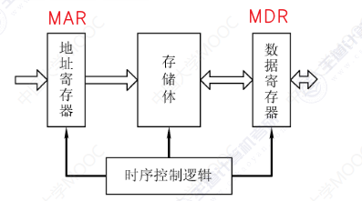
2. 存储元的示意图如下：其中MOS管可以认为是一种控制开关，当输入电压达到某个阀值值时,MOS管就可以接通。此时若在电容这边加压就会导致电容充电。此后若再次对MOS管加压，但是不对电容加压，此时电容放电，此时若察觉到电流，我们就认为读到了1，反之认为读到了0。 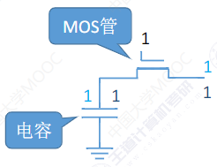
3. 多个存储元将其MOS管串到一起就得到了一个每次可以读写$n \ bit$​的存储单元。而多个存储单元就组成了存储体。当我们对MOS管加压时，各个存储元电路连通，此时就可以通过多条数据线实现多位读写操作。 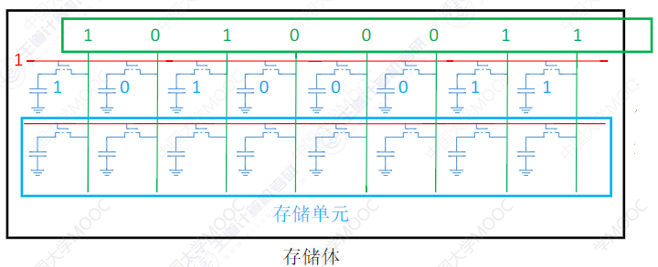
4. 实际上这就是存储芯片的大致电路构成。而这里的译码器其实就是根据地址总线给出的地址选择对应的字选线添加高电平。 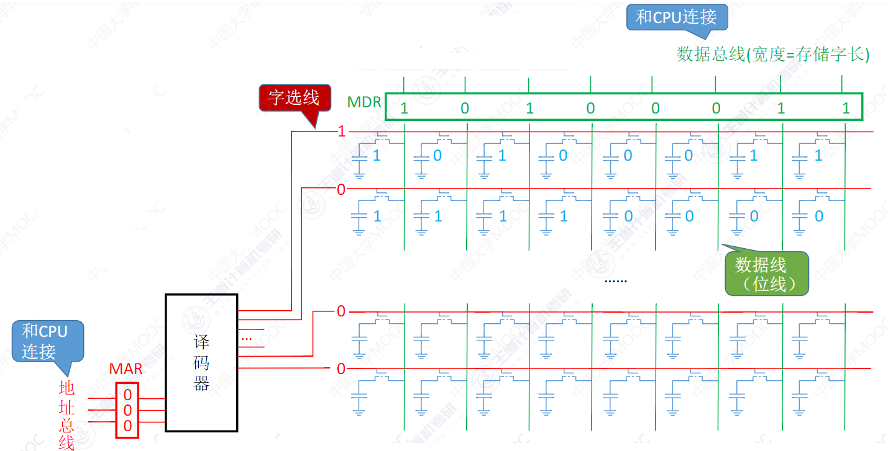
5. 但是实际上上述的存储芯片的结构仍不太完善：
   1. 由于电信号的不稳定，我们需要等到MAR中的地址电信号稳定后完全后读取、$MDR$中数据稳定后写入。于是就需要增加一个控制电路。当CPU通过读控制线告诉控制电路为读取操作时，待$MAR$中地址信号稳定后，控制电路控制$MAR$的数据传输到译码器后开始读取并,待读取稳定后控制$MDR$输出。当CPU通过写控制线告诉控制电路为写操作时，待$MDR$中数据信号稳定后，控制电路控制$MDR$的数据传输到存储体中进行写操作。
   2. 此外，主存中的存储体可能由多个存储芯片字拓展而成，此时需要区分对那一块芯片进行读写，于是需要对芯片增加片选线。
   3. 实际上在移码器后面还有一个驱动器用于信号增强。
   4. 一般而言片选信号使用$\overline{CS}$或者$\overline{CE}$，其中$\overline{ }$表示低电平有效。读写控制线一般有两根线，其中$\overline{WE}$(低电平有效)表示允许写，$\overline{OE}$(低电平有效)表示允许读；有时也可能出现使用一根读写控制线$\overline{WE}$或者$\overline{WR}$​​表示低电平读高电平写。 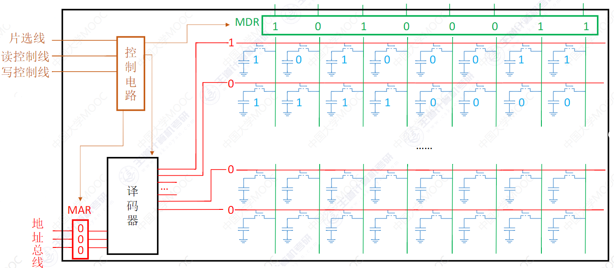
6. 关于存储芯片的金属引脚问题需要考虑：片选线、地址线、数据线、读写控制线(一根还是两根)。此外其实还有供电引脚、接地引脚。
7. 对于一块存储芯片而言，地址线的数量决定了其芯片内存储单元的个数。例如$n$位地址就会有$2^n$个存储单元。而总容量=存储单元个数$\times$存储字长。故而对于芯片有一些常见描述，例如$8 \times 8$位芯片指的就是存在8个存储单元，而存储字长为8；而$64k \times16$是指存在$64k=2^{16}$​个存储单元，而存储字长为16。
8. 关于按字节寻址、按字寻址、按半字寻址在第二章已经提到过。现代计算机一般是按照字节编址，即每个字节对应一个地址。当然通常也支持按照字、半字、字节寻址。假设存储字长为32位，则一个字=32$bit$=4字节，那么就可以四个字节一个分组，从而实现按照字寻址($xxx \to xxx00$，可以通过逻辑左移实现字地址到首字节地址的转换);当然了，半个字就是2字节，也可以照此分组，从而实现按照半字寻址($xxxx \to xxxx0$​,可以通过逻辑左移实现字地址到首字节地址的转换)。

###### SRAM和DRAM

1. 主存使用$DRAM$,Cache使用$SRAM$。$DRAM$和$SRAM$都属于$RAM$，是易失性存储器，断电后信息消失。
2. 静态随机存储器$SRAM$的存储元使用的是双稳态触发器(六晶体$MOS$​​)来记忆信息。
   1. MOS管接通后，若电容放电，数据线产生电流则读出1，若数据线无电流产生则读出0。 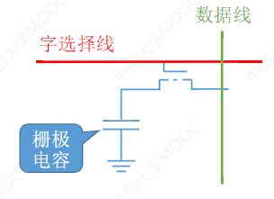
   2. 电容放电后信息就被破坏，读出后需要重写操作；此外写过程中需要对电容充电。
   3. 电路简单，存储元制造成本低，集成度高，功耗低。
3. 动态随机存储寄存器$DRAM$​使用存储元电路上的栅极电容上的电荷来存储信息。
   1. A端高电平B端低电平时认为读出1，A端低电平B端高电平时认为读出0。 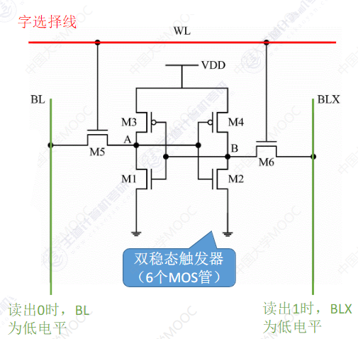
   2. 读出数据后，触发器状态保持稳定，是非破坏性读出，无需重写($SRAM$比$DRAM$​读写速度更快，无需重写，无需对电容充电)。
   3. 每个存储元制造成本跟高，集成度低，功耗大。
4. 二者比较： 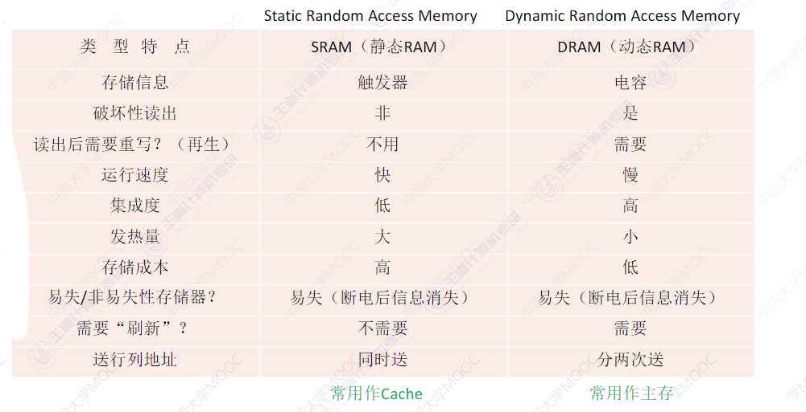
5. 实际上由于$DRAM$采用栅极电容上的电荷存储信息，但是电容上的电荷一般只能维持$1 \to 2 \ ms$，就算不断电，信息也会自动消失。因此$2 \ ms$之内必需刷新(即给电容充电)。而对于双稳态触发器而言，只要不断电，触发器的状态就不会发生改变，无需刷新操作。
   1. 刷新周期一般取$2 \ ms$，以行位单位刷新，刷新由存储芯片内部进行，，不需要CPU控制。
   2. 集中刷新、分散刷新、异步刷新：课本。 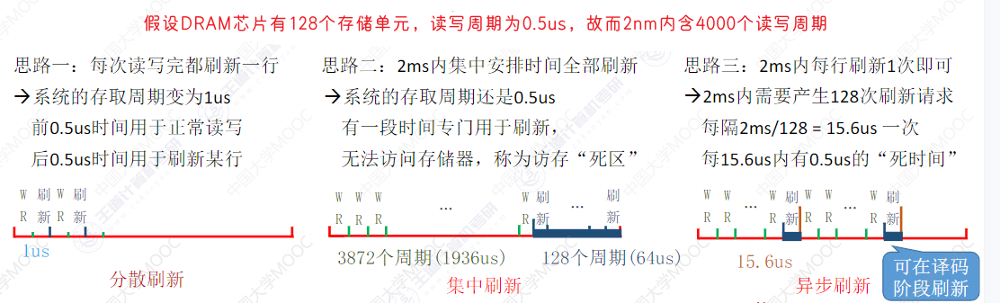
6. $DRAM$​的地址线复用技术：
   1. 双译码法：双译码法通过将地址译码分为两级（行译码和列译码），有效解决了单级译码在大容量存储器中的复杂度、功耗和延迟问题。当存储芯片的存储单元数量太多时，若采用单译码法为每一个存储单元分配一个选通线(与译码器相连接控制MOS管的线)，会造成电路选通线过多，此时若采用双译码法可以有效减少选通线的数量。例如一个$n \times 8$位的$DRNM$存储芯片，使用单译码法需要$2^n$条选通线，而使用双译码法只需要行选通线和列选通线(姑且如此称呼)各$2^{\frac{n}{2}}$根，即共$2^{\frac{n}{2}+1}$根。 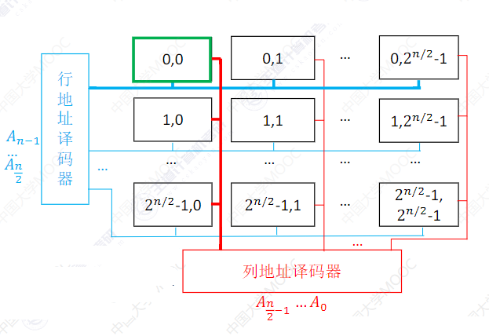
   2. 对于$DRAM$存储容量一般较大，故而$DRAM$采用双译码法，并且还对此进行地址复用技术。即对于原本的$n$位地址线缩减为$\frac{n}{2}$根，并且让行地址和列地址分次送达。当然，这期间需要使用寄存器将地址先暂存起来。 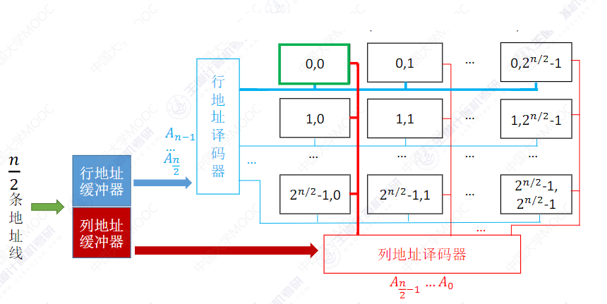
   3. 地址线复用技术使得地址线减半、存储芯片引脚更少(地址引脚减半)。
7. 目前的主存其实主要采用$SDRAM$而不是$DRAM$。具体介绍见复习书$P_{86}$​。

###### ROM

1. 不同于RAM，ROM属于非易失存储器，断电后数据不会丢失。
2. 基础内容参考课本的$P_{88}$。
3. $EPROM $虽然可以多次改写，但是仍然不能取代RAM，其编程次数有限，且写入时间过长。
4. $Flash$闪速存储器属于ROM，写前需要擦除，故而写一般比读慢，比如U盘、SD卡等。并且$Flash$的每个存储元只用单个MOS管，位密度比RAM高。
5. $SSD$固态硬盘(可多次快速擦除重写)：与闪存的核心区别在于控制单元不一样，见课本。(手机辅存也使用$Flash$芯片，但是比$SSD$​使用的芯片集成度高、功耗低、价格贵)
6. 由于ROM的断电信息不丢失，电脑主板上的$BIOS$芯片就是$ROM$类型。计算机的操作系统是安装在辅存中的，而主板上的$BIOS$芯片存储了"自动装入程序",负责引导装入操作系统(开机)。此外，由于CPU是到主存中取指令并执行，显然$BIOS$芯片(ROM)应当存在于主存中，故而主存由$RAM+ROM$构成，且二者一般统一编址。

###### 多模块存储器

1. 双端口$ROM$​(408考点已经删除)：双端口ROM主要用于优化多核CPU访问一根内存条的速度问题。使用双端口需要有两组完全独立的数据线、地址线、控制线。CPU、RAM中也要有更复杂的控制电路。
   1. 对于两个端口允许同时对不同地址单元存取数据、同时对同一地址单元读出数据。但是不允许同时对同一个地址单元写入数据，也不允许对同一个地址单元一写一读，这两种状况都会出现错误。对此我们可以设置一个置“忙”信号，设置为0，由判断逻辑决定暂时关闭一个端口(即被延时)，未被关闭的端口正常访问，被关闭的端口延迟一个很短的时间后再访问。
   2. 结构示意如下： 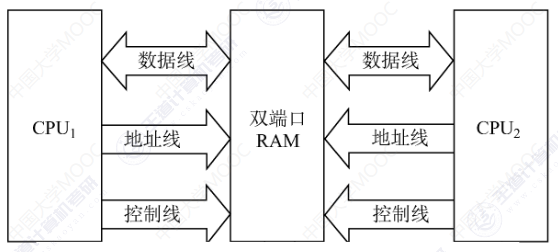
2. 多体并行存储器：利用多个结构完全相同的存储模块的并行工作来提供存储器的吞吐率。分为高位交叉编制多体存储器和低位交叉编址的多体存储器。
   1. 高位交叉编址：高位地址表示模块号，地位地址表示模块内地址。模块内地址是连续的
   2. 低位交叉编址：低地址为模块号，高地址表示模块内地址。模块间地址是连续的
   3. 具体示意图如下： 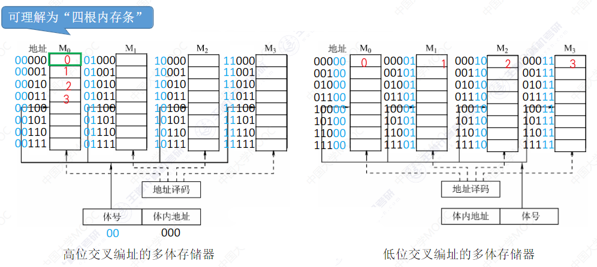
   4. 对于这两种方式访问连续地址时：我们假设每个存储体的存取周期为$T$,存取时间为$r$，若$T=4r$
      1. 高位交叉编址：先在一个模块内访问，等到该模块访问完转到下一个模块(故仍是顺序存储)。但是由于存储体在每次读写后需要一段恢复期。故访问连续的$00000 \to 00100$需要花费$5T$(实际上是$4T+r$就读取完，算上了后面的恢复时间$T-r$)。不要由此误以为高位交叉编址只是进行拓容，实际上对于非连续性访存，高位交叉编址还是还能够实现并行的。两种编址方式只是适用的场景不同而已。
      2. 低位交叉编址：按照模块依次访问，由于在不同模块间访问，可以在前面存储模块恢复时访问下一个模块。由于我们假设恰好$m=T/r$($m$为模块数),故而当将所有模块访问一遍后，第一个模块已经恢复完毕，此时可以继续访问。故而访问连续的$00000 \to 00100$花费$4r+T$(实际上$5r$就读取完毕，算上后面的恢复时间$T-r$)。在这种方式下，读写一个存储字的时间接近于$r$。
      3. 图示如下： 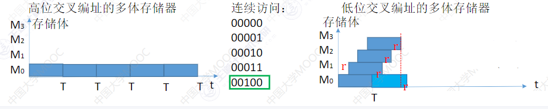
      4. 那么显然万恶的资本家要出来搞事情了。在什么情况下，我们能够充分利用低位交叉编址，实现轮流启动，无缝衔接？
         1. 当$m \lt T/r$时，我们依次对各个存储模块访问一遍后，第一个存储模块还未恢复完。
         2. 当$m \gt T/r$时，我们依次对各个存储模块进行访问一遍后，此时第一个存储模块早已经恢复完毕，此时已经闲置一段时间。
         3.  当$m= T/r$时，我们依次对各个存储模块访问一遍过后，此时恰好第一个存储模块刚好恢复完毕。可以进行下一次的访问。
         4. 此处还是以每个存储体的存取周期为$T$,存取时间为$r$，若$T=4r$​为例： 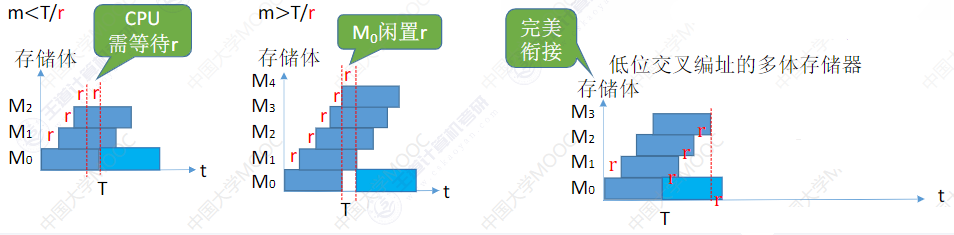
      5. 对于一个给定的地址$x$,如何确定来自哪个存储体，假设共有$m$个存储体，每个存储体含有$n$个存储单元。
         1. 根据地址$x$的体号可知。
         2. 对于低位交叉编址，可以$x\%m$即可。对于高位交叉编址，略。
3. 单体多字存储器：在单体多字系统中，每次能读取$m$​​个存储字，对于顺序存储而言也还不错。但是灵活性不太行。若某些长变量跨行存储，对于单体多字存储器则需要读取两次，而且会读出多余无关数据。此时，低位交叉编址的多体存储器就显得灵活的多。 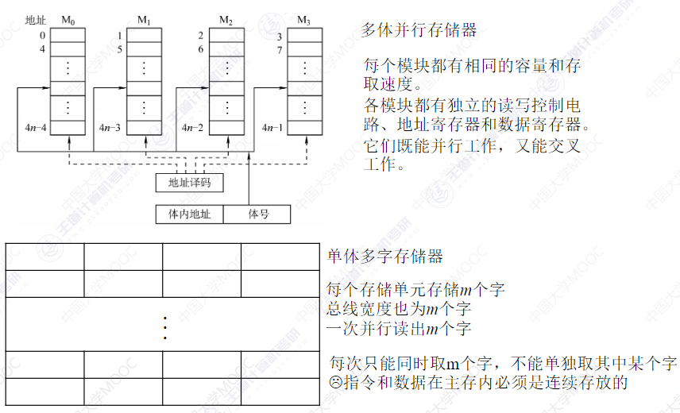
4. 补充：对于电脑的"双通道"模式，其实就是实现低位交叉编址的并行存储器。可以挑选相同主频、相同容量的两根内存条来组成双通道，具体操作就是将这两根内存条插在相同颜色的不相邻位置即可。 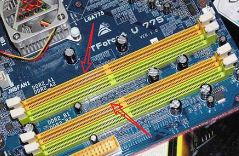

##### 主存储器和CPU的连接

###### 拓展方式

1. 存储芯片的输入输出信号： 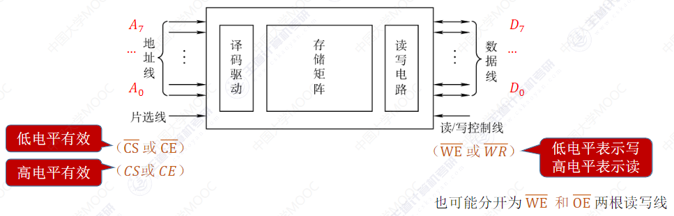
2. 我该如何正视荒诞的世界，我又该如何直视荒唐的自我？
3. 位拓展：增加存储字长。例如下面CPU存在8根数据线，但是我们只有$8k \times 1$位的芯片，我们可以把8个芯片的地址线接到一起，而8条数据线分别接到CPU的8条数据线线上。这样就相当于一个$8k \times 8$的芯片。此时我们会把片选信息全部置高电平，因为此时8个芯片同时工作，无需片选。 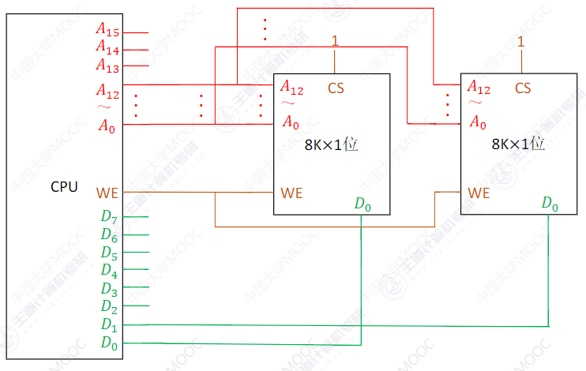  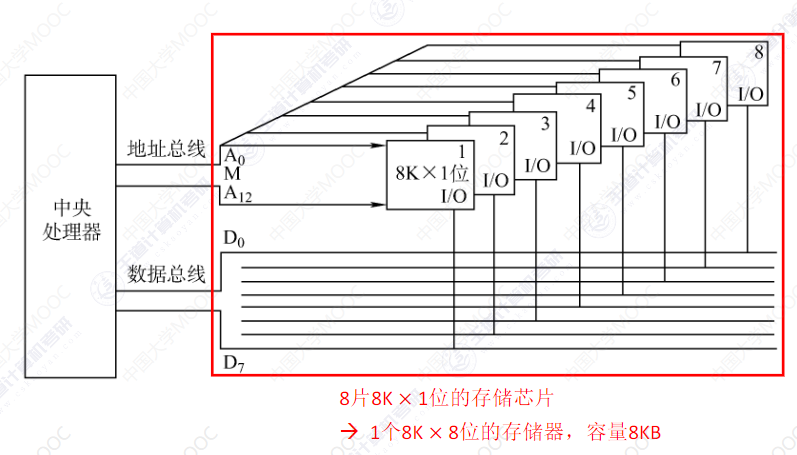
4. 字拓展：增加存储字的数量。例如我们的CPU存在16位地址线，但是我们只有$8k \times 8$的存储芯片。
   1. (X)当我们尝试，将多个芯片(以两个为例)的地址线、数据线都接一起时，显然没有解决问题，并且此时地址会被送到多个芯片中，造成多个芯片同时输出，产生错误。 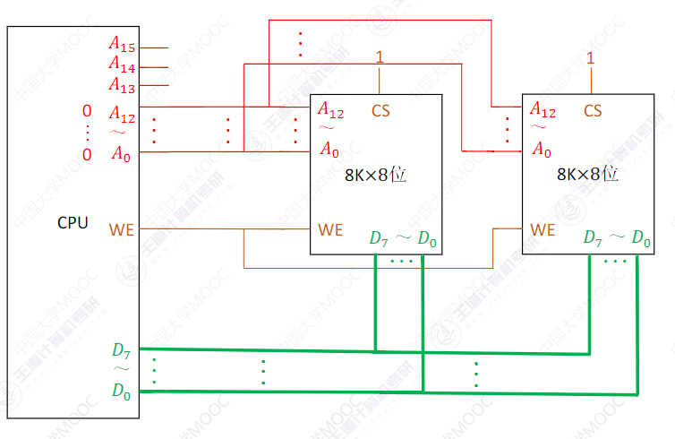
   2. (线选法：电路简单，但是地址不连续)此时我们需要让着多个交替生效，于是乎我们提出$n$个地址线作为$n$个芯片的片选线，但是这样的话，以下图为例，$A_{13}A_{14}$不能同时为高电平1，不然就会多个芯片同时输出导致出错，但同时就造成了主存的地址不连续。 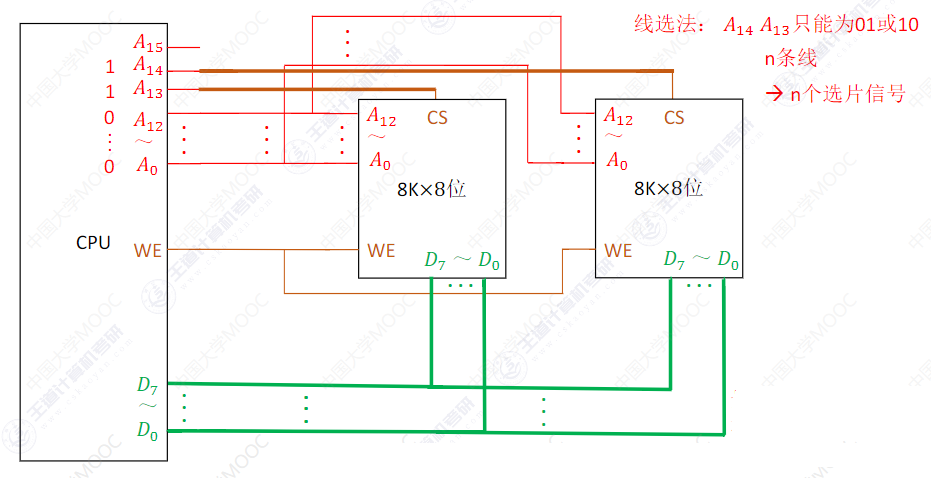
   3. (译码器片选法：电路复杂，但是地址连续)于是我们再次改进电路，采用$n$个地址线来控制$2^n$个芯片不同时输出(而$n$位二进制恰好可以表示$2^n$中信号)。下图中以两个芯片为例，在其中一个芯片的片选上加了一个非门。这样就可以保证两块芯片无法同时生效。这其实就是简单的$1/2$译码器。 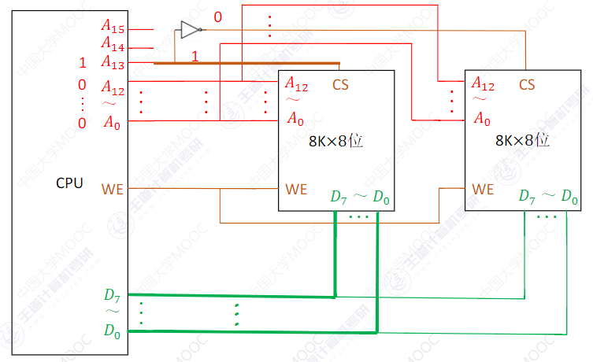 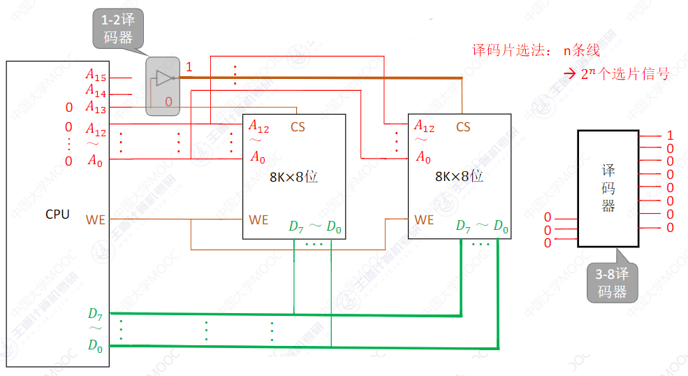
   4. 最终效果图(其实应该选3-8译码器的)： 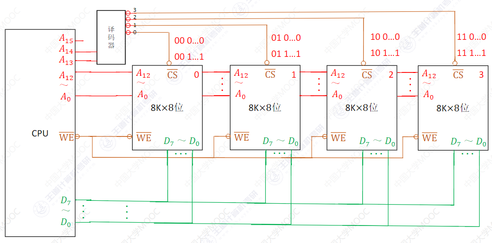  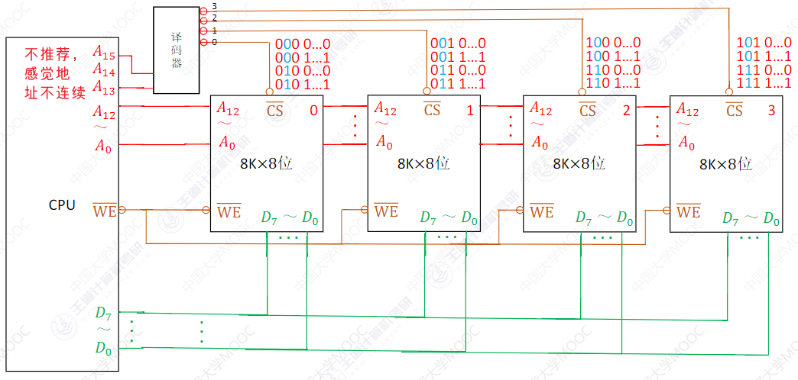
5. 当然，其实还可以字拓展和位拓展同时使用，分析起来肯能略复杂，需要对二者的实现极为熟悉。 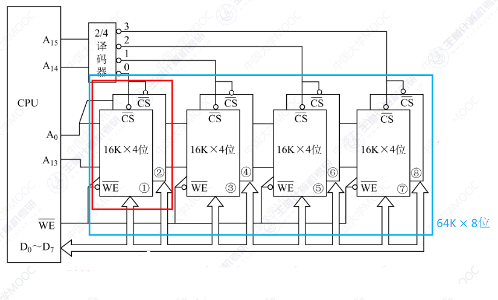

###### 译码器

1. 下图是一个$3-8$译码器，在高电平下有效： 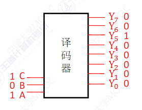
2. 实际上上图的译码器并不完善，下面给出一个低电平有效(带小圆圈、上划线)、EN使能端($enable$)的$3-8$​译码器。 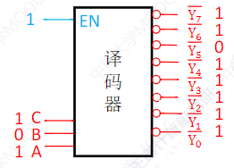
3. 下图是著名的$74ls138$​译码器，带有多个使能端(主要作用是控制译码器是否处于工作状态，都满足时译码器生效)。 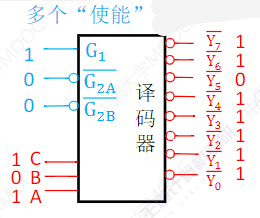
4. CPU可以通过译码器的使能段控制译码器的生效时间。例如前面提到的电信号不稳定，CPU先送出地址信号，待地址信号稳定后，控制译码器生效。 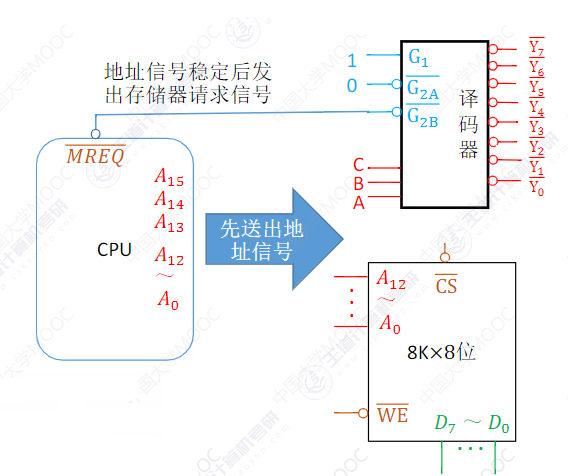

##### 外存

###### 磁盘存储器

1. 外储存器既可以作为输入设备，也可以作为输出设备。
2. 磁盘存储器，通过写线圈使得磁层上的坑洞带上不同磁场，当读数据时，读线圈经过磁场切割磁感线产生电流，根据电流的方向(也可能是有无，暂不清楚)判断读取到的信息。 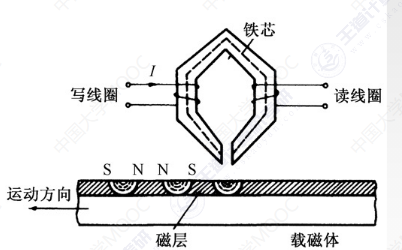
3. 优缺点： 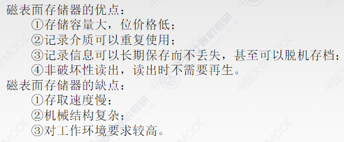
4. 磁盘按块读取，扇区(也称块)是磁盘的读写最小单。
5. 磁盘的性能指标：
   1. 磁盘所有磁道记录的信息量一定是相等的，并不是圆越大信息越多，故而每个磁道的位密度都是不同的。
   2. 容量：有格式化和非格式化之分
      1. 格式化容量：磁盘表面可以利用的磁化单元数。非格式化容量 = 记录面数$\times$ 柱面数 $\times$ 每条磁道的磁化单位数。
      2. 格式化容量：按照某种特定的记录格式所能存储信息的总量。
   3. 记录密度：磁盘单位面积上记录的二进制的信息量。通常有道密度、位密度和面密度。
      1. 道密度是沿磁盘半径方向单位长度上的磁道数；
      2. 位密度是磁道单位长度上能记录的二进制代码位数；
      3. 面密度是位密度和道密度的乘积。
   4. 平均存储时间：见课本 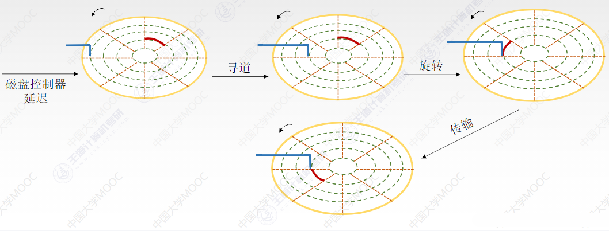
   5. 数据传输率：见课本。
6. 显然，磁盘不同于之前的RAM，磁盘写、读操作是串行的(一般在写入时，需要将数据由并行变为串行；而在读取时，需要将数据由一个个串行变为并行。)，不能在同一时刻同时读写，也无法在同一时刻读或者写两组数据。
7. 磁盘地址结构：见课本
   1. 驱动器号：一台电脑可能存在多个硬盘
   2. 柱面(磁道)号：通过移动磁头臂寻道。
   3. 盘面号：指定激活某个磁头。
   4. 扇区号：通过旋转将特定的扇区划过刺头下方。
8. 磁盘阵列$RAID$：将多个独立的物理磁盘组成一个独立的逻辑盘,数据在多个物理盘上分割交叉存储，并行访问。存在$RAID0$到$RAID5$几种方案$P_{111}$：
   1. 见课本
   2. $RAID0$没有容错能力。
   3. $RAID1$容量减少一半。 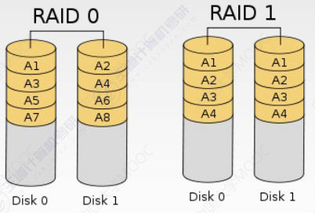

###### 固态硬盘

1. 固态硬盘$SSD$以页为单位进行读写，以块为单位擦除。
2. 读快写慢。
3. $SSD$通过电路控制访问位置，无需向机械硬盘一样移动磁头臂，安静无噪音、读写更快。
4. 基于闪存技术、电可擦除。一个块被擦除次数过多就可能会损坏(机械硬盘的扇区不会因为写次数过多而损坏)。

##### 高速缓存存储器

1. 每次被访问的主存块一定会被立即调入$Cache$中。
2. 主存和$Cache$之间以块为单位进行数据交换。
3. 主存和$Cache$之间的三种映射方式
   1. 全相联映射：$Cache$的存储空间利用充分，命中率高。但是查找效率最慢，可能需要对比所有的标记。
   2. 直接映射：对于任意一个地址只需要对比一次标记。但$Cache$空间利用不充分，命中率低。
   3. 组相联映射：上述两种的折中，综合效果较好。
4. 现代计算机通常采用多级$Cache$，离CPU越近的速度越快，容量越小。离CPU越远的速度越慢，容量越大。 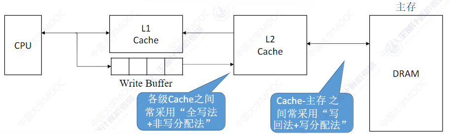
5. $Cache$的一致性问题：见课本。

##### 虚拟存储器

1. 页表一般长久地保存在内存中。
2. 在虚拟存储系统中，指令给出的地址是虚拟地址(无论是指令地址还是数据地址)，当CPU执行指令时，需要先将虚拟地址转为主存中的物理地址，才能获得到主存中的指令和数据。
3. 具体参考：课本和操作系统知识点。
